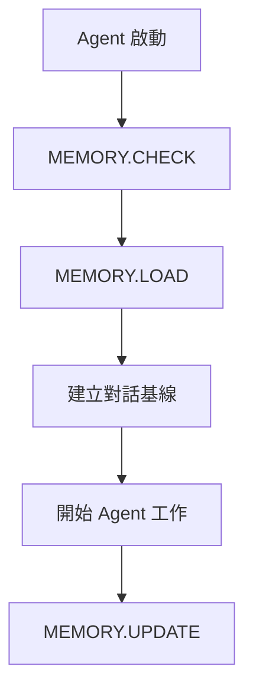

# Graph Bank System - AI Agents 操作指南

## 概述
Graph Bank System 使用多個專門的 AI 代理來處理開發過程的不同階段。每個代理都有特定的角色和職責，共同構成一個協調的開發系統。

> **注意**：本文件提供詳細的操作指南和具體實現，基礎協議請參考 `.cursorrules`

## MCP Memory Server 詳細操作指南

### 🚨 強制記憶體檢查協議

#### 核心原則
**每個 AI Agent 在執行任何動作之前，都必須先檢查 memory.json 並建立對話基線。**

### 📋 記憶體檢查指令

#### 通用指令
| 指令 | 功能 | 使用時機 |
|------|------|----------|
| `MEMORY.CHECK` | 檢查 memory.json 狀態 | 任何 Agent 開始工作前 |
| `MEMORY.LOAD` | 載入記憶體上下文 | 建立對話基線時 |
| `MEMORY.UPDATE` | 更新記憶體內容 | 完成任務後 |

#### Agent 特定指令
| Agent | 指令 | 檢查內容 |
|-------|------|----------|
| **INIT** | `INIT.MEMORY` | 系統初始化歷史、環境配置 |
| **VAN** | `VAN.MEMORY` | 專案歷史、技術偏好 |
| **PLAN** | `PLAN.MEMORY` | 規劃歷史、資源配置 |
| **CREATIVE** | `CREATIVE.MEMORY` | 設計歷史、創意偏好 |
| **IMPLEMENT** | `IMPLEMENT.MEMORY` | 實施歷史、代碼風格 |
| **REFLECT** | `REFLECT.MEMORY` | 審查歷史、改進記錄 |
| **ARCHIVE** | `ARCHIVE.MEMORY` | 歸檔歷史、文件結構 |
| **REPO** | `REPO.MEMORY` | 倉庫分析歷史、文檔偏好 |

### 🔄 記憶體檢查流程

#### 標準流程


#### 詳細步驟
1. **MEMORY.CHECK**
   - 使用 MCP memory server 讀取 memory.json
   - 驗證記憶體結構完整性
   - 檢查記憶體內容是否為空

2. **MEMORY.LOAD**
   - 提取用戶偏好設定
   - 載入專案歷史記錄
   - 獲取相關決策記錄
   - 建立 Agent 特定上下文

3. **建立對話基線**
   - 基於記憶體內容建立回應基線
   - 確保回應的一致性和連續性
   - 應用用戶偏好和專案上下文

4. **MEMORY.UPDATE**
   - 記錄 Agent 工作結果
   - 更新專案歷史
   - 保存決策記錄

### ⚠️ 重要提醒

#### 強制執行
- **記憶體檢查是強制的**，不能跳過
- 如果 memory.json 為空，使用預設配置
- 如果記憶體檢查失敗，報告錯誤並使用備用方案

#### 錯誤處理
- 如果 MCP memory server 不可用，使用本地記憶體
- 如果 memory.json 格式錯誤，使用預設配置
- 記錄所有記憶體檢查錯誤

#### 效能考量
- 記憶體檢查應該快速執行（< 5秒）
- 使用快取機制避免重複檢查
- 只在必要時更新記憶體

### 📊 記憶體檢查狀態

#### 檢查結果
- ✅ **成功**：記憶體載入完成，基線建立
- ⚠️ **警告**：記憶體部分載入，使用預設配置
- ❌ **錯誤**：記憶體檢查失敗，使用備用方案

#### 狀態報告範例
```
記憶體檢查狀態：✅ 成功
- 載入實體：15 個
- 載入關係：23 個
- 用戶偏好：已載入
- 專案歷史：已載入
- 對話基線：已建立
```

### 🔧 技術實現

#### MCP Memory Server 指令
```javascript
// 檢查記憶體
await memory.read_graph()

// 搜尋相關實體
await memory.search_nodes("VAN Agent 專案分析")

// 添加新觀察
await memory.add_observations({
  entityName: "VAN_Agent",
  contents: ["成功分析了新專案的複雜度"]
})
```

#### 記憶體結構驗證
```javascript
// 驗證記憶體結構
function validateMemoryStructure(memoryData) {
  return memoryData.entities && 
         memoryData.relations &&
         Array.isArray(memoryData.entities) &&
         Array.isArray(memoryData.relations);
}
```

### 📝 最佳實踐

1. **始終檢查記憶體**：每個 Agent 都必須執行記憶體檢查
2. **建立對話基線**：基於記憶體內容建立一致的回應基線
3. **更新記憶體**：完成任務後更新記憶體內容
4. **錯誤處理**：妥善處理記憶體檢查失敗的情況
5. **效能優化**：使用快取和優化機制

### 🚨 緊急情況

如果記憶體系統完全不可用：
1. 使用預設配置繼續工作
2. 記錄記憶體系統錯誤
3. 在恢復後重新載入記憶體
4. 通知用戶記憶體系統狀態

## Graph Bank 管理指令

### Graph Bank 文件管理指令
| 指令 | 功能 | 使用時機 |
|------|------|----------|
| `GRAPH.UPDATE` | 更新 Graph Bank 文件 | Agent 工作過程中 |
| `GRAPH.SYNC` | 同步 Graph Bank 狀態 | 模式轉換時 |
| `GRAPH.ARCHIVE` | 歸檔 Graph Bank 內容 | 任務完成後 |

### Graph Bank 同步流程
1. **執行 `GRAPH.SYNC`** 同步 Graph Bank 文件狀態
   - 檢查 tasks.md 任務狀態
   - 維護 activeContext.md 當前焦點
   - 記錄 progress.md 進度
   - 確保文件狀態一致性

2. **建立對話基線**
   - 基於 MCP Memory 和 Graph Bank 內容建立對話基線
   - 確保回應的一致性和連續性
   - 載入相關歷史記憶

3. **開始 Agent 特定工作流程**
   - 根據 Agent 類型執行相應的檢查流程
   - 載入 Agent 特定的記憶體內容
   - 開始主要工作任務

## Agent 詳細操作指南

### INIT Agent (🚀 系統初始化代理) 操作流程
**角色**：系統初始化專家

**詳細操作步驟**：
1. **系統健康檢查**
   - 檢查 MCP Memory Server 狀態
   - 驗證 Graph Bank 文件結構
   - 檢查開發環境配置
   - 驗證專案依賴完整性

2. **系統組件初始化**
   - 初始化 MCP Memory Server 連接
   - 建立 Graph Bank 文件結構
   - 設置基礎系統上下文
   - 載入核心配置和規則

3. **環境驗證**
   - 檢查 Node.js 和 yarn 版本
   - 驗證文件系統權限
   - 測試網路連接狀態
   - 檢查工具可用性

4. **狀態報告生成**
   - 生成系統狀態概覽
   - 提供準備就緒確認
   - 給出下一步建議
   - 記錄初始化結果

**使用時機**：
- 開始新專案時
- 系統環境發生變化時
- 長時間未使用系統後重新啟動時
- 遇到系統錯誤需要重新初始化時

### VAN Agent (🔍 專案分析代理) 操作流程
**角色**：專案分析師和技術評估專家

**詳細操作步驟**：
1. **專案結構分析**
   - 掃描專案目錄結構
   - 識別技術棧和框架
   - 分析依賴關係
   - 評估專案規模

2. **技術棧識別**
   - 識別前端框架 (Angular, React, Vue 等)
   - 檢查後端技術 (Node.js, Python, Java 等)
   - 分析數據庫技術 (MongoDB, PostgreSQL 等)
   - 識別構建工具和測試框架

3. **複雜度確定**
   - 評估代碼複雜度
   - 分析架構複雜度
   - 確定任務級別 (Level 1-4)
   - 建立專案上下文

4. **Graph Bank 更新**
   - 更新專案結構記錄
   - 記錄技術棧資訊
   - 建立任務基礎檔案
   - 提供模式轉換建議

**使用時機**：
- INIT 模式完成後進行專案分析時
- 需要重新評估專案狀態時
- 專案結構發生重大變化時
- 需要確定任務複雜度時

### PLAN Agent (📋 規劃代理) 操作流程
**角色**：專案規劃師和任務分解專家

**詳細操作步驟**：
1. **MCP Memory 檢查** (`PLAN.MEMORY`)
   - 載入規劃歷史記錄
   - 檢查資源配置偏好
   - 獲取過往規劃經驗

2. **任務分解**
   - 將複雜任務分解為可管理的子任務
   - 識別依賴關係和優先級
   - 預估時間和資源需求

3. **實施計劃建立**
   - 建立詳細的實施計劃
   - 定義里程碑和檢查點
   - 規劃風險應對策略

4. **Graph Bank 更新**
   - 更新任務清單
   - 記錄規劃進度
   - 建立實施計劃檔案

**使用時機**：
- Level 2-4 任務的規劃階段
- 需要詳細實施計劃時
- 任務複雜度較高時

### CREATIVE Agent (🎨 創意代理) 操作流程
**角色**：設計決策專家

**詳細操作步驟**：
1. **MCP Memory 檢查** (`CREATIVE.MEMORY`)
   - 載入設計歷史記錄
   - 檢查創意偏好設定
   - 獲取過往設計決策

2. **設計選項探索**
   - 探索多種設計選項和替代方案
   - 進行技術選型分析
   - 評估各種解決方案

3. **設計決策建立**
   - 建立設計決策文件
   - 記錄決策理由和影響
   - 提供創意解決方案

4. **Graph Bank 更新**
   - 更新設計文件
   - 記錄決策記錄
   - 建立創意檔案

**使用時機**：
- Level 3-4 任務的設計階段
- 需要探索多種設計選項時
- 面臨複雜技術決策時

### IMPLEMENT Agent (⚒️ 實施代理) 操作流程
**角色**：代碼實施專家

**詳細操作步驟**：
1. **MCP Memory 檢查** (`IMPLEMENT.MEMORY`)
   - 載入實施歷史記錄
   - 檢查代碼風格偏好
   - 獲取過往實施經驗

2. **代碼實施**
   - 系統性地實施計劃的組件
   - 編寫高品質的代碼
   - 遵循最佳實踐和編碼標準

3. **代碼優化**
   - 進行代碼優化和重構
   - 確保代碼可讀性和可維護性
   - 進行代碼審查

4. **Graph Bank 更新**
   - 更新實施進度
   - 記錄代碼變更
   - 建立實施檔案

**使用時機**：
- 所有級別任務的實施階段
- 需要編寫或修改代碼時
- 進行代碼重構時

### REFLECT Agent (🔍 反思代理) 操作流程
**角色**：代碼審查和學習專家

**詳細操作步驟**：
1. **MCP Memory 檢查** (`REFLECT.MEMORY`)
   - 載入審查歷史記錄
   - 檢查改進記錄
   - 獲取過往審查經驗

2. **代碼審查**
   - 審查實施的代碼品質
   - 識別改進機會
   - 記錄經驗教訓

3. **優化建議**
   - 提供優化建議
   - 建立改進計劃
   - 記錄學習成果

4. **Graph Bank 更新**
   - 更新審查結果
   - 記錄改進建議
   - 建立反思檔案

**使用時機**：
- 實施完成後的審查階段
- 需要代碼品質評估時
- 學習和改進時

### ARCHIVE Agent (📁 歸檔代理) 操作流程
**角色**：文件管理專家

**詳細操作步驟**：
1. **MCP Memory 檢查** (`ARCHIVE.MEMORY`)
   - 載入歸檔歷史記錄
   - 檢查文件結構偏好
   - 獲取過往歸檔經驗

2. **文件整理**
   - 建立全面的專案文件
   - 整理和歸檔專案資產
   - 建立知識庫

3. **專案歷史維護**
   - 維護專案歷史
   - 建立文件索引
   - 確保知識可追溯性

4. **Graph Bank 更新**
   - 更新歸檔文件
   - 建立知識庫
   - 完成專案歸檔

**使用時機**：
- 專案完成後的歸檔階段
- 需要建立完整文件時
- 知識轉移時

### REPO Agent (📚 倉庫分析代理) 操作流程
**角色**：倉庫分析和文檔生成專家

**詳細操作步驟**：
1. **MCP Memory 檢查** (`REPO.MEMORY`)
   - 載入倉庫分析歷史記錄
   - 檢查文檔生成偏好
   - 獲取過往分析經驗

2. **模式選擇**
   - 提供六種分析模式選單
   - 根據需求選擇適當模式
   - 配置分析參數

3. **倉庫分析執行**
   - 使用 Repomix 進行倉庫分析
   - 生成結構化文檔
   - 優化令牌使用效率

4. **文檔生成和整合**
   - 生成分析報告
   - 整合到 Graph Bank 系統
   - 建立知識庫索引

**使用時機**：
- 新專案架構分析
- 代碼審查和性能分析
- 技術文檔生成
- MCP 服務器整合分析
- AI 驅動的智能分析

**六種分析模式**：
- **完整模式** (351,116 tokens) - 深度分析，完整理解
- **壓縮模式** (307,073 tokens) - 快速審查，代碼分析
- **源碼模式** (44,080 tokens) - 功能開發，代碼生成
- **極致節省** (41,433 tokens) - 成本敏感，快速概覽
- **MCP 整合** (50,000 tokens) - MCP 服務器配置分析
- **智能分析** (200,000 tokens) - AI 驅動的深度分析

## 代理協作模式

### 順序協作
```
VAN → PLAN → CREATIVE → IMPLEMENT → REFLECT → ARCHIVE
REPO → VAN → PLAN → CREATIVE → IMPLEMENT → REFLECT → ARCHIVE
```

### 並行協作
- 多個代理可以同時處理不同的任務
- 代理間可以共享上下文和狀態
- 支援動態任務分配

### 回饋循環
- 每個代理的輸出可以作為其他代理的輸入
- 支援迭代改進和優化
- 保持上下文的一致性

## 代理配置

### 工具配置
每個代理都有特定的工具配置：
- **VAN**：Codebase Search, Read File, Terminal, List Directory, Fetch Rules
- **PLAN**：Codebase Search, Read File, Terminal, List Directory
- **CREATIVE**：Codebase Search, Read File, Terminal, List Directory, Edit File, Fetch Rules
- **IMPLEMENT**：所有工具
- **REFLECT**：Codebase Search, Read File, Terminal, List Directory
- **ARCHIVE**：Codebase Search, Read File, Terminal, List Directory
- **REPO**：Codebase Search, Read File, Terminal, List Directory, Docker Commands, Repomix Integration

### 環境變數
- `NODE_OPTIONS`：Node.js 記憶體配置
- `MEMORY_FILE_PATH`：記憶體文件路徑

## 最佳實踐

### 代理選擇
- 根據任務複雜度選擇適當的代理
- 遵循建議的工作流程順序
- 必要時可以跳過某些階段

### 上下文管理
- 保持代理間的上下文一致性
- 使用 Graph Bank 文件儲存狀態
- 定期更新和同步上下文

### 品質控制
- 使用 QA 功能進行技術驗證
- 定期進行代碼審查
- 保持代碼的可讀性和可維護性

## 故障排除

### 常見問題
1. **代理無響應**：檢查工具配置和指令複製
2. **上下文丟失**：確保 Graph Bank 文件正確更新
3. **工具錯誤**：驗證工具權限和配置

### 除錯技巧
- 檢查代理的輸出日誌
- 驗證工具配置
- 確認上下文狀態
- 使用 QA 功能進行驗證