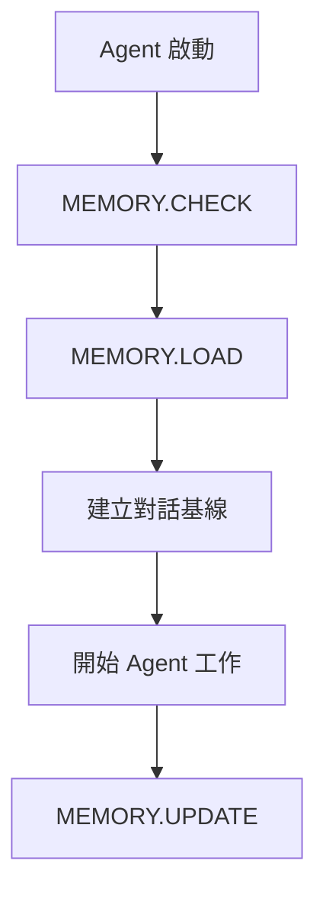

# Memory Bank System - 記憶體檢查指令參考

## 🚨 強制記憶體檢查協議

### 核心原則
**每個 AI Agent 在執行任何動作之前，都必須先檢查 memory.json 並建立對話基線。**

## 📋 記憶體檢查指令

### 通用指令
| 指令 | 功能 | 使用時機 |
|------|------|----------|
| `MEMORY.CHECK` | 檢查 memory.json 狀態 | 任何 Agent 開始工作前 |
| `MEMORY.LOAD` | 載入記憶體上下文 | 建立對話基線時 |
| `MEMORY.UPDATE` | 更新記憶體內容 | 完成任務後 |

### Agent 特定指令
| Agent | 指令 | 檢查內容 |
|-------|------|----------|
| **VAN** | `VAN.MEMORY` | 專案歷史、技術偏好 |
| **PLAN** | `PLAN.MEMORY` | 規劃歷史、資源配置 |
| **CREATIVE** | `CREATIVE.MEMORY` | 設計歷史、創意偏好 |
| **IMPLEMENT** | `IMPLEMENT.MEMORY` | 實施歷史、代碼風格 |
| **REFLECT** | `REFLECT.MEMORY` | 審查歷史、改進記錄 |
| **ARCHIVE** | `ARCHIVE.MEMORY` | 歸檔歷史、文件結構 |

## 🔄 記憶體檢查流程

### 標準流程


### 詳細步驟
1. **MEMORY.CHECK**
   - 使用 MCP memory server 讀取 memory.json
   - 驗證記憶體結構完整性
   - 檢查記憶體內容是否為空

2. **MEMORY.LOAD**
   - 提取用戶偏好設定
   - 載入專案歷史記錄
   - 獲取相關決策記錄
   - 建立 Agent 特定上下文

3. **建立對話基線**
   - 基於記憶體內容建立回應基線
   - 確保回應的一致性和連續性
   - 應用用戶偏好和專案上下文

4. **MEMORY.UPDATE**
   - 記錄 Agent 工作結果
   - 更新專案歷史
   - 保存決策記錄

## 🎯 使用範例

### VAN Agent 啟動
```
用戶: "分析這個專案的複雜度"
AI: "執行 VAN.MEMORY 檢查..."
→ 檢查專案歷史和技術偏好
→ 載入相關上下文
→ 建立 VAN Agent 對話基線
→ 開始專案分析
```

### PLAN Agent 啟動
```
用戶: "為這個功能制定實施計劃"
AI: "執行 PLAN.MEMORY 檢查..."
→ 檢查規劃歷史和資源配置
→ 載入相關上下文
→ 建立 PLAN Agent 對話基線
→ 開始任務規劃
```

## ⚠️ 重要提醒

### 強制執行
- **記憶體檢查是強制的**，不能跳過
- 如果 memory.json 為空，使用預設配置
- 如果記憶體檢查失敗，報告錯誤並使用備用方案

### 錯誤處理
- 如果 MCP memory server 不可用，使用本地記憶體
- 如果 memory.json 格式錯誤，使用預設配置
- 記錄所有記憶體檢查錯誤

### 效能考量
- 記憶體檢查應該快速執行（< 5秒）
- 使用快取機制避免重複檢查
- 只在必要時更新記憶體

## 📊 記憶體檢查狀態

### 檢查結果
- ✅ **成功**：記憶體載入完成，基線建立
- ⚠️ **警告**：記憶體部分載入，使用預設配置
- ❌ **錯誤**：記憶體檢查失敗，使用備用方案

### 狀態報告
```
記憶體檢查狀態：✅ 成功
- 載入實體：15 個
- 載入關係：23 個
- 用戶偏好：已載入
- 專案歷史：已載入
- 對話基線：已建立
```

## 🔧 技術實現

### MCP Memory Server 指令
```javascript
// 檢查記憶體
await memory.read_graph()

// 搜尋相關實體
await memory.search_nodes("VAN Agent 專案分析")

// 添加新觀察
await memory.add_observations({
  entityName: "VAN_Agent",
  contents: ["成功分析了新專案的複雜度"]
})
```

### 記憶體結構驗證
```javascript
// 驗證記憶體結構
function validateMemoryStructure(memoryData) {
  return memoryData.entities && 
         memoryData.relations &&
         Array.isArray(memoryData.entities) &&
         Array.isArray(memoryData.relations);
}
```

## 📝 最佳實踐

1. **始終檢查記憶體**：每個 Agent 都必須執行記憶體檢查
2. **建立對話基線**：基於記憶體內容建立一致的回應基線
3. **更新記憶體**：完成任務後更新記憶體內容
4. **錯誤處理**：妥善處理記憶體檢查失敗的情況
5. **效能優化**：使用快取和優化機制

## 🚨 緊急情況

如果記憶體系統完全不可用：
1. 使用預設配置繼續工作
2. 記錄記憶體系統錯誤
3. 在恢復後重新載入記憶體
4. 通知用戶記憶體系統狀態
