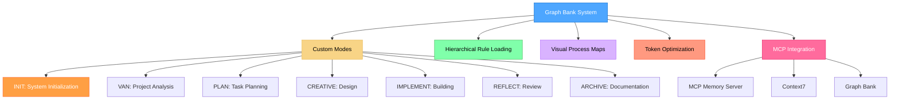
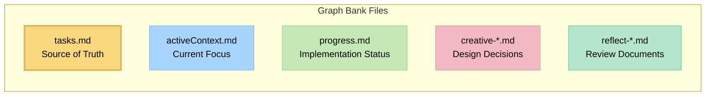

# Graph Bank System v0.8-beta

## A Message from the Creator

Hey everyone! 👋

When I built cursor-memory-bank, it was my personal project to solve a problem I faced daily as a software engineer. With extensive experience in the field, I knew there had to be a better way to harness AI for actual development work.

Your **2,400+ stars** and incredible feedback proved this vision resonated - but also showed me what I was really after wasn't just setup tools. **I wanted working prototypes.**

So I went back to my software engineering roots and built something that delivers on the original promise: **Three-Tier Orchestration Architecture** that uses advanced prompt engineering and specialized agents to handle all the heavy lifting - from natural language request to browser-tested application.

**What cursor-memory-bank started as my personal solution, this completes:**
- Say "implement this PRD.md" → Get complete project breakdown with TaskMaster coordination
- Say "build a user management system with RBAC" → Get 5-tier role hierarchy with 28 permissions
- Say "create an e-commerce platform" → Get product catalog, cart, checkout, and payment integration
- Say "add real-time collaboration features" → Get WebSocket implementation with conflict resolution

Drawing on my engineering experience, the new system addresses major limitations while keeping the same core vision: **AI that actually builds working software.** As we discover new challenges, we add specialized agents to keep evolving the system.

cursor-memory-bank will stay here as the foundation that made this possible. But if you want to see where my engineering journey leads, check out the evolution:

**👉 [Claude Code Sub-Agent Collective](https://github.com/vanzan01/claude-code-sub-agent-collective)**

Thank you for making my personal project a success. The future is even more exciting! 🚀

*- vanzan*

---

A **Memory + Graph** system that integrates MCP Memory Server, Graph Bank, and Context7 for zero-cognition AI agent workflows with hierarchical task management.



> **Personal Note**: Graph Bank is my personal hobby project that I develop for my own use in coding projects. As this is a personal project, I don't maintain an issues tracker or actively collect feedback. However, if you're using these rules and encounter issues, one of the great advantages is that you can ask the Cursor AI directly to modify or update the rules to better suit your specific workflow. The system is designed to be adaptable by the AI, allowing you to customize it for your own needs without requiring external support.

## About Graph Bank

Graph Bank is a personal project that provides a structured approach to development using specialized modes for different phases of the development process. It uses a hierarchical rule loading architecture that loads only the rules needed for each phase, optimizing token usage and providing tailored guidance.

### Memory + Graph Architecture

Version 0.8-beta introduces the **Memory + Graph** architecture that integrates:

- **MCP Memory Server**: Persistent memory management with semantic search
- **Graph Bank**: Structured project documentation and task tracking
- **Context7**: Up-to-date library documentation and code examples
- **Zero-Cognition Design**: AI agents interact with complex systems using simplified commands

### Token-Optimized Architecture

Version 0.8-beta introduces significant token optimization improvements:

- **Hierarchical Rule Loading**: Only loads essential rules initially with specialized lazy-loading
- **Progressive Documentation**: Implements concise templates that scale with task complexity
- **Optimized Mode Transitions**: Preserves critical context efficiently between modes
- **Level-Specific Workflows**: Adapts documentation requirements to task complexity
- **MCP Integration**: Zero-cognition commands for Memory Server and Context7 operations

### Beyond Basic Custom Modes

While Cursor's documentation describes custom modes as primarily standalone configurations with basic prompts and tool selections, Graph Bank significantly extends this concept:

- **Graph-Based Mode Integration**: Modes are interconnected nodes in a development workflow rather than isolated tools
- **Workflow Progression**: Modes are designed to transition from one to another in a logical sequence (INIT → VAN → PLAN → CREATIVE → IMPLEMENT → REFLECT → ARCHIVE)
- **Shared Memory**: Persistent state maintained across mode transitions via Graph Bank files and MCP Memory Server
- **Adaptive Behavior**: Each mode adjusts its recommendations based on project complexity
- **Built-in QA Functions**: QA capabilities can be called from any mode for technical validation
- **Zero-Cognition MCP Integration**: Simplified commands for Memory Server and Context7 operations

This approach transforms custom modes from simple AI personalities into components of a coordinated development system with specialized phases working together.

### CREATIVE Mode and Claude's "Think" Tool

The CREATIVE mode in Graph Bank is conceptually based on Anthropic's Claude "Think" tool methodology, as described in their [engineering blog](https://www.anthropic.com/engineering/claude-think-tool). The v0.7-beta implements an optimized version with:

- Progressive documentation with tabular option comparison
- "Detail-on-demand" approach that preserves token efficiency
- Structured templates that scale with complexity level
- Efficient context preservation for implementation phases

For a detailed explanation of how Graph Bank implements these principles, see the [CREATIVE Mode and Claude's "Think" Tool](creative_mode_think_tool.md) document.

## Key Features

- **Memory + Graph Architecture**: Integrates MCP Memory Server, Graph Bank, and Context7
- **Zero-Cognition Design**: AI agents use simplified commands without understanding underlying MCP implementation
- **Hierarchical Rule Loading**: Load only the essential rules with specialized lazy-loading
- **Progressive Documentation**: Concise templates that scale with task complexity
- **Unified Context Transfer**: Efficient context preservation between modes
- **Mode-Specific Visual Maps**: Clear visual representations for each development phase
- **Level-Specific Workflows**: Adapted processes based on complexity (Levels 1-4)
- **Platform-Aware Commands**: Automatically adapts commands to your operating system
- **INIT Mode**: Unified system initialization and health checks

## Installation Instructions

### Prerequisites

- **Cursor Editor**: Version 0.48 or higher is required.
- **Custom Modes**: Feature must be enabled in Cursor (Settings → Features → Chat → Custom modes).


- **AI Model**: Claude 4 Sonnet or Claude 4 Opus is recommended for best results, especially for CREATIVE mode's "Think" tool methodology.

### Step 1: Get the Files

Simply clone this repository into your project directory:

```
git clone https://github.com/vanzan01/cursor-memory-bank.git
```

#### Alternative (Manual)

After extracting it from the ZIP file, follow the steps below.

- Copy the `.cursor` and `custom_modes` folders to the project directory

Note: other documents are not necessary for memory bank operation, they are explanatory documents. You can copy them to a folder like `memory_bank_documents`.

### Step 2: Setting Up Custom Modes in Cursor

**This is the most critical and challenging part of the setup.** You'll need to manually create seven custom modes in Cursor and copy the instruction content from the provided files:

#### How to Add a Custom Mode in Cursor

1. Open Cursor and click on the mode selector in the chat panel
2. Select "Add custom mode"


3. In the configuration screen:
   - Enter the mode name (you can include emoji icons like 🚀, 🔍, 📋, 🎨, ⚒️ by copy-pasting them at the beginning of the name)
   - Select an icon from Cursor's limited predefined options
   - Add a shortcut (optional)
   - Check the required tools
   - Click on **Advanced options**
   - In the empty text box that appears at the bottom, paste the custom instruction content from the corresponding file

#### Mode Configuration

For each mode, configure as follows (If MCPs are showing, you can keep them on, they probably won't work):

1. **INIT MODE** (System Initialization)
   - **Name**: 🚀 INIT
   - **Tools**: Enable "Codebase Search", "Read File", "Terminal", "List Directory", "Fetch Rules"
   - **Advanced options**: Paste from `.cursor/rules/isolation_rules/Modes/init-mode-detailed.mdc`

2. **VAN MODE** (Project Analysis)
   - **Name**: 🔍 VAN
   - **Tools**: Enable "Codebase Search", "Read File", "Terminal", "List Directory", "Fetch Rules"
   - **Advanced options**: Paste from `.cursor/rules/isolation_rules/Modes/van-mode-detailed.mdc`


 

3. **PLAN MODE** (Task Planning)
   - **Name**: 📋 PLAN
   - **Tools**: Enable "Codebase Search", "Read File", "Terminal", "List Directory"
   - **Advanced options**: Paste from `.cursor/rules/isolation_rules/Modes/plan-mode-detailed.mdc`

4. **CREATIVE MODE** (Design Decisions)
   - **Name**: 🎨 CREATIVE
   - **Tools**: Enable "Codebase Search", "Read File", "Terminal", "List Directory", "Edit File", "Fetch Rules"
   - **Advanced options**: Paste from `.cursor/rules/isolation_rules/Modes/creative-mode-detailed.mdc`

5. **IMPLEMENT MODE** (Code Implementation)
   - **Name**: ⚒️ IMPLEMENT
   - **Tools**: Enable all tools
   - **Advanced options**: Paste from `.cursor/rules/isolation_rules/Modes/implement-mode-detailed.mdc`

6. **REFLECT & ARCHIVE MODE** (Review)
   - **Name**: 🔍 REFLECT or ARCHIVE
   - **Tools**: Enable "Codebase Search", "Read File", "Terminal", "List Directory"
   - **Advanced options**: Paste from `.cursor/rules/isolation_rules/Modes/reflect-archive-mode-detailed.mdc`
   

> **Note**: REFLECT and ARCHIVE instructions are combined in a single file and mode to optimize for Cursor's character and custom mode limits  while maintaining functionality. Thanks to GitHub user @joshmac007 for implementing this optimization.

For additional help on setting up custom modes in Cursor, refer to the [official Cursor documentation on custom modes](https://docs.cursor.com/chat/custom-modes).

### QA Functionality

QA is not a separate custom mode but rather a set of validation functions that can be called from any mode. You can invoke QA capabilities by typing "QA" in any mode when you need to perform technical validation. This approach provides flexibility to conduct verification at any point in the development process.

## Basic Usage

1. **Start with INIT Mode**:
   - Switch to INIT mode in Cursor
   - Type "INIT" to initiate the system initialization process
   - INIT will perform system health checks and prepare the environment

2. **Follow the Workflow Based on Complexity**:
   - **Level 1 tasks**: INIT → VAN → IMPLEMENT
   - **Level 2 tasks**: INIT → VAN → PLAN → IMPLEMENT → REFLECT
   - **Level 3-4 tasks**: INIT → VAN → PLAN → CREATIVE → IMPLEMENT → REFLECT → ARCHIVE
   - **At any point**: Type "QA" to perform technical validation

3. **Mode-Specific Commands**:
   ```
   INIT - System initialization and health checks
   VAN - Analyze project structure and determine complexity
   PLAN - Create detailed implementation plan
   CREATIVE - Explore design options for complex components
   IMPLEMENT - Systematically build planned components
   REFLECT - Review and document lessons learned
   ARCHIVE - Create comprehensive documentation
   QA - Validate technical implementation (can be called from any mode)
   ```

4. **Starting to work with your project**:
   
After successfully installing Graph Bank...

## Core Files and Their Purposes



- **tasks.md**: Central source of truth for task tracking
- **activeContext.md**: Maintains focus of current development phase
- **progress.md**: Tracks implementation status
- **creative-*.md**: Design decision documents generated during CREATIVE mode
- **reflect-*.md**: Review documents created during REFLECT mode

## Troubleshooting

### Common Issues

1. **Mode not responding correctly**:
   - Verify custom instructions were copied completely (this is the most common issue)
   - Ensure the correct tools are enabled for each mode
   - Check that you've switched to the correct mode before issuing commands
   - Make sure you pasted the instructions in the "Advanced options" text box

2. **Rules not loading**:
   - Make sure the `.cursor/rules/isolation_rules/` directory is in the correct location
   - Verify file permissions allow reading the rule files

3. **Command execution issues**:
   - Ensure you're running commands from the correct directory
   - Verify platform-specific commands are being used correctly

### Ongoing Development

The Graph Bank system is actively being developed and improved. Key points to understand:

- **Work in Progress**: This is a beta version with ongoing development. Expect regular updates, optimizations, and new features.
- **Feature Optimization**: The modular architecture enables continuous refinement without breaking existing functionality.
- **Previous Version Available**: If you prefer the stability of the previous version (v0.1-legacy), you can continue using it while this version matures.
- **Architectural Benefits**: Before deciding which version to use, please read the [Graph Bank Upgrade Guide](memory_bank_upgrade_guide.md) to understand the significant benefits of the new architecture.

## Release Notes

### Version 0.8-beta - Memory + Graph Architecture

> Building upon the architectural foundations established in v0.7-beta, this release introduces the **Memory + Graph** architecture with MCP integration, unified system initialization, and enhanced workflow capabilities.

#### 🌟 Major Features

**Memory + Graph Architecture _(New)_**
- **MCP Memory Server Integration**: Persistent memory management with semantic search
- **Graph Bank Enhancement**: Structured project documentation and task tracking
- **Context7 Integration**: Up-to-date library documentation and code examples
- **Zero-Cognition Design**: AI agents interact with complex systems using simplified commands

**INIT Mode _(New)_**
- Unified system initialization and health checks
- MCP Memory Server status verification
- Graph Bank file structure validation
- Development environment configuration checks
- Project dependency integrity verification
- System component initialization
- Status report generation

**Enhanced Workflow System _(Enhanced)_**
- **New Workflow**: INIT → VAN → PLAN → CREATIVE → IMPLEMENT → REFLECT → ARCHIVE
- **Level 1 tasks**: INIT → VAN → IMPLEMENT
- **Level 2 tasks**: INIT → VAN → PLAN → IMPLEMENT → REFLECT
- **Level 3-4 tasks**: INIT → VAN → PLAN → CREATIVE → IMPLEMENT → REFLECT → ARCHIVE

#### 🔄 Process Improvements

**MCP Integration Architecture**
- **Zero-Cognition Commands**: Simplified interface for Memory Server and Context7 operations
- **Command Mapping**: Abstract commands mapped to specific MCP tool calls
- **Memory Management**: Persistent cross-session memory with semantic search
- **Documentation Access**: Real-time library documentation and code examples

**Mode-Based Optimization**
- **INIT Mode**: Unified system initialization and health checks
- **VAN Mode**: Focused project analysis without system initialization overhead
- **PLAN Mode**: Complexity-appropriate planning templates
- **CREATIVE Mode**: Progressive documentation with tabular comparisons
- **IMPLEMENT Mode**: Streamlined implementation guidance
- **REFLECT Mode**: Context-aware review mechanisms
- **ARCHIVE Mode**: Efficient knowledge preservation

**Enhanced Workflow Optimization**
- **Separation of Concerns**: Clear separation between system initialization and project analysis
- **Unified Entry Point**: All workflows start with INIT mode
- **Intelligent Level Transition**: Automatic complexity assessment and workflow selection
- **Enhanced Task Tracking**: Improved Graph Bank integration and MCP Memory Server coordination

#### 📚 Documentation Enhancements
- **INIT Mode Documentation**: Comprehensive system initialization guides
- **MCP Integration Guides**: Zero-cognition command references
- **Enhanced Mode Instructions**: Detailed workflows for each mode
- **Level-specific Documentation Templates**: Adapted to task complexity
- **Progressive Disclosure Model**: Efficient documentation scaling
- **Standardized Comparison Formats**: Improved design decision documentation

#### 🛠 Technical Improvements
- **MCP Server Integration**: Memory Server and Context7 integration
- **Command Mapping System**: Abstract to concrete command translation
- **Enhanced Rule Architecture**: Improved rule loading and management
- **Context Compression**: Optimized memory bank file management
- **Adaptive Rule Partitioning**: Targeted rule loading based on context
- **File Structure Migration**: Moved from `custom_modes/` to `.cursor/rules/isolation_rules/Modes/`

#### 🔜 Upcoming Features
- Enhanced MCP Memory Server features
- Advanced Context7 integration
- Dynamic template generation based on task characteristics
- Automatic context summarization for long-running tasks
- Cross-task knowledge preservation
- Partial rule loading within specialized rule files
- Advanced MCP workflow adherence mechanisms

#### 📝 Notes
- This release builds upon v0.7-beta's architectural foundation
- Introduces Memory + Graph architecture with MCP integration
- Adds INIT mode for unified system initialization
- Migrates mode files to `.cursor/rules/isolation_rules/Modes/` directory
- No manual migration required for existing installations

#### 🔧 Requirements
- Requires Cursor version 0.48 or higher
- Compatible with Claude 4 Sonnet (recommended) and newer models
- Compatible with all existing Graph Bank v0.7-beta installations
- MCP Memory Server and Context7 integration (optional but recommended)

#### 📈 Optimization Approaches
- **MCP Integration**: Zero-cognition commands with abstract-to-concrete mapping
- **INIT Mode**: Unified system initialization and health checks
- **Memory Management**: Persistent cross-session memory with semantic search
- **Documentation Access**: Real-time library documentation and code examples
- **Rule Loading**: Hierarchical loading with core caching and specialized lazy-loading
- **Creative Phase**: Progressive documentation with tabular comparisons
- **Mode Transitions**: Unified context transfer with selective preservation
- **Graph Bank**: Differential updates and context compression

---

Released on: January 15, 2025

## Terminology Guide

### 📋 Terminology Standards

This guide ensures consistent terminology usage throughout the Graph Bank System.

#### 🔄 Graph Bank Related Terms

**Purpose**: Refer to the project's internal memory management system

**Terms**:
- **Graph Bank System** - System's English name
- **記憶銀行系統** - System's Chinese name (project name)
- **Graph Bank** - Short form
- **graph-bank** - Directory name
- **Graph Bank Files** - Files within the system

**Usage Scenarios**:
- System architecture descriptions
- File titles
- Feature descriptions
- Workflow descriptions

#### ✅ Memory Related Terms

**Purpose**: Refer to MCP memory server and related functions

**Terms**:
- **memory.json** - MCP memory server file
- **MEMORY.CHECK** - MCP memory check command
- **MEMORY.LOAD** - MCP memory load command
- **MEMORY.UPDATE** - MCP memory update command
- **記憶體初始化協議** - MCP memory initialization
- **記憶體檢查指令** - MCP memory check
- **記憶體上下文載入** - MCP memory context
- **MEMORY_FILE_PATH** - MCP memory configuration

**Usage Scenarios**:
- MCP memory server configuration
- Agent memory check processes
- Memory initialization protocols
- Technical implementation details

#### 🔒 Unchanged Terms

**Project Names and Directories**:
- **cursor-memory-bank** - Project directory name
- **記憶銀行系統** - Project's Chinese name

### 📝 Usage Examples

#### ✅ Correct Usage

```markdown
# Graph Bank System - AI Agents Guide

## Overview
Graph Bank System uses specialized AI agents to handle different phases of development.

## Agent Memory Check Commands
Each Agent must perform memory checks before starting work:

### General Commands
- `MEMORY.CHECK` - Check memory.json status
- `MEMORY.LOAD` - Load memory context
- `MEMORY.UPDATE` - Update memory content
```

#### ❌ Incorrect Usage

```markdown
# Memory Bank System - AI Agents Guide  ❌ Wrong

## Overview
Memory Bank System uses specialized AI agents...  ❌ Wrong

## Agent Memory Check Commands
Each Agent must perform memory checks before starting work:

### General Commands
- `GRAPH.CHECK` - Check graph-bank status  ❌ Wrong
- `GRAPH.LOAD` - Load Graph Bank context  ❌ Wrong
```

### 🔍 Checklist

When writing or modifying files, please check:

#### Graph Bank Terminology Check
- [ ] System name uses "Graph Bank System"
- [ ] Feature descriptions use "Graph Bank"
- [ ] File titles use correct terminology
- [ ] Workflow descriptions use correct terminology

#### Memory Terminology Check
- [ ] MCP memory server related uses "memory"
- [ ] Agent commands use "MEMORY.*"
- [ ] Memory check processes use correct terminology
- [ ] Technical implementation details use correct terminology

#### Project Name Check
- [ ] Project directory name remains "cursor-memory-bank"
- [ ] Project Chinese name remains "記憶銀行系統"
- [ ] Don't confuse project name with system name

### 🚨 Common Errors

#### Error 1: Confusing System Names
```markdown
❌ Memory Bank System uses Graph Bank files
✅ Graph Bank System uses Graph Bank files
```

#### Error 2: Confusing MCP memory and Graph Bank
```markdown
❌ Use GRAPH.CHECK to check memory.json
✅ Use MEMORY.CHECK to check memory.json
```

#### Error 3: Wrong Terminology Combinations
```markdown
❌ Memory Bank uses MEMORY.CHECK commands
✅ Graph Bank System uses MEMORY.CHECK commands
```

## Resources

- [Graph Bank Optimizations](MEMORY_BANK_OPTIMIZATIONS.md) - Detailed overview of token efficiency improvements
- [Cursor Custom Modes Documentation](https://docs.cursor.com/chat/custom-modes)
- [Graph Bank Upgrade Guide](memory_bank_upgrade_guide.md)
- [CREATIVE Mode and Claude's "Think" Tool](creative_mode_think_tool.md)
- Mode-specific instruction files in the `.cursor/rules/isolation_rules/Modes/` directory

---

*Note: This README is for v0.8-beta and subject to change as the system evolves.*
