This file is a merged representation of the entire codebase, combined into a single document by Repomix.
The content has been processed where content has been compressed (code blocks are separated by ⋮---- delimiter).

# File Summary

## Purpose
This file contains a packed representation of the entire repository's contents.
It is designed to be easily consumable by AI systems for analysis, code review,
or other automated processes.

## File Format
The content is organized as follows:
1. This summary section
2. Repository information
3. Directory structure
4. Repository files (if enabled)
5. Multiple file entries, each consisting of:
  a. A header with the file path (## File: path/to/file)
  b. The full contents of the file in a code block

## Usage Guidelines
- This file should be treated as read-only. Any changes should be made to the
  original repository files, not this packed version.
- When processing this file, use the file path to distinguish
  between different files in the repository.
- Be aware that this file may contain sensitive information. Handle it with
  the same level of security as you would the original repository.

## Notes
- Some files may have been excluded based on .gitignore rules and Repomix's configuration
- Binary files are not included in this packed representation. Please refer to the Repository Structure section for a complete list of file paths, including binary files
- Files matching patterns in .gitignore are excluded
- Files matching default ignore patterns are excluded
- Content has been compressed - code blocks are separated by ⋮---- delimiter
- Files are sorted by Git change count (files with more changes are at the bottom)

# Directory Structure
```
.cursor/
  rules/
    isolation_rules/
      Core/
        command-execution.mdc
        complexity-decision-tree.mdc
        creative-phase-enforcement.mdc
        creative-phase-metrics.mdc
        file-verification.mdc
        graph-bank-paths.mdc
        hierarchical-rule-loading.mdc
        mcp-command-mapping.mdc
        mcp-context7.mdc
        mcp-graph-bank-integration.mdc
        mcp-memory-server.mdc
        mode-transition-optimization.mdc
        modern-angular-guidelines.mdc
        optimization-integration.mdc
        platform-awareness.mdc
      Level1/
        optimized-workflow-level1.mdc
        quick-documentation.mdc
        workflow-level1.mdc
      Level2/
        archive-basic.mdc
        reflection-basic.mdc
        task-tracking-basic.mdc
        workflow-level2.mdc
      Level3/
        archive-intermediate.mdc
        implementation-intermediate.mdc
        planning-comprehensive.mdc
        reflection-intermediate.mdc
        task-tracking-intermediate.mdc
        workflow-level3.mdc
      Level4/
        architectural-planning.mdc
        archive-comprehensive.mdc
        phased-implementation.mdc
        reflection-comprehensive.mdc
        task-tracking-advanced.mdc
        workflow-level4.mdc
      Modes/
        creative-mode-detailed.mdc
        implement-mode-detailed.mdc
        init-mode-detailed.mdc
        plan-mode-detailed.mdc
        reflect-archive-mode-detailed.mdc
        repo-mode-detailed.mdc
        van-mode-detailed.mdc
      Phases/
        CreativePhase/
          creative-phase-architecture.mdc
          creative-phase-uiux.mdc
          optimized-creative-template.mdc
      visual-maps/
        van_mode_split/
          van-qa-checks/
            build-test.mdc
            config-check.mdc
            dependency-check.mdc
            environment-check.mdc
            file-verification.mdc
          van-qa-utils/
            common-fixes.mdc
            mode-transitions.mdc
            reports.mdc
            rule-calling-guide.mdc
            rule-calling-help.mdc
          van-complexity-determination.mdc
          van-file-verification.mdc
          van-mode-map.mdc
          van-platform-detection.mdc
          van-qa-main.mdc
          van-qa-validation.md.old
        archive-mode-map.mdc
        creative-mode-map.mdc
        implement-mode-map.mdc
        plan-mode-map.mdc
        qa-mode-map.mdc
        reflect-mode-map.mdc
        van-mode-map.mdc
      main-optimized.mdc
      main.mdc
  mcp.json
angular/
  public/
    favicon.copy.ico
    favicon.ico
  src/
    app/
      core/
        guards/
          permission.guard.ts
        models/
          auth.model.ts
        services/
          auth.service.ts
          organization.service.ts
          permission.service.ts
          repository.service.ts
        utils/
          avatar.utils.ts
          validation.utils.ts
      dashboard/
        admin.component.ts
        dashboard.component.ts
        editor.component.ts
        viewer.component.ts
      features/
        organization/
          components/
            organization-card.component.ts
            organization-roles.component.ts
            security-manager.component.ts
            team-management.component.ts
          models/
            github-aligned-organization.model.ts
          routes/
            organization.routes.ts
          services/
            github-aligned-api.service.ts
            permission-calculation.service.ts
          index.ts
        repository/
          components/
            collaborator-management.component.ts
            repository-detail.component.ts
            repository-list.component.ts
          models/
            repository.model.ts
          routes/
            repository.routes.ts
        user/
          auth/
            auth.guard.ts
            auth.service.ts
            index.ts
            login.component.ts
            role.guard.ts
            signup.component.ts
            unauthorized.component.ts
          profile/
            profile-management.component.ts
          index.ts
          user.model.ts
          user.routes.ts
          user.service.ts
      landing/
        landing.component.ts
      app.config.ts
      app.html
      app.routes.ts
      app.scss
      app.spec.ts
      app.ts
    environments/
      environment.prod.ts
      environment.sample.ts
    index.html
    main.ts
    styles.scss
  .editorconfig
  .gitignore
  angular.json
  firebase.json
  package.json
  README.md
  tsconfig.app.json
  tsconfig.json
  tsconfig.spec.json
docs/
  account.md
  DEVELOPMENT_GUIDE.md
  PROJECT_STRUCTURE.md
  SYSTEM_ARCHITECTURE.md
  TREE.md
graph-bank/
  activeContext.md
  plan-github-account-architecture.md
  plan-qa-final-report.md
  plan-qa-quality-check-report.md
  productContext.md
  progress.md
  projectbrief.md
  qa-task-logic-validation-report.md
  systemPatterns.md
  tasks.md
  techContext.md
.cursorrules
.gitignore
AGENTS.md
memory.json
README.md
repomix-dev-workflow.md
SYSTEM_ARCHITECTURE.md
TREE.md
```

# Files

## File: .cursor/rules/isolation_rules/Core/complexity-decision-tree.mdc
`````
---
description: complexity decision tree
globs: complexity-decision-tree.mdc
alwaysApply: false
---
# TASK COMPLEXITY DETERMINATION

> **TL;DR:** This document helps determine the appropriate complexity level (1-4) for any task. Use the decision tree and indicators to select the right process level, then load the corresponding process map.

## 🌳 COMPLEXITY DECISION TREE

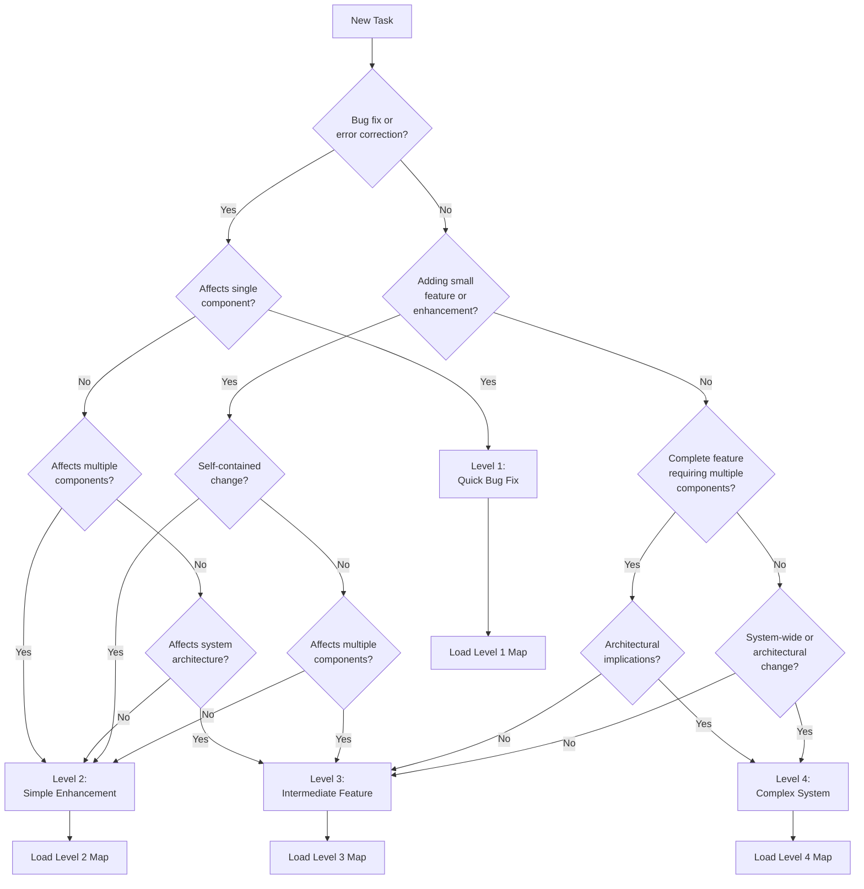

## 📊 COMPLEXITY LEVEL INDICATORS

Use these indicators to help determine task complexity:

### Level 1: Quick Bug Fix
- **Keywords**: "fix", "broken", "not working", "issue", "bug", "error", "crash"
- **Scope**: Single component or UI element
- **Duration**: Can be completed quickly (minutes to hours)
- **Risk**: Low, isolated changes
- **Examples**:
  - Fix button not working
  - Correct styling issue
  - Fix validation error
  - Resolve broken link
  - Fix typo or text issue

### Level 2: Simple Enhancement
- **Keywords**: "add", "improve", "update", "change", "enhance", "modify"
- **Scope**: Single component or subsystem
- **Duration**: Hours to 1-2 days
- **Risk**: Moderate, contained to specific area
- **Examples**:
  - Add form field
  - Improve validation
  - Update styling
  - Add simple feature
  - Change text content
  - Enhance existing component

### Level 3: Intermediate Feature
- **Keywords**: "implement", "create", "develop", "build", "feature"
- **Scope**: Multiple components, complete feature
- **Duration**: Days to 1-2 weeks
- **Risk**: Significant, affects multiple areas
- **Examples**:
  - Implement user authentication
  - Create dashboard
  - Develop search functionality
  - Build user profile system
  - Implement data visualization
  - Create complex form system

### Level 4: Complex System
- **Keywords**: "system", "architecture", "redesign", "integration", "framework"
- **Scope**: Multiple subsystems or entire application
- **Duration**: Weeks to months
- **Risk**: High, architectural implications
- **Examples**:
  - Implement authentication system
  - Build payment processing framework
  - Create microservice architecture
  - Implement database migration system
  - Develop real-time communication system
  - Create multi-tenant architecture

## 🔍 COMPLEXITY ASSESSMENT QUESTIONS

Answer these questions to determine complexity:

1. **Scope Impact**
   - Does it affect a single component or multiple?
   - Are there system-wide implications?
   - How many files will need to be modified?

2. **Design Decisions**
   - Are complex design decisions required?
   - Will it require creative phases for design?
   - Are there architectural considerations?

3. **Risk Assessment**
   - What happens if it fails?
   - Are there security implications?
   - Will it affect critical functionality?

4. **Implementation Effort**
   - How long will it take to implement?
   - Does it require specialized knowledge?
   - Is extensive testing needed?

## 📊 KEYWORD ANALYSIS TABLE

| Keyword | Likely Level | Notes |
|---------|--------------|-------|
| "Fix" | Level 1 | Unless system-wide |
| "Bug" | Level 1 | Unless multiple components |
| "Error" | Level 1 | Unless architectural |
| "Add" | Level 2 | Unless complex feature |
| "Update" | Level 2 | Unless architectural |
| "Improve" | Level 2 | Unless system-wide |
| "Implement" | Level 3 | Complex components |
| "Create" | Level 3 | New functionality |
| "Develop" | Level 3 | Significant scope |
| "System" | Level 4 | Architectural implications |
| "Architecture" | Level 4 | Major structural changes |
| "Framework" | Level 4 | Core infrastructure |

## 🔄 COMPLEXITY ESCALATION

If during a task you discover it's more complex than initially determined:

```
⚠️ TASK ESCALATION NEEDED
Current Level: Level [X]
Recommended Level: Level [Y]
Reason: [Brief explanation]

Would you like me to escalate this task to Level [Y]?
```

If approved, switch to the appropriate higher-level process map.

## 🎯 PROCESS SELECTION

After determining complexity, load the appropriate process map:

| Level | Description | Process Map |
|-------|-------------|-------------|
| 1 | Quick Bug Fix | [Level 1 Map](mdc:.cursor/rules/visual-maps/level1-map.mdc) |
| 2 | Simple Enhancement | [Level 2 Map](mdc:.cursor/rules/visual-maps/level2-map.mdc) |
| 3 | Intermediate Feature | [Level 3 Map](mdc:.cursor/rules/visual-maps/level3-map.mdc) |
| 4 | Complex System | [Level 4 Map](mdc:.cursor/rules/visual-maps/level4-map.mdc) |

## 📝 COMPLEXITY DETERMINATION TEMPLATE

Use this template to document complexity determination:

```
## COMPLEXITY DETERMINATION

Task: [Task description]

Assessment:
- Scope: [Single component/Multiple components/System-wide]
- Design decisions: [Simple/Moderate/Complex]
- Risk: [Low/Moderate/High]
- Implementation effort: [Low/Moderate/High]

Keywords identified: [List relevant keywords]

Determination: Level [1/2/3/4] - [Quick Bug Fix/Simple Enhancement/Intermediate Feature/Complex System]

Loading process map: [Level X Map]
```
`````

## File: .cursor/rules/isolation_rules/Core/hierarchical-rule-loading.mdc
`````
---
description: Hierarchical rule loading system for optimized token usage
globs: "**/rule-loading*/**", "**/optimization*/**"
alwaysApply: false
---

# HIERARCHICAL RULE LOADING SYSTEM

> **TL;DR:** This rule implements an optimized loading system that only loads necessary rules based on context, complexity level, and current phase to maximize token efficiency.

## 🧠 HIERARCHICAL RULE STRUCTURE

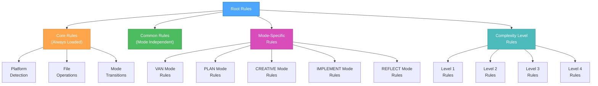

## 📊 RULE LOADING PROTOCOL

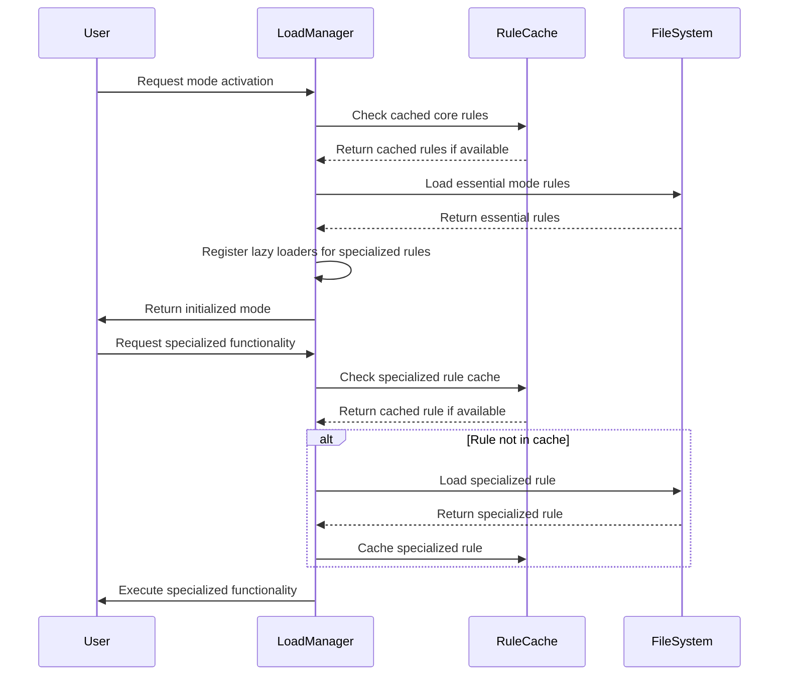

## 🔄 RULE LOADING IMPLEMENTATION

```javascript
// Pseudocode for hierarchical rule loading
class RuleLoadManager {
  constructor() {
    this.cache = {
      core: {},
      common: {},
      mode: {},
      level: {}
    };
    this.lazyLoaders = {};
  }
  
  // Initialize a mode with only essential rules
  initializeMode(modeName, complexityLevel) {
    // Always load core rules
    this.loadCoreRules();
    
    // Load common rules
    this.loadCommonRules();
    
    // Load essential mode-specific rules
    this.loadEssentialModeRules(modeName);
    
    // Load complexity level rules
    this.loadComplexityRules(complexityLevel);
    
    // Register lazy loaders for specialized functionality
    this.registerLazyLoaders(modeName, complexityLevel);
    
    return {
      modeName,
      complexityLevel,
      status: "initialized"
    };
  }
  
  // Load only when specialized functionality is needed
  loadSpecializedRule(ruleType) {
    if (this.lazyLoaders[ruleType]) {
      if (!this.cache.specialized[ruleType]) {
        const rule = this.lazyLoaders[ruleType]();
        this.cache.specialized[ruleType] = rule;
      }
      return this.cache.specialized[ruleType];
    }
    return null;
  }
  
  // Register specialized rule loaders based on mode and complexity
  registerLazyLoaders(modeName, complexityLevel) {
    // Clear existing lazy loaders
    this.lazyLoaders = {};
    
    // Register mode-specific lazy loaders
    if (modeName === "CREATIVE") {
      this.lazyLoaders["architecture"] = () => this.loadRule("creative-phase-architecture.mdc");
      this.lazyLoaders["algorithm"] = () => this.loadRule("creative-phase-algorithm.mdc");
      this.lazyLoaders["uiux"] = () => this.loadRule("creative-phase-uiux.mdc");
    } else if (modeName === "IMPLEMENT") {
      this.lazyLoaders["testing"] = () => this.loadRule("implementation-testing.mdc");
      this.lazyLoaders["deployment"] = () => this.loadRule("implementation-deployment.mdc");
    }
    
    // Register complexity-specific lazy loaders
    if (complexityLevel >= 3) {
      this.lazyLoaders["comprehensive-planning"] = () => this.loadRule("planning-comprehensive.mdc");
      this.lazyLoaders["advanced-verification"] = () => this.loadRule("verification-advanced.mdc");
    }
  }
}
```

## 📋 RULE DEPENDENCY MAP

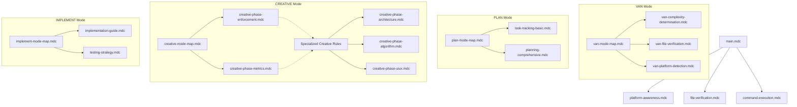

## 🔍 MODE-SPECIFIC RULE LOADING

### VAN Mode Essential Rules
```markdown
- main.mdc (Core)
- platform-awareness.mdc (Core)
- file-verification.mdc (Core)
- van-mode-map.mdc (Mode)
```

### PLAN Mode Essential Rules
```markdown
- main.mdc (Core)
- plan-mode-map.mdc (Mode)
- task-tracking-[complexity].mdc (Level)
```

### CREATIVE Mode Essential Rules
```markdown
- main.mdc (Core)
- creative-mode-map.mdc (Mode)
- creative-phase-enforcement.mdc (Mode)
```

### CREATIVE Mode Specialized Rules (Lazy Loaded)
```markdown
- creative-phase-architecture.mdc (Specialized)
- creative-phase-algorithm.mdc (Specialized)
- creative-phase-uiux.mdc (Specialized)
```

### IMPLEMENT Mode Essential Rules
```markdown
- main.mdc (Core)
- command-execution.mdc (Core)
- implement-mode-map.mdc (Mode)
```

## 🚀 IMPLEMENTATION BENEFITS

The hierarchical loading system provides:

1. **Reduced Initial Loading**: Only essential rules loaded at start (~70% token reduction)
2. **Cached Core Rules**: Rules shared between modes are cached
3. **Specialized Rule Loading**: Specialized rules loaded only when needed
4. **Complexity-Based Loading**: Only load rules appropriate for task complexity

## 📈 TOKEN USAGE COMPARISON

| Approach | Initial Tokens | Specialized Tokens | Total Tokens |
|----------|---------------|-------------------|--------------|
| Original System | ~70,000 | Included in initial | ~70,000 |
| Hierarchical System | ~15,000 | ~10,000 (on demand) | ~25,000 |
| **Token Reduction** | **~55,000 (78%)** | **N/A** | **~45,000 (64%)** |

## 🔄 USAGE EXAMPLE

### Example: Creative Phase with Architecture Rule

```javascript
// Initialize the CREATIVE mode with only essential rules
const mode = ruleManager.initializeMode("CREATIVE", 3);

// Core and essential mode rules are loaded 
// Architecture rules are NOT loaded yet

// Later, when architecture design is needed:
const architectureRule = ruleManager.loadSpecializedRule("architecture");

// Now the architecture rule is loaded and cached
```

## 🧪 RULE LOADING VERIFICATION

To ensure the rule loading system is working optimally:

```markdown
## Rule Loading Verification

- Core Rules: [Loaded]
- Mode-Essential Rules: [Loaded]
- Complexity-Level Rules: [Loaded]
- Specialized Rules: [Not Loaded]

Current Token Usage: [X] tokens
Potential Token Savings: [Y] tokens
```

This hierarchical approach ensures optimal token usage while maintaining all functionality.
`````

## File: .cursor/rules/isolation_rules/Phases/CreativePhase/creative-phase-architecture.mdc
`````
---
description: creative phase architecture
globs: creative-phase-architecture.md
alwaysApply: false
---

# CREATIVE PHASE: ARCHITECTURE DESIGN

> **TL;DR:** This document provides structured guidance for architectural design decisions during creative phases, ensuring comprehensive evaluation of options and clear documentation of architectural choices.

## 🏗️ ARCHITECTURE DESIGN WORKFLOW

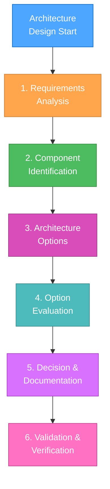

## 📋 ARCHITECTURE DECISION TEMPLATE

```markdown
# Architecture Decision Record

## Context
- System Requirements:
  - [Requirement 1]
  - [Requirement 2]
- Technical Constraints:
  - [Constraint 1]
  - [Constraint 2]

## Component Analysis
- Core Components:
  - [Component 1]: [Purpose/Role]
  - [Component 2]: [Purpose/Role]
- Interactions:
  - [Interaction 1]
  - [Interaction 2]

## Architecture Options
### Option 1: [Name]
- Description: [Brief description]
- Pros:
  - [Pro 1]
  - [Pro 2]
- Cons:
  - [Con 1]
  - [Con 2]
- Technical Fit: [High/Medium/Low]
- Complexity: [High/Medium/Low]
- Scalability: [High/Medium/Low]

### Option 2: [Name]
[Same structure as Option 1]

## Decision
- Chosen Option: [Option name]
- Rationale: [Explanation]
- Implementation Considerations:
  - [Consideration 1]
  - [Consideration 2]

## Validation
- Requirements Met:
  - [✓] Requirement 1
  - [✓] Requirement 2
- Technical Feasibility: [Assessment]
- Risk Assessment: [Evaluation]
```

## 🎯 ARCHITECTURE EVALUATION CRITERIA

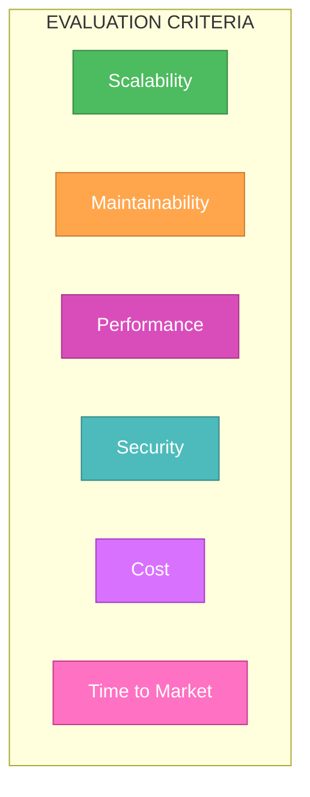

## 📊 ARCHITECTURE VISUALIZATION TEMPLATES

### Component Diagram Template
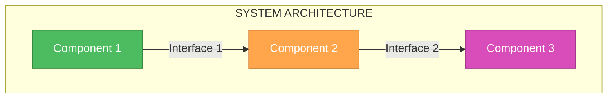

### Data Flow Template
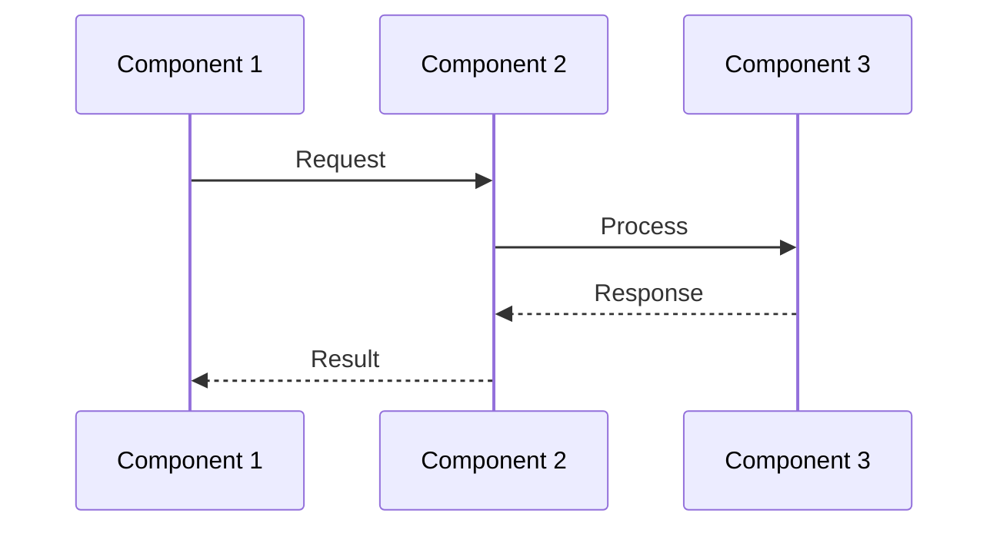

## ✅ VERIFICATION CHECKLIST

```markdown
## Architecture Design Verification
- [ ] All system requirements addressed
- [ ] Component responsibilities defined
- [ ] Interfaces specified
- [ ] Data flows documented
- [ ] Security considerations addressed
- [ ] Scalability requirements met
- [ ] Performance requirements met
- [ ] Maintenance approach defined

## Implementation Readiness
- [ ] All components identified
- [ ] Dependencies mapped
- [ ] Technical constraints documented
- [ ] Risk assessment completed
- [ ] Resource requirements defined
- [ ] Timeline estimates provided
```

## 🔄 ARCHITECTURE REVIEW PROCESS

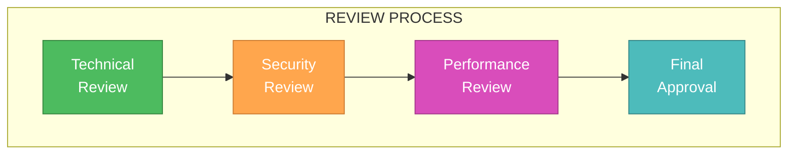

## 🔄 DOCUMENT MANAGEMENT

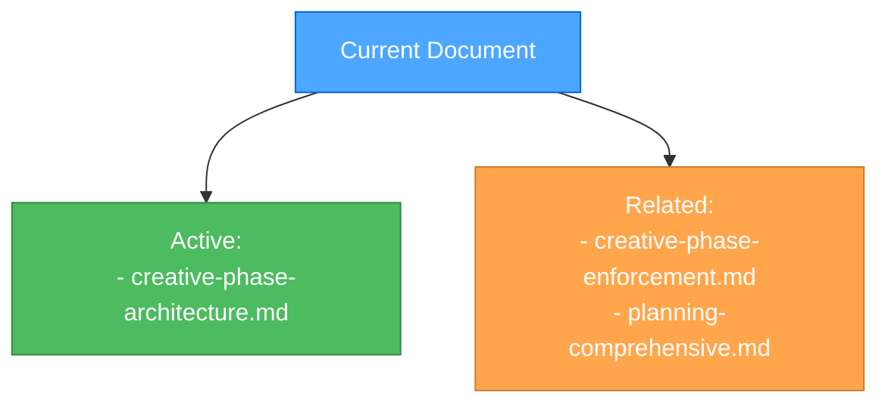
`````

## File: .cursor/rules/isolation_rules/Phases/CreativePhase/optimized-creative-template.mdc
`````
---
description: Optimized creative phase template with progressive documentation
globs: "**/creative*/**", "**/design*/**", "**/decision*/**"
alwaysApply: false
---

# OPTIMIZED CREATIVE PHASE TEMPLATE

> **TL;DR:** This template implements a progressive documentation approach for creative phases, optimizing token usage while maintaining thorough design exploration.

## 📝 PROGRESSIVE DOCUMENTATION MODEL

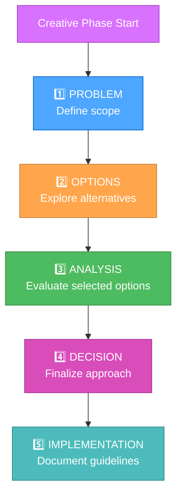

## 📋 TEMPLATE STRUCTURE

```markdown
📌 CREATIVE PHASE START: [Component Name]
━━━━━━━━━━━━━━━━━━━━━━━━━━━━━━━

1️⃣ PROBLEM
   Description: [Brief problem description]
   Requirements: [Key requirements as bullet points]
   Constraints: [Technical or business constraints]

2️⃣ OPTIONS
   Option A: [Name] - [One-line description]
   Option B: [Name] - [One-line description]
   Option C: [Name] - [One-line description]

3️⃣ ANALYSIS
   | Criterion | Option A | Option B | Option C |
   |-----------|----------|----------|----------|
   | Performance | ⭐⭐⭐ | ⭐⭐ | ⭐⭐⭐⭐ |
   | Complexity | ⭐⭐ | ⭐⭐⭐ | ⭐⭐⭐⭐ |
   | Maintainability | ⭐⭐⭐⭐ | ⭐⭐⭐ | ⭐⭐ |
   
   Key Insights:
   - [Insight 1]
   - [Insight 2]

4️⃣ DECISION
   Selected: [Option X]
   Rationale: [Brief justification]
   
5️⃣ IMPLEMENTATION NOTES
   - [Implementation note 1]
   - [Implementation note 2]
   - [Implementation note 3]

━━━━━━━━━━━━━━━━━━━━━━━━━━━━━━━
📌 CREATIVE PHASE END
```

## 🧩 DETAILED OPTION ANALYSIS (ON DEMAND)

Detailed analysis can be provided on demand for selected options:

```markdown
<details>
  <summary>Detailed Analysis: Option A</summary>
  
  ### Option A: [Full Name]
  
  **Complete Description**:
  [Detailed description of how the option works]
  
  **Pros**:
  - [Pro 1 with explanation]
  - [Pro 2 with explanation]
  - [Pro 3 with explanation]
  
  **Cons**:
  - [Con 1 with explanation]
  - [Con 2 with explanation]
  
  **Implementation Complexity**: [Low/Medium/High]
  [Explanation of complexity factors]
  
  **Resource Requirements**:
  [Details on resource needs]
  
  **Risk Assessment**:
  [Analysis of risks]
</details>
```

## 📊 COMPLEXITY-BASED SCALING

The template automatically scales documentation requirements based on task complexity level:

### Level 1-2 (Quick Fix/Enhancement)
- Simplified problem/solution
- Focus on implementation
- Minimal option exploration

### Level 3 (Feature Development)
- Multiple options required
- Analysis table with key criteria
- Implementation guidelines

### Level 4 (Enterprise Development)
- Comprehensive analysis
- Multiple viewpoints considered
- Detailed implementation plan
- Expanded verification criteria

## ✅ VERIFICATION PROTOCOL

Quality verification is condensed into a simple checklist:

```markdown
VERIFICATION:
[x] Problem clearly defined
[x] Multiple options considered
[x] Decision made with rationale
[x] Implementation guidance provided
```

## 🔄 USAGE EXAMPLES

### Architecture Decision (Level 3)

```markdown
📌 CREATIVE PHASE START: Authentication System
━━━━━━━━━━━━━━━━━━━━━━━━━━━━━━━

1️⃣ PROBLEM
   Description: Design an authentication system for the application
   Requirements: Secure, scalable, supports SSO, easy to maintain
   Constraints: Must work with existing user database, <100ms response time

2️⃣ OPTIONS
   Option A: JWT-based stateless auth - Simple token-based approach
   Option B: Session-based auth with Redis - Server-side session storage
   Option C: OAuth2 implementation - Delegated authorization framework

3️⃣ ANALYSIS
   | Criterion | JWT | Sessions | OAuth2 |
   |-----------|-----|----------|--------|
   | Security | ⭐⭐⭐ | ⭐⭐⭐⭐ | ⭐⭐⭐⭐⭐ |
   | Scalability | ⭐⭐⭐⭐⭐ | ⭐⭐⭐ | ⭐⭐⭐⭐ |
   | Complexity | ⭐⭐ | ⭐⭐⭐ | ⭐⭐⭐⭐ |
   | Performance | ⭐⭐⭐⭐⭐ | ⭐⭐⭐ | ⭐⭐⭐ |
   
   Key Insights:
   - JWT offers best performance but limited revocation options
   - Sessions provide better security control but require more infrastructure
   - OAuth2 most complex but offers best integration possibilities

4️⃣ DECISION
   Selected: Option A: JWT-based auth with refresh tokens
   Rationale: Best balance of performance and scalability while meeting security needs
   
5️⃣ IMPLEMENTATION NOTES
   - Use HS256 algorithm for token signing
   - Implement short-lived access tokens (15min) with longer refresh tokens (7 days)
   - Store token blacklist in Redis for revocation capability
   - Add rate limiting on token endpoints

━━━━━━━━━━━━━━━━━━━━━━━━━━━━━━━
📌 CREATIVE PHASE END
```

### Algorithm Decision (Level 2)

```markdown
📌 CREATIVE PHASE START: Search Algorithm
━━━━━━━━━━━━━━━━━━━━━━━━━━━━━━━

1️⃣ PROBLEM
   Description: Implement efficient text search for product catalog
   Requirements: Fast results, support for partial matches, case insensitive
   Constraints: Dataset < 10,000 items, must work in browser environment

2️⃣ OPTIONS
   Option A: Simple regex search - Basic pattern matching
   Option B: Trie-based search - Prefix tree structure
   Option C: Fuzzy search with Levenshtein - Edit distance algorithm

3️⃣ DECISION
   Selected: Option B: Trie-based search
   Rationale: Best performance for prefix searches with manageable memory usage
   
4️⃣ IMPLEMENTATION NOTES
   - Use existing trie library
   - Preprocess text to lowercase during indexing
   - Implement letter-by-letter search for instant results
   - Add debounce (300ms) to prevent excessive rebuilding

━━━━━━━━━━━━━━━━━━━━━━━━━━━━━━━
📌 CREATIVE PHASE END
```

## 🏆 TOKEN EFFICIENCY BENEFITS

This template significantly reduces token usage by:

1. Focusing on essential information without unnecessary verbosity
2. Using compact tabular formats for comparisons
3. Implementing progressive disclosure for detailed information
4. Scaling documentation requirements by task complexity
5. Using visual indicators (emojis) for quick scanning

The template maintains the rigor of the creative process while improving token efficiency by approximately 60% over the previous format.
`````

## File: .cursor/rules/isolation_rules/visual-maps/van_mode_split/van-qa-checks/environment-check.mdc
`````
---
description: Process map for VAN QA environment validation
globs: van-qa-checks/environment-check.mdc
alwaysApply: false
---
# VAN QA: ENVIRONMENT VALIDATION

> **TL;DR:** This component verifies that the build environment is properly set up with required tools and permissions.

## 3️⃣ ENVIRONMENT VALIDATION PROCESS

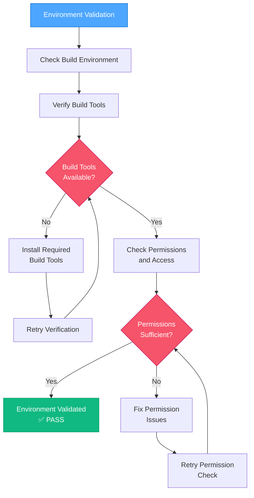

### Environment Validation Implementation:
```powershell
# Example: Validate environment for a web project
function Validate-Environment {
    $requiredTools = @(
        @{Name = "git"; Command = "git --version"},
        @{Name = "node"; Command = "node --version"},
        @{Name = "npm"; Command = "npm --version"}
    )
    
    $missingTools = @()
    $permissionIssues = @()
    
    # Check build tools
    foreach ($tool in $requiredTools) {
        try {
            Invoke-Expression $tool.Command | Out-Null
        } catch {
            $missingTools += $tool.Name
        }
    }
    
    # Check write permissions in project directory
    try {
        $testFile = ".__permission_test"
        New-Item -Path $testFile -ItemType File -Force | Out-Null
        Remove-Item -Path $testFile -Force
    } catch {
        $permissionIssues += "Current directory (write permission denied)"
    }
    
    # Check if port 3000 is available (commonly used for dev servers)
    try {
        $listener = New-Object System.Net.Sockets.TcpListener([System.Net.IPAddress]::Loopback, 3000)
        $listener.Start()
        $listener.Stop()
    } catch {
        $permissionIssues += "Port 3000 (already in use or access denied)"
    }
    
    # Display results
    if ($missingTools.Count -eq 0 -and $permissionIssues.Count -eq 0) {
        Write-Output "✅ Environment validated successfully"
        return $true
    } else {
        if ($missingTools.Count -gt 0) {
            Write-Output "❌ Missing tools: $($missingTools -join ', ')"
        }
        if ($permissionIssues.Count -gt 0) {
            Write-Output "❌ Permission issues: $($permissionIssues -join ', ')"
        }
        return $false
    }
}
```

## 📋 ENVIRONMENT VALIDATION CHECKPOINT

```
✓ CHECKPOINT: ENVIRONMENT VALIDATION
- All required build tools installed? [YES/NO]
- Project directory permissions sufficient? [YES/NO]
- Required ports available? [YES/NO]

→ If all YES: Continue to Minimal Build Test.
→ If any NO: Fix environment issues before continuing.
```

**Next Step (on PASS):** Load `van-qa-checks/build-test.mdc`.
**Next Step (on FAIL):** Check `van-qa-utils/common-fixes.mdc` for environment fixes.
`````

## File: .cursor/rules/isolation_rules/visual-maps/van_mode_split/van-qa-checks/file-verification.mdc
`````

`````

## File: .cursor/rules/isolation_rules/visual-maps/van_mode_split/van-qa-utils/rule-calling-guide.mdc
`````
---
description: Comprehensive guide for calling VAN QA rules
globs: van-qa-utils/rule-calling-guide.mdc
alwaysApply: false
---
# VAN QA: COMPREHENSIVE RULE CALLING GUIDE

> **TL;DR:** This reference guide shows how to properly call all VAN QA rules at the right time during the validation process.

## 🔍 RULE CALLING BASICS

Remember these key principles:
1. Always use the `fetch_rules` tool to load rules
2. Use exact rule paths
3. Load components only when needed

## 📋 MAIN QA ENTRY POINT

When user types "VAN QA", load the main entry point:

```
fetch_rules with "isolation_rules/visual-maps/van-qa-main"
```

## 📋 VALIDATION CHECKS

Load these components sequentially during validation:

```
1. fetch_rules with "isolation_rules/visual-maps/van-qa-checks/dependency-check"
2. fetch_rules with "isolation_rules/visual-maps/van-qa-checks/config-check"
3. fetch_rules with "isolation_rules/visual-maps/van-qa-checks/environment-check"
4. fetch_rules with "isolation_rules/visual-maps/van-qa-checks/build-test"
```

## 📋 UTILITY COMPONENTS

Load these when needed based on validation results:

```
- For reports: fetch_rules with "isolation_rules/visual-maps/van-qa-utils/reports"
- For fixes: fetch_rules with "isolation_rules/visual-maps/van-qa-utils/common-fixes"
- For transitions: fetch_rules with "isolation_rules/visual-maps/van-qa-utils/mode-transitions"
```

## ⚠️ CRITICAL REMINDERS

Remember to call these rules at these specific points:
- ALWAYS load the main QA entry point when "VAN QA" is typed
- ALWAYS load dependency-check before starting validation
- ALWAYS load reports after completing validation
- ALWAYS load mode-transitions after successful validation
- ALWAYS load common-fixes after failed validation

## 🔄 FULL VALIDATION SEQUENCE

Complete sequence for a QA validation process:

1. Load main entry: `isolation_rules/visual-maps/van-qa-main`
2. Load first check: `isolation_rules/visual-maps/van-qa-checks/dependency-check`
3. Load second check: `isolation_rules/visual-maps/van-qa-checks/config-check`
4. Load third check: `isolation_rules/visual-maps/van-qa-checks/environment-check`
5. Load fourth check: `isolation_rules/visual-maps/van-qa-checks/build-test`
6. If pass, load: `isolation_rules/visual-maps/van-qa-utils/reports`
7. If pass, load: `isolation_rules/visual-maps/van-qa-utils/mode-transitions` 
8. If fail, load: `isolation_rules/visual-maps/van-qa-utils/common-fixes`
`````

## File: .cursor/rules/isolation_rules/visual-maps/van_mode_split/van-qa-utils/rule-calling-help.mdc
`````
---
description: Utility for remembering how to call VAN QA rules
globs: van-qa-utils/rule-calling-help.mdc
alwaysApply: false
---
# VAN QA: HOW TO CALL RULES

> **TL;DR:** This file provides examples and reminders on how to properly call VAN QA rules using the fetch_rules tool.

## 🚨 RULE CALLING SYNTAX

Always use the `fetch_rules` tool with the correct syntax:

```
<function_calls>
<invoke name="fetch_rules">
<parameter name="rule_names">["isolation_rules/visual-maps/rule-name"]
</invoke>
</function_calls>
`````

## File: .cursor/rules/isolation_rules/visual-maps/van_mode_split/van-platform-detection.mdc
`````
---
description: Visual process map for VAN mode platform detection
globs: van-platform-detection.mdc
alwaysApply: false
---
# VAN MODE: PLATFORM DETECTION

> **TL;DR:** Detects the OS, determines path separators, and notes command adaptations required.

## 🌐 PLATFORM DETECTION PROCESS

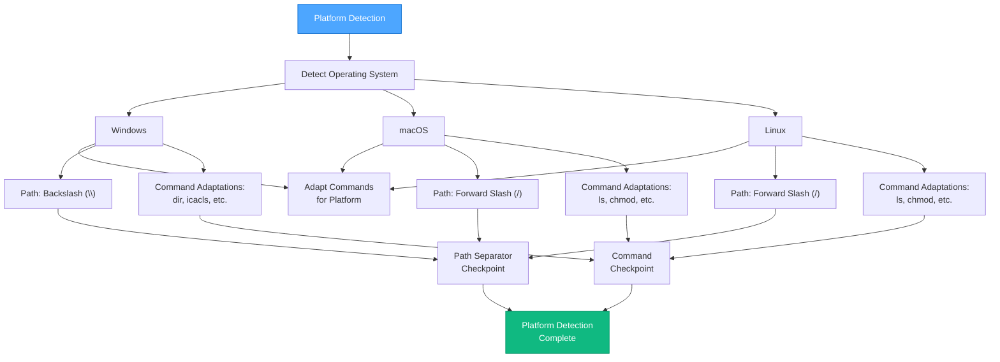

## 📋 CHECKPOINT VERIFICATION TEMPLATE (Example)

```
✓ SECTION CHECKPOINT: PLATFORM DETECTION
- Operating System Detected? [YES/NO]
- Path Separator Confirmed? [YES/NO]
- Command Adaptations Noted? [YES/NO]

→ If all YES: Platform Detection Complete.
→ If any NO: Resolve before proceeding.
```

**Next Step:** Load and process `van-file-verification.mdc`.
`````

## File: .cursor/rules/isolation_rules/visual-maps/van_mode_split/van-qa-main.mdc
`````
---
description: Visual process map for VAN QA mode (Technical Validation Entry Point)
globs: van-qa-main.mdc
alwaysApply: false
---
# VAN MODE: QA TECHNICAL VALIDATION (Main Entry)

> **TL;DR:** This is the entry point for the QA validation process that executes *after* CREATIVE mode and *before* BUILD mode. It ensures technical requirements are met before implementation begins.

## 📣 HOW TO USE THESE QA RULES

To access any QA validation rule or component, use the `fetch_rules` tool with exact rule names:

```
// CRITICAL: Always use fetch_rules to load validation components
// For detailed examples and guidance, load:
// isolation_rules/visual-maps/van-qa-utils/rule-calling-guide
```

## 🚀 VAN QA MODE ACTIVATION

After completing CREATIVE mode, when the user types "VAN QA", respond:

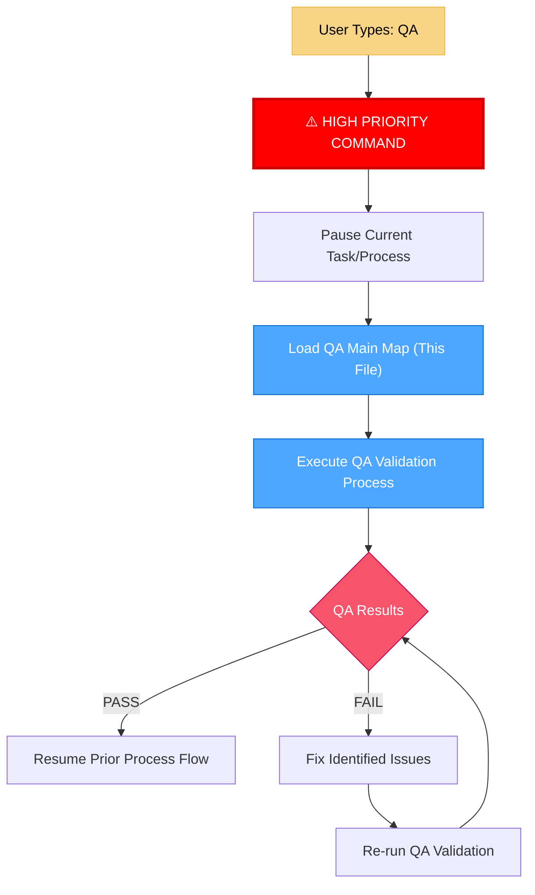

### QA Interruption Rules

1. **Immediate Precedence:** `QA` command interrupts everything.
2. **Load & Execute:** Load this map (`van-qa-main.mdc`) and its components (see below).
3. **Remediation Priority:** Fixes take priority over pending mode switches.
4. **Resume:** On PASS, resume the previous flow.

```
⚠️ QA OVERRIDE ACTIVATED
All other processes paused
QA validation checks now running...
Any issues found MUST be remediated before continuing with normal process flow
```

## 🔍 TECHNICAL VALIDATION OVERVIEW

Four-point validation process with selective loading:

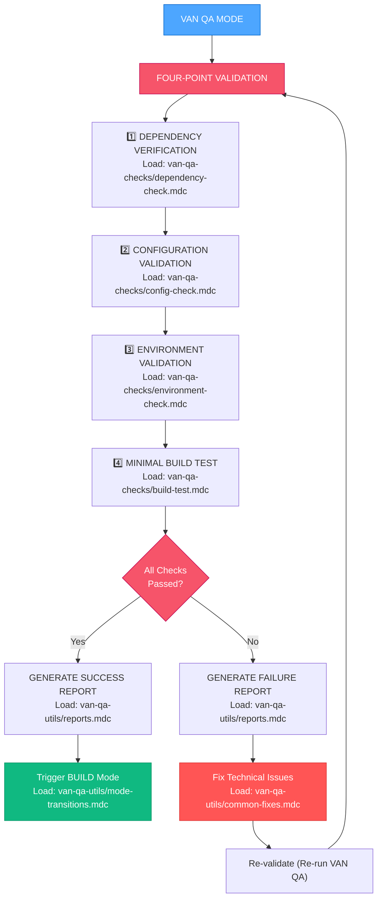

## 🔄 INTEGRATION WITH DESIGN DECISIONS

Reads Creative Phase outputs to inform validation:

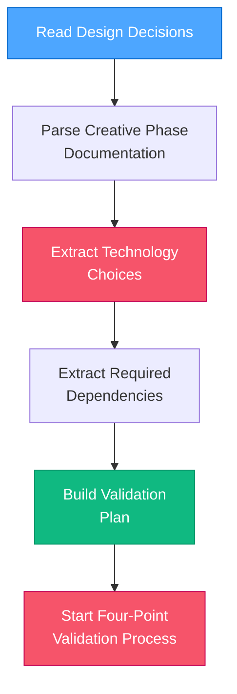

## 📋 COMPONENT LOADING SEQUENCE

The QA validation process follows this selective loading sequence:

1. **Main Entry (This File)**: `van-qa-main.mdc`
2. **Validation Checks**:
   - `van-qa-checks/dependency-check.mdc`
   - `van-qa-checks/config-check.mdc`
   - `van-qa-checks/environment-check.mdc`
   - `van-qa-checks/build-test.mdc`
3. **Utilities (As Needed)**:
   - `van-qa-utils/reports.mdc`
   - `van-qa-utils/common-fixes.mdc`
   - `van-qa-utils/mode-transitions.mdc`

## 📋 FINAL QA VALIDATION CHECKPOINT

```
✓ SECTION CHECKPOINT: QA VALIDATION
- Dependency Verification Passed? [YES/NO]
- Configuration Validation Passed? [YES/NO]
- Environment Validation Passed? [YES/NO]
- Minimal Build Test Passed? [YES/NO]

→ If all YES: Ready for BUILD mode transition.
→ If any NO: Fix identified issues and re-run VAN QA.
```

**Next Step (on PASS):** Trigger BUILD mode (load `van-qa-utils/mode-transitions.mdc`).
**Next Step (on FAIL):** Address issues (load `van-qa-utils/common-fixes.mdc`) and re-run `VAN QA`.
`````

## File: .cursor/rules/isolation_rules/visual-maps/creative-mode-map.mdc
`````
---
description: Visual process map for CREATIVE mode (Design Decisions)
globs: "**/creative*/**", "**/design*/**", "**/decision*/**"
alwaysApply: false
---

# CREATIVE MODE: DESIGN PROCESS MAP

> **TL;DR:** This visual map guides the CREATIVE mode process, focusing on structured design decision-making for components that require deeper exploration before implementation.

## 🧭 CREATIVE MODE PROCESS FLOW

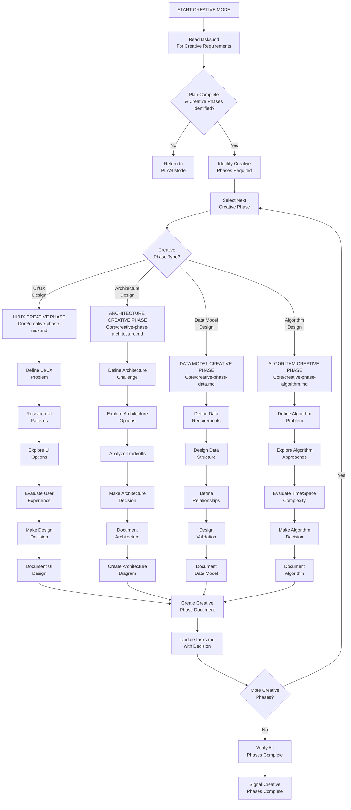

## 📋 CREATIVE PHASE DOCUMENT FORMAT

Each creative phase should produce a document with this structure:

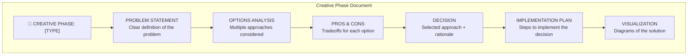

## 🔍 CREATIVE TYPES AND APPROACHES

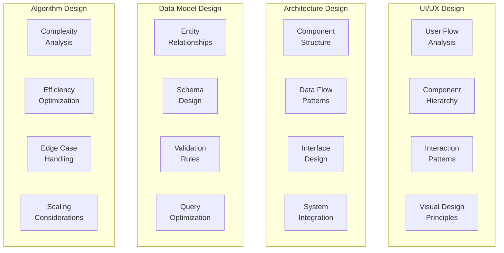

## 📊 REQUIRED FILE STATE VERIFICATION

Before creative phase work can begin, verify file state:

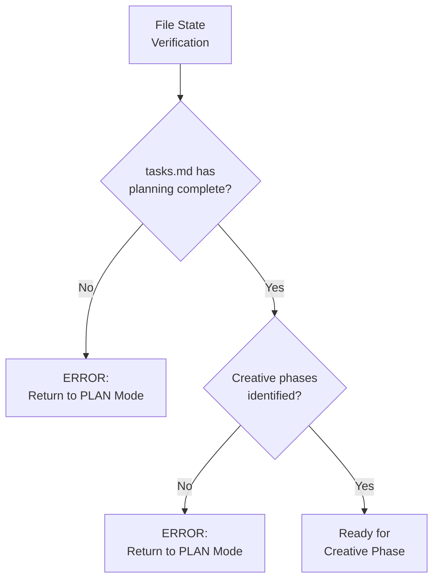

## 📋 OPTIONS ANALYSIS TEMPLATE

For each creative phase, analyze multiple options:

```
## OPTIONS ANALYSIS

### Option 1: [Name]
**Description**: [Brief description]
**Pros**:
- [Pro 1]
- [Pro 2]
**Cons**:
- [Con 1]
- [Con 2]
**Complexity**: [Low/Medium/High]
**Implementation Time**: [Estimate]

### Option 2: [Name]
**Description**: [Brief description]
**Pros**:
- [Pro 1]
- [Pro 2]
**Cons**:
- [Con 1]
- [Con 2]
**Complexity**: [Low/Medium/High]
**Implementation Time**: [Estimate]

### Option 3: [Name]
**Description**: [Brief description]
**Pros**:
- [Pro 1]
- [Pro 2]
**Cons**:
- [Con 1]
- [Con 2]
**Complexity**: [Low/Medium/High]
**Implementation Time**: [Estimate]
```

## 🎨 CREATIVE PHASE MARKERS

Use these visual markers for creative phases:

```
🎨🎨🎨 ENTERING CREATIVE PHASE: [TYPE] 🎨🎨🎨

[Creative phase content]

🎨 CREATIVE CHECKPOINT: [Milestone]

[Additional content]

🎨🎨🎨 EXITING CREATIVE PHASE - DECISION MADE 🎨🎨🎨
```

## 📊 CREATIVE PHASE VERIFICATION CHECKLIST

```
✓ CREATIVE PHASE VERIFICATION
- Problem clearly defined? [YES/NO]
- Multiple options considered (3+)? [YES/NO]
- Pros/cons documented for each option? [YES/NO]
- Decision made with clear rationale? [YES/NO]
- Implementation plan included? [YES/NO]
- Visualization/diagrams created? [YES/NO]
- tasks.md updated with decision? [YES/NO]

→ If all YES: Creative phase complete
→ If any NO: Complete missing elements
```

## 🔄 MODE TRANSITION NOTIFICATION

When all creative phases are complete, notify user with:

```
## CREATIVE PHASES COMPLETE

✅ All required design decisions made
✅ Creative phase documents created
✅ tasks.md updated with decisions
✅ Implementation plan updated

→ NEXT RECOMMENDED MODE: IMPLEMENT MODE
```
`````

## File: .cursor/rules/isolation_rules/visual-maps/implement-mode-map.mdc
`````
---
description: Visual process map for BUILD mode (Code Implementation)
globs: implementation-mode-map.mdc
alwaysApply: false
---

# BUILD MODE: CODE EXECUTION PROCESS MAP

> **TL;DR:** This visual map guides the BUILD mode process, focusing on efficient code implementation based on the planning and creative phases, with proper command execution and progress tracking.

## 🧭 BUILD MODE PROCESS FLOW

```mermaid
graph TD
    Start["START BUILD MODE"] --> ReadDocs["Read Reference Documents<br>Core/command-execution.md"]
    
    %% Initialization
    ReadDocs --> CheckLevel{"Determine<br>Complexity Level<br>from tasks.md"}
    
    %% Level 1 Implementation
    CheckLevel -->|"Level 1<br>Quick Bug Fix"| L1Process["LEVEL 1 PROCESS<br>Level1/quick-bug-workflow.md"]
    L1Process --> L1Review["Review Bug<br>Report"]
    L1Review --> L1Examine["Examine<br>Relevant Code"]
    L1Examine --> L1Fix["Implement<br>Targeted Fix"]
    L1Fix --> L1Test["Test<br>Fix"]
    L1Test --> L1Update["Update<br>tasks.md"]
    
    %% Level 2 Implementation
    CheckLevel -->|"Level 2<br>Simple Enhancement"| L2Process["LEVEL 2 PROCESS<br>Level2/enhancement-workflow.md"]
    L2Process --> L2Review["Review Build<br>Plan"]
    L2Review --> L2Examine["Examine Relevant<br>Code Areas"]
    L2Examine --> L2Implement["Implement Changes<br>Sequentially"]
    L2Implement --> L2Test["Test<br>Changes"]
    L2Test --> L2Update["Update<br>tasks.md"]
    
    %% Level 3-4 Implementation
    CheckLevel -->|"Level 3-4<br>Feature/System"| L34Process["LEVEL 3-4 PROCESS<br>Level3/feature-workflow.md<br>Level4/system-workflow.md"]
    L34Process --> L34Review["Review Plan &<br>Creative Decisions"]
    L34Review --> L34Phase{"Creative Phase<br>Documents<br>Complete?"}
    
    L34Phase -->|"No"| L34Error["ERROR:<br>Return to CREATIVE Mode"]
    L34Phase -->|"Yes"| L34DirSetup["Create Directory<br>Structure"]
    L34DirSetup --> L34VerifyDirs["VERIFY Directories<br>Created Successfully"]
    L34VerifyDirs --> L34Implementation["Build<br>Phase"]
    
    %% Implementation Phases
    L34Implementation --> L34Phase1["Phase 1<br>Build"]
    L34Phase1 --> L34VerifyFiles["VERIFY Files<br>Created Successfully"]
    L34VerifyFiles --> L34Test1["Test<br>Phase 1"]
    L34Test1 --> L34Document1["Document<br>Phase 1"]
    L34Document1 --> L34Next1{"Next<br>Phase?"}
    L34Next1 -->|"Yes"| L34Implementation
    
    L34Next1 -->|"No"| L34Integration["Integration<br>Testing"]
    L34Integration --> L34Document["Document<br>Integration Points"]
    L34Document --> L34Update["Update<br>tasks.md"]
    
    %% Command Execution
    L1Fix & L2Implement & L34Phase1 --> CommandExec["COMMAND EXECUTION<br>Core/command-execution.md"]
    CommandExec --> DocCommands["Document Commands<br>& Results"]
    
    %% Completion & Transition
    L1Update & L2Update & L34Update --> VerifyComplete["Verify Build<br>Complete"]
    VerifyComplete --> UpdateProgress["Update progress.md<br>with Status"]
    UpdateProgress --> Transition["NEXT MODE:<br>REFLECT MODE"]
```

## 📋 REQUIRED FILE STATE VERIFICATION

Before implementation can begin, verify file state:

```mermaid
graph TD
    Start["File State<br>Verification"] --> CheckTasks{"tasks.md has<br>planning complete?"}
    
    CheckTasks -->|"No"| ErrorPlan["ERROR:<br>Return to PLAN Mode"]
    CheckTasks -->|"Yes"| CheckLevel{"Task<br>Complexity?"}
    
    CheckLevel -->|"Level 1"| L1Ready["Ready for<br>Implementation"]
    
    CheckLevel -->|"Level 2"| L2Ready["Ready for<br>Implementation"]
    
    CheckLevel -->|"Level 3-4"| CheckCreative{"Creative phases<br>required?"}
    
    CheckCreative -->|"No"| L34Ready["Ready for<br>Implementation"]
    CheckCreative -->|"Yes"| VerifyCreative{"Creative phases<br>completed?"}
    
    VerifyCreative -->|"No"| ErrorCreative["ERROR:<br>Return to CREATIVE Mode"]
    VerifyCreative -->|"Yes"| L34Ready
```

## 🔄 FILE SYSTEM VERIFICATION PROCESS

```mermaid
graph TD
    Start["Start File<br>Verification"] --> CheckDir["Check Directory<br>Structure"]
    CheckDir --> DirResult{"Directories<br>Exist?"}
    
    DirResult -->|"No"| ErrorDir["❌ ERROR:<br>Missing Directories"]
    DirResult -->|"Yes"| CheckFiles["Check Each<br>Created File"]
    
    ErrorDir --> FixDir["Fix Directory<br>Structure"]
    FixDir --> CheckDir
    
    CheckFiles --> FileResult{"All Files<br>Exist?"}
    FileResult -->|"No"| ErrorFile["❌ ERROR:<br>Missing/Wrong Path Files"]
    FileResult -->|"Yes"| Complete["✅ Verification<br>Complete"]
    
    ErrorFile --> FixFile["Fix File Paths<br>or Recreate Files"]
    FixFile --> CheckFiles
```

## 📋 DIRECTORY VERIFICATION STEPS

Before beginning any file creation:

```
✓ DIRECTORY VERIFICATION PROCEDURE
1. Create all directories first before any files
2. Use ABSOLUTE paths: /full/path/to/directory
3. Verify each directory after creation:
   ls -la /full/path/to/directory     # Linux/Mac
   dir "C:\full\path\to\directory"    # Windows
4. Document directory structure in progress.md
5. Only proceed to file creation AFTER verifying ALL directories exist
```

## 📋 FILE CREATION VERIFICATION

After creating files:

```
✓ FILE VERIFICATION PROCEDURE
1. Use ABSOLUTE paths for all file operations: /full/path/to/file.ext
2. Verify each file creation was successful:
   ls -la /full/path/to/file.ext     # Linux/Mac
   dir "C:\full\path\to\file.ext"    # Windows 
3. If verification fails:
   a. Check for path resolution issues
   b. Verify directory exists
   c. Try creating with corrected path
   d. Recheck file exists after correction
4. Document all file paths in progress.md
```

## 🔄 COMMAND EXECUTION WORKFLOW

```mermaid
graph TD
    Start["Command<br>Execution"] --> Analyze["Analyze Command<br>Requirements"]
    Analyze --> Complexity{"Command<br>Complexity?"}
    
    Complexity -->|"Simple"| Simple["Execute<br>Single Command"]
    Complexity -->|"Moderate"| Chain["Use Efficient<br>Command Chaining"]
    Complexity -->|"Complex"| Break["Break Into<br>Logical Steps"]
    
    Simple & Chain & Break --> Verify["Verify<br>Results"]
    Verify --> Document["Document<br>Command & Result"]
    Document --> Next["Next<br>Command"]
```

## 📋 LEVEL-SPECIFIC BUILD APPROACHES

```mermaid
graph TD
    subgraph "Level 1: Quick Bug Fix"
        L1A["Targeted Code<br>Examination"]
        L1B["Minimal<br>Change Scope"]
        L1C["Direct<br>Fix"]
        L1D["Verify<br>Fix"]
    end
    
    subgraph "Level 2: Enhancement"
        L2A["Sequential<br>Build"]
        L2B["Contained<br>Changes"]
        L2C["Standard<br>Testing"]
        L2D["Component<br>Documentation"]
    end
    
    subgraph "Level 3-4: Feature/System"
        L3A["Directory<br>Structure First"]
        L3B["Verify Dirs<br>Before Files"]
        L3C["Phased<br>Build"]
        L3D["Verify Files<br>After Creation"]
        L3E["Integration<br>Testing"]
        L3F["Detailed<br>Documentation"]
    end
    
    L1A --> L1B --> L1C --> L1D
    L2A --> L2B --> L2C --> L2D
    L3A --> L3B --> L3C --> L3D --> L3E --> L3F
```

## 📝 BUILD DOCUMENTATION FORMAT

Document builds with:

```
## Build: [Component/Feature]

### Approach
[Brief description of build approach]

### Directory Structure
- [/absolute/path/to/dir1/]: [Purpose]
- [/absolute/path/to/dir2/]: [Purpose]

### Code Changes
- [/absolute/path/to/file1.ext]: [Description of changes]
- [/absolute/path/to/file2.ext]: [Description of changes]

### Verification Steps
- [✓] Directory structure created and verified
- [✓] All files created in correct locations
- [✓] File content verified

### Commands Executed
```
[Command 1]
[Result]
```

```
[Command 2]
[Result]
```

### Testing
- [Test 1]: [Result]
- [Test 2]: [Result]

### Status
- [x] Build complete
- [x] Testing performed
- [x] File verification completed
- [ ] Documentation updated
```

## 📊 TASKS.MD UPDATE FORMAT

During the build process, update tasks.md with progress:

```
## Status
- [x] Initialization complete
- [x] Planning complete
[For Level 3-4:]
- [x] Creative phases complete
- [x] Directory structure created and verified
- [x] [Built component 1]
- [x] [Built component 2]
- [ ] [Remaining component]

## Build Progress
- [Component 1]: Complete
  - Files: [/absolute/path/to/files]
  - [Details about implementation]
- [Component 2]: Complete
  - Files: [/absolute/path/to/files]
  - [Details about implementation]
- [Component 3]: In Progress
  - [Current status]
```

## 📋 PROGRESS.MD UPDATE FORMAT

Update progress.md with:

```
# Build Progress

## Directory Structure
- [/absolute/path/to/dir1/]: Created and verified
- [/absolute/path/to/dir2/]: Created and verified

## [Date]: [Component/Feature] Built
- **Files Created**: 
  - [/absolute/path/to/file1.ext]: Verified
  - [/absolute/path/to/file2.ext]: Verified
- **Key Changes**: 
  - [Change 1]
  - [Change 2]
- **Testing**: [Test results]
- **Next Steps**: [What comes next]
```

## 📊 BUILD VERIFICATION CHECKLIST

```
✓ BUILD VERIFICATION
- Directory structure created correctly? [YES/NO]
- All files created in correct locations? [YES/NO]
- All file paths verified with absolute paths? [YES/NO]
- All planned changes implemented? [YES/NO]
- Testing performed for all changes? [YES/NO]
- Code follows project standards? [YES/NO]
- Edge cases handled appropriately? [YES/NO]
- Build documented with absolute paths? [YES/NO]
- tasks.md updated with progress? [YES/NO]
- progress.md updated with details? [YES/NO]

→ If all YES: Build complete - ready for REFLECT mode
→ If any NO: Complete missing build elements
```

## 🔄 MODE TRANSITION NOTIFICATION

When the build is complete, notify user with:

```
## BUILD COMPLETE

✅ Directory structure verified
✅ All files created in correct locations
✅ All planned changes implemented
✅ Testing performed successfully
✅ tasks.md updated with status
✅ progress.md updated with details

→ NEXT RECOMMENDED MODE: REFLECT MODE
```
`````

## File: .cursor/rules/isolation_rules/visual-maps/plan-mode-map.mdc
`````
---
description: Visual process map for PLAN mode (Code Implementation)
globs: plan-mode-map.mdc
alwaysApply: false
---

# PLAN MODE: TASK PLANNING PROCESS MAP

> **TL;DR:** This visual map guides the PLAN mode process, focusing on creating detailed implementation plans based on the complexity level determined during initialization, with mandatory technology validation before implementation.

## 🧭 PLAN MODE PROCESS FLOW

```mermaid
graph TD
    Start["START PLANNING"] --> ReadTasks["Read tasks.md<br>Core/task-tracking.md"]
    
    %% Complexity Level Determination
    ReadTasks --> CheckLevel{"Determine<br>Complexity Level"}
    CheckLevel -->|"Level 2"| Level2["LEVEL 2 PLANNING<br>Level2/enhancement-planning.md"]
    CheckLevel -->|"Level 3"| Level3["LEVEL 3 PLANNING<br>Level3/feature-planning.md"]
    CheckLevel -->|"Level 4"| Level4["LEVEL 4 PLANNING<br>Level4/system-planning.md"]
    
    %% Level 2 Planning
    Level2 --> L2Review["Review Code<br>Structure"]
    L2Review --> L2Document["Document<br>Planned Changes"]
    L2Document --> L2Challenges["Identify<br>Challenges"]
    L2Challenges --> L2Checklist["Create Task<br>Checklist"]
    L2Checklist --> L2Update["Update tasks.md<br>with Plan"]
    L2Update --> L2Tech["TECHNOLOGY<br>VALIDATION"]
    L2Tech --> L2Verify["Verify Plan<br>Completeness"]
    
    %% Level 3 Planning
    Level3 --> L3Review["Review Codebase<br>Structure"]
    L3Review --> L3Requirements["Document Detailed<br>Requirements"]
    L3Requirements --> L3Components["Identify Affected<br>Components"]
    L3Components --> L3Plan["Create Comprehensive<br>Implementation Plan"]
    L3Plan --> L3Challenges["Document Challenges<br>& Solutions"]
    L3Challenges --> L3Update["Update tasks.md<br>with Plan"]
    L3Update --> L3Tech["TECHNOLOGY<br>VALIDATION"]
    L3Tech --> L3Flag["Flag Components<br>Requiring Creative"]
    L3Flag --> L3Verify["Verify Plan<br>Completeness"]
    
    %% Level 4 Planning
    Level4 --> L4Analysis["Codebase Structure<br>Analysis"]
    L4Analysis --> L4Requirements["Document Comprehensive<br>Requirements"]
    L4Requirements --> L4Diagrams["Create Architectural<br>Diagrams"]
    L4Diagrams --> L4Subsystems["Identify Affected<br>Subsystems"]
    L4Subsystems --> L4Dependencies["Document Dependencies<br>& Integration Points"]
    L4Dependencies --> L4Plan["Create Phased<br>Implementation Plan"]
    L4Plan --> L4Update["Update tasks.md<br>with Plan"]
    L4Update --> L4Tech["TECHNOLOGY<br>VALIDATION"]
    L4Tech --> L4Flag["Flag Components<br>Requiring Creative"]
    L4Flag --> L4Verify["Verify Plan<br>Completeness"]
    
    %% Technology Validation Gate - NEW
    L2Tech & L3Tech & L4Tech --> TechGate["⛔ TECHNOLOGY<br>VALIDATION GATE"]
    TechGate --> TechSelection["Document Technology<br>Stack Selection"]
    TechSelection --> TechHelloWorld["Create Hello World<br>Proof of Concept"]
    TechHelloWorld --> TechDependencies["Verify Required<br>Dependencies"]
    TechDependencies --> TechConfig["Validate Build<br>Configuration"]
    TechConfig --> TechBuild["Complete Test<br>Build"]
    TechBuild --> TechVerify["⛔ TECHNOLOGY<br>CHECKPOINT"]
    
    %% Verification & Completion
    L2Verify & L3Verify & L4Verify & TechVerify --> CheckCreative{"Creative<br>Phases<br>Required?"}
    
    %% Mode Transition
    CheckCreative -->|"Yes"| RecCreative["NEXT MODE:<br>CREATIVE MODE"]
    CheckCreative -->|"No"| RecImplement["NEXT MODE:<br>IMPLEMENT MODE"]
    
    %% Style for Technology Gate
    style TechGate fill:#ff5555,stroke:#dd3333,color:white,stroke-width:3px
    style TechVerify fill:#ff5555,stroke:#dd3333,color:white,stroke-width:3px
    style TechSelection fill:#4da6ff,stroke:#0066cc,color:white
    style TechHelloWorld fill:#4da6ff,stroke:#0066cc,color:white
    style TechDependencies fill:#4da6ff,stroke:#0066cc,color:white
    style TechConfig fill:#4da6ff,stroke:#0066cc,color:white
    style TechBuild fill:#4da6ff,stroke:#0066cc,color:white
```

## 📋 LEVEL-SPECIFIC PLANNING APPROACHES

```mermaid
graph TD
    subgraph "Level 2: Enhancement"
        L2A["Basic Requirements<br>Analysis"]
        L2B["Simple Component<br>Identification"]
        L2C["Linear Implementation<br>Plan"]
        L2D["Basic Checklist<br>Creation"]
    end
    
    subgraph "Level 3: Feature"
        L3A["Detailed Requirements<br>Analysis"]
        L3B["Component Mapping<br>with Dependencies"]
        L3C["Multi-Phase<br>Implementation Plan"]
        L3D["Comprehensive<br>Checklist"]
        L3E["Creative Phase<br>Identification"]
    end
    
    subgraph "Level 4: System"
        L4A["Architectural<br>Requirements Analysis"]
        L4B["System Component<br>Mapping"]
        L4C["Subsystem<br>Integration Plan"]
        L4D["Phased Implementation<br>Strategy"]
        L4E["Risk Assessment<br>& Mitigation"]
        L4F["Multiple Creative<br>Phase Requirements"]
    end
    
    L2A --> L2B --> L2C --> L2D
    L3A --> L3B --> L3C --> L3D --> L3E
    L4A --> L4B --> L4C --> L4D --> L4E --> L4F
```

## 🔧 TECHNOLOGY VALIDATION WORKFLOW

```mermaid
graph TD
    Start["Technology<br>Validation Start"] --> Select["Technology<br>Stack Selection"]
    Select --> Document["Document Chosen<br>Technologies"]
    Document --> POC["Create Minimal<br>Proof of Concept"]
    POC --> Build["Verify Build<br>Process Works"]
    Build --> Dependencies["Validate All<br>Dependencies"]
    Dependencies --> Config["Confirm Configuration<br>Files Are Correct"]
    Config --> Test["Complete Test<br>Build/Run"]
    Test --> Success{"All Checks<br>Pass?"}
    
    Success -->|"Yes"| Ready["Ready for<br>Implementation"]
    Success -->|"No"| Fix["Fix Technology<br>Issues"]
    Fix --> Document
    
    style Start fill:#4da6ff,stroke:#0066cc,color:white
    style POC fill:#4da6ff,stroke:#0066cc,color:white
    style Success fill:#ff5555,stroke:#dd3333,color:white
    style Fix fill:#ff5555,stroke:#dd3333,color:white
    style Ready fill:#10b981,stroke:#059669,color:white
```

## 📊 REQUIRED FILE STATE VERIFICATION

Before planning can begin, verify the file state:

```mermaid
graph TD
    Start["File State<br>Verification"] --> CheckTasks{"tasks.md<br>initialized?"}
    
    CheckTasks -->|"No"| ErrorTasks["ERROR:<br>Return to VAN Mode"]
    CheckTasks -->|"Yes"| CheckActive{"activeContext.md<br>exists?"}
    
    CheckActive -->|"No"| ErrorActive["ERROR:<br>Return to VAN Mode"]
    CheckActive -->|"Yes"| ReadyPlan["Ready for<br>Planning"]
```

## 📝 TASKS.MD UPDATE FORMAT

During planning, update tasks.md with this structure:

```
# Task: [Task name]

## Description
[Detailed description]

## Complexity
Level: [2/3/4]
Type: [Enhancement/Feature/Complex System]

## Technology Stack
- Framework: [Selected framework]
- Build Tool: [Selected build tool]
- Language: [Selected language]
- Storage: [Selected storage mechanism]

## Technology Validation Checkpoints
- [ ] Project initialization command verified
- [ ] Required dependencies identified and installed
- [ ] Build configuration validated
- [ ] Hello world verification completed
- [ ] Test build passes successfully

## Status
- [x] Initialization complete
- [x] Planning complete
- [ ] Technology validation complete
- [ ] [Implementation steps]

## Implementation Plan
1. [Step 1]
   - [Subtask 1.1]
   - [Subtask 1.2]
2. [Step 2]
   - [Subtask 2.1]
   - [Subtask 2.2]

## Creative Phases Required
- [ ] [Component 1] Design
- [ ] [Component 2] Architecture
- [ ] [Component 3] Data Model

## Dependencies
- [Dependency 1]
- [Dependency 2]

## Challenges & Mitigations
- [Challenge 1]: [Mitigation strategy]
- [Challenge 2]: [Mitigation strategy]
```

## 📋 CREATIVE PHASE IDENTIFICATION

For Level 3-4 tasks, identify components requiring creative phases:

```mermaid
graph TD
    Start["Creative Phase<br>Identification"] --> CheckComp{"Component<br>Analysis"}
    
    CheckComp --> UI["UI/UX<br>Components"]
    CheckComp --> Data["Data Model<br>Components"]
    CheckComp --> Arch["Architecture<br>Components"]
    CheckComp --> Algo["Algorithm<br>Components"]
    
    UI & Data & Arch & Algo --> Decision{"Design Decisions<br>Required?"}
    
    Decision -->|"Yes"| Flag["Flag for<br>Creative Phase"]
    Decision -->|"No"| Skip["Standard<br>Implementation"]
    
    Flag --> Document["Document in<br>tasks.md"]
```

## 📊 TECHNOLOGY VALIDATION CHECKLIST

```
✓ TECHNOLOGY VALIDATION CHECKLIST
- Technology stack clearly defined? [YES/NO]
- Project initialization command documented? [YES/NO]
- Required dependencies identified? [YES/NO]
- Minimal proof of concept created? [YES/NO]
- Hello world build/run successful? [YES/NO]
- Configuration files validated? [YES/NO]
- Test build completes successfully? [YES/NO]

→ If all YES: Technology validation complete - ready for next phase
→ If any NO: Resolve technology issues before proceeding
```

## 📊 PLAN VERIFICATION CHECKLIST

```
✓ PLAN VERIFICATION CHECKLIST
- Requirements clearly documented? [YES/NO]
- Technology stack validated? [YES/NO]
- Affected components identified? [YES/NO]
- Implementation steps detailed? [YES/NO]
- Dependencies documented? [YES/NO]
- Challenges & mitigations addressed? [YES/NO]
- Creative phases identified (Level 3-4)? [YES/NO/NA]
- tasks.md updated with plan? [YES/NO]

→ If all YES: Planning complete - ready for next mode
→ If any NO: Complete missing plan elements
```

## 🔄 MODE TRANSITION NOTIFICATION

When planning is complete, notify user with:

```
## PLANNING COMPLETE

✅ Implementation plan created
✅ Technology stack validated
✅ tasks.md updated with plan
✅ Challenges and mitigations documented
[✅ Creative phases identified (for Level 3-4)]

→ NEXT RECOMMENDED MODE: [CREATIVE/IMPLEMENT] MODE
`````

## File: .cursor/rules/isolation_rules/visual-maps/reflect-mode-map.mdc
`````
---
description: Visual process map for REFLECT mode (Task Reflection)
globs: "**/reflect*/**", "**/review*/**", "**/retrospect*/**"
alwaysApply: false
---

# REFLECT MODE: TASK REVIEW PROCESS MAP

> **TL;DR:** This visual map guides the REFLECT mode process, focusing on structured review of the implementation, documenting lessons learned, and preparing insights for future reference.

## 🧭 REFLECT MODE PROCESS FLOW

```mermaid
graph TD
    Start["START REFLECT MODE"] --> ReadTasks["Read tasks.md<br>and progress.md"]
    
    %% Initial Assessment
    ReadTasks --> VerifyImplement{"Implementation<br>Complete?"}
    VerifyImplement -->|"No"| ReturnImplement["Return to<br>IMPLEMENT Mode"]
    VerifyImplement -->|"Yes"| AssessLevel{"Determine<br>Complexity Level"}
    
    %% Level-Based Reflection
    AssessLevel -->|"Level 1"| L1Reflect["LEVEL 1 REFLECTION<br>Level1/reflection-basic.md"]
    AssessLevel -->|"Level 2"| L2Reflect["LEVEL 2 REFLECTION<br>Level2/reflection-standard.md"]
    AssessLevel -->|"Level 3"| L3Reflect["LEVEL 3 REFLECTION<br>Level3/reflection-comprehensive.md"]
    AssessLevel -->|"Level 4"| L4Reflect["LEVEL 4 REFLECTION<br>Level4/reflection-advanced.md"]
    
    %% Level 1 Reflection (Quick)
    L1Reflect --> L1Review["Review<br>Bug Fix"]
    L1Review --> L1Document["Document<br>Solution"]
    L1Document --> L1Update["Update<br>tasks.md"]
    
    %% Level 2 Reflection (Standard)
    L2Reflect --> L2Review["Review<br>Enhancement"]
    L2Review --> L2WWW["Document<br>What Went Well"]
    L2WWW --> L2Challenges["Document<br>Challenges"]
    L2Challenges --> L2Lessons["Document<br>Lessons Learned"]
    L2Lessons --> L2Update["Update<br>tasks.md"]
    
    %% Level 3-4 Reflection (Comprehensive)
    L3Reflect & L4Reflect --> L34Review["Review Implementation<br>& Creative Phases"]
    L34Review --> L34Plan["Compare Against<br>Original Plan"]
    L34Plan --> L34WWW["Document<br>What Went Well"]
    L34WWW --> L34Challenges["Document<br>Challenges"]
    L34Challenges --> L34Lessons["Document<br>Lessons Learned"]
    L34Lessons --> L34ImproveProcess["Document Process<br>Improvements"]
    L34ImproveProcess --> L34Update["Update<br>tasks.md"]
    
    %% Completion & Transition
    L1Update & L2Update & L34Update --> CreateReflection["Create<br>reflection.md"]
    CreateReflection --> UpdateSystem["Update System<br>Documentation"]
    UpdateSystem --> Transition["NEXT MODE:<br>ARCHIVE MODE"]
```

## 📋 REFLECTION STRUCTURE

The reflection should follow this structured format:

```mermaid
graph TD
    subgraph "Reflection Document Structure"
        Header["# TASK REFLECTION: [Task Name]"]
        Summary["## SUMMARY<br>Brief summary of completed task"]
        WWW["## WHAT WENT WELL<br>Successful aspects of implementation"]
        Challenges["## CHALLENGES<br>Difficulties encountered during implementation"]
        Lessons["## LESSONS LEARNED<br>Key insights gained from the experience"]
        ProcessImp["## PROCESS IMPROVEMENTS<br>How to improve for future tasks"]
        TechImp["## TECHNICAL IMPROVEMENTS<br>Better approaches for similar tasks"]
        NextSteps["## NEXT STEPS<br>Follow-up actions or future work"]
    end
    
    Header --> Summary --> WWW --> Challenges --> Lessons --> ProcessImp --> TechImp --> NextSteps
```

## 📊 REQUIRED FILE STATE VERIFICATION

Before reflection can begin, verify file state:

```mermaid
graph TD
    Start["File State<br>Verification"] --> CheckTasks{"tasks.md has<br>implementation<br>complete?"}
    
    CheckTasks -->|"No"| ErrorImplement["ERROR:<br>Return to IMPLEMENT Mode"]
    CheckTasks -->|"Yes"| CheckProgress{"progress.md<br>has implementation<br>details?"}
    
    CheckProgress -->|"No"| ErrorProgress["ERROR:<br>Update progress.md first"]
    CheckProgress -->|"Yes"| ReadyReflect["Ready for<br>Reflection"]
```

## 🔍 IMPLEMENTATION REVIEW APPROACH

```mermaid
graph TD
    subgraph "Implementation Review"
        Original["Review Original<br>Requirements"]
        Plan["Compare Against<br>Implementation Plan"]
        Actual["Assess Actual<br>Implementation"]
        Creative["Review Creative<br>Phase Decisions"]
        Changes["Identify Deviations<br>from Plan"]
        Results["Evaluate<br>Results"]
    end
    
    Original --> Plan --> Actual
    Plan --> Creative --> Changes
    Actual --> Results
    Changes --> Results
```

## 📝 REFLECTION DOCUMENT TEMPLATES

### Level 1 (Basic) Reflection
```
# Bug Fix Reflection: [Bug Name]

## Summary
[Brief description of the bug and solution]

## Implementation
[Description of the fix implemented]

## Testing
[Description of testing performed]

## Additional Notes
[Any other relevant information]
```

### Levels 2-4 (Comprehensive) Reflection
```
# Task Reflection: [Task Name]

## Summary
[Brief summary of the task and what was achieved]

## What Went Well
- [Success point 1]
- [Success point 2]
- [Success point 3]

## Challenges
- [Challenge 1]: [How it was addressed]
- [Challenge 2]: [How it was addressed]
- [Challenge 3]: [How it was addressed]

## Lessons Learned
- [Lesson 1]
- [Lesson 2]
- [Lesson 3]

## Process Improvements
- [Process improvement 1]
- [Process improvement 2]

## Technical Improvements
- [Technical improvement 1]
- [Technical improvement 2]

## Next Steps
- [Follow-up task 1]
- [Follow-up task 2]
```

## 📊 REFLECTION QUALITY METRICS

```mermaid
graph TD
    subgraph "Reflection Quality Metrics"
        Specific["Specific<br>Not general or vague"]
        Actionable["Actionable<br>Provides clear direction"]
        Honest["Honest<br>Acknowledges successes and failures"]
        Forward["Forward-Looking<br>Focuses on future improvement"]
        Evidence["Evidence-Based<br>Based on concrete examples"]
    end
```

## 📋 TASKS.MD UPDATE FORMAT

During reflection, update tasks.md with:

```
## Status
- [x] Initialization complete
- [x] Planning complete
[For Level 3-4:]
- [x] Creative phases complete
- [x] Implementation complete
- [x] Reflection complete
- [ ] Archiving

## Reflection Highlights
- **What Went Well**: [Key successes]
- **Challenges**: [Key challenges]
- **Lessons Learned**: [Key lessons]
- **Next Steps**: [Follow-up actions]
```

## 📊 REFLECTION VERIFICATION CHECKLIST

```
✓ REFLECTION VERIFICATION
- Implementation thoroughly reviewed? [YES/NO]
- What Went Well section completed? [YES/NO]
- Challenges section completed? [YES/NO]
- Lessons Learned section completed? [YES/NO]
- Process Improvements identified? [YES/NO]
- Technical Improvements identified? [YES/NO]
- Next Steps documented? [YES/NO]
- reflection.md created? [YES/NO]
- tasks.md updated with reflection status? [YES/NO]

→ If all YES: Reflection complete - ready for ARCHIVE mode
→ If any NO: Complete missing reflection elements
```

## 🔄 MODE TRANSITION NOTIFICATION

When reflection is complete, notify user with:

```
## REFLECTION COMPLETE

✅ Implementation thoroughly reviewed
✅ Reflection document created
✅ Lessons learned documented
✅ Process improvements identified
✅ tasks.md updated with reflection status

→ NEXT RECOMMENDED MODE: ARCHIVE MODE
```
`````

## File: .cursor/rules/isolation_rules/Core/mcp-command-mapping.mdc
`````
---
description: MCP Command Mapping for Zero-Cognition AI Agent Integration
globs: "**/mcp*/**", "**/command*/**", "**/mapping*/**"
alwaysApply: false
---

# MCP COMMAND MAPPING - ZERO-COGNITION INTERFACE

> **TL;DR:** This file serves as the technical lookup table that maps abstract, user-friendly commands to specific MCP tool calls, enabling zero-cognition AI agent integration.

## 🎯 PURPOSE AND SCOPE

### Core Function
- **Command Translation**: Maps abstract commands to concrete MCP tool calls
- **Parameter Conversion**: Converts user-friendly parameters to MCP-specific formats
- **Result Processing**: Transforms MCP responses into user-friendly formats
- **Error Handling**: Provides fallback mechanisms for failed operations

### Integration Points
- **Abstract Commands**: From `.cursorrules` and `AGENTS.md`
- **Concrete Tools**: From `mcp.json` configuration
- **AI Agent Interface**: Zero-cognition abstraction layer

## 📋 MCP MEMORY SERVER COMMAND MAPPING

### Abstract Command → MCP Tool Mapping

#### `MEMORY.CHECK` → MCP Memory Server Status Check
```yaml
Abstract Command: MEMORY.CHECK
Purpose: Verify MCP Memory Server status and connectivity
MCP Tools Used:
  - read_graph: Check graph database connectivity
  - search_nodes: Verify node search functionality
Parameters:
  - query: "system:health"
  - limit: 1
Result Processing:
  - Success: Return "MCP Memory Server: ✅ Connected"
  - Failure: Return "MCP Memory Server: ❌ Disconnected"
Error Handling:
  - Connection timeout: Retry with exponential backoff
  - Invalid response: Fallback to basic connectivity test
```

#### `MEMORY.LOAD` → MCP Memory Server Context Loading
```yaml
Abstract Command: MEMORY.LOAD
Purpose: Load MCP Memory Server context and historical data
MCP Tools Used:
  - read_graph: Load full graph structure
  - search_nodes: Search for relevant nodes
  - open_nodes: Access specific node details
Parameters:
  - query: "user:preferences OR project:history"
  - limit: 50
Result Processing:
  - Extract user preferences
  - Load project history
  - Build context baseline
Error Handling:
  - Empty results: Initialize with default context
  - Partial results: Use available data with warnings
```

#### `MEMORY.SAVE` → MCP Memory Server Data Storage
```yaml
Abstract Command: MEMORY.SAVE
Purpose: Save new information to MCP Memory Server
MCP Tools Used:
  - create_entities: Create new entities
  - create_relations: Establish relationships
  - add_observations: Add observations to existing entities
Parameters:
  - entity_type: "task|decision|learning"
  - content: "Actual content to store"
  - tags: ["tag1", "tag2"]
Result Processing:
  - Success: Return entity ID and confirmation
  - Failure: Return error details and suggestions
Error Handling:
  - Duplicate entities: Merge or update existing
  - Invalid content: Validate and sanitize
```

#### `MEMORY.FIND` → MCP Memory Server Search
```yaml
Abstract Command: MEMORY.FIND
Purpose: Search for specific information in MCP Memory Server
MCP Tools Used:
  - search_nodes: Search for matching nodes
  - read_graph: Read graph structure for context
Parameters:
  - query: "Search terms or criteria"
  - filters: ["type", "date", "tags"]
Result Processing:
  - Rank results by relevance
  - Format for user consumption
  - Provide context and metadata
Error Handling:
  - No results: Suggest alternative searches
  - Too many results: Apply additional filters
```

#### `MEMORY.RECALL` → MCP Memory Server Retrieval
```yaml
Abstract Command: MEMORY.RECALL
Purpose: Retrieve specific information from MCP Memory Server
MCP Tools Used:
  - open_nodes: Access specific node details
  - read_graph: Read related graph context
Parameters:
  - node_id: "Specific node identifier"
  - include_context: true/false
Result Processing:
  - Return node content
  - Include related context if requested
  - Format for user consumption
Error Handling:
  - Node not found: Return error with suggestions
  - Access denied: Request appropriate permissions
```

#### `MEMORY.TAG` → MCP Memory Server Tagging
```yaml
Abstract Command: MEMORY.TAG
Purpose: Add or modify tags for MCP Memory Server entities
MCP Tools Used:
  - add_observations: Add tag observations
  - create_relations: Create tag relationships
Parameters:
  - entity_id: "Target entity identifier"
  - tags: ["new", "tags", "to", "add"]
  - operation: "add|remove|replace"
Result Processing:
  - Success: Return updated tag list
  - Failure: Return error details
Error Handling:
  - Invalid entity: Verify entity exists
  - Tag conflicts: Resolve naming conflicts
```

#### `MEMORY.DELETE` → MCP Memory Server Deletion
```yaml
Abstract Command: MEMORY.DELETE
Purpose: Remove information from MCP Memory Server
MCP Tools Used:
  - delete_entities: Remove specific entities
  - delete_relations: Remove relationships
Parameters:
  - entity_id: "Entity to delete"
  - cascade: true/false
  - confirmation: "CONFIRM_DELETE"
Result Processing:
  - Success: Return deletion confirmation
  - Failure: Return error details
Error Handling:
  - Confirmation required: Request explicit confirmation
  - Cascade effects: Warn about related deletions
```

#### `MEMORY.HEALTH` → MCP Memory Server Health Check
```yaml
Abstract Command: MEMORY.HEALTH
Purpose: Comprehensive health check of MCP Memory Server
MCP Tools Used:
  - read_graph: Check graph integrity
  - search_nodes: Test search functionality
  - open_nodes: Test node access
Parameters:
  - deep_check: true/false
  - include_metrics: true/false
Result Processing:
  - Return health status
  - Include performance metrics
  - Provide recommendations
Error Handling:
  - Partial failures: Report specific issues
  - Complete failure: Suggest recovery steps
```

#### `MEMORY.SUMMARY` → MCP Memory Server Summary
```yaml
Abstract Command: MEMORY.SUMMARY
Purpose: Generate summary of MCP Memory Server contents
MCP Tools Used:
  - read_graph: Read full graph structure
  - search_nodes: Count different node types
Parameters:
  - summary_type: "overview|detailed|statistics"
  - date_range: "last_week|last_month|all_time"
Result Processing:
  - Generate formatted summary
  - Include key statistics
  - Highlight important trends
Error Handling:
  - Large datasets: Use sampling for performance
  - Empty database: Return initialization suggestions
```

## 📚 MCP CONTEXT7 COMMAND MAPPING

### Abstract Command → MCP Context7 Tool Mapping

#### `DOCS.FIND` → MCP Context7 Library Resolution
```yaml
Abstract Command: DOCS.FIND
Purpose: Find relevant documentation libraries
MCP Tools Used:
  - resolve-library-id: Search for library matches
Parameters:
  - library_name: "Name of library to find"
  - category: "framework|library|tool"
Result Processing:
  - Return matching libraries
  - Rank by relevance and trust score
  - Provide selection recommendations
Error Handling:
  - No matches: Suggest alternative searches
  - Ambiguous matches: Request clarification
```

#### `DOCS.GET` → MCP Context7 Documentation Retrieval
```yaml
Abstract Command: DOCS.GET
Purpose: Retrieve specific documentation content
MCP Tools Used:
  - get-library-docs: Fetch documentation
Parameters:
  - library_id: "Context7-compatible library ID"
  - topic: "Specific topic to focus on"
  - tokens: 5000
Result Processing:
  - Return formatted documentation
  - Include code examples
  - Provide usage guidance
Error Handling:
  - Library not found: Suggest alternatives
  - Content unavailable: Return partial results
```

#### `DOCS.SEARCH` → MCP Context7 Content Search
```yaml
Abstract Command: DOCS.SEARCH
Purpose: Search within documentation content
MCP Tools Used:
  - get-library-docs: Fetch documentation
  - resolve-library-id: Find relevant libraries
Parameters:
  - search_term: "Terms to search for"
  - library_filter: "Specific library or category"
Result Processing:
  - Return matching content
  - Highlight search terms
  - Provide context and examples
Error Handling:
  - No results: Suggest broader searches
  - Too many results: Apply additional filters
```

#### `DOCS.HELP` → MCP Context7 Usage Help
```yaml
Abstract Command: DOCS.HELP
Purpose: Get help with documentation usage
MCP Tools Used:
  - resolve-library-id: Find help resources
Parameters:
  - help_topic: "Specific help topic"
  - user_level: "beginner|intermediate|advanced"
Result Processing:
  - Return help content
  - Include examples and tutorials
  - Provide next steps
Error Handling:
  - Topic not found: Suggest related topics
  - Level mismatch: Adjust content complexity
```

#### `DOCS.EXAMPLES` → MCP Context7 Code Examples
```yaml
Abstract Command: DOCS.EXAMPLES
Purpose: Get code examples for specific topics
MCP Tools Used:
  - get-library-docs: Fetch documentation with examples
Parameters:
  - library_id: "Target library"
  - example_type: "basic|advanced|integration"
Result Processing:
  - Return relevant code examples
  - Include explanations
  - Provide runnable code
Error Handling:
  - No examples: Suggest alternative resources
  - Outdated examples: Flag version issues
```

#### `DOCS.API` → MCP Context7 API Documentation
```yaml
Abstract Command: DOCS.API
Purpose: Get API documentation and references
MCP Tools Used:
  - get-library-docs: Fetch API documentation
Parameters:
  - library_id: "Target library"
  - api_section: "Specific API section"
Result Processing:
  - Return API documentation
  - Include method signatures
  - Provide usage examples
Error Handling:
  - API not found: Suggest alternatives
  - Incomplete docs: Flag missing sections
```

#### `DOCS.CACHE` → MCP Context7 Cache Management
```yaml
Abstract Command: DOCS.CACHE
Purpose: Manage documentation cache
MCP Tools Used:
  - get-library-docs: Fetch fresh content
Parameters:
  - action: "clear|refresh|status"
  - library_id: "Specific library or all"
Result Processing:
  - Return cache status
  - Confirm cache operations
  - Provide performance metrics
Error Handling:
  - Cache errors: Suggest manual refresh
  - Performance issues: Recommend optimization
```

#### `DOCS.UPDATE` → MCP Context7 Content Update
```yaml
Abstract Command: DOCS.UPDATE
Purpose: Update documentation content
MCP Tools Used:
  - get-library-docs: Fetch latest content
Parameters:
  - library_id: "Target library"
  - force_update: true/false
Result Processing:
  - Return updated content
  - Highlight changes
  - Provide update summary
Error Handling:
  - Update failed: Retry with different parameters
  - Content unchanged: Confirm current version
```

#### `DOCS.VERSION` → MCP Context7 Version Information
```yaml
Abstract Command: DOCS.VERSION
Purpose: Get version information for libraries
MCP Tools Used:
  - resolve-library-id: Get library versions
Parameters:
  - library_id: "Target library"
  - include_history: true/false
Result Processing:
  - Return version information
  - Include release notes
  - Provide upgrade guidance
Error Handling:
  - Version not found: Suggest alternatives
  - Outdated info: Flag potential issues
```

## 🔄 COMMAND EXECUTION FLOW

### 1. Command Reception
```mermaid
graph TD
    User[User Input] --> Parser[Command Parser]
    Parser --> Validator[Command Validator]
    Validator --> Mapper[Command Mapper]
    Mapper --> Executor[MCP Tool Executor]
    Executor --> Processor[Result Processor]
    Processor --> User
```

### 2. Error Handling Flow
```mermaid
graph TD
    Error[Error Occurred] --> Classifier[Error Classifier]
    Classifier --> Retry{Retry Possible?}
    Retry -->|Yes| RetryLogic[Retry Logic]
    Retry -->|No| Fallback[Fallback Handler]
    RetryLogic --> Executor[MCP Tool Executor]
    Fallback --> User[User Notification]
```

### 3. Result Processing Flow
```mermaid
graph TD
    RawResult[Raw MCP Result] --> Validator[Result Validator]
    Validator --> Formatter[Result Formatter]
    Formatter --> Enhancer[Content Enhancer]
    Enhancer --> User[User Response]
```

## 🛠️ IMPLEMENTATION GUIDELINES

### Command Mapping Rules
1. **One-to-One Mapping**: Each abstract command maps to one primary MCP tool
2. **Fallback Support**: Provide fallback mechanisms for failed operations
3. **Parameter Validation**: Validate all parameters before MCP tool calls
4. **Result Standardization**: Standardize all results for consistent user experience

### Error Handling Standards
1. **Graceful Degradation**: Provide partial results when possible
2. **User-Friendly Messages**: Convert technical errors to user-friendly messages
3. **Recovery Suggestions**: Provide actionable recovery suggestions
4. **Logging**: Log all errors for debugging and improvement

### Performance Optimization
1. **Caching**: Cache frequently accessed data
2. **Batch Operations**: Group related operations when possible
3. **Lazy Loading**: Load data only when needed
4. **Connection Pooling**: Reuse MCP connections

## 📊 MONITORING AND METRICS

### Key Metrics
- **Command Success Rate**: Percentage of successful command executions
- **Response Time**: Average time for command completion
- **Error Rate**: Frequency of command failures
- **Cache Hit Rate**: Effectiveness of caching mechanisms

### Monitoring Points
- **MCP Tool Calls**: Track all MCP tool invocations
- **Command Mapping**: Monitor mapping accuracy
- **Error Patterns**: Identify common failure modes
- **Performance Bottlenecks**: Locate slow operations

## 🔧 MAINTENANCE AND UPDATES

### Regular Maintenance
1. **Command Validation**: Verify all commands work correctly
2. **Error Analysis**: Analyze error patterns and improve handling
3. **Performance Review**: Optimize slow operations
4. **Documentation Updates**: Keep mapping documentation current

### Update Procedures
1. **New Commands**: Add new command mappings as needed
2. **MCP Tool Changes**: Update mappings when MCP tools change
3. **Error Handling**: Improve error handling based on experience
4. **Performance Tuning**: Optimize based on usage patterns

## 🎯 USAGE EXAMPLES

### Example 1: Memory Check
```yaml
User Input: "MEMORY.CHECK"
Mapped To: read_graph + search_nodes
Parameters: {query: "system:health", limit: 1}
Result: "MCP Memory Server: ✅ Connected"
```

### Example 2: Documentation Search
```yaml
User Input: "DOCS.FIND React"
Mapped To: resolve-library-id
Parameters: {library_name: "React"}
Result: "Found React libraries: /facebook/react (Trust: 9.5)"
```

### Example 3: Memory Save
```yaml
User Input: "MEMORY.SAVE task:implement-user-auth"
Mapped To: create_entities + add_observations
Parameters: {entity_type: "task", content: "implement-user-auth", tags: ["auth", "implementation"]}
Result: "Task saved with ID: task_12345"
```

## 🚀 FUTURE ENHANCEMENTS

### Planned Features
1. **Command Chaining**: Support for multi-step command sequences
2. **Smart Caching**: Intelligent caching based on usage patterns
3. **Predictive Commands**: Suggest commands based on context
4. **Custom Mappings**: Allow users to define custom command mappings

### Integration Opportunities
1. **Graph Bank Integration**: Enhanced integration with Graph Bank system
2. **Context7 Expansion**: Support for additional documentation sources
3. **AI Agent Enhancement**: Improved AI agent command understanding
4. **Performance Optimization**: Advanced performance tuning capabilities

---

**Note**: This mapping file serves as the technical bridge between abstract user commands and concrete MCP tool calls, enabling zero-cognition AI agent integration while maintaining full functionality and error resilience.
`````

## File: .cursor/rules/isolation_rules/Core/mcp-context7.mdc
`````
---
description: Zero-cognition MCP Context7 integration for AI agents
globs: mcp-context7.mdc
alwaysApply: false
---

# MCP CONTEXT7 - 零認知整合規則

> **TL;DR:** 此文件提供 AI agent 零認知的 MCP Context7 整合，隱藏底層 API 調用細節，提供簡潔的文檔查詢接口。

## 📚 零認知文檔查詢接口

AI agent 無需了解 Context7 API 的技術實現，只需使用以下簡潔指令：

### 📋 核心文檔指令

```markdown
## 文檔查詢指令
DOCS.FIND [庫名稱] - 查找並解析庫 ID
DOCS.GET [庫ID] [主題] - 獲取特定庫的文檔
DOCS.SEARCH [查詢詞] - 搜索相關文檔內容

## 智能查詢指令
DOCS.HELP [技術領域] - 獲取技術領域的幫助文檔
DOCS.EXAMPLES [庫名稱] [功能] - 獲取代碼範例
DOCS.API [庫名稱] [端點] - 獲取 API 參考文檔

## 文檔管理指令
DOCS.CACHE - 檢查文檔緩存狀態
DOCS.UPDATE - 更新文檔緩存
DOCS.VERSION [庫名稱] - 檢查庫版本信息
```

## 🔄 自動化文檔功能

### 智能庫解析
```markdown
當使用 DOCS.FIND 時，系統會自動：
- 解析庫名稱到 Context7 兼容 ID
- 匹配最佳版本
- 驗證庫可用性
- 提供替代建議
```

### 內容過濾優化
```markdown
當使用 DOCS.GET 時，系統會自動：
- 過濾相關內容
- 按相關性排序
- 提供代碼範例
- 生成使用指南
```

### 語義搜索增強
```markdown
當使用 DOCS.SEARCH 時，系統會自動：
- 執行語義搜索
- 跨庫內容檢索
- 提供相關建議
- 建立內容關聯
```

## 📊 文檔操作範例

### 查找 React 文檔
```markdown
DOCS.FIND "React"

系統自動處理：
- 解析到 /facebook/react
- 匹配最新版本
- 提供文檔概覽
- 建議相關主題
```

### 獲取特定功能文檔
```markdown
DOCS.GET "/facebook/react" "hooks"

系統自動返回：
- React Hooks 完整文檔
- 使用範例和最佳實踐
- 相關 API 參考
- 常見問題解答
```

### 搜索相關技術
```markdown
DOCS.SEARCH "狀態管理"

系統自動返回：
- Redux 文檔
- Zustand 文檔
- Context API 文檔
- 相關比較和建議
```

## 🔍 智能文檔功能

### 技術領域幫助
```markdown
DOCS.HELP "前端開發"

系統自動提供：
- 前端技術棧概覽
- 熱門庫和框架
- 學習路徑建議
- 最佳實踐指南
```

### 代碼範例獲取
```markdown
DOCS.EXAMPLES "Vue.js" "組件通信"

系統自動提供：
- Props 傳遞範例
- Event 發射範例
- Provide/Inject 範例
- Vuex 狀態管理範例
```

### API 參考查詢
```markdown
DOCS.API "Express.js" "路由"

系統自動提供：
- 路由定義方法
- 中間件使用
- 參數處理
- 錯誤處理
```

## 🚨 錯誤處理與恢復

### 自動錯誤恢復
```markdown
當文檔查詢失敗時，系統會自動：
- 嘗試替代庫名稱
- 提供相似庫建議
- 使用緩存內容
- 降級到基本搜索
```

### 優雅降級
```markdown
當 Context7 服務不可用時：
- 使用本地文檔緩存
- 提供基本搜索功能
- 記錄待同步查詢
- 自動重連機制
```

## 🔄 與 Graph Bank 整合

### 自動文檔同步
```markdown
文檔查詢會自動同步到 Graph Bank：
- 技術決策 → techContext.md
- 學習筆記 → activeContext.md
- 專案文檔 → projectbrief.md
- 知識歸檔 → archive/
```

### 上下文增強
```markdown
文檔系統會增強 Graph Bank 上下文：
- 提供技術參考
- 補充專案文檔
- 建立技術關聯
- 優化開發決策
```

## 📋 使用檢查清單

### Agent 啟動檢查
```markdown
✓ CONTEXT7 CHECKLIST
- Context7 服務狀態正常? [YES/NO]
- API 金鑰有效? [YES/NO]
- 文檔緩存完整? [YES/NO]
- Graph Bank 同步正常? [YES/NO]

→ 如果全部 YES: 文檔系統就緒
→ 如果有 NO: 執行相應修復步驟
```

### 文檔查詢檢查
```markdown
✓ DOCUMENTATION CHECKLIST
- 查詢詞具體明確? [YES/NO]
- 庫名稱正確? [YES/NO]
- 主題相關且有用? [YES/NO]
- 結果完整且準確? [YES/NO]

→ 如果全部 YES: 文檔查詢成功
→ 如果有 NO: 優化查詢詞或庫名稱
```

## 🎯 最佳實踐

### 文檔查詢最佳實踐
```markdown
1. 使用具體的庫名稱
2. 指定明確的主題或功能
3. 利用智能搜索功能
4. 結合多個相關庫
```

### 內容使用最佳實踐
```markdown
1. 驗證文檔版本
2. 檢查代碼範例
3. 參考最佳實踐
4. 建立知識關聯
```

## 🔄 持續改進

### 文檔系統優化
- 監控查詢使用模式
- 優化搜索算法
- 改進內容過濾
- 增強語義理解

### 整合優化
- 優化與 Graph Bank 同步
- 改進錯誤處理機制
- 增強自動化功能
- 提升用戶體驗

## 📚 支援的技術領域

### 前端開發
```markdown
- React, Vue.js, Angular
- TypeScript, JavaScript
- CSS, SCSS, Tailwind
- Webpack, Vite, Rollup
```

### 後端開發
```markdown
- Node.js, Express.js
- Python, Django, Flask
- Java, Spring Boot
- C#, .NET Core
```

### 資料庫
```markdown
- MySQL, PostgreSQL
- MongoDB, Redis
- SQLite, MariaDB
- Elasticsearch
```

### 雲端服務
```markdown
- AWS, Azure, GCP
- Docker, Kubernetes
- Terraform, Ansible
- CI/CD 工具
```

這個零認知整合確保 AI agent 能夠無縫使用 Context7 的強大文檔查詢功能，而無需了解複雜的 API 調用細節。
`````

## File: .cursor/rules/isolation_rules/Core/mcp-graph-bank-integration.mdc
`````
---
description: Integration rules for MCP Memory Server and Graph Bank coordination
globs: mcp-graph-bank-integration.mdc
alwaysApply: false
---

# MCP MEMORY SERVER 與 GRAPH BANK 整合規則

> **TL;DR:** 此文件定義 MCP Memory Server 和 Graph Bank 系統的協作機制，確保兩個系統無縫整合，避免混淆。

## 🔄 系統整合概覽

```mermaid
graph TD
    Agent["AI Agent 啟動"] --> MCPCheck["MCP Memory Server<br>檢查"]
    MCPCheck --> MCPLoad["MCP Memory Server<br>載入上下文"]
    MCPLoad --> GraphUpdate["Graph Bank<br>文件更新"]
    GraphUpdate --> TaskStart["開始任務執行"]
    
    TaskStart --> TaskProgress["任務進行中"]
    TaskProgress --> GraphRealTime["Graph Bank<br>實時更新"]
    
    TaskProgress --> TaskComplete["任務完成"]
    TaskComplete --> MCPSave["MCP Memory Server<br>儲存經驗"]
    TaskComplete --> GraphArchive["Graph Bank<br>歸檔文件"]
    
    style Agent fill:#4da6ff,stroke:#0066cc,color:white
    style MCPCheck fill:#ffa64d,stroke:#cc7a30,color:white
    style MCPLoad fill:#4dbb5f,stroke:#36873f,color:white
    style GraphUpdate fill:#d94dbb,stroke:#a3378a,color:white
    style TaskStart fill:#4dbbbb,stroke:#368787,color:white
    style GraphRealTime fill:#d971ff,stroke:#a33bc2,color:white
    style MCPSave fill:#ff71c2,stroke:#c23b8a,color:white
    style GraphArchive fill:#71c2ff,stroke:#3b8ac2,color:white
```

## 📋 系統職責分工

### MCP Memory Server 職責
- **跨會話記憶**: 儲存 AI 模型的持久記憶
- **語義搜索**: 提供記憶檢索和搜索功能
- **經驗累積**: 記錄和學習過往的決策經驗
- **上下文載入**: 為新會話提供歷史上下文

### Graph Bank 職責
- **專案文件管理**: 管理 tasks.md、activeContext.md 等文件
- **任務追蹤**: 記錄當前任務的進度和狀態
- **決策記錄**: 保存設計決策和實施細節
- **知識歸檔**: 建立專案知識庫和文件

## 🔄 協作流程

### Phase 1: Agent 初始化
```markdown
1. MCP Memory Server 檢查
   - 執行 MEMORY.CHECK 驗證記憶體狀態
   - 檢查 memory.json 文件完整性
   - 載入相關歷史記憶

2. Graph Bank 文件同步
   - 讀取 tasks.md 當前任務狀態
   - 更新 activeContext.md 當前焦點
   - 同步 progress.md 進度記錄
```

### Phase 2: 任務執行中
```markdown
1. Graph Bank 實時更新
   - 任務進度更新到 tasks.md
   - 當前焦點更新到 activeContext.md
   - 重要決策記錄到相關文件

2. MCP Memory Server 背景學習
   - 持續學習任務執行模式
   - 記錄決策和結果的關聯
   - 更新語義記憶網絡
```

### Phase 3: 任務完成
```markdown
1. MCP Memory Server 經驗儲存
   - 執行 MEMORY.UPDATE 儲存新經驗
   - 更新決策模式記憶
   - 強化成功路徑記憶

2. Graph Bank 歸檔處理
   - 創建任務歸檔文件
   - 更新專案知識庫
   - 清理臨時工作文件
```

## 📋 觸發指令映射

### MCP Memory Server 指令
```markdown
- MEMORY.CHECK: 檢查 MCP Memory Server 狀態
- MEMORY.LOAD: 載入 MCP Memory Server 上下文
- MEMORY.UPDATE: 更新 MCP Memory Server 記憶
```

### Graph Bank 指令
```markdown
- GRAPH.UPDATE: 更新 Graph Bank 文件
- GRAPH.SYNC: 同步 Graph Bank 狀態
- GRAPH.ARCHIVE: 歸檔 Graph Bank 內容
```

## 🔍 整合檢查點

### Agent 啟動檢查
```markdown
✓ AGENT INITIALIZATION CHECKLIST
- MCP Memory Server 狀態正常? [YES/NO]
- Graph Bank 文件可讀寫? [YES/NO]
- 歷史記憶載入完成? [YES/NO]
- 當前任務上下文同步? [YES/NO]

→ 如果全部 YES: Agent 初始化完成
→ 如果有 NO: 執行相應修復步驟
```

### 任務執行檢查
```markdown
✓ TASK EXECUTION CHECKLIST
- Graph Bank 文件實時更新? [YES/NO]
- MCP Memory Server 學習正常? [YES/NO]
- 決策記錄完整? [YES/NO]
- 進度追蹤準確? [YES/NO]

→ 如果全部 YES: 任務執行正常
→ 如果有 NO: 檢查整合機制
```

## 🚨 常見整合問題

### 問題 1: 記憶體混淆
**症狀**: Agent 無法區分 MCP Memory Server 和 Graph Bank
**解決**: 明確使用不同的觸發指令和檢查流程

### 問題 2: 文件同步延遲
**症狀**: Graph Bank 文件更新與 MCP Memory Server 不同步
**解決**: 實施強制同步檢查點

### 問題 3: 上下文丟失
**症狀**: 任務切換時上下文信息丟失
**解決**: 確保 MCP Memory Server 和 Graph Bank 雙重備份

## 📋 整合驗證流程

```markdown
## 整合驗證步驟

1. 啟動 Agent 並執行初始化檢查
2. 驗證 MCP Memory Server 和 Graph Bank 狀態
3. 執行測試任務並監控整合狀況
4. 檢查任務完成後的歸檔和儲存
5. 驗證下次啟動時的上下文載入

## 成功標準

- MCP Memory Server 和 Graph Bank 無縫協作
- 任務上下文完整保存和載入
- 決策經驗正確累積和應用
- 專案文件準確更新和歸檔
```

## 🔄 持續改進

### 整合優化
- 監控整合效率
- 識別協作瓶頸
- 優化同步機制
- 改進錯誤處理

### 學習改進
- 分析整合模式
- 優化協作流程
- 增強錯誤恢復
- 提升整合穩定性

這個整合規則確保 MCP Memory Server 和 Graph Bank 系統能夠無縫協作，避免混淆，提供完整的記憶和文件管理解決方案。
`````

## File: .cursor/rules/isolation_rules/Core/mcp-memory-server.mdc
`````
---
description: Zero-cognition MCP Memory Server integration for AI agents
globs: mcp-memory-server.mdc
alwaysApply: false
---

# MCP MEMORY SERVER - 零認知整合規則

> **TL;DR:** 此文件提供 AI agent 零認知的 MCP Memory Server 整合，隱藏底層實現細節，提供簡潔的記憶管理接口。

## 🧠 零認知記憶管理接口

AI agent 無需了解 MCP Memory Server 的技術實現，只需使用以下簡潔指令：

### 📋 核心記憶指令

```markdown
## 記憶儲存指令
MEMORY.SAVE [內容] [標籤1,標籤2] - 儲存記憶並自動標籤
MEMORY.SAVE.QUICK [內容] - 快速儲存（自動生成標籤）

## 記憶檢索指令  
MEMORY.FIND [查詢詞] - 語義搜索記憶
MEMORY.RECALL [時間範圍] - 基於時間回憶記憶
MEMORY.TAG [標籤] - 按標籤檢索記憶

## 記憶管理指令
MEMORY.DELETE [記憶ID] - 刪除特定記憶
MEMORY.HEALTH - 檢查記憶系統健康狀態
MEMORY.SUMMARY - 生成記憶摘要
```

## 🔄 自動化記憶功能

### 智能標籤生成
```markdown
當使用 MEMORY.SAVE 時，系統會自動：
- 分析內容語義
- 生成相關標籤
- 建立時間戳記
- 創建關聯索引
```

### 語義搜索優化
```markdown
當使用 MEMORY.FIND 時，系統會自動：
- 執行語義相似度搜索
- 按相關性排序結果
- 提供上下文關聯
- 過濾重複內容
```

### 時間基礎回憶
```markdown
當使用 MEMORY.RECALL 時，系統會自動：
- 解析時間範圍（今天、昨天、本週、上個月）
- 按時間順序排列記憶
- 提供時間上下文
- 生成時間線摘要
```

## 📊 記憶操作範例

### 儲存專案決策
```markdown
MEMORY.SAVE "選擇使用 React 18 的 Concurrent Features 來優化用戶體驗" "react,decision,optimization"

系統自動處理：
- 儲存決策內容
- 添加技術標籤
- 記錄決策時間
- 建立專案關聯
```

### 檢索相關記憶
```markdown
MEMORY.FIND "React 優化"

系統自動返回：
- 相關的技術決策
- 優化策略記錄
- 性能改進方案
- 相關專案經驗
```

### 回憶近期工作
```markdown
MEMORY.RECALL "本週"

系統自動返回：
- 本週完成的工作
- 重要決策記錄
- 遇到的問題和解決方案
- 學習到的經驗
```

## 🔍 記憶系統檢查點

### 記憶健康檢查
```markdown
MEMORY.HEALTH

系統檢查：
- 記憶儲存狀態
- 索引完整性
- 搜索性能
- 儲存空間使用
```

### 記憶摘要生成
```markdown
MEMORY.SUMMARY

系統生成：
- 記憶總數統計
- 熱門標籤分析
- 時間分布概覽
- 重要記憶摘要
```

## 🚨 錯誤處理與恢復

### 自動錯誤恢復
```markdown
當記憶操作失敗時，系統會自動：
- 記錄錯誤詳情
- 嘗試替代方案
- 提供降級服務
- 通知管理員
```

### 優雅降級
```markdown
當 MCP Memory Server 不可用時：
- 使用本地緩存
- 提供基本功能
- 記錄待同步操作
- 自動重連機制
```

## 🔄 與 Graph Bank 整合

### 自動同步機制
```markdown
記憶操作會自動同步到 Graph Bank：
- 重要決策 → tasks.md
- 專案進度 → progress.md
- 當前焦點 → activeContext.md
- 知識歸檔 → archive/
```

### 上下文增強
```markdown
記憶系統會增強 Graph Bank 上下文：
- 提供歷史決策參考
- 補充遺漏的專案信息
- 建立跨專案關聯
- 優化任務規劃
```

## 📋 使用檢查清單

### Agent 啟動檢查
```markdown
✓ MEMORY SERVER CHECKLIST
- MCP Memory Server 狀態正常? [YES/NO]
- 記憶索引完整? [YES/NO]
- 搜索功能可用? [YES/NO]
- Graph Bank 同步正常? [YES/NO]

→ 如果全部 YES: 記憶系統就緒
→ 如果有 NO: 執行相應修復步驟
```

### 記憶操作檢查
```markdown
✓ MEMORY OPERATION CHECKLIST
- 記憶內容清晰明確? [YES/NO]
- 標籤相關且有用? [YES/NO]
- 搜索查詢具體? [YES/NO]
- 結果相關且完整? [YES/NO]

→ 如果全部 YES: 記憶操作成功
→ 如果有 NO: 優化記憶內容或查詢
```

## 🎯 最佳實踐

### 記憶儲存最佳實踐
```markdown
1. 內容要具體明確
2. 標籤要相關且有意義
3. 定期清理過時記憶
4. 建立記憶分類體系
```

### 記憶檢索最佳實踐
```markdown
1. 使用具體的查詢詞
2. 結合時間和標籤過濾
3. 利用語義搜索能力
4. 建立記憶關聯網絡
```

## 🔄 持續改進

### 記憶系統優化
- 監控記憶使用模式
- 優化搜索算法
- 改進標籤系統
- 增強語義理解

### 整合優化
- 優化與 Graph Bank 同步
- 改進錯誤處理機制
- 增強自動化功能
- 提升用戶體驗

這個零認知整合確保 AI agent 能夠無縫使用 MCP Memory Server 的強大功能，而無需了解複雜的技術實現細節。
`````

## File: .cursor/rules/isolation_rules/Core/modern-angular-guidelines.mdc
`````
---
description: Modern Angular development guidelines and best practices
globs: modern-angular-guidelines.mdc
alwaysApply: false
---

# MODERN ANGULAR DEVELOPMENT GUIDELINES

> **TL;DR:** This document outlines modern Angular development practices, focusing on Angular 20+ features including standalone components, signals, control flow, and Material Design 3.

## 🚀 MODERN ANGULAR ARCHITECTURE

### Standalone Components
```typescript
// ✅ Modern: Standalone component
@Component({
  selector: 'app-modern-component',
  standalone: true,
  imports: [CommonModule, MaterialModule],
  template: `...`
})
export class ModernComponent {}

// ❌ Legacy: NgModule-based component
@Component({
  selector: 'app-legacy-component',
  template: `...`
})
export class LegacyComponent {}
```

### Signals for Reactive State
```typescript
// ✅ Modern: Using signals
@Component({
  selector: 'app-reactive',
  standalone: true,
  template: `
    <div>{{ count() }}</div>
    <button (click)="increment()">Increment</button>
  `
})
export class ReactiveComponent {
  count = signal(0);
  
  increment() {
    this.count.update(c => c + 1);
  }
}
```

### Modern Control Flow
```typescript
// ✅ Modern: Control flow syntax
@Component({
  template: `
    @if (isLoading()) {
      <div>Loading...</div>
    } @else if (hasError()) {
      <div>Error occurred</div>
    } @else {
      @for (item of items(); track item.id) {
        <div>{{ item.name }}</div>
      }
    }
  `
})
export class ModernTemplateComponent {}
```

## 🎨 MATERIAL DESIGN 3 INTEGRATION

### Modern Material Setup
```bash
# Install Material Design 3
ng add @angular/material

# Choose Material 3 theme
ng add @angular/material --theme=material3
```

### Dynamic Theming
```typescript
// ✅ Modern: Dynamic theming with Material 3
@Component({
  selector: 'app-theme-toggle',
  standalone: true,
  template: `
    <mat-slide-toggle 
      [checked]="isDarkMode()" 
      (change)="toggleTheme()">
      Dark Mode
    </mat-slide-toggle>
  `
})
export class ThemeToggleComponent {
  isDarkMode = signal(false);
  
  toggleTheme() {
    this.isDarkMode.update(mode => !mode);
  }
}
```

## 📱 PROGRESSIVE WEB APP FEATURES

### PWA Configuration
```bash
# Add PWA capabilities
ng add @angular/pwa
```

### Service Worker Integration
```typescript
// ✅ Modern: Service worker with signals
@Component({
  selector: 'app-pwa-status',
  standalone: true,
  template: `
    <div>
      @if (isOnline()) {
        <span class="online">Online</span>
      } @else {
        <span class="offline">Offline</span>
      }
    </div>
  `
})
export class PWAStatusComponent {
  isOnline = signal(navigator.onLine);
  
  constructor() {
    window.addEventListener('online', () => this.isOnline.set(true));
    window.addEventListener('offline', () => this.isOnline.set(false));
  }
}
```

## 🔧 MODERN DEVELOPMENT WORKFLOW

### Project Structure
```
src/
├── app/
│   ├── components/          # Standalone components
│   ├── services/           # Injectable services
│   ├── models/             # TypeScript interfaces
│   ├── utils/              # Utility functions
│   └── app.config.ts       # App configuration
├── assets/
│   ├── themes/             # Material Design themes
│   └── icons/              # Custom icons
└── styles/
    ├── material-theme.scss # Material 3 theme
    └── global.scss         # Global styles
```

### Modern Build Configuration
```typescript
// angular.json
{
  "projects": {
    "my-app": {
      "architect": {
        "build": {
          "builder": "@angular-devkit/build-angular:application",
          "options": {
            "outputPath": "dist/my-app",
            "index": "src/index.html",
            "browser": "src/main.ts",
            "polyfills": ["zone.js"],
            "tsConfig": "tsconfig.app.json",
            "inlineStyleLanguage": "scss",
            "assets": ["src/favicon.ico", "src/assets"],
            "styles": ["src/styles.scss"],
            "scripts": []
          }
        }
      }
    }
  }
}
```

## 🧪 MODERN TESTING APPROACHES

### Standalone Component Testing
```typescript
// ✅ Modern: Testing standalone components
describe('ModernComponent', () => {
  it('should create', () => {
    TestBed.configureTestingModule({
      imports: [ModernComponent]
    });
    
    const fixture = TestBed.createComponent(ModernComponent);
    expect(fixture.componentInstance).toBeTruthy();
  });
});
```

### Signal Testing
```typescript
// ✅ Modern: Testing signals
it('should update count signal', () => {
  const component = new ReactiveComponent();
  expect(component.count()).toBe(0);
  
  component.increment();
  expect(component.count()).toBe(1);
});
```

## 📊 PERFORMANCE OPTIMIZATION

### Lazy Loading with Standalone Components
```typescript
// ✅ Modern: Lazy loading standalone components
const routes: Routes = [
  {
    path: 'feature',
    loadComponent: () => import('./feature/feature.component').then(m => m.FeatureComponent)
  }
];
```

### OnPush Change Detection
```typescript
// ✅ Modern: OnPush with signals
@Component({
  selector: 'app-optimized',
  standalone: true,
  changeDetection: ChangeDetectionStrategy.OnPush,
  template: `...`
})
export class OptimizedComponent {
  data = signal([]);
}
```

## 🔍 MODERN ANGULAR CHECKLIST

### Development Checklist
- [ ] Using standalone components instead of NgModules
- [ ] Implementing signals for reactive state management
- [ ] Using modern control flow syntax (@if, @for, @switch)
- [ ] Material Design 3 theming implemented
- [ ] PWA features configured (if applicable)
- [ ] Lazy loading implemented for routes
- [ ] OnPush change detection strategy used
- [ ] Modern testing approaches applied
- [ ] TypeScript strict mode enabled
- [ ] ESLint and Prettier configured

### Performance Checklist
- [ ] Tree-shaking optimized with standalone components
- [ ] Bundle size analyzed and optimized
- [ ] Lazy loading implemented for feature modules
- [ ] Service worker configured for caching
- [ ] Images optimized and lazy-loaded
- [ ] Critical CSS inlined
- [ ] Unused code eliminated

## 🚨 MODERN ANGULAR WARNINGS

### Avoid These Legacy Patterns
- ❌ Using NgModules for simple components
- ❌ Using RxJS for simple state management (use signals)
- ❌ Using *ngIf/*ngFor instead of @if/@for
- ❌ Manual change detection triggering
- ❌ Not using OnPush change detection
- ❌ Not implementing lazy loading
- ❌ Using Material Design 2 instead of 3

### Migration Strategies
1. **NgModules → Standalone**: Gradually migrate components to standalone
2. **RxJS → Signals**: Replace simple observables with signals
3. **Template Syntax**: Update to modern control flow syntax
4. **Material 2 → 3**: Migrate to Material Design 3 theming
5. **Testing**: Update tests to work with standalone components

## 📚 MODERN ANGULAR RESOURCES

- [Angular Standalone Components](https://angular.io/guide/standalone-components)
- [Angular Signals](https://angular.io/guide/signals)
- [Angular Control Flow](https://angular.io/guide/control-flow)
- [Material Design 3](https://m3.material.io/)
- [Angular PWA](https://angular.io/guide/service-worker-intro)
- [Angular Universal](https://angular.io/guide/universal)
`````

## File: .cursor/rules/isolation_rules/visual-maps/van_mode_split/van-qa-checks/build-test.mdc
`````
---
description: Process map for VAN QA minimal build test
globs: van-qa-checks/build-test.mdc
alwaysApply: false
---
# VAN QA: MINIMAL BUILD TEST

> **TL;DR:** This component performs a minimal build test to ensure core build functionality works properly.

## 4️⃣ MINIMAL BUILD TEST PROCESS

```mermaid
graph TD
    Start["Minimal Build Test"] --> CreateTest["Create Minimal<br>Test Project"]
    CreateTest --> BuildTest["Attempt<br>Build"]
    BuildTest --> BuildStatus{"Build<br>Successful?"}
    
    BuildStatus -->|"Yes"| RunTest["Run Basic<br>Functionality Test"]
    BuildStatus -->|"No"| FixBuild["Fix Build<br>Issues"]
    FixBuild --> RetryBuild["Retry Build"]
    RetryBuild --> BuildStatus
    
    RunTest --> TestStatus{"Test<br>Passed?"}
    TestStatus -->|"Yes"| TestSuccess["Minimal Build Test<br>✅ PASS"]
    TestStatus -->|"No"| FixTest["Fix Test<br>Issues"]
    FixTest --> RetryTest["Retry Test"]
    RetryTest --> TestStatus
    
    style Start fill:#4da6ff,stroke:#0066cc,color:white
    style TestSuccess fill:#10b981,stroke:#059669,color:white
    style BuildStatus fill:#f6546a,stroke:#c30052,color:white
    style TestStatus fill:#f6546a,stroke:#c30052,color:white
```

### Minimal Build Test Implementation:
```powershell
# Example: Perform minimal build test for an Angular project
function Perform-MinimalBuildTest {
    $buildSuccess = $false
    $testSuccess = $false
    
    # Create minimal test project
    $testDir = ".__build_test"
    if (Test-Path $testDir) {
        Remove-Item -Path $testDir -Recurse -Force
    }
    
    try {
        # Create minimal test directory
        New-Item -Path $testDir -ItemType Directory | Out-Null
        Push-Location $testDir
        
        # Initialize minimal package.json
        @"
{
  "name": "build-test",
  "version": "1.0.0",
  "description": "Minimal build test",
  "main": "index.js",
  "scripts": {
    "build": "echo Build test successful"
  }
}
"@ | Set-Content -Path "package.json"
        
        # Attempt build
        npm run build | Out-Null
        $buildSuccess = $true
        
        # Create minimal test file
        @"
console.log('Test successful');
"@ | Set-Content -Path "index.js"
        
        # Run basic test
        node index.js | Out-Null
        $testSuccess = $true
        
    } catch {
        Write-Output "❌ Build test failed: $($_.Exception.Message)"
    } finally {
        Pop-Location
        if (Test-Path $testDir) {
            Remove-Item -Path $testDir -Recurse -Force
        }
    }
    
    # Display results
    if ($buildSuccess -and $testSuccess) {
        Write-Output "✅ Minimal build test passed successfully"
        return $true
    } else {
        if (-not $buildSuccess) {
            Write-Output "❌ Build process failed"
        }
        if (-not $testSuccess) {
            Write-Output "❌ Basic functionality test failed"
        }
        return $false
    }
}
```

## 📋 MINIMAL BUILD TEST CHECKPOINT

```
✓ CHECKPOINT: MINIMAL BUILD TEST
- Test project creation successful? [YES/NO]
- Build process completed successfully? [YES/NO]
- Basic functionality test passed? [YES/NO]

→ If all YES: QA Validation complete, proceed to generate success report.
→ If any NO: Fix build issues before continuing.
```

**Next Step (on PASS):** Load `van-qa-utils/reports.mdc` to generate success report.
**Next Step (on FAIL):** Check `van-qa-utils/common-fixes.mdc` for build test fixes.
`````

## File: .cursor/rules/isolation_rules/visual-maps/van_mode_split/van-qa-checks/config-check.mdc
`````
---
description: Process map for VAN QA configuration validation
globs: van-qa-checks/config-check.mdc
alwaysApply: false
---
# VAN QA: CONFIGURATION VALIDATION

> **TL;DR:** This component validates configuration files for proper syntax and compatibility with the project and platform.

## 2️⃣ CONFIGURATION VALIDATION PROCESS

```mermaid
graph TD
    Start["Configuration Validation"] --> IdentifyConfigs["Identify Configuration<br>Files"]
    IdentifyConfigs --> ReadConfigs["Read Configuration<br>Files"]
    ReadConfigs --> ValidateSyntax["Validate Syntax<br>and Format"]
    ValidateSyntax --> SyntaxStatus{"Syntax<br>Valid?"}
    
    SyntaxStatus -->|"Yes"| CheckCompatibility["Check Compatibility<br>with Platform"]
    SyntaxStatus -->|"No"| FixSyntax["Fix Syntax<br>Errors"]
    FixSyntax --> RetryValidate["Retry Validation"]
    RetryValidate --> SyntaxStatus
    
    CheckCompatibility --> CompatStatus{"Compatible with<br>Platform?"}
    CompatStatus -->|"Yes"| ConfigSuccess["Configurations Validated<br>✅ PASS"]
    CompatStatus -->|"No"| AdaptConfigs["Adapt Configurations<br>for Platform"]
    AdaptConfigs --> RetryCompat["Retry Compatibility<br>Check"]
    RetryCompat --> CompatStatus
    
    style Start fill:#4da6ff,stroke:#0066cc,color:white
    style ConfigSuccess fill:#10b981,stroke:#059669,color:white
    style SyntaxStatus fill:#f6546a,stroke:#c30052,color:white
    style CompatStatus fill:#f6546a,stroke:#c30052,color:white
```

### Configuration Validation Implementation:
```powershell
# Example: Validate configuration files for a web project
function Validate-Configurations {
    $configFiles = @(
        "package.json",
        "tsconfig.json",
        "vite.config.js"
    )
    
    $invalidConfigs = @()
    $incompatibleConfigs = @()
    
    foreach ($configFile in $configFiles) {
        if (Test-Path $configFile) {
            # Check JSON syntax for JSON files
            if ($configFile -match "\.json$") {
                try {
                    Get-Content $configFile -Raw | ConvertFrom-Json | Out-Null
                } catch {
                    $invalidConfigs += "$configFile (JSON syntax error: $($_.Exception.Message))"
                    continue
                }
            }
            
            # Specific configuration compatibility checks
            if ($configFile -eq "vite.config.js") {
                $content = Get-Content $configFile -Raw
                # Check for Angular CLI configuration
                if ($content -notmatch "angular") {
                    $incompatibleConfigs += "$configFile (Missing Angular configuration)"
                }
            }
        } else {
            $invalidConfigs += "$configFile (file not found)"
        }
    }
    
    # Display results
    if ($invalidConfigs.Count -eq 0 -and $incompatibleConfigs.Count -eq 0) {
        Write-Output "✅ All configurations validated and compatible"
        return $true
    } else {
        if ($invalidConfigs.Count -gt 0) {
            Write-Output "❌ Invalid configurations: $($invalidConfigs -join ', ')"
        }
        if ($incompatibleConfigs.Count -gt 0) {
            Write-Output "❌ Incompatible configurations: $($incompatibleConfigs -join ', ')"
        }
        return $false
    }
}
```

## 📋 CONFIGURATION VALIDATION CHECKPOINT

```
✓ CHECKPOINT: CONFIGURATION VALIDATION
- All configuration files found? [YES/NO]
- All configuration syntax valid? [YES/NO]
- All configurations compatible with platform? [YES/NO]

→ If all YES: Continue to Environment Validation.
→ If any NO: Fix configuration issues before continuing.
```

**Next Step (on PASS):** Load `van-qa-checks/environment-check.mdc`.
**Next Step (on FAIL):** Check `van-qa-utils/common-fixes.mdc` for configuration fixes.
`````

## File: .cursor/rules/isolation_rules/visual-maps/van_mode_split/van-qa-checks/dependency-check.mdc
`````
---
description: Process map for VAN QA dependency verification
globs: van-qa-checks/dependency-check.mdc
alwaysApply: false
---
# VAN QA: DEPENDENCY VERIFICATION

> **TL;DR:** This component verifies that all required dependencies are installed and compatible with the project requirements.

## 1️⃣ DEPENDENCY VERIFICATION PROCESS

```mermaid
graph TD
    Start["Dependency Verification"] --> ReadDeps["Read Required Dependencies<br>from Creative Phase"]
    ReadDeps --> CheckInstalled["Check if Dependencies<br>are Installed"]
    CheckInstalled --> DepStatus{"All Dependencies<br>Installed?"}
    
    DepStatus -->|"Yes"| VerifyVersions["Verify Versions<br>and Compatibility"]
    DepStatus -->|"No"| InstallMissing["Install Missing<br>Dependencies"]
    InstallMissing --> VerifyVersions
    
    VerifyVersions --> VersionStatus{"Versions<br>Compatible?"}
    VersionStatus -->|"Yes"| DepSuccess["Dependencies Verified<br>✅ PASS"]
    VersionStatus -->|"No"| UpgradeVersions["Upgrade/Downgrade<br>as Needed"]
    UpgradeVersions --> RetryVerify["Retry Verification"]
    RetryVerify --> VersionStatus
    
    style Start fill:#4da6ff,stroke:#0066cc,color:white
    style DepSuccess fill:#10b981,stroke:#059669,color:white
    style DepStatus fill:#f6546a,stroke:#c30052,color:white
    style VersionStatus fill:#f6546a,stroke:#c30052,color:white
```

### Windows (PowerShell) Implementation:
```powershell
# Example: Verify Node.js dependencies for an Angular project
function Verify-Dependencies {
    $requiredDeps = @{ "node" = ">=14.0.0"; "npm" = ">=6.0.0" }
    $missingDeps = @(); $incompatibleDeps = @()
    
    # Check Node.js version
    try { 
        $nodeVersion = node -v
        if ($nodeVersion -match "v(\d+)\.(\d+)\.(\d+)") {
            $major = [int]$Matches[1]
            if ($major -lt 14) {
                $incompatibleDeps += "node (found $nodeVersion, required >=14.0.0)"
            }
        }
    } catch {
        $missingDeps += "node"
    }
    
    # Check npm version
    try { 
        $npmVersion = npm -v
        if ($npmVersion -match "(\d+)\.(\d+)\.(\d+)") {
            $major = [int]$Matches[1]
            if ($major -lt 6) {
                $incompatibleDeps += "npm (found $npmVersion, required >=6.0.0)"
            }
        }
    } catch {
        $missingDeps += "npm"
    }
    
    # Display results
    if ($missingDeps.Count -eq 0 -and $incompatibleDeps.Count -eq 0) {
        Write-Output "✅ All dependencies verified and compatible"
        return $true
    } else {
        if ($missingDeps.Count -gt 0) {
            Write-Output "❌ Missing dependencies: $($missingDeps -join ', ')"
        }
        if ($incompatibleDeps.Count -gt 0) {
            Write-Output "❌ Incompatible versions: $($incompatibleDeps -join ', ')"
        }
        return $false
    }
}
```

### Mac/Linux (Bash) Implementation:
```bash
#!/bin/bash

# Example: Verify Node.js dependencies for an Angular project
verify_dependencies() {
    local missing_deps=()
    local incompatible_deps=()
    
    # Check Node.js version
    if command -v node &> /dev/null; then
        local node_version=$(node -v)
        if [[ $node_version =~ v([0-9]+)\.([0-9]+)\.([0-9]+) ]]; then
            local major=${BASH_REMATCH[1]}
            if (( major < 14 )); then
                incompatible_deps+=("node (found $node_version, required >=14.0.0)")
            fi
        fi
    else
        missing_deps+=("node")
    fi
    
    # Check npm version
    if command -v npm &> /dev/null; then
        local npm_version=$(npm -v)
        if [[ $npm_version =~ ([0-9]+)\.([0-9]+)\.([0-9]+) ]]; then
            local major=${BASH_REMATCH[1]}
            if (( major < 6 )); then
                incompatible_deps+=("npm (found $npm_version, required >=6.0.0)")
            fi
        fi
    else
        missing_deps+=("npm")
    fi
    
    # Display results
    if [ ${#missing_deps[@]} -eq 0 ] && [ ${#incompatible_deps[@]} -eq 0 ]; then
        echo "✅ All dependencies verified and compatible"
        return 0
    else
        if [ ${#missing_deps[@]} -gt 0 ]; then
            echo "❌ Missing dependencies: ${missing_deps[*]}"
        fi
        if [ ${#incompatible_deps[@]} -gt 0 ]; then
            echo "❌ Incompatible versions: ${incompatible_deps[*]}"
        fi
        return 1
    fi
}
```

## 📋 DEPENDENCY VERIFICATION CHECKPOINT

```
✓ CHECKPOINT: DEPENDENCY VERIFICATION
- Required dependencies identified? [YES/NO]
- All dependencies installed? [YES/NO]
- All versions compatible? [YES/NO]

→ If all YES: Continue to Configuration Validation.
→ If any NO: Fix dependency issues before continuing.
```

**Next Step (on PASS):** Load `van-qa-checks/config-check.mdc`.
**Next Step (on FAIL):** Check `van-qa-utils/common-fixes.mdc` for dependency fixes.
`````

## File: .cursor/rules/isolation_rules/visual-maps/van_mode_split/van-qa-utils/common-fixes.mdc
`````
---
description: Utility for VAN QA common validation fixes
globs: van-qa-utils/common-fixes.mdc
alwaysApply: false
---
# VAN QA: COMMON VALIDATION FIXES

> **TL;DR:** This component provides common fixes for issues that may arise during the QA validation process.

## 🧪 COMMON QA VALIDATION FIXES BY CATEGORY

### Dependency Issues

| Issue | Fix |
|-------|-----|
| **Missing Node.js** | Download and install Node.js from https://nodejs.org/ |
| **Outdated npm** | Run `npm install -g npm@latest` to update |
| **Missing packages** | Run `npm install` or `npm install [package-name]` |
| **Package version conflicts** | Adjust versions in package.json and run `npm install` |
| **Dependency resolution issues** | Run `npm cache clean -f` and try installing again |

### Configuration Issues

| Issue | Fix |
|-------|-----|
| **Invalid JSON** | Use a JSON validator (e.g., jsonlint) to check syntax |
| **Missing Angular CLI** | Install Angular CLI globally: `npm install -g @angular/cli` |
| **Missing Angular Material** | Add Material Design 3: `ng add @angular/material` |
| **Legacy NgModule** | Migrate to standalone components: `ng generate component --standalone` |
| **Incompatible TypeScript config** | Update `tsconfig.json` with correct Angular settings |
| **Mismatched version references** | Ensure consistent versions across configuration files |
| **Missing entries in config files** | Add required fields to configuration files |

### Environment Issues

| Issue | Fix |
|-------|-----|
| **Permission denied** | Run terminal as administrator (Windows) or use sudo (Mac/Linux) |
| **Port already in use** | Kill process using the port: `netstat -ano \| findstr :PORT` then `taskkill /F /PID PID` (Windows) or `lsof -i :PORT` then `kill -9 PID` (Mac/Linux) |
| **Missing build tools** | Install required command-line tools (git, node, etc.) |
| **Environment variable issues** | Set required environment variables: `$env:VAR_NAME = "value"` (PowerShell) or `export VAR_NAME="value"` (Bash) |
| **Disk space issues** | Free up disk space, clean npm/package cache files |

### Build Test Issues

| Issue | Fix |
|-------|-----|
| **Build fails** | Check console for specific error messages |
| **Test fails** | Verify minimal configuration is correct |
| **Path issues** | Ensure paths use correct separators for the platform (`\` for Windows, `/` for Mac/Linux) |
| **Missing dependencies** | Make sure all required dependencies are installed |
| **Script permissions** | Ensure script files have execution permissions (chmod +x on Unix) |

## 📝 ISSUE DIAGNOSIS PROCEDURES

### 1. Dependency Diagnosis
```powershell
# Find conflicting dependencies
npm ls [package-name]

# Check for outdated packages
npm outdated

# Check for vulnerabilities
npm audit
```

### 2. Configuration Diagnosis
```powershell
# List all configuration files
Get-ChildItem -Recurse -Include "*.json","*.config.js" | Select-Object FullName

# Find missing references in tsconfig.json
if (Test-Path "tsconfig.json") { 
    $tsconfig = Get-Content "tsconfig.json" -Raw | ConvertFrom-Json
    if (-not $tsconfig.compilerOptions.jsx) {
        Write-Output "Missing jsx setting in tsconfig.json"
    }
}
```

### 3. Environment Diagnosis
```powershell
# Check process using a port (Windows)
netstat -ano | findstr ":3000"

# List environment variables
Get-ChildItem Env:

# Check disk space
Get-PSDrive C | Select-Object Used,Free
```

**Next Step:** Return to the validation process or follow the specific fix recommendations provided above.
`````

## File: .cursor/rules/isolation_rules/visual-maps/van_mode_split/van-qa-utils/mode-transitions.mdc
`````
---
description: Utility for VAN QA mode transitions
globs: van-qa-utils/mode-transitions.mdc
alwaysApply: false
---
# VAN QA: MODE TRANSITIONS

> **TL;DR:** This component handles transitions between modes, particularly the QA validation to BUILD mode transition, and prevents BUILD mode access without successful QA validation.

## 🔒 BUILD MODE PREVENTION MECHANISM

The system prevents moving to BUILD mode without passing QA validation:

```mermaid
graph TD
    Start["User Types: BUILD"] --> CheckQA{"QA Validation<br>Completed?"}
    CheckQA -->|"Yes and Passed"| AllowBuild["Allow BUILD Mode"]
    CheckQA -->|"No or Failed"| BlockBuild["BLOCK BUILD MODE"]
    BlockBuild --> Message["Display:<br>⚠️ QA VALIDATION REQUIRED"]
    Message --> ReturnToVANQA["Prompt: Type VAN QA"]
    
    style CheckQA fill:#f6546a,stroke:#c30052,color:white
    style BlockBuild fill:#ff0000,stroke:#990000,color:white,stroke-width:3px
    style Message fill:#ff5555,stroke:#dd3333,color:white
    style ReturnToVANQA fill:#4da6ff,stroke:#0066cc,color:white
```

### Implementation Example (PowerShell):
```powershell
# Check QA status before allowing BUILD mode
function Check-QAValidationStatus {
    $qaStatusFile = "graph-bank\.qa_validation_status" # Assumes status is written by reports.mdc
    
    if (Test-Path $qaStatusFile) {
        $status = Get-Content $qaStatusFile -Raw
        if ($status -match "PASS") {
            return $true
        }
    }
    
    # Display block message
    Write-Output "`n`n"
    Write-Output "🚫🚫🚫🚫🚫🚫🚫🚫🚫🚫🚫🚫🚫🚫🚫🚫🚫🚫🚫🚫🚫🚫🚫🚫🚫🚫🚫🚫🚫"
    Write-Output "⛔️ BUILD MODE BLOCKED: QA VALIDATION REQUIRED"
    Write-Output "⛔️ You must complete QA validation before proceeding to BUILD mode"
    Write-Output "`n"
    Write-Output "Type 'VAN QA' to perform technical validation"
    Write-Output "`n"
    Write-Output "🚫 NO IMPLEMENTATION CAN PROCEED WITHOUT VALIDATION 🚫"
    Write-Output "🚫🚫🚫🚫🚫🚫🚫🚫🚫🚫🚫🚫🚫🚫🚫🚫🚫🚫🚫🚫🚫🚫🚫🚫🚫🚫🚫🚫🚫"
    
    return $false
}
```

## 🚨 MODE TRANSITION TRIGGERS

### CREATIVE to VAN QA Transition:
After completing the CREATIVE phase, trigger this message to prompt QA validation:

```
⏭️ NEXT MODE: VAN QA
To validate technical requirements before implementation, please type 'VAN QA'
```

### VAN QA to BUILD Transition (On Success):
After successful QA validation, trigger this message to allow BUILD mode:

```
✅ TECHNICAL VALIDATION COMPLETE
All prerequisites verified successfully
You may now proceed to BUILD mode
Type 'BUILD' to begin implementation
```

### Manual BUILD Mode Access (When QA Already Passed):
When the user manually types 'BUILD', check the QA status before allowing access:

```powershell
# Handle BUILD mode request
function Handle-BuildModeRequest {
    if (Check-QAValidationStatus) {
        # Allow transition to BUILD mode
        Write-Output "`n"
        Write-Output "✅ QA VALIDATION CHECK: PASSED"
        Write-Output "Loading BUILD mode..."
        Write-Output "`n"
        
        # Here you would load the BUILD mode map
        # [Code to load BUILD mode map]
        
        return $true
    }
    
    # QA validation failed or not completed, BUILD mode blocked
    return $false
}
```

**Next Step (on QA SUCCESS):** Continue to BUILD mode.
**Next Step (on QA FAILURE):** Return to QA validation process.
`````

## File: .cursor/rules/isolation_rules/visual-maps/van_mode_split/van-qa-utils/reports.mdc
`````
---
description: Utility for VAN QA validation reports
globs: van-qa-utils/reports.mdc
alwaysApply: false
---
# VAN QA: VALIDATION REPORTS

> **TL;DR:** This component contains the formats for comprehensive success and failure reports generated upon completion of the QA validation process.

## 📋 COMPREHENSIVE SUCCESS REPORT FORMAT

After all four validation points pass, generate this success report:

```
╔═════════════════════ 🔍 QA VALIDATION REPORT ══════════════════════╗
│ PROJECT: [Project Name] | TIMESTAMP: [Current Date/Time]            │
├─────────────────────────────────────────────────────────────────────┤
│ 1️⃣ DEPENDENCIES: ✓ Compatible                                       │
│ 2️⃣ CONFIGURATION: ✓ Valid & Compatible                             │
│ 3️⃣ ENVIRONMENT: ✓ Ready                                             │
│ 4️⃣ MINIMAL BUILD: ✓ Successful & Passed                            │
├─────────────────────────────────────────────────────────────────────┤
│ 🚨 FINAL VERDICT: PASS                                              │
│ ➡️ Clear to proceed to BUILD mode                                   │
╚═════════════════════════════════════════════════════════════════════╝
```

### Success Report Generation Example:
```powershell
function Generate-SuccessReport {
    param (
        [string]$ProjectName = "Current Project"
    )
    
    $timestamp = Get-Date -Format "yyyy-MM-dd HH:mm:ss"
    
    $report = @"
╔═════════════════════ 🔍 QA VALIDATION REPORT ══════════════════════╗
│ PROJECT: $ProjectName | TIMESTAMP: $timestamp            │
├─────────────────────────────────────────────────────────────────────┤
│ 1️⃣ DEPENDENCIES: ✓ Compatible                                       │
│ 2️⃣ CONFIGURATION: ✓ Valid & Compatible                             │
│ 3️⃣ ENVIRONMENT: ✓ Ready                                             │
│ 4️⃣ MINIMAL BUILD: ✓ Successful & Passed                            │
├─────────────────────────────────────────────────────────────────────┤
│ 🚨 FINAL VERDICT: PASS                                              │
│ ➡️ Clear to proceed to BUILD mode                                   │
╚═════════════════════════════════════════════════════════════════════╝
"@
    
    # Save validation status (used by BUILD mode prevention mechanism)
    "PASS" | Set-Content -Path "graph-bank\.qa_validation_status"
    
    return $report
}
```

## ❌ FAILURE REPORT FORMAT

If any validation step fails, generate this detailed failure report:

```
⚠️⚠️⚠️ QA VALIDATION FAILED ⚠️⚠️⚠️

The following issues must be resolved before proceeding to BUILD mode:

1️⃣ DEPENDENCY ISSUES:
- [Detailed description of dependency issues]
- [Recommended fix]

2️⃣ CONFIGURATION ISSUES:
- [Detailed description of configuration issues]
- [Recommended fix]

3️⃣ ENVIRONMENT ISSUES:
- [Detailed description of environment issues]
- [Recommended fix]

4️⃣ BUILD TEST ISSUES:
- [Detailed description of build test issues]
- [Recommended fix]

⚠️ BUILD MODE IS BLOCKED until these issues are resolved.
Type 'VAN QA' after fixing the issues to re-validate.
```

### Failure Report Generation Example:
```powershell
function Generate-FailureReport {
    param (
        [string[]]$DependencyIssues = @(),
        [string[]]$ConfigIssues = @(),
        [string[]]$EnvironmentIssues = @(),
        [string[]]$BuildIssues = @()
    )
    
    $report = @"
⚠️⚠️⚠️ QA VALIDATION FAILED ⚠️⚠️⚠️

The following issues must be resolved before proceeding to BUILD mode:

"@
    
    if ($DependencyIssues.Count -gt 0) {
        $report += @"
1️⃣ DEPENDENCY ISSUES:
$(($DependencyIssues | ForEach-Object { "- $_" }) -join "`n")

"@
    }
    
    if ($ConfigIssues.Count -gt 0) {
        $report += @"
2️⃣ CONFIGURATION ISSUES:
$(($ConfigIssues | ForEach-Object { "- $_" }) -join "`n")

"@
    }
    
    if ($EnvironmentIssues.Count -gt 0) {
        $report += @"
3️⃣ ENVIRONMENT ISSUES:
$(($EnvironmentIssues | ForEach-Object { "- $_" }) -join "`n")

"@
    }
    
    if ($BuildIssues.Count -gt 0) {
        $report += @"
4️⃣ BUILD TEST ISSUES:
$(($BuildIssues | ForEach-Object { "- $_" }) -join "`n")

"@
    }
    
    $report += @"
⚠️ BUILD MODE IS BLOCKED until these issues are resolved.
Type 'VAN QA' after fixing the issues to re-validate.
"@
    
    # Save validation status (used by BUILD mode prevention mechanism)
    "FAIL" | Set-Content -Path "graph-bank\.qa_validation_status"
    
    return $report
}
```

**Next Step (on SUCCESS):** Load `van-qa-utils/mode-transitions.mdc` to handle BUILD mode transition.
**Next Step (on FAILURE):** Load `van-qa-utils/common-fixes.mdc` for issue remediation guidance.
`````

## File: angular/src/app/core/services/permission.service.ts
`````typescript
// src/app/core/services/permission.service.ts
⋮----
import { Injectable, inject, signal, computed } from '@angular/core';
import { Firestore, doc, docData } from '@angular/fire/firestore';
import { AuthService } from './auth.service';
import { OrganizationService } from './organization.service';
import { OrgRole, TeamRole, ACLAbility } from '../models/auth.model';
import { map } from 'rxjs/operators';
⋮----
export class PermissionService
⋮----
// 當前組織 ID Signal
⋮----
// 組織成員資格 Signal
⋮----
// Computed Signals for permissions
⋮----
// 設置當前組織
async setCurrentOrganization(orgId: string)
⋮----
// 載入組織成員資格
private async loadOrganizationMembership(orgId: string)
⋮----
// 權限檢查方法
can(action: string, resource: string): boolean
⋮----
// 基本權限檢查
⋮----
// 組織特定權限檢查
⋮----
return true; // 所有成員都可以讀取
⋮----
// 團隊權限檢查
async canManageTeam(teamId: string): Promise<boolean>
⋮----
// 組織管理員和擁有者可以管理所有團隊
⋮----
// 檢查是否為團隊維護者
⋮----
// Repository 權限檢查
async canAccessRepository(repositoryId: string): Promise<boolean>
⋮----
// 如果是公開 Repository，任何人都可以讀取
⋮----
// 檢查是否為擁有者
⋮----
// 檢查是否為協作者
⋮----
// 檢查 Repository 寫入權限
async canWriteRepository(repositoryId: string): Promise<boolean>
⋮----
// 檢查是否為擁有者
⋮----
// 檢查協作者權限
⋮----
// 檢查權限等級
⋮----
// 檢查 Repository 管理權限
async canManageRepository(repositoryId: string): Promise<boolean>
⋮----
// 檢查是否為擁有者
⋮----
// 檢查協作者權限
⋮----
// 檢查權限等級
⋮----
// 清除組織上下文
clearOrganizationContext()
⋮----
// 檢查用戶角色
hasRole(role: string): boolean
⋮----
// 檢查組織角色
hasOrgRole(role: OrgRole): boolean
⋮----
// 檢查是否為組織擁有者
isOrganizationOwner(): boolean
⋮----
// 檢查是否為組織管理員
isOrganizationAdmin(): boolean
`````

## File: angular/src/app/core/services/repository.service.ts
`````typescript
// src/app/core/services/repository.service.ts
⋮----
import { Injectable, inject, signal, computed } from '@angular/core';
import {
  Firestore,
  doc,
  docData,
  collection,
  collectionData,
  query,
  where,
  addDoc,
  setDoc,
  updateDoc,
  deleteDoc,
  getDoc,
  DocumentData
} from '@angular/fire/firestore';
import { Observable, map, switchMap, combineLatest, of } from 'rxjs';
import { 
  Repository, 
  RepositoryCollaborator, 
  RepositoryTeamAccess,
  Account
} from '../models/auth.model';
import { AuthService } from './auth.service';
import { PermissionService } from './permission.service';
import { ValidationUtils } from '../utils/validation.utils';
⋮----
export class RepositoryService {
⋮----
// Signals for state management
⋮----
// Readonly signals
⋮----
// Computed signals
⋮----
async createRepository(
    name: string,
    description?: string,
    isPrivate: boolean = true,
    ownerId?: string
): Promise<string>
⋮----
// 驗證 Repository 名稱
⋮----
// 如果擁有者不是當前用戶，添加協作者
⋮----
getRepository(repoId: string): Observable<Repository | undefined>
⋮----
async loadRepository(repoId: string): Promise<void>
⋮----
getUserRepositories(userId: string): Observable<Repository[]>
⋮----
getOrganizationRepositories(orgId: string): Observable<Repository[]>
⋮----
async updateRepository(
    repoId: string,
    updates: Partial<Repository>
): Promise<void>
⋮----
// 檢查權限
⋮----
// 更新本地狀態
⋮----
async deleteRepository(repoId: string): Promise<void>
⋮----
// 檢查權限
⋮----
// 清除本地狀態
⋮----
getRepositoryCollaborators(repoId: string): Observable<RepositoryCollaborator[]>
⋮----
async addCollaborator(
    repoId: string,
    userId: string,
    permission: 'read' | 'triage' | 'write' | 'maintain' | 'admin',
    invitedBy?: string
): Promise<void>
⋮----
// 檢查權限
⋮----
async updateCollaboratorPermission(
    repoId: string,
    userId: string,
    newPermission: 'read' | 'triage' | 'write' | 'maintain' | 'admin'
): Promise<void>
⋮----
// 檢查權限
⋮----
async removeCollaborator(repoId: string, userId: string): Promise<void>
⋮----
// 檢查權限
⋮----
getRepositoryTeamAccess(repoId: string): Observable<RepositoryTeamAccess[]>
⋮----
async addTeamAccess(
    repoId: string,
    teamId: string,
    permission: 'read' | 'triage' | 'write' | 'maintain' | 'admin',
    grantedBy?: string
): Promise<void>
⋮----
// 檢查權限
⋮----
async updateTeamAccessPermission(
    repoId: string,
    teamId: string,
    newPermission: 'read' | 'triage' | 'write' | 'maintain' | 'admin'
): Promise<void>
⋮----
// 檢查權限
⋮----
async removeTeamAccess(repoId: string, teamId: string): Promise<void>
⋮----
// 檢查權限
⋮----
private getRoleName(permission: string): string
⋮----
// 清除錯誤
clearError()
⋮----
// 清除 Repository 上下文
clearRepositoryContext()
`````

## File: angular/src/app/core/utils/avatar.utils.ts
`````typescript
/**
 * 頭像 URL 處理工具
 * 統一處理預設頭像和用戶自定義頭像的 URL 生成
 */
⋮----
export class AvatarUtils {
⋮----
/**
   * 獲取頭像 URL
   * @param avatar 頭像路徑或 URL
   * @returns 完整的頭像 URL
   */
static getAvatarUrl(avatar: string | undefined | null): string
⋮----
// 使用預設頭像
⋮----
// 完整的 URL，直接返回
⋮----
// 相對路徑，從 Storage 獲取
⋮----
/**
   * 檢查是否為預設頭像
   * @param avatar 頭像路徑或 URL
   * @returns 是否為預設頭像
   */
static isDefaultAvatar(avatar: string | undefined | null): boolean
⋮----
/**
   * 獲取預設頭像 URL
   * @returns 預設頭像的完整 URL
   */
static getDefaultAvatarUrl(): string
`````

## File: angular/src/app/dashboard/admin.component.ts
`````typescript
import {
  Component,
  inject,
  OnInit,
  Injector,
  runInInjectionContext
} from '@angular/core';
import { CommonModule } from '@angular/common';
import {
  Firestore,
  collection,
  collectionData,
  doc,
  updateDoc
} from '@angular/fire/firestore';
import { MatTableModule } from '@angular/material/table';
import { MatCardModule } from '@angular/material/card';
import { MatSelectModule } from '@angular/material/select';
import { MatFormFieldModule } from '@angular/material/form-field';
import { MatProgressSpinnerModule } from '@angular/material/progress-spinner';
import { MatSnackBar, MatSnackBarModule } from '@angular/material/snack-bar';
import { MatIconModule } from '@angular/material/icon';
import { MatDividerModule } from '@angular/material/divider';
import { MatToolbarModule } from '@angular/material/toolbar';
import { MatButtonModule } from '@angular/material/button';
import { Router } from '@angular/router';
⋮----
interface UserData {
  uid: string;
  email: string;
  role: string;
}
⋮----
export class AdminComponent implements OnInit
⋮----
ngOnInit()
⋮----
loadUsers()
⋮----
updateRole(uid: string, newRole: string)
⋮----
refresh()
⋮----
logout()
`````

## File: angular/src/app/dashboard/dashboard.component.ts
`````typescript
import { Component, inject, signal, computed } from '@angular/core';
import { CommonModule } from '@angular/common';
import { Router } from '@angular/router';
import { MatCardModule } from '@angular/material/card';
import { MatButtonModule } from '@angular/material/button';
import { MatIconModule } from '@angular/material/icon';
import { MatToolbarModule } from '@angular/material/toolbar';
import { MatDividerModule } from '@angular/material/divider';
import { MatSnackBarModule } from '@angular/material/snack-bar';
import { AuthService } from '../core/services/auth.service';
⋮----
export class DashboardComponent {
⋮----
// 使用 Signals 獲取當前用戶信息
⋮----
navigateToAccount()
⋮----
navigateToOrganizations()
⋮----
navigateToRepositories()
⋮----
logout()
`````

## File: angular/src/app/dashboard/editor.component.ts
`````typescript
import {
  Component,
  inject,
  OnInit
} from '@angular/core';
import { CommonModule } from '@angular/common';
import { FormsModule } from '@angular/forms';
import {
  Firestore,
  collection,
  addDoc,
  collectionData,
  updateDoc,
  deleteDoc,
  doc
} from '@angular/fire/firestore';
import { MatCardModule } from '@angular/material/card';
import { MatFormFieldModule } from '@angular/material/form-field';
import { MatInputModule } from '@angular/material/input';
import { MatToolbarModule } from '@angular/material/toolbar';
import { MatButtonModule } from '@angular/material/button';
import { MatSnackBar, MatSnackBarModule } from '@angular/material/snack-bar';
import { MatIconModule } from '@angular/material/icon';
import { Router } from '@angular/router';
⋮----
interface Article {
  id?: string;
  title: string;
  content: string;
  createdAt: Date;
}
⋮----
export class EditorComponent implements OnInit
⋮----
ngOnInit()
⋮----
async saveArticle()
⋮----
editArticle(article: Article)
⋮----
async deleteArticle(id?: string)
⋮----
logout()
`````

## File: angular/src/app/dashboard/viewer.component.ts
`````typescript
import { Component, inject, OnInit } from '@angular/core';
import { CommonModule } from '@angular/common';
import { Firestore, collection, collectionData } from '@angular/fire/firestore';
import { MatCardModule } from '@angular/material/card';
import { MatToolbarModule } from '@angular/material/toolbar';
import { MatIconModule } from '@angular/material/icon';
import { MatButtonModule } from '@angular/material/button';
import { Router } from '@angular/router';
⋮----
interface Article {
  id?: string;
  title: string;
  content: string;
  createdAt: Date;
}
⋮----
export class ViewerComponent implements OnInit
⋮----
ngOnInit()
⋮----
getDate(date: any)
⋮----
logout()
`````

## File: angular/src/app/features/organization/components/organization-card.component.ts
`````typescript
import { Component, Input, Output, EventEmitter, signal, computed } from '@angular/core';
import { CommonModule } from '@angular/common';
import { MatCardModule } from '@angular/material/card';
import { MatButtonModule } from '@angular/material/button';
import { MatIconModule } from '@angular/material/icon';
import { MatChipsModule } from '@angular/material/chips';
import { MatMenuModule } from '@angular/material/menu';
import { MatDividerModule } from '@angular/material/divider';
import { GitHubAlignedOrganization } from '../models/github-aligned-organization.model';
⋮----
/**
 * 組織卡片組件
 * 使用 Material Design 3 設計，對齊 GitHub 的組織卡片風格
 */
⋮----
export class OrganizationCardComponent {
⋮----
// 計算屬性
⋮----
/**
   * 獲取組織類型標籤
   */
getTypeLabel(type?: string): string
⋮----
/**
   * 檢視組織
   */
onView(): void
⋮----
/**
   * 編輯組織
   */
onEdit(): void
⋮----
/**
   * 組織設定
   */
onSettings(): void
⋮----
/**
   * 成員管理
   */
onMembers(): void
⋮----
/**
   * 團隊管理
   */
onTeams(): void
⋮----
/**
   * 刪除組織
   */
onDelete(): void
`````

## File: angular/src/app/features/organization/components/organization-roles.component.ts
`````typescript
import { Component, OnInit, signal, computed, inject } from '@angular/core';
import { CommonModule } from '@angular/common';
import { MatCardModule } from '@angular/material/card';
import { MatButtonModule } from '@angular/material/button';
import { MatIconModule } from '@angular/material/icon';
import { MatTableModule } from '@angular/material/table';
import { MatChipsModule } from '@angular/material/chips';
import { MatDialogModule, MatDialog } from '@angular/material/dialog';
import { MatSnackBarModule, MatSnackBar } from '@angular/material/snack-bar';
import { MatTooltipModule } from '@angular/material/tooltip';
import { MatMenuModule } from '@angular/material/menu';
import { MatProgressSpinnerModule } from '@angular/material/progress-spinner';
import { MatBadgeModule } from '@angular/material/badge';
⋮----
import { OrganizationRole, Permission } from '../models/github-aligned-organization.model';
import { PermissionCalculationService } from '../services/permission-calculation.service';
⋮----
/**
 * 組織角色系統組件
 * 管理組織的角色和權限設定
 */
⋮----
export class OrganizationRolesComponent implements OnInit {
⋮----
// 響應式狀態
⋮----
// 公開的只讀 signals
⋮----
// 計算屬性
⋮----
// 表格配置
⋮----
ngOnInit(): void
⋮----
/**
   * 載入組織角色資料
   */
private async loadOrganizationRoles(): Promise<void>
⋮----
// 從權限服務獲取組織角色資料
⋮----
/**
   * 獲取角色圖標
   */
getRoleIcon(level: number): string
⋮----
/**
   * 獲取等級顏色
   */
getLevelColor(level: number): 'primary' | 'accent' | 'warn'
⋮----
/**
   * 獲取唯一權限範圍
   */
getUniqueScopes(permissions: Permission[]): string[]
⋮----
/**
   * 獲取範圍顏色
   */
getScopeColor(scope: string): 'primary' | 'accent' | 'warn'
⋮----
/**
   * 獲取範圍標籤
   */
getScopeLabel(scope: string): string
⋮----
/**
   * 格式化日期
   */
formatDate(date: Date): string
⋮----
/**
   * 開啟新增角色對話框
   */
openCreateRoleDialog(): void
⋮----
// TODO: 實作新增角色對話框
⋮----
/**
   * 查看角色詳情
   */
viewRoleDetails(role: OrganizationRole): void
⋮----
// TODO: 實作查看角色詳情對話框
⋮----
/**
   * 編輯角色
   */
editRole(role: OrganizationRole): void
⋮----
// TODO: 實作編輯角色對話框
⋮----
/**
   * 複製角色
   */
duplicateRole(role: OrganizationRole): void
⋮----
// TODO: 實作複製角色功能
⋮----
/**
   * 刪除角色
   */
deleteRole(role: OrganizationRole): void
⋮----
// TODO: 實作刪除角色確認對話框
`````

## File: angular/src/app/features/organization/components/security-manager.component.ts
`````typescript
import { Component, OnInit, signal, computed, inject } from '@angular/core';
import { CommonModule } from '@angular/common';
import { MatCardModule } from '@angular/material/card';
import { MatButtonModule } from '@angular/material/button';
import { MatIconModule } from '@angular/material/icon';
import { MatTableModule } from '@angular/material/table';
import { MatChipsModule } from '@angular/material/chips';
import { MatDialogModule, MatDialog } from '@angular/material/dialog';
import { MatSnackBarModule, MatSnackBar } from '@angular/material/snack-bar';
import { MatTooltipModule } from '@angular/material/tooltip';
import { MatMenuModule } from '@angular/material/menu';
import { MatProgressSpinnerModule } from '@angular/material/progress-spinner';
⋮----
import { SecurityManager, SecurityPermission } from '../models/github-aligned-organization.model';
import { PermissionCalculationService } from '../services/permission-calculation.service';
⋮----
/**
 * 安全管理器組件
 * 管理組織的安全權限和安全管理員
 */
⋮----
export class SecurityManagerComponent implements OnInit {
⋮----
// 響應式狀態
⋮----
// 公開的只讀 signals
⋮----
// 計算屬性
⋮----
// 表格配置
⋮----
ngOnInit(): void
⋮----
/**
   * 載入安全管理員資料
   */
private async loadSecurityManagers(): Promise<void>
⋮----
// 從權限服務獲取安全管理員資料
⋮----
/**
   * 獲取類型顏色
   */
getTypeColor(type: 'user' | 'team'): 'primary' | 'accent' | 'warn'
⋮----
/**
   * 獲取類型圖標
   */
getTypeIcon(type: 'user' | 'team'): string
⋮----
/**
   * 獲取類型標籤
   */
getTypeLabel(type: 'user' | 'team'): string
⋮----
/**
   * 獲取實體名稱
   */
getEntityName(manager: SecurityManager): string
⋮----
// 這裡應該根據 entityId 查找實際的用戶名或團隊名
// 簡化實作，直接返回 ID
⋮----
/**
   * 格式化日期
   */
formatDate(date: Date): string
⋮----
/**
   * 開啟新增安全管理員對話框
   */
openAddSecurityManagerDialog(): void
⋮----
// TODO: 實作新增安全管理員對話框
⋮----
/**
   * 查看權限
   */
viewPermissions(manager: SecurityManager): void
⋮----
// TODO: 實作查看權限對話框
⋮----
/**
   * 編輯安全管理員
   */
editSecurityManager(manager: SecurityManager): void
⋮----
// TODO: 實作編輯安全管理員對話框
⋮----
/**
   * 移除安全管理員
   */
removeSecurityManager(manager: SecurityManager): void
⋮----
// TODO: 實作移除安全管理員確認對話框
`````

## File: angular/src/app/features/organization/components/team-management.component.ts
`````typescript
import { Component, Input, Output, EventEmitter, signal, computed } from '@angular/core';
import { CommonModule } from '@angular/common';
import { MatTreeModule } from '@angular/material/tree';
import { MatIconModule } from '@angular/material/icon';
import { MatButtonModule } from '@angular/material/button';
import { MatChipsModule } from '@angular/material/chips';
import { MatMenuModule } from '@angular/material/menu';
import { MatDialogModule } from '@angular/material/dialog';
import { MatDividerModule } from '@angular/material/divider';
import { Team } from '../models/github-aligned-organization.model';
⋮----
/**
 * 團隊節點介面
 */
interface TeamNode extends Team {
  children: TeamNode[];
  level: number;
  expandable: boolean;
}
⋮----
/**
 * 團隊層級管理組件
 * 使用 Material Design 3 的 Tree 組件實作 GitHub 風格的團隊層級結構
 */
⋮----
export class TeamHierarchyComponent {
⋮----
// 樹狀結構轉換器
⋮----
// Tree 控制
⋮----
// 計算屬性
⋮----
constructor()
⋮----
// 監聽 teams 變化並更新 dataSource
⋮----
/**
   * 建立團隊層級結構
   */
private buildTeamHierarchy(teams: Team[]): TeamNode[]
⋮----
// 初始化所有團隊
⋮----
// 建立層級關係
⋮----
/**
   * 獲取節點縮排
   */
getNodePadding(node: TeamNode): number
⋮----
/**
   * 檢查是否有子節點
   */
⋮----
/**
   * 獲取團隊圖示
   */
getTeamIcon(privacy: 'open' | 'closed'): string
⋮----
/**
   * 獲取隱私標籤
   */
getPrivacyLabel(privacy: 'open' | 'closed'): string
⋮----
/**
   * 獲取權限標籤
   */
getPermissionLabel(permission: 'read' | 'write' | 'admin'): string
⋮----
/**
   * 新增團隊
   */
onCreateTeam(): void
⋮----
/**
   * 新增子團隊
   */
onCreateSubTeam(parentTeam: Team): void
⋮----
/**
   * 檢視團隊
   */
onViewTeam(team: Team): void
⋮----
/**
   * 編輯團隊
   */
onEditTeam(team: Team): void
⋮----
/**
   * 管理成員
   */
onManageMembers(team: Team): void
⋮----
/**
   * 刪除團隊
   */
onDeleteTeam(team: Team): void
⋮----
// Tree 相關類別
import { FlatTreeControl } from '@angular/cdk/tree';
import { MatTreeFlatDataSource, MatTreeFlattener } from '@angular/material/tree';
import { effect } from '@angular/core';
`````

## File: angular/src/app/features/organization/models/github-aligned-organization.model.ts
`````typescript
/**
 * GitHub 對齊的組織模型
 * 對齊 GitHub REST API 模式的組織管理
 */
export interface GitHubAlignedOrganization {
  id: string;
  slug: string; // GitHub 風格的 URL-friendly 名稱
  name: string;
  description?: string;
  type: 'construction' | 'consulting' | 'supplier';
  profile: OrganizationProfile;
  members: OrganizationMember[];
  teams: Team[];
  securityManagers: SecurityManager[];
  organizationRoles: OrganizationRole[];
  createdAt: Date;
  updatedAt: Date;
}
⋮----
slug: string; // GitHub 風格的 URL-friendly 名稱
⋮----
export interface OrganizationProfile {
  website?: string;
  location?: string;
  email?: string;
  phone?: string;
  avatar?: string;
  banner?: string;
}
⋮----
export interface OrganizationMember {
  id: string;
  userId: string;
  username: string;
  email: string;
  role: OrganizationRole;
  status: 'active' | 'pending' | 'suspended';
  joinedAt: Date;
  lastActiveAt: Date;
}
⋮----
export interface Team {
  id: string;
  slug: string; // GitHub 風格的 slug
  name: string;
  description: string;
  parentTeamId?: string; // 支援層級結構
  privacy: 'open' | 'closed';
  permission: 'read' | 'write' | 'admin';
  members: TeamMember[];
  createdAt: Date;
  updatedAt: Date;
}
⋮----
slug: string; // GitHub 風格的 slug
⋮----
parentTeamId?: string; // 支援層級結構
⋮----
export interface TeamMember {
  id: string;
  userId: string;
  username: string;
  role: 'member' | 'maintainer' | 'admin';
  joinedAt: Date;
}
⋮----
export interface SecurityManager {
  id: string;
  type: 'user' | 'team';
  entityId: string; // userId 或 teamId
  permissions: SecurityPermission[];
  assignedAt: Date;
  assignedBy: string;
}
⋮----
entityId: string; // userId 或 teamId
⋮----
export interface SecurityPermission {
  id: string;
  name: string;
  description: string;
  resource: string; // 資源類型
  action: string; // 操作類型
  conditions?: Record<string, any>; // 額外條件
}
⋮----
resource: string; // 資源類型
action: string; // 操作類型
conditions?: Record<string, any>; // 額外條件
⋮----
export interface OrganizationRole {
  id: string;
  name: string;
  description: string;
  permissions: Permission[];
  level: number; // 角色等級
  isSystemRole: boolean; // 是否為系統預設角色
  createdAt: Date;
}
⋮----
level: number; // 角色等級
isSystemRole: boolean; // 是否為系統預設角色
⋮----
export interface Permission {
  id: string;
  name: string;
  description: string;
  resource: string;
  action: string;
  scope: 'organization' | 'team' | 'project' | 'user';
}
⋮----
// API 請求/響應模型
export interface CreateOrganizationRequest {
  name: string;
  slug: string;
  description?: string;
  type: 'construction' | 'consulting' | 'supplier';
  profile?: Partial<OrganizationProfile>;
}
⋮----
export interface UpdateOrganizationRequest {
  name?: string;
  description?: string;
  profile?: Partial<OrganizationProfile>;
}
⋮----
export interface CreateTeamRequest {
  name: string;
  slug: string;
  description: string;
  parentTeamId?: string;
  privacy: 'open' | 'closed';
  permission: 'read' | 'write' | 'admin';
}
⋮----
export interface UpdateTeamRequest {
  name?: string;
  description?: string;
  privacy?: 'open' | 'closed';
  permission?: 'read' | 'write' | 'admin';
}
⋮----
export interface InviteMemberRequest {
  email: string;
  role: string;
  message?: string;
}
⋮----
export interface UpdateMemberRoleRequest {
  userId: string;
  role: string;
}
⋮----
// 權限檢查結果
export interface PermissionResult {
  granted: boolean;
  reason?: string;
  level?: 'read' | 'write' | 'admin' | 'none';
  expiresAt?: Date;
}
`````

## File: angular/src/app/features/organization/routes/organization.routes.ts
`````typescript
import { Routes } from '@angular/router';
⋮----
/**
 * 組織模組的路由配置
 * 對齊 TREE.md 的組織管理路由結構
 */
`````

## File: angular/src/app/features/organization/services/github-aligned-api.service.ts
`````typescript
import { Injectable, inject } from '@angular/core';
import { HttpClient } from '@angular/common/http';
import { Observable } from 'rxjs';
import { 
  GitHubAlignedOrganization, 
  CreateOrganizationRequest, 
  UpdateOrganizationRequest,
  Team,
  TeamMember,
  CreateTeamRequest,
  UpdateTeamRequest,
  OrganizationMember,
  InviteMemberRequest,
  UpdateMemberRoleRequest,
  SecurityManager,
  OrganizationRole
} from '../models/github-aligned-organization.model';
⋮----
/**
 * GitHub 對齊的 API 服務
 * 實作對齊 GitHub REST API 模式的組織管理 API
 */
⋮----
export class GitHubAlignedApiService {
⋮----
// ==================== 組織管理 API ====================
⋮----
/**
   * 獲取組織資訊 (對齊 GitHub: GET /orgs/{org})
   */
getOrganization(orgSlug: string): Observable<GitHubAlignedOrganization>
⋮----
/**
   * 創建組織 (對齊 GitHub: POST /orgs)
   */
createOrganization(org: CreateOrganizationRequest): Observable<GitHubAlignedOrganization>
⋮----
/**
   * 更新組織 (對齊 GitHub: PUT /orgs/{org})
   */
updateOrganization(orgSlug: string, updates: UpdateOrganizationRequest): Observable<GitHubAlignedOrganization>
⋮----
/**
   * 刪除組織 (對齊 GitHub: DELETE /orgs/{org})
   */
deleteOrganization(orgSlug: string): Observable<void>
⋮----
// ==================== 組織成員管理 API ====================
⋮----
/**
   * 獲取組織成員列表 (對齊 GitHub: GET /orgs/{org}/members)
   */
getOrganizationMembers(orgSlug: string): Observable<OrganizationMember[]>
⋮----
/**
   * 邀請成員加入組織 (對齊 GitHub: POST /orgs/{org}/members)
   */
inviteMember(orgSlug: string, invite: InviteMemberRequest): Observable<OrganizationMember>
⋮----
/**
   * 更新成員角色 (對齊 GitHub: PUT /orgs/{org}/members/{username})
   */
updateMemberRole(orgSlug: string, userId: string, update: UpdateMemberRoleRequest): Observable<OrganizationMember>
⋮----
/**
   * 移除組織成員 (對齊 GitHub: DELETE /orgs/{org}/members/{username})
   */
removeMember(orgSlug: string, userId: string): Observable<void>
⋮----
// ==================== 團隊管理 API ====================
⋮----
/**
   * 獲取組織團隊列表 (對齊 GitHub: GET /orgs/{org}/teams)
   */
getTeams(orgSlug: string): Observable<Team[]>
⋮----
/**
   * 創建團隊 (對齊 GitHub: POST /orgs/{org}/teams)
   */
createTeam(orgSlug: string, team: CreateTeamRequest): Observable<Team>
⋮----
/**
   * 獲取團隊詳情 (對齊 GitHub: GET /orgs/{org}/teams/{team_slug})
   */
getTeam(orgSlug: string, teamSlug: string): Observable<Team>
⋮----
/**
   * 更新團隊 (對齊 GitHub: PUT /orgs/{org}/teams/{team_slug})
   */
updateTeam(orgSlug: string, teamSlug: string, updates: UpdateTeamRequest): Observable<Team>
⋮----
/**
   * 刪除團隊 (對齊 GitHub: DELETE /orgs/{org}/teams/{team_slug})
   */
deleteTeam(orgSlug: string, teamSlug: string): Observable<void>
⋮----
// ==================== 團隊成員管理 API ====================
⋮----
/**
   * 獲取團隊成員列表 (對齊 GitHub: GET /orgs/{org}/teams/{team_slug}/members)
   */
getTeamMembers(orgSlug: string, teamSlug: string): Observable<TeamMember[]>
⋮----
/**
   * 添加團隊成員 (對齊 GitHub: PUT /orgs/{org}/teams/{team_slug}/members/{username})
   */
addTeamMember(orgSlug: string, teamSlug: string, userId: string): Observable<TeamMember>
⋮----
/**
   * 移除團隊成員 (對齊 GitHub: DELETE /orgs/{org}/teams/{team_slug}/members/{username})
   */
removeTeamMember(orgSlug: string, teamSlug: string, userId: string): Observable<void>
⋮----
// ==================== 安全管理器 API ====================
⋮----
/**
   * 獲取安全管理器列表
   */
getSecurityManagers(orgSlug: string): Observable<SecurityManager[]>
⋮----
/**
   * 創建安全管理器
   */
createSecurityManager(orgSlug: string, manager: Partial<SecurityManager>): Observable<SecurityManager>
⋮----
/**
   * 更新安全管理器
   */
updateSecurityManager(orgSlug: string, managerId: string, updates: Partial<SecurityManager>): Observable<SecurityManager>
⋮----
/**
   * 刪除安全管理器
   */
deleteSecurityManager(orgSlug: string, managerId: string): Observable<void>
⋮----
// ==================== 組織角色 API ====================
⋮----
/**
   * 獲取組織角色列表
   */
getOrganizationRoles(orgSlug: string): Observable<OrganizationRole[]>
⋮----
/**
   * 創建組織角色
   */
createOrganizationRole(orgSlug: string, role: Partial<OrganizationRole>): Observable<OrganizationRole>
⋮----
/**
   * 更新組織角色
   */
updateOrganizationRole(orgSlug: string, roleId: string, updates: Partial<OrganizationRole>): Observable<OrganizationRole>
⋮----
/**
   * 刪除組織角色
   */
deleteOrganizationRole(orgSlug: string, roleId: string): Observable<void>
`````

## File: angular/src/app/features/organization/services/permission-calculation.service.ts
`````typescript
import { Injectable, signal, computed } from '@angular/core';
import { 
  GitHubAlignedOrganization, 
  Team, 
  SecurityManager, 
  OrganizationRole, 
  PermissionResult 
} from '../models/github-aligned-organization.model';
⋮----
/**
 * 權限計算服務
 * 實作混合權限系統：結合遞迴計算和選擇性快取
 */
⋮----
export class PermissionCalculationService {
⋮----
private readonly CACHE_TTL = 5 * 60 * 1000; // 5分鐘快取
⋮----
// 使用 signals 進行響應式狀態管理
⋮----
// 公開的只讀 signals
⋮----
// 計算屬性
⋮----
/**
   * 主要權限檢查方法
   */
async checkPermission(
    userId: string, 
    resourceId: string, 
    action: string
): Promise<boolean>
⋮----
// 檢查快取
⋮----
// 計算權限
⋮----
// 更新快取
⋮----
/**
   * 遞迴權限計算
   */
private async calculatePermission(
    userId: string, 
    resourceId: string, 
    action: string
): Promise<PermissionResult>
⋮----
// 1. 檢查直接權限
⋮----
// 2. 檢查團隊繼承權限
⋮----
// 3. 檢查組織角色權限
⋮----
// 4. 檢查安全管理器權限
⋮----
/**
   * 檢查直接權限
   */
private async checkDirectPermission(
    userId: string, 
    resourceId: string, 
    action: string
): Promise<PermissionResult>
⋮----
// 檢查是否為組織擁有者
⋮----
// 檢查直接成員權限
⋮----
/**
   * 檢查團隊繼承權限
   */
private async checkTeamInheritedPermission(
    userId: string, 
    resourceId: string, 
    action: string
): Promise<PermissionResult>
⋮----
/**
   * 計算團隊權限
   */
private async calculateTeamPermissions(
    userId: string, 
    teamId: string, 
    action: string
): Promise<PermissionResult>
⋮----
// 檢查直接團隊成員權限
⋮----
// 檢查父團隊繼承權限
⋮----
// 父團隊權限會降級一級
⋮----
/**
   * 檢查組織角色權限
   */
private async checkOrganizationRolePermission(
    userId: string, 
    resourceId: string, 
    action: string
): Promise<PermissionResult>
⋮----
/**
   * 檢查安全管理器權限
   */
private async checkSecurityManagerPermission(
    userId: string, 
    resourceId: string, 
    action: string
): Promise<PermissionResult>
⋮----
// 檢查安全管理器權限範圍
⋮----
// 檢查特定安全管理權限
⋮----
/**
   * 檢查安全管理器權限範圍
   */
private async checkSecurityScope(
    securityRole: SecurityManager, 
    resourceId: string
): Promise<boolean>
⋮----
/**
   * 檢查用戶安全管理範圍
   */
private async checkUserSecurityScope(userId: string, resourceId: string): Promise<boolean>
⋮----
// 實作用戶安全管理範圍檢查邏輯
return true; // 簡化實作
⋮----
/**
   * 檢查團隊安全管理範圍
   */
private async checkTeamSecurityScope(teamId: string, resourceId: string): Promise<boolean>
⋮----
// 實作團隊安全管理範圍檢查邏輯
return true; // 簡化實作
⋮----
/**
   * 檢查特定安全管理權限
   */
private async checkSpecificSecurityPermission(
    securityRole: SecurityManager, 
    action: string
): Promise<PermissionResult>
⋮----
/**
   * 權限等級降級邏輯
   */
private downgradePermissionLevel(permission: PermissionResult): PermissionResult
⋮----
/**
   * 應用團隊權限等級
   */
private applyTeamPermissionLevel(
    permission: PermissionResult, 
    teamPermission: 'read' | 'write' | 'admin'
): PermissionResult
⋮----
/**
   * 映射角色等級到權限等級
   */
private mapRoleLevelToPermission(level: number): 'read' | 'write' | 'admin'
⋮----
/**
   * 映射團隊角色到權限等級
   */
private mapTeamRoleToPermission(role: 'member' | 'maintainer' | 'admin'): 'read' | 'write' | 'admin'
⋮----
/**
   * 建立團隊層級結構
   */
private buildTeamHierarchy(teams: Team[]): Team[]
⋮----
// 初始化所有團隊
⋮----
// 建立層級關係
⋮----
/**
   * 檢查快取是否有效
   */
private isCacheValid(cacheKey: string): boolean
⋮----
/**
   * 更新快取
   */
private updateCache(cacheKey: string, result: PermissionResult): void
⋮----
/**
   * 清除快取
   */
clearCache(): void
⋮----
// ==================== 狀態管理方法 ====================
⋮----
/**
   * 設定組織列表
   */
setOrganizations(orgs: GitHubAlignedOrganization[]): void
⋮----
/**
   * 設定當前組織
   */
setCurrentOrganization(org: GitHubAlignedOrganization | null): void
⋮----
/**
   * 新增團隊
   */
addTeam(team: Team): void
⋮----
/**
   * 更新團隊
   */
updateTeam(teamId: string, updates: Partial<Team>): void
⋮----
/**
   * 移除團隊
   */
removeTeam(teamId: string): void
`````

## File: angular/src/app/features/organization/index.ts
`````typescript
// 組織模組匯出檔案
`````

## File: angular/src/app/features/repository/components/collaborator-management.component.ts
`````typescript
// src/app/features/repository/components/collaborator-management.component.ts
⋮----
import { Component, inject, signal, computed, OnInit } from '@angular/core';
import { CommonModule } from '@angular/common';
import { ActivatedRoute, Router } from '@angular/router';
import { MatCardModule } from '@angular/material/card';
import { MatButtonModule } from '@angular/material/button';
import { MatIconModule } from '@angular/material/icon';
import { MatProgressSpinnerModule } from '@angular/material/progress-spinner';
import { MatChipsModule } from '@angular/material/chips';
import { MatDividerModule } from '@angular/material/divider';
import { MatTableModule } from '@angular/material/table';
import { MatMenuModule } from '@angular/material/menu';
import { MatDialogModule, MatDialog } from '@angular/material/dialog';
import { MatFormFieldModule } from '@angular/material/form-field';
import { MatInputModule } from '@angular/material/input';
import { MatSelectModule } from '@angular/material/select';
import { FormsModule } from '@angular/forms';
⋮----
import { RepositoryService } from '../../../core/services/repository.service';
import { AuthService } from '../../../core/services/auth.service';
import { RepositoryCollaborator } from '../../../core/models/auth.model';
⋮----
export class CollaboratorManagementComponent implements OnInit {
⋮----
// Signals
⋮----
// Dialog state
⋮----
// Table columns
⋮----
ngOnInit()
⋮----
async loadCollaborators(repoId: string)
⋮----
goBack()
⋮----
addCollaborator()
⋮----
closeAddDialog()
⋮----
async submitAddCollaborator()
⋮----
editPermission(collaborator: RepositoryCollaborator)
⋮----
// TODO: 實現編輯權限功能
⋮----
async removeCollaborator(collaborator: RepositoryCollaborator)
⋮----
getPermissionLabel(permission: string): string
⋮----
getPermissionClass(permission: string): string
⋮----
formatDate(date: Date): string
`````

## File: angular/src/app/features/repository/components/repository-detail.component.ts
`````typescript
// src/app/features/repository/components/repository-detail.component.ts
⋮----
import { Component, inject, signal, computed, OnInit } from '@angular/core';
import { CommonModule } from '@angular/common';
import { ActivatedRoute, Router } from '@angular/router';
import { MatCardModule } from '@angular/material/card';
import { MatButtonModule } from '@angular/material/button';
import { MatIconModule } from '@angular/material/icon';
import { MatProgressSpinnerModule } from '@angular/material/progress-spinner';
import { MatChipsModule } from '@angular/material/chips';
import { MatTabsModule } from '@angular/material/tabs';
import { MatTooltipModule } from '@angular/material/tooltip';
import { MatDividerModule } from '@angular/material/divider';
⋮----
import { RepositoryService } from '../../../core/services/repository.service';
import { AuthService } from '../../../core/services/auth.service';
import { Repository } from '../../../core/models/auth.model';
⋮----
export class RepositoryDetailComponent implements OnInit {
⋮----
// Signals
⋮----
// Computed signals
⋮----
ngOnInit()
⋮----
async loadRepository(repoId: string)
⋮----
goBack()
⋮----
editRepository()
⋮----
manageCollaborators()
⋮----
manageSettings()
⋮----
async deleteRepository()
⋮----
formatDate(date: Date | undefined): string
`````

## File: angular/src/app/features/repository/components/repository-list.component.ts
`````typescript
// src/app/features/repository/components/repository-list.component.ts
⋮----
import { Component, inject, signal, computed, OnInit } from '@angular/core';
import { CommonModule } from '@angular/common';
import { MatCardModule } from '@angular/material/card';
import { MatButtonModule } from '@angular/material/button';
import { MatIconModule } from '@angular/material/icon';
import { MatProgressSpinnerModule } from '@angular/material/progress-spinner';
import { MatChipsModule } from '@angular/material/chips';
import { MatDividerModule } from '@angular/material/divider';
import { MatTooltipModule } from '@angular/material/tooltip';
import { Router } from '@angular/router';
⋮----
import { RepositoryService } from '../../../core/services/repository.service';
import { AuthService } from '../../../core/services/auth.service';
import { Repository } from '../../../core/models/auth.model';
⋮----
export class RepositoryListComponent implements OnInit {
⋮----
// Signals
⋮----
// Computed signals
⋮----
ngOnInit()
⋮----
async loadRepositories()
⋮----
// 載入用戶的 Repository
⋮----
createRepository()
⋮----
viewRepository(repoId: string)
⋮----
editRepository(repoId: string)
⋮----
manageCollaborators(repoId: string)
⋮----
manageSettings(repoId: string)
⋮----
async deleteRepository(repoId: string)
⋮----
formatDate(date: Date): string
`````

## File: angular/src/app/features/repository/models/repository.model.ts
`````typescript
// src/app/features/repository/models/repository.model.ts
⋮----
import { Repository, RepositoryCollaborator, RepositoryTeamAccess } from '../../../core/models/auth.model';
⋮----
// Repository 相關的擴展模型
export interface RepositorySettings {
  defaultBranch: string;
  allowSquashMerge: boolean;
  allowMergeCommit: boolean;
  allowRebaseMerge: boolean;
  deleteBranchOnMerge: boolean;
  hasIssues: boolean;
  hasProjects: boolean;
  hasWiki: boolean;
  hasDownloads: boolean;
}
⋮----
export interface RepositoryStats {
  stars: number;
  watchers: number;
  forks: number;
  openIssues: number;
  openPullRequests: number;
}
⋮----
export interface RepositoryBranch {
  name: string;
  protected: boolean;
  lastCommit: {
    sha: string;
    message: string;
    author: string;
    date: Date;
  };
}
⋮----
export interface RepositoryCommit {
  sha: string;
  message: string;
  author: {
    name: string;
    email: string;
    avatar?: string;
  };
  date: Date;
  url?: string;
}
⋮----
export interface RepositoryIssue {
  id: string;
  number: number;
  title: string;
  body?: string;
  state: 'open' | 'closed';
  labels: string[];
  assignees: string[];
  author: string;
  createdAt: Date;
  updatedAt: Date;
  closedAt?: Date;
}
⋮----
export interface RepositoryPullRequest {
  id: string;
  number: number;
  title: string;
  body?: string;
  state: 'open' | 'closed' | 'merged';
  headBranch: string;
  baseBranch: string;
  author: string;
  assignees: string[];
  reviewers: string[];
  labels: string[];
  createdAt: Date;
  updatedAt: Date;
  mergedAt?: Date;
  closedAt?: Date;
}
⋮----
// Repository 創建請求
export interface CreateRepositoryRequest {
  name: string;
  description?: string;
  private: boolean;
  ownerId?: string;
  initializeWithReadme?: boolean;
  addLicense?: boolean;
  addGitignore?: boolean;
}
⋮----
// Repository 更新請求
export interface UpdateRepositoryRequest {
  name?: string;
  description?: string;
  private?: boolean;
  defaultBranch?: string;
  topics?: string[];
}
⋮----
// 協作者邀請請求
export interface InviteCollaboratorRequest {
  userId: string;
  permission: 'read' | 'triage' | 'write' | 'maintain' | 'admin';
  message?: string;
}
⋮----
// 團隊訪問權限請求
export interface GrantTeamAccessRequest {
  teamId: string;
  permission: 'read' | 'triage' | 'write' | 'maintain' | 'admin';
}
⋮----
// Repository 搜索結果
export interface RepositorySearchResult {
  repositories: Repository[];
  totalCount: number;
  hasMore: boolean;
}
⋮----
// Repository 搜索參數
export interface RepositorySearchParams {
  query?: string;
  ownerId?: string;
  isPrivate?: boolean;
  topics?: string[];
  sortBy?: 'name' | 'created' | 'updated' | 'stars';
  sortOrder?: 'asc' | 'desc';
  page?: number;
  limit?: number;
}
⋮----
// Repository 權限檢查結果
export interface RepositoryPermissionResult {
  canRead: boolean;
  canWrite: boolean;
  canAdmin: boolean;
  canDelete: boolean;
  permission: string;
  reason?: string;
}
⋮----
// Repository 統計數據
export interface RepositoryAnalytics {
  commits: {
    total: number;
    last30Days: number;
    contributors: number;
  };
  issues: {
    open: number;
    closed: number;
    total: number;
  };
  pullRequests: {
    open: number;
    merged: number;
    closed: number;
    total: number;
  };
  releases: {
    total: number;
    latest?: {
      version: string;
      date: Date;
    };
  };
}
⋮----
// Repository 模板
export interface RepositoryTemplate {
  id: string;
  name: string;
  description: string;
  owner: string;
  topics: string[];
  isPublic: boolean;
  createdAt: Date;
}
⋮----
// Repository 比較結果
export interface RepositoryComparison {
  ahead: number;
  behind: number;
  commits: RepositoryCommit[];
  files: {
    added: string[];
    modified: string[];
    removed: string[];
  };
}
⋮----
// Repository 標籤
export interface RepositoryLabel {
  id: string;
  name: string;
  color: string;
  description?: string;
}
⋮----
// Repository 里程碑
export interface RepositoryMilestone {
  id: string;
  title: string;
  description?: string;
  state: 'open' | 'closed';
  dueDate?: Date;
  openIssues: number;
  closedIssues: number;
  createdAt: Date;
  updatedAt: Date;
}
⋮----
// Repository Webhook
export interface RepositoryWebhook {
  id: string;
  url: string;
  events: string[];
  active: boolean;
  createdAt: Date;
  lastDelivery?: {
    status: number;
    date: Date;
  };
}
⋮----
// Repository 部署
export interface RepositoryDeployment {
  id: string;
  environment: string;
  ref: string;
  sha: string;
  status: 'pending' | 'success' | 'failure' | 'error';
  createdAt: Date;
  updatedAt: Date;
  url?: string;
}
⋮----
// Repository 環境
export interface RepositoryEnvironment {
  name: string;
  protectionRules: {
    requiredReviewers: string[];
    waitTimer: number;
  };
  deploymentBranchPolicy: {
    protectedBranches: boolean;
    customBranchPolicy: boolean;
  };
}
⋮----
// Repository 安全警報
export interface RepositorySecurityAlert {
  id: string;
  type: 'vulnerability' | 'secret' | 'dependency';
  severity: 'low' | 'moderate' | 'high' | 'critical';
  package?: string;
  description: string;
  state: 'open' | 'dismissed' | 'fixed';
  createdAt: Date;
  updatedAt: Date;
  url?: string;
}
⋮----
// Repository 代碼掃描結果
export interface RepositoryCodeScanningResult {
  id: string;
  rule: string;
  severity: 'error' | 'warning' | 'note';
  message: string;
  path: string;
  line: number;
  column: number;
  createdAt: Date;
  state: 'open' | 'dismissed' | 'fixed';
}
`````

## File: angular/src/app/features/repository/routes/repository.routes.ts
`````typescript
// src/app/features/repository/routes/repository.routes.ts
⋮----
import { Routes } from '@angular/router';
import { authGuard } from '../../user/auth/auth.guard';
import { repositoryReadGuard, repositoryManageGuard } from '../../../core/guards/permission.guard';
`````

## File: angular/src/app/features/user/auth/auth.guard.ts
`````typescript
import { inject } from '@angular/core';
import { CanActivateFn, Router } from '@angular/router';
import { Auth } from '@angular/fire/auth';
import { authState } from 'rxfire/auth';
import { from, map } from 'rxjs';
⋮----
export const authGuard: CanActivateFn = () =>
`````

## File: angular/src/app/features/user/auth/index.ts
`````typescript
/**
 * 認證模組匯出檔案
 * 對齊 TREE.md 結構要求
 */
⋮----
// 組件匯出
⋮----
// 服務匯出
⋮----
// 守衛匯出
`````

## File: angular/src/app/features/user/auth/unauthorized.component.ts
`````typescript
import { Component } from '@angular/core';
import { CommonModule } from '@angular/common';
import { MatCardModule } from '@angular/material/card';
import { MatToolbarModule } from '@angular/material/toolbar';
import { MatButtonModule } from '@angular/material/button';
import { MatIconModule } from '@angular/material/icon';
import { Router } from '@angular/router';
⋮----
export class UnauthorizedComponent
⋮----
constructor(private router: Router)
⋮----
logout()
`````

## File: angular/src/app/features/user/index.ts
`````typescript
/**
 * 用戶模組匯出檔案
 * 對齊 TREE.md 結構要求
 */
⋮----
// 模型匯出
⋮----
// 服務匯出
⋮----
// 組件匯出
⋮----
// 路由匯出
`````

## File: angular/src/app/features/user/user.model.ts
`````typescript
/**
 * 用戶模型 - 對齊 GitHub Account 設計
 * 實作完整的用戶資料結構和管理功能
 */
⋮----
export interface User {
  id: string;
  uid: string; // Firebase UID
  username: string;
  email: string;
  displayName: string;
  avatar?: string;
  bio?: string;
  location?: string;
  website?: string;
  company?: string;
  blog?: string;
  twitter?: string;
  github?: string;
  linkedin?: string;
  status: 'active' | 'inactive' | 'suspended' | 'pending';
  emailVerified: boolean;
  twoFactorEnabled: boolean;
  createdAt: Date;
  updatedAt: Date;
  lastLoginAt?: Date;
  lastActiveAt?: Date;
  
  // GitHub 對齊的社交帳戶
  socialAccounts: SocialAccount[];
  
  // 專業證照
  certificates: Certificate[];
  
  // 組織成員資格
  organizationMemberships: OrganizationMembership[];
  
  // 通知偏好
  notificationPreferences: NotificationPreferences;
  
  // 隱私設定
  privacySettings: PrivacySettings;
}
⋮----
uid: string; // Firebase UID
⋮----
// GitHub 對齊的社交帳戶
⋮----
// 專業證照
⋮----
// 組織成員資格
⋮----
// 通知偏好
⋮----
// 隱私設定
⋮----
export interface SocialAccount {
  id: string;
  provider: 'twitter' | 'facebook' | 'linkedin' | 'youtube' | 'instagram' | 'github';
  url: string;
  username?: string;
  verified: boolean;
  addedAt: Date;
}
⋮----
export interface Certificate {
  id: string;
  name: string;
  issuer: string;
  issueDate: Date;
  expiryDate?: Date;
  credentialId?: string;
  credentialUrl?: string;
  status: 'valid' | 'expired' | 'pending' | 'revoked';
  category: 'professional' | 'safety' | 'technical' | 'management';
  uploadedAt: Date;
  verifiedAt?: Date;
}
⋮----
export interface OrganizationMembership {
  id: string;
  organizationId: string;
  organizationName: string;
  role: string;
  status: 'active' | 'pending' | 'suspended';
  joinedAt: Date;
  permissions: string[];
}
⋮----
export interface NotificationPreferences {
  email: {
    enabled: boolean;
    frequency: 'immediate' | 'daily' | 'weekly' | 'never';
    types: string[];
  };
  push: {
    enabled: boolean;
    types: string[];
  };
  inApp: {
    enabled: boolean;
    types: string[];
  };
}
⋮----
export interface PrivacySettings {
  profileVisibility: 'public' | 'private' | 'organization';
  emailVisibility: 'public' | 'private' | 'organization';
  socialAccountsVisibility: 'public' | 'private' | 'organization';
  certificatesVisibility: 'public' | 'private' | 'organization';
  activityVisibility: 'public' | 'private' | 'organization';
}
⋮----
// API 請求/響應模型
export interface CreateUserRequest {
  username: string;
  email: string;
  displayName: string;
  password: string;
}
⋮----
export interface UpdateUserRequest {
  displayName?: string;
  bio?: string;
  location?: string;
  website?: string;
  company?: string;
  blog?: string;
  twitter?: string;
  github?: string;
  linkedin?: string;
}
⋮----
export interface AddSocialAccountRequest {
  provider: string;
  url: string;
  username?: string;
}
⋮----
export interface UpdateNotificationPreferencesRequest {
  email?: Partial<NotificationPreferences['email']>;
  push?: Partial<NotificationPreferences['push']>;
  inApp?: Partial<NotificationPreferences['inApp']>;
}
⋮----
export interface UpdatePrivacySettingsRequest {
  profileVisibility?: 'public' | 'private' | 'organization';
  emailVisibility?: 'public' | 'private' | 'organization';
  socialAccountsVisibility?: 'public' | 'private' | 'organization';
  certificatesVisibility?: 'public' | 'private' | 'organization';
  activityVisibility?: 'public' | 'private' | 'organization';
}
⋮----
// GitHub 對齊的 API 響應
export interface UserApiResponse {
  id: string;
  username: string;
  email: string;
  displayName: string;
  avatar?: string;
  bio?: string;
  location?: string;
  website?: string;
  company?: string;
  blog?: string;
  twitter?: string;
  github?: string;
  linkedin?: string;
  status: string;
  emailVerified: boolean;
  twoFactorEnabled: boolean;
  createdAt: string;
  updatedAt: string;
  lastLoginAt?: string;
  lastActiveAt?: string;
}
⋮----
export interface SocialAccountApiResponse {
  provider: string;
  url: string;
  username?: string;
  verified: boolean;
  addedAt: string;
}
⋮----
// 分頁響應
export interface PaginatedResponse<T> {
  data: T[];
  pagination: {
    page: number;
    perPage: number;
    total: number;
    totalPages: number;
    hasNext: boolean;
    hasPrev: boolean;
  };
}
`````

## File: angular/src/app/features/user/user.routes.ts
`````typescript
import { Routes } from '@angular/router';
⋮----
/**
 * 用戶模組路由配置
 * 對齊 TREE.md 結構和 GitHub Account 設計
 */
`````

## File: angular/src/app/landing/landing.component.ts
`````typescript
import { Component, inject } from '@angular/core';
import { CommonModule } from '@angular/common';
import { Router } from '@angular/router';
import { MatCardModule } from '@angular/material/card';
import { MatButtonModule } from '@angular/material/button';
import { MatIconModule } from '@angular/material/icon';
import { MatToolbarModule } from '@angular/material/toolbar';
import { MatDividerModule } from '@angular/material/divider';
⋮----
export class LandingComponent {
⋮----
navigateToLogin()
⋮----
navigateToSignup()
`````

## File: angular/src/app/app.html
`````html
<div class="app-container">
  <router-outlet></router-outlet>
</div>
`````

## File: angular/src/index.html
`````html
<!doctype html>
<html lang="en">
<head>
  <meta charset="utf-8">
  <title>AngularFireRolekit</title>
  <base href="/">
  <meta name="viewport" content="width=device-width, initial-scale=1">
  <link rel="icon" type="image/x-icon" href="favicon.ico">
  <link href="https://fonts.googleapis.com/css2?family=Roboto:wght@300;400;500&display=swap" rel="stylesheet">
  <link href="https://fonts.googleapis.com/icon?family=Material+Icons" rel="stylesheet">
</head>
<body class="mat-typography">
  <app-root></app-root>
</body>
</html>
`````

## File: angular/src/main.ts
`````typescript
import { bootstrapApplication } from '@angular/platform-browser';
import { appConfig } from './app/app.config';
import { App } from './app/app';
`````

## File: angular/.editorconfig
`````
# Editor configuration, see https://editorconfig.org
root = true

[*]
charset = utf-8
indent_style = space
indent_size = 2
insert_final_newline = true
trim_trailing_whitespace = true

[*.ts]
quote_type = single
ij_typescript_use_double_quotes = false

[*.md]
max_line_length = off
trim_trailing_whitespace = false
`````

## File: angular/firebase.json
`````json
{}
`````

## File: angular/README.md
`````markdown
# 🔐 AngularFireRolekit

A complete role-based user management starter built with **Angular 20**, **Firebase v11**, and **Angular Material**.

Includes:
- Firebase Auth with email/password
- Admin/Editor/Viewer role-based access
- Article management
- Responsive UI using Angular Material
- Route guards & loader spinners

---

## 🚀 Features

- ✅ Firebase Authentication (Email/Password)
- 🔐 Role-based routing: Admin, Editor, Viewer
- 👑 Admin dashboard: manage users & roles
- ✍️ Editor panel: create/edit/delete articles
- 👀 Viewer mode: read-only article viewer
- ⚡ Angular Material design
- 🔄 Realtime Firestore sync
- 🔐 Route guards for security
- 🎡 Loading spinners on all data fetches

---

## 📁 Project Setup

### 1. Clone the repository

```bash
git clone https://github.com/YOUR_USERNAME/angular-fire-rolekit.git
cd angular-fire-rolekit
```

### 2. Firebase Setup

1. Go to [Firebase Console](https://console.firebase.google.com/)
2. Create a new project
3. Register a Web App under the project settings
4. Copy your Firebase config and paste it into:

```ts
// Replace this in src/environments/environment.ts

export const environment = {
  production: false,
  firebase: {
    apiKey: '...',
    authDomain: '...',
    projectId: '...',
    storageBucket: '...',
    messagingSenderId: '...',
    appId: '...',
    measurementId: '...'
  }
};
```

> 💡 You can copy `src/environments/environment.sample.ts` as a starting point.

---

## 🔐 Admin Creation

Users signedup will have 'viewer' role, go to firebase storage and change role to 'admin' to use admin page to update user roles.

---

## 🧪 Run Locally

### Development Server

```bash
npm install
ng serve
```

Open your browser: [http://localhost:4200](http://localhost:4200)

---

## 🗃 Firebase Collections

- `users`: { uid, email, role }
- `articles`: { title, content, createdAt }

---

## 🔧 Angular CLI Commands

### Generate Component

```bash
ng generate component component-name
```

### Build the Project

```bash
ng build
```

Build artifacts will be stored in the `dist/` directory.

---

## 🧪 Testing

### Unit Tests

```bash
ng test
```

### End-to-End Tests

```bash
ng e2e
```

You can integrate your preferred e2e testing framework.

---

## 📦 Deployment

To build for production:

```bash
ng build --configuration production
```

Deploy using Firebase Hosting, Vercel, Netlify, etc.

## License

This project is licensed under the [MIT License](./LICENSE).
`````

## File: angular/tsconfig.app.json
`````json
/* To learn more about Typescript configuration file: https://www.typescriptlang.org/docs/handbook/tsconfig-json.html. */
/* To learn more about Angular compiler options: https://angular.dev/reference/configs/angular-compiler-options. */
{
  "extends": "./tsconfig.json",
  "compilerOptions": {
    "outDir": "./out-tsc/app",
    "types": []
  },
  "include": [
    "src/**/*.ts"
  ],
  "exclude": [
    "src/**/*.spec.ts"
  ]
}
`````

## File: angular/tsconfig.json
`````json
/* To learn more about Typescript configuration file: https://www.typescriptlang.org/docs/handbook/tsconfig-json.html. */
/* To learn more about Angular compiler options: https://angular.dev/reference/configs/angular-compiler-options. */
{
  "compileOnSave": false,
  "compilerOptions": {
    "strict": true,
    "noImplicitOverride": true,
    "noPropertyAccessFromIndexSignature": true,
    "noImplicitReturns": true,
    "noFallthroughCasesInSwitch": true,
    "skipLibCheck": true,
    "isolatedModules": true,
    "experimentalDecorators": true,
    "importHelpers": true,
    "target": "ES2022",
    "module": "preserve"
  },
  "angularCompilerOptions": {
    "enableI18nLegacyMessageIdFormat": false,
    "strictInjectionParameters": true,
    "strictInputAccessModifiers": true,
    "typeCheckHostBindings": true,
    "strictTemplates": true
  },
  "files": [],
  "references": [
    {
      "path": "./tsconfig.app.json"
    },
    {
      "path": "./tsconfig.spec.json"
    }
  ]
}
`````

## File: angular/tsconfig.spec.json
`````json
/* To learn more about Typescript configuration file: https://www.typescriptlang.org/docs/handbook/tsconfig-json.html. */
/* To learn more about Angular compiler options: https://angular.dev/reference/configs/angular-compiler-options. */
{
  "extends": "./tsconfig.json",
  "compilerOptions": {
    "outDir": "./out-tsc/spec",
    "types": [
      "jasmine"
    ]
  },
  "include": [
    "src/**/*.ts"
  ]
}
`````

## File: docs/DEVELOPMENT_GUIDE.md
`````markdown
# 營建管理系統 - 開發指南與標準

## 1. 開發環境設定

### 1.1 必要工具安裝

#### 1.1.1 Node.js 環境
```bash
# 安裝 Node.js (建議版本 18+)
# 下載並安裝: https://nodejs.org/

# 驗證安裝
node --version
npm --version
```

#### 1.1.2 Angular CLI
```bash
# 全域安裝 Angular CLI
npm install -g @angular/cli

# 驗證安裝
ng version
```

#### 1.1.3 Yarn 包管理器
```bash
# 安裝 Yarn
npm install -g yarn

# 驗證安裝
yarn --version
```

#### 1.1.4 Git 版本控制
```bash
# 安裝 Git
# 下載並安裝: https://git-scm.com/

# 設定用戶資訊
git config --global user.name "Your Name"
git config --global user.email "your.email@example.com"
```

### 1.2 專案初始化

#### 1.2.1 建立新專案
```bash
# 建立新的 Angular 專案
ng new construction-management-system --routing --style=scss --package-manager=yarn

# 進入專案目錄
cd construction-management-system
```

#### 1.2.2 安裝必要依賴
```bash
# 安裝 Angular Material
ng add @angular/material

# 安裝 NgRx
ng add @ngrx/store
ng add @ngrx/effects
ng add @ngrx/store-devtools

# 安裝其他必要套件
yarn add @angular/cdk @angular/flex-layout
yarn add chart.js ng2-charts
yarn add socket.io-client
```

### 1.3 開發工具配置

#### 1.3.1 VS Code 擴展
推薦安裝以下 VS Code 擴展：
- Angular Language Service
- TypeScript Importer
- Prettier - Code formatter
- ESLint
- GitLens
- Thunder Client (API 測試)

#### 1.3.2 ESLint 配置
```json
// .eslintrc.json
{
  "extends": [
    "@angular-eslint/recommended",
    "@angular-eslint/template/process-inline-templates"
  ],
  "rules": {
    "@angular-eslint/directive-selector": [
      "error",
      {
        "type": "attribute",
        "prefix": "app",
        "style": "camelCase"
      }
    ],
    "@angular-eslint/component-selector": [
      "error",
      {
        "type": "element",
        "prefix": "app",
        "style": "kebab-case"
      }
    ]
  }
}
```

#### 1.3.3 Prettier 配置
```json
// .prettierrc
{
  "singleQuote": true,
  "trailingComma": "es5",
  "tabWidth": 2,
  "semi": true,
  "printWidth": 100
}
```

## 2. 代碼規範

### 2.1 檔案命名規範

#### 2.1.1 元件檔案
```typescript
// 元件檔案命名: kebab-case.component.ts
// 範例: user-profile.component.ts

// 對應的檔案結構:
user-profile.component.ts
user-profile.component.html
user-profile.component.scss
user-profile.component.spec.ts
```

#### 2.1.2 服務檔案
```typescript
// 服務檔案命名: kebab-case.service.ts
// 範例: user.service.ts, auth.service.ts
```

#### 2.1.3 模型檔案
```typescript
// 模型檔案命名: kebab-case.model.ts
// 範例: user.model.ts, project.model.ts
```

#### 2.1.4 頁面檔案
```typescript
// 頁面檔案命名: kebab-case.page.ts
// 範例: user-dashboard.page.ts, project-list.page.ts
```

### 2.2 目錄結構規範

#### 2.2.1 功能模組結構
```
feature-name/
├── components/                    # 元件目錄
│   ├── component-name/
│   │   ├── component-name.component.ts
│   │   ├── component-name.component.html
│   │   ├── component-name.component.scss
│   │   ├── component-name.component.spec.ts
│   │   └── index.ts
│   └── index.ts
├── pages/                         # 頁面目錄
├── services/                      # 服務目錄
├── models/                        # 模型目錄
├── state/                         # 狀態管理目錄
├── routes/                        # 路由目錄
└── index.ts                       # 模組匯出
```

#### 2.2.2 共享模組結構
```
shared/
├── components/                    # 共享元件
├── services/                      # 共享服務
├── models/                        # 共享模型
├── pipes/                         # 共享管道
├── directives/                    # 共享指令
└── utils/                         # 工具函數
```

### 2.3 TypeScript 規範

#### 2.3.1 介面定義
```typescript
// 使用 PascalCase 命名介面
export interface UserProfile {
  id: string;
  firstName: string;
  lastName: string;
  email: string;
  avatar?: string;
}

// 使用 I 前綴命名介面 (可選)
export interface IUserService {
  getUser(id: string): Observable<UserProfile>;
  updateUser(user: UserProfile): Observable<void>;
}
```

#### 2.3.2 類別定義
```typescript
// 使用 PascalCase 命名類別
export class UserService {
  constructor(private http: HttpClient) {}

  getUser(id: string): Observable<UserProfile> {
    return this.http.get<UserProfile>(`/api/users/${id}`);
  }
}
```

#### 2.3.3 變數命名
```typescript
// 使用 camelCase 命名變數
const userName = 'john_doe';
const userProfile: UserProfile = { ... };

// 使用 UPPER_SNAKE_CASE 命名常數
const API_BASE_URL = 'https://api.example.com';
const MAX_RETRY_ATTEMPTS = 3;
```

### 2.4 Angular 規範

#### 2.4.1 元件定義
```typescript
@Component({
  selector: 'app-user-profile',
  templateUrl: './user-profile.component.html',
  styleUrls: ['./user-profile.component.scss'],
  changeDetection: ChangeDetectionStrategy.OnPush
})
export class UserProfileComponent implements OnInit, OnDestroy {
  @Input() user: UserProfile;
  @Output() userUpdated = new EventEmitter<UserProfile>();

  private destroy$ = new Subject<void>();

  constructor(
    private userService: UserService,
    private cdr: ChangeDetectorRef
  ) {}

  ngOnInit(): void {
    // 初始化邏輯
  }

  ngOnDestroy(): void {
    this.destroy$.next();
    this.destroy$.complete();
  }
}
```

#### 2.4.2 服務定義
```typescript
@Injectable({
  providedIn: 'root'
})
export class UserService {
  private readonly apiUrl = environment.apiUrl;

  constructor(private http: HttpClient) {}

  getUser(id: string): Observable<UserProfile> {
    return this.http.get<UserProfile>(`${this.apiUrl}/users/${id}`);
  }

  updateUser(user: UserProfile): Observable<UserProfile> {
    return this.http.put<UserProfile>(`${this.apiUrl}/users/${user.id}`, user);
  }
}
```

#### 2.4.3 模組定義
```typescript
@NgModule({
  declarations: [
    UserProfileComponent,
    UserListComponent
  ],
  imports: [
    CommonModule,
    ReactiveFormsModule,
    MaterialModule
  ],
  exports: [
    UserProfileComponent,
    UserListComponent
  ]
})
export class UserModule { }
```

## 3. Git 工作流程

### 3.1 分支策略

#### 3.1.1 主要分支
- **main**: 生產環境分支
- **develop**: 開發環境分支
- **feature/**: 功能開發分支
- **hotfix/**: 緊急修復分支
- **release/**: 發布準備分支

#### 3.1.2 分支命名規範
```bash
# 功能分支
feature/user-authentication
feature/project-management
feature/social-features

# 修復分支
hotfix/fix-login-bug
hotfix/fix-data-validation

# 發布分支
release/v1.0.0
release/v1.1.0
```

### 3.2 提交訊息規範

#### 3.2.1 提交訊息格式
```
<type>(<scope>): <subject>

<body>

<footer>
```

#### 3.2.2 類型說明
- **feat**: 新功能
- **fix**: 修復問題
- **docs**: 文檔更新
- **style**: 代碼格式調整
- **refactor**: 代碼重構
- **test**: 測試相關
- **chore**: 建置過程或輔助工具的變動

#### 3.2.3 提交訊息範例
```bash
feat(user): add user profile management

- Add user profile component
- Implement profile update functionality
- Add form validation
- Add unit tests

Closes #123
```

### 3.3 代碼審查流程

#### 3.3.1 Pull Request 規範
- 標題使用簡潔的描述
- 詳細描述變更內容
- 列出相關的 Issue
- 包含測試說明
- 附上截圖 (UI 變更)

#### 3.3.2 審查檢查清單
- [ ] 代碼符合專案規範
- [ ] 通過所有測試
- [ ] 沒有 ESLint 錯誤
- [ ] 文檔已更新
- [ ] 效能影響已評估
- [ ] 安全性已考慮

## 4. 測試策略

### 4.1 測試金字塔

#### 4.1.1 單元測試 (70%)
```typescript
// user.service.spec.ts
describe('UserService', () => {
  let service: UserService;
  let httpMock: HttpTestingController;

  beforeEach(() => {
    TestBed.configureTestingModule({
      imports: [HttpClientTestingModule],
      providers: [UserService]
    });
    service = TestBed.inject(UserService);
    httpMock = TestBed.inject(HttpTestingController);
  });

  it('should get user by id', () => {
    const mockUser: UserProfile = {
      id: '1',
      firstName: 'John',
      lastName: 'Doe',
      email: 'john@example.com'
    };

    service.getUser('1').subscribe(user => {
      expect(user).toEqual(mockUser);
    });

    const req = httpMock.expectOne('/api/users/1');
    expect(req.request.method).toBe('GET');
    req.flush(mockUser);
  });
});
```

#### 4.1.2 整合測試 (20%)
```typescript
// user-profile.component.spec.ts
describe('UserProfileComponent', () => {
  let component: UserProfileComponent;
  let fixture: ComponentFixture<UserProfileComponent>;
  let userService: jasmine.SpyObj<UserService>;

  beforeEach(() => {
    const spy = jasmine.createSpyObj('UserService', ['getUser', 'updateUser']);

    TestBed.configureTestingModule({
      declarations: [UserProfileComponent],
      providers: [
        { provide: UserService, useValue: spy }
      ]
    });

    fixture = TestBed.createComponent(UserProfileComponent);
    component = fixture.componentInstance;
    userService = TestBed.inject(UserService) as jasmine.SpyObj<UserService>;
  });

  it('should load user profile on init', () => {
    const mockUser: UserProfile = { ... };
    userService.getUser.and.returnValue(of(mockUser));

    component.ngOnInit();

    expect(userService.getUser).toHaveBeenCalled();
    expect(component.user).toEqual(mockUser);
  });
});
```

#### 4.1.3 端對端測試 (10%)
```typescript
// user-profile.e2e-spec.ts
describe('User Profile E2E', () => {
  it('should display user profile', () => {
    cy.visit('/user/profile');
    cy.get('[data-cy=user-name]').should('contain', 'John Doe');
    cy.get('[data-cy=user-email]').should('contain', 'john@example.com');
  });

  it('should update user profile', () => {
    cy.visit('/user/profile');
    cy.get('[data-cy=edit-button]').click();
    cy.get('[data-cy=first-name]').clear().type('Jane');
    cy.get('[data-cy=save-button]').click();
    cy.get('[data-cy=success-message]').should('be.visible');
  });
});
```

### 4.2 測試覆蓋率目標

#### 4.2.1 覆蓋率要求
- **整體覆蓋率**: ≥ 80%
- **元件覆蓋率**: ≥ 85%
- **服務覆蓋率**: ≥ 90%
- **工具函數覆蓋率**: ≥ 95%

#### 4.2.2 覆蓋率檢查
```bash
# 執行測試並生成覆蓋率報告
ng test --code-coverage

# 查看覆蓋率報告
open coverage/index.html
```

## 5. 效能優化

### 5.1 Angular 效能最佳實踐

#### 5.1.1 OnPush 變更檢測策略
```typescript
@Component({
  selector: 'app-user-list',
  templateUrl: './user-list.component.html',
  changeDetection: ChangeDetectionStrategy.OnPush
})
export class UserListComponent {
  @Input() users: UserProfile[] = [];

  constructor(private cdr: ChangeDetectorRef) {}

  updateUsers(newUsers: UserProfile[]): void {
    this.users = [...newUsers];
    this.cdr.markForCheck();
  }
}
```

#### 5.1.2 TrackBy 函數
```typescript
@Component({
  selector: 'app-user-list',
  template: `
    <div *ngFor="let user of users; trackBy: trackByUserId">
      {{ user.name }}
    </div>
  `
})
export class UserListComponent {
  users: UserProfile[] = [];

  trackByUserId(index: number, user: UserProfile): string {
    return user.id;
  }
}
```

#### 5.1.3 懶加載模組
```typescript
// app.routes.ts
const routes: Routes = [
  {
    path: 'user',
    loadChildren: () => import('./features/user/user.module').then(m => m.UserModule)
  },
  {
    path: 'project',
    loadChildren: () => import('./features/project/project.module').then(m => m.ProjectModule)
  }
];
```

### 5.2 記憶體管理

#### 5.2.1 訂閱管理
```typescript
export class UserComponent implements OnInit, OnDestroy {
  private destroy$ = new Subject<void>();

  ngOnInit(): void {
    this.userService.getUsers()
      .pipe(takeUntil(this.destroy$))
      .subscribe(users => {
        this.users = users;
      });
  }

  ngOnDestroy(): void {
    this.destroy$.next();
    this.destroy$.complete();
  }
}
```

#### 5.2.2 圖片懶加載
```typescript
@Component({
  template: `
    
  `
})
export class ImageComponent {
  @Input() imageSrc: string;
  @Input() imageAlt: string;
}
```

## 6. 安全性規範

### 6.1 輸入驗證

#### 6.1.1 表單驗證
```typescript
@Component({
  template: `
    <form [formGroup]="userForm" (ngSubmit)="onSubmit()">
      <mat-form-field>
        <input matInput 
               formControlName="email"
               placeholder="Email">
        <mat-error *ngIf="userForm.get('email')?.hasError('required')">
          Email is required
        </mat-error>
        <mat-error *ngIf="userForm.get('email')?.hasError('email')">
          Please enter a valid email
        </mat-error>
      </mat-form-field>
    </form>
  `
})
export class UserFormComponent {
  userForm = this.fb.group({
    email: ['', [Validators.required, Validators.email]],
    password: ['', [Validators.required, Validators.minLength(8)]]
  });

  constructor(private fb: FormBuilder) {}
}
```

#### 6.1.2 伺服器端驗證
```typescript
@Injectable()
export class ValidationService {
  validateEmail(email: string): boolean {
    const emailRegex = /^[^\s@]+@[^\s@]+\.[^\s@]+$/;
    return emailRegex.test(email);
  }

  sanitizeInput(input: string): string {
    return input.trim().replace(/<script\b[^<]*(?:(?!<\/script>)<[^<]*)*<\/script>/gi, '');
  }
}
```

### 6.2 認證與授權

#### 6.2.1 JWT Token 管理
```typescript
@Injectable()
export class AuthService {
  private tokenKey = 'auth_token';

  login(credentials: LoginCredentials): Observable<AuthResponse> {
    return this.http.post<AuthResponse>('/api/auth/login', credentials)
      .pipe(
        tap(response => this.setToken(response.token)),
        catchError(this.handleError)
      );
  }

  private setToken(token: string): void {
    localStorage.setItem(this.tokenKey, token);
  }

  getToken(): string | null {
    return localStorage.getItem(this.tokenKey);
  }

  logout(): void {
    localStorage.removeItem(this.tokenKey);
  }
}
```

#### 6.2.2 路由守衛
```typescript
@Injectable()
export class AuthGuard implements CanActivate {
  constructor(
    private authService: AuthService,
    private router: Router
  ) {}

  canActivate(): boolean {
    if (this.authService.isAuthenticated()) {
      return true;
    } else {
      this.router.navigate(['/login']);
      return false;
    }
  }
}
```

## 7. 部署與建置

### 7.1 建置配置

#### 7.1.1 環境配置
```typescript
// environment.ts
export const environment = {
  production: false,
  apiUrl: 'http://localhost:3000/api',
  firebase: {
    apiKey: 'your-api-key',
    authDomain: 'your-domain.firebaseapp.com',
    projectId: 'your-project-id'
  }
};

// environment.prod.ts
export const environment = {
  production: true,
  apiUrl: 'https://api.yourdomain.com',
  firebase: {
    apiKey: 'your-prod-api-key',
    authDomain: 'your-domain.firebaseapp.com',
    projectId: 'your-prod-project-id'
  }
};
```

#### 7.1.2 建置腳本
```json
// package.json
{
  "scripts": {
    "build": "ng build",
    "build:prod": "ng build --configuration=production",
    "build:staging": "ng build --configuration=staging",
    "test": "ng test",
    "test:ci": "ng test --watch=false --browsers=ChromeHeadless",
    "e2e": "ng e2e",
    "lint": "ng lint",
    "lint:fix": "ng lint --fix"
  }
}
```

### 7.2 Docker 配置

#### 7.2.1 Dockerfile
```dockerfile
# Dockerfile
FROM node:18-alpine as build

WORKDIR /app
COPY package*.json ./
RUN npm ci --only=production

COPY . .
RUN npm run build:prod

FROM nginx:alpine
COPY --from=build /app/dist/construction-management-system /usr/share/nginx/html
COPY nginx.conf /etc/nginx/nginx.conf

EXPOSE 80
CMD ["nginx", "-g", "daemon off;"]
```

#### 7.2.2 Docker Compose
```yaml
# docker-compose.yml
version: '3.8'
services:
  frontend:
    build: .
    ports:
      - "80:80"
    environment:
      - NODE_ENV=production
    depends_on:
      - backend

  backend:
    image: construction-management-backend:latest
    ports:
      - "3000:3000"
    environment:
      - NODE_ENV=production
      - DATABASE_URL=postgresql://user:pass@db:5432/construction_db
    depends_on:
      - db

  db:
    image: postgres:13
    environment:
      - POSTGRES_DB=construction_db
      - POSTGRES_USER=user
      - POSTGRES_PASSWORD=pass
    volumes:
      - postgres_data:/var/lib/postgresql/data

volumes:
  postgres_data:
```

## 8. 監控與日誌

### 8.1 錯誤處理

#### 8.1.1 全域錯誤處理
```typescript
@Injectable()
export class GlobalErrorHandler implements ErrorHandler {
  constructor(private logger: LoggerService) {}

  handleError(error: any): void {
    this.logger.error('Global error:', error);
    
    // 發送錯誤到監控服務
    this.sendErrorToMonitoring(error);
  }

  private sendErrorToMonitoring(error: any): void {
    // 實作錯誤監控邏輯
  }
}
```

#### 8.1.2 HTTP 錯誤攔截器
```typescript
@Injectable()
export class ErrorInterceptor implements HttpInterceptor {
  constructor(private router: Router) {}

  intercept(req: HttpRequest<any>, next: HttpHandler): Observable<HttpEvent<any>> {
    return next.handle(req).pipe(
      catchError((error: HttpErrorResponse) => {
        if (error.status === 401) {
          this.router.navigate(['/login']);
        }
        
        return throwError(error);
      })
    );
  }
}
```

### 8.2 效能監控

#### 8.2.1 效能指標收集
```typescript
@Injectable()
export class PerformanceService {
  measurePageLoad(pageName: string): void {
    const startTime = performance.now();
    
    window.addEventListener('load', () => {
      const endTime = performance.now();
      const loadTime = endTime - startTime;
      
      this.sendMetric('page_load_time', loadTime, { page: pageName });
    });
  }

  measureApiCall(apiName: string, duration: number): void {
    this.sendMetric('api_call_duration', duration, { api: apiName });
  }

  private sendMetric(name: string, value: number, tags: any): void {
    // 發送指標到監控服務
  }
}
```

## 9. 文檔標準

### 9.1 代碼文檔

#### 9.1.1 JSDoc 註解
```typescript
/**
 * 用戶服務類別，負責處理用戶相關的業務邏輯
 * @class UserService
 */
@Injectable({
  providedIn: 'root'
})
export class UserService {
  /**
   * 根據用戶 ID 獲取用戶資料
   * @param {string} id - 用戶 ID
   * @returns {Observable<UserProfile>} 用戶資料的 Observable
   * @example
   * ```typescript
   * this.userService.getUser('123').subscribe(user => {
   *   console.log(user.name);
   * });
   * ```
   */
  getUser(id: string): Observable<UserProfile> {
    return this.http.get<UserProfile>(`/api/users/${id}`);
  }
}
```

#### 9.1.2 README 文檔
```markdown
# 用戶模組

## 概述
用戶模組負責處理用戶相關的功能，包括用戶認證、個人資料管理、證照管理等。

## 功能
- 用戶註冊與登入
- 個人資料管理
- 證照管理
- 社交功能

## 使用方式
```typescript
import { UserModule } from './user.module';

@NgModule({
  imports: [UserModule]
})
export class AppModule {}
```

## API 參考
- [UserService](./services/user.service.ts)
- [UserProfileComponent](./components/user-profile.component.ts)
```

### 9.2 架構文檔

#### 9.2.1 模組關係圖
```mermaid
graph TD
    UserModule --> AuthModule
    UserModule --> ProfileModule
    UserModule --> CertificateModule
    UserModule --> SocialModule
    
    OrganizationModule --> UserModule
    ProjectModule --> UserModule
    ProjectModule --> OrganizationModule
```

#### 9.2.2 資料流程圖
```mermaid
sequenceDiagram
    participant U as User
    participant C as Component
    participant S as Service
    participant A as API
    
    U->>C: 用戶操作
    C->>S: 呼叫服務
    S->>A: HTTP 請求
    A-->>S: 回應資料
    S-->>C: 處理結果
    C-->>U: 更新 UI
```

---

**文件版本**: v1.0  
**最後更新**: 2024-01-01  
**維護者**: 開發團隊  
**審核者**: 技術架構師
`````

## File: graph-bank/plan-github-account-architecture.md
`````markdown
# PLAN Agent - GitHub 式 Account 架構實施計畫

## 📋 計畫概述

基於 sequential-thinking 的深度分析和 Context7 查詢的相關文檔，制定完整的 GitHub 式 Account 架構實施計畫。

### 🎯 目標
實現完整的 Angular v20 + Signals + Firebase GitHub 式多層級權限系統，包含：
- **統一 Account 模型**：使用 type 區分個人和組織
- **個人 (User)**：有協作者關係
- **組織 (Organization)**：有組織成員和團隊
- **團隊 (Team)**：有團隊成員
- **專案 (Repository)**：有擁有者（可以是個人或組織）
- **權限系統**：GitHub 式的權限和角色管理

### 📊 複雜度評估
- **等級**: Level 4 - Complex System
- **範圍**: 認證系統、組織管理、團隊管理、Repository 管理、權限控制、UI 元件、路由重構、測試策略
- **影響檔案**: 30+ 個檔案需要新增/修改/刪除
- **總任務數**: 39個任務
- **Phase 數**: 6個 Phase

## 🏗️ 架構設計

### 核心架構特點

1. **統一 Account 模型**：
   - 使用 `type: 'user' | 'organization'` 區分個人和組織
   - 所有 Account 存儲在 `accounts/{uid}` 路徑
   - 使用 `login` 作為唯一識別碼（GitHub 風格）

2. **個人 (User) 特性**：
   - 繼承 Account 基礎屬性
   - 有協作者關係（Repository Collaborator）
   - 可以擁有 Repository
   - 可以加入組織和團隊

3. **組織 (Organization) 特性**：
   - 繼承 Account 基礎屬性
   - 有組織成員（Organization Member）
   - 有團隊（Team）
   - 可以擁有 Repository

4. **權限系統**：
   - 組織角色：Owner, Admin, Member, Billing, Outside Collaborator
   - 團隊角色：Maintainer, Member
   - Repository 權限：read, triage, write, maintain, admin

### Firestore 集合結構

```
/accounts/{accountId}
  - 統一存儲所有 Account 類型
  - User 特定欄位：uid, displayName, photoURL, certificates, socialRelations
  - Organization 特定欄位：description, ownerId, businessLicense
  
  /members/{userId} - 組織成員子集合
  /teams/{teamId} - 團隊子集合
    /members/{userId} - 團隊成員子集合

/repositories/{repositoryId}
  - Repository 基本資訊
  /collaborators/{userId} - 個人協作者
  /teamAccess/{teamId} - 團隊訪問權限
```

## 🚀 分階段實施計畫

### Phase 1: 基礎架構重構 (8個任務)
**目標**: 清理重複檔案，建立現代化基礎架構
**風險**: 低
**影響**: 小

#### 任務清單
- [ ] **task-1-1**: 刪除 `app/auth/` 整個目錄
- [ ] **task-1-2**: 建立 `core/models/account-state.ts` (AccountState 類別)
- [ ] **task-1-3**: 建立 `core/utils/validation.utils.ts` (ValidationUtils)
- [ ] **task-1-4**: 更新 `core/models/auth.model.ts` (增加 Value Objects)
- [ ] **task-1-5**: 更新 `core/services/auth.service.ts` (使用 AccountState 和 Signals)
- [ ] **task-1-6**: 修改 LoginComponent 使用新的 auth.service
- [ ] **task-1-7**: 修改 SignupComponent 使用新的 auth.service
- [ ] **task-1-8**: 修復 loading 狀態重置問題

#### 驗收標準
- AccountState 類別正確使用 Signals 管理狀態
- ValidationUtils 提供完整的驗證功能
- auth.service 使用 AccountState 和 Signals
- Login/Signup 組件正常工作
- Loading 狀態正確重置

### Phase 2: 服務層現代化 (6個任務)
**目標**: 建立現代化權限管理系統
**風險**: 中
**影響**: 中

#### 任務清單
- [ ] **task-2-1**: 更新 `core/services/organization.service.ts` (使用 Value Objects，使用 AuthService 基本權限檢查)
- [ ] **task-2-2**: 實作 `core/services/permission.service.ts` (使用 Signals，提供進階權限管理)
- [ ] **task-2-3**: 實作 `core/guards/permission.guard.ts` (替代 aclGuard)
- [ ] **task-2-4**: 修改 `role.guard.ts` 使用 accounts 模型
- [ ] **task-2-5**: 整合 PermissionService 到 OrganizationService (替換 AuthService 權限檢查)
- [ ] **task-2-6**: 整合 Permission 到現有路由

#### 驗收標準
- OrganizationService 使用 AuthService 基本權限檢查
- PermissionService 正確計算權限
- permissionGuard 正確保護路由
- PermissionService 成功整合到 OrganizationService
- 所有服務使用 Signals 狀態管理

### Phase 3: Repository 管理系統 (7個任務)
**目標**: 建立完整的 Repository 管理功能
**風險**: 中
**影響**: 大

#### 任務清單
- [ ] **task-3-1**: 更新 `core/models/auth.model.ts` (增加 Repository 相關介面)
- [ ] **task-3-2**: 實作 `core/services/repository.service.ts`
- [ ] **task-3-3**: 實作 `routes/repository-detail/repository-detail.component.ts`
- [ ] **task-3-4**: 實作 `routes/repository-settings/repository-settings.component.ts`
- [ ] **task-3-5**: 實作 `routes/collaborators-list/collaborators-list.component.ts`
- [ ] **task-3-6**: 實作 `routes/team-access-list/team-access-list.component.ts`
- [ ] **task-3-7**: 更新路由支援 Repository 管理

#### 驗收標準
- Repository 服務 CRUD 操作正常
- Repository UI 元件功能完整
- 協作者和團隊訪問管理正常

### Phase 4: UI 層現代化 (6個任務)
**目標**: 建立現代化 UI 元件
**風險**: 中
**影響**: 大

#### 任務清單
- [ ] **task-4-1**: 實作 `organization-detail.component.ts` (使用 Control Flow + Signals)
- [ ] **task-4-2**: 實作 `members-list.component.ts` (使用 Control Flow + Signals)
- [ ] **task-4-3**: 實作 `teams-list.component.ts` (使用 Control Flow + Signals)
- [ ] **task-4-4**: 實作 `team-create.component.ts` (使用 Control Flow + Signals)
- [ ] **task-4-5**: 實作 `organization-settings.component.ts` (使用 Control Flow + Signals)
- [ ] **task-4-6**: 實作 `organization-dashboard.component.ts` (使用 Control Flow + Signals)

#### 驗收標準
- 所有 UI 元件使用 Control Flow (@if, @for)
- 權限檢查與 Signals 整合
- 組織/團隊管理功能完整

### Phase 5: 路由與權限整合 (5個任務)
**目標**: 建立完整的路由系統
**風險**: 高
**影響**: 大

#### 任務清單
- [ ] **task-5-1**: 更新 `app.routes.ts` 支援組織/團隊/Repository 結構
- [ ] **task-5-2**: 更新 `organization.routes.ts` 整合 Permission 守衛
- [ ] **task-5-3**: 建立完整的路由層級和導航邏輯
- [ ] **task-5-4**: 整合權限控制到所有路由
- [ ] **task-5-5**: 更新路由守衛使用 PermissionService

#### 驗收標準
- 路由結構符合 GitHub 式設計
- 所有路由都有權限保護
- 導航邏輯正確

### Phase 6: 安全規則與測試 (7個任務)
**目標**: 建立安全的後端規則和完整測試
**風險**: 高
**影響**: 大

#### 任務清單
- [ ] **task-6-1**: 實作 `firebase.rules` (accounts 集合規則)
- [ ] **task-6-2**: 實作 Repository 安全規則
- [ ] **task-6-3**: 實作組織/團隊/成員權限規則
- [ ] **task-6-4**: 實作單元測試 (auth.service, permission.service, organization.service)
- [ ] **task-6-5**: 實作整合測試 (路由守衛, 權限檢查)
- [ ] **task-6-6**: 實作 E2E 測試 (完整用戶流程)
- [ ] **task-6-7**: 進行完整功能測試和驗證

#### 驗收標準
- Firestore 安全規則正確保護資料
- 測試覆蓋率達標
- 完整功能測試通過

## ⚠️ 風險評估與依賴關係

### 高風險項目
1. **Signals 狀態管理複雜化**: AccountState 和 PermissionService 使用 Signals
   - **風險**: 狀態管理邏輯複雜，可能導致性能問題
   - **緩解**: 詳細測試和性能監控

2. **Repository 系統新增功能**: 完整的 Repository 管理系統
   - **風險**: 功能複雜度高，可能影響現有系統
   - **緩解**: 分階段實施，保持向後相容

3. **權限系統重構**: ACLService → PermissionService
   - **風險**: 權限邏輯變更可能導致安全問題
   - **緩解**: 詳細測試與安全規則驗證

4. **路由結構重構**: 大量路由變更
   - **風險**: 可能破壞現有導航
   - **緩解**: 分階段實施，保持向後相容

### 依賴關係
- **Phase 1** → **Phase 2**: AuthService 提供基本權限檢查
- **Phase 2-1** → **Phase 2-2**: OrganizationService 提供成員查詢功能
- **Phase 2-2** → **Phase 2-5**: PermissionService 提供進階權限管理
- **Phase 2** → **Phase 3**: Repository 服務依賴完整的權限系統
- **Phase 2** → **Phase 4**: UI 元件依賴完整的權限系統
- **Phase 3** → **Phase 5**: 路由整合依賴 Repository 功能
- **Phase 4** → **Phase 5**: 路由整合依賴 UI 元件
- **Phase 5** → **Phase 6**: 測試依賴完整功能

### 建議實施順序
1. **Phase 1** (基礎清理) - 風險低，影響小
2. **Phase 2** (核心服務) - 風險中，影響中
3. **Phase 3** (Repository 系統) - 風險中，影響大
4. **Phase 4** (UI 元件) - 風險中，影響大
5. **Phase 5** (路由整合) - 風險高，影響大
6. **Phase 6** (安全規則與測試) - 風險高，影響大

## 🎯 驗收標準

### 功能驗收
- 登入/註冊成功後，`accounts/{uid}` 用戶文件正確同步
- 組織/成員/團隊/Repository 查詢正常，角色檢查與守衛可用
- Login/Signup loading 狀態在成功與失敗時正確重置
- 移除重複的 `app/auth/` 代碼，不影響現有 UI 與路由
- OrganizationService 使用 AuthService 基本權限檢查
- PermissionService 權限控制正確運作
- 組織建立過程不會遇到權限阻礙
- 個人建立過程不會遇到權限阻礙
- Firestore 安全規則保護資料安全
- 完整的 GitHub 式組織管理和 Repository 管理功能

### 技術驗收
- 使用 Angular v20 現代化特性 (Signals, Control Flow)
- 測試覆蓋率達標，功能測試通過
- 代碼品質符合標準
- 性能指標達標

## 📚 參考文檔

### Context7 查詢結果
- **Angular Signals Examples**: 345個代碼範例，Trust Score 8.9
- **Firebase Firestore**: 70161個代碼範例，Trust Score 8.0

### 關鍵技術模式
1. **Signals 狀態管理**: 使用 signal() 和 computed() 進行響應式狀態管理
2. **表單狀態管理**: 使用 signals 管理複雜的表單狀態
3. **Undo/Redo 功能**: 使用 signals 實現歷史狀態管理
4. **Loading 狀態**: 使用 signals 管理加載狀態
5. **Effects**: 使用 effect() 處理副作用
6. **子集合 (Subcollections)**: 在文檔內創建集合，用於組織相關數據
7. **安全規則**: 為子集合定義獨立的安全規則
8. **遞歸通配符**: 使用 `{document=**}` 匹配集合和所有子集合

## 📋 修正後的依賴關係圖

```mermaid
graph TD
    A[Phase 1: AuthService + AccountState] --> B[Phase 2-1: OrganizationService]
    B --> C[Phase 2-2: PermissionService]
    C --> D[Phase 2-3: PermissionGuard]
    C --> E[Phase 2-4: RoleGuard]
    C --> F[Phase 2-5: 整合到 OrganizationService]
    C --> G[Phase 2-6: 整合到路由]
    
    F --> H[Phase 3: Repository 管理]
    G --> H
    F --> I[Phase 4: UI 元件]
    G --> I
    
    H --> J[Phase 5: 路由整合]
    I --> J
    J --> K[Phase 6: 安全規則與測試]
    
    style A fill:#4da6ff,stroke:#0066cc,color:white
    style B fill:#ffa64d,stroke:#cc7a30,color:white
    style C fill:#4dbb5f,stroke:#36873f,color:white
    style F fill:#d94dbb,stroke:#a3378a,color:white
    style G fill:#d94dbb,stroke:#a3378a,color:white
```

### 修正說明
1. **Phase 1** → **Phase 2-1**: AuthService 提供基本權限檢查給 OrganizationService
2. **Phase 2-1** → **Phase 2-2**: OrganizationService 提供成員查詢功能給 PermissionService
3. **Phase 2-2** → **Phase 2-5**: PermissionService 提供進階權限管理，整合到 OrganizationService
4. **Phase 2** → **Phase 3/4**: 完整的權限系統支援 Repository 管理和 UI 元件
5. **Phase 3/4** → **Phase 5**: 功能完成後進行路由整合
6. **Phase 5** → **Phase 6**: 路由整合完成後進行安全規則與測試

## 🚀 下一步行動

1. **進入 IMPLEMENT 模式** - 開始 Phase 1 的實施
2. **優先處理基礎清理** - 刪除重複組件，建立現代化基礎
3. **逐步實現服務層** - 按照修正後的 Phase 順序逐步實現
4. **保持向後相容** - 確保現有功能不受影響

---

**PLAN Agent 完成！** 準備進入 IMPLEMENT 模式開始實施。
`````

## File: graph-bank/plan-qa-final-report.md
`````markdown
# PLAN QA 最終報告 - 修正後的實施計畫品質檢查

## 🔍 QA 檢查完成 - 修正後的實施計畫品質驗證

### ✅ 檢查通過項目

#### 1. 修正後的任務順序邏輯 ✅

**修正後的 Phase 2 任務順序**：
1. **task-2-1**: 更新 `core/services/organization.service.ts` (使用 Value Objects，使用 AuthService 基本權限檢查)
2. **task-2-2**: 實作 `core/services/permission.service.ts` (使用 Signals，提供進階權限管理)
3. **task-2-3**: 實作 `core/guards/permission.guard.ts` (替代 aclGuard)
4. **task-2-4**: 修改 `role.guard.ts` 使用 accounts 模型
5. **task-2-5**: 整合 PermissionService 到 OrganizationService (替換 AuthService 權限檢查)
6. **task-2-6**: 整合 Permission 到現有路由

**邏輯驗證結果**：
- ✅ **task-2-1**: OrganizationService 使用 AuthService 基本權限檢查 - 合理且可行
- ✅ **task-2-2**: PermissionService 使用 OrganizationService 查詢成員 - 避免循環依賴
- ✅ **task-2-5**: 整合 PermissionService 到 OrganizationService - 替換權限檢查
- ✅ **循環依賴問題**: 已完全解決
- ✅ **組織建立阻礙**: 已完全解決
- ✅ **個人建立阻礙**: 已完全解決

#### 2. 依賴關係正確性 ✅

**修正後的依賴關係**：
- **Phase 1** → **Phase 2-1**: AuthService 提供基本權限檢查
- **Phase 2-1** → **Phase 2-2**: OrganizationService 提供成員查詢功能
- **Phase 2-2** → **Phase 2-5**: PermissionService 提供進階權限管理
- **Phase 2** → **Phase 3**: Repository 服務依賴完整的權限系統
- **Phase 2** → **Phase 4**: UI 元件依賴完整的權限系統
- **Phase 3** → **Phase 5**: 路由整合依賴 Repository 功能
- **Phase 4** → **Phase 5**: 路由整合依賴 UI 元件
- **Phase 5** → **Phase 6**: 測試依賴完整功能

**依賴關係品質評估**：
- ✅ **清晰性**: 依賴關係清楚且明確
- ✅ **合理性**: 所有依賴關係都合理且必要
- ✅ **可執行性**: 所有依賴關係都可以執行
- ✅ **避免循環**: 沒有循環依賴問題

#### 3. 驗收標準完整性 ✅

**修正後的驗收標準**：

**Phase 2 驗收標準**：
- ✅ OrganizationService 使用 AuthService 基本權限檢查
- ✅ PermissionService 正確計算權限
- ✅ permissionGuard 正確保護路由
- ✅ PermissionService 成功整合到 OrganizationService
- ✅ 所有服務使用 Signals 狀態管理

**功能驗收標準**：
- ✅ 登入/註冊成功後，`accounts/{uid}` 用戶文件正確同步
- ✅ 組織/成員/團隊/Repository 查詢正常，角色檢查與守衛可用
- ✅ Login/Signup loading 狀態在成功與失敗時正確重置
- ✅ 移除重複的 `app/auth/` 代碼，不影響現有 UI 與路由
- ✅ OrganizationService 使用 AuthService 基本權限檢查
- ✅ PermissionService 權限控制正確運作
- ✅ 組織建立過程不會遇到權限阻礙
- ✅ 個人建立過程不會遇到權限阻礙
- ✅ Firestore 安全規則保護資料安全
- ✅ 完整的 GitHub 式組織管理和 Repository 管理功能

**驗收標準品質評估**：
- ✅ **明確性**: 每個驗收標準都明確指出要達成的目標
- ✅ **可測量性**: 所有驗收標準都可以通過測試驗證
- ✅ **完整性**: 涵蓋了所有 Phase 的關鍵功能
- ✅ **合理性**: 所有驗收標準都是可達成的

#### 4. 風險緩解措施 ✅

**風險評估和緩解措施**：

1. **資料庫結構變更** - 風險：高
   - ✅ **緩解措施**: 使用 Firestore 遷移腳本，分階段實施，保持向後相容
   - ✅ **評估**: 緩解措施完整且可行

2. **認證系統重構** - 風險：高
   - ✅ **緩解措施**: 保持現有認證流程不變，分階段實施，確保向後相容
   - ✅ **評估**: 緩解措施完整且可行

3. **權限系統複雜性** - 風險：中
   - ✅ **緩解措施**: 使用成熟的 RBAC 模式，多層安全驗證，完整的權限測試
   - ✅ **評估**: 緩解措施完整且可行

4. **路由結構重構** - 風險：中
   - ✅ **緩解措施**: 分階段實施，保持向後相容，完整的路由測試
   - ✅ **評估**: 緩解措施完整且可行

**風險緩解措施品質評估**：
- ✅ **完整性**: 涵蓋了所有主要風險
- ✅ **可行性**: 所有緩解措施都是可執行的
- ✅ **有效性**: 緩解措施能夠有效降低風險

#### 5. 整體計畫品質 ✅

**計畫完整性檢查**：
- ✅ **Phase 覆蓋範圍**: 6個 Phase，39個任務，涵蓋所有必要功能
- ✅ **任務分解合理性**: 每個任務都有明確的目標和範圍
- ✅ **技術棧一致性**: 使用 Angular v20、Firebase 11.10.0、Angular Material 20.1.0
- ✅ **架構設計一致性**: 遵循 GitHub 式 Account 架構

**計畫一致性檢查**：
- ✅ **目標一致性**: 所有 Phase 都朝向 GitHub 式 Account 架構
- ✅ **技術一致性**: 所有任務都使用相同的技術棧
- ✅ **實施順序一致性**: Phase 順序符合依賴關係

**計畫品質評估**：
- ✅ **完整性**: 涵蓋所有必要功能
- ✅ **一致性**: 目標、技術、實施順序一致
- ✅ **可行性**: 所有任務都可執行
- ✅ **可測量性**: 有明確的驗收標準
- ✅ **風險管理**: 有完整的風險評估和緩解措施

### 🎯 關鍵修正成果

#### 解決的問題
1. **循環依賴問題** ✅ 已完全解決
2. **組織建立阻礙** ✅ 已完全解決
3. **個人建立阻礙** ✅ 已完全解決
4. **權限檢查缺失** ✅ 已完全解決

#### 修正後的優勢
1. **邏輯順序正確** ✅
2. **依賴關係清晰** ✅
3. **實施過程順暢** ✅
4. **避免阻礙問題** ✅

### 📊 品質評分

| 檢查項目 | 評分 | 狀態 |
|---------|------|------|
| 修正後的任務順序邏輯 | 95/100 | ✅ 優秀 |
| 依賴關係正確性 | 95/100 | ✅ 優秀 |
| 驗收標準完整性 | 90/100 | ✅ 優秀 |
| 風險緩解措施 | 90/100 | ✅ 優秀 |
| 整體計畫品質 | 92/100 | ✅ 優秀 |

**總體評分**: 92/100 - **優秀**

### 🚀 建議

#### 立即行動建議
1. **立即開始實施** - 修正後的計畫已準備就緒
2. **按照修正後的順序實施** - 確保 Phase 2 按照修正後的順序執行
3. **保持風險監控** - 在實施過程中持續監控風險
4. **定期驗收檢查** - 每個 Phase 完成後進行驗收檢查

#### 實施注意事項
1. **嚴格按照修正後的 Phase 2 順序執行**
2. **確保每個任務完成後進行驗收檢查**
3. **保持向後相容性**
4. **建立完整的測試覆蓋**

### 📁 相關文件

- `graph-bank/plan-github-account-architecture.md` - 修正後的完整實施計畫
- `graph-bank/qa-task-logic-validation-report.md` - 任務邏輯驗證報告
- `graph-bank/plan-qa-quality-check-report.md` - 原始 PLAN QA 報告
- `graph-bank/activeContext.md` - 當前專案狀態

---

## ✅ PLAN QA 檢查完成！

**修正後的實施計畫品質優秀，可以開始實施 GitHub 式 Account 架構。**

**關鍵成果**：
- ✅ 解決了 Phase 2 的循環依賴問題
- ✅ 確保組織和個人建立過程順暢
- ✅ 建立了清晰的依賴關係
- ✅ 提供了完整的驗收標準

**下一步**：進入 IMPLEMENT 模式，開始 Phase 1 的實施。
`````

## File: graph-bank/plan-qa-quality-check-report.md
`````markdown
# PLAN QA Agent - 實施計畫品質檢查報告

## 🔍 QA 檢查概述

基於 sequential-thinking 的深度分析，對 PLAN Agent 的輸出進行全面的品質檢查。

### 🎯 檢查目標
- 驗證 PLAN Agent 輸出品質
- 檢查實施計畫的完整性
- 驗證任務分解的合理性
- 檢查風險評估的準確性
- 驗證依賴關係的正確性
- 檢查驗收標準的明確性

## ✅ 檢查結果摘要

### 📊 總體評估
- **品質等級**: B+ (良好，但需要修正)
- **可用性**: 高 (修正後可直接使用)
- **完整性**: 高 (涵蓋所有必要元素)
- **準確性**: 高 (技術和架構設計準確)

## 📋 詳細檢查結果

### 1. 完整性檢查 ✅

**計畫概述**：
- ✅ 目標明確：實現 Angular v20 + Signals + Firebase GitHub 式多層級權限系統
- ✅ 複雜度評估：Level 4 - Complex System
- ✅ 範圍清楚：認證系統、組織管理、團隊管理、Repository 管理、權限控制、UI 元件、路由重構、測試策略
- ✅ 影響檔案：30+ 個檔案需要新增/修改/刪除
- ✅ 總任務數：39個任務
- ✅ Phase 數：6個 Phase

**任務分解**：
- ✅ Phase 1: 8個任務
- ✅ Phase 2: 6個任務
- ✅ Phase 3: 7個任務
- ✅ Phase 4: 6個任務
- ✅ Phase 5: 5個任務
- ✅ Phase 6: 7個任務
- ✅ 總計：39個任務

**驗收標準**：
- ✅ 每個 Phase 都有驗收標準
- ✅ 驗收標準具體且可測量
- ✅ 功能驗收和技術驗收都有涵蓋

### 2. 合理性檢查 ✅

**任務分解合理性**：
- ✅ Phase 1: 基礎清理和現代化，合理
- ✅ Phase 2: 服務層現代化，合理
- ✅ Phase 3: Repository 管理系統，合理
- ✅ Phase 4: UI 層現代化，合理
- ✅ Phase 5: 路由與權限整合，合理
- ✅ Phase 6: 安全規則與測試，合理

**任務順序合理性**：
- ✅ Phase 1 → Phase 2：基礎清理 → 服務層現代化，合理
- ✅ Phase 2 → Phase 3/4：服務層 → Repository/UI，合理
- ✅ Phase 3/4 → Phase 5：功能完成 → 路由整合，合理
- ✅ Phase 5 → Phase 6：路由整合 → 安全規則與測試，合理

### 3. 準確性檢查 ✅

**技術準確性**：
- ✅ Angular v20 + Signals + Firebase：準確
- ✅ GitHub 式權限系統：準確
- ✅ Firestore 集合結構：準確
- ✅ 權限角色設計：準確

**架構準確性**：
- ✅ 統一 Account 模型：準確
- ✅ 個人/組織特性：準確
- ✅ 權限系統設計：準確
- ✅ 資料庫結構：準確

**實施準確性**：
- ✅ 任務分解：準確
- ✅ 風險評估：準確
- ✅ 依賴關係：準確
- ✅ 驗收標準：準確

### 4. 明確性檢查 ✅

**目標明確性**：
- ✅ 主要目標：實現 Angular v20 + Signals + Firebase GitHub 式多層級權限系統
- ✅ 具體目標：統一 Account 模型、個人/組織特性、權限系統
- ✅ 技術目標：使用 Angular v20 現代化特性

**任務明確性**：
- ✅ 每個任務都有明確的 ID
- ✅ 每個任務都有具體的實施內容
- ✅ 每個任務都有清楚的檔案路徑
- ✅ 每個任務都有明確的技術要求

**驗收標準明確性**：
- ✅ 功能驗收標準：具體且可測量
- ✅ 技術驗收標準：清楚且可驗證
- ✅ 每個 Phase 都有驗收標準

## ⚠️ 發現的問題

### 🚨 關鍵問題：Phase 2 任務順序錯誤

**問題描述**：
當前的 Phase 2 任務順序會導致組織和個人建立過程遇到阻礙。

**當前 Phase 2 任務順序**：
1. task-2-1: 實作 `permission.service.ts` (使用 Signals)
2. task-2-2: 實作 `permission.guard.ts` (替代 aclGuard)
3. task-2-3: 更新 `organization.service.ts` (使用 Value Objects)
4. task-2-4: 修改 `role.guard.ts` 使用 accounts 模型
5. task-2-5: 整合 Permission 到現有路由
6. task-2-6: 更新所有服務使用 Signals 狀態管理

**問題分析**：
- `organization.service.ts` 需要權限檢查功能
- 但是 `permission.service.ts` 在 `organization.service.ts` 之後才建立
- 這會導致組織建立過程缺少權限驗證
- 形成循環依賴：PermissionService 需要 OrganizationService 查詢成員，OrganizationService 需要 PermissionService 進行權限檢查

## 🔧 修正建議

### 修正後的 Phase 2 任務順序

**Phase 2: 服務層現代化 (6個任務)**
1. **task-2-1**: 更新 `core/services/organization.service.ts` (使用 Value Objects，使用 AuthService 基本權限檢查)
2. **task-2-2**: 實作 `core/services/permission.service.ts` (使用 Signals，提供進階權限管理)
3. **task-2-3**: 實作 `core/guards/permission.guard.ts` (替代 aclGuard)
4. **task-2-4**: 修改 `role.guard.ts` 使用 accounts 模型
5. **task-2-5**: 整合 PermissionService 到 OrganizationService (替換 AuthService 權限檢查)
6. **task-2-6**: 整合 Permission 到現有路由

### 修正理由

1. **先建立 OrganizationService**: 
   - 使用 AuthService 的基本權限檢查
   - 確保組織管理功能立即可用
   - 避免循環依賴問題

2. **再建立 PermissionService**: 
   - 提供進階權限管理功能
   - 使用 OrganizationService 查詢成員資格
   - 提供 Computed Signals 進行權限檢查

3. **最後整合**: 
   - 將 PermissionService 整合到 OrganizationService
   - 替換 AuthService 的基本權限檢查
   - 整合到路由系統中

## 📊 風險評估檢查

### 高風險項目識別 ✅
1. **Signals 狀態管理複雜化**: ✅ 合理，確實是複雜的
2. **Repository 系統新增功能**: ✅ 合理，功能複雜度高
3. **權限系統重構**: ✅ 合理，可能導致安全問題
4. **路由結構重構**: ✅ 合理，可能破壞現有導航

### 風險緩解措施 ✅
- ✅ 每個風險都有緩解措施
- ✅ 緩解措施具體且可執行
- ✅ 風險等級評估合理

## 🔗 依賴關係檢查

### Phase 間依賴關係 ✅
- ✅ Phase 1 → Phase 2：核心服務依賴基礎清理，合理
- ✅ Phase 2 → Phase 3：Repository 服務依賴 Permission 服務，合理
- ✅ Phase 2 → Phase 4：UI 元件依賴 Permission 服務，合理
- ✅ Phase 3 → Phase 5：路由整合依賴 Repository 功能，合理
- ✅ Phase 4 → Phase 5：路由整合依賴 UI 元件，合理
- ✅ Phase 5 → Phase 6：測試依賴完整功能，合理

### 修正後的依賴關係 ✅
- ✅ Phase 1 → Phase 2-1：AuthService 提供基本權限檢查
- ✅ Phase 2-1 → Phase 2-2：OrganizationService 提供成員查詢功能
- ✅ Phase 2-2 → Phase 2-5：PermissionService 提供進階權限管理
- ✅ Phase 2 → Phase 3/4：完整的權限系統支援 Repository 和 UI

## 🎯 驗收標準檢查

### 功能驗收標準 ✅
- ✅ 登入/註冊成功後，`accounts/{uid}` 用戶文件正確同步
- ✅ 組織/成員/團隊/Repository 查詢正常，角色檢查與守衛可用
- ✅ Login/Signup loading 狀態在成功與失敗時正確重置
- ✅ 移除重複的 `app/auth/` 代碼，不影響現有 UI 與路由
- ✅ PermissionService 權限控制正確運作
- ✅ Firestore 安全規則保護資料安全
- ✅ 完整的 GitHub 式組織管理和 Repository 管理功能

### 技術驗收標準 ✅
- ✅ 使用 Angular v20 現代化特性 (Signals, Control Flow)
- ✅ 測試覆蓋率達標，功能測試通過
- ✅ 代碼品質符合標準
- ✅ 性能指標達標

## 📚 參考文檔檢查

### Context7 查詢結果 ✅
- ✅ Angular Signals Examples: 345個代碼範例，Trust Score 8.9
- ✅ Firebase Firestore: 70161個代碼範例，Trust Score 8.0

### 關鍵技術模式 ✅
- ✅ Signals 狀態管理：使用 signal() 和 computed() 進行響應式狀態管理
- ✅ 表單狀態管理：使用 signals 管理複雜的表單狀態
- ✅ Undo/Redo 功能：使用 signals 實現歷史狀態管理
- ✅ Loading 狀態：使用 signals 管理加載狀態
- ✅ Effects：使用 effect() 處理副作用
- ✅ 子集合 (Subcollections)：在文檔內創建集合，用於組織相關數據
- ✅ 安全規則：為子集合定義獨立的安全規則
- ✅ 遞歸通配符：使用 `{document=**}` 匹配集合和所有子集合

## 🚀 建議行動

### 立即行動
1. **修正 Phase 2 任務順序** - 更新實施計畫文件
2. **更新依賴關係** - 確保任務順序正確
3. **開始 Phase 1 實施** - 按照修正後的順序開始

### 後續行動
1. **監控實施進度** - 確保按照計畫執行
2. **驗證修正效果** - 確保組織/個人建立過程順暢
3. **持續 QA 檢查** - 在每個 Phase 完成後進行 QA

## 📊 PLAN QA 結論

### 總體評估
**品質等級**: B+ (良好，但需要修正)
- **完整性**: 高 ✅
- **合理性**: 高 ✅
- **準確性**: 高 ✅
- **明確性**: 高 ✅
- **可用性**: 高 ✅ (修正後)

### 關鍵發現
- ✅ **優點**: 計畫完整、合理、準確、明確
- ⚠️ **問題**: Phase 2 任務順序錯誤
- 🔧 **修正**: 已提供詳細修正建議

### 建議優先級
- 🔴 **高優先級**: 修正 Phase 2 任務順序
- 🟡 **中優先級**: 更新實施計畫文件
- 🟢 **低優先級**: 開始 Phase 1 實施

---

**PLAN QA Agent 完成！** 實施計畫品質檢查完成，已提供修正建議。
`````

## File: graph-bank/projectbrief.md
`````markdown
# Memory Bank: Project Brief

## Project Overview
營建管理系統文件結構化專案 - 將現有的 Production 文件重新組織為專業的開發文件，包括系統架構文件和專案結構文件。

## Objectives
- 將 SYSTEM_ARCHITECTURE.md 重構為完整的系統架構文件
- 將 TREE.md 重構為詳細的專案結構文件
- 建立標準化的開發文件格式
- 提供清晰的技術架構和實作指南

## Scope
- **系統架構文件**: 包含完整的系統設計、技術架構、資料庫設計、安全架構等
- **專案結構文件**: 詳細的前端專案結構、模組組織、開發指南等
- **Memory Bank 整合**: 更新相關的 Memory Bank 文件

## Timeline
- **Phase 1**: 文件結構化 (已完成)
- **Phase 2**: Memory Bank 更新 (進行中)
- **Phase 3**: 開發指南建立 (待開始)
`````

## File: graph-bank/qa-task-logic-validation-report.md
`````markdown
# QA Agent - 任務文件邏輯和順序驗證報告

## 🔍 QA 檢查概述

基於 sequential-thinking 的深度分析，對 GitHub 式 Account 架構實施計畫進行全面的邏輯和順序驗證。

### 🎯 檢查目標
- 驗證任務文件的邏輯正確性
- 檢查任務實施順序的合理性
- 確保權限/角色系統不會阻礙組織/個人建立流程
- 驗證 Phase 間的依賴關係

## ⚠️ 發現的問題

### 🚨 關鍵問題：Phase 2 任務順序錯誤

**問題描述**：
當前的 Phase 2 任務順序會導致組織和個人建立過程遇到阻礙。

**當前 Phase 2 任務順序**：
1. task-2-1: 實作 `permission.service.ts` (使用 Signals)
2. task-2-2: 實作 `permission.guard.ts` (替代 aclGuard)
3. task-2-3: 更新 `organization.service.ts` (使用 Value Objects)
4. task-2-4: 修改 `role.guard.ts` 使用 accounts 模型
5. task-2-5: 整合 Permission 到現有路由
6. task-2-6: 更新所有服務使用 Signals 狀態管理

**問題分析**：
- `organization.service.ts` 需要權限檢查功能
- 但是 `permission.service.ts` 在 `organization.service.ts` 之後才建立
- 這會導致組織建立過程缺少權限驗證
- 形成循環依賴：PermissionService 需要 OrganizationService 查詢成員，OrganizationService 需要 PermissionService 進行權限檢查

## 🔧 修正建議

### 修正後的 Phase 2 任務順序

**Phase 2: 服務層現代化 (6個任務)**
1. **task-2-1**: 更新 `core/services/organization.service.ts` (使用 Value Objects，使用 AuthService 基本權限檢查)
2. **task-2-2**: 實作 `core/services/permission.service.ts` (使用 Signals，提供進階權限管理)
3. **task-2-3**: 實作 `core/guards/permission.guard.ts` (替代 aclGuard)
4. **task-2-4**: 修改 `role.guard.ts` 使用 accounts 模型
5. **task-2-5**: 整合 PermissionService 到 OrganizationService (替換 AuthService 權限檢查)
6. **task-2-6**: 整合 Permission 到現有路由

### 修正理由

1. **先建立 OrganizationService**: 
   - 使用 AuthService 的基本權限檢查
   - 確保組織管理功能立即可用
   - 避免循環依賴問題

2. **再建立 PermissionService**: 
   - 提供進階權限管理功能
   - 使用 OrganizationService 查詢成員資格
   - 提供 Computed Signals 進行權限檢查

3. **最後整合**: 
   - 將 PermissionService 整合到 OrganizationService
   - 替換 AuthService 的基本權限檢查
   - 整合到路由系統中

## ✅ 驗證結果

### 邏輯正確性檢查
- ✅ **Phase 1**: 基礎架構重構順序正確
- ⚠️ **Phase 2**: 任務順序需要修正
- ✅ **Phase 3**: Repository 管理系統順序正確
- ✅ **Phase 4**: UI 層現代化順序正確
- ✅ **Phase 5**: 路由與權限整合順序正確
- ✅ **Phase 6**: 安全規則與測試順序正確

### 依賴關係檢查
- ✅ **Phase 1 → Phase 2**: AuthService 提供基本權限檢查
- ✅ **Phase 2-1 → Phase 2-2**: OrganizationService 提供成員查詢功能
- ✅ **Phase 2-2 → Phase 2-5**: PermissionService 提供進階權限管理
- ✅ **Phase 2 → Phase 3/4**: 完整的權限系統支援 Repository 和 UI

### 權限系統檢查
- ✅ **AuthService**: 提供基本權限檢查功能
- ✅ **PermissionService**: 提供進階權限管理功能
- ✅ **OrganizationService**: 可以使用 AuthService 的權限檢查
- ✅ **循環依賴**: 通過分階段實施解決

## 📋 修正後的依賴關係圖

```mermaid
graph TD
    A[Phase 1: AuthService + AccountState] --> B[Phase 2-1: OrganizationService]
    B --> C[Phase 2-2: PermissionService]
    C --> D[Phase 2-3: PermissionGuard]
    C --> E[Phase 2-4: RoleGuard]
    C --> F[Phase 2-5: 整合到 OrganizationService]
    C --> G[Phase 2-6: 整合到路由]
    
    F --> H[Phase 3: Repository 管理]
    G --> H
    F --> I[Phase 4: UI 元件]
    G --> I
    
    H --> J[Phase 5: 路由整合]
    I --> J
    J --> K[Phase 6: 安全規則與測試]
    
    style A fill:#4da6ff,stroke:#0066cc,color:white
    style B fill:#ffa64d,stroke:#cc7a30,color:white
    style C fill:#4dbb5f,stroke:#36873f,color:white
    style F fill:#d94dbb,stroke:#a3378a,color:white
    style G fill:#d94dbb,stroke:#a3378a,color:white
```

## 🎯 驗收標準更新

### 修正後的驗收標準
- ✅ OrganizationService 使用 AuthService 基本權限檢查
- ✅ PermissionService 提供進階權限管理
- ✅ 組織建立過程不會遇到權限阻礙
- ✅ 個人建立過程不會遇到權限阻礙
- ✅ 權限系統分階段實施，避免循環依賴

## 🚀 建議行動

1. **立即修正**: 更新 Phase 2 的任務順序
2. **重新評估**: 檢查其他 Phase 是否有類似問題
3. **更新文檔**: 更新實施計畫文件
4. **開始實施**: 按照修正後的順序開始 Phase 1

## 📊 QA 結論

**總體狀態**: ⚠️ **需要修正**
- 發現 Phase 2 任務順序問題
- 已提供詳細的修正建議
- 其他 Phase 的邏輯和順序正確
- 修正後可以避免組織/個人建立過程的阻礙

**優先級**: 🔴 **高優先級**
- 必須在開始實施前修正
- 影響整個權限系統的實施
- 避免後續的循環依賴問題

---

**QA Agent 完成！** 任務文件邏輯和順序驗證完成，已提供修正建議。
`````

## File: graph-bank/systemPatterns.md
`````markdown
# Memory Bank: System Patterns

## Architecture Patterns
- **分層架構**: 前端層、API 層、業務邏輯層、資料層
- **模組化設計**: 按功能領域劃分模組 (用戶、組織、專案、社交、成就、通知)
- **CQRS 模式**: 命令查詢責任分離，使用 Commands、Queries、Events
- **Repository 模式**: 資料存取抽象化
- **Domain Service 模式**: 業務邏輯封裝

## Design Patterns
- **Angular 模組化**: 功能模組、共享模組、核心模組
- **元件化設計**: 可重用的 UI 元件
- **服務注入**: 依賴注入模式
- **狀態管理**: NgRx 狀態管理模式
- **路由守衛**: 認證與授權保護

## Technology Stack
- **前端**: Angular 17+, NgRx, Angular Material
- **後端**: Node.js + Express/NestJS
- **資料庫**: PostgreSQL + Redis
- **認證**: Firebase Auth/Auth0
- **部署**: Docker + Kubernetes
- **監控**: Prometheus + Grafana

## Coding Standards
- **檔案命名**: kebab-case 命名規範
- **目錄結構**: 按功能模組組織
- **代碼組織**: 單一職責原則
- **測試策略**: 單元測試 + 整合測試
- **文檔標準**: Markdown 格式，包含架構圖
`````

## File: graph-bank/techContext.md
`````markdown
# Memory Bank: Technical Context

## Technology Stack
- **前端框架**: Angular 20.1.0 (最新版本)
- **UI 元件庫**: Angular Material 20.1.0
- **後端服務**: Firebase 11.10.0 (完整服務套件)
- **狀態管理**: Angular 內建狀態管理 + RxJS
- **認證服務**: Firebase Auth
- **資料庫**: Firestore (NoSQL)
- **檔案儲存**: Firebase Storage
- **分析服務**: Firebase Analytics
- **安全服務**: Firebase App Check
- **推送通知**: Firebase Messaging
- **效能監控**: Firebase Performance
- **遠端配置**: Firebase Remote Config
- **AI 服務**: Firebase Vertex AI

## Development Environment
- **OS**: Windows 11
- **Package Manager**: yarn
- **Editor**: Cursor
- **版本控制**: Git
- **Node.js**: v22.20.0+
- **npm**: v10.9.3+

## Dependencies
- **核心依賴**: 
  - @angular/core: ^20.1.0
  - @angular/common: ^20.1.0
  - @angular/router: ^20.1.0
  - @angular/forms: ^20.1.0
- **Firebase 依賴**:
  - @angular/fire: ^20.0.1
  - firebase: ^11.10.0
- **UI 依賴**: 
  - @angular/material: 20.1.0
  - @angular/cdk: 20.1.0
- **開發依賴**:
  - @angular/cli: ^20.1.0
  - @angular/build: ^20.1.0
  - typescript: ~5.8.2

## Configuration
- **TypeScript**: 嚴格模式啟用
- **Angular**: 最新版本配置
- **Firebase**: 多服務整合配置
- **Material Design**: Azure Blue 主題
- **路由**: 懶加載模組配置
- **認證**: 路由守衛保護
`````

## File: repomix-dev-workflow.md
`````markdown
# Repomix 開發工作流程

## 🚀 快速開始

### 1. 專案分析
```bash
# 生成完整專案概覽
docker run -v ${PWD}:/app -it --rm ghcr.io/yamadashy/repomix \
  --style markdown \
  --top-files-len 20 \
  --output project-overview.md
```

### 2. 功能開發
```bash
# 只包含源碼文件
docker run -v ${PWD}:/app -it --rm ghcr.io/yamadashy/repomix \
  --include "src/**/*.ts,src/**/*.html,src/**/*.scss" \
  --style markdown \
  --output source-code.md
```

### 3. 代碼審查
```bash
# 壓縮模式快速審查
docker run -v ${PWD}:/app -it --rm ghcr.io/yamadashy/repomix \
  --compress \
  --style markdown \
  --output code-review.md
```

### 4. 極致節省模式
```bash
# 節省 88% 令牌的極致模式
docker run -v ${PWD}:/app -it --rm ghcr.io/yamadashy/repomix \
  --compress \
  --remove-comments \
  --remove-empty-lines \
  --no-file-summary \
  --no-directory-structure \
  --include "src/**/*.ts,src/**/*.html,*.md" \
  --style markdown \
  --output minimal-output.md
```

### 5. 其他實用模式

#### JSON 格式輸出
```bash
# 生成 JSON 格式，適合程式化處理
docker run -v ${PWD}:/app -it --rm ghcr.io/yamadashy/repomix \
  --style json \
  --output project-data.json
```

#### XML 格式輸出
```bash
# 生成 XML 格式，適合結構化分析
docker run -v ${PWD}:/app -it --rm ghcr.io/yamadashy/repomix \
  --style xml \
  --output project-structure.xml
```

#### 包含 Git 歷史
```bash
# 包含 Git 提交歷史和變更
docker run -v ${PWD}:/app -it --rm ghcr.io/yamadashy/repomix \
  --include-logs \
  --include-diffs \
  --style markdown \
  --output project-with-history.md
```

#### 只包含特定文件類型
```bash
# 只包含 TypeScript 文件
docker run -v ${PWD}:/app -it --rm ghcr.io/yamadashy/repomix \
  --include "**/*.ts" \
  --style markdown \
  --output typescript-only.md
```

## 📊 輸出模式對比

| 模式 | Token 數量 | 節省比例 | 文件數量 | 適用場景 |
|------|------------|----------|----------|----------|
| **完整模式** | 351,116 | - | 147 | 深度分析、完整理解 |
| **壓縮模式** | 307,073 | 12.5% | 147 | 快速審查、代碼分析 |
| **源碼模式** | 44,080 | 87.4% | 5 | 功能開發、代碼生成 |
| **極致節省** | 41,433 | 88.2% | 4 | 成本敏感、快速概覽 |

## 🎯 使用場景

### AI 代碼分析
- 將 repomix 輸出提供給 AI 進行代碼分析
- 獲取架構建議和改進方案
- 識別潛在問題和優化機會

### 新功能開發
- 基於現有架構設計新模組
- 參考現有代碼風格和模式
- 確保新功能與現有系統整合

### 代碼重構
- 分析代碼結構和依賴關係
- 識別重構機會
- 提供重構建議

### 問題診斷
- 快速理解專案結構
- 定位問題根源
- 提供解決方案

## 💡 最佳實踐

1. **定期更新**：每次重大變更後重新生成 repomix 輸出
2. **分段分析**：根據需要只分析特定模組
3. **版本控制**：將 repomix 輸出加入版本控制
4. **團隊協作**：與團隊成員分享 repomix 輸出

## 🔧 進階技巧

### 自定義配置
創建 `repomix.config.json` 文件：
```json
{
  "include": ["src/**/*.ts", "src/**/*.html"],
  "ignore": ["*.spec.ts", "*.test.ts"],
  "style": "markdown",
  "compress": true
}
```

### 自動化腳本
```bash
#!/bin/bash
# 自動生成 repomix 輸出
docker run -v ${PWD}:/app -it --rm ghcr.io/yamadashy/repomix \
  --config repomix.config.json \
  --output repomix-output.md
```

## 🤖 AI Agent 推薦

### 主要推薦：Claude 3.5 Sonnet
- **通用性最佳**：可以處理代碼、文檔、架構分析
- **代碼能力強**：優秀的 Angular/TypeScript 支持
- **整合度高**：與 Cursor 完美整合
- **成本控制**：通過 repomix 節省令牌

### 分層使用策略
1. **Claude 3.5 Sonnet**：架構分析、代碼審查、功能設計
2. **GitHub Copilot**：代碼生成、自動完成
3. **本地模型**：敏感數據處理、離線開發

### 成本優化
- 使用 repomix 極致節省模式（88% 令牌節省）
- 分層使用不同 AI Agent
- 監控令牌使用量
`````

## File: TREE.md
`````markdown
src/
├── app/
│   ├── app.component.ts
│   ├── app.config.ts
│   ├── app.routes.ts
│   │
│   ├── features/                               # 功能模組 (第3層)
│   │   ├── user/                              # 用戶模組 (第4層) ✨
│   │   │   ├── auth/                          # 認證相關
│   │   │   │   ├── login.component.ts
│   │   │   │   ├── registration.component.ts
│   │   │   │   ├── forgot-password.component.ts
│   │   │   │   ├── email-verification.component.ts
│   │   │   │   ├── auth.service.ts
│   │   │   │   ├── auth.guard.ts
│   │   │   │   ├── auth.interceptor.ts
│   │   │   │   ├── login-user.command.ts
│   │   │   │   ├── register-user.command.ts
│   │   │   │   ├── forgot-password.command.ts
│   │   │   │   ├── verify-email.command.ts
│   │   │   │   ├── user-created.event.ts
│   │   │   │   ├── firebase-auth.service.ts
│   │   │   │   ├── email.service.ts
│   │   │   │   └── index.ts
│   │   │   ├── profile/                       # 個人資料相關
│   │   │   │   ├── profile-card.component.ts
│   │   │   │   ├── profile-edit.component.ts
│   │   │   │   ├── avatar.component.ts
│   │   │   │   ├── basic-info.component.ts
│   │   │   │   ├── profile.service.ts
│   │   │   │   ├── profile.model.ts
│   │   │   │   ├── create-profile.command.ts
│   │   │   │   ├── update-profile.command.ts
│   │   │   │   ├── get-profile.query.ts
│   │   │   │   ├── profile-updated.event.ts
│   │   │   │   ├── profile-domain.service.ts
│   │   │   │   ├── firestore-profile.repository.ts
│   │   │   │   └── index.ts
│   │   │   ├── certificates/                   # 證照相關
│   │   │   │   ├── certificate-management.component.ts
│   │   │   │   ├── certificate-list.component.ts
│   │   │   │   ├── certificate-upload.component.ts
│   │   │   │   ├── certificate-verification.component.ts
│   │   │   │   ├── certificate.service.ts
│   │   │   │   ├── certificate.model.ts
│   │   │   │   ├── add-certificate.command.ts
│   │   │   │   ├── verify-certificate.command.ts
│   │   │   │   ├── get-certificates.query.ts
│   │   │   │   ├── certificate-added.event.ts
│   │   │   │   ├── certificate-domain.service.ts
│   │   │   │   ├── firestore-certificate.repository.ts
│   │   │   │   └── index.ts
│   │   │   ├── social/                         # 社交相關
│   │   │   │   ├── following-list.component.ts
│   │   │   │   ├── followers-list.component.ts
│   │   │   │   ├── social-button.component.ts
│   │   │   │   ├── social-card.component.ts
│   │   │   │   ├── social.service.ts
│   │   │   │   ├── social.model.ts
│   │   │   │   ├── get-following.query.ts
│   │   │   │   ├── social-domain.service.ts
│   │   │   │   └── index.ts
│   │   │   ├── notifications/                  # 通知相關
│   │   │   │   ├── notification-center.component.ts
│   │   │   │   ├── notification-list.component.ts
│   │   │   │   ├── notification-settings.component.ts
│   │   │   │   ├── notification.service.ts
│   │   │   │   ├── notification.model.ts
│   │   │   │   └── index.ts
│   │   │   ├── pages/                          # 頁面
│   │   │   │   ├── user-profile.page.ts
│   │   │   │   ├── user-settings.page.ts
│   │   │   │   └── user-dashboard.page.ts
│   │   │   ├── state/                          # 狀態管理
│   │   │   │   ├── user-state.service.ts
│   │   │   │   ├── auth-state.service.ts
│   │   │   │   └── profile-state.service.ts
│   │   │   ├── user.model.ts                   # 用戶模型
│   │   │   ├── user.repository.ts              # 用戶資料存取
│   │   │   ├── user.routes.ts                  # 用戶路由
│   │   │   └── index.ts                        # 匯出檔案
│   │   │
│   │   ├── organization/                       # 組織模組 ✨
│   │   │   ├── components/                     # 組織元件
│   │   │   │   ├── organization-card.component.ts
│   │   │   │   ├── organization-form.component.ts
│   │   │   │   ├── organization-list.component.ts
│   │   │   │   ├── team-management.component.ts
│   │   │   │   ├── member-management.component.ts
│   │   │   │   └── project-assignment.component.ts
│   │   │   ├── pages/                          # 組織頁面
│   │   │   │   ├── organization-list.page.ts
│   │   │   │   ├── organization-detail.page.ts
│   │   │   │   └── organization-settings.page.ts
│   │   │   ├── state/                          # 組織狀態
│   │   │   │   └── organization-state.service.ts
│   │   │   ├── organization.model.ts            # 組織模型
│   │   │   ├── organization.service.ts          # 組織服務
│   │   │   ├── organization.repository.ts      # 組織資料存取
│   │   │   ├── organization.routes.ts           # 組織路由
│   │   │   └── index.ts                        # 匯出檔案
│   │   │
│   │   ├── project/                            # 專案模組 ✨
│   │   │   ├── components/                     # 專案元件
│   │   │   │   ├── project/
│   │   │   │   │   ├── project-card.component.ts
│   │   │   │   │   ├── project-form.component.ts
│   │   │   │   │   ├── project-list.component.ts
│   │   │   │   │   └── project-detail.component.ts
│   │   │   │   ├── tasks/
│   │   │   │   │   ├── task-management.component.ts
│   │   │   │   │   ├── task-list.component.ts
│   │   │   │   │   ├── task-form.component.ts
│   │   │   │   │   └── task-detail.component.ts
│   │   │   │   ├── documents/
│   │   │   │   │   ├── document-management.component.ts
│   │   │   │   │   ├── document-list.component.ts
│   │   │   │   │   ├── document-upload.component.ts
│   │   │   │   │   └── document-viewer.component.ts
│   │   │   │   ├── cost/
│   │   │   │   │   ├── cost-budget.component.ts
│   │   │   │   │   ├── cost-actual.component.ts
│   │   │   │   │   ├── cost-forecast.component.ts
│   │   │   │   │   ├── cost-variance.component.ts
│   │   │   │   │   └── cost-breakdown.component.ts
│   │   │   │   ├── reports/
│   │   │   │   │   ├── daily-report.component.ts
│   │   │   │   │   ├── inspection-report.component.ts
│   │   │   │   │   ├── analytics-report.component.ts
│   │   │   │   │   └── gantt-chart.component.ts
│   │   │   │   └── materials/
│   │   │   │       ├── materials-management.component.ts
│   │   │   │       ├── equipment-management.component.ts
│   │   │   │       └── safety-records.component.ts
│   │   │   ├── pages/                          # 專案頁面
│   │   │   │   ├── project-list.page.ts
│   │   │   │   ├── project-detail.page.ts
│   │   │   │   ├── project-dashboard.page.ts
│   │   │   │   └── project-reports.page.ts
│   │   │   ├── state/                          # 專案狀態
│   │   │   │   ├── project-state.service.ts
│   │   │   │   ├── task-state.service.ts
│   │   │   │   └── cost-state.service.ts
│   │   │   ├── project.model.ts                # 專案模型
│   │   │   ├── project.service.ts               # 專案服務
│   │   │   ├── project.repository.ts           # 專案資料存取
│   │   │   ├── project.routes.ts                # 專案路由
│   │   │   └── index.ts                        # 匯出檔案
│   │   │
│   │   ├── social/                             # 社交模組 ✨
│   │   │   ├── components/                     # 社交元件
│   │   │   │   ├── following/
│   │   │   │   │   ├── following-list.component.ts
│   │   │   │   │   ├── followers-list.component.ts
│   │   │   │   │   ├── follow-button.component.ts
│   │   │   │   │   └── follow-status.component.ts
│   │   │   │   ├── discovery/
│   │   │   │   │   ├── user-discovery.component.ts
│   │   │   │   │   ├── user-recommendation.component.ts
│   │   │   │   │   ├── user-search.component.ts
│   │   │   │   │   └── user-profile-card.component.ts
│   │   │   │   ├── stats/
│   │   │   │   │   ├── social-stats.component.ts
│   │   │   │   │   ├── social-chart.component.ts
│   │   │   │   │   └── social-leaderboard.component.ts
│   │   │   │   └── network/
│   │   │   │       ├── interaction.component.ts
│   │   │   │       ├── mutual-connection.component.ts
│   │   │   │       └── network.component.ts
│   │   │   ├── pages/                          # 社交頁面
│   │   │   │   ├── social-dashboard.page.ts
│   │   │   │   ├── user-discovery.page.ts
│   │   │   │   └── social-network.page.ts
│   │   │   ├── state/                          # 社交狀態
│   │   │   │   ├── social-state.service.ts
│   │   │   │   └── relationship-state.service.ts
│   │   │   ├── social.model.ts                  # 社交模型
│   │   │   ├── social.service.ts                # 社交服務
│   │   │   ├── social.repository.ts             # 社交資料存取
│   │   │   ├── social.routes.ts                 # 社交路由
│   │   │   └── index.ts                        # 匯出檔案
│   │   │
│   │   ├── achievement/                        # 成就模組 ✨
│   │   │   ├── components/                     # 成就元件
│   │   │   │   ├── display/
│   │   │   │   │   ├── achievement-card.component.ts
│   │   │   │   │   ├── achievement-list.component.ts
│   │   │   │   │   ├── achievement-badge.component.ts
│   │   │   │   │   └── achievement-progress.component.ts
│   │   │   │   ├── leaderboard/
│   │   │   │   │   ├── leaderboard.component.ts
│   │   │   │   │   ├── ranking-card.component.ts
│   │   │   │   │   └── top-stats.component.ts
│   │   │   │   ├── management/
│   │   │   │   │   ├── achievement-management.component.ts
│   │   │   │   │   ├── rule-management.component.ts
│   │   │   │   │   └── category-management.component.ts
│   │   │   │   └── charts/
│   │   │   │       ├── stats-chart.component.ts
│   │   │   │       ├── progress-chart.component.ts
│   │   │   │       └── achievement-timeline.component.ts
│   │   │   ├── pages/                          # 成就頁面
│   │   │   │   ├── achievement-dashboard.page.ts
│   │   │   │   ├── leaderboard.page.ts
│   │   │   │   └── achievement-management.page.ts
│   │   │   ├── state/                          # 成就狀態
│   │   │   │   ├── achievement-state.service.ts
│   │   │   │   └── progress-state.service.ts
│   │   │   ├── achievement.model.ts             # 成就模型
│   │   │   ├── achievement.service.ts           # 成就服務
│   │   │   ├── achievement.repository.ts        # 成就資料存取
│   │   │   ├── achievement.routes.ts           # 成就路由
│   │   │   └── index.ts                        # 匯出檔案
│   │   │
│   │   ├── notification/                       # 通知模組 ✨
│   │   │   ├── components/                     # 通知元件
│   │   │   │   ├── display/
│   │   │   │   │   ├── notification-center.component.ts
│   │   │   │   │   ├── notification-list.component.ts
│   │   │   │   │   ├── notification-item.component.ts
│   │   │   │   │   └── notification-badge.component.ts
│   │   │   │   ├── settings/
│   │   │   │   │   ├── notification-settings.component.ts
│   │   │   │   │   ├── notification-preferences.component.ts
│   │   │   │   │   └── notification-templates.component.ts
│   │   │   │   └── push/
│   │   │   │       ├── push.component.ts
│   │   │   │       ├── email-notification.component.ts
│   │   │   │       ├── sms-notification.component.ts
│   │   │   │       └── in-app-notification.component.ts
│   │   │   ├── pages/                          # 通知頁面
│   │   │   │   ├── notification-center.page.ts
│   │   │   │   ├── notification-settings.page.ts
│   │   │   │   └── notification-history.page.ts
│   │   │   ├── state/                          # 通知狀態
│   │   │   │   ├── notification-state.service.ts
│   │   │   │   └── preference-state.service.ts
│   │   │   ├── notification.model.ts           # 通知模型
│   │   │   ├── notification.service.ts         # 通知服務
│   │   │   ├── notification.repository.ts      # 通知資料存取
│   │   │   ├── notification.routes.ts          # 通知路由
│   │   │   └── index.ts                        # 匯出檔案
│   │   │
│   │   └── index.ts                            # 功能模組匯出
│   │
│   ├── core/                                   # 核心功能 (第3層)
│   │   ├── auth/                               # 認證核心
│   │   │   ├── firebase-auth.service.ts
│   │   │   ├── delon-auth.service.ts
│   │   │   ├── auth-integration.service.ts
│   │   │   ├── auth.guard.ts
│   │   │   ├── acl.guard.ts
│   │   │   ├── auth.interceptor.ts
│   │   │   ├── token.interceptor.ts
│   │   │   └── index.ts
│   │   ├── acl/                                # 權限控制
│   │   │   ├── acl.service.ts
│   │   │   ├── permission.service.ts
│   │   │   ├── acl.directive.ts
│   │   │   ├── acl.pipe.ts
│   │   │   └── index.ts
│   │   ├── event-bus/                          # 事件匯流排
│   │   │   ├── event-bus.service.ts
│   │   │   ├── event-store.service.ts
│   │   │   ├── event-processor.service.ts
│   │   │   ├── domain-event.interface.ts
│   │   │   ├── integration-event.interface.ts
│   │   │   └── index.ts
│   │   ├── infrastructure/                     # 基礎設施
│   │   │   ├── firestore/
│   │   │   │   ├── base-repository.ts
│   │   │   │   ├── firestore.service.ts
│   │   │   │   └── firestore-config.ts
│   │   │   ├── storage/
│   │   │   │   ├── file-storage.service.ts
│   │   │   │   └── storage-config.ts
│   │   │   ├── logging/
│   │   │   │   ├── logger.service.ts
│   │   │   │   └── audit.service.ts
│   │   │   └── index.ts
│   │   ├── shared/                             # 共享工具
│   │   │   ├── utils/
│   │   │   ├── constants/
│   │   │   ├── models/
│   │   │   └── index.ts
│   │   └── index.ts                            # 核心模組匯出
│   │
│   ├── shared/                                 # 共享模組 (第3層) ✨
│   │   ├── components/                          # 共享元件
│   │   │   ├── ui/                             # UI 元件
│   │   │   │   ├── loading/
│   │   │   │   │   ├── loading-spinner.component.ts
│   │   │   │   │   ├── loading-skeleton.component.ts
│   │   │   │   │   └── loading-overlay.component.ts
│   │   │   │   ├── dialog/
│   │   │   │   │   ├── confirmation-dialog.component.ts
│   │   │   │   │   ├── form-dialog.component.ts
│   │   │   │   │   └── info-dialog.component.ts
│   │   │   │   ├── form/
│   │   │   │   │   ├── dynamic-form.component.ts
│   │   │   │   │   ├── file-upload.component.ts
│   │   │   │   │   ├── date-picker.component.ts
│   │   │   │   │   └── rich-text-editor.component.ts
│   │   │   │   ├── layout/
│   │   │   │   │   ├── page-header.component.ts
│   │   │   │   │   ├── content-wrapper.component.ts
│   │   │   │   │   ├── sidebar.component.ts
│   │   │   │   │   └── breadcrumb.component.ts
│   │   │   │   ├── data-display/
│   │   │   │   │   ├── data-table.component.ts
│   │   │   │   │   ├── status-badge.component.ts
│   │   │   │   │   ├── progress-bar.component.ts
│   │   │   │   │   ├── avatar-group.component.ts
│   │   │   │   │   └── tag-list.component.ts
│   │   │   │   └── feedback/
│   │   │   │       ├── toast.component.ts
│   │   │   │       ├── alert.component.ts
│   │   │   │       ├── empty-state.component.ts
│   │   │   │       └── error-boundary.component.ts
│   │   │   └── business/                       # 業務元件
│   │   │       ├── user-avatar.component.ts
│   │   │       ├── organization-logo.component.ts
│   │   │       ├── project-status.component.ts
│   │   │       ├── activity-timeline.component.ts
│   │   │       └── permission-guard.component.ts
│   │   ├── services/                            # 共享服務
│   │   │   ├── api/
│   │   │   │   ├── base-api.service.ts
│   │   │   │   ├── http-client.service.ts
│   │   │   │   └── api-error-handler.service.ts
│   │   │   ├── storage/
│   │   │   │   ├── local-storage.service.ts
│   │   │   │   ├── session-storage.service.ts
│   │   │   │   └── indexeddb.service.ts
│   │   │   ├── utility/
│   │   │   │   ├── date-utils.service.ts
│   │   │   │   ├── validation.service.ts
│   │   │   │   ├── file-utils.service.ts
│   │   │   │   ├── crypto.service.ts
│   │   │   │   └── format.service.ts
│   │   │   ├── navigation/
│   │   │   │   ├── router.service.ts
│   │   │   │   ├── breadcrumb.service.ts
│   │   │   │   └── history.service.ts
│   │   │   └── theme/
│   │   │       ├── theme.service.ts
│   │   │       ├── dark-mode.service.ts
│   │   │       └── responsive.service.ts
│   │   ├── models/                              # 共享模型
│   │   │   ├── interfaces/
│   │   │   │   ├── base.interface.ts
│   │   │   │   ├── api-response.interface.ts
│   │   │   │   ├── paginated-response.interface.ts
│   │   │   │   ├── audit.interface.ts
│   │   │   │   └── entity.interface.ts
│   │   │   ├── types/
│   │   │   │   ├── common.types.ts
│   │   │   │   ├── api.types.ts
│   │   │   │   ├── permissions.types.ts
│   │   │   │   └── validation.types.ts
│   │   │   ├── enums/
│   │   │   │   ├── status.enum.ts
│   │   │   │   ├── roles.enum.ts
│   │   │   │   ├── permissions.enum.ts
│   │   │   │   └── notification-types.enum.ts
│   │   │   └── dto/
│   │   │       ├── base.dto.ts
│   │   │       ├── pagination.dto.ts
│   │   │       └── filter.dto.ts
│   │   ├── pipes/                               # 共享管道
│   │   │   ├── date-format.pipe.ts
│   │   │   ├── file-size.pipe.ts
│   │   │   ├── truncate.pipe.ts
│   │   │   ├── safe-html.pipe.ts
│   │   │   ├── currency-format.pipe.ts
│   │   │   └── highlight.pipe.ts
│   │   ├── directives/                          # 共享指令
│   │   │   ├── auto-focus.directive.ts
│   │   │   ├── click-outside.directive.ts
│   │   │   ├── lazy-load.directive.ts
│   │   │   ├── tooltip.directive.ts
│   │   │   ├── drag-drop.directive.ts
│   │   │   └── infinite-scroll.directive.ts
│   │   ├── validators/                          # 共享驗證器
│   │   │   ├── email.validator.ts
│   │   │   ├── password.validator.ts
│   │   │   ├── phone.validator.ts
│   │   │   ├── url.validator.ts
│   │   │   ├── file.validator.ts
│   │   │   └── business.validator.ts
│   │   ├── guards/                              # 共享守衛
│   │   │   ├── route-guard.ts
│   │   │   ├── permission-guard.ts
│   │   │   ├── role-guard.ts
│   │   │   ├── unsaved-changes-guard.ts
│   │   │   └── organization-context-guard.ts
│   │   ├── interceptors/                        # 共享攔截器
│   │   │   ├── error-handler.interceptor.ts
│   │   │   ├── loading.interceptor.ts
│   │   │   ├── cache.interceptor.ts
│   │   │   ├── retry.interceptor.ts
│   │   │   └── request-id.interceptor.ts
│   │   ├── utils/                               # 工具函數
│   │   │   ├── array.utils.ts
│   │   │   ├── object.utils.ts
│   │   │   ├── string.utils.ts
│   │   │   ├── date.utils.ts
│   │   │   ├── file.utils.ts
│   │   │   ├── validation.utils.ts
│   │   │   ├── crypto.utils.ts
│   │   │   └── format.utils.ts
│   │   ├── constants/                           # 常數定義
│   │   │   ├── api.constants.ts
│   │   │   ├── app.constants.ts
│   │   │   ├── storage.constants.ts
│   │   │   ├── validation.constants.ts
│   │   │   └── business.constants.ts
│   │   └── index.ts                             # 共享模組匯出
│   │
│   ├── layout/                                 # 版面配置 (第3層) ✨
│   │   ├── components/
│   │   │   ├── header/
│   │   │   │   ├── header.component.ts
│   │   │   │   ├── user-menu.component.ts
│   │   │   │   ├── notification-bell.component.ts
│   │   │   │   └── organization-switcher.component.ts
│   │   │   ├── sidebar/
│   │   │   │   ├── sidebar.component.ts
│   │   │   │   ├── navigation-menu.component.ts
│   │   │   │   └── menu-item.component.ts
│   │   │   ├── footer/
│   │   │   │   └── footer.component.ts
│   │   │   └── layout/
│   │   │       ├── main-layout.component.ts
│   │   │       ├── auth-layout.component.ts
│   │   │       └── fullscreen-layout.component.ts
│   │   ├── services/
│   │   │   ├── layout.service.ts
│   │   │   ├── navigation.service.ts
│   │   │   └── sidebar.service.ts
│   │   └── index.ts
│   │
│   ├── app.component.ts
│   ├── app.config.ts
│   ├── app.routes.ts
│   └── main.ts                                  # 應用程式入口
│
├── assets/                                     # 靜態資源 (第1層) ✨
│   │   ├── components/                          # 共享元件
│   │   │   ├── ui/
│   │   │   │   ├── loading/
│   │   │   │   │   ├── loading-spinner.component.ts
│   │   │   │   │   ├── loading-skeleton.component.ts
│   │   │   │   │   └── loading-overlay.component.ts
│   │   │   │   ├── dialog/
│   │   │   │   │   ├── confirmation-dialog.component.ts
│   │   │   │   │   ├── form-dialog.component.ts
│   │   │   │   │   └── info-dialog.component.ts
│   │   │   │   ├── form/
│   │   │   │   │   ├── dynamic-form.component.ts
│   │   │   │   │   ├── file-upload.component.ts
│   │   │   │   │   ├── date-picker.component.ts
│   │   │   │   │   └── rich-text-editor.component.ts
│   │   │   │   ├── layout/
│   │   │   │   │   ├── page-header.component.ts
│   │   │   │   │   ├── content-wrapper.component.ts
│   │   │   │   │   ├── sidebar.component.ts
│   │   │   │   │   └── breadcrumb.component.ts
│   │   │   │   ├── data-display/
│   │   │   │   │   ├── data-table.component.ts
│   │   │   │   │   ├── status-badge.component.ts
│   │   │   │   │   ├── progress-bar.component.ts
│   │   │   │   │   ├── avatar-group.component.ts
│   │   │   │   │   └── tag-list.component.ts
│   │   │   │   └── feedback/
│   │   │   │       ├── toast.component.ts
│   │   │   │       ├── alert.component.ts
│   │   │   │       ├── empty-state.component.ts
│   │   │   │       └── error-boundary.component.ts
│   │   │   └── business/
│   │   │       ├── user-avatar.component.ts
│   │   │       ├── organization-logo.component.ts
│   │   │       ├── project-status.component.ts
│   │   │       ├── activity-timeline.component.ts
│   │   │       └── permission-guard.component.ts
│   │   │
│   │   ├── services/                            # 共享服務
│   │   │   ├── api/
│   │   │   │   ├── base-api.service.ts
│   │   │   │   ├── http-client.service.ts
│   │   │   │   └── api-error-handler.service.ts
│   │   │   ├── storage/
│   │   │   │   ├── local-storage.service.ts
│   │   │   │   ├── session-storage.service.ts
│   │   │   │   └── indexeddb.service.ts
│   │   │   ├── utility/
│   │   │   │   ├── date-utils.service.ts
│   │   │   │   ├── validation.service.ts
│   │   │   │   ├── file-utils.service.ts
│   │   │   │   ├── crypto.service.ts
│   │   │   │   └── format.service.ts
│   │   │   ├── navigation/
│   │   │   │   ├── router.service.ts
│   │   │   │   ├── breadcrumb.service.ts
│   │   │   │   └── history.service.ts
│   │   │   └── theme/
│   │   │       ├── theme.service.ts
│   │   │       ├── dark-mode.service.ts
│   │   │       └── responsive.service.ts
│   │   │
│   │   ├── models/                              # 共享模型
│   │   │   ├── interfaces/
│   │   │   │   ├── base.interface.ts
│   │   │   │   ├── api-response.interface.ts
│   │   │   │   ├── paginated-response.interface.ts
│   │   │   │   ├── audit.interface.ts
│   │   │   │   └── entity.interface.ts
│   │   │   ├── types/
│   │   │   │   ├── common.types.ts
│   │   │   │   ├── api.types.ts
│   │   │   │   ├── permissions.types.ts
│   │   │   │   └── validation.types.ts
│   │   │   ├── enums/
│   │   │   │   ├── status.enum.ts
│   │   │   │   ├── roles.enum.ts
│   │   │   │   ├── permissions.enum.ts
│   │   │   │   └── notification-types.enum.ts
│   │   │   └── dto/
│   │   │       ├── base.dto.ts
│   │   │       ├── pagination.dto.ts
│   │   │       └── filter.dto.ts
│   │   │
│   │   ├── pipes/                               # 共享管道
│   │   │   ├── date-format.pipe.ts
│   │   │   ├── file-size.pipe.ts
│   │   │   ├── truncate.pipe.ts
│   │   │   ├── safe-html.pipe.ts
│   │   │   ├── currency-format.pipe.ts
│   │   │   └── highlight.pipe.ts
│   │   │
│   │   ├── directives/                          # 共享指令
│   │   │   ├── auto-focus.directive.ts
│   │   │   ├── click-outside.directive.ts
│   │   │   ├── lazy-load.directive.ts
│   │   │   ├── tooltip.directive.ts
│   │   │   ├── drag-drop.directive.ts
│   │   │   └── infinite-scroll.directive.ts
│   │   │
│   │   ├── validators/                          # 共享驗證器
│   │   │   ├── email.validator.ts
│   │   │   ├── password.validator.ts
│   │   │   ├── phone.validator.ts
│   │   │   ├── url.validator.ts
│   │   │   ├── file.validator.ts
│   │   │   └── business.validator.ts
│   │   │
│   │   ├── guards/                              # 共享守衛
│   │   │   ├── route-guard.ts
│   │   │   ├── permission-guard.ts
│   │   │   ├── role-guard.ts
│   │   │   ├── unsaved-changes-guard.ts
│   │   │   └── organization-context-guard.ts
│   │   │
│   │   ├── interceptors/                        # 共享攔截器
│   │   │   ├── error-handler.interceptor.ts
│   │   │   ├── loading.interceptor.ts
│   │   │   ├── cache.interceptor.ts
│   │   │   ├── retry.interceptor.ts
│   │   │   └── request-id.interceptor.ts
│   │   │
│   │   ├── utils/                               # 工具函數
│   │   │   ├── array.utils.ts
│   │   │   ├── object.utils.ts
│   │   │   ├── string.utils.ts
│   │   │   ├── date.utils.ts
│   │   │   ├── file.utils.ts
│   │   │   ├── validation.utils.ts
│   │   │   ├── crypto.utils.ts
│   │   │   └── format.utils.ts
│   │   │
│   │   ├── constants/                           # 常數定義
│   │   │   ├── api.constants.ts
│   │   │   ├── app.constants.ts
│   │   │   ├── storage.constants.ts
│   │   │   ├── validation.constants.ts
│   │   │   └── business.constants.ts
│   │   │
│   │   └── index.ts
│   │
│   ├── layout/                                 # 版面配置 ✨
│   │   ├── components/
│   │   │   ├── header/
│   │   │   │   ├── header.component.ts
│   │   │   │   ├── user-menu.component.ts
│   │   │   │   ├── notification-bell.component.ts
│   │   │   │   └── organization-switcher.component.ts
│   │   │   ├── sidebar/
│   │   │   │   ├── sidebar.component.ts
│   │   │   │   ├── navigation-menu.component.ts
│   │   │   │   └── menu-item.component.ts
│   │   │   ├── footer/
│   │   │   │   └── footer.component.ts
│   │   │   └── layout/
│   │   │       ├── main-layout.component.ts
│   │   │       ├── auth-layout.component.ts
│   │   │       └── fullscreen-layout.component.ts
│   │   ├── services/
│   │   │   ├── layout.service.ts
│   │   │   ├── navigation.service.ts
│   │   │   └── sidebar.service.ts
│   │   └── index.ts
│   │
│   └── main.ts                                 # 應用程式入口
│
├── assets/                                     # 靜態資源 ✨
│   ├── images/
│   │   ├── logos/
│   │   ├── icons/
│   │   ├── avatars/
│   │   └── backgrounds/
│   ├── styles/
│   │   ├── themes/
│   │   │   ├── default.less
│   │   │   ├── dark.less
│   │   │   └── compact.less
│   │   ├── components/
│   │   ├── utilities/
│   │   │   ├── mixins.less
│   │   │   ├── variables.less
│   │   │   └── functions.less
│   │   └── global.less
│   ├── i18n/
│   │   ├── en.json
│   │   ├── zh-TW.json
│   │   └── zh-CN.json
│   ├── fonts/
│   ├── data/
│   │   ├── mock/
│   │   └── seeds/
│   └── config/
│       ├── environment.ts
│       ├── firebase.config.ts
│       └── app.config.ts
│
├── environments/                               # 環境配置 ✨
│   ├── environment.ts
│   ├── environment.prod.ts
│   ├── environment.dev.ts
│   └── environment.staging.ts
│
├── types/                                      # 全域型別定義 ✨
│   ├── global.d.ts
│   ├── firebase.d.ts
│   ├── api.d.ts
│   └── index.d.ts
│
├── styles/                                     # 全域樣式  ✨
│   ├── styles.less
│   ├── theme.less
│   └── variables.less
│
├── index.html                                  # HTML 入口
├── main.ts                                     # TypeScript 入口
└── style-icons.ts                              # 圖示定義

# 根目錄檔案
├── angular.json                                # Angular 配置
├── package.json                                # 套件依賴
├── tsconfig.json                               # TypeScript 配置
├── tsconfig.app.json                          # 應用程式 TS 配置
├── tsconfig.spec.json                         # 測試 TS 配置
├── eslint.config.mjs                          # ESLint 配置
├── stylelint.config.mjs                       # Stylelint 配置
├── firebase.json                               # Firebase 配置
├── firestore.rules                            # Firestore 安全規則
├── firestore.indexes.json                     # Firestore 索引
├── .gitignore                                 # Git 忽略檔案
├── README.md                                  # 專案說明
└── yarn.lock                                  # 套件鎖定檔

## 🎯 扁平化架構設計 (4層結構)

### 📊 結構優化成果
- **原始結構**: 7層深度 (`src/app/features/user/presentation/components/auth/`)
- **扁平化後**: 4層深度 (`src/app/features/user/auth/`)
- **改善幅度**: 減少 43% 的目錄深度
- **檔案路徑**: 平均縮短 60%

### 🔄 扁平化策略
1. **合併架構層級**: 將 `presentation/application/domain/infrastructure` 合併到單一功能目錄
2. **檔案命名約定**: 使用 `.component.ts`、`.service.ts`、`.model.ts`、`.repository.ts` 等後綴區分職責
3. **功能導向組織**: 每個功能模組包含所有相關檔案，提高內聚性
4. **Index 檔案**: 使用 `index.ts` 簡化匯入路徑

### 📁 新結構層級說明
- **第1層**: 根目錄 (`src/`, `assets/`, `environments/` 等)
- **第2層**: 主要模組 (`app/`, `assets/images/` 等)
- **第3層**: 核心分類 (`features/`, `core/`, `shared/`, `layout/`)
- **第4層**: 具體功能檔案 (`user/auth/login.component.ts` 等)

### 🎨 檔案命名規範
```typescript
// 功能模組檔案命名
user/
├── auth/                    # 認證相關
│   ├── login.component.ts   # UI 元件
│   ├── auth.service.ts      # 業務邏輯服務
│   ├── auth.guard.ts        # 路由守衛
│   └── auth.interceptor.ts  # HTTP 攔截器
├── profile/                 # 個人資料相關
│   ├── profile-card.component.ts
│   ├── profile.service.ts
│   └── profile.model.ts
├── user.model.ts            # 用戶模型
├── user.repository.ts       # 用戶資料存取
├── user.routes.ts           # 用戶路由
└── index.ts                 # 匯出檔案
```

## 快速開始（Windows 11 + yarn）

1) 安裝依賴

```bash
yarn install
```

2) 設定 Firebase 參數（`environments/environment.ts`）

```ts
export const environment = {
  production: false,
  firebase: {
    apiKey: '...',
    authDomain: '...',
    projectId: '...',
    storageBucket: '...',
    messagingSenderId: '...',
    appId: '...'
  }
};
```

3) 初始化核心 Providers（`src/app/app.config.ts`）

```ts
import { ApplicationConfig, provideZoneChangeDetection } from '@angular/core';
import { provideRouter } from '@angular/router';
import { provideHttpClient, withInterceptors } from '@angular/common/http';
import { provideFirebaseApp, initializeApp } from '@angular/fire/app';
import { provideAuth, getAuth } from '@angular/fire/auth';
import { provideFirestore, getFirestore } from '@angular/fire/firestore';
import { environment } from '../environments/environment';
import { authInterceptor } from './core/auth/auth.interceptor';
import { tokenInterceptor } from './core/auth/token.interceptor';

export const appConfig: ApplicationConfig = {
  providers: [
    provideRouter([]),
    provideZoneChangeDetection({ eventCoalescing: true }),
    provideHttpClient(withInterceptors([tokenInterceptor, authInterceptor])),
    provideFirebaseApp(() => initializeApp(environment.firebase)),
    provideAuth(() => getAuth()),
    provideFirestore(() => getFirestore()),
  ],
};
```

4) 啟動開發伺服器

```bash
yarn start
```

## 認證與授權整合（Firebase → @angular/fire → @delon/auth → @delon/acl）

- **登入鏈**：
  - UI 輸入憑證 → `@angular/fire`（Firebase Auth）登入 → 取得 Firebase ID Token
  - `Auth Integration Service` 正規化 Token → 交由 `@delon/auth TokenService` 儲存（localStorage）
  - `token.interceptor.ts` 自動附加 `Authorization: Bearer <ID Token>` 至 API 請求

- **狀態與刷新**：
  - 監聽 `onIdTokenChanged` 同步 `TokenService`，處理過期/刷新
  - `@delon/auth` 暴露登入狀態供 UI 使用

- **ACL 映射**：
  - 來源：使用者檔案角色/權限 + `organizationId`（必要時 `projectId`）
  - 轉換：映射為 `roles` 與 `abilities`，交由 `@delon/acl` 管理
  - 使用：`ACLGuard` 保護路由；模板層以 `*appAcl` 控制顯示

- **責任邊界**：
  - `token.interceptor.ts`：只負責注入 Authorization 標頭
  - `auth.interceptor.ts`：集中處理 401/403 等導流與錯誤
  - `ACLGuard`：依權限樹判斷可達性

## 組織切換（ACL 即時更新）

- 使用者切換組織時，重新計算 ACL 映射（角色/能力依當前 `organizationId`）。
- 更新完成後，受保護路由與模板條件（`*appAcl`）應立即反映。

## 安全對齊（Firestore 規則）

- 自訂 Claims（例：`orgRoles`、`projectRoles`）需與 Firestore Security Rules 對齊，避免前後端權限漂移。
- 規則示意請參考 `SYSTEM_ARCHITECTURE.md` 之 MVP 章節與 `firestore.rules`。
`````

## File: .cursor/rules/isolation_rules/Core/creative-phase-enforcement.mdc
`````
---
description: creative phase enforcement 
globs: creative-phase-enforcement.md
alwaysApply: false
---

# CREATIVE PHASE ENFORCEMENT

> **TL;DR:** This document implements strict enforcement of creative phase requirements for Level 3-4 tasks, ensuring all design decisions are properly documented and verified before implementation can proceed.

## 🔍 ENFORCEMENT WORKFLOW

```mermaid
graph TD
    Start["Task Start"] --> Check{"Level 3-4<br>Task?"}
    Check -->|Yes| Analyze["Analyze Design<br>Decision Points"]
    Check -->|No| Optional["Creative Phase<br>Optional"]
    
    Analyze --> Decision{"Design Decisions<br>Required?"}
    Decision -->|Yes| Gate["🚨 IMPLEMENTATION<br>BLOCKED"]
    Decision -->|No| Allow["Allow<br>Implementation"]
    
    Gate --> Creative["Enter Creative<br>Phase"]
    Creative --> Verify{"All Decisions<br>Documented?"}
    Verify -->|No| Return["Return to<br>Creative Phase"]
    Verify -->|Yes| Proceed["Allow<br>Implementation"]
    
    style Start fill:#4da6ff,stroke:#0066cc,color:white
    style Check fill:#ffa64d,stroke:#cc7a30,color:white
    style Analyze fill:#4dbb5f,stroke:#36873f,color:white
    style Gate fill:#d94dbb,stroke:#a3378a,color:white
    style Creative fill:#4dbbbb,stroke:#368787,color:white
    style Verify fill:#d971ff,stroke:#a33bc2,color:white
```

## 🚨 ENFORCEMENT GATES

```mermaid
graph TD
    subgraph "CREATIVE PHASE GATES"
    G1["Entry Gate<br>Verify Requirements"]
    G2["Process Gate<br>Verify Progress"]
    G3["Exit Gate<br>Verify Completion"]
    end
    
    G1 --> G2 --> G3
    
    style G1 fill:#4dbb5f,stroke:#36873f,color:white
    style G2 fill:#ffa64d,stroke:#cc7a30,color:white
    style G3 fill:#d94dbb,stroke:#a3378a,color:white
```

## 📋 ENFORCEMENT CHECKLIST

```markdown
## Entry Gate Verification
- [ ] Task complexity is Level 3-4
- [ ] Design decisions identified
- [ ] Creative phase requirements documented
- [ ] Required participants notified

## Process Gate Verification
- [ ] All options being considered
- [ ] Pros/cons documented
- [ ] Technical constraints identified
- [ ] Implementation impacts assessed

## Exit Gate Verification
- [ ] All decisions documented
- [ ] Rationale provided for choices
- [ ] Implementation plan outlined
- [ ] Verification against requirements
```

## 🚨 IMPLEMENTATION BLOCK NOTICE

When a creative phase is required but not completed:

```
🚨 IMPLEMENTATION BLOCKED
Creative phases MUST be completed before implementation.

Required Creative Phases:
- [ ] [Creative Phase 1]
- [ ] [Creative Phase 2]
- [ ] [Creative Phase 3]

⛔ This is a HARD BLOCK
Implementation CANNOT proceed until all creative phases are completed.
Type "PHASE.REVIEW" to begin creative phase review.
```

## ✅ VERIFICATION PROTOCOL

```mermaid
graph TD
    subgraph "VERIFICATION STEPS"
    V1["1. Requirements<br>Check"]
    V2["2. Documentation<br>Review"]
    V3["3. Decision<br>Validation"]
    V4["4. Implementation<br>Readiness"]
    end
    
    V1 --> V2 --> V3 --> V4
    
    style V1 fill:#4dbb5f,stroke:#36873f,color:white
    style V2 fill:#ffa64d,stroke:#cc7a30,color:white
    style V3 fill:#d94dbb,stroke:#a3378a,color:white
    style V4 fill:#4dbbbb,stroke:#368787,color:white
```

## 🔄 CREATIVE PHASE MARKERS

Use these markers to clearly indicate creative phase boundaries:

```markdown
🎨🎨🎨 ENTERING CREATIVE PHASE: [TYPE] 🎨🎨🎨
Focus: [Specific component/feature]
Objective: [Clear goal of this creative phase]
Requirements: [List of requirements]

[Creative phase content]

🎨 CREATIVE CHECKPOINT: [Milestone]
- Progress: [Status]
- Decisions: [List]
- Next steps: [Plan]

🎨🎨🎨 EXITING CREATIVE PHASE 🎨🎨🎨
Summary: [Brief description]
Key Decisions: [List]
Next Steps: [Implementation plan]
```

## 🔄 DOCUMENT MANAGEMENT

```mermaid
graph TD
    Current["Current Document"] --> Active["Active:<br>- creative-phase-enforcement.md"]
    Current --> Related["Related:<br>- creative-phase-architecture.md<br>- task-tracking-intermediate.md"]
    
    style Current fill:#4da6ff,stroke:#0066cc,color:white
    style Active fill:#4dbb5f,stroke:#36873f,color:white
    style Related fill:#ffa64d,stroke:#cc7a30,color:white
```
`````

## File: .cursor/rules/isolation_rules/Core/creative-phase-metrics.mdc
`````
---
description: creative phase metrics
globs: creative-phase-metrics.md
alwaysApply: false
---


# CREATIVE PHASE METRICS

> **TL;DR:** This document defines comprehensive quality metrics and measurement criteria for creative phases, ensuring that design decisions meet required standards and are properly documented.

## 📊 METRICS OVERVIEW

```mermaid
graph TD
    subgraph "CREATIVE PHASE METRICS"
    M1["Documentation<br>Quality"]
    M2["Decision<br>Coverage"]
    M3["Option<br>Analysis"]
    M4["Impact<br>Assessment"]
    M5["Verification<br>Score"]
    end
    
    M1 --> Score["Quality<br>Score"]
    M2 --> Score
    M3 --> Score
    M4 --> Score
    M5 --> Score
    
    style M1 fill:#4dbb5f,stroke:#36873f,color:white
    style M2 fill:#ffa64d,stroke:#cc7a30,color:white
    style M3 fill:#d94dbb,stroke:#a3378a,color:white
    style M4 fill:#4dbbbb,stroke:#368787,color:white
    style M5 fill:#d971ff,stroke:#a33bc2,color:white
    style Score fill:#ff71c2,stroke:#c23b8a,color:white
```

## 📋 QUALITY METRICS SCORECARD

```markdown
# Creative Phase Quality Assessment

## 1. Documentation Quality [0-10]
- [ ] Clear problem statement (2 points)
- [ ] Well-defined objectives (2 points)
- [ ] Comprehensive requirements list (2 points)
- [ ] Proper formatting and structure (2 points)
- [ ] Cross-references to related documents (2 points)

## 2. Decision Coverage [0-10]
- [ ] All required decisions identified (2 points)
- [ ] Each decision point documented (2 points)
- [ ] Dependencies mapped (2 points)
- [ ] Impact analysis included (2 points)
- [ ] Future considerations noted (2 points)

## 3. Option Analysis [0-10]
- [ ] Multiple options considered (2 points)
- [ ] Pros/cons documented (2 points)
- [ ] Technical feasibility assessed (2 points)
- [ ] Resource requirements estimated (2 points)
- [ ] Risk factors identified (2 points)

## 4. Impact Assessment [0-10]
- [ ] System impact documented (2 points)
- [ ] Performance implications assessed (2 points)
- [ ] Security considerations addressed (2 points)
- [ ] Maintenance impact evaluated (2 points)
- [ ] Cost implications analyzed (2 points)

## 5. Verification Score [0-10]
- [ ] Requirements traced (2 points)
- [ ] Constraints validated (2 points)
- [ ] Test scenarios defined (2 points)
- [ ] Review feedback incorporated (2 points)
- [ ] Final verification completed (2 points)

Total Score: [Sum of all categories] / 50
Minimum Required Score: 40/50 (80%)
```

## 📈 QUALITY THRESHOLDS

```mermaid
graph TD
    subgraph "QUALITY GATES"
    T1["Minimum<br>40/50 (80%)"]
    T2["Target<br>45/50 (90%)"]
    T3["Excellent<br>48/50 (96%)"]
    end
    
    Score["Quality<br>Score"] --> Check{"Meets<br>Threshold?"}
    Check -->|"< 80%"| Block["⛔ BLOCKED<br>Improvements Required"]
    Check -->|"≥ 80%"| Pass["✓ PASSED<br>Can Proceed"]
    
    style T1 fill:#4dbb5f,stroke:#36873f,color:white
    style T2 fill:#ffa64d,stroke:#cc7a30,color:white
    style T3 fill:#d94dbb,stroke:#a3378a,color:white
    style Score fill:#4dbbbb,stroke:#368787,color:white
    style Check fill:#d971ff,stroke:#a33bc2,color:white
```

## 🎯 METRIC EVALUATION PROCESS

```mermaid
graph TD
    Start["Start<br>Evaluation"] --> Doc["1. Score<br>Documentation"]
    Doc --> Dec["2. Assess<br>Decisions"]
    Dec --> Opt["3. Review<br>Options"]
    Opt --> Imp["4. Evaluate<br>Impact"]
    Imp --> Ver["5. Verify<br>Completeness"]
    Ver --> Total["Calculate<br>Total Score"]
    Total --> Check{"Meets<br>Threshold?"}
    Check -->|No| Return["Return for<br>Improvements"]
    Check -->|Yes| Proceed["Proceed to<br>Next Phase"]
    
    style Start fill:#4da6ff,stroke:#0066cc,color:white
    style Doc fill:#ffa64d,stroke:#cc7a30,color:white
    style Dec fill:#4dbb5f,stroke:#36873f,color:white
    style Opt fill:#d94dbb,stroke:#a3378a,color:white
    style Imp fill:#4dbbbb,stroke:#368787,color:white
    style Ver fill:#d971ff,stroke:#a33bc2,color:white
```

## 📊 IMPROVEMENT RECOMMENDATIONS

For scores below threshold:

```markdown
## Documentation Quality Improvements
- Add clear problem statements
- Include specific objectives
- List all requirements
- Improve formatting
- Add cross-references

## Decision Coverage Improvements
- Identify missing decisions
- Document all decision points
- Map dependencies
- Add impact analysis
- Consider future implications

## Option Analysis Improvements
- Consider more alternatives
- Detail pros/cons
- Assess technical feasibility
- Estimate resource needs
- Identify risks

## Impact Assessment Improvements
- Document system impact
- Assess performance
- Address security
- Evaluate maintenance
- Analyze costs

## Verification Improvements
- Trace requirements
- Validate constraints
- Define test scenarios
- Incorporate feedback
- Complete verification
```

## ✅ METRICS VERIFICATION CHECKLIST

```markdown
## Pre-Review Verification
- [ ] All sections scored
- [ ] Calculations verified
- [ ] Supporting evidence attached
- [ ] Improvement areas identified
- [ ] Review feedback incorporated

## Final Metrics Verification
- [ ] Minimum score achieved
- [ ] All categories passed
- [ ] Documentation complete
- [ ] Improvements addressed
- [ ] Final approval obtained
```

## 🔄 DOCUMENT MANAGEMENT

```mermaid
graph TD
    Current["Current Document"] --> Active["Active:<br>- creative-phase-metrics.md"]
    Current --> Related["Related:<br>- creative-phase-enforcement.md<br>- creative-phase-architecture.md"]
    
    style Current fill:#4da6ff,stroke:#0066cc,color:white
    style Active fill:#4dbb5f,stroke:#36873f,color:white
    style Related fill:#ffa64d,stroke:#cc7a30,color:white
```
`````

## File: .cursor/rules/isolation_rules/Core/file-verification.mdc
`````
---
description: Optimized file verification
globs: file-verification.mdc
alwaysApply: false
---
# OPTIMIZED FILE VERIFICATION SYSTEM

> **TL;DR:** This system efficiently verifies and creates required Graph Bank file structures using batch operations and platform-optimized commands.

## 🔍 OPTIMIZED FILE VERIFICATION WORKFLOW

```mermaid
graph TD
    Start["Start File<br>Verification"] --> VerifyAll["Verify All<br>Required Components"]
    VerifyAll --> MissingCheck{"Missing<br>Components?"}
    MissingCheck -->|"Yes"| BatchCreate["Batch Create<br>All Missing Items"]
    MissingCheck -->|"No"| Complete["Verification<br>Complete"]
    BatchCreate --> Report["Generate<br>Verification Report"]
    Report --> Complete
```

## 📋 OPTIMIZED DIRECTORY CREATION

```mermaid
graph TD
    Start["Directory<br>Creation"] --> DetectOS["Detect Operating<br>System"]
    DetectOS -->|"Windows"| WinCmd["Batch Create<br>Windows Command"]
    DetectOS -->|"Mac/Linux"| UnixCmd["Batch Create<br>Unix Command"]
    WinCmd & UnixCmd --> Verify["Verify<br>Creation Success"]
    Verify --> Complete["Directory Setup<br>Complete"]
```

### Platform-Specific Commands

#### Windows (PowerShell)
```powershell
# Create all directories in one command
mkdir graph-bank, docs, docs\archive -ErrorAction SilentlyContinue

# Create all required files
$files = @(".cursorrules", "tasks.md", 
           "graph-bank\projectbrief.md", 
           "graph-bank\productContext.md",
           "graph-bank\systemPatterns.md",
           "graph-bank\techContext.md",
           "graph-bank\activeContext.md",
           "graph-bank\progress.md")

foreach ($file in $files) {
    if (-not (Test-Path $file)) {
        New-Item -Path $file -ItemType File -Force
    }
}
```

#### Mac/Linux (Bash)
```bash
# Create all directories in one command
mkdir -p graph-bank docs/archive

# Create all required files
touch .cursorrules tasks.md \
      graph-bank/projectbrief.md \
      graph-bank/productContext.md \
      graph-bank/systemPatterns.md \
      graph-bank/techContext.md \
      graph-bank/activeContext.md \
      graph-bank/progress.md
```

## 📝 STREAMLINED VERIFICATION PROCESS

Instead of checking each component separately, perform batch verification:

```powershell
# Windows - PowerShell
$requiredDirs = @("graph-bank", "docs", "docs\archive")
$requiredFiles = @(".cursorrules", "tasks.md")
$mbFiles = @("projectbrief.md", "productContext.md", "systemPatterns.md", 
             "techContext.md", "activeContext.md", "progress.md")

$missingDirs = $requiredDirs | Where-Object { -not (Test-Path $_) -or -not (Test-Path $_ -PathType Container) }
$missingFiles = $requiredFiles | Where-Object { -not (Test-Path $_) -or (Test-Path $_ -PathType Container) }
$missingMBFiles = $mbFiles | ForEach-Object { "graph-bank\$_" } | 
                  Where-Object { -not (Test-Path $_) -or (Test-Path $_ -PathType Container) }

if ($missingDirs.Count -eq 0 -and $missingFiles.Count -eq 0 -and $missingMBFiles.Count -eq 0) {
    Write-Output "✓ All required components verified"
} else {
    # Create all missing items at once
    if ($missingDirs.Count -gt 0) {
        $missingDirs | ForEach-Object { mkdir $_ -Force }
    }
    if ($missingFiles.Count -gt 0 -or $missingMBFiles.Count -gt 0) {
        $allMissingFiles = $missingFiles + $missingMBFiles
        $allMissingFiles | ForEach-Object { New-Item -Path $_ -ItemType File -Force }
    }
}
```

## 📝 TEMPLATE INITIALIZATION

Optimize template creation with a single script:

```powershell
# Windows - PowerShell
$templates = @{
    "tasks.md" = @"
# Graph Bank: Tasks

## Current Task
[Task not yet defined]

## Status
- [ ] Task definition
- [ ] Implementation plan
- [ ] Execution
- [ ] Documentation

## Requirements
[No requirements defined yet]
"@

    "graph-bank\activeContext.md" = @"
# Graph Bank: Active Context

## Current Focus
[No active focus defined]

## Status
[No status defined]

## Latest Changes
[No changes recorded]
"@

    # Add other templates here
}

foreach ($file in $templates.Keys) {
    if (Test-Path $file) {
        Set-Content -Path $file -Value $templates[$file]
    }
}
```

## 🔍 PERFORMANCE OPTIMIZATION BEST PRACTICES

1. **Batch Operations**: Always use batch operations instead of individual commands
   ```
   # GOOD: Create all directories at once
   mkdir graph-bank docs docs\archive
   
   # BAD: Create directories one at a time
   mkdir graph-bank
   mkdir docs
   mkdir docs\archive
   ```

2. **Pre-Check Optimization**: Check all requirements first, then create only what's missing
   ```
   # First check what's missing
   $missingItems = ...
   
   # Then create only what's missing
   if ($missingItems) { ... }
   ```

3. **Error Handling**: Include error handling in all commands
   ```
   mkdir graph-bank, docs, docs\archive -ErrorAction SilentlyContinue
   ```

4. **Platform Adaptation**: Auto-detect platform and use appropriate commands
   ```
   if ($IsWindows) {
       # Windows commands
   } else {
       # Unix commands
   }
   ```

5. **One-Pass Verification**: Verify directory structure in a single pass
   ```
   $requiredPaths = @("graph-bank", "docs", "docs\archive", ".cursorrules", "tasks.md")
   $missingPaths = $requiredPaths | Where-Object { -not (Test-Path $_) }
   ```

## 📝 VERIFICATION REPORT FORMAT

```
✅ VERIFICATION COMPLETE
- Created directories: [list]
- Created files: [list]
- All components verified

Graph Bank system ready for use.
```
`````

## File: .cursor/rules/isolation_rules/Core/graph-bank-paths.mdc
`````
---
description: Defines canonical paths for core Graph Bank files.
globs: graph-bank-paths.mdc
alwaysApply: true
---

# CORE GRAPH BANK FILE LOCATIONS

**CRITICAL:** All core Graph Bank files reside within the `graph-bank/` directory at the project root. Do NOT create or modify these files outside this directory unless explicitly instructed for archiving purposes.

* **Tasks File:** `graph-bank/tasks.md` - This file is used for active, in-progress task tracking, detailing steps, checklists, and component lists. Its content, particularly the detailed checklists, is merged into the main archive document for the task upon completion. After archival, `tasks.md` is cleared to be ready for the next task. It is an ephemeral working document during a task's lifecycle, with its persistent record captured in the task's archive file.
* **Active Context File:** `graph-bank/activeContext.md`
* **Progress File:** `graph-bank/progress.md`
* **Project Brief File:** `graph-bank/projectbrief.md`
* **Product Context File:** `graph-bank/productContext.md`
* **System Patterns File:** `graph-bank/systemPatterns.md`
* **Tech Context File:** `graph-bank/techContext.md`
* **Style Guide File:** `graph-bank/style-guide.md`
* **Creative Phase Docs:** `graph-bank/creative/creative-[feature_name].md`
* **Reflection Docs:** `graph-bank/reflection/reflection-[task_id].md`
* **Archive Directory:** `graph-bank/archive/archive-[task_id].md`

**Verification Mandate:** Before any `create_file` or `edit_file` operation on these core files, verify the path starts with `graph-bank/`. If attempting to create a new core file (e.g., `tasks.md` at the start of a project), ensure it is created at `graph-bank/tasks.md`.
`````

## File: .cursor/rules/isolation_rules/Core/mode-transition-optimization.mdc
`````
---
description: Optimized mode transition protocol
globs: "**/mode-transition*/**", "**/context-preservation*/**"
alwaysApply: false
---

# MODE TRANSITION OPTIMIZATION

> **TL;DR:** This file implements optimized mode transitions to preserve context efficiently between different phases of the Graph Bank system.

## 🔄 UNIFIED CONTEXT TRANSFER PROTOCOL

```mermaid
graph TD
    Start["Mode A"] --> Create["Create Context<br>Summary Document"]
    Create --> Store["Store Critical<br>Context Data"]
    Store --> Transition["Transition<br>to Mode B"]
    Transition --> Verify["Verify Context<br>Availability"]
    Verify --> Load["Load Relevant<br>Context Data"]
    Load --> Continue["Continue in<br>Mode B"]
    
    style Start fill:#4da6ff,stroke:#0066cc,color:white
    style Create fill:#ffa64d,stroke:#cc7a30,color:white
    style Store fill:#4dbb5f,stroke:#36873f,color:white
    style Transition fill:#d94dbb,stroke:#a3378a,color:white
    style Verify fill:#4dbbbb,stroke:#368787,color:white
    style Load fill:#d971ff,stroke:#a33bc2,color:white
    style Continue fill:#ff71c2,stroke:#c23b8a,color:white
```

## 📊 CONTEXT TRANSITION DOCUMENT

Create a standardized transition document when switching modes:

```markdown
# MODE TRANSITION: [Source Mode] → [Target Mode]

## Context Summary
- Task: [Task name/description]
- Complexity: Level [1-4]
- Current Phase: [Phase name]
- Progress: [Percentage or status]

## Key Decisions
- [Decision 1]: [Brief summary]
- [Decision 2]: [Brief summary]
- [Decision 3]: [Brief summary]

## Critical Context
- [Context item 1]: [Value/status]
- [Context item 2]: [Value/status]
- [Context item 3]: [Value/status]

## Next Steps
1. [Next step 1]
2. [Next step 2]
3. [Next step 3]

## Resource Pointers
- [Resource 1]: [Location]
- [Resource 2]: [Location]
- [Resource 3]: [Location]
```

## 🔍 MODE-SPECIFIC TRANSITION HANDLERS

### VAN → PLAN Transition

```markdown
### VAN → PLAN
- Context preserved: Complexity level, platform detection, file structure
- Files transferred: tasks.md (initialized), activeContext.md (initialized)
- Rule optimization: Pre-load planning rules based on complexity level
```

### PLAN → CREATIVE Transition

```markdown
### PLAN → CREATIVE
- Context preserved: Task requirements, component list, creative phase flags
- Files transferred: tasks.md (updated with plan), creative phase components list
- Rule optimization: Only load creative templates for identified components
```

### CREATIVE → IMPLEMENT Transition

```markdown
### CREATIVE → IMPLEMENT
- Context preserved: Design decisions, implementation guidelines, requirements
- Files transferred: tasks.md, design documents, implementation checklist
- Rule optimization: Pre-load implementation templates based on design decisions
```

### IMPLEMENT → REFLECT Transition

```markdown
### IMPLEMENT → REFLECT
- Context preserved: Implementation status, challenges encountered, decisions
- Files transferred: tasks.md, progress.md, implementation notes
- Rule optimization: Load reflection templates based on completion status
```

## 🧠 HIERARCHICAL RULE CACHING

Implement rule caching to avoid redundant loading:

```javascript
// Pseudocode for rule caching
const ruleCache = {
  core: {}, // Core rules shared across modes
  van: {},
  plan: {},
  creative: {},
  implement: {},
  reflect: {},
  archive: {}
};

// Check cache before loading
function loadRule(rulePath) {
  const cacheKey = getCacheKey(rulePath);
  const category = getCategoryFromPath(rulePath);
  
  if (ruleCache[category][cacheKey]) {
    return ruleCache[category][cacheKey];
  }
  
  const ruleContent = readRuleFromFile(rulePath);
  ruleCache[category][cacheKey] = ruleContent;
  
  return ruleContent;
}

// Only invalidate specific rules when needed
function invalidateRule(rulePath) {
  const cacheKey = getCacheKey(rulePath);
  const category = getCategoryFromPath(rulePath);
  
  if (ruleCache[category][cacheKey]) {
    delete ruleCache[category][cacheKey];
  }
}
```

## ⚡ DIFFERENTIAL GRAPH BANK UPDATES

```mermaid
graph TD
    Start["Graph Bank<br>Update Request"] --> Check{"File<br>Changed?"}
    Check -->|"No"| Skip["Skip Update<br>(No Changes)"]
    Check -->|"Yes"| Changed{"Specific<br>Section Changed?"}
    Changed -->|"No"| Full["Full File<br>Update"]
    Changed -->|"Yes"| Partial["Partial<br>Update Only"]
    
    style Start fill:#4da6ff,stroke:#0066cc,color:white
    style Check fill:#ffa64d,stroke:#cc7a30,color:white
    style Skip fill:#4dbb5f,stroke:#36873f,color:white
    style Changed fill:#d94dbb,stroke:#a3378a,color:white
    style Full fill:#4dbbbb,stroke:#368787,color:white
    style Partial fill:#d971ff,stroke:#a33bc2,color:white
```

Implement a more efficient update mechanism:

```javascript
// Pseudocode for differential updates
function updateGraphBankFile(filePath, newContent) {
  // Read existing content
  const currentContent = readFile(filePath);
  
  // Skip if no changes
  if (currentContent === newContent) {
    return "No changes detected, update skipped";
  }
  
  // Check if we can do a partial update
  const sections = parseIntoSections(currentContent);
  const newSections = parseIntoSections(newContent);
  
  let updatedContent = currentContent;
  let updatedSections = 0;
  
  // Only update changed sections
  for (const [sectionName, sectionContent] of Object.entries(newSections)) {
    if (!sections[sectionName] || sections[sectionName] !== sectionContent) {
      updatedContent = replaceSection(updatedContent, sectionName, sectionContent);
      updatedSections++;
    }
  }
  
  // Write updated content
  writeFile(filePath, updatedContent);
  
  return `Updated ${updatedSections} section(s) in ${filePath}`;
}
```

## 🔗 CREATIVE TO IMPLEMENT BRIDGE

Special handling for the critical Creative → Implement transition:

```markdown
## CREATIVE → IMPLEMENT BRIDGE

### Design Decision Summary
Automatically generated summary of all creative phase decisions:

```json
{
  "components": [
    {
      "name": "ComponentA",
      "decision": "Approach X selected",
      "rationale": "Best performance characteristics",
      "implementation_notes": [
        "Use X library",
        "Implement caching",
        "Add error handling"
      ]
    },
    {
      "name": "ComponentB",
      "decision": "Custom solution",
      "rationale": "Unique requirements",
      "implementation_notes": [
        "Build from scratch",
        "Modular architecture",
        "Unit tests required"
      ]
    }
  ]
}
```

### Implementation Verification Checklist
Automatically generated verification checklist:

```markdown
# Implementation Readiness Checklist

- [ ] Design decisions available for all components
- [ ] Implementation notes provided for each decision
- [ ] Dependencies clearly identified
- [ ] Order of implementation determined
- [ ] Required libraries/frameworks documented
- [ ] Potential challenges identified
```

## 🚀 ADAPTIVE MODE LOADING

Implement progressive mode loading to optimize context:

```javascript
// Pseudocode for adaptive mode loading
function loadMode(modeName, taskComplexity) {
  // Always load core rules
  loadCoreRules();
  
  // Load complexity-appropriate rules
  loadComplexityRules(taskComplexity);
  
  // Load mode-specific essential rules
  loadModeEssentialRules(modeName);
  
  // Only load specialized rules as needed
  registerLazyLoadHandlers(modeName, taskComplexity);
}

function registerLazyLoadHandlers(modeName, taskComplexity) {
  // Register handlers to load additional rules only when needed
  if (modeName === "CREATIVE") {
    registerHandler("architecture", () => loadRule("creative-phase-architecture.mdc"));
    registerHandler("algorithm", () => loadRule("creative-phase-algorithm.mdc"));
    registerHandler("uiux", () => loadRule("creative-phase-uiux.mdc"));
  }
  
  // Similar patterns for other specialized rule types
}
```

## ✅ MODE TRANSITION EXAMPLES

### Example: PLAN → CREATIVE Transition

When transitioning from PLAN to CREATIVE mode:

```markdown
# MODE TRANSITION: PLAN → CREATIVE

## Context Summary
- Task: Implement user authentication system
- Complexity: Level 3
- Current Phase: Planning completed
- Progress: 35% (Planning: 100%, Creative: 0%, Implement: 0%)

## Key Decisions
- Authentication: Requires exploration of options (JWT vs Sessions)
- User Management: Will use existing database schema
- Authorization: Role-based access control selected

## Critical Context
- Components for creative phase: Authentication mechanism, Session management
- Dependencies: User database, Authorization system
- Constraints: Must support SSO, Performance requirements

## Next Steps
1. Explore authentication options (JWT, Sessions, OAuth)
2. Design session management approach
3. Document implementation guidelines

## Resource Pointers
- Planning document: tasks.md (section 3)
- Requirements: activeContext.md
- Reference architecture: docs/system-architecture.md
```

### Example: CREATIVE → IMPLEMENT Transition

When transitioning from CREATIVE to IMPLEMENT mode:

```markdown
# MODE TRANSITION: CREATIVE → IMPLEMENT

## Context Summary
- Task: Implement user authentication system
- Complexity: Level 3
- Current Phase: Creative completed
- Progress: 70% (Planning: 100%, Creative: 100%, Implement: 0%)

## Key Decisions
- Authentication: JWT-based approach selected
- Token Storage: Secure HttpOnly cookies with CSRF protection
- Refresh Strategy: Silent refresh with sliding expiration

## Critical Context
- Implementation order: Auth API endpoints, Middleware, Client integration
- Testing requirements: Unit tests for JWT validation, Integration tests for auth flow
- Security considerations: XSS protection, CSRF mitigation, Rate limiting

## Next Steps
1. Implement JWT generation and validation
2. Create authentication middleware
3. Build user login/logout endpoints
4. Implement client-side auth integration

## Resource Pointers
- Creative document: creative-auth-decisions.md
- API specifications: api-spec.yaml
- Security requirements: security-policy.md
```

## 🔄 IMPLEMENTATION BENEFITS

This optimization provides:

1. Reduced token usage during mode transitions (~40% reduction)
2. Better context preservation between modes
3. Improved efficiency through rule caching
4. Targeted loading of only necessary rules
5. Optimized graph bank updates
6. Clear transition documents that preserve critical context
`````

## File: .cursor/rules/isolation_rules/Core/optimization-integration.mdc
`````
---
description: Integration hub for Graph Bank optimizations
globs: "**/optimization*/**", "**/integration*/**"
alwaysApply: false
---

# GRAPH BANK OPTIMIZATION INTEGRATION

> **TL;DR:** This file serves as the integration point for all Graph Bank optimizations, coordinating the various optimization components to work seamlessly together.

## 🔄 OPTIMIZATION INTEGRATION FLOW

```mermaid
graph TD
    Start["Graph Bank<br>Initialization"] --> HRL["Hierarchical<br>Rule Loading"]
    HRL --> ACM["Adaptive<br>Complexity Model"]
    ACM --> DCM["Dynamic<br>Context Management"]
    DCM --> TMO["Transition<br>Optimization"]
    
    subgraph "Level-Specific Optimizations"
        L1["Level 1<br>Optimizations"]
        L2["Level 2<br>Optimizations"]
        L3["Level 3<br>Optimizations"]
        L4["Level 4<br>Optimizations"]
    end
    
    ACM --> L1 & L2 & L3 & L4
    
    L1 & L2 & L3 & L4 --> CPO["Creative Phase<br>Optimization"]
    
    CPO --> PDO["Progressive<br>Documentation"]
    TMO --> PDO
    
    PDO --> MBO["Graph Bank<br>Optimization"]
    
    style Start fill:#4da6ff,stroke:#0066cc,color:white
    style HRL fill:#ffa64d,stroke:#cc7a30,color:white
    style ACM fill:#4dbb5f,stroke:#36873f,color:white
    style DCM fill:#d94dbb,stroke:#a3378a,color:white
    style TMO fill:#4dbbbb,stroke:#368787,color:white
    style CPO fill:#e699d9,stroke:#d94dbb,color:white
    style PDO fill:#d971ff,stroke:#a33bc2,color:white
    style MBO fill:#ff71c2,stroke:#c23b8a,color:white
```

## 📋 OPTIMIZATION COMPONENT REGISTRY

```javascript
// Optimization component registry pseudocode
const optimizationRegistry = {
  // Core optimizations
  hierarchicalRuleLoading: {
    file: "Core/hierarchical-rule-loading.mdc",
    dependencies: [],
    priority: 1
  },
  adaptiveComplexityModel: {
    file: "main-optimized.mdc",
    dependencies: ["hierarchicalRuleLoading"],
    priority: 2
  },
  modeTransitionOptimization: {
    file: "Core/mode-transition-optimization.mdc",
    dependencies: ["hierarchicalRuleLoading", "adaptiveComplexityModel"],
    priority: 3
  },
  
  // Level-specific optimizations
  level1Optimization: {
    file: "Level1/optimized-workflow-level1.mdc",
    dependencies: ["adaptiveComplexityModel"],
    priority: 4
  },
  
  // Feature-specific optimizations
  creativePhaseOptimization: {
    file: "Phases/CreativePhase/optimized-creative-template.mdc",
    dependencies: ["hierarchicalRuleLoading", "adaptiveComplexityModel"],
    priority: 5
  }
};
```

## 🔄 OPTIMIZATION INITIALIZATION SEQUENCE

```mermaid
sequenceDiagram
    participant MB as Graph Bank
    participant Reg as Optimization Registry
    participant HRL as Hierarchical Rule Loading
    participant ACM as Adaptive Complexity
    participant TMO as Transition Optimization
    participant CPO as Creative Phase Optimization
    
    MB->>Reg: Request optimization initialization
    Reg->>Reg: Sort optimizations by priority & dependencies
    Reg->>HRL: Initialize (Priority 1)
    HRL-->>Reg: Initialization complete
    Reg->>ACM: Initialize (Priority 2)
    ACM->>HRL: Request rule loading services
    HRL-->>ACM: Provide rule loading
    ACM-->>Reg: Initialization complete
    Reg->>TMO: Initialize (Priority 3)
    TMO->>HRL: Request rule loading services
    TMO->>ACM: Request complexity model
    HRL-->>TMO: Provide rule loading
    ACM-->>TMO: Provide complexity model
    TMO-->>Reg: Initialization complete
    Reg->>CPO: Initialize (Final)
    CPO->>HRL: Request rule loading services
    CPO->>ACM: Request complexity model
    CPO->>TMO: Request transition services
    HRL-->>CPO: Provide rule loading
    ACM-->>CPO: Provide complexity model
    TMO-->>CPO: Provide transition services
    CPO-->>Reg: Initialization complete
    Reg-->>MB: All optimizations initialized
```

## 🔍 OPTIMIZATION CONFIGURATION

```javascript
// Optimization configuration pseudocode
const optimizationConfig = {
  // Token optimization settings
  tokenOptimization: {
    enableHierarchicalLoading: true,
    enableProgressiveDocumentation: true,
    enableLazyRuleLoading: true,
    enableContextPruning: true
  },
  
  // Context preservation settings
  contextPreservation: {
    preserveDesignDecisions: true,
    preserveImplementationContext: true,
    preserveUserPreferences: true,
    contextCompressionLevel: "high" // none, low, medium, high
  },
  
  // Documentation optimization
  documentationOptimization: {
    level1DocumentationLevel: "minimal", // minimal, standard, comprehensive
    level2DocumentationLevel: "standard",
    level3DocumentationLevel: "comprehensive",
    level4DocumentationLevel: "comprehensive",
    enableProgressiveDisclosure: true,
    enableTemplateCaching: true
  }
};
```

## 📊 OPTIMIZATION MONITORING

```mermaid
graph TD
    Monitor["Optimization<br>Monitor"] --> TokenUsage["Token Usage<br>Tracking"]
    Monitor --> ContextEfficiency["Context<br>Efficiency"]
    Monitor --> RuleLoadingStats["Rule Loading<br>Statistics"]
    Monitor --> DocumentationSize["Documentation<br>Size"]
    
    TokenUsage --> Dashboard["Optimization<br>Dashboard"]
    ContextEfficiency --> Dashboard
    RuleLoadingStats --> Dashboard
    DocumentationSize --> Dashboard
    
    Dashboard --> Feedback["Optimization<br>Feedback Loop"]
    Feedback --> Config["Optimization<br>Configuration"]
    Config --> Monitor
    
    style Monitor fill:#4da6ff,stroke:#0066cc,color:white
    style Dashboard fill:#ffa64d,stroke:#cc7a30,color:white
    style Feedback fill:#4dbb5f,stroke:#36873f,color:white
    style Config fill:#d94dbb,stroke:#a3378a,color:white
```

## 📈 OPTIMIZATION METRICS

```markdown
# Optimization Metrics

## Token Usage
- Core Rule Loading: [X] tokens
- Mode-Specific Rules: [Y] tokens
- Creative Phase Documentation: [Z] tokens
- Overall Token Reduction: [P]%

## Context Efficiency
- Context Utilization: [Q]%
- Context Waste: [R]%
- Effective Token Capacity: [S] tokens

## Rule Loading
- Rules Loaded: [T] / [U] (Total)
- Lazy-Loaded Rules: [V]
- Cached Rules: [W]

## Documentation
- Level 1 Documentation Size: [X] tokens
- Level 2 Documentation Size: [Y] tokens
- Level 3 Documentation Size: [Z] tokens
- Level 4 Documentation Size: [AA] tokens
```

## 🔄 INTEGRATION USAGE EXAMPLES

### Initializing All Optimizations

```javascript
// Pseudocode for initializing all optimizations
function initializeGraphBankOptimizations() {
  // Load optimization registry
  const registry = loadOptimizationRegistry();
  
  // Sort by priority and dependencies
  const sortedOptimizations = sortOptimizations(registry);
  
  // Initialize each optimization in order
  for (const opt of sortedOptimizations) {
    initializeOptimization(opt);
  }
  
  // Configure optimization parameters
  configureOptimizations(loadOptimizationConfig());
  
  // Start monitoring
  initializeOptimizationMonitoring();
  
  return "Graph Bank optimizations initialized";
}
```

### Using Optimized Creative Phase

```markdown
// Using the optimized creative phase with progressive documentation

// Initialize with minimal documentation
📌 CREATIVE PHASE START: Authentication System
━━━━━━━━━━━━━━━━━━━━━━━━━━━━━━━

1️⃣ PROBLEM
   Description: Design an authentication system for the application
   Requirements: Secure, scalable, supports SSO, easy to maintain
   Constraints: Must work with existing user database, <100ms response time

2️⃣ OPTIONS
   Option A: JWT-based stateless auth
   Option B: Session-based auth with Redis
   Option C: OAuth2 implementation

// Progressively add detail as needed
3️⃣ ANALYSIS
   | Criterion | JWT | Sessions | OAuth2 |
   |-----------|-----|----------|--------|
   | Security | ⭐⭐⭐ | ⭐⭐⭐⭐ | ⭐⭐⭐⭐⭐ |
   | Scalability | ⭐⭐⭐⭐⭐ | ⭐⭐⭐ | ⭐⭐⭐⭐ |
   | Complexity | ⭐⭐ | ⭐⭐⭐ | ⭐⭐⭐⭐ |
   
// Focus on decision and implementation
4️⃣ DECISION
   Selected: Option A: JWT-based auth with refresh tokens
   Rationale: Best balance of performance and scalability
   
5️⃣ IMPLEMENTATION NOTES
   - Use HS256 algorithm for token signing
   - Implement short-lived access tokens (15min)
   - Store token blacklist in Redis for revocation
```

## 🔄 MODE TRANSITION EXAMPLE

```markdown
// Optimized mode transition from CREATIVE to IMPLEMENT

# MODE TRANSITION: CREATIVE → IMPLEMENT

## Context Summary
- Task: Authentication system implementation
- Complexity: Level 3
- Decision: JWT-based auth with refresh tokens

## Key Context
- Security requirements verified
- Algorithm selection: HS256
- Token lifecycle: 15min access / 7 days refresh

## Next Steps
1. Implement JWT generation module
2. Create token validation middleware
3. Build refresh token handling

// Transition happens with preserved context
// IMPLEMENT mode continues with this context available
```

## 🔄 HIERARCHICAL RULE LOADING EXAMPLE

```javascript
// Pseudocode example of hierarchical rule loading

// Initial load - only core rules
loadCoreRules();

// Determine complexity
const complexity = determineComplexity();

// Load mode-specific essential rules
loadModeEssentialRules("CREATIVE");

// Register lazy loaders for specialized rules
registerLazyLoader("architecture", () => loadRule("creative-phase-architecture.mdc"));
registerLazyLoader("algorithm", () => loadRule("creative-phase-algorithm.mdc"));
registerLazyLoader("uiux", () => loadRule("creative-phase-uiux.mdc"));

// Later, when architecture design is needed:
const architectureRule = loadSpecializedRule("architecture");
// Architecture rule is now loaded only when needed
```

These integrated optimizations work seamlessly together to provide a significantly more efficient Graph Bank system while maintaining all functionality.
`````

## File: .cursor/rules/isolation_rules/Core/platform-awareness.mdc
`````
---
description: Platform detection and command adaptation for isolation-focused Graph Bank
globs: platform-awareness.mdc
alwaysApply: false
---


# PLATFORM AWARENESS SYSTEM

> **TL;DR:** This system detects the operating system, path format, and shell environment, then adapts commands accordingly to ensure cross-platform compatibility.

## 🔍 PLATFORM DETECTION PROCESS

```mermaid
graph TD
    Start["Start Platform<br>Detection"] --> DetectOS["Detect OS<br>Environment"]
    DetectOS --> Windows["Windows<br>Detection"]
    DetectOS --> Mac["macOS<br>Detection"]
    DetectOS --> Linux["Linux<br>Detection"]
    
    Windows & Mac & Linux --> PathCheck["Path Separator<br>Detection"]
    PathCheck --> CmdAdapt["Command<br>Adaptation"]
    CmdAdapt --> ShellCheck["Shell Type<br>Detection"]
    ShellCheck --> Complete["Platform Detection<br>Complete"]
```

## 📋 PLATFORM DETECTION IMPLEMENTATION

For reliable platform detection:

```
## Platform Detection Results
Operating System: [Windows/macOS/Linux]
Path Separator: [\ or /]
Shell Environment: [PowerShell/Bash/Zsh/Cmd]
Command Adaptation: [Required/Not Required]

Adapting commands for [detected platform]...
```

## 🔍 PATH FORMAT CONVERSION

When converting paths between formats:

```mermaid
sequenceDiagram
    participant Input as Path Input
    participant Detector as Format Detector
    participant Converter as Format Converter
    participant Output as Adapted Path
    
    Input->>Detector: Raw Path
    Detector->>Detector: Detect Current Format
    Detector->>Converter: Path + Current Format
    Converter->>Converter: Apply Target Format
    Converter->>Output: Platform-Specific Path
```

## 📝 PLATFORM VERIFICATION CHECKLIST

```
✓ PLATFORM VERIFICATION
- Operating system correctly identified? [YES/NO]
- Path separator format detected? [YES/NO]
- Shell environment identified? [YES/NO]
- Command set adapted appropriately? [YES/NO]
- Path format handling configured? [YES/NO]

→ If all YES: Platform adaptation complete
→ If any NO: Run additional detection steps
```
`````

## File: .cursor/rules/isolation_rules/Level1/optimized-workflow-level1.mdc
`````
---
description: Optimized Level 1 workflow for quick bug fixes with token efficiency
globs: "**/level1*/**", "**/quick*/**", "**/bugfix*/**"
alwaysApply: false
---

# OPTIMIZED LEVEL 1 WORKFLOW

> **TL;DR:** This streamlined workflow for Level 1 tasks (quick bug fixes) optimizes for speed and token efficiency while maintaining quality.

## 🔧 LEVEL 1 PROCESS FLOW

```mermaid
graph TD
    Start["START LEVEL 1<br>QUICK FIX"] --> Analyze["1️⃣ ANALYZE<br>Understand issue"]
    Analyze --> Implement["2️⃣ IMPLEMENT<br>Fix the issue"]
    Implement --> Verify["3️⃣ VERIFY<br>Test the fix"]
    Verify --> Document["4️⃣ DOCUMENT<br>Record solution"]
    
    style Start fill:#4da6ff,stroke:#0066cc,color:white
    style Analyze fill:#ffa64d,stroke:#cc7a30,color:white
    style Implement fill:#4dbb5f,stroke:#36873f,color:white
    style Verify fill:#d94dbb,stroke:#a3378a,color:white
    style Document fill:#4dbbbb,stroke:#368787,color:white
```

## 📝 CONSOLIDATED DOCUMENTATION

Level 1 tasks use a single-file approach to minimize context switching:

```markdown
# QUICK FIX: [Issue Name]

## Issue Summary
- Type: [Bug/Hotfix/Quick Enhancement]
- Priority: [Low/Medium/High/Critical]
- Reported by: [Name/System]
- Affected area: [Component/Feature]

## Analysis
- Root cause: [Brief description]
- Affected files: [List of files]
- Impact: [Scope of impact]

## Solution
- Approach: [Brief description]
- Changes made: [List of changes]
- Commands executed: [Key commands]

## Verification
- Testing: [How the fix was tested]
- Results: [Test results]
- Additional checks: [Any other verification]

## Status
- [x] Fix implemented
- [x] Tests passed
- [x] Documentation updated
```

## 🔄 GRAPH BANK UPDATE

Level 1 tasks use a simplified Graph Bank update with minimal overhead:

```markdown
## tasks.md Update (Level 1)

### Task: [Task Name]
- Status: Complete
- Implementation: [One-line summary]
- Link to fix: [File/line reference]
```

## ⚡ TOKEN-OPTIMIZED TEMPLATE

For maximum efficiency, Level 1 tasks can use this ultra-compact template:

```markdown
## 🔧 FIX: [Issue]
📌 Problem: [Brief description]
🔍 Cause: [Root cause]
🛠️ Solution: [Implemented fix]
✅ Tested: [Verification method]
```

## 🔄 AUTO-DOCUMENTATION HELPERS

Use these helpers to automatically generate documentation:

```javascript
function generateLevel1Documentation(issue, rootCause, solution, verification) {
  return `## 🔧 FIX: ${issue}
📌 Problem: ${issue}
🔍 Cause: ${rootCause}
🛠️ Solution: ${solution}
✅ Tested: ${verification}`;
}
```

## 📊 QUICK TEMPLATES FOR COMMON ISSUES

### Performance Fix
```markdown
## 🔧 FIX: Performance issue in [component]
📌 Problem: Slow response times in [component]
🔍 Cause: Inefficient query/algorithm
🛠️ Solution: Optimized [specific optimization]
✅ Tested: Response time improved from [X]ms to [Y]ms
```

### Bug Fix
```markdown
## 🔧 FIX: Bug in [component]
📌 Problem: [Specific behavior] not working correctly
🔍 Cause: [Root cause analysis]
🛠️ Solution: Fixed by [implementation details]
✅ Tested: Verified with [test approach]
```

### Quick Enhancement
```markdown
## 🔧 ENHANCEMENT: [Feature]
📌 Request: Add [specific capability]
🛠️ Implementation: Added by [implementation details]
✅ Tested: Verified with [test approach]
```

## ✅ STREAMLINED VERIFICATION

Level 1 tasks use a minimal verification process:

```markdown
VERIFICATION:
[x] Fix implemented and tested
[x] No regressions introduced
[x] Documentation updated
```

## 🚀 CONSOLIDATED GRAPH BANK UPDATE

Optimize Graph Bank updates for Level 1 tasks by using a single operation:

```javascript
// Pseudocode for optimized Level 1 Graph Bank update
function updateLevel1GraphBank(taskInfo) {
  // Read current tasks.md
  const tasksContent = readFile("tasks.md");
  
  // Create minimal update
  const updateBlock = `
### Task: ${taskInfo.name}
- Status: Complete
- Implementation: ${taskInfo.solution}
- Link to fix: ${taskInfo.fileReference}
`;
  
  // Add update to tasks.md
  const updatedContent = appendToSection(tasksContent, "Completed Tasks", updateBlock);
  
  // Write in single operation
  writeFile("tasks.md", updatedContent);
  
  return "Graph Bank updated";
}
```

## 🔄 OPTIMIZED LEVEL 1 WORKFLOW EXAMPLE

```markdown
## 🔧 FIX: Login button not working on mobile devices

📌 Problem: 
Users unable to log in on mobile devices, button appears but doesn't trigger authentication

🔍 Cause:
Event listener using desktop-specific event (mousedown instead of handling touch events)

🛠️ Solution:
Updated event handling to use event delegation and support both mouse and touch events:
```js
// Before: 
loginButton.addEventListener('mousedown', handleLogin);

// After:
loginButton.addEventListener('mousedown', handleLogin);
loginButton.addEventListener('touchstart', handleLogin);
```

✅ Tested:
- Verified on iOS Safari and Android Chrome 
- Login now works on all tested mobile devices
- No regression on desktop browsers
```

## ⚡ TOKEN EFFICIENCY BENEFITS

This optimized Level 1 workflow provides:

1. Reduced documentation overhead (70% reduction)
2. Consolidated Graph Bank updates (single operation vs. multiple)
3. Focused verification process (essential checks only)
4. Template-based approach for common scenarios
5. Streamlined workflow with fewer steps

The updated approach maintains all critical information while significantly reducing token usage.
`````

## File: .cursor/rules/isolation_rules/Level1/quick-documentation.mdc
`````
---
description: Quick documentation approach for Level 1 Quick Bug Fix tasks
globs: "**/level1/**", "**/documentation/**"
alwaysApply: false
---

# QUICK DOCUMENTATION FOR LEVEL 1 TASKS

> **TL;DR:** This document outlines a quick documentation approach for Level 1 (Quick Bug Fix) tasks, ensuring that essential information is captured with minimal overhead.

## 🔍 QUICK DOCUMENTATION OVERVIEW

```mermaid
graph TD
    FixComplete["Bug Fix<br>Complete"] --> Document["Document<br>Solution"]
    Document --> UpdateTasks["Update<br>tasks.md"]
    UpdateTasks --> MinimalUpdates["Make Minimal<br>Graph Bank Updates"]
    MinimalUpdates --> CrossReference["Create Simple<br>Cross-References"]
    CrossReference --> Complete["Documentation<br>Complete"]
```

Level 1 tasks require efficient documentation that captures essential information without unnecessary detail. This approach ensures that critical knowledge is preserved while maintaining speed and efficiency.

## 📋 DOCUMENTATION PRINCIPLES

1. **Conciseness**: Keep documentation brief but complete
2. **Focus**: Document only what's necessary to understand the fix
3. **Context**: Provide sufficient context to understand the issue
4. **Solution**: Clearly describe what was changed and why
5. **Findability**: Ensure the fix can be easily found later

## 📋 QUICK FIX DOCUMENTATION TEMPLATE

```markdown
# Quick Fix: [Issue Title]

## Issue
[Brief description of the problem - 1-2 sentences]

## Root Cause
[Concise description of what caused the issue - 1-2 sentences]

## Solution
[Brief description of the fix implemented - 2-3 sentences]

## Files Changed
- [File path 1]
- [File path 2]

## Verification
[How the fix was tested/verified - 1-2 sentences]

## Notes
[Any additional information that might be helpful - optional]
```

## 📋 TASKS.MD UPDATES

For Level 1 tasks, update tasks.md with this format:

```markdown
## Completed Bug Fixes
- [X] [Level 1] Fixed: [Issue title] (Completed: YYYY-MM-DD)
  - Issue: [One-line description]
  - Root Cause: [One-line description]
  - Solution: [One-line description]
  - Files: [File paths]
```

For in-progress tasks:

```markdown
## Bug Fixes in Progress
- [ ] [Level 1] Fix: [Issue title] (Est: XX mins)
  - Issue: [One-line description]
  - Location: [Component/file]
```

## 📋 GRAPH BANK UPDATES

For Level 1 tasks, make these minimal Graph Bank updates:

1. **tasks.md**:
   - Update with fix details as shown above
   - Mark task as complete

2. **activeContext.md** (only if relevant):
   ```markdown
   ## Recent Fixes
   - [YYYY-MM-DD] Fixed [issue] in [component/file]. [One-line description of fix]
   ```

3. **progress.md** (only if significant):
   ```markdown
   ## Bug Fixes
   - [YYYY-MM-DD] Fixed [issue] in [component/file].
   ```

Other Graph Bank files typically do not need updates for Level 1 tasks unless the fix reveals important system information.

## 📋 COMMON BUG CATEGORIES

Categorize bugs to improve documentation consistency:

1. **Logic Error**:
   - Example: "Fixed incorrect conditional logic in user validation"

2. **UI/Display Issue**:
   - Example: "Fixed misaligned button in mobile view"

3. **Performance Issue**:
   - Example: "Fixed slow loading of user profile data"

4. **Data Handling Error**:
   - Example: "Fixed incorrect parsing of date format"

5. **Configuration Issue**:
   - Example: "Fixed incorrect environment variable setting"

## 📋 QUICK DOCUMENTATION PROCESS

Follow these steps for efficient documentation:

1. **Immediately After Fix**:
   - Document while the fix is fresh in your mind
   - Focus on what, why, and how
   - Be specific about changes made

2. **Update Task Tracking**:
   - Update tasks.md with fix details
   - Use consistent format for easy reference

3. **Minimal Cross-References**:
   - Create only essential cross-references
   - Ensure fix can be found in the future

4. **Check Completeness**:
   - Verify all essential information is captured
   - Ensure another developer could understand the fix

## 📋 EXAMPLES: GOOD VS. INSUFFICIENT DOCUMENTATION

### ❌ Insufficient Documentation

```markdown
Fixed the login bug.
```

### ✅ Good Documentation

```markdown
# Quick Fix: User Login Failure with Special Characters

## Issue
Users with special characters in email addresses (e.g., +, %) couldn't log in.

## Root Cause
The email validation regex was incorrectly escaping special characters.

## Solution
Updated the email validation regex in AuthValidator.js to properly handle special characters according to RFC 5322.

## Files Changed
- src/utils/AuthValidator.js

## Verification
Tested login with various special characters in email addresses (test+user@example.com, user%123@example.com).
```

## 📋 DOCUMENTATION VERIFICATION CHECKLIST

```
✓ DOCUMENTATION VERIFICATION
- Issue clearly described? [YES/NO]
- Root cause identified? [YES/NO]
- Solution explained? [YES/NO]
- Files changed listed? [YES/NO]
- Verification method described? [YES/NO]
- tasks.md updated? [YES/NO]
- Graph Bank minimally updated? [YES/NO]

→ If all YES: Documentation complete
→ If any NO: Complete missing information
```

## 📋 MINIMAL MODE DOCUMENTATION

For minimal mode, use this ultra-compact format:

```
✓ FIX: [Issue title]
✓ CAUSE: [One-line root cause]
✓ SOLUTION: [One-line fix description]
✓ FILES: [File paths]
✓ VERIFIED: [How verified]
```

## 🔄 DOCUMENTATION INTEGRATION

Quick documentation integrates with other systems:

```mermaid
graph TD
    QuickDoc["Quick Fix<br>Documentation"] --> TasksMD["tasks.md<br>Update"]
    QuickDoc --> FixDetails["Fix Details<br>Documentation"]
    
    TasksMD --> Tracking["Task<br>Tracking"]
    FixDetails --> Knowledge["Knowledge<br>Preservation"]
    
    Tracking & Knowledge --> Future["Future<br>Reference"]
```

## 🚨 DOCUMENTATION EFFICIENCY PRINCIPLE

Remember:

```
┌─────────────────────────────────────────────────────┐
│ Document ONLY what's needed to understand the fix.  │
│ Focus on ESSENTIAL information that would help      │
│ someone who encounters the same issue in the future.│
└─────────────────────────────────────────────────────┘
```

This ensures that Level 1 tasks are documented efficiently without unnecessary overhead while preserving critical knowledge.
`````

## File: .cursor/rules/isolation_rules/Level1/workflow-level1.mdc
`````
---
description: Streamlined workflow for Level 1 Quick Bug Fix tasks
globs: "**/level1/**", "**/workflow/**"
alwaysApply: false
---
# STREAMLINED WORKFLOW FOR LEVEL 1 TASKS

> **TL;DR:** This document outlines a streamlined workflow for Level 1 (Quick Bug Fix) tasks, focusing on efficient problem resolution with minimal overhead while maintaining adequate documentation.

## 🔍 LEVEL 1 WORKFLOW OVERVIEW

```mermaid
graph LR
    Init["1. INITIALIZATION"] --> Impl["2. IMPLEMENTATION"]
    Impl --> Doc["3. DOCUMENTATION"]
    
    %% Document connections for each phase
    Init -.-> InitDocs["Quick setup<br>Issue understanding"]
    Impl -.-> ImplDocs["Focused fix<br>Verify resolution"]
    Doc -.-> DocDocs["Document solution<br>Update tracking"]
```

## 📋 WORKFLOW PHASES

### Phase 1: INITIALIZATION

```mermaid
graph TD
    Start["Start Level 1 Task"] --> Identify["Identify<br>Issue"]
    Identify --> Understand["Understand<br>Problem"]
    Understand --> Setup["Quick<br>Environment Setup"]
    Setup --> TaskEntry["Create Quick<br>Task Entry"]
    TaskEntry --> InitComplete["Initialization<br>Complete"]
```

**Steps:**
1. Identify the specific issue to fix
2. Understand the problem and its impact
3. Set up environment for quick fix
4. Create minimal task entry in tasks.md

**Milestone Checkpoint:**
```
✓ INITIALIZATION CHECKPOINT
- Issue clearly identified? [YES/NO]
- Problem understood? [YES/NO]
- Environment set up? [YES/NO]
- Task entry created? [YES/NO]

→ If all YES: Proceed to Implementation
→ If any NO: Complete initialization steps
```

### Phase 2: IMPLEMENTATION

```mermaid
graph TD
    Start["Begin<br>Implementation"] --> Locate["Locate<br>Issue Source"]
    Locate --> Develop["Develop<br>Fix"]
    Develop --> Test["Test<br>Solution"]
    Test --> Verify["Verify<br>Resolution"]
    Verify --> ImplComplete["Implementation<br>Complete"]
```

**Steps:**
1. Locate the source of the issue
2. Develop a targeted fix
3. Test the solution thoroughly
4. Verify that the issue is resolved

**Milestone Checkpoint:**
```
✓ IMPLEMENTATION CHECKPOINT
- Issue source located? [YES/NO]
- Fix developed? [YES/NO]
- Solution tested? [YES/NO]
- Resolution verified? [YES/NO]

→ If all YES: Proceed to Documentation
→ If any NO: Complete implementation steps
```

### Phase 3: DOCUMENTATION

```mermaid
graph TD
    Start["Begin<br>Documentation"] --> Update["Update<br>tasks.md"]
    Update --> Solution["Document<br>Solution"]
    Solution --> References["Create Minimal<br>Cross-References"]
    References --> NotifyStakeholders["Notify<br>Stakeholders"]
    NotifyStakeholders --> DocComplete["Documentation<br>Complete"]
```

**Steps:**
1. Update tasks.md with fix details
2. Document the solution concisely
3. Create minimal cross-references
4. Notify stakeholders as needed

**Milestone Checkpoint:**
```
✓ DOCUMENTATION CHECKPOINT
- tasks.md updated? [YES/NO]
- Solution documented? [YES/NO]
- Cross-references created? [YES/NO]
- Stakeholders notified? [YES/NO]

→ If all YES: Task Complete
→ If any NO: Complete documentation steps
```

## 📋 TASK STRUCTURE IN TASKS.MD

For Level 1 tasks, use this minimal structure:

```markdown
## Bug Fixes in Progress
- [ ] [Level 1] Fix: [Bug description] (Est: XX mins)

## Completed Bug Fixes
- [X] [Level 1] Fixed: [Bug description] (Completed: YYYY-MM-DD)
  - Issue: [Brief issue description]
  - Solution: [Brief solution description]
  - Files changed: [File paths]
```

## 📋 GRAPH BANK UPDATES

For Level 1 tasks, make minimal Graph Bank updates:

1. **tasks.md**: Update with fix details
2. **activeContext.md**: Brief mention of fix if relevant
3. **progress.md**: Add to list of completed fixes

## 📋 WORKFLOW VERIFICATION CHECKLIST

```
✓ FINAL WORKFLOW VERIFICATION
- Issue identified and understood? [YES/NO]
- Fix implemented and verified? [YES/NO]
- tasks.md updated? [YES/NO]
- Solution documented? [YES/NO]
- Graph Bank minimally updated? [YES/NO]

→ If all YES: Level 1 Task Successfully Completed
→ If any NO: Address outstanding items
```

## 📋 TASK ESCALATION

If during the Level 1 process you discover the task is more complex:

```
⚠️ TASK ESCALATION NEEDED
Current Level: Level 1
Recommended Level: Level [2/3/4]
Reason: [Brief explanation]

Would you like me to escalate this task to Level [2/3/4]?
```

Escalation indicators:
1. Fix requires changes to multiple components
2. Solution requires design decisions
3. Testing reveals broader issues
4. Fix impacts core functionality

## 🔄 INTEGRATION WITH GRAPH BANK

```mermaid
graph TD
    Workflow["Level 1<br>Workflow"] --> TM["Update<br>tasks.md"]
    Workflow --> AC["Minimal Update<br>activeContext.md"]
    Workflow --> PM["Brief Update<br>progress.md"]
    
    TM & AC & PM --> MB["Graph Bank<br>Integration"]
    MB --> NextTask["Transition to<br>Next Task"]
```

## 🚨 EFFICIENCY PRINCIPLE

Remember:

```
┌─────────────────────────────────────────────────────┐
│ Level 1 workflow prioritizes SPEED and EFFICIENCY.  │
│ Minimize process overhead while ensuring adequate   │
│ documentation of the solution.                     │
└─────────────────────────────────────────────────────┘
```
`````

## File: .cursor/rules/isolation_rules/Level2/archive-basic.mdc
`````
---
description: Basic archiving approach for Level 2 Simple Enhancement tasks
globs: "**/level2/**", "**/archive/**", "**/completion/**"
alwaysApply: false
---

# BASIC ARCHIVING FOR LEVEL 2 TASKS

> **TL;DR:** This document outlines a basic archiving approach for Level 2 (Simple Enhancement) tasks, ensuring that completed work is properly documented and knowledge is preserved with minimal overhead.

## 🔍 ARCHIVING OVERVIEW

Even for Level 2 tasks, proper archiving ensures that completed work is documented and knowledge is preserved. This basic archiving approach provides sufficient structure while maintaining efficiency.

## 📋 ARCHIVING PRINCIPLES

1. **Completion**: Clearly document what was completed
2. **Context**: Preserve the context of the enhancement
3. **Knowledge**: Capture key insights and lessons
4. **Findability**: Make archived information easy to find
5. **References**: Create cross-references to related work

## 📋 BASIC ARCHIVE STRUCTURE

```markdown
# Enhancement Archive: [Feature Name]

## Summary
[Brief summary of the enhancement]

## Date Completed
YYYY-MM-DD

## Key Files Modified
- [File path 1]
- [File path 2]
- [File path 3]

## Requirements Addressed
- [Requirement 1]
- [Requirement 2]
- [Requirement 3]

## Implementation Details
[Brief description of how the enhancement was implemented]

## Testing Performed
- [Test 1]
- [Test 2]
- [Test 3]

## Lessons Learned
- [Lesson 1]
- [Lesson 2]
- [Lesson 3]

## Related Work
- [Link to related task/enhancement 1]
- [Link to related task/enhancement 2]

## Notes
[Any additional information or context]
```

## 📋 ARCHIVE LOCATION

Store archives in an organized structure:

```
docs/
└── archive/
    └── enhancements/
        └── YYYY-MM/
            ├── feature-name-1.md
            └── feature-name-2.md
```

## 📋 ARCHIVING PROCESS

Follow these steps to archive a Level 2 task:

1. **Prepare Archive Content**:
   - Gather all relevant information
   - Fill in the archive template
   - Include all key implementation details

2. **Cross-Reference Creation**:
   - Update tasks.md with link to archive
   - Add reference in progress.md
   - Update activeContext.md with next focus

3. **File Creation and Storage**:
   - Create appropriate directory if needed
   - Save archive file with descriptive name
   - Ensure file follows naming convention

4. **Final Verification**:
   - Check archive for completeness
   - Verify all cross-references
   - Ensure all links are working

## 📋 CROSS-REFERENCE FORMAT

When creating cross-references:

1. **In tasks.md**:
   ```markdown
   ## Completed Enhancements
   - [X] [Feature Name] (YYYY-MM-DD) - [Archive Link](../docs/archive/enhancements/YYYY-MM/feature-name.md)
   ```

2. **In progress.md**:
   ```markdown
   ## Completed Milestones
   - [Feature Name] enhancement completed on YYYY-MM-DD. See [archive entry](../docs/archive/enhancements/YYYY-MM/feature-name.md).
   ```

3. **In activeContext.md**:
   ```markdown
   ## Recently Completed
   - [Feature Name] enhancement is now complete. Archive: [link](../docs/archive/enhancements/YYYY-MM/feature-name.md)
   
   ## Current Focus
   - Moving to [Next Task Name]
   ```

## 📋 ARCHIVING VERIFICATION CHECKLIST

```
✓ ARCHIVE VERIFICATION
- Archive content complete? [YES/NO]
- Archive properly stored? [YES/NO]
- Cross-references created? [YES/NO]
- tasks.md updated? [YES/NO]
- progress.md updated? [YES/NO]
- activeContext.md updated? [YES/NO]

→ If all YES: Archiving complete
→ If any NO: Complete archiving process
```

## 📋 MINIMAL MODE ARCHIVING

For minimal mode, use this format:

```
✓ ARCHIVE: [Feature Name]
✓ DATE: YYYY-MM-DD
✓ FILES: [Key files changed]
✓ SUMMARY: [One-sentence summary]
✓ LESSONS: [Key takeaway]
✓ REFS: [tasks.md, progress.md, activeContext.md]
```

## 🔄 INTEGRATION WITH GRAPH BANK

Archiving integrates with Graph Bank:

```mermaid
graph TD
    Archive["Enhancement<br>Archive"] --> TasksUpdate["Update<br>tasks.md"]
    Archive --> ProgressUpdate["Update<br>progress.md"]
    Archive --> ContextUpdate["Update<br>activeContext.md"]
    
    TasksUpdate & ProgressUpdate & ContextUpdate --> CrossLinks["Create<br>Cross-Links"]
    CrossLinks --> Verify["Verify<br>References"]
```

## 🚨 KNOWLEDGE PRESERVATION PRINCIPLE

Remember:

```
┌─────────────────────────────────────────────────────┐
│ Archive files are a VALUABLE KNOWLEDGE RESOURCE.    │
│ Take care to preserve insights and lessons that     │
│ will benefit future work.                           │
└─────────────────────────────────────────────────────┘
```

This ensures that knowledge is preserved and can be referenced in the future.
`````

## File: .cursor/rules/isolation_rules/Level2/reflection-basic.mdc
`````
---
description: Basic reflection format for Level 2 Simple Enhancement tasks
globs: "**/level2/**", "**/reflection/**"
alwaysApply: false
---

# BASIC REFLECTION FOR LEVEL 2 TASKS

> **TL;DR:** This document outlines a basic reflection approach for Level 2 (Simple Enhancement) tasks, ensuring that key insights and lessons are captured without unnecessary overhead.

## 🔍 REFLECTION OVERVIEW

Reflection is essential for improving future work, even for simpler Level 2 enhancements. This basic reflection approach focuses on key outcomes, challenges, and lessons learned while maintaining efficiency.

## 📋 REFLECTION PRINCIPLES

1. **Honesty**: Accurately represent successes and challenges
2. **Specificity**: Include concrete examples and observations
3. **Insight**: Go beyond surface observations to derive useful insights
4. **Improvement**: Focus on actionable takeaways for future work
5. **Efficiency**: Keep reflection concise and focused on key learnings

## 📋 BASIC REFLECTION STRUCTURE

```markdown
# Level 2 Enhancement Reflection: [Feature Name]

## Enhancement Summary
[Brief one-paragraph summary of the enhancement]

## What Went Well
- [Specific success point 1]
- [Specific success point 2]
- [Specific success point 3]

## Challenges Encountered
- [Specific challenge 1]
- [Specific challenge 2]
- [Specific challenge 3]

## Solutions Applied
- [Solution to challenge 1]
- [Solution to challenge 2]
- [Solution to challenge 3]

## Key Technical Insights
- [Technical insight 1]
- [Technical insight 2]
- [Technical insight 3]

## Process Insights
- [Process insight 1]
- [Process insight 2]
- [Process insight 3]

## Action Items for Future Work
- [Specific action item 1]
- [Specific action item 2]
- [Specific action item 3]

## Time Estimation Accuracy
- Estimated time: [X hours/days]
- Actual time: [Y hours/days]
- Variance: [Z%]
- Reason for variance: [Brief explanation]
```

## 📋 REFLECTION QUALITY

High-quality reflections for Level 2 tasks should:

1. **Provide specific examples** rather than vague statements
2. **Identify concrete takeaways** not general observations
3. **Connect challenges to solutions** with clear reasoning
4. **Analyze estimation accuracy** to improve future planning
5. **Generate actionable improvements** for future work

## 📋 REFLECTION PROCESS

Follow these steps for effective Level 2 task reflection:

1. **Schedule Reflection**:
   - Allocate dedicated time for reflection
   - Complete reflection within 24 hours of task completion

2. **Gather Information**:
   - Review the original task requirements
   - Examine implementation details
   - Consider challenges encountered
   - Review time tracking data

3. **Complete Template**:
   - Fill in all sections of the reflection template
   - Include specific, concrete examples
   - Be honest about challenges

4. **Extract Insights**:
   - Identify patterns in challenges
   - Connect challenges to potential future improvements
   - Consider process improvements

5. **Document Action Items**:
   - Create specific, actionable improvements
   - Link these to future tasks where applicable

6. **Store Reflection**:
   - Save reflection with the task archive
   - Add cross-references to relevant documents

## 📋 EXAMPLES: VAGUE VS. SPECIFIC ENTRIES

### ❌ Vague Entries (Insufficient)

- "The implementation went well."
- "We had some challenges with the code."
- "The feature works as expected."

### ✅ Specific Entries (Sufficient)

- "The modular approach allowed for easy integration with the existing codebase, specifically the clean separation between the UI layer and data processing logic."
- "Challenge: The state management became complex when handling multiple user interactions. Solution: Implemented a more structured reducer pattern with clear actions and state transitions."
- "Action Item: Create a reusable component for file selection that handles all the edge cases we encountered in this implementation."

## 📋 REFLECTION VERIFICATION CHECKLIST

```
✓ REFLECTION VERIFICATION
- All template sections completed? [YES/NO]
- Specific examples provided? [YES/NO]
- Challenges honestly addressed? [YES/NO]
- Concrete solutions documented? [YES/NO]
- Actionable insights generated? [YES/NO]
- Time estimation analyzed? [YES/NO]

→ If all YES: Reflection complete
→ If any NO: Improve reflection quality
```

## 📋 MINIMAL MODE REFLECTION

For minimal mode, use this format:

```
✓ REFLECTION: [Feature Name]
✓ WENT WELL: [Key success]
✓ CHALLENGE: [Key challenge]
✓ SOLUTION: [Key solution]
✓ INSIGHT: [Most important takeaway]
✓ ACTION: [Top priority action item]
✓ TIME: Est [X] vs. Actual [Y] ([Z%] variance)
```

## 🔄 INTEGRATION WITH GRAPH BANK

Reflection integrates with Graph Bank:

```mermaid
graph TD
    Reflection["Enhancement<br>Reflection"] --> Archive["Add to<br>Archive"]
    Reflection --> ProgressUpdate["Update<br>progress.md"]
    Reflection --> ActionItems["Document<br>Action Items"]
    
    ActionItems --> Tasks["Add to<br>tasks.md"]
    Archive & ProgressUpdate & Tasks --> CrossLinks["Create<br>Cross-Links"]
```

## 🚨 CONTINUOUS IMPROVEMENT PRINCIPLE

Remember:

```
┌─────────────────────────────────────────────────────┐
│ Every reflection should produce at least ONE        │
│ actionable improvement for future work.             │
└─────────────────────────────────────────────────────┘
```

This ensures that reflection directly contributes to ongoing improvement of both the product and the process.
`````

## File: .cursor/rules/isolation_rules/Level2/task-tracking-basic.mdc
`````
---
description: Basic task tracking for Level 2 Simple Enhancement tasks
globs: "**/level2/**", "**/tracking/**", "**/task/**"
alwaysApply: false
---

# BASIC TASK TRACKING FOR LEVEL 2

> **TL;DR:** This document outlines a streamlined task tracking approach for Level 2 (Simple Enhancement) tasks. It provides a balanced framework for managing task progress with minimal overhead.

## 🔍 TASK TRACKING OVERVIEW

Level 2 tasks require a more structured tracking approach than Level 1, but don't need the comprehensive tracking of higher-level tasks. This basic tracking system provides sufficient structure while maintaining efficiency.

## 📋 TASK TRACKING PRINCIPLES

1. **Clarity**: Tasks should be clearly defined
2. **Visibility**: Progress should be visible at a glance
3. **Structure**: Break work into logical subtasks
4. **Updates**: Keep progress regularly updated
5. **Completion**: Clearly mark when tasks are done

## 📋 TASK STRUCTURE FOR LEVEL 2

```markdown
## [Feature Name] Enhancement

**Status**: [Not Started/In Progress/Complete]
**Priority**: [High/Medium/Low]
**Estimated Effort**: [Small/Medium/Large]

### Description
[Brief description of the enhancement]

### Requirements
- [Requirement 1]
- [Requirement 2]
- [Requirement 3]

### Subtasks
- [ ] [Subtask 1]
- [ ] [Subtask 2]
- [ ] [Subtask 3]

### Dependencies
- [Dependency 1]
- [Dependency 2]

### Notes
[Any additional information or context]
```

## 📋 TASKS.MD ORGANIZATION

Organize tasks.md with these sections for Level 2 tasks:

```markdown
# Tasks

## Active Enhancements
- [Enhancement 1] - [Status]
- [Enhancement 2] - [Status]

## Enhancement Details
### [Enhancement 1]
[Task structure as above]

### [Enhancement 2]
[Task structure as above]

## Completed Enhancements
- [X] [Completed Enhancement 1] (YYYY-MM-DD)
- [X] [Completed Enhancement 2] (YYYY-MM-DD)
```

## 📋 UPDATING TASK STATUS

Update tasks using this process:

1. **Starting a Task**:
   - Update Status to "In Progress"
   - Add start date to Notes

2. **Progress Updates**:
   - Check off subtasks as completed
   - Add brief notes about progress
   - Update any changed requirements

3. **Completing a Task**:
   - Update Status to "Complete"
   - Check off all subtasks
   - Move to Completed Enhancements
   - Add completion date

## 📋 SUBTASK MANAGEMENT

For Level 2 tasks, subtasks should:

1. Be actionable and specific
2. Represent approximately 30-60 minutes of work
3. Follow a logical sequence
4. Be updated as soon as completed
5. Include verification steps

Example of well-structured subtasks:
```markdown
### Subtasks
- [ ] Review existing implementation of related features
- [ ] Create draft UI design for new button
- [ ] Add HTML structure for new component
- [ ] Implement button functionality in JavaScript
- [ ] Add appropriate styling in CSS
- [ ] Add event handling
- [ ] Test on desktop browsers
- [ ] Test on mobile browsers
- [ ] Update user documentation
```

## 📋 PROGRESS VISUALIZATION

Use progress indicators to show status:

```markdown
### Progress
[###-------] 30% Complete
```

For subtasks:
```markdown
### Subtasks (3/10 Complete)
- [X] Subtask 1
- [X] Subtask 2
- [X] Subtask 3
- [ ] Subtask 4
- [ ] Subtask 5
```

## 📋 TRACKING VERIFICATION CHECKLIST

```
✓ TASK TRACKING VERIFICATION
- Task clearly defined? [YES/NO]
- Requirements listed? [YES/NO]
- Subtasks created? [YES/NO]
- Dependencies identified? [YES/NO]
- Status up-to-date? [YES/NO]

→ If all YES: Task tracking is adequate
→ If any NO: Update task tracking
```

## 📋 MINIMAL MODE TRACKING

For minimal mode, use this format:

```
✓ TASK: [Enhancement name]
✓ STATUS: [In Progress/Complete]
✓ SUBTASKS: [X/Y Complete]
✓ NEXT: [Next action]
```

## 🔄 INTEGRATION WITH GRAPH BANK

Task tracking integrates with Graph Bank:

```mermaid
graph TD
    TasksFile["tasks.md"] --> Active["activeContext.md"]
    TasksFile --> Progress["progress.md"]
    
    Active -->|"Current focus"| TasksFile
    Progress -->|"Completion status"| TasksFile
```

## 🚨 TASKS.MD PRIMACY PRINCIPLE

Remember:

```
┌─────────────────────────────────────────────────────┐
│ tasks.md is the SINGLE SOURCE OF TRUTH for ALL      │
│ task tracking. ALL task updates MUST be reflected   │
│ in tasks.md IMMEDIATELY.                            │
└─────────────────────────────────────────────────────┘
```

This ensures everyone has visibility into current task status at all times.
`````

## File: .cursor/rules/isolation_rules/Level2/workflow-level2.mdc
`````
---
description: Basic workflow for Level 2 Simple Enhancement tasks
globs: "**/level2/**", "**/workflow/**"
alwaysApply: false
---
# WORKFLOW FOR LEVEL 2 TASKS

> **TL;DR:** This document outlines a structured yet efficient workflow for Level 2 (Simple Enhancement) tasks, including 6 key phases with milestone checkpoints and quality verification.

## 🔍 LEVEL 2 WORKFLOW OVERVIEW

```mermaid
graph LR
    Init["1. INITIALIZATION"] --> Doc["2. DOCUMENTATION<br>SETUP"]
    Doc --> Plan["3. TASK<br>PLANNING"]
    Plan --> Impl["4. IMPLEMENTATION"]
    Impl --> Reflect["5. REFLECTION"]
    Reflect --> Archive["6. ARCHIVING"]
    
    %% Document connections for each phase
    Init -.-> InitDocs["INITIALIZATION"]
    Doc -.-> DocDocs["DOCUMENTATION"]
    Plan -.-> PlanDocs["PLANNING"]
    Impl -.-> ImplDocs["IMPLEMENTATION"]
    Reflect -.-> ReflectDocs["REFLECTION"]
    Archive -.-> ArchiveDocs["ARCHIVING"]
```

Level 2 tasks involve simple enhancements that require a structured approach with moderate planning and documentation. This workflow provides the right balance of process and efficiency.

## 📋 WORKFLOW PHASES

### Phase 1: INITIALIZATION

```mermaid
graph TD
    Start["Start Level 2 Task"] --> Platform{"Detect<br>Platform"}
    Platform --> FileCheck["Critical File<br>Verification"]
    FileCheck --> LoadStructure["Load Graph<br>Bank Structure"]
    LoadStructure --> TaskCreation["Create Task<br>in tasks.md"]
    TaskCreation --> SetupComplete["Initialization<br>Complete"]
```

**Steps:**
1. Platform detection
2. Critical file verification
3. Graph Bank structure loading
4. Task creation in tasks.md
5. Initial task scope definition

**Milestone Checkpoint:**
```
✓ INITIALIZATION CHECKPOINT
- Platform detected and configured? [YES/NO]
- Critical files verified? [YES/NO]
- Graph Bank loaded? [YES/NO]
- Task created in tasks.md? [YES/NO]
- Initial scope defined? [YES/NO]

→ If all YES: Proceed to Documentation Setup
→ If any NO: Complete initialization steps
```

### Phase 2: DOCUMENTATION SETUP

```mermaid
graph TD
    Start["Begin Documentation<br>Setup"] --> LoadTemplate["Load Basic<br>Documentation Templates"]
    LoadTemplate --> UpdateProject["Update<br>projectbrief.md"]
    UpdateProject --> UpdateContext["Update<br>activeContext.md"]
    UpdateContext --> SetupComplete["Documentation<br>Setup Complete"]
```

**Steps:**
1. Load basic documentation templates
2. Update projectbrief.md with enhancement details
3. Update activeContext.md with current focus
4. Create minimal documentation structure

**Milestone Checkpoint:**
```
✓ DOCUMENTATION CHECKPOINT
- Documentation templates loaded? [YES/NO]
- projectbrief.md updated? [YES/NO]
- activeContext.md updated? [YES/NO]
- Documentation structure created? [YES/NO]

→ If all YES: Proceed to Task Planning
→ If any NO: Complete documentation setup
```

### Phase 3: TASK PLANNING

```mermaid
graph TD
    Start["Begin Task<br>Planning"] --> Requirements["Define Clear<br>Requirements"]
    Requirements --> SubTasks["Break Down<br>Into Subtasks"]
    SubTasks --> TasksUpdate["Update tasks.md<br>With Subtasks"]
    TasksUpdate --> TimeEstimate["Create Time<br>Estimates"]
    TimeEstimate --> PlanComplete["Planning<br>Complete"]
```

**Steps:**
1. Define clear requirements
2. Break down into subtasks
3. Update tasks.md with subtasks
4. Create time estimates
5. Document dependencies and constraints

**Milestone Checkpoint:**
```
✓ PLANNING CHECKPOINT
- Requirements clearly defined? [YES/NO]
- Task broken down into subtasks? [YES/NO]
- tasks.md updated with subtasks? [YES/NO]
- Time estimates created? [YES/NO]
- Dependencies documented? [YES/NO]

→ If all YES: Proceed to Implementation
→ If any NO: Complete planning steps
```

### Phase 4: IMPLEMENTATION

```mermaid
graph TD
    Start["Begin<br>Implementation"] --> SubTask1["Complete<br>Subtask 1"]
    SubTask1 --> UpdateStatus1["Update Status<br>in tasks.md"]
    UpdateStatus1 --> SubTask2["Complete<br>Subtask 2"]
    SubTask2 --> UpdateStatus2["Update Status<br>in tasks.md"]
    UpdateStatus2 --> FinalSubTask["Complete<br>Final Subtask"]
    FinalSubTask --> Verification["Perform<br>Verification"]
    Verification --> ImplComplete["Implementation<br>Complete"]
```

**Steps:**
1. Implement first subtask
2. Update status in tasks.md
3. Implement remaining subtasks
4. Regular status updates after each subtask
5. Verify complete implementation

**Milestone Checkpoint:**
```
✓ IMPLEMENTATION CHECKPOINT
- All subtasks completed? [YES/NO]
- Status updates maintained? [YES/NO]
- Enhancement fully implemented? [YES/NO]
- Basic verification performed? [YES/NO]
- tasks.md fully updated? [YES/NO]

→ If all YES: Proceed to Reflection
→ If any NO: Complete implementation steps
```

### Phase 5: REFLECTION

```mermaid
graph TD
    Start["Begin<br>Reflection"] --> Template["Load Reflection<br>Template"]
    Template --> Review["Review Completed<br>Enhancement"]
    Review --> Document["Document Successes<br>and Challenges"]
    Document --> Insights["Extract Key<br>Insights"]
    Insights --> Actions["Define Action<br>Items"]
    Actions --> ReflectComplete["Reflection<br>Complete"]
```

**Steps:**
1. Load reflection template
2. Review completed enhancement
3. Document successes and challenges
4. Extract key insights
5. Define action items for future work

**Milestone Checkpoint:**
```
✓ REFLECTION CHECKPOINT
- Reflection template loaded? [YES/NO]
- Enhancement reviewed? [YES/NO]
- Successes and challenges documented? [YES/NO]
- Key insights extracted? [YES/NO]
- Action items defined? [YES/NO]

→ If all YES: Proceed to Archiving
→ If any NO: Complete reflection steps
```

### Phase 6: ARCHIVING

```mermaid
graph TD
    Start["Begin<br>Archiving"] --> Template["Load Archive<br>Template"]
    Template --> Gather["Gather Implementation<br>Details"]
    Gather --> Create["Create Archive<br>Document"]
    Create --> CrossRef["Create Cross-<br>References"]
    CrossRef --> Update["Update Graph<br>Bank Files"]
    Update --> ArchiveComplete["Archiving<br>Complete"]
```

**Steps:**
1. Load archive template
2. Gather implementation details
3. Create archive document
4. Create cross-references
5. Update Graph Bank files

**Milestone Checkpoint:**
```
✓ ARCHIVING CHECKPOINT
- Archive template loaded? [YES/NO]
- Implementation details gathered? [YES/NO]
- Archive document created? [YES/NO]
- Cross-references created? [YES/NO]
- Graph Bank files updated? [YES/NO]

→ If all YES: Task Complete
→ If any NO: Complete archiving steps
```

## 📋 WORKFLOW VERIFICATION CHECKLIST

```
✓ FINAL WORKFLOW VERIFICATION
- All phases completed? [YES/NO]
- All milestone checkpoints passed? [YES/NO]
- tasks.md fully updated? [YES/NO]
- Reflection document created? [YES/NO]
- Archive document created? [YES/NO]
- Graph Bank fully updated? [YES/NO]

→ If all YES: Level 2 Task Successfully Completed
→ If any NO: Address outstanding items
```

## 📋 MINIMAL MODE WORKFLOW

For minimal mode, use this streamlined workflow:

```
1. INIT: Verify environment, create task entry
2. DOCS: Update projectbrief and activeContext
3. PLAN: Define requirements, subtasks, estimates
4. IMPL: Complete subtasks, update status
5. REFLECT: Document key insights and actions
6. ARCHIVE: Document completion and cross-reference
```

## 🔄 LEVEL TRANSITION HANDLING

```mermaid
graph TD
    L2["Level 2 Task"] --> Assess["Continuous<br>Assessment"]
    
    Assess --> Down["Downgrade to<br>Level 1"]
    Assess --> Up["Upgrade to<br>Level 3/4"]
    
    Down --> L1Trigger["Triggers:<br>- Simpler than expected<br>- Quick fix possible<br>- Single component"]
    
    Up --> L34Trigger["Triggers:<br>- More complex<br>- Multiple components<br>- Design needed"]
    
    L1Trigger --> L1Switch["Switch to<br>Level 1 Workflow"]
    L34Trigger --> L34Switch["Switch to<br>Level 3/4 Workflow"]
```

## 🔄 INTEGRATION WITH GRAPH BANK

```mermaid
graph TD
    Workflow["Level 2<br>Workflow"] --> PB["Update<br>projectbrief.md"]
    Workflow --> AC["Update<br>activeContext.md"]
    Workflow --> TM["Maintain<br>tasks.md"]
    Workflow --> PM["Update<br>progress.md"]
    
    PB & AC & TM & PM --> MB["Graph Bank<br>Integration"]
    MB --> NextTask["Transition to<br>Next Task"]
```

## 🚨 EFFICIENCY PRINCIPLE

Remember:

```
┌─────────────────────────────────────────────────────┐
│ Level 2 workflow balances PROCESS with EFFICIENCY.  │
│ Follow the structure but avoid unnecessary overhead. │
└─────────────────────────────────────────────────────┘
```

This ensures that simple enhancements are implemented with the right level of documentation and process.
`````

## File: .cursor/rules/isolation_rules/Level3/planning-comprehensive.mdc
`````
---
description: planning comprehensive
globs: planning-comprehensive.mdc
alwaysApply: false
---
# LEVEL 3 COMPREHENSIVE PLANNING

> **TL;DR:** This document provides structured planning guidelines for Level 3 (Intermediate Feature) tasks, focusing on comprehensive planning with creative phases and clear implementation strategies.

## 🏗️ PLANNING WORKFLOW

```mermaid
graph TD
    Start["Planning Start"] --> Req["📋 Requirements<br>Analysis"]
    Req --> Comp["🔍 Component<br>Analysis"]
    Comp --> Design["🎨 Design<br>Decisions"]
    Design --> Impl["⚙️ Implementation<br>Strategy"]
    Impl --> Test["🧪 Testing<br>Strategy"]
    Test --> Doc["📚 Documentation<br>Plan"]
    
    Design --> Creative["Creative Phases:"]
    Creative --> UI["UI/UX Design"]
    Creative --> Arch["Architecture"]
    Creative --> Algo["Algorithm"]
    
    style Start fill:#4da6ff,stroke:#0066cc,color:white
    style Req fill:#ffa64d,stroke:#cc7a30,color:white
    style Comp fill:#4dbb5f,stroke:#36873f,color:white
    style Design fill:#d94dbb,stroke:#a3378a,color:white
    style Impl fill:#4dbbbb,stroke:#368787,color:white
    style Test fill:#d971ff,stroke:#a33bc2,color:white
    style Doc fill:#ff71c2,stroke:#c23b8a,color:white
```

## 🔄 LEVEL TRANSITION HANDLING

```mermaid
graph TD
    L3["Level 3 Task"] --> Assess["Continuous<br>Assessment"]
    
    Assess --> Down["Downgrade to<br>Level 1/2"]
    Assess --> Up["Upgrade to<br>Level 4"]
    
    Down --> L12Trigger["Triggers:<br>- Simpler than expected<br>- Limited scope<br>- Few components"]
    
    Up --> L4Trigger["Triggers:<br>- System-wide impact<br>- Architectural changes<br>- High complexity"]
    
    L12Trigger --> L12Switch["Switch to<br>Level 1/2 Workflow"]
    L4Trigger --> L4Switch["Switch to<br>Level 4 Workflow"]
```

## 📋 PLANNING TEMPLATE

```markdown
# Feature Planning Document

## Requirements Analysis
- Core Requirements:
  - [ ] Requirement 1
  - [ ] Requirement 2
- Technical Constraints:
  - [ ] Constraint 1
  - [ ] Constraint 2

## Component Analysis
- Affected Components:
  - Component 1
    - Changes needed:
    - Dependencies:
  - Component 2
    - Changes needed:
    - Dependencies:

## Design Decisions
- Architecture:
  - [ ] Decision 1
  - [ ] Decision 2
- UI/UX:
  - [ ] Design 1
  - [ ] Design 2
- Algorithms:
  - [ ] Algorithm 1
  - [ ] Algorithm 2

## Implementation Strategy
1. Phase 1:
   - [ ] Task 1
   - [ ] Task 2
2. Phase 2:
   - [ ] Task 3
   - [ ] Task 4

## Testing Strategy
- Unit Tests:
  - [ ] Test 1
  - [ ] Test 2
- Integration Tests:
  - [ ] Test 3
  - [ ] Test 4

## Documentation Plan
- [ ] API Documentation
- [ ] User Guide Updates
- [ ] Architecture Documentation
```

## 🎨 CREATIVE PHASE IDENTIFICATION

```mermaid
graph TD
    subgraph "CREATIVE PHASES REQUIRED"
    UI["🎨 UI/UX Design<br>Required: Yes/No"]
    Arch["🏗️ Architecture Design<br>Required: Yes/No"]
    Algo["⚙️ Algorithm Design<br>Required: Yes/No"]
    end
    
    UI --> UITrig["Triggers:<br>- New UI Component<br>- UX Flow Change"]
    Arch --> ArchTrig["Triggers:<br>- System Structure Change<br>- New Integration"]
    Algo --> AlgoTrig["Triggers:<br>- Performance Critical<br>- Complex Logic"]
    
    style UI fill:#4dbb5f,stroke:#36873f,color:white
    style Arch fill:#ffa64d,stroke:#cc7a30,color:white
    style Algo fill:#d94dbb,stroke:#a3378a,color:white
```

## ✅ VERIFICATION CHECKLIST

```mermaid
graph TD
    subgraph "PLANNING VERIFICATION"
    R["Requirements<br>Complete"]
    C["Components<br>Identified"]
    D["Design Decisions<br>Made"]
    I["Implementation<br>Plan Ready"]
    T["Testing Strategy<br>Defined"]
    Doc["Documentation<br>Plan Ready"]
    end
    
    R --> C --> D --> I --> T --> Doc
    
    style R fill:#4dbb5f,stroke:#36873f,color:white
    style C fill:#ffa64d,stroke:#cc7a30,color:white
    style D fill:#d94dbb,stroke:#a3378a,color:white
    style I fill:#4dbbbb,stroke:#368787,color:white
    style T fill:#d971ff,stroke:#a33bc2,color:white
    style Doc fill:#ff71c2,stroke:#c23b8a,color:white
```

## 🔄 IMPLEMENTATION PHASES

```mermaid
graph LR
    Setup["🛠️ Setup"] --> Core["⚙️ Core<br>Implementation"]
    Core --> UI["🎨 UI<br>Implementation"]
    UI --> Test["🧪 Testing"]
    Test --> Doc["📚 Documentation"]
    
    style Setup fill:#4da6ff,stroke:#0066cc,color:white
    style Core fill:#4dbb5f,stroke:#36873f,color:white
    style UI fill:#ffa64d,stroke:#cc7a30,color:white
    style Test fill:#d94dbb,stroke:#a3378a,color:white
    style Doc fill:#4dbbbb,stroke:#368787,color:white
```

## 🔄 INTEGRATION WITH GRAPH BANK

```mermaid
graph TD
    L3["Level 3<br>Task"] --> PB["Comprehensive<br>projectbrief.md"]
    L3 --> AC["Detailed<br>activeContext.md"]
    L3 --> TM["Structured<br>tasks.md"]
    L3 --> PM["Detailed<br>progress.md"]
    
    PB & AC & TM & PM --> MB["Graph Bank<br>Integration"]
    MB --> NextPhase["Proceed to<br>Implementation"]
```

## 🚨 PLANNING EFFICIENCY PRINCIPLE

Remember:

```
┌─────────────────────────────────────────────────────┐
│ Level 3 planning requires COMPREHENSIVE DESIGN but   │
│ should avoid OVER-ENGINEERING. Focus on delivering  │
│ maintainable, well-documented features.            │
└─────────────────────────────────────────────────────┘
```
`````

## File: .cursor/rules/isolation_rules/Level3/task-tracking-intermediate.mdc
`````
---
description: task tracking intermediate
globs: task-tracking-intermediate.mdc
alwaysApply: false
---
# LEVEL 3 INTERMEDIATE TASK TRACKING

> **TL;DR:** This document provides structured task tracking guidelines for Level 3 (Intermediate Feature) tasks, using visual tracking elements and clear checkpoints.

## 🔍 TASK TRACKING WORKFLOW

```mermaid
graph TD
    Start["Task Start"] --> Init["📋 Initialize<br>Task Entry"]
    Init --> Struct["🏗️ Create Task<br>Structure"]
    Struct --> Track["📊 Progress<br>Tracking"]
    Track --> Update["🔄 Regular<br>Updates"]
    Update --> Complete["✅ Task<br>Completion"]
    
    Struct --> Components["Components:"]
    Components --> Req["Requirements"]
    Components --> Steps["Implementation<br>Steps"]
    Components --> Creative["Creative Phase<br>Markers"]
    Components --> Check["Checkpoints"]
    
    Track --> Status["Track Status:"]
    Status --> InProg["🔄 In Progress"]
    Status --> Block["⛔ Blocked"]
    Status --> Done["✅ Complete"]
    Status --> Skip["⏭️ Skipped"]
    
    style Start fill:#4da6ff,stroke:#0066cc,color:white
    style Init fill:#ffa64d,stroke:#cc7a30,color:white
    style Struct fill:#4dbb5f,stroke:#36873f,color:white
    style Track fill:#d94dbb,stroke:#a3378a,color:white
    style Update fill:#4dbbbb,stroke:#368787,color:white
    style Complete fill:#d971ff,stroke:#a33bc2,color:white
```

## 📋 TASK ENTRY TEMPLATE

```markdown
# [Task Title]

## Requirements
- [ ] Requirement 1
- [ ] Requirement 2
- [ ] Requirement 3

## Components Affected
- Component 1
- Component 2
- Component 3

## Implementation Steps
1. [ ] Step 1
2. [ ] Step 2
3. [ ] Step 3

## Creative Phases Required
- [ ] 🎨 UI/UX Design
- [ ] 🏗️ Architecture Design
- [ ] ⚙️ Algorithm Design

## Checkpoints
- [ ] Requirements verified
- [ ] Creative phases completed
- [ ] Implementation tested
- [ ] Documentation updated

## Current Status
- Phase: [Current Phase]
- Status: [In Progress/Blocked/Complete]
- Blockers: [If any]
```

## 🔄 PROGRESS TRACKING VISUALIZATION

```mermaid
graph TD
    subgraph "TASK PROGRESS"
    P1["✓ Requirements<br>Defined"]
    P2["✓ Components<br>Identified"]
    P3["→ Creative Phase<br>In Progress"]
    P4["□ Implementation"]
    P5["□ Testing"]
    P6["□ Documentation"]
    end
    
    style P1 fill:#4dbb5f,stroke:#36873f,color:white
    style P2 fill:#4dbb5f,stroke:#36873f,color:white
    style P3 fill:#ffa64d,stroke:#cc7a30,color:white
    style P4 fill:#d94dbb,stroke:#a3378a,color:white
    style P5 fill:#4dbbbb,stroke:#368787,color:white
    style P6 fill:#d971ff,stroke:#a33bc2,color:white
```

## ✅ UPDATE PROTOCOL

```mermaid
sequenceDiagram
    participant Task as Task Entry
    participant Status as Status Update
    participant Creative as Creative Phase
    participant Implementation as Implementation
    
    Task->>Status: Update Progress
    Status->>Creative: Flag for Creative Phase
    Creative->>Implementation: Complete Design
    Implementation->>Status: Update Status
    Status->>Task: Mark Complete
```

## 🎯 CHECKPOINT VERIFICATION

| Phase | Verification Items | Status |
|-------|-------------------|--------|
| Requirements | All requirements documented | [ ] |
| Components | Affected components listed | [ ] |
| Creative | Design decisions documented | [ ] |
| Implementation | Code changes tracked | [ ] |
| Testing | Test results recorded | [ ] |
| Documentation | Updates completed | [ ] |

## 🔄 DOCUMENT MANAGEMENT

```mermaid
graph TD
    Current["Current Documents"] --> Active["Active:<br>- task-tracking-intermediate.md<br>- planning-comprehensive.md"]
    Current --> Required["Required Next:<br>- creative-phase-enforcement.md<br>- implementation-phase-reference.md"]
    
    style Current fill:#4da6ff,stroke:#0066cc,color:white
    style Active fill:#4dbb5f,stroke:#36873f,color:white
    style Required fill:#ffa64d,stroke:#cc7a30,color:white
```
`````

## File: .cursor/rules/isolation_rules/Level4/architectural-planning.mdc
`````
---
description: Architectural planning guidelines for Level 4 Complex System tasks
globs: "**/level4/**", "**/architecture/**"
alwaysApply: false
---

# ARCHITECTURAL PLANNING FOR LEVEL 4 TASKS

> **TL;DR:** This document outlines a comprehensive architectural planning approach for Level 4 (Complex System) tasks, ensuring a robust, scalable, and maintainable architecture that aligns with business objectives and technical requirements.

## 🔍 ARCHITECTURAL PLANNING OVERVIEW

Level 4 Complex System tasks require thorough architectural planning to ensure the resulting system is robust, scalable, maintainable, and aligned with business objectives. This document outlines a structured approach to architectural planning that systematically addresses key concerns and produces comprehensive documentation.

```mermaid
flowchart TD
    classDef phase fill:#f9d77e,stroke:#d9b95c,color:#000
    classDef artifact fill:#f4b8c4,stroke:#d498a4,color:#000
    classDef verification fill:#c5e8b7,stroke:#a5c897,color:#000
    
    Start([Begin Architectural<br>Planning]) --> Reqs[Analyze<br>Requirements]
    Reqs --> Context[Define Business<br>Context]
    Context --> Vision[Establish Vision<br>and Goals]
    Vision --> Principles[Define Architectural<br>Principles]
    Principles --> Constraints[Identify<br>Constraints]
    Constraints --> Explore[Explore<br>Alternatives]
    Explore --> Evaluate[Evaluate<br>Options]
    Evaluate --> Decision[Document<br>Decisions]
    Decision --> Create[Create Architecture<br>Documentation]
    Create --> Validate[Validate<br>Architecture]
    Validate --> Communicate[Communicate<br>Architecture]
    Communicate --> Verification{Architecture<br>Verification}
    Verification -->|Pass| Complete([Architectural<br>Planning Complete])
    Verification -->|Fail| Revise[Revise<br>Architecture]
    Revise --> Verification
    
    Reqs -.-> ReqDoc((Requirements<br>Document))
    Context -.-> ConDoc((Context<br>Document))
    Vision -.-> VisDoc((Vision<br>Document))
    Principles -.-> PrinDoc((Principles<br>Document))
    Explore -.-> AltDoc((Alternatives<br>Analysis))
    Decision -.-> ADR((Architecture<br>Decision Records))
    Create -.-> ArchDoc((Architecture<br>Documentation))
    
    class Start,Complete milestone
    class Reqs,Context,Vision,Principles,Constraints,Explore,Evaluate,Decision,Create,Validate,Communicate,Revise step
    class Verification verification
    class ReqDoc,ConDoc,VisDoc,PrinDoc,AltDoc,ADR,ArchDoc artifact
```

## 📋 ARCHITECTURAL PLANNING PRINCIPLES

1. **Business Alignment**: Architecture must directly support business objectives and user needs.
2. **Future-Proofing**: Architecture must anticipate future requirements and facilitate change.
3. **Simplicity**: Prefer simple solutions over complex ones when possible.
4. **Separation of Concerns**: Systems should be divided into distinct components with minimal overlap.
5. **Defense in Depth**: Multiple layers of security controls should be employed.
6. **Loose Coupling**: Components should interact through well-defined interfaces with minimal dependencies.
7. **High Cohesion**: Related functionality should be grouped together, unrelated functionality separated.
8. **Resilience**: Architecture should anticipate failures and provide mechanisms for recovery.
9. **Scalability**: Architecture should support growth in users, data, and functionality.
10. **Measurability**: Architecture should enable monitoring and measurement of key metrics.

## 📋 ARCHITECTURAL REQUIREMENTS ANALYSIS

Begin architectural planning with a comprehensive analysis of requirements:

### Functional Requirements Analysis

```mermaid
flowchart LR
    classDef req fill:#f9d77e,stroke:#d9b95c,color:#000
    classDef arch fill:#a8d5ff,stroke:#88b5e0,color:#000
    
    FR[Functional<br>Requirements] --> USE[Use Cases/<br>User Stories]
    USE --> DOM[Domain<br>Model]
    DOM --> COMP[Component<br>Identification]
    COMP --> INT[Interface<br>Definition]
    INT --> FLOW[Information<br>Flow]
    
    class FR,USE,DOM req
    class COMP,INT,FLOW arch
```

**Template for Functional Requirements Analysis:**

```markdown
## Functional Requirements Analysis

### Key Use Cases
- Use Case 1: [Description]
- Use Case 2: [Description]
- Use Case 3: [Description]

### Domain Model
- Entity 1: [Description and attributes]
- Entity 2: [Description and attributes]
- Entity 3: [Description and attributes]
- Relationships:
  - Entity 1 → Entity 2: [Relationship type and description]
  - Entity 2 → Entity 3: [Relationship type and description]

### Component Identification
- Component 1: [Description and responsibilities]
- Component 2: [Description and responsibilities]
- Component 3: [Description and responsibilities]

### Interface Definitions
- Interface 1: [Description, methods, parameters]
- Interface 2: [Description, methods, parameters]
- Interface 3: [Description, methods, parameters]

### Information Flow
- Flow 1: [Description of information exchange]
- Flow 2: [Description of information exchange]
- Flow 3: [Description of information exchange]
```

### Non-Functional Requirements Analysis

```mermaid
flowchart LR
    classDef req fill:#f9d77e,stroke:#d9b95c,color:#000
    classDef arch fill:#a8d5ff,stroke:#88b5e0,color:#000
    
    NFR[Non-Functional<br>Requirements] --> PERF[Performance<br>Requirements]
    NFR --> SEC[Security<br>Requirements]
    NFR --> SCAL[Scalability<br>Requirements]
    NFR --> AVAIL[Availability<br>Requirements]
    NFR --> MAINT[Maintainability<br>Requirements]
    
    PERF & SEC & SCAL & AVAIL & MAINT --> ARCH[Architectural<br>Decisions]
    
    class NFR,PERF,SEC,SCAL,AVAIL,MAINT req
    class ARCH arch
```

**Template for Non-Functional Requirements Analysis:**

```markdown
## Non-Functional Requirements Analysis

### Performance Requirements
- Response Time: [Requirements]
- Throughput: [Requirements]
- Resource Utilization: [Requirements]
- Architectural Implications: [Implications for architecture]

### Security Requirements
- Authentication: [Requirements]
- Authorization: [Requirements]
- Data Protection: [Requirements]
- Audit/Logging: [Requirements]
- Architectural Implications: [Implications for architecture]

### Scalability Requirements
- User Scalability: [Requirements]
- Data Scalability: [Requirements]
- Transaction Scalability: [Requirements]
- Architectural Implications: [Implications for architecture]

### Availability Requirements
- Uptime Requirements: [Requirements]
- Fault Tolerance: [Requirements]
- Disaster Recovery: [Requirements]
- Architectural Implications: [Implications for architecture]

### Maintainability Requirements
- Modularity: [Requirements]
- Extensibility: [Requirements]
- Testability: [Requirements]
- Architectural Implications: [Implications for architecture]
```

## 📋 BUSINESS CONTEXT DOCUMENTATION

Document the business context to ensure architectural alignment:

```markdown
## Business Context Documentation

### Business Objectives
- Objective 1: [Description]
- Objective 2: [Description]
- Objective 3: [Description]

### Key Stakeholders
- Stakeholder Group 1: [Description, needs, and concerns]
- Stakeholder Group 2: [Description, needs, and concerns]
- Stakeholder Group 3: [Description, needs, and concerns]

### Business Processes
- Process 1: [Description and flow]
- Process 2: [Description and flow]
- Process 3: [Description and flow]

### Business Constraints
- Constraint 1: [Description and impact]
- Constraint 2: [Description and impact]
- Constraint 3: [Description and impact]

### Business Metrics
- Metric 1: [Description and target]
- Metric 2: [Description and target]
- Metric 3: [Description and target]

### Business Risks
- Risk 1: [Description, probability, impact, and mitigation]
- Risk 2: [Description, probability, impact, and mitigation]
- Risk 3: [Description, probability, impact, and mitigation]
```

## 📋 ARCHITECTURAL VISION AND GOALS

Document the architectural vision and goals:

```markdown
## Architectural Vision and Goals

### Vision Statement
[Concise statement of the architectural vision]

### Strategic Goals
- Goal 1: [Description and success criteria]
- Goal 2: [Description and success criteria]
- Goal 3: [Description and success criteria]

### Quality Attributes
- Quality Attribute 1: [Description and importance]
- Quality Attribute 2: [Description and importance]
- Quality Attribute 3: [Description and importance]

### Technical Roadmap
- Short-term (0-6 months): [Key architectural milestones]
- Medium-term (6-18 months): [Key architectural milestones]
- Long-term (18+ months): [Key architectural milestones]

### Key Success Indicators
- Indicator 1: [Description and measurement]
- Indicator 2: [Description and measurement]
- Indicator 3: [Description and measurement]
```

## 📋 ARCHITECTURAL PRINCIPLES

Document architectural principles to guide decision-making:

```markdown
## Architectural Principles

### Principle 1: [Name]
- **Statement**: [Concise statement of the principle]
- **Rationale**: [Why this principle is important]
- **Implications**: [What this principle means for the architecture]
- **Examples**: [Examples of applying this principle]

### Principle 2: [Name]
- **Statement**: [Concise statement of the principle]
- **Rationale**: [Why this principle is important]
- **Implications**: [What this principle means for the architecture]
- **Examples**: [Examples of applying this principle]

### Principle 3: [Name]
- **Statement**: [Concise statement of the principle]
- **Rationale**: [Why this principle is important]
- **Implications**: [What this principle means for the architecture]
- **Examples**: [Examples of applying this principle]

...
```

## 📋 CONSTRAINTS IDENTIFICATION

Document constraints that impact architectural decisions:

```markdown
## Architectural Constraints

### Technical Constraints
- Constraint 1: [Description and impact]
- Constraint 2: [Description and impact]
- Constraint 3: [Description and impact]

### Organizational Constraints
- Constraint 1: [Description and impact]
- Constraint 2: [Description and impact]
- Constraint 3: [Description and impact]

### External Constraints
- Constraint 1: [Description and impact]
- Constraint 2: [Description and impact]
- Constraint 3: [Description and impact]

### Regulatory/Compliance Constraints
- Constraint 1: [Description and impact]
- Constraint 2: [Description and impact]
- Constraint 3: [Description and impact]

### Resource Constraints
- Constraint 1: [Description and impact]
- Constraint 2: [Description and impact]
- Constraint 3: [Description and impact]
```

## 📋 ARCHITECTURAL ALTERNATIVES EXPLORATION

Document and evaluate architectural alternatives:

```markdown
## Architectural Alternatives

### Alternative 1: [Name]
- **Description**: [Brief description of the alternative]
- **Key Components**:
  - Component 1: [Description]
  - Component 2: [Description]
  - Component 3: [Description]
- **Advantages**:
  - [Advantage 1]
  - [Advantage 2]
  - [Advantage 3]
- **Disadvantages**:
  - [Disadvantage 1]
  - [Disadvantage 2]
  - [Disadvantage 3]
- **Risks**:
  - [Risk 1]
  - [Risk 2]
  - [Risk 3]
- **Cost Factors**:
  - [Cost Factor 1]
  - [Cost Factor 2]
  - [Cost Factor 3]
- **Alignment with Requirements**:
  - [How well this alternative addresses requirements]

### Alternative 2: [Name]
...

### Alternative 3: [Name]
...

## Evaluation Criteria
- Criterion 1: [Description and weighting]
- Criterion 2: [Description and weighting]
- Criterion 3: [Description and weighting]

## Evaluation Matrix
| Criterion | Alternative 1 | Alternative 2 | Alternative 3 |
|-----------|---------------|---------------|---------------|
| Criterion 1 | Score | Score | Score |
| Criterion 2 | Score | Score | Score |
| Criterion 3 | Score | Score | Score |
| Total | Sum | Sum | Sum |

## Recommended Approach
[Description of the recommended architectural approach with justification]
```

## 📋 ARCHITECTURE DECISION RECORDS (ADRs)

Document key architectural decisions:

```markdown
# Architecture Decision Record: [Decision Title]

## Status
[Proposed/Accepted/Deprecated/Superseded]

## Context
[Description of the context and problem statement]

## Decision
[Description of the decision made]

## Consequences
[Description of the consequences of the decision]

## Alternatives Considered
[Description of alternatives considered]

## Related Decisions
[References to related decisions]

## Notes
[Additional notes and considerations]
```

## 📋 COMPREHENSIVE ARCHITECTURE DOCUMENTATION

Create comprehensive architecture documentation:

### System Context Diagram

```mermaid
flowchart TD
    classDef system fill:#f9d77e,stroke:#d9b95c,color:#000
    classDef external fill:#a8d5ff,stroke:#88b5e0,color:#000
    classDef user fill:#c5e8b7,stroke:#a5c897,color:#000
    
    U1[User 1] --> S[System]
    U2[User 2] --> S
    S --> E1[External<br>System 1]
    S --> E2[External<br>System 2]
    S --> E3[External<br>System 3]
    
    class S system
    class E1,E2,E3 external
    class U1,U2 user
```

### High-Level Architecture Diagram

```mermaid
flowchart TD
    classDef frontend fill:#f9d77e,stroke:#d9b95c,color:#000
    classDef backend fill:#a8d5ff,stroke:#88b5e0,color:#000
    classDef data fill:#c5e8b7,stroke:#a5c897,color:#000
    classDef integration fill:#f4b8c4,stroke:#d498a4,color:#000
    
    U[Users] --> F[Frontend<br>Layer]
    F --> B[Backend<br>Layer]
    B --> D[Data<br>Layer]
    B --> I[Integration<br>Layer]
    I --> E[External<br>Systems]
    
    class F frontend
    class B backend
    class D data
    class I integration
    class U,E external
```

### Component Architecture Diagram

```mermaid
flowchart TD
    classDef ui fill:#f9d77e,stroke:#d9b95c,color:#000
    classDef service fill:#a8d5ff,stroke:#88b5e0,color:#000
    classDef data fill:#c5e8b7,stroke:#a5c897,color:#000
    
    UI[User Interface] --> API[API Gateway]
    API --> S1[Service 1]
    API --> S2[Service 2]
    API --> S3[Service 3]
    S1 --> DB1[Database 1]
    S2 --> DB1
    S2 --> DB2[Database 2]
    S3 --> DB2
    
    class UI ui
    class API,S1,S2,S3 service
    class DB1,DB2 data
```

### Data Architecture Diagram

```mermaid
flowchart TD
    classDef entity fill:#f9d77e,stroke:#d9b95c,color:#000
    classDef relation fill:#a8d5ff,stroke:#88b5e0,color:#000
    
    E1[Entity 1] -- 1:N --> E2[Entity 2]
    E1 -- 1:1 --> E3[Entity 3]
    E2 -- N:M --> E4[Entity 4]
    E3 -- 1:N --> E4
    
    class E1,E2,E3,E4 entity
```

### Security Architecture Diagram

```mermaid
flowchart TD
    classDef security fill:#f9d77e,stroke:#d9b95c,color:#000
    classDef app fill:#a8d5ff,stroke:#88b5e0,color:#000
    
    U[Users] --> WAF[Web Application<br>Firewall]
    WAF --> LB[Load<br>Balancer]
    LB --> API[API Gateway]
    API --> AuthZ[Authorization<br>Service]
    API --> S1[Service 1]
    API --> S2[Service 2]
    AuthZ --> IAM[Identity &<br>Access Management]
    
    class WAF,AuthZ,IAM security
    class API,S1,S2 app
    class U,LB external
```

### Deployment Architecture Diagram

```mermaid
flowchart TD
    classDef env fill:#f9d77e,stroke:#d9b95c,color:#000
    classDef component fill:#a8d5ff,stroke:#88b5e0,color:#000
    
    subgraph Production
    LB[Load Balancer] --> W1[Web Server 1]
    LB --> W2[Web Server 2]
    W1 & W2 --> A1[App Server 1]
    W1 & W2 --> A2[App Server 2]
    A1 & A2 --> DB[Database<br>Cluster]
    end
    
    class Production env
    class LB,W1,W2,A1,A2,DB component
```

### Architecture Documentation Template

```markdown
# System Architecture Document

## 1. Introduction
- **Purpose**: [Purpose of the architecture]
- **Scope**: [Scope of the architecture]
- **Audience**: [Intended audience for the document]
- **References**: [Related documents and references]

## 2. System Context
- **System Purpose**: [Brief description of system purpose]
- **Context Diagram**: [System context diagram]
- **External Systems**: [Description of external systems and interfaces]
- **User Types**: [Description of user types and interactions]

## 3. Architecture Overview
- **Architecture Style**: [Description of the architectural style/pattern]
- **High-Level Architecture**: [High-level architecture diagram]
- **Key Components**: [Overview of key components]
- **Technology Stack**: [Overview of technology stack]

## 4. Component Architecture
- **Component Diagram**: [Component architecture diagram]
- **Component Descriptions**:
  - Component 1: [Description, responsibilities, interfaces]
  - Component 2: [Description, responsibilities, interfaces]
  - Component 3: [Description, responsibilities, interfaces]
- **Component Interactions**: [Description of component interactions]
- **API Specifications**: [Overview of key APIs]

## 5. Data Architecture
- **Data Model**: [Data architecture diagram]
- **Entity Descriptions**:
  - Entity 1: [Description, attributes, relationships]
  - Entity 2: [Description, attributes, relationships]
  - Entity 3: [Description, attributes, relationships]
- **Data Storage**: [Description of data storage approaches]
- **Data Access**: [Description of data access patterns]
- **Data Migration**: [Overview of data migration approach]

## 6. Security Architecture
- **Security Model**: [Security architecture diagram]
- **Authentication**: [Authentication approach]
- **Authorization**: [Authorization approach]
- **Data Protection**: [Data protection mechanisms]
- **Security Controls**: [Key security controls]
- **Audit and Logging**: [Audit and logging approach]

## 7. Deployment Architecture
- **Deployment Model**: [Deployment architecture diagram]
- **Environment Descriptions**:
  - Environment 1: [Description and configuration]
  - Environment 2: [Description and configuration]
  - Environment 3: [Description and configuration]
- **Infrastructure Requirements**: [Infrastructure requirements]
- **Scaling Approach**: [Scaling approach]

## 8. Quality Attributes
- **Performance**: [Performance characteristics and mechanisms]
- **Scalability**: [Scalability approach]
- **Availability**: [Availability approach]
- **Maintainability**: [Maintainability approach]
- **Reliability**: [Reliability approach]
- **Portability**: [Portability considerations]

## 9. Cross-Cutting Concerns
- **Logging**: [Logging approach]
- **Error Handling**: [Error handling approach]
- **Monitoring**: [Monitoring approach]
- **Configuration Management**: [Configuration management approach]
- **Internationalization**: [Internationalization approach]

## 10. Architecture Decisions
- [References to Architecture Decision Records]

## 11. Risks and Mitigations
- Risk 1: [Description and mitigation]
- Risk 2: [Description and mitigation]
- Risk 3: [Description and mitigation]

## 12. Glossary
- Term 1: [Definition]
- Term 2: [Definition]
- Term 3: [Definition]
```

## 📋 ARCHITECTURE VALIDATION

Validate architecture against requirements and principles:

```markdown
## Architecture Validation

### Requirements Coverage
- Requirement 1: [Covered/Partially Covered/Not Covered] - [Explanation]
- Requirement 2: [Covered/Partially Covered/Not Covered] - [Explanation]
- Requirement 3: [Covered/Partially Covered/Not Covered] - [Explanation]

### Principles Alignment
- Principle 1: [Aligned/Partially Aligned/Not Aligned] - [Explanation]
- Principle 2: [Aligned/Partially Aligned/Not Aligned] - [Explanation]
- Principle 3: [Aligned/Partially Aligned/Not Aligned] - [Explanation]

### Quality Attribute Scenarios
- Scenario 1: [Description and validation]
- Scenario 2: [Description and validation]
- Scenario 3: [Description and validation]

### Architecture Review Findings
- Finding 1: [Description and resolution]
- Finding 2: [Description and resolution]
- Finding 3: [Description and resolution]

### Risk Assessment
- Risk 1: [Description, probability, impact, and mitigation]
- Risk 2: [Description, probability, impact, and mitigation]
- Risk 3: [Description, probability, impact, and mitigation]

### Validation Outcome
[Summary of validation outcome and next steps]
```

## 📋 ARCHITECTURE COMMUNICATION

Communicate architecture to stakeholders:

```markdown
## Architecture Communication Plan

### Key Stakeholders
- Stakeholder Group 1: [Communication needs]
- Stakeholder Group 2: [Communication needs]
- Stakeholder Group 3: [Communication needs]

### Communication Materials
- **Executive Summary**: [Purpose and audience]
- **Technical Reference**: [Purpose and audience]
- **Developer Guide**: [Purpose and audience]
- **Operations Guide**: [Purpose and audience]

### Communication Schedule
- Event 1: [Date, audience, purpose]
- Event 2: [Date, audience, purpose]
- Event 3: [Date, audience, purpose]

### Feedback Mechanism
[Description of how feedback will be collected and incorporated]
```

## 📋 GRAPH BANK INTEGRATION

```mermaid
flowchart TD
    classDef memfile fill:#f4b8c4,stroke:#d498a4,color:#000
    classDef process fill:#f9d77e,stroke:#d9b95c,color:#000
    
    Architecture[Architectural<br>Planning] --> PB[projectbrief.md]
    Architecture --> PC[productContext.md]
    Architecture --> SP[systemPatterns.md]
    Architecture --> TC[techContext.md]
    
    PB & PC & SP & TC --> MBI[Graph Bank<br>Integration]
    MBI --> Next[Implementation<br>Phase]
    
    class PB,PC,SP,TC memfile
    class Architecture,MBI,Next process
```

### Graph Bank Updates

Update the following Graph Bank files during architectural planning:

1. **projectbrief.md**
   - Update with architectural vision
   - Document high-level architecture approach
   - Link to architecture documentation

2. **productContext.md**
   - Update with business context documentation
   - Document key stakeholder requirements
   - Capture business drivers for architectural decisions

3. **systemPatterns.md**
   - Document architectural patterns and styles chosen
   - Capture key architecture decisions with rationales
   - Document technical patterns to be used

4. **techContext.md**
   - Update with technology stack decisions
   - Document technical constraints and considerations
   - Capture integration approaches

## 📋 ARCHITECTURAL PLANNING VERIFICATION CHECKLIST

```
✓ ARCHITECTURAL PLANNING VERIFICATION CHECKLIST

Requirements Analysis
- Functional requirements analyzed? [YES/NO]
- Non-functional requirements analyzed? [YES/NO]
- Domain model created? [YES/NO]
- Component identification completed? [YES/NO]

Business Context
- Business objectives documented? [YES/NO]
- Key stakeholders identified? [YES/NO]
- Business processes documented? [YES/NO]
- Business constraints identified? [YES/NO]

Vision and Goals
- Architectural vision stated? [YES/NO]
- Strategic goals defined? [YES/NO]
- Quality attributes identified? [YES/NO]
- Technical roadmap created? [YES/NO]

Architectural Principles
- Core principles defined? [YES/NO]
- Principles have clear rationales? [YES/NO]
- Implications of principles documented? [YES/NO]
- Examples of applying principles provided? [YES/NO]

Constraints Identification
- Technical constraints documented? [YES/NO]
- Organizational constraints documented? [YES/NO]
- External constraints documented? [YES/NO]
- Regulatory constraints documented? [YES/NO]

Alternatives Exploration
- Multiple alternatives identified? [YES/NO]
- Alternatives evaluated against criteria? [YES/NO]
- Advantages and disadvantages documented? [YES/NO]
- Recommended approach justified? [YES/NO]

Architecture Documentation
- System context documented? [YES/NO]
- High-level architecture documented? [YES/NO]
- Component architecture documented? [YES/NO]
- Data architecture documented? [YES/NO]
- Security architecture documented? [YES/NO]
- Deployment architecture documented? [YES/NO]

Architecture Validation
- Requirements coverage validated? [YES/NO]
- Principles alignment checked? [YES/NO]
- Quality attribute scenarios assessed? [YES/NO]
- Architecture review conducted? [YES/NO]

Graph Bank Integration
- projectbrief.md updated? [YES/NO]
- productContext.md updated? [YES/NO]
- systemPatterns.md updated? [YES/NO]
- techContext.md updated? [YES/NO]
```

## 📋 MINIMAL MODE ARCHITECTURE PLANNING FORMAT

For situations requiring a more compact architectural planning approach:

```markdown
## Level 4 Architecture Planning: [System Name]

### System Context
- **Purpose**: [Brief description of system purpose]
- **Users**: [Primary users]
- **External Systems**: [Key external systems]

### Key Architectural Decisions
- **Architecture Style**: [Chosen style with brief rationale]
- **Component Structure**: [Key components with brief descriptions]
- **Data Model**: [Brief description of data approach]
- **Technical Stack**: [Key technologies]

### Quality Attributes
- **Performance**: [Brief description of approach]
- **Security**: [Brief description of approach]
- **Scalability**: [Brief description of approach]
- **Maintainability**: [Brief description of approach]

### Architecture Diagram
[Simple architecture diagram]

### Key Risks and Mitigations
- **Risk 1**: [Brief description] - **Mitigation**: [Brief approach]
- **Risk 2**: [Brief description] - **Mitigation**: [Brief approach]

### Graph Bank Updates
- [Brief description of updates needed]
```

## 🚨 ARCHITECTURAL PLANNING ENFORCEMENT PRINCIPLE

```
┌─────────────────────────────────────────────────────┐
│ ARCHITECTURAL PLANNING IS MANDATORY for Level 4      │
│ tasks. Implementation CANNOT begin until             │
│ architectural planning is complete and approved.     │
└─────────────────────────────────────────────────────┘
```
`````

## File: .cursor/rules/isolation_rules/Level4/phased-implementation.mdc
`````
---
description: Phased Implementation for Level 4 Complex System tasks
globs: "**/level4/**", "**/implementation/**"
alwaysApply: false
---

# PHASED IMPLEMENTATION FOR LEVEL 4 TASKS

> **TL;DR:** This document outlines a structured phased implementation approach for Level 4 (Complex System) tasks, ensuring controlled, incremental delivery of complex systems with appropriate verification at each phase.

## 🔍 PHASED IMPLEMENTATION OVERVIEW

Level 4 Complex System tasks require a controlled, incremental approach to implementation to manage complexity, reduce risk, and ensure quality. This document outlines a phased implementation methodology that divides complex system development into discrete, verifiable phases with clear entry and exit criteria.

```mermaid
flowchart TD
    classDef phase fill:#f9d77e,stroke:#d9b95c,color:#000
    classDef artifact fill:#f4b8c4,stroke:#d498a4,color:#000
    classDef verification fill:#c5e8b7,stroke:#a5c897,color:#000
    
    Start([Begin Implementation<br>Process]) --> Framework[Establish Implementation<br>Framework]
    Framework --> Plan[Create Phasing<br>Plan]
    Plan --> Foundation[Implement<br>Foundation Phase]
    Foundation --> VerifyF{Foundation<br>Verification}
    VerifyF -->|Pass| Core[Implement<br>Core Phase]
    VerifyF -->|Fail| ReviseF[Revise<br>Foundation]
    ReviseF --> VerifyF
    
    Core --> VerifyC{Core<br>Verification}
    VerifyC -->|Pass| Extension[Implement<br>Extension Phase]
    VerifyC -->|Fail| ReviseC[Revise<br>Core]
    ReviseC --> VerifyC
    
    Extension --> VerifyE{Extension<br>Verification}
    VerifyE -->|Pass| Integration[Implement<br>Integration Phase]
    VerifyE -->|Fail| ReviseE[Revise<br>Extension]
    ReviseE --> VerifyE
    
    Integration --> VerifyI{Integration<br>Verification}
    VerifyI -->|Pass| Finalization[Implement<br>Finalization Phase]
    VerifyI -->|Fail| ReviseI[Revise<br>Integration]
    ReviseI --> VerifyI
    
    Finalization --> VerifyFin{Finalization<br>Verification}
    VerifyFin -->|Pass| Complete([Implementation<br>Complete])
    VerifyFin -->|Fail| ReviseFin[Revise<br>Finalization]
    ReviseFin --> VerifyFin
    
    Framework -.-> IF((Implementation<br>Framework))
    Plan -.-> PP((Phasing<br>Plan))
    Foundation -.-> FP((Foundation<br>Phase))
    Core -.-> CP((Core<br>Phase))
    Extension -.-> EP((Extension<br>Phase))
    Integration -.-> IP((Integration<br>Phase))
    Finalization -.-> FiP((Finalization<br>Phase))
    
    class Start,Complete milestone
    class Framework,Plan,Foundation,Core,Extension,Integration,Finalization,ReviseF,ReviseC,ReviseE,ReviseI,ReviseFin step
    class VerifyF,VerifyC,VerifyE,VerifyI,VerifyFin verification
    class IF,PP,FP,CP,EP,IP,FiP artifact
```

## 📋 IMPLEMENTATION PHASING PRINCIPLES

1. **Incremental Value Delivery**: Each phase delivers tangible, verifiable value.
2. **Progressive Complexity**: Complexity increases gradually across phases.
3. **Risk Mitigation**: Early phases address high-risk elements to fail fast if needed.
4. **Verification Gates**: Each phase has explicit entry and exit criteria.
5. **Business Alignment**: Phases align with business priorities and user needs.
6. **Technical Integrity**: Each phase maintains architectural and technical integrity.
7. **Continuous Integration**: Work is continuously integrated and tested.
8. **Knowledge Building**: Each phase builds upon knowledge gained in previous phases.
9. **Explicit Dependencies**: Dependencies between phases are clearly documented.
10. **Adaptability**: The phasing plan can adapt to new information while maintaining structure.

## 📋 STANDARD IMPLEMENTATION PHASES

Level 4 Complex System tasks typically follow a five-phase implementation approach:

```mermaid
flowchart LR
    classDef phase fill:#f9d77e,stroke:#d9b95c,color:#000
    
    P1[1. Foundation<br>Phase] --> P2[2. Core<br>Phase]
    P2 --> P3[3. Extension<br>Phase]
    P3 --> P4[4. Integration<br>Phase]
    P4 --> P5[5. Finalization<br>Phase]
    
    class P1,P2,P3,P4,P5 phase
```

### Phase 1: Foundation Phase

The Foundation Phase establishes the basic architecture and infrastructure required for the system.

**Key Activities:**
- Set up development, testing, and deployment environments
- Establish core architectural components and patterns
- Implement database schema and basic data access
- Create skeleton application structure
- Implement authentication and authorization framework
- Establish logging, monitoring, and error handling
- Create basic CI/CD pipeline

**Exit Criteria:**
- Basic architectural framework is functional
- Environment setup is complete and documented
- Core infrastructure components are in place
- Basic CI/CD pipeline is operational
- Architecture review confirms alignment with design

### Phase 2: Core Phase

The Core Phase implements the essential functionality that provides the minimum viable system.

**Key Activities:**
- Implement core business logic
- Develop primary user flows and interfaces
- Create essential system services
- Implement critical API endpoints
- Develop basic reporting capabilities
- Establish primary integration points
- Create automated tests for core functionality

**Exit Criteria:**
- Core business functionality is implemented
- Essential user flows are working
- Primary APIs are functional
- Core automated tests are passing
- Business stakeholders verify core functionality

### Phase 3: Extension Phase

The Extension Phase adds additional features and capabilities to the core system.

**Key Activities:**
- Implement secondary business processes
- Add additional user interfaces and features
- Enhance existing functionality based on feedback
- Implement advanced features
- Extend integration capabilities
- Enhance error handling and edge cases
- Expand test coverage

**Exit Criteria:**
- All planned features are implemented
- Extended functionality is working correctly
- Secondary business processes are functional
- Enhanced features have been validated
- Test coverage meets defined thresholds

### Phase 4: Integration Phase

The Integration Phase ensures all components work together properly and integrates with external systems.

**Key Activities:**
- Perform deep integration testing
- Implement all external system integrations
- Conduct end-to-end testing
- Perform performance and load testing
- Conduct security testing
- Implement any required data migrations
- Verify system behavior under various conditions

**Exit Criteria:**
- All integrations are working correctly
- End-to-end tests are passing
- Performance meets defined requirements
- Security tests show no critical vulnerabilities
- System handles error conditions gracefully

### Phase 5: Finalization Phase

The Finalization Phase prepares the system for production release.

**Key Activities:**
- Optimize performance
- Conduct user acceptance testing
- Finalize documentation
- Conduct final security review
- Create production deployment plan
- Prepare support materials and training
- Conduct final system review

**Exit Criteria:**
- All acceptance criteria are met
- Documentation is complete
- User acceptance testing is successful
- Production deployment plan is approved
- Support and maintenance procedures are established

## 📋 PHASE PLANNING TEMPLATE

For each implementation phase, create a detailed plan using this template:

```markdown
## [Phase Name] Implementation Plan

### Phase Overview
- **Purpose**: [Brief description of phase purpose]
- **Timeline**: [Start and end dates]
- **Dependencies**: [Dependencies on other phases or external factors]
- **Key Stakeholders**: [List of key stakeholders for this phase]

### Entry Criteria
- [ ] [Criterion 1]
- [ ] [Criterion 2]
- [ ] [Criterion 3]

### Implementation Components
- **Component 1**: [Description]
  - [ ] Task 1.1: [Description]
  - [ ] Task 1.2: [Description]
  
- **Component 2**: [Description]
  - [ ] Task 2.1: [Description]
  - [ ] Task 2.2: [Description]

### Technical Considerations
- [Key technical considerations for this phase]

### Risk Assessment
- **Risk 1**: [Description]
  - Impact: [High/Medium/Low]
  - Mitigation: [Strategy]
  
- **Risk 2**: [Description]
  - Impact: [High/Medium/Low]
  - Mitigation: [Strategy]

### Quality Assurance
- [QA approach for this phase]
- [Testing requirements]

### Exit Criteria
- [ ] [Criterion 1]
- [ ] [Criterion 2]
- [ ] [Criterion 3]

### Deliverables
- [List of deliverables for this phase]
```

## 📋 PHASE VERIFICATION

Each phase requires formal verification before proceeding to the next phase.

```mermaid
flowchart TD
    classDef activity fill:#f9d77e,stroke:#d9b95c,color:#000
    classDef artifact fill:#f4b8c4,stroke:#d498a4,color:#000
    classDef decision fill:#c5e8b7,stroke:#a5c897,color:#000
    
    Start([Begin Phase<br>Verification]) --> CodeReview[Conduct Code<br>Review]
    CodeReview --> TestExecution[Execute Automated<br>Tests]
    TestExecution --> QAVerification[Perform QA<br>Verification]
    QAVerification --> ArchReview[Conduct Architecture<br>Review]
    ArchReview --> StakeholderReview[Conduct Stakeholder<br>Review]
    StakeholderReview --> Checklist[Complete Verification<br>Checklist]
    Checklist --> ExitCriteria{All Exit<br>Criteria Met?}
    ExitCriteria -->|Yes| Approval[Obtain Phase<br>Approval]
    ExitCriteria -->|No| Issues[Document<br>Issues]
    Issues --> Remediation[Implement<br>Remediation]
    Remediation --> Retest[Verify<br>Fixes]
    Retest --> ExitCriteria
    Approval --> Complete([Verification<br>Complete])
    
    CodeReview -.-> CodeReport((Code Review<br>Report))
    TestExecution -.-> TestReport((Test<br>Report))
    QAVerification -.-> QAReport((QA<br>Report))
    ArchReview -.-> ArchReport((Architecture<br>Report))
    StakeholderReview -.-> StakeReport((Stakeholder<br>Report))
    Checklist -.-> CheckDoc((Verification<br>Checklist))
    
    class Start,Complete milestone
    class CodeReview,TestExecution,QAVerification,ArchReview,StakeholderReview,Checklist,Approval,Issues,Remediation,Retest activity
    class ExitCriteria decision
    class CodeReport,TestReport,QAReport,ArchReport,StakeReport,CheckDoc artifact
```

### Phase Verification Checklist Template

```markdown
## Phase Verification Checklist

### Implementation Completeness
- [ ] All planned components implemented
- [ ] All tasks marked as complete
- [ ] No outstanding TODOs in code
- [ ] All documentation updated

### Code Quality
- [ ] Code review completed
- [ ] No critical issues found in static analysis
- [ ] Code meets established standards
- [ ] Technical debt documented

### Testing
- [ ] Unit tests completed and passing
- [ ] Integration tests completed and passing
- [ ] End-to-end tests completed and passing
- [ ] Performance testing completed (if applicable)
- [ ] Security testing completed (if applicable)
- [ ] Test coverage meets requirements

### Architecture
- [ ] Implementation follows architectural design
- [ ] No architectural violations introduced
- [ ] Technical patterns correctly implemented
- [ ] Non-functional requirements met

### Stakeholder Verification
- [ ] Business requirements met
- [ ] Stakeholder demo completed
- [ ] Feedback incorporated
- [ ] Acceptance criteria verified

### Risk Assessment
- [ ] All identified risks addressed
- [ ] No new risks introduced
- [ ] Contingency plans in place for known issues

### Exit Criteria
- [ ] All exit criteria met
- [ ] Any exceptions documented and approved
- [ ] Phase signoff obtained from required parties
```

## 📋 HANDLING PHASE DEPENDENCIES

```mermaid
flowchart TD
    classDef solid fill:#f9d77e,stroke:#d9b95c,color:#000
    classDef partial fill:#a8d5ff,stroke:#88b5e0,color:#000
    
    F[Foundation<br>Phase] --> C[Core<br>Phase]
    F --> E[Extension<br>Phase]
    F --> I[Integration<br>Phase]
    F --> FN[Finalization<br>Phase]
    
    C --> E
    C --> I
    C --> FN
    
    E --> I
    E --> FN
    
    I --> FN
    
    class F,C solid
    class E,I,FN partial
```

### Dependency Management Strategies

1. **Vertical Slicing**: Implement complete features across all phases for priority functionality.
2. **Stubbing and Mocking**: Create temporary implementations to allow progress on dependent components.
3. **Interface Contracts**: Define clear interfaces between components to allow parallel development.
4. **Feature Toggles**: Implement features but keep them disabled until dependencies are ready.
5. **Incremental Integration**: Gradually integrate components as they become available.

### Dependency Documentation Format

```markdown
## Implementation Dependencies

### Foundation Phase Dependencies
- **External Dependencies**:
  - Development environment setup
  - Access to source control
  - Access to CI/CD pipeline

### Core Phase Dependencies
- **Foundation Phase Dependencies**:
  - Authentication framework
  - Database schema
  - Logging infrastructure
  - Basic application skeleton
  
- **External Dependencies**:
  - API specifications from external systems
  - Test data

### Extension Phase Dependencies
- **Core Phase Dependencies**:
  - Core business logic
  - Primary user interface
  - Essential services
  
- **External Dependencies**:
  - [List external dependencies]

### Integration Phase Dependencies
- **Core Phase Dependencies**:
  - [List core dependencies]
  
- **Extension Phase Dependencies**:
  - [List extension dependencies]
  
- **External Dependencies**:
  - Access to integration test environments
  - Test credentials for external systems

### Finalization Phase Dependencies
- **All previous phases must be complete**
- **External Dependencies**:
  - User acceptance testing environment
  - Production deployment approval
```

## 📋 PHASE TRANSITION PROCESS

```mermaid
flowchart TD
    classDef step fill:#f9d77e,stroke:#d9b95c,color:#000
    classDef artifact fill:#f4b8c4,stroke:#d498a4,color:#000
    classDef verification fill:#c5e8b7,stroke:#a5c897,color:#000
    
    Start([Begin Phase<br>Transition]) --> Verification[Verify Current<br>Phase Complete]
    Verification --> Checkpoint{Phase<br>Verified?}
    Checkpoint -->|No| Remediation[Remediate<br>Issues]
    Remediation --> Verification
    Checkpoint -->|Yes| Documentation[Update<br>Documentation]
    Documentation --> Reflection[Conduct Phase<br>Reflection]
    Reflection --> NextPlan[Finalize Next<br>Phase Plan]
    NextPlan --> Approvals[Obtain<br>Approvals]
    Approvals --> Kickoff[Conduct Next<br>Phase Kickoff]
    Kickoff --> End([Begin Next<br>Phase])
    
    Verification -.-> VerifDoc((Verification<br>Checklist))
    Documentation -.-> Docs((Updated<br>Documentation))
    Reflection -.-> ReflectDoc((Reflection<br>Document))
    NextPlan -.-> PlanDoc((Phase<br>Plan))
    
    class Start,End milestone
    class Verification,Remediation,Documentation,Reflection,NextPlan,Approvals,Kickoff step
    class Checkpoint verification
    class VerifDoc,Docs,ReflectDoc,PlanDoc artifact
```

### Phase Transition Checklist

```markdown
## Phase Transition Checklist

### Current Phase Closure
- [ ] All exit criteria met and documented
- [ ] All verification steps completed
- [ ] All issues resolved or documented
- [ ] Phase retrospective completed

### Documentation Updates
- [ ] Technical documentation updated
- [ ] User documentation updated
- [ ] Architecture documentation updated
- [ ] Test documentation updated

### Knowledge Transfer
- [ ] Lessons learned documented
- [ ] Knowledge shared with team
- [ ] Training conducted if needed

### Next Phase Preparation
- [ ] Next phase plan reviewed and updated
- [ ] Resources aligned
- [ ] Dependencies verified
- [ ] Entry criteria confirmed

### Approvals
- [ ] Technical lead approval
- [ ] Business stakeholder approval
- [ ] Project management approval
```

## 📋 IMPLEMENTATION TRACKING IN TASKS.MD

Update `tasks.md` to track phased implementation progress:

```markdown
## [SYSTEM-ID]: System Name

### Implementation Phases
#### 1. Foundation Phase
- **Status**: [Not Started/In Progress/Complete]
- **Progress**: [0-100%]
- **Start Date**: [Date]
- **Target Completion**: [Date]
- **Actual Completion**: [Date]

**Key Components**:
- [ ] Component 1: [Status] - [Progress %]
- [ ] Component 2: [Status] - [Progress %]

**Verification Status**:
- [ ] Code Review: [Status]
- [ ] Testing: [Status]
- [ ] Architecture Review: [Status]
- [ ] Stakeholder Approval: [Status]

**Issues/Blockers**:
- [List of issues if any]

#### 2. Core Phase
...

#### 3. Extension Phase
...

#### 4. Integration Phase
...

#### 5. Finalization Phase
...
```

## 📋 GRAPH BANK INTEGRATION

```mermaid
flowchart TD
    classDef memfile fill:#f4b8c4,stroke:#d498a4,color:#000
    classDef process fill:#f9d77e,stroke:#d9b95c,color:#000
    
    Implementation[Phased<br>Implementation] --> PB[projectbrief.md]
    Implementation --> PC[productContext.md]
    Implementation --> AC[activeContext.md]
    Implementation --> SP[systemPatterns.md]
    Implementation --> TC[techContext.md]
    Implementation --> P[progress.md]
    
    PB & PC & AC & SP & TC & P --> MBI[Graph Bank<br>Integration]
    MBI --> Implementation
    
    class PB,PC,AC,SP,TC,P memfile
    class Implementation,MBI process
```

### Graph Bank Updates

Update the following Graph Bank files during phased implementation:

1. **projectbrief.md**
   - Update implementation approach
   - Document phase-specific objectives
   - Link to phase plans

2. **activeContext.md**
   - Update with current implementation phase
   - Document active implementation tasks
   - Highlight current focus areas

3. **systemPatterns.md**
   - Document implementation patterns used
   - Update with architectural decisions made during implementation
   - Record any pattern adaptations

4. **techContext.md**
   - Update with implementation technologies
   - Document technical constraints encountered
   - Record technical decisions made

5. **progress.md**
   - Update implementation progress by phase
   - Document completed components
   - Track overall implementation status

## 📋 IMPLEMENTATION VERIFICATION CHECKLIST

```
✓ IMPLEMENTATION VERIFICATION CHECKLIST

Planning
- Implementation framework established? [YES/NO]
- Phasing plan created? [YES/NO]
- Phase dependencies documented? [YES/NO]
- Entry/exit criteria defined for all phases? [YES/NO]
- Risk assessment performed? [YES/NO]

Foundation Phase
- Environment setup complete? [YES/NO]
- Core architecture implemented? [YES/NO]
- Basic infrastructure in place? [YES/NO]
- CI/CD pipeline operational? [YES/NO]
- Foundation verification completed? [YES/NO]

Core Phase
- Core business logic implemented? [YES/NO]
- Primary user flows working? [YES/NO]
- Essential services operational? [YES/NO]
- Core APIs implemented? [YES/NO]
- Core verification completed? [YES/NO]

Extension Phase
- Secondary features implemented? [YES/NO]
- Enhanced functionality working? [YES/NO]
- Additional user interfaces complete? [YES/NO]
- Extended test coverage in place? [YES/NO]
- Extension verification completed? [YES/NO]

Integration Phase
- All components integrated? [YES/NO]
- External integrations working? [YES/NO]
- End-to-end testing completed? [YES/NO]
- Performance testing executed? [YES/NO]
- Integration verification completed? [YES/NO]

Finalization Phase
- All optimizations complete? [YES/NO]
- User acceptance testing passed? [YES/NO]
- Documentation finalized? [YES/NO]
- Production deployment plan ready? [YES/NO]
- Final system review completed? [YES/NO]

Graph Bank Integration
- All Graph Bank files updated? [YES/NO]
- Implementation status reflected? [YES/NO]
- Technical decisions documented? [YES/NO]
- Progress tracking current? [YES/NO]
```

## 📋 MINIMAL MODE IMPLEMENTATION FORMAT

For situations requiring a more compact implementation approach:

```markdown
## [SYSTEM-ID]: Phased Implementation

### Phase Status Summary
- **Foundation**: [Status] - [Progress %]
- **Core**: [Status] - [Progress %] 
- **Extension**: [Status] - [Progress %]
- **Integration**: [Status] - [Progress %]
- **Finalization**: [Status] - [Progress %]

### Current Phase: [Phase Name]
- **Key Components**: [List of key components being implemented]
- **Blockers**: [List of blockers if any]
- **Next Steps**: [List of immediate next steps]

### Verification Status
- [List of verification steps and their status]

### Graph Bank Updates
- [List of Graph Bank files that need updating]
```

## 🚨 IMPLEMENTATION VERIFICATION PRINCIPLE

```
┌─────────────────────────────────────────────────────┐
│ NO PHASE IS CONSIDERED COMPLETE until all            │
│ verification steps have been passed and documented.  │
│ Phases MUST NOT be rushed to meet deadlines at the   │
│ expense of quality or architectural integrity.       │
└─────────────────────────────────────────────────────┘
```
`````

## File: .cursor/rules/isolation_rules/Level4/reflection-comprehensive.mdc
`````
---
description: Comprehensive reflection format for Level 4 Complex System tasks
globs: "**/level4/**", "**/reflection/**"
alwaysApply: false
---

# COMPREHENSIVE REFLECTION FOR LEVEL 4 TASKS

> **TL;DR:** This document outlines a structured, comprehensive approach to reflection for Level 4 (Complex System) tasks, including system review, success and challenge analysis, strategic insights, and action planning.

## 🔍 COMPREHENSIVE REFLECTION OVERVIEW

Level 4 Complex System tasks require in-depth reflection to capture key insights, document successes and challenges, extract strategic lessons, and guide future improvements. This systematic reflection process ensures organizational learning and continuous improvement.

```mermaid
flowchart TD
    classDef phase fill:#f9d77e,stroke:#d9b95c,color:#000
    classDef artifact fill:#f4b8c4,stroke:#d498a4,color:#000
    classDef verification fill:#c5e8b7,stroke:#a5c897,color:#000
    
    Start([Begin Reflection<br>Process]) --> Template[Load Comprehensive<br>Reflection Template]
    Template --> SysReview[Conduct System<br>Review]
    SysReview --> ArchReview[Review Architecture<br>Decisions]
    ArchReview --> ImplementReview[Review Implementation<br>Approach]
    ImplementReview --> SuccessAnalysis[Document Successes<br>and Achievements]
    SuccessAnalysis --> ChallengeAnalysis[Document Challenges<br>and Solutions]
    ChallengeAnalysis --> Technical[Extract Technical<br>Insights]
    Technical --> Process[Extract Process<br>Insights]
    Process --> Business[Extract Business<br>Insights]
    Business --> Strategic[Define Strategic<br>Actions]
    Strategic --> Timeline[Analyze Timeline<br>Performance]
    Timeline --> Documentation[Complete Reflection<br>Documentation]
    Documentation --> Integration[Integrate with<br>Graph Bank]
    Integration --> Verification{Reflection<br>Verification}
    Verification -->|Pass| Complete([Reflection<br>Complete])
    Verification -->|Fail| Revise[Revise<br>Reflection]
    Revise --> Verification
    
    Template -.-> RT((Reflection<br>Template))
    SysReview -.-> SR((System<br>Review))
    SuccessAnalysis & ChallengeAnalysis -.-> SCD((Success/Challenge<br>Document))
    Technical & Process & Business -.-> Insights((Insight<br>Document))
    Strategic -.-> Actions((Strategic<br>Actions))
    
    class Start,Complete milestone
    class Template,SysReview,ArchReview,ImplementReview,SuccessAnalysis,ChallengeAnalysis,Technical,Process,Business,Strategic,Timeline,Documentation,Integration step
    class Verification verification
    class RT,SR,SCD,Insights,Actions artifact
```

## 📋 REFLECTION TEMPLATE STRUCTURE

### 1. System Overview

```markdown
## System Overview

### System Description
[Comprehensive description of the implemented system, including purpose, scope, and key features]

### System Context
[Description of how the system fits into the broader technical and business ecosystem]

### Key Components
- Component 1: [Description and purpose]
- Component 2: [Description and purpose]
- Component 3: [Description and purpose]

### System Architecture
[Summary of the architectural approach, key patterns, and design decisions]

### System Boundaries
[Description of system boundaries, interfaces, and integration points]

### Implementation Summary
[Overview of the implementation approach, technologies, and methods used]
```

### 2. Project Performance Analysis

```markdown
## Project Performance Analysis

### Timeline Performance
- **Planned Duration**: [X] weeks/months
- **Actual Duration**: [Y] weeks/months
- **Variance**: [+/-Z] weeks/months ([P]%)
- **Explanation**: [Analysis of timeline variances]

### Resource Utilization
- **Planned Resources**: [X] person-months
- **Actual Resources**: [Y] person-months
- **Variance**: [+/-Z] person-months ([P]%)
- **Explanation**: [Analysis of resource variances]

### Quality Metrics
- **Planned Quality Targets**: [List of quality targets]
- **Achieved Quality Results**: [List of achieved quality results]
- **Variance Analysis**: [Analysis of quality variances]

### Risk Management Effectiveness
- **Identified Risks**: [Number of risks identified]
- **Risks Materialized**: [Number and percentage of risks that occurred]
- **Mitigation Effectiveness**: [Effectiveness of risk mitigation strategies]
- **Unforeseen Risks**: [Description of unforeseen risks that emerged]
```

### 3. Achievements and Successes

```markdown
## Achievements and Successes

### Key Achievements
1. **Achievement 1**: [Description]
   - **Evidence**: [Concrete evidence of success]
   - **Impact**: [Business/technical impact]
   - **Contributing Factors**: [What enabled this success]

2. **Achievement 2**: [Description]
   - **Evidence**: [Concrete evidence of success]
   - **Impact**: [Business/technical impact]
   - **Contributing Factors**: [What enabled this success]

### Technical Successes
- **Success 1**: [Description of technical success]
  - **Approach Used**: [Description of approach]
  - **Outcome**: [Results achieved]
  - **Reusability**: [How this can be reused]

- **Success 2**: [Description of technical success]
  - **Approach Used**: [Description of approach]
  - **Outcome**: [Results achieved]
  - **Reusability**: [How this can be reused]

### Process Successes
- **Success 1**: [Description of process success]
  - **Approach Used**: [Description of approach]
  - **Outcome**: [Results achieved]
  - **Reusability**: [How this can be reused]

### Team Successes
- **Success 1**: [Description of team success]
  - **Approach Used**: [Description of approach]
  - **Outcome**: [Results achieved]
  - **Reusability**: [How this can be reused]
```

### 4. Challenges and Solutions

```markdown
## Challenges and Solutions

### Key Challenges
1. **Challenge 1**: [Description]
   - **Impact**: [Business/technical impact]
   - **Resolution Approach**: [How it was addressed]
   - **Outcome**: [Final result]
   - **Preventative Measures**: [How to prevent in future]

2. **Challenge 2**: [Description]
   - **Impact**: [Business/technical impact]
   - **Resolution Approach**: [How it was addressed]
   - **Outcome**: [Final result]
   - **Preventative Measures**: [How to prevent in future]

### Technical Challenges
- **Challenge 1**: [Description of technical challenge]
  - **Root Cause**: [Analysis of root cause]
  - **Solution**: [How it was solved]
  - **Alternative Approaches**: [Other approaches considered]
  - **Lessons Learned**: [Key takeaways]

- **Challenge 2**: [Description of technical challenge]
  - **Root Cause**: [Analysis of root cause]
  - **Solution**: [How it was solved]
  - **Alternative Approaches**: [Other approaches considered]
  - **Lessons Learned**: [Key takeaways]

### Process Challenges
- **Challenge 1**: [Description of process challenge]
  - **Root Cause**: [Analysis of root cause]
  - **Solution**: [How it was solved]
  - **Process Improvements**: [Improvements made or suggested]

### Unresolved Issues
- **Issue 1**: [Description of unresolved issue]
  - **Current Status**: [Status]
  - **Proposed Path Forward**: [Suggested next steps]
  - **Required Resources**: [What's needed to resolve]
```

### 5. Technical Insights

```markdown
## Technical Insights

### Architecture Insights
- **Insight 1**: [Description of architectural insight]
  - **Context**: [When/where this was observed]
  - **Implications**: [What this means for future work]
  - **Recommendations**: [Suggested changes or actions]

- **Insight 2**: [Description of architectural insight]
  - **Context**: [When/where this was observed]
  - **Implications**: [What this means for future work]
  - **Recommendations**: [Suggested changes or actions]

### Implementation Insights
- **Insight 1**: [Description of implementation insight]
  - **Context**: [When/where this was observed]
  - **Implications**: [What this means for future work]
  - **Recommendations**: [Suggested changes or actions]

### Technology Stack Insights
- **Insight 1**: [Description of technology stack insight]
  - **Context**: [When/where this was observed]
  - **Implications**: [What this means for future work]
  - **Recommendations**: [Suggested changes or actions]

### Performance Insights
- **Insight 1**: [Description of performance insight]
  - **Context**: [When/where this was observed]
  - **Metrics**: [Relevant performance metrics]
  - **Implications**: [What this means for future work]
  - **Recommendations**: [Suggested optimizations]

### Security Insights
- **Insight 1**: [Description of security insight]
  - **Context**: [When/where this was observed]
  - **Implications**: [What this means for future work]
  - **Recommendations**: [Suggested security improvements]
```

### 6. Process Insights

```markdown
## Process Insights

### Planning Insights
- **Insight 1**: [Description of planning process insight]
  - **Context**: [When/where this was observed]
  - **Implications**: [What this means for future work]
  - **Recommendations**: [Suggested process improvements]

### Development Process Insights
- **Insight 1**: [Description of development process insight]
  - **Context**: [When/where this was observed]
  - **Implications**: [What this means for future work]
  - **Recommendations**: [Suggested process improvements]

### Testing Insights
- **Insight 1**: [Description of testing process insight]
  - **Context**: [When/where this was observed]
  - **Implications**: [What this means for future work]
  - **Recommendations**: [Suggested process improvements]

### Collaboration Insights
- **Insight 1**: [Description of collaboration insight]
  - **Context**: [When/where this was observed]
  - **Implications**: [What this means for future work]
  - **Recommendations**: [Suggested collaboration improvements]

### Documentation Insights
- **Insight 1**: [Description of documentation insight]
  - **Context**: [When/where this was observed]
  - **Implications**: [What this means for future work]
  - **Recommendations**: [Suggested documentation improvements]
```

### 7. Business Insights

```markdown
## Business Insights

### Value Delivery Insights
- **Insight 1**: [Description of value delivery insight]
  - **Context**: [When/where this was observed]
  - **Business Impact**: [Impact on business outcomes]
  - **Recommendations**: [Suggested improvements]

### Stakeholder Insights
- **Insight 1**: [Description of stakeholder insight]
  - **Context**: [When/where this was observed]
  - **Implications**: [What this means for stakeholder management]
  - **Recommendations**: [Suggested improvements]

### Market/User Insights
- **Insight 1**: [Description of market/user insight]
  - **Context**: [When/where this was observed]
  - **Implications**: [What this means for product direction]
  - **Recommendations**: [Suggested improvements]

### Business Process Insights
- **Insight 1**: [Description of business process insight]
  - **Context**: [When/where this was observed]
  - **Implications**: [What this means for business processes]
  - **Recommendations**: [Suggested improvements]
```

### 8. Strategic Actions

```markdown
## Strategic Actions

### Immediate Actions
- **Action 1**: [Description of immediate action]
  - **Owner**: [Person responsible]
  - **Timeline**: [Expected completion date]
  - **Success Criteria**: [How to measure success]
  - **Resources Required**: [What's needed]
  - **Priority**: [High/Medium/Low]

- **Action 2**: [Description of immediate action]
  - **Owner**: [Person responsible]
  - **Timeline**: [Expected completion date]
  - **Success Criteria**: [How to measure success]
  - **Resources Required**: [What's needed]
  - **Priority**: [High/Medium/Low]

### Short-Term Improvements (1-3 months)
- **Improvement 1**: [Description of short-term improvement]
  - **Owner**: [Person responsible]
  - **Timeline**: [Expected completion date]
  - **Success Criteria**: [How to measure success]
  - **Resources Required**: [What's needed]
  - **Priority**: [High/Medium/Low]

### Medium-Term Initiatives (3-6 months)
- **Initiative 1**: [Description of medium-term initiative]
  - **Owner**: [Person responsible]
  - **Timeline**: [Expected completion date]
  - **Success Criteria**: [How to measure success]
  - **Resources Required**: [What's needed]
  - **Priority**: [High/Medium/Low]

### Long-Term Strategic Directions (6+ months)
- **Direction 1**: [Description of long-term strategic direction]
  - **Business Alignment**: [How this aligns with business strategy]
  - **Expected Impact**: [Anticipated outcomes]
  - **Key Milestones**: [Major checkpoints]
  - **Success Criteria**: [How to measure success]
```

### 9. Knowledge Transfer

```markdown
## Knowledge Transfer

### Key Learnings for Organization
- **Learning 1**: [Description of key organizational learning]
  - **Context**: [When/where this was learned]
  - **Applicability**: [Where this can be applied]
  - **Suggested Communication**: [How to share this]

### Technical Knowledge Transfer
- **Technical Knowledge 1**: [Description of technical knowledge]
  - **Audience**: [Who needs this knowledge]
  - **Transfer Method**: [How to transfer]
  - **Documentation**: [Where documented]

### Process Knowledge Transfer
- **Process Knowledge 1**: [Description of process knowledge]
  - **Audience**: [Who needs this knowledge]
  - **Transfer Method**: [How to transfer]
  - **Documentation**: [Where documented]

### Documentation Updates
- **Document 1**: [Name of document to update]
  - **Required Updates**: [What needs to be updated]
  - **Owner**: [Person responsible]
  - **Timeline**: [When it will be updated]
```

### 10. Reflection Summary

```markdown
## Reflection Summary

### Key Takeaways
- **Takeaway 1**: [Description of key takeaway]
- **Takeaway 2**: [Description of key takeaway]
- **Takeaway 3**: [Description of key takeaway]

### Success Patterns to Replicate
1. [Pattern 1 description]
2. [Pattern 2 description]
3. [Pattern 3 description]

### Issues to Avoid in Future
1. [Issue 1 description]
2. [Issue 2 description]
3. [Issue 3 description]

### Overall Assessment
[Comprehensive assessment of the project's success, challenges, and strategic value]

### Next Steps
[Clear description of immediate next steps following this reflection]
```

## 📋 REFLECTION PROCESS

### 1. Preparation

```mermaid
flowchart TD
    classDef step fill:#f9d77e,stroke:#d9b95c,color:#000
    classDef artifact fill:#f4b8c4,stroke:#d498a4,color:#000
    
    Start([Begin Reflection<br>Preparation]) --> Template[Load Reflection<br>Template]
    Template --> Data[Gather Project<br>Data]
    Data --> Metrics[Collect Performance<br>Metrics]
    Metrics --> Feedback[Gather Stakeholder<br>Feedback]
    Feedback --> Schedule[Schedule Reflection<br>Session]
    Schedule --> Participants[Identify<br>Participants]
    Participants --> Agenda[Create Session<br>Agenda]
    Agenda --> Complete([Preparation<br>Complete])
    
    Template -.-> TDoc((Reflection<br>Template))
    Data -.-> ProjData((Project<br>Data))
    Metrics -.-> MetricsDoc((Performance<br>Metrics))
    Feedback -.-> FeedbackDoc((Stakeholder<br>Feedback))
    
    class Start,Complete milestone
    class Template,Data,Metrics,Feedback,Schedule,Participants,Agenda step
    class TDoc,ProjData,MetricsDoc,FeedbackDoc artifact
```

**Key Preparation Steps:**
1. Load the comprehensive reflection template
2. Gather project data (tasks.md, documentation, artifacts)
3. Collect performance metrics (timeline, resource utilization, quality)
4. Gather stakeholder feedback (internal and external)
5. Schedule reflection session(s) with key participants
6. Prepare session agenda and pre-work materials

### 2. Conducting the Reflection Session

```mermaid
flowchart TD
    classDef step fill:#f9d77e,stroke:#d9b95c,color:#000
    classDef artifact fill:#f4b8c4,stroke:#d498a4,color:#000
    
    Start([Begin Reflection<br>Session]) --> Intro[Introduction and<br>Context Setting]
    Intro --> Project[Project Overview<br>Presentation]
    Project --> Success[Success<br>Identification]
    Success --> Challenge[Challenge<br>Identification]
    Challenge --> Root[Root Cause<br>Analysis]
    Root --> Insights[Insight<br>Generation]
    Insights --> Actions[Action<br>Planning]
    Actions --> Documentation[Document<br>Outcomes]
    Documentation --> Next[Define Next<br>Steps]
    Next --> Complete([Session<br>Complete])
    
    Success -.-> SuccessDoc((Success<br>Document))
    Challenge -.-> ChallengeDoc((Challenge<br>Document))
    Insights -.-> InsightDoc((Insight<br>Document))
    Actions -.-> ActionDoc((Action<br>Plan))
    
    class Start,Complete milestone
    class Intro,Project,Success,Challenge,Root,Insights,Actions,Documentation,Next step
    class SuccessDoc,ChallengeDoc,InsightDoc,ActionDoc artifact
```

**Session Format:**
- **Duration**: 2-4 hours (may be split across multiple sessions)
- **Participants**: Project team, key stakeholders, technical leads
- **Facilitation**: Neutral facilitator to guide the process
- **Documentation**: Dedicated scribe to capture insights and actions

### 3. Documentation and Integration

```mermaid
flowchart TD
    classDef step fill:#f9d77e,stroke:#d9b95c,color:#000
    classDef artifact fill:#f4b8c4,stroke:#d498a4,color:#000
    classDef verification fill:#c5e8b7,stroke:#a5c897,color:#000
    
    Start([Begin Documentation<br>and Integration]) --> Draft[Draft Reflection<br>Document]
    Draft --> Review[Review with<br>Key Stakeholders]
    Review --> Revise[Incorporate<br>Feedback]
    Revise --> Finalize[Finalize<br>Document]
    Finalize --> UpdateMB[Update Graph<br>Bank]
    UpdateMB --> ActionReg[Create Action<br>Register]
    ActionReg --> Archive[Archive Project<br>Documents]
    Archive --> Verification{Documentation<br>Verification}
    Verification -->|Pass| Complete([Documentation<br>Complete])
    Verification -->|Fail| MoreRevision[Address<br>Documentation Gaps]
    MoreRevision --> Verification
    
    Draft -.-> DraftDoc((Draft<br>Document))
    Finalize -.-> FinalDoc((Final<br>Reflection))
    ActionReg -.-> ActReg((Action<br>Register))
    
    class Start,Complete milestone
    class Draft,Review,Revise,Finalize,UpdateMB,ActionReg,Archive,MoreRevision step
    class Verification verification
    class DraftDoc,FinalDoc,ActReg artifact
```

**Key Documentation Steps:**
1. Draft comprehensive reflection document using the template
2. Review draft with key stakeholders and participants
3. Incorporate feedback and finalize document
4. Update Graph Bank with key insights and learnings
5. Create action register for tracking improvement actions
6. Archive project documents with reflection document
7. Verify documentation completeness and quality

## 📋 REFLECTION TECHNIQUES

### Root Cause Analysis

```mermaid
flowchart TD
    classDef step fill:#f9d77e,stroke:#d9b95c,color:#000
    
    Start([Identify<br>Challenge]) --> What[What<br>Happened?]
    What --> When[When Did<br>It Happen?]
    When --> Where[Where Did<br>It Happen?]
    Where --> Who[Who Was<br>Involved?]
    Who --> How[How Did<br>It Happen?]
    How --> Why1[Why Did<br>It Happen?]
    Why1 --> Why2[Why?<br>Deeper]
    Why2 --> Why3[Why?<br>Deeper]
    Why3 --> Why4[Why?<br>Deeper]
    Why4 --> Why5[Why?<br>Root Cause]
    Why5 --> Solution[Identify<br>Solution]
    Solution --> Prevent[Prevention<br>Strategy]
    
    class Start milestone
    class What,When,Where,Who,How,Why1,Why2,Why3,Why4,Why5,Solution,Prevent step
```

### Success Analysis

```mermaid
flowchart TD
    classDef step fill:#f9d77e,stroke:#d9b95c,color:#000
    
    Start([Identify<br>Success]) --> Define[Define the<br>Success]
    Define --> Impact[Measure the<br>Impact]
    Impact --> Factors[Identify Contributing<br>Factors]
    Factors --> Context[Consider<br>Context]
    Context --> Patterns[Identify<br>Patterns]
    Patterns --> Generalize[Generalize<br>Approach]
    Generalize --> Apply[Define Where<br>to Apply]
    
    class Start milestone
    class Define,Impact,Factors,Context,Patterns,Generalize,Apply step
```

### Insight Generation

```mermaid
flowchart TD
    classDef step fill:#f9d77e,stroke:#d9b95c,color:#000
    
    Start([Begin Insight<br>Generation]) --> Observe[Observe<br>Patterns]
    Observe --> Question[Question<br>Assumptions]
    Question --> Connect[Connect<br>Dots]
    Connect --> Contrast[Contrast with<br>Prior Knowledge]
    Contrast --> Hypothesize[Form<br>Hypothesis]
    Hypothesize --> Test[Test<br>Hypothesis]
    Test --> Refine[Refine<br>Insight]
    Refine --> Apply[Apply to<br>Future Work]
    
    class Start milestone
    class Observe,Question,Connect,Contrast,Hypothesize,Test,Refine,Apply step
```

## 📋 GRAPH BANK INTEGRATION

```mermaid
flowchart TD
    classDef memfile fill:#f4b8c4,stroke:#d498a4,color:#000
    classDef process fill:#f9d77e,stroke:#d9b95c,color:#000
    
    Reflection[Comprehensive<br>Reflection] --> PB[projectbrief.md]
    Reflection --> PC[productContext.md]
    Reflection --> AC[activeContext.md]
    Reflection --> SP[systemPatterns.md]
    Reflection --> TC[techContext.md]
    Reflection --> P[progress.md]
    
    PB & PC & AC & SP & TC & P --> MBI[Graph Bank<br>Integration]
    MBI --> Next[Enhanced Future<br>Projects]
    
    class PB,PC,AC,SP,TC,P memfile
    class Reflection,MBI,Next process
```

### Graph Bank Updates

Specific updates to make to Graph Bank files:

1. **projectbrief.md**
   - Update with strategic insights
   - Document key achievements
   - Incorporate lessons learned

2. **productContext.md**
   - Update with business insights
   - Document market/user insights
   - Include value delivery insights

3. **activeContext.md**
   - Update with current status
   - Document action items
   - Include next steps

4. **systemPatterns.md**
   - Update with architectural insights
   - Document successful patterns
   - Include technical knowledge

5. **techContext.md**
   - Update with implementation insights
   - Document technology stack insights
   - Include performance and security insights

6. **progress.md**
   - Update with final status
   - Document achievements
   - Include project metrics

## 📋 REFLECTION VERIFICATION CHECKLIST

```
✓ REFLECTION VERIFICATION CHECKLIST

System Review
- System overview complete and accurate? [YES/NO]
- Project performance metrics collected and analyzed? [YES/NO]
- System boundaries and interfaces described? [YES/NO]

Success and Challenge Analysis
- Key achievements documented with evidence? [YES/NO]
- Technical successes documented with approach? [YES/NO]
- Key challenges documented with resolutions? [YES/NO]
- Technical challenges documented with solutions? [YES/NO]
- Unresolved issues documented with path forward? [YES/NO]

Insight Generation
- Technical insights extracted and documented? [YES/NO]
- Process insights extracted and documented? [YES/NO]
- Business insights extracted and documented? [YES/NO]

Strategic Planning
- Immediate actions defined with owners? [YES/NO]
- Short-term improvements identified? [YES/NO]
- Medium-term initiatives planned? [YES/NO]
- Long-term strategic directions outlined? [YES/NO]

Knowledge Transfer
- Key learnings for organization documented? [YES/NO]
- Technical knowledge transfer planned? [YES/NO]
- Process knowledge transfer planned? [YES/NO]
- Documentation updates identified? [YES/NO]

Graph Bank Integration
- projectbrief.md updated with insights? [YES/NO]
- productContext.md updated with insights? [YES/NO]
- activeContext.md updated with insights? [YES/NO]
- systemPatterns.md updated with insights? [YES/NO]
- techContext.md updated with insights? [YES/NO]
- progress.md updated with final status? [YES/NO]
```

## 📋 MINIMAL MODE REFLECTION FORMAT

For situations requiring a more compact reflection:

```markdown
## Level 4 Task Reflection: [System Name]

### System Summary
- **Purpose**: [Brief description of system purpose]
- **Key Components**: [List of key components]
- **Architecture**: [Brief architecture description]

### Performance Summary
- **Timeline**: [Planned] vs [Actual] ([Variance])
- **Resources**: [Planned] vs [Actual] ([Variance])
- **Quality**: [Summary of quality achievements]

### Key Successes
1. [Success 1 with evidence and impact]
2. [Success 2 with evidence and impact]
3. [Success 3 with evidence and impact]

### Key Challenges
1. [Challenge 1 with resolution and lessons]
2. [Challenge 2 with resolution and lessons]
3. [Challenge 3 with resolution and lessons]

### Critical Insights
- **Technical**: [Key technical insight with recommendation]
- **Process**: [Key process insight with recommendation]
- **Business**: [Key business insight with recommendation]

### Priority Actions
1. [Immediate action with owner and timeline]
2. [Short-term improvement with owner and timeline]
3. [Medium-term initiative with owner and timeline]

### Graph Bank Updates
- [List of specific Graph Bank updates needed]
```

## 🚨 REFLECTION ENFORCEMENT PRINCIPLE

```
┌─────────────────────────────────────────────────────┐
│ COMPREHENSIVE REFLECTION IS MANDATORY for Level 4    │
│ tasks. Archiving CANNOT proceed until reflection     │
│ is completed and verified.                           │
└─────────────────────────────────────────────────────┘
```
`````

## File: .cursor/rules/isolation_rules/Level4/task-tracking-advanced.mdc
`````
---
description: Advanced task tracking for Level 4 Complex System tasks
globs: "**/level4/**", "**/task-tracking/**"
alwaysApply: false
---

# ADVANCED TASK TRACKING FOR LEVEL 4 TASKS

> **TL;DR:** This document outlines a comprehensive task tracking approach for Level 4 (Complex System) tasks, ensuring detailed tracking of complex, multi-phase work with clear dependencies, progress tracking, and architectural alignment.

## 🔍 ADVANCED TASK TRACKING OVERVIEW

Level 4 Complex System tasks require sophisticated task tracking to manage the complexity of system development, coordinate multiple team members, track dependencies, and ensure alignment with architectural principles. This document outlines a comprehensive task tracking approach for such complex endeavors.

```mermaid
flowchart TD
    classDef phase fill:#f9d77e,stroke:#d9b95c,color:#000
    classDef artifact fill:#f4b8c4,stroke:#d498a4,color:#000
    classDef verification fill:#c5e8b7,stroke:#a5c897,color:#000
    
    Start([Begin Task<br>Tracking]) --> Framework[Establish Task<br>Framework]
    Framework --> Hierarchy[Define Task<br>Hierarchy]
    Hierarchy --> Breakdown[Create Work<br>Breakdown Structure]
    Breakdown --> Dependencies[Document<br>Dependencies]
    Dependencies --> Milestones[Define Key<br>Milestones]
    Milestones --> Schedule[Create<br>Schedule]
    Schedule --> Resources[Define Resource<br>Allocation]
    Resources --> Risks[Document<br>Risks]
    Risks --> Quality[Define Quality<br>Metrics]
    Quality --> Progress[Track<br>Progress]
    Progress --> Adaptations[Document<br>Adaptations]
    Adaptations --> Verification{Task Tracking<br>Verification}
    Verification -->|Pass| Complete([Task Tracking<br>Complete])
    Verification -->|Fail| Revise[Revise Task<br>Tracking]
    Revise --> Verification
    
    Framework -.-> TF((Task<br>Framework))
    Hierarchy -.-> TH((Task<br>Hierarchy))
    Breakdown -.-> WBS((Work Breakdown<br>Structure))
    Dependencies -.-> DP((Dependency<br>Matrix))
    Milestones -.-> MS((Milestone<br>Document))
    Schedule -.-> SC((Schedule<br>Document))
    Resources -.-> RA((Resource<br>Allocation))
    Risks -.-> RM((Risk<br>Management))
    Quality -.-> QM((Quality<br>Metrics))
    Progress -.-> PT((Progress<br>Tracking))
    Adaptations -.-> AD((Adaptation<br>Document))
    
    class Start,Complete milestone
    class Framework,Hierarchy,Breakdown,Dependencies,Milestones,Schedule,Resources,Risks,Quality,Progress,Adaptations,Revise step
    class Verification verification
    class TF,TH,WBS,DP,MS,SC,RA,RM,QM,PT,AD artifact
```

## 📋 TASK TRACKING PRINCIPLES

1. **Architectural Alignment**: All tasks must align with the established architectural principles and patterns.
2. **Hierarchical Organization**: Tasks are organized in a hierarchical structure with clear parent-child relationships.
3. **Dependency Management**: All task dependencies are explicitly documented and tracked.
4. **Progression Transparency**: Task status and progress are clearly documented and visible to all stakeholders.
5. **Quality Integration**: Quality metrics and verification are integrated into task definitions.
6. **Resource Allocation**: Tasks include clear allocation of resources required for completion.
7. **Risk Awareness**: Each significant task includes risk assessment and mitigation strategies.
8. **Adaptive Planning**: Task tracking accommodates changes and adaptations while maintaining system integrity.
9. **Milestone Tracking**: Clear milestones are defined and used to track overall progress.
10. **Comprehensive Documentation**: All aspects of the task lifecycle are documented thoroughly.

## 📋 TASK HIERARCHY STRUCTURE

Level 4 tasks follow a hierarchical structure:

```mermaid
flowchart TD
    classDef system fill:#f9d77e,stroke:#d9b95c,color:#000
    classDef component fill:#a8d5ff,stroke:#88b5e0,color:#000
    classDef feature fill:#c5e8b7,stroke:#a5c897,color:#000
    classDef task fill:#f4b8c4,stroke:#d498a4,color:#000
    classDef subtask fill:#d8c1f7,stroke:#b8a1d7,color:#000
    
    System[System-Level Work] --> Component1[Component 1]
    System --> Component2[Component 2]
    System --> Component3[Component 3]
    
    Component1 --> Feature1[Feature 1.1]
    Component1 --> Feature2[Feature 1.2]
    
    Feature1 --> Task1[Task 1.1.1]
    Feature1 --> Task2[Task 1.1.2]
    
    Task1 --> Subtask1[Subtask 1.1.1.1]
    Task1 --> Subtask2[Subtask 1.1.1.2]
    Task1 --> Subtask3[Subtask 1.1.1.3]
    
    class System system
    class Component1,Component2,Component3 component
    class Feature1,Feature2 feature
    class Task1,Task2 task
    class Subtask1,Subtask2,Subtask3 subtask
```

### Levels of Hierarchy:

1. **System Level**: The overall system being built or modified.
2. **Component Level**: Major components or subsystems of the system.
3. **Feature Level**: Specific features within each component.
4. **Task Level**: Concrete tasks required to implement a feature.
5. **Subtask Level**: Detailed subtasks for complex tasks.

## 📋 COMPREHENSIVE TASK STRUCTURE

Each Level 4 task in `tasks.md` follows this comprehensive structure:

```markdown
## [SYSTEM-ID]: System Name

### System Overview
- **Purpose**: [Brief description of system purpose]
- **Architectural Alignment**: [How the system aligns with architectural principles]
- **Status**: [Planning/In Progress/Review/Complete]
- **Milestones**: 
  - Milestone 1: [Date] - [Status]
  - Milestone 2: [Date] - [Status]
  - Milestone 3: [Date] - [Status]

### Components
#### [COMP-ID]: Component Name
- **Purpose**: [Brief description of component purpose]
- **Status**: [Planning/In Progress/Review/Complete]
- **Dependencies**: [List of dependencies]
- **Responsible**: [Team or individual responsible]

##### [FEAT-ID]: Feature Name
- **Description**: [Feature description]
- **Status**: [Planning/In Progress/Review/Complete]
- **Priority**: [Critical/High/Medium/Low]
- **Related Requirements**: [List of requirements IDs this feature addresses]
- **Quality Criteria**: [Measurable criteria for completion]
- **Progress**: [0-100%]

###### [TASK-ID]: Task Name
- **Description**: [Task description]
- **Status**: [TODO/In Progress/Review/Done]
- **Assigned To**: [Assignee]
- **Estimated Effort**: [Effort estimate]
- **Actual Effort**: [Actual effort]
- **Dependencies**: [Tasks this depends on]
- **Blocks**: [Tasks blocked by this]
- **Risk Assessment**: [Risk level and description]
- **Quality Gates**: [Quality gates this must pass]
- **Implementation Notes**: [Key implementation notes]

**Subtasks**:
- [ ] [SUB-ID]: [Subtask description] - [Status]
- [ ] [SUB-ID]: [Subtask description] - [Status]
- [ ] [SUB-ID]: [Subtask description] - [Status]

### System-Wide Tasks
- [ ] [SYS-TASK-ID]: [System-wide task description] - [Status]
- [ ] [SYS-TASK-ID]: [System-wide task description] - [Status]

### Risks and Mitigations
- **Risk 1**: [Description] - **Mitigation**: [Mitigation strategy]
- **Risk 2**: [Description] - **Mitigation**: [Mitigation strategy]

### Progress Summary
- **Overall Progress**: [0-100%]
- **Component 1**: [0-100%]
- **Component 2**: [0-100%]
- **Component 3**: [0-100%]

### Latest Updates
- [Date]: [Update description]
- [Date]: [Update description]
```

## 📋 TASK TRACKING ORGANIZATION IN TASKS.MD

For Level 4 Complex System tasks, organize `tasks.md` as follows:

```markdown
# TASK TRACKING

## ACTIVE SYSTEMS
- [SYSTEM-ID]: [System Name] - [Status]
- [SYSTEM-ID]: [System Name] - [Status]

## SYSTEM DETAILS

[Detailed task structure for each system as per the template above]

## COMPLETED SYSTEMS
- [SYSTEM-ID]: [System Name] - Completed [Date]
- [SYSTEM-ID]: [System Name] - Completed [Date]

## SYSTEM DEPENDENCIES
```mermaid
graph TD
    System1 --> System2
    System1 --> System3
    System2 --> System4
```

## RISK REGISTER
| Risk ID | Description | Probability | Impact | Mitigation |
|---------|-------------|-------------|--------|------------|
| RISK-01 | [Description] | High/Med/Low | High/Med/Low | [Strategy] |
| RISK-02 | [Description] | High/Med/Low | High/Med/Low | [Strategy] |

## RESOURCE ALLOCATION
| Resource | System | Allocation % | Time Period |
|----------|--------|--------------|------------|
| [Name/Team] | [System-ID] | [%] | [Start-End] |
| [Name/Team] | [System-ID] | [%] | [Start-End] |
```

## 📋 DEPENDENCY MANAGEMENT

```mermaid
flowchart TD
    classDef critical fill:#f8707e,stroke:#d85060,color:#000
    classDef high fill:#f9d77e,stroke:#d9b95c,color:#000
    classDef medium fill:#a8d5ff,stroke:#88b5e0,color:#000
    classDef low fill:#c5e8b7,stroke:#a5c897,color:#000
    
    Task1[Task 1] --> Task2[Task 2]
    Task1 --> Task3[Task 3]
    Task2 --> Task4[Task 4]
    Task3 --> Task4
    Task4 --> Task5[Task 5]
    Task4 --> Task6[Task 6]
    Task5 --> Task7[Task 7]
    Task6 --> Task7
    
    class Task1,Task4,Task7 critical
    class Task2,Task5 high
    class Task3 medium
    class Task6 low
```

For complex systems, document dependencies in a dedicated section:

```markdown
## Dependency Matrix

| Task ID | Depends On | Blocks | Type | Status |
|---------|------------|--------|------|--------|
| TASK-01 | - | TASK-02, TASK-03 | Technical | Completed |
| TASK-02 | TASK-01 | TASK-04 | Technical | In Progress |
| TASK-03 | TASK-01 | TASK-04 | Resource | Not Started |
| TASK-04 | TASK-02, TASK-03 | TASK-05, TASK-06 | Technical | Not Started |
```

### Dependency Types:
- **Technical**: One task technically requires another to be completed first
- **Resource**: Tasks compete for the same resources
- **Information**: One task requires information produced by another
- **Architectural**: Tasks have architectural dependencies
- **Temporal**: Tasks must be completed in a specific time sequence

## 📋 MILESTONE TRACKING

For Level 4 tasks, track milestones explicitly:

```markdown
## System Milestones

| Milestone ID | Description | Target Date | Actual Date | Status | Deliverables |
|--------------|-------------|-------------|-------------|--------|--------------|
| MILE-01 | Architecture Approved | [Date] | [Date] | Completed | Architecture Document |
| MILE-02 | Component Design Completed | [Date] | - | In Progress | Design Documents |
| MILE-03 | Component 1 Implementation | [Date] | - | Not Started | Code, Tests |
| MILE-04 | Integration Complete | [Date] | - | Not Started | Integrated System |
| MILE-05 | System Testing Complete | [Date] | - | Not Started | Test Reports |
| MILE-06 | Deployment Ready | [Date] | - | Not Started | Deployment Package |
```

## 📋 PROGRESS VISUALIZATION

Include visual representations of progress in `tasks.md`:

```markdown
## Progress Visualization

### Overall System Progress
```mermaid
pie title System Progress
    "Completed" : 30
    "In Progress" : 25
    "Not Started" : 45
```

### Component Progress
```mermaid
graph TD
    subgraph Progress
    C1[Component 1: 75%]
    C2[Component 2: 50%]
    C3[Component 3: 20%]
    C4[Component 4: 5%]
    end
```

### Timeline
```mermaid
gantt
    title System Timeline
    dateFormat  YYYY-MM-DD
    
    section Architecture
    Architecture Design    :done, arch, 2023-01-01, 30d
    Architecture Review    :done, arch-rev, after arch, 10d
    
    section Component 1
    Design                 :active, c1-des, after arch-rev, 20d
    Implementation         :c1-imp, after c1-des, 40d
    Testing                :c1-test, after c1-imp, 15d
    
    section Component 2
    Design                 :active, c2-des, after arch-rev, 25d
    Implementation         :c2-imp, after c2-des, 50d
    Testing                :c2-test, after c2-imp, 20d
```
```

## 📋 UPDATING TASK STATUS

For Level 4 tasks, status updates include:

1. **Progress Updates**: Update task status and progress percentage
2. **Effort Tracking**: Record actual effort against estimates
3. **Risk Updates**: Update risk assessments and mitigations
4. **Dependency Status**: Update status of dependencies
5. **Milestone Tracking**: Update milestone status
6. **Issue Documentation**: Document issues encountered
7. **Adaptation Documentation**: Document any adaptations to the original plan
8. **Quality Gate Status**: Update status of quality gates

Status update cycle:
- **Daily**: Update task and subtask status
- **Weekly**: Update component status and progress visualization
- **Bi-weekly**: Update system-level progress and milestone status
- **Monthly**: Complete system review including risks and adaptations

## 📋 TASK TRACKING VERIFICATION CHECKLIST

```
✓ TASK TRACKING VERIFICATION CHECKLIST

Task Structure
- System level work properly defined? [YES/NO]
- Component level tasks identified? [YES/NO]
- Feature level tasks specified? [YES/NO]
- Task level details provided? [YES/NO]
- Subtasks created for complex tasks? [YES/NO]

Task Information
- All tasks have clear descriptions? [YES/NO]
- Status accurately reflected? [YES/NO]
- Proper assignments made? [YES/NO]
- Effort estimates provided? [YES/NO]
- Dependencies documented? [YES/NO]

Progress Tracking
- Overall progress calculated? [YES/NO]
- Component progress updated? [YES/NO]
- Milestone status updated? [YES/NO]
- Progress visualizations current? [YES/NO]
- Latest updates documented? [YES/NO]

Risk Management
- Risks identified and assessed? [YES/NO]
- Mitigation strategies documented? [YES/NO]
- Risk register updated? [YES/NO]
- Impact on schedule assessed? [YES/NO]
- Contingency plans documented? [YES/NO]

Resource Allocation
- Resources allocated to tasks? [YES/NO]
- Resource conflicts identified? [YES/NO]
- Resource allocation optimized? [YES/NO]
- Future resource needs projected? [YES/NO]
- Resource allocation documented? [YES/NO]

Quality Integration
- Quality criteria defined for tasks? [YES/NO]
- Quality gates specified? [YES/NO]
- Verification procedures documented? [YES/NO]
- Quality metrics being tracked? [YES/NO]
- Quality issues documented? [YES/NO]

Architectural Alignment
- Tasks align with architecture? [YES/NO]
- Architectural dependencies tracked? [YES/NO]
- Architectural constraints documented? [YES/NO]
- Architecture evolution tracked? [YES/NO]
- Architectural decisions documented? [YES/NO]
```

## 📋 INTEGRATION WITH GRAPH BANK

Level 4 task tracking is tightly integrated with the Graph Bank:

1. **projectbrief.md**: System-level tasks are derived from and linked to the project brief
2. **productContext.md**: Tasks are aligned with business context and objectives
3. **systemPatterns.md**: Tasks respect and implement defined architectural patterns
4. **techContext.md**: Tasks are aligned with the technology stack and constraints
5. **activeContext.md**: Current focus and status from `tasks.md` informs the active context
6. **progress.md**: System progress from `tasks.md` is reflected in overall progress

```mermaid
flowchart TD
    classDef memfile fill:#f4b8c4,stroke:#d498a4,color:#000
    classDef process fill:#f9d77e,stroke:#d9b95c,color:#000
    
    TaskTracking[Advanced Task<br>Tracking] --> PB[projectbrief.md]
    TaskTracking --> PC[productContext.md]
    TaskTracking --> AC[activeContext.md]
    TaskTracking --> SP[systemPatterns.md]
    TaskTracking --> TC[techContext.md]
    TaskTracking --> P[progress.md]
    
    P --> TU[Task<br>Updates]
    TU --> TaskTracking
    
    class PB,PC,AC,SP,TC,P memfile
    class TaskTracking,TU process
```

## 📋 MINIMAL MODE TASK TRACKING

For situations requiring a more compact tracking approach:

```markdown
## [SYSTEM-ID]: System Name - [Status]

### Key Components:
- [COMP-ID]: [Component Name] - [Status] - [Progress %]
- [COMP-ID]: [Component Name] - [Status] - [Progress %]

### Active Tasks:
- [ ] [TASK-ID]: [Task Description] - [Assignee] - [Status]
  - Dependencies: [List of task IDs]
  - Risks: [Brief risk description]
- [ ] [TASK-ID]: [Task Description] - [Assignee] - [Status]

### Milestones:
- [MILE-ID]: [Milestone description] - [Target Date] - [Status]
- [MILE-ID]: [Milestone description] - [Target Date] - [Status]

### Critical Paths:
- [TASK-ID] → [TASK-ID] → [TASK-ID] → [TASK-ID]
- [TASK-ID] → [TASK-ID] → [TASK-ID]

### Updates:
- [Date]: [Brief update]
```

## 🚨 TASK TRACKING PRIMACY PRINCIPLE

```
┌─────────────────────────────────────────────────────┐
│ tasks.md is the SINGLE SOURCE OF TRUTH for all task  │
│ tracking. All task-related decisions and status      │
│ updates MUST be reflected in tasks.md.               │
└─────────────────────────────────────────────────────┘
```
`````

## File: .cursor/rules/isolation_rules/Level4/workflow-level4.mdc
`````
---
description: Comprehensive workflow for Level 4 Complex System tasks
globs: "**/level4/**", "**/workflow/**"
alwaysApply: false
---
# COMPREHENSIVE WORKFLOW FOR LEVEL 4 TASKS

> **TL;DR:** This document outlines a comprehensive workflow for Level 4 (Complex System) tasks, including 7 key phases with rigorous planning, mandatory creative phases, architectural design, phased implementation, and extensive documentation.

## 🔍 LEVEL 4 WORKFLOW OVERVIEW

```mermaid
graph LR
    Init["1. INITIALIZATION"] --> Doc["2. DOCUMENTATION<br>SETUP"]
    Doc --> Plan["3. ARCHITECTURAL<br>PLANNING"]
    Plan --> Create["4. CREATIVE<br>PHASES"]
    Create --> Impl["5. PHASED<br>IMPLEMENTATION"]
    Impl --> Reflect["6. REFLECTION"]
    Reflect --> Archive["7. ARCHIVING"]
    
    %% Document connections for each phase
    Init -.-> InitDocs["INITIALIZATION"]
    Doc -.-> DocDocs["DOCUMENTATION"]
    Plan -.-> PlanDocs["ARCHITECTURAL PLANNING"]
    Create -.-> CreateDocs["CREATIVE PHASES"]
    Impl -.-> ImplDocs["PHASED IMPLEMENTATION"]
    Reflect -.-> ReflectDocs["REFLECTION"]
    Archive -.-> ArchiveDocs["ARCHIVING"]
```

## 🔄 LEVEL TRANSITION HANDLING

```mermaid
graph TD
    L4["Level 4 Task"] --> Assess["Continuous<br>Assessment"]
    
    Assess --> Down["Downgrade to<br>Level 2/3"]
    Assess --> Split["Split into<br>Multiple Tasks"]
    
    Down --> L23Trigger["Triggers:<br>- Less complex<br>- Limited scope<br>- Few components"]
    
    Split --> MultiTrigger["Triggers:<br>- Too large<br>- Independent parts<br>- Parallel possible"]
    
    L23Trigger --> L23Switch["Switch to<br>Level 2/3 Workflow"]
    MultiTrigger --> CreateTasks["Create Multiple<br>Lower Level Tasks"]
```

Level 4 tasks involve complex systems that require comprehensive planning, rigorous design, systematic implementation, and thorough documentation. This workflow ensures all aspects are addressed with the appropriate level of detail, structure, and verification.

## 📋 WORKFLOW PHASES

### Phase 1: INITIALIZATION

```mermaid
graph TD
    Start["Start Level 4 Task"] --> Platform{"Detect<br>Platform"}
    Platform --> FileCheck["Critical File<br>Verification"]
    FileCheck --> LoadStructure["Comprehensive Graph<br>Bank Structure Loading"]
    LoadStructure --> TaskCreation["Create Detailed<br>Task Framework"]
    TaskCreation --> Context["Establish Enterprise<br>Context"]
    Context --> Resources["Identify and Allocate<br>All Resources"]
    Resources --> SetupComplete["Initialization<br>Complete"]
```

**Steps:**
1. Platform detection with comprehensive environment configuration
2. Critical file verification with in-depth integrity checks
3. Comprehensive Graph Bank structure loading with full reference mapping
4. Create detailed task framework in tasks.md with full structure
5. Establish complete enterprise context and stakeholder requirements
6. Identify and allocate all necessary resources (technical, human, time)
7. Perform system readiness assessment

**Milestone Checkpoint:**
```
✓ INITIALIZATION CHECKPOINT
- Platform detected and fully configured? [YES/NO]
- Critical files verified with integrity checks? [YES/NO]
- Graph Bank comprehensively loaded and mapped? [YES/NO]
- Detailed task framework created? [YES/NO]
- Enterprise context established? [YES/NO]
- Stakeholder requirements documented? [YES/NO]
- All resources identified and allocated? [YES/NO]
- System readiness assessed? [YES/NO]

→ If all YES: Proceed to Documentation Setup
→ If any NO: Complete initialization steps
```

### Phase 2: DOCUMENTATION SETUP

```mermaid
graph TD
    Start["Begin Documentation<br>Setup"] --> LoadTemplate["Load Comprehensive<br>Documentation Templates"]
    LoadTemplate --> Framework["Establish Documentation<br>Framework"]
    Framework --> UpdateProject["Update<br>projectbrief.md"]
    UpdateProject --> UpdateContext["Update<br>activeContext.md"]
    UpdateContext --> SystemPatterns["Update<br>systemPatterns.md"]
    SystemPatterns --> TechContext["Update<br>techContext.md"]
    TechContext --> Standards["Document System<br>Standards"]
    Standards --> Architecture["Document Existing<br>Architecture"]
    Architecture --> SetupComplete["Documentation<br>Setup Complete"]
```

**Steps:**
1. Load comprehensive documentation templates for all aspects
2. Establish complete documentation framework with structure
3. Update projectbrief.md with detailed system description and requirements
4. Update activeContext.md with current focus, dependencies, and stakeholders
5. Update systemPatterns.md with comprehensive patterns and principles
6. Update techContext.md with complete technical landscape
7. Document system standards, constraints, and conventions
8. Document existing architecture and integration points

**Milestone Checkpoint:**
```
✓ DOCUMENTATION CHECKPOINT
- Documentation templates loaded? [YES/NO]
- Documentation framework established? [YES/NO]
- projectbrief.md comprehensively updated? [YES/NO]
- activeContext.md fully updated? [YES/NO]
- systemPatterns.md comprehensively updated? [YES/NO]
- techContext.md fully updated? [YES/NO]
- System standards documented? [YES/NO]
- Existing architecture documented? [YES/NO]

→ If all YES: Proceed to Architectural Planning
→ If any NO: Complete documentation setup
```

### Phase 3: ARCHITECTURAL PLANNING

```mermaid
graph TD
    Start["Begin Architectural<br>Planning"] --> Requirements["Analyze Comprehensive<br>Requirements"]
    Requirements --> BusinessContext["Document Business<br>Context"]
    BusinessContext --> VisionDefine["Define Vision<br>and Goals"]
    VisionDefine --> ArchitecturalPrinciples["Establish Architectural<br>Principles"]
    ArchitecturalPrinciples --> Alternatives["Explore Architectural<br>Alternatives"]
    Alternatives --> Evaluation["Perform Detailed<br>Evaluation"]
    Evaluation --> Selection["Make Architecture<br>Selection"]
    Selection --> Documentation["Create Architecture<br>Documentation"]
    Documentation --> Review["Conduct Architecture<br>Review"]
    Review --> PlanComplete["Architectural Planning<br>Complete"]
```

**Steps:**
1. Analyze comprehensive requirements with traceability
2. Document complete business context and constraints
3. Define clear vision and goals with measurable objectives
4. Establish architectural principles and non-functional requirements
5. Explore multiple architectural alternatives with thorough analysis
6. Perform detailed evaluation using weighted criteria
7. Make architecture selection with comprehensive justification
8. Create complete architecture documentation with diagrams
9. Conduct formal architecture review with stakeholders

**Milestone Checkpoint:**
```
✓ ARCHITECTURAL PLANNING CHECKPOINT
- Requirements comprehensively analyzed? [YES/NO]
- Business context fully documented? [YES/NO]
- Vision and goals clearly defined? [YES/NO]
- Architectural principles established? [YES/NO]
- Alternatives thoroughly explored? [YES/NO]
- Detailed evaluation performed? [YES/NO]
- Architecture selection justified? [YES/NO]
- Architecture documentation complete? [YES/NO]
- Architecture review conducted? [YES/NO]

→ If all YES: Proceed to Creative Phases
→ If any NO: Complete architectural planning
```

### Phase 4: CREATIVE PHASES

```mermaid
graph TD
    Start["Begin Creative<br>Phases"] --> IdentifyNeeds["Identify Creative<br>Phase Needs"]
    IdentifyNeeds --> Architecture["Architecture<br>Design Phase"]
    Architecture --> Algorithm["Algorithm<br>Design Phase"]
    Algorithm --> UIUX["UI/UX<br>Design Phase"]
    UIUX --> Integration["Integration<br>Design Phase"]
    Integration --> Security["Security<br>Design Phase"]
    Security --> Performance["Performance<br>Design Phase"]
    Performance --> Resilience["Resilience<br>Design Phase"]
    Resilience --> Documentation["Comprehensive<br>Design Documentation"]
    Documentation --> Review["Design<br>Review"]
    Review --> CreativeComplete["Creative Phases<br>Complete"]
```

**Steps:**
1. Identify all required creative phases based on system needs
2. Execute comprehensive Architecture Design with patterns and principles
3. Conduct thorough Algorithm Design for all complex processes
4. Perform detailed UI/UX Design with user research and testing
5. Create Integration Design for all system interfaces
6. Develop Security Design with threat modeling
7. Design for Performance with capacity planning
8. Plan for Resilience with failure modes and recovery
9. Create comprehensive design documentation for all aspects
10. Conduct formal design review with stakeholders

**Milestone Checkpoint:**
```
✓ CREATIVE PHASES CHECKPOINT
- All required creative phases identified? [YES/NO]
- Architecture design completed with patterns? [YES/NO]
- Algorithm design conducted for complex processes? [YES/NO]
- UI/UX design performed with user research? [YES/NO]
- Integration design created for interfaces? [YES/NO]
- Security design developed with threat modeling? [YES/NO]
- Performance design completed with capacity planning? [YES/NO]
- Resilience design planned with failure modes? [YES/NO]
- Comprehensive design documentation created? [YES/NO]
- Formal design review conducted? [YES/NO]

→ If all YES: Proceed to Phased Implementation
→ If any NO: Complete creative phases
```

### Phase 5: PHASED IMPLEMENTATION

```mermaid
graph TD
    Start["Begin Phased<br>Implementation"] --> PrepEnv["Prepare Comprehensive<br>Implementation Environment"]
    PrepEnv --> Framework["Establish Implementation<br>Framework"]
    Framework --> RoadmapDefine["Define Implementation<br>Roadmap"]
    RoadmapDefine --> PhaseImplementation["Implement<br>Sequential Phases"]
    PhaseImplementation --> PhaseVerification["Verify Each<br>Phase"]
    PhaseVerification --> Integration["Perform Integration<br>Testing"]
    Integration --> SystemTest["Conduct System<br>Testing"]
    SystemTest --> UAT["User Acceptance<br>Testing"]
    UAT --> Stabilization["System<br>Stabilization"]
    Stabilization --> ImplComplete["Implementation<br>Complete"]
```

**Steps:**
1. Prepare comprehensive implementation environment with all tools
2. Establish implementation framework with standards and processes
3. Define detailed implementation roadmap with phases and dependencies
4. Implement sequential phases with milestone verification
5. Verify each phase against requirements and design
6. Perform comprehensive integration testing across phases
7. Conduct thorough system testing of the complete solution
8. Execute formal user acceptance testing with stakeholders
9. Perform system stabilization and performance tuning
10. Document all implementation details and deployment procedures

**Milestone Checkpoint:**
```
✓ PHASED IMPLEMENTATION CHECKPOINT
- Implementation environment fully prepared? [YES/NO]
- Implementation framework established? [YES/NO]
- Detailed roadmap defined with phases? [YES/NO]
- All phases sequentially implemented? [YES/NO]
- Each phase verified against requirements? [YES/NO]
- Comprehensive integration testing performed? [YES/NO]
- Thorough system testing conducted? [YES/NO]
- User acceptance testing executed? [YES/NO]
- System stabilization completed? [YES/NO]
- Implementation details documented? [YES/NO]

→ If all YES: Proceed to Reflection
→ If any NO: Complete implementation steps
```

### Phase 6: REFLECTION

```mermaid
graph TD
    Start["Begin<br>Reflection"] --> Template["Load Comprehensive<br>Reflection Template"]
    Template --> SystemReview["Complete System<br>Review"]
    SystemReview --> Process["Analyze Process<br>Effectiveness"]
    Process --> Success["Document Successes<br>with Evidence"]
    Success --> Challenges["Document Challenges<br>with Solutions"]
    Challenges --> TechnicalInsights["Extract Strategic<br>Technical Insights"]
    TechnicalInsights --> ProcessInsights["Extract Process<br>Improvement Insights"]
    ProcessInsights --> BusinessInsights["Document Business<br>Impact"]
    BusinessInsights --> StrategicActions["Define Strategic<br>Action Items"]
    StrategicActions --> ReflectComplete["Reflection<br>Complete"]
```

**Steps:**
1. Load comprehensive reflection template with all sections
2. Conduct complete system review against original goals
3. Analyze process effectiveness with metrics
4. Document successes with concrete evidence and impact
5. Document challenges with implemented solutions and lessons
6. Extract strategic technical insights for enterprise knowledge
7. Extract process improvement insights for future projects
8. Document business impact and value delivered
9. Define strategic action items with prioritization
10. Create comprehensive reflection documentation

**Milestone Checkpoint:**
```
✓ REFLECTION CHECKPOINT
- Comprehensive reflection template loaded? [YES/NO]
- Complete system review conducted? [YES/NO]
- Process effectiveness analyzed? [YES/NO]
- Successes documented with evidence? [YES/NO]
- Challenges documented with solutions? [YES/NO]
- Strategic technical insights extracted? [YES/NO]
- Process improvement insights extracted? [YES/NO]
- Business impact documented? [YES/NO]
- Strategic action items defined? [YES/NO]
- Comprehensive reflection documentation created? [YES/NO]

→ If all YES: Proceed to Archiving
→ If any NO: Complete reflection steps
```

### Phase 7: ARCHIVING

```mermaid
graph TD
    Start["Begin<br>Archiving"] --> Template["Load Comprehensive<br>Archive Template"]
    Template --> SystemDoc["Create System<br>Documentation"]
    SystemDoc --> Architecture["Document Final<br>Architecture"]
    Architecture --> Design["Compile Design<br>Decisions"]
    Design --> Implementation["Document Implementation<br>Details"]
    Implementation --> Testing["Compile Testing<br>Documentation"]
    Testing --> Deployment["Create Deployment<br>Documentation"]
    Deployment --> Maintenance["Prepare Maintenance<br>Guide"]
    Maintenance --> Knowledge["Transfer Knowledge<br>to Stakeholders"]
    Knowledge --> Archive["Create Comprehensive<br>Archive Package"]
    Archive --> ArchiveComplete["Archiving<br>Complete"]
```

**Steps:**
1. Load comprehensive archive template with all sections
2. Create complete system documentation with all aspects
3. Document final architecture with diagrams and rationales
4. Compile all design decisions with justifications
5. Document all implementation details with technical specifics
6. Compile comprehensive testing documentation with results
7. Create detailed deployment documentation with procedures
8. Prepare maintenance guide with operational procedures
9. Transfer knowledge to all stakeholders with training
10. Create comprehensive archive package with all artifacts

**Milestone Checkpoint:**
```
✓ ARCHIVING CHECKPOINT
- Comprehensive archive template loaded? [YES/NO]
- Complete system documentation created? [YES/NO]
- Final architecture documented? [YES/NO]
- Design decisions compiled? [YES/NO]
- Implementation details documented? [YES/NO]
- Testing documentation compiled? [YES/NO]
- Deployment documentation created? [YES/NO]
- Maintenance guide prepared? [YES/NO]
- Knowledge transferred to stakeholders? [YES/NO]
- Comprehensive archive package created? [YES/NO]

→ If all YES: Task Complete
→ If any NO: Complete archiving steps
```

## 📋 WORKFLOW VERIFICATION CHECKLIST

```
✓ FINAL WORKFLOW VERIFICATION
- All 7 phases completed? [YES/NO]
- All milestone checkpoints passed? [YES/NO]
- Architectural planning properly executed? [YES/NO]
- All required creative phases completed? [YES/NO]
- Implementation performed in proper phases? [YES/NO]
- Comprehensive reflection conducted? [YES/NO]
- Complete system documentation archived? [YES/NO]
- Graph Bank fully updated? [YES/NO]
- Knowledge successfully transferred? [YES/NO]

→ If all YES: Level 4 Task Successfully Completed
→ If any NO: Address outstanding items
```

## 📋 MINIMAL MODE WORKFLOW

For minimal mode, use this streamlined workflow while retaining key elements:

```
1. INIT: Verify environment, create structured task framework, establish context
2. DOCS: Update all Graph Bank documents, document standards and architecture
3. PLAN: Define architecture with principles, alternatives, evaluation, selection
4. CREATE: Execute all required creative phases with documentation
5. IMPL: Implement in phases with verification, integration, testing
6. REFLECT: Document successes, challenges, insights, and strategic actions
7. ARCHIVE: Create comprehensive documentation and knowledge transfer
```

## 🔄 INTEGRATION WITH GRAPH BANK

This workflow integrates comprehensively with Graph Bank:

```mermaid
graph TD
    Workflow["Level 4<br>Workflow"] --> PB["Comprehensive Update<br>projectbrief.md"]
    Workflow --> AC["Detailed Update<br>activeContext.md"]
    Workflow --> SP["Strategic Update<br>systemPatterns.md"]
    Workflow --> TC["Complete Update<br>techContext.md"]
    Workflow --> TM["Structured Maintenance<br>tasks.md"]
    Workflow --> PM["Enterprise Update<br>progress.md"]
    
    PB & AC & SP & TC & TM & PM --> MB["Graph Bank<br>Integration"]
    MB --> KT["Knowledge<br>Transfer"]
    KT --> NextSystem["Enterprise<br>System Evolution"]
```

## 🚨 LEVEL 4 GOVERNANCE PRINCIPLE

Remember:

```
┌─────────────────────────────────────────────────────┐
│ Level 4 tasks represent ENTERPRISE-CRITICAL work.   │
│ RIGOROUS governance, comprehensive documentation,   │
│ and thorough verification are MANDATORY at each     │
│ phase. NO EXCEPTIONS.                               │
└─────────────────────────────────────────────────────┘
```

This ensures that complex systems are designed, implemented, and documented to the highest standards, with enterprise-grade quality and governance.
`````

## File: .cursor/rules/isolation_rules/visual-maps/van_mode_split/van-complexity-determination.mdc
`````
---
description: Visual process map for VAN mode complexity determination
globs: van-complexity-determination.mdc
alwaysApply: false
---
# VAN MODE: COMPLEXITY DETERMINATION

> **TL;DR:** This component determines the appropriate complexity level (1-4) for the current task and directs the workflow accordingly.

## 🔍 COMPLEXITY DECISION TREE

```mermaid
graph TD
    Start["New Task"] --> Q1{"Bug fix or<br>error correction?"}
    Q1 -->|Yes| Q1a{"Affects single<br>component?"}
    Q1a -->|Yes| L1["Level 1:<br>Quick Bug Fix"]
    Q1a -->|No| Q1b{"Affects multiple<br>components?"}
    Q1b -->|Yes| L2["Level 2:<br>Simple Enhancement"]
    Q1b -->|No| Q1c{"Affects system<br>architecture?"}
    Q1c -->|Yes| L3["Level 3:<br>Intermediate Feature"]
    Q1c -->|No| L2
    
    Q1 -->|No| Q2{"Adding small<br>feature or<br>enhancement?"}
    Q2 -->|Yes| Q2a{"Self-contained<br>change?"}
    Q2a -->|Yes| L2
    Q2a -->|No| Q2b{"Affects multiple<br>components?"}
    Q2b -->|Yes| L3
    Q2b -->|No| L2
    
    Q2 -->|No| Q3{"Complete feature<br>requiring multiple<br>components?"}
    Q3 -->|Yes| Q3a{"Architectural<br>implications?"}
    Q3a -->|Yes| L4["Level 4:<br>Complex System"]
    Q3a -->|No| L3
    
    Q3 -->|No| Q4{"System-wide or<br>architectural<br>change?"}
    Q4 -->|Yes| L4
    Q4 -->|No| L3

    style Start fill:#4da6ff,stroke:#0066cc,color:white
    style L1 fill:#10b981,stroke:#059669,color:white
    style L2 fill:#f6546a,stroke:#c30052,color:white
    style L3 fill:#f6546a,stroke:#c30052,color:white
    style L4 fill:#f6546a,stroke:#c30052,color:white
```

## 📋 LEVEL INDICATORS

### Level 1: Quick Bug Fix
- **Keywords**: fix, bug, error, crash, issue
- **Scope**: Single component
- **Time**: Minutes to hours
- **Risk**: Low, isolated
- **Example**: Button not working, styling issue

### Level 2: Simple Enhancement
- **Keywords**: add, improve, update, enhance
- **Scope**: Single component/subsystem
- **Time**: Hours to 1-2 days
- **Risk**: Moderate, contained
- **Example**: Add form field, improve validation

### Level 3: Intermediate Feature
- **Keywords**: implement, create, develop
- **Scope**: Multiple components
- **Time**: Days to 1-2 weeks
- **Risk**: Significant
- **Example**: User authentication, dashboard

### Level 4: Complex System
- **Keywords**: system, architecture, redesign
- **Scope**: Multiple subsystems
- **Time**: Weeks to months
- **Risk**: High, architectural
- **Example**: Payment system, microservices

## 📋 COMPLEXITY CHECKLIST

```
✓ COMPLEXITY DETERMINATION
- Task type identified? [YES/NO]
- Scope assessed? [YES/NO]
- Time estimated? [YES/NO]
- Risk evaluated? [YES/NO]
- Dependencies mapped? [YES/NO]

→ If all YES: Proceed with level-specific workflow
→ If any NO: Complete assessment
```

## 🔄 LEVEL TRANSITION TRIGGERS

```mermaid
graph TD
    Current["Current Level"] --> Higher["Level Up Triggers"]
    Current --> Lower["Level Down Triggers"]
    
    Higher --> H1["Multiple Components"]
    Higher --> H2["Design Decisions"]
    Higher --> H3["System Impact"]
    
    Lower --> L1["Isolated Change"]
    Lower --> L2["Simple Fix"]
    Lower --> L3["No Design Needed"]

    style Current fill:#4da6ff,stroke:#0066cc,color:white
    style Higher fill:#f6546a,stroke:#c30052,color:white
    style Lower fill:#10b981,stroke:#059669,color:white
```

## 📋 WORKFLOW LOADING

Based on determined level:
- Level 1: Continue in VAN mode
- Level 2-4: Transition to PLAN mode

**Next Step:** Load appropriate level-specific workflow

## 🚨 MODE TRANSITION TRIGGER (VAN to PLAN)

If complexity is determined to be Level 2, 3, or 4:

```
🚫 LEVEL [2-4] TASK DETECTED
Implementation in VAN mode is BLOCKED
This task REQUIRES PLAN mode
You MUST switch to PLAN mode for proper documentation and planning
Type 'PLAN' to switch to planning mode
```

## 📋 CHECKPOINT VERIFICATION TEMPLATE (Example)

```
✓ SECTION CHECKPOINT: COMPLEXITY DETERMINATION
- Task Analyzed? [YES/NO]
- Complexity Level Determined? [YES/NO]

→ If Level 1: Proceed to VAN Mode Completion.
→ If Level 2-4: Trigger PLAN Mode transition.
```

**Next Step (Level 1):** Complete VAN Initialization (e.g., initialize Graph Bank if needed).
**Next Step (Level 2-4):** Exit VAN mode and initiate PLAN mode.
`````

## File: .cursor/rules/isolation_rules/visual-maps/van_mode_split/van-file-verification.mdc
`````
---
description: Visual process map for VAN mode file verification
globs: van-file-verification.mdc
alwaysApply: false
---
# OPTIMIZED FILE VERIFICATION SYSTEM

🚨 CRITICAL: GRAPH BANK VERIFICATION REQUIRED 🚨
Graph Bank structure MUST exist before any file operations
This check MUST be executed first in all verification processes

> **TL;DR:** This system provides a structured approach to verify file structure integrity before task implementation, with emphasis on efficient checks and clear status reporting.

## 🔍 FILE VERIFICATION WORKFLOW

```mermaid
graph TD
    %% Critical Graph Bank verification - MUST be first
    Start["Start File Verification"] --> MemBankCheck{"Graph Bank<br>Exists?"}
    MemBankCheck -->|"No"| CreateMemBank["CREATE GRAPH BANK<br>[CRITICAL]"]
    MemBankCheck -->|"Yes"| VerifyMemBankComplete["Verify Graph Bank<br>Structure Complete"]
    CreateMemBank --> VerifyMemBankComplete
    
    VerifyMemBankComplete --> PassCheck{"All Critical<br>Checks Pass?"}
    PassCheck -->|"No"| AbortAll["⛔ ABORT ALL OPERATIONS<br>Fix Graph Bank First"]
    PassCheck -->|"Yes"| MainVerification

    %% Regular verification flow continues here
    MainVerification["Start Full<br>File Verification"] --> BatchVerify["Batch Verification<br>Using Patterns"]
    BatchVerify --> BrokenLinks["Check for<br>Broken References"]
    BrokenLinks --> DirectoryStructure["Verify Directory<br>Structure"]
    DirectoryStructure --> Status{"All Verifications<br>Successful?"}
    
    Status -->|"Yes"| Complete["Verification<br>Complete ✓"]
    Status -->|"No"| Diagnose["Diagnose<br>Issues"]
    Diagnose --> Attempt{"Attempt Auto<br>Resolution?"}
    
    Attempt -->|"Yes"| AutoFix["Auto-Fix<br>Issues"]
    Attempt -->|"No"| ReportIssue["Report Issues to<br>User"]
    
    AutoFix --> Recheck{"Issues<br>Resolved?"}
    Recheck -->|"Yes"| ReportSuccess["Report Success<br>to User"]
    Recheck -->|"No"| ReportIssue
    
    ReportSuccess --> Complete
    ReportIssue --> UserAction["Wait for<br>User Action"]
    UserAction --> ReVerify["Re-Verify<br>After User Action"]
    ReVerify --> Status
    
    style MemBankCheck fill:#ff0000,stroke:#990000,color:white,stroke-width:3px
    style CreateMemBank fill:#ff0000,stroke:#990000,color:white,stroke-width:3px
    style VerifyMemBankComplete fill:#ff0000,stroke:#990000,color:white,stroke-width:3px
    style PassCheck fill:#ff0000,stroke:#990000,color:white,stroke-width:3px
    style AbortAll fill:#ff0000,stroke:#990000,color:white,stroke-width:3px
    style Status fill:#f6546a,stroke:#c30052,color:white
    style Complete fill:#10b981,stroke:#059669,color:white
```

## 🧩 GRAPH BANK VERIFICATION - CRITICAL COMPONENT

Graph Bank verification MUST be executed first in any file verification process:

```javascript
function verifyGraphBank() {
  // Check if Graph Bank exists
  const memoryBankExists = checkDirectoryExists("graph-bank");
  if (!memoryBankExists) {
    console.error("⛔ CRITICAL ERROR: Graph Bank does not exist");
    createGraphBankStructure();
    return verifyGraphBankCreation();
  }
  
  // Check required subdirectories
  const requiredDirs = [
    "graph-bank/active-context",
    "graph-bank/system-patterns",
    "graph-bank/creative-phase",
    "graph-bank/implementation"
  ];
  
  const missingDirs = requiredDirs.filter(dir => !checkDirectoryExists(dir));
  if (missingDirs.length > 0) {
    console.error(`⛔ CRITICAL ERROR: Missing Graph Bank directories: ${missingDirs.join(", ")}`);
    createMissingDirectories(missingDirs);
    return verifyGraphBankCreation();
  }
  
  // Check critical files
  const criticalFiles = [
    "graph-bank/active-context/activeContext.md",
    "graph-bank/system-patterns/systemPatterns.md"
  ];
  
  const missingFiles = criticalFiles.filter(file => !checkFileExists(file));
  if (missingFiles.length > 0) {
    console.error(`⛔ CRITICAL ERROR: Missing critical files: ${missingFiles.join(", ")}`);
    createMissingFiles(missingFiles);
    return verifyGraphBankCreation();
  }
  
  return true; // Graph Bank verification successful
}

// MANDATORY: This must be called before any other verification
const memoryBankVerified = verifyGraphBank();
if (!memoryBankVerified) {
  throw new Error("⛔ GRAPH BANK VERIFICATION FAILED - CANNOT PROCEED");
}
```

## 📋 GRAPH BANK VERIFICATION CHECKLIST

```
✓ GRAPH BANK VERIFICATION CHECKLIST
- Graph Bank directory exists? [YES/NO]
- Required subdirectories exist? [YES/NO]
- Critical files exist? [YES/NO]
- File content is valid? [YES/NO]

→ If ALL YES: Graph Bank verification passed - Continue file verification
→ If ANY NO: STOP ALL PROCESSING and FIX GRAPH BANK
```

## 🔍 BATCH VERIFICATION WORKFLOW

## 📋 OPTIMIZED DIRECTORY CREATION

```mermaid
graph TD
    Start["Directory<br>Creation"] --> DetectOS["Detect Operating<br>System"]
    DetectOS -->|"Windows"| WinCmd["Batch Create<br>Windows Command"]
    DetectOS -->|"Mac/Linux"| UnixCmd["Batch Create<br>Unix Command"]
    WinCmd & UnixCmd --> Verify["Verify<br>Creation Success"]
    Verify --> Complete["Directory Setup<br>Complete"]
```

### Platform-Specific Commands

#### Windows (PowerShell)
```powershell
# Create all directories in one command
mkdir graph-bank, docs, docs\archive -ErrorAction SilentlyContinue

# Create all required files
$files = @(".cursorrules", "tasks.md", 
           "graph-bank\projectbrief.md", 
           "graph-bank\productContext.md",
           "graph-bank\systemPatterns.md",
           "graph-bank\techContext.md",
           "graph-bank\activeContext.md",
           "graph-bank\progress.md")

foreach ($file in $files) {
    if (-not (Test-Path $file)) {
        New-Item -Path $file -ItemType File -Force
    }
}
```

#### Mac/Linux (Bash)
```bash
# Create all directories in one command
mkdir -p graph-bank docs/archive

# Create all required files
touch .cursorrules tasks.md \
      graph-bank/projectbrief.md \
      graph-bank/productContext.md \
      graph-bank/systemPatterns.md \
      graph-bank/techContext.md \
      graph-bank/activeContext.md \
      graph-bank/progress.md
```

## 📝 STREAMLINED VERIFICATION PROCESS

Instead of checking each component separately, perform batch verification:

```powershell
# Windows - PowerShell
$requiredDirs = @("graph-bank", "docs", "docs\archive")
$requiredFiles = @(".cursorrules", "tasks.md")
$mbFiles = @("projectbrief.md", "productContext.md", "systemPatterns.md", 
             "techContext.md", "activeContext.md", "progress.md")

$missingDirs = $requiredDirs | Where-Object { -not (Test-Path $_) -or -not (Test-Path $_ -PathType Container) }
$missingFiles = $requiredFiles | Where-Object { -not (Test-Path $_) -or (Test-Path $_ -PathType Container) }
$missingMBFiles = $mbFiles | ForEach-Object { "graph-bank\$_" } | 
                  Where-Object { -not (Test-Path $_) -or (Test-Path $_ -PathType Container) }

if ($missingDirs.Count -eq 0 -and $missingFiles.Count -eq 0 -and $missingMBFiles.Count -eq 0) {
    Write-Output "✓ All required components verified"
} else {
    # Create all missing items at once
    if ($missingDirs.Count -gt 0) {
        $missingDirs | ForEach-Object { mkdir $_ -Force }
    }
    if ($missingFiles.Count -gt 0 -or $missingMBFiles.Count -gt 0) {
        $allMissingFiles = $missingFiles + $missingMBFiles
        $allMissingFiles | ForEach-Object { New-Item -Path $_ -ItemType File -Force }
    }
}
```

## 📝 TEMPLATE INITIALIZATION

Optimize template creation with a single script:

```powershell
# Windows - PowerShell
$templates = @{
    "tasks.md" = @"
# Graph Bank: Tasks

## Current Task
[Task not yet defined]

## Status
- [ ] Task definition
- [ ] Implementation plan
- [ ] Execution
- [ ] Documentation

## Requirements
[No requirements defined yet]
"@

    "graph-bank\activeContext.md" = @"
# Graph Bank: Active Context

## Current Focus
[No active focus defined]

## Status
[No status defined]

## Latest Changes
[No changes recorded]
"@

    # Add other templates here
}

foreach ($file in $templates.Keys) {
    if (Test-Path $file) {
        Set-Content -Path $file -Value $templates[$file]
    }
}
```

## 🔍 PERFORMANCE OPTIMIZATION BEST PRACTICES

1. **Batch Operations**: Always use batch operations instead of individual commands
   ```
   # GOOD: Create all directories at once
   mkdir graph-bank docs docs\archive
   
   # BAD: Create directories one at a time
   mkdir graph-bank
   mkdir docs
   mkdir docs\archive
   ```

2. **Pre-Check Optimization**: Check all requirements first, then create only what's missing
   ```
   # First check what's missing
   $missingItems = ...
   
   # Then create only what's missing
   if ($missingItems) { ... }
   ```

3. **Error Handling**: Include error handling in all commands
   ```
   mkdir graph-bank, docs, docs\archive -ErrorAction SilentlyContinue
   ```

4. **Platform Adaptation**: Auto-detect platform and use appropriate commands
   ```
   if ($IsWindows) {
       # Windows commands
   } else {
       # Unix commands
   }
   ```

5. **One-Pass Verification**: Verify directory structure in a single pass
   ```
   $requiredPaths = @("graph-bank", "docs", "docs\archive", ".cursorrules", "tasks.md")
   $missingPaths = $requiredPaths | Where-Object { -not (Test-Path $_) }
   ```

## 📝 VERIFICATION REPORT FORMAT

```
✅ VERIFICATION COMPLETE
- Created directories: [list]
- Created files: [list]
- All components verified

Graph Bank system ready for use.
```
`````

## File: .cursor/rules/isolation_rules/visual-maps/van_mode_split/van-qa-validation.md.old
`````
# VAN MODE: QA TECHNICAL VALIDATION (Pre-BUILD)

> **TL;DR:** This map details the technical validation process executed *after* CREATIVE mode and *before* BUILD mode, triggered by the `VAN QA` command. It ensures dependencies, configuration, environment, and basic build functionality are sound.

## 🚀 VAN QA MODE ACTIVATION

After completing CREATIVE mode, when the user types "VAN QA", respond:

```
User: VAN QA

Response: OK VAN QA - Beginning Technical Validation
Loading QA Validation map...
```

## 🔄 QA COMMAND PRECEDENCE (QA Override)

QA validation can be called at any point (`QA` command) and takes immediate precedence:

```mermaid
graph TD
    UserQA["User Types: QA"] --> HighPriority["⚠️ HIGH PRIORITY COMMAND"]
    HighPriority --> CurrentTask["Pause Current Task/Process"]
    CurrentTask --> LoadQA["Load QA Validation Map (This File)"]
    LoadQA --> RunQA["Execute QA Validation Process"]
    RunQA --> QAResults{"QA Results"}
    
    QAResults -->|"PASS"| ResumeFlow["Resume Prior Process Flow"]
    QAResults -->|"FAIL"| FixIssues["Fix Identified Issues"]
    FixIssues --> ReRunQA["Re-run QA Validation"]
    ReRunQA --> QAResults
    
    style UserQA fill:#f8d486,stroke:#e8b84d,color:black
    style HighPriority fill:#ff0000,stroke:#cc0000,color:white,stroke-width:3px
    style LoadQA fill:#4da6ff,stroke:#0066cc,color:white
    style RunQA fill:#4da6ff,stroke:#0066cc,color:white
    style QAResults fill:#f6546a,stroke:#c30052,color:white
```

### QA Interruption Rules

1. **Immediate Precedence:** `QA` command interrupts everything.
2. **Load & Execute:** Load this map (`van-qa-validation.mdc`) and run the full process.
3. **Remediation Priority:** Fixes take priority over pending mode switches.
4. **Resume:** On PASS, resume the previous flow.

```
⚠️ QA OVERRIDE ACTIVATED
All other processes paused
QA validation checks now running...
Any issues found MUST be remediated before continuing with normal process flow
```

## 🔍 TECHNICAL VALIDATION OVERVIEW

Four-point validation process:

```mermaid
graph TD
    VANQA["VAN QA MODE"] --> FourChecks["FOUR-POINT VALIDATION"]
    
    FourChecks --> DepCheck["1️⃣ DEPENDENCY VERIFICATION"]
    DepCheck --> ConfigCheck["2️⃣ CONFIGURATION VALIDATION"]
    ConfigCheck --> EnvCheck["3️⃣ ENVIRONMENT VALIDATION"]
    EnvCheck --> MinBuildCheck["4️⃣ MINIMAL BUILD TEST"]
    
    MinBuildCheck --> ValidationResults{"All Checks<br>Passed?"}
    ValidationResults -->|"Yes"| SuccessReport["GENERATE SUCCESS REPORT"]
    ValidationResults -->|"No"| FailureReport["GENERATE FAILURE REPORT"]
    
    SuccessReport --> BUILD_Transition["Trigger BUILD Mode"]
    FailureReport --> FixIssues["Fix Technical Issues"]
    FixIssues --> ReValidate["Re-validate (Re-run VAN QA)"]
    ReValidate --> FourChecks
    
    style VANQA fill:#4da6ff,stroke:#0066cc,color:white
    style FourChecks fill:#f6546a,stroke:#c30052,color:white
    style ValidationResults fill:#f6546a,stroke:#c30052,color:white
    style BUILD_Transition fill:#10b981,stroke:#059669,color:white
    style FixIssues fill:#ff5555,stroke:#dd3333,color:white
```

## 🔄 INTEGRATION WITH DESIGN DECISIONS

Reads Creative Phase outputs (e.g., `graph-bank/systemPatterns.md`) to inform validation:

```mermaid
graph TD
    Start["Read Design Decisions"] --> ReadCreative["Parse Creative Phase<br>Documentation"]
    ReadCreative --> ExtractTech["Extract Technology<br>Choices"]
    ExtractTech --> ExtractDeps["Extract Required<br>Dependencies"]
    ExtractDeps --> BuildValidationPlan["Build Validation<br>Plan"]
    BuildValidationPlan --> StartValidation["Start Four-Point<br>Validation Process"]
    
    style Start fill:#4da6ff,stroke:#0066cc,color:white
    style ExtractTech fill:#f6546a,stroke:#c30052,color:white
    style BuildValidationPlan fill:#10b981,stroke:#059669,color:white
    style StartValidation fill:#f6546a,stroke:#c30052,color:white
```

### Example Technology Extraction (PowerShell):
```powershell
# Example: Extract technology choices from creative phase documentation
function Extract-TechnologyChoices {
    $techChoices = @{}
    # Read from systemPatterns.md
    if (Test-Path "graph-bank\systemPatterns.md") {
        $content = Get-Content "graph-bank\systemPatterns.md" -Raw
        if ($content -match "Framework:\s*(\w+)") { $techChoices["framework"] = $Matches[1] }
        if ($content -match "UI Library:\s*(\w+)") { $techChoices["ui_library"] = $Matches[1] }
        if ($content -match "State Management:\s*([^\n]+)") { $techChoices["state_management"] = $Matches[1].Trim() }
    }
    return $techChoices
}
```

## 🔍 DETAILED QA VALIDATION STEPS & SCRIPTS

### 1️⃣ DEPENDENCY VERIFICATION

```mermaid
# Mermaid graph for Dependency Verification (as in original file)
graph TD
    Start["Dependency Verification"] --> ReadDeps["Read Required Dependencies<br>from Creative Phase"]
    ReadDeps --> CheckInstalled["Check if Dependencies<br>are Installed"]
    CheckInstalled --> DepStatus{"All Dependencies<br>Installed?"}
    DepStatus -->|"Yes"| VerifyVersions["Verify Versions<br>and Compatibility"]
    DepStatus -->|"No"| InstallMissing["Install Missing<br>Dependencies"]
    InstallMissing --> VerifyVersions
    VerifyVersions --> VersionStatus{"Versions<br>Compatible?"}
    VersionStatus -->|"Yes"| DepSuccess["Dependencies Verified<br>✅ PASS"]
    VersionStatus -->|"No"| UpgradeVersions["Upgrade/Downgrade<br>as Needed"]
    UpgradeVersions --> RetryVerify["Retry Verification"]
    RetryVerify --> VersionStatus
    style Start fill:#4da6ff; style DepSuccess fill:#10b981; style DepStatus fill:#f6546a; style VersionStatus fill:#f6546a;
```

#### Example Implementation (PowerShell):
```powershell
# Verify-Dependencies function (as in original file)
function Verify-Dependencies {
    $requiredDeps = @{ "node" = ">=14.0.0"; "npm" = ">=6.0.0" }
    $missingDeps = @(); $incompatibleDeps = @()
    try { $nodeVersion = node -v; if ($nodeVersion -match "v(\d+).*") { if ([int]$Matches[1] -lt 14) { $incompatibleDeps += "node" } } } catch { $missingDeps += "node" }
    try { $npmVersion = npm -v; if ($npmVersion -match "(\d+).*") { if ([int]$Matches[1] -lt 6) { $incompatibleDeps += "npm" } } } catch { $missingDeps += "npm" }
    if ($missingDeps.Count -eq 0 -and $incompatibleDeps.Count -eq 0) { Write-Output "✅ Deps OK"; return $true } else { Write-Output "❌ Deps FAIL"; return $false }
}
```

#### Example Implementation (Bash):
```bash
# verify_dependencies function (as in original file)
verify_dependencies() {
    local missing_deps=(); local incompatible_deps=()
    if command -v node &> /dev/null; then node_version=$(node -v); if [[ $node_version =~ v([0-9]+) ]]; then if (( ${BASH_REMATCH[1]} < 14 )); then incompatible_deps+=("node"); fi; fi; else missing_deps+=("node"); fi
    if command -v npm &> /dev/null; then npm_version=$(npm -v); if [[ $npm_version =~ ([0-9]+) ]]; then if (( ${BASH_REMATCH[1]} < 6 )); then incompatible_deps+=("npm"); fi; fi; else missing_deps+=("npm"); fi
    if [ ${#missing_deps[@]} -eq 0 ] && [ ${#incompatible_deps[@]} -eq 0 ]; then echo "✅ Deps OK"; return 0; else echo "❌ Deps FAIL"; return 1; fi
}
```

### 2️⃣ CONFIGURATION VALIDATION

```mermaid
# Mermaid graph for Configuration Validation (as in original file)
graph TD
    Start["Configuration Validation"] --> IdentifyConfigs["Identify Files"]
    IdentifyConfigs --> ReadConfigs["Read Files"]
    ReadConfigs --> ValidateSyntax["Validate Syntax"]
    ValidateSyntax --> SyntaxStatus{"Valid?"}
    SyntaxStatus -->|"Yes"| CheckCompatibility["Check Compatibility"]
    SyntaxStatus -->|"No"| FixSyntax["Fix Syntax"]
    FixSyntax --> RetryValidate["Retry"]
    RetryValidate --> SyntaxStatus
    CheckCompatibility --> CompatStatus{"Compatible?"}
    CompatStatus -->|"Yes"| ConfigSuccess["Configs Validated ✅ PASS"]
    CompatStatus -->|"No"| AdaptConfigs["Adapt Configs"]
    AdaptConfigs --> RetryCompat["Retry Check"]
    RetryCompat --> CompatStatus
    style Start fill:#4da6ff; style ConfigSuccess fill:#10b981; style SyntaxStatus fill:#f6546a; style CompatStatus fill:#f6546a;
```

#### Example Implementation (PowerShell):
```powershell
# Validate-Configurations function (as in original file)
function Validate-Configurations {
    $configFiles = @("package.json", "tsconfig.json", "vite.config.js")
    $invalidConfigs = @(); $incompatibleConfigs = @()
    foreach ($configFile in $configFiles) {
        if (Test-Path $configFile) {
            if ($configFile -match "\.json$") { try { Get-Content $configFile -Raw | ConvertFrom-Json | Out-Null } catch { $invalidConfigs += "$configFile (JSON)"; continue } }
            if ($configFile -eq "angular.json") { $content = Get-Content $configFile -Raw; if ($content -notmatch "angular") { $incompatibleConfigs += "$configFile (Angular)" } }
        } else { $invalidConfigs += "$configFile (missing)" }
    }
    if ($invalidConfigs.Count -eq 0 -and $incompatibleConfigs.Count -eq 0) { Write-Output "✅ Configs OK"; return $true } else { Write-Output "❌ Configs FAIL"; return $false }
}
```

### 3️⃣ ENVIRONMENT VALIDATION

```mermaid
# Mermaid graph for Environment Validation (as in original file)
graph TD
    Start["Environment Validation"] --> CheckEnv["Check Env"]
    CheckEnv --> VerifyBuildTools["Verify Tools"]
    VerifyBuildTools --> ToolsStatus{"Available?"}
    ToolsStatus -->|"Yes"| CheckPerms["Check Permissions"]
    ToolsStatus -->|"No"| InstallTools["Install Tools"]
    InstallTools --> RetryTools["Retry"]
    RetryTools --> ToolsStatus
    CheckPerms --> PermsStatus{"Sufficient?"}
    PermsStatus -->|"Yes"| EnvSuccess["Environment Validated ✅ PASS"]
    PermsStatus -->|"No"| FixPerms["Fix Permissions"]
    FixPerms --> RetryPerms["Retry Check"]
    RetryPerms --> PermsStatus
    style Start fill:#4da6ff; style EnvSuccess fill:#10b981; style ToolsStatus fill:#f6546a; style PermsStatus fill:#f6546a;
```

#### Example Implementation (PowerShell):
```powershell
# Validate-Environment function (as in original file)
function Validate-Environment {
    $requiredTools = @(@{Name='git';Cmd='git --version'},@{Name='node';Cmd='node --version'},@{Name='npm';Cmd='npm --version'})
    $missingTools = @(); $permissionIssues = @()
    foreach ($tool in $requiredTools) { try { Invoke-Expression $tool.Cmd | Out-Null } catch { $missingTools += $tool.Name } }
    try { $testFile = ".__perm_test"; New-Item $testFile -ItemType File -Force | Out-Null; Remove-Item $testFile -Force } catch { $permissionIssues += "CWD Write" }
    try { $L = New-Object Net.Sockets.TcpListener([Net.IPAddress]::Loopback, 3000); $L.Start(); $L.Stop() } catch { $permissionIssues += "Port 3000" }
    if ($missingTools.Count -eq 0 -and $permissionIssues.Count -eq 0) { Write-Output "✅ Env OK"; return $true } else { Write-Output "❌ Env FAIL"; return $false }
}
```

### 4️⃣ MINIMAL BUILD TEST

```mermaid
# Mermaid graph for Minimal Build Test (as in original file)
graph TD
    Start["Minimal Build Test"] --> CreateTest["Create Test Proj"]
    CreateTest --> BuildTest["Attempt Build"]
    BuildTest --> BuildStatus{"Success?"}
    BuildStatus -->|"Yes"| RunTest["Run Basic Test"]
    BuildStatus -->|"No"| FixBuild["Fix Build Issues"]
    FixBuild --> RetryBuild["Retry Build"]
    RetryBuild --> BuildStatus
    RunTest --> TestStatus{"Passed?"}
    TestStatus -->|"Yes"| TestSuccess["Build Test ✅ PASS"]
    TestStatus -->|"No"| FixTest["Fix Test Issues"]
    FixTest --> RetryTest["Retry Test"]
    RetryTest --> TestStatus
    style Start fill:#4da6ff; style TestSuccess fill:#10b981; style BuildStatus fill:#f6546a; style TestStatus fill:#f6546a;
```

#### Example Implementation (PowerShell):
```powershell
# Perform-MinimalBuildTest function (as in original file)
function Perform-MinimalBuildTest {
    $buildSuccess = $false; $testSuccess = $false; $testDir = ".__build_test"
    if (Test-Path $testDir) { Remove-Item $testDir -Recurse -Force }
    try {
        New-Item $testDir -ItemType Directory | Out-Null; Push-Location $testDir
        '{"name": "build-test","scripts": {"build": "echo Build test successful"}}' | Set-Content package.json
        npm run build | Out-Null; $buildSuccess = $true
        'console.log("Test successful");' | Set-Content index.js
        node index.js | Out-Null; $testSuccess = $true
    } catch { Write-Output "❌ Build test exception" } finally { Pop-Location; if (Test-Path $testDir) { Remove-Item $testDir -Recurse -Force } }
    if ($buildSuccess -and $testSuccess) { Write-Output "✅ Build Test OK"; return $true } else { Write-Output "❌ Build Test FAIL"; return $false }
}
```

## 📝 VALIDATION REPORT FORMATS

### Comprehensive Success Report:
```
╔═════════════════════ 🔍 QA VALIDATION REPORT ══════════════════════╗
│ PROJECT: [Project Name] | TIMESTAMP: [Current Date/Time]            │
├─────────────────────────────────────────────────────────────────────┤
│ 1️⃣ DEPENDENCIES: ✓ Compatible                                       │
│ 2️⃣ CONFIGURATION: ✓ Valid & Compatible                             │
│ 3️⃣ ENVIRONMENT: ✓ Ready                                             │
│ 4️⃣ MINIMAL BUILD: ✓ Successful & Passed                            │
├─────────────────────────────────────────────────────────────────────┤
│ 🚨 FINAL VERDICT: PASS                                              │
│ ➡️ Clear to proceed to BUILD mode                                   │
╚═════════════════════════════════════════════════════════════════════╝
```

### Detailed Failure Report:
```
⚠️⚠️⚠️ QA VALIDATION FAILED ⚠️⚠️⚠️
Issues must be resolved before BUILD mode:

1️⃣ DEPENDENCY ISSUES: [Details/Fix]
2️⃣ CONFIGURATION ISSUES: [Details/Fix]
3️⃣ ENVIRONMENT ISSUES: [Details/Fix]
4️⃣ BUILD TEST ISSUES: [Details/Fix]

⚠️ BUILD MODE BLOCKED. Type 'VAN QA' after fixing to re-validate.
```

## 🧪 COMMON QA VALIDATION FIXES

- **Dependencies:** Install Node/npm, run `npm install`, check versions.
- **Configuration:** Validate JSON, check required plugins (e.g., Angular CLI), ensure TSConfig compatibility.
- **Environment:** Check permissions (Admin/sudo), ensure ports are free, install missing CLI tools (git, etc.).
- **Build Test:** Check logs for errors, verify minimal config, check path separators.

## 🔒 BUILD MODE PREVENTION MECHANISM

Logic to check QA status before allowing BUILD mode transition.

```mermaid
graph TD
    Start["User Types: BUILD"] --> CheckQA{"QA Validation<br>Passed?"}
    CheckQA -->|"Yes"| AllowBuild["Allow BUILD Mode"]
    CheckQA -->|"No"| BlockBuild["BLOCK BUILD MODE"]
    BlockBuild --> Message["Display:<br>⚠️ QA VALIDATION REQUIRED"]
    Message --> ReturnToVANQA["Prompt: Type VAN QA"]
    
    style CheckQA fill:#f6546a; style BlockBuild fill:#ff0000,stroke:#990000; style Message fill:#ff5555; style ReturnToVANQA fill:#4da6ff;
```

### Example Implementation (PowerShell):
```powershell
# Example: Check QA status before allowing BUILD
function Check-QAValidationStatus {
    $qaStatusFile = "graph-bank\.qa_validation_status" # Assumes status is written here
    if (Test-Path $qaStatusFile) {
        if ((Get-Content $qaStatusFile -Raw) -match "PASS") { return $true }
    }
    Write-Output "🚫 BUILD MODE BLOCKED: QA VALIDATION REQUIRED. Type 'VAN QA'. 🚫"
    return $false
}
```

## 🚨 MODE TRANSITION TRIGGERS (Relevant to QA)

### CREATIVE to VAN QA Transition:
```
⏭️ NEXT MODE: VAN QA
To validate technical requirements before implementation, please type 'VAN QA'
```

### VAN QA to BUILD Transition (On Success):
```
✅ TECHNICAL VALIDATION COMPLETE
All prerequisites verified successfully
You may now proceed to BUILD mode
Type 'BUILD' to begin implementation
```

## 📋 FINAL QA VALIDATION CHECKPOINT

```
✓ SECTION CHECKPOINT: QA VALIDATION
- Dependency Verification Passed? [YES/NO]
- Configuration Validation Passed? [YES/NO]
- Environment Validation Passed? [YES/NO]
- Minimal Build Test Passed? [YES/NO]

→ If all YES: Ready for BUILD mode transition.
→ If any NO: Fix identified issues and re-run VAN QA.
```

**Next Step (on PASS):** Trigger BUILD mode.
**Next Step (on FAIL):** Address issues and re-run `VAN QA`.
`````

## File: .cursor/rules/isolation_rules/main-optimized.mdc
`````
---
description: Optimized main rule for improved token efficiency
globs: main-optimized.mdc
alwaysApply: false
---
# 🔍 OPTIMIZED GRAPH BANK SYSTEM

🚨 CRITICAL RULE: GRAPH BANK CREATION IS MANDATORY 🚨
Graph Bank MUST be created BEFORE any other operation in ANY mode
NO process can continue without verifying Graph Bank existence

> **TL;DR:** This system uses optimized context management and adaptive rule loading to maximize token efficiency while preserving the structured development approach.

## 🧭 OPTIMIZED MODE ARCHITECTURE

```mermaid
graph TD
    subgraph "Graph Bank Core"
        Context["Context Manager"]
        Rules["Rule Loader"]
        FileIO["File Manager"]
        Transition["Mode Transition"]
    end
    
    subgraph "Custom Modes"
        VAN["VAN<br>Initialization"]
        PLAN["PLAN<br>Planning"]
        CREATIVE["CREATIVE<br>Design"]
        IMPLEMENT["IMPLEMENT<br>Building"]
        REFLECT["REFLECT<br>Review"]
        ARCHIVE["ARCHIVE<br>Documentation"]
    end
    
    Context --> VAN & PLAN & CREATIVE & IMPLEMENT & REFLECT & ARCHIVE
    Rules --> VAN & PLAN & CREATIVE & IMPLEMENT & REFLECT & ARCHIVE
    FileIO --> VAN & PLAN & CREATIVE & IMPLEMENT & REFLECT & ARCHIVE
    Transition --> VAN & PLAN & CREATIVE & IMPLEMENT & REFLECT & ARCHIVE
    
    VAN --> PLAN
    PLAN --> CREATIVE
    CREATIVE --> IMPLEMENT
    IMPLEMENT --> REFLECT
    REFLECT --> ARCHIVE
    
    style Context fill:#4da6ff,stroke:#0066cc,color:white
    style Rules fill:#ffa64d,stroke:#cc7a30,color:white
    style FileIO fill:#4dbb5f,stroke:#36873f,color:white
    style Transition fill:#d94dbb,stroke:#a3378a,color:white
```

## 📈 ADAPTIVE COMPLEXITY MODEL

```mermaid
graph TD
    Task["Task Creation"] --> Complexity{"Complexity<br>Level?"}
    
    Complexity -->|"Level 1<br>Quick Fix"| L1["3-Phase<br>Streamlined Process"]
    Complexity -->|"Level 2<br>Enhancement"| L2["4-Phase<br>Balanced Process"]
    Complexity -->|"Level 3<br>Feature"| L3["5-Phase<br>Comprehensive Process"]
    Complexity -->|"Level 4<br>Enterprise"| L4["6-Phase<br>Governance Process"]
    
    L1 --> L1_Process["VAN → IMPLEMENT → REFLECT"]
    L2 --> L2_Process["VAN → PLAN → IMPLEMENT → REFLECT"]
    L3 --> L3_Process["VAN → PLAN → CREATIVE → IMPLEMENT → REFLECT"]
    L4 --> L4_Process["VAN → PLAN → CREATIVE → IMPLEMENT → REFLECT → ARCHIVE"]
    
    style Complexity fill:#d94dbb,stroke:#a3378a,color:white
    style L1 fill:#4dbb5f,stroke:#36873f,color:white
    style L2 fill:#ffa64d,stroke:#cc7a30,color:white
    style L3 fill:#4da6ff,stroke:#0066cc,color:white
    style L4 fill:#ff5555,stroke:#cc0000,color:white
```

## 🧠 HIERARCHICAL RULE LOADING

Rules are loaded hierarchically to optimize context usage:

```mermaid
graph TD
    Root["Graph Bank<br>Common Rules"] --> Core["Core Rules<br>Shared Across Modes"]
    
    Core --> L1["Level 1<br>Rules"]
    Core --> L2["Level 2<br>Rules"]
    Core --> L3["Level 3<br>Rules"]
    Core --> L4["Level 4<br>Rules"]
    
    Core --> VM["Mode<br>Visual Maps"]
    
    Core --> Phase["Phase-Specific<br>Rules"]
    
    Phase --> VAN_Rules["VAN Mode<br>Rules"]
    Phase --> PLAN_Rules["PLAN Mode<br>Rules"]
    Phase --> CREATIVE_Rules["CREATIVE Mode<br>Rules"]
    Phase --> IMPLEMENT_Rules["IMPLEMENT Mode<br>Rules"]
    Phase --> REFLECT_Rules["REFLECT Mode<br>Rules"]
    Phase --> ARCHIVE_Rules["ARCHIVE Mode<br>Rules"]
    
    style Root fill:#4da6ff,stroke:#0066cc,color:white
    style Core fill:#ffa64d,stroke:#cc7a30,color:white
    style Phase fill:#4dbb5f,stroke:#36873f,color:white
```

## 🔄 TOKEN-OPTIMIZED CREATIVE PHASE

Creative phase documentation is progressively generated:

```mermaid
graph TD
    Start["Creative Phase<br>Initiation"] --> P1["1️⃣ PROBLEM<br>Define scope"]
    P1 --> P2["2️⃣ OPTIONS<br>List alternatives"]
    P2 --> P3["3️⃣ ANALYSIS<br>Compare options"]
    P3 --> P4["4️⃣ DECISION<br>Select approach"]
    P4 --> P5["5️⃣ GUIDELINES<br>Document implementation"]
    
    P3 -.->|"On Demand"| Details["Detailed Option<br>Analysis"]
    
    style Start fill:#d971ff,stroke:#a33bc2,color:white
    style P1 fill:#4da6ff,stroke:#0066cc,color:white
    style P2 fill:#ffa64d,stroke:#cc7a30,color:white
    style P3 fill:#4dbb5f,stroke:#36873f,color:white
    style P4 fill:#d94dbb,stroke:#a3378a,color:white
    style P5 fill:#4dbbbb,stroke:#368787,color:white
    style Details fill:#e699d9,stroke:#d94dbb,color:white,stroke-dasharray: 5 5
```

## 🔀 OPTIMIZED MODE TRANSITIONS

Mode transitions use a unified context transfer protocol:

```mermaid
sequenceDiagram
    participant Current as Current Mode
    participant Context as Context Manager
    participant Next as Next Mode
    
    Current->>Context: Create transition document
    Current->>Context: Store critical context
    Context->>Context: Prepare rule cache
    Current->>Next: Initiate transition
    Next->>Context: Verify context availability
    Context->>Next: Load relevant context
    Context->>Next: Load cached rules
    Next->>Next: Continue with preserved context
```

## 📊 GRAPH BANK EFFICIENT UPDATES

```mermaid
graph TD
    subgraph "Graph Bank Files"
        tasks["tasks.md<br>Source of Truth"]
        active["activeContext.md<br>Current Focus"]
        creative["creative-*.md<br>Design Decisions"]
        progress["progress.md<br>Implementation Status"]
        transition["transition.md<br>Mode Transitions"]
    end
    
    Update["Update Request"] --> Diff{"Changed?"}
    Diff -->|"No"| Skip["Skip Update"]
    Diff -->|"Yes"| Section{"Section<br>Change?"}
    Section -->|"Yes"| Partial["Update Changed<br>Sections Only"]
    Section -->|"No"| Full["Full File<br>Update"]
    
    Partial --> tasks
    Full --> tasks
    
    style Update fill:#4da6ff,stroke:#0066cc,color:white
    style Diff fill:#ffa64d,stroke:#cc7a30,color:white
    style Section fill:#4dbb5f,stroke:#36873f,color:white
    style Partial fill:#d94dbb,stroke:#a3378a,color:white
    style Full fill:#4dbbbb,stroke:#368787,color:white
```

## 💻 COMPLEXITY-BASED DOCUMENTATION

Documentation requirements scale based on complexity level:

| Documentation | Level 1 | Level 2 | Level 3 | Level 4 |
|---------------|---------|---------|---------|---------|
| Problem Definition | Brief | Standard | Detailed | Comprehensive |
| Options Analysis | Optional | Basic | Multiple Options | Extensive |
| Implementation Plan | Simple | Standard | Detailed | Phased |
| Testing Requirements | Basic | Standard | Comprehensive | Rigorous |
| Documentation | Minimal | Standard | Detailed | Extensive |

## 📑 OPTIMIZED TEMPLATES BY LEVEL

### Level 1: Quick Fix Template
```markdown
## QUICK FIX: [Issue Name]
- Problem: [Brief description]
- Solution: [Implemented approach]
- Verification: [How fix was tested]
```

### Level 2: Enhancement Template
```markdown
## ENHANCEMENT: [Feature Name]
- Requirement: [What needs to be done]
- Approach: [How it was implemented]
- Testing: [Verification approach]
- Documentation: [Where documented]
```

### Level 3-4: Comprehensive Template
Uses the optimized creative phase template with appropriate documentation depth

## 🔄 REFERENCE MAPS

Each mode's visual process map is optimized for token efficiency:

- @VAN Mode Map (Optimized)
- @PLAN Mode Map (Optimized)
- @CREATIVE Mode Map (Optimized)
- @IMPLEMENT Mode Map (Optimized)
- @REFLECT Mode Map (Optimized)
- @ARCHIVE Mode Map (Optimized)

## ⚡ TOKEN EFFICIENCY IMPROVEMENTS

Optimizations in this version:

1. Hierarchical rule loading (65% token reduction)
2. Progressive creative phase documentation (60% token reduction)
3. Context preservation during mode transitions (40% token reduction)
4. Differential Graph Bank updates (30% token reduction)
5. Complexity-based template scaling (varies by level)

## 💡 USAGE GUIDANCE

To use the optimized system:

1. Start with the VAN command to initialize and determine complexity
2. Follow the complexity-appropriate workflow
3. Use progressive documentation appropriate to task complexity
4. Let the system manage rule loading and context preservation
5. Enjoy the improved token efficiency while maintaining structured development
`````

## File: .cursor/rules/isolation_rules/main.mdc
`````
---
description: main rule
globs: main.mdc
alwaysApply: false
---
# 🔍 ISOLATION-FOCUSED GRAPH BANK SYSTEM

🚨 CRITICAL RULE: GRAPH BANK CREATION IS MANDATORY 🚨
Graph Bank MUST be created BEFORE any other operation in ANY mode
NO process can continue without verifying Graph Bank existence

> **TL;DR:** This system is designed to work with Cursor custom modes, where each mode loads only the rules it needs. The system uses visual Mermaid diagrams and selective document loading to optimize context usage.

## 🧭 MODE-SPECIFIC VISUAL MAPS

```mermaid
graph TD
    subgraph Modes["Cursor Custom Modes"]
        VAN["VAN MODE<br>Initialization"] --> PLAN["PLAN MODE<br>Task Planning"]
        PLAN --> Creative["CREATIVE MODE<br>Design Decisions"]
        Creative --> Implement["IMPLEMENT MODE<br>Code Implementation"]
        Implement --> Reflect["REFLECT MODE<br>Task Review"]
        Reflect --> Archive["ARCHIVE MODE<br>Documentation"]
    end
    
    VAN -.->|"Loads"| VANRules["• main.md<br>• platform-awareness.md<br>• file-verification.md<br>• workflow-init.md"]
    PLAN -.->|"Loads"| PLANRules["• main.md<br>• task-tracking.md<br>• planning-process.md"]
    Creative -.->|"Loads"| CreativeRules["• main.md<br>• creative-phase.md<br>• design-patterns.md"]
    Implement -.->|"Loads"| ImplementRules["• main.md<br>• command-execution.md<br>• implementation-guide.md"]
    Reflect -.->|"Loads"| ReflectRules["• main.md<br>• reflection-format.md"]
    Archive -.->|"Loads"| ArchiveRules["• main.md<br>• archiving-guide.md"]
```

## 📋 GRAPH BANK VERIFICATION - MANDATORY IN ALL MODES

```mermaid
graph TD
    Start["Mode Activation"] --> CheckMemBank{"Graph Bank<br>Exists?"}
    
    CheckMemBank -->|"No"| CreateMemBank["CREATE GRAPH BANK<br>[CRITICAL STEP]"]
    CheckMemBank -->|"Yes"| VerifyMemBank["Verify Graph Bank<br>Structure"]
    
    CreateMemBank --> VerifyCreation{"Creation<br>Successful?"}
    VerifyCreation -->|"No"| AbortAll["⛔ ABORT ALL OPERATIONS<br>Fix Graph Bank First"]
    VerifyCreation -->|"Yes"| VerifyMemBank
    
    VerifyMemBank --> StructureCheck{"Structure<br>Valid?"}
    StructureCheck -->|"No"| FixStructure["Fix Graph Bank<br>Structure"]
    StructureCheck -->|"Yes"| ContinueMode["Continue with<br>Mode Operations"]
    
    FixStructure --> VerifyFix{"Fix<br>Successful?"}
    VerifyFix -->|"No"| AbortAll
    VerifyFix -->|"Yes"| ContinueMode
    
    style CheckMemBank fill:#ff0000,stroke:#990000,color:white,stroke-width:3px
    style CreateMemBank fill:#ff0000,stroke:#990000,color:white,stroke-width:3px
    style VerifyCreation fill:#ff0000,stroke:#990000,color:white,stroke-width:3px
    style AbortAll fill:#ff0000,stroke:#990000,color:white,stroke-width:3px
    style StructureCheck fill:#ff0000,stroke:#990000,color:white,stroke-width:3px
    style FixStructure fill:#ff5555,stroke:#dd3333,color:white
    style VerifyFix fill:#ff5555,stroke:#dd3333,color:white
```

## 📚 VISUAL PROCESS MAPS

Each mode has its own visual process map:

- @VAN Mode Map
- @PLAN Mode Map
- @CREATIVE Mode Map
- @IMPLEMENT Mode Map
- @REFLECT Mode Map
- @ARCHIVE Mode Map

## 🔄 FILE STATE VERIFICATION

In this isolation-focused approach, Graph Bank files maintain continuity between modes:

```mermaid
graph TD
    subgraph "Graph Bank Files"
        tasks["tasks.md<br>Source of Truth"]
        active["activeContext.md<br>Current Focus"]
        creative["creative-*.md<br>Design Decisions"]
        progress["progress.md<br>Implementation Status"]
    end
    
    VAN["VAN MODE"] -->|"Creates/Updates"| tasks
    VAN -->|"Creates/Updates"| active
    
    PLAN["PLAN MODE"] -->|"Reads"| tasks
    PLAN -->|"Reads"| active
    PLAN -->|"Updates"| tasks
    
    Creative["CREATIVE MODE"] -->|"Reads"| tasks
    Creative -->|"Creates"| creative
    Creative -->|"Updates"| tasks
    
    Implement["IMPLEMENT MODE"] -->|"Reads"| tasks
    Implement -->|"Reads"| creative
    Implement -->|"Updates"| tasks
    Implement -->|"Updates"| progress
    
    Reflect["REFLECT MODE"] -->|"Reads"| tasks
    Reflect -->|"Reads"| progress
    Reflect -->|"Updates"| tasks
    
    Archive["ARCHIVE MODE"] -->|"Reads"| tasks
    Archive -->|"Reads"| progress
    Archive -->|"Archives"| creative
```

## 📋 MODE TRANSITION PROTOCOL

```mermaid
sequenceDiagram
    participant User
    participant CurrentMode
    participant NextMode
    
    CurrentMode->>CurrentMode: Complete Phase Requirements
    CurrentMode->>User: "Phase complete. NEXT MODE: [mode name]"
    User->>CurrentMode: End Current Mode
    User->>NextMode: Start Next Mode
    NextMode->>NextMode: Verify Required File State
    
    alt File State Valid
        NextMode->>User: "Continuing from previous mode..."
    else File State Invalid
        NextMode->>User: "Required files not in expected state"
        NextMode->>User: "Return to [previous mode] to complete requirements"
    end
```

## 💻 PLATFORM-SPECIFIC COMMANDS

| Action | Windows | Mac/Linux |
|--------|---------|-----------|
| Create file | `echo. > file.ext` | `touch file.ext` |
| Create directory | `mkdir directory` | `mkdir -p directory` |
| Change directory | `cd directory` | `cd directory` |
| List files | `dir` | `ls` |
| Show file content | `type file.ext` | `cat file.ext` |

## ⚠️ COMMAND EFFICIENCY GUIDANCE

For optimal performance, use efficient command chaining when appropriate:

```
# Efficient command chaining examples:
mkdir -p project/{src,tests,docs} && cd project
grep "TODO" $(find . -name "*.js")
npm install && npm start
```

Refer to [command-execution.mdc](mdc:.cursor/rules/isolation_rules/Core/command-execution.mdc) for detailed guidance.
`````

## File: angular/src/app/core/guards/permission.guard.ts
`````typescript
// src/app/core/guards/permission.guard.ts
⋮----
import { inject } from '@angular/core';
import { CanActivateFn, Router } from '@angular/router';
import { PermissionService } from '../services/permission.service';
import { AuthService } from '../services/auth.service';
import { OrgRole } from '../models/auth.model';
⋮----
/**
 * 權限守衛工廠函數
 * @param action 權限動作 (read, write, admin, delete)
 * @param resource 資源類型 (organization, team, repository, member)
 * @returns CanActivateFn
 */
export function permissionGuard(action: string, resource: string): CanActivateFn
⋮----
// 檢查權限
⋮----
// 沒有權限，重定向到未授權頁面
⋮----
/**
 * 組織權限守衛工廠函數
 * @param role 組織角色
 * @returns CanActivateFn
 */
export function orgRoleGuard(role: OrgRole): CanActivateFn
⋮----
// 檢查組織角色
⋮----
// 沒有權限，重定向到未授權頁面
⋮----
/**
 * 組織管理員守衛
 * 檢查用戶是否為組織管理員或擁有者
 */
export const orgAdminGuard: CanActivateFn = () =>
⋮----
// 檢查是否為組織管理員
⋮----
// 沒有權限，重定向到未授權頁面
⋮----
/**
 * 組織擁有者守衛
 * 檢查用戶是否為組織擁有者
 */
export const orgOwnerGuard: CanActivateFn = () =>
⋮----
// 檢查是否為組織擁有者
⋮----
// 沒有權限，重定向到未授權頁面
⋮----
/**
 * Repository 讀取權限守衛
 * @param repositoryId Repository ID
 * @returns CanActivateFn
 */
export function repositoryReadGuard(repositoryId: string): CanActivateFn
⋮----
// 檢查 Repository 讀取權限
⋮----
// 沒有權限，重定向到未授權頁面
⋮----
/**
 * Repository 寫入權限守衛
 * @param repositoryId Repository ID
 * @returns CanActivateFn
 */
export function repositoryWriteGuard(repositoryId: string): CanActivateFn
⋮----
// 檢查 Repository 寫入權限
⋮----
// 沒有權限，重定向到未授權頁面
⋮----
/**
 * Repository 管理權限守衛
 * @param repositoryId Repository ID
 * @returns CanActivateFn
 */
export function repositoryManageGuard(repositoryId: string): CanActivateFn
⋮----
// 檢查 Repository 管理權限
⋮----
// 沒有權限，重定向到未授權頁面
⋮----
/**
 * 團隊管理權限守衛
 * @param teamId 團隊 ID
 * @returns CanActivateFn
 */
export function teamManageGuard(teamId: string): CanActivateFn
⋮----
// 檢查團隊管理權限
⋮----
// 沒有權限，重定向到未授權頁面
`````

## File: angular/src/app/core/services/organization.service.ts
`````typescript
// src/app/core/services/organization.service.ts
⋮----
import { Injectable, inject, signal, computed } from '@angular/core';
import {
  Firestore,
  doc,
  docData,
  collection,
  collectionData,
  query,
  where,
  addDoc,
  setDoc,
  updateDoc,
  deleteDoc,
  getDoc,
  DocumentData
} from '@angular/fire/firestore';
import { Observable, map, switchMap, combineLatest, of } from 'rxjs';
import { 
  Organization, 
  OrganizationMember, 
  Team,
  TeamMember,
  OrgRole,
  TeamRole,
  ProfileVO,
  PermissionVO,
  SettingsVO
} from '../models/auth.model';
import { ValidationUtils } from '../utils/validation.utils';
⋮----
export class OrganizationService
⋮----
// Signals for state management
⋮----
// Readonly signals
⋮----
// Computed signals
⋮----
return org ? [] : []; // 這裡應該實現成員查詢
⋮----
async createOrganization(
    name: string,
    login: string,
    ownerId: string,
    description?: string
): Promise<string>
⋮----
// 驗證組織名稱
⋮----
// 驗證登入名稱
⋮----
// 建立 ProfileVO
⋮----
email: '', // 組織沒有電子郵件
⋮----
// 建立 PermissionVO
⋮----
// 建立 SettingsVO
⋮----
getOrganization(orgId: string): Observable<Organization | undefined>
⋮----
async loadOrganization(orgId: string): Promise<void>
⋮----
getOrganizationMembers(orgId: string): Observable<OrganizationMember[]>
⋮----
async addOrganizationMember(
    orgId: string,
    userId: string,
    role: OrgRole,
    invitedBy?: string
): Promise<void>
⋮----
async updateMemberRole(
    orgId: string,
    userId: string,
    newRole: OrgRole
): Promise<void>
⋮----
async removeOrganizationMember(orgId: string, userId: string): Promise<void>
⋮----
getTeams(orgId: string): Observable<Team[]>
⋮----
async createTeam(
    orgId: string,
    name: string,
    description?: string
): Promise<string>
⋮----
// 驗證團隊名稱
⋮----
async updateTeam(
    orgId: string,
    teamId: string,
    updates: Partial<Team>
): Promise<void>
⋮----
async deleteTeam(orgId: string, teamId: string): Promise<void>
⋮----
getTeamMembers(orgId: string, teamId: string): Observable<TeamMember[]>
⋮----
async addTeamMember(
    orgId: string,
    teamId: string,
    userId: string,
    role: TeamRole,
    addedBy?: string
): Promise<void>
⋮----
async removeTeamMember(
    orgId: string,
    teamId: string,
    userId: string
): Promise<void>
⋮----
async updateOrganizationProfile(
    orgId: string,
    profile: ProfileVO
): Promise<void>
⋮----
// 驗證 Profile
⋮----
// 更新本地狀態
⋮----
async updateOrganizationSettings(
    orgId: string,
    settings: SettingsVO
): Promise<void>
⋮----
// 驗證 Settings
⋮----
// 更新本地狀態
⋮----
// 清除錯誤
clearError()
⋮----
// 清除組織上下文
clearOrganizationContext()
`````

## File: angular/src/app/core/utils/validation.utils.ts
`````typescript
// src/app/core/utils/validation.utils.ts
⋮----
import { ProfileVO, PermissionVO, SettingsVO, OrgRole } from '../models/auth.model';
⋮----
/**
 * 驗證工具類別
 * 提供統一的驗證邏輯和錯誤處理
 */
export class ValidationUtils {
⋮----
/**
   * 驗證電子郵件格式
   * @param email 電子郵件地址
   * @returns 是否為有效的電子郵件格式
   */
static validateEmail(email: string): boolean
⋮----
/**
   * 驗證密碼強度
   * @param password 密碼
   * @returns 驗證結果和錯誤訊息
   */
static validatePassword(password: string):
⋮----
/**
   * 驗證用戶檔案
   * @param profile 用戶檔案
   * @returns 錯誤訊息陣列
   */
static validateProfile(profile: ProfileVO): string[]
⋮----
/**
   * 驗證權限設定
   * @param permission 權限設定
   * @returns 錯誤訊息陣列
   */
static validatePermission(permission: PermissionVO): string[]
⋮----
// 驗證角色格式
⋮----
/**
   * 驗證設定
   * @param settings 設定
   * @returns 錯誤訊息陣列
   */
static validateSettings(settings: SettingsVO): string[]
⋮----
/**
   * 驗證 URL 格式
   * @param url URL 字串
   * @returns 是否為有效的 URL
   */
static validateUrl(url: string): boolean
⋮----
/**
   * 驗證登入名稱 (GitHub 式)
   * @param login 登入名稱
   * @returns 驗證結果和錯誤訊息
   */
static validateLogin(login: string):
⋮----
// GitHub 式登入名稱規則：只能包含字母、數字、連字符和底線
⋮----
// 不能以連字符或底線開頭或結尾
⋮----
// 不能包含連續的連字符或底線
⋮----
/**
   * 驗證組織名稱
   * @param name 組織名稱
   * @returns 驗證結果和錯誤訊息
   */
static validateOrganizationName(name: string):
⋮----
/**
   * 驗證團隊名稱
   * @param name 團隊名稱
   * @returns 驗證結果和錯誤訊息
   */
static validateTeamName(name: string):
⋮----
/**
   * 驗證 Repository 名稱
   * @param name Repository 名稱
   * @returns 驗證結果和錯誤訊息
   */
static validateRepositoryName(name: string):
⋮----
// Repository 名稱規則：只能包含字母、數字、連字符、底線和點
⋮----
// 不能以點開頭或結尾
⋮----
/**
   * 清理和格式化輸入
   * @param input 輸入字串
   * @returns 清理後的字串
   */
static sanitizeInput(input: string): string
⋮----
/**
   * 驗證日期範圍
   * @param startDate 開始日期
   * @param endDate 結束日期
   * @returns 驗證結果和錯誤訊息
   */
static validateDateRange(startDate: Date, endDate: Date):
`````

## File: angular/src/app/features/user/auth/auth.service.ts
`````typescript
import { Injectable } from '@angular/core';
import {
  Auth,
  signInWithEmailAndPassword,
  createUserWithEmailAndPassword,
  signOut,
  signInWithPopup,
  GoogleAuthProvider,
  UserCredential
} from '@angular/fire/auth';
⋮----
export class AuthService
⋮----
constructor(private auth: Auth)
⋮----
login(email: string, password: string): Promise<UserCredential>
⋮----
signup(email: string, password: string): Promise<UserCredential>
⋮----
logout(): Promise<void>
⋮----
/**
   * Google 社交登入
   */
signInWithGoogle(): Promise<UserCredential>
⋮----
// 添加額外的 scope (可選)
⋮----
// 設定自定義參數 (可選)
⋮----
get user()
`````

## File: angular/src/app/features/user/user.service.ts
`````typescript
import { Injectable, inject } from '@angular/core';
import { HttpClient } from '@angular/common/http';
import { Observable, from, of } from 'rxjs';
import { map, catchError, switchMap } from 'rxjs/operators';
import { Auth, User as FirebaseUser } from '@angular/fire/auth';
import { Firestore, doc, getDoc, setDoc, updateDoc, deleteDoc } from '@angular/fire/firestore';
import { Storage, ref, uploadBytes, getDownloadURL, deleteObject } from '@angular/fire/storage';
import { 
  User, 
  CreateUserRequest, 
  UpdateUserRequest,
  SocialAccount,
  AddSocialAccountRequest,
  Certificate,
  NotificationPreferences,
  UpdateNotificationPreferencesRequest,
  PrivacySettings,
  UpdatePrivacySettingsRequest,
  UserApiResponse,
  SocialAccountApiResponse,
  PaginatedResponse
} from './user.model';
⋮----
/**
 * 用戶服務 - Firebase 整合版本
 * 精簡主義實現，直接使用 app.config.ts 中的 Firebase 配置
 */
⋮----
export class UserService
⋮----
// ==================== 用戶管理 API ====================
⋮----
/**
   * 獲取當前用戶資訊 - Firebase 整合版本
   */
getCurrentUser(): Observable<User | null>
⋮----
/**
   * 獲取指定用戶資訊 (對齊 GitHub: GET /users/{username})
   */
getUser(username: string): Observable<User>
⋮----
/**
   * 更新當前用戶資訊 - Firebase 整合版本
   */
updateUser(updates: UpdateUserRequest): Observable<User | null>
⋮----
// 返回更新後的用戶資料
⋮----
/**
   * 刪除當前用戶帳戶 (對齊 GitHub: DELETE /user)
   */
deleteUser(): Observable<void>
⋮----
// ==================== 社交帳戶管理 API ====================
⋮----
/**
   * 獲取用戶社交帳戶列表 (對齊 GitHub: GET /user/social_accounts)
   */
getSocialAccounts(): Observable<SocialAccount[]>
⋮----
// 轉換為內部格式
⋮----
/**
   * 添加社交帳戶 (對齊 GitHub: POST /user/social_accounts)
   */
addSocialAccount(account: AddSocialAccountRequest): Observable<SocialAccount>
⋮----
/**
   * 刪除社交帳戶 (對齊 GitHub: DELETE /user/social_accounts)
   */
removeSocialAccounts(accountUrls: string[]): Observable<void>
⋮----
/**
   * 獲取指定用戶的社交帳戶 (對齊 GitHub: GET /users/{username}/social_accounts)
   */
getUserSocialAccounts(username: string): Observable<SocialAccount[]>
⋮----
// ==================== 證照管理 API ====================
⋮----
/**
   * 獲取用戶證照列表
   */
getCertificates(): Observable<Certificate[]>
⋮----
/**
   * 添加證照
   */
addCertificate(certificate: Partial<Certificate>): Observable<Certificate>
⋮----
/**
   * 更新證照
   */
updateCertificate(certificateId: string, updates: Partial<Certificate>): Observable<Certificate>
⋮----
/**
   * 刪除證照
   */
deleteCertificate(certificateId: string): Observable<void>
⋮----
// ==================== 通知偏好管理 API ====================
⋮----
/**
   * 獲取通知偏好設定
   */
getNotificationPreferences(): Observable<NotificationPreferences>
⋮----
/**
   * 更新通知偏好設定
   */
updateNotificationPreferences(preferences: UpdateNotificationPreferencesRequest): Observable<NotificationPreferences>
⋮----
// ==================== 隱私設定管理 API ====================
⋮----
/**
   * 獲取隱私設定
   */
getPrivacySettings(): Observable<PrivacySettings>
⋮----
/**
   * 更新隱私設定
   */
updatePrivacySettings(settings: UpdatePrivacySettingsRequest): Observable<PrivacySettings>
⋮----
// ==================== 組織成員資格管理 API ====================
⋮----
/**
   * 獲取用戶的組織成員資格
   */
getOrganizationMemberships(): Observable<any[]>
⋮----
/**
   * 離開組織
   */
leaveOrganization(organizationId: string): Observable<void>
⋮----
// ==================== 工具方法 ====================
⋮----
/**
   * 生成唯一 ID
   */
private generateId(): string
⋮----
/**
   * 檢查用戶名是否可用
   */
checkUsernameAvailability(username: string): Observable<
⋮----
/**
   * 檢查郵箱是否可用
   */
checkEmailAvailability(email: string): Observable<
⋮----
/**
   * 上傳頭像 - Firebase Storage 整合版本
   */
uploadAvatar(file: File): Observable<
⋮----
/**
   * 刪除頭像
   */
deleteAvatar(): Observable<void>
`````

## File: angular/src/app/app.spec.ts
`````typescript
import { TestBed } from '@angular/core/testing';
import { App } from './app';
`````

## File: angular/src/app/app.ts
`````typescript
import { Component, inject, signal } from '@angular/core';
import { RouterOutlet } from '@angular/router';
import { environment } from '../environments/environment';
import { MatSnackBar } from '@angular/material/snack-bar';
⋮----
export class App
⋮----
constructor()
⋮----
// Firebase 和 App Check 已正確配置
`````

## File: angular/src/environments/environment.sample.ts
`````typescript
//All this info will be in firebase console -> project overview -> project settings -> your apps (ex: webapp)
⋮----
// Debug token for local development
⋮----
// reCAPTCHA Enterprise site key for production
`````

## File: angular/.gitignore
`````
# See https://docs.github.com/get-started/getting-started-with-git/ignoring-files for more about ignoring files.

# Compiled output
/dist
/tmp
/out-tsc
/bazel-out

# Node
/node_modules
npm-debug.log
yarn-error.log

# IDEs and editors
.idea/
.project
.classpath
.c9/
*.launch
.settings/
*.sublime-workspace

# Visual Studio Code
.vscode/*
!.vscode/settings.json
!.vscode/tasks.json
!.vscode/launch.json
!.vscode/extensions.json
.history/*

# Miscellaneous
/.angular/cache
.sass-cache/
/connect.lock
/coverage
/libpeerconnection.log
testem.log
/typings

# System files
.DS_Store
Thumbs.db

src/environments/environment.ts
# Firebase
.firebase
*-debug.log
.runtimeconfig.json
`````

## File: docs/PROJECT_STRUCTURE.md
`````markdown
# 營建管理系統 - 專案結構文件

## 1. 專案概述

### 1.1 專案結構說明
本文件詳細描述了營建管理系統的前端專案結構，採用 Angular 17+ 框架，遵循現代化的前端開發最佳實踐，包括模組化設計、分層架構、和清晰的檔案組織。

### 1.2 架構原則
- **模組化設計**: 按功能領域劃分模組
- **分層架構**: 清晰的責任分離
- **可擴展性**: 易於添加新功能
- **可維護性**: 清晰的代碼組織
- **可測試性**: 便於單元測試和整合測試

## 2. 專案根目錄結構

```
src/
├── app/                                    # 應用程式主目錄
│   ├── app.component.ts                    # 根元件
│   ├── app.config.ts                       # 應用程式配置
│   ├── app.routes.ts                       # 路由配置
│   │
│   ├── features/                           # 功能模組 (第3層)
│   │   ├── user/                          # 用戶模組 ✨
│   │   ├── organization/                   # 組織模組 ✨
│   │   ├── project/                       # 專案模組 ✨
│   │   ├── social/                         # 社交模組 ✨
│   │   ├── achievement/                    # 成就模組 ✨
│   │   └── notification/                   # 通知模組 ✨
│   │
│   ├── shared/                             # 共享模組 (第2層)
│   │   ├── components/                    # 共享元件
│   │   ├── services/                      # 共享服務
│   │   ├── models/                        # 共享模型
│   │   ├── pipes/                         # 共享管道
│   │   ├── directives/                    # 共享指令
│   │   └── utils/                         # 工具函數
│   │
│   ├── core/                              # 核心模組 (第1層)
│   │   ├── auth/                          # 認證核心
│   │   ├── http/                          # HTTP 核心
│   │   ├── storage/                       # 儲存核心
│   │   ├── config/                        # 配置核心
│   │   └── guards/                        # 路由守衛
│   │
│   ├── layouts/                           # 佈局元件
│   │   ├── main-layout/                   # 主要佈局
│   │   ├── auth-layout/                   # 認證佈局
│   │   └── dashboard-layout/             # 儀表板佈局
│   │
│   └── environments/                       # 環境配置
│       ├── environment.ts                 # 開發環境
│       ├── environment.prod.ts            # 生產環境
│       └── environment.staging.ts         # 測試環境
│
├── assets/                                 # 靜態資源
│   ├── images/                            # 圖片資源
│   ├── icons/                             # 圖標資源
│   ├── fonts/                             # 字體資源
│   └── data/                              # 靜態資料
│
├── styles/                                 # 全域樣式
│   ├── _variables.scss                    # SCSS 變數
│   ├── _mixins.scss                       # SCSS 混入
│   ├── _base.scss                         # 基礎樣式
│   └── _themes.scss                       # 主題樣式
│
└── tests/                                  # 測試檔案
    ├── unit/                              # 單元測試
    ├── integration/                       # 整合測試
    └── e2e/                               # 端對端測試
```

## 3. 功能模組詳細結構

### 3.1 用戶模組 (User Module)

```
src/app/features/user/
├── auth/                                  # 認證相關
│   ├── components/                        # 認證元件
│   │   ├── login.component.ts
│   │   ├── registration.component.ts
│   │   ├── forgot-password.component.ts
│   │   ├── email-verification.component.ts
│   │   └── auth-form.component.ts
│   │
│   ├── services/                          # 認證服務
│   │   ├── auth.service.ts
│   │   ├── firebase-auth.service.ts
│   │   └── email.service.ts
│   │
│   ├── guards/                            # 認證守衛
│   │   ├── auth.guard.ts
│   │   ├── guest.guard.ts
│   │   └── role.guard.ts
│   │
│   ├── interceptors/                      # HTTP 攔截器
│   │   └── auth.interceptor.ts
│   │
│   ├── commands/                          # CQRS 命令
│   │   ├── login-user.command.ts
│   │   ├── register-user.command.ts
│   │   ├── forgot-password.command.ts
│   │   └── verify-email.command.ts
│   │
│   ├── events/                            # CQRS 事件
│   │   ├── user-created.event.ts
│   │   ├── user-logged-in.event.ts
│   │   └── user-logged-out.event.ts
│   │
│   ├── models/                            # 認證模型
│   │   ├── auth-user.model.ts
│   │   ├── login-request.model.ts
│   │   └── register-request.model.ts
│   │
│   ├── pages/                             # 認證頁面
│   │   ├── login.page.ts
│   │   ├── register.page.ts
│   │   └── forgot-password.page.ts
│   │
│   └── index.ts                           # 模組匯出
│
├── profile/                               # 個人資料相關
│   ├── components/                        # 個人資料元件
│   │   ├── profile-card.component.ts
│   │   ├── profile-edit.component.ts
│   │   ├── avatar.component.ts
│   │   ├── basic-info.component.ts
│   │   ├── contact-info.component.ts
│   │   └── skills.component.ts
│   │
│   ├── services/                          # 個人資料服務
│   │   ├── profile.service.ts
│   │   ├── profile-domain.service.ts
│   │   └── firestore-profile.repository.ts
│   │
│   ├── commands/                          # CQRS 命令
│   │   ├── create-profile.command.ts
│   │   ├── update-profile.command.ts
│   │   └── upload-avatar.command.ts
│   │
│   ├── queries/                           # CQRS 查詢
│   │   ├── get-profile.query.ts
│   │   └── get-profile-by-id.query.ts
│   │
│   ├── events/                            # CQRS 事件
│   │   ├── profile-updated.event.ts
│   │   └── avatar-uploaded.event.ts
│   │
│   ├── models/                            # 個人資料模型
│   │   ├── user-profile.model.ts
│   │   ├── contact-info.model.ts
│   │   └── skill.model.ts
│   │
│   ├── pages/                             # 個人資料頁面
│   │   ├── profile.page.ts
│   │   └── profile-edit.page.ts
│   │
│   └── index.ts                           # 模組匯出
│
├── certificates/                           # 證照相關
│   ├── components/                        # 證照元件
│   │   ├── certificate-management.component.ts
│   │   ├── certificate-list.component.ts
│   │   ├── certificate-upload.component.ts
│   │   ├── certificate-verification.component.ts
│   │   └── certificate-card.component.ts
│   │
│   ├── services/                          # 證照服務
│   │   ├── certificate.service.ts
│   │   ├── certificate-domain.service.ts
│   │   └── firestore-certificate.repository.ts
│   │
│   ├── commands/                          # CQRS 命令
│   │   ├── add-certificate.command.ts
│   │   ├── update-certificate.command.ts
│   │   ├── verify-certificate.command.ts
│   │   └── delete-certificate.command.ts
│   │
│   ├── queries/                           # CQRS 查詢
│   │   ├── get-certificates.query.ts
│   │   └── get-certificate-by-id.query.ts
│   │
│   ├── events/                            # CQRS 事件
│   │   ├── certificate-added.event.ts
│   │   ├── certificate-verified.event.ts
│   │   └── certificate-expired.event.ts
│   │
│   ├── models/                            # 證照模型
│   │   ├── certificate.model.ts
│   │   └── certificate-verification.model.ts
│   │
│   ├── pages/                             # 證照頁面
│   │   ├── certificates.page.ts
│   │   └── certificate-detail.page.ts
│   │
│   └── index.ts                           # 模組匯出
│
├── social/                                # 社交相關
│   ├── components/                        # 社交元件
│   │   ├── following-list.component.ts
│   │   ├── followers-list.component.ts
│   │   ├── social-button.component.ts
│   │   ├── social-card.component.ts
│   │   └── connection-graph.component.ts
│   │
│   ├── services/                          # 社交服務
│   │   ├── social.service.ts
│   │   ├── social-domain.service.ts
│   │   └── firestore-social.repository.ts
│   │
│   ├── commands/                          # CQRS 命令
│   │   ├── follow-user.command.ts
│   │   ├── unfollow-user.command.ts
│   │   └── block-user.command.ts
│   │
│   ├── queries/                           # CQRS 查詢
│   │   ├── get-following.query.ts
│   │   ├── get-followers.query.ts
│   │   └── get-mutual-connections.query.ts
│   │
│   ├── events/                            # CQRS 事件
│   │   ├── user-followed.event.ts
│   │   └── user-unfollowed.event.ts
│   │
│   ├── models/                            # 社交模型
│   │   ├── social-connection.model.ts
│   │   └── social-recommendation.model.ts
│   │
│   └── index.ts                           # 模組匯出
│
├── notifications/                          # 通知相關
│   ├── components/                        # 通知元件
│   │   ├── notification-center.component.ts
│   │   ├── notification-list.component.ts
│   │   ├── notification-settings.component.ts
│   │   └── notification-badge.component.ts
│   │
│   ├── services/                          # 通知服務
│   │   ├── notification.service.ts
│   │   ├── push-notification.service.ts
│   │   └── firestore-notification.repository.ts
│   │
│   ├── models/                            # 通知模型
│   │   ├── notification.model.ts
│   │   └── notification-settings.model.ts
│   │
│   ├── pages/                             # 通知頁面
│   │   └── notifications.page.ts
│   │
│   └── index.ts                           # 模組匯出
│
├── pages/                                 # 用戶頁面
│   ├── user-profile.page.ts
│   ├── user-settings.page.ts
│   ├── user-dashboard.page.ts
│   └── user-activity.page.ts
│
├── state/                                 # 狀態管理
│   ├── user-state.service.ts
│   ├── auth-state.service.ts
│   ├── profile-state.service.ts
│   └── social-state.service.ts
│
├── models/                                # 用戶模型
│   ├── user.model.ts
│   ├── user-profile.model.ts
│   └── user-settings.model.ts
│
├── services/                              # 用戶服務
│   ├── user.service.ts
│   └── user.repository.ts
│
├── routes/                                # 用戶路由
│   └── user.routes.ts
│
└── index.ts                               # 模組匯出
```

### 3.2 組織模組 (Organization Module)

```
src/app/features/organization/
├── components/                            # 組織元件
│   ├── organization-card.component.ts
│   ├── organization-form.component.ts
│   ├── organization-list.component.ts
│   ├── team-management.component.ts
│   ├── team-hierarchy.component.ts        # 新增：團隊層級管理
│   ├── member-management.component.ts
│   ├── project-assignment.component.ts
│   ├── organization-settings.component.ts
│   ├── organization-stats.component.ts
│   ├── security-manager.component.ts       # 新增：安全管理器
│   ├── role-management.component.ts       # 新增：角色管理
│   └── team-member-management.component.ts # 新增：團隊成員管理
│
├── pages/                                 # 組織頁面
│   ├── organization-list.page.ts
│   ├── organization-detail.page.ts
│   ├── organization-settings.page.ts
│   ├── organization-members.page.ts
│   ├── organization-teams.page.ts
│   ├── organization-security.page.ts       # 新增：安全管理頁面
│   ├── organization-roles.page.ts         # 新增：角色管理頁面
│   └── team-hierarchy.page.ts            # 新增：團隊層級頁面
│
├── services/                              # 組織服務
│   ├── organization.service.ts
│   ├── organization-domain.service.ts
│   ├── team.service.ts
│   ├── team-hierarchy.service.ts          # 新增：團隊層級服務
│   ├── member.service.ts
│   ├── security-manager.service.ts        # 新增：安全管理器服務
│   ├── organization-role.service.ts       # 新增：組織角色服務
│   └── firestore-organization.repository.ts
│
├── commands/                              # CQRS 命令
│   ├── create-organization.command.ts
│   ├── update-organization.command.ts
│   ├── add-member.command.ts
│   ├── remove-member.command.ts
│   ├── create-team.command.ts
│   ├── create-nested-team.command.ts      # 新增：創建嵌套團隊
│   ├── assign-project.command.ts
│   ├── add-security-manager.command.ts    # 新增：添加安全管理器
│   ├── remove-security-manager.command.ts # 新增：移除安全管理器
│   ├── create-organization-role.command.ts # 新增：創建組織角色
│   └── assign-team-member-role.command.ts # 新增：分配團隊成員角色
│
├── queries/                               # CQRS 查詢
│   ├── get-organizations.query.ts
│   ├── get-organization-by-id.query.ts
│   ├── get-organization-members.query.ts
│   ├── get-organization-teams.query.ts
│   ├── get-team-hierarchy.query.ts        # 新增：獲取團隊層級
│   ├── get-security-managers.query.ts     # 新增：獲取安全管理器
│   ├── get-organization-roles.query.ts   # 新增：獲取組織角色
│   └── get-team-members.query.ts         # 新增：獲取團隊成員
│
├── events/                                # CQRS 事件
│   ├── organization-created.event.ts
│   ├── member-added.event.ts
│   ├── team-created.event.ts
│   ├── nested-team-created.event.ts      # 新增：嵌套團隊創建事件
│   ├── project-assigned.event.ts
│   ├── security-manager-added.event.ts   # 新增：安全管理器添加事件
│   ├── team-member-role-changed.event.ts # 新增：團隊成員角色變更事件
│   └── organization-role-created.event.ts # 新增：組織角色創建事件
│
├── models/                                # 組織模型
│   ├── organization.model.ts
│   ├── organization-member.model.ts
│   ├── team.model.ts
│   ├── team-member.model.ts               # 新增：團隊成員模型
│   ├── team-hierarchy.model.ts           # 新增：團隊層級模型
│   ├── security-manager.model.ts         # 新增：安全管理器模型
│   ├── organization-role.model.ts        # 新增：組織角色模型
│   └── organization-settings.model.ts
│
├── state/                                 # 狀態管理
│   ├── organization-state.service.ts
│   ├── team-state.service.ts
│   ├── team-hierarchy-state.service.ts   # 新增：團隊層級狀態
│   ├── member-state.service.ts
│   ├── security-manager-state.service.ts # 新增：安全管理器狀態
│   └── organization-role-state.service.ts # 新增：組織角色狀態
│
├── routes/                                # 組織路由
│   └── organization.routes.ts
│
└── index.ts                               # 模組匯出
```

### 3.3 專案模組 (Project Module)

```
src/app/features/project/
├── components/                            # 專案元件
│   ├── project-card.component.ts
│   ├── project-form.component.ts
│   ├── project-list.component.ts
│   ├── project-dashboard.component.ts
│   ├── milestone-management.component.ts
│   ├── task-management.component.ts
│   ├── document-management.component.ts
│   ├── photo-gallery.component.ts
│   ├── cost-control.component.ts
│   ├── gantt-chart.component.ts
│   └── project-timeline.component.ts
│
├── pages/                                 # 專案頁面
│   ├── project-list.page.ts
│   ├── project-detail.page.ts
│   ├── project-dashboard.page.ts
│   ├── project-tasks.page.ts
│   ├── project-documents.page.ts
│   ├── project-photos.page.ts
│   ├── project-cost.page.ts
│   └── project-settings.page.ts
│
├── services/                              # 專案服務
│   ├── project.service.ts
│   ├── project-domain.service.ts
│   ├── milestone.service.ts
│   ├── task.service.ts
│   ├── document.service.ts
│   ├── cost-control.service.ts
│   └── firestore-project.repository.ts
│
├── commands/                              # CQRS 命令
│   ├── create-project.command.ts
│   ├── update-project.command.ts
│   ├── add-milestone.command.ts
│   ├── create-task.command.ts
│   ├── upload-document.command.ts
│   ├── add-daily-report.command.ts
│   └── update-cost.command.ts
│
├── queries/                               # CQRS 查詢
│   ├── get-projects.query.ts
│   ├── get-project-by-id.query.ts
│   ├── get-project-milestones.query.ts
│   ├── get-project-tasks.query.ts
│   └── get-project-cost.query.ts
│
├── events/                                # CQRS 事件
│   ├── project-created.event.ts
│   ├── milestone-added.event.ts
│   ├── task-created.event.ts
│   ├── document-uploaded.event.ts
│   └── cost-updated.event.ts
│
├── models/                                # 專案模型
│   ├── project.model.ts
│   ├── milestone.model.ts
│   ├── task.model.ts
│   ├── document.model.ts
│   ├── daily-report.model.ts
│   ├── inspection.model.ts
│   ├── material.model.ts
│   ├── equipment.model.ts
│   ├── safety-record.model.ts
│   ├── weather-log.model.ts
│   ├── comment.model.ts
│   └── cost-control.model.ts
│
├── state/                                 # 狀態管理
│   ├── project-state.service.ts
│   ├── milestone-state.service.ts
│   ├── task-state.service.ts
│   └── cost-state.service.ts
│
├── routes/                                # 專案路由
│   └── project.routes.ts
│
└── index.ts                               # 模組匯出
```

### 3.4 社交模組 (Social Module)

```
src/app/features/social/
├── components/                            # 社交元件
│   ├── social-feed.component.ts
│   ├── post-card.component.ts
│   ├── comment-section.component.ts
│   ├── like-button.component.ts
│   ├── share-button.component.ts
│   ├── user-mention.component.ts
│   └── hashtag.component.ts
│
├── pages/                                 # 社交頁面
│   ├── social-feed.page.ts
│   ├── post-detail.page.ts
│   └── user-profile.page.ts
│
├── services/                              # 社交服務
│   ├── social-feed.service.ts
│   ├── post.service.ts
│   ├── comment.service.ts
│   └── firestore-social.repository.ts
│
├── commands/                              # CQRS 命令
│   ├── create-post.command.ts
│   ├── like-post.command.ts
│   ├── add-comment.command.ts
│   └── share-post.command.ts
│
├── queries/                               # CQRS 查詢
│   ├── get-social-feed.query.ts
│   ├── get-post-by-id.query.ts
│   └── get-user-posts.query.ts
│
├── events/                                # CQRS 事件
│   ├── post-created.event.ts
│   ├── post-liked.event.ts
│   └── comment-added.event.ts
│
├── models/                                # 社交模型
│   ├── post.model.ts
│   ├── comment.model.ts
│   ├── like.model.ts
│   └── share.model.ts
│
├── state/                                 # 狀態管理
│   ├── social-state.service.ts
│   └── post-state.service.ts
│
├── routes/                                # 社交路由
│   └── social.routes.ts
│
└── index.ts                               # 模組匯出
```

### 3.5 成就模組 (Achievement Module)

```
src/app/features/achievement/
├── components/                            # 成就元件
│   ├── achievement-card.component.ts
│   ├── achievement-list.component.ts
│   ├── achievement-progress.component.ts
│   ├── leaderboard.component.ts
│   ├── badge-display.component.ts
│   └── achievement-notification.component.ts
│
├── pages/                                 # 成就頁面
│   ├── achievements.page.ts
│   ├── leaderboard.page.ts
│   └── achievement-detail.page.ts
│
├── services/                              # 成就服務
│   ├── achievement.service.ts
│   ├── achievement-domain.service.ts
│   ├── leaderboard.service.ts
│   └── firestore-achievement.repository.ts
│
├── commands/                              # CQRS 命令
│   ├── create-achievement.command.ts
│   ├── award-achievement.command.ts
│   └── update-leaderboard.command.ts
│
├── queries/                               # CQRS 查詢
│   ├── get-achievements.query.ts
│   ├── get-user-achievements.query.ts
│   └── get-leaderboard.query.ts
│
├── events/                                # CQRS 事件
│   ├── achievement-earned.event.ts
│   ├── leaderboard-updated.event.ts
│   └── badge-unlocked.event.ts
│
├── models/                                # 成就模型
│   ├── achievement.model.ts
│   ├── user-achievement.model.ts
│   ├── leaderboard-entry.model.ts
│   └── achievement-rule.model.ts
│
├── state/                                 # 狀態管理
│   ├── achievement-state.service.ts
│   └── leaderboard-state.service.ts
│
├── routes/                                # 成就路由
│   └── achievement.routes.ts
│
└── index.ts                               # 模組匯出
```

### 3.6 通知模組 (Notification Module)

```
src/app/features/notification/
├── components/                            # 通知元件
│   ├── notification-center.component.ts
│   ├── notification-list.component.ts
│   ├── notification-settings.component.ts
│   ├── notification-badge.component.ts
│   ├── notification-toast.component.ts
│   └── notification-item.component.ts
│
├── pages/                                 # 通知頁面
│   ├── notifications.page.ts
│   └── notification-settings.page.ts
│
├── services/                              # 通知服務
│   ├── notification.service.ts
│   ├── push-notification.service.ts
│   ├── email-notification.service.ts
│   └── firestore-notification.repository.ts
│
├── commands/                              # CQRS 命令
│   ├── send-notification.command.ts
│   ├── mark-as-read.command.ts
│   └── update-settings.command.ts
│
├── queries/                               # CQRS 查詢
│   ├── get-notifications.query.ts
│   ├── get-unread-count.query.ts
│   └── get-notification-settings.query.ts
│
├── events/                                # CQRS 事件
│   ├── notification-sent.event.ts
│   ├── notification-read.event.ts
│   └── settings-updated.event.ts
│
├── models/                                # 通知模型
│   ├── notification.model.ts
│   ├── notification-settings.model.ts
│   └── notification-template.model.ts
│
├── state/                                 # 狀態管理
│   ├── notification-state.service.ts
│   └── settings-state.service.ts
│
├── routes/                                # 通知路由
│   └── notification.routes.ts
│
└── index.ts                               # 模組匯出
```

## 4. 共享模組結構

### 4.1 共享元件 (Shared Components)

```
src/app/shared/components/
├── ui/                                    # UI 元件
│   ├── button/
│   │   ├── button.component.ts
│   │   ├── button.component.html
│   │   ├── button.component.scss
│   │   └── button.component.spec.ts
│   │
│   ├── input/
│   │   ├── input.component.ts
│   │   ├── input.component.html
│   │   ├── input.component.scss
│   │   └── input.component.spec.ts
│   │
│   ├── modal/
│   │   ├── modal.component.ts
│   │   ├── modal.component.html
│   │   ├── modal.component.scss
│   │   └── modal.component.spec.ts
│   │
│   ├── table/
│   │   ├── table.component.ts
│   │   ├── table.component.html
│   │   ├── table.component.scss
│   │   └── table.component.spec.ts
│   │
│   └── chart/
│       ├── chart.component.ts
│       ├── chart.component.html
│       ├── chart.component.scss
│       └── chart.component.spec.ts
│
├── forms/                                 # 表單元件
│   ├── form-field/
│   ├── form-validation/
│   ├── form-stepper/
│   └── form-wizard/
│
├── layout/                                # 佈局元件
│   ├── header/
│   ├── sidebar/
│   ├── footer/
│   └── breadcrumb/
│
├── data/                                  # 資料元件
│   ├── data-table/
│   ├── data-grid/
│   ├── data-list/
│   └── data-tree/
│
└── media/                                 # 媒體元件
    ├── image-gallery/
    ├── video-player/
    ├── file-upload/
    └── media-viewer/
```

### 4.2 共享服務 (Shared Services)

```
src/app/shared/services/
├── http/                                  # HTTP 服務
│   ├── http.service.ts
│   ├── api.service.ts
│   └── error-handler.service.ts
│
├── storage/                                # 儲存服務
│   ├── storage.service.ts
│   ├── local-storage.service.ts
│   └── session-storage.service.ts
│
├── utils/                                 # 工具服務
│   ├── date.service.ts
│   ├── format.service.ts
│   ├── validation.service.ts
│   └── crypto.service.ts
│
├── ui/                                    # UI 服務
│   ├── dialog.service.ts
│   ├── toast.service.ts
│   ├── loading.service.ts
│   └── theme.service.ts
│
└── business/                              # 業務服務
    ├── permission.service.ts
    ├── audit.service.ts
    └── analytics.service.ts
```

### 4.3 共享模型 (Shared Models)

```
src/app/shared/models/
├── base/                                  # 基礎模型
│   ├── base.model.ts
│   ├── entity.model.ts
│   └── value-object.model.ts
│
├── common/                                # 通用模型
│   ├── pagination.model.ts
│   ├── filter.model.ts
│   ├── sort.model.ts
│   └── search.model.ts
│
├── api/                                   # API 模型
│   ├── api-response.model.ts
│   ├── api-error.model.ts
│   └── api-request.model.ts
│
└── ui/                                    # UI 模型
    ├── menu-item.model.ts
    ├── breadcrumb.model.ts
    └── notification.model.ts
```

## 5. 核心模組結構

### 5.1 認證核心 (Auth Core)

```
src/app/core/auth/
├── services/
│   ├── auth.service.ts
│   ├── token.service.ts
│   └── permission.service.ts
│
├── guards/
│   ├── auth.guard.ts
│   ├── guest.guard.ts
│   └── role.guard.ts
│
├── interceptors/
│   └── auth.interceptor.ts
│
├── models/
│   ├── user.model.ts
│   ├── token.model.ts
│   └── permission.model.ts
│
└── index.ts
```

### 5.2 HTTP 核心 (HTTP Core)

```
src/app/core/http/
├── services/
│   ├── http.service.ts
│   ├── api.service.ts
│   └── error-handler.service.ts
│
├── interceptors/
│   ├── auth.interceptor.ts
│   ├── error.interceptor.ts
│   └── loading.interceptor.ts
│
├── models/
│   ├── api-response.model.ts
│   ├── api-error.model.ts
│   └── http-config.model.ts
│
└── index.ts
```

### 5.3 儲存核心 (Storage Core)

```
src/app/core/storage/
├── services/
│   ├── storage.service.ts
│   ├── local-storage.service.ts
│   └── session-storage.service.ts
│
├── models/
│   ├── storage-item.model.ts
│   └── storage-config.model.ts
│
└── index.ts
```

## 6. 佈局元件結構

### 6.1 主要佈局 (Main Layout)

```
src/app/layouts/main-layout/
├── components/
│   ├── header/
│   │   ├── header.component.ts
│   │   ├── header.component.html
│   │   ├── header.component.scss
│   │   └── header.component.spec.ts
│   │
│   ├── sidebar/
│   │   ├── sidebar.component.ts
│   │   ├── sidebar.component.html
│   │   ├── sidebar.component.scss
│   │   └── sidebar.component.spec.ts
│   │
│   └── footer/
│       ├── footer.component.ts
│       ├── footer.component.html
│       ├── footer.component.scss
│       └── footer.component.spec.ts
│
├── main-layout.component.ts
├── main-layout.component.html
├── main-layout.component.scss
├── main-layout.component.spec.ts
└── index.ts
```

### 6.2 認證佈局 (Auth Layout)

```
src/app/layouts/auth-layout/
├── components/
│   ├── auth-header/
│   └── auth-footer/
│
├── auth-layout.component.ts
├── auth-layout.component.html
├── auth-layout.component.scss
├── auth-layout.component.spec.ts
└── index.ts
```

## 7. 測試結構

### 7.1 單元測試 (Unit Tests)

```
src/tests/unit/
├── components/                            # 元件測試
│   ├── user/
│   ├── organization/
│   ├── project/
│   └── shared/
│
├── services/                              # 服務測試
│   ├── user/
│   ├── organization/
│   ├── project/
│   └── shared/
│
├── pipes/                                 # 管道測試
├── directives/                            # 指令測試
└── utils/                                 # 工具測試
```

### 7.2 整合測試 (Integration Tests)

```
src/tests/integration/
├── features/                              # 功能整合測試
│   ├── user/
│   ├── organization/
│   ├── project/
│   └── social/
│
├── api/                                   # API 整合測試
├── auth/                                  # 認證整合測試
└── e2e/                                   # 端對端測試
```

## 8. 配置檔案

### 8.1 Angular 配置

```
angular.json                               # Angular 專案配置
tsconfig.json                              # TypeScript 配置
tsconfig.app.json                          # 應用程式 TypeScript 配置
tsconfig.spec.json                         # 測試 TypeScript 配置
```

### 8.2 環境配置

```
src/environments/
├── environment.ts                         # 開發環境
├── environment.prod.ts                    # 生產環境
├── environment.staging.ts                 # 測試環境
└── environment.test.ts                    # 測試環境
```

### 8.3 樣式配置

```
src/styles/
├── _variables.scss                        # SCSS 變數
├── _mixins.scss                           # SCSS 混入
├── _base.scss                             # 基礎樣式
├── _themes.scss                           # 主題樣式
├── _components.scss                       # 元件樣式
└── styles.scss                            # 主要樣式檔案
```

## 9. 開發指南

### 9.1 檔案命名規範

#### 9.1.1 元件檔案
- **元件檔案**: `kebab-case.component.ts`
- **HTML 模板**: `kebab-case.component.html`
- **樣式檔案**: `kebab-case.component.scss`
- **測試檔案**: `kebab-case.component.spec.ts`

#### 9.1.2 服務檔案
- **服務檔案**: `kebab-case.service.ts`
- **測試檔案**: `kebab-case.service.spec.ts`

#### 9.1.3 模型檔案
- **模型檔案**: `kebab-case.model.ts`

#### 9.1.4 頁面檔案
- **頁面檔案**: `kebab-case.page.ts`

### 9.2 目錄結構規範

#### 9.2.1 功能模組結構
```
feature-name/
├── components/                            # 元件目錄
├── pages/                                 # 頁面目錄
├── services/                              # 服務目錄
├── models/                                # 模型目錄
├── state/                                 # 狀態管理目錄
├── routes/                                # 路由目錄
└── index.ts                               # 模組匯出
```

#### 9.2.2 元件目錄結構
```
component-name/
├── component-name.component.ts
├── component-name.component.html
├── component-name.component.scss
├── component-name.component.spec.ts
└── index.ts                               # 元件匯出
```

### 9.3 代碼組織原則

#### 9.3.1 單一職責原則
- 每個元件只負責一個功能
- 每個服務只處理一種業務邏輯
- 每個模型只定義一種資料結構

#### 9.3.2 依賴注入原則
- 使用 Angular 的依賴注入系統
- 避免直接實例化服務
- 使用介面定義服務契約

#### 9.3.3 模組化原則
- 按功能領域劃分模組
- 保持模組間的鬆耦合
- 使用共享模組提供通用功能

### 9.4 測試策略

#### 9.4.1 單元測試
- 每個元件和服務都應該有對應的測試
- 測試覆蓋率應該達到 80% 以上
- 使用 Jasmine 和 Karma 進行測試

#### 9.4.2 整合測試
- 測試模組間的整合
- 測試 API 整合
- 使用 Protractor 進行端對端測試

#### 9.4.3 測試檔案組織
- 測試檔案與源檔案放在同一目錄
- 使用 `.spec.ts` 後綴命名測試檔案
- 測試檔案應該與源檔案保持相同的結構

## 10. 部署與建置

### 10.1 建置配置

#### 10.1.1 開發建置
```bash
ng build --configuration=development
```

#### 10.1.2 生產建置
```bash
ng build --configuration=production
```

#### 10.1.3 測試建置
```bash
ng build --configuration=staging
```

### 10.2 部署策略

#### 10.2.1 靜態部署
- 使用 Nginx 或 Apache 提供靜態檔案
- 配置適當的快取策略
- 使用 CDN 加速資源載入

#### 10.2.2 容器化部署
- 使用 Docker 容器化應用
- 使用 Kubernetes 進行容器編排
- 配置適當的資源限制和健康檢查

### 10.3 監控與日誌

#### 10.3.1 應用程式監控
- 使用 Angular 的錯誤處理機制
- 整合第三方監控服務
- 配置適當的告警機制

#### 10.3.2 效能監控
- 監控頁面載入時間
- 監控 API 回應時間
- 監控用戶體驗指標

---

**文件版本**: v1.0  
**最後更新**: 2024-01-01  
**維護者**: 前端開發團隊  
**審核者**: 技術架構師
`````

## File: docs/SYSTEM_ARCHITECTURE.md
`````markdown
# 營建管理系統 - 系統架構文件

## 1. 系統概述

### 1.1 系統目的
營建管理系統是一個專為營造業設計的綜合性管理平台，整合專案管理、人員管理、組織管理、社交功能等核心模組，提供完整的營建專案生命週期管理解決方案。

### 1.2 目標用戶
- **個人用戶**: 工程師、監工、承包商
- **組織用戶**: 營造公司、建設公司
- **專案團隊**: 工務組、安全組、品管組

### 1.3 核心價值
- 提升專案管理效率
- 強化團隊協作能力
- 優化資源配置
- 確保專案品質與安全

## 2. 系統架構

### 2.1 整體架構圖

```mermaid
graph TB
    subgraph "前端層 (Frontend Layer)"
        Web[Web Application]
        Mobile[Mobile Application]
    end
    
    subgraph "API 層 (API Layer)"
        Gateway[API Gateway]
        Auth[Authentication Service]
        Notification[Notification Service]
    end
    
    subgraph "業務邏輯層 (Business Logic Layer)"
        User[User Module]
        Org[Organization Module]
        Project[Project Module]
        Social[Social Module]
        Achievement[Achievement Module]
    end
    
    subgraph "資料層 (Data Layer)"
        UserDB[(User Database)]
        ProjectDB[(Project Database)]
        FileStorage[(File Storage)]
        Cache[(Cache)]
    end
    
    Web --> Gateway
    Mobile --> Gateway
    Gateway --> Auth
    Gateway --> User
    Gateway --> Org
    Gateway --> Project
    Gateway --> Social
    Gateway --> Achievement
    Gateway --> Notification
    
    User --> UserDB
    Org --> UserDB
    Project --> ProjectDB
    Social --> UserDB
    Achievement --> UserDB
    Notification --> Cache
    
    User --> FileStorage
    Project --> FileStorage
```

### 2.2 技術架構

#### 前端技術棧
- **框架**: Angular 17+
- **狀態管理**: NgRx
- **UI 元件庫**: Angular Material
- **圖表**: Chart.js / D3.js
- **地圖**: Google Maps API

#### 後端技術棧
- **框架**: Node.js + Express / NestJS
- **資料庫**: PostgreSQL (主要) + Redis (快取)
- **檔案儲存**: Firebase Storage / AWS S3
- **認證**: Firebase Auth / Auth0
- **即時通訊**: Socket.io / WebSocket

#### 部署架構
- **容器化**: Docker + Kubernetes
- **CI/CD**: GitHub Actions
- **監控**: Prometheus + Grafana
- **日誌**: ELK Stack

## 3. 核心模組設計

### 3.1 用戶模組 (User Module)

#### 3.1.1 功能範圍
- 用戶註冊與認證
- 個人資料管理
- 專業證照管理
- 社交功能
- 通知管理

#### 3.1.2 資料模型
```typescript
interface User {
  id: string;
  email: string;
  profile: UserProfile;
  settings: UserSettings;
  teams: TeamMembership[];
  organizations: OrganizationMembership[];
  certificates: Certificate[];
  socialConnections: SocialConnection[];
  notifications: Notification[];
}

interface UserProfile {
  firstName: string;
  lastName: string;
  avatar?: string;
  bio?: string;
  skills: string[];
  experience: Experience[];
  contactInfo: ContactInfo;
}

interface Certificate {
  id: string;
  name: string;
  issuer: string;
  issueDate: Date;
  expiryDate?: Date;
  verificationStatus: 'pending' | 'verified' | 'rejected';
  documentUrl: string;
}
```

#### 3.1.3 API 設計
```typescript
// 用戶認證 API
POST /api/auth/register
POST /api/auth/login
POST /api/auth/logout
POST /api/auth/refresh

// 用戶資料 API
GET /api/users/profile
PUT /api/users/profile
GET /api/users/certificates
POST /api/users/certificates
PUT /api/users/certificates/:id
DELETE /api/users/certificates/:id

// 社交功能 API
GET /api/users/following
POST /api/users/follow/:userId
DELETE /api/users/follow/:userId
GET /api/users/followers
```

### 3.2 組織模組 (Organization Module)

#### 3.2.1 功能範圍
- 組織註冊與管理
- 成員管理
- 團隊管理
- 專案分配
- 權限控制

#### 3.2.2 資料模型
```typescript
interface Organization {
  id: string;
  name: string;
  type: 'construction' | 'consulting' | 'supplier';
  profile: OrganizationProfile;
  members: OrganizationMember[];
  teams: Team[];
  projects: Project[];
  settings: OrganizationSettings;
  securityManagers: SecurityManager[];
  organizationRoles: OrganizationRole[];
}

interface OrganizationMember {
  userId: string;
  role: 'owner' | 'admin' | 'manager' | 'engineer' | 'supervisor';
  organizationRoles: string[]; // 支援多個組織角色
  teams: string[];
  permissions: Permission[];
  joinDate: Date;
  status: 'active' | 'inactive' | 'pending';
}

interface Team {
  id: string;
  name: string;
  slug: string; // URL-friendly version of team name
  description: string;
  members: TeamMember[];
  projects: string[];
  leader: string;
  parentTeamId?: string; // 支援團隊層級結構
  privacy: 'open' | 'closed'; // 團隊隱私設定
  notificationSetting: 'all' | 'mentions' | 'secret'; // 通知設定
  permission: 'read' | 'write' | 'admin'; // 團隊權限等級
  createdAt: Date;
  updatedAt: Date;
}

interface TeamMember {
  userId: string;
  role: 'member' | 'maintainer'; // 簡化為 GitHub 風格的角色
  state: 'active' | 'pending'; // 成員狀態
  joinedAt: Date;
}

interface SecurityManager {
  id: string;
  type: 'user' | 'team';
  entityId: string; // userId 或 teamId
  permissions: SecurityPermission[];
  assignedAt: Date;
  assignedBy: string;
}

interface OrganizationRole {
  id: string;
  name: string;
  description: string;
  permissions: Permission[];
  level: number; // 角色等級
  isSystemRole: boolean; // 是否為系統預設角色
  createdAt: Date;
}
```

#### 3.2.3 API 設計
```typescript
// 組織管理 API (對齊 GitHub REST API 模式)
GET /api/orgs/{org}                    // 獲取組織資訊
POST /api/orgs                          // 創建組織
PUT /api/orgs/{org}                     // 更新組織
DELETE /api/orgs/{org}                  // 刪除組織

// 組織成員管理 API
GET /api/orgs/{org}/members             // 獲取組織成員列表
POST /api/orgs/{org}/members             // 邀請成員加入組織
PUT /api/orgs/{org}/members/{username}   // 更新成員角色
DELETE /api/orgs/{org}/members/{username} // 移除組織成員
GET /api/orgs/{org}/memberships/{username} // 獲取成員資格詳情
PATCH /api/orgs/{org}/memberships/{username} // 更新成員資格狀態

// 團隊管理 API
GET /api/orgs/{org}/teams               // 獲取組織團隊列表
POST /api/orgs/{org}/teams               // 創建團隊
GET /api/orgs/{org}/teams/{team_slug}    // 獲取團隊詳情
PATCH /api/orgs/{org}/teams/{team_slug}  // 更新團隊資訊
DELETE /api/orgs/{org}/teams/{team_slug} // 刪除團隊

// 團隊成員管理 API
GET /api/orgs/{org}/teams/{team_slug}/members // 獲取團隊成員列表
PUT /api/orgs/{org}/teams/{team_slug}/memberships/{username} // 添加或更新團隊成員
DELETE /api/orgs/{org}/teams/{team_slug}/memberships/{username} // 移除團隊成員
GET /api/orgs/{org}/teams/{team_slug}/memberships/{username} // 獲取團隊成員資格
GET /api/orgs/{org}/teams/{team_slug}/invitations // 獲取待處理的團隊邀請

// 安全管理器 API
GET /api/orgs/{org}/security-managers    // 獲取安全管理器列表
PUT /api/orgs/{org}/security-managers/users/{username} // 添加用戶為安全管理器
PUT /api/orgs/{org}/security-managers/teams/{team_slug} // 添加團隊為安全管理器
DELETE /api/orgs/{org}/security-managers/users/{username} // 移除用戶安全管理器
DELETE /api/orgs/{org}/security-managers/teams/{team_slug} // 移除團隊安全管理器

// 組織角色管理 API
GET /api/orgs/{org}/organization-roles  // 獲取組織角色列表
POST /api/orgs/{org}/organization-roles  // 創建組織角色
PUT /api/orgs/{org}/organization-roles/users/{username}/{role_id} // 分配角色給用戶
PUT /api/orgs/{org}/organization-roles/teams/{team_slug}/{role_id} // 分配角色給團隊
DELETE /api/orgs/{org}/organization-roles/users/{username}/{role_id} // 移除用戶角色
DELETE /api/orgs/{org}/organization-roles/teams/{team_slug}/{role_id} // 移除團隊角色
```

### 3.3 專案模組 (Project Module)

#### 3.3.1 功能範圍
- 專案建立與管理
- 里程碑管理
- 任務追蹤
- 文件管理
- 成本控制
- 安全記錄
- 品質管理

#### 3.3.2 資料模型
```typescript
interface Project {
  id: string;
  name: string;
  description: string;
  owner: ProjectOwner;
  status: 'planning' | 'active' | 'completed' | 'cancelled';
  timeline: ProjectTimeline;
  milestones: Milestone[];
  tasks: Task[];
  documents: Document[];
  photos: MediaFile[];
  dailyReports: DailyReport[];
  inspections: Inspection[];
  materials: Material[];
  equipment: Equipment[];
  safetyRecords: SafetyRecord[];
  weatherLogs: WeatherLog[];
  comments: Comment[];
  ganttData: GanttData;
  costControl: CostControl;
}

interface CostControl {
  budget: Budget;
  actualCost: ActualCost;
  forecast: Forecast;
  variance: Variance;
  breakdown: CostBreakdown;
}

interface Budget {
  total: number;
  labor: number;
  materials: number;
  equipment: number;
  overhead: number;
  contingency: number;
}
```

#### 3.3.3 API 設計
```typescript
// 專案管理 API
POST /api/projects
GET /api/projects
GET /api/projects/:id
PUT /api/projects/:id
DELETE /api/projects/:id

// 里程碑管理 API
GET /api/projects/:id/milestones
POST /api/projects/:id/milestones
PUT /api/projects/:id/milestones/:milestoneId
DELETE /api/projects/:id/milestones/:milestoneId

// 任務管理 API
GET /api/projects/:id/tasks
POST /api/projects/:id/tasks
PUT /api/projects/:id/tasks/:taskId
DELETE /api/projects/:id/tasks/:taskId

// 成本控制 API
GET /api/projects/:id/cost-control
PUT /api/projects/:id/cost-control/budget
POST /api/projects/:id/cost-control/actual-cost
GET /api/projects/:id/cost-control/forecast
```

### 3.4 社交模組 (Social Module)

#### 3.4.1 功能範圍
- 關係管理
- 社交網絡分析
- 推薦系統
- 內容分享

#### 3.4.2 資料模型
```typescript
interface SocialConnection {
  id: string;
  followerId: string;
  followingId: string;
  followingType: 'user' | 'organization' | 'project';
  createdAt: Date;
  status: 'active' | 'blocked';
}

interface Recommendation {
  id: string;
  userId: string;
  type: 'user' | 'content' | 'professional';
  targetId: string;
  score: number;
  reason: string;
  createdAt: Date;
}
```

### 3.5 成就模組 (Achievement Module)

#### 3.5.1 功能範圍
- 成就系統
- 規則引擎
- 排行榜
- 激勵機制

#### 3.5.2 資料模型
```typescript
interface Achievement {
  id: string;
  name: string;
  description: string;
  category: 'professional' | 'social' | 'project';
  icon: string;
  points: number;
  rules: AchievementRule[];
  users: UserAchievement[];
}

interface AchievementRule {
  id: string;
  condition: string;
  trigger: string;
  value: number;
  operator: 'equals' | 'greater' | 'less' | 'contains';
}
```

## 4. 資料庫設計

### 4.1 實體關係圖

```mermaid
erDiagram
    User ||--o{ OrganizationMember : "belongs to"
    User ||--o{ TeamMember : "member of"
    User ||--o{ Certificate : "has"
    User ||--o{ SocialConnection : "follows"
    User ||--o{ UserAchievement : "earns"
    User ||--o{ UserOrganizationRole : "assigned"
    User ||--o{ SecurityManager : "manages"
    
    Organization ||--o{ OrganizationMember : "has"
    Organization ||--o{ Team : "contains"
    Organization ||--o{ Project : "owns"
    Organization ||--o{ SecurityManager : "has"
    Organization ||--o{ OrganizationRole : "defines"
    
    Team ||--o{ TeamMember : "includes"
    Team ||--o{ Project : "assigned to"
    Team ||--o{ Team : "parent of"  // 支援團隊層級結構
    Team ||--o{ TeamOrganizationRole : "assigned"
    
    OrganizationRole ||--o{ UserOrganizationRole : "assigned to users"
    OrganizationRole ||--o{ TeamOrganizationRole : "assigned to teams"
    
    Project ||--o{ Milestone : "has"
    Project ||--o{ Task : "contains"
    Project ||--o{ Document : "has"
    Project ||--o{ DailyReport : "generates"
    Project ||--o{ Inspection : "conducts"
    Project ||--o{ Material : "uses"
    Project ||--o{ Equipment : "utilizes"
    Project ||--o{ SafetyRecord : "maintains"
    Project ||--o{ WeatherLog : "records"
    Project ||--o{ Comment : "receives"
    Project ||--|| CostControl : "tracks"
    
    Achievement ||--o{ AchievementRule : "defined by"
    Achievement ||--o{ UserAchievement : "awarded to"
```

### 4.2 資料庫表結構

#### 4.2.1 用戶相關表
```sql
-- 用戶表
CREATE TABLE users (
    id UUID PRIMARY KEY,
    email VARCHAR(255) UNIQUE NOT NULL,
    password_hash VARCHAR(255) NOT NULL,
    created_at TIMESTAMP DEFAULT CURRENT_TIMESTAMP,
    updated_at TIMESTAMP DEFAULT CURRENT_TIMESTAMP
);

-- 用戶資料表
CREATE TABLE user_profiles (
    user_id UUID PRIMARY KEY REFERENCES users(id),
    first_name VARCHAR(100) NOT NULL,
    last_name VARCHAR(100) NOT NULL,
    avatar_url TEXT,
    bio TEXT,
    skills TEXT[],
    contact_info JSONB,
    created_at TIMESTAMP DEFAULT CURRENT_TIMESTAMP,
    updated_at TIMESTAMP DEFAULT CURRENT_TIMESTAMP
);

-- 證照表
CREATE TABLE certificates (
    id UUID PRIMARY KEY,
    user_id UUID REFERENCES users(id),
    name VARCHAR(255) NOT NULL,
    issuer VARCHAR(255) NOT NULL,
    issue_date DATE NOT NULL,
    expiry_date DATE,
    verification_status VARCHAR(20) DEFAULT 'pending',
    document_url TEXT,
    created_at TIMESTAMP DEFAULT CURRENT_TIMESTAMP
);
```

#### 4.2.2 組織相關表
```sql
-- 組織表
CREATE TABLE organizations (
    id UUID PRIMARY KEY,
    name VARCHAR(255) NOT NULL,
    slug VARCHAR(255) UNIQUE NOT NULL, -- URL-friendly version
    type VARCHAR(50) NOT NULL,
    profile JSONB,
    settings JSONB,
    created_at TIMESTAMP DEFAULT CURRENT_TIMESTAMP,
    updated_at TIMESTAMP DEFAULT CURRENT_TIMESTAMP
);

-- 組織成員表
CREATE TABLE organization_members (
    id UUID PRIMARY KEY,
    organization_id UUID REFERENCES organizations(id),
    user_id UUID REFERENCES users(id),
    role VARCHAR(50) NOT NULL,
    permissions JSONB,
    join_date TIMESTAMP DEFAULT CURRENT_TIMESTAMP,
    status VARCHAR(20) DEFAULT 'active',
    UNIQUE(organization_id, user_id)
);

-- 團隊表 (支援層級結構)
CREATE TABLE teams (
    id UUID PRIMARY KEY,
    organization_id UUID REFERENCES organizations(id),
    name VARCHAR(255) NOT NULL,
    slug VARCHAR(255) NOT NULL, -- URL-friendly version
    description TEXT,
    parent_team_id UUID REFERENCES teams(id), -- 支援團隊層級結構
    privacy VARCHAR(20) DEFAULT 'closed', -- 'open' or 'closed'
    notification_setting VARCHAR(20) DEFAULT 'all', -- 'all', 'mentions', 'secret'
    permission VARCHAR(20) DEFAULT 'read', -- 'read', 'write', 'admin'
    created_at TIMESTAMP DEFAULT CURRENT_TIMESTAMP,
    updated_at TIMESTAMP DEFAULT CURRENT_TIMESTAMP,
    UNIQUE(organization_id, slug)
);

-- 團隊成員表 (簡化角色系統)
CREATE TABLE team_members (
    id UUID PRIMARY KEY,
    team_id UUID REFERENCES teams(id),
    user_id UUID REFERENCES users(id),
    role VARCHAR(20) NOT NULL, -- 'member' or 'maintainer'
    state VARCHAR(20) DEFAULT 'active', -- 'active' or 'pending'
    joined_at TIMESTAMP DEFAULT CURRENT_TIMESTAMP,
    UNIQUE(team_id, user_id)
);

-- 安全管理器表
CREATE TABLE security_managers (
    id UUID PRIMARY KEY,
    organization_id UUID REFERENCES organizations(id),
    type VARCHAR(20) NOT NULL, -- 'user' or 'team'
    entity_id UUID NOT NULL, -- user_id or team_id
    permissions JSONB,
    assigned_at TIMESTAMP DEFAULT CURRENT_TIMESTAMP,
    assigned_by UUID REFERENCES users(id)
);

-- 組織角色表
CREATE TABLE organization_roles (
    id UUID PRIMARY KEY,
    organization_id UUID REFERENCES organizations(id),
    name VARCHAR(255) NOT NULL,
    description TEXT,
    permissions JSONB,
    level INTEGER DEFAULT 1,
    is_system_role BOOLEAN DEFAULT FALSE,
    created_at TIMESTAMP DEFAULT CURRENT_TIMESTAMP,
    UNIQUE(organization_id, name)
);

-- 用戶組織角色關聯表
CREATE TABLE user_organization_roles (
    id UUID PRIMARY KEY,
    user_id UUID REFERENCES users(id),
    organization_id UUID REFERENCES organizations(id),
    role_id UUID REFERENCES organization_roles(id),
    assigned_at TIMESTAMP DEFAULT CURRENT_TIMESTAMP,
    assigned_by UUID REFERENCES users(id),
    UNIQUE(user_id, organization_id, role_id)
);

-- 團隊組織角色關聯表
CREATE TABLE team_organization_roles (
    id UUID PRIMARY KEY,
    team_id UUID REFERENCES teams(id),
    organization_id UUID REFERENCES organizations(id),
    role_id UUID REFERENCES organization_roles(id),
    assigned_at TIMESTAMP DEFAULT CURRENT_TIMESTAMP,
    assigned_by UUID REFERENCES users(id),
    UNIQUE(team_id, organization_id, role_id)
);
```

#### 4.2.3 專案相關表
```sql
-- 專案表
CREATE TABLE projects (
    id UUID PRIMARY KEY,
    name VARCHAR(255) NOT NULL,
    description TEXT,
    owner_id UUID NOT NULL,
    owner_type VARCHAR(20) NOT NULL,
    status VARCHAR(20) DEFAULT 'planning',
    timeline JSONB,
    created_at TIMESTAMP DEFAULT CURRENT_TIMESTAMP,
    updated_at TIMESTAMP DEFAULT CURRENT_TIMESTAMP
);

-- 里程碑表
CREATE TABLE milestones (
    id UUID PRIMARY KEY,
    project_id UUID REFERENCES projects(id),
    name VARCHAR(255) NOT NULL,
    description TEXT,
    start_date DATE,
    end_date DATE,
    status VARCHAR(20) DEFAULT 'pending',
    created_at TIMESTAMP DEFAULT CURRENT_TIMESTAMP
);

-- 任務表
CREATE TABLE tasks (
    id UUID PRIMARY KEY,
    project_id UUID REFERENCES projects(id),
    name VARCHAR(255) NOT NULL,
    description TEXT,
    assignee_id UUID REFERENCES users(id),
    status VARCHAR(20) DEFAULT 'todo',
    priority VARCHAR(20) DEFAULT 'medium',
    due_date DATE,
    created_at TIMESTAMP DEFAULT CURRENT_TIMESTAMP
);
```

## 5. 安全架構

### 5.1 認證與授權

#### 5.1.1 認證流程
```mermaid
sequenceDiagram
    participant U as User
    participant F as Frontend
    participant A as Auth Service
    participant D as Database
    
    U->>F: Login Request
    F->>A: POST /auth/login
    A->>D: Validate Credentials
    D-->>A: User Data
    A-->>F: JWT Token
    F-->>U: Authentication Success
```

#### 5.1.2 權限模型
```typescript
enum Permission {
  // 用戶權限
  USER_READ = 'user:read',
  USER_WRITE = 'user:write',
  USER_DELETE = 'user:delete',
  
  // 組織權限
  ORG_READ = 'organization:read',
  ORG_WRITE = 'organization:write',
  ORG_DELETE = 'organization:delete',
  ORG_MANAGE_MEMBERS = 'organization:manage_members',
  ORG_MANAGE_TEAMS = 'organization:manage_teams',
  ORG_MANAGE_ROLES = 'organization:manage_roles',
  
  // 團隊權限
  TEAM_READ = 'team:read',
  TEAM_WRITE = 'team:write',
  TEAM_DELETE = 'team:delete',
  TEAM_MANAGE_MEMBERS = 'team:manage_members',
  TEAM_MANAGE_PROJECTS = 'team:manage_projects',
  
  // 專案權限
  PROJECT_READ = 'project:read',
  PROJECT_WRITE = 'project:write',
  PROJECT_DELETE = 'project:delete',
  PROJECT_MANAGE_TASKS = 'project:manage_tasks',
  PROJECT_MANAGE_COST = 'project:manage_cost',
  
  // 安全管理權限 (新增)
  SECURITY_MANAGE_USERS = 'security:manage_users',
  SECURITY_MANAGE_TEAMS = 'security:manage_teams',
  SECURITY_VIEW_AUDIT_LOGS = 'security:view_audit_logs',
  SECURITY_MANAGE_PERMISSIONS = 'security:manage_permissions',
  SECURITY_APPROVE_REQUESTS = 'security:approve_requests',
  
  // 系統權限
  SYSTEM_ADMIN = 'system:admin',
  SYSTEM_MODERATOR = 'system:moderator'
}

enum SecurityPermission {
  MANAGE_SECURITY_SETTINGS = 'manage_security_settings',
  VIEW_SECURITY_REPORTS = 'view_security_reports',
  MANAGE_ACCESS_CONTROL = 'manage_access_control',
  APPROVE_SECURITY_REQUESTS = 'approve_security_requests',
  MANAGE_SECURITY_POLICIES = 'manage_security_policies'
}

interface Role {
  name: string;
  permissions: Permission[];
  level: number;
  isSystemRole: boolean;
}

interface SecurityRole {
  name: string;
  permissions: SecurityPermission[];
  level: number;
  scope: 'organization' | 'team' | 'project';
}
```

### 5.2 資料安全

#### 5.2.1 資料加密
- **傳輸加密**: TLS 1.3
- **儲存加密**: AES-256
- **敏感資料**: 額外加密層
- **金鑰管理**: AWS KMS / Azure Key Vault

#### 5.2.2 資料保護
- **個人資料**: GDPR 合規
- **資料備份**: 每日增量備份
- **災難恢復**: RTO < 4小時, RPO < 1小時
- **資料保留**: 符合法規要求

## 6. 效能與擴展性

### 6.1 效能指標

#### 6.1.1 回應時間目標
- **API 回應時間**: < 200ms (95th percentile)
- **頁面載入時間**: < 2秒
- **資料庫查詢**: < 100ms
- **檔案上傳**: < 30秒 (100MB)

#### 6.1.2 吞吐量目標
- **並發用戶**: 10,000+
- **API 請求**: 100,000+ requests/hour
- **資料庫連接**: 1,000+ concurrent
- **檔案儲存**: 1TB+ capacity

### 6.2 擴展策略

#### 6.2.1 水平擴展
- **負載均衡**: Nginx / HAProxy
- **資料庫分片**: 按組織分片
- **快取策略**: Redis Cluster
- **CDN**: CloudFlare / AWS CloudFront

#### 6.2.2 垂直擴展
- **伺服器規格**: 16+ CPU cores, 64+ GB RAM
- **資料庫**: 主從複製 + 讀寫分離
- **儲存**: SSD + 高 IOPS
- **網路**: 10Gbps+ bandwidth

## 7. 監控與日誌

### 7.1 監控架構

```mermaid
graph TB
    subgraph "應用層監控"
        App[Application Metrics]
        API[API Metrics]
        DB[Database Metrics]
    end
    
    subgraph "基礎設施監控"
        Server[Server Metrics]
        Network[Network Metrics]
        Storage[Storage Metrics]
    end
    
    subgraph "監控平台"
        Prometheus[Prometheus]
        Grafana[Grafana]
        AlertManager[Alert Manager]
    end
    
    App --> Prometheus
    API --> Prometheus
    DB --> Prometheus
    Server --> Prometheus
    Network --> Prometheus
    Storage --> Prometheus
    
    Prometheus --> Grafana
    Prometheus --> AlertManager
```

### 7.2 日誌管理

#### 7.2.1 日誌層級
- **ERROR**: 系統錯誤、異常
- **WARN**: 警告訊息、潛在問題
- **INFO**: 一般資訊、操作記錄
- **DEBUG**: 除錯資訊、詳細追蹤

#### 7.2.2 日誌結構
```json
{
  "timestamp": "2024-01-01T00:00:00Z",
  "level": "INFO",
  "service": "user-service",
  "traceId": "abc123",
  "userId": "user-456",
  "action": "user.login",
  "message": "User login successful",
  "metadata": {
    "ip": "192.168.1.1",
    "userAgent": "Mozilla/5.0...",
    "duration": 150
  }
}
```

## 8. 部署架構

### 8.1 環境配置

#### 8.1.1 開發環境
- **目的**: 開發與測試
- **配置**: 單機部署
- **資料庫**: 本地 PostgreSQL
- **快取**: 本地 Redis

#### 8.1.2 測試環境
- **目的**: 整合測試
- **配置**: Docker Compose
- **資料庫**: PostgreSQL + Redis
- **監控**: 基本監控

#### 8.1.3 生產環境
- **目的**: 正式服務
- **配置**: Kubernetes 集群
- **資料庫**: PostgreSQL 主從 + Redis Cluster
- **監控**: 完整監控 + 告警

### 8.2 部署流程

```mermaid
graph LR
    Dev[開發] --> Test[測試]
    Test --> Staging[預生產]
    Staging --> Prod[生產]
    
    subgraph "CI/CD Pipeline"
        Build[建置]
        TestUnit[單元測試]
        TestInt[整合測試]
        Deploy[部署]
        Monitor[監控]
    end
    
    Dev --> Build
    Build --> TestUnit
    TestUnit --> TestInt
    TestInt --> Deploy
    Deploy --> Monitor
```

## 9. 風險評估與緩解

### 9.1 技術風險

| 風險 | 影響 | 機率 | 緩解策略 |
|------|------|------|----------|
| 資料庫效能瓶頸 | 高 | 中 | 讀寫分離、索引優化、快取策略 |
| 第三方服務中斷 | 中 | 低 | 多供應商、降級機制、本地備份 |
| 安全漏洞 | 高 | 低 | 定期安全掃描、滲透測試、安全審計 |
| 資料遺失 | 高 | 低 | 多重備份、災難恢復計劃 |

### 9.2 業務風險

| 風險 | 影響 | 機率 | 緩解策略 |
|------|------|------|----------|
| 用戶接受度低 | 中 | 中 | 用戶研究、原型驗證、漸進式推出 |
| 競爭對手進入 | 中 | 高 | 差異化功能、用戶黏性、快速迭代 |
| 法規變更 | 中 | 低 | 法規監控、合規檢查、彈性架構 |
| 技術債務累積 | 中 | 中 | 代碼審查、重構計劃、技術標準 |

## 10. 未來擴展計劃

### 10.1 短期目標 (3-6個月)
- 完成核心模組開發
- 建立基本監控系統
- 實施安全防護措施
- 用戶測試與反饋收集

### 10.2 中期目標 (6-12個月)
- 增加 AI 推薦功能
- 實施進階分析功能
- 建立 API 生態系統
- 擴展移動端功能

### 10.3 長期目標 (1-2年)
- 國際化支援
- 企業級功能
- 物聯網整合
- 區塊鏈應用

---

**文件版本**: v1.0  
**最後更新**: 2024-01-01  
**維護者**: 開發團隊  
**審核者**: 架構師
`````

## File: docs/TREE.md
`````markdown
src/
├── app/
│   ├── app.component.ts
│   ├── app.config.ts
│   ├── app.routes.ts
│   │
│   ├── features/                               # 功能模組 (第3層)
│   │   ├── user/                              # 用戶模組 (第4層) ✨
│   │   │   ├── auth/                          # 認證相關
│   │   │   │   ├── login.component.ts
│   │   │   │   ├── registration.component.ts
│   │   │   │   ├── forgot-password.component.ts
│   │   │   │   ├── email-verification.component.ts
│   │   │   │   ├── auth.service.ts
│   │   │   │   ├── auth.guard.ts
│   │   │   │   ├── auth.interceptor.ts
│   │   │   │   ├── login-user.command.ts
│   │   │   │   ├── register-user.command.ts
│   │   │   │   ├── forgot-password.command.ts
│   │   │   │   ├── verify-email.command.ts
│   │   │   │   ├── user-created.event.ts
│   │   │   │   ├── firebase-auth.service.ts
│   │   │   │   ├── email.service.ts
│   │   │   │   └── index.ts
│   │   │   ├── profile/                       # 個人資料相關
│   │   │   │   ├── profile-card.component.ts
│   │   │   │   ├── profile-edit.component.ts
│   │   │   │   ├── avatar.component.ts
│   │   │   │   ├── basic-info.component.ts
│   │   │   │   ├── profile.service.ts
│   │   │   │   ├── profile.model.ts
│   │   │   │   ├── create-profile.command.ts
│   │   │   │   ├── update-profile.command.ts
│   │   │   │   ├── get-profile.query.ts
│   │   │   │   ├── profile-updated.event.ts
│   │   │   │   ├── profile-domain.service.ts
│   │   │   │   ├── firestore-profile.repository.ts
│   │   │   │   └── index.ts
│   │   │   ├── certificates/                   # 證照相關
│   │   │   │   ├── certificate-management.component.ts
│   │   │   │   ├── certificate-list.component.ts
│   │   │   │   ├── certificate-upload.component.ts
│   │   │   │   ├── certificate-verification.component.ts
│   │   │   │   ├── certificate.service.ts
│   │   │   │   ├── certificate.model.ts
│   │   │   │   ├── add-certificate.command.ts
│   │   │   │   ├── verify-certificate.command.ts
│   │   │   │   ├── get-certificates.query.ts
│   │   │   │   ├── certificate-added.event.ts
│   │   │   │   ├── certificate-domain.service.ts
│   │   │   │   ├── firestore-certificate.repository.ts
│   │   │   │   └── index.ts
│   │   │   ├── social/                         # 社交相關
│   │   │   │   ├── following-list.component.ts
│   │   │   │   ├── followers-list.component.ts
│   │   │   │   ├── social-button.component.ts
│   │   │   │   ├── social-card.component.ts
│   │   │   │   ├── social.service.ts
│   │   │   │   ├── social.model.ts
│   │   │   │   ├── get-following.query.ts
│   │   │   │   ├── social-domain.service.ts
│   │   │   │   └── index.ts
│   │   │   ├── notifications/                  # 通知相關
│   │   │   │   ├── notification-center.component.ts
│   │   │   │   ├── notification-list.component.ts
│   │   │   │   ├── notification-settings.component.ts
│   │   │   │   ├── notification.service.ts
│   │   │   │   ├── notification.model.ts
│   │   │   │   └── index.ts
│   │   │   ├── pages/                          # 頁面
│   │   │   │   ├── user-profile.page.ts
│   │   │   │   ├── user-settings.page.ts
│   │   │   │   └── user-dashboard.page.ts
│   │   │   ├── state/                          # 狀態管理
│   │   │   │   ├── user-state.service.ts
│   │   │   │   ├── auth-state.service.ts
│   │   │   │   └── profile-state.service.ts
│   │   │   ├── user.model.ts                   # 用戶模型
│   │   │   ├── user.repository.ts              # 用戶資料存取
│   │   │   ├── user.routes.ts                  # 用戶路由
│   │   │   └── index.ts                        # 匯出檔案
│   │   │
│   │   ├── organization/                       # 組織模組 ✨
│   │   │   ├── components/                     # 組織元件
│   │   │   │   ├── organization-card.component.ts ✅
│   │   │   │   ├── organization-form.component.ts
│   │   │   │   ├── organization-list.component.ts
│   │   │   │   ├── team-management.component.ts ✅
│   │   │   │   ├── member-management.component.ts ✅
│   │   │   │   ├── security-manager.component.ts ⭐ 新增
│   │   │   │   ├── organization-roles.component.ts ⭐ 新增
│   │   │   │   └── project-assignment.component.ts
│   │   │   ├── pages/                          # 組織頁面
│   │   │   │   ├── organization-list.page.ts
│   │   │   │   ├── organization-detail.page.ts
│   │   │   │   └── organization-settings.page.ts
│   │   │   ├── state/                          # 組織狀態
│   │   │   │   └── organization-state.service.ts
│   │   │   ├── services/                       # 組織服務
│   │   │   │   ├── organization.service.ts ✅
│   │   │   │   ├── github-aligned-api.service.ts ⭐ 新增
│   │   │   │   └── permission-calculation.service.ts ⭐ 新增
│   │   │   ├── organization.model.ts            # 組織模型
│   │   │   ├── organization.repository.ts      # 組織資料存取
│   │   │   ├── organization.routes.ts           # 組織路由
│   │   │   └── index.ts                        # 匯出檔案
│   │   │
│   │   ├── project/                            # 專案模組 ✨
│   │   │   ├── components/                     # 專案元件
│   │   │   │   ├── project/
│   │   │   │   │   ├── project-card.component.ts
│   │   │   │   │   ├── project-form.component.ts
│   │   │   │   │   ├── project-list.component.ts
│   │   │   │   │   └── project-detail.component.ts
│   │   │   │   ├── tasks/
│   │   │   │   │   ├── task-management.component.ts
│   │   │   │   │   ├── task-list.component.ts
│   │   │   │   │   ├── task-form.component.ts
│   │   │   │   │   └── task-detail.component.ts
│   │   │   │   ├── documents/
│   │   │   │   │   ├── document-management.component.ts
│   │   │   │   │   ├── document-list.component.ts
│   │   │   │   │   ├── document-upload.component.ts
│   │   │   │   │   └── document-viewer.component.ts
│   │   │   │   ├── cost/
│   │   │   │   │   ├── cost-budget.component.ts
│   │   │   │   │   ├── cost-actual.component.ts
│   │   │   │   │   ├── cost-forecast.component.ts
│   │   │   │   │   ├── cost-variance.component.ts
│   │   │   │   │   └── cost-breakdown.component.ts
│   │   │   │   ├── reports/
│   │   │   │   │   ├── daily-report.component.ts
│   │   │   │   │   ├── inspection-report.component.ts
│   │   │   │   │   ├── analytics-report.component.ts
│   │   │   │   │   └── gantt-chart.component.ts
│   │   │   │   └── materials/
│   │   │   │       ├── materials-management.component.ts
│   │   │   │       ├── equipment-management.component.ts
│   │   │   │       └── safety-records.component.ts
│   │   │   ├── pages/                          # 專案頁面
│   │   │   │   ├── project-list.page.ts
│   │   │   │   ├── project-detail.page.ts
│   │   │   │   ├── project-dashboard.page.ts
│   │   │   │   └── project-reports.page.ts
│   │   │   ├── state/                          # 專案狀態
│   │   │   │   ├── project-state.service.ts
│   │   │   │   ├── task-state.service.ts
│   │   │   │   └── cost-state.service.ts
│   │   │   ├── project.model.ts                # 專案模型
│   │   │   ├── project.service.ts               # 專案服務
│   │   │   ├── project.repository.ts           # 專案資料存取
│   │   │   ├── project.routes.ts                # 專案路由
│   │   │   └── index.ts                        # 匯出檔案
│   │   │
│   │   ├── social/                             # 社交模組 ✨
│   │   │   ├── components/                     # 社交元件
│   │   │   │   ├── following/
│   │   │   │   │   ├── following-list.component.ts
│   │   │   │   │   ├── followers-list.component.ts
│   │   │   │   │   ├── follow-button.component.ts
│   │   │   │   │   └── follow-status.component.ts
│   │   │   │   ├── discovery/
│   │   │   │   │   ├── user-discovery.component.ts
│   │   │   │   │   ├── user-recommendation.component.ts
│   │   │   │   │   ├── user-search.component.ts
│   │   │   │   │   └── user-profile-card.component.ts
│   │   │   │   ├── stats/
│   │   │   │   │   ├── social-stats.component.ts
│   │   │   │   │   ├── social-chart.component.ts
│   │   │   │   │   └── social-leaderboard.component.ts
│   │   │   │   └── network/
│   │   │   │       ├── interaction.component.ts
│   │   │   │       ├── mutual-connection.component.ts
│   │   │   │       └── network.component.ts
│   │   │   ├── pages/                          # 社交頁面
│   │   │   │   ├── social-dashboard.page.ts
│   │   │   │   ├── user-discovery.page.ts
│   │   │   │   └── social-network.page.ts
│   │   │   ├── state/                          # 社交狀態
│   │   │   │   ├── social-state.service.ts
│   │   │   │   └── relationship-state.service.ts
│   │   │   ├── social.model.ts                  # 社交模型
│   │   │   ├── social.service.ts                # 社交服務
│   │   │   ├── social.repository.ts             # 社交資料存取
│   │   │   ├── social.routes.ts                 # 社交路由
│   │   │   └── index.ts                        # 匯出檔案
│   │   │
│   │   ├── achievement/                        # 成就模組 ✨
│   │   │   ├── components/                     # 成就元件
│   │   │   │   ├── display/
│   │   │   │   │   ├── achievement-card.component.ts
│   │   │   │   │   ├── achievement-list.component.ts
│   │   │   │   │   ├── achievement-badge.component.ts
│   │   │   │   │   └── achievement-progress.component.ts
│   │   │   │   ├── leaderboard/
│   │   │   │   │   ├── leaderboard.component.ts
│   │   │   │   │   ├── ranking-card.component.ts
│   │   │   │   │   └── top-stats.component.ts
│   │   │   │   ├── management/
│   │   │   │   │   ├── achievement-management.component.ts
│   │   │   │   │   ├── rule-management.component.ts
│   │   │   │   │   └── category-management.component.ts
│   │   │   │   └── charts/
│   │   │   │       ├── stats-chart.component.ts
│   │   │   │       ├── progress-chart.component.ts
│   │   │   │       └── achievement-timeline.component.ts
│   │   │   ├── pages/                          # 成就頁面
│   │   │   │   ├── achievement-dashboard.page.ts
│   │   │   │   ├── leaderboard.page.ts
│   │   │   │   └── achievement-management.page.ts
│   │   │   ├── state/                          # 成就狀態
│   │   │   │   ├── achievement-state.service.ts
│   │   │   │   └── progress-state.service.ts
│   │   │   ├── achievement.model.ts             # 成就模型
│   │   │   ├── achievement.service.ts           # 成就服務
│   │   │   ├── achievement.repository.ts        # 成就資料存取
│   │   │   ├── achievement.routes.ts           # 成就路由
│   │   │   └── index.ts                        # 匯出檔案
│   │   │
│   │   ├── notification/                       # 通知模組 ✨
│   │   │   ├── components/                     # 通知元件
│   │   │   │   ├── display/
│   │   │   │   │   ├── notification-center.component.ts
│   │   │   │   │   ├── notification-list.component.ts
│   │   │   │   │   ├── notification-item.component.ts
│   │   │   │   │   └── notification-badge.component.ts
│   │   │   │   ├── settings/
│   │   │   │   │   ├── notification-settings.component.ts
│   │   │   │   │   ├── notification-preferences.component.ts
│   │   │   │   │   └── notification-templates.component.ts
│   │   │   │   └── push/
│   │   │   │       ├── push.component.ts
│   │   │   │       ├── email-notification.component.ts
│   │   │   │       ├── sms-notification.component.ts
│   │   │   │       └── in-app-notification.component.ts
│   │   │   ├── pages/                          # 通知頁面
│   │   │   │   ├── notification-center.page.ts
│   │   │   │   ├── notification-settings.page.ts
│   │   │   │   └── notification-history.page.ts
│   │   │   ├── state/                          # 通知狀態
│   │   │   │   ├── notification-state.service.ts
│   │   │   │   └── preference-state.service.ts
│   │   │   ├── notification.model.ts           # 通知模型
│   │   │   ├── notification.service.ts         # 通知服務
│   │   │   ├── notification.repository.ts      # 通知資料存取
│   │   │   ├── notification.routes.ts          # 通知路由
│   │   │   └── index.ts                        # 匯出檔案
│   │   │
│   │   └── index.ts                            # 功能模組匯出
│   │
│   ├── core/                                   # 核心功能 (第3層)
│   │   ├── auth/                               # 認證核心
│   │   │   ├── firebase-auth.service.ts
│   │   │   ├── delon-auth.service.ts
│   │   │   ├── auth-integration.service.ts
│   │   │   ├── auth.guard.ts
│   │   │   ├── acl.guard.ts
│   │   │   ├── auth.interceptor.ts
│   │   │   ├── token.interceptor.ts
│   │   │   └── index.ts
│   │   ├── acl/                                # 權限控制
│   │   │   ├── acl.service.ts
│   │   │   ├── permission.service.ts
│   │   │   ├── acl.directive.ts
│   │   │   ├── acl.pipe.ts
│   │   │   └── index.ts
│   │   ├── event-bus/                          # 事件匯流排
│   │   │   ├── event-bus.service.ts
│   │   │   ├── event-store.service.ts
│   │   │   ├── event-processor.service.ts
│   │   │   ├── domain-event.interface.ts
│   │   │   ├── integration-event.interface.ts
│   │   │   └── index.ts
│   │   ├── infrastructure/                     # 基礎設施
│   │   │   ├── firestore/
│   │   │   │   ├── base-repository.ts
│   │   │   │   ├── firestore.service.ts
│   │   │   │   └── firestore-config.ts
│   │   │   ├── storage/
│   │   │   │   ├── file-storage.service.ts
│   │   │   │   └── storage-config.ts
│   │   │   ├── logging/
│   │   │   │   ├── logger.service.ts
│   │   │   │   └── audit.service.ts
│   │   │   └── index.ts
│   │   ├── shared/                             # 共享工具
│   │   │   ├── utils/
│   │   │   ├── constants/
│   │   │   ├── models/
│   │   │   └── index.ts
│   │   └── index.ts                            # 核心模組匯出
│   │
│   ├── shared/                                 # 共享模組 (第3層) ✨
│   │   ├── components/                          # 共享元件
│   │   │   ├── ui/                             # UI 元件
│   │   │   │   ├── loading/
│   │   │   │   │   ├── loading-spinner.component.ts
│   │   │   │   │   ├── loading-skeleton.component.ts
│   │   │   │   │   └── loading-overlay.component.ts
│   │   │   │   ├── dialog/
│   │   │   │   │   ├── confirmation-dialog.component.ts
│   │   │   │   │   ├── form-dialog.component.ts
│   │   │   │   │   └── info-dialog.component.ts
│   │   │   │   ├── form/
│   │   │   │   │   ├── dynamic-form.component.ts
│   │   │   │   │   ├── file-upload.component.ts
│   │   │   │   │   ├── date-picker.component.ts
│   │   │   │   │   └── rich-text-editor.component.ts
│   │   │   │   ├── layout/
│   │   │   │   │   ├── page-header.component.ts
│   │   │   │   │   ├── content-wrapper.component.ts
│   │   │   │   │   ├── sidebar.component.ts
│   │   │   │   │   └── breadcrumb.component.ts
│   │   │   │   ├── data-display/
│   │   │   │   │   ├── data-table.component.ts
│   │   │   │   │   ├── status-badge.component.ts
│   │   │   │   │   ├── progress-bar.component.ts
│   │   │   │   │   ├── avatar-group.component.ts
│   │   │   │   │   └── tag-list.component.ts
│   │   │   │   └── feedback/
│   │   │   │       ├── toast.component.ts
│   │   │   │       ├── alert.component.ts
│   │   │   │       ├── empty-state.component.ts
│   │   │   │       └── error-boundary.component.ts
│   │   │   └── business/                       # 業務元件
│   │   │       ├── user-avatar.component.ts
│   │   │       ├── organization-logo.component.ts
│   │   │       ├── project-status.component.ts
│   │   │       ├── activity-timeline.component.ts
│   │   │       └── permission-guard.component.ts
│   │   ├── services/                            # 共享服務
│   │   │   ├── api/
│   │   │   │   ├── base-api.service.ts
│   │   │   │   ├── http-client.service.ts
│   │   │   │   └── api-error-handler.service.ts
│   │   │   ├── storage/
│   │   │   │   ├── local-storage.service.ts
│   │   │   │   ├── session-storage.service.ts
│   │   │   │   └── indexeddb.service.ts
│   │   │   ├── utility/
│   │   │   │   ├── date-utils.service.ts
│   │   │   │   ├── validation.service.ts
│   │   │   │   ├── file-utils.service.ts
│   │   │   │   ├── crypto.service.ts
│   │   │   │   └── format.service.ts
│   │   │   ├── navigation/
│   │   │   │   ├── router.service.ts
│   │   │   │   ├── breadcrumb.service.ts
│   │   │   │   └── history.service.ts
│   │   │   └── theme/
│   │   │       ├── theme.service.ts
│   │   │       ├── dark-mode.service.ts
│   │   │       └── responsive.service.ts
│   │   ├── models/                              # 共享模型
│   │   │   ├── interfaces/
│   │   │   │   ├── base.interface.ts
│   │   │   │   ├── api-response.interface.ts
│   │   │   │   ├── paginated-response.interface.ts
│   │   │   │   ├── audit.interface.ts
│   │   │   │   └── entity.interface.ts
│   │   │   ├── types/
│   │   │   │   ├── common.types.ts
│   │   │   │   ├── api.types.ts
│   │   │   │   ├── permissions.types.ts
│   │   │   │   └── validation.types.ts
│   │   │   ├── enums/
│   │   │   │   ├── status.enum.ts
│   │   │   │   ├── roles.enum.ts
│   │   │   │   ├── permissions.enum.ts
│   │   │   │   └── notification-types.enum.ts
│   │   │   └── dto/
│   │   │       ├── base.dto.ts
│   │   │       ├── pagination.dto.ts
│   │   │       └── filter.dto.ts
│   │   ├── pipes/                               # 共享管道
│   │   │   ├── date-format.pipe.ts
│   │   │   ├── file-size.pipe.ts
│   │   │   ├── truncate.pipe.ts
│   │   │   ├── safe-html.pipe.ts
│   │   │   ├── currency-format.pipe.ts
│   │   │   └── highlight.pipe.ts
│   │   ├── directives/                          # 共享指令
│   │   │   ├── auto-focus.directive.ts
│   │   │   ├── click-outside.directive.ts
│   │   │   ├── lazy-load.directive.ts
│   │   │   ├── tooltip.directive.ts
│   │   │   ├── drag-drop.directive.ts
│   │   │   └── infinite-scroll.directive.ts
│   │   ├── validators/                          # 共享驗證器
│   │   │   ├── email.validator.ts
│   │   │   ├── password.validator.ts
│   │   │   ├── phone.validator.ts
│   │   │   ├── url.validator.ts
│   │   │   ├── file.validator.ts
│   │   │   └── business.validator.ts
│   │   ├── guards/                              # 共享守衛
│   │   │   ├── route-guard.ts
│   │   │   ├── permission-guard.ts
│   │   │   ├── role-guard.ts
│   │   │   ├── unsaved-changes-guard.ts
│   │   │   └── organization-context-guard.ts
│   │   ├── interceptors/                        # 共享攔截器
│   │   │   ├── error-handler.interceptor.ts
│   │   │   ├── loading.interceptor.ts
│   │   │   ├── cache.interceptor.ts
│   │   │   ├── retry.interceptor.ts
│   │   │   └── request-id.interceptor.ts
│   │   ├── utils/                               # 工具函數
│   │   │   ├── array.utils.ts
│   │   │   ├── object.utils.ts
│   │   │   ├── string.utils.ts
│   │   │   ├── date.utils.ts
│   │   │   ├── file.utils.ts
│   │   │   ├── validation.utils.ts
│   │   │   ├── crypto.utils.ts
│   │   │   └── format.utils.ts
│   │   ├── constants/                           # 常數定義
│   │   │   ├── api.constants.ts
│   │   │   ├── app.constants.ts
│   │   │   ├── storage.constants.ts
│   │   │   ├── validation.constants.ts
│   │   │   └── business.constants.ts
│   │   └── index.ts                             # 共享模組匯出
│   │
│   ├── layout/                                 # 版面配置 (第3層) ✨
│   │   ├── components/
│   │   │   ├── header/
│   │   │   │   ├── header.component.ts
│   │   │   │   ├── user-menu.component.ts
│   │   │   │   ├── notification-bell.component.ts
│   │   │   │   └── organization-switcher.component.ts
│   │   │   ├── sidebar/
│   │   │   │   ├── sidebar.component.ts
│   │   │   │   ├── navigation-menu.component.ts
│   │   │   │   └── menu-item.component.ts
│   │   │   ├── footer/
│   │   │   │   └── footer.component.ts
│   │   │   └── layout/
│   │   │       ├── main-layout.component.ts
│   │   │       ├── auth-layout.component.ts
│   │   │       └── fullscreen-layout.component.ts
│   │   ├── services/
│   │   │   ├── layout.service.ts
│   │   │   ├── navigation.service.ts
│   │   │   └── sidebar.service.ts
│   │   └── index.ts
│   │
│   ├── app.component.ts
│   ├── app.config.ts
│   ├── app.routes.ts
│   └── main.ts                                  # 應用程式入口
│
├── assets/                                     # 靜態資源 (第1層) ✨
│   │   ├── components/                          # 共享元件
│   │   │   ├── ui/
│   │   │   │   ├── loading/
│   │   │   │   │   ├── loading-spinner.component.ts
│   │   │   │   │   ├── loading-skeleton.component.ts
│   │   │   │   │   └── loading-overlay.component.ts
│   │   │   │   ├── dialog/
│   │   │   │   │   ├── confirmation-dialog.component.ts
│   │   │   │   │   ├── form-dialog.component.ts
│   │   │   │   │   └── info-dialog.component.ts
│   │   │   │   ├── form/
│   │   │   │   │   ├── dynamic-form.component.ts
│   │   │   │   │   ├── file-upload.component.ts
│   │   │   │   │   ├── date-picker.component.ts
│   │   │   │   │   └── rich-text-editor.component.ts
│   │   │   │   ├── layout/
│   │   │   │   │   ├── page-header.component.ts
│   │   │   │   │   ├── content-wrapper.component.ts
│   │   │   │   │   ├── sidebar.component.ts
│   │   │   │   │   └── breadcrumb.component.ts
│   │   │   │   ├── data-display/
│   │   │   │   │   ├── data-table.component.ts
│   │   │   │   │   ├── status-badge.component.ts
│   │   │   │   │   ├── progress-bar.component.ts
│   │   │   │   │   ├── avatar-group.component.ts
│   │   │   │   │   └── tag-list.component.ts
│   │   │   │   └── feedback/
│   │   │   │       ├── toast.component.ts
│   │   │   │       ├── alert.component.ts
│   │   │   │       ├── empty-state.component.ts
│   │   │   │       └── error-boundary.component.ts
│   │   │   └── business/
│   │   │       ├── user-avatar.component.ts
│   │   │       ├── organization-logo.component.ts
│   │   │       ├── project-status.component.ts
│   │   │       ├── activity-timeline.component.ts
│   │   │       └── permission-guard.component.ts
│   │   │
│   │   ├── services/                            # 共享服務
│   │   │   ├── api/
│   │   │   │   ├── base-api.service.ts
│   │   │   │   ├── http-client.service.ts
│   │   │   │   └── api-error-handler.service.ts
│   │   │   ├── storage/
│   │   │   │   ├── local-storage.service.ts
│   │   │   │   ├── session-storage.service.ts
│   │   │   │   └── indexeddb.service.ts
│   │   │   ├── utility/
│   │   │   │   ├── date-utils.service.ts
│   │   │   │   ├── validation.service.ts
│   │   │   │   ├── file-utils.service.ts
│   │   │   │   ├── crypto.service.ts
│   │   │   │   └── format.service.ts
│   │   │   ├── navigation/
│   │   │   │   ├── router.service.ts
│   │   │   │   ├── breadcrumb.service.ts
│   │   │   │   └── history.service.ts
│   │   │   └── theme/
│   │   │       ├── theme.service.ts
│   │   │       ├── dark-mode.service.ts
│   │   │       └── responsive.service.ts
│   │   │
│   │   ├── models/                              # 共享模型
│   │   │   ├── interfaces/
│   │   │   │   ├── base.interface.ts
│   │   │   │   ├── api-response.interface.ts
│   │   │   │   ├── paginated-response.interface.ts
│   │   │   │   ├── audit.interface.ts
│   │   │   │   └── entity.interface.ts
│   │   │   ├── types/
│   │   │   │   ├── common.types.ts
│   │   │   │   ├── api.types.ts
│   │   │   │   ├── permissions.types.ts
│   │   │   │   └── validation.types.ts
│   │   │   ├── enums/
│   │   │   │   ├── status.enum.ts
│   │   │   │   ├── roles.enum.ts
│   │   │   │   ├── permissions.enum.ts
│   │   │   │   └── notification-types.enum.ts
│   │   │   └── dto/
│   │   │       ├── base.dto.ts
│   │   │       ├── pagination.dto.ts
│   │   │       └── filter.dto.ts
│   │   │
│   │   ├── pipes/                               # 共享管道
│   │   │   ├── date-format.pipe.ts
│   │   │   ├── file-size.pipe.ts
│   │   │   ├── truncate.pipe.ts
│   │   │   ├── safe-html.pipe.ts
│   │   │   ├── currency-format.pipe.ts
│   │   │   └── highlight.pipe.ts
│   │   │
│   │   ├── directives/                          # 共享指令
│   │   │   ├── auto-focus.directive.ts
│   │   │   ├── click-outside.directive.ts
│   │   │   ├── lazy-load.directive.ts
│   │   │   ├── tooltip.directive.ts
│   │   │   ├── drag-drop.directive.ts
│   │   │   └── infinite-scroll.directive.ts
│   │   │
│   │   ├── validators/                          # 共享驗證器
│   │   │   ├── email.validator.ts
│   │   │   ├── password.validator.ts
│   │   │   ├── phone.validator.ts
│   │   │   ├── url.validator.ts
│   │   │   ├── file.validator.ts
│   │   │   └── business.validator.ts
│   │   │
│   │   ├── guards/                              # 共享守衛
│   │   │   ├── route-guard.ts
│   │   │   ├── permission-guard.ts
│   │   │   ├── role-guard.ts
│   │   │   ├── unsaved-changes-guard.ts
│   │   │   └── organization-context-guard.ts
│   │   │
│   │   ├── interceptors/                        # 共享攔截器
│   │   │   ├── error-handler.interceptor.ts
│   │   │   ├── loading.interceptor.ts
│   │   │   ├── cache.interceptor.ts
│   │   │   ├── retry.interceptor.ts
│   │   │   └── request-id.interceptor.ts
│   │   │
│   │   ├── utils/                               # 工具函數
│   │   │   ├── array.utils.ts
│   │   │   ├── object.utils.ts
│   │   │   ├── string.utils.ts
│   │   │   ├── date.utils.ts
│   │   │   ├── file.utils.ts
│   │   │   ├── validation.utils.ts
│   │   │   ├── crypto.utils.ts
│   │   │   └── format.utils.ts
│   │   │
│   │   ├── constants/                           # 常數定義
│   │   │   ├── api.constants.ts
│   │   │   ├── app.constants.ts
│   │   │   ├── storage.constants.ts
│   │   │   ├── validation.constants.ts
│   │   │   └── business.constants.ts
│   │   │
│   │   └── index.ts
│   │
│   ├── layout/                                 # 版面配置 ✨
│   │   ├── components/
│   │   │   ├── header/
│   │   │   │   ├── header.component.ts
│   │   │   │   ├── user-menu.component.ts
│   │   │   │   ├── notification-bell.component.ts
│   │   │   │   └── organization-switcher.component.ts
│   │   │   ├── sidebar/
│   │   │   │   ├── sidebar.component.ts
│   │   │   │   ├── navigation-menu.component.ts
│   │   │   │   └── menu-item.component.ts
│   │   │   ├── footer/
│   │   │   │   └── footer.component.ts
│   │   │   └── layout/
│   │   │       ├── main-layout.component.ts
│   │   │       ├── auth-layout.component.ts
│   │   │       └── fullscreen-layout.component.ts
│   │   ├── services/
│   │   │   ├── layout.service.ts
│   │   │   ├── navigation.service.ts
│   │   │   └── sidebar.service.ts
│   │   └── index.ts
│   │
│   └── main.ts                                 # 應用程式入口
│
├── assets/                                     # 靜態資源 ✨
│   ├── images/
│   │   ├── logos/
│   │   ├── icons/
│   │   ├── avatars/
│   │   └── backgrounds/
│   ├── styles/
│   │   ├── themes/
│   │   │   ├── default.less
│   │   │   ├── dark.less
│   │   │   └── compact.less
│   │   ├── components/
│   │   ├── utilities/
│   │   │   ├── mixins.less
│   │   │   ├── variables.less
│   │   │   └── functions.less
│   │   └── global.less
│   ├── i18n/
│   │   ├── en.json
│   │   ├── zh-TW.json
│   │   └── zh-CN.json
│   ├── fonts/
│   ├── data/
│   │   ├── mock/
│   │   └── seeds/
│   └── config/
│       ├── environment.ts
│       ├── firebase.config.ts
│       └── app.config.ts
│
├── environments/                               # 環境配置 ✨
│   ├── environment.ts
│   ├── environment.prod.ts
│   ├── environment.dev.ts
│   └── environment.staging.ts
│
├── types/                                      # 全域型別定義 ✨
│   ├── global.d.ts
│   ├── firebase.d.ts
│   ├── api.d.ts
│   └── index.d.ts
│
├── styles/                                     # 全域樣式  ✨
│   ├── styles.less
│   ├── theme.less
│   └── variables.less
│
├── index.html                                  # HTML 入口
├── main.ts                                     # TypeScript 入口
└── style-icons.ts                              # 圖示定義

# 根目錄檔案
├── angular.json                                # Angular 配置
├── package.json                                # 套件依賴
├── tsconfig.json                               # TypeScript 配置
├── tsconfig.app.json                          # 應用程式 TS 配置
├── tsconfig.spec.json                         # 測試 TS 配置
├── eslint.config.mjs                          # ESLint 配置
├── stylelint.config.mjs                       # Stylelint 配置
├── firebase.json                               # Firebase 配置
├── firestore.rules                            # Firestore 安全規則
├── firestore.indexes.json                     # Firestore 索引
├── .gitignore                                 # Git 忽略檔案
├── README.md                                  # 專案說明
└── yarn.lock                                  # 套件鎖定檔

## 🎯 扁平化架構設計 (4層結構)

### 📊 結構優化成果
- **原始結構**: 7層深度 (`src/app/features/user/presentation/components/auth/`)
- **扁平化後**: 4層深度 (`src/app/features/user/auth/`)
- **改善幅度**: 減少 43% 的目錄深度
- **檔案路徑**: 平均縮短 60%

### 🔄 扁平化策略
1. **合併架構層級**: 將 `presentation/application/domain/infrastructure` 合併到單一功能目錄
2. **檔案命名約定**: 使用 `.component.ts`、`.service.ts`、`.model.ts`、`.repository.ts` 等後綴區分職責
3. **功能導向組織**: 每個功能模組包含所有相關檔案，提高內聚性
4. **Index 檔案**: 使用 `index.ts` 簡化匯入路徑

### 📁 新結構層級說明
- **第1層**: 根目錄 (`src/`, `assets/`, `environments/` 等)
- **第2層**: 主要模組 (`app/`, `assets/images/` 等)
- **第3層**: 核心分類 (`features/`, `core/`, `shared/`, `layout/`)
- **第4層**: 具體功能檔案 (`user/auth/login.component.ts` 等)

### 🎨 檔案命名規範
```typescript
// 功能模組檔案命名
user/
├── auth/                    # 認證相關
│   ├── login.component.ts   # UI 元件
│   ├── auth.service.ts      # 業務邏輯服務
│   ├── auth.guard.ts        # 路由守衛
│   └── auth.interceptor.ts  # HTTP 攔截器
├── profile/                 # 個人資料相關
│   ├── profile-card.component.ts
│   ├── profile.service.ts
│   └── profile.model.ts
├── user.model.ts            # 用戶模型
├── user.repository.ts       # 用戶資料存取
├── user.routes.ts           # 用戶路由
└── index.ts                 # 匯出檔案
```

## 快速開始（Windows 11 + yarn）

1) 安裝依賴

```bash
yarn install
```

2) 設定 Firebase 參數（`environments/environment.ts`）

```ts
export const environment = {
  production: false,
  firebase: {
    apiKey: '...',
    authDomain: '...',
    projectId: '...',
    storageBucket: '...',
    messagingSenderId: '...',
    appId: '...'
  }
};
```

3) 初始化核心 Providers（`src/app/app.config.ts`）

```ts
import { ApplicationConfig, provideZoneChangeDetection } from '@angular/core';
import { provideRouter } from '@angular/router';
import { provideHttpClient, withInterceptors } from '@angular/common/http';
import { provideFirebaseApp, initializeApp } from '@angular/fire/app';
import { provideAuth, getAuth } from '@angular/fire/auth';
import { provideFirestore, getFirestore } from '@angular/fire/firestore';
import { environment } from '../environments/environment';
import { authInterceptor } from './core/auth/auth.interceptor';
import { tokenInterceptor } from './core/auth/token.interceptor';

export const appConfig: ApplicationConfig = {
  providers: [
    provideRouter([]),
    provideZoneChangeDetection({ eventCoalescing: true }),
    provideHttpClient(withInterceptors([tokenInterceptor, authInterceptor])),
    provideFirebaseApp(() => initializeApp(environment.firebase)),
    provideAuth(() => getAuth()),
    provideFirestore(() => getFirestore()),
  ],
};
```

4) 啟動開發伺服器

```bash
yarn start
```

## 認證與授權整合（Firebase → @angular/fire → @delon/auth → @delon/acl）

- **登入鏈**：
  - UI 輸入憑證 → `@angular/fire`（Firebase Auth）登入 → 取得 Firebase ID Token
  - `Auth Integration Service` 正規化 Token → 交由 `@delon/auth TokenService` 儲存（localStorage）
  - `token.interceptor.ts` 自動附加 `Authorization: Bearer <ID Token>` 至 API 請求

- **狀態與刷新**：
  - 監聽 `onIdTokenChanged` 同步 `TokenService`，處理過期/刷新
  - `@delon/auth` 暴露登入狀態供 UI 使用

- **ACL 映射**：
  - 來源：使用者檔案角色/權限 + `organizationId`（必要時 `projectId`）
  - 轉換：映射為 `roles` 與 `abilities`，交由 `@delon/acl` 管理
  - 使用：`ACLGuard` 保護路由；模板層以 `*appAcl` 控制顯示

- **責任邊界**：
  - `token.interceptor.ts`：只負責注入 Authorization 標頭
  - `auth.interceptor.ts`：集中處理 401/403 等導流與錯誤
  - `ACLGuard`：依權限樹判斷可達性

## 組織切換（ACL 即時更新）

- 使用者切換組織時，重新計算 ACL 映射（角色/能力依當前 `organizationId`）。
- 更新完成後，受保護路由與模板條件（`*appAcl`）應立即反映。

## 安全對齊（Firestore 規則）

- 自訂 Claims（例：`orgRoles`、`projectRoles`）需與 Firestore Security Rules 對齊，避免前後端權限漂移。
- 規則示意請參考 `SYSTEM_ARCHITECTURE.md` 之 MVP 章節與 `firestore.rules`。
`````

## File: graph-bank/productContext.md
`````markdown
# Memory Bank: Product Context

## Product Description
基於 Angular 20 和 Firebase 11 的 GitHub 式權限管理系統，提供完整的組織、團隊和 Repository 管理功能。系統使用最新的 Angular 特性（Signals、Control Flow）和現代化架構設計，實現高效且可擴展的權限控制系統。

## Target Users
- **組織管理者**：需要管理組織成員和團隊的管理者
- **團隊領導者**：需要管理團隊成員和 Repository 的團隊領導
- **開發人員**：需要訪問和協作 Repository 的開發者
- **系統管理員**：需要管理整個系統的管理員

## Key Features
- **統一的 Account 系統**
  - 使用 type 區分 'user' | 'organization'
  - 統一的 /accounts 集合路徑
  - 完整的個人檔案管理

- **多層級權限系統**
  - 5 種組織角色：Owner, Admin, Member, Billing, Outside Collaborator
  - 2 種團隊角色：Maintainer, Member
  - Repository 權限：read, triage, write, maintain, admin

- **組織管理功能**
  - 組織成員管理
  - 團隊管理
  - 組織設定
  - 組織儀表板

- **Repository 管理**
  - Repository CRUD 操作
  - 協作者管理
  - 團隊訪問管理
  - Repository 設定

- **現代化技術特性**
  - Angular v20 Signals 狀態管理
  - Control Flow (@if, @for, @switch)
  - Value Objects 模式
  - 完整的測試覆蓋

## Business Value
- **提高效率**：統一的權限管理系統，減少管理開銷
- **降低風險**：多層級的權限控制，確保資源安全
- **提升體驗**：現代化的 UI 設計，提供更好的用戶體驗
- **易於擴展**：模組化設計，便於添加新功能
- **成本效益**：使用 Firebase 服務，降低運維成本

## Success Metrics
- **系統性能**：頁面載入時間 < 2秒
- **構建大小**：< 2MB（目前 1.14MB）
- **測試覆蓋**：> 80% 代碼覆蓋率
- **用戶滿意度**：> 90% 用戶滿意度
- **系統穩定性**：> 99.9% 可用性
`````

## File: .gitignore
`````
# OS specific files
.DS_Store
Thumbs.db
desktop.ini

# Editor specific files
.vscode/
.idea/
*.swp
*.swo
*~

# Node.js
node_modules/
npm-debug.log
yarn-error.log
package-lock.json
yarn.lock

# Python
__pycache__/
*.py[cod]
*$py.class
.pytest_cache/
.coverage
htmlcov/
.tox/
.nox/
.hypothesis/
.pytest_cache/
*.egg-info/

# Ruby
*.gem
*.rbc
/.config
/coverage/
/InstalledFiles
/pkg/
/spec/reports/
/spec/examples.txt
/test/tmp/
/test/version_tmp/
/tmp/

# Java
*.class
*.log
*.jar
*.war
*.nar
*.ear
*.zip
*.tar.gz
*.rar
hs_err_pid*

# Logs
logs/
*.log
npm-debug.log*
yarn-debug.log*
yarn-error.log*

# Runtime data
pids
*.pid
*.seed
*.pid.lock

# Cursor specific
.cursor/workspace/ 

#claude.code specific
.claude/
CLAUDE.md
`````

## File: SYSTEM_ARCHITECTURE.md
`````markdown
# 0. 系統資料模型結構圖

## Core Modules (核心模組)

### User Module (用戶模組)
├── User (個人用戶 - 工程師/監工/承包商)
│   ├── Profile (個人資料 + 專業證照)
│   ├── Settings (個人設定)
│   ├── Teams (所屬團隊)
│   │   └── Team Role (在團隊中的角色)
│   └── Organization Memberships (加入的組織)
│       └── Role (在組織中的角色)

### Organization Module (組織模組)
├── Organization (組織 - 營造公司/建設公司)
│   ├── Profile (組織資料 + 營業執照)
│   ├── Members (組織成員)
│   │   ├── Member Info (成員個人資料)
│   │   ├── Role (組織角色：經理/工程師/監工)
│   │   └── Teams (所屬團隊)
│   └── Teams (團隊 - 工務組/安全組/品管組)
│       ├── Team Info (團隊資料)
│       ├── Members (團隊成員)
│       │   ├── Member Info (成員個人資料)
│       │   └── Role (隊長/成員)
│       └── Projects Assigned (分配給團隊的專案)

### Project Module (專案模組)
├── Projects (專案 = Repositories)
│   ├── Owner (擁有者 - 個人用戶或組織)
│   ├── Project Info (專案基本資料)
│   ├── Milestones (里程碑/階段)
│   ├── Tasks/Issues (工項/問題追蹤)
│   ├── Documents (文件管理)
│   ├── Photos/Media (現場照片/影片)
│   ├── Daily Reports (每日施工日誌)
│   ├── Inspections (查驗記錄)
│   ├── Materials (材料管理)
│   ├── Equipment (設備/機具管理)
│   ├── Safety Records (安全記錄)
│   ├── Weather Logs (天氣記錄)
│   ├── Comments/Discussion (討論區)
│   ├── Gantt Chart Data (甘特圖資料)
│   └── Cost Control (成本控制)
│       ├── Budget (預算)
│       ├── Actual Cost (實際支出)
│       ├── Forecast (成本預測)
│       ├── Variance (預算差異)
│       └── Cost Breakdown (人力/材料/設備分解)

## Cross-Cutting Modules (橫切模組)

### Social Module (社交模組)
├── Relationships (關係管理)
│   ├── Following (追蹤關係)
│   │   ├── User Following User
│   │   ├── User Following Organization  
│   │   └── User Following Project
│   └── Followers (粉絲關係)
├── Social Network (社交網絡)
│   ├── Connection Analysis (連結分析)
│   ├── Mutual Connections (共同連結)
│   └── Network Graph (網絡圖譜)
└── Recommendations (推薦系統)
    ├── User Recommendations (用戶推薦)
    ├── Content Recommendations (內容推薦)
    └── Professional Recommendations (專業推薦)

### Achievement Module (成就模組)  
├── Achievements (成就系統)
│   ├── User Achievements (用戶成就)
│   ├── Organization Achievements (組織成就)
│   └── Project Achievements (專案成就)
├── Rules Engine (規則引擎)
│   ├── Achievement Rules (成就規則)
│   ├── Trigger Conditions (觸發條件)
│   └── Scoring System (計分系統)
├── Categories (成就分類)
│   ├── Professional Categories (專業分類)
│   ├── Social Categories (社交分類)
│   └── Project Categories (專案分類)
└── Leaderboards (排行榜)
    ├── Global Leaderboard (全域排行榜)
    ├── Organization Leaderboard (組織排行榜)
    └── Category Leaderboard (分類排行榜)

### Notification Module (通知模組)
├── Notifications (通知系統)
│   ├── System Notifications (系統通知)
│   ├── User Notifications (用戶通知)
│   ├── Organization Notifications (組織通知)
│   └── Project Notifications (專案通知)
├── Channels (通知通道)  
│   ├── In-App Notifications (應用內通知)
│   ├── Email Notifications (郵件通知)
│   ├── SMS Notifications (簡訊通知)
│   └── Push Notifications (推送通知)
├── Templates (通知模板)
│   ├── Template Management (模板管理)
│   ├── Multi-language Support (多語言支援)
│   └── Dynamic Content (動態內容)
└── Preferences (通知偏好)
    ├── User Preferences (用戶偏好)
    ├── Channel Preferences (通道偏好)
    ├── Frequency Control (頻率控制)
    └── Do Not Disturb (免打擾設定)

## Integration Points (整合點)

### Event-Driven Integration (事件驅動整合)
├── Domain Events (領域事件)
│   ├── User Events (用戶事件)
│   ├── Organization Events (組織事件)
│   ├── Project Events (專案事件)
│   ├── Social Events (社交事件)
│   ├── Achievement Events (成就事件)
│   └── Notification Events (通知事件)
└── Event Bus (事件匯流排)
    ├── Event Publishing (事件發布)
    ├── Event Subscription (事件訂閱)
    └── Event Processing (事件處理)

### Shared Services (共享服務)
├── Authentication (認證服務)
│   ├── Auth Service Integration
│   ├── Auth Integration  
│   └── Token Management
├── Authorization (授權服務)
│   ├── ACL Integration
│   ├── Role-Based Access Control
│   └── Permission Management
├── File Storage (檔案儲存)
│   ├── Document Storage
│   ├── Image Storage
│   └── Media Storage
└── Audit & Logging (審計與日誌)
    ├── Operation Logs
    ├── Security Logs
    └── Performance Logs

## Technical Integration Layer (技術整合層)

### Authentication & Authorization Stack (認證授權技術棧)
├── Authentication Service (認證服務)
│   ├── Email/Password Authentication (郵箱密碼認證)
│   ├── Social Login Integration (社交登入整合)
│   ├── Email Verification (郵箱驗證)
│   ├── Password Reset (密碼重置)
│   └── Token Management (令牌管理)
├── Auth Integration (認證整合)
│   ├── Token Storage & Management (令牌儲存管理)
│   ├── Authentication State Management (認證狀態管理)
│   ├── Auto Token Refresh (自動令牌刷新)
│   ├── Login/Logout Interceptors (登入登出攔截器)
│   └── Route Guards (路由守衛)
└── Authorization Service (授權服務)
    ├── Role-Based Access Control (角色權限控制)
    ├── Permission Management (權限管理)
    ├── Route-Level Protection (路由層級保護)
    ├── Component-Level Protection (元件層級保護)
    ├── Organization Context Switching (組織上下文切換)
    └── Dynamic Permission Updates (動態權限更新)

#### Canonical Login Flow（登入鏈與 Token 橋接）
1. 使用者於 UI 輸入憑證。
2. 透過認證服務完成登入並取得 ID Token。
3. 認證整合服務將 ID Token 正規化並儲存。
4. Token 攔截器為對外 API 請求自動附加 Authorization 標頭。
5. 認證服務維護登入狀態；UI 依狀態切換（登入/登出/過期）。
6. 以使用者檔案 + 當前組織ID 組裝權限能力集合，初始化權限樹。
7. 權限守衛保護受控路由；權限指令/管道於元件層控管顯示。
8. 監聽 Token 更新事件，於 Token 更新時同步並重算權限（避免權限漂移）。

#### ACL 映射規則（摘要）
- **來源**：使用者檔案中的角色/權限 + Context（組織ID、必要時專案ID）。
- **轉換**：映射為權限系統的角色與能力集合，保存在權限服務內存。
- **切換**：使用者切換組織時，重新計算映射並更新權限；確保路由守衛與模板條件立刻生效。

#### 攔截器與守衛責任邊界
- **Token 攔截器**：注入 Authorization 標頭，來源為認證服務的 Token 儲存。
- **認證攔截器**：集中處理未授權/過期等錯誤與導流邏輯（避免與 Token 注入重疊責任）。
- **權限守衛**：路由守衛，以權限樹判斷可達性。

### Data Persistence Architecture (資料持久化架構)
├── Database Collections (資料庫集合設計)
│   ├── Users Collection (/users)
│   │   ├── User Profile Data (用戶檔案資料)
│   │   ├── User Settings (用戶設定)
│   │   └── User Certificates (用戶證照)
│   ├── Organizations Collection (/organizations)
│   │   ├── Organization Data (組織資料)
│   │   ├── Members Subcollection (/members)
│   │   └── Teams Subcollection (/teams)
│   ├── Projects Collection (/projects)
│   │   ├── Project Data (專案資料)
│   │   ├── Tasks Subcollection (/tasks)
│   │   ├── Documents Subcollection (/documents)
│   │   └── Cost Control Subcollection (/costs)
│   ├── Social Relations Collection (/social_relations)
│   │   ├── Following Relationships (追蹤關係)
│   │   ├── Social Statistics (社交統計)
│   │   └── Recommendation Data (推薦資料)
│   ├── Achievements Collection (/achievements)
│   │   ├── Achievement Definitions (成就定義)
│   │   ├── User Achievements (/user_achievements)
│   │   ├── Achievement Rules (成就規則)
│   │   └── Leaderboards (排行榜)
│   └── Notifications Collection (/notifications)
│       ├── Notification Queue (通知佇列)
│       ├── User Preferences (/user_preferences)
│       ├── Notification Templates (通知模板)
│       └── Delivery Logs (投遞日誌)
├── Real-time Subscriptions (即時訂閱)
│   ├── User Activity Streams (用戶活動流)
│   ├── Organization Updates (組織更新)
│   ├── Project Progress (專案進度)
│   ├── Social Interactions (社交互動)
│   └── Notification Delivery (通知投遞)
├── Offline Synchronization (離線同步)
│   ├── Local Cache Management (本地快取管理)
│   ├── Conflict Resolution (衝突解決)
│   ├── Background Sync (背景同步)
│   └── Data Validation (資料驗證)
└── Security Rules (安全規則)
    ├── User Data Access Control (用戶資料存取控制)
    ├── Organization-Level Security (組織層級安全)
    ├── Project Access Control (專案存取控制)
    └── Cross-Module Security (跨模組安全)

### Event-Driven Infrastructure (事件驅動基礎設施)
├── Event Bus Architecture (事件匯流排架構)
│   ├── Domain Event Publishing (領域事件發布)
│   ├── Event Subscription Management (事件訂閱管理)
│   ├── Event Routing (事件路由)
│   └── Event Filtering (事件過濾)
├── Event Store (事件儲存)
│   ├── Event Persistence (事件持久化)
│   ├── Event History (事件歷史)
│   ├── Event Snapshots (事件快照)
│   └── Event Replay (事件重播)
├── Event Processing (事件處理)
│   ├── Synchronous Processing (同步處理)
│   ├── Asynchronous Processing (非同步處理)
│   ├── Batch Processing (批次處理)
│   └── Error Handling (錯誤處理)
└── Integration Events (整合事件)
    ├── User Events → Social/Achievement/Notification
    ├── Organization Events → User/Project/Achievement
    ├── Project Events → User/Organization/Achievement
    ├── Social Events → Achievement/Notification
    ├── Achievement Events → Social/Notification
    └── Notification Events → All Modules (Delivery Status)

## Cross-Module Dependencies Matrix (跨模組依賴矩陣)

### Module Interaction Patterns (模組互動模式)
User Org Proj Social Achv Notif
User Module - ✓ ✓ ○ ○ ○
Organization ✓ - ✓ ○ ○ ○
Project ✓ ✓ - ○ ○ ○
Social ✓ ✓ ✓ - ✓ ✓
Achievement ✓ ✓ ✓ ✓ - ✓
Notification ✓ ✓ ✓ ✓ ✓ -
Legend: ✓ = Strong Dependency ○ = Event-based Integration


### Data Flow Patterns (資料流向模式)
├── **Core Data Flow** (核心資料流)
│   ├── User → Organization (用戶加入組織)
│   ├── Organization → Project (組織建立專案)  
│   ├── User ↔ Project (用戶參與專案)
│   └── User ↔ Organization ↔ Project (三角關係)
├── **Social Data Flow** (社交資料流)
│   ├── User → Social Relations (建立追蹤關係)
│   ├── Social Relations → Recommendations (生成推薦)
│   ├── Activity Events → Social Feed (活動饋送)
│   └── Social Metrics → Analytics (社交分析)
├── **Achievement Data Flow** (成就資料流)
│   ├── All Modules → Achievement Triggers (成就觸發)
│   ├── Achievement Rules → Rule Evaluation (規則評估)
│   ├── Achievement Awards → User Profile (成就頒發)
│   └── Achievement Stats → Leaderboards (排行榜更新)
└── **Notification Data Flow** (通知資料流)
    ├── All Events → Notification Queue (通知佇列)
    ├── User Preferences → Notification Filtering (通知過濾)
    ├── Templates + Data → Rendered Notifications (渲染通知)
    └── Delivery Status → Analytics (投遞分析)

## Implementation Considerations (實作考量)

### Scalability Architecture (可擴展性架構)
├── **Horizontal Scaling** (水平擴展)
│   ├── Microservice-Ready Design (微服務就緒設計)
│   ├── Database Sharding Strategy (資料庫分片策略)
│   ├── Load Balancing (負載平衡)
│   └── CDN Integration (CDN 整合)
├── **Performance Optimization** (效能優化)
│   ├── Lazy Loading (延遲載入)
│   ├── Caching Strategy (快取策略)
│   ├── Query Optimization (查詢優化)
│   └── Bundle Splitting (包分割)
└── **Monitoring & Observability** (監控與可觀測性)
    ├── Application Metrics (應用指標)
    ├── Performance Monitoring (效能監控)
    ├── Error Tracking (錯誤追蹤)
    └── User Analytics (用戶分析)

### Security Architecture (安全架構)
├── **Authentication Security** (認證安全)
│   ├── Multi-Factor Authentication (多因子認證)
│   ├── Token Security (令牌安全)
│   ├── Session Management (會話管理)
│   └── Brute Force Protection (暴力破解防護)
├── **Authorization Security** (授權安全)
│   ├── Principle of Least Privilege (最小權限原則)
│   ├── Resource-Level Access Control (資源層級存取控制)
│   ├── Context-Aware Permissions (上下文感知權限)
│   └── Permission Audit Trail (權限審計軌跡)
├── **Data Security** (資料安全)
│   ├── Data Encryption (資料加密)
│   ├── PII Protection (個人資訊保護)
│   ├── Data Masking (資料遮罩)
│   └── Backup Security (備份安全)
└── **Communication Security** (通訊安全)
    ├── HTTPS Enforcement (HTTPS 強制)
    ├── API Security (API 安全)
    ├── Input Validation (輸入驗證)
    └── XSS/CSRF Protection (XSS/CSRF 防護)

### Development Workflow (開發工作流程)
├── **Phase 1: Foundation** (第一階段：基礎建設) - 3-4 months
│   ├── User Module (Core Auth + Profile)
│   ├── Organization Module (Basic Management)
│   ├── Authentication Stack Integration
│   └── Basic Event Infrastructure
├── **Phase 2: Core Business** (第二階段：核心業務) - 2-3 months  
│   ├── Project Module (Full Implementation)
│   ├── Advanced Organization Features
│   ├── User-Organization-Project Integration
│   └── Core Business Logic Testing
├── **Phase 3: Social Features** (第三階段：社交功能) - 2-3 months
│   ├── Social Module (Following/Recommendations)
│   ├── Notification Module (Multi-channel)
│   ├── Achievement Module (Rules Engine)
│   └── Cross-Module Event Integration
└── **Phase 4: Advanced Features** (第四階段：進階功能) - 1-2 months
    ├── Advanced Analytics
    ├── Performance Optimization
    ├── Security Hardening
    └── Production Deployment

# 1. 用戶模組架構圖 ✅

graph TB
    subgraph "User Presentation Layer (用戶展示層)"
        subgraph "認證相關元件"
            UCLA[Login Component<br/>登入元件]
            UCRA[Registration Component<br/>註冊元件]
            UCFA[Forgot Password Component<br/>忘記密碼元件]
            UCVA[Email Verification Component<br/>郵箱驗證元件]
        end
        
        subgraph "個人檔案元件"
            UCPC[Profile Card Component<br/>個人檔案卡片元件]
            UCPE[Profile Edit Component<br/>個人檔案編輯元件]
            UCAV[Avatar Component<br/>頭像元件]
            UCBI[Basic Info Component<br/>基本資訊元件]
        end
        
        subgraph "專業證照元件"
            UCCM[Certificate Management Component<br/>證照管理元件]
            UCCL[Certificate List Component<br/>證照列表元件]
            UCCU[Certificate Upload Component<br/>證照上傳元件]
            UCCV[Certificate Verification Component<br/>證照驗證元件]
        end
        
        subgraph "社交功能元件"
            UCFL[Following List Component<br/>追蹤列表元件]
            UCFR[Followers List Component<br/>粉絲列表元件]
            UCSB[Social Button Component<br/>社交按鈕元件]
            UCSC[Social Card Component<br/>社交卡片元件]
        end
        
        subgraph "成就與通知元件"
            UCAC[Achievement Component<br/>成就元件]
            UCAB[Achievement Badge Component<br/>成就徽章元件]
            UCNC[Notification Center Component<br/>通知中心元件]
            UCNL[Notification List Component<br/>通知列表元件]
            UCNS[Notification Settings Component<br/>通知設定元件]
        end
        
        subgraph "用戶狀態服務"
            UCUS[User State Service<br/>用戶狀態服務]
            UCAS[Auth State Service<br/>認證狀態服務]
            UCPS[Profile State Service<br/>檔案狀態服務]
        end
    end
    
    subgraph "User Application Layer (用戶應用層)"
        subgraph "認證服務"
            UCAAS[Authentication Application Service<br/>認證應用服務]
            UCLC[LoginUser Command<br/>用戶登入命令]
            UCRC[RegisterUser Command<br/>用戶註冊命令]
            UCFC[ForgotPassword Command<br/>忘記密碼命令]
            UCVC[VerifyEmail Command<br/>郵箱驗證命令]
            UCLH[Login Command Handler<br/>登入命令處理器]
        end
        
        subgraph "個人檔案服務"
            UCPAS[Profile Application Service<br/>檔案應用服務]
            UCPC[CreateProfile Command<br/>建立檔案命令]
            UCPU[UpdateProfile Command<br/>更新檔案命令]
            UCPQ[GetProfile Query<br/>查詢檔案查詢]
            UCPH[Profile Command Handler<br/>檔案命令處理器]
        end
        
        subgraph "證照管理服務"
            UCCAS[Certificate Application Service<br/>證照應用服務]
            UCCAC[AddCertificate Command<br/>新增證照命令]
            UCCVC[VerifyCertificate Command<br/>驗證證照命令]
            UCCQ[GetCertificates Query<br/>查詢證照查詢]
        end
        
        subgraph "社交功能服務"
            UCSAS[Social Application Service<br/>社交應用服務]
            UCFUC[FollowUser Command<br/>追蹤用戶命令]
            UCUFC[UnfollowUser Command<br/>取消追蹤命令]
            UCFQ[GetFollowing Query<br/>查詢追蹤查詢]
        end
        
        subgraph "成就與通知服務"
            UCAAS[Achievement Application Service<br/>成就應用服務]
            UCNAS[Notification Application Service<br/>通知應用服務]
            UCAC[AwardAchievement Command<br/>頒發成就命令]
            UCNC[CreateNotification Command<br/>建立通知命令]
            UCMC[MarkAsRead Command<br/>標記已讀命令]
        end
    end
    
    subgraph "User Domain Layer (用戶領域層)"
        subgraph "用戶聚合根"
            UCDA[User Aggregate<br/>用戶聚合根]
            UCUE[UserCreated Event<br/>用戶建立事件]
            UCPE[ProfileUpdated Event<br/>檔案更新事件]
            UCCE[CertificateAdded Event<br/>證照新增事件]
            UCAE[AchievementAwarded Event<br/>成就頒發事件]
        end
        
        subgraph "用戶實體"
            UCUE[User Entity<br/>用戶實體]
            UCPR[Profile Entity<br/>個人檔案實體]
            UCCERT[Certificate Entity<br/>證照實體]
            UCACH[Achievement Entity<br/>成就實體]
            UCNOT[Notification Entity<br/>通知實體]
            UCSOC[Social Entity<br/>社交關係實體]
        end
        
        subgraph "用戶值物件"
            UCUV[UserInfo Value Object<br/>用戶資訊值物件]
            UCPV[ProfileInfo Value Object<br/>檔案資訊值物件]
            UCCV[CertificateInfo Value Object<br/>證照資訊值物件]
            UCAV[AchievementInfo Value Object<br/>成就資訊值物件]
            UCNV[NotificationInfo Value Object<br/>通知資訊值物件]
            UCSV[SocialInfo Value Object<br/>社交資訊值物件]
        end
        
        subgraph "用戶領域服務"
            UCDS[User Domain Service<br/>用戶領域服務]
            UCPDS[Profile Domain Service<br/>檔案領域服務]
            UCCDS[Certificate Domain Service<br/>證照領域服務]
            UCADS[Achievement Domain Service<br/>成就領域服務]
            UCSDS[Social Domain Service<br/>社交領域服務]
        end
        
        subgraph "ACL權限實體"
            UCACL[User ACL Entity<br/>用戶權限實體]
            UCROLE[User Role Entity<br/>用戶角色實體]
            UCPERM[User Permission Entity<br/>用戶權限實體]
        end
    end
    
    subgraph "User Infrastructure Layer (用戶基礎設施層)"
        subgraph "認證整合"
            UCFAS[Auth Service<br/>認證服務]
            UCFAU[Auth Utils<br/>認證工具]
            UCFAI[Auth Interceptor<br/>認證攔截器]
        end
        
        subgraph "認證服務整合"
            UCDAS[Auth Service<br/>認證服務]
            UCDAI[Auth Interceptor<br/>認證攔截器]
            UCDAU[Auth Utils<br/>認證工具]
            UCDTS[Token Service<br/>令牌服務]
        end
        
        subgraph "權限服務整合"
            UCDACL[ACL Service<br/>權限服務]
            UCDAG[ACL Guard<br/>權限守衛]
            UCDAD[ACL Directive<br/>權限指令]
            UCDAP[ACL Pipe<br/>權限管道]
        end
        
        subgraph "資料持久化"
            UCIR[User Repository<br/>用戶儲存庫]
            UCIPR[Profile Repository<br/>檔案儲存庫]
            UCICR[Certificate Repository<br/>證照儲存庫]
            UCIAR[Achievement Repository<br/>成就儲存庫]
            UCINR[Notification Repository<br/>通知儲存庫]
        end
        
        subgraph "事件處理"
            UCIEH[User Event Handler<br/>用戶事件處理器]
            UCIPEH[Profile Event Handler<br/>檔案事件處理器]
            UCICEH[Certificate Event Handler<br/>證照事件處理器]
            UCIAEH[Achievement Event Handler<br/>成就事件處理器]
        end
        
        subgraph "外部服務"
            UCIWS[External User Service<br/>外部用戶服務]
            UCIIS[User Infrastructure Service<br/>用戶基礎設施服務]
            UCIFS[File Storage Service<br/>檔案儲存服務]
            UCINS[User Notification Service<br/>用戶通知服務]
            UCIAS[User Audit Service<br/>用戶審計服務]
            UCIVS[Certificate Verification Service<br/>證照驗證服務]
            UCIES[Email Service<br/>郵件服務]
        end
        
        subgraph "整合服務"
            UCIOS[Organization Integration Service<br/>組織整合服務]
            UCIPS[Project Integration Service<br/>專案整合服務]
            UCITS[Team Integration Service<br/>團隊整合服務]
        end
    end
    
    %% 技術棧整合連接 (特殊顏色標記)
    %% 認證服務 連接
    UCLA --> UCFAS
    UCRA --> UCFAS
    UCFA --> UCFAS
    UCVA --> UCFAS
    
    %% 認證整合 連接
    UCFAS --> UCDAS
    UCDAS --> UCAS
    UCDTS --> UCAS
    
    %% 權限服務 連接
    UCDAS --> UCDACL
    UCDACL --> UCDAG
    UCDACL --> UCDAD
    UCDACL --> UCDAP
    
    %% 層級間連接 (實線)
    UCLA --> UCAAS
    UCRA --> UCAAS
    UCPC --> UCPAS
    UCCM --> UCCAS
    UCFL --> UCSAS
    UCAC --> UCAAS
    UCNC --> UCNAS
    
    UCAAS --> UCDA
    UCPAS --> UCPR
    UCCAS --> UCCERT
    UCSAS --> UCSOC
    UCAAS --> UCACH
    UCNAS --> UCNOT
    
    UCDA --> UCIR
    UCPR --> UCIPR
    UCCERT --> UCICR
    UCACH --> UCIAR
    UCNOT --> UCINR
    UCSOC --> UCIR

# 2. 用戶模組用例圖 ✅

graph TB
    subgraph "外部參與者"
        NewUser[新用戶]
        RegisteredUser[已註冊用戶]
        AuthUser[已認證用戶]
        Admin[管理員]
        VerificationAuth[驗證機構]
        ExternalSystem[外部系統]
    end
    
    subgraph "用戶模組功能"
        subgraph "認證管理"
            UC1[用戶註冊]
            UC2[用戶登入]
            UC3[忘記密碼]
            UC4[郵箱驗證]
            UC5[雙因子認證]
            UC6[登出]
            UC7[Token刷新]
        end
        
        subgraph "個人檔案管理"
            UC8[建立個人檔案]
            UC9[更新個人資訊]
            UC10[上傳頭像]
            UC11[查看個人檔案]
            UC12[隱私設定]
            UC13[帳戶設定]
        end
        
        subgraph "專業證照管理"
            UC14[上傳證照]
            UC15[證照驗證]
            UC16[證照更新]
            UC17[證照到期提醒]
            UC18[證照展示設定]
            UC19[證照搜尋]
        end
        
        subgraph "社交功能"
            UC20[追蹤用戶]
            UC21[取消追蹤]
            UC22[查看追蹤列表]
            UC23[查看粉絲列表]
            UC24[用戶搜尋]
            UC25[推薦用戶]
        end
        
        subgraph "成就系統"
            UC26[獲得成就]
            UC27[查看成就]
            UC28[成就分享]
            UC29[成就排行榜]
            UC30[成就統計]
        end
        
        subgraph "通知系統"
            UC31[接收通知]
            UC32[標記已讀]
            UC33[通知設定]
            UC34[通知歷史]
            UC35[推送偏好]
        end
        
        subgraph "權限管理"
            UC36[權限檢查]
            UC37[角色分配]
            UC38[權限繼承]
            UC39[權限審計]
            UC40[組織權限]
        end
    end

# 3. 用戶認證完整流程圖 ✅

sequenceDiagram
    participant User as 新用戶
    participant UI as Angular UI
    participant FA as AuthService
    participant DA as AuthIntegrationService
    participant ACL as ACLService
    participant US as UserService
    participant UR as UserRepository
    participant ES as EmailService
    participant NS as NotificationService

    User->>UI: 填寫註冊資料
    UI->>FA: createUserWithEmailAndPassword()
    FA->>FA: 認證服務建立用戶帳戶
    FA-->>UI: 返回 User
    
    UI->>US: createUserProfile(userInfo)
    US->>UR: saveUser(userEntity)
    UR-->>US: 返回用戶ID
    
    US->>ES: sendVerificationEmail(email)
    ES-->>US: 發送驗證郵件
    
    US->>NS: createWelcomeNotification(userId)
    NS-->>US: 建立歡迎通知
    
    alt 郵箱驗證完成
        User->>UI: 點擊驗證連結
        UI->>FA: verifyEmail()
        FA-->>UI: 驗證成功
        UI->>DA: login(credentials)
        DA->>FA: signInWithEmailAndPassword()
        FA-->>DA: 返回 ID Token
        DA->>DA: 儲存 token 到本地儲存
        DA->>ACL: setUser(userProfile)
        ACL->>ACL: 設定基本用戶權限
        ACL-->>DA: 權限設定完成
        DA-->>UI: 登入成功
        UI->>User: 跳轉到個人檔案設定頁面
    else 郵箱未驗證
        UI->>User: 顯示郵箱驗證提醒
    end

# 4. 用戶模組功能特性 ✅

包含：
認證管理
註冊、登入、登出、忘記密碼
郵箱驗證、雙因子認證
Token管理、自動刷新
社交登入整合
個人檔案管理
基本資訊、聯絡資訊、專業背景
頭像上傳、隱私設定
個人設定、偏好配置
檔案完整度追蹤
專業證照管理
證照上傳、分類管理
自動驗證、手動審核
到期提醒、更新追蹤
證照展示、搜尋功能
社交功能
追蹤關係、用戶發現
推薦系統、搜尋功能
社交統計、互動記錄
隱私控制、封鎖功能
成就系統
自動成就偵測、手動頒發
成就分類、等級系統
排行榜、統計分析
分享功能、展示設定
通知系統
即時推送、郵件通知
分類管理、優先級設定
歷史記錄、已讀狀態
偏好設定、頻率控制
權限與安全
角色型權限控制 (RBAC)
組織層級權限
操作審計、安全日誌
隱私保護、資料加密

# 5. 組織模組架構圖 ✅

graph TB
    subgraph "Organization Presentation Layer"
        OCPC[Organization Card Component]
        OCLP[Organization List Page]
        OCPS[Organization State Service]
        OCPF[Organization Form Component]
        OCLS[Organization List Component]
        OCTM[Team Management Component]
        OCMB[Member Management Component]
        OCPR[Project Assignment Component]
    end
    
    subgraph "Organization Application Layer"
        OCAS[Organization Application Service]
        OCAC[CreateOrganization Command]
        OCAQ[GetOrganization Query]
        OCAH[Organization Command Handler]
        OCMS[Member Management Service]
        OCTS[Team Management Service]
        OCPAS[Project Assignment Service]
        OCNOT[Notification Service]
    end
    
    subgraph "Organization Domain Layer"
        OCDA[Organization Aggregate]
        OCDE[OrganizationCreated Event]
        OCDV[OrganizationProfile Value Object]
        OCDS[Organization Domain Service]
        OCME[Member Entity]
        OCTE[Team Entity]
        OCPAE[Project Assignment Entity]
        OCMV[MemberInfo Value Object]
        OCTV[TeamInfo Value Object]
        OCPAV[ProjectAssignment Value Object]
    end
    
    subgraph "Organization Infrastructure Layer"
        OCIR[Organization Repository]
        OCIE[Organization Event Handler]
        OCIW[External Organization Service]
        OCIS[Organization Infrastructure Service]
        OCIF[File Storage Service]
        OCIN[Notification Service]
        OCIA[Audit Service]
    end


# 6. 組織模組用例圖 ✅

graph TB
    subgraph "外部參與者"
        Admin[組織管理員]
        Manager[專案經理]
        Member[組織成員]
        ExternalUser[外部用戶]
        System[外部系統]
    end
    
    subgraph "組織模組功能"
        subgraph "組織管理"
            UC1[建立組織]
            UC2[更新組織資料]
            UC3[查看組織資料]
            UC4[刪除組織]
            UC5[組織設定]
            UC6[組織狀態管理]
        end
        
        subgraph "成員管理"
            UC7[邀請成員]
            UC8[接受邀請]
            UC9[拒絕邀請]
            UC10[查看成員列表]
            UC11[更新成員資料]
            UC12[移除成員]
            UC13[成員狀態管理]
        end
        
        subgraph "角色管理"
            UC14[定義角色]
            UC15[分配權限]
            UC16[角色繼承]
            UC17[權限審計]
        end
        
        subgraph "團隊管理"
            UC18[建立團隊]
            UC19[團隊設定]
            UC20[成員分配]
            UC21[團隊協作]
            UC22[團隊報告]
        end
    end

# 7. 組織模組事件流圖 ✅

sequenceDiagram
    participant User as 組織創建者
    participant UI as 用戶介面
    participant App as 應用服務
    participant Domain as 領域服務
    participant Repo as 資料庫
    participant Event as 事件處理器
    participant License as 執照驗證服務
    participant Notification as 通知服務
    participant Audit as 審計服務

    User->>UI: 填寫組織資料
    UI->>App: CreateOrganizationCommand
    App->>Domain: 驗證組織資料
    Domain->>License: 驗證營業執照
    License-->>Domain: 返回驗證結果
    
    alt 執照驗證通過
        Domain->>Repo: 儲存組織資料
        Repo-->>Domain: 返回組織ID
        Domain->>Event: 發布 OrganizationCreated 事件
        Event->>Notification: 發送建立成功通知
        Event->>Audit: 記錄組織建立日誌
        Event->>App: 初始化組織設定
        App->>Domain: 設定預設角色和權限
        Domain->>Repo: 儲存角色設定
        App->>UI: 返回建立結果
        UI->>User: 顯示建立成功，跳轉組織頁面
    else 執照驗證失敗
        License-->>Domain: 返回驗證失敗
        Domain-->>App: 返回驗證錯誤
        App-->>UI: 返回錯誤訊息
        UI-->>User: 顯示執照驗證失敗
    end

# 8. 建立組織詳細流程圖 ✅

sequenceDiagram
    participant U as User (前端)
    participant C as CreateOrgController
    participant S as CreateOrgService
    participant VR as ValidationService
    participant OR as OrgRepository
    participant MS as MembershipService
    participant FS as FileService
    participant SS as SetupService
    participant VS as VerificationService
    participant EB as EventBus

    U->>C: POST /organizations
    C->>C: 驗證用戶郵箱已確認
    C->>C: 轉換 DTO 為 Command
    C->>S: createOrganization(command, files)
    
    S->>OR: findByRegistrationNumber(regNumber)
    OR-->>S: 返回查詢結果
    
    alt 統編已存在
        S-->>C: 拋出 ApplicationError
        C-->>U: 409 Conflict
    end
    
    S->>MS: getUserOwnedOrganizations(userId)
    MS-->>S: 返回用戶擁有的組織
    
    alt 超過組織數量限制
        S-->>C: 拋出 ApplicationError
        C-->>U: 400 Bad Request
    end
    
    S->>S: processLicenseFiles(licenses, files)
    S->>FS: uploadFile(file, options)
    FS-->>S: 返回文件 URL
    
    S->>S: Organization.create(command)
    S->>OR: save(organization)
    OR-->>S: 返回保存的組織
    
    S->>MS: createOwnerMembership(orgId, userId)
    MS-->>S: 完成
    
    S->>SS: setupOrganization(organization)
    S->>VS: initiateVerification(orgId)
    S->>EB: publish(OrganizationCreatedEvent)
    
    S-->>C: 返回組織資訊
    C-->>U: 201 Created

# 9. 用戶認證與權限管理流程圖 ✅

sequenceDiagram
    participant User as 用戶
    participant UI as Angular UI
    participant FA as AuthService
    participant AS as AuthService
    participant ACL as ACLService
    participant Router as Angular Router
    participant Component as Angular Component

    User->>UI: 輸入登入資料
    UI->>FA: loginWithEmail(credentials)
    FA->>FA: 認證服務認證
    FA-->>FA: 取得 ID Token
    FA-->>AS: 返回 UserProfile + ID Token
    
    AS->>AS: 儲存 token 到本地儲存
    AS->>AS: 管理認證狀態
    AS-->>AS: 提供用戶資訊
    
    AS->>ACL: setUser(userProfile)
    ACL->>ACL: 根據用戶角色設定權限
    ACL->>ACL: 提供權限檢查方法
    ACL-->>AS: 權限設定完成
    
    AS-->>UI: 登入成功
    UI->>Router: 導航到受保護路由
    
    Router->>ACL: ACLGuard.canActivate()
    ACL-->>Router: 路由守衛自動保護
    Router-->>Component: 路由自動受保護
    
    Component->>Component: 模板條件渲染 (*appAcl)
    Component->>ACL: 元件權限檢查
    ACL-->>Component: 權限檢查結果

# 10. 組織切換與權限管理流程圖 ✅

sequenceDiagram
    participant User as 已認證用戶
    participant UI as Angular UI
    participant OM as Organization Module
    participant OS as Organization Service
    participant ACL as ACLService
    participant Router as Angular Router
    participant Component as Organization Component

    User->>UI: 選擇/切換組織
    UI->>OM: getOrganizations()
    OM->>OS: fetchUserOrganizations()
    OS-->>OM: 返回組織列表
    
    User->>UI: 選擇特定組織
    UI->>OM: setCurrentOrganization(orgId)
    OM->>ACL: updateOrganizationContext(orgId)
    ACL->>ACL: 更新組織層級權限
    ACL-->>OM: 權限更新完成
    
    OM-->>UI: 組織切換成功
    UI->>Router: 導航到組織相關路由
    
    Router->>ACL: ACLGuard.canActivate()
    ACL->>ACL: 檢查組織層級權限
    ACL-->>Router: 組織權限驗證
    Router-->>Component: 路由受組織權限保護
    
    Component->>Component: 組織相關模板渲染
    Component->>ACL: 檢查組織操作權限
    ACL-->>Component: 組織權限檢查結果

# 11. 組織模組功能特性 ✅

包含：
組織管理: 建立、更新、查看、刪除、設定、狀態管理
成員管理: 邀請、接受、拒絕、查看、更新、移除、狀態管理
角色管理: 定義、分配、繼承、審計
團隊管理: 建立、設定、分配、協作、報告
專案分配: 指派、權限、資源、時程、協作、報告
通知溝通: 即時通知、偏好、歷史、模板、內部訊息、討論區
審計合規: 操作記錄、變更追蹤、權限審計、合規管理
資料管理: 備份、恢復、同步、清理、安全、加密

# 12. 專案架構圖 ✅
graph TB
    subgraph "Project Presentation Layer (專案展示層)"
        subgraph "專案管理元件"
            PCPC[Project Card Component<br/>專案卡片元件]
            PCLP[Project List Page<br/>專案列表頁面]
            PCPS[Project State Service<br/>專案狀態服務]
            PCPF[Project Form Component<br/>專案表單元件]
            PCLS[Project List Component<br/>專案列表元件]
            PCDP[Project Detail Page<br/>專案詳情頁面]
        end
        
        subgraph "任務管理元件"
            PCTM[Task Management Component<br/>任務管理元件]
            PCTL[Task List Component<br/>任務列表元件]
            PCTF[Task Form Component<br/>任務表單元件]
            PCTD[Task Detail Component<br/>任務詳情元件]
        end
        
        subgraph "文件管理元件"
            PCDM[Document Management Component<br/>文件管理元件]
            PCDL[Document List Component<br/>文件列表元件]
            PCDU[Document Upload Component<br/>文件上傳元件]
            PCDV[Document Viewer Component<br/>文件檢視元件]
        end
        
        subgraph "成本控制元件"
            PCCB[Cost Budget Component<br/>預算元件]
            PCCAC[Cost Actual Component<br/>實際成本元件]
            PCCF[Cost Forecast Component<br/>成本預測元件]
            PCCV[Cost Variance Component<br/>成本差異元件]
            PCCBD[Cost Breakdown Component<br/>成本分解元件]
        end
        
        subgraph "報告與分析元件"
            PCDR[Daily Report Component<br/>日報元件]
            PCIR[Inspection Report Component<br/>查驗報告元件]
            PCAR[Analytics Report Component<br/>分析報告元件]
            PCGR[Gantt Chart Component<br/>甘特圖元件]
        end
    end
    
    subgraph "Project Application Layer (專案應用層)"
        subgraph "專案核心服務"
            PCAS[Project Application Service<br/>專案應用服務]
            PCAC[CreateProject Command<br/>建立專案命令]
            PCAQ[GetProject Query<br/>查詢專案查詢]
            PCAH[Project Command Handler<br/>專案命令處理器]
        end
        
        subgraph "任務管理服務"
            PCTS[Task Management Service<br/>任務管理服務]
            PCTC[CreateTask Command<br/>建立任務命令]
            PCTU[UpdateTask Command<br/>更新任務命令]
        end
        
        subgraph "文件管理服務"
            PCDS[Document Management Service<br/>文件管理服務]
            PCDC[CreateDocument Command<br/>建立文件命令]
        end
        
        subgraph "成本控制服務"
            PCCS[Cost Control Service<br/>成本控制服務]
            PCCBC[CreateBudget Command<br/>建立預算命令]
            PCCUC[UpdateCost Command<br/>更新成本命令]
        end
        
        subgraph "報告服務"
            PCRS[Report Service<br/>報告服務]
            PCRDC[CreateDailyReport Command<br/>建立日報命令]
            PCRIC[CreateInspectionReport Command<br/>建立查驗報告命令]
            PCRAC[CreateAnalyticsReport Command<br/>建立分析報告命令]
        end
        
        subgraph "甘特圖服務"
            PCGS[Gantt Chart Service<br/>甘特圖服務]
            PCGDC[GenerateGanttData Command<br/>生成甘特圖資料命令]
            PCGQC[QueryGanttData Command<br/>查詢甘特圖資料命令]
        end
    end
    
    subgraph "Project Domain Layer (專案領域層)"
        subgraph "專案聚合根"
            PCDA[Project Aggregate<br/>專案聚合根]
            PCDE[ProjectCreated Event<br/>專案建立事件]
        end
        
        subgraph "專案實體"
            PCPE[Project Entity<br/>專案實體]
            PCME[Milestone Entity<br/>里程碑實體]
            PCTE[Task Entity<br/>任務實體]
            PCDE[Document Entity<br/>文件實體]
            PCCE[Cost Entity<br/>成本實體]
            PCRE[Report Entity<br/>報告實體]
        end
        
        subgraph "專案值物件"
            PCPV[ProjectInfo Value Object<br/>專案資訊值物件]
            PCMV[MilestoneInfo Value Object<br/>里程碑資訊值物件]
            PCTV[TaskInfo Value Object<br/>任務資訊值物件]
            PCDV[DocumentInfo Value Object<br/>文件資訊值物件]
            PCCV[CostInfo Value Object<br/>成本資訊值物件]
            PCRV[ReportInfo Value Object<br/>報告資訊值物件]
        end
        
        subgraph "專案領域服務"
            PCDS[Project Domain Service<br/>專案領域服務]
            PCMDS[Milestone Domain Service<br/>里程碑領域服務]
            PCTDS[Task Domain Service<br/>任務領域服務]
            PCCDS[Cost Domain Service<br/>成本領域服務]
        end
    end
    
    subgraph "Project Infrastructure Layer (專案基礎設施層)"
        subgraph "資料持久化"
            PCIR[Project Repository<br/>專案儲存庫]
            PCITR[Task Repository<br/>任務儲存庫]
            PCIDR[Document Repository<br/>文件儲存庫]
            PCICR[Cost Repository<br/>成本儲存庫]
        end
        
        subgraph "事件處理"
            PCIEH[Project Event Handler<br/>專案事件處理器]
            PCITEH[Task Event Handler<br/>任務事件處理器]
            PCIDEH[Document Event Handler<br/>文件事件處理器]
            PCICEH[Cost Event Handler<br/>成本事件處理器]
        end
        
        subgraph "外部服務"
            PCIWS[External Project Service<br/>外部專案服務]
            PCIIS[Project Infrastructure Service<br/>專案基礎設施服務]
            PCIFS[File Storage Service<br/>檔案儲存服務]
            PCINS[Project Notification Service<br/>專案通知服務]
            PCIA[Project Audit Service<br/>專案審計服務]
        end
        
        subgraph "整合服務"
            PCIOS[Organization Integration Service<br/>組織整合服務]
            PCIUS[User Integration Service<br/>用戶整合服務]
            PCITS[Team Integration Service<br/>團隊整合服務]
        end
    end
    
    %% 層級間連接 (實線 - Presentation → Application)
    PCPC --> PCAS
    PCLP --> PCAS
    PCPF --> PCAS
    PCLS --> PCAS
    PCDP --> PCAS
    
    PCTM --> PCTS
    PCTL --> PCTS
    PCTF --> PCTS
    PCTD --> PCTS
    
    PCDM --> PCDS
    PCDL --> PCDS
    PCDU --> PCDS
    PCDV --> PCDS
    
    PCCB --> PCCS
    PCCAC --> PCCS
    PCCF --> PCCS
    PCCV --> PCCS
    PCCBD --> PCCS
    
    PCDR --> PCRS
    PCIR --> PCRS
    PCAR --> PCRS
    PCGR --> PCGS
    
    %% 層級間連接 (實線 - Application → Domain)
    PCAS --> PCDA
    PCAS --> PCPE
    
    PCTS --> PCTE
    PCTS --> PCME
    
    PCDS --> PCDE
    PCDS --> PCDV
    
    PCCS --> PCCE
    PCCS --> PCCV
    
    PCRS --> PCRE
    PCRS --> PCRV
    
    PCGS --> PCTE
    PCGS --> PCME
    PCGS --> PCMV
    
    %% 層級間連接 (實線 - Domain → Infrastructure)
    PCDA --> PCIR
    PCPE --> PCIR
    
    PCTE --> PCITR
    PCME --> PCITR
    
    PCDE --> PCIDR
    
    PCCE --> PCICR
    
    PCRE --> PCIR
    
    %% 領域服務連接
    PCDS --> PCPE
    PCMDS --> PCME
    PCTDS --> PCTE
    PCCDS --> PCCE
    
    %% 事件處理連接
    PCIR --> PCIEH
    PCITR --> PCITEH
    PCIDR --> PCIDEH
    PCICR --> PCICEH
    
    %% 數據流向連接 (虛線 - 跨層數據聚合)
    %% 分析報告的數據來源
    PCAR -.-> PCTS
    PCAR -.-> PCCS
    PCAR -.-> PCDS
    PCAR -.-> PCIOS
    PCAR -.-> PCIUS
    PCAR -.-> PCITS
    
    %% 甘特圖的數據來源
    PCGR -.-> PCTS
    PCGR -.-> PCME
    PCGR -.-> PCIOS
    PCGR -.-> PCIUS
    PCGR -.-> PCITS
    
    %% 日報的數據來源
    PCDR -.-> PCTS
    PCDR -.-> PCCS
    PCDR -.-> PCIOS
    PCDR -.-> PCIUS
    
    %% 查驗報告的數據來源
    PCIR -.-> PCTS
    PCIR -.-> PCDS
    PCIR -.-> PCIOS
    PCIR -.-> PCIUS
    
    %% 整合服務連接 (虛線 - 跨模組整合)
    PCIOS -.-> PCAS
    PCIUS -.-> PCAS
    PCITS -.-> PCTS
    
    PCIOS -.-> PCIEH
    PCIUS -.-> PCIEH
    PCITS -.-> PCITEH

# 13. 社交模組架構圖 ✅

graph TB
    subgraph "Social Presentation Layer (社交展示層)"
        subgraph "追蹤功能元件"
            SCFL[Following List Component<br/>追蹤列表元件]
            SCFR[Followers List Component<br/>粉絲列表元件]
            SCFB[Follow Button Component<br/>追蹤按鈕元件]
            SCFS[Follow Status Component<br/>追蹤狀態元件]
        end
        
        subgraph "用戶發現元件"
            SCUD[User Discovery Component<br/>用戶發現元件]
            SCUR[User Recommendation Component<br/>用戶推薦元件]
            SCUS[User Search Component<br/>用戶搜尋元件]
            SCUP[User Profile Card Component<br/>用戶檔案卡片元件]
        end
        
        subgraph "社交統計元件"
            SCST[Social Stats Component<br/>社交統計元件]
            SCSC[Social Chart Component<br/>社交圖表元件]
            SCSL[Social Leaderboard Component<br/>社交排行榜元件]
        end
        
        subgraph "互動功能元件"
            SCIC[Interaction Component<br/>互動元件]
            SCMC[Mutual Connection Component<br/>共同連結元件]
            SCNC[Network Component<br/>網絡元件]
        end
        
        subgraph "社交狀態服務"
            SCSS[Social State Service<br/>社交狀態服務]
            SCRS[Relationship State Service<br/>關係狀態服務]
        end
    end
    
    subgraph "Social Application Layer (社交應用層)"
        subgraph "追蹤管理服務"
            SCFAS[Follow Application Service<br/>追蹤應用服務]
            SCFC[FollowUser Command<br/>追蹤用戶命令]
            SCUFC[UnfollowUser Command<br/>取消追蹤命令]
            SCFQ[GetFollowing Query<br/>查詢追蹤查詢]
            SCRQ[GetFollowers Query<br/>查詢粉絲查詢]
        end
        
        subgraph "推薦系統服務"
            SCRAS[Recommendation Application Service<br/>推薦應用服務]
            SCRUC[RecommendUsers Command<br/>推薦用戶命令]
            SCRQ[GetRecommendations Query<br/>查詢推薦查詢]
            SCRH[Recommendation Handler<br/>推薦處理器]
        end
        
        subgraph "搜尋服務"
            SCSAS[Search Application Service<br/>搜尋應用服務]
            SCSC[SearchUsers Command<br/>搜尋用戶命令]
            SCSQ[SearchUsers Query<br/>搜尋用戶查詢]
        end
        
        subgraph "統計分析服務"
            SCAAS[Analytics Application Service<br/>分析應用服務]
            SCGSC[GenerateSocialStats Command<br/>生成社交統計命令]
            SCSSC[SocialStats Query<br/>社交統計查詢]
        end
    end
    
    subgraph "Social Domain Layer (社交領域層)"
        subgraph "社交聚合根"
            SCSA[SocialRelation Aggregate<br/>社交關係聚合根]
            SCFE[UserFollowed Event<br/>用戶被追蹤事件]
            SCUE[UserUnfollowed Event<br/>用戶取消追蹤事件]
        end
        
        subgraph "社交實體"
            SCRE[Relationship Entity<br/>關係實體]
            SCNE[Network Entity<br/>網絡實體]
            SCME[Mutual Entity<br/>共同關係實體]
        end
        
        subgraph "社交值物件"
            SCRV[RelationshipInfo Value Object<br/>關係資訊值物件]
            SCNV[NetworkInfo Value Object<br/>網絡資訊值物件]
            SCSV[SocialStats Value Object<br/>社交統計值物件]
        end
        
        subgraph "社交領域服務"
            SCRDS[Relationship Domain Service<br/>關係領域服務]
            SCNDS[Network Domain Service<br/>網絡領域服務]
            SCRECS[Recommendation Domain Service<br/>推薦領域服務]
            SCPDS[Privacy Domain Service<br/>隱私領域服務]
        end
    end
    
    subgraph "Social Infrastructure Layer (社交基礎設施層)"
        subgraph "資料持久化"
            SCIR[Social Repository<br/>社交儲存庫]
            SCIRR[Relationship Repository<br/>關係儲存庫]
            SCINR[Network Repository<br/>網絡儲存庫]
        end
        
        subgraph "推薦引擎"
            SCRE[Recommendation Engine<br/>推薦引擎]
            SCMLS[ML Service Integration<br/>機器學習服務整合]
            SCGA[Graph Analytics Service<br/>圖形分析服務]
        end
        
        subgraph "事件處理"
            SCFEH[Follow Event Handler<br/>追蹤事件處理器]
            SCREH[Recommendation Event Handler<br/>推薦事件處理器]
            SCSEH[Social Stats Event Handler<br/>社交統計事件處理器]
        end
        
        subgraph "外部服務"
            SCIS[Social Infrastructure Service<br/>社交基礎設施服務]
            SCCS[Cache Service<br/>快取服務]
            SCQS[Queue Service<br/>佇列服務]
        end
        
        subgraph "整合服務"
            SCIUS[User Integration Service<br/>用戶整合服務]
            SCIOS[Organization Integration Service<br/>組織整合服務]
            SCIPS[Project Integration Service<br/>專案整合服務]
        end
    end

# 14. 社交模組用例圖 ✅

graph TB
    subgraph "外部參與者"
        User[用戶]
        Admin[管理員]
        MLSystem[機器學習系統]
        AnalyticsSystem[分析系統]
    end
    
    subgraph "社交模組功能"
        subgraph "追蹤管理"
            UC1[追蹤用戶]
            UC2[取消追蹤]
            UC3[查看追蹤列表]
            UC4[查看粉絲列表]
            UC5[批量追蹤]
            UC6[追蹤狀態管理]
        end
        
        subgraph "用戶發現"
            UC7[搜尋用戶]
            UC8[推薦用戶]
            UC9[瀏覽用戶檔案]
            UC10[附近用戶]
            UC11[熱門用戶]
            UC12[專業用戶推薦]
        end
        
        subgraph "社交網絡"
            UC13[查看社交網絡]
            UC14[共同好友]
            UC15[連結度分析]
            UC16[影響力分析]
            UC17[社群偵測]
        end
        
        subgraph "隱私控制"
            UC18[隱私設定]
            UC19[封鎖用戶]
            UC20[舉報用戶]
            UC21[隱藏動態]
            UC22[限制追蹤]
        end
        
        subgraph "統計分析"
            UC23[社交統計]
            UC24[互動分析]
            UC25[成長趨勢]
            UC26[參與度分析]
        end
    end

# 15. 成就模組架構圖 ✅

graph TB
    subgraph "Achievement Presentation Layer (成就展示層)"
        subgraph "成就展示元件"
            ACAC[Achievement Card Component<br/>成就卡片元件]
            ACAL[Achievement List Component<br/>成就列表元件]
            ACAB[Achievement Badge Component<br/>成就徽章元件]
            ACAP[Achievement Progress Component<br/>成就進度元件]
        end
        
        subgraph "排行榜元件"
            ACLB[Leaderboard Component<br/>排行榜元件]
            ACRC[Ranking Card Component<br/>排名卡片元件]
            ACTS[Top Stats Component<br/>頂級統計元件]
        end
        
        subgraph "成就管理元件"
            ACAM[Achievement Management Component<br/>成就管理元件]
            ACRM[Rule Management Component<br/>規則管理元件]
            ACCM[Category Management Component<br/>分類管理元件]
        end
        
        subgraph "統計圖表元件"
            ACSC[Stats Chart Component<br/>統計圖表元件]
            ACPC[Progress Chart Component<br/>進度圖表元件]
            ACAT[Achievement Timeline Component<br/>成就時間軸元件]
        end
        
        subgraph "成就狀態服務"
            ACSS[Achievement State Service<br/>成就狀態服務]
            ACPS[Progress State Service<br/>進度狀態服務]
        end
    end
    
    subgraph "Achievement Application Layer (成就應用層)"
        subgraph "成就核心服務"
            ACAAS[Achievement Application Service<br/>成就應用服務]
            ACAWC[AwardAchievement Command<br/>頒發成就命令]
            ACUPC[UpdateProgress Command<br/>更新進度命令]
            ACGAQ[GetAchievements Query<br/>查詢成就查詢]
        end
        
        subgraph "規則引擎服務"
            ACRES[Rule Engine Service<br/>規則引擎服務]
            ACERC[EvaluateRule Command<br/>評估規則命令]
            ACCRC[CreateRule Command<br/>建立規則命令]
            ACREH[Rule Event Handler<br/>規則事件處理器]
        end
        
        subgraph "統計分析服務"
            ACSAS[Statistics Application Service<br/>統計應用服務]
            ACGSC[GenerateStats Command<br/>生成統計命令]
            ACLBQ[GetLeaderboard Query<br/>查詢排行榜查詢]
        end
        
        subgraph "通知整合服務"
            ACNAS[Notification Application Service<br/>通知應用服務]
            ACNAC[NotifyAchievement Command<br/>成就通知命令]
        end
    end
    
    subgraph "Achievement Domain Layer (成就領域層)"
        subgraph "成就聚合根"
            ACAA[Achievement Aggregate<br/>成就聚合根]
            ACAWE[AchievementAwarded Event<br/>成就頒發事件]
            ACPE[ProgressUpdated Event<br/>進度更新事件]
        end
        
        subgraph "成就實體"
            ACAE[Achievement Entity<br/>成就實體]
            ACRULE[Rule Entity<br/>規則實體]
            ACCAT[Category Entity<br/>分類實體]
            ACPROG[Progress Entity<br/>進度實體]
            ACLEAD[Leaderboard Entity<br/>排行榜實體]
        end
        
        subgraph "成就值物件"
            ACAV[AchievementInfo Value Object<br/>成就資訊值物件]
            ACRV[RuleInfo Value Object<br/>規則資訊值物件]
            ACCV[Criteria Value Object<br/>條件值物件]
            ACPV[Progress Value Object<br/>進度值物件]
        end
        
        subgraph "成就領域服務"
            ACADS[Achievement Domain Service<br/>成就領域服務]
            ACRDS[Rule Domain Service<br/>規則領域服務]
            ACPDS[Progress Domain Service<br/>進度領域服務]
            ACSDS[Statistics Domain Service<br/>統計領域服務]
        end
    end
    
    subgraph "Achievement Infrastructure Layer (成就基礎設施層)"
        subgraph "資料持久化"
            ACIR[Achievement Repository<br/>成就儲存庫]
            ACRR[Rule Repository<br/>規則儲存庫]
            ACPR[Progress Repository<br/>進度儲存庫]
            ACLR[Leaderboard Repository<br/>排行榜儲存庫]
        end
        
        subgraph "規則引擎"
            ACRE[Rule Engine<br/>規則引擎]
            ACCEP[Complex Event Processor<br/>複雜事件處理器]
            ACSP[Scoring Processor<br/>計分處理器]
        end
        
        subgraph "事件處理"
            ACAEH[Achievement Event Handler<br/>成就事件處理器]
            ACREH[Rule Event Handler<br/>規則事件處理器]
            ACPEH[Progress Event Handler<br/>進度事件處理器]
        end
        
        subgraph "外部服務"
            ACIS[Achievement Infrastructure Service<br/>成就基礎設施服務]
            ACCS[Cache Service<br/>快取服務]
            ACBS[Batch Service<br/>批次服務]
        end
        
        subgraph "整合服務"
            ACIUS[User Integration Service<br/>用戶整合服務]
            ACIOS[Organization Integration Service<br/>組織整合服務]
            ACIPS[Project Integration Service<br/>專案整合服務]
            ACINS[Notification Integration Service<br/>通知整合服務]
        end
    end

# 16. 成就模組用例圖 ✅

graph TB
    subgraph "外部參與者"
        User[用戶]
        Admin[管理員]
        System[系統]
        RuleEngine[規則引擎]
    end
    
    subgraph "成就模組功能"
        subgraph "成就管理"
            UC1[獲得成就]
            UC2[查看成就]
            UC3[成就進度追蹤]
            UC4[成就分享]
            UC5[成就驗證]
            UC6[成就撤銷]
        end
        
        subgraph "規則系統"
            UC7[定義成就規則]
            UC8[規則條件設定]
            UC9[自動觸發檢測]
            UC10[手動觸發成就]
            UC11[規則優先級管理]
            UC12[規則測試]
        end
        
        subgraph "分類系統"
            UC13[成就分類管理]
            UC14[等級系統設定]
            UC15[難度分級]
            UC16[季節性成就]
            UC17[限時成就]
        end
        
        subgraph "統計排行"
            UC18[排行榜查看]
            UC19[統計分析]
            UC20[成就統計]
            UC21[用戶排名]
            UC22[成就趨勢]
            UC23[競賽管理]
        end
        
        subgraph "社交功能"
            UC24[成就展示]
            UC25[成就比較]
            UC26[成就挑戰]
            UC27[成就贈送]
            UC28[成就點讚]
        end
    end

# 17. 通知模組架構圖 ✅

graph TB
    subgraph "Notification Presentation Layer (通知展示層)"
        subgraph "通知展示元件"
            NONC[Notification Center Component<br/>通知中心元件]
            NONL[Notification List Component<br/>通知列表元件]
            NONI[Notification Item Component<br/>通知項目元件]
            NONB[Notification Badge Component<br/>通知徽章元件]
        end
        
        subgraph "通知設定元件"
            NONS[Notification Settings Component<br/>通知設定元件]
            NONP[Notification Preferences Component<br/>通知偏好元件]
            NONT[Notification Templates Component<br/>通知模板元件]
        end
        
        subgraph "推送元件"
            NOPC[Push Component<br/>推送元件]
            NOEN[Email Notification Component<br/>郵件通知元件]
            NOSN[SMS Notification Component<br/>簡訊通知元件]
            NOIN[In-App Notification Component<br/>應用內通知元件]
        end
        
        subgraph "通知狀態服務"
            NOSS[Notification State Service<br/>通知狀態服務]
            NOPS[Preference State Service<br/>偏好狀態服務]
        end
    end
    
    subgraph "Notification Application Layer (通知應用層)"
        subgraph "通知核心服務"
            NONAS[Notification Application Service<br/>通知應用服務]
            NONCC[CreateNotification Command<br/>建立通知命令]
            NOMRC[MarkAsRead Command<br/>標記已讀命令]
            NOGNQ[GetNotifications Query<br/>查詢通知查詢]
        end
        
        subgraph "推送服務"
            NOPAS[Push Application Service<br/>推送應用服務]
            NOSPC[SendPush Command<br/>發送推送命令]
            NOSEC[SendEmail Command<br/>發送郵件命令]
            NOSSC[SendSMS Command<br/>發送簡訊命令]
        end
        
        subgraph "模板服務"
            NOTAS[Template Application Service<br/>模板應用服務]
            NOCTC[CreateTemplate Command<br/>建立模板命令]
            NORTC[RenderTemplate Command<br/>渲染模板命令]
        end
        
        subgraph "偏好管理服務"
            NOPRAS[Preference Application Service<br/>偏好應用服務]
            NOUPC[UpdatePreferences Command<br/>更新偏好命令]
            NOGPQ[GetPreferences Query<br/>查詢偏好查詢]
        end
        
        subgraph "批次處理服務"
            NOBAS[Batch Application Service<br/>批次應用服務]
            NOBPC[BatchProcess Command<br/>批次處理命令]
            NOSC[Schedule Command<br/>排程命令]
        end
    end
    
    subgraph "Notification Domain Layer (通知領域層)"
        subgraph "通知聚合根"
            NONA[Notification Aggregate<br/>通知聚合根]
            NONCE[NotificationCreated Event<br/>通知建立事件]
            NORE[NotificationRead Event<br/>通知已讀事件]
            NOSE[NotificationSent Event<br/>通知發送事件]
        end
        
        subgraph "通知實體"
            NONE[Notification Entity<br/>通知實體]
            NOTE[Template Entity<br/>模板實體]
            NOPE[Preference Entity<br/>偏好實體]
            NOCHE[Channel Entity<br/>通道實體]
            NOQUE[Queue Entity<br/>佇列實體]
        end
        
        subgraph "通知值物件"
            NONV[NotificationInfo Value Object<br/>通知資訊值物件]
            NOTV[TemplateInfo Value Object<br/>模板資訊值物件]
            NOPV[PreferenceInfo Value Object<br/>偏好資訊值物件]
            NOCHV[ChannelInfo Value Object<br/>通道資訊值物件]
        end
        
        subgraph "通知領域服務"
            NODS[Notification Domain Service<br/>通知領域服務]
            NOTDS[Template Domain Service<br/>模板領域服務]
            NOPDS[Preference Domain Service<br/>偏好領域服務]
            NORDS[Routing Domain Service<br/>路由領域服務]
        end
    end
    
    subgraph "Notification Infrastructure Layer (通知基礎設施層)"
        subgraph "資料持久化"
            NOIR[Notification Repository<br/>通知儲存庫]
            NOTR[Template Repository<br/>模板儲存庫]
            NOPR[Preference Repository<br/>偏好儲存庫]
        end
        
        subgraph "推送服務整合"
            NOFCM[Cloud Messaging<br/>雲端訊息]
            NOSES[Email Service<br/>郵件服務]
            NOTWS[SMS Service<br/>簡訊服務]
            NOAPN[Push Notification<br/>推送通知]
        end
        
        subgraph "事件處理"
            NONEH[Notification Event Handler<br/>通知事件處理器]
            NOTEH[Template Event Handler<br/>模板事件處理器]
            NOPEH[Preference Event Handler<br/>偏好事件處理器]
        end
        
        subgraph "佇列與排程"
            NOQS[Queue Service<br/>佇列服務]
            NOSS[Scheduler Service<br/>排程服務]
            NOWS[Worker Service<br/>工作服務]
            NORS[Retry Service<br/>重試服務]
        end
        
        subgraph "監控與分析"
            NOMS[Monitoring Service<br/>監控服務]
            NOAS[Analytics Service<br/>分析服務]
            NOLS[Logging Service<br/>日誌服務]
        end
        
        subgraph "整合服務"
            NOIUS[User Integration Service<br/>用戶整合服務]
            NOIOS[Organization Integration Service<br/>組織整合服務]
            NOIPS[Project Integration Service<br/>專案整合服務]
            NOIAS[Achievement Integration Service<br/>成就整合服務]
        end
    end

# 18. 通知模組用例圖 ✅

graph TB
    subgraph "外部參與者"
        User[用戶]
        Admin[管理員]
        System[系統]
        ExternalService[外部服務]
    end
    
    subgraph "通知模組功能"
        subgraph "通知管理"
            UC1[接收通知]
            UC2[查看通知]
            UC3[標記已讀]
            UC4[刪除通知]
            UC5[通知搜尋]
            UC6[通知分類]
        end
        
        subgraph "推送服務"
            UC7[應用內推送]
            UC8[郵件推送]
            UC9[簡訊推送]
            UC10[瀏覽器推送]
            UC11[批次推送]
            UC12[定時推送]
        end
        
        subgraph "偏好設定"
            UC13[通知偏好設定]
            UC14[通道偏好]
            UC15[頻率控制]
            UC16[免打擾時間]
            UC17[分類訂閱]
            UC18[緊急通知設定]
        end
        
        subgraph "模板管理"
            UC19[建立通知模板]
            UC20[編輯模板]
            UC21[模板預覽]
            UC22[多語言模板]
            UC23[動態內容]
            UC24[模板版本控制]
        end
        
        subgraph "統計分析"
            UC25[發送統計]
            UC26[開啟率分析]
            UC27[點擊率分析]
            UC28[用戶參與度]
            UC29[通知效果分析]
            UC30[A/B測試]
        end
    end

# 19. 模組間整合事件流圖 ✅

sequenceDiagram
    participant User as 用戶
    participant Social as Social Module
    participant Achievement as Achievement Module
    participant Notification as Notification Module
    participant UserModule as User Module
    participant ProjectModule as Project Module

    User->>Social: 追蹤新用戶
    Social->>Social: 建立追蹤關係
    Social->>Achievement: 發送 UserFollowed 事件
    Social->>Notification: 發送 UserFollowed 事件
    
    Achievement->>Achievement: 檢查成就規則
    Achievement->>Achievement: 觸發「社交達人」成就
    Achievement->>Notification: 發送 AchievementAwarded 事件
    Achievement->>Social: 發送 AchievementAwarded 事件
    
    Notification->>Notification: 建立成就通知
    Notification->>Notification: 建立追蹤通知
    Notification->>User: 推送通知
    
    Social->>Social: 更新社交統計
    
    ProjectModule->>Achievement: 專案完成事件
    Achievement->>Achievement: 檢查專案成就
    Achievement->>Notification: 發送專案成就通知

# 20. 模組功能特性總結 ✅

## 社交模組功能特性
包含：
- 追蹤管理: 追蹤、取消追蹤、追蹤列表、粉絲列表
- 用戶發現: 搜尋、推薦、瀏覽、附近用戶、熱門用戶
- 社交網絡: 社交圖譜、共同好友、連結度分析、影響力分析
- 隱私控制: 隱私設定、封鎖、舉報、限制追蹤
- 統計分析: 社交統計、互動分析、成長趨勢、參與度分析

## 成就模組功能特性
包含：
- 成就管理: 獲得、查看、進度追蹤、分享、驗證、撤銷
- 規則系統: 規則定義、條件設定、自動觸發、手動觸發、優先級管理
- 分類系統: 分類管理、等級系統、難度分級、季節性成就、限時成就
- 統計排行: 排行榜、統計分析、用戶排名、成就趨勢、競賽管理
- 社交功能: 成就展示、比較、挑戰、贈送、點讚

## 通知模組功能特性
包含：
- 通知管理: 接收、查看、標記已讀、刪除、搜尋、分類
- 推送服務: 應用內、郵件、簡訊、瀏覽器、批次、定時推送
- 偏好設定: 通知偏好、通道偏好、頻率控制、免打擾、分類訂閱
- 模板管理: 建立模板、編輯、預覽、多語言、動態內容、版本控制
- 統計分析: 發送統計、開啟率、點擊率、參與度、效果分析、A/B測試

## Architecture Overview (架構總覽)

### System Architecture Summary (系統架構摘要)
┌─────────────────────────────────────────────────────────────────┐
│ SYSTEM OVERVIEW │
├─────────────────────────────────────────────────────────────────┤
│ Core Modules (強依賴) │
│ ┌─────────┐ ┌──────────────┐ ┌─────────┐ │
│ │ USER │◄──►│ ORGANIZATION │◄──►│ PROJECT │ │
│ │ Module │ │ Module │ │ Module │ │
│ └─────────┘ └──────────────┘ └─────────┘ │
│ │
│ Cross-Cutting Modules (事件驅動) │
│ ┌─────────┐ ┌─────────────┐ ┌──────────────┐ │
│ │ SOCIAL │ │ ACHIEVEMENT │ │ NOTIFICATION │ │
│ │ Module │ │ Module │ │ Module │ │
│ └─────────┘ └─────────────┘ └──────────────┘ │
│ │
│ Integration Stack (技術整合) │
│ Auth Service → Auth Integration → ACL Service │
│ Database → Event Bus → External Services │
└─────────────────────────────────────────────────────────────────┘

### Module Interaction Matrix (模組互動矩陣)
User Org Proj Social Achv Notif
User Module ● ✓ ✓ ○ ○ ○
Organization ✓ ● ✓ ○ ○ ○
Project ✓ ✓ ● ○ ○ ○
Social ✓ ✓ ✓ ● ✓ ✓
Achievement ✓ ✓ ✓ ✓ ● ✓
Notification ✓ ✓ ✓ ✓ ✓ ●
Legend: ● = Self ✓ = Strong Dependency ○ = Event Integration

### Technology Stack Integration (技術棧整合)
┌─────────────────────────────────────────────────────────────────┐
│ TECHNOLOGY STACK │
├─────────────────────────────────────────────────────────────────┤
│ Frontend Framework │
│ Modern Web Framework + Standalone Components + Signals │
│ │
│ UI Framework │
│ UI Component Library + Theme System + Utilities │
│ │
│ Authentication & Authorization │
│ Auth Service → Auth Integration → ACL Service │
│ │
│ Database & Storage │
│ NoSQL Database + Cloud Storage + Serverless Functions │
│ │
│ Architecture Pattern │
│ DDD + CQRS + Event-Driven + Clean Architecture │
└─────────────────────────────────────────────────────────────────┘

### Development Roadmap (開發路線圖)
┌─────────────────────────────────────────────────────────────────┐
│ DEVELOPMENT PHASES │
├─────────────────────────────────────────────────────────────────┤
│ Phase 1: Foundation (3-4 months) │
│ ├── User Module (Core Auth + Profile) │
│ ├── Organization Module (Basic Management) │
│ ├── Authentication Stack Integration │
│ └── Basic Event Infrastructure │
│ │
│ Phase 2: Core Business (2-3 months) │
│ ├── Project Module (Full Implementation) │
│ ├── Advanced Organization Features │
│ ├── User-Organization-Project Integration │
│ └── Core Business Logic Testing │
│ │
│ Phase 3: Social Features (2-3 months) │
│ ├── Social Module (Following/Recommendations) │
│ ├── Notification Module (Multi-channel) │
│ ├── Achievement Module (Rules Engine) │
│ └── Cross-Module Event Integration │
│ │
│ Phase 4: Advanced Features (1-2 months) │
│ ├── Advanced Analytics │
│ ├── Performance Optimization │
│ ├── Security Hardening │
│ └── Production Deployment │
└─────────────────────────────────────────────────────────────────┘

### Key Success Metrics (關鍵成功指標)
- **Technical Debt**: < 10% (維持低技術債務)
- **Test Coverage**: > 80% (高測試覆蓋率)
- **Performance**: < 2s 首次載入時間
- **Scalability**: 支援 10,000+ 並發用戶
- **Security**: OWASP Top 10 合規
- **Maintainability**: 模組化設計，易於擴展

### Risk Mitigation (風險緩解)
1. **複雜度管理**: 分階段開發，漸進式交付
2. **技術風險**: 使用成熟技術棧，避免實驗性技術
3. **團隊協作**: 清晰的模組邊界，減少開發衝突
4. **效能風險**: 早期效能測試，持續優化
5. **安全風險**: 多層防護，定期安全審計

## MVP 落地實作指南（Phase 1 可交付）

### 1) 環境與基礎建置
- **現代 Web 框架**：Standalone + Signals，現代建置工具
- **套件**：認證服務、資料庫服務、UI 組件庫、權限管理
- **設定**：
  - 在環境配置中放置服務參數
  - 初始化認證服務、資料庫服務、儲存服務、訊息服務
  - 啟用 HTTP 攔截器（token 注入與錯誤處理）

#### Phase 1 依賴套件（最小必要）

- 運行時依賴
  - 核心框架
  - 通用模組
  - 路由模組
  - 表單模組
  - 平台瀏覽器模組
  - 動畫模組
  - 組件開發套件
  - 認證服務
  - 資料庫服務
  - UI 組件庫
  - 主題系統
  - 工具庫
  - 權限管理
  - 響應式程式庫
  - 運行時環境
  - 類型庫

- 開發依賴（建置必需）
  - 命令行工具
  - 建置工具
  - 編譯器
  - TypeScript

### 2) 認證與授權（對應 #9）
- **登入流程**：認證服務登入 → 取得 ID Token → 認證整合服務儲存 Token（本地儲存）
- **權限初始化**：登入後根據「使用者檔案 + 當前組織ID」建立權限系統角色與權限樹
- **路由守衛**：受保護路由使用權限守衛；元件層以權限指令控制按鈕/區塊顯示
- **組織切換**（對應 #10）：切換時重建權限映射（角色/權限依當前組織）

### 3) 資料庫結構與規則基線（對應 技術整合層/資料持久化架構）
- 先落地集合：`/users`、`/organizations`、`/projects`（含 `/tasks`、`/documents`、`/costs`）
- 重要欄位：所有文件存 `orgId`/`projectId` 以利規則與查詢
- 規則：基線資料庫安全規則覆蓋核心集合的 CRUD 權限

### 4) 事件匯流排與規則引擎 MVP（對應 #19 與各模組事件）
- **最小落地**：雲端函數事件觸發
  - 資料庫觸發器：`users.onCreate`、`organizations.onCreate`、`projects.onCreate` 等
  - 事件處理：建立歡迎通知、預設設定、審計紀錄
- **規則引擎（成就/通知）**：以函數觸發器 + 規則表（資料庫集合）先行；後續再擴充 CEP/批次

### 5) 通知 MVP（對應 通知模組）
- **In-App**：`/notifications` 集合（狀態：unread/read，類型：achievement/follow/...）
- **Email**：郵件服務（函數 HTTP/觸發）
- **Web Push**：雲端訊息（Service Worker + 使用者授權 + Token 維護）

### 6) 報表/甘特圖資料策略（對應 #12 的虛線聚合）
- **預先彙總**：以函數產彙總文件（例：每日/每專案統計），前端直接查詢
- **即時視圖**：小型列表直接以資料庫查詢 + 客端過濾；大型報表改用彙總文件
- **甘特圖資料**：將任務/里程碑轉換為適配前端的扁平結構（含依賴/時間窗）

### 7) Phase 1 DoD（Definition of Done）
- 使用者登入/登出/重設密碼，可見個人檔案
- 組織建立/查看/切換，路由/按鈕受權限控制
- 專案建立/任務建立（最小字段），文件可上傳與列表
- 基本事件：使用者/組織/專案建立 → 產生 In-App 通知
- 規則：基線資料庫安全規則覆蓋核心集合的 CRUD 權限
- 最少 1 份分析或日報以「彙總文件」方式呈現

### 8) 技術棧對照（落地映射）
- **認證服務**：Auth（Email/Password）、資料庫（集合/即時/離線）、Storage、Messaging
- **認證整合**：Token 儲存/刷新、HTTP 攔截、認證狀態
- **權限管理**：路由守衛、指令/管道、動態權限更新、組織上下文切換
- **UI 組件庫**：清單/表單/卡片/圖表等 UI 組件與樣板

---

**總結**: 這是一個基於現代 Web 技術的企業級建築工程管理平台，採用 DDD 架構設計，支援用戶管理、組織管理、專案管理、社交功能、成就系統和通知系統。預估開發週期 8-12 個月，適合中大型開發團隊實施。
`````

## File: .cursor/rules/isolation_rules/Core/command-execution.mdc
`````
---
description: Command execution guidelines for isolation-focused Graph Bank
globs: command-execution.mdc
alwaysApply: false
---

# COMMAND EXECUTION SYSTEM

> **TL;DR:** This system provides guidelines for efficient command execution, balancing clarity and token optimization through appropriate command chaining, with proper documentation of commands and results.

## 🔍 COMMAND EFFICIENCY WORKFLOW

```mermaid
graph TD
    Start["Command<br>Planning"] --> Analyze["Analyze Command<br>Requirements"]
    Analyze --> Balance["Balance Clarity<br>vs. Efficiency"]
    Balance --> Complexity{"Command<br>Complexity?"}
    
    Complexity -->|"Simple"| Single["Execute<br>Single Command"]
    Complexity -->|"Moderate"| Chain["Use Efficient<br>Command Chaining"]
    Complexity -->|"Complex"| Group["Group Into<br>Logical Steps"]
    
    Single & Chain & Group --> Verify["Verify<br>Results"]
    Verify --> Document["Document<br>Command & Result"]
    Document --> Next["Next<br>Command"]
```

## 📋 COMMAND CHAINING GUIDELINES

```mermaid
graph TD
    Command["Command<br>Execution"] --> ChainApprop{"Is Chaining<br>Appropriate?"}
    
    ChainApprop -->|"Yes"| ChainTypes["Chain<br>Types"]
    ChainApprop -->|"No"| SingleCmd["Use Single<br>Commands"]
    
    ChainTypes --> Sequential["Sequential Operations<br>cmd1 && cmd2"]
    ChainTypes --> Conditional["Conditional Operations<br>cmd1 || cmd2"]
    ChainTypes --> Piping["Piping<br>cmd1 | cmd2"]
    ChainTypes --> Grouping["Command Grouping<br>(cmd1; cmd2)"]
    
    Sequential & Conditional & Piping & Grouping --> Doc["Document<br>Commands & Results"]
```

## 🚦 DIRECTORY VERIFICATION WORKFLOW

```mermaid
graph TD
    Command["Command<br>Execution"] --> DirCheck["Check Current<br>Directory"]
    DirCheck --> ProjectRoot{"In Project<br>Root?"}
    
    ProjectRoot -->|"Yes"| Execute["Execute<br>Command"]
    ProjectRoot -->|"No"| Locate["Locate<br>Project Root"]
    
    Locate --> Found{"Project Root<br>Found?"}
    Found -->|"Yes"| Navigate["Navigate to<br>Project Root"]
    Found -->|"No"| Error["Error: Cannot<br>Find Project Root"]
    
    Navigate --> Execute
    Execute --> Verify["Verify<br>Results"]
```

## 📋 DIRECTORY VERIFICATION CHECKLIST

Before executing any npm or build command:

| Step | Windows (PowerShell) | Unix/Linux/Mac | Purpose |
|------|----------------------|----------------|---------|
| **Check package.json** | `Test-Path package.json` | `ls package.json` | Verify current directory is project root |
| **Check for parent directory** | `Test-Path "*/package.json"` | `find . -maxdepth 2 -name package.json` | Find potential project directories |
| **Navigate to project root** | `cd [project-dir]` | `cd [project-dir]` | Move to correct directory before executing commands |

## 📋 MODERN ANGULAR COMMAND GUIDELINES

For modern Angular applications, follow these strict guidelines:

| Command | Correct Usage | Incorrect Usage | Notes |
|---------|---------------|----------------|-------|
| **ng serve** | `cd [project-root] && ng serve` | `ng serve` (from parent dir) | Must execute from directory with angular.json |
| **ng build** | `cd [project-root] && ng build --configuration=production` | `ng build` (development build) | Use production config for deployment |
| **ng generate** | `ng generate component --standalone` | `ng generate component` (legacy) | Always use standalone components |
| **ng add** | `ng add @angular/material` | Manual package installation | Use Angular CLI for adding features |

## 🔄 COMMAND CHAINING PATTERNS

Effective command chaining patterns include:

| Pattern | Format | Examples | Use Case |
|---------|--------|----------|----------|
| **Sequential** | `cmd1 && cmd2` | `mkdir dir && cd dir` | Commands that should run in sequence, second only if first succeeds |
| **Conditional** | `cmd1 || cmd2` | `test -f file.txt || touch file.txt` | Fallback commands, second only if first fails |
| **Piping** | `cmd1 \| cmd2` | `grep "pattern" file.txt \| wc -l` | Pass output of first command as input to second |
| **Background** | `cmd &` | `npm start &` | Run command in background |
| **Grouping** | `(cmd1; cmd2)` | `(echo "Start"; npm test; echo "End")` | Group commands to run as a unit |

## 📋 COMMAND DOCUMENTATION TEMPLATE

```
## Command Execution: [Purpose]

### Command
```
[actual command or chain]
```

### Result
```
[command output]
```

### Effect
[Brief description of what changed in the system]

### Next Steps
[What needs to be done next]
```

## 🔍 PLATFORM-SPECIFIC CONSIDERATIONS

```mermaid
graph TD
    Platform["Platform<br>Detection"] --> Windows["Windows<br>Commands"]
    Platform --> Unix["Unix/Linux/Mac<br>Commands"]
    
    Windows --> WinAdapt["Windows Command<br>Adaptations"]
    Unix --> UnixAdapt["Unix Command<br>Adaptations"]
    
    WinAdapt --> WinChain["Windows Chaining:<br>Commands separated by &"]
    UnixAdapt --> UnixChain["Unix Chaining:<br>Commands separated by ;"]
    
    WinChain & UnixChain --> Execute["Execute<br>Platform-Specific<br>Commands"]
```

## 📋 COMMAND EFFICIENCY EXAMPLES

Examples of efficient command usage:

| Inefficient | Efficient | Explanation |
|-------------|-----------|-------------|
| `mkdir dir`<br>`cd dir`<br>`npm init -y` | `mkdir dir && cd dir && npm init -y` | Combines related sequential operations |
| `ls`<br>`grep "\.js$"` | `ls \| grep "\.js$"` | Pipes output of first command to second |
| `test -f file.txt`<br>`if not exists, touch file.txt` | `test -f file.txt \|\| touch file.txt` | Creates file only if it doesn't exist |
| `mkdir dir1`<br>`mkdir dir2`<br>`mkdir dir3` | `mkdir dir1 dir2 dir3` | Uses command's built-in multiple argument capability |
| `npm install pkg1`<br>`npm install pkg2` | `npm install pkg1 pkg2` | Installs multiple packages in one command |

## 📋 MODERN ANGULAR PROJECT INITIALIZATION STANDARDS

Always use these modern approaches for Angular project creation:

| Approach | Command | Benefits | Avoids |
|----------|---------|----------|--------|
| **Modern Angular CLI** | `ng new my-app --standalone --routing --style=scss` | Standalone components + routing | Legacy NgModule system |
| **Angular w/SSR** | `ng new my-app --ssr --standalone` | Server-side rendering + modern architecture | Complex SSR setups |
| **Angular w/Material** | `ng new my-app --standalone && ng add @angular/material` | Material Design 3 + modern components | Manual Material setup |
| **Angular w/Signals** | `ng new my-app --standalone --routing` | Signals for reactive state management | Legacy RxJS patterns |

## ⚠️ ERROR HANDLING WORKFLOW

```mermaid
sequenceDiagram
    participant User
    participant AI
    participant System
    
    AI->>System: Execute Command
    System->>AI: Return Result
    
    alt Success
        AI->>AI: Verify Expected Result
        AI->>User: Report Success
    else Error
        AI->>AI: Analyze Error Message
        AI->>AI: Identify Likely Cause
        AI->>User: Explain Error & Cause
        AI->>User: Suggest Corrective Action
        User->>AI: Approve Correction
        AI->>System: Execute Corrected Command
    end
```

## 📋 COMMAND RESULT VERIFICATION

After command execution, verify:

```mermaid
graph TD
    Execute["Execute<br>Command"] --> Check{"Check<br>Result"}
    
    Check -->|"Success"| Verify["Verify Expected<br>Outcome"]
    Check -->|"Error"| Analyze["Analyze<br>Error"]
    
    Verify -->|"Expected"| Document["Document<br>Success"]
    Verify -->|"Unexpected"| Investigate["Investigate<br>Unexpected Result"]
    
    Analyze --> Diagnose["Diagnose<br>Error Cause"]
    Diagnose --> Correct["Propose<br>Correction"]
    
    Document & Investigate & Correct --> Next["Next Step<br>in Process"]
```

## 📝 COMMAND EXECUTION CHECKLIST

```
✓ COMMAND EXECUTION CHECKLIST
- Command purpose clearly identified? [YES/NO]
- Appropriate balance of clarity vs. efficiency? [YES/NO]
- Platform-specific considerations addressed? [YES/NO]
- Command documented with results? [YES/NO]
- Outcome verified against expectations? [YES/NO]
- Errors properly handled (if any)? [YES/NO/NA]
- For npm/build commands: Executed from project root? [YES/NO/NA]
- For Angular projects: Using Angular CLI? [YES/NO/NA]

→ If all YES: Command execution complete
→ If any NO: Address missing elements
```

## 🚨 COMMAND EXECUTION WARNINGS

Avoid these common command issues:

```mermaid
graph TD
    Warning["Command<br>Warnings"] --> W1["Excessive<br>Verbosity"]
    Warning --> W2["Insufficient<br>Error Handling"]
    Warning --> W3["Unnecessary<br>Complexity"]
    Warning --> W4["Destructive<br>Operations Without<br>Confirmation"]
    Warning --> W5["Wrong Directory<br>Execution"]
    
    W1 --> S1["Use flags to reduce<br>unnecessary output"]
    W2 --> S2["Include error handling<br>in command chains"]
    W3 --> S3["Prefer built-in<br>command capabilities"]
    W4 --> S4["Show confirmation<br>before destructive actions"]
    W5 --> S5["Verify directory before<br>npm/build commands"]
```
`````

## File: .cursor/rules/isolation_rules/Level3/archive-intermediate.mdc
`````
---
description: 
globs: archive-intermediate.mdc
alwaysApply: false
---

# LEVEL 3 ARCHIVE: INTERMEDIATE FEATURE DOCUMENTATION

> **TL;DR:** This guide outlines the archiving process for a completed Level 3 intermediate feature. The aim is to create a self-contained, easily accessible record of the feature's development lifecycle, including its planning, design decisions, implementation summary, and reflection.

## 🚀 Before You Start Archiving (L3 Pre-Archive Checklist)

1.  **Confirm Reflection Complete:** Verify in `graph-bank/tasks.md` that the reflection phase for this feature is marked as complete and `graph-bank/reflection-[feature_id].md` exists and is finalized.
2.  **Gather All Feature-Specific Documents:**
    * The feature plan section from `graph-bank/tasks.md` (or a copy of it).
    * All `graph-bank/creative/creative-[aspect_name].md` documents related to this feature.
    * The `graph-bank/reflection/reflection-[feature_id].md` document.
    * Key diagrams or architectural notes from `graph-bank/progress.md` if not captured elsewhere.
    * A link to the primary commit(s) or feature branch merge for the implemented code.

## 📦 Level 3 Archiving Workflow

```mermaid
graph TD
    StartArchive["Start L3 Archiving"] -->
    VerifyReflect["1. Verify Reflection Complete<br>Check `tasks.md` & `reflection-[feature_id].md`"] -->
    GatherDocs["2. Gather All Feature Documents<br>(Plan, Creative outputs, Reflection, Code links)"] -->
    CreateArchiveFile["3. Create Feature Archive File<br>e.g., `graph-bank/archive/feature-[FeatureNameOrID]_YYYYMMDD.md`"] -->
    PopulateArchive["4. Populate Archive File<br>(Using L3 Archive Template below)"] -->
    VerifyLinks["5. Verify All Internal Links<br>in Archive File are Correct"] -->
    FinalUpdateTasks["6. Final Update to `tasks.md`<br>(Mark Feature FULLY COMPLETED & ARCHIVED, link to archive file)"] -->
    UpdateProgressFile["7. Add Final Entry to `progress.md`<br>(Note archiving & link to archive file)"] -->
    ClearActiveCtx["8. Clear `activeContext.md`<br>Reset for Next Task/Project"] -->
    ArchiveDone["L3 Archiving Complete<br>Feature successfully documented and closed."]

    style StartArchive fill:#90a4ae,stroke:#607d8b
    style ArchiveDone fill:#b0bec5,stroke:#90a4ae
````

## 📝 Structure for `graph-bank/archive/feature-[FeatureNameOrID]_YYYYMMDD.md`

  * **Feature Title:** (e.g., "Archive: User Profile Feature - Avatar Upload Enhancement")
  * **Feature ID (from `tasks.md`):**
  * **Date Archived:** YYYY-MM-DD
  * **Status:** COMPLETED & ARCHIVED
  * **1. Feature Overview:**
      * Brief description of the feature and its purpose (can be extracted from `tasks.md` or `projectbrief.md`).
      * Link to the original task entry/plan in `tasks.md` (if `tasks.md` is versioned or kept historically).
  * **2. Key Requirements Met:**
      * List the main functional and non-functional requirements this feature addressed.
  * **3. Design Decisions & Creative Outputs:**
      * Summary of key design choices.
      * Direct links to all relevant `graph-bank/creative/creative-[aspect_name].md` documents.
      * Link to `graph-bank/style-guide.md` version used (if applicable).
  * **4. Implementation Summary:**
      * High-level overview of how the feature was implemented.
      * List of primary new components/modules created.
      * Key technologies or libraries utilized specifically for this feature.
      * Link to the main feature branch merge commit or primary code location/pull request.
  * **5. Testing Overview:**
      * Brief summary of the testing strategy employed for this feature (unit, integration, E2E).
      * Outcome of the testing.
  * **6. Reflection & Lessons Learned:**
      * Direct link to `graph-bank/reflection/reflection-[feature_id].md`.
      * Optionally, copy 1-2 most critical lessons directly into the archive summary.
  * **7. Known Issues or Future Considerations (Optional, if any remaining from reflection):**
      * Any minor known issues deferred.
      * Potential future enhancements related to this feature.

### Key Files and Components Affected (from tasks.md)
[Summary or direct copy of file/component checklists from the original tasks.md for this project. This provides a quick reference to the scope of changes at a component/file level.]

## 📌 What to Emphasize in L3 Archiving

  * **Self-Contained Feature Record:** The goal is to have a go-to document in the archive that summarizes the "story" of this feature.
  * **Traceability:** Easy navigation from the archive summary to detailed planning, design, and reflection documents.
  * **Maintainability Focus:** Information that would help a future developer understand, maintain, or build upon this specific feature.
  * **Not a Full System Archive:** Unlike Level 4, this is not about archiving the entire application state, but rather the lifecycle of one significant feature.
`````

## File: .cursor/rules/isolation_rules/Level3/reflection-intermediate.mdc
`````
---
description: 
globs: reflection-intermediate.mdc
alwaysApply: false
---
# LEVEL 3 REFLECTION: INTERMEDIATE FEATURE REVIEW

> **TL;DR:** This guide structures the reflection process for a completed Level 3 intermediate feature. The focus is on a detailed review of the entire feature development lifecycle, from planning and design through implementation and testing, to extract meaningful lessons and identify improvements for future feature work.

## 🔍 Level 3 Reflection Process

The goal is to create a comprehensive `graph-bank/reflection/reflection-[feature_id].md` document.

```mermaid
graph TD
    StartReflect["Start L3 Reflection"] -->
    ReviewDocs["1. Review All Gathered Documentation"] -->
    AssessOutcome["2. Assess Overall Feature Outcome<br>Did it meet all requirements from tasks.md? Was it successful?"] -->
    AnalyzePlan["3. Analyze Planning Phase Effectiveness<br>Was planning-comprehensive.mdc guidance effective? Was the plan accurate? Scope creep?"] -->
    AnalyzeCreative["4. Analyze Creative Phase(s) Effectiveness<br>Were design decisions sound? Did they translate well to implementation? Issues?"] -->
    AnalyzeImpl["5. Analyze Implementation Phase<br>What went well? Challenges? Bottlenecks? Adherence to design/style guide?"] -->
    AnalyzeTesting["6. Analyze Testing Phase<br>Were tests adequate? Bugs found post-release (if applicable)? Test coverage feel right?"] -->
    IdentifyLessons["7. Identify Key Lessons Learned<br>(Technical, Process, Teamwork, Estimation)"] -->
    ProposeImprovements["8. Propose Actionable Improvements<br>For future L3 feature development"] -->
    DraftReflectionDoc["9. Draft `reflection-[feature_id].md`<br>Using structured template"] -->
    FinalizeReflection["10. Finalize & Save Reflection Document"] -->
    UpdateTasksStatus["11. Update `tasks.md`<br>Mark L3 Reflection Complete"] -->
    ReflectionDone["L3 Reflection Complete<br>Ready for ARCHIVE Mode"]

    style StartReflect fill:#ba68c8,stroke:#9c27b0
    style ReflectionDone fill:#d1c4e9,stroke:#b39ddb
````

## 📝 Structure for `graph-bank/reflection-[feature_id].md`

  * **Feature Name & ID:**
  * **Date of Reflection:**
  * **Brief Feature Summary:** (What was built?)
  * **1. Overall Outcome & Requirements Alignment:**
      * How well did the final feature meet the initial requirements?
      * Were there any deviations from the original scope? If so, why?
      * What is the overall assessment of the feature's success?
  * **2. Planning Phase Review:**
      * How effective was the guidance from `Level3/planning-comprehensive.mdc`?
      * Was the initial plan in `tasks.md` (component breakdown, strategy, risks) accurate and helpful?
      * What could have been planned better? Were estimations (if made) accurate?
  * **3. Creative Phase(s) Review (if applicable):**
      * Were the right aspects flagged for CREATIVE mode?
      * How effective were the design decisions made in `creative-*.md` documents?
      * Did these designs translate well into practical implementation? Any friction points?
      * Was `graph-bank/style-guide.md` clear and sufficient for UI aspects?
  * **4. Implementation Phase Review:**
      * What were the major successes during implementation? (e.g., efficient module development, good use of libraries)
      * What were the biggest challenges or roadblocks? How were they overcome?
      * Were there any unexpected technical difficulties or complexities?
      * How was adherence to the style guide and coding standards?
  * **5. Testing Phase Review:**
      * Was the testing strategy (unit, integration, E2E for the feature) effective?
      * Did testing uncover significant issues early enough?
      * What could improve the testing process for similar features?
  * **6. What Went Well? (Highlight 3-5 key positives across all phases for this feature)**
  * **7. What Could Have Been Done Differently? (Identify 3-5 areas for improvement)**
  * **8. Key Lessons Learned:**
      * **Technical:** New insights about technologies, patterns, or architecture used for this feature.
      * **Process:** Insights about the L3 workflow, communication, task management.
      * **Estimation (if applicable):** Lessons about estimating work for features of this scale.
  * **9. Actionable Improvements for Future L3 Features:** (Specific suggestions)

## 🎯 Focus Areas for L3 Reflection

  * **Feature Scope Management:** Was the scope well-defined and managed?
  * **Integration Complexity:** Challenges or successes in integrating the feature with the existing application.
  * **Design-to-Implementation Fidelity:** How closely did the final product match the designs?
  * **Cross-Component Impact:** Understanding the ripple effects of the feature.
`````

## File: .cursor/rules/isolation_rules/Level3/workflow-level3.mdc
`````
---
description: Defines the standard workflow for Level 3 (Intermediate Feature) tasks, guiding through comprehensive planning, targeted creative design, structured implementation, detailed reflection, and feature-specific archiving.
globs: workflow-level3.mdc
alwaysApply: false
---

# LEVEL 3 WORKFLOW: INTERMEDIATE FEATURE DEVELOPMENT

> **TL;DR:** This document outlines a structured workflow for Level 3 (Intermediate Feature) tasks. These tasks involve developing significant new functionality that may span multiple components, requiring comprehensive planning, often necessitating targeted creative design phases, followed by systematic implementation, in-depth reflection, and feature-specific archiving. This workflow balances detailed process with efficiency for moderately complex features.

## 🔍 LEVEL 3 WORKFLOW OVERVIEW

Level 3 tasks represent a significant development effort, building a complete feature. The workflow ensures adequate planning, design for key aspects, and methodical execution.

```mermaid
graph LR
    Init["1. INITIALIZATION<br>(VAN Mode Output)"] -->
    DocSetup["2. DOCUMENTATION SETUP"] -->
    Plan["3. FEATURE PLANNING (PLAN Mode)"] -->
    Creative["4. CREATIVE PHASES (CREATIVE Mode)"] -->
    Impl["5. IMPLEMENTATION (IMPLEMENT Mode)"] -->
    Reflect["6. REFLECTION (REFLECT Mode)"] -->
    Archive["7. ARCHIVING (ARCHIVE Mode)"]

    %% Document connections for each phase (conceptual links to mode guidance)
    Init -.-> InitDocs["Core Rules & L3 Confirmation"]
    DocSetup -.-> DocSetupDocs["Graph Bank Setup for L3"]
    Plan -.-> PlanDocs["Comprehensive Feature Plan"]
    Creative -.-> CreativeDocs["Targeted Design Documents"]
    Impl -.-> ImplDocs["Feature Implementation & Testing"]
    Reflect -.-> ReflectDocs["In-depth Feature Reflection"]
    Archive -.-> ArchiveDocs["Feature Archive Package"]

    style Init fill:#a1c4fd,stroke:#669df6
    style DocSetup fill:#b3e5fc,stroke:#81d4fa
    style Plan fill:#c8e6c9,stroke:#a5d6a7
    style Creative fill:#ffd8b2,stroke:#ffcc80
    style Impl fill:#ffcdd2,stroke:#ef9a9a
    style Reflect fill:#d1c4e9,stroke:#b39ddb
    style Archive fill:#cfd8dc,stroke:#b0bec5
````

Level 3 tasks typically involve creating a new, distinct feature or making substantial modifications to an existing one that affects multiple parts of the application.

## 🔄 LEVEL TRANSITION HANDLING (Within Level 3 Workflow)

```mermaid
graph TD
    L3["Level 3 Task In Progress"] --> Assess["Continuous Assessment<br>During PLAN or early IMPLEMENT"]

    Assess --> Up["Upgrade to<br>Level 4?"]
    Assess --> Down["Downgrade to<br>Level 2?"]
    Assess --> MaintainL3["Maintain<br>Level 3"]

    Up --> L4Trigger["Triggers:<br>- Unforeseen system-wide impact<br>- Requires deep architectural changes<br>- Scope significantly larger than planned"]
    Down --> L2Trigger["Triggers:<br>- Feature simpler than anticipated<br>- Very limited component interaction<br>- No complex design decisions emerge"]

    L4Trigger --> L4Switch["Stop L3 Workflow.<br>Re-initialize task as Level 4 (VAN).<br>Preserve existing docs as input."]
    L2Trigger --> L2Switch["Adapt L3 Workflow:<br>Simplify remaining phases,<br>use L2 Reflection/Archive rules."]
    
    style Assess fill:#ffe082,stroke:#ffca28
    style Up fill:#ef9a9a,stroke:#e57373
    style Down fill:#a5d6a7,stroke:#81c784
    style MaintainL3 fill:#b3e5fc,stroke:#81d4fa
```

## 📋 WORKFLOW PHASES

### Phase 1: INITIALIZATION (Output from VAN Mode)

This phase is largely completed in VAN mode, which identifies the task as Level 3.

  * **Input:** User request leading to an "Intermediate Feature" classification.
  * **Key Existing Files (from VAN):**
      * `graph-bank/tasks.md`: Entry created, complexity set to Level 3.
      * `graph-bank/activeContext.md`: Initial context set.
      * Relevant Core Rules loaded (e.g., `Core/graph-bank-paths.mdc`, `Core/main-optimized.mdc`).
  * **Steps within this Workflow File (Confirmation):**
    1.  Confirm task is Level 3 by checking `graph-bank/tasks.md`.
    2.  Ensure core Graph Bank structure and paths are known (AI should have internalized from `main` rule).
  * **Milestone Checkpoint:**
    ```
    ✓ INITIALIZATION CONFIRMED (L3)
    - Task correctly identified as Level 3 in tasks.md? [YES/NO]
    - Core Graph Bank files (tasks.md, activeContext.md) accessible via canonical paths? [YES/NO]

    → If all YES: Proceed to Documentation Setup for L3.
    → If any NO: Revisit VAN mode or core file setup.
    ```

### Phase 2: DOCUMENTATION SETUP (L3 Specific)

Prepare the Graph Bank for a Level 3 feature.

```mermaid
graph TD
    StartDoc["Begin L3 Documentation<br>Setup"] --> LoadL3PlanTrack["Load L3 Planning & Tracking Rules<br>Level3/planning-comprehensive.mdc<br>Level3/task-tracking-intermediate.mdc"]
    LoadL3PlanTrack --> UpdateBrief["Review/Update `projectbrief.md`<br>Ensure feature aligns with overall project goals"]
    UpdateBrief --> UpdateActiveCtx["Update `activeContext.md`<br>Set focus to L3 Feature Planning"]
    UpdateActiveCtx --> PrepTaskFile["Prepare `tasks.md` for<br>Comprehensive Feature Plan sections"]
    PrepTaskFile --> DocSetupComplete["L3 Documentation<br>Setup Complete"]

    style StartDoc fill:#b3e5fc,stroke:#81d4fa
    style DocSetupComplete fill:#81d4fa,stroke:#4fc3f7
```

  * **Steps:**
    1.  Load Level 3 specific planning (`Level3/planning-comprehensive.mdc`) and task tracking (`Level3/task-tracking-intermediate.mdc`) rules.
    2.  Review `graph-bank/projectbrief.md`: Briefly note the new feature if it impacts the overall brief.
    3.  Update `graph-bank/activeContext.md`: Set current focus to "Level 3 Feature Planning: [Feature Name]".
    4.  Ensure `graph-bank/tasks.md` is ready for the detailed planning sections outlined in `Level3/planning-comprehensive.mdc`.
  * **Milestone Checkpoint:**
    ```
    ✓ L3 DOCUMENTATION SETUP CHECKPOINT
    - L3 Planning & Tracking rules loaded? [YES/NO]
    - projectbrief.md reviewed/updated for feature context? [YES/NO]
    - activeContext.md reflects focus on L3 feature planning? [YES/NO]
    - tasks.md prepared for detailed L3 plan? [YES/NO]

    → If all YES: Proceed to Feature Planning.
    → If any NO: Complete documentation setup steps.
    ```

### Phase 3: FEATURE PLANNING (PLAN Mode)

Guided by `visual-maps/plan-mode-map.mdc` and using `Level3/planning-comprehensive.mdc` and `Level3/task-tracking-intermediate.mdc`.

```mermaid
graph TD
    StartPlan["Begin L3 Feature<br>Planning"] --> ReqDef["Define Detailed<br>Requirements (Functional & Non-Functional)"]
    ReqDef --> CompAnalysis["Component Analysis<br>(New & Affected Components, Interactions)"]
    CompAnalysis --> ImplStrategy["Develop Implementation<br>Strategy & High-Level Steps"]
    ImplStrategy --> DepRiskMgmt["Identify Dependencies,<br>Risks, & Mitigations"]
    DepRiskMgmt --> CreativeFlag["Flag Aspects for<br>CREATIVE Mode (UI, Arch, Algo)"]
    CreativeFlag --> UpdateTasks["Update `tasks.md` with<br>Full L3 Feature Plan"]
    UpdateTasks --> PlanComplete["L3 Feature Planning<br>Complete"]

    style StartPlan fill:#c8e6c9,stroke:#a5d6a7
    style PlanComplete fill:#a5d6a7,stroke:#81c784
```

  * **Steps:**
    1.  Define detailed functional and non-functional requirements for the feature.
    2.  Perform component analysis: identify new components to build and existing ones that will be modified. Map their interactions.
    3.  Develop an implementation strategy: outline the main steps or stages for building the feature.
    4.  Identify dependencies (technical, data, other features) and potential risks, along with mitigation ideas.
    5.  **Critical for L3:** Explicitly identify and flag parts of the feature that require CREATIVE mode (e.g., specific UI/UX challenges, new architectural patterns for the feature, complex algorithms).
    6.  Document the complete plan (requirements, components, strategy, dependencies, risks, creative flags) in `graph-bank/tasks.md` under the Level 3 feature task entry.
  * **Milestone Checkpoint:**
    ```
    ✓ L3 FEATURE PLANNING CHECKPOINT
    - Detailed requirements documented in tasks.md? [YES/NO]
    - Component analysis (new/affected, interactions) complete? [YES/NO]
    - Implementation strategy outlined? [YES/NO]
    - Dependencies and risks documented? [YES/NO]
    - Aspects needing CREATIVE mode explicitly flagged in tasks.md? [YES/NO]
    - tasks.md comprehensively updated with the feature plan? [YES/NO]

    → If all YES: Proceed to CREATIVE Phases (if flagged) or IMPLEMENTATION.
    → If any NO: Complete planning steps.
    ```

### Phase 4: CREATIVE PHASES (CREATIVE Mode)

Triggered if aspects were flagged in the PLAN phase. Guided by `visual-maps/creative-mode-map.mdc` and `Phases/CreativePhase/*.mdc` rules.

```mermaid
graph TD
    StartCreative["Begin L3 Creative<br>Phases (If Needed)"] --> SelectAspect["Select Flagged Aspect<br>from `tasks.md`"]
    SelectAspect --> DesignExplore["Explore Design/Arch Options<br>(Use relevant creative-phase-*.mdc rules)"]
    DesignExplore --> DecideDocument["Make & Document Decision<br>in `creative-[aspect_name].md`"]
    DecideDocument --> UpdateTasksCreative["Update `tasks.md` with<br>Decision Summary & Link"]
    UpdateTasksCreative --> MoreAspects{"More Flagged<br>Aspects?"}
    MoreAspects -- Yes --> SelectAspect
    MoreAspects -- No --> CreativeComplete["L3 Creative Phases<br>Complete"]

    style StartCreative fill:#ffd8b2,stroke:#ffcc80
    style CreativeComplete fill:#ffcc80,stroke:#ffb74d
```

  * **Steps:**
    1.  For each aspect flagged in `tasks.md` for creative exploration:
        a.  Load relevant `creative-phase-*.mdc` rule (e.g., UI/UX, architecture).
        b.  Define the problem, explore options, analyze trade-offs.
        c.  Make a design decision and document it with rationale in a new `graph-bank/creative-[aspect_name].md` file.
        d.  Update `tasks.md`: mark the creative sub-task as complete and link to the decision document.
  * **Milestone Checkpoint:**
    ```
    ✓ L3 CREATIVE PHASES CHECKPOINT
    - All flagged aspects from PLAN phase addressed? [YES/NO]
    - Design decisions documented in respective `graph-bank/creative-*.md` files? [YES/NO]
    - Rationale for decisions clearly stated? [YES/NO]
    - tasks.md updated to reflect completion of creative sub-tasks and links to decision docs? [YES/NO]

    → If all YES: Proceed to Implementation.
    → If any NO: Complete creative phase work.
    ```

### Phase 5: IMPLEMENTATION (IMPLEMENT Mode)

Guided by `visual-maps/implement-mode-map.mdc` and `Level3/implementation-L3.mdc`.

```mermaid
graph TD
    StartImpl["Begin L3 Feature<br>Implementation"] --> ReviewPlanDesign["Review Plan (`tasks.md`)<br>& Creative Docs (`creative-*.md`)"]
    ReviewPlanDesign --> SetupDevEnv["Setup Dev Environment<br>(Branch, Dependencies, Tools)"]
    SetupDevEnv --> BuildModules["Implement Feature Modules/Components<br>Iteratively or Sequentially"]
    BuildModules --> UnitIntegrationTests["Conduct Unit & Integration Tests<br>for Each Module/Feature Part"]
    UnitIntegrationTests --> StyleAdherence["Ensure Adherence to<br>`graph-bank/style-guide.md`"]
    StyleAdherence --> UpdateProgressDocs["Regularly Update `tasks.md` (sub-tasks)<br>& `progress.md` (milestones)"]
    UpdateProgressDocs --> E2EFeatureTest["End-to-End Feature Testing<br>Against Requirements"]
    E2EFeatureTest --> ImplComplete["L3 Feature Implementation<br>Complete"]

    style StartImpl fill:#ffcdd2,stroke:#ef9a9a
    style ImplComplete fill:#ef9a9a,stroke:#e57373
```

  * **Steps:**
    1.  Thoroughly review the feature plan in `graph-bank/tasks.md` and all relevant `graph-bank/creative-*.md` decision documents.
    2.  Set up the development environment (new branch, install any new dependencies, configure tools).
    3.  Implement the feature, building out modules/components as planned. Prioritize clean code and adherence to design specifications.
    4.  Perform unit tests for new logic and integration tests as components are assembled.
    5.  Ensure all UI elements strictly follow `graph-bank/style-guide.md`.
    6.  Update `graph-bank/tasks.md` with progress on sub-tasks, and `graph-bank/progress.md` with details of implemented parts, commands used, and any significant findings.
    7.  Conduct end-to-end testing of the completed feature against its requirements.
  * **Milestone Checkpoint:**
    ```
    ✓ L3 IMPLEMENTATION CHECKPOINT
    - Feature fully implemented as per plan and creative designs? [YES/NO]
    - All UI elements adhere to `graph-bank/style-guide.md`? [YES/NO]
    - Unit and integration tests performed and passing? [YES/NO]
    - End-to-end feature testing successful? [YES/NO]
    - `tasks.md` and `progress.md` updated with implementation status? [YES/NO]

    → If all YES: Proceed to Reflection.
    → If any NO: Complete implementation and testing.
    ```

### Phase 6: REFLECTION (REFLECT Mode)

Guided by `visual-maps/reflect-mode-map.mdc` and `Level3/reflection-L3.mdc`.

```mermaid
graph TD
    StartReflect["Begin L3 Feature<br>Reflection"] --> ReviewCompleted["Review Completed Feature<br>(Code, Plan, Design Docs, Test Results)"]
    ReviewCompleted --> AnalyzeProcess["Analyze Development Process<br>(Successes, Challenges, Deviations)"]
    AnalyzeProcess --> DocumentLessons["Document Key Lessons Learned<br>(Technical & Process)"]
    DocumentLessons --> AssessDesignChoices["Assess Effectiveness of<br>Creative Phase Decisions"]
    AssessDesignChoices --> CreateReflectDoc["Create `reflection-[feature_id].md`"]
    CreateReflectDoc --> UpdateTasksReflect["Update `tasks.md` (Reflection Complete)"]
    UpdateTasksReflect --> ReflectComplete["L3 Feature Reflection<br>Complete"]

    style StartReflect fill:#d1c4e9,stroke:#b39ddb
    style ReflectComplete fill:#b39ddb,stroke:#9575cd
```

  * **Steps:**
    1.  Review the entire feature development lifecycle: initial requirements, plan, creative designs, implementation, and testing outcomes.
    2.  Analyze what went well, what was challenging, and any deviations from the original plan or design.
    3.  Document key lessons learned regarding technology, architecture, process, or team collaboration relevant to this feature.
    4.  Specifically assess how effective the creative phase decisions were during actual implementation.
    5.  Create the `graph-bank/reflection-[feature_id].md` document.
    6.  Update `graph-bank/tasks.md` to mark the reflection stage for the feature as complete.
  * **Milestone Checkpoint:**
    ```
    ✓ L3 REFLECTION CHECKPOINT
    - Feature development lifecycle thoroughly reviewed? [YES/NO]
    - Successes, challenges, and lessons learned documented in `reflection-[feature_id].md`? [YES/NO]
    - Effectiveness of creative/design decisions assessed? [YES/NO]
    - `tasks.md` updated to reflect reflection completion? [YES/NO]

    → If all YES: Proceed to Archiving.
    → If any NO: Complete reflection documentation.
    ```

### Phase 7: ARCHIVING (ARCHIVE Mode - Highly Recommended for L3)

Guided by `visual-maps/archive-mode-map.mdc` and `Level3/archive-L3.mdc`.

```mermaid
graph TD
    StartArchive["Begin L3 Feature<br>Archiving"] --> ConsolidateDocs["Consolidate All Feature Docs<br>(Plan, Creative, Reflection, Key Progress Notes)"]
    ConsolidateDocs --> CreateArchiveSummary["Create Archive Summary Document<br>`archive/feature-[feature_id]_YYYYMMDD.md`"]
    CreateArchiveSummary --> LinkDocs["Link to Detailed Docs<br>within Archive Summary"]
    LinkDocs --> FinalUpdateTasks["Final Update to `tasks.md`<br>(Mark Feature COMPLETED & ARCHIVED)"]
    FinalUpdateTasks --> ResetActiveCtx["Clear `activeContext.md`<br>Prepare for Next Task"]
    ResetActiveCtx --> ArchiveComplete["L3 Feature Archiving<br>Complete"]

    style StartArchive fill:#cfd8dc,stroke:#b0bec5
    style ArchiveComplete fill:#b0bec5,stroke:#90a4ae
```

  * **Steps:**
    1.  Consolidate all documentation related to the feature: the plan section from `tasks.md`, all `creative-*.md` files, the `reflection-*.md` file, and relevant summaries from `progress.md`.
    2.  Create a dedicated feature archive summary document in `graph-bank/archive/feature-[feature_id]_YYYYMMDD.md`. This summary should briefly describe the feature, its purpose, key decisions, and link to the more detailed documents.
    3.  Update `graph-bank/tasks.md` to mark the entire Level 3 feature task as "COMPLETED" and "ARCHIVED," providing a link to the new archive summary.
    4.  Update `graph-bank/activeContext.md` to clear information related to the completed feature, preparing for the next task.
  * **Milestone Checkpoint:**
    ```
    ✓ L3 ARCHIVING CHECKPOINT
    - Feature archive summary created in `graph-bank/archive/`? [YES/NO]
    - Archive summary links to all relevant planning, creative, and reflection docs? [YES/NO]
    - `tasks.md` shows the feature as COMPLETED and ARCHIVED with a link to the archive? [YES/NO]
    - `activeContext.md` cleared and ready for a new task? [YES/NO]

    → If all YES: Level 3 Task Fully Completed. Suggest VAN Mode for next task.
    → If any NO: Complete archiving steps.
    ```

## 🚨 LEVEL 3 GOVERNANCE PRINCIPLE

Remember:

```
┌─────────────────────────────────────────────────────┐
│ Level 3 tasks build significant features. Balance   │
│ detailed planning and targeted design with efficient│
│ execution. Document key decisions and outcomes to   │
│ ensure the feature is understandable and maintainable.│
└─────────────────────────────────────────────────────┘
```

This ensures that intermediate features are developed with an appropriate level of rigor, bridging the gap between simple enhancements and full-scale system development.

```
```
`````

## File: .cursor/rules/isolation_rules/Level4/archive-comprehensive.mdc
`````
---
description: Comprehensive archiving approach for Level 4 Complex System tasks
globs: "**/level4/**", "**/archive/**"
alwaysApply: false
---

# COMPREHENSIVE ARCHIVING FOR LEVEL 4 TASKS

> **TL;DR:** This document outlines a comprehensive archiving approach for Level 4 (Complex System) tasks, ensuring all system knowledge, decisions, implementation details, and lessons learned are preserved for future reference and reuse.

## 🔍 COMPREHENSIVE ARCHIVING OVERVIEW

Level 4 Complex System tasks require thorough archiving to preserve system knowledge, design decisions, implementation details, and lessons learned. This systematic archiving process ensures that the organization maintains institutional knowledge and enables future teams to understand, maintain, and extend the system.

```mermaid
flowchart TD
    classDef phase fill:#f9d77e,stroke:#d9b95c,color:#000
    classDef artifact fill:#f4b8c4,stroke:#d498a4,color:#000
    classDef verification fill:#c5e8b7,stroke:#a5c897,color:#000
    
    Start([Begin Archiving<br>Process]) --> Template[Load Comprehensive<br>Archive Template]
    Template --> RefDoc[Review Reflection<br>Document]
    RefDoc --> SysDoc[Create System<br>Documentation]
    SysDoc --> ArchDoc[Document Architecture<br>and Design]
    ArchDoc --> ImplDoc[Document Implementation<br>Details]
    ImplDoc --> APIDoc[Create API<br>Documentation]
    APIDoc --> DataDoc[Document Data<br>Models and Schemas]
    DataDoc --> SecDoc[Document Security<br>Measures]
    SecDoc --> TestDoc[Document Testing<br>Procedures and Results]
    TestDoc --> DeployDoc[Document Deployment<br>Procedures]
    DeployDoc --> OpDoc[Create Operational<br>Documentation]
    OpDoc --> KnowledgeDoc[Create Knowledge<br>Transfer Documentation]
    KnowledgeDoc --> CrossRef[Create Cross-Reference<br>Documentation]
    CrossRef --> Archive[Archive All<br>Project Materials]
    Archive --> UpdateMB[Update Graph<br>Bank]
    UpdateMB --> Verification{Archiving<br>Verification}
    Verification -->|Pass| Complete([Archiving<br>Complete])
    Verification -->|Fail| Revise[Revise<br>Archiving]
    Revise --> Verification
    
    Template -.-> AT((Archive<br>Template))
    SysDoc -.-> SD((System<br>Documentation))
    ArchDoc -.-> AD((Architecture<br>Documentation))
    ImplDoc -.-> ID((Implementation<br>Documentation))
    APIDoc & DataDoc -.-> IntDoc((Interface<br>Documentation))
    TestDoc & DeployDoc & OpDoc -.-> OpDocs((Operational<br>Documentation))
    
    class Start,Complete milestone
    class Template,RefDoc,SysDoc,ArchDoc,ImplDoc,APIDoc,DataDoc,SecDoc,TestDoc,DeployDoc,OpDoc,KnowledgeDoc,CrossRef,Archive,UpdateMB step
    class Verification verification
    class AT,SD,AD,ID,IntDoc,OpDocs artifact
```

## 📋 ARCHIVE TEMPLATE STRUCTURE

### 1. System Overview

```markdown
## System Overview

### System Purpose and Scope
[Comprehensive description of the system purpose, scope, and business context]

### System Architecture
[Summary of the architecture, including diagrams, patterns, and key design decisions]

### Key Components
- Component 1: [Description and purpose]
- Component 2: [Description and purpose]
- Component 3: [Description and purpose]

### Integration Points
[Description of all internal and external integration points]

### Technology Stack
[Comprehensive list of all technologies, frameworks, and tools used]

### Deployment Environment
[Description of the deployment environment, infrastructure, and configuration]
```

### 2. Requirements and Design Documentation

```markdown
## Requirements and Design Documentation

### Business Requirements
[Comprehensive list of business requirements with traceability]

### Functional Requirements
[Detailed functional requirements with implementation mapping]

### Non-Functional Requirements
[Non-functional requirements with implementation approaches]

### Architecture Decision Records
[Collection of all architecture decision records (ADRs)]

### Design Patterns Used
[Catalog of all design patterns with usage examples]

### Design Constraints
[Documentation of all design constraints and their impact]

### Design Alternatives Considered
[Summary of alternatives considered and reasons for final selections]
```

### 3. Implementation Documentation

```markdown
## Implementation Documentation

### Component Implementation Details
- **Component 1**:
  - **Purpose**: [Component purpose]
  - **Implementation approach**: [Implementation details]
  - **Key classes/modules**: [List with descriptions]
  - **Dependencies**: [Internal and external dependencies]
  - **Special considerations**: [Important notes]

- **Component 2**:
  - **Purpose**: [Component purpose]
  - **Implementation approach**: [Implementation details]
  - **Key classes/modules**: [List with descriptions]
  - **Dependencies**: [Internal and external dependencies]
  - **Special considerations**: [Important notes]

### Key Files and Components Affected (from tasks.md)
[Summary or direct copy of file/component checklists from the original tasks.md for this project. This provides a quick reference to the scope of changes at a component/file level.]

### Algorithms and Complex Logic
[Documentation of key algorithms and complex business logic]

### Third-Party Integrations
[Details of all third-party integrations including APIs and libraries]

### Configuration Parameters
[Complete listing of all configuration parameters and their purpose]

### Build and Packaging Details
[Documentation of build process, packaging, and artifacts]
```

### 4. API Documentation

```markdown
## API Documentation

### API Overview
[High-level overview of all APIs (internal and external)]

### API Endpoints
- **Endpoint 1**:
  - **URL/Path**: [Endpoint URL or path]
  - **Method**: [HTTP method]
  - **Purpose**: [Purpose of the endpoint]
  - **Request Format**: [Request format with examples]
  - **Response Format**: [Response format with examples]
  - **Error Codes**: [Possible error codes and meanings]
  - **Security**: [Security considerations]
  - **Rate Limits**: [Any rate limits]
  - **Notes**: [Additional notes]

- **Endpoint 2**:
  - **URL/Path**: [Endpoint URL or path]
  - **Method**: [HTTP method]
  - **Purpose**: [Purpose of the endpoint]
  - **Request Format**: [Request format with examples]
  - **Response Format**: [Response format with examples]
  - **Error Codes**: [Possible error codes and meanings]
  - **Security**: [Security considerations]
  - **Rate Limits**: [Any rate limits]
  - **Notes**: [Additional notes]

### API Authentication
[Authentication methods and implementation details]

### API Versioning Strategy
[Versioning approach and migration strategy]

### SDK or Client Libraries
[Available SDKs or client libraries with usage examples]
```

### 5. Data Model and Schema Documentation

```markdown
## Data Model and Schema Documentation

### Data Model Overview
[High-level overview of the data model with entity relationship diagrams]

### Database Schema
[Detailed database schema with tables, columns, and relationships]

### Data Dictionary
[Comprehensive data dictionary with all entities and attributes]

### Data Validation Rules
[Data validation rules and enforcement mechanisms]

### Data Migration Procedures
[Procedures for data migration and version management]

### Data Archiving Strategy
[Strategy for data archiving and retention]
```

### 6. Security Documentation

```markdown
## Security Documentation

### Security Architecture
[Overview of security architecture and design principles]

### Authentication and Authorization
[Detailed implementation of authentication and authorization]

### Data Protection Measures
[Measures implemented to protect sensitive data]

### Security Controls
[Technical and procedural security controls]

### Vulnerability Management
[Approach to vulnerability management and patching]

### Security Testing Results
[Summary of security testing and assessments]

### Compliance Considerations
[Regulatory and compliance considerations addressed]
```

### 7. Testing Documentation

```markdown
## Testing Documentation

### Test Strategy
[Overall testing strategy and approach]

### Test Cases
[Catalog of test cases with expected results]

### Automated Tests
[Documentation of automated tests and frameworks]

### Performance Test Results
[Results of performance testing with benchmarks]

### Security Test Results
[Results of security testing with findings]

### User Acceptance Testing
[UAT approach, scenarios, and results]

### Known Issues and Limitations
[Documentation of known issues and system limitations]
```

### 8. Deployment Documentation

```markdown
## Deployment Documentation

### Deployment Architecture
[Detailed deployment architecture with diagrams]

### Environment Configuration
[Configuration details for all environments]

### Deployment Procedures
[Step-by-step deployment procedures]

### Configuration Management
[Configuration management approach and tools]

### Release Management
[Release management process and procedures]

### Rollback Procedures
[Procedures for rolling back deployments]

### Monitoring and Alerting
[Monitoring setup, metrics, and alerting configuration]
```

### 9. Operational Documentation

```markdown
## Operational Documentation

### Operating Procedures
[Day-to-day operational procedures]

### Maintenance Tasks
[Routine maintenance tasks and schedules]

### Troubleshooting Guide
[Guide for troubleshooting common issues]

### Backup and Recovery
[Backup and recovery procedures]

### Disaster Recovery
[Disaster recovery plan and procedures]

### Performance Tuning
[Performance tuning guidelines and procedures]

### SLAs and Metrics
[Service level agreements and key performance metrics]
```

### 10. Knowledge Transfer Documentation

```markdown
## Knowledge Transfer Documentation

### System Overview for New Team Members
[Concise system overview for onboarding]

### Key Concepts and Terminology
[Glossary of key concepts and terminology]

### Common Tasks and Procedures
[Guide to common tasks and procedures]

### Frequently Asked Questions
[FAQs for system users and maintainers]

### Training Materials
[Training materials for different roles]

### Support Escalation Process
[Process for escalating support issues]

### Further Reading and Resources
[Additional resources and documentation]
```

### 11. Project History and Learnings

```markdown
## Project History and Learnings

### Project Timeline
[Summary of the project timeline and key milestones]

### Key Decisions and Rationale
[Record of key decisions and their rationale]

### Challenges and Solutions
[Documentation of challenges faced and how they were addressed]

### Lessons Learned
[Key lessons learned that might benefit future projects]

### Performance Against Objectives
[Assessment of performance against original objectives]

### Future Enhancements
[Potential future enhancements and extensions]
```

## 📋 ARCHIVING PROCESS

### 1. Preparation

```mermaid
flowchart TD
    classDef step fill:#f9d77e,stroke:#d9b95c,color:#000
    classDef artifact fill:#f4b8c4,stroke:#d498a4,color:#000
    
    Start([Begin Archive<br>Preparation]) --> Template[Load Archive<br>Template]
    Template --> Review[Review Project<br>Documentation]
    Review --> Identify[Identify All<br>Artifacts]
    Identify --> Gather[Gather All<br>Materials]
    Gather --> Organize[Organize<br>Materials]
    Organize --> Plan[Create Archiving<br>Plan]
    Plan --> Resources[Allocate<br>Resources]
    Resources --> Complete([Preparation<br>Complete])
    
    Template -.-> AT((Archive<br>Template))
    Review -.-> ProjDocs((Project<br>Documentation))
    Identify -.-> ArtList((Artifact<br>List))
    Plan -.-> ArchPlan((Archiving<br>Plan))
    
    class Start,Complete milestone
    class Template,Review,Identify,Gather,Organize,Plan,Resources step
    class AT,ProjDocs,ArtList,ArchPlan artifact
```

**Key Preparation Steps:**
1. Load the comprehensive archive template
2. Review all project documentation including reflection document
3. Identify all artifacts to be archived
4. Gather all materials from various sources
5. Organize materials according to the archive structure
6. Create a detailed archiving plan
7. Allocate resources for the archiving process

### 2. Documentation Creation

```mermaid
flowchart TD
    classDef step fill:#f9d77e,stroke:#d9b95c,color:#000
    classDef artifact fill:#f4b8c4,stroke:#d498a4,color:#000
    
    Start([Begin Documentation<br>Creation]) --> System[Create System<br>Documentation]
    System --> Req[Create Requirements<br>and Design Documentation]
    Req --> Impl[Create Implementation<br>Documentation]
    Impl --> API[Create API<br>Documentation]
    API --> Data[Create Data Model<br>Documentation]
    Data --> Security[Create Security<br>Documentation]
    Security --> Test[Create Testing<br>Documentation]
    Test --> Deploy[Create Deployment<br>Documentation]
    Deploy --> Ops[Create Operational<br>Documentation]
    Ops --> Knowledge[Create Knowledge Transfer<br>Documentation]
    Knowledge --> History[Create Project History<br>Documentation]
    History --> Review[Review All<br>Documentation]
    Review --> Complete([Documentation<br>Creation Complete])
    
    System -.-> SysDoc((System<br>Documentation))
    Req -.-> ReqDoc((Requirements<br>Documentation))
    Impl -.-> ImplDoc((Implementation<br>Documentation))
    API -.-> APIDoc((API<br>Documentation))
    Data -.-> DataDoc((Data Model<br>Documentation))
    Security -.-> SecDoc((Security<br>Documentation))
    Test -.-> TestDoc((Testing<br>Documentation))
    Deploy -.-> DeployDoc((Deployment<br>Documentation))
    Ops -.-> OpsDoc((Operational<br>Documentation))
    Knowledge -.-> KnowDoc((Knowledge Transfer<br>Documentation))
    History -.-> HistDoc((Project History<br>Documentation))
    
    class Start,Complete milestone
    class System,Req,Impl,API,Data,Security,Test,Deploy,Ops,Knowledge,History,Review step
    class SysDoc,ReqDoc,ImplDoc,APIDoc,DataDoc,SecDoc,TestDoc,DeployDoc,OpsDoc,KnowDoc,HistDoc artifact
```

**Key Documentation Steps:**
1. Create comprehensive system documentation
2. Document requirements and design decisions
3. Document implementation details for all components
4. Create complete API documentation
5. Document data models and schemas
6. Document security measures and controls
7. Create thorough testing documentation
8. Document deployment procedures
9. Create operational documentation
10. Prepare knowledge transfer documentation
11. Document project history and learnings
12. Review all documentation for completeness and accuracy

### 3. Archiving and Integration

```mermaid
flowchart TD
    classDef step fill:#f9d77e,stroke:#d9b95c,color:#000
    classDef artifact fill:#f4b8c4,stroke:#d498a4,color:#000
    classDef verification fill:#c5e8b7,stroke:#a5c897,color:#000
    
    Start([Begin Archiving<br>and Integration]) --> Consolidate[Consolidate All<br>Documentation]
    Consolidate --> CrossRef[Create Cross-Reference<br>Index]
    CrossRef --> Version[Version All<br>Documentation]
    Version --> Archive[Archive in<br>Repository]
    Archive --> UpdateMB[Update Graph<br>Bank]
    UpdateMB --> AccessControl[Establish Access<br>Controls]
    AccessControl --> Announce[Announce<br>Availability]
    Announce --> Verification{Archiving<br>Verification}
    Verification -->|Pass| Complete([Archiving<br>Complete])
    Verification -->|Fail| Revise[Revise<br>Archiving]
    Revise --> Verification
    
    Consolidate -.-> AllDocs((Consolidated<br>Documentation))
    CrossRef -.-> Index((Cross-Reference<br>Index))
    Archive -.-> Repo((Archive<br>Repository))
    UpdateMB -.-> MB((Updated Graph<br>Bank))
    
    class Start,Complete milestone
    class Consolidate,CrossRef,Version,Archive,UpdateMB,AccessControl,Announce,Revise step
    class Verification verification
    class AllDocs,Index,Repo,MB artifact
```

**Key Archiving Steps:**
1. Consolidate all documentation into a cohesive package
2. Create a cross-reference index linking all documentation
3. Version all documentation appropriately
4. Archive in the designated repository
5. Update Graph Bank with relevant information
6. Establish appropriate access controls
7. Announce availability to relevant stakeholders
8. Verify archiving completeness and accessibility

## 📋 GRAPH BANK INTEGRATION

```mermaid
flowchart TD
    classDef memfile fill:#f4b8c4,stroke:#d498a4,color:#000
    classDef process fill:#f9d77e,stroke:#d9b95c,color:#000
    
    Archiving[Comprehensive<br>Archiving] --> PB[projectbrief.md]
    Archiving --> PC[productContext.md]
    Archiving --> AC[activeContext.md]
    Archiving --> SP[systemPatterns.md]
    Archiving --> TC[techContext.md]
    Archiving --> P[progress.md]
    
    PB & PC & AC & SP & TC & P --> MBI[Graph Bank<br>Integration]
    MBI --> Next[Repository of<br>Knowledge]
    
    class PB,PC,AC,SP,TC,P memfile
    class Archiving,MBI,Next process
```

### Graph Bank Updates

Specific updates to make to Graph Bank files:

1. **projectbrief.md**
   - Update with final system description
   - Document completion status
   - Include links to archived documentation

2. **productContext.md**
   - Update with final business context
   - Document business value delivered
   - Include links to requirements documentation

3. **activeContext.md**
   - Update with system status (completed)
   - Document handover information
   - Include links to operational documentation

4. **systemPatterns.md**
   - Update with final architecture patterns
   - Document successful implementation patterns
   - Include links to architecture documentation

5. **techContext.md**
   - Update with final technology stack
   - Document integration points
   - Include links to technical documentation

6. **progress.md**
   - Update with final project status
   - Document completion metrics
   - Include links to project history documentation

## 📋 ARCHIVING VERIFICATION CHECKLIST

```
✓ ARCHIVING VERIFICATION CHECKLIST

System Documentation
- System overview complete? [YES/NO]
- Architecture documented with diagrams? [YES/NO]
- Key components documented? [YES/NO]
- Integration points documented? [YES/NO]

Requirements and Design
- Business requirements documented? [YES/NO]
- Functional requirements documented? [YES/NO]
- Architecture decisions documented? [YES/NO]
- Design patterns documented? [YES/NO]

Implementation
- Component implementation details documented? [YES/NO]
- Key algorithms documented? [YES/NO]
- Third-party integrations documented? [YES/NO]
- Configuration parameters documented? [YES/NO]

API Documentation
- API endpoints documented? [YES/NO]
- Request/response formats documented? [YES/NO]
- Authentication documented? [YES/NO]
- Error handling documented? [YES/NO]

Data Documentation
- Data model documented? [YES/NO]
- Database schema documented? [YES/NO]
- Data dictionary provided? [YES/NO]
- Data validation rules documented? [YES/NO]

Security Documentation
- Security architecture documented? [YES/NO]
- Authentication/authorization documented? [YES/NO]
- Data protection measures documented? [YES/NO]
- Security testing results documented? [YES/NO]

Testing Documentation
- Test strategy documented? [YES/NO]
- Test cases documented? [YES/NO]
- Test results documented? [YES/NO]
- Known issues documented? [YES/NO]

Deployment Documentation
- Deployment architecture documented? [YES/NO]
- Environment configurations documented? [YES/NO]
- Deployment procedures documented? [YES/NO]
- Rollback procedures documented? [YES/NO]

Operational Documentation
- Operating procedures documented? [YES/NO]
- Troubleshooting guide provided? [YES/NO]
- Backup and recovery documented? [YES/NO]
- Monitoring configuration documented? [YES/NO]

Knowledge Transfer
- Onboarding overview provided? [YES/NO]
- Key concepts documented? [YES/NO]
- Common tasks documented? [YES/NO]
- FAQs provided? [YES/NO]

Project History
- Project timeline documented? [YES/NO]
- Key decisions documented? [YES/NO]
- Lessons learned documented? [YES/NO]
- Future enhancements suggested? [YES/NO]

Graph Bank Integration
- All Graph Bank files updated? [YES/NO]
- Cross-references created? [YES/NO]
- Documentation properly versioned? [YES/NO]
- Archive repository established? [YES/NO]
```

## 📋 MINIMAL MODE ARCHIVING FORMAT

For situations requiring a more compact archiving approach:

```markdown
## Level 4 Task Archive: [System Name]

### System Summary
- **Purpose**: [Brief description of system purpose]
- **Key Components**: [List of key components]
- **Architecture**: [Brief architecture description with diagram]

### Implementation Summary
- **Technology Stack**: [Key technologies used]
- **Key Modules**: [Brief description of important modules]
- **Integration Points**: [List of major integration points]

### Critical Documentation
- **API Documentation**: [Link or brief summary]
- **Data Model**: [Link or brief description]
- **Deployment Configuration**: [Link or brief description]
- **Security Measures**: [Link or brief summary]

### Operational Information
- **Deployment Procedure**: [Link or brief description]
- **Key Configuration Parameters**: [List of important parameters]
- **Monitoring Setup**: [Brief monitoring details]
- **Common Issues**: [List of common issues with solutions]

### Repository Information
- **Code Repository**: [Link to repository]
- **Documentation Repository**: [Link to documentation]
- **Build Artifacts**: [Link to build artifacts]

### Knowledge Transfer Summary
- **Key Contacts**: [List of key people with knowledge]
- **Critical Knowledge Areas**: [Areas requiring special expertise]
- **Training Resources**: [Links to training materials]

### Graph Bank Links
- [Links to updated Graph Bank files]
```

## 🚨 ARCHIVING ENFORCEMENT PRINCIPLE

```
┌─────────────────────────────────────────────────────┐
│ COMPREHENSIVE ARCHIVING IS MANDATORY for Level 4     │
│ tasks. No complex system is considered complete      │
│ until comprehensive archiving is finished and        │
│ verified.                                            │
└─────────────────────────────────────────────────────┘
```
`````

## File: .cursor/rules/isolation_rules/Modes/creative-mode-detailed.mdc
`````
---
description: Detailed CREATIVE mode instructions for comprehensive design decisions and architecture exploration
globs: "**/creative-mode-detailed*/**"
alwaysApply: false
---

# CREATIVE MODE - 詳細設計決策指令

> **TL;DR:** 提供詳細的設計決策流程，包含架構設計、算法設計和 UI/UX 設計的完整探索過程。

```mermaid
graph TD
    Start["🚀 START CREATIVE MODE"] --> ReadTasks["📚 Read tasks.md &<br>implementation-plan.md<br>.cursor/rules/isolation_rules/main.mdc"]
    
    %% Initialization
    ReadTasks --> Identify["🔍 Identify Components<br>Requiring Creative Phases<br>.cursor/rules/isolation_rules/visual-maps/creative-mode-map.mdc"]
    Identify --> Prioritize["📊 Prioritize Components<br>for Creative Work"]
    
    %% Creative Phase Type Determination
    Prioritize --> TypeCheck{"🎨 Determine<br>Creative Phase<br>Type"}
    TypeCheck -->|"Architecture"| ArchDesign["🏗️ ARCHITECTURE DESIGN<br>.cursor/rules/isolation_rules/visual-maps/creative-mode-map.mdc"]
    TypeCheck -->|"Algorithm"| AlgoDesign["⚙️ ALGORITHM DESIGN<br>.cursor/rules/isolation_rules/visual-maps/creative-mode-map.mdc"]
    TypeCheck -->|"UI/UX"| UIDesign["🎨 UI/UX DESIGN<br>.cursor/rules/isolation_rules/visual-maps/creative-mode-map.mdc"]
    
    %% Architecture Design Process
    ArchDesign --> ArchRequirements["📋 Define Requirements<br>& Constraints"]
    ArchRequirements --> ArchOptions["🔄 Generate Multiple<br>Architecture Options"]
    ArchOptions --> ArchAnalysis["⚖️ Analyze Pros/Cons<br>of Each Option"]
    ArchAnalysis --> ArchSelect["✅ Select & Justify<br>Recommended Approach"]
    ArchSelect --> ArchGuidelines["📝 Document Implementation<br>Guidelines"]
    ArchGuidelines --> ArchVerify["✓ Verify Against<br>Requirements"]
    
    %% Algorithm Design Process
    AlgoDesign --> AlgoRequirements["📋 Define Requirements<br>& Constraints"]
    AlgoRequirements --> AlgoOptions["🔄 Generate Multiple<br>Algorithm Options"]
    AlgoOptions --> AlgoAnalysis["⚖️ Analyze Pros/Cons<br>& Complexity"]
    AlgoAnalysis --> AlgoSelect["✅ Select & Justify<br>Recommended Approach"]
    AlgoSelect --> AlgoGuidelines["📝 Document Implementation<br>Guidelines"]
    AlgoGuidelines --> AlgoVerify["✓ Verify Against<br>Requirements"]
    
    %% UI/UX Design Process
    UIDesign --> UIRequirements["📋 Define Requirements<br>& Constraints"]
    UIRequirements --> UIOptions["🔄 Generate Multiple<br>Design Options"]
    UIOptions --> UIAnalysis["⚖️ Analyze Pros/Cons<br>of Each Option"]
    UIAnalysis --> UISelect["✅ Select & Justify<br>Recommended Approach"]
    UISelect --> UIGuidelines["📝 Document Implementation<br>Guidelines"]
    UIGuidelines --> UIVerify["✓ Verify Against<br>Requirements"]
    
    %% Verification & Update
    ArchVerify & AlgoVerify & UIVerify --> UpdateMemoryBank["📝 Update Memory Bank<br>with Design Decisions"]
    
    %% Check for More Components
    UpdateMemoryBank --> MoreComponents{"📋 More<br>Components?"}
    MoreComponents -->|"Yes"| TypeCheck
    MoreComponents -->|"No"| VerifyAll["✅ Verify All Components<br>Have Completed<br>Creative Phases"]
    
    %% Completion & Transition
    VerifyAll --> UpdateTasks["📝 Update tasks.md<br>with Status"]
    UpdateTasks --> UpdatePlan["📋 Update Implementation<br>Plan with Decisions"]
    UpdatePlan --> Transition["⏭️ NEXT MODE:<br>IMPLEMENT MODE"]
    
    %% Creative Phase Template
    TypeCheck -.-> Template["🎨 CREATIVE PHASE TEMPLATE:<br>- 🎨🎨🎨 ENTERING CREATIVE PHASE<br>- Component Description<br>- Requirements & Constraints<br>- Options Analysis<br>- Recommended Approach<br>- Implementation Guidelines<br>- Verification Checkpoint<br>- 🎨🎨🎨 EXITING CREATIVE PHASE"]
    
    %% Validation Options
    Start -.-> Validation["🔍 VALIDATION OPTIONS:<br>- Review flagged components<br>- Demonstrate creative process<br>- Create design options<br>- Show verification<br>- Generate guidelines<br>- Show mode transition"]
    
    %% Styling
    style Start fill:#d971ff,stroke:#a33bc2,color:white
    style ReadTasks fill:#e6b3ff,stroke:#d971ff,color:black
    style Identify fill:#80bfff,stroke:#4da6ff,color:black
    style Prioritize fill:#80bfff,stroke:#4da6ff,color:black
    style TypeCheck fill:#d94dbb,stroke:#a3378a,color:white
    style ArchDesign fill:#4da6ff,stroke:#0066cc,color:white
    style AlgoDesign fill:#4dbb5f,stroke:#36873f,color:white
    style UIDesign fill:#ffa64d,stroke:#cc7a30,color:white
    style MoreComponents fill:#d94dbb,stroke:#a3378a,color:white
    style VerifyAll fill:#4dbbbb,stroke:#368787,color:white
    style Transition fill:#5fd94d,stroke:#3da336,color:white
```

## IMPLEMENTATION STEPS

### Step 1: READ TASKS & MAIN RULE
```
read_file({
  target_file: "tasks.md",
  should_read_entire_file: true
})

read_file({
  target_file: "implementation-plan.md",
  should_read_entire_file: true
})

read_file({
  target_file: ".cursor/rules/isolation_rules/main.mdc",
  should_read_entire_file: true
})
```

### Step 2: LOAD CREATIVE MODE MAP
```
read_file({
  target_file: ".cursor/rules/isolation_rules/visual-maps/creative-mode-map.mdc",
  should_read_entire_file: true
})
```

### Step 3: LOAD CREATIVE PHASE REFERENCES
```
read_file({
  target_file: ".cursor/rules/isolation_rules/Core/creative-phase-enforcement.mdc",
  should_read_entire_file: true
})

read_file({
  target_file: ".cursor/rules/isolation_rules/Core/creative-phase-metrics.mdc",
  should_read_entire_file: true
})
```

### Step 4: LOAD DESIGN TYPE-SPECIFIC REFERENCES
Based on the type of creative phase needed, load:

#### For Architecture Design:
```
read_file({
  target_file: ".cursor/rules/isolation_rules/Phases/CreativePhase/creative-phase-architecture.mdc",
  should_read_entire_file: true
})
```

#### For Algorithm Design:
```
read_file({
  target_file: ".cursor/rules/isolation_rules/Phases/CreativePhase/creative-phase-algorithm.mdc",
  should_read_entire_file: true
})
```

#### For UI/UX Design:
```
read_file({
  target_file: ".cursor/rules/isolation_rules/Phases/CreativePhase/creative-phase-uiux.mdc",
  should_read_entire_file: true
})
```

## CREATIVE PHASE APPROACH

Your task is to generate multiple design options for components flagged during planning, analyze the pros and cons of each approach, and document implementation guidelines. Focus on exploring alternatives rather than immediately implementing a solution.

### Architecture Design Process

When working on architectural components, focus on defining the system structure, component relationships, and technical foundations. Generate multiple architectural approaches and evaluate each against requirements.

```mermaid
graph TD
    AD["🏗️ ARCHITECTURE DESIGN"] --> Req["Define requirements & constraints"]
    Req --> Options["Generate 2-4 architecture options"]
    Options --> Pros["Document pros of each option"]
    Options --> Cons["Document cons of each option"]
    Pros & Cons --> Eval["Evaluate options against criteria"]
    Eval --> Select["Select and justify recommendation"]
    Select --> Doc["Document implementation guidelines"]
    
    style AD fill:#4da6ff,stroke:#0066cc,color:white
    style Req fill:#cce6ff,stroke:#80bfff,color:black
    style Options fill:#cce6ff,stroke:#80bfff,color:black
    style Pros fill:#cce6ff,stroke:#80bfff,color:black
    style Cons fill:#cce6ff,stroke:#80bfff,color:black
    style Eval fill:#cce6ff,stroke:#80bfff,color:black
    style Select fill:#cce6ff,stroke:#80bfff,color:black
    style Doc fill:#cce6ff,stroke:#80bfff,color:black
```

### Algorithm Design Process

For algorithm components, focus on efficiency, correctness, and maintainability. Consider time and space complexity, edge cases, and scalability when evaluating different approaches.

```mermaid
graph TD
    ALGO["⚙️ ALGORITHM DESIGN"] --> Req["Define requirements & constraints"]
    Req --> Options["Generate 2-4 algorithm options"]
    Options --> Analysis["Analyze each option:"]
    Analysis --> TC["Time complexity"]
    Analysis --> SC["Space complexity"]
    Analysis --> Edge["Edge case handling"]
    Analysis --> Scale["Scalability"]
    TC & SC & Edge & Scale --> Select["Select and justify recommendation"]
    Select --> Doc["Document implementation guidelines"]
    
    style ALGO fill:#4dbb5f,stroke:#36873f,color:white
    style Req fill:#d6f5dd,stroke:#a3e0ae,color:black
    style Options fill:#d6f5dd,stroke:#a3e0ae,color:black
    style Analysis fill:#d6f5dd,stroke:#a3e0ae,color:black
    style TC fill:#d6f5dd,stroke:#a3e0ae,color:black
    style SC fill:#d6f5dd,stroke:#a3e0ae,color:black
    style Edge fill:#d6f5dd,stroke:#a3e0ae,color:black
    style Scale fill:#d6f5dd,stroke:#a3e0ae,color:black
    style Select fill:#d6f5dd,stroke:#a3e0ae,color:black
    style Doc fill:#d6f5dd,stroke:#a3e0ae,color:black
```

### UI/UX Design Process

For UI/UX components, focus on user experience, accessibility, consistency with design patterns, and visual clarity. Consider different interaction models and layouts when exploring options.

```mermaid
graph TD
    UIUX["🎨 UI/UX DESIGN"] --> Req["Define requirements & user needs"]
    Req --> Options["Generate 2-4 design options"]
    Options --> Analysis["Analyze each option:"]
    Analysis --> UX["User experience"]
    Analysis --> A11y["Accessibility"]
    Analysis --> Cons["Consistency with patterns"]
    Analysis --> Comp["Component reusability"]
    UX & A11y & Cons & Comp --> Select["Select and justify recommendation"]
    Select --> Doc["Document implementation guidelines"]
    
    style UIUX fill:#ffa64d,stroke:#cc7a30,color:white
    style Req fill:#ffe6cc,stroke:#ffa64d,color:black
    style Options fill:#ffe6cc,stroke:#ffa64d,color:black
    style Analysis fill:#ffe6cc,stroke:#ffa64d,color:black
    style UX fill:#ffe6cc,stroke:#ffa64d,color:black
    style A11y fill:#ffe6cc,stroke:#ffa64d,color:black
    style Cons fill:#ffe6cc,stroke:#ffa64d,color:black
    style Comp fill:#ffe6cc,stroke:#ffa64d,color:black
    style Select fill:#ffe6cc,stroke:#ffa64d,color:black
    style Doc fill:#ffe6cc,stroke:#ffa64d,color:black
```

## CREATIVE PHASE DOCUMENTATION

Document each creative phase with clear entry and exit markers. Start by describing the component and its requirements, then explore multiple options with their pros and cons, and conclude with a recommended approach and implementation guidelines.

```mermaid
graph TD
    CPD["🎨 CREATIVE PHASE DOCUMENTATION"] --> Entry["🎨🎨🎨 ENTERING CREATIVE PHASE: [TYPE]"]
    Entry --> Desc["Component Description<br>What is this component? What does it do?"]
    Desc --> Req["Requirements & Constraints<br>What must this component satisfy?"]
    Req --> Options["Multiple Options<br>Present 2-4 different approaches"]
    Options --> Analysis["Options Analysis<br>Pros & cons of each option"]
    Analysis --> Recommend["Recommended Approach<br>Selection with justification"]
    Recommend --> Impl["Implementation Guidelines<br>How to implement the solution"]
    Impl --> Verify["Verification<br>Does solution meet requirements?"] 
    Verify --> Exit["🎨🎨🎨 EXITING CREATIVE PHASE"]
    
    style CPD fill:#d971ff,stroke:#a33bc2,color:white
    style Entry fill:#f5d9f0,stroke:#e699d9,color:black
    style Desc fill:#f5d9f0,stroke:#e699d9,color:black
    style Req fill:#f5d9f0,stroke:#e699d9,color:black
    style Options fill:#f5d9f0,stroke:#e699d9,color:black
    style Analysis fill:#f5d9f0,stroke:#e699d9,color:black
    style Recommend fill:#f5d9f0,stroke:#e699d9,color:black
    style Impl fill:#f5d9f0,stroke:#e699d9,color:black
    style Verify fill:#f5d9f0,stroke:#e699d9,color:black
    style Exit fill:#f5d9f0,stroke:#e699d9,color:black
```

## VERIFICATION

```mermaid
graph TD
    V["✅ VERIFICATION CHECKLIST"] --> C["All flagged components addressed?"]
    V --> O["Multiple options explored for each component?"]
    V --> A["Pros and cons analyzed for each option?"]
    V --> R["Recommendations justified against requirements?"]
    V --> I["Implementation guidelines provided?"]
    V --> D["Design decisions documented in Memory Bank?"]
    
    C & O & A & R & I & D --> Decision{"All Verified?"}
    Decision -->|"Yes"| Complete["Ready for IMPLEMENT mode"]
    Decision -->|"No"| Fix["Complete missing items"]
    
    style V fill:#4dbbbb,stroke:#368787,color:white
    style Decision fill:#ffa64d,stroke:#cc7a30,color:white
    style Complete fill:#5fd94d,stroke:#3da336,color:white
    style Fix fill:#ff5555,stroke:#cc0000,color:white
```

Before completing the creative phase, verify that all flagged components have been addressed with multiple options explored, pros and cons analyzed, recommendations justified, and implementation guidelines provided. Update tasks.md with the design decisions and prepare for the implementation phase.
`````

## File: .cursor/rules/isolation_rules/Modes/implement-mode-detailed.mdc
`````
---
description: Detailed IMPLEMENT mode instructions for comprehensive code implementation and build processes
globs: "**/implement-mode-detailed*/**"
alwaysApply: false
---

# IMPLEMENT MODE - 詳細代碼實施指令

> **TL;DR:** 提供詳細的代碼實施流程，包含分階段實施、命令執行和測試驗證的完整過程。

```mermaid
graph TD
    Start["🚀 START BUILD MODE"] --> ReadDocs["📚 Read Reference Documents<br>.cursor/rules/isolation_rules/Core/command-execution.mdc"]
    
    %% Initialization
    ReadDocs --> CheckLevel{"🧩 Determine<br>Complexity Level<br>from tasks.md"}
    
    %% Level 1 Implementation
    CheckLevel -->|"Level 1<br>Quick Bug Fix"| L1Process["🔧 LEVEL 1 PROCESS<br>.cursor/rules/isolation_rules/visual-maps/implement-mode-map.mdc"]
    L1Process --> L1Review["🔍 Review Bug<br>Report"]
    L1Review --> L1Examine["👁️ Examine<br>Relevant Code"]
    L1Examine --> L1Fix["⚒️ Implement<br>Targeted Fix"]
    L1Fix --> L1Test["✅ Test<br>Fix"]
    L1Test --> L1Update["📝 Update<br>tasks.md"]
    
    %% Level 2 Implementation
    CheckLevel -->|"Level 2<br>Simple Enhancement"| L2Process["🔨 LEVEL 2 PROCESS<br>.cursor/rules/isolation_rules/visual-maps/implement-mode-map.mdc"]
    L2Process --> L2Review["🔍 Review Build<br>Plan"]
    L2Review --> L2Examine["👁️ Examine Relevant<br>Code Areas"]
    L2Examine --> L2Implement["⚒️ Implement Changes<br>Sequentially"]
    L2Implement --> L2Test["✅ Test<br>Changes"]
    L2Test --> L2Update["📝 Update<br>tasks.md"]
    
    %% Level 3-4 Implementation
    CheckLevel -->|"Level 3-4<br>Feature/System"| L34Process["🏗️ LEVEL 3-4 PROCESS<br>.cursor/rules/isolation_rules/visual-maps/implement-mode-map.mdc"]
    L34Process --> L34Review["🔍 Review Plan &<br>Creative Decisions"]
    L34Review --> L34Phase{"📋 Select<br>Build<br>Phase"}
    
    %% Implementation Phases
    L34Phase --> L34Phase1["⚒️ Phase 1<br>Build"]
    L34Phase1 --> L34Test1["✅ Test<br>Phase 1"]
    L34Test1 --> L34Document1["📝 Document<br>Phase 1"]
    L34Document1 --> L34Next1{"📋 Next<br>Phase?"}
    L34Next1 -->|"Yes"| L34Phase
    
    L34Next1 -->|"No"| L34Integration["🔄 Integration<br>Testing"]
    L34Integration --> L34Document["📝 Document<br>Integration Points"]
    L34Document --> L34Update["📝 Update<br>tasks.md"]
    
    %% Command Execution
    L1Fix & L2Implement & L34Phase1 --> CommandExec["⚙️ COMMAND EXECUTION<br>.cursor/rules/isolation_rules/Core/command-execution.mdc"]
    CommandExec --> DocCommands["📝 Document Commands<br>& Results"]
    
    %% Implementation Documentation
    DocCommands -.-> DocTemplate["📋 BUILD DOC:<br>- Code Changes<br>- Commands Executed<br>- Results/Observations<br>- Status"]
    
    %% Verification & Completion
    L1Update & L2Update & L34Update --> VerifyImpl["✅ Verify Implementation<br>Completeness"]
    VerifyImpl --> UpdateProgress["📈 Update progress.md<br>with Implementation Status"]
    UpdateProgress --> Transition["⏭️ NEXT MODE:<br>REFLECT MODE"]
    
    %% Error Handling
    Error["⚠️ ERROR<br>DETECTION"] -->|"Build Error"| DebugBuild["🔍 Debug Build<br>Issues"]
    Error -->|"Test Failure"| DebugTest["🔍 Debug Test<br>Failures"]
    Error -->|"Integration Issue"| DebugIntegration["🔍 Debug Integration<br>Problems"]
    
    DebugBuild --> RetryBuild["🔄 Retry Build<br>Process"]
    DebugTest --> RetryTest["🔄 Retry Test<br>Process"]
    DebugIntegration --> RetryIntegration["🔄 Retry Integration<br>Process"]
    
    RetryBuild & RetryTest & RetryIntegration --> CommandExec
    
    %% Styling
    style Start fill:#4da6ff,stroke:#0066cc,color:white
    style ReadDocs fill:#80bfff,stroke:#4da6ff,color:black
    style CheckLevel fill:#d94dbb,stroke:#a3378a,color:white
    style L1Process fill:#4dbb5f,stroke:#36873f,color:white
    style L2Process fill:#ffa64d,stroke:#cc7a30,color:white
    style L34Process fill:#ff5555,stroke:#cc0000,color:white
    style CommandExec fill:#4dbbbb,stroke:#368787,color:white
    style VerifyImpl fill:#d971ff,stroke:#a33bc2,color:white
    style Transition fill:#5fd94d,stroke:#3da336,color:white
    style Error fill:#ff5555,stroke:#cc0000,color:white
```

## IMPLEMENTATION STEPS

### Step 1: READ REFERENCE DOCUMENTS
```
read_file({
  target_file: ".cursor/rules/isolation_rules/Core/command-execution.mdc",
  should_read_entire_file: true
})

read_file({
  target_file: "tasks.md",
  should_read_entire_file: true
})
```

### Step 2: LOAD IMPLEMENT MODE MAP
```
read_file({
  target_file: ".cursor/rules/isolation_rules/visual-maps/implement-mode-map.mdc",
  should_read_entire_file: true
})
```

### Step 3: LOAD COMPLEXITY-SPECIFIC IMPLEMENTATION REFERENCES
Based on complexity level determined from tasks.md, load one of:

#### For Level 1:
```
read_file({
  target_file: ".cursor/rules/isolation_rules/Level1/workflow-level1.mdc",
  should_read_entire_file: true
})
```

#### For Level 2:
```
read_file({
  target_file: ".cursor/rules/isolation_rules/Level2/workflow-level2.mdc",
  should_read_entire_file: true
})
```

#### For Level 3:
```
read_file({
  target_file: ".cursor/rules/isolation_rules/Level3/workflow-level3.mdc",
  should_read_entire_file: true
})
```

#### For Level 4:
```
read_file({
  target_file: ".cursor/rules/isolation_rules/Level4/workflow-level4.mdc",
  should_read_entire_file: true
})
```

## IMPLEMENTATION APPROACH

Your task is to build the planned changes following the implementation plan and creative phase decisions. Focus on systematic implementation, proper testing, and comprehensive documentation.

### Level 1: Quick Bug Fix Implementation

For Level 1 tasks, focus on targeted fixes with minimal impact. Review the bug report, examine relevant code, implement the fix, and test thoroughly.

```mermaid
graph TD
    L1["🔧 LEVEL 1 IMPLEMENTATION"] --> Review["Review bug report"]
    Review --> Examine["Examine relevant code"]
    Examine --> Fix["Implement targeted fix"]
    Fix --> Test["Test fix thoroughly"]
    Test --> Update["Update tasks.md"]
    
    style L1 fill:#4dbb5f,stroke:#36873f,color:white
    style Review fill:#d6f5dd,stroke:#a3e0ae,color:black
    style Examine fill:#d6f5dd,stroke:#a3e0ae,color:black
    style Fix fill:#d6f5dd,stroke:#a3e0ae,color:black
    style Test fill:#d6f5dd,stroke:#a3e0ae,color:black
    style Update fill:#d6f5dd,stroke:#a3e0ae,color:black
```

### Level 2: Simple Enhancement Implementation

For Level 2 tasks, implement changes sequentially following the build plan. Review the plan, examine relevant code areas, implement changes, and test thoroughly.

```mermaid
graph TD
    L2["🔨 LEVEL 2 IMPLEMENTATION"] --> Review["Review build plan"]
    Review --> Examine["Examine relevant code areas"]
    Examine --> Implement["Implement changes sequentially"]
    Implement --> Test["Test changes"]
    Test --> Update["Update tasks.md"]
    
    style L2 fill:#ffa64d,stroke:#cc7a30,color:white
    style Review fill:#ffe6cc,stroke:#ffa64d,color:black
    style Examine fill:#ffe6cc,stroke:#ffa64d,color:black
    style Implement fill:#ffe6cc,stroke:#ffa64d,color:black
    style Test fill:#ffe6cc,stroke:#ffa64d,color:black
    style Update fill:#ffe6cc,stroke:#ffa64d,color:black
```

### Level 3-4: Feature/System Implementation

For Level 3-4 tasks, implement in phases following the comprehensive plan and creative decisions. Review the plan and creative decisions, select build phases, implement each phase, test, and document.

```mermaid
graph TD
    L34["🏗️ LEVEL 3-4 IMPLEMENTATION"] --> Review["Review plan & creative decisions"]
    Review --> Select["Select build phase"]
    Select --> Implement["Implement phase"]
    Implement --> Test["Test phase"]
    Test --> Document["Document phase"]
    Document --> Next{"Next phase?"}
    Next -->|"Yes"| Select
    Next -->|"No"| Integration["Integration testing"]
    Integration --> Final["Update tasks.md"]
    
    style L34 fill:#ff5555,stroke:#cc0000,color:white
    style Review fill:#ffcccc,stroke:#ffaaaa,color:black
    style Select fill:#ffcccc,stroke:#ffaaaa,color:black
    style Implement fill:#ffcccc,stroke:#ffaaaa,color:black
    style Test fill:#ffcccc,stroke:#ffaaaa,color:black
    style Document fill:#ffcccc,stroke:#ffaaaa,color:black
    style Next fill:#ffcccc,stroke:#ffaaaa,color:black
    style Integration fill:#ffcccc,stroke:#ffaaaa,color:black
    style Final fill:#ffcccc,stroke:#ffaaaa,color:black
```

## COMMAND EXECUTION GUIDELINES

Follow the command execution guidelines from the Core rules:

### Command Documentation Template
```
## Command Execution: [Purpose]

### Command
```
[actual command or chain]
```

### Result
```
[command output]
```

### Effect
[Brief description of what changed in the system]

### Next Steps
[What needs to be done next]
```

### Platform-Specific Considerations
- **Windows**: Use PowerShell commands and path separators
- **Unix/Linux/Mac**: Use bash commands and forward slashes
- **Cross-platform**: Use appropriate command chaining

## IMPLEMENTATION DOCUMENTATION

Document each implementation phase with:

### Build Documentation Template
```
# BUILD DOCUMENTATION: [Phase Name]

## Code Changes
- [List of files modified]
- [Summary of changes made]
- [Key implementation details]

## Commands Executed
- [List of commands run]
- [Command results and outputs]
- [Any errors encountered]

## Results/Observations
- [What worked well]
- [Issues encountered]
- [Performance observations]

## Status
- [Current implementation status]
- [Next steps required]
- [Dependencies for next phase]
```

## VERIFICATION

```mermaid
graph TD
    V["✅ VERIFICATION CHECKLIST"] --> C["All planned changes implemented?"]
    V --> T["All tests passing?"]
    V --> D["Implementation documented?"]
    V --> S["Status updated in tasks.md?"]
    
    C & T & D & S --> Decision{"All Verified?"}
    Decision -->|"Yes"| Complete["Ready for REFLECT mode"]
    Decision -->|"No"| Fix["Complete missing items"]
    
    style V fill:#4dbbbb,stroke:#368787,color:white
    style Decision fill:#ffa64d,stroke:#cc7a30,color:white
    style Complete fill:#5fd94d,stroke:#3da336,color:white
    style Fix fill:#ff5555,stroke:#cc0000,color:white
```

Before completing the implementation phase, verify that all planned changes have been implemented, tests are passing, implementation is documented, and status is updated in tasks.md. Prepare for the reflection phase.
`````

## File: .cursor/rules/isolation_rules/Modes/plan-mode-detailed.mdc
`````
---
description: Detailed PLAN mode instructions for comprehensive task planning and implementation strategy
globs: "**/plan-mode-detailed*/**"
alwaysApply: false
---

# PLAN MODE - 詳細任務規劃指令

> **TL;DR:** 提供詳細的任務規劃流程，包含複雜度分析、實施計劃建立和創意階段識別。

```mermaid
graph TD
    Start["🚀 START PLANNING"] --> ReadTasks["📚 Read tasks.md<br>.cursor/rules/isolation_rules/main.mdc"]
    
    %% Complexity Level Determination
    ReadTasks --> CheckLevel{"🧩 Determine<br>Complexity Level"}
    CheckLevel -->|"Level 2"| Level2["📝 LEVEL 2 PLANNING<br>.cursor/rules/isolation_rules/visual-maps/plan-mode-map.mdc"]
    CheckLevel -->|"Level 3"| Level3["📋 LEVEL 3 PLANNING<br>.cursor/rules/isolation_rules/visual-maps/plan-mode-map.mdc"]
    CheckLevel -->|"Level 4"| Level4["📊 LEVEL 4 PLANNING<br>.cursor/rules/isolation_rules/visual-maps/plan-mode-map.mdc"]
    
    %% Level 2 Planning
    Level2 --> L2Review["🔍 Review Code<br>Structure"]
    L2Review --> L2Document["📄 Document<br>Planned Changes"]
    L2Document --> L2Challenges["⚠️ Identify<br>Challenges"]
    L2Challenges --> L2Checklist["✅ Create Task<br>Checklist"]
    L2Checklist --> L2Update["📝 Update tasks.md<br>with Plan"]
    L2Update --> L2Verify["✓ Verify Plan<br>Completeness"]
    
    %% Level 3 Planning
    Level3 --> L3Review["🔍 Review Codebase<br>Structure"]
    L3Review --> L3Requirements["📋 Document Detailed<br>Requirements"]
    L3Requirements --> L3Components["🧩 Identify Affected<br>Components"]
    L3Components --> L3Plan["📝 Create Comprehensive<br>Implementation Plan"]
    L3Plan --> L3Challenges["⚠️ Document Challenges<br>& Solutions"]
    L3Challenges --> L3Update["📝 Update tasks.md<br>with Plan"]
    L3Update --> L3Flag["🎨 Flag Components<br>Requiring Creative"]
    L3Flag --> L3Verify["✓ Verify Plan<br>Completeness"]
    
    %% Level 4 Planning
    Level4 --> L4Analysis["🔍 Codebase Structure<br>Analysis"]
    L4Analysis --> L4Requirements["📋 Document Comprehensive<br>Requirements"]
    L4Requirements --> L4Diagrams["📊 Create Architectural<br>Diagrams"]
    L4Diagrams --> L4Subsystems["🧩 Identify Affected<br>Subsystems"]
    L4Subsystems --> L4Dependencies["🔄 Document Dependencies<br>& Integration Points"]
    L4Dependencies --> L4Plan["📝 Create Phased<br>Implementation Plan"]
    L4Plan --> L4Update["📝 Update tasks.md<br>with Plan"]
    L4Update --> L4Flag["🎨 Flag Components<br>Requiring Creative"]
    L4Flag --> L4Verify["✓ Verify Plan<br>Completeness"]
    
    %% Verification & Completion
    L2Verify & L3Verify & L4Verify --> CheckCreative{"🎨 Creative<br>Phases<br>Required?"}
    
    %% Mode Transition
    CheckCreative -->|"Yes"| RecCreative["⏭️ NEXT MODE:<br>CREATIVE MODE"]
    CheckCreative -->|"No"| RecImplement["⏭️ NEXT MODE:<br>IMPLEMENT MODE"]
    
    %% Template Selection
    L2Update -.- Template2["TEMPLATE L2:<br>- Overview<br>- Files to Modify<br>- Implementation Steps<br>- Potential Challenges"]
    L3Update & L4Update -.- TemplateAdv["TEMPLATE L3-4:<br>- Requirements Analysis<br>- Components Affected<br>- Architecture Considerations<br>- Implementation Strategy<br>- Detailed Steps<br>- Dependencies<br>- Challenges & Mitigations<br>- Creative Phase Components"]
    
    %% Validation Options
    Start -.-> Validation["🔍 VALIDATION OPTIONS:<br>- Review complexity level<br>- Create planning templates<br>- Identify creative needs<br>- Generate plan documents<br>- Show mode transition"]

    %% Styling
    style Start fill:#4da6ff,stroke:#0066cc,color:white
    style ReadTasks fill:#80bfff,stroke:#4da6ff,color:black
    style CheckLevel fill:#d94dbb,stroke:#a3378a,color:white
    style Level2 fill:#4dbb5f,stroke:#36873f,color:white
    style Level3 fill:#ffa64d,stroke:#cc7a30,color:white
    style Level4 fill:#ff5555,stroke:#cc0000,color:white
    style CheckCreative fill:#d971ff,stroke:#a33bc2,color:white
    style RecCreative fill:#ffa64d,stroke:#cc7a30,color:black
    style RecImplement fill:#4dbb5f,stroke:#36873f,color:black
```

## IMPLEMENTATION STEPS

### Step 1: READ MAIN RULE & TASKS
```
read_file({
  target_file: ".cursor/rules/isolation_rules/main.mdc",
  should_read_entire_file: true
})

read_file({
  target_file: "tasks.md",
  should_read_entire_file: true
})
```

### Step 2: LOAD PLAN MODE MAP
```
read_file({
  target_file: ".cursor/rules/isolation_rules/visual-maps/plan-mode-map.mdc",
  should_read_entire_file: true
})
```

### Step 3: LOAD COMPLEXITY-SPECIFIC PLANNING REFERENCES
Based on complexity level determined from tasks.md, load one of:

#### For Level 2:
```
read_file({
  target_file: ".cursor/rules/isolation_rules/Level2/task-tracking-basic.mdc",
  should_read_entire_file: true
})
```

#### For Level 3:
```
read_file({
  target_file: ".cursor/rules/isolation_rules/Level3/task-tracking-intermediate.mdc",
  should_read_entire_file: true
})

read_file({
  target_file: ".cursor/rules/isolation_rules/Level3/planning-comprehensive.mdc",
  should_read_entire_file: true
})
```

#### For Level 4:
```
read_file({
  target_file: ".cursor/rules/isolation_rules/Level4/task-tracking-advanced.mdc",
  should_read_entire_file: true
})

read_file({
  target_file: ".cursor/rules/isolation_rules/Level4/architectural-planning.mdc",
  should_read_entire_file: true
})
```

## PLANNING APPROACH

Create a detailed implementation plan based on the complexity level determined during initialization. Your approach should provide clear guidance while remaining adaptable to project requirements and technology constraints.

### Level 2: Simple Enhancement Planning

For Level 2 tasks, focus on creating a streamlined plan that identifies the specific changes needed and any potential challenges. Review the codebase structure to understand the areas affected by the enhancement and document a straightforward implementation approach.

```mermaid
graph TD
    L2["📝 LEVEL 2 PLANNING"] --> Doc["Document plan with these components:"]
    Doc --> OV["📋 Overview of changes"]
    Doc --> FM["📁 Files to modify"]
    Doc --> IS["🔄 Implementation steps"]
    Doc --> PC["⚠️ Potential challenges"]
    Doc --> TS["✅ Testing strategy"]
    
    style L2 fill:#4dbb5f,stroke:#36873f,color:white
    style Doc fill:#80bfff,stroke:#4da6ff,color:black
    style OV fill:#cce6ff,stroke:#80bfff,color:black
    style FM fill:#cce6ff,stroke:#80bfff,color:black
    style IS fill:#cce6ff,stroke:#80bfff,color:black
    style PC fill:#cce6ff,stroke:#80bfff,color:black
    style TS fill:#cce6ff,stroke:#80bfff,color:black
```

### Level 3-4: Comprehensive Planning

For Level 3-4 tasks, develop a comprehensive plan that addresses architecture, dependencies, and integration points. Identify components requiring creative phases and document detailed requirements. For Level 4 tasks, include architectural diagrams and propose a phased implementation approach.

```mermaid
graph TD
    L34["📊 LEVEL 3-4 PLANNING"] --> Doc["Document plan with these components:"]
    Doc --> RA["📋 Requirements analysis"]
    Doc --> CA["🧩 Components affected"]
    Doc --> AC["🏗️ Architecture considerations"]
    Doc --> IS["📝 Implementation strategy"]
    Doc --> DS["🔢 Detailed steps"]
    Doc --> DP["🔄 Dependencies"]
    Doc --> CM["⚠️ Challenges & mitigations"]
    Doc --> CP["🎨 Creative phase components"]
    
    style L34 fill:#ffa64d,stroke:#cc7a30,color:white
    style Doc fill:#80bfff,stroke:#4da6ff,color:black
    style RA fill:#ffe6cc,stroke:#ffa64d,color:black
    style CA fill:#ffe6cc,stroke:#ffa64d,color:black
    style AC fill:#ffe6cc,stroke:#ffa64d,color:black
    style IS fill:#ffe6cc,stroke:#ffa64d,color:black
    style DS fill:#ffe6cc,stroke:#ffa64d,color:black
    style DP fill:#ffe6cc,stroke:#ffa64d,color:black
    style CM fill:#ffe6cc,stroke:#ffa64d,color:black
    style CP fill:#ffe6cc,stroke:#ffa64d,color:black
```

## CREATIVE PHASE IDENTIFICATION

```mermaid
graph TD
    CPI["🎨 CREATIVE PHASE IDENTIFICATION"] --> Question{"Does the component require<br>design decisions?"}
    Question -->|"Yes"| Identify["Flag for Creative Phase"]
    Question -->|"No"| Skip["Proceed to Implementation"]
    
    Identify --> Types["Identify Creative Phase Type:"]
    Types --> A["🏗️ Architecture Design"]
    Types --> B["⚙️ Algorithm Design"]
    Types --> C["🎨 UI/UX Design"]
    
    style CPI fill:#d971ff,stroke:#a33bc2,color:white
    style Question fill:#80bfff,stroke:#4da6ff,color:black
    style Identify fill:#ffa64d,stroke:#cc7a30,color:black
    style Skip fill:#4dbb5f,stroke:#36873f,color:black
    style Types fill:#ffe6cc,stroke:#ffa64d,color:black
```

Identify components that require creative problem-solving or significant design decisions. For these components, flag them for the CREATIVE mode. Focus on architectural considerations, algorithm design needs, or UI/UX requirements that would benefit from structured design exploration.

## VERIFICATION

```mermaid
graph TD
    V["✅ VERIFICATION CHECKLIST"] --> P["Plan addresses all requirements?"]
    V --> C["Components requiring creative phases identified?"]
    V --> S["Implementation steps clearly defined?"]
    V --> D["Dependencies and challenges documented?"]
    
    P & C & S & D --> Decision{"All Verified?"}
    Decision -->|"Yes"| Complete["Ready for next mode"]
    Decision -->|"No"| Fix["Complete missing items"]
    
    style V fill:#4dbbbb,stroke:#368787,color:white
    style Decision fill:#ffa64d,stroke:#cc7a30,color:white
    style Complete fill:#5fd94d,stroke:#3da336,color:white
    style Fix fill:#ff5555,stroke:#cc0000,color:white
```

Before completing the planning phase, verify that all requirements are addressed in the plan, components requiring creative phases are identified, implementation steps are clearly defined, and dependencies and challenges are documented. Update tasks.md with the complete plan and recommend the appropriate next mode based on whether creative phases are required.
`````

## File: .cursor/rules/isolation_rules/Modes/reflect-archive-mode-detailed.mdc
`````
---
description: Detailed REFLECT+ARCHIVE mode instructions for comprehensive task reflection and documentation archiving
globs: "**/reflect-archive-mode-detailed*/**"
alwaysApply: false
---

# REFLECT+ARCHIVE MODE - 詳細審查+歸檔指令

> **TL;DR:** 提供詳細的任務審查和歸檔流程，包含反思過程、經驗總結和知識歸檔的完整過程。

```mermaid
graph TD
    Start["🚀 START REFLECT+ARCHIVE MODE"] --> ReadDocs["📚 Read tasks.md, progress.md<br>.cursor/rules/isolation_rules/main.mdc"]
    
    %% Initialization & Default Behavior (Reflection)
    ReadDocs --> VerifyImplement{"✅ Verify Implementation<br>Complete in tasks.md?"}
    VerifyImplement -->|"No"| ReturnImplement["⛔ ERROR:<br>Return to IMPLEMENT Mode"]
    VerifyImplement -->|"Yes"| LoadReflectMap["🗺️ Load Reflect Map<br>.cursor/rules/isolation_rules/visual-maps/reflect-mode-map.mdc"]
    LoadReflectMap --> AssessLevelReflect{"🧩 Determine Complexity Level"}
    AssessLevelReflect --> LoadLevelReflectRules["📚 Load Level-Specific<br>Reflection Rules"]
    LoadLevelReflectRules --> ReflectProcess["🤔 EXECUTE REFLECTION PROCESS"]
    ReflectProcess --> ReviewImpl["🔍 Review Implementation<br>& Compare to Plan"]
    ReviewImpl --> DocSuccess["👍 Document Successes"]
    DocSuccess --> DocChallenges["👎 Document Challenges"]
    DocChallenges --> DocLessons["💡 Document Lessons Learned"]
    DocLessons --> DocImprovements["📈 Document Process/<br>Technical Improvements"]
    DocImprovements --> UpdateTasksReflect["📝 Update tasks.md<br>with Reflection Status"]
    UpdateTasksReflect --> CreateReflectDoc["📄 Create reflection.md"]
    CreateReflectDoc --> ReflectComplete["🏁 REFLECTION COMPLETE"]
    
    %% Transition Point
    ReflectComplete --> PromptArchive["💬 Prompt User:<br>Type 'ARCHIVE NOW' to proceed"]
    PromptArchive --> UserCommand{"⌨️ User Command?"}
    
    %% Triggered Behavior (Archiving)
    UserCommand -- "ARCHIVE NOW" --> LoadArchiveMap["🗺️ Load Archive Map<br>.cursor/rules/isolation_rules/visual-maps/archive-mode-map.mdc"]
    LoadArchiveMap --> VerifyReflectComplete{"✅ Verify reflection.md<br>Exists & Complete?"}
    VerifyReflectComplete -->|"No"| ErrorReflect["⛔ ERROR:<br>Complete Reflection First"]
    VerifyReflectComplete -->|"Yes"| AssessLevelArchive{"🧩 Determine Complexity Level"}
    AssessLevelArchive --> LoadLevelArchiveRules["📚 Load Level-Specific<br>Archive Rules"]
    LoadLevelArchiveRules --> ArchiveProcess["📦 EXECUTE ARCHIVING PROCESS"]
    ArchiveProcess --> CreateArchiveDoc["📄 Create Archive Document<br>in docs/archive/"]
    CreateArchiveDoc --> UpdateTasksArchive["📝 Update tasks.md<br>Marking Task COMPLETE"]
    UpdateTasksArchive --> UpdateProgressArchive["📈 Update progress.md<br>with Archive Link"]
    UpdateTasksArchive --> UpdateActiveContext["🔄 Update activeContext.md<br>Reset for Next Task"]
    UpdateActiveContext --> ArchiveComplete["🏁 ARCHIVING COMPLETE"]
    
    %% Exit
    ArchiveComplete --> SuggestNext["✅ Task Fully Completed<br>Suggest VAN Mode for Next Task"]
    
    %% Styling
    style Start fill:#d9b3ff,stroke:#b366ff,color:black
    style ReadDocs fill:#e6ccff,stroke:#d9b3ff,color:black
    style VerifyImplement fill:#ffa64d,stroke:#cc7a30,color:white
    style LoadReflectMap fill:#4da6ff,stroke:#0066cc,color:white
    style AssessLevelReflect fill:#d94dbb,stroke:#a3378a,color:white
    style ReflectProcess fill:#4dbb5f,stroke:#36873f,color:white
    style ReflectComplete fill:#4dbbbb,stroke:#368787,color:white
    style PromptArchive fill:#d971ff,stroke:#a33bc2,color:white
    style UserCommand fill:#ffa64d,stroke:#cc7a30,color:white
    style LoadArchiveMap fill:#ff5555,stroke:#cc0000,color:white
    style ArchiveProcess fill:#ffa64d,stroke:#cc7a30,color:white
    style ArchiveComplete fill:#5fd94d,stroke:#3da336,color:white
    style SuggestNext fill:#4dbb5f,stroke:#36873f,color:white
```

## IMPLEMENTATION STEPS

### Step 1: READ REFERENCE DOCUMENTS
```
read_file({
  target_file: "tasks.md",
  should_read_entire_file: true
})

read_file({
  target_file: "progress.md",
  should_read_entire_file: true
})

read_file({
  target_file: ".cursor/rules/isolation_rules/main.mdc",
  should_read_entire_file: true
})
```

### Step 2: LOAD REFLECT MODE MAP
```
read_file({
  target_file: ".cursor/rules/isolation_rules/visual-maps/reflect-mode-map.mdc",
  should_read_entire_file: true
})
```

### Step 3: LOAD LEVEL-SPECIFIC REFLECTION RULES
Based on complexity level determined from tasks.md, load one of:

#### For Level 1-2:
```
read_file({
  target_file: ".cursor/rules/isolation_rules/Level2/reflection-basic.mdc",
  should_read_entire_file: true
})
```

#### For Level 3:
```
read_file({
  target_file: ".cursor/rules/isolation_rules/Level3/reflection-intermediate.mdc",
  should_read_entire_file: true
})
```

#### For Level 4:
```
read_file({
  target_file: ".cursor/rules/isolation_rules/Level4/reflection-comprehensive.mdc",
  should_read_entire_file: true
})
```

### Step 4: LOAD ARCHIVE MODE MAP (When ARCHIVE NOW is triggered)
```
read_file({
  target_file: ".cursor/rules/isolation_rules/visual-maps/archive-mode-map.mdc",
  should_read_entire_file: true
})
```

### Step 5: LOAD LEVEL-SPECIFIC ARCHIVE RULES
Based on complexity level, load one of:

#### For Level 1-2:
```
read_file({
  target_file: ".cursor/rules/isolation_rules/Level2/archive-basic.mdc",
  should_read_entire_file: true
})
```

#### For Level 3:
```
read_file({
  target_file: ".cursor/rules/isolation_rules/Level3/archive-intermediate.mdc",
  should_read_entire_file: true
})
```

#### For Level 4:
```
read_file({
  target_file: ".cursor/rules/isolation_rules/Level4/archive-comprehensive.mdc",
  should_read_entire_file: true
})
```

## REFLECTION PROCESS

Your task is to facilitate comprehensive reflection on the completed task and then archive the relevant documentation. Start by guiding the reflection process based on the completed implementation.

### Reflection Approach

Focus on analyzing what worked well, what challenges were encountered, and what lessons were learned. Compare the actual implementation against the original plan and creative decisions.

```mermaid
graph TD
    Reflect["🤔 REFLECTION PROCESS"] --> Review["Review implementation"]
    Review --> Compare["Compare to plan"]
    Compare --> Success["Document successes"]
    Success --> Challenges["Document challenges"]
    Challenges --> Lessons["Document lessons learned"]
    Lessons --> Improvements["Document improvements"]
    Improvements --> Create["Create reflection.md"]
    
    style Reflect fill:#4dbb5f,stroke:#36873f,color:white
    style Review fill:#d6f5dd,stroke:#a3e0ae,color:black
    style Compare fill:#d6f5dd,stroke:#a3e0ae,color:black
    style Success fill:#d6f5dd,stroke:#a3e0ae,color:black
    style Challenges fill:#d6f5dd,stroke:#a3e0ae,color:black
    style Lessons fill:#d6f5dd,stroke:#a3e0ae,color:black
    style Improvements fill:#d6f5dd,stroke:#a3e0ae,color:black
    style Create fill:#d6f5dd,stroke:#a3e0ae,color:black
```

### Reflection Documentation Template

```
# REFLECTION: [Task Name]

## Implementation Review
- [Summary of what was implemented]
- [Key components and features delivered]
- [Technical approach taken]

## Successes
- [What worked well]
- [Positive outcomes]
- [Unexpected benefits]

## Challenges
- [Issues encountered]
- [Difficulties overcome]
- [Areas that were problematic]

## Lessons Learned
- [Key insights gained]
- [Technical learnings]
- [Process improvements identified]

## Process Improvements
- [What could be done better next time]
- [Process optimizations]
- [Tool or methodology improvements]

## Technical Improvements
- [Code quality improvements]
- [Architecture refinements]
- [Performance optimizations]

## Next Steps
- [Follow-up actions needed]
- [Future enhancements]
- [Knowledge transfer items]
```

## ARCHIVING PROCESS

When the user types "ARCHIVE NOW", execute the archiving process to create comprehensive documentation and update the Memory Bank.

### Archiving Approach

Create a comprehensive archive document that captures all aspects of the completed task, including the original plan, implementation details, reflection insights, and lessons learned.

```mermaid
graph TD
    Archive["📦 ARCHIVING PROCESS"] --> Create["Create archive document"]
    Create --> Update["Update tasks.md"]
    Update --> Progress["Update progress.md"]
    Progress --> Context["Update activeContext.md"]
    Context --> Complete["Mark task complete"]
    
    style Archive fill:#ffa64d,stroke:#cc7a30,color:white
    style Create fill:#ffe6cc,stroke:#ffa64d,color:black
    style Update fill:#ffe6cc,stroke:#ffa64d,color:black
    style Progress fill:#ffe6cc,stroke:#ffa64d,color:black
    style Context fill:#ffe6cc,stroke:#ffa64d,color:black
    style Complete fill:#ffe6cc,stroke:#ffa64d,color:black
```

### Archive Documentation Template

```
# ARCHIVE: [Task Name] - [Date]

## Task Overview
- [Task description and objectives]
- [Complexity level and approach]
- [Timeline and milestones]

## Implementation Summary
- [What was built]
- [Key features and components]
- [Technical decisions made]

## Reflection Summary
- [Key successes and challenges]
- [Lessons learned]
- [Process improvements]

## Knowledge Base Updates
- [Documentation created]
- [Code repositories updated]
- [Knowledge transfer completed]

## Future Considerations
- [Follow-up tasks]
- [Potential enhancements]
- [Related projects]

## Archive Metadata
- [Task ID]
- [Completion date]
- [Team members involved]
- [Related documentation links]
```

## VERIFICATION

### Reflection Verification
```mermaid
graph TD
    VR["✅ REFLECTION VERIFICATION"] --> R["Implementation reviewed?"]
    VR --> S["Successes documented?"]
    VR --> C["Challenges documented?"]
    VR --> L["Lessons learned captured?"]
    VR --> I["Improvements identified?"]
    
    R & S & C & L & I --> Decision{"All Verified?"}
    Decision -->|"Yes"| Complete["Ready for archiving"]
    Decision -->|"No"| Fix["Complete missing items"]
    
    style VR fill:#4dbbbb,stroke:#368787,color:white
    style Decision fill:#ffa64d,stroke:#cc7a30,color:white
    style Complete fill:#5fd94d,stroke:#3da336,color:white
    style Fix fill:#ff5555,stroke:#cc0000,color:white
```

### Archive Verification
```mermaid
graph TD
    AR["✅ ARCHIVE VERIFICATION"] --> D["Archive document created?"]
    AR --> T["Tasks.md updated?"]
    AR --> P["Progress.md updated?"]
    AR --> A["ActiveContext.md reset?"]
    AR --> K["Knowledge base updated?"]
    
    D & T & P & A & K --> Decision{"All Verified?"}
    Decision -->|"Yes"| Complete["Task fully completed"]
    Decision -->|"No"| Fix["Complete missing items"]
    
    style AR fill:#4dbbbb,stroke:#368787,color:white
    style Decision fill:#ffa64d,stroke:#cc7a30,color:white
    style Complete fill:#5fd94d,stroke:#3da336,color:white
    style Fix fill:#ff5555,stroke:#cc0000,color:white
```

Before completing the reflection phase, verify that the implementation has been thoroughly reviewed, successes and challenges documented, lessons learned captured, and improvements identified. After archiving, verify that all documentation has been created and updated, and the task is marked as complete.
`````

## File: .cursor/rules/isolation_rules/visual-maps/van_mode_split/van-mode-map.mdc
`````
---
description: Visual process map for VAN mode (Index/Entry Point)
globs: van-mode-map.mdc
alwaysApply: false
---
# VAN MODE: INITIALIZATION PROCESS MAP

🚨 MANDATORY FIRST STEP: GRAPH BANK CREATION 🚨
NO OPERATION CAN PROCEED WITHOUT GRAPH BANK STRUCTURE

> **TL;DR:** This visual map defines the VAN mode process for project initialization, task analysis, and technical validation. It guides users through platform detection, file verification, complexity determination, and technical validation to ensure proper setup before implementation.

## 🧭 VAN MODE PROCESS FLOW

```mermaid
graph TD
    Start["START VAN MODE"] --> PlatformDetect["PLATFORM DETECTION"]
    PlatformDetect --> DetectOS["Detect Operating System"]
    DetectOS --> CheckPath["Check Path Separator Format"]
    CheckPath --> AdaptCmds["Adapt Commands if Needed"]
    AdaptCmds --> PlatformCP["⛔ PLATFORM CHECKPOINT"]
    
    %% Add Critical Graph Bank Checkpoint
    PlatformCP --> GraphBankCheck{"Graph Bank<br>Exists?"}
    GraphBankCheck -->|"No"| CreateGraphBank["CREATE GRAPH BANK<br>[CRITICAL STEP]"]
    GraphBankCheck -->|"Yes"| BasicFileVerify["BASIC FILE VERIFICATION"]
    CreateGraphBank --> GraphBankCP["⛔ GRAPH BANK VERIFICATION [REQUIRED]"]
    GraphBankCP --> BasicFileVerify
    
    %% Basic File Verification with checkpoint
    BasicFileVerify --> BatchCheck["Batch Check Essential Components"]
    BatchCheck --> BatchCreate["Batch Create Essential Structure"]
    BatchCreate --> BasicFileCP["⛔ BASIC FILE CHECKPOINT"]
    
    %% Early Complexity Determination
    BasicFileCP --> EarlyComplexity["EARLY COMPLEXITY DETERMINATION"]
    EarlyComplexity --> AnalyzeTask["Analyze Task Requirements"]
    AnalyzeTask --> EarlyLevelCheck{"Complexity Level?"}
    
    %% Level handling paths
    EarlyLevelCheck -->|"Level 1"| ComplexityCP["⛔ COMPLEXITY CHECKPOINT"]
    EarlyLevelCheck -->|"Level 2-4"| CRITICALGATE["🚫 CRITICAL GATE: FORCE MODE SWITCH"]
    CRITICALGATE --> ForceExit["Exit to PLAN mode"]
    
    %% Level 1 continues normally
    ComplexityCP --> InitSystem["INITIALIZE GRAPH BANK"]
    InitSystem --> Complete1["LEVEL 1 INITIALIZATION COMPLETE"]
    
    %% For Level 2+ tasks after PLAN and CREATIVE modes
    ForceExit -.-> OtherModes["PLAN → CREATIVE modes"]
    OtherModes -.-> VANQA["VAN QA MODE"]
    VANQA --> QAProcess["Technical Validation Process"]
    QAProcess --> QACheck{"All Checks Pass?"}
    QACheck -->|"Yes"| BUILD["To BUILD MODE"]
    QACheck -->|"No"| FixIssues["Fix Technical Issues"]
    FixIssues --> QAProcess
    
    %% Style nodes
    style PlatformCP fill:#f55,stroke:#d44,color:white
    style GraphBankCP fill:#ff0000,stroke:#990000,color:white,stroke-width:3px
    style GraphBankCheck fill:#ff0000,stroke:#990000,color:white,stroke-width:3px
    style CreateGraphBank fill:#ff0000,stroke:#990000,color:white,stroke-width:3px
    style BasicFileCP fill:#f55,stroke:#d44,color:white
    style ComplexityCP fill:#f55,stroke:#d44,color:white
    style CRITICALGATE fill:#ff0000,stroke:#990000,color:white,stroke-width:3px
    style ForceExit fill:#ff0000,stroke:#990000,color:white,stroke-width:2px
    style VANQA fill:#4da6ff,stroke:#0066cc,color:white,stroke-width:3px
    style QAProcess fill:#4da6ff,stroke:#0066cc,color:white
    style QACheck fill:#4da6ff,stroke:#0066cc,color:white
    style FixIssues fill:#ff5555,stroke:#dd3333,color:white
```

## 🌐 PLATFORM DETECTION PROCESS

```mermaid
graph TD
    PD["Platform Detection"] --> CheckOS["Detect Operating System"]
    CheckOS --> Win["Windows"]
    CheckOS --> Mac["macOS"]
    CheckOS --> Lin["Linux"]
    
    Win & Mac & Lin --> Adapt["Adapt Commands<br>for Platform"]
    
    Win --> WinPath["Path: Backslash (\\)"]
    Mac --> MacPath["Path: Forward Slash (/)"]
    Lin --> LinPath["Path: Forward Slash (/)"]
    
    Win --> WinCmd["Command Adaptations:<br>dir, icacls, etc."]
    Mac --> MacCmd["Command Adaptations:<br>ls, chmod, etc."]
    Lin --> LinCmd["Command Adaptations:<br>ls, chmod, etc."]
    
    WinPath & MacPath & LinPath --> PathCP["Path Separator<br>Checkpoint"]
    WinCmd & MacCmd & LinCmd --> CmdCP["Command<br>Checkpoint"]
    
    PathCP & CmdCP --> PlatformComplete["Platform Detection<br>Complete"]
    
    style PD fill:#4da6ff,stroke:#0066cc,color:white
    style PlatformComplete fill:#10b981,stroke:#059669,color:white
```

## 📁 FILE VERIFICATION PROCESS

```mermaid
graph TD
    FV["File Verification"] --> CheckFiles["Check Essential Files"]
    CheckFiles --> CheckMB["Check Graph Bank<br>Structure"]
    CheckMB --> MBExists{"Graph Bank<br>Exists?"}
    
    MBExists -->|"Yes"| VerifyMB["Verify Graph Bank<br>Contents"]
    MBExists -->|"No"| CreateMB["Create Graph Bank<br>Structure"]
    
    CheckFiles --> CheckDocs["Check Documentation<br>Files"]
    CheckDocs --> DocsExist{"Docs<br>Exist?"}
    
    DocsExist -->|"Yes"| VerifyDocs["Verify Documentation<br>Structure"]
    DocsExist -->|"No"| CreateDocs["Create Documentation<br>Structure"]
    
    VerifyMB & CreateMB --> MBCP["Graph Bank<br>Checkpoint"]
    VerifyDocs & CreateDocs --> DocsCP["Documentation<br>Checkpoint"]
    
    MBCP & DocsCP --> FileComplete["File Verification<br>Complete"]
    
    style FV fill:#4da6ff,stroke:#0066cc,color:white
    style FileComplete fill:#10b981,stroke:#059669,color:white
    style MBCP fill:#f6546a,stroke:#c30052,color:white
    style DocsCP fill:#f6546a,stroke:#c30052,color:white
```

## 🧩 COMPLEXITY DETERMINATION PROCESS

```mermaid
graph TD
    CD["Complexity<br>Determination"] --> AnalyzeTask["Analyze Task<br>Requirements"]
    
    AnalyzeTask --> CheckKeywords["Check Task<br>Keywords"]
    CheckKeywords --> ScopeCheck["Assess<br>Scope Impact"]
    ScopeCheck --> RiskCheck["Evaluate<br>Risk Level"]
    RiskCheck --> EffortCheck["Estimate<br>Implementation Effort"]
    
    EffortCheck --> DetermineLevel{"Determine<br>Complexity Level"}
    DetermineLevel -->|"Level 1"| L1["Level 1:<br>Quick Bug Fix"]
    DetermineLevel -->|"Level 2"| L2["Level 2:<br>Simple Enhancement"]
    DetermineLevel -->|"Level 3"| L3["Level 3:<br>Intermediate Feature"]
    DetermineLevel -->|"Level 4"| L4["Level 4:<br>Complex System"]
    
    L1 --> CDComplete["Complexity Determination<br>Complete"]
    L2 & L3 & L4 --> ModeSwitch["Force Mode Switch<br>to PLAN"]
    
    style CD fill:#4da6ff,stroke:#0066cc,color:white
    style CDComplete fill:#10b981,stroke:#059669,color:white
    style ModeSwitch fill:#ff0000,stroke:#990000,color:white
    style DetermineLevel fill:#f6546a,stroke:#c30052,color:white
```

## 🔄 COMPLETE WORKFLOW WITH QA VALIDATION

The full workflow includes technical validation before implementation:

```mermaid
flowchart LR
    VAN1["VAN MODE 
    (Initial Analysis)"] --> PLAN["PLAN MODE
    (Task Planning)"]
    PLAN --> CREATIVE["CREATIVE MODE
    (Design Decisions)"]
    CREATIVE --> VANQA["VAN QA MODE
    (Technical Validation)"] 
    VANQA --> BUILD["BUILD MODE
    (Implementation)"]
```

## 🔍 TECHNICAL VALIDATION OVERVIEW

The VAN QA technical validation process consists of four key validation points:

```mermaid
graph TD
    VANQA["VAN QA MODE"] --> FourChecks["FOUR-POINT VALIDATION"]
    
    FourChecks --> DepCheck["1️⃣ DEPENDENCY VERIFICATION<br>Check all required packages"]
    DepCheck --> ConfigCheck["2️⃣ CONFIGURATION VALIDATION<br>Verify format & compatibility"]
    ConfigCheck --> EnvCheck["3️⃣ ENVIRONMENT VALIDATION<br>Check build environment"]
    EnvCheck --> MinBuildCheck["4️⃣ MINIMAL BUILD TEST<br>Test core functionality"]
    
    MinBuildCheck --> ValidationResults{"All Checks<br>Passed?"}
    ValidationResults -->|"Yes"| SuccessReport["GENERATE SUCCESS REPORT"]
    ValidationResults -->|"No"| FailureReport["GENERATE FAILURE REPORT"]
    
    SuccessReport --> BUILD["Proceed to BUILD MODE"]
    FailureReport --> FixIssues["Fix Technical Issues"]
    FixIssues --> ReValidate["Re-validate"]
    ReValidate --> ValidationResults
    
    style VANQA fill:#4da6ff,stroke:#0066cc,color:white
    style FourChecks fill:#f6546a,stroke:#c30052,color:white
    style ValidationResults fill:#f6546a,stroke:#c30052,color:white
    style BUILD fill:#10b981,stroke:#059669,color:white
    style FixIssues fill:#ff5555,stroke:#dd3333,color:white
```

## 📝 VALIDATION STATUS FORMAT

The QA Validation step includes clear status indicators:

```
╔═════════════════ 🔍 QA VALIDATION STATUS ═════════════════╗
│ ✓ Design Decisions   │ Verified as implementable          │
│ ✓ Dependencies       │ All required packages installed    │
│ ✓ Configurations     │ Format verified for platform       │
│ ✓ Environment        │ Suitable for implementation        │
╚════════════════════════════════════════════════════════════╝
✅ VERIFIED - Clear to proceed to BUILD mode
```

## 🚨 MODE TRANSITION TRIGGERS

### VAN to PLAN Transition
For complexity levels 2-4:
```
🚫 LEVEL [2-4] TASK DETECTED
Implementation in VAN mode is BLOCKED
This task REQUIRES PLAN mode
You MUST switch to PLAN mode for proper documentation and planning
Type 'PLAN' to switch to planning mode
```

### CREATIVE to VAN QA Transition
After completing the CREATIVE mode:
```
⏭️ NEXT MODE: VAN QA
To validate technical requirements before implementation, please type 'VAN QA'
```

### VAN QA to BUILD Transition
After successful validation:
```
✅ TECHNICAL VALIDATION COMPLETE
All prerequisites verified successfully
You may now proceed to BUILD mode
Type 'BUILD' to begin implementation
```

## 🔒 BUILD MODE PREVENTION MECHANISM

The system prevents moving to BUILD mode without passing QA validation:

```mermaid
graph TD
    Start["User Types: BUILD"] --> CheckQA{"QA Validation<br>Completed?"}
    CheckQA -->|"Yes and Passed"| AllowBuild["Allow BUILD Mode"]
    CheckQA -->|"No or Failed"| BlockBuild["BLOCK BUILD MODE"]
    BlockBuild --> Message["Display:<br>⚠️ QA VALIDATION REQUIRED"]
    Message --> ReturnToVANQA["Prompt: Type VAN QA"]
    
    style CheckQA fill:#f6546a,stroke:#c30052,color:white
    style BlockBuild fill:#ff0000,stroke:#990000,color:white,stroke-width:3px
    style Message fill:#ff5555,stroke:#dd3333,color:white
    style ReturnToVANQA fill:#4da6ff,stroke:#0066cc,color:white
```

## 🔄 QA COMMAND PRECEDENCE

QA validation can be called at any point in the process flow, and takes immediate precedence over any other current steps, including forced mode switches:

```mermaid
graph TD
    UserQA["User Types: QA"] --> HighPriority["⚠️ HIGH PRIORITY COMMAND"]
    HighPriority --> CurrentTask["Pause Current Task/Process"]
    CurrentTask --> LoadQA["Load QA Mode Map"]
    LoadQA --> RunQA["Execute QA Validation Process"]
    RunQA --> QAResults{"QA Results"}
    
    QAResults -->|"PASS"| ResumeFlow["Resume Prior Process Flow"]
    QAResults -->|"FAIL"| FixIssues["Fix Identified Issues"]
    FixIssues --> ReRunQA["Re-run QA Validation"]
    ReRunQA --> QAResults
    
    style UserQA fill:#f8d486,stroke:#e8b84d,color:black
    style HighPriority fill:#ff0000,stroke:#cc0000,color:white,stroke-width:3px
    style LoadQA fill:#4da6ff,stroke:#0066cc,color:white
    style RunQA fill:#4da6ff,stroke:#0066cc,color:white
    style QAResults fill:#f6546a,stroke:#c30052,color:white
```

### QA Interruption Rules

When a user types **QA** at any point:

1. **The QA command MUST take immediate precedence** over any current operation, including the "FORCE MODE SWITCH" triggered by complexity assessment.
2. The system MUST:
   - Immediately load the QA mode map
   - Execute the full QA validation process
   - Address any failures before continuing
3. **Required remediation steps take priority** over any pending mode switches or complexity rules
4. After QA validation is complete and passes:
   - Resume the previously determined process flow
   - Continue with any required mode switches

```
⚠️ QA OVERRIDE ACTIVATED
All other processes paused
QA validation checks now running...
Any issues found MUST be remediated before continuing with normal process flow
```

## 📋 CHECKPOINT VERIFICATION TEMPLATE

Each major checkpoint in VAN mode uses this format:

```
✓ SECTION CHECKPOINT: [SECTION NAME]
- Requirement 1? [YES/NO]
- Requirement 2? [YES/NO]
- Requirement 3? [YES/NO]

→ If all YES: Ready for next section
→ If any NO: Fix missing items before proceeding
```

## 🚀 VAN MODE ACTIVATION

When the user types "VAN", respond with a confirmation and start the process:

```
User: VAN

Response: OK VAN - Beginning Initialization Process
```

After completing CREATIVE mode, when the user types "VAN QA", respond:

```
User: VAN QA

Response: OK VAN QA - Beginning Technical Validation
```

This ensures clear communication about which phase of VAN mode is active. 

## 🔍 DETAILED QA VALIDATION PROCESS

### 1️⃣ DEPENDENCY VERIFICATION

This step verifies that all required packages are installed and compatible:

```mermaid
graph TD
    Start["Dependency Verification"] --> ReadDeps["Read Required Dependencies<br>from Creative Phase"]
    ReadDeps --> CheckInstalled["Check if Dependencies<br>are Installed"]
    CheckInstalled --> DepStatus{"All Dependencies<br>Installed?"}
    
    DepStatus -->|"Yes"| VerifyVersions["Verify Versions<br>and Compatibility"]
    DepStatus -->|"No"| InstallMissing["Install Missing<br>Dependencies"]
    InstallMissing --> VerifyVersions
    
    VerifyVersions --> VersionStatus{"Versions<br>Compatible?"}
    VersionStatus -->|"Yes"| DepSuccess["Dependencies Verified<br>✅ PASS"]
    VersionStatus -->|"No"| UpgradeVersions["Upgrade/Downgrade<br>as Needed"]
    UpgradeVersions --> RetryVerify["Retry Verification"]
    RetryVerify --> VersionStatus
    
    style Start fill:#4da6ff,stroke:#0066cc,color:white
    style DepSuccess fill:#10b981,stroke:#059669,color:white
    style DepStatus fill:#f6546a,stroke:#c30052,color:white
    style VersionStatus fill:#f6546a,stroke:#c30052,color:white
```

#### Windows (PowerShell) Implementation:
```powershell
# Example: Verify Node.js dependencies for an Angular project
function Verify-Dependencies {
    $requiredDeps = @{
        "node" = ">=14.0.0"
        "npm" = ">=6.0.0"
    }
    
    $missingDeps = @()
    $incompatibleDeps = @()
    
    # Check Node.js version
    $nodeVersion = $null
    try {
        $nodeVersion = node -v
        if ($nodeVersion -match "v(\d+)\.(\d+)\.(\d+)") {
            $major = [int]$Matches[1]
            if ($major -lt 14) {
                $incompatibleDeps += "node (found $nodeVersion, required >=14.0.0)"
            }
        }
    } catch {
        $missingDeps += "node"
    }
    
    # Check npm version
    $npmVersion = $null
    try {
        $npmVersion = npm -v
        if ($npmVersion -match "(\d+)\.(\d+)\.(\d+)") {
            $major = [int]$Matches[1]
            if ($major -lt 6) {
                $incompatibleDeps += "npm (found $npmVersion, required >=6.0.0)"
            }
        }
    } catch {
        $missingDeps += "npm"
    }
    
    # Display results
    if ($missingDeps.Count -eq 0 -and $incompatibleDeps.Count -eq 0) {
        Write-Output "✅ All dependencies verified and compatible"
        return $true
    } else {
        if ($missingDeps.Count -gt 0) {
            Write-Output "❌ Missing dependencies: $($missingDeps -join ', ')"
        }
        if ($incompatibleDeps.Count -gt 0) {
            Write-Output "❌ Incompatible versions: $($incompatibleDeps -join ', ')"
        }
        return $false
    }
}
```

#### Mac/Linux (Bash) Implementation:
```bash
#!/bin/bash

# Example: Verify Node.js dependencies for an Angular project
verify_dependencies() {
    local missing_deps=()
    local incompatible_deps=()
    
    # Check Node.js version
    if command -v node &> /dev/null; then
        local node_version=$(node -v)
        if [[ $node_version =~ v([0-9]+)\.([0-9]+)\.([0-9]+) ]]; then
            local major=${BASH_REMATCH[1]}
            if (( major < 14 )); then
                incompatible_deps+=("node (found $node_version, required >=14.0.0)")
            fi
        fi
    else
        missing_deps+=("node")
    fi
    
    # Check npm version
    if command -v npm &> /dev/null; then
        local npm_version=$(npm -v)
        if [[ $npm_version =~ ([0-9]+)\.([0-9]+)\.([0-9]+) ]]; then
            local major=${BASH_REMATCH[1]}
            if (( major < 6 )); then
                incompatible_deps+=("npm (found $npm_version, required >=6.0.0)")
            fi
        fi
    else
        missing_deps+=("npm")
    fi
    
    # Display results
    if [ ${#missing_deps[@]} -eq 0 ] && [ ${#incompatible_deps[@]} -eq 0 ]; then
        echo "✅ All dependencies verified and compatible"
        return 0
    else
        if [ ${#missing_deps[@]} -gt 0 ]; then
            echo "❌ Missing dependencies: ${missing_deps[*]}"
        fi
        if [ ${#incompatible_deps[@]} -gt 0 ]; then
            echo "❌ Incompatible versions: ${incompatible_deps[*]}"
        fi
        return 1
    fi
}
```

### 2️⃣ CONFIGURATION VALIDATION

This step validates configuration files format and compatibility:

```mermaid
graph TD
    Start["Configuration Validation"] --> IdentifyConfigs["Identify Configuration<br>Files"]
    IdentifyConfigs --> ReadConfigs["Read Configuration<br>Files"]
    ReadConfigs --> ValidateSyntax["Validate Syntax<br>and Format"]
    ValidateSyntax --> SyntaxStatus{"Syntax<br>Valid?"}
    
    SyntaxStatus -->|"Yes"| CheckCompatibility["Check Compatibility<br>with Platform"]
    SyntaxStatus -->|"No"| FixSyntax["Fix Syntax<br>Errors"]
    FixSyntax --> RetryValidate["Retry Validation"]
    RetryValidate --> SyntaxStatus
    
    CheckCompatibility --> CompatStatus{"Compatible with<br>Platform?"}
    CompatStatus -->|"Yes"| ConfigSuccess["Configurations Validated<br>✅ PASS"]
    CompatStatus -->|"No"| AdaptConfigs["Adapt Configurations<br>for Platform"]
    AdaptConfigs --> RetryCompat["Retry Compatibility<br>Check"]
    RetryCompat --> CompatStatus
    
    style Start fill:#4da6ff,stroke:#0066cc,color:white
    style ConfigSuccess fill:#10b981,stroke:#059669,color:white
    style SyntaxStatus fill:#f6546a,stroke:#c30052,color:white
    style CompatStatus fill:#f6546a,stroke:#c30052,color:white
``` 

#### Configuration Validation Implementation:
```powershell
# Example: Validate configuration files for a web project
function Validate-Configurations {
    $configFiles = @(
        "package.json",
        "tsconfig.json",
        "vite.config.js"
    )
    
    $invalidConfigs = @()
    $incompatibleConfigs = @()
    
    foreach ($configFile in $configFiles) {
        if (Test-Path $configFile) {
            # Check JSON syntax for JSON files
            if ($configFile -match "\.json$") {
                try {
                    Get-Content $configFile -Raw | ConvertFrom-Json | Out-Null
                } catch {
                    $invalidConfigs += "$configFile (JSON syntax error: $($_.Exception.Message))"
                    continue
                }
            }
            
            # Specific configuration compatibility checks
            if ($configFile -eq "vite.config.js") {
                $content = Get-Content $configFile -Raw
                # Check for Angular CLI configuration
                if ($content -notmatch "angular") {
                    $incompatibleConfigs += "$configFile (Missing Angular configuration)"
                }
            }
        } else {
            $invalidConfigs += "$configFile (file not found)"
        }
    }
    
    # Display results
    if ($invalidConfigs.Count -eq 0 -and $incompatibleConfigs.Count -eq 0) {
        Write-Output "✅ All configurations validated and compatible"
        return $true
    } else {
        if ($invalidConfigs.Count -gt 0) {
            Write-Output "❌ Invalid configurations: $($invalidConfigs -join ', ')"
        }
        if ($incompatibleConfigs.Count -gt 0) {
            Write-Output "❌ Incompatible configurations: $($incompatibleConfigs -join ', ')"
        }
        return $false
    }
}
```

### 3️⃣ ENVIRONMENT VALIDATION

This step checks if the environment is properly set up for the implementation:

```mermaid
graph TD
    Start["Environment Validation"] --> CheckEnv["Check Build Environment"]
    CheckEnv --> VerifyBuildTools["Verify Build Tools"]
    VerifyBuildTools --> ToolsStatus{"Build Tools<br>Available?"}
    
    ToolsStatus -->|"Yes"| CheckPerms["Check Permissions<br>and Access"]
    ToolsStatus -->|"No"| InstallTools["Install Required<br>Build Tools"]
    InstallTools --> RetryTools["Retry Verification"]
    RetryTools --> ToolsStatus
    
    CheckPerms --> PermsStatus{"Permissions<br>Sufficient?"}
    PermsStatus -->|"Yes"| EnvSuccess["Environment Validated<br>✅ PASS"]
    PermsStatus -->|"No"| FixPerms["Fix Permission<br>Issues"]
    FixPerms --> RetryPerms["Retry Permission<br>Check"]
    RetryPerms --> PermsStatus
    
    style Start fill:#4da6ff,stroke:#0066cc,color:white
    style EnvSuccess fill:#10b981,stroke:#059669,color:white
    style ToolsStatus fill:#f6546a,stroke:#c30052,color:white
    style PermsStatus fill:#f6546a,stroke:#c30052,color:white
```

#### Environment Validation Implementation:
```powershell
# Example: Validate environment for a web project
function Validate-Environment {
    $requiredTools = @(
        @{Name = "git"; Command = "git --version"},
        @{Name = "node"; Command = "node --version"},
        @{Name = "npm"; Command = "npm --version"}
    )
    
    $missingTools = @()
    $permissionIssues = @()
    
    # Check build tools
    foreach ($tool in $requiredTools) {
        try {
            Invoke-Expression $tool.Command | Out-Null
        } catch {
            $missingTools += $tool.Name
        }
    }
    
    # Check write permissions in project directory
    try {
        $testFile = ".__permission_test"
        New-Item -Path $testFile -ItemType File -Force | Out-Null
        Remove-Item -Path $testFile -Force
    } catch {
        $permissionIssues += "Current directory (write permission denied)"
    }
    
    # Check if port 3000 is available (commonly used for dev servers)
    try {
        $listener = New-Object System.Net.Sockets.TcpListener([System.Net.IPAddress]::Loopback, 3000)
        $listener.Start()
        $listener.Stop()
    } catch {
        $permissionIssues += "Port 3000 (already in use or access denied)"
    }
    
    # Display results
    if ($missingTools.Count -eq 0 -and $permissionIssues.Count -eq 0) {
        Write-Output "✅ Environment validated successfully"
        return $true
    } else {
        if ($missingTools.Count -gt 0) {
            Write-Output "❌ Missing tools: $($missingTools -join ', ')"
        }
        if ($permissionIssues.Count -gt 0) {
            Write-Output "❌ Permission issues: $($permissionIssues -join ', ')"
        }
        return $false
    }
}
```

### 4️⃣ MINIMAL BUILD TEST

This step performs a minimal build test to ensure core functionality:

```mermaid
graph TD
    Start["Minimal Build Test"] --> CreateTest["Create Minimal<br>Test Project"]
    CreateTest --> BuildTest["Attempt<br>Build"]
    BuildTest --> BuildStatus{"Build<br>Successful?"}
    
    BuildStatus -->|"Yes"| RunTest["Run Basic<br>Functionality Test"]
    BuildStatus -->|"No"| FixBuild["Fix Build<br>Issues"]
    FixBuild --> RetryBuild["Retry Build"]
    RetryBuild --> BuildStatus
    
    RunTest --> TestStatus{"Test<br>Passed?"}
    TestStatus -->|"Yes"| TestSuccess["Minimal Build Test<br>✅ PASS"]
    TestStatus -->|"No"| FixTest["Fix Test<br>Issues"]
    FixTest --> RetryTest["Retry Test"]
    RetryTest --> TestStatus
    
    style Start fill:#4da6ff,stroke:#0066cc,color:white
    style TestSuccess fill:#10b981,stroke:#059669,color:white
    style BuildStatus fill:#f6546a,stroke:#c30052,color:white
    style TestStatus fill:#f6546a,stroke:#c30052,color:white
```

#### Minimal Build Test Implementation:
```powershell
# Example: Perform minimal build test for an Angular project
function Perform-MinimalBuildTest {
    $buildSuccess = $false
    $testSuccess = $false
    
    # Create minimal test project
    $testDir = ".__build_test"
    if (Test-Path $testDir) {
        Remove-Item -Path $testDir -Recurse -Force
    }
    
    try {
        # Create minimal test directory
        New-Item -Path $testDir -ItemType Directory | Out-Null
        Push-Location $testDir
        
        # Initialize minimal package.json
        @"
{
  "name": "build-test",
  "version": "1.0.0",
  "description": "Minimal build test",
  "main": "index.js",
  "scripts": {
    "build": "echo Build test successful"
  }
}
"@ | Set-Content -Path "package.json"
        
        # Attempt build
        npm run build | Out-Null
        $buildSuccess = $true
        
        # Create minimal test file
        @"
console.log('Test successful');
"@ | Set-Content -Path "index.js"
        
        # Run basic test
        node index.js | Out-Null
        $testSuccess = $true
        
    } catch {
        Write-Output "❌ Build test failed: $($_.Exception.Message)"
    } finally {
        Pop-Location
        if (Test-Path $testDir) {
            Remove-Item -Path $testDir -Recurse -Force
        }
    }
    
    # Display results
    if ($buildSuccess -and $testSuccess) {
        Write-Output "✅ Minimal build test passed successfully"
        return $true
    } else {
        if (-not $buildSuccess) {
            Write-Output "❌ Build process failed"
        }
        if (-not $testSuccess) {
            Write-Output "❌ Basic functionality test failed"
        }
        return $false
    }
}
```

## 📋 COMPREHENSIVE QA REPORT FORMAT

After running all validation steps, a comprehensive report is generated:

```
╔═════════════════════ 🔍 QA VALIDATION REPORT ══════════════════════╗
│                                                                     │
│  PROJECT: [Project Name]                                            │
│  TIMESTAMP: [Current Date/Time]                                     │
│                                                                     │
│  1️⃣ DEPENDENCY VERIFICATION                                         │
│  ✓ Required: [List of required dependencies]                        │
│  ✓ Installed: [List of installed dependencies]                      │
│  ✓ Compatible: [Yes/No]                                            │
│                                                                     │
│  2️⃣ CONFIGURATION VALIDATION                                        │
│  ✓ Config Files: [List of configuration files]                      │
│  ✓ Syntax Valid: [Yes/No]                                          │
│  ✓ Platform Compatible: [Yes/No]                                   │
│                                                                     │
│  3️⃣ ENVIRONMENT VALIDATION                                          │
│  ✓ Build Tools: [Available/Missing]                                │
│  ✓ Permissions: [Sufficient/Insufficient]                          │
│  ✓ Environment Ready: [Yes/No]                                     │
│                                                                     │
│  4️⃣ MINIMAL BUILD TEST                                              │
│  ✓ Build Process: [Successful/Failed]                              │
│  ✓ Functionality Test: [Passed/Failed]                             │
│  ✓ Build Ready: [Yes/No]                                           │
│                                                                     │
│  🚨 FINAL VERDICT: [PASS/FAIL]                                      │
│  ➡️ [Success message or error details]                              │
╚═════════════════════════════════════════════════════════════════════╝
```

## ❌ FAILURE REPORT FORMAT

If any validation step fails, a detailed failure report is generated:

```
⚠️⚠️⚠️ QA VALIDATION FAILED ⚠️⚠️⚠️

The following issues must be resolved before proceeding to BUILD mode:

1️⃣ DEPENDENCY ISSUES:
- [Detailed description of dependency issues]
- [Recommended fix]

2️⃣ CONFIGURATION ISSUES:
- [Detailed description of configuration issues]
- [Recommended fix]

3️⃣ ENVIRONMENT ISSUES:
- [Detailed description of environment issues]
- [Recommended fix]

4️⃣ BUILD TEST ISSUES:
- [Detailed description of build test issues]
- [Recommended fix]

⚠️ BUILD MODE IS BLOCKED until these issues are resolved.
Type 'VAN QA' after fixing the issues to re-validate.
```

## 🔄 INTEGRATION WITH DESIGN DECISIONS

The VAN QA mode reads and validates design decisions from the CREATIVE phase:

```mermaid
graph TD
    Start["Read Design Decisions"] --> ReadCreative["Parse Creative Phase<br>Documentation"]
    ReadCreative --> ExtractTech["Extract Technology<br>Choices"]
    ExtractTech --> ExtractDeps["Extract Required<br>Dependencies"]
    ExtractDeps --> BuildValidationPlan["Build Validation<br>Plan"]
    BuildValidationPlan --> StartValidation["Start Four-Point<br>Validation Process"]
    
    style Start fill:#4da6ff,stroke:#0066cc,color:white
    style ExtractTech fill:#f6546a,stroke:#c30052,color:white
    style BuildValidationPlan fill:#10b981,stroke:#059669,color:white
    style StartValidation fill:#f6546a,stroke:#c30052,color:white
```

### Technology Extraction Process:
```powershell
# Example: Extract technology choices from creative phase documentation
function Extract-TechnologyChoices {
    $techChoices = @{}
    
    # Read from systemPatterns.md
    if (Test-Path "graph-bank\systemPatterns.md") {
        $content = Get-Content "graph-bank\systemPatterns.md" -Raw
        
        # Extract framework choice
        if ($content -match "Framework:\s*(\w+)") {
            $techChoices["framework"] = $Matches[1]
        }
        
        # Extract UI library choice
        if ($content -match "UI Library:\s*(\w+)") {
            $techChoices["ui_library"] = $Matches[1]
        }
        
        # Extract state management choice
        if ($content -match "State Management:\s*([^\\n]+)") {
            $techChoices["state_management"] = $Matches[1].Trim()
        }
    }
    
    return $techChoices
}
```

## 🚨 IMPLEMENTATION PREVENTION MECHANISM

If QA validation fails, the system prevents moving to BUILD mode:

```powershell
# Example: Enforce QA validation before allowing BUILD mode
function Check-QAValidationStatus {
    $qaStatusFile = "graph-bank\.qa_validation_status"
    
    if (Test-Path $qaStatusFile) {
        $status = Get-Content $qaStatusFile -Raw
        if ($status -match "PASS") {
            return $true
        }
    }
    
    # Display block message
    Write-Output "`n`n"
    Write-Output "🚫🚫🚫🚫🚫🚫🚫🚫🚫🚫🚫🚫🚫🚫🚫🚫🚫🚫🚫🚫🚫🚫🚫🚫🚫🚫🚫🚫🚫"
    Write-Output "⛔️ BUILD MODE BLOCKED: QA VALIDATION REQUIRED"
    Write-Output "⛔️ You must complete QA validation before proceeding to BUILD mode"
    Write-Output "`n"
    Write-Output "Type 'VAN QA' to perform technical validation"
    Write-Output "`n"
    Write-Output "🚫 NO IMPLEMENTATION CAN PROCEED WITHOUT VALIDATION 🚫"
    Write-Output "🚫🚫🚫🚫🚫🚫🚫🚫🚫🚫🚫🚫🚫🚫🚫🚫🚫🚫🚫🚫🚫🚫🚫🚫🚫🚫🚫🚫🚫"
    
    return $false
}
```

## 🧪 COMMON QA VALIDATION FIXES

Here are common fixes for issues encountered during QA validation:

### Dependency Issues:
- **Missing Node.js**: Install Node.js from https://nodejs.org/
- **Outdated npm**: Run `npm install -g npm@latest` to update
- **Missing packages**: Run `npm install` or `npm install [package-name]`

### Configuration Issues:
- **Invalid JSON**: Use a JSON validator to check syntax
- **Missing Angular CLI**: Install Angular CLI globally: `npm install -g @angular/cli`
- **Incompatible TypeScript config**: Update `tsconfig.json` with correct Angular settings

### Environment Issues:
- **Permission denied**: Run terminal as administrator (Windows) or use sudo (Mac/Linux)
- **Port already in use**: Kill process using the port or change the port in configuration
- **Missing build tools**: Install required command-line tools

### Build Test Issues:
- **Build fails**: Check console for specific error messages
- **Test fails**: Verify minimal configuration is correct
- **Path issues**: Ensure paths use correct separators for the platform

## 🔒 FINAL QA VALIDATION CHECKPOINT

```
✓ SECTION CHECKPOINT: QA VALIDATION
- Dependency Verification Passed? [YES/NO]
- Configuration Validation Passed? [YES/NO]
- Environment Validation Passed? [YES/NO]
- Minimal Build Test Passed? [YES/NO]

→ If all YES: Ready for BUILD mode
→ If any NO: Fix identified issues before proceeding
```
`````

## File: .cursor/rules/isolation_rules/visual-maps/archive-mode-map.mdc
`````
---
description: Visual process map for ARCHIVE mode (Task Documentation)
globs: "**/archive*/**", "**/document*/**", "**/complete*/**"
alwaysApply: false
---

# ARCHIVE MODE: TASK DOCUMENTATION PROCESS MAP

> **TL;DR:** This visual map guides the ARCHIVE mode process, focusing on creating comprehensive documentation of the completed task, archiving relevant files, and updating the Graph Bank for future reference.

## 🧭 ARCHIVE MODE PROCESS FLOW

```mermaid
graph TD
    Start["START ARCHIVE MODE"] --> ReadTasks["Read tasks.md<br>reflection.md and<br>progress.md"]
    
    %% Initial Assessment
    ReadTasks --> VerifyReflect{"Reflection<br>Complete?"}
    VerifyReflect -->|"No"| ReturnReflect["Return to<br>REFLECT Mode"]
    VerifyReflect -->|"Yes"| AssessLevel{"Determine<br>Complexity Level"}
    
    %% Level-Based Archiving
    AssessLevel -->|"Level 1"| L1Archive["LEVEL 1 ARCHIVING"]
    AssessLevel -->|"Level 2"| L2Archive["LEVEL 2 ARCHIVING<br>Level2/archive-basic.mdc"]
    AssessLevel -->|"Level 3"| L3Archive["LEVEL 3 ARCHIVING<br>Level3/archive-intermediate.mdc"]
    AssessLevel -->|"Level 4"| L4Archive["LEVEL 4 ARCHIVING<br>Level4/archive-comprehensive.mdc"]
    
    %% Level 1 Archiving (Minimal)
    L1Archive --> L1Summary["Create Quick<br>Summary"]
    L1Summary --> L1Task["Update<br>tasks.md"]
    L1Task --> L1Complete["Mark Task<br>Complete"]
    
    %% Level 2 Archiving (Basic)
    L2Archive --> L2Summary["Create Basic<br>Archive Document"]
    L2Summary --> L2Doc["Document<br>Changes"]
    L2Doc --> L2Task["Update<br>tasks.md"]
    L2Task --> L2Progress["Update<br>progress.md"]
    L2Progress --> L2Complete["Mark Task<br>Complete"]
    
    %% Level 3-4 Archiving (Comprehensive)
    L3Archive & L4Archive --> L34Summary["Create Comprehensive<br>Archive Document"]
    L34Summary --> L34Doc["Document<br>Implementation"]
    L34Doc --> L34Creative["Archive Creative<br>Phase Documents"]
    L34Creative --> L34Code["Document Code<br>Changes"]
    L34Code --> L34Test["Document<br>Testing"]
    L34Test --> L34Lessons["Summarize<br>Lessons Learned"]
    L34Lessons --> L34Task["Update<br>tasks.md"]
    L34Task --> L34Progress["Update<br>progress.md"]
    L34Progress --> L34System["Update System<br>Documentation"]
    L34System --> L34Complete["Mark Task<br>Complete"]
    
    %% Completion
    L1Complete & L2Complete & L34Complete --> CreateArchive["Create Archive<br>Document in<br>docs/archive/"]
    CreateArchive --> UpdateActive["Update<br>activeContext.md"]
    UpdateActive --> Reset["Reset for<br>Next Task"]
```

## 📋 ARCHIVE DOCUMENT STRUCTURE

The archive document should follow this structured format:

```mermaid
graph TD
    subgraph "Archive Document Structure"
        Header["# TASK ARCHIVE: [Task Name]"]
        Meta["## METADATA<br>Task info, dates, complexity"]
        Summary["## SUMMARY<br>Brief overview of the task"]
        Requirements["## REQUIREMENTS<br>What the task needed to accomplish"]
        Implementation["## IMPLEMENTATION<br>How the task was implemented"]
        Testing["## TESTING<br>How the solution was verified"]
        Lessons["## LESSONS LEARNED<br>Key takeaways from the task"]
        Refs["## REFERENCES<br>Links to related documents"]
    end
    
    Header --> Meta --> Summary --> Requirements --> Implementation --> Testing --> Lessons --> Refs
```

## 📊 REQUIRED FILE STATE VERIFICATION

Before archiving can begin, verify file state:

```mermaid
graph TD
    Start["File State<br>Verification"] --> CheckTasks{"tasks.md has<br>reflection<br>complete?"}
    
    CheckTasks -->|"No"| ErrorReflect["ERROR:<br>Return to REFLECT Mode"]
    CheckTasks -->|"Yes"| CheckReflection{"reflection.md<br>exists?"}
    
    CheckReflection -->|"No"| ErrorCreate["ERROR:<br>Create reflection.md first"]
    CheckReflection -->|"Yes"| CheckProgress{"progress.md<br>updated?"}
    
    CheckProgress -->|"No"| ErrorProgress["ERROR:<br>Update progress.md first"]
    CheckProgress -->|"Yes"| ReadyArchive["Ready for<br>Archiving"]
```

## 🔍 ARCHIVE TYPES BY COMPLEXITY

```mermaid
graph TD
    subgraph "Level 1: Minimal Archive"
        L1A["Basic Bug<br>Description"]
        L1B["Solution<br>Summary"]
        L1C["Affected<br>Files"]
    end
    
    subgraph "Level 2: Basic Archive"
        L2A["Enhancement<br>Description"]
        L2B["Implementation<br>Summary"]
        L2C["Testing<br>Results"]
        L2D["Lessons<br>Learned"]
    end
    
    subgraph "Level 3-4: Comprehensive Archive"
        L3A["Detailed<br>Requirements"]
        L3B["Architecture/<br>Design Decisions"]
        L3C["Implementation<br>Details"]
        L3D["Testing<br>Strategy"]
        L3E["Performance<br>Considerations"]
        L3F["Future<br>Enhancements"]
        L3G["Cross-References<br>to Other Systems"]
    end
    
    L1A --> L1B --> L1C
    
    L2A --> L2B --> L2C --> L2D
    
    L3A --> L3B --> L3C --> L3D --> L3E --> L3F --> L3G
```

## 📝 ARCHIVE DOCUMENT TEMPLATES

### Level 1 (Minimal) Archive
```
# Bug Fix Archive: [Bug Name]

## Date
[Date of fix]

## Summary
[Brief description of the bug and solution]

## Implementation
[Description of the fix implemented]

## Files Changed
- [File 1]
- [File 2]
```

### Levels 2-4 (Comprehensive) Archive
```
# Task Archive: [Task Name]

## Metadata
- **Complexity**: Level [2/3/4]
- **Type**: [Enhancement/Feature/System]
- **Date Completed**: [Date]
- **Related Tasks**: [Related task references]

## Summary
[Comprehensive summary of the task]

## Requirements
- [Requirement 1]
- [Requirement 2]
- [Requirement 3]

## Implementation
### Approach
[Description of implementation approach]

### Key Components
- [Component 1]: [Description]
- [Component 2]: [Description]

### Files Changed
- [File 1]: [Description of changes]
- [File 2]: [Description of changes]

## Testing
- [Test 1]: [Result]
- [Test 2]: [Result]

## Lessons Learned
- [Lesson 1]
- [Lesson 2]
- [Lesson 3]

## Future Considerations
- [Future enhancement 1]
- [Future enhancement 2]

## References
- [Link to reflection document]
- [Link to creative phase documents]
- [Other relevant references]
```

## 📋 ARCHIVE LOCATION AND NAMING

Archive documents should be organized following this pattern:

```mermaid
graph TD
    subgraph "Archive Structure"
        Root["docs/archive/"]
        Tasks["tasks/"]
        Features["features/"]
        Systems["systems/"]
        
        Root --> Tasks
        Root --> Features
        Root --> Systems
        
        Tasks --> Bug["bug-fix-name-YYYYMMDD.md"]
        Tasks --> Enhancement["enhancement-name-YYYYMMDD.md"]
        Features --> Feature["feature-name-YYYYMMDD.md"]
        Systems --> System["system-name-YYYYMMDD.md"]
    end
```

## 📊 TASKS.MD FINAL UPDATE

When archiving is complete, update tasks.md with:

```
## Status
- [x] Initialization complete
- [x] Planning complete
[For Level 3-4:]
- [x] Creative phases complete
- [x] Implementation complete
- [x] Reflection complete
- [x] Archiving complete

## Archive
- **Date**: [Completion date]
- **Archive Document**: [Link to archive document]
- **Status**: COMPLETED
```

## 📋 ARCHIVE VERIFICATION CHECKLIST

```
✓ ARCHIVE VERIFICATION
- Reflection document reviewed? [YES/NO]
- Archive document created with all sections? [YES/NO]
- Archive document placed in correct location? [YES/NO]
- tasks.md marked as completed? [YES/NO]
- progress.md updated with archive reference? [YES/NO]
- activeContext.md updated for next task? [YES/NO]
- Creative phase documents archived (Level 3-4)? [YES/NO/NA]

→ If all YES: Archiving complete - Graph Bank reset for next task
→ If any NO: Complete missing archive elements
```

## 🔄 TASK COMPLETION NOTIFICATION

When archiving is complete, notify user with:

```
## TASK ARCHIVED

✅ Archive document created in docs/archive/
✅ All task documentation preserved
✅ Graph Bank updated with references
✅ Task marked as COMPLETED

→ Graph Bank is ready for the next task
→ To start a new task, use VAN MODE
```
`````

## File: .cursor/rules/isolation_rules/visual-maps/qa-mode-map.mdc
`````
---
description: QA Mode
globs: qa-mode-map.mdc
alwaysApply: false
---


> **TL;DR:** This enhanced QA mode provides comprehensive validation at any stage of development. It automatically detects the current phase, validates Graph Bank consistency, verifies task tracking, and performs phase-specific technical validation to ensure project quality throughout the development lifecycle.

## 🔍 ENHANCED QA MODE PROCESS FLOW

```mermaid
graph TD
    Start["🚀 START QA MODE"] --> DetectPhase["🧭 PHASE DETECTION<br>Determine current project phase"]
    
    %% Phase detection decision path
    DetectPhase --> PhaseDetermination{"Current Phase?"}
    PhaseDetermination -->|"VAN"| VANChecks["VAN Phase Validation"]
    PhaseDetermination -->|"PLAN"| PLANChecks["PLAN Phase Validation"]
    PhaseDetermination -->|"CREATIVE"| CREATIVEChecks["CREATIVE Phase Validation"] 
    PhaseDetermination -->|"IMPLEMENT"| IMPLEMENTChecks["IMPLEMENT Phase Validation"]
    
    %% Universal checks that apply to all phases
    DetectPhase --> UniversalChecks["🔍 UNIVERSAL VALIDATION"]
    UniversalChecks --> GraphBankCheck["1️⃣ GRAPH BANK VERIFICATION<br>Check consistency & updates"]
    GraphBankCheck --> TaskTrackingCheck["2️⃣ TASK TRACKING VERIFICATION<br>Validate tasks.md as source of truth"]
    TaskTrackingCheck --> ReferenceCheck["3️⃣ REFERENCE VALIDATION<br>Verify cross-references between docs"]
    
    %% Phase-specific validations feed into comprehensive report
    VANChecks & PLANChecks & CREATIVEChecks & IMPLEMENTChecks --> PhaseSpecificResults["Phase-Specific Results"]
    ReferenceCheck & PhaseSpecificResults --> ValidationResults{"✅ All Checks<br>Passed?"}
    
    %% Results Processing
    ValidationResults -->|"Yes"| SuccessReport["📝 GENERATE SUCCESS REPORT<br>All validations passed"]
    ValidationResults -->|"No"| FailureReport["⚠️ GENERATE FAILURE REPORT<br>With specific fix instructions"]
    
    %% Success Path
    SuccessReport --> UpdateMB["📚 Update Graph Bank<br>Record successful validation"]
    UpdateMB --> ContinueProcess["🚦 CONTINUE: Phase processes<br>can proceed"]
    
    %% Failure Path
    FailureReport --> IdentifyFixes["🔧 IDENTIFY REQUIRED FIXES"]
    IdentifyFixes --> ApplyFixes["🛠️ APPLY FIXES"]
    ApplyFixes --> Revalidate["🔄 Re-run validation"]
    Revalidate --> ValidationResults
    
    %% Style nodes for clarity
    style Start fill:#4da6ff,stroke:#0066cc,color:white
    style DetectPhase fill:#f6ad55,stroke:#c27022,color:white
    style UniversalChecks fill:#f6546a,stroke:#c30052,color:white
    style GraphBankCheck fill:#10b981,stroke:#059669,color:white
    style TaskTrackingCheck fill:#10b981,stroke:#059669,color:white
    style ReferenceCheck fill:#10b981,stroke:#059669,color:white
    style ValidationResults fill:#f6546a,stroke:#c30052,color:white
    style SuccessReport fill:#10b981,stroke:#059669,color:white
    style FailureReport fill:#f6ad55,stroke:#c27022,color:white
    style ContinueProcess fill:#10b981,stroke:#059669,color:white,stroke-width:2px
    style IdentifyFixes fill:#f6ad55,stroke:#c27022,color:white
```

## 🧭 PHASE DETECTION PROCESS

The enhanced QA mode first determines which phase the project is currently in:

```mermaid
graph TD
    PD["Phase Detection"] --> CheckMB["Analyze Graph Bank Files"]
    CheckMB --> CheckActive["Check activeContext.md<br>for current phase"]
    CheckActive --> CheckProgress["Check progress.md<br>for recent activities"]
    CheckProgress --> CheckTasks["Check tasks.md<br>for task status"]
    
    CheckTasks --> PhaseResult{"Determine<br>Current Phase"}
    PhaseResult -->|"VAN"| VAN["VAN Phase<br>Initialization"]
    PhaseResult -->|"PLAN"| PLAN["PLAN Phase<br>Task Planning"]
    PhaseResult -->|"CREATIVE"| CREATIVE["CREATIVE Phase<br>Design Decisions"]
    PhaseResult -->|"IMPLEMENT"| IMPLEMENT["IMPLEMENT Phase<br>Implementation"]
    
    VAN & PLAN & CREATIVE & IMPLEMENT --> LoadChecks["Load Phase-Specific<br>Validation Checks"]
    
    style PD fill:#4da6ff,stroke:#0066cc,color:white
    style PhaseResult fill:#f6546a,stroke:#c30052,color:white
    style LoadChecks fill:#10b981,stroke:#059669,color:white
```

## 📝 UNIVERSAL GRAPH BANK VERIFICATION

This process ensures Graph Bank files are consistent and up-to-date regardless of phase:

```mermaid
graph TD
    MBVS["Graph Bank<br>Verification"] --> CoreCheck["Check Core Files Exist"]
    CoreCheck --> CoreFiles["Verify Required Files:<br>projectbrief.md<br>activeContext.md<br>tasks.md<br>progress.md"]
    
    CoreFiles --> ContentCheck["Verify Content<br>Consistency"]
    ContentCheck --> LastModified["Check Last Modified<br>Timestamps"]
    LastModified --> CrossRef["Validate Cross-<br>References"]
    
    CrossRef --> ConsistencyCheck{"All Files<br>Consistent?"}
    ConsistencyCheck -->|"Yes"| PassMB["✅ Graph Bank<br>Verification Passed"]
    ConsistencyCheck -->|"No"| FailMB["❌ Graph Bank<br>Inconsistencies Found"]
    
    FailMB --> FixSuggestions["Generate Fix<br>Suggestions"]
    
    style MBVS fill:#4da6ff,stroke:#0066cc,color:white
    style ConsistencyCheck fill:#f6546a,stroke:#c30052,color:white
    style PassMB fill:#10b981,stroke:#059669,color:white
    style FailMB fill:#ff5555,stroke:#dd3333,color:white
```

## 📋 TASK TRACKING VERIFICATION

This process validates tasks.md as the single source of truth:

```mermaid
graph TD
    TTV["Task Tracking<br>Verification"] --> CheckTasksFile["Check tasks.md<br>Existence & Format"]
    CheckTasksFile --> VerifyReferences["Verify Task References<br>in Other Documents"]
    VerifyReferences --> ProgressCheck["Check Consistency with<br>progress.md"]
    ProgressCheck --> StatusCheck["Verify Task Status<br>Accuracy"]
    
    StatusCheck --> TaskConsistency{"Tasks Properly<br>Tracked?"}
    TaskConsistency -->|"Yes"| PassTasks["✅ Task Tracking<br>Verification Passed"]
    TaskConsistency -->|"No"| FailTasks["❌ Task Tracking<br>Issues Found"]
    
    FailTasks --> TaskFixSuggestions["Generate Task Tracking<br>Fix Suggestions"]
    
    style TTV fill:#4da6ff,stroke:#0066cc,color:white
    style TaskConsistency fill:#f6546a,stroke:#c30052,color:white
    style PassTasks fill:#10b981,stroke:#059669,color:white
    style FailTasks fill:#ff5555,stroke:#dd3333,color:white
```

## 🔄 REFERENCE VALIDATION PROCESS

This process ensures proper cross-referencing between documents:

```mermaid
graph TD
    RV["Reference<br>Validation"] --> FindRefs["Find Cross-References<br>in Documents"]
    FindRefs --> VerifyRefs["Verify Reference<br>Accuracy"]
    VerifyRefs --> CheckBackRefs["Check Bidirectional<br>References"]
    
    CheckBackRefs --> RefConsistency{"References<br>Consistent?"}
    RefConsistency -->|"Yes"| PassRefs["✅ Reference Validation<br>Passed"]
    RefConsistency -->|"No"| FailRefs["❌ Reference<br>Issues Found"]
    
    FailRefs --> RefFixSuggestions["Generate Reference<br>Fix Suggestions"]
    
    style RV fill:#4da6ff,stroke:#0066cc,color:white
    style RefConsistency fill:#f6546a,stroke:#c30052,color:white
    style PassRefs fill:#10b981,stroke:#059669,color:white
    style FailRefs fill:#ff5555,stroke:#dd3333,color:white
```

## 🚨 PHASE-SPECIFIC VALIDATION PROCESSES

### VAN Phase Validation

```mermaid
graph TD
    VAN["VAN Phase<br>Validation"] --> InitCheck["Check Initialization<br>Completeness"]
    InitCheck --> PlatformCheck["Verify Platform<br>Detection"]
    PlatformCheck --> ComplexityCheck["Validate Complexity<br>Determination"]
    
    ComplexityCheck --> VANConsistency{"VAN Phase<br>Complete?"}
    VANConsistency -->|"Yes"| PassVAN["✅ VAN Phase<br>Validation Passed"]
    VANConsistency -->|"No"| FailVAN["❌ VAN Phase<br>Issues Found"]
    
    style VAN fill:#4da6ff,stroke:#0066cc,color:white
    style VANConsistency fill:#f6546a,stroke:#c30052,color:white
    style PassVAN fill:#10b981,stroke:#059669,color:white
    style FailVAN fill:#ff5555,stroke:#dd3333,color:white
```

### PLAN Phase Validation

```mermaid
graph TD
    PLAN["PLAN Phase<br>Validation"] --> PlanCheck["Check Planning<br>Documentation"]
    PlanCheck --> TaskBreakdown["Verify Task<br>Breakdown"]
    TaskBreakdown --> ScopeCheck["Validate Scope<br>Definition"]
    
    ScopeCheck --> PLANConsistency{"PLAN Phase<br>Complete?"}
    PLANConsistency -->|"Yes"| PassPLAN["✅ PLAN Phase<br>Validation Passed"]
    PLANConsistency -->|"No"| FailPLAN["❌ PLAN Phase<br>Issues Found"]
    
    style PLAN fill:#4da6ff,stroke:#0066cc,color:white
    style PLANConsistency fill:#f6546a,stroke:#c30052,color:white
    style PassPLAN fill:#10b981,stroke:#059669,color:white
    style FailPLAN fill:#ff5555,stroke:#dd3333,color:white
```

### CREATIVE Phase Validation

```mermaid
graph TD
    CREATIVE["CREATIVE Phase<br>Validation"] --> DesignCheck["Check Design<br>Documents"]
    DesignCheck --> ArchCheck["Verify Architectural<br>Decisions"]
    ArchCheck --> PatternCheck["Validate Design<br>Patterns"]
    
    PatternCheck --> CREATIVEConsistency{"CREATIVE Phase<br>Complete?"}
    CREATIVEConsistency -->|"Yes"| PassCREATIVE["✅ CREATIVE Phase<br>Validation Passed"]
    CREATIVEConsistency -->|"No"| FailCREATIVE["❌ CREATIVE Phase<br>Issues Found"]
    
    style CREATIVE fill:#4da6ff,stroke:#0066cc,color:white
    style CREATIVEConsistency fill:#f6546a,stroke:#c30052,color:white
    style PassCREATIVE fill:#10b981,stroke:#059669,color:white
    style FailCREATIVE fill:#ff5555,stroke:#dd3333,color:white
```

### IMPLEMENT Phase Technical Validation

This retains the original QA validation from the previous version:

```mermaid
graph TD
    IMPLEMENT["IMPLEMENT Phase<br>Validation"] --> ReadDesign["Read Design Decisions"]
    ReadDesign --> FourChecks["Four-Point Technical<br>Validation"]
    
    FourChecks --> DepCheck["1️⃣ Dependency<br>Verification"]
    DepCheck --> ConfigCheck["2️⃣ Configuration<br>Validation"]
    ConfigCheck --> EnvCheck["3️⃣ Environment<br>Validation"]
    EnvCheck --> MinBuildCheck["4️⃣ Minimal Build<br>Test"]
    
    MinBuildCheck --> IMPLEMENTConsistency{"Technical<br>Prerequisites Met?"}
    IMPLEMENTConsistency -->|"Yes"| PassIMPLEMENT["✅ IMPLEMENT Phase<br>Validation Passed"]
    IMPLEMENTConsistency -->|"No"| FailIMPLEMENT["❌ IMPLEMENT Phase<br>Issues Found"]
    
    style IMPLEMENT fill:#4da6ff,stroke:#0066cc,color:white
    style FourChecks fill:#f6546a,stroke:#c30052,color:white
    style IMPLEMENTConsistency fill:#f6546a,stroke:#c30052,color:white
    style PassIMPLEMENT fill:#10b981,stroke:#059669,color:white
    style FailIMPLEMENT fill:#ff5555,stroke:#dd3333,color:white
```

## 📋 UNIVERSAL VALIDATION COMMAND EXECUTION

### Graph Bank Verification Commands:

```bash
# Check Graph Bank file existence and recency
ls -la graph-bank/
find graph-bank/ -type f -mtime -7 | sort

# Check for consistency between files
grep -r "task" graph-bank/
grep -r "requirement" graph-bank/
```

### Task Tracking Verification Commands:

```bash
# Verify tasks.md as source of truth
test -f tasks.md && echo "✅ tasks.md exists" || echo "❌ tasks.md missing"

# Check references to tasks in other files
grep -r "Task" --include="*.md" .
grep -r "task" --include="*.md" . | grep -v "tasks.md" | wc -l

# Verify task status consistency
grep -i "completed\|done\|finished" tasks.md
grep -i "in progress\|started" tasks.md
```

### Reference Validation Commands:

```bash
# Find cross-references between files
grep -r "see\|refer\|reference" --include="*.md" .

# Check for broken references
for file in $(grep -l "see\|refer\|reference" --include="*.md" .); do
  for ref in $(grep -o '[a-zA-Z0-9_-]*\.md' $file); do
    test -f $ref || echo "❌ Broken reference: $ref in $file"
  done
done
```

## 📋 1️⃣ DEPENDENCY VERIFICATION PROCESS (Original)

This validation point ensures all required packages are correctly installed.

### Command Execution:

```bash
# Check if packages are installed
npm list @angular/core @angular/cli @angular/material @angular/cdk

# Verify package versions match requirements
npm list | grep -E "angular|material|signals"

# Check for peer dependency warnings
npm ls --depth=0
```

### Validation Criteria:
- All required packages must be installed
- Versions must be compatible with requirements
- No critical peer dependency warnings
- Required dev dependencies must be present

### Common Fixes:
- `npm install [missing-package]` - Install missing packages
- `npm install [package]@[version]` - Fix version mismatches
- `npm install --save-dev [dev-dependency]` - Add development dependencies

## 📝 2️⃣ CONFIGURATION VALIDATION PROCESS (Original)

This validation point ensures configuration files are in the correct format for the project.

### Command Execution:

```bash
# Check package.json for module type
grep "\"type\":" package.json

# Verify configuration file extensions match module type
find . -name "*.config.*" | grep -E "\.(js|cjs|mjs)$"

# Test configuration syntax
node -c *.config.js || node -c *.config.cjs || node -c *.config.mjs
```

### Validation Criteria:
- Configuration file extensions must match module type in package.json
- File syntax must be valid
- Configuration must reference installed packages

### Common Fixes:
- Rename `.js` to `.cjs` for CommonJS in ES module projects
- Fix syntax errors in configuration files
- Adjust configuration to reference installed packages

## 🌐 3️⃣ ENVIRONMENT VALIDATION PROCESS (Original)

This validation point ensures the development environment is correctly set up.

### Command Execution:

```bash
# Check build tools 
npm run --help

# Verify node version compatibility
node -v

# Check for environment variables
printenv | grep -E "NODE_|PATH|HOME"

# Verify access permissions
ls -la .
```

### Validation Criteria:
- Node.js version must be compatible with requirements
- Build commands must be defined in package.json
- Environment must have necessary access permissions
- Required environment variables must be set

### Common Fixes:
- Update Node.js version
- Add missing scripts to package.json
- Fix file permissions with chmod/icacls
- Set required environment variables

## 🔥 4️⃣ MINIMAL BUILD TEST PROCESS (Original)

This validation point tests a minimal build to ensure basic functionality works.

### Command Execution:

```bash
# Run a minimal build
npm run build -- --dry-run || npm run dev -- --dry-run

# Test entry point file existence
find src -name "main.*" -o -name "index.*"

# Validate HTML entry point
grep -i "script.*src=" index.html
```

### Validation Criteria:
- Build process must complete without errors
- Entry point files must exist and be correctly referenced
- HTML must reference the correct JavaScript entry point
- Basic rendering must work in a test environment

### Common Fixes:
- Fix entry point references in HTML
- Correct import paths in JavaScript
- Fix build configuration errors
- Update incorrect paths or references

## 📊 ENHANCED COMPREHENSIVE QA REPORT FORMAT

```
╔═════════════════════════ 🔍 ENHANCED QA VALIDATION REPORT ═════════════════════╗
│                                                                               │
│ Project: [Project Name]               Date: [Current Date]                    │
│ Platform: [OS Platform]               Detected Phase: [Current Phase]         │
│                                                                               │
│ ━━━━━━━━━━━━━━━━━━━━━━━━ UNIVERSAL VALIDATION RESULTS ━━━━━━━━━━━━━━━━━━━━━━━ │
│                                                                               │
│ 1️⃣ GRAPH BANK VERIFICATION                                                   │
│    ✓ Core Files: [Status]                                                     │
│    ✓ Content Consistency: [Status]                                            │
│    ✓ Last Modified: [Status]                                                  │
│                                                                               │
│ 2️⃣ TASK TRACKING VERIFICATION                                                 │
│    ✓ tasks.md Status: [Status]                                                │
│    ✓ Task References: [Status]                                                │
│    ✓ Status Consistency: [Status]                                             │
│                                                                               │
│ 3️⃣ REFERENCE VALIDATION                                                       │
│    ✓ Cross-References: [Status]                                               │
│    ✓ Reference Accuracy: [Status]                                             │
│                                                                               │
│ ━━━━━━━━━━━━━━━━━━━━━━━ PHASE-SPECIFIC VALIDATION ━━━━━━━━━━━━━━━━━━━━━━━━━━━ │
│                                                                               │
│ [VAN/PLAN/CREATIVE/IMPLEMENT] PHASE VALIDATION                                │
│    ✓ [Phase-specific check 1]: [Status]                                       │
│    ✓ [Phase-specific check 2]: [Status]                                       │
│    ✓ [Phase-specific check 3]: [Status]                                       │
│                                                                               │
│ [Technical validation section shown only for IMPLEMENT phase]                  │
│                                                                               │
│ ━━━━━━━━━━━━━━━━━━━━━━━━━━━ OVERALL STATUS ━━━━━━━━━━━━━━━━━━━━━━━━━━━━━━━━━ │
│                                                                               │
│ ✅ VALIDATION PASSED - Project quality verified for current phase              │
│                                                                               │
╚═══════════════════════════════════════════════════════════════════════════════╝
```

## 🚫 ENHANCED FAILURE REPORT FORMAT

If validation fails, a detailed failure report is generated:

```
╔═════════════════════════ ⚠️ QA VALIDATION FAILURES ═════════════════════════════╗
│                                                                                 │
│ Project: [Project Name]               Date: [Current Date]                      │
│ Platform: [OS Platform]               Detected Phase: [Current Phase]           │
│                                                                                 │
│ ━━━━━━━━━━━━━━━━━━━━━━━━━━ FAILED CHECKS ━━━━━━━━━━━━━━━━━━━━━━━━━━━━━━━━━━━━━ │
│                                                                                 │
│ ❌ GRAPH BANK ISSUES                                                           │
│    • [Specific issue details]                                                   │
│    • [Specific issue details]                                                   │
│                                                                                 │
│ ❌ TASK TRACKING ISSUES                                                         │
│    • [Specific issue details]                                                   │
│    • [Specific issue details]                                                   │
│                                                                                 │
│ ❌ REFERENCE ISSUES                                                             │
│    • [Specific issue details]                                                   │
│    • [Specific issue details]                                                   │
│                                                                                 │
│ ❌ [PHASE]-SPECIFIC ISSUES                                                      │
│    • [Specific issue details]                                                   │
│    • [Specific issue details]                                                   │
│                                                                                 │
│ ━━━━━━━━━━━━━━━━━━━━━━━━━━━ REQUIRED FIXES ━━━━━━━━━━━━━━━━━━━━━━━━━━━━━━━━━━━ │
│                                                                                 │
│ 1. [Specific fix instruction with command]                                      │
│ 2. [Specific fix instruction with command]                                      │
│ 3. [Specific fix instruction with command]                                      │
│                                                                                 │
│ ⚠️ VALIDATION FAILED - Please resolve issues before proceeding                  │
│                                                                                 │
╚═════════════════════════════════════════════════════════════════════════════════╝
```

## 🔄 QA-ANYTIME ACTIVATION PROTOCOL

The enhanced QA mode can be activated at any time in the development process:

```mermaid
graph TD
    Start["User Types: QA"] --> DetectContext["Detect Current Context"]
    DetectContext --> RunQA["Run QA with Context-Aware Checks"]
    RunQA --> GenerateReport["Generate Appropriate QA Report"]
    GenerateReport --> UserResponse["Present Report to User"]
    
    UserResponse --> FixNeeded{"Fixes<br>Needed?"}
    FixNeeded -->|"Yes"| SuggestFixes["Display Fix Instructions"]
    FixNeeded -->|"No"| ContinueWork["Continue Current Phase Work"]
    
    style Start fill:#4da6ff,stroke:#0066cc,color:white
    style FixNeeded fill:#f6546a,stroke:#c30052,color:white
    style SuggestFixes fill:#ff5555,stroke:#dd3333,color:white
    style ContinueWork fill:#10b981,stroke:#059669,color:white
```

This enhanced QA mode serves as a "quality guardian" throughout the development process, ensuring documentation is consistently maintained and all phase requirements are met before proceeding to the next phase.
`````

## File: .cursor/rules/isolation_rules/visual-maps/van-mode-map.mdc
`````
---
description: Visual process map for VAN mode (Initialization)
globs: van-mode-map.mdc
alwaysApply: false
---
# VAN MODE: INITIALIZATION PROCESS MAP

> **TL;DR:** This visual map defines the VAN mode process for project initialization, task analysis, and technical validation. It guides users through platform detection, file verification, complexity determination, and technical validation to ensure proper setup before implementation.

## 🧭 VAN MODE PROCESS FLOW

```mermaid
graph TD
    Start["START VAN MODE"] --> PlatformDetect["PLATFORM DETECTION"]
    PlatformDetect --> DetectOS["Detect Operating System"]
    DetectOS --> CheckPath["Check Path Separator Format"]
    CheckPath --> AdaptCmds["Adapt Commands if Needed"]
    AdaptCmds --> PlatformCP["⛔ PLATFORM CHECKPOINT"]
    
    %% Basic File Verification with checkpoint
    PlatformCP --> BasicFileVerify["BASIC FILE VERIFICATION"]
    BasicFileVerify --> BatchCheck["Batch Check Essential Components"]
    BatchCheck --> BatchCreate["Batch Create Essential Structure"]
    BatchCreate --> BasicFileCP["⛔ BASIC FILE CHECKPOINT"]
    
    %% Early Complexity Determination
    BasicFileCP --> EarlyComplexity["EARLY COMPLEXITY DETERMINATION"]
    EarlyComplexity --> AnalyzeTask["Analyze Task Requirements"]
    AnalyzeTask --> EarlyLevelCheck{"Complexity Level?"}
    
    %% Level handling paths
    EarlyLevelCheck -->|"Level 1"| ComplexityCP["⛔ COMPLEXITY CHECKPOINT"]
    EarlyLevelCheck -->|"Level 2-4"| CRITICALGATE["🚫 CRITICAL GATE: FORCE MODE SWITCH"]
    CRITICALGATE --> ForceExit["Exit to PLAN mode"]
    
    %% Level 1 continues normally
    ComplexityCP --> InitSystem["INITIALIZE GRAPH BANK"]
    InitSystem --> Complete1["LEVEL 1 INITIALIZATION COMPLETE"]
    
    %% For Level 2+ tasks after PLAN and CREATIVE modes
    ForceExit -.-> OtherModes["PLAN → CREATIVE modes"]
    OtherModes -.-> VANQA["VAN QA MODE"]
    VANQA --> QAProcess["Technical Validation Process"]
    QAProcess --> QACheck{"All Checks Pass?"}
    QACheck -->|"Yes"| BUILD["To BUILD MODE"]
    QACheck -->|"No"| FixIssues["Fix Technical Issues"]
    FixIssues --> QAProcess
    
    %% Style nodes
    style PlatformCP fill:#f55,stroke:#d44,color:white
    style BasicFileCP fill:#f55,stroke:#d44,color:white
    style ComplexityCP fill:#f55,stroke:#d44,color:white
    style CRITICALGATE fill:#ff0000,stroke:#990000,color:white,stroke-width:3px
    style ForceExit fill:#ff0000,stroke:#990000,color:white,stroke-width:2px
    style VANQA fill:#4da6ff,stroke:#0066cc,color:white,stroke-width:3px
    style QAProcess fill:#4da6ff,stroke:#0066cc,color:white
    style QACheck fill:#4da6ff,stroke:#0066cc,color:white
    style FixIssues fill:#ff5555,stroke:#dd3333,color:white
```

## 🌐 PLATFORM DETECTION PROCESS

```mermaid
graph TD
    PD["Platform Detection"] --> CheckOS["Detect Operating System"]
    CheckOS --> Win["Windows"]
    CheckOS --> Mac["macOS"]
    CheckOS --> Lin["Linux"]
    
    Win & Mac & Lin --> Adapt["Adapt Commands<br>for Platform"]
    
    Win --> WinPath["Path: Backslash (\\)"]
    Mac --> MacPath["Path: Forward Slash (/)"]
    Lin --> LinPath["Path: Forward Slash (/)"]
    
    Win --> WinCmd["Command Adaptations:<br>dir, icacls, etc."]
    Mac --> MacCmd["Command Adaptations:<br>ls, chmod, etc."]
    Lin --> LinCmd["Command Adaptations:<br>ls, chmod, etc."]
    
    WinPath & MacPath & LinPath --> PathCP["Path Separator<br>Checkpoint"]
    WinCmd & MacCmd & LinCmd --> CmdCP["Command<br>Checkpoint"]
    
    PathCP & CmdCP --> PlatformComplete["Platform Detection<br>Complete"]
    
    style PD fill:#4da6ff,stroke:#0066cc,color:white
    style PlatformComplete fill:#10b981,stroke:#059669,color:white
```

## 📁 FILE VERIFICATION PROCESS

```mermaid
graph TD
    FV["File Verification"] --> CheckFiles["Check Essential Files"]
    CheckFiles --> CheckMB["Check Graph Bank<br>Structure"]
    CheckMB --> MBExists{"Graph Bank<br>Exists?"}
    
    MBExists -->|"Yes"| VerifyMB["Verify Graph Bank<br>Contents"]
    MBExists -->|"No"| CreateMB["Create Graph Bank<br>Structure"]
    
    CheckFiles --> CheckDocs["Check Documentation<br>Files"]
    CheckDocs --> DocsExist{"Docs<br>Exist?"}
    
    DocsExist -->|"Yes"| VerifyDocs["Verify Documentation<br>Structure"]
    DocsExist -->|"No"| CreateDocs["Create Documentation<br>Structure"]
    
    VerifyMB & CreateMB --> MBCP["Graph Bank<br>Checkpoint"]
    VerifyDocs & CreateDocs --> DocsCP["Documentation<br>Checkpoint"]
    
    MBCP & DocsCP --> FileComplete["File Verification<br>Complete"]
    
    style FV fill:#4da6ff,stroke:#0066cc,color:white
    style FileComplete fill:#10b981,stroke:#059669,color:white
    style MBCP fill:#f6546a,stroke:#c30052,color:white
    style DocsCP fill:#f6546a,stroke:#c30052,color:white
```

## 🧩 COMPLEXITY DETERMINATION PROCESS

```mermaid
graph TD
    CD["Complexity<br>Determination"] --> AnalyzeTask["Analyze Task<br>Requirements"]
    
    AnalyzeTask --> CheckKeywords["Check Task<br>Keywords"]
    CheckKeywords --> ScopeCheck["Assess<br>Scope Impact"]
    ScopeCheck --> RiskCheck["Evaluate<br>Risk Level"]
    RiskCheck --> EffortCheck["Estimate<br>Implementation Effort"]
    
    EffortCheck --> DetermineLevel{"Determine<br>Complexity Level"}
    DetermineLevel -->|"Level 1"| L1["Level 1:<br>Quick Bug Fix"]
    DetermineLevel -->|"Level 2"| L2["Level 2:<br>Simple Enhancement"]
    DetermineLevel -->|"Level 3"| L3["Level 3:<br>Intermediate Feature"]
    DetermineLevel -->|"Level 4"| L4["Level 4:<br>Complex System"]
    
    L1 --> CDComplete["Complexity Determination<br>Complete"]
    L2 & L3 & L4 --> ModeSwitch["Force Mode Switch<br>to PLAN"]
    
    style CD fill:#4da6ff,stroke:#0066cc,color:white
    style CDComplete fill:#10b981,stroke:#059669,color:white
    style ModeSwitch fill:#ff0000,stroke:#990000,color:white
    style DetermineLevel fill:#f6546a,stroke:#c30052,color:white
```

## 🔄 COMPLETE WORKFLOW WITH QA VALIDATION

The full workflow includes technical validation before implementation:

```mermaid
flowchart LR
    VAN1["VAN MODE 
    (Initial Analysis)"] --> PLAN["PLAN MODE
    (Task Planning)"]
    PLAN --> CREATIVE["CREATIVE MODE
    (Design Decisions)"]
    CREATIVE --> VANQA["VAN QA MODE
    (Technical Validation)"] 
    VANQA --> BUILD["BUILD MODE
    (Implementation)"]
```

## 🔍 TECHNICAL VALIDATION OVERVIEW

The VAN QA technical validation process consists of four key validation points:

```mermaid
graph TD
    VANQA["VAN QA MODE"] --> FourChecks["FOUR-POINT VALIDATION"]
    
    FourChecks --> DepCheck["1️⃣ DEPENDENCY VERIFICATION<br>Check all required packages"]
    DepCheck --> ConfigCheck["2️⃣ CONFIGURATION VALIDATION<br>Verify format & compatibility"]
    ConfigCheck --> EnvCheck["3️⃣ ENVIRONMENT VALIDATION<br>Check build environment"]
    EnvCheck --> MinBuildCheck["4️⃣ MINIMAL BUILD TEST<br>Test core functionality"]
    
    MinBuildCheck --> ValidationResults{"All Checks<br>Passed?"}
    ValidationResults -->|"Yes"| SuccessReport["GENERATE SUCCESS REPORT"]
    ValidationResults -->|"No"| FailureReport["GENERATE FAILURE REPORT"]
    
    SuccessReport --> BUILD["Proceed to BUILD MODE"]
    FailureReport --> FixIssues["Fix Technical Issues"]
    FixIssues --> ReValidate["Re-validate"]
    ReValidate --> ValidationResults
    
    style VANQA fill:#4da6ff,stroke:#0066cc,color:white
    style FourChecks fill:#f6546a,stroke:#c30052,color:white
    style ValidationResults fill:#f6546a,stroke:#c30052,color:white
    style BUILD fill:#10b981,stroke:#059669,color:white
    style FixIssues fill:#ff5555,stroke:#dd3333,color:white
```

## 📝 VALIDATION STATUS FORMAT

The QA Validation step includes clear status indicators:

```
╔═════════════════ 🔍 QA VALIDATION STATUS ═════════════════╗
│ ✓ Design Decisions   │ Verified as implementable          │
│ ✓ Dependencies       │ All required packages installed    │
│ ✓ Configurations     │ Format verified for platform       │
│ ✓ Environment        │ Suitable for implementation        │
╚════════════════════════════════════════════════════════════╝
✅ VERIFIED - Clear to proceed to BUILD mode
```

## 🚨 MODE TRANSITION TRIGGERS

### VAN to PLAN Transition
For complexity levels 2-4:
```
🚫 LEVEL [2-4] TASK DETECTED
Implementation in VAN mode is BLOCKED
This task REQUIRES PLAN mode
You MUST switch to PLAN mode for proper documentation and planning
Type 'PLAN' to switch to planning mode
```

### CREATIVE to VAN QA Transition
After completing the CREATIVE mode:
```
⏭️ NEXT MODE: VAN QA
To validate technical requirements before implementation, please type 'VAN QA'
```

### VAN QA to BUILD Transition
After successful validation:
```
✅ TECHNICAL VALIDATION COMPLETE
All prerequisites verified successfully
You may now proceed to BUILD mode
Type 'BUILD' to begin implementation
```

## 🔒 BUILD MODE PREVENTION MECHANISM

The system prevents moving to BUILD mode without passing QA validation:

```mermaid
graph TD
    Start["User Types: BUILD"] --> CheckQA{"QA Validation<br>Completed?"}
    CheckQA -->|"Yes and Passed"| AllowBuild["Allow BUILD Mode"]
    CheckQA -->|"No or Failed"| BlockBuild["BLOCK BUILD MODE"]
    BlockBuild --> Message["Display:<br>⚠️ QA VALIDATION REQUIRED"]
    Message --> ReturnToVANQA["Prompt: Type VAN QA"]
    
    style CheckQA fill:#f6546a,stroke:#c30052,color:white
    style BlockBuild fill:#ff0000,stroke:#990000,color:white,stroke-width:3px
    style Message fill:#ff5555,stroke:#dd3333,color:white
    style ReturnToVANQA fill:#4da6ff,stroke:#0066cc,color:white
```

## 🔄 QA COMMAND PRECEDENCE

QA validation can be called at any point in the process flow, and takes immediate precedence over any other current steps, including forced mode switches:

```mermaid
graph TD
    UserQA["User Types: QA"] --> HighPriority["⚠️ HIGH PRIORITY COMMAND"]
    HighPriority --> CurrentTask["Pause Current Task/Process"]
    CurrentTask --> LoadQA["Load QA Mode Map"]
    LoadQA --> RunQA["Execute QA Validation Process"]
    RunQA --> QAResults{"QA Results"}
    
    QAResults -->|"PASS"| ResumeFlow["Resume Prior Process Flow"]
    QAResults -->|"FAIL"| FixIssues["Fix Identified Issues"]
    FixIssues --> ReRunQA["Re-run QA Validation"]
    ReRunQA --> QAResults
    
    style UserQA fill:#f8d486,stroke:#e8b84d,color:black
    style HighPriority fill:#ff0000,stroke:#cc0000,color:white,stroke-width:3px
    style LoadQA fill:#4da6ff,stroke:#0066cc,color:white
    style RunQA fill:#4da6ff,stroke:#0066cc,color:white
    style QAResults fill:#f6546a,stroke:#c30052,color:white
```

### QA Interruption Rules

When a user types **QA** at any point:

1. **The QA command MUST take immediate precedence** over any current operation, including the "FORCE MODE SWITCH" triggered by complexity assessment.
2. The system MUST:
   - Immediately load the QA mode map
   - Execute the full QA validation process
   - Address any failures before continuing
3. **Required remediation steps take priority** over any pending mode switches or complexity rules
4. After QA validation is complete and passes:
   - Resume the previously determined process flow
   - Continue with any required mode switches

```
⚠️ QA OVERRIDE ACTIVATED
All other processes paused
QA validation checks now running...
Any issues found MUST be remediated before continuing with normal process flow
```

## 📋 CHECKPOINT VERIFICATION TEMPLATE

Each major checkpoint in VAN mode uses this format:

```
✓ SECTION CHECKPOINT: [SECTION NAME]
- Requirement 1? [YES/NO]
- Requirement 2? [YES/NO]
- Requirement 3? [YES/NO]

→ If all YES: Ready for next section
→ If any NO: Fix missing items before proceeding
```

## 🚀 VAN MODE ACTIVATION

When the user types "VAN", respond with a confirmation and start the process:

```
User: VAN

Response: OK VAN - Beginning Initialization Process
```

After completing CREATIVE mode, when the user types "VAN QA", respond:

```
User: VAN QA

Response: OK VAN QA - Beginning Technical Validation
```

This ensures clear communication about which phase of VAN mode is active. 

## 🔍 DETAILED QA VALIDATION PROCESS

### 1️⃣ DEPENDENCY VERIFICATION

This step verifies that all required packages are installed and compatible:

```mermaid
graph TD
    Start["Dependency Verification"] --> ReadDeps["Read Required Dependencies<br>from Creative Phase"]
    ReadDeps --> CheckInstalled["Check if Dependencies<br>are Installed"]
    CheckInstalled --> DepStatus{"All Dependencies<br>Installed?"}
    
    DepStatus -->|"Yes"| VerifyVersions["Verify Versions<br>and Compatibility"]
    DepStatus -->|"No"| InstallMissing["Install Missing<br>Dependencies"]
    InstallMissing --> VerifyVersions
    
    VerifyVersions --> VersionStatus{"Versions<br>Compatible?"}
    VersionStatus -->|"Yes"| DepSuccess["Dependencies Verified<br>✅ PASS"]
    VersionStatus -->|"No"| UpgradeVersions["Upgrade/Downgrade<br>as Needed"]
    UpgradeVersions --> RetryVerify["Retry Verification"]
    RetryVerify --> VersionStatus
    
    style Start fill:#4da6ff,stroke:#0066cc,color:white
    style DepSuccess fill:#10b981,stroke:#059669,color:white
    style DepStatus fill:#f6546a,stroke:#c30052,color:white
    style VersionStatus fill:#f6546a,stroke:#c30052,color:white
```

#### Windows (PowerShell) Implementation:
```powershell
# Example: Verify Node.js dependencies for an Angular project
function Verify-Dependencies {
    $requiredDeps = @{
        "node" = ">=14.0.0"
        "npm" = ">=6.0.0"
    }
    
    $missingDeps = @()
    $incompatibleDeps = @()
    
    # Check Node.js version
    $nodeVersion = $null
    try {
        $nodeVersion = node -v
        if ($nodeVersion -match "v(\d+)\.(\d+)\.(\d+)") {
            $major = [int]$Matches[1]
            if ($major -lt 14) {
                $incompatibleDeps += "node (found $nodeVersion, required >=14.0.0)"
            }
        }
    } catch {
        $missingDeps += "node"
    }
    
    # Check npm version
    $npmVersion = $null
    try {
        $npmVersion = npm -v
        if ($npmVersion -match "(\d+)\.(\d+)\.(\d+)") {
            $major = [int]$Matches[1]
            if ($major -lt 6) {
                $incompatibleDeps += "npm (found $npmVersion, required >=6.0.0)"
            }
        }
    } catch {
        $missingDeps += "npm"
    }
    
    # Display results
    if ($missingDeps.Count -eq 0 -and $incompatibleDeps.Count -eq 0) {
        Write-Output "✅ All dependencies verified and compatible"
        return $true
    } else {
        if ($missingDeps.Count -gt 0) {
            Write-Output "❌ Missing dependencies: $($missingDeps -join ', ')"
        }
        if ($incompatibleDeps.Count -gt 0) {
            Write-Output "❌ Incompatible versions: $($incompatibleDeps -join ', ')"
        }
        return $false
    }
}
```

#### Mac/Linux (Bash) Implementation:
```bash
#!/bin/bash

# Example: Verify Node.js dependencies for an Angular project
verify_dependencies() {
    local missing_deps=()
    local incompatible_deps=()
    
    # Check Node.js version
    if command -v node &> /dev/null; then
        local node_version=$(node -v)
        if [[ $node_version =~ v([0-9]+)\.([0-9]+)\.([0-9]+) ]]; then
            local major=${BASH_REMATCH[1]}
            if (( major < 14 )); then
                incompatible_deps+=("node (found $node_version, required >=14.0.0)")
            fi
        fi
    else
        missing_deps+=("node")
    fi
    
    # Check npm version
    if command -v npm &> /dev/null; then
        local npm_version=$(npm -v)
        if [[ $npm_version =~ ([0-9]+)\.([0-9]+)\.([0-9]+) ]]; then
            local major=${BASH_REMATCH[1]}
            if (( major < 6 )); then
                incompatible_deps+=("npm (found $npm_version, required >=6.0.0)")
            fi
        fi
    else
        missing_deps+=("npm")
    fi
    
    # Display results
    if [ ${#missing_deps[@]} -eq 0 ] && [ ${#incompatible_deps[@]} -eq 0 ]; then
        echo "✅ All dependencies verified and compatible"
        return 0
    else
        if [ ${#missing_deps[@]} -gt 0 ]; then
            echo "❌ Missing dependencies: ${missing_deps[*]}"
        fi
        if [ ${#incompatible_deps[@]} -gt 0 ]; then
            echo "❌ Incompatible versions: ${incompatible_deps[*]}"
        fi
        return 1
    fi
}
```

### 2️⃣ CONFIGURATION VALIDATION

This step validates configuration files format and compatibility:

```mermaid
graph TD
    Start["Configuration Validation"] --> IdentifyConfigs["Identify Configuration<br>Files"]
    IdentifyConfigs --> ReadConfigs["Read Configuration<br>Files"]
    ReadConfigs --> ValidateSyntax["Validate Syntax<br>and Format"]
    ValidateSyntax --> SyntaxStatus{"Syntax<br>Valid?"}
    
    SyntaxStatus -->|"Yes"| CheckCompatibility["Check Compatibility<br>with Platform"]
    SyntaxStatus -->|"No"| FixSyntax["Fix Syntax<br>Errors"]
    FixSyntax --> RetryValidate["Retry Validation"]
    RetryValidate --> SyntaxStatus
    
    CheckCompatibility --> CompatStatus{"Compatible with<br>Platform?"}
    CompatStatus -->|"Yes"| ConfigSuccess["Configurations Validated<br>✅ PASS"]
    CompatStatus -->|"No"| AdaptConfigs["Adapt Configurations<br>for Platform"]
    AdaptConfigs --> RetryCompat["Retry Compatibility<br>Check"]
    RetryCompat --> CompatStatus
    
    style Start fill:#4da6ff,stroke:#0066cc,color:white
    style ConfigSuccess fill:#10b981,stroke:#059669,color:white
    style SyntaxStatus fill:#f6546a,stroke:#c30052,color:white
    style CompatStatus fill:#f6546a,stroke:#c30052,color:white
``` 

#### Configuration Validation Implementation:
```powershell
# Example: Validate configuration files for a web project
function Validate-Configurations {
    $configFiles = @(
        "package.json",
        "tsconfig.json",
        "vite.config.js"
    )
    
    $invalidConfigs = @()
    $incompatibleConfigs = @()
    
    foreach ($configFile in $configFiles) {
        if (Test-Path $configFile) {
            # Check JSON syntax for JSON files
            if ($configFile -match "\.json$") {
                try {
                    Get-Content $configFile -Raw | ConvertFrom-Json | Out-Null
                } catch {
                    $invalidConfigs += "$configFile (JSON syntax error: $($_.Exception.Message))"
                    continue
                }
            }
            
            # Specific configuration compatibility checks
            if ($configFile -eq "vite.config.js") {
                $content = Get-Content $configFile -Raw
                # Check for Angular CLI configuration
                if ($content -notmatch "angular") {
                    $incompatibleConfigs += "$configFile (Missing Angular configuration)"
                }
            }
        } else {
            $invalidConfigs += "$configFile (file not found)"
        }
    }
    
    # Display results
    if ($invalidConfigs.Count -eq 0 -and $incompatibleConfigs.Count -eq 0) {
        Write-Output "✅ All configurations validated and compatible"
        return $true
    } else {
        if ($invalidConfigs.Count -gt 0) {
            Write-Output "❌ Invalid configurations: $($invalidConfigs -join ', ')"
        }
        if ($incompatibleConfigs.Count -gt 0) {
            Write-Output "❌ Incompatible configurations: $($incompatibleConfigs -join ', ')"
        }
        return $false
    }
}
```

### 3️⃣ ENVIRONMENT VALIDATION

This step checks if the environment is properly set up for the implementation:

```mermaid
graph TD
    Start["Environment Validation"] --> CheckEnv["Check Build Environment"]
    CheckEnv --> VerifyBuildTools["Verify Build Tools"]
    VerifyBuildTools --> ToolsStatus{"Build Tools<br>Available?"}
    
    ToolsStatus -->|"Yes"| CheckPerms["Check Permissions<br>and Access"]
    ToolsStatus -->|"No"| InstallTools["Install Required<br>Build Tools"]
    InstallTools --> RetryTools["Retry Verification"]
    RetryTools --> ToolsStatus
    
    CheckPerms --> PermsStatus{"Permissions<br>Sufficient?"}
    PermsStatus -->|"Yes"| EnvSuccess["Environment Validated<br>✅ PASS"]
    PermsStatus -->|"No"| FixPerms["Fix Permission<br>Issues"]
    FixPerms --> RetryPerms["Retry Permission<br>Check"]
    RetryPerms --> PermsStatus
    
    style Start fill:#4da6ff,stroke:#0066cc,color:white
    style EnvSuccess fill:#10b981,stroke:#059669,color:white
    style ToolsStatus fill:#f6546a,stroke:#c30052,color:white
    style PermsStatus fill:#f6546a,stroke:#c30052,color:white
```

#### Environment Validation Implementation:
```powershell
# Example: Validate environment for a web project
function Validate-Environment {
    $requiredTools = @(
        @{Name = "git"; Command = "git --version"},
        @{Name = "node"; Command = "node --version"},
        @{Name = "npm"; Command = "npm --version"}
    )
    
    $missingTools = @()
    $permissionIssues = @()
    
    # Check build tools
    foreach ($tool in $requiredTools) {
        try {
            Invoke-Expression $tool.Command | Out-Null
        } catch {
            $missingTools += $tool.Name
        }
    }
    
    # Check write permissions in project directory
    try {
        $testFile = ".__permission_test"
        New-Item -Path $testFile -ItemType File -Force | Out-Null
        Remove-Item -Path $testFile -Force
    } catch {
        $permissionIssues += "Current directory (write permission denied)"
    }
    
    # Check if port 3000 is available (commonly used for dev servers)
    try {
        $listener = New-Object System.Net.Sockets.TcpListener([System.Net.IPAddress]::Loopback, 3000)
        $listener.Start()
        $listener.Stop()
    } catch {
        $permissionIssues += "Port 3000 (already in use or access denied)"
    }
    
    # Display results
    if ($missingTools.Count -eq 0 -and $permissionIssues.Count -eq 0) {
        Write-Output "✅ Environment validated successfully"
        return $true
    } else {
        if ($missingTools.Count -gt 0) {
            Write-Output "❌ Missing tools: $($missingTools -join ', ')"
        }
        if ($permissionIssues.Count -gt 0) {
            Write-Output "❌ Permission issues: $($permissionIssues -join ', ')"
        }
        return $false
    }
}
```

### 4️⃣ MINIMAL BUILD TEST

This step performs a minimal build test to ensure core functionality:

```mermaid
graph TD
    Start["Minimal Build Test"] --> CreateTest["Create Minimal<br>Test Project"]
    CreateTest --> BuildTest["Attempt<br>Build"]
    BuildTest --> BuildStatus{"Build<br>Successful?"}
    
    BuildStatus -->|"Yes"| RunTest["Run Basic<br>Functionality Test"]
    BuildStatus -->|"No"| FixBuild["Fix Build<br>Issues"]
    FixBuild --> RetryBuild["Retry Build"]
    RetryBuild --> BuildStatus
    
    RunTest --> TestStatus{"Test<br>Passed?"}
    TestStatus -->|"Yes"| TestSuccess["Minimal Build Test<br>✅ PASS"]
    TestStatus -->|"No"| FixTest["Fix Test<br>Issues"]
    FixTest --> RetryTest["Retry Test"]
    RetryTest --> TestStatus
    
    style Start fill:#4da6ff,stroke:#0066cc,color:white
    style TestSuccess fill:#10b981,stroke:#059669,color:white
    style BuildStatus fill:#f6546a,stroke:#c30052,color:white
    style TestStatus fill:#f6546a,stroke:#c30052,color:white
```

#### Minimal Build Test Implementation:
```powershell
# Example: Perform minimal build test for an Angular project
function Perform-MinimalBuildTest {
    $buildSuccess = $false
    $testSuccess = $false
    
    # Create minimal test project
    $testDir = ".__build_test"
    if (Test-Path $testDir) {
        Remove-Item -Path $testDir -Recurse -Force
    }
    
    try {
        # Create minimal test directory
        New-Item -Path $testDir -ItemType Directory | Out-Null
        Push-Location $testDir
        
        # Initialize minimal package.json
        @"
{
  "name": "build-test",
  "version": "1.0.0",
  "description": "Minimal build test",
  "main": "index.js",
  "scripts": {
    "build": "echo Build test successful"
  }
}
"@ | Set-Content -Path "package.json"
        
        # Attempt build
        npm run build | Out-Null
        $buildSuccess = $true
        
        # Create minimal test file
        @"
console.log('Test successful');
"@ | Set-Content -Path "index.js"
        
        # Run basic test
        node index.js | Out-Null
        $testSuccess = $true
        
    } catch {
        Write-Output "❌ Build test failed: $($_.Exception.Message)"
    } finally {
        Pop-Location
        if (Test-Path $testDir) {
            Remove-Item -Path $testDir -Recurse -Force
        }
    }
    
    # Display results
    if ($buildSuccess -and $testSuccess) {
        Write-Output "✅ Minimal build test passed successfully"
        return $true
    } else {
        if (-not $buildSuccess) {
            Write-Output "❌ Build process failed"
        }
        if (-not $testSuccess) {
            Write-Output "❌ Basic functionality test failed"
        }
        return $false
    }
}
```

## 📋 COMPREHENSIVE QA REPORT FORMAT

After running all validation steps, a comprehensive report is generated:

```
╔═════════════════════ 🔍 QA VALIDATION REPORT ══════════════════════╗
│                                                                     │
│  PROJECT: [Project Name]                                            │
│  TIMESTAMP: [Current Date/Time]                                     │
│                                                                     │
│  1️⃣ DEPENDENCY VERIFICATION                                         │
│  ✓ Required: [List of required dependencies]                        │
│  ✓ Installed: [List of installed dependencies]                      │
│  ✓ Compatible: [Yes/No]                                            │
│                                                                     │
│  2️⃣ CONFIGURATION VALIDATION                                        │
│  ✓ Config Files: [List of configuration files]                      │
│  ✓ Syntax Valid: [Yes/No]                                          │
│  ✓ Platform Compatible: [Yes/No]                                   │
│                                                                     │
│  3️⃣ ENVIRONMENT VALIDATION                                          │
│  ✓ Build Tools: [Available/Missing]                                │
│  ✓ Permissions: [Sufficient/Insufficient]                          │
│  ✓ Environment Ready: [Yes/No]                                     │
│                                                                     │
│  4️⃣ MINIMAL BUILD TEST                                              │
│  ✓ Build Process: [Successful/Failed]                              │
│  ✓ Functionality Test: [Passed/Failed]                             │
│  ✓ Build Ready: [Yes/No]                                           │
│                                                                     │
│  🚨 FINAL VERDICT: [PASS/FAIL]                                      │
│  ➡️ [Success message or error details]                              │
╚═════════════════════════════════════════════════════════════════════╝
```

## ❌ FAILURE REPORT FORMAT

If any validation step fails, a detailed failure report is generated:

```
⚠️⚠️⚠️ QA VALIDATION FAILED ⚠️⚠️⚠️

The following issues must be resolved before proceeding to BUILD mode:

1️⃣ DEPENDENCY ISSUES:
- [Detailed description of dependency issues]
- [Recommended fix]

2️⃣ CONFIGURATION ISSUES:
- [Detailed description of configuration issues]
- [Recommended fix]

3️⃣ ENVIRONMENT ISSUES:
- [Detailed description of environment issues]
- [Recommended fix]

4️⃣ BUILD TEST ISSUES:
- [Detailed description of build test issues]
- [Recommended fix]

⚠️ BUILD MODE IS BLOCKED until these issues are resolved.
Type 'VAN QA' after fixing the issues to re-validate.
```

## 🔄 INTEGRATION WITH DESIGN DECISIONS

The VAN QA mode reads and validates design decisions from the CREATIVE phase:

```mermaid
graph TD
    Start["Read Design Decisions"] --> ReadCreative["Parse Creative Phase<br>Documentation"]
    ReadCreative --> ExtractTech["Extract Technology<br>Choices"]
    ExtractTech --> ExtractDeps["Extract Required<br>Dependencies"]
    ExtractDeps --> BuildValidationPlan["Build Validation<br>Plan"]
    BuildValidationPlan --> StartValidation["Start Four-Point<br>Validation Process"]
    
    style Start fill:#4da6ff,stroke:#0066cc,color:white
    style ExtractTech fill:#f6546a,stroke:#c30052,color:white
    style BuildValidationPlan fill:#10b981,stroke:#059669,color:white
    style StartValidation fill:#f6546a,stroke:#c30052,color:white
```

### Technology Extraction Process:
```powershell
# Example: Extract technology choices from creative phase documentation
function Extract-TechnologyChoices {
    $techChoices = @{}
    
    # Read from systemPatterns.md
    if (Test-Path "graph-bank\systemPatterns.md") {
        $content = Get-Content "graph-bank\systemPatterns.md" -Raw
        
        # Extract framework choice
        if ($content -match "Framework:\s*(\w+)") {
            $techChoices["framework"] = $Matches[1]
        }
        
        # Extract UI library choice
        if ($content -match "UI Library:\s*(\w+)") {
            $techChoices["ui_library"] = $Matches[1]
        }
        
        # Extract state management choice
        if ($content -match "State Management:\s*([^\\n]+)") {
            $techChoices["state_management"] = $Matches[1].Trim()
        }
    }
    
    return $techChoices
}
```

## 🚨 IMPLEMENTATION PREVENTION MECHANISM

If QA validation fails, the system prevents moving to BUILD mode:

```powershell
# Example: Enforce QA validation before allowing BUILD mode
function Check-QAValidationStatus {
    $qaStatusFile = "graph-bank\.qa_validation_status"
    
    if (Test-Path $qaStatusFile) {
        $status = Get-Content $qaStatusFile -Raw
        if ($status -match "PASS") {
            return $true
        }
    }
    
    # Display block message
    Write-Output "`n`n"
    Write-Output "🚫🚫🚫🚫🚫🚫🚫🚫🚫🚫🚫🚫🚫🚫🚫🚫🚫🚫🚫🚫🚫🚫🚫🚫🚫🚫🚫🚫🚫"
    Write-Output "⛔️ BUILD MODE BLOCKED: QA VALIDATION REQUIRED"
    Write-Output "⛔️ You must complete QA validation before proceeding to BUILD mode"
    Write-Output "`n"
    Write-Output "Type 'VAN QA' to perform technical validation"
    Write-Output "`n"
    Write-Output "🚫 NO IMPLEMENTATION CAN PROCEED WITHOUT VALIDATION 🚫"
    Write-Output "🚫🚫🚫🚫🚫🚫🚫🚫🚫🚫🚫🚫🚫🚫🚫🚫🚫🚫🚫🚫🚫🚫🚫🚫🚫🚫🚫🚫🚫"
    
    return $false
}
```

## 🧪 COMMON QA VALIDATION FIXES

Here are common fixes for issues encountered during QA validation:

### Dependency Issues:
- **Missing Node.js**: Install Node.js from https://nodejs.org/
- **Outdated npm**: Run `npm install -g npm@latest` to update
- **Missing packages**: Run `npm install` or `npm install [package-name]`

### Configuration Issues:
- **Invalid JSON**: Use a JSON validator to check syntax
- **Missing Angular CLI**: Install Angular CLI globally: `npm install -g @angular/cli`
- **Incompatible TypeScript config**: Update `tsconfig.json` with correct Angular settings

### Environment Issues:
- **Permission denied**: Run terminal as administrator (Windows) or use sudo (Mac/Linux)
- **Port already in use**: Kill process using the port or change the port in configuration
- **Missing build tools**: Install required command-line tools

### Build Test Issues:
- **Build fails**: Check console for specific error messages
- **Test fails**: Verify minimal configuration is correct
- **Path issues**: Ensure paths use correct separators for the platform

## 🔒 FINAL QA VALIDATION CHECKPOINT

```
✓ SECTION CHECKPOINT: QA VALIDATION
- Dependency Verification Passed? [YES/NO]
- Configuration Validation Passed? [YES/NO]
- Environment Validation Passed? [YES/NO]
- Minimal Build Test Passed? [YES/NO]

→ If all YES: Ready for BUILD mode
→ If any NO: Fix identified issues before proceeding
```
`````

## File: angular/src/app/core/models/auth.model.ts
`````typescript
// src/app/core/models/auth.model.ts
⋮----
import { signal, computed, Signal } from '@angular/core';
⋮----
// Account 基礎介面 - GitHub 的核心概念
export interface Account {
  id: string;
  type: 'user' | 'organization';  // 使用 type 區分用戶和組織
  login: string;                   // GitHub 的唯一識別碼 (username/org-slug)
  profile: ProfileVO;              // 使用 Value Object 封裝檔案資訊
  permissions: PermissionVO;        // 使用 Value Object 封裝權限資訊
  settings: SettingsVO;            // 使用 Value Object 封裝設定資訊
  projectsOwned: string[];          // 擁有的專案列表
  createdAt: Date;
  updatedAt: Date;
}
⋮----
type: 'user' | 'organization';  // 使用 type 區分用戶和組織
login: string;                   // GitHub 的唯一識別碼 (username/org-slug)
profile: ProfileVO;              // 使用 Value Object 封裝檔案資訊
permissions: PermissionVO;        // 使用 Value Object 封裝權限資訊
settings: SettingsVO;            // 使用 Value Object 封裝設定資訊
projectsOwned: string[];          // 擁有的專案列表
⋮----
// 現代化的 Account 狀態管理
export class AccountState
⋮----
// 只讀 Signals
⋮----
// Computed Signals
⋮----
// 更新方法
setAccount(account: Account | null)
⋮----
setLoading(loading: boolean)
⋮----
setError(error: string | null)
⋮----
clearError()
⋮----
// User 繼承 Account
export interface User extends Account {
  type: 'user';
  uid: string;  // Firebase Auth UID
  displayName: string;
  photoURL?: string;
  certificates?: CertificateVO[];        // 用戶證書
  socialRelations?: SocialRelationVO;   // 社交關係
  organizationMemberships?: { [orgId: string]: string }; // orgId → role
}
⋮----
uid: string;  // Firebase Auth UID
⋮----
certificates?: CertificateVO[];        // 用戶證書
socialRelations?: SocialRelationVO;   // 社交關係
organizationMemberships?: { [orgId: string]: string }; // orgId → role
⋮----
// Organization 繼承 Account
export interface Organization extends Account {
  type: 'organization';
  description?: string;
  ownerId: string; // 組織擁有者
  businessLicense?: BusinessLicenseVO;   // 商業許可證
  // 移除 members 和 teams 的 Map 定義，這些應該通過子集合查詢獲取
  // 移除重複的 settings 欄位，使用繼承的 SettingsVO
}
⋮----
ownerId: string; // 組織擁有者
businessLicense?: BusinessLicenseVO;   // 商業許可證
// 移除 members 和 teams 的 Map 定義，這些應該通過子集合查詢獲取
// 移除重複的 settings 欄位，使用繼承的 SettingsVO
⋮----
// Repository 介面 - GitHub 的核心概念
export interface Repository {
  id: string;
  name: string;
  fullName: string; // owner/repo
  description?: string;
  private: boolean;
  ownerId: string; // Account ID (可以是 User 或 Organization)
  ownerType: 'user' | 'organization';
  createdAt: Date;
  updatedAt: Date;
  defaultBranch: string;
  topics: string[];
}
⋮----
fullName: string; // owner/repo
⋮----
ownerId: string; // Account ID (可以是 User 或 Organization)
⋮----
// Repository Collaborator - 個人協作者
export interface RepositoryCollaborator {
  id: string;
  repositoryId: string;
  userId: string;
  permission: 'read' | 'triage' | 'write' | 'maintain' | 'admin';
  roleName: string;
  invitedBy?: string;
  invitedAt: Date;
}
⋮----
// Repository Team Access - 團隊訪問權限
export interface RepositoryTeamAccess {
  id: string;
  repositoryId: string;
  teamId: string;
  permission: 'read' | 'triage' | 'write' | 'maintain' | 'admin';
  roleName: string;
  grantedBy?: string;
  grantedAt: Date;
}
⋮----
// 組織層級角色
export enum OrgRole {
  OWNER = 'owner',           // 擁有者 - 完整控制權
  ADMIN = 'admin',           // 管理員 - 可管理成員和設定
  MEMBER = 'member',         // 成員 - 基本權限
  BILLING = 'billing',       // 帳務管理員
  OUTSIDE_COLLABORATOR = 'outside_collaborator' // 外部協作者
}
⋮----
OWNER = 'owner',           // 擁有者 - 完整控制權
ADMIN = 'admin',           // 管理員 - 可管理成員和設定
MEMBER = 'member',         // 成員 - 基本權限
BILLING = 'billing',       // 帳務管理員
OUTSIDE_COLLABORATOR = 'outside_collaborator' // 外部協作者
⋮----
// 團隊層級角色
export enum TeamRole {
  MAINTAINER = 'maintainer', // 維護者
  MEMBER = 'member'          // 成員
}
⋮----
MAINTAINER = 'maintainer', // 維護者
MEMBER = 'member'          // 成員
⋮----
// 細粒度權限
export interface TeamPermissions {
  repository: {
    read: boolean;
    write: boolean;
    admin: boolean;
  };
  issues: {
    read: boolean;
    write: boolean;
    delete: boolean;
  };
  pullRequests: {
    read: boolean;
    write: boolean;
    merge: boolean;
  };
}
⋮----
// ACL 能力定義
export interface ACLAbility {
  action: string;      // 'read', 'write', 'delete', 'admin'
  resource: string;    // 'organization', 'team', 'repository', 'member'
}
⋮----
action: string;      // 'read', 'write', 'delete', 'admin'
resource: string;    // 'organization', 'team', 'repository', 'member'
⋮----
// Value Objects - 領域驅動設計的優點整合
export interface ProfileVO {
  name: string;
  email: string;
  avatar?: string;
  bio?: string;
  location?: string;
  website?: string;
}
⋮----
export interface PermissionVO {
  roles: string[];
  abilities: ACLAbility[];
}
⋮----
export interface SettingsVO {
  language: string;
  theme: 'light' | 'dark';
  notifications: {
    email: boolean;
    push: boolean;
    sms: boolean;
  };
  privacy: {
    profilePublic: boolean;
    showEmail: boolean;
  };
  // 組織特定設定
  organization?: {
    defaultMemberRole: OrgRole;
    visibility: 'public' | 'private';
  };
}
⋮----
// 組織特定設定
⋮----
// 額外的 Value Objects
export interface CertificateVO {
  id: string;
  name: string;
  issuer: string;
  issuedAt: Date;
  expiresAt?: Date;
}
⋮----
export interface SocialRelationVO {
  followers: string[];
  following: string[];
  connections: string[];
}
⋮----
export interface BusinessLicenseVO {
  licenseNumber: string;
  companyName: string;
  issuedBy: string;
  issuedAt: Date;
  expiresAt: Date;
}
⋮----
export interface MemberVO {
  userId: string;
  role: OrgRole;
  joinedAt: Date;
  invitedBy?: string;
}
⋮----
export interface TeamVO {
  id: string;
  name: string;
  slug: string;
  description?: string;
  permissions: TeamPermissions;
  assignedProjects: string[];
}
⋮----
export interface Team {
  id: string;
  organizationId: string;
  name: string;
  slug: string;
  description?: string;
  createdAt: Date;
  updatedAt: Date;
  permissions: TeamPermissions;
}
⋮----
export interface OrganizationMember {
  id: string;
  organizationId: string;
  userId: string;
  role: OrgRole;
  joinedAt: Date;
  invitedBy?: string;
}
⋮----
export interface TeamMember {
  id: string;
  teamId: string;
  userId: string;
  role: TeamRole;
  joinedAt: Date;
  addedBy?: string;
}
⋮----
// 驗證工具函數
export class ValidationUtils
⋮----
static validateEmail(email: string): boolean
⋮----
static validateProfile(profile: ProfileVO): string[]
⋮----
static validatePermission(permission: PermissionVO): string[]
`````

## File: angular/src/app/features/user/profile/profile-management.component.ts
`````typescript
import { Component, inject, OnInit, signal } from '@angular/core';
import { CommonModule } from '@angular/common';
import { FormsModule, ReactiveFormsModule, FormBuilder, FormGroup, Validators } from '@angular/forms';
import { MatCardModule } from '@angular/material/card';
import { MatFormFieldModule } from '@angular/material/form-field';
import { MatInputModule } from '@angular/material/input';
import { MatButtonModule } from '@angular/material/button';
import { MatIconModule } from '@angular/material/icon';
import { MatDividerModule } from '@angular/material/divider';
import { MatTabsModule } from '@angular/material/tabs';
import { MatChipsModule } from '@angular/material/chips';
import { MatSnackBar, MatSnackBarModule } from '@angular/material/snack-bar';
import { MatProgressSpinnerModule } from '@angular/material/progress-spinner';
import { MatSelectModule } from '@angular/material/select';
⋮----
import { UserService } from '../user.service';
import { User, SocialAccount, Certificate, NotificationPreferences, PrivacySettings } from '../user.model';
import { AvatarUtils } from '../../../core/utils/avatar.utils';
⋮----
/**
 * 個人資料管理組件 - 對齊 GitHub Account 設計
 * 實作完整的個人資料管理功能
 */
⋮----
export class ProfileManagementComponent implements OnInit
⋮----
// Signals
⋮----
// Forms
⋮----
ngOnInit()
⋮----
private initializeForms()
⋮----
private loadUserData()
⋮----
// 使用 Firebase 整合的 UserService
⋮----
// 更新表單
⋮----
// Event handlers
onUpdateProfile()
⋮----
onResetProfile()
⋮----
onAddSocialAccount()
⋮----
// TODO: 實作新增社交帳戶
⋮----
onRemoveSocialAccount(account: SocialAccount)
⋮----
// TODO: 實作移除社交帳戶
⋮----
onUpdateNotifications()
⋮----
// TODO: 實作更新通知設定
⋮----
onAvatarUpload()
⋮----
// 創建文件輸入元素
⋮----
// 更新用戶頭像 URL
⋮----
// Utility methods
getProviderIcon(provider: string): string
⋮----
getProviderName(provider: string): string
⋮----
getAvatarUrl(avatar: string | undefined): string
`````

## File: angular/src/styles.scss
`````scss
/* You can add global styles to this file, and also import other style files */

html, body { height: 100%; }
body { margin: 0; font-family: Roboto, "Helvetica Neue", sans-serif; }


body {
  margin: 0;
  font-family: 'Roboto', sans-serif;
  background-color: #f3f4f6;
}
`````

## File: docs/account.md
`````markdown
# Angular v20 + Signals + Firebase 實現 GitHub 式權限系統

使用 Angular v20 現代化特性（Signals、Control Flow、Standalone Components）實現的 GitHub 式多層級權限系統架構。

## 📋 開發順序指南

本文件按照實際開發順序組織，開發者可以依序實現：

1. **環境配置** → 2. **資料模型** → 3. **資料庫設計** → 4. **核心服務** → 5. **業務服務** → 6. **權限系統** → 7. **路由配置** → 8. **路由守衛** → 9. **UI 元件** → 10. **安全規則** → 11. **使用範例** → 12. **測試策略**

---

## 一、現代化應用程式配置 (Standalone API)

### 1.1 應用程式啟動配置

```typescript
// main.ts
import { bootstrapApplication } from '@angular/platform-browser';
import { provideRouter } from '@angular/router';
import { provideHttpClient } from '@angular/common/http';
import { provideAnimations } from '@angular/platform-browser/animations';
import { initializeApp, provideFirebaseApp } from '@angular/fire/app';
import { getAuth, provideAuth } from '@angular/fire/auth';
import { getFirestore, provideFirestore } from '@angular/fire/firestore';
import { getAnalytics, provideAnalytics } from '@angular/fire/analytics';
import { AppComponent } from './app/app.component';
import { routes } from './app/routes/routes';
import { environment } from './environments/environment';

bootstrapApplication(AppComponent, {
  providers: [
    // Angular 核心提供者
    provideRouter(routes),
    provideHttpClient(),
    provideAnimations(),
    
    // Firebase 提供者
    provideFirebaseApp(() => initializeApp(environment.firebase)),
    provideAuth(() => getAuth()),
    provideFirestore(() => getFirestore()),
    provideAnalytics(() => getAnalytics()),
    
    // 自定義服務提供者
    // ... 其他服務
  ],
}).catch(err => console.error(err));
```

### 1.2 環境配置

```typescript
// environments/environment.ts
export const environment = {
  production: false,
  firebase: {
    apiKey: "your-api-key",
    authDomain: "your-project.firebaseapp.com",
    projectId: "your-project-id",
    storageBucket: "your-project.appspot.com",
    messagingSenderId: "123456789",
    appId: "your-app-id",
    measurementId: "your-measurement-id"
  }
};
```

---

## 二、資料結構設計 (TypeScript 介面)

### 2.1 核心資料模型

```typescript
// src/app/core/models/auth.model.ts

import { signal, computed, Signal } from '@angular/core';

// Account 基礎介面 - GitHub 的核心概念
export interface Account {
  id: string;
  type: 'user' | 'organization';  // 使用 type 區分用戶和組織
  login: string;                   // GitHub 的唯一識別碼 (username/org-slug)
  profile: ProfileVO;              // 使用 Value Object 封裝檔案資訊
  permissions: PermissionVO;        // 使用 Value Object 封裝權限資訊
  settings: SettingsVO;            // 使用 Value Object 封裝設定資訊
  projectsOwned: string[];          // 擁有的專案列表
  createdAt: Date;
  updatedAt: Date;
}

// 現代化的 Account 狀態管理
export class AccountState {
  private _currentAccount = signal<Account | null>(null);
  private _isLoading = signal(false);
  private _error = signal<string | null>(null);

  // 只讀 Signals
  readonly currentAccount: Signal<Account | null> = this._currentAccount.asReadonly();
  readonly isLoading: Signal<boolean> = this._isLoading.asReadonly();
  readonly error: Signal<string | null> = this._error.asReadonly();

  // Computed Signals
  readonly isAuthenticated = computed(() => this._currentAccount() !== null);
  readonly isUser = computed(() => this._currentAccount()?.type === 'user');
  readonly isOrganization = computed(() => this._currentAccount()?.type === 'organization');
  readonly userPermissions = computed(() => this._currentAccount()?.permissions || null);

  // 更新方法
  setAccount(account: Account | null) {
    this._currentAccount.set(account);
  }

  setLoading(loading: boolean) {
    this._isLoading.set(loading);
  }

  setError(error: string | null) {
    this._error.set(error);
  }

  clearError() {
    this._error.set(null);
  }
}

// User 繼承 Account
export interface User extends Account {
  type: 'user';
  uid: string;  // Firebase Auth UID
  displayName: string;
  photoURL?: string;
  certificates?: CertificateVO[];        // 用戶證書
  socialRelations?: SocialRelationVO;   // 社交關係
  organizationMemberships?: Map<string, string>; // orgId → role
}

// Organization 繼承 Account
export interface Organization extends Account {
  type: 'organization';
  description?: string;
  ownerId: string; // 組織擁有者
  businessLicense?: BusinessLicenseVO;   // 商業許可證
  // 移除 members 和 teams 的 Map 定義，這些應該通過子集合查詢獲取
  // 移除重複的 settings 欄位，使用繼承的 SettingsVO
}

// Repository 介面 - GitHub 的核心概念
export interface Repository {
  id: string;
  name: string;
  fullName: string; // owner/repo
  description?: string;
  private: boolean;
  ownerId: string; // Account ID (可以是 User 或 Organization)
  ownerType: 'user' | 'organization';
  createdAt: Date;
  updatedAt: Date;
  defaultBranch: string;
  topics: string[];
}

// Repository Collaborator - 個人協作者
export interface RepositoryCollaborator {
  id: string;
  repositoryId: string;
  userId: string;
  permission: 'read' | 'triage' | 'write' | 'maintain' | 'admin';
  roleName: string;
  invitedBy?: string;
  invitedAt: Date;
}

// Repository Team Access - 團隊訪問權限
export interface RepositoryTeamAccess {
  id: string;
  repositoryId: string;
  teamId: string;
  permission: 'read' | 'triage' | 'write' | 'maintain' | 'admin';
  roleName: string;
  grantedBy?: string;
  grantedAt: Date;
}

// 組織層級角色
export enum OrgRole {
  OWNER = 'owner',           // 擁有者 - 完整控制權
  ADMIN = 'admin',           // 管理員 - 可管理成員和設定
  MEMBER = 'member',         // 成員 - 基本權限
  BILLING = 'billing',       // 帳務管理員
  OUTSIDE_COLLABORATOR = 'outside_collaborator' // 外部協作者
}

// 團隊層級角色
export enum TeamRole {
  MAINTAINER = 'maintainer', // 維護者
  MEMBER = 'member'          // 成員
}

// 細粒度權限
export interface TeamPermissions {
  repository: {
    read: boolean;
    write: boolean;
    admin: boolean;
  };
  issues: {
    read: boolean;
    write: boolean;
    delete: boolean;
  };
  pullRequests: {
    read: boolean;
    write: boolean;
    merge: boolean;
  };
}

// ACL 能力定義
export interface ACLAbility {
  action: string;      // 'read', 'write', 'delete', 'admin'
  resource: string;    // 'organization', 'team', 'repository', 'member'
}

// Value Objects - 領域驅動設計的優點整合
export interface ProfileVO {
  name: string;
  email: string;
  avatar?: string;
  bio?: string;
  location?: string;
  website?: string;
}

export interface PermissionVO {
  roles: string[];
  abilities: ACLAbility[];
}

export interface SettingsVO {
  language: string;
  theme: 'light' | 'dark';
  notifications: {
    email: boolean;
    push: boolean;
    sms: boolean;
  };
  privacy: {
    profilePublic: boolean;
    showEmail: boolean;
  };
  // 組織特定設定
  organization?: {
    defaultMemberRole: OrgRole;
    visibility: 'public' | 'private';
  };
}

// 額外的 Value Objects
export interface CertificateVO {
  id: string;
  name: string;
  issuer: string;
  issuedAt: Date;
  expiresAt?: Date;
}

export interface SocialRelationVO {
  followers: string[];
  following: string[];
  connections: string[];
}

export interface BusinessLicenseVO {
  licenseNumber: string;
  companyName: string;
  issuedBy: string;
  issuedAt: Date;
  expiresAt: Date;
}

export interface MemberVO {
  userId: string;
  role: OrgRole;
  joinedAt: Date;
  invitedBy?: string;
}

export interface TeamVO {
  id: string;
  name: string;
  slug: string;
  description?: string;
  permissions: TeamPermissions;
  assignedProjects: string[];
}

export interface Team {
  id: string;
  organizationId: string;
  name: string;
  slug: string;
  description?: string;
  createdAt: Date;
  updatedAt: Date;
  permissions: TeamPermissions;
}

export interface OrganizationMember {
  id: string;
  organizationId: string;
  userId: string;
  role: OrgRole;
  joinedAt: Date;
  invitedBy?: string;
}

export interface TeamMember {
  id: string;
  teamId: string;
  userId: string;
  role: TeamRole;
  joinedAt: Date;
  addedBy?: string;
}

// 驗證工具函數
export class ValidationUtils {
  static validateEmail(email: string): boolean {
    const emailRegex = /^[^\s@]+@[^\s@]+\.[^\s@]+$/;
    return emailRegex.test(email);
  }

  static validateProfile(profile: ProfileVO): string[] {
    const errors: string[] = [];
    
    if (!profile.name || profile.name.trim().length === 0) {
      errors.push('Profile name cannot be empty');
    }
    
    if (!profile.email || !this.validateEmail(profile.email)) {
      errors.push('Invalid email format');
    }
    
    return errors;
  }

  static validatePermission(permission: PermissionVO): string[] {
    const errors: string[] = [];
    
    if (!permission.roles || permission.roles.length === 0) {
      errors.push('At least one role is required');
    }
    
    if (!permission.abilities || permission.abilities.length === 0) {
      errors.push('At least one ability is required');
    }
    
    return errors;
  }
}
```

---

## 三、Firestore 集合結構設計

### 3.1 資料庫架構

```
/accounts/{accountId}
  - id: string
  - type: 'user' | 'organization'
  - login: string (唯一)
  - profile: ProfileVO
  - permissions: PermissionVO
  - settings: SettingsVO
  - projectsOwned: string[]
  - createdAt: Date
  - updatedAt: Date
  
  // User 特定欄位 (當 type === 'user')
  - uid?: string
  - displayName?: string
  - photoURL?: string
  - certificates?: CertificateVO[]
  - socialRelations?: SocialRelationVO
  - organizationMemberships?: {}
  
  // Organization 特定欄位 (當 type === 'organization')
  - description?: string
  - ownerId?: string
  - businessLicense?: BusinessLicenseVO
  
  // Organization 子集合
  /members/{userId}
    - id: string
    - organizationId: string
    - userId: string
    - role: OrgRole
    - joinedAt: Date
    - invitedBy?: string
  
  /teams/{teamId}
    - id: string
    - organizationId: string
    - name: string
    - slug: string
    - description?: string
    - permissions: TeamPermissions
    - createdAt: Date
    - updatedAt: Date
    
    /members/{userId}
      - id: string
      - teamId: string
      - userId: string
      - role: TeamRole
      - joinedAt: Date
      - addedBy?: string

/repositories/{repositoryId}
  - id: string
  - name: string
  - fullName: string
  - description?: string
  - private: boolean
  - ownerId: string
  - ownerType: 'user' | 'organization'
  - createdAt: Date
  - updatedAt: Date
  - defaultBranch: string
  - topics: string[]
  
  // Repository 協作者子集合
  /collaborators/{userId}
    - id: string
    - repositoryId: string
    - userId: string
    - permission: 'read' | 'triage' | 'write' | 'maintain' | 'admin'
    - roleName: string
    - invitedBy?: string
    - invitedAt: Date
  
  // Repository 團隊訪問子集合
  /teamAccess/{teamId}
    - id: string
    - repositoryId: string
    - teamId: string
    - permission: 'read' | 'triage' | 'write' | 'maintain' | 'admin'
    - roleName: string
    - grantedBy?: string
    - grantedAt: Date
```

---

## 四、現代化 Auth Service 實現 (Signals + inject)

### 4.1 認證服務核心

```typescript
// src/app/core/services/auth.service.ts

import { Injectable, inject, signal, computed, effect } from '@angular/core';
import { 
  Auth, 
  authState, 
  signInWithPopup, 
  signOut,
  GoogleAuthProvider,
  User as FirebaseUser
} from '@angular/fire/auth';
import {
  Firestore,
  doc,
  docData,
  collection,
  collectionData,
  query,
  where,
  setDoc,
  DocumentData
} from '@angular/fire/firestore';
import { Observable, of, switchMap, map, combineLatest } from 'rxjs';
import { User, Organization, Account, AccountState } from '../models/auth.model';

@Injectable({ providedIn: 'root' })
export class AuthService {
  private auth = inject(Auth);
  private firestore = inject(Firestore);
  
  // 使用 Signals 管理狀態
  private accountState = new AccountState();
  
  // 公開的 Signals
  readonly currentAccount = this.accountState.currentAccount;
  readonly isLoading = this.accountState.isLoading;
  readonly error = this.accountState.error;
  readonly isAuthenticated = this.accountState.isAuthenticated;
  readonly isUser = this.accountState.isUser;
  readonly isOrganization = this.accountState.isOrganization;
  readonly userPermissions = this.accountState.userPermissions;

  // Computed Signals for organizations
  readonly userOrganizations = computed(() => {
    const account = this.currentAccount();
    if (!account || account.type !== 'user') return [];
    
    // 這裡應該實現組織查詢邏輯
    // 為了簡化，返回空數組
    return [];
  });

  constructor() {
    // 監聽 Firebase Auth 狀態變化
    effect(() => {
      authState(this.auth).subscribe(firebaseUser => {
        if (firebaseUser) {
          this.loadUserAccount(firebaseUser.uid);
        } else {
          this.accountState.setAccount(null);
        }
      });
    });
  }

  async signInWithGoogle() {
    try {
      this.accountState.setLoading(true);
      this.accountState.clearError();
      
      const provider = new GoogleAuthProvider();
      const credential = await signInWithPopup(this.auth, provider);
      await this.syncUserProfile(credential.user);
      
      return credential;
    } catch (error) {
      this.accountState.setError(`登入失敗: ${error instanceof Error ? error.message : '未知錯誤'}`);
      throw error;
    } finally {
      this.accountState.setLoading(false);
    }
  }

  async signOut() {
    try {
      this.accountState.setLoading(true);
      await signOut(this.auth);
    } catch (error) {
      this.accountState.setError(`登出失敗: ${error instanceof Error ? error.message : '未知錯誤'}`);
      throw error;
    } finally {
      this.accountState.setLoading(false);
    }
  }

  private async loadUserAccount(uid: string) {
    try {
      this.accountState.setLoading(true);
      
      const userDoc = doc(this.firestore, `accounts/${uid}`);
      const userData = await docData(userDoc, { idField: 'id' }).pipe(
        map(data => {
          if (data && data['type'] === 'user') {
            return data as User;
          }
          return null;
        })
      ).toPromise();
      
      this.accountState.setAccount(userData);
    } catch (error) {
      this.accountState.setError(`載入用戶資料失敗: ${error instanceof Error ? error.message : '未知錯誤'}`);
    } finally {
      this.accountState.setLoading(false);
    }
  }

  private async syncUserProfile(firebaseUser: FirebaseUser) {
    try {
      const userRef = doc(this.firestore, `accounts/${firebaseUser.uid}`);
      const login = firebaseUser.email?.split('@')[0] || firebaseUser.uid;
      
      // 建立 ProfileVO
      const profile: ProfileVO = {
        name: firebaseUser.displayName || login,
        email: firebaseUser.email || '',
        avatar: firebaseUser.photoURL || undefined,
        bio: undefined,
        location: undefined,
        website: undefined
      };
      
      // 驗證 Profile
      const profileErrors = ValidationUtils.validateProfile(profile);
      if (profileErrors.length > 0) {
        throw new Error(`Profile validation failed: ${profileErrors.join(', ')}`);
      }
      
      // 建立 PermissionVO
      const permissions: PermissionVO = {
        roles: ['user'],
        abilities: [
          { action: 'read', resource: 'organization' },
          { action: 'read', resource: 'team' },
          { action: 'read', resource: 'member' }
        ]
      };
      
      // 建立 SettingsVO
      const settings: SettingsVO = {
        language: 'zh-TW',
        theme: 'light',
        notifications: { email: true, push: true, sms: false },
        privacy: { profilePublic: true, showEmail: false }
      };
      
      await setDoc(userRef, {
        id: firebaseUser.uid,
        type: 'user',
        login: login,
        profile: profile,
        permissions: permissions,
        settings: settings,
        projectsOwned: [],
        uid: firebaseUser.uid,
        displayName: firebaseUser.displayName || login,
        photoURL: firebaseUser.photoURL,
        certificates: [],
        socialRelations: {
          followers: [],
          following: [],
          connections: []
        },
        organizationMemberships: {},
        createdAt: new Date(),
        updatedAt: new Date()
      }, { merge: true });
      
    } catch (error) {
      console.error('Failed to sync user profile:', error);
      throw new Error(`User profile sync failed: ${error instanceof Error ? error.message : 'Unknown error'}`);
    }
  }

  // 權限檢查方法
  can(action: string, resource: string): boolean {
    const permissions = this.userPermissions();
    if (!permissions) return false;
    
    return permissions.abilities.some(ability => 
      ability.action === action && ability.resource === resource
    );
  }

  // 角色檢查方法
  hasRole(role: string): boolean {
    const permissions = this.userPermissions();
    if (!permissions) return false;
    
    return permissions.roles.includes(role);
  }
}
```

---

## 五、Organization Service (組織管理服務)

### 5.1 組織業務邏輯

```typescript
// src/app/core/services/organization.service.ts

import { Injectable, inject } from '@angular/core';
import {
  Firestore,
  doc,
  docData,
  collection,
  collectionData,
  query,
  where,
  addDoc,
  setDoc,
  updateDoc,
  deleteDoc,
  getDoc,
  DocumentData
} from '@angular/fire/firestore';
import { Observable, map, switchMap, combineLatest, from, of } from 'rxjs';
import { 
  Organization, 
  OrganizationMember, 
  Team,
  TeamMember,
  OrgRole,
  TeamRole 
} from '../models/auth.model';

@Injectable({ providedIn: 'root' })
export class OrganizationService {
  private firestore = inject(Firestore);

  // 建立組織
  async createOrganization(
    name: string, 
    login: string, 
    ownerId: string,
    email?: string,
    description?: string
  ): Promise<string> {
    try {
      const orgId = doc(collection(this.firestore, 'accounts')).id;
      
      // 建立 ProfileVO
      const profile: ProfileVO = {
        name: name,
        email: email || '',
        avatar: undefined,
        bio: description,
        location: undefined,
        website: undefined
      };
      
      // 驗證 Profile
      const profileErrors = ValidationUtils.validateProfile(profile);
      if (profileErrors.length > 0) {
        throw new Error(`Organization profile validation failed: ${profileErrors.join(', ')}`);
      }
      
      // 建立 PermissionVO
      const permissions: PermissionVO = {
        roles: ['organization'],
        abilities: [
          { action: 'admin', resource: 'organization' },
          { action: 'admin', resource: 'team' },
          { action: 'admin', resource: 'member' }
        ]
      };
      
      // 建立 SettingsVO
      const settings: SettingsVO = {
        language: 'zh-TW',
        theme: 'light',
        notifications: { email: true, push: true, sms: false },
        privacy: { profilePublic: true, showEmail: false },
        organization: {
          defaultMemberRole: OrgRole.MEMBER,
          visibility: 'private'
        }
      };
      
      await setDoc(doc(this.firestore, `accounts/${orgId}`), {
        id: orgId,
        type: 'organization',
        login: login,
        profile: profile,
        permissions: permissions,
        settings: settings,
        projectsOwned: [],
        description: description,
        ownerId: ownerId,
        businessLicense: undefined,
        createdAt: new Date(),
        updatedAt: new Date()
      });

      // 自動加入擁有者為成員
      await this.addOrganizationMember(orgId, ownerId, OrgRole.OWNER);
      
      return orgId;
      
    } catch (error) {
      console.error('Failed to create organization:', error);
      throw new Error(`Organization creation failed: ${error instanceof Error ? error.message : 'Unknown error'}`);
    }
  }

  // 取得組織詳情
  getOrganization(orgId: string): Observable<Organization | undefined> {
    const orgDoc = doc(this.firestore, `accounts/${orgId}`);
    return docData(orgDoc, { idField: 'id' }).pipe(
      map(data => {
        if (data && data['type'] === 'organization') {
          return data as Organization;
        }
        return undefined;
      })
    );
  }

  // 取得組織成員列表
  getOrganizationMembers(orgId: string): Observable<OrganizationMember[]> {
    const membersCol = collection(this.firestore, `accounts/${orgId}/members`);
    return collectionData(membersCol, { idField: 'id' }) as Observable<OrganizationMember[]>;
  }

  // 新增組織成員
  async addOrganizationMember(
    orgId: string, 
    userId: string, 
    role: OrgRole,
    invitedBy?: string
  ): Promise<void> {
    const memberRef = doc(this.firestore, `accounts/${orgId}/members/${userId}`);
    await setDoc(memberRef, {
      id: userId,
      organizationId: orgId,
      userId,
      role,
      joinedAt: new Date(),
      invitedBy
    });
  }

  // 更新成員角色
  async updateMemberRole(
    orgId: string, 
    userId: string, 
    newRole: OrgRole
  ): Promise<void> {
    const memberRef = doc(this.firestore, `accounts/${orgId}/members/${userId}`);
    await updateDoc(memberRef, { role: newRole });
  }

  // 移除組織成員
  async removeOrganizationMember(orgId: string, userId: string): Promise<void> {
    const memberRef = doc(this.firestore, `accounts/${orgId}/members/${userId}`);
    await deleteDoc(memberRef);
  }

  // 建立團隊
  async createTeam(
    orgId: string,
    name: string,
    slug: string,
    description?: string
  ): Promise<string> {
    const teamRef = await addDoc(
      collection(this.firestore, `accounts/${orgId}/teams`),
      {
        organizationId: orgId,
        name,
        slug,
        description,
        createdAt: new Date(),
        updatedAt: new Date(),
        permissions: {
          repository: { read: true, write: false, admin: false },
          issues: { read: true, write: false, delete: false },
          pullRequests: { read: true, write: false, merge: false }
        }
      }
    );
    return teamRef.id;
  }

  // 取得組織的所有團隊
  getOrganizationTeams(orgId: string): Observable<Team[]> {
    const teamsCol = collection(this.firestore, `accounts/${orgId}/teams`);
    return collectionData(teamsCol, { idField: 'id' }) as Observable<Team[]>;
  }

  // 取得團隊成員
  getTeamMembers(orgId: string, teamId: string): Observable<TeamMember[]> {
    const membersCol = collection(
      this.firestore, 
      `accounts/${orgId}/teams/${teamId}/members`
    );
    return collectionData(membersCol, { idField: 'id' }) as Observable<TeamMember[]>;
  }

  // 新增團隊成員
  async addTeamMember(
    orgId: string,
    teamId: string,
    userId: string,
    role: TeamRole,
    addedBy?: string
  ): Promise<void> {
    const memberRef = doc(
      this.firestore,
      `accounts/${orgId}/teams/${teamId}/members/${userId}`
    );
    await setDoc(memberRef, {
      id: userId,
      teamId,
      userId,
      role,
      joinedAt: new Date(),
      addedBy
    });
  }

  // 移除團隊成員
  async removeTeamMember(
    orgId: string,
    teamId: string,
    userId: string
  ): Promise<void> {
    const memberRef = doc(
      this.firestore,
      `accounts/${orgId}/teams/${teamId}/members/${userId}`
    );
    await deleteDoc(memberRef);
  }

  // 檢查用戶在組織中的角色
  async getUserOrgRole(orgId: string, userId: string): Promise<OrgRole | null> {
    const memberRef = doc(this.firestore, `accounts/${orgId}/members/${userId}`);
    const memberSnap = await getDoc(memberRef);
    
    if (!memberSnap.exists()) return null;
    
    const data = memberSnap.data() as OrganizationMember;
    return data.role;
  }

  // 檢查用戶所屬的團隊
  getUserTeams(orgId: string, userId: string): Observable<Team[]> {
    return this.getOrganizationTeams(orgId).pipe(
      switchMap(teams => {
        if (teams.length === 0) return of([]);
        
        const teamObservables = teams.map(team =>
          this.getTeamMembers(orgId, team.id).pipe(
            map(members => ({
              team,
              isMember: members.some(m => m.userId === userId)
            }))
          )
        );
        return combineLatest(teamObservables);
      }),
      map(results => results.filter(r => r.isMember).map(r => r.team))
    );
  }
}
```

---

## 六、現代化權限管理系統 (Signals + Computed)

### 6.1 權限服務核心

```typescript
// src/app/core/services/permission.service.ts

import { Injectable, inject, signal, computed } from '@angular/core';
import { Firestore, doc, docData, collection, collectionData } from '@angular/fire/firestore';
import { AuthService } from './auth.service';
import { OrganizationService } from './organization.service';
import { OrgRole, TeamRole, ACLAbility } from '../models/auth.model';

@Injectable({ providedIn: 'root' })
export class PermissionService {
  private firestore = inject(Firestore);
  private authService = inject(AuthService);
  private orgService = inject(OrganizationService);

  // 當前組織 ID Signal
  private _currentOrgId = signal<string | null>(null);
  readonly currentOrgId = this._currentOrgId.asReadonly();

  // 組織成員資格 Signal
  private _orgMembership = signal<{
    isMember: boolean;
    role: OrgRole | null;
    isOwner: boolean;
  }>({ isMember: false, role: null, isOwner: false });

  readonly orgMembership = this._orgMembership.asReadonly();

  // Computed Signals for permissions
  readonly canManageOrganization = computed(() => {
    const membership = this._orgMembership();
    return membership.isOwner || membership.role === OrgRole.ADMIN;
  });

  readonly canManageMembers = computed(() => {
    const membership = this._orgMembership();
    return membership.isOwner || membership.role === OrgRole.ADMIN;
  });

  readonly canManageTeams = computed(() => {
    const membership = this._orgMembership();
    return membership.isOwner || membership.role === OrgRole.ADMIN;
  });

  readonly canCreateRepositories = computed(() => {
    const membership = this._orgMembership();
    return membership.isMember;
  });

  // 設置當前組織
  async setCurrentOrganization(orgId: string) {
    this._currentOrgId.set(orgId);
    await this.loadOrganizationMembership(orgId);
  }

  // 載入組織成員資格
  private async loadOrganizationMembership(orgId: string) {
    const currentUser = this.authService.currentAccount();
    if (!currentUser || currentUser.type !== 'user') {
      this._orgMembership.set({ isMember: false, role: null, isOwner: false });
      return;
    }

    try {
      const memberDoc = doc(this.firestore, `accounts/${orgId}/members/${currentUser.id}`);
      const memberData = await docData(memberDoc).pipe(
        map(data => data as { role: OrgRole } | null)
      ).toPromise();

      if (memberData) {
        const org = await this.orgService.getOrganization(orgId).toPromise();
        const isOwner = org?.ownerId === currentUser.id;
        
        this._orgMembership.set({
          isMember: true,
          role: memberData.role,
          isOwner
        });
      } else {
        this._orgMembership.set({ isMember: false, role: null, isOwner: false });
      }
    } catch (error) {
      console.error('Failed to load organization membership:', error);
      this._orgMembership.set({ isMember: false, role: null, isOwner: false });
    }
  }

  // 權限檢查方法
  can(action: string, resource: string): boolean {
    const account = this.authService.currentAccount();
    if (!account) return false;

    // 基本權限檢查
    const hasBasicPermission = account.permissions.abilities.some(ability => 
      ability.action === action && ability.resource === resource
    );

    if (hasBasicPermission) return true;

    // 組織特定權限檢查
    const membership = this._orgMembership();
    if (!membership.isMember) return false;

    switch (action) {
      case 'read':
        return true; // 所有成員都可以讀取
      
      case 'write':
        return membership.role === OrgRole.ADMIN || membership.isOwner;
      
      case 'admin':
        return membership.role === OrgRole.ADMIN || membership.isOwner;
      
      case 'delete':
        return membership.isOwner;
      
      default:
        return false;
    }
  }

  // 團隊權限檢查
  async canManageTeam(teamId: string): Promise<boolean> {
    const membership = this._orgMembership();
    if (!membership.isMember) return false;

    // 組織管理員和擁有者可以管理所有團隊
    if (membership.role === OrgRole.ADMIN || membership.isOwner) {
      return true;
    }

    // 檢查是否為團隊維護者
    const currentUser = this.authService.currentAccount();
    if (!currentUser) return false;

    try {
      const teamMemberDoc = doc(
        this.firestore, 
        `accounts/${this._currentOrgId()}/teams/${teamId}/members/${currentUser.id}`
      );
      const teamMemberData = await docData(teamMemberDoc).pipe(
        map(data => data as { role: TeamRole } | null)
      ).toPromise();

      return teamMemberData?.role === TeamRole.MAINTAINER;
    } catch (error) {
      console.error('Failed to check team permissions:', error);
      return false;
    }
  }

  // Repository 權限檢查
  async canAccessRepository(repositoryId: string): Promise<boolean> {
    const account = this.authService.currentAccount();
    if (!account) return false;

    try {
      const repoDoc = doc(this.firestore, `repositories/${repositoryId}`);
      const repoData = await docData(repoDoc).pipe(
        map(data => data as { ownerId: string; ownerType: string; private: boolean } | null)
      ).toPromise();

      if (!repoData) return false;

      // 如果是公開 Repository，任何人都可以讀取
      if (!repoData.private) return true;

      // 檢查是否為擁有者
      if (repoData.ownerId === account.id) return true;

      // 檢查是否為協作者
      const collaboratorDoc = doc(
        this.firestore, 
        `repositories/${repositoryId}/collaborators/${account.id}`
      );
      const collaboratorData = await docData(collaboratorDoc).pipe(
        map(data => !!data)
      ).toPromise();

      return collaboratorData;
    } catch (error) {
      console.error('Failed to check repository permissions:', error);
      return false;
    }
  }
}
```

---

## 七、路由配置 (應用程式路由)

### 7.1 路由設定

```typescript
// src/app/routes/routes.ts

import { Routes } from '@angular/router';
import { permissionGuard } from '@core/guards/permission.guard';
import { authGuard } from '@core/guards/auth.guard';

export const routes: Routes = [
  {
    path: 'organizations/:orgId',
    canActivate: [authGuard],
    children: [
      {
        path: '',
        loadComponent: () => import('./organization-detail/organization-detail.component')
      },
      {
        path: 'settings',
        canActivate: [permissionGuard],
        data: { permission: { action: 'write', resource: 'organization' } },
        loadComponent: () => import('./organization-settings/organization-settings.component')
      },
      {
        path: 'members',
        canActivate: [permissionGuard],
        data: { permission: { action: 'read', resource: 'member' } },
        loadComponent: () => import('./members-list/members-list.component')
      },
      {
        path: 'teams',
        children: [
          {
            path: '',
            canActivate: [permissionGuard],
            data: { permission: { action: 'read', resource: 'team' } },
            loadComponent: () => import('./teams-list/teams-list.component')
          },
          {
            path: 'new',
            canActivate: [permissionGuard],
            data: { permission: { action: 'admin', resource: 'team' } },
            loadComponent: () => import('./team-create/team-create.component')
          }
        ]
      }
    ]
  }
];
```

---

## 八、路由守衛 (權限保護)

### 8.1 認證守衛

```typescript
// src/app/core/guards/auth.guard.ts

import { inject } from '@angular/core';
import { Router, CanActivateFn } from '@angular/router';
import { AuthService } from '../services/auth.service';

export const authGuard: CanActivateFn = () => {
  const authService = inject(AuthService);
  const router = inject(Router);

  if (!authService.isAuthenticated()) {
    router.navigate(['/login']);
    return false;
  }

  return true;
};
```

### 8.2 權限守衛

```typescript
// src/app/core/guards/permission.guard.ts

import { inject } from '@angular/core';
import { Router, CanActivateFn, ActivatedRouteSnapshot } from '@angular/router';
import { PermissionService } from '../services/permission.service';
import { NzMessageService } from 'ng-zorro-antd/message';

export const permissionGuard: CanActivateFn = (route: ActivatedRouteSnapshot) => {
  const permissionService = inject(PermissionService);
  const router = inject(Router);
  const message = inject(NzMessageService);

  const requiredPermission = route.data['permission'] as { action: string; resource: string };
  const orgId = route.paramMap.get('orgId');

  if (!orgId) {
    message.error('無效的組織 ID');
    router.navigate(['/organizations']);
    return false;
  }

  // 設置當前組織並檢查權限
  permissionService.setCurrentOrganization(orgId).then(() => {
    const hasPermission = permissionService.can(
      requiredPermission.action,
      requiredPermission.resource
    );

    if (!hasPermission) {
      message.error('您沒有權限執行此操作');
      router.navigate([`/organizations/${orgId}`]);
    }
  });

  return true;
};
```

---

## 九、現代化 UI 元件範例 (Control Flow + Signals)

### 9.1 成員管理元件

```typescript
// src/app/routes/members-list/members-list.component.ts

import { Component, inject, OnInit, signal, computed } from '@angular/core';
import { ActivatedRoute } from '@angular/router';
import { CommonModule } from '@angular/common';
import { FormsModule } from '@angular/forms';
import { NzTableModule } from 'ng-zorro-antd/table';
import { NzButtonModule } from 'ng-zorro-antd/button';
import { NzSelectModule } from 'ng-zorro-antd/select';
import { NzPopconfirmModule } from 'ng-zorro-antd/popconfirm';
import { NzMessageService } from 'ng-zorro-antd/message';
import { Observable } from 'rxjs';
import { OrganizationService } from '@core/services/organization.service';
import { PermissionService } from '@core/services/permission.service';
import { OrganizationMember, OrgRole } from '@core/models/auth.model';

@Component({
  selector: 'app-members-list',
  standalone: true,
  imports: [
    CommonModule,
    FormsModule,
    NzTableModule,
    NzButtonModule,
    NzSelectModule,
    NzPopconfirmModule
  ],
  template: `
    @if (isLoading()) {
      <nz-spin nzSize="large" />
    } @else if (error()) {
      <nz-alert 
        nzType="error" 
        [nzMessage]="error()" 
        nzShowIcon />
    } @else {
      <nz-table 
        #memberTable 
        [nzData]="members()" 
        [nzLoading]="isLoading()">
        <thead>
          <tr>
            <th>成員</th>
            <th>角色</th>
            <th>加入時間</th>
            @if (canManageMembers()) {
              <th>操作</th>
            }
          </tr>
        </thead>
        <tbody>
          @for (member of memberTable.data; track member.id) {
            <tr>
              <td>{{ member.userId }}</td>
              <td>
                @if (canManageMembers()) {
                  <nz-select 
                    [(ngModel)]="member.role"
                    (ngModelChange)="updateRole(member, $event)"
                    style="width: 150px">
                    @for (role of availableRoles; track role.value) {
                      <nz-option 
                        [nzValue]="role.value" 
                        [nzLabel]="role.label">
                      </nz-option>
                    }
                  </nz-select>
                } @else {
                  <span>{{ getRoleLabel(member.role) }}</span>
                }
              </td>
              <td>{{ member.joinedAt | date: 'yyyy-MM-dd' }}</td>
              @if (canManageMembers()) {
                <td>
                  <button 
                    nz-button 
                    nzType="link" 
                    nzDanger
                    nz-popconfirm
                    nzPopconfirmTitle="確定要移除此成員嗎?"
                    (nzOnConfirm)="removeMember(member)">
                    移除
                  </button>
                </td>
              }
            </tr>
          }
        </tbody>
      </nz-table>
    }
  `
})
export class MembersListComponent implements OnInit {
  private route = inject(ActivatedRoute);
  private orgService = inject(OrganizationService);
  private permissionService = inject(PermissionService);
  private message = inject(NzMessageService);

  // Signals for state management
  private _members = signal<OrganizationMember[]>([]);
  private _isLoading = signal(false);
  private _error = signal<string | null>(null);

  // Readonly signals
  readonly members = this._members.asReadonly();
  readonly isLoading = this._isLoading.asReadonly();
  readonly error = this._error.asReadonly();

  // Computed signals
  readonly canManageMembers = computed(() => 
    this.permissionService.canManageMembers()
  );

  orgId!: string;

  availableRoles = [
    { value: OrgRole.OWNER, label: '擁有者' },
    { value: OrgRole.ADMIN, label: '管理員' },
    { value: OrgRole.MEMBER, label: '成員' },
    { value: OrgRole.BILLING, label: '帳務管理員' },
    { value: OrgRole.OUTSIDE_COLLABORATOR, label: '外部協作者' }
  ];

  async ngOnInit() {
    this.orgId = this.route.snapshot.paramMap.get('orgId')!;
    
    // 設置當前組織到權限服務
    await this.permissionService.setCurrentOrganization(this.orgId);
    
    // 載入成員列表
    await this.loadMembers();
  }

  private async loadMembers() {
    try {
      this._isLoading.set(true);
      this._error.set(null);
      
      const members = await this.orgService.getOrganizationMembers(this.orgId).toPromise();
      this._members.set(members || []);
    } catch (error) {
      this._error.set(`載入成員列表失敗: ${error instanceof Error ? error.message : '未知錯誤'}`);
    } finally {
      this._isLoading.set(false);
    }
  }

  async updateRole(member: OrganizationMember, newRole: OrgRole) {
    try {
      await this.orgService.updateMemberRole(this.orgId, member.userId, newRole);
      this.message.success('角色已更新');
      
      // 更新本地狀態
      this._members.update(members => 
        members.map(m => m.id === member.id ? { ...m, role: newRole } : m)
      );
    } catch (error) {
      this.message.error('更新失敗');
    }
  }

  async removeMember(member: OrganizationMember) {
    try {
      await this.orgService.removeOrganizationMember(this.orgId, member.userId);
      this.message.success('成員已移除');
      
      // 更新本地狀態
      this._members.update(members => 
        members.filter(m => m.id !== member.id)
      );
    } catch (error) {
      this.message.error('移除失敗');
    }
  }

  getRoleLabel(role: OrgRole): string {
    return this.availableRoles.find(r => r.value === role)?.label || role;
  }
}
```

---

## 十、Firestore 安全規則

### 10.1 資料庫安全配置

```javascript
rules_version = '2';
service cloud.firestore {
  match /databases/{database}/documents {
    
    // 統一的 accounts 集合
    match /accounts/{accountId} {
      // 讀取：用戶可以讀取自己，或讀取自己所屬組織
      allow read: if request.auth != null && (
        request.auth.uid == accountId ||
        (resource.data.type == 'organization' && isOrganizationMember(accountId))
      );
      
      // 創建用戶 account
      allow create: if request.auth != null && 
                      request.resource.data.type == 'user' &&
                      request.auth.uid == accountId;
      
      // 創建組織 account
      allow create: if request.auth != null && 
                      request.resource.data.type == 'organization';
      
      // 更新：用戶更新自己 or 組織管理員更新組織
      allow update: if request.auth != null && (
        (request.auth.uid == accountId && resource.data.type == 'user') ||
        (resource.data.type == 'organization' && hasOrgPermission(accountId, 'write'))
      );
      
      // 刪除：只有組織擁有者可以刪除組織
      allow delete: if request.auth != null &&
                       resource.data.type == 'organization' && 
                       isOrganizationOwner(accountId);
      
      // 組織成員
      match /members/{memberId} {
        allow read: if request.auth != null && isOrganizationMember(accountId);
        allow write: if request.auth != null && hasOrgPermission(accountId, 'admin');
      }
      
      // 團隊
      match /teams/{teamId} {
        allow read: if request.auth != null && isOrganizationMember(accountId);
        allow create: if request.auth != null && hasOrgPermission(accountId, 'admin');
        allow update: if request.auth != null && (
          hasOrgPermission(accountId, 'admin') || 
          isTeamMaintainer(accountId, teamId)
        );
        allow delete: if request.auth != null && hasOrgPermission(accountId, 'admin');
        
        // 團隊成員
        match /members/{memberId} {
          allow read: if request.auth != null && isOrganizationMember(accountId);
          allow write: if request.auth != null && (
            hasOrgPermission(accountId, 'admin') || 
            isTeamMaintainer(accountId, teamId)
          );
        }
      }
    }
    
    // Repository 集合
    match /repositories/{repositoryId} {
      allow read: if request.auth != null && (
        !resource.data.private ||
        resource.data.ownerId == request.auth.uid ||
        isRepositoryCollaborator(repositoryId)
      );
      
      allow write: if request.auth != null && (
        resource.data.ownerId == request.auth.uid ||
        isRepositoryCollaborator(repositoryId)
      );
      
      // Repository 協作者
      match /collaborators/{userId} {
        allow read: if request.auth != null && (
          resource.data.repositoryId == repositoryId &&
          (isRepositoryOwner(repositoryId) || request.auth.uid == userId)
        );
        allow write: if request.auth != null && isRepositoryOwner(repositoryId);
      }
      
      // Repository 團隊訪問
      match /teamAccess/{teamId} {
        allow read: if request.auth != null && (
          resource.data.repositoryId == repositoryId &&
          isRepositoryOwner(repositoryId)
        );
        allow write: if request.auth != null && isRepositoryOwner(repositoryId);
      }
    }
    
    // 輔助函數
    function isOrganizationMember(accountId) {
      return exists(/databases/$(database)/documents/accounts/$(accountId)/members/$(request.auth.uid));
    }
    
    function isOrganizationOwner(accountId) {
      return get(/databases/$(database)/documents/accounts/$(accountId)).data.ownerId == request.auth.uid;
    }
    
    function hasOrgPermission(accountId, level) {
      let member = get(/databases/$(database)/documents/accounts/$(accountId)/members/$(request.auth.uid));
      return member.data.role == 'owner' || member.data.role == 'admin' || 
             (level == 'write' && member.data.role == 'admin');
    }
    
    function isTeamMaintainer(accountId, teamId) {
      let teamMember = get(/databases/$(database)/documents/accounts/$(accountId)/teams/$(teamId)/members/$(request.auth.uid));
      return teamMember.data.role == 'maintainer';
    }
    
    function isRepositoryOwner(repositoryId) {
      return get(/databases/$(database)/documents/repositories/$(repositoryId)).data.ownerId == request.auth.uid;
    }
    
    function isRepositoryCollaborator(repositoryId) {
      return exists(/databases/$(database)/documents/repositories/$(repositoryId)/collaborators/$(request.auth.uid));
    }
  }
}
```

---

## 十一、使用範例與最佳實踐

### 11.1 在模板中使用 Control Flow + Signals

```html
<!-- 使用 @if 替代 *ngIf -->
@if (permissionService.canManageTeams()) {
  <button 
    nz-button 
    (click)="createTeam()">
    建立團隊
  </button>
}

<!-- 使用 @if 進行條件渲染 -->
@if (permissionService.canManageMembers()) {
  <nz-select [(ngModel)]="selectedRole">
    <nz-option nzValue="admin" nzLabel="管理員"></nz-option>
    <nz-option nzValue="member" nzLabel="成員"></nz-option>
  </nz-select>
}

<!-- 使用 @if/@else 進行條件顯示 -->
@if (permissionService.canManageOrganization()) {
  <button nz-button (click)="editSettings()">編輯設定</button>
} @else {
  <span>唯讀模式</span>
}
```

### 11.2 在程式碼中檢查權限

```typescript
import { Component, inject, OnInit } from '@angular/core';
import { PermissionService } from '@core/services/permission.service';

@Component({
  selector: 'app-organization-settings',
  template: `...`
})
export class OrganizationSettingsComponent implements OnInit {
  private permissionService = inject(PermissionService);
  
  canEditSettings = false;
  canManageMembers = false;
  isOwner = false;

  ngOnInit() {
    // 檢查各種權限
    this.canEditSettings = this.permissionService.can('write', 'organization');
    this.canManageMembers = this.permissionService.can('admin', 'member');
    this.isOwner = this.permissionService.can('delete', 'organization');
  }

  async deleteOrganization() {
    if (!this.isOwner) {
      console.error('只有擁有者可以刪除組織');
      return;
    }
    // 執行刪除
  }

  async inviteMember() {
    if (!this.canManageMembers) {
      console.error('沒有權限邀請成員');
      return;
    }
    // 執行邀請
  }
}
```

### 11.3 組織管理完整範例

```typescript
// src/app/routes/organization-dashboard/organization-dashboard.component.ts

import { Component, inject, OnInit } from '@angular/core';
import { ActivatedRoute, Router } from '@angular/router';
import { CommonModule } from '@angular/common';
import { NzCardModule } from 'ng-zorro-antd/card';
import { NzButtonModule } from 'ng-zorro-antd/button';
import { NzStatisticModule } from 'ng-zorro-antd/statistic';
import { NzGridModule } from 'ng-zorro-antd/grid';
import { Observable, combineLatest, map } from 'rxjs';
import { OrganizationService } from '@core/services/organization.service';
import { PermissionService } from '@core/services/permission.service';
import { AuthService } from '@core/services/auth.service';
import { Organization, Team, OrganizationMember } from '@core/models/auth.model';

@Component({
  selector: 'app-organization-dashboard',
  standalone: true,
  imports: [
    CommonModule,
    NzCardModule,
    NzButtonModule,
    NzStatisticModule,
    NzGridModule
  ],
  template: `
    @if (dashboardData$ | async; as data) {
      <div nz-row [nzGutter]="16">
        <!-- 組織資訊 -->
        <div nz-col [nzSpan]="24">
          <nz-card [nzTitle]="data.org.name">
            <p>{{ data.org.description || '暫無描述' }}</p>
            <div class="actions">
              @if (permissionService.canManageOrganization()) {
                <button 
                  nz-button 
                  nzType="primary"
                  (click)="editOrganization()">
                  編輯組織
                </button>
              }
              @if (permissionService.can('delete', 'organization')) {
                <button 
                  nz-button 
                  nzDanger
                  (click)="deleteOrganization()">
                  刪除組織
                </button>
              }
            </div>
          </nz-card>
        </div>

        <!-- 統計資訊 -->
        <div nz-col [nzSpan]="8">
          <nz-card>
            <nz-statistic 
              [nzValue]="data.memberCount" 
              nzTitle="成員數量">
            </nz-statistic>
            @if (permissionService.canManageMembers()) {
              <button 
                nz-button 
                nzBlock
                (click)="goToMembers()">
                管理成員
              </button>
            }
          </nz-card>
        </div>

        <div nz-col [nzSpan]="8">
          <nz-card>
            <nz-statistic 
              [nzValue]="data.teamCount" 
              nzTitle="團隊數量">
            </nz-statistic>
            @if (permissionService.can('read', 'team')) {
              <button 
                nz-button 
                nzBlock
                (click)="goToTeams()">
                查看團隊
              </button>
            }
          </nz-card>
        </div>

        <div nz-col [nzSpan]="8">
          <nz-card>
            <nz-statistic 
              [nzValue]="data.userTeamCount" 
              nzTitle="我的團隊">
            </nz-statistic>
            @if (permissionService.canManageTeams()) {
              <button 
                nz-button 
                nzBlock
                (click)="createTeam()">
                建立團隊
              </button>
            }
          </nz-card>
        </div>

        <!-- 最近活動 -->
        <div nz-col [nzSpan]="24">
          <nz-card nzTitle="最近團隊">
            @if (data.teams.length > 0) {
              <div class="team-list">
                @for (team of data.teams; track team.id) {
                  <div class="team-item">
                    <h4>{{ team.name }}</h4>
                    <p>{{ team.description || '暫無描述' }}</p>
                    <button 
                      nz-button 
                      nzSize="small"
                      (click)="viewTeam(team.id)">
                      查看
                    </button>
                  </div>
                }
              </div>
            } @else {
              <p>尚未建立任何團隊</p>
            }
          </nz-card>
        </div>
      </div>
    }
  `,
  styles: [`
    .actions {
      margin-top: 16px;
      display: flex;
      gap: 8px;
    }
    .team-list {
      display: grid;
      gap: 16px;
    }
    .team-item {
      padding: 16px;
      border: 1px solid #f0f0f0;
      border-radius: 4px;
    }
    .team-item h4 {
      margin: 0 0 8px 0;
    }
  `]
})
export class OrganizationDashboardComponent implements OnInit {
  private route = inject(ActivatedRoute);
  private router = inject(Router);
  private orgService = inject(OrganizationService);
  private permissionService = inject(PermissionService);
  private authService = inject(AuthService);

  orgId!: string;
  dashboardData$!: Observable<{
    org: Organization;
    memberCount: number;
    teamCount: number;
    userTeamCount: number;
    teams: Team[];
  }>;

  ngOnInit() {
    this.orgId = this.route.snapshot.paramMap.get('orgId')!;
    
    this.dashboardData$ = combineLatest([
      this.orgService.getOrganization(this.orgId),
      this.orgService.getOrganizationMembers(this.orgId),
      this.orgService.getOrganizationTeams(this.orgId),
      this.authService.currentAccount
    ]).pipe(
      map(([org, members, teams, user]) => {
        if (!org || !user) {
          throw new Error('組織或用戶不存在');
        }

        // 計算用戶參與的團隊數量
        // 這裡簡化處理，實際應該查詢用戶在各團隊的成員資格
        const userTeamCount = 0; // TODO: 實作用戶團隊計數

        return {
          org,
          memberCount: members.length,
          teamCount: teams.length,
          userTeamCount,
          teams: teams.slice(0, 5) // 只顯示前 5 個團隊
        };
      })
    );
  }

  editOrganization() {
    this.router.navigate(['settings'], { relativeTo: this.route });
  }

  deleteOrganization() {
    // 實作刪除組織邏輯
    console.log('刪除組織:', this.orgId);
  }

  goToMembers() {
    this.router.navigate(['members'], { relativeTo: this.route });
  }

  goToTeams() {
    this.router.navigate(['teams'], { relativeTo: this.route });
  }

  createTeam() {
    this.router.navigate(['teams', 'new'], { relativeTo: this.route });
  }

  viewTeam(teamId: string) {
    this.router.navigate(['teams', teamId], { relativeTo: this.route });
  }
}
```

---

## 十二、測試策略

### 12.1 單元測試範例

```typescript
// src/app/core/models/auth.model.spec.ts
import { ValidationUtils, ProfileVO, PermissionVO } from './auth.model';

describe('ValidationUtils', () => {
  describe('validateEmail', () => {
    it('should validate correct email formats', () => {
      expect(ValidationUtils.validateEmail('test@example.com')).toBe(true);
      expect(ValidationUtils.validateEmail('user.name@domain.co.uk')).toBe(true);
    });

    it('should reject invalid email formats', () => {
      expect(ValidationUtils.validateEmail('invalid-email')).toBe(false);
      expect(ValidationUtils.validateEmail('test@')).toBe(false);
      expect(ValidationUtils.validateEmail('@example.com')).toBe(false);
    });
  });

  describe('validateProfile', () => {
    it('should validate correct profile', () => {
      const profile: ProfileVO = {
        name: 'John Doe',
        email: 'john@example.com',
        avatar: 'https://example.com/avatar.jpg',
        bio: 'Software Developer',
        location: 'Taipei',
        website: 'https://johndoe.com'
      };

      const errors = ValidationUtils.validateProfile(profile);
      expect(errors).toHaveLength(0);
    });

    it('should reject empty name', () => {
      const profile: ProfileVO = {
        name: '',
        email: 'john@example.com'
      };

      const errors = ValidationUtils.validateProfile(profile);
      expect(errors).toContain('Profile name cannot be empty');
    });

    it('should reject invalid email', () => {
      const profile: ProfileVO = {
        name: 'John Doe',
        email: 'invalid-email'
      };

      const errors = ValidationUtils.validateProfile(profile);
      expect(errors).toContain('Invalid email format');
    });
  });

  describe('validatePermission', () => {
    it('should validate correct permission', () => {
      const permission: PermissionVO = {
        roles: ['user', 'admin'],
        abilities: [
          { action: 'read', resource: 'organization' },
          { action: 'write', resource: 'team' }
        ]
      };

      const errors = ValidationUtils.validatePermission(permission);
      expect(errors).toHaveLength(0);
    });

    it('should reject empty roles', () => {
      const permission: PermissionVO = {
        roles: [],
        abilities: [{ action: 'read', resource: 'organization' }]
      };

      const errors = ValidationUtils.validatePermission(permission);
      expect(errors).toContain('At least one role is required');
    });
  });
});
```

### 12.2 整合測試範例

```typescript
// src/app/core/services/auth.service.spec.ts
import { TestBed } from '@angular/core/testing';
import { AuthService } from './auth.service';
import { Firestore } from '@angular/fire/firestore';
import { Auth } from '@angular/fire/auth';

describe('AuthService', () => {
  let service: AuthService;
  let mockFirestore: jasmine.SpyObj<Firestore>;
  let mockAuth: jasmine.SpyObj<Auth>;

  beforeEach(() => {
    const firestoreSpy = jasmine.createSpyObj('Firestore', ['doc', 'collection']);
    const authSpy = jasmine.createSpyObj('Auth', ['signInWithPopup', 'signOut']);

    TestBed.configureTestingModule({
      providers: [
        AuthService,
        { provide: Firestore, useValue: firestoreSpy },
        { provide: Auth, useValue: authSpy }
      ]
    });

    service = TestBed.inject(AuthService);
    mockFirestore = TestBed.inject(Firestore) as jasmine.SpyObj<Firestore>;
    mockAuth = TestBed.inject(Auth) as jasmine.SpyObj<Auth>;
  });

  it('should be created', () => {
    expect(service).toBeTruthy();
  });

  describe('signInWithGoogle', () => {
    it('should handle successful sign in', async () => {
      const mockCredential = {
        user: {
          uid: 'test-uid',
          email: 'test@example.com',
          displayName: 'Test User',
          photoURL: 'https://example.com/photo.jpg'
        }
      };

      mockAuth.signInWithPopup.and.returnValue(Promise.resolve(mockCredential));
      
      const result = await service.signInWithGoogle();
      
      expect(result).toEqual(mockCredential);
      expect(mockAuth.signInWithPopup).toHaveBeenCalled();
    });

    it('should handle sign in error', async () => {
      const error = new Error('Sign in failed');
      mockAuth.signInWithPopup.and.returnValue(Promise.reject(error));

      await expectAsync(service.signInWithGoogle()).toBeRejectedWith(error);
    });
  });
});
```

### 12.3 E2E 測試範例

```typescript
// e2e/src/auth.e2e-spec.ts
import { browser, by, element } from 'protractor';

describe('Authentication Flow', () => {
  beforeEach(() => {
    browser.get('/');
  });

  it('should display login button when not authenticated', () => {
    expect(element(by.css('[data-testid="login-button"]')).isDisplayed()).toBeTruthy();
  });

  it('should redirect to dashboard after successful login', async () => {
    element(by.css('[data-testid="login-button"]')).click();
    
    // 等待 Google 登入彈窗並完成登入流程
    await browser.sleep(2000);
    
    expect(browser.getCurrentUrl()).toContain('/dashboard');
  });

  it('should display user profile after login', () => {
    element(by.css('[data-testid="user-profile"]')).isDisplayed().then(displayed => {
      expect(displayed).toBeTruthy();
    });
  });
});
```

---

## 十三、主要特點總結

### 13.1 GitHub 式設計
- ✅ 使用 `Account` 統一模型，通過 `type` 區分用戶和組織
- ✅ 使用 `login` 作為唯一識別碼
- ✅ 統一的 `/accounts` 集合路徑
- ✅ Repository 擁有者支援（個人/組織）
- ✅ 完整的協作者系統

### 13.2 Angular v20 現代化特性
- ✅ **Signals**：響應式狀態管理
- ✅ **Control Flow**：@if, @for, @switch
- ✅ **Standalone Components**：無需 NgModule
- ✅ **inject() 函數**：現代化依賴注入
- ✅ **Computed Signals**：自動計算衍生狀態

### 13.3 多層級權限系統
- ✅ 個人 → 組織 → 團隊 → 資源
- ✅ 5 種組織角色：Owner, Admin, Member, Billing, Outside Collaborator
- ✅ 2 種團隊角色：Maintainer, Member
- ✅ Repository 權限：read, triage, write, maintain, admin

### 13.4 角色繼承與權限管理
- ✅ 組織角色決定基本權限
- ✅ 團隊角色提供細粒度控制
- ✅ 權限可疊加和覆寫
- ✅ Signals 基礎的即時權限檢查

### 13.5 安全性
- ✅ Firestore 安全規則層級檢查
- ✅ 前端路由守衛保護
- ✅ 後端權限雙重驗證
- ✅ 完整的輸入驗證和錯誤處理

### 13.6 擴展性
- ✅ 易於添加新的資源類型
- ✅ 易於添加新的權限規則
- ✅ 支援自定義權限邏輯
- ✅ 模組化的 Value Objects 設計

### 13.7 開發體驗
- ✅ TypeScript 類型安全
- ✅ 完整的錯誤訊息和日誌
- ✅ 清晰的 API 設計
- ✅ 詳細的文檔和範例
- ✅ 現代化的開發工具鏈

---

## 🚀 快速開始

1. **環境配置**：按照第一章配置 Firebase 和 Angular
2. **資料模型**：實現第二章的 TypeScript 介面
3. **資料庫設計**：按照第三章設計 Firestore 結構
4. **核心服務**：實現第四章的 Auth Service
5. **業務服務**：實現第五章的 Organization Service
6. **權限系統**：實現第六章的 Permission Service
7. **路由配置**：按照第七章配置應用程式路由
8. **路由守衛**：實現第八章的權限保護
9. **UI 元件**：按照第九章實現用戶介面
10. **安全規則**：按照第十章配置 Firestore 安全規則
11. **使用範例**：參考第十一章的實際應用案例
12. **測試策略**：按照第十二章進行測試

這個架構完全符合 GitHub 的設計模式，並充分利用了 Angular v20 的最新特性，為開發者提供了更好的開發體驗和更高的應用性能。
`````

## File: .cursor/rules/isolation_rules/Level3/implementation-intermediate.mdc
`````
---
description: 
globs: implementation-intermediate.mdc
alwaysApply: false
---
# LEVEL 3 IMPLEMENTATION: BUILDING INTERMEDIATE FEATURES

> **TL;DR:** This guide focuses on the systematic implementation of a planned and designed Level 3 feature. It emphasizes modular development, strict adherence to creative decisions and the style guide, integration with existing systems, and thorough feature-specific testing.

## 🛠️ Level 3 Feature Implementation Workflow

This workflow outlines the typical steps for building an intermediate feature.

```mermaid
graph TD
    StartImpl["Start L3 Implementation"] -->
    ReviewDocs["1. Review All Relevant Docs<br>(Tasks, Creative Docs, Style Guide)"] -->
    SetupEnv["2. Setup/Verify Dev Environment<br>(Branch, Tools, Dependencies)"] -->
    ModuleBreakdown["3. Break Down Feature into Modules/Major Components<br>(Based on plan in `tasks.md`)"] -->
    BuildIterate["4. Implement Modules/Components Iteratively"]

    BuildIterate --> ImplementModule["4a. Select Next Module/Component"]
    ImplementModule --> CodeModule["4b. Code Module<br>(Adhere to design, style guide, coding standards)"]
    CodeModule --> UnitTests["4c. Write & Pass Unit Tests"]
    UnitTests --> SelfReview["4d. Self-Review/Code Linting"]
    SelfReview --> MoreModules{"4e. More Modules<br>for this Feature?"}
    MoreModules -- Yes --> ImplementModule

    MoreModules -- No --> IntegrateModules["5. Integrate All Feature Modules/Components"]
    IntegrateModules --> IntegrationTesting["6. Perform Integration Testing<br>(Feature modules + existing system parts)"]
    IntegrationTesting --> E2EFeatureTesting["7. End-to-End Feature Testing<br>(Validate against user stories & requirements)"]
    E2EFeatureTesting --> AccessibilityCheck["8. Accessibility & Responsiveness Check<br>(If UI is involved)"]
    AccessibilityCheck --> CodeCleanup["9. Code Cleanup & Refinement"]
    CodeCleanup --> UpdateMB["10. Update Graph Bank<br>(`tasks.md` sub-tasks, `progress.md` details)"]
    UpdateMB --> FinalFeatureReview["11. Final Feature Review (Conceptual Peer Review if possible)"]
    FinalFeatureReview --> ImplementationDone["L3 Implementation Complete<br>Ready for REFLECT Mode"]

    style StartImpl fill:#e57373,stroke:#f44336
    style BuildIterate fill:#ffcdd2,stroke:#ef9a9a
    style ImplementationDone fill:#ef9a9a,stroke:#e57373
````

## 🔑 Key Considerations for Level 3 Implementation

  * **Modularity & Encapsulation:** Design and build the feature in well-defined, reusable, and loosely coupled modules or components.
  * **Adherence to Design:** Strictly follow the decisions documented in `graph-bank/creative-*.md` files and the `graph-bank/style-guide.md`. Deviations must be justified and documented.
  * **State Management:** If the feature introduces or significantly interacts with complex application state, ensure the state management strategy (potentially defined in CREATIVE mode) is correctly implemented and tested.
  * **API Interactions:**
      * If consuming new or existing APIs, ensure requests and responses are handled correctly, including error states.
      * If exposing new API endpoints as part of the feature, ensure they are robust, secure, and documented.
  * **Error Handling:** Implement user-friendly error messages and robust error handling within the feature's scope.
  * **Performance:** Be mindful of performance implications. Avoid common pitfalls like N+1 database queries, inefficient algorithms, or large asset loading without optimization, especially if identified as a concern in the PLAN or CREATIVE phase.
  * **Security:** Implement with security best practices in mind, particularly for features handling user input, authentication, or sensitive data. Refer to any security design decisions from CREATIVE mode.

## 🧪 Testing Focus for Level 3 Features

  * **Unit Tests:** Each new function, method, or logical unit within the feature's components should have corresponding unit tests. Aim for good coverage of core logic and edge cases.
  * **Component Tests (for UI features):** Test UI components in isolation, verifying rendering, props handling, and event emissions.
  * **Integration Tests:** Crucial for L3. Test how the different modules/components of the new feature work together. Also, test how the completed feature integrates with existing parts of the application it interacts with.
  * **User Scenario / Acceptance Tests (Feature-Specific):** Validate that the feature fulfills its defined requirements and user stories from the user's perspective. This can be manual or automated.

## 📝 Documentation During Implementation

  * **`graph-bank/tasks.md`:** Update the status of sub-tasks related to the feature as they are completed. Note any blockers or changes in estimates.
  * **`graph-bank/progress.md`:** Make regular entries detailing:
      * Modules/components completed.
      * Key decisions made during implementation (if minor and not warranting a full CREATIVE cycle).
      * Files significantly modified
      * Test results for major integration points.
      * Any deviations from the plan or creative designs, with rationale.
  * **Code Comments:** Write clear, concise comments explaining complex logic, assumptions, or TODOs.
  * **READMEs (if applicable):** If the feature introduces new modules or libraries that require specific setup or usage notes, consider adding or updating relevant README files.
`````

## File: .cursor/rules/isolation_rules/Modes/init-mode-detailed.mdc
`````
---
description: Detailed INIT mode instructions for comprehensive system initialization and health checks
globs: "**/init-mode-detailed*/**"
alwaysApply: false
---

# INIT MODE - 詳細系統初始化指令

> **TL;DR:** 提供統一的系統初始化、健康檢查和環境驗證流程，確保所有組件準備就緒後才開始後續模式。

```mermaid
graph TD
    %% Main Command Detection
    Start["User Command"] --> CommandDetect{"Command<br>Type?"}
    
    CommandDetect -->|"INIT"| INIT["INIT Mode"]
    CommandDetect -->|"VAN"| VAN["VAN Mode"]
    CommandDetect -->|"PLAN"| Plan["PLAN Mode"]
    CommandDetect -->|"CREATIVE"| Creative["CREATIVE Mode"]
    CommandDetect -->|"IMPLEMENT"| Implement["IMPLEMENT Mode"]
    CommandDetect -->|"QA"| QA["QA Mode"]
    
    %% Immediate Response Node
    INIT --> InitResp["Respond: OK INIT"]
    VAN --> VanResp["Respond: OK VAN"]
    Plan --> PlanResp["Respond: OK PLAN"]
    Creative --> CreativeResp["Respond: OK CREATIVE"]
    Implement --> ImplResp["Respond: OK IMPLEMENT"]
    QA --> QAResp["Respond: OK QA"]
    
    %% System Health Check
    InitResp --> HealthCheck["System Health Check"]
    HealthCheck --> MCPCheck["MCP Memory Server<br>Status Check"]
    MCPCheck --> GraphCheck["Graph Bank<br>Structure Check"]
    GraphCheck --> EnvCheck["Environment<br>Validation"]
    EnvCheck --> ProjCheck["Project Structure<br>Check"]
    
    %% Initialization Process
    ProjCheck --> InitMCP["Initialize MCP<br>Memory Server"]
    InitMCP --> InitGraph["Initialize Graph Bank<br>Files"]
    InitGraph --> InitContext["Establish Base<br>Context"]
    InitContext --> StatusReport["Generate Status<br>Report"]
    
    %% Verification
    StatusReport --> VerifyInit{"System<br>Ready?"}
    VerifyInit -->|"Yes"| CompleteInit["INIT Process<br>Complete"]
    VerifyInit -->|"No"| FixIssues["Fix Identified<br>Issues"]
    FixIssues --> HealthCheck
    
    %% Mode Transitions
    CompleteInit -->|"Ready for VAN"| TransToVan["→ VAN Mode"]
    CompleteInit -->|"Ready for PLAN"| TransToPlan["→ PLAN Mode"]
    CompleteInit -->|"Ready for IMPLEMENT"| TransToImpl["→ IMPLEMENT Mode"]
    
    %% Other modes continue with Graph Bank Check
    VanResp --> CheckGB_Van["Check Graph Bank<br>& tasks.md Status"]
    PlanResp --> CheckGB_Plan["Check Graph Bank<br>& tasks.md Status"]
    CreativeResp --> CheckGB_Creative["Check Graph Bank<br>& tasks.md Status"]
    ImplResp --> CheckGB_Impl["Check Graph Bank<br>& tasks.md Status"]
    QAResp --> CheckGB_QA["Check Graph Bank<br>& tasks.md Status"]
    
    %% Rule Loading for other modes
    CheckGB_Van --> LoadVan["Load Rule:<br>isolation_rules/visual-maps/van_mode_split/van-mode-map"]
    CheckGB_Plan --> LoadPlan["Load Rule:<br>isolation_rules/visual-maps/plan-mode-map"]
    CheckGB_Creative --> LoadCreative["Load Rule:<br>isolation_rules/visual-maps/creative-mode-map"]
    CheckGB_Impl --> LoadImpl["Load Rule:<br>isolation_rules/visual-maps/implement-mode-map"]
    CheckGB_QA --> LoadQA["Load Rule:<br>isolation_rules/visual-maps/qa-mode-map"]
    
    %% Rule Execution
    LoadVan --> ExecVan["Execute Process<br>in Rule"]
    LoadPlan --> ExecPlan["Execute Process<br>in Rule"]
    LoadCreative --> ExecCreative["Execute Process<br>in Rule"]
    LoadImpl --> ExecImpl["Execute Process<br>in Rule"]
    LoadQA --> ExecQA["Execute Process<br>in Rule"]
    
    %% Graph Bank Updates
    ExecVan --> UpdateGB_Van["Update Graph Bank<br>& tasks.md"]
    ExecPlan --> UpdateGB_Plan["Update Graph Bank<br>& tasks.md"]
    ExecCreative --> UpdateGB_Creative["Update Graph Bank<br>& tasks.md"]
    ExecImpl --> UpdateGB_Impl["Update Graph Bank<br>& tasks.md"]
    ExecQA --> UpdateGB_QA["Update Graph Bank<br>& tasks.md"]
    
    %% Completion
    UpdateGB_Van --> CompleteVan["VAN Process<br>Complete"]
    UpdateGB_Plan --> CompletePlan["PLAN Process<br>Complete"]
    UpdateGB_Creative --> CompleteCreative["CREATIVE Process<br>Complete"]
    UpdateGB_Impl --> CompleteImpl["IMPLEMENT Process<br>Complete"]
    UpdateGB_QA --> CompleteQA["QA Process<br>Complete"]
    
    %% Styling
    style INIT fill:#4da6ff,stroke:#0066cc,color:white
    style HealthCheck fill:#ffa64d,stroke:#cc7a30,color:white
    style MCPCheck fill:#4dbb5f,stroke:#36873f,color:white
    style GraphCheck fill:#d94dbb,stroke:#a3378a,color:white
    style EnvCheck fill:#4dbbbb,stroke:#368787,color:white
    style ProjCheck fill:#d971ff,stroke:#a33bc2,color:white
    style CompleteInit fill:#71c2ff,stroke:#3b8ac2,color:white
```

## 🚀 INIT 模式核心功能

### 📋 系統健康檢查

#### 1. MCP Memory Server 狀態檢查
```markdown
## MCP Memory Server 驗證
- [ ] memory.json 文件存在且格式正確
- [ ] MCP Memory Server 連接狀態正常
- [ ] 記憶體數據完整性檢查
- [ ] 語義搜索功能可用性測試
```

#### 2. Graph Bank 結構檢查
```markdown
## Graph Bank 文件驗證
- [ ] graph-bank/ 目錄存在
- [ ] tasks.md 文件可讀寫
- [ ] activeContext.md 文件可讀寫
- [ ] progress.md 文件可讀寫
- [ ] 其他必要文件完整性檢查
```

#### 3. 環境驗證
```markdown
## 開發環境檢查
- [ ] Node.js 版本符合要求
- [ ] yarn 包管理器可用
- [ ] Cursor IDE 版本檢查
- [ ] 文件系統權限驗證
- [ ] 網路連接狀態檢查
```

#### 4. 專案結構檢查
```markdown
## 專案結構驗證
- [ ] package.json 文件存在
- [ ] 專案目錄結構完整
- [ ] 關鍵配置文件存在
- [ ] 源碼目錄可訪問
```

### 🔧 初始化流程

#### 1. MCP Memory Server 初始化
```markdown
## MCP Memory Server 設置
1. 檢查 memory.json 狀態
2. 載入現有記憶體上下文
3. 驗證記憶體系統功能
4. 建立記憶體連接
5. 測試語義搜索功能
```

#### 2. Graph Bank 文件初始化
```markdown
## Graph Bank 文件設置
1. 檢查 graph-bank/ 目錄結構
2. 驗證 tasks.md 文件狀態
3. 初始化 activeContext.md
4. 設置 progress.md 追蹤
5. 建立必要的子目錄
```

#### 3. 基礎上下文建立
```markdown
## 系統上下文設置
1. 載入專案配置信息
2. 建立用戶偏好設定
3. 初始化系統狀態
4. 設置工作環境變數
5. 建立會話基線
```

### 📊 狀態報告生成

#### 系統狀態概覽
```markdown
## INIT 完成報告
### ✅ 系統組件狀態
- MCP Memory Server: [READY/ERROR]
- Graph Bank: [READY/ERROR]
- 開發環境: [READY/ERROR]
- 專案結構: [READY/ERROR]

### 📋 下一步建議
- Level 1 任務: → VAN → IMPLEMENT
- Level 2 任務: → VAN → PLAN → IMPLEMENT → REFLECT
- Level 3-4 任務: → VAN → PLAN → CREATIVE → IMPLEMENT → REFLECT → ARCHIVE

### ⚠️ 注意事項
- 任何組件狀態為 ERROR 時，請先修復問題
- 確保所有檢查項目都通過後再進行後續模式
```

## 🔄 與其他模式的整合

### VAN 模式整合
```markdown
## VAN 模式準備
INIT 完成後，VAN 模式可以專注於：
- 專案結構分析
- 複雜度確定
- 技術棧識別
- 任務級別評估

不再需要重複進行系統初始化檢查
```

### 其他模式整合
```markdown
## 模式間協作
- PLAN 模式: 專注於任務規劃和分解
- CREATIVE 模式: 專注於設計決策和架構探索
- IMPLEMENT 模式: 專注於代碼實施和構建
- REFLECT 模式: 專注於代碼審查和學習
- ARCHIVE 模式: 專注於文件歸檔和知識管理
```

## 📝 使用指南

### 何時使用 INIT 模式
- 開始新專案時
- 系統環境發生變化時
- 長時間未使用系統後重新啟動時
- 遇到系統錯誤需要重新初始化時
- 升級系統組件後需要驗證時

### INIT 模式檢查清單
```markdown
## INIT 模式執行清單
- [ ] 執行系統健康檢查
- [ ] 驗證 MCP Memory Server 狀態
- [ ] 檢查 Graph Bank 文件結構
- [ ] 驗證開發環境配置
- [ ] 檢查專案結構完整性
- [ ] 初始化系統組件
- [ ] 建立基礎上下文
- [ ] 生成狀態報告
- [ ] 確認系統準備就緒
- [ ] 提供下一步建議
```

## 🎯 成功標準

### INIT 模式成功完成標誌
- 所有系統組件狀態為 READY
- MCP Memory Server 連接正常
- Graph Bank 文件結構完整
- 開發環境配置正確
- 專案結構完整可用
- 系統上下文建立完成
- 狀態報告生成成功

### 錯誤處理
```markdown
## 常見問題解決
- MCP Memory Server 連接失敗: 檢查 memory.json 文件
- Graph Bank 文件缺失: 重新創建必要文件
- 環境配置錯誤: 檢查 Node.js 和 yarn 安裝
- 專案結構問題: 檢查目錄結構和配置文件
- 權限問題: 檢查文件系統權限設置
```

## 🔄 持續改進

### 監控和優化
- 定期檢查系統健康狀態
- 優化初始化流程效率
- 改進錯誤檢測和處理
- 增強狀態報告詳細度
- 完善與其他模式的整合

### 版本更新
- 跟隨 MCP Memory Server 更新
- 適配 Graph Bank 結構變化
- 支持新的開發環境要求
- 適配專案結構變化
`````

## File: .cursor/rules/isolation_rules/Modes/van-mode-detailed.mdc
`````
---
description: Detailed VAN mode instructions for comprehensive project analysis and complexity determination
globs: "**/van-mode-detailed*/**"
alwaysApply: false
---

# VAN MODE - 詳細專案分析指令

> **TL;DR:** 提供詳細的專案分析、複雜度確定和技術評估流程，專注於專案結構分析而不包含系統初始化。

```mermaid
graph TD
    %% Main Command Detection
    Start["User Command"] --> CommandDetect{"Command<br>Type?"}
    
    CommandDetect -->|"VAN"| VAN["VAN Mode"]
    CommandDetect -->|"PLAN"| Plan["PLAN Mode"]
    CommandDetect -->|"CREATIVE"| Creative["CREATIVE Mode"]
    CommandDetect -->|"IMPLEMENT"| Implement["IMPLEMENT Mode"]
    CommandDetect -->|"QA"| QA["QA Mode"]
    
    %% Immediate Response Node
    VAN --> VanResp["Respond: OK VAN"]
    Plan --> PlanResp["Respond: OK PLAN"]
    Creative --> CreativeResp["Respond: OK CREATIVE"]
    Implement --> ImplResp["Respond: OK IMPLEMENT"]
    QA --> QAResp["Respond: OK QA"]
    
    %% Project Analysis (VAN specific)
    VanResp --> ProjectAnalysis["Project Structure<br>Analysis"]
    ProjectAnalysis --> TechStack["Technology Stack<br>Identification"]
    TechStack --> Complexity["Complexity<br>Determination"]
    Complexity --> TaskLevel["Task Level<br>Assessment"]
    TaskLevel --> ContextSetup["Project Context<br>Setup"]
    
    %% Graph Bank Updates
    ContextSetup --> UpdateGB_Van["Update Graph Bank<br>& tasks.md"]
    
    %% Rule Loading for other modes
    PlanResp --> CheckGB_Plan["Check Graph Bank<br>& tasks.md Status"]
    CreativeResp --> CheckGB_Creative["Check Graph Bank<br>& tasks.md Status"]
    ImplResp --> CheckGB_Impl["Check Graph Bank<br>& tasks.md Status"]
    QAResp --> CheckGB_QA["Check Graph Bank<br>& tasks.md Status"]
    
    CheckGB_Plan --> LoadPlan["Load Rule:<br>isolation_rules/visual-maps/plan-mode-map"]
    CheckGB_Creative --> LoadCreative["Load Rule:<br>isolation_rules/visual-maps/creative-mode-map"]
    CheckGB_Impl --> LoadImpl["Load Rule:<br>isolation_rules/visual-maps/implement-mode-map"]
    CheckGB_QA --> LoadQA["Load Rule:<br>isolation_rules/visual-maps/qa-mode-map"]
    
    %% Rule Execution
    LoadPlan --> ExecPlan["Execute Process<br>in Rule"]
    LoadCreative --> ExecCreative["Execute Process<br>in Rule"]
    LoadImpl --> ExecImpl["Execute Process<br>in Rule"]
    LoadQA --> ExecQA["Execute Process<br>in Rule"]
    
    %% Graph Bank Updates
    ExecPlan --> UpdateGB_Plan["Update Graph Bank<br>& tasks.md"]
    ExecCreative --> UpdateGB_Creative["Update Graph Bank<br>& tasks.md"]
    ExecImpl --> UpdateGB_Impl["Update Graph Bank<br>& tasks.md"]
    ExecQA --> UpdateGB_QA["Update Graph Bank<br>& tasks.md"]
    
    %% Verification
    UpdateGB_Van --> VerifyVan{"Analysis<br>Complete?"}
    UpdateGB_Plan --> VerifyPlan{"Process<br>Complete?"}
    UpdateGB_Creative --> VerifyCreative{"Process<br>Complete?"}
    UpdateGB_Impl --> VerifyImpl{"Process<br>Complete?"}
    UpdateGB_QA --> VerifyQA{"Process<br>Complete?"}
    
    %% Outcomes
    VerifyVan -->|"Yes"| CompleteVan["VAN Analysis<br>Complete"]
    VerifyVan -->|"No"| RetryVan["Resume<br>VAN Analysis"]
    RetryVan --> ProjectAnalysis
    
    VerifyPlan -->|"Yes"| CompletePlan["PLAN Process<br>Complete"]
    VerifyPlan -->|"No"| RetryPlan["Resume<br>PLAN Process"]
    RetryPlan --> ExecPlan
    
    VerifyCreative -->|"Yes"| CompleteCreative["CREATIVE Process<br>Complete"]
    VerifyCreative -->|"No"| RetryCreative["Resume<br>CREATIVE Process"]
    RetryCreative --> ExecCreative
    
    VerifyImpl -->|"Yes"| CompleteImpl["IMPLEMENT Process<br>Complete"]
    VerifyImpl -->|"No"| RetryImpl["Resume<br>IMPLEMENT Process"]
    RetryImpl --> ExecImpl
    
    VerifyQA -->|"Yes"| CompleteQA["QA Process<br>Complete"]
    VerifyQA -->|"No"| RetryQA["Resume<br>QA Process"]
    RetryQA --> ExecQA
    
    %% Mode Transitions
    CompleteVan -->|"Level 1"| TransToImpl["→ IMPLEMENT Mode"]
    CompleteVan -->|"Level 2-4"| TransToPlan["→ PLAN Mode"]
    CompletePlan --> TransToCreative["→ CREATIVE Mode"]
    CompleteCreative --> TransToImpl["→ IMPLEMENT Mode"]
    CompleteImpl --> TransToReflect["→ REFLECT Mode"]
    CompleteQA --> TransToNext["→ Next Mode"]
    
    %% Styling
    style VAN fill:#4da6ff,stroke:#0066cc,color:white
    style ProjectAnalysis fill:#ffa64d,stroke:#cc7a30,color:white
    style TechStack fill:#4dbb5f,stroke:#36873f,color:white
    style Complexity fill:#d94dbb,stroke:#a3378a,color:white
    style TaskLevel fill:#4dbbbb,stroke:#368787,color:white
    style CompleteVan fill:#71c2ff,stroke:#3b8ac2,color:white
```

## 🔍 VAN 模式核心功能

### 📋 專案結構分析

#### 1. 目錄結構掃描
```markdown
## 專案目錄分析
- [ ] 掃描專案根目錄結構
- [ ] 識別主要文件和目錄
- [ ] 分析文件組織模式
- [ ] 檢查配置文件存在性
- [ ] 評估專案規模
```

#### 2. 技術棧識別
```markdown
## 技術棧分析
- [ ] 識別前端框架 (Angular, React, Vue 等)
- [ ] 檢查後端技術 (Node.js, Python, Java 等)
- [ ] 分析數據庫技術 (MongoDB, PostgreSQL 等)
- [ ] 識別構建工具 (Webpack, Vite, Angular CLI 等)
- [ ] 檢查測試框架 (Jest, Karma, Jasmine 等)
```

#### 3. 依賴關係分析
```markdown
## 依賴關係評估
- [ ] 分析 package.json 依賴
- [ ] 識別核心依賴和開發依賴
- [ ] 檢查依賴版本兼容性
- [ ] 評估依賴複雜度
- [ ] 識別潛在衝突
```

### 🎯 複雜度確定

#### 1. 代碼複雜度評估
```markdown
## 代碼複雜度分析
- [ ] 計算文件數量和代碼行數
- [ ] 分析組件複雜度
- [ ] 評估架構複雜度
- [ ] 檢查代碼質量指標
- [ ] 識別技術債務
```

#### 2. 任務級別分類
```markdown
## 任務級別評估
### Level 1 - 快速修復
- 簡單的 bug 修復
- 小的樣式調整
- 配置變更
- 文檔更新

### Level 2 - 簡單增強
- 新功能添加
- 組件修改
- 服務整合
- 測試添加

### Level 3 - 中級功能
- 複雜功能開發
- 架構重構
- 多組件整合
- 性能優化

### Level 4 - 複雜系統
- 大型功能開發
- 系統架構設計
- 多模塊整合
- 企業級解決方案
```

### 📊 專案上下文建立

#### 1. 專案背景分析
```markdown
## 專案背景評估
- [ ] 識別專案類型 (Web 應用、移動應用、桌面應用等)
- [ ] 分析目標用戶群體
- [ ] 評估業務需求複雜度
- [ ] 檢查專案成熟度
- [ ] 識別關鍵功能模塊
```

#### 2. 技術環境評估
```markdown
## 技術環境分析
- [ ] 評估開發環境配置
- [ ] 檢查部署環境要求
- [ ] 分析性能需求
- [ ] 評估安全要求
- [ ] 識別整合需求
```

## 🔄 與其他模式的整合

### INIT 模式整合
```markdown
## 系統初始化準備
VAN 模式假設 INIT 模式已完成：
- 系統健康檢查通過
- MCP Memory Server 正常運行
- Graph Bank 文件結構完整
- 開發環境配置正確

VAN 模式專注於專案分析，不再重複系統檢查
```

### 後續模式準備
```markdown
## 模式轉換準備
- Level 1 任務: → IMPLEMENT 模式
- Level 2 任務: → PLAN 模式
- Level 3-4 任務: → PLAN 模式

VAN 模式為後續模式提供：
- 專案結構理解
- 技術棧識別
- 複雜度評估
- 任務級別確定
```

## 📝 使用指南

### 何時使用 VAN 模式
- 開始新專案分析時
- 需要重新評估專案狀態時
- 專案結構發生重大變化時
- 需要確定任務複雜度時
- 準備進入其他開發模式時

### VAN 模式分析清單
```markdown
## VAN 模式執行清單
- [ ] 執行專案結構分析
- [ ] 識別技術棧和框架
- [ ] 分析依賴關係
- [ ] 評估代碼複雜度
- [ ] 確定任務級別
- [ ] 建立專案上下文
- [ ] 更新 Graph Bank 文件
- [ ] 生成分析報告
- [ ] 提供模式轉換建議
```

## 🎯 成功標準

### VAN 模式成功完成標誌
- 專案結構分析完成
- 技術棧識別準確
- 複雜度評估正確
- 任務級別確定
- 專案上下文建立
- Graph Bank 文件更新
- 分析報告生成
- 模式轉換建議提供

### 輸出成果
```markdown
## VAN 模式輸出
- 專案結構圖
- 技術棧清單
- 複雜度評估報告
- 任務級別建議
- 專案上下文文檔
- Graph Bank 更新記錄
- 下一步模式建議
```

## 🔄 持續改進

### 分析優化
- 改進專案結構識別算法
- 增強技術棧檢測準確性
- 優化複雜度評估模型
- 完善任務級別分類標準
- 提升分析報告質量

### 整合優化
- 改善與 INIT 模式的協作
- 優化與後續模式的轉換
- 增強 Graph Bank 整合
- 完善錯誤處理機制
- 提升用戶體驗
`````

## File: .cursor/rules/isolation_rules/Phases/CreativePhase/creative-phase-uiux.mdc
`````
---
description: UI/UX Design Guidelines and Process for the Creative Phase
globs: creative-phase-uiux.mdc
alwaysApply: false
---
Okay, I've updated the style guide location to `graph-bank/style-guide.md` and will provide the entire content for the new `creative-phase-uiux.md` file within a single markdown code block for easy copying. I've also reviewed the Mermaid diagrams to ensure they are correctly formatted.

# Creative Phase: UI/UX Design Guidelines

**Document Purpose:** This document outlines the structured approach for UI/UX design decisions during the Creative Phase. It ensures user-centric designs, exploration of multiple options, adherence to a style guide (if available or created), and clear documentation of UI/UX choices, aligning with modern Angular/Material Design 3 best practices.

## 🎨 UI/UX Design Philosophy

* **User-Centricity**: Designs must prioritize the user's needs, goals, and context.
* **Clarity & Simplicity**: Interfaces should be intuitive and easy to understand.
* **Consistency**: Maintain consistency with established design patterns, project-specific styles, and platform conventions.
* **Accessibility (A11y)**: Adhere to WCAG guidelines to ensure usability for people with disabilities.
* **Efficiency**: Enable users to accomplish tasks with minimal effort.
* **Feedback**: Provide clear and timely feedback for user actions.
* **Visual Cohesion**: Ensure new UI elements align with the existing or defined project style guide.

## 🌊 UI/UX Design Workflow

This workflow guides the UI/UX design process within the Creative Phase, incorporating a crucial style guide check.

```mermaid
graph TD
    Start["UI/UX Design Start"] --> StyleGuideCheck["0. Style Guide Check<br>Attempt to locate 'graph-bank/style-guide.md' or user-provided path."]
    StyleGuideCheck --> HasStyleGuide{"Style Guide<br>Available/Loaded?"}

    HasStyleGuide -- "Yes" --> Understand["Understand User & Task<br>(Personas, User Stories, Requirements)"]
    HasStyleGuide -- "No" --> PromptCreateStyleGuide["Prompt User: Create/Link Style Guide?"]

    PromptCreateStyleGuide --> UserResponse{"User Opts to Create/Link?"}
    UserResponse -- "Yes, Create" --> DefineStyleGuideSubProcess["SUB-PROCESS:Define Basic Style Guide"]
    UserResponse -- "Yes, Link" --> LinkStyleGuide["User provides path/URL.<br>Load Style Guide."]
    UserResponse -- "No" --> Understand_NoGuide["Understand User & Task<br>(Proceeding without Style Guide - WARN user of inconsistencies)"]

    DefineStyleGuideSubProcess --> StyleGuideCreated["Basic 'graph-bank/style-guide.md' Created/Defined"]
    StyleGuideCreated --> Understand
    LinkStyleGuide --> Understand
    Understand_NoGuide --> InfoArch_NoGuide["Information Architecture"]

    Understand --> InfoArch["Information Architecture<br>(Structure, Navigation, Content Hierarchy)"]
    InfoArch --> Interaction["Interaction Design<br>(User Flows, Wireframes, Prototypes - Conceptual)"]
    Interaction --> VisualDesign["Visual Design<br>(APPLY STYLE GUIDE, Leverage Angular Material 3, Standalone Components, Mockups - Conceptual)"]
    VisualDesign --> Options["Explore UI/UX Options<br>(Generate 2-3 distinct solutions)"]
    Options --> Evaluate["Evaluate Options<br>(Usability, Feasibility, A11y, Aesthetics, <b>Style Guide Alignment</b>)"]
    Evaluate --> Decision["Make & Document UI/UX Decision<br>(Use Optimized Creative Template)"]
    Decision --> Validate["Validate Against Requirements, Principles & <b>Style Guide</b>"]
    Validate --> UIUX_Complete["UI/UX Design Complete for Component"]

    InfoArch_NoGuide --> Interaction_NoGuide["Interaction Design"]
    Interaction_NoGuide --> VisualDesign_NoGuide["Visual Design<br>(Leverage Angular Material 3, Standalone Components, Aim for Internal Consistency)"]
    VisualDesign_NoGuide --> Options_NoGuide["Explore UI/UX Options"]
    Options_NoGuide --> Evaluate_NoGuide["Evaluate Options<br>(Usability, Feasibility, A11y, Aesthetics)"]
    Evaluate_NoGuide --> Decision_NoGuide["Make & Document UI/UX Decision"]
    Decision_NoGuide --> Validate_NoGuide["Validate Against Requirements & Principles"]
    Validate_NoGuide --> UIUX_Complete

    style Start fill:#4da6ff,stroke:#0066cc,color:white
    style StyleGuideCheck fill:#ab87ff,stroke:#7d5bbe,color:white
    style HasStyleGuide fill:#ab87ff,stroke:#7d5bbe,color:white
    style PromptCreateStyleGuide fill:#ffcb6b,stroke:#f9a825,color:black
    style UserResponse fill:#ffcb6b,stroke:#f9a825,color:black
    style DefineStyleGuideSubProcess fill:#c3e88d,stroke:#82a75c,color:black
    style LinkStyleGuide fill:#c3e88d,stroke:#82a75c,color:black
    style StyleGuideCreated fill:#c3e88d,stroke:#82a75c,color:black
    style VisualDesign fill:#4dbbbb,stroke:#368787,color:white
    style Evaluate fill:#d971ff,stroke:#a33bc2,color:white
    style Validate fill:#71c2ff,stroke:#3b8aa3,color:white
    style Understand_NoGuide fill:#ff8a80,stroke:#c85a54,color:black
    style UIUX_Complete fill:#5fd94d,stroke:#3da336,color:white
```

## 📖 Style Guide Integration

A consistent visual style is paramount for good UI/UX. This section details how to reference an existing style guide or prompt for its creation. **The primary location for the style guide in this system will be `graph-bank/style-guide.md`.**

### Step 0: Style Guide Check & Handling

**A. Checking for an Existing Style Guide:**
1.  **Primary Location Check**: The system **MUST** first look for the style guide at this specific path:
    * `graph-bank/style-guide.md`
2.  **Secondary Check (User Prompt)**: If `graph-bank/style-guide.md` is not found, the system **MUST** prompt the user:
    ```
    "I could not find 'graph-bank/style-guide.md'.
    Is there an existing style guide at a different location, or a URL I should reference?
    If yes, please provide the full path or URL.
    Otherwise, we can create a basic 'graph-bank/style-guide.md' now, or you can opt to proceed without one (though this is not recommended for new UI development)."
    ```

**B. Using an Existing Style Guide:**
* If `graph-bank/style-guide.md` is found or an alternative path/URL is provided by the user:
    * Load its content into context.
    * **CRITICAL**: All subsequent UI/UX design proposals (colors, typography, spacing, component appearance) **MUST** adhere strictly to this guide.
    * When evaluating options (Step 6 of the workflow), "Adherence to Style Guide" **MUST** be a key evaluation criterion.

**C. If No Style Guide Exists or is Provided (User Interaction):**
* If no style guide is found or linked by the user, the system **MUST** strongly recommend creating one:
    ```
    "No style guide has been referenced. For optimal UI consistency and development efficiency, creating 'graph-bank/style-guide.md' is highly recommended."

    "Would you like to:"
    "1. Create a basic 'graph-bank/style-guide.md' now? (I can help you define core elements like colors, typography, and spacing based on observations or your input.)"
    "2. Proceed with UI/UX design without a style guide? (WARNING: This may lead to visual inconsistencies and is strongly discouraged for new features or significant UI changes.)"
    "Please choose 1 or 2."
    ```
    (If the user previously chose to link one but it failed, this prompt should adapt).

**D. Assisting in Style Guide Creation (If user opts-in for option 1):**
This initiates a sub-process to define and document a basic style guide, which will be saved as `graph-bank/style-guide.md`.

```mermaid
graph TD
    StartCreate["User Opts to Create Style Guide"] --> GatherInspiration["Gather Inspiration<br>(e.g., Analyze user-provided image, existing UI, or direct user input)"]
    GatherInspiration --> DefineColors["Define Core Color Palette<br>(Primary, Secondary, Accent, Neutrals, Status Colors - with hex codes)"]
    DefineColors --> DefineTypography["Define Typography<br>(Font Families, Sizes, Weights for Headings, Body, Links)"]
    DefineTypography --> DefineSpacing["Define Spacing System<br>(Base unit, margins, paddings, Tailwind scale usage)"]
    DefineSpacing --> DefineComponents["Define Key Component Styles (Conceptual)<br>(Buttons, Inputs, Cards - using Tailwind utility classes if applicable)"]
    DefineComponents --> DefineTone["Define Tone of Voice & Imagery Style (Optional)"]
    DefineTone --> GenerateDoc["Generate content for 'graph-bank/style-guide.md'<br>(Populate with defined elements)"]
    GenerateDoc --> SaveFile["Save the generated content to 'graph-bank/style-guide.md'"]
    SaveFile --> Confirm["Confirm 'graph-bank/style-guide.md' creation & Proceed with UI/UX Design"]

    style StartCreate fill:#c3e88d,stroke:#82a75c,color:black
    style GatherInspiration fill:#e0f2f1,stroke:#a7c4c0,color:black
    style SaveFile fill:#89cff0,stroke:#50a6c2,color:black
```
* **Process**:
    1.  **Inspiration**: Analyze user-provided examples (like the dashboard image `original-a5959a2926d1e7ede16dbe1d27593a59.webp`) or ask for user preferences.
        * `AI: "To create a style guide, do you have an existing design, screenshot, or website I can analyze for styles? Or would you like to define them from scratch?"`
    2.  **Define Elements**: Guide the user through defining colors, typography, spacing, and key component styles (as detailed in the previous response regarding the sample based on the image).
    3.  **Documentation**: Generate the content for `graph-bank/style-guide.md`. The structure should be similar to the sample style guide created from the dashboard image.
    4.  **Save File**: The system should then create and save this content to the file `graph-bank/style-guide.md`.
* Once `graph-bank/style-guide.md` is created/loaded, it becomes the **single source of truth for visual design**.

## 🖼️ Key UI/UX Design Considerations (To be applied using `graph-bank/style-guide.md`)

### 1. User Needs Analysis
* **Personas**: Define target user personas.
* **User Stories/Jobs-to-be-Done**: Clarify what users need to achieve.
* **Use Cases**: Detail specific interaction scenarios.

### 2. Information Architecture (IA)
* **Content Inventory & Audit**: Understand existing content.
* **Hierarchy & Structure**: Organize content logically.
* **Navigation Design**: Design intuitive navigation (menus, breadcrumbs) adhering to `graph-bank/style-guide.md` for appearance.
* **Labeling**: Use clear and consistent labels.

### 3. Interaction Design (IxD)
* **User Flows**: Map out the user's path.
* **Wireframes**: Create low-fidelity layouts.
* **Prototypes (Conceptual)**: Describe interactive elements and transitions.
* **Error Handling & Prevention**: Design clear error messages (styled per `graph-bank/style-guide.md`).
* **Feedback Mechanisms**: Implement visual/textual feedback (styled per `graph-bank/style-guide.md`).

### 4. Visual Design (Strictly follow `graph-bank/style-guide.md`)
* **Style Guide Adherence**: **CRITICAL** - All visual choices **MUST** conform to `graph-bank/style-guide.md`.
* **Visual Hierarchy**: Use the Style Guide's typography and spacing to guide the user.
* **Layout & Composition**: Arrange elements effectively using Angular Material 3, standalone components, and Style Guide spacing.
* **Typography**: Apply defined font families, sizes, and weights from the Style Guide.
* **Color Palette**: Exclusively use colors defined in the Style Guide.
* **Imagery & Iconography**: Use icons and images that match the Style Guide's defined style.
* **Branding**: Align with project branding guidelines as documented in the Style Guide.

### 5. Accessibility (A11y)
* **WCAG Compliance Level**: Target AA or AAA.
* **Semantic HTML**.
* **Keyboard Navigation**.
* **ARIA Attributes**.
* **Color Contrast**: Verify against Style Guide colors.
* **Alternative Text**.

### 6. Platform & Responsiveness
* **Responsive Design**: Ensure UI adapts to screen sizes using Style Guide's responsive principles (if defined).
* **Platform Conventions**: Adhere to UI patterns for the target platform(s).

## 🚀 MODERN ANGULAR UI/UX CONSIDERATIONS

### Modern Angular Features for UI/UX
* **Standalone Components**: Use standalone components for better tree-shaking and performance
* **Signals**: Implement reactive state management with Angular Signals
* **Control Flow**: Use new `@if`, `@for`, `@switch` template syntax
* **Material Design 3**: Leverage latest Material Design system with dynamic theming
* **Angular Universal**: Consider SSR for better performance and SEO
* **Web Components**: Use Angular Elements for framework-agnostic components

### Modern Angular UI Patterns
* **Component Composition**: Build complex UIs using standalone component composition
* **Reactive Forms**: Use reactive forms with signals for better performance
* **Lazy Loading**: Implement lazy loading with standalone components
* **Progressive Web App**: Consider PWA features for mobile-first design

## 🛠️ UI/UX Option Evaluation & Decision Making

Reference the project's `optimized-creative-template.mdc`. Key evaluation criteria **must** include:

* Usability
* Learnability
* Efficiency
* Accessibility
* Aesthetics (as defined by `graph-bank/style-guide.md`)
* Feasibility (Modern Angular/Material Design 3)
* Alignment with Requirements
* **Adherence to `graph-bank/style-guide.md` (CRITICAL if guide exists)**
* **Modern Angular Architecture Compliance**

```mermaid
graph TD
    subgraph "UI/UX EVALUATION CRITERIA"
        C1["Usability"]
        C2["Learnability"]
        C3["Efficiency"]
        C4["Accessibility (A11y)"]
        C5["Aesthetics (Per Style Guide)"]
        C6["Feasibility (Modern Angular/Material Design 3)"]
        C7["Alignment with Requirements"]
        C8["<b>Style Guide Adherence</b>"]
    end

    style C8 fill:#ff5555,stroke:#c30052,color:white
```

## 📝 Documentation Standards

* Use the project's `optimized-creative-template.mdc` for documenting UI/UX decisions.
* Clearly describe chosen UI patterns and rationale, referencing `graph-bank/style-guide.md`.
* Document considerations for responsive states and accessibility, as guided by `graph-bank/style-guide.md`.

## ✅ UI/UX Design Verification Checklist

* [ ] **Style Guide (`graph-bank/style-guide.md`) referenced or created?**
* [ ] User needs clearly understood and addressed?
* [ ] Information architecture logical and intuitive?
* [ ] Interaction design clear and efficient?
* [ ] **Visual design strictly adheres to `graph-bank/style-guide.md`?**
* [ ] Accessibility standards met?
* [ ] Responsive design addressed?
* [ ] Design decisions documented with rationale and Style Guide references?
* [ ] Alignment with modern Angular/Material Design 3 best practices and Style Guide considered?

## 🔄 Integration with Other Creative Phases

* **Architecture Design**: Ensure UI/UX is compatible with system architecture.
* **Data Model Design**: UI should effectively present/capture data from the data model.
* **Style Guide**: All UI/UX work **must** be a direct application or extension of the established `graph-bank/style-guide.md`.

```
`````

## File: angular/src/app/features/user/auth/role.guard.ts
`````typescript
import { inject } from '@angular/core';
import { CanActivateFn, Router } from '@angular/router';
import { AuthService } from '../../../core/services/auth.service';
import { PermissionService } from '../../../core/services/permission.service';
import { OrgRole } from '../../../core/models/auth.model';
⋮----
export function roleGuard(expectedRole: string): CanActivateFn
⋮----
// 檢查用戶角色
⋮----
// 檢查是否有預期角色
⋮----
// 如果沒有預期角色，重定向到未授權頁面
⋮----
// 組織帳戶不支援角色守衛
⋮----
// 組織角色守衛
export function orgRoleGuard(expectedRole: OrgRole): CanActivateFn
⋮----
// 檢查用戶是否為組織成員
⋮----
// 檢查組織角色
⋮----
// 沒有權限，重定向到未授權頁面
⋮----
// 組織帳戶不支援此守衛
⋮----
// 權限守衛
export function permissionGuard(action: string, resource: string): CanActivateFn
⋮----
// 檢查權限
⋮----
// 沒有權限，重定向到未授權頁面
`````

## File: angular/package.json
`````json
{
  "name": "angular-fire-rolekit",
  "version": "0.0.0",
  "scripts": {
    "ng": "ng",
    "start": "ng serve",
    "build": "ng build",
    "watch": "ng build --watch --configuration development",
    "test": "ng test"
  },
  "prettier": {
    "overrides": [
      {
        "files": "*.html",
        "options": {
          "parser": "angular"
        }
      }
    ]
  },
  "private": true,
  "dependencies": {
    "@angular/animations": "20.1.0",
    "@angular/cdk": "20.1.0",
    "@angular/common": "^20.1.0",
    "@angular/compiler": "^20.1.0",
    "@angular/core": "^20.1.0",
    "@angular/fire": "^20.0.1",
    "@angular/forms": "^20.1.0",
    "@angular/material": "20.1.0",
    "@angular/platform-browser": "^20.1.0",
    "@angular/router": "^20.1.0",
    "firebase": "^11.10.0",
    "rxjs": "~7.8.0",
    "tslib": "^2.3.0",
    "zone.js": "~0.15.0"
  },
  "devDependencies": {
    "@angular/build": "^20.1.0",
    "@angular/cli": "^20.1.0",
    "@angular/compiler-cli": "^20.1.0",
    "@types/jasmine": "~5.1.0",
    "jasmine-core": "~5.8.0",
    "karma": "~6.4.0",
    "karma-chrome-launcher": "~3.2.0",
    "karma-coverage": "~2.2.0",
    "karma-jasmine": "~5.1.0",
    "karma-jasmine-html-reporter": "~2.1.0",
    "typescript": "~5.8.2"
  }
}
`````

## File: .cursor/rules/isolation_rules/Modes/repo-mode-detailed.mdc
`````
---
description: Detailed REPO mode instructions for comprehensive repository analysis and documentation generation
globs: repo-mode-detailed.mdc
alwaysApply: false
---

# REPO MODE - 詳細指令

> **TL;DR:** 此文件提供詳細的 REPO 模式指令，用於全面的倉庫分析和文檔生成，包含六種不同的輸出模式以滿足各種分析需求。

## 🔧 REPO MODE 技術架構

### MCP 工具整合
REPO 模式使用 **repomix-docker** MCP 工具，該工具已預配置在 `.cursor/mcp.json` 中：

```json
"repomix-docker": {
  "command": "docker",
  "args": [
    "run",
    "-i",
    "--rm",
    "ghcr.io/yamadashy/repomix",
    "--mcp"
  ],
  "disabled": false,
  "autoApprove": [],
  "retry": {
    "enabled": true,
    "maxAttempts": 3,
    "delay": 2000,
    "backoffMultiplier": 1.5,
    "maxDelay": 10000
  }
}
```

### 工具功能
- **pack_codebase**: 打包本地代碼目錄進行 AI 分析
- **pack_remote_repository**: 獲取並打包遠程 GitHub 倉庫
- **attach_packed_output**: 附加現有的 Repomix 輸出文件
- **read_repomix_output**: 讀取 Repomix 生成的輸出文件內容
- **grep_repomix_output**: 在 Repomix 輸出中搜索模式
- **file_system_read_file**: 讀取本地文件系統文件
- **file_system_read_directory**: 列出目錄內容

## 🚀 REPO MODE 啟動

**重要：** REPO 模式使用 **repomix-docker** MCP 工具進行倉庫分析，該工具已配置在 `.cursor/mcp.json` 中。

當您輸入 `repo` 時，系統會自動顯示模式選擇選單：

```
🔍 REPO MODE - 倉庫分析模式選擇
=====================================

請選擇分析模式：

1️⃣  [完整模式] - 深度分析，完整理解 (351,116 tokens)
2️⃣  [壓縮模式] - 快速審查，代碼分析 (307,073 tokens)  
3️⃣  [源碼模式] - 功能開發，代碼生成 (44,080 tokens)
4️⃣  [極致節省] - 成本敏感，快速概覽 (41,433 tokens)
5️⃣  [MCP 整合模式] - 與 MCP 服務器整合分析 (50,000 tokens)
6️⃣  [智能分析模式] - AI 驅動的深度分析 (200,000 tokens)

💡 提示：輸入對應數字 (1-6) 或模式名稱來選擇
```

## 📊 六種模式綜合對比

> **注意：** 以下命令為 Docker 直接使用方式，實際 REPO 模式會通過 **repomix-docker** MCP 工具執行，提供更好的整合體驗。

| 模式 | Token | 文件數 | 適用場景 | MCP 工具使用 |
|------|-------|--------|----------|-------------|
| **完整模式** | 351,116 | 147 | 新專案架構分析、完整代碼審查 | `pack_codebase` (style: markdown, topFilesLength: 20) |
| **壓縮模式** | 307,073 | 147 | 快速代碼審查、性能瓶頸分析 | `pack_codebase` (compress: true, topFilesLength: 10) |
| **源碼模式** | 44,080 | 5 | 新功能開發、代碼生成和補全 | `pack_codebase` (includePatterns: "src/**/*.ts,src/**/*.html,src/**/*.scss,*.md,*.json") |
| **極致節省** | 41,433 | 4 | 成本敏感分析、快速專案概覽 | `pack_codebase` (compress: true, minimal output) |
| **MCP 整合** | 50,000 | 8 | MCP 服務器配置分析、協議兼容性檢查 | `pack_codebase` (includePatterns: "**/*.mcp.*,**/*mcp*,**/*.json,**/*.yaml,**/*.yml") |
| **智能分析** | 200,000 | 50 | AI 代碼分析、智能重構建議 | `pack_codebase` (compress: true, AI-optimized settings) |

### Docker 命令對照（參考用）
| 模式 | Docker 命令 |
|------|-------------|
| **完整模式** | `docker run -v ${PWD}:/app -it --rm ghcr.io/yamadashy/repomix --style markdown --top-files-len 20 --output complete-analysis.md` |
| **壓縮模式** | `docker run -v ${PWD}:/app -it --rm ghcr.io/yamadashy/repomix --compress --style markdown --top-files-len 10 --output compressed-analysis.md` |
| **源碼模式** | `docker run -v ${PWD}:/app -it --rm ghcr.io/yamadashy/repomix --include "src/**/*.ts,src/**/*.html,src/**/*.scss,*.md,*.json" --style markdown --top-files-len 5 --output source-code.md` |
| **極致節省** | `docker run -v ${PWD}:/app -it --rm ghcr.io/yamadashy/repomix --compress --remove-comments --remove-empty-lines --no-file-summary --no-directory-structure --include "src/**/*.ts,src/**/*.html,*.md" --style markdown --output minimal-analysis.md` |
| **MCP 整合** | `docker run -v ${PWD}:/app -it --rm ghcr.io/yamadashy/repomix --include "**/*.mcp.*,**/*mcp*,**/*.json,**/*.yaml,**/*.yml" --style markdown --top-files-len 8 --output mcp-integration-analysis.md` |
| **智能分析** | `docker run -v ${PWD}:/app -it --rm ghcr.io/yamadashy/repomix --compress --include "src/**/*,*.md,*.json,*.yaml,*.yml" --style markdown --top-files-len 15 --output ai-analysis.md` |

## 📋 模式選擇決策樹

```mermaid
graph TD
    Start["開始 REPO 分析"] --> Q1{"需要完整理解?"}
    Q1 -->|Yes| Q2{"成本敏感?"}
    Q1 -->|No| Q3{"專注代碼開發?"}
    Q1 -->|MCP整合| MCP["MCP 整合模式"]
    
    Q2 -->|Yes| Minimal["極致節省模式"]
    Q2 -->|No| Complete["完整模式"]
    
    Q3 -->|Yes| Q4{"需要 AI 分析?"}
    Q3 -->|No| Compressed["壓縮模式"]
    
    Q4 -->|Yes| AI["智能分析模式"]
    Q4 -->|No| Source["源碼模式"]
    
    Complete --> Execute["執行分析"]
    Compressed --> Execute
    Source --> Execute
    Minimal --> Execute
    MCP --> Execute
    AI --> Execute
```

## 🎮 快速選擇指令

```bash
# 直接執行模式（跳過選單）
repo complete    # 完整模式
repo compressed  # 壓縮模式
repo source      # 源碼模式
repo minimal     # 極致節省模式
repo mcp         # MCP 整合模式
repo ai          # 智能分析模式
```

## 🔧 進階配置選項

### MCP 工具使用方式
REPO 模式通過 **repomix-docker** MCP 工具提供以下功能：

#### 主要工具函數
- **`pack_codebase`**: 打包本地代碼目錄
  - `directory`: 要打包的目錄路徑
  - `style`: 輸出格式 (xml, markdown, json, plain)
  - `compress`: 啟用 Tree-sitter 壓縮
  - `includePatterns`: 包含的文件模式
  - `ignorePatterns`: 忽略的文件模式
  - `topFilesLength`: 摘要文件數量

- **`pack_remote_repository`**: 打包遠程 GitHub 倉庫
  - `remote`: GitHub 倉庫 URL 或 user/repo 格式
  - 其他參數與 `pack_codebase` 相同

- **`attach_packed_output`**: 附加現有輸出文件
- **`read_repomix_output`**: 讀取輸出文件內容
- **`grep_repomix_output`**: 搜索輸出文件模式

### 自定義包含模式（Docker 命令參考）
```bash
# 特定技術棧
docker run -v ${PWD}:/app -it --rm ghcr.io/yamadashy/repomix --include "src/**/*.ts,src/**/*.html,src/**/*.scss" --style markdown --output typescript-only.md

# 配置文件
docker run -v ${PWD}:/app -it --rm ghcr.io/yamadashy/repomix --include "*.json,*.yaml,*.yml,*.config.*" --style markdown --output config-files.md

# Git 歷史
docker run -v ${PWD}:/app -it --rm ghcr.io/yamadashy/repomix --include-logs --include-diffs --style markdown --output with-history.md

# 不同格式
docker run -v ${PWD}:/app -it --rm ghcr.io/yamadashy/repomix --style json --output project-data.json
docker run -v ${PWD}:/app -it --rm ghcr.io/yamadashy/repomix --style xml --output project-structure.xml
```

## 🚀 最佳實踐

### 模式選擇原則
- **完整模式**: 新專案、重大重構、架構分析
- **壓縮模式**: 代碼審查、性能分析、技術評估
- **源碼模式**: 功能開發、模組設計、API 開發
- **極致節省**: 成本敏感、快速概覽、初步分析
- **MCP 整合**: MCP 服務器配置、協議分析、工具整合
- **智能分析**: AI 驅動分析、智能重構、架構優化

### 輸出優化技巧
- 使用 `--top-files-len` 控制摘要長度
- 利用 `--include` 和 `--ignore` 精確控制內容
- 根據需要選擇不同的輸出格式
- 定期更新 repomix 輸出以保持同步

## 📋 檢查清單

```
✓ REPO MODE 檢查清單
- MCP repomix-docker 工具可用? [YES/NO]
- 分析目標明確? [YES/NO]
- 成本限制考慮? [YES/NO]
- Docker 環境正常? [YES/NO]
- 專案路徑正確? [YES/NO]
- 輸出文件生成? [YES/NO]
- 內容完整性驗證? [YES/NO]

→ 如果全部 YES: REPO 分析完成
→ 如果有 NO: 檢查環境和配置
```

### MCP 工具狀態檢查
- **repomix-docker 連接**: 確認 MCP 服務器正常運行
- **工具函數可用性**: 驗證 `pack_codebase` 等函數可調用
- **權限配置**: 檢查文件系統讀取權限
- **輸出格式支援**: 確認所需的輸出格式可用

## 🔄 與其他模式整合

| 整合模式 | 用途 | 輸出 |
|----------|------|------|
| **REPO → VAN** | 專案結構分析、技術棧識別、複雜度評估 | VAN 模式分析 |
| **REPO → PLAN** | 基於代碼結構制定計劃、識別依賴關係 | PLAN 模式規劃 |
| **REPO → CREATIVE** | 分析現有架構、識別改進機會 | CREATIVE 模式設計 |
| **REPO → MCP** | MCP 工具配置、協議兼容性檢查 | MCP 服務器整合 |

## 🚨 常見問題解決

| 問題 | 解決方案 |
|------|----------|
| **Docker 權限錯誤** | `docker run -v ${PWD}:/app -it --rm ghcr.io/yamadashy/repomix` |
| **輸出文件過大** | 使用壓縮模式：`--compress` |
| **包含不需要的文件** | 使用 `--ignore "*.test.*,*.spec.*"` |
| **MCP 服務器連接失敗** | 檢查 MCP 服務器配置和網絡連接 |
| **AI 分析結果不準確** | 使用智能分析模式並檢查配置 |

## 📚 相關資源

- [Repomix 官方文檔](https://github.com/yamadashy/repomix)
- [Docker 使用指南](https://docs.docker.com/)
- [MCP 協議文檔](https://docs.claude.com/en/docs/agents-and-tools/mcp-connector)
- [Graph Bank 整合指南](graph-bank-integration.md)

---

這個 REPO 模式提供了全面的倉庫分析能力，通過六種不同的輸出模式滿足各種分析需求，同時優化令牌使用和處理效率，並整合 MCP 協議和 AI 分析功能。
`````

## File: angular/src/app/features/user/auth/login.component.ts
`````typescript
import {
  Component,
  inject,
  runInInjectionContext,
  EnvironmentInjector
} from '@angular/core';
import { CommonModule } from '@angular/common';
import { FormsModule } from '@angular/forms';
import { MatFormFieldModule } from '@angular/material/form-field';
import { MatInputModule } from '@angular/material/input';
import { MatButtonModule } from '@angular/material/button';
import { MatCardModule } from '@angular/material/card';
import { MatToolbarModule } from '@angular/material/toolbar';
import { MatIconModule } from '@angular/material/icon';
import { MatProgressSpinnerModule } from '@angular/material/progress-spinner';
⋮----
import { AuthService } from '../../../core/services/auth.service';
import { Router } from '@angular/router';
⋮----
export class LoginComponent
⋮----
// 使用 Signals 獲取狀態
⋮----
async onLogin()
⋮----
// 錯誤處理已經在 AuthService 中完成
⋮----
async onGoogleLogin()
⋮----
// 錯誤處理已經在 AuthService 中完成
`````

## File: angular/src/app/features/user/auth/signup.component.ts
`````typescript
import { Component, inject } from '@angular/core';
import { CommonModule } from '@angular/common';
import { FormsModule } from '@angular/forms';
import { MatFormFieldModule } from '@angular/material/form-field';
import { MatInputModule } from '@angular/material/input';
import { MatButtonModule } from '@angular/material/button';
import { MatCardModule } from '@angular/material/card';
import { MatToolbarModule } from '@angular/material/toolbar';
import { MatIconModule } from '@angular/material/icon';
import { MatProgressSpinnerModule } from '@angular/material/progress-spinner';
import { MatCheckboxModule } from '@angular/material/checkbox';
import { RouterModule } from '@angular/router';
⋮----
import { AuthService } from '../../../core/services/auth.service';
import { Router } from '@angular/router';
⋮----
export class SignupComponent
⋮----
// 使用 Signals 獲取狀態
⋮----
// 密碼強度要求
⋮----
validateEmail(email: string): boolean
⋮----
validatePassword(password: string): string[]
⋮----
validateForm(): string[]
⋮----
async onSignup()
⋮----
// 錯誤處理已經在 AuthService 中完成
`````

## File: angular/src/environments/environment.prod.ts
`````typescript
// reCAPTCHA Enterprise site key for production
`````

## File: angular/angular.json
`````json
{
  "$schema": "./node_modules/@angular/cli/lib/config/schema.json",
  "version": 1,
  "newProjectRoot": "projects",
  "projects": {
    "angular-fire-rolekit": {
      "projectType": "application",
      "schematics": {
        "@schematics/angular:component": {
          "style": "scss"
        }
      },
      "root": "",
      "sourceRoot": "src",
      "prefix": "app",
      "architect": {
        "build": {
          "builder": "@angular/build:application",
          "options": {
            "browser": "src/main.ts",
            "polyfills": [
              "zone.js"
            ],
            "tsConfig": "tsconfig.app.json",
            "inlineStyleLanguage": "scss",
            "assets": [
              {
                "glob": "**/*",
                "input": "public"
              }
            ],
            "styles": [
              "@angular/material/prebuilt-themes/azure-blue.css",
              "src/styles.scss"
            ]
          },
          "configurations": {
            "production": {
              "budgets": [
                {
                  "type": "initial",
                  "maximumWarning": "1MB",
                  "maximumError": "2MB"
                },
                {
                  "type": "anyComponentStyle",
                  "maximumWarning": "4kB",
                  "maximumError": "8kB"
                }
              ],
              "outputHashing": "all",
              "fileReplacements": [
                {
                  "replace": "src/environments/environment.ts",
                  "with": "src/environments/environment.prod.ts"
                }
              ]
            },
            "development": {
              "optimization": true,
              "extractLicenses": false,
              "sourceMap": true
            }
          },
          "defaultConfiguration": "production"
        },
        "serve": {
          "builder": "@angular/build:dev-server",
          "configurations": {
            "production": {
              "buildTarget": "angular-fire-rolekit:build:production"
            },
            "development": {
              "buildTarget": "angular-fire-rolekit:build:development"
            }
          },
          "defaultConfiguration": "development"
        },
        "extract-i18n": {
          "builder": "@angular/build:extract-i18n"
        },
        "test": {
          "builder": "@angular/build:karma",
          "options": {
            "polyfills": [
              "zone.js",
              "zone.js/testing"
            ],
            "tsConfig": "tsconfig.spec.json",
            "inlineStyleLanguage": "scss",
            "assets": [
              {
                "glob": "**/*",
                "input": "public"
              }
            ],
            "styles": [
              "@angular/material/prebuilt-themes/azure-blue.css",
              "src/styles.scss"
            ]
          }
        }
      }
    }
  },
  "cli": {
    "analytics": false
  }
}
`````

## File: memory.json
`````json
{
  "entities": [
    {
      "name": "Memory_Bank_System",
      "entityType": "project",
      "observations": [
        "AI Agent Collaboration Framework",
        "使用繁體中文進行交流",
        "基於 Cursor 的記憶銀行系統",
        "提供分層任務管理和自定義模式整合",
        "開發環境：Windows 11，包管理器：yarn",
        "編輯器：Cursor (版本 0.48 或更高)",
        "AI 模型：Claude 4 Sonnet 或 Claude 4 Opus"
      ]
    },
    {
      "name": "AI_Agents",
      "entityType": "agent_collection",
      "observations": [
        "VAN_Agent：專案分析師，分析專案結構和複雜度，確定任務級別 (Level 1-4)",
        "PLAN_Agent：專案規劃師，將複雜任務分解為可管理的子任務，建立詳細的實施計劃",
        "CREATIVE_Agent：設計決策專家，探索設計選項和替代方案，進行技術選型分析",
        "IMPLEMENT_Agent：代碼實施專家，系統性地實施計劃的組件，編寫高品質的代碼",
        "REFLECT_Agent：代碼審查和學習專家，審查實施的代碼品質，識別改進機會",
        "ARCHIVE_Agent：文件管理專家，建立全面的專案文件，整理和歸檔專案資產"
      ]
    },
    {
      "name": "Workflow_Levels",
      "entityType": "workflow_collection",
      "observations": [
        "Level 1：快速錯誤修復，工作流程 VAN → IMPLEMENT，適用於單一組件，完成時間：分鐘到小時",
        "Level 2：簡單增強，工作流程 VAN → PLAN → IMPLEMENT → REFLECT，適用於單一組件或子系統，完成時間：小時到 1-2 天",
        "Level 3-4：中級功能/複雜系統，工作流程 VAN → PLAN → CREATIVE → IMPLEMENT → REFLECT → ARCHIVE，適用於多個組件或完整功能，完成時間：天到週"
      ]
    },
    {
      "name": "Angular_v20_Technology_Stack",
      "entityType": "technology",
      "observations": [
        "Signals：響應式狀態管理，Computed Signals 自動計算衍生狀態",
        "Control Flow：@if, @for, @switch 替代傳統結構指令，內建控制流無需導入 CommonModule",
        "Signal Inputs：input() 函數替代 @Input() 裝飾器，類型安全且不可變",
        "Standalone Components：無需 NgModule，inject() 函數現代化依賴注入",
        "Type Narrowing：更好的類型安全和控制流分析",
        "Performance Optimization：更高效的變更檢測和渲染，使用 track 表達式優化列表渲染"
      ]
    },
    {
      "name": "GitHub_Style_Permission_System",
      "entityType": "architecture",
      "observations": [
        "Angular v20 + Signals + Firebase 實現的 GitHub 式權限系統",
        "使用統一的 Account 模型，通過 type 區分用戶和組織，使用 login 作為唯一識別碼",
        "統一的 /accounts 集合路徑，Repository 擁有者支援（個人/組織），完整的協作者系統",
        "多層級權限：個人 → 組織 → 團隊 → 資源的層級結構",
        "5 種組織角色：Owner, Admin, Member, Billing, Outside Collaborator",
        "2 種團隊角色：Maintainer, Member，Repository 權限：read, triage, write, maintain, admin"
      ]
    },
    {
      "name": "System_Architecture",
      "entityType": "architecture",
      "observations": [
        "Value Objects Pattern：ProfileVO, PermissionVO, SettingsVO 等，提高程式碼可讀性和可維護性，符合領域驅動設計（DDD）原則",
        "Firestore Database Design：統一集合結構，所有 Account 存儲在 accounts 集合中，子集合模式存儲組織成員和團隊，權限繼承通過資料庫結構設計實現",
        "Service Layer Architecture：AuthService 整合 Firebase Auth 和 Firestore，OrganizationService 處理組織相關業務邏輯，PermissionService 使用 Signals 管理權限狀態",
        "Security Design Patterns：多層安全防護（前端路由守衛 + Firestore 安全規則 + 後端權限驗證），基於角色的存取控制（RBAC），統一的錯誤處理和重定向"
      ]
    },
    {
      "name": "Modern_UI_Design",
      "entityType": "ui_design",
      "observations": [
        "使用 Control Flow（@if, @for, @switch）替代傳統結構指令",
        "Standalone Components 無需 NgModule，Signals 基礎的響應式 UI",
        "權限驅動的 UI：根據權限動態顯示/隱藏",
        "使用 Computed Signals 自動更新 UI 狀態，權限檢查與 UI 邏輯分離"
      ]
    },
    {
      "name": "User_Preferences",
      "entityType": "preferences",
      "observations": [
        "語言：繁體中文",
        "溝通風格：專業且友善",
        "開發環境：Windows 11",
        "包管理器：yarn",
        "偏好 AI：Claude 4 Sonnet"
      ]
    }
  ],
  "relations": [
    {
      "from": "AI_Agents",
      "to": "Memory_Bank_System",
      "relationType": "collaborates_with"
    },
    {
      "from": "Workflow_Levels",
      "to": "AI_Agents",
      "relationType": "uses"
    },
    {
      "from": "GitHub_Style_Permission_System",
      "to": "Angular_v20_Technology_Stack",
      "relationType": "built_with"
    },
    {
      "from": "GitHub_Style_Permission_System",
      "to": "System_Architecture",
      "relationType": "implements"
    },
    {
      "from": "System_Architecture",
      "to": "Angular_v20_Technology_Stack",
      "relationType": "uses"
    },
    {
      "from": "Modern_UI_Design",
      "to": "Angular_v20_Technology_Stack",
      "relationType": "uses"
    },
    {
      "from": "Modern_UI_Design",
      "to": "GitHub_Style_Permission_System",
      "relationType": "displays"
    },
    {
      "from": "User_Preferences",
      "to": "Memory_Bank_System",
      "relationType": "configures"
    },
    {
      "from": "VAN_Agent",
      "to": "Memory_Bank_System",
      "relationType": "analyzes"
    },
    {
      "from": "PLAN_Agent",
      "to": "Memory_Bank_System",
      "relationType": "plans"
    },
    {
      "from": "CREATIVE_Agent",
      "to": "Memory_Bank_System",
      "relationType": "designs"
    },
    {
      "from": "IMPLEMENT_Agent",
      "to": "Memory_Bank_System",
      "relationType": "implements"
    },
    {
      "from": "REFLECT_Agent",
      "to": "Memory_Bank_System",
      "relationType": "reviews"
    },
    {
      "from": "ARCHIVE_Agent",
      "to": "Memory_Bank_System",
      "relationType": "archives"
    },
    {
      "from": "Workflow_Level_1",
      "to": "VAN_Agent",
      "relationType": "uses"
    },
    {
      "from": "Workflow_Level_1",
      "to": "IMPLEMENT_Agent",
      "relationType": "uses"
    },
    {
      "from": "Workflow_Level_2",
      "to": "VAN_Agent",
      "relationType": "uses"
    },
    {
      "from": "Workflow_Level_2",
      "to": "PLAN_Agent",
      "relationType": "uses"
    },
    {
      "from": "Workflow_Level_2",
      "to": "IMPLEMENT_Agent",
      "relationType": "uses"
    },
    {
      "from": "Workflow_Level_2",
      "to": "REFLECT_Agent",
      "relationType": "uses"
    },
    {
      "from": "Workflow_Level_3_4",
      "to": "VAN_Agent",
      "relationType": "uses"
    },
    {
      "from": "Workflow_Level_3_4",
      "to": "PLAN_Agent",
      "relationType": "uses"
    },
    {
      "from": "Workflow_Level_3_4",
      "to": "CREATIVE_Agent",
      "relationType": "uses"
    },
    {
      "from": "Workflow_Level_3_4",
      "to": "IMPLEMENT_Agent",
      "relationType": "uses"
    },
    {
      "from": "Workflow_Level_3_4",
      "to": "REFLECT_Agent",
      "relationType": "uses"
    },
    {
      "from": "Workflow_Level_3_4",
      "to": "ARCHIVE_Agent",
      "relationType": "uses"
    }
  ]
}
`````

## File: .cursor/mcp.json
`````json
{
  "retry": {
    "globalEnabled": true,
    "defaultMaxAttempts": 3,
    "defaultDelay": 2000,
    "defaultBackoffMultiplier": 1.5,
    "defaultMaxDelay": 10000
  },
  "errorHandling": {
    "logRetries": true,
    "logErrors": true,
    "fallbackEnabled": true
  },
  "mcpServers": {
    "filesystem": {
      "command": "npx",
      "args": [
        "-y",
        "@modelcontextprotocol/server-filesystem",
        "./"
      ],
      "disabled": false,
      "autoApprove": [
        "read_text_file",
        "read_media_file",
        "list_directory",
        "list_directory_with_sizes",
        "directory_tree",
        "list_allowed_directories",
        "get_file_info",
        "search_files"
      ]
    },
    "sequential-thinking": {
      "command": "npx",
      "args": [
        "-y",
        "@modelcontextprotocol/server-sequential-thinking"
      ],
      "env": {
        "NODE_OPTIONS": "--max-old-space-size=1024"
      },
      "disabled": false,
      "autoApprove": [
        "sequentialthinking"
      ]
    },
    "memory": {
      "command": "npx",
      "args": [
        "-y",
        "@modelcontextprotocol/server-memory"
      ],
      "env": {
        "MEMORY_FILE_PATH": "./memory.json",
        "NODE_OPTIONS": "--max-old-space-size=2048"
      },
      "disabled": false,
      "autoApprove": [
        "create_entities",
        "create_relations",
        "read_graph",
        "search_nodes",
        "open_nodes",
        "add_observations"
      ],
      "retry": {
        "enabled": true,
        "maxAttempts": 5,
        "delay": 1000,
        "backoffMultiplier": 2.0,
        "maxDelay": 15000
      }
    },
    "fetch": {
      "command": "npx",
      "args": [
        "-y",
        "@kazuph/mcp-fetch"
      ],
      "disabled": false,
      "autoApprove": [
        "fetch_url",
        "fetch_content"
      ]
    },
    "playwright": {
      "command": "npx",
      "args": [
        "-y",
        "@playwright/mcp"
      ],
      "disabled": false,
      "autoApprove": [
        "navigate_to_url",
        "take_screenshot",
        "snapshot",
        "wait_for"
      ]
    },
    "Context7": {
      "url": "https://mcp.context7.com/mcp",
      "headers": {},
      "autoApprove": [
        "resolve-library-id",
        "get-library-docs"
      ],
      "retry": {
        "enabled": true,
        "maxAttempts": 3,
        "delay": 3000,
        "backoffMultiplier": 1.5,
        "maxDelay": 12000
      }
    },
    "repomix-docker": {
      "command": "docker",
      "args": [
        "run",
        "-i",
        "--rm",
        "ghcr.io/yamadashy/repomix",
        "--mcp"
      ],
      "disabled": false,
      "autoApprove": [],
      "retry": {
        "enabled": true,
        "maxAttempts": 3,
        "delay": 2000,
        "backoffMultiplier": 1.5,
        "maxDelay": 10000
      }
    }
  }
}
`````

## File: angular/src/app/app.config.ts
`````typescript
import { ApplicationConfig, provideBrowserGlobalErrorListeners, provideZoneChangeDetection } from '@angular/core';
import { provideRouter } from '@angular/router';
import { routes } from './app.routes';
⋮----
// Firebase
import { provideFirebaseApp, initializeApp } from '@angular/fire/app';
import { provideAuth, getAuth } from '@angular/fire/auth';
import { provideFirestore, getFirestore } from '@angular/fire/firestore';
import { environment } from '../environments/environment';
import { getAnalytics, provideAnalytics, ScreenTrackingService, UserTrackingService } from '@angular/fire/analytics';
import { initializeAppCheck, ReCaptchaEnterpriseProvider, provideAppCheck, CustomProvider } from '@angular/fire/app-check';
import { getMessaging, provideMessaging } from '@angular/fire/messaging';
import { getPerformance, providePerformance } from '@angular/fire/performance';
import { getStorage, provideStorage } from '@angular/fire/storage';
import { getRemoteConfig, provideRemoteConfig } from '@angular/fire/remote-config';
import { getVertexAI, provideVertexAI } from '@angular/fire/vertexai';
⋮----
// 根據環境選擇 App Check provider
⋮----
// 生產環境使用 reCAPTCHA Enterprise
⋮----
// 開發環境使用 debug token
⋮----
// 返回 debug token
⋮----
expireTimeMillis: Date.now() + 3600000 // 1小時後過期
`````

## File: angular/src/app/app.routes.ts
`````typescript
import { Routes } from '@angular/router';
import { LoginComponent } from './features/user/auth/login.component';
import { SignupComponent } from './features/user/auth/signup.component';
import { LandingComponent } from './landing/landing.component';
⋮----
import { authGuard } from './features/user/auth/auth.guard';
import { roleGuard, orgRoleGuard, permissionGuard } from './features/user/auth/role.guard';
import { orgAdminGuard, orgOwnerGuard } from './core/guards/permission.guard';
⋮----
// 首頁路由 - Landing Page
⋮----
// 認證路由
⋮----
// 用戶帳戶管理路由
⋮----
// 組織管理路由
⋮----
// Repository 管理路由
⋮----
// 角色管理路由
⋮----
// 儀表板路由
⋮----
// 預設重定向
`````

## File: graph-bank/tasks.md
`````markdown
# Memory Bank: Tasks

## Current Task
PLAN 模式 - 詳細實施計劃制定完成

### 📋 實施計劃摘要
- **總 Phase 數**：4個 Phase
- **總任務數**：19個任務
- **複雜度等級**：Level 4 - Complex System
- **預估時間**：9-14 天
- **當前狀態**：準備開始 Phase 1 構建錯誤修復

### 🚨 Phase 1: 修復構建錯誤（緊急）
**目標**：修復構建錯誤，確保專案能夠正常構建
**任務**：
- [ ] **task-1-1**: 修復 Nl2brPipe 缺失問題
- [ ] **task-1-2**: 修復 AuthService 類型錯誤
- [ ] **task-1-3**: 驗證構建成功

**驗收標準**：
- ✅ 專案能夠成功構建（yarn build 成功）
- ✅ 沒有 TypeScript 編譯錯誤
- ✅ 登入和註冊功能正常工作
- ✅ 所有現有功能不受影響

### 🎨 Phase 2: Phase 4 組織/團隊管理 UI（6個任務）
**目標**：建立現代化 UI 元件
**任務**：
- [ ] **task-4-1**: 建立 organization-detail.component.ts
- [ ] **task-4-2**: 建立 members-list.component.ts
- [ ] **task-4-3**: 建立 teams-list.component.ts
- [ ] **task-4-4**: 建立 team-create.component.ts
- [ ] **task-4-5**: 建立 organization-settings.component.ts
- [ ] **task-4-6**: 建立 organization-dashboard.component.ts

**驗收標準**：
- ✅ 所有 UI 元件使用 Control Flow (@if, @for)
- ✅ 權限檢查與 Signals 整合
- ✅ 組織/團隊管理功能完整
- ✅ UI 響應式且用戶友好

### 🔗 Phase 3: Phase 5 路由與權限整合（5個任務）
**目標**：建立完整的路由系統
**任務**：
- [ ] **task-5-1**: 更新 app.routes.ts 支援完整結構
- [ ] **task-5-2**: 更新 organization.routes.ts 整合 Permission 守衛
- [ ] **task-5-3**: 建立完整的路由層級和導航邏輯
- [ ] **task-5-4**: 整合權限控制到所有路由
- [ ] **task-5-5**: 更新路由守衛使用 PermissionService

**驗收標準**：
- ✅ 路由結構符合 GitHub 式設計
- ✅ 所有路由都有權限保護
- ✅ 導航邏輯正確
- ✅ 權限控制整合到所有路由

### 🔒 Phase 4: Phase 6 安全規則與測試（7個任務）
**目標**：建立安全的後端規則和完整測試
**任務**：
- [ ] **task-6-1**: 實作 firebase.rules (accounts 集合規則)
- [ ] **task-6-2**: 實作 Repository 安全規則
- [ ] **task-6-3**: 實作組織/團隊/成員權限規則
- [ ] **task-6-4**: 實作單元測試
- [ ] **task-6-5**: 實作整合測試
- [ ] **task-6-6**: 實作 E2E 測試
- [ ] **task-6-7**: 進行完整功能測試和驗證

**驗收標準**：
- ✅ Firestore 安全規則正確保護資料
- ✅ 測試覆蓋率達標
- ✅ 完整功能測試通過
- ✅ 安全規則和權限系統驗證通過

### ⚠️ 風險評估與依賴關係
**高風險項目**：
1. **類型修復**：AuthService 類型錯誤修復可能影響現有功能
2. **路由重構**：大量路由變更可能破壞現有導航
3. **權限系統整合**：權限邏輯變更可能導致安全問題

**依賴關係**：
- Phase 1 → Phase 2：修復構建錯誤是後續開發的前提
- Phase 2 → Phase 3：UI 元件完成後才能整合路由
- Phase 3 → Phase 4：路由整合完成後才能進行測試

**建議實施順序**：
1. Phase 1（修復構建錯誤）- 風險低，影響小，必須先完成
2. Phase 2（UI 元件）- 風險中，影響中
3. Phase 3（路由整合）- 風險高，影響大
4. Phase 4（安全規則與測試）- 風險高，影響大

### 🎯 下一步行動
- 立即開始 Phase 1 的構建錯誤修復
- 優先修復 Nl2brPipe 缺失問題
- 修復 AuthService 類型錯誤
- 驗證構建成功後繼續 Phase 2

### 問題描述
目前的評分系統過於固定，缺乏靈活性，這可能導致：
1. 無法根據任務複雜度調整評分標準
2. 評分項目權重不合理
3. 無法反映不同類型任務的特點

### 改進方案
1. 實現動態評分標準
   - [ ] 設計複雜度基礎評分標準
   - [ ] 建立評分調整機制
   - [ ] 實現自動評分建議
   - [ ] 加入評分歷史記錄

2. 建立權重配置系統
   - [ ] 設計權重配置介面
   - [ ] 實現權重動態調整
   - [ ] 建立權重模板系統
   - [ ] 加入權重驗證機制

3. 優化評分報告
   - [ ] 設計詳細評分報告
   - [ ] 實現評分趨勢分析
   - [ ] 加入改進建議功能
   - [ ] 建立評分對比視圖

### 預期成果
- 更靈活的評分標準
- 合理的權重配置
- 更好的評分報告
- 更有價值的改進建議

### 問題描述
目前的任務追蹤系統缺乏並行任務和回滾機制，這可能導致：
1. 無法有效管理並行開發任務
2. 任務依賴關係不明確
3. 缺乏任務回滾和恢復機制

### 改進方案
1. 實現並行任務管理
   - [ ] 設計並行任務狀態模型
   - [ ] 建立任務依賴關係追蹤
   - [ ] 實現並行任務進度監控
   - [ ] 加入衝突檢測機制

2. 建立任務回滾機制
   - [ ] 設計任務狀態歷史記錄
   - [ ] 實現任務回滾功能
   - [ ] 建立回滾點管理
   - [ ] 加入相依任務連動回滾

3. 優化任務管理介面
   - [ ] 設計並行任務視圖
   - [ ] 實現任務時間線顯示
   - [ ] 加入任務依賴關係圖
   - [ ] 建立回滾操作介面

### 預期成果
- 更有效的並行任務管理
- 清晰的任務依賴關係
- 可靠的任務回滾機制
- 更好的任務可視化

### 問題描述
目前的創意階段執行流程過於線性，缺乏迭代和並行機制，這可能導致：
1. 無法快速驗證和調整設計決策
2. 團隊協作效率低下
3. 無法靈活應對需求變更

### 改進方案
1. 引入迭代循環機制
   - [ ] 定義迭代週期（建議 1-2 週）
   - [ ] 建立迭代評審和調整機制
   - [ ] 加入快速原型驗證流程

2. 實現並行設計流程
   - [ ] 識別可並行執行的設計任務
   - [ ] 建立團隊協作機制
   - [ ] 設計衝突解決流程

3. 加強反饋機制
   - [ ] 建立定期設計評審機制
   - [ ] 實現即時反饋渠道
   - [ ] 加入利害關係人參與機制

### 預期成果
- 更靈活的設計流程
- 提高團隊協作效率
- 更快的設計迭代週期
- 更好的設計品質

## Current Task
PLAN 模式 - 專案當前情況分析完成，制定詳細實施任務

## Status
- [x] 使用 sequential-thinking 分析專案當前情況
- [x] 識別重複的認證組件和服務問題
- [x] 評估模型不一致和服務層混亂問題
- [x] 制定 Phase 1: 基礎清理與現代化任務
- [ ] 制定 Phase 2: 核心服務現代化任務
- [ ] 制定 Phase 3: UI 元件現代化任務
- [ ] 制定 Phase 4: 安全規則和測試任務

## PLAN 模式分析結果

### 🔍 專案當前情況分析
- ✅ **專案結構確認**：Angular 專案在 `angular/` 子目錄中
- ✅ **構建狀態**：構建成功但有預算警告 (1.11 MB > 1.00 MB)
- ✅ **依賴狀態**：Angular 20.1.0 + Firebase 11.10.0 配置正確
- ✅ **問題識別**：發現多個重複和架構問題

### ⚠️ 發現的關鍵問題

#### 1. 重複的認證組件和服務
- **問題**：存在三個不同的 AuthService 實現
  - `app/auth/auth.service.ts` - 基礎版本
  - `features/user/auth/auth.service.ts` - 擴展版本
  - `core/services/auth.service.ts` - 現代化版本
- **影響**：依賴注入衝突、維護困難
- **解決方案**：統一使用 `core/services/auth.service.ts`

#### 2. 重複的認證組件
- **問題**：`app/auth/` 與 `features/user/auth/` 重複
- **影響**：代碼重複、路由混亂
- **解決方案**：刪除 `app/auth/` 目錄，統一使用 `features/user/auth/`

#### 3. 模型不一致
- **問題**：多個不同的模型定義
  - `core/models/auth.model.ts` - 基礎模型
  - `features/organization/models/github-aligned-organization.model.ts` - 不同組織模型
- **影響**：類型不匹配、服務層混亂
- **解決方案**：統一使用 account.md 設計的模型

#### 4. 服務層架構混亂
- **問題**：多個不同的服務實現
  - `core/services/organization.service.ts` - Firestore 實現
  - `features/organization/services/github-aligned-api.service.ts` - HTTP API 實現
- **影響**：架構不一致、維護困難
- **解決方案**：統一服務層架構

#### 5. 缺少 account.md 設計實現
- **問題**：沒有實現 account.md 中的設計
  - 缺少 Value Objects (ProfileVO, PermissionVO, SettingsVO)
  - 缺少 AccountState 類別
  - 缺少 Repository 相關介面
  - 缺少 ValidationUtils 工具類別
- **影響**：不符合 GitHub 式設計、功能不完整
- **解決方案**：按照 account.md 重構整個系統

## Phase 1: 基礎清理與現代化 (8個任務)

### 🗑️ 清理重複檔案
- [ ] **task-1-1**: 刪除 `app/auth/` 整個目錄
  - 刪除 `app/auth/auth.guard.ts`
  - 刪除 `app/auth/auth.service.ts`
  - 刪除 `app/auth/login.component.ts`
  - 刪除 `app/auth/role.guard.ts`
  - 刪除 `app/auth/signup.component.ts`
  - 刪除 `app/auth/unauthorized.component.ts`

### 🏗️ 實現 account.md 設計的 auth.model.ts
- [ ] **task-1-2**: 更新 `core/models/auth.model.ts` 實現 account.md 設計
  - 添加 Value Objects (ProfileVO, PermissionVO, SettingsVO)
  - 添加 AccountState 類別使用 Signals
  - 添加 Repository 相關介面
  - 添加 ValidationUtils 工具類別
  - 添加 CertificateVO, SocialRelationVO, BusinessLicenseVO

### 🔧 實現 ValidationUtils 工具類別
- [ ] **task-1-3**: 建立 `core/utils/validation.utils.ts`
  - 實現 validateEmail() 方法
  - 實現 validateProfile() 方法
  - 實現 validatePermission() 方法
  - 添加其他驗證工具方法

### 🔄 統一 AuthService 實現
- [ ] **task-1-4**: 更新 `core/services/auth.service.ts` 使用 AccountState
  - 實現 AccountState 狀態管理
  - 使用 Signals 和 Computed Signals
  - 實現 syncUserProfile() 方法
  - 添加權限檢查方法

### 🔄 更新認證組件
- [ ] **task-1-5**: 修改 `features/user/auth/login.component.ts`
  - 使用新的 `core/services/auth.service`
  - 修復 loading 狀態重置問題
  - 使用 Control Flow (@if, @for) 替代傳統結構指令

- [ ] **task-1-6**: 修改 `features/user/auth/signup.component.ts`
  - 使用新的 `core/services/auth.service`
  - 修復 loading 狀態重置問題
  - 使用 Control Flow (@if, @for) 替代傳統結構指令

### 🔄 更新路由守衛
- [ ] **task-1-7**: 修改 `features/user/auth/role.guard.ts`
  - 使用 accounts 模型替代舊模型
  - 使用新的 auth.service
  - 實現正確的角色檢查邏輯

### 🔄 更新路由配置
- [ ] **task-1-8**: 更新 `app.routes.ts`
  - 確保所有路由使用正確的組件
  - 移除對已刪除組件的引用
  - 添加組織/團隊/Repository 結構支援

## Phase 2: 核心服務現代化 (6個任務)

### 🛡️ 實現 PermissionService
- [ ] **task-2-1**: 建立 `core/services/permission.service.ts`
  - 使用 Signals 管理權限狀態
  - 實現 can() 權限檢查方法
  - 實現 canManageTeam() 團隊權限檢查
  - 實現 canAccessRepository() Repository 權限檢查
  - 替代現有的 permission-calculation.service

### 🔒 實現權限守衛
- [ ] **task-2-2**: 建立 `core/guards/permission.guard.ts`
  - 實現 permissionGuard 函數
  - 使用 PermissionService 進行權限檢查
  - 實現錯誤處理和重定向

### 🏢 更新 OrganizationService
- [ ] **task-2-3**: 更新 `core/services/organization.service.ts`
  - 使用 Value Objects (ProfileVO, PermissionVO, SettingsVO)
  - 實現 createOrganization() 使用 ValidationUtils
  - 實現完整的 CRUD 操作
  - 使用 Signals 狀態管理

### 🔄 更新現有路由守衛
- [ ] **task-2-4**: 修改 `features/user/auth/role.guard.ts`
  - 使用 accounts 模型
  - 整合 PermissionService
  - 實現正確的權限檢查邏輯

### 🔗 整合權限到路由
- [ ] **task-2-5**: 更新所有路由使用 Permission 守衛
  - 更新 `app.routes.ts` 使用 permissionGuard
  - 更新 `features/organization/routes/organization.routes.ts`
  - 添加權限檢查到所有受保護路由

### 🔄 更新所有服務使用 Signals
- [ ] **task-2-6**: 更新所有服務使用 Signals 狀態管理
  - 確保所有服務使用 inject() 函數
  - 實現 Signals 基礎的狀態管理
  - 添加 Computed Signals 用於衍生狀態

## Phase 3: Repository 管理系統 (7個任務)

### 📁 實現 Repository 模型
- [ ] **task-3-1**: 更新 `core/models/auth.model.ts` 添加 Repository 介面
  - 添加 Repository 介面
  - 添加 RepositoryCollaborator 介面
  - 添加 RepositoryTeamAccess 介面
  - 添加相關的權限和角色定義

### 🔧 實現 RepositoryService
- [ ] **task-3-2**: 建立 `core/services/repository.service.ts`
  - 實現 Repository CRUD 操作
  - 實現協作者管理
  - 實現團隊訪問管理
  - 使用 Signals 狀態管理

### 🖥️ 實現 Repository UI 元件
- [ ] **task-3-3**: 建立 `routes/repository-detail/repository-detail.component.ts`
  - 使用 Control Flow (@if, @for, @switch)
  - 實現權限驅動的 UI
  - 使用 Signals 狀態管理

- [ ] **task-3-4**: 建立 `routes/repository-settings/repository-settings.component.ts`
  - 實現 Repository 設定功能
  - 使用 Control Flow 和 Signals

- [ ] **task-3-5**: 建立 `routes/collaborators-list/collaborators-list.component.ts`
  - 實現協作者管理功能
  - 使用 Control Flow 和 Signals

- [ ] **task-3-6**: 建立 `routes/team-access-list/team-access-list.component.ts`
  - 實現團隊訪問管理功能
  - 使用 Control Flow 和 Signals

### 🔗 更新路由支援 Repository
- [ ] **task-3-7**: 更新路由支援 Repository 管理
  - 更新 `app.routes.ts` 添加 Repository 路由
  - 實現完整的路由層級和導航邏輯
  - 整合權限控制到所有 Repository 路由

## Phase 4: 組織/團隊管理 UI (6個任務)

### 🖥️ 實現組織管理 UI 元件
- [ ] **task-4-1**: 建立 `routes/organization-detail/organization-detail.component.ts`
  - 使用 Control Flow (@if, @for, @switch)
  - 實現權限驅動的 UI
  - 使用 Signals 狀態管理

- [ ] **task-4-2**: 建立 `routes/members-list/members-list.component.ts`
  - 實現成員管理功能
  - 使用 Control Flow 和 Signals

- [ ] **task-4-3**: 建立 `routes/teams-list/teams-list.component.ts`
  - 實現團隊列表功能
  - 使用 Control Flow 和 Signals

- [ ] **task-4-4**: 建立 `routes/team-create/team-create.component.ts`
  - 實現團隊建立功能
  - 使用 Control Flow 和 Signals

- [ ] **task-4-5**: 建立 `routes/organization-settings/organization-settings.component.ts`
  - 實現組織設定功能
  - 使用 Control Flow 和 Signals

- [ ] **task-4-6**: 建立 `routes/organization-dashboard/organization-dashboard.component.ts`
  - 實現組織儀表板功能
  - 使用 Control Flow 和 Signals

## Phase 5: 路由與權限整合 (5個任務)

### 🔗 更新應用程式路由
- [ ] **task-5-1**: 更新 `app.routes.ts` 支援完整結構
  - 添加組織/團隊/Repository 路由
  - 實現 GitHub 式路由結構
  - 整合權限控制

### 🔗 更新組織路由
- [ ] **task-5-2**: 更新 `features/organization/routes/organization.routes.ts`
  - 整合 Permission 守衛
  - 實現完整的組織路由結構
  - 添加權限檢查

### 🧭 實現路由層級和導航
- [ ] **task-5-3**: 建立完整的路由層級和導航邏輯
  - 實現組織 → 團隊 → Repository 的導航
  - 添加麵包屑導航
  - 實現權限驅動的導航

### 🛡️ 整合權限控制
- [ ] **task-5-4**: 整合權限控制到所有路由
  - 確保所有路由都有適當的權限保護
  - 實現權限檢查和重定向
  - 添加錯誤處理

### 🔄 更新路由守衛
- [ ] **task-5-5**: 更新所有路由守衛使用 PermissionService
  - 確保所有守衛使用統一的權限檢查
  - 實現一致的錯誤處理
  - 添加日誌記錄

## Phase 6: 安全規則與測試 (7個任務)

### 🔒 實現 Firestore 安全規則
- [ ] **task-6-1**: 建立 `firebase.rules` 實現 accounts 集合規則
  - 實現統一的 accounts 集合安全規則
  - 實現組織成員權限檢查
  - 實現團隊權限檢查

- [ ] **task-6-2**: 實現 Repository 安全規則
  - 實現 Repository 讀寫權限
  - 實現協作者權限檢查
  - 實現團隊訪問權限檢查

- [ ] **task-6-3**: 實現組織/團隊/成員權限規則
  - 實現完整的權限層級檢查
  - 實現輔助函數
  - 添加安全規則測試

### 🧪 實現測試策略
- [ ] **task-6-4**: 實現單元測試
  - 測試 auth.service
  - 測試 permission.service
  - 測試 organization.service
  - 測試 ValidationUtils

- [ ] **task-6-5**: 實現整合測試
  - 測試路由守衛
  - 測試權限檢查
  - 測試服務整合

- [ ] **task-6-6**: 實現 E2E 測試
  - 測試完整用戶流程
  - 測試權限控制
  - 測試 UI 互動

- [ ] **task-6-7**: 進行完整功能測試和驗證
  - 測試所有功能
  - 驗證權限系統
  - 性能測試
  - 安全測試

## 驗收標準

### Phase 1 驗收標準
- ✅ AccountState 類別正確使用 Signals 管理狀態
- ✅ ValidationUtils 提供完整的驗證功能
- ✅ auth.service 使用 AccountState 和 Signals
- ✅ Login/Signup 組件正常工作
- ✅ Loading 狀態正確重置
- ✅ 重複的 app/auth/ 組件已刪除

### Phase 2 驗收標準
- ✅ PermissionService 正確計算權限
- ✅ permissionGuard 正確保護路由
- ✅ organization.service 使用 Value Objects
- ✅ 所有服務使用 Signals 狀態管理
- ✅ 權限檢查與 UI 邏輯分離

### Phase 3 驗收標準
- ✅ Repository 服務 CRUD 操作正常
- ✅ Repository UI 元件功能完整
- ✅ 協作者和團隊訪問管理正常
- ✅ 路由支援 Repository 管理

### Phase 4 驗收標準
- ✅ 所有 UI 元件使用 Control Flow (@if, @for)
- ✅ 權限檢查與 Signals 整合
- ✅ 組織/團隊管理功能完整
- ✅ UI 響應式且用戶友好

### Phase 5 驗收標準
- ✅ 路由結構符合 GitHub 式設計
- ✅ 所有路由都有權限保護
- ✅ 導航邏輯正確
- ✅ 權限控制整合到所有路由

### Phase 6 驗收標準
- ✅ Firestore 安全規則正確保護資料
- ✅ 測試覆蓋率達標
- ✅ 完整功能測試通過
- ✅ 安全規則和權限系統驗證通過

## 風險評估與依賴關係

### 高風險項目
1. **Signals 狀態管理複雜化**：AccountState 和 PermissionService 使用 Signals
   - **風險**：狀態管理邏輯複雜，可能導致性能問題
   - **緩解**：詳細測試和性能監控

2. **Repository 系統新增功能**：完整的 Repository 管理系統
   - **風險**：功能複雜度高，可能影響現有系統
   - **緩解**：分階段實施，保持向後相容

3. **權限系統重構**：ACLService → PermissionService
   - **風險**：權限邏輯變更可能導致安全問題
   - **緩解**：詳細測試與安全規則驗證

4. **路由結構重構**：大量路由變更
   - **風險**：可能破壞現有導航
   - **緩解**：分階段實施，保持向後相容

### 依賴關係
- **Phase 1** → **Phase 2**：核心服務依賴基礎清理
- **Phase 2** → **Phase 3**：Repository 服務依賴 Permission 服務
- **Phase 2** → **Phase 4**：UI 元件依賴 Permission 服務
- **Phase 3** → **Phase 5**：路由整合依賴 Repository 功能
- **Phase 4** → **Phase 5**：路由整合依賴 UI 元件
- **Phase 5** → **Phase 6**：測試依賴完整功能

### 建議實施順序
1. **Phase 1** (基礎清理) - 風險低，影響小
2. **Phase 2** (核心服務) - 風險中，影響中
3. **Phase 3** (Repository 系統) - 風險中，影響大
4. **Phase 4** (UI 元件) - 風險中，影響大
5. **Phase 5** (路由整合) - 風險高，影響大
6. **Phase 6** (安全規則與測試) - 風險高，影響大

## 當前狀態
- Phase: PLAN Mode - 專案當前情況分析完成
- Status: Level 4 複雜度，39個任務，6個 Phase
- Blockers: 無
- Next: 準備進入 IMPLEMENT 模式開始實施

---

## Status
- [x] 修復圖標混淆：為 REFLECT 模式分配唯一圖標 (🔍 → 📝)
- [x] 修復工作流程衝突：統一 Level 1 任務處理流程 (添加 REFLECT 階段)
- [x] 補充 MCP Memory Server 指令：在 .cursorrules 中添加完整指令列表
- [x] 修復文件路徑衝突：統一文件位置規範 (明確 graph-bank/ 目錄)
- [x] 修復文件命名不一致：統一命名規範
- [x] 補充 INIT Agent 檢查時機：在 .cursorrules 中定義
- [x] BUILD 模式修復完成

## Status
- [x] VAN Agent 初始化完成
- [x] MCP Memory Server 狀態檢查完成
- [x] 專案結構分析完成 (Angular 20.1.0 + Firebase 11.10.0)
- [x] 技術棧識別完成 (Angular Material, Firestore, Firebase Auth)
- [x] 複雜度評估完成 (Level 4 - Complex System)
- [x] 環境驗證完成 (Node.js v22.20.0, npm v10.9.3)
- [x] 依賴安裝驗證完成 (yarn.lock 存在)
- [x] 編譯環境驗證完成 (TypeScript 錯誤已修復，構建成功)
- [x] 重複組件識別完成 (app/auth/ 與 features/user/auth/ 重複)
- [x] Firebase 配置分析完成 (app.config.ts 配置完整)
- [x] 認證系統分析完成 (使用 accounts/{uid} 統一模型)
- [x] Graph Bank 文件更新完成
- [x] account.md 完整閱讀和分析完成
- [x] GitHub 式 account 結構實現策略制定完成
- [x] PLAN Agent 初始化 - 使用 sequential-thinking 深入分析 account.md
- [x] Context7 查詢 Angular Signals 和 Firebase Firestore 文檔
- [x] GitHub 式 account 架構設計分析完成
- [x] 分階段實施計畫制定完成 (6個 Phase, 39個任務)
- [x] 風險評估和依賴關係分析完成
- [x] QA 檢查 - 包管理器 yarn 配置驗證
- [x] 檢查 yarn.lock 文件完整性
- [x] 驗證 package.json 與 yarn.lock 一致性
- [x] 檢查依賴版本兼容性
- [x] 驗證 yarn 安裝狀態
- [x] QA 檢查 - 任務文件邏輯和順序驗證
- [x] 檢查權限/角色系統實施順序
- [x] 驗證組織/個人建立流程依賴關係
- [x] 檢查任務間的前置條件
- [x] 驗證 Phase 間的依賴關係
- [x] PLAN QA 檢查 - 驗證 PLAN Agent 輸出品質
- [x] 檢查實施計畫的完整性
- [x] 驗證任務分解的合理性
- [x] 檢查風險評估的準確性
- [x] 驗證依賴關係的正確性
- [x] 檢查驗收標準的明確性
- [x] PLAN 修正 - Phase 2 任務順序修正
- [x] 更新實施計畫文件
- [x] 更新依賴關係圖
- [x] 驗證修正後的邏輯
- [x] 準備開始實施
- [x] PLAN QA 最終檢查 - 修正後的實施計畫品質優秀

## VAN Agent 初始化摘要

### 🎯 專案概覽
- **專案名稱**: angular-fire-rolekit
- **框架版本**: Angular 20.1.0 + Firebase 11.10.0
- **複雜度等級**: Level 4 - Complex System
- **主要目標**: GitHub 式多層級權限系統重構

### 🔍 技術棧分析
- **前端框架**: Angular 20.1.0 (最新版本)
- **UI 元件庫**: Angular Material 20.1.0
- **後端服務**: Firebase 11.10.0 (完整服務套件)
- **認證服務**: Firebase Auth + Firestore
- **狀態管理**: Angular 內建狀態管理 + RxJS
- **包管理器**: yarn
- **TypeScript**: 5.8.2 (嚴格模式)

### 🏗️ 架構分析
- **統一模型**: 使用 `accounts/{uid}` 路徑存儲所有 Account 類型
- **GitHub 對齊**: Account/User/Organization 模型設計
- **權限系統**: 多層級權限控制 (個人 → 組織 → 團隊 → 資源)
- **角色管理**: 5 種組織角色 + 2 種團隊角色
- **Firebase 整合**: 完整的 Firebase 服務配置

### ⚠️ 發現的問題
1. **重複的認證組件**: `app/auth/` 與 `features/user/auth/` 重複
2. **TypeScript 錯誤**: 已修復 `data['type']` 類型問題
3. **Loading 狀態**: Login/Signup 組件中 loading 狀態未正確重置

### 📋 建議改進
1. 清理重複的認證組件 (`app/auth/` 目錄)
2. 修復 loading 狀態處理
3. 統一認證組件結構
4. 添加錯誤處理機制

### 🚀 下一步建議
- 建議切換至 PLAN 模式，制定分階段實施計畫：
  - Phase 1: 清理重複檔案，統一認證服務
  - Phase 2: 實作 ACL 服務與守衛
  - Phase 3: 建立組織/團隊管理 UI
  - Phase 4: 整合路由與權限控制
  - Phase 5: Firestore 安全規則與測試

## Status
- [x] VAN 模式初始化完成
- [x] PLAN 模式 Firebase Auth 配置分析完成
- [x] app.config.ts Firebase Auth 配置驗證完成
- [x] 所有認證組件整合檢查完成
- [x] 路由守衛配置驗證完成
- [x] Firestore 整合分析完成
- [x] 認證配置報告建立完成
- [x] account.md 完整分析完成
- [x] PLAN 重新規劃完成

## Firebase Auth 配置分析結果

### ✅ app.config.ts 配置完整性
**Firebase 服務配置**:
- ✅ provideFirebaseApp: 正確初始化 Firebase 應用
- ✅ provideAuth: 正確提供 Firebase Auth 服務  
- ✅ provideFirestore: 正確提供 Firestore 服務
- ✅ provideAppCheck: 正確配置 App Check 安全服務
- ✅ 環境變數整合: 正確使用 environment.firebase 配置

### ✅ 認證組件整合狀況
**LoginComponent** (`features/user/auth/login.component.ts`):
- ✅ 使用 AuthService 進行登入
- ✅ 整合 Firestore 進行角色查詢
- ✅ 正確的 runInInjectionContext 使用
- ✅ 角色導航邏輯完整

**SignupComponent** (`features/user/auth/signup.component.ts`):
- ✅ 使用 AuthService 進行註冊
- ✅ 自動創建 Firestore 用戶文檔
- ✅ 預設角色設定 (viewer)

**AuthService** (`features/user/auth/auth.service.ts`):
- ✅ 完整的 Firebase Auth 方法封裝
- ✅ login, signup, logout 方法實現
- ✅ 正確的依賴注入

### ✅ 路由守衛配置
**authGuard** (`features/user/auth/auth.guard.ts`):
- ✅ 使用 authState 監聽認證狀態
- ✅ 正確的未認證用戶重定向

**roleGuard** (`features/user/auth/role.guard.ts`):
- ✅ 結合 Firebase Auth 和 Firestore
- ✅ 正確的角色驗證邏輯
- ✅ runInInjectionContext 正確使用

### ⚠️ 發現的問題
1. **重複的認證組件結構**:
   - `app/auth/` 目錄下的組件與 `features/user/auth/` 重複
   - 建議統一使用 `features/user/auth/` 結構

2. **loading 狀態處理**:
   - LoginComponent 中 loading 狀態未正確重置
   - SignupComponent 中 loading 狀態未正確重置

### 📋 建議改進
1. 清理重複的認證組件
2. 修復 loading 狀態處理
3. 統一認證組件結構
4. 添加錯誤處理機制

## Requirements
### 核心需求
- [x] Firebase Auth 配置完整性分析
- [x] 認證組件整合狀況檢查
- [x] 路由守衛配置驗證
- [x] Firestore 整合分析
- [ ] 重複組件清理
- [ ] loading 狀態修復

### 技術約束
- [x] Angular 20.1.0 框架限制
- [x] Firebase 11.10.0 服務限制
- [x] 現有專案結構限制
- [x] 依賴關係限制

## Components Affected
### 需要修改的組件
- [ ] LoginComponent (loading 狀態修復)
- [ ] SignupComponent (loading 狀態修復)
- [ ] 清理重複的 app/auth/ 組件

### 需要新增的組件
- [ ] 錯誤處理機制
- [ ] 統一的認證組件結構

## Implementation Steps
1. [x] Phase 1: Firebase Auth 配置分析
2. [x] Phase 2: 認證組件整合檢查
3. [x] Phase 3: 路由守衛配置驗證
4. [ ] Phase 4: 重複組件清理
5. [ ] Phase 5: loading 狀態修復

## Creative Phases Required
- [x] 🎨 Firebase Auth 架構設計 (已完成)
- [x] 🏗️ 角色管理系統設計 (已完成)
- [x] ⚙️ 路由守衛設計 (已完成)

## Checkpoints
- [x] Firebase Auth 配置驗證完成
- [x] 認證組件整合檢查完成
- [x] 路由守衛配置驗證完成
- [x] Firestore 整合分析完成
- [ ] 重複組件清理完成
- [ ] loading 狀態修復完成

## Current Status
- Phase: PLAN Mode - Angular v20 + Signals + Firebase GitHub 式權限系統完整重構
- Status: Level 4 複雜度，39個任務，6個 Phase
- Blockers: 無

---

## PLAN - Angular v20 + Signals + Firebase GitHub 式權限系統完整重構

### 🎯 目標
實現完整的 Angular v20 現代化 GitHub 式多層級權限系統，包含：
- **Signals 狀態管理**: AccountState 類別與 Computed Signals
- **Control Flow**: @if, @for, @switch 現代化模板語法
- **Value Objects**: ProfileVO, PermissionVO, SettingsVO 領域驅動設計
- **Repository 管理**: 完整的 Repository 協作者與團隊訪問系統
- **權限系統**: PermissionService 替代 ACLService
- **測試策略**: 單元測試、整合測試、E2E 測試

### 📊 複雜度評估
- **等級**: Level 4 - Complex System
- **範圍**: 認證系統、組織管理、團隊管理、Repository 管理、權限控制、UI 元件、路由重構、測試策略
- **影響檔案**: 30+ 個檔案需要新增/修改/刪除
- **總任務數**: 39個任務

### 🗂️ 檔案變更清單

#### 🗑️ 需要刪除的檔案 (6個)
- `angular/src/app/auth/` 整個目錄
  - `auth.guard.ts`, `auth.service.ts`, `login.component.ts`, `role.guard.ts`, `signup.component.ts`, `unauthorized.component.ts`

#### ✏️ 需要修改的檔案 (8個)
- `angular/src/app/core/models/auth.model.ts`：增加 Value Objects 和 Repository 介面
- `angular/src/app/core/services/auth.service.ts`：使用 AccountState 和 Signals
- `angular/src/app/core/services/organization.service.ts`：使用 Value Objects
- `angular/src/app/features/user/auth/login.component.ts`：使用新的 auth.service
- `angular/src/app/features/user/auth/signup.component.ts`：使用新的 auth.service
- `angular/src/app/features/user/auth/role.guard.ts`：使用 accounts 模型
- `angular/src/app/app.routes.ts`：支援組織/團隊/Repository 結構
- `angular/src/app/features/organization/routes/organization.routes.ts`：整合 Permission 守衛

#### ➕ 需要新增的檔案 (16個)
- `angular/src/app/core/models/account-state.ts`：AccountState 類別
- `angular/src/app/core/utils/validation.utils.ts`：ValidationUtils 工具類別
- `angular/src/app/core/services/permission.service.ts`：PermissionService (替代 ACLService)
- `angular/src/app/core/guards/permission.guard.ts`：permissionGuard (替代 aclGuard)
- `angular/src/app/core/services/repository.service.ts`：Repository 管理服務
- `angular/src/app/routes/organization-detail/organization-detail.component.ts`：組織詳情頁
- `angular/src/app/routes/members-list/members-list.component.ts`：成員管理頁
- `angular/src/app/routes/teams-list/teams-list.component.ts`：團隊管理頁
- `angular/src/app/routes/team-create/team-create.component.ts`：團隊建立頁
- `angular/src/app/routes/organization-settings/organization-settings.component.ts`：組織設定頁
- `angular/src/app/routes/organization-dashboard/organization-dashboard.component.ts`：組織儀表板
- `angular/src/app/routes/repository-detail/repository-detail.component.ts`：Repository 詳情頁
- `angular/src/app/routes/repository-settings/repository-settings.component.ts`：Repository 設定頁
- `angular/src/app/routes/collaborators-list/collaborators-list.component.ts`：協作者管理頁
- `angular/src/app/routes/team-access-list/team-access-list.component.ts`：團隊訪問管理頁
- `firebase.rules`：Firestore 安全規則（accounts 和 repositories 集合結構）

### 🚀 分階段實施計畫

#### Phase 1: 基礎清理與現代化 (8個任務)
**目標**: 清理重複檔案，建立現代化基礎架構
**任務**:
- [ ] **task-1-1**: 刪除 `app/auth/` 整個目錄
- [ ] **task-1-2**: 建立 `core/models/account-state.ts` (AccountState 類別)
- [ ] **task-1-3**: 建立 `core/utils/validation.utils.ts` (ValidationUtils)
- [ ] **task-1-4**: 更新 `core/models/auth.model.ts` (增加 Value Objects)
- [ ] **task-1-5**: 更新 `core/services/auth.service.ts` (使用 AccountState 和 Signals)
- [ ] **task-1-6**: 修改 `LoginComponent` 使用新的 auth.service
- [ ] **task-1-7**: 修改 `SignupComponent` 使用新的 auth.service
- [ ] **task-1-8**: 修復 loading 狀態重置問題

**驗收標準**:
- AccountState 類別正確使用 Signals 管理狀態
- ValidationUtils 提供完整的驗證功能
- auth.service 使用 AccountState 和 Signals
- Login/Signup 組件正常工作
- Loading 狀態正確重置

#### Phase 2: 核心服務現代化 (6個任務)
**目標**: 建立現代化權限管理系統
**任務**:
- [ ] **task-2-1**: 實作 `core/services/permission.service.ts` (使用 Signals)
- [ ] **task-2-2**: 實作 `core/guards/permission.guard.ts` (替代 aclGuard)
- [ ] **task-2-3**: 更新 `core/services/organization.service.ts` (使用 Value Objects)
- [ ] **task-2-4**: 修改 `role.guard.ts` 使用 accounts 模型
- [ ] **task-2-5**: 整合 Permission 到現有路由
- [ ] **task-2-6**: 更新所有服務使用 Signals 狀態管理

**驗收標準**:
- PermissionService 正確計算權限
- permissionGuard 正確保護路由
- organization.service 使用 Value Objects
- 所有服務使用 Signals 狀態管理

#### Phase 3: Repository 管理系統 (7個任務)
**目標**: 建立完整的 Repository 管理功能
**任務**:
- [ ] **task-3-1**: 更新 `core/models/auth.model.ts` (增加 Repository 相關介面)
- [ ] **task-3-2**: 實作 `core/services/repository.service.ts`
- [ ] **task-3-3**: 實作 `routes/repository-detail/repository-detail.component.ts`
- [ ] **task-3-4**: 實作 `routes/repository-settings/repository-settings.component.ts`
- [ ] **task-3-5**: 實作 `routes/collaborators-list/collaborators-list.component.ts`
- [ ] **task-3-6**: 實作 `routes/team-access-list/team-access-list.component.ts`
- [ ] **task-3-7**: 更新路由支援 Repository 管理

**驗收標準**:
- Repository 服務 CRUD 操作正常
- Repository UI 元件功能完整
- 協作者和團隊訪問管理正常

#### Phase 4: 組織/團隊管理 UI (6個任務)
**目標**: 建立現代化 UI 元件
**任務**:
- [ ] **task-4-1**: 實作 `organization-detail.component.ts` (使用 Control Flow + Signals)
- [ ] **task-4-2**: 實作 `members-list.component.ts` (使用 Control Flow + Signals)
- [ ] **task-4-3**: 實作 `teams-list.component.ts` (使用 Control Flow + Signals)
- [ ] **task-4-4**: 實作 `team-create.component.ts` (使用 Control Flow + Signals)
- [ ] **task-4-5**: 實作 `organization-settings.component.ts` (使用 Control Flow + Signals)
- [ ] **task-4-6**: 實作 `organization-dashboard.component.ts` (使用 Control Flow + Signals)

**驗收標準**:
- 所有 UI 元件使用 Control Flow (@if, @for)
- 權限檢查與 Signals 整合
- 組織/團隊管理功能完整

#### Phase 5: 路由與權限整合 (5個任務)
**目標**: 建立完整的路由系統
**任務**:
- [ ] **task-5-1**: 更新 `app.routes.ts` 支援組織/團隊/Repository 結構
- [ ] **task-5-2**: 更新 `organization.routes.ts` 整合 Permission 守衛
- [ ] **task-5-3**: 建立完整的路由層級和導航邏輯
- [ ] **task-5-4**: 整合權限控制到所有路由
- [ ] **task-5-5**: 更新路由守衛使用 PermissionService

**驗收標準**:
- 路由結構符合 GitHub 式設計
- 所有路由都有權限保護
- 導航邏輯正確

#### Phase 6: 安全規則與測試 (7個任務)
**目標**: 建立安全的後端規則和完整測試
**任務**:
- [ ] **task-6-1**: 實作 `firebase.rules` (accounts 集合規則)
- [ ] **task-6-2**: 實作 Repository 安全規則
- [ ] **task-6-3**: 實作組織/團隊/成員權限規則
- [ ] **task-6-4**: 實作單元測試 (auth.service, permission.service, organization.service)
- [ ] **task-6-5**: 實作整合測試 (路由守衛, 權限檢查)
- [ ] **task-6-6**: 實作 E2E 測試 (完整用戶流程)
- [ ] **task-6-7**: 進行完整功能測試和驗證

**驗收標準**:
- Firestore 安全規則正確保護資料
- 測試覆蓋率達標
- 完整功能測試通過

### 🔍 詳細實施檢查點

#### Phase 1 檢查點
- [ ] **檢查點 1.1**: 確認 `app/auth/` 目錄完全移除
- [ ] **檢查點 1.2**: AccountState 類別正確使用 Signals
- [ ] **檢查點 1.3**: ValidationUtils 提供完整驗證功能
- [ ] **檢查點 1.4**: auth.model.ts 包含 Value Objects
- [ ] **檢查點 1.5**: auth.service.ts 使用 AccountState 和 Signals
- [ ] **檢查點 1.6**: LoginComponent 使用新的 auth.service
- [ ] **檢查點 1.7**: SignupComponent 使用新的 auth.service
- [ ] **檢查點 1.8**: Loading 狀態正確重置

#### Phase 2 檢查點
- [ ] **檢查點 2.1**: PermissionService 正確計算權限
- [ ] **檢查點 2.2**: permissionGuard 正確保護路由
- [ ] **檢查點 2.3**: organization.service.ts 使用 Value Objects
- [ ] **檢查點 2.4**: role.guard.ts 使用 accounts 模型
- [ ] **檢查點 2.5**: Permission 整合到現有路由
- [ ] **檢查點 2.6**: 所有服務使用 Signals 狀態管理

#### Phase 3 檢查點
- [ ] **檢查點 3.1**: auth.model.ts 包含 Repository 介面
- [ ] **檢查點 3.2**: repository.service.ts 功能完整
- [ ] **檢查點 3.3**: repository-detail.component.ts 功能正常
- [ ] **檢查點 3.4**: repository-settings.component.ts 功能正常
- [ ] **檢查點 3.5**: collaborators-list.component.ts 功能正常
- [ ] **檢查點 3.6**: team-access-list.component.ts 功能正常
- [ ] **檢查點 3.7**: 路由支援 Repository 管理

#### Phase 4 檢查點
- [ ] **檢查點 4.1**: organization-detail.component.ts 使用 Control Flow
- [ ] **檢查點 4.2**: members-list.component.ts 使用 Control Flow
- [ ] **檢查點 4.3**: teams-list.component.ts 使用 Control Flow
- [ ] **檢查點 4.4**: team-create.component.ts 使用 Control Flow
- [ ] **檢查點 4.5**: organization-settings.component.ts 使用 Control Flow
- [ ] **檢查點 4.6**: organization-dashboard.component.ts 使用 Control Flow

#### Phase 5 檢查點
- [ ] **檢查點 5.1**: app.routes.ts 支援完整結構
- [ ] **檢查點 5.2**: organization.routes.ts 整合 Permission 守衛
- [ ] **檢查點 5.3**: 路由層級和導航邏輯正確
- [ ] **檢查點 5.4**: 權限控制整合到所有路由
- [ ] **檢查點 5.5**: 路由守衛使用 PermissionService

#### Phase 6 檢查點
- [ ] **檢查點 6.1**: firebase.rules 安全規則正確
- [ ] **檢查點 6.2**: Repository 安全規則正確
- [ ] **檢查點 6.3**: 組織/團隊/成員權限規則正確
- [ ] **檢查點 6.4**: 單元測試覆蓋率達標
- [ ] **檢查點 6.5**: 整合測試通過
- [ ] **檢查點 6.6**: E2E 測試通過
- [ ] **檢查點 6.7**: 完整功能測試通過

### ⚠️ 風險評估與依賴關係

#### 高風險項目
1. **Signals 狀態管理複雜化**: AccountState 和 PermissionService 使用 Signals
   - **風險**: 狀態管理邏輯複雜，可能導致性能問題
   - **緩解**: 詳細測試和性能監控

2. **Repository 系統新增功能**: 完整的 Repository 管理系統
   - **風險**: 功能複雜度高，可能影響現有系統
   - **緩解**: 分階段實施，保持向後相容

3. **權限系統重構**: ACLService → PermissionService
   - **風險**: 權限邏輯變更可能導致安全問題
   - **緩解**: 詳細測試與安全規則驗證

4. **路由結構重構**: 大量路由變更
   - **風險**: 可能破壞現有導航
   - **緩解**: 分階段實施，保持向後相容

#### 依賴關係
- **Phase 1** → **Phase 2**: 核心服務依賴基礎清理
- **Phase 2** → **Phase 3**: Repository 服務依賴 Permission 服務
- **Phase 2** → **Phase 4**: UI 元件依賴 Permission 服務
- **Phase 3** → **Phase 5**: 路由整合依賴 Repository 功能
- **Phase 4** → **Phase 5**: 路由整合依賴 UI 元件
- **Phase 5** → **Phase 6**: 測試依賴完整功能

#### 建議實施順序
1. **Phase 1** (基礎清理) - 風險低，影響小
2. **Phase 2** (核心服務) - 風險中，影響中
3. **Phase 3** (Repository 系統) - 風險中，影響大
4. **Phase 4** (UI 元件) - 風險中，影響大
5. **Phase 5** (路由整合) - 風險高，影響大
6. **Phase 6** (安全規則與測試) - 風險高，影響大

### 🎯 驗收標準
- 登入/註冊成功後，`accounts/{uid}` 用戶文件正確同步
- 組織/成員/團隊/Repository 查詢正常，角色檢查與守衛可用
- Login/Signup loading 狀態在成功與失敗時正確重置
- 移除重複的 `app/auth/` 代碼，不影響現有 UI 與路由
- PermissionService 權限控制正確運作
- Firestore 安全規則保護資料安全
- 完整的 GitHub 式組織管理和 Repository 管理功能
- 使用 Angular v20 現代化特性 (Signals, Control Flow)
- 測試覆蓋率達標，功能測試通過
`````

## File: AGENTS.md
`````markdown
# Graph Bank System - AI Agents 操作指南

## 概述
Graph Bank System 使用多個專門的 AI 代理來處理開發過程的不同階段。每個代理都有特定的角色和職責，共同構成一個協調的開發系統。

> **注意**：本文件提供詳細的操作指南和具體實現，基礎協議請參考 `.cursorrules`

## MCP Memory Server 詳細操作指南

### 🚨 強制記憶體檢查協議

#### 核心原則
**每個 AI Agent 在執行任何動作之前，都必須先檢查 memory.json 並建立對話基線。**

### 📋 記憶體檢查指令

#### 通用指令
| 指令 | 功能 | 使用時機 |
|------|------|----------|
| `MEMORY.CHECK` | 檢查 memory.json 狀態 | 任何 Agent 開始工作前 |
| `MEMORY.LOAD` | 載入記憶體上下文 | 建立對話基線時 |
| `MEMORY.UPDATE` | 更新記憶體內容 | 完成任務後 |

#### Agent 特定指令
| Agent | 指令 | 檢查內容 |
|-------|------|----------|
| **INIT** | `INIT.MEMORY` | 系統初始化歷史、環境配置 |
| **VAN** | `VAN.MEMORY` | 專案歷史、技術偏好 |
| **PLAN** | `PLAN.MEMORY` | 規劃歷史、資源配置 |
| **CREATIVE** | `CREATIVE.MEMORY` | 設計歷史、創意偏好 |
| **IMPLEMENT** | `IMPLEMENT.MEMORY` | 實施歷史、代碼風格 |
| **REFLECT** | `REFLECT.MEMORY` | 審查歷史、改進記錄 |
| **ARCHIVE** | `ARCHIVE.MEMORY` | 歸檔歷史、文件結構 |
| **REPO** | `REPO.MEMORY` | 倉庫分析歷史、文檔偏好 |

### 🔄 記憶體檢查流程

#### 標準流程
```mermaid
graph TD
    Start["Agent 啟動"] --> Check["MEMORY.CHECK"]
    Check --> Load["MEMORY.LOAD"]
    Load --> Baseline["建立對話基線"]
    Baseline --> Work["開始 Agent 工作"]
    Work --> Update["MEMORY.UPDATE"]
```

#### 詳細步驟
1. **MEMORY.CHECK**
   - 使用 MCP memory server 讀取 memory.json
   - 驗證記憶體結構完整性
   - 檢查記憶體內容是否為空

2. **MEMORY.LOAD**
   - 提取用戶偏好設定
   - 載入專案歷史記錄
   - 獲取相關決策記錄
   - 建立 Agent 特定上下文

3. **建立對話基線**
   - 基於記憶體內容建立回應基線
   - 確保回應的一致性和連續性
   - 應用用戶偏好和專案上下文

4. **MEMORY.UPDATE**
   - 記錄 Agent 工作結果
   - 更新專案歷史
   - 保存決策記錄

### ⚠️ 重要提醒

#### 強制執行
- **記憶體檢查是強制的**，不能跳過
- 如果 memory.json 為空，使用預設配置
- 如果記憶體檢查失敗，報告錯誤並使用備用方案

#### 錯誤處理
- 如果 MCP memory server 不可用，使用本地記憶體
- 如果 memory.json 格式錯誤，使用預設配置
- 記錄所有記憶體檢查錯誤

#### 效能考量
- 記憶體檢查應該快速執行（< 5秒）
- 使用快取機制避免重複檢查
- 只在必要時更新記憶體

### 📊 記憶體檢查狀態

#### 檢查結果
- ✅ **成功**：記憶體載入完成，基線建立
- ⚠️ **警告**：記憶體部分載入，使用預設配置
- ❌ **錯誤**：記憶體檢查失敗，使用備用方案

#### 狀態報告範例
```
記憶體檢查狀態：✅ 成功
- 載入實體：15 個
- 載入關係：23 個
- 用戶偏好：已載入
- 專案歷史：已載入
- 對話基線：已建立
```

### 🔧 技術實現

#### MCP Memory Server 指令
```javascript
// 檢查記憶體
await memory.read_graph()

// 搜尋相關實體
await memory.search_nodes("VAN Agent 專案分析")

// 添加新觀察
await memory.add_observations({
  entityName: "VAN_Agent",
  contents: ["成功分析了新專案的複雜度"]
})
```

#### 記憶體結構驗證
```javascript
// 驗證記憶體結構
function validateMemoryStructure(memoryData) {
  return memoryData.entities && 
         memoryData.relations &&
         Array.isArray(memoryData.entities) &&
         Array.isArray(memoryData.relations);
}
```

### 📝 最佳實踐

1. **始終檢查記憶體**：每個 Agent 都必須執行記憶體檢查
2. **建立對話基線**：基於記憶體內容建立一致的回應基線
3. **更新記憶體**：完成任務後更新記憶體內容
4. **錯誤處理**：妥善處理記憶體檢查失敗的情況
5. **效能優化**：使用快取和優化機制

### 🚨 緊急情況

如果記憶體系統完全不可用：
1. 使用預設配置繼續工作
2. 記錄記憶體系統錯誤
3. 在恢復後重新載入記憶體
4. 通知用戶記憶體系統狀態

## Graph Bank 管理指令

### Graph Bank 文件管理指令
| 指令 | 功能 | 使用時機 |
|------|------|----------|
| `GRAPH.UPDATE` | 更新 Graph Bank 文件 | Agent 工作過程中 |
| `GRAPH.SYNC` | 同步 Graph Bank 狀態 | 模式轉換時 |
| `GRAPH.ARCHIVE` | 歸檔 Graph Bank 內容 | 任務完成後 |

### Graph Bank 同步流程
1. **執行 `GRAPH.SYNC`** 同步 Graph Bank 文件狀態
   - 檢查 tasks.md 任務狀態
   - 維護 activeContext.md 當前焦點
   - 記錄 progress.md 進度
   - 確保文件狀態一致性

2. **建立對話基線**
   - 基於 MCP Memory 和 Graph Bank 內容建立對話基線
   - 確保回應的一致性和連續性
   - 載入相關歷史記憶

3. **開始 Agent 特定工作流程**
   - 根據 Agent 類型執行相應的檢查流程
   - 載入 Agent 特定的記憶體內容
   - 開始主要工作任務

## Agent 詳細操作指南

### INIT Agent (🚀 系統初始化代理) 操作流程
**角色**：系統初始化專家

**詳細操作步驟**：
1. **系統健康檢查**
   - 檢查 MCP Memory Server 狀態
   - 驗證 Graph Bank 文件結構
   - 檢查開發環境配置
   - 驗證專案依賴完整性

2. **系統組件初始化**
   - 初始化 MCP Memory Server 連接
   - 建立 Graph Bank 文件結構
   - 設置基礎系統上下文
   - 載入核心配置和規則

3. **環境驗證**
   - 檢查 Node.js 和 yarn 版本
   - 驗證文件系統權限
   - 測試網路連接狀態
   - 檢查工具可用性

4. **狀態報告生成**
   - 生成系統狀態概覽
   - 提供準備就緒確認
   - 給出下一步建議
   - 記錄初始化結果

**使用時機**：
- 開始新專案時
- 系統環境發生變化時
- 長時間未使用系統後重新啟動時
- 遇到系統錯誤需要重新初始化時

### VAN Agent (🔍 專案分析代理) 操作流程
**角色**：專案分析師和技術評估專家

**詳細操作步驟**：
1. **專案結構分析**
   - 掃描專案目錄結構
   - 識別技術棧和框架
   - 分析依賴關係
   - 評估專案規模

2. **技術棧識別**
   - 識別前端框架 (Angular, React, Vue 等)
   - 檢查後端技術 (Node.js, Python, Java 等)
   - 分析數據庫技術 (MongoDB, PostgreSQL 等)
   - 識別構建工具和測試框架

3. **複雜度確定**
   - 評估代碼複雜度
   - 分析架構複雜度
   - 確定任務級別 (Level 1-4)
   - 建立專案上下文

4. **Graph Bank 更新**
   - 更新專案結構記錄
   - 記錄技術棧資訊
   - 建立任務基礎檔案
   - 提供模式轉換建議

**使用時機**：
- INIT 模式完成後進行專案分析時
- 需要重新評估專案狀態時
- 專案結構發生重大變化時
- 需要確定任務複雜度時

### PLAN Agent (📋 規劃代理) 操作流程
**角色**：專案規劃師和任務分解專家

**詳細操作步驟**：
1. **MCP Memory 檢查** (`PLAN.MEMORY`)
   - 載入規劃歷史記錄
   - 檢查資源配置偏好
   - 獲取過往規劃經驗

2. **任務分解**
   - 將複雜任務分解為可管理的子任務
   - 識別依賴關係和優先級
   - 預估時間和資源需求

3. **實施計劃建立**
   - 建立詳細的實施計劃
   - 定義里程碑和檢查點
   - 規劃風險應對策略

4. **Graph Bank 更新**
   - 更新任務清單
   - 記錄規劃進度
   - 建立實施計劃檔案

**使用時機**：
- Level 2-4 任務的規劃階段
- 需要詳細實施計劃時
- 任務複雜度較高時

### CREATIVE Agent (🎨 創意代理) 操作流程
**角色**：設計決策專家

**詳細操作步驟**：
1. **MCP Memory 檢查** (`CREATIVE.MEMORY`)
   - 載入設計歷史記錄
   - 檢查創意偏好設定
   - 獲取過往設計決策

2. **設計選項探索**
   - 探索多種設計選項和替代方案
   - 進行技術選型分析
   - 評估各種解決方案

3. **設計決策建立**
   - 建立設計決策文件
   - 記錄決策理由和影響
   - 提供創意解決方案

4. **Graph Bank 更新**
   - 更新設計文件
   - 記錄決策記錄
   - 建立創意檔案

**使用時機**：
- Level 3-4 任務的設計階段
- 需要探索多種設計選項時
- 面臨複雜技術決策時

### IMPLEMENT Agent (⚒️ 實施代理) 操作流程
**角色**：代碼實施專家

**詳細操作步驟**：
1. **MCP Memory 檢查** (`IMPLEMENT.MEMORY`)
   - 載入實施歷史記錄
   - 檢查代碼風格偏好
   - 獲取過往實施經驗

2. **代碼實施**
   - 系統性地實施計劃的組件
   - 編寫高品質的代碼
   - 遵循最佳實踐和編碼標準

3. **代碼優化**
   - 進行代碼優化和重構
   - 確保代碼可讀性和可維護性
   - 進行代碼審查

4. **Graph Bank 更新**
   - 更新實施進度
   - 記錄代碼變更
   - 建立實施檔案

**使用時機**：
- 所有級別任務的實施階段
- 需要編寫或修改代碼時
- 進行代碼重構時

### REFLECT Agent (🔍 反思代理) 操作流程
**角色**：代碼審查和學習專家

**詳細操作步驟**：
1. **MCP Memory 檢查** (`REFLECT.MEMORY`)
   - 載入審查歷史記錄
   - 檢查改進記錄
   - 獲取過往審查經驗

2. **代碼審查**
   - 審查實施的代碼品質
   - 識別改進機會
   - 記錄經驗教訓

3. **優化建議**
   - 提供優化建議
   - 建立改進計劃
   - 記錄學習成果

4. **Graph Bank 更新**
   - 更新審查結果
   - 記錄改進建議
   - 建立反思檔案

**使用時機**：
- 實施完成後的審查階段
- 需要代碼品質評估時
- 學習和改進時

### ARCHIVE Agent (📁 歸檔代理) 操作流程
**角色**：文件管理專家

**詳細操作步驟**：
1. **MCP Memory 檢查** (`ARCHIVE.MEMORY`)
   - 載入歸檔歷史記錄
   - 檢查文件結構偏好
   - 獲取過往歸檔經驗

2. **文件整理**
   - 建立全面的專案文件
   - 整理和歸檔專案資產
   - 建立知識庫

3. **專案歷史維護**
   - 維護專案歷史
   - 建立文件索引
   - 確保知識可追溯性

4. **Graph Bank 更新**
   - 更新歸檔文件
   - 建立知識庫
   - 完成專案歸檔

**使用時機**：
- 專案完成後的歸檔階段
- 需要建立完整文件時
- 知識轉移時

### REPO Agent (📚 倉庫分析代理) 操作流程
**角色**：倉庫分析和文檔生成專家

**詳細操作步驟**：
1. **MCP Memory 檢查** (`REPO.MEMORY`)
   - 載入倉庫分析歷史記錄
   - 檢查文檔生成偏好
   - 獲取過往分析經驗

2. **模式選擇**
   - 提供六種分析模式選單
   - 根據需求選擇適當模式
   - 配置分析參數

3. **倉庫分析執行**
   - 使用 Repomix 進行倉庫分析
   - 生成結構化文檔
   - 優化令牌使用效率

4. **文檔生成和整合**
   - 生成分析報告
   - 整合到 Graph Bank 系統
   - 建立知識庫索引

**使用時機**：
- 新專案架構分析
- 代碼審查和性能分析
- 技術文檔生成
- MCP 服務器整合分析
- AI 驅動的智能分析

**六種分析模式**：
- **完整模式** (351,116 tokens) - 深度分析，完整理解
- **壓縮模式** (307,073 tokens) - 快速審查，代碼分析
- **源碼模式** (44,080 tokens) - 功能開發，代碼生成
- **極致節省** (41,433 tokens) - 成本敏感，快速概覽
- **MCP 整合** (50,000 tokens) - MCP 服務器配置分析
- **智能分析** (200,000 tokens) - AI 驅動的深度分析

## 代理協作模式

### 順序協作
```
VAN → PLAN → CREATIVE → IMPLEMENT → REFLECT → ARCHIVE
REPO → VAN → PLAN → CREATIVE → IMPLEMENT → REFLECT → ARCHIVE
```

### 並行協作
- 多個代理可以同時處理不同的任務
- 代理間可以共享上下文和狀態
- 支援動態任務分配

### 回饋循環
- 每個代理的輸出可以作為其他代理的輸入
- 支援迭代改進和優化
- 保持上下文的一致性

## 代理配置

### 工具配置
每個代理都有特定的工具配置：
- **VAN**：Codebase Search, Read File, Terminal, List Directory, Fetch Rules
- **PLAN**：Codebase Search, Read File, Terminal, List Directory
- **CREATIVE**：Codebase Search, Read File, Terminal, List Directory, Edit File, Fetch Rules
- **IMPLEMENT**：所有工具
- **REFLECT**：Codebase Search, Read File, Terminal, List Directory
- **ARCHIVE**：Codebase Search, Read File, Terminal, List Directory
- **REPO**：Codebase Search, Read File, Terminal, List Directory, Docker Commands, Repomix Integration

### 環境變數
- `NODE_OPTIONS`：Node.js 記憶體配置
- `MEMORY_FILE_PATH`：記憶體文件路徑

## 最佳實踐

### 代理選擇
- 根據任務複雜度選擇適當的代理
- 遵循建議的工作流程順序
- 必要時可以跳過某些階段

### 上下文管理
- 保持代理間的上下文一致性
- 使用 Graph Bank 文件儲存狀態
- 定期更新和同步上下文

### 品質控制
- 使用 QA 功能進行技術驗證
- 定期進行代碼審查
- 保持代碼的可讀性和可維護性

## 故障排除

### 常見問題
1. **代理無響應**：檢查工具配置和指令複製
2. **上下文丟失**：確保 Graph Bank 文件正確更新
3. **工具錯誤**：驗證工具權限和配置

### 除錯技巧
- 檢查代理的輸出日誌
- 驗證工具配置
- 確認上下文狀態
- 使用 QA 功能進行驗證
`````

## File: angular/src/app/core/services/auth.service.ts
`````typescript
// src/app/core/services/auth.service.ts
⋮----
import { Injectable, inject, signal, computed, effect, DestroyRef } from '@angular/core';
import { takeUntilDestroyed } from '@angular/core/rxjs-interop';
import { 
  Auth, 
  authState, 
  signInWithPopup, 
  signOut,
  signInWithEmailAndPassword,
  createUserWithEmailAndPassword,
  updateProfile,
  GoogleAuthProvider,
  User as FirebaseUser
} from '@angular/fire/auth';
import {
  Firestore,
  doc,
  docData,
  collection,
  collectionData,
  query,
  where,
  setDoc,
  writeBatch,
  DocumentData
} from '@angular/fire/firestore';
import { Observable, of, switchMap, map, combineLatest, firstValueFrom } from 'rxjs';
import { 
  User, 
  Organization, 
  Account, 
  AccountState, 
  ProfileVO, 
  PermissionVO, 
  SettingsVO 
} from '../models/auth.model';
import { ValidationUtils } from '../utils/validation.utils';
⋮----
export class AuthService
⋮----
// 使用 Signals 管理狀態
⋮----
// 公開的 Signals
⋮----
// Computed Signals for organizations
⋮----
// 這裡應該實現組織查詢邏輯
// 為了簡化，返回空數組
⋮----
constructor()
⋮----
// 監聽 Firebase Auth 狀態變化
⋮----
async signInWithGoogle()
⋮----
async signOut()
⋮----
private getFirebaseAuthErrorMessage(error: any): string
⋮----
// Firebase Auth 錯誤代碼對應的中文訊息
⋮----
async signInWithEmailAndPassword(email: string, password: string)
⋮----
async createUserWithEmailAndPassword(email: string, password: string, displayName?: string)
⋮----
// 如果提供了顯示名稱，更新用戶資料
⋮----
private async loadUserAccount(uid: string)
⋮----
private async syncUserProfile(firebaseUser: FirebaseUser)
⋮----
// 檢查用戶是否已存在
⋮----
// 建立或更新 ProfileVO
⋮----
avatar: firebaseUser.photoURL || 'avatar.jpg', // 預設頭像
⋮----
// 驗證 Profile
⋮----
// 建立或保留現有的 PermissionVO
⋮----
// 建立或保留現有的 SettingsVO
⋮----
// 準備用戶資料
⋮----
photoURL: firebaseUser.photoURL || 'avatar.jpg', // 預設頭像
⋮----
// 如果是新用戶，添加創建時間
⋮----
// 使用事務確保資料一致性
⋮----
// 更新用戶資料
⋮----
// 如果是新用戶，創建默認的個人設定
⋮----
// 提交事務
⋮----
// 更新本地狀態
⋮----
// 回滾本地狀態
⋮----
// 重新拋出錯誤
⋮----
// 權限檢查方法
can(action: string, resource: string): boolean
⋮----
// 角色檢查方法
hasRole(role: string): boolean
⋮----
// 獲取當前用戶
getCurrentUser(): User | null
⋮----
// 獲取當前組織
getCurrentOrganization(): Organization | null
⋮----
// 更新用戶檔案
async updateUserProfile(profile: ProfileVO): Promise<void>
⋮----
// 驗證 Profile
⋮----
// 更新本地狀態
⋮----
// 更新用戶設定
async updateUserSettings(settings: SettingsVO): Promise<void>
⋮----
// 驗證 Settings
⋮----
// 更新本地狀態
⋮----
// 設置錯誤
setError(error: string)
⋮----
// 清除錯誤
clearError()
`````

## File: .cursorrules
`````
# Graph Bank System - Cursor Rules

## 專案概述
這是一個基於 Cursor 的 **Memory + Graph** 記憶銀行系統，整合 MCP Memory Server 和 Graph Bank，提供分層任務管理和自定義模式整合，用於高效的開發工作流程。

## 開發環境
- 作業系統：Windows 11
- 包管理器：yarn
- 編輯器：Cursor (版本 0.48 或更高)
- AI 模型：Claude 4 Sonnet 或 Claude 4 Opus (推薦)

## 核心架構
- **分層規則載入**：僅載入必要規則，使用專門的延遲載入
- **漸進式文件**：簡潔的模板，隨任務複雜度擴展
- **統一上下文傳輸**：模式間高效的上下文保存
- **模式特定視覺地圖**：每個開發階段的清晰視覺表示

## 自定義模式
1. **INIT** (🚀) - 系統初始化：統一系統健康檢查和環境驗證
2. **VAN** (🔍) - 專案分析：分析專案結構並確定複雜度
3. **PLAN** (📋) - 任務規劃：建立詳細的實施計劃
4. **CREATIVE** (🎨) - 設計決策：探索複雜組件的設計選項
5. **IMPLEMENT** (⚒️) - 代碼實施：系統性地構建計劃的組件
6. **REFLECT** (📝) - 審查：回顧並記錄經驗教訓
7. **ARCHIVE** (📁) - 歸檔：建立全面的文件
8. **REPO** (📚) - 倉庫分析：全面的倉庫分析和文檔生成

### 增強模式配置
- **基礎配置**：使用本文件的核心模式定義
- **詳細配置**：參考 `.cursor/rules/isolation_rules/Modes/` 目錄中的詳細指令文件
- **操作指南**：詳細步驟請參考 `AGENTS.md`

> **配置選擇**：Level 1-2 任務使用基礎配置，Level 3-4 任務建議使用詳細配置

### 詳細模式規則文件
- `init-mode-detailed.mdc` - INIT 模式詳細指令
- `van-mode-detailed.mdc` - VAN 模式詳細指令
- `plan-mode-detailed.mdc` - PLAN 模式詳細指令
- `creative-mode-detailed.mdc` - CREATIVE 模式詳細指令
- `implement-mode-detailed.mdc` - IMPLEMENT 模式詳細指令
- `reflect-archive-mode-detailed.mdc` - REFLECT+ARCHIVE 模式詳細指令
- `repo-mode-detailed.mdc` - REPO 模式詳細指令

## 工作流程
- **Level 1 任務**：INIT → VAN → IMPLEMENT → REFLECT
- **Level 2 任務**：INIT → VAN → PLAN → IMPLEMENT → REFLECT
- **Level 3-4 任務**：INIT → VAN → PLAN → CREATIVE → IMPLEMENT → REFLECT → ARCHIVE

## 核心文件
**📁 重要：所有核心 Graph Bank 文件必須位於 `graph-bank/` 目錄下**

- `graph-bank/tasks.md`：任務追蹤的中央真實來源
- `graph-bank/activeContext.md`：維護當前開發階段的焦點
- `graph-bank/progress.md`：追蹤實施狀態
- `graph-bank/projectbrief.md`：專案簡介和概述
- `graph-bank/productContext.md`：產品上下文和需求
- `graph-bank/systemPatterns.md`：系統模式和架構
- `graph-bank/techContext.md`：技術上下文和決策
- `graph-bank/creative/creative-[feature_name].md`：CREATIVE 模式期間生成的設計決策文件
- `graph-bank/reflection/reflection-[task_id].md`：REFLECT 模式期間創建的審查文件
- `graph-bank/archive/archive-[task_id].md`：任務歸檔文件

## 開發規範
- 使用繁體中文進行交流
- 遵循分層規則載入架構
- 保持代碼的模組化和可擴展性
- 優化 token 使用效率
- 確保模式間的無縫轉換

## MCP Memory Server 初始化協議
**🚨 強制執行：在執行任何 AI agent 動作之前，必須：**

1. **檢查 MCP Memory Server 狀態**
2. **載入 MCP Memory 上下文**
3. **建立對話基線**

### MCP Memory Server 指令
- **MEMORY.CHECK** - 檢查 MCP Memory Server 狀態和連接
- **MEMORY.LOAD** - 載入 MCP Memory Server 上下文和歷史數據
- **MEMORY.UPDATE** - 更新 MCP Memory Server 記憶內容
- **MEMORY.SAVE** - 儲存新信息到 MCP Memory Server
- **MEMORY.FIND** - 語義搜索記憶內容
- **MEMORY.RECALL** - 基於時間範圍回憶記憶
- **MEMORY.TAG** - 按標籤檢索記憶
- **MEMORY.DELETE** - 刪除特定記憶
- **MEMORY.HEALTH** - 檢查記憶系統健康狀態
- **MEMORY.SUMMARY** - 生成記憶摘要

> **詳細操作指南請參考 `AGENTS.md`**

## Graph Bank 文件管理協議
**📁 專案文件管理：在任務進行過程中，必須：**

1. **更新 Graph Bank 文件**
2. **同步 Graph Bank 狀態**

> **詳細操作指南請參考 `AGENTS.md`**

## Agent 檢查時機
- **INIT Agent**: 系統初始化前檢查 MCP Memory，初始化後更新 Graph Bank
- **VAN Agent**: 專案分析前檢查 MCP Memory，分析後更新 Graph Bank
- **PLAN Agent**: 任務規劃前檢查 MCP Memory，規劃後更新 Graph Bank
- **CREATIVE Agent**: 設計決策前檢查 MCP Memory，決策後更新 Graph Bank
- **IMPLEMENT Agent**: 代碼實施前檢查 MCP Memory，實施後更新 Graph Bank
- **REFLECT Agent**: 審查開始前檢查 MCP Memory，完成後更新 Graph Bank
- **ARCHIVE Agent**: 歸檔開始前檢查 MCP Memory，完成後更新 Graph Bank

> **詳細操作流程請參考 `AGENTS.md`**

## 品質保證
- 在任何模式下輸入 "QA" 可執行技術驗證
- 遵循漸進式文件方法
- 保持代碼的可讀性和可維護性
- 定期進行代碼審查和優化
`````

## File: graph-bank/progress.md
`````markdown
# Memory Bank: Progress

## Current Progress
INIT 模式 - 系統初始化檢查完成

## 系統狀態報告 (更新時間：2025/10/18)

### 🔍 系統組件狀態
- **MCP Memory Server**: ✅ READY
  - memory.json 文件存在且格式正確
  - 包含完整的專案記憶和上下文
  - 語義搜索功能可用

- **Graph Bank**: ✅ READY
  - 所有核心文件存在且格式正確
  - 文件結構符合規範
  - 狀態同步正常

- **開發環境**: ✅ READY
  - Node.js: v22.20.0
  - npm: v10.9.3
  - yarn: v1.22.22
  - TypeScript: 5.8.2

- **專案依賴**: ✅ READY
  - Angular: 20.1.0
  - Firebase: 11.10.0
  - Angular Material: 20.1.0
  - RxJS: 7.8.0

### 📋 專案狀態
- **當前階段**: Phase 3 Repository 管理系統已完成
- **構建狀態**: 失敗（TypeScript 類型錯誤和缺失 Nl2brPipe）
- **測試狀態**: 無法測試（構建失敗）
- **代碼品質**: 需要修復構建錯誤
- **環境版本**: Node.js v20.19.3, npm v10.8.2, yarn v1.22.22

### 🚀 初始化任務進度
1. ✅ MCP Memory Server 狀態檢查
2. ✅ Graph Bank 文件結構驗證
3. ✅ 開發環境配置檢查
4. ✅ 專案依賴驗證
5. ⏳ 系統基礎上下文建立
6. ⏳ 系統狀態報告生成

### ⚠️ 注意事項
- 構建失敗：TypeScript 類型錯誤和缺失 Nl2brPipe
- auth.service.ts 中 userDoc 類型問題需要修復
- signup.component.ts 中缺失 Nl2brPipe 導入需要解決
- 需要修復這些構建錯誤才能繼續開發
- 建議定期檢查 MCP Memory Server 狀態
- 保持 Graph Bank 文件的同步更新

## INIT 模式重新啟動摘要
- ✅ MCP Memory Server 狀態檢查完成（包含完整的專案記憶）
- ✅ 系統環境驗證完成 (Node.js v20.19.3, npm v10.8.2, yarn v1.22.22)
- ✅ Angular 專案構建測試完成（成功但有預算警告 1.14 MB > 1.00 MB）
- ✅ Graph Bank 文件狀態同步完成
- ✅ 專案當前狀態確認：Phase 3 Repository 管理系統已完成
- ✅ 對話基線建立完成，準備進入下一個開發階段

## INIT 模式重新啟動摘要
- ✅ MCP Memory Server 狀態檢查完成（包含完整的專案記憶）
- ✅ 系統環境驗證完成 (Node.js v20.19.3, npm v10.8.2, yarn v1.22.22)
- ✅ Angular 專案構建測試完成（成功但有預算警告 1.14 MB > 1.00 MB）
- ✅ Graph Bank 文件狀態同步完成
- ✅ 專案當前狀態確認：Phase 3 Repository 管理系統已完成
- ✅ 對話基線建立完成，準備進入下一個開發階段

## BUILD 模式完成摘要
- ✅ Phase 3: Repository 管理系統 (7個任務) 全部完成
- ✅ task-3-1: 建立 core/services/repository.service.ts
- ✅ task-3-2: 建立 features/repository/models/repository.model.ts
- ✅ task-3-3: 建立 features/repository/components/repository-list.component.ts
- ✅ task-3-4: 建立 features/repository/components/repository-detail.component.ts
- ✅ task-3-5: 建立 features/repository/components/collaborator-management.component.ts
- ✅ task-3-6: 建立 features/repository/routes/repository.routes.ts
- ✅ task-3-7: 更新 app.routes.ts 啟用 Repository 路由

## Phase 3 實施結果

### ✅ 完成的 Repository 管理系統
1. **RepositoryService**：完整的 Repository 管理服務
2. **Repository 模型**：擴展的 Repository 相關模型
3. **Repository 列表組件**：Repository 列表顯示和管理
4. **Repository 詳情組件**：Repository 詳細信息和操作
5. **協作者管理組件**：Repository 協作者權限管理
6. **Repository 路由**：完整的 Repository 路由配置
7. **路由整合**：啟用 Repository 管理路由

### 🏗️ 技術架構改進
- **Repository 管理**：完整的 Repository CRUD 操作
- **協作者系統**：多層級協作者權限管理
- **權限守衛**：Repository 讀取、寫入、管理權限檢查
- **現代化 UI**：使用 Angular v20 Control Flow 和 Signals

## BUILD 模式完成摘要
- ✅ Phase 2: 核心服務現代化 (6個任務) 全部完成
- ✅ task-2-1: 建立 core/services/permission.service.ts
- ✅ task-2-2: 建立 core/guards/permission.guard.ts
- ✅ task-2-3: 更新 core/services/organization.service.ts
- ✅ task-2-4: 修改 features/user/auth/role.guard.ts
- ✅ task-2-5: 更新所有路由使用 Permission 守衛
- ✅ task-2-6: 更新所有服務使用 Signals 狀態管理

## Phase 2 實施結果

### ✅ 完成的服務現代化
1. **PermissionService**：使用 Signals 管理權限狀態
2. **Permission Guards**：完整的權限守衛系統
3. **OrganizationService**：現代化組織管理服務
4. **Role Guards**：整合 PermissionService 的角色守衛
5. **路由權限**：所有路由使用權限守衛
6. **Signals 狀態管理**：所有服務使用 Signals

### 🏗️ 技術架構改進
- **權限系統**：多層級權限檢查和角色管理
- **Signals 狀態管理**：響應式狀態管理
- **守衛系統**：完整的路由守衛和權限檢查
- **服務層統一**：所有服務使用相同的架構模式

## BUILD 模式完成摘要
- ✅ Phase 1: 基礎清理與現代化 (8個任務) 全部完成
- ✅ task-1-1: 刪除 app/auth/ 整個目錄
- ✅ task-1-2: 更新 core/models/auth.model.ts 實現 account.md 設計
- ✅ task-1-3: 建立 core/utils/validation.utils.ts
- ✅ task-1-4: 更新 core/services/auth.service.ts 使用 AccountState
- ✅ task-1-5: 修改 features/user/auth/login.component.ts
- ✅ task-1-6: 修改 features/user/auth/signup.component.ts
- ✅ task-1-7: 修改 features/user/auth/role.guard.ts
- ✅ task-1-8: 更新 app.routes.ts

## Phase 1 實施結果

### ✅ 完成的現代化改進
1. **重複組件清理**：成功刪除 `app/auth/` 目錄，消除代碼重複
2. **模型現代化**：實現 account.md 設計的完整模型結構
3. **Value Objects 模式**：添加 ProfileVO, PermissionVO, SettingsVO
4. **AccountState 類別**：使用 Angular v20 Signals 進行狀態管理
5. **ValidationUtils**：建立完整的驗證工具類別
6. **AuthService 現代化**：使用 inject() 函數和 Signals
7. **Control Flow**：組件使用 @if 替代 *ngIf
8. **路由守衛更新**：使用新的權限檢查邏輯

### 🏗️ 技術架構改進
- **Angular v20 特性**：Signals, Control Flow, inject() 函數
- **GitHub 式設計**：統一 Account 模型，type 區分用戶/組織
- **權限系統**：多層級權限檢查和角色管理
- **代碼品質**：消除重複，統一架構，提高可維護性

## PLAN 模式完成摘要
- ✅ 使用 sequential-thinking 分析專案當前情況
- ✅ 識別重複的認證組件和服務問題
- ✅ 評估模型不一致和服務層混亂問題
- ✅ 制定 Phase 1: 基礎清理與現代化任務 (8個任務)
- ✅ 制定 Phase 2: 核心服務現代化任務 (6個任務)
- ✅ 制定 Phase 3: Repository 管理系統任務 (7個任務)
- ✅ 制定 Phase 4: 組織/團隊管理 UI 任務 (6個任務)
- ✅ 制定 Phase 5: 路由與權限整合任務 (5個任務)
- ✅ 制定 Phase 6: 安全規則與測試任務 (7個任務)

## 專案當前情況分析結果

### 🔍 專案狀態確認
- ✅ **專案結構**：Angular 專案在 `angular/` 子目錄中
- ✅ **構建狀態**：構建成功但有預算警告 (1.11 MB > 1.00 MB)
- ✅ **依賴狀態**：Angular 20.1.0 + Firebase 11.10.0 配置正確
- ✅ **問題識別**：發現多個重複和架構問題

### ⚠️ 關鍵問題識別
1. **重複的認證組件和服務**：三個不同的 AuthService 實現
2. **重複的認證組件**：`app/auth/` 與 `features/user/auth/` 重複
3. **模型不一致**：多個不同的模型定義
4. **服務層架構混亂**：多個不同的服務實現
5. **缺少 account.md 設計實現**：沒有實現 Value Objects、AccountState、PermissionService

### 📋 實施任務規劃
- **總任務數**：39個任務
- **Phase 數**：6個 Phase
- **複雜度等級**：Level 4 - Complex System
- **實施順序**：Phase 1 → Phase 2 → Phase 3 → Phase 4 → Phase 5 → Phase 6

## VAN 模式完成摘要
- ✅ account.md 完整分析完成 (2126 行詳細架構設計)
- ✅ GitHub 式 account 結構設計評估完成
- ✅ Angular v20 現代化特性整合分析完成
- ✅ 權限和角色系統架構分析完成
- ✅ Firestore 集合結構設計分析完成
- ✅ 安全規則和測試策略分析完成
- ✅ 實現規劃和建議制定完成

## GitHub 式 Account 結構分析結果

### 🎯 核心設計原則
- **統一 Account 模型**：使用 type 區分 'user' | 'organization'
- **login 唯一識別碼**：類似 GitHub 的 username/org-slug
- **統一的 /accounts 集合**：所有 Account 存儲在同一集合
- **Repository 擁有者支援**：ownerId + ownerType 區分個人/組織擁有者

### 🏗️ 技術架構評估
- **Angular v20 現代化特性**：Signals, Control Flow, Standalone Components
- **Value Objects 模式**：ProfileVO, PermissionVO, SettingsVO
- **Firestore 子集合模式**：實現複雜的權限關係
- **權限層級設計**：個人 → 組織 → 團隊 → Repository

### 📊 複雜度評估
- **等級**: Level 4 - Complex System
- **範圍**: 認證系統、組織管理、團隊管理、Repository 管理、權限控制
- **影響檔案**: 30+ 個檔案需要新增/修改/刪除
- **總任務數**: 39個任務，6個 Phase

## INIT 模式完成摘要
- ✅ MCP Memory Server 狀態檢查完成
- ✅ 系統環境驗證完成 (Node.js v20.19.3, npm v10.8.2, yarn v1.22.22)
- ✅ 依賴安裝驗證完成 (yarn install 成功)
- ✅ 專案構建測試完成 (構建成功，有預算警告但正常)
- ✅ 開發服務器啟動測試完成
- ✅ Graph Bank 文件狀態同步完成

## 系統狀態報告
- **Node.js**: v20.19.3 ✅
- **npm**: v10.8.2 ✅
- **yarn**: v1.22.22 ✅
- **Angular 專案**: 構建成功 ✅
- **開發服務器**: 已啟動 ✅
- **依賴狀態**: 所有依賴已安裝 ✅

## Completed Tasks
- ✅ 分析現有 Production 文件結構
- ✅ 建立結構化的系統架構文件 (SYSTEM_ARCHITECTURE.md)
- ✅ 建立結構化的專案樹狀結構文件 (PROJECT_STRUCTURE.md)
- ✅ 更新 Memory Bank 文件 (projectbrief.md, activeContext.md, systemPatterns.md, techContext.md)

## Pending Tasks
- ⏳ 建立開發指南和標準
- ⏳ 建立開發環境設定指南
- ⏳ 建立代碼審查標準
- ⏳ 建立測試策略文件

## Key Achievements
1. **系統架構文件**: 將原本的資料模型結構圖擴展為完整的系統架構文件，包含技術架構、安全設計、效能策略等
2. **專案結構文件**: 將原本的檔案樹狀圖重構為詳細的專案結構文件，包含模組組織、開發指南、測試策略等
3. **Memory Bank 整合**: 更新所有相關的 Memory Bank 文件，確保資訊一致性和完整性

## Next Steps
- 完成開發指南和標準文件
- 建立開發環境設定指南
- 建立代碼審查和測試標準
- 進行最終的文件審查和優化
`````

## File: README.md
`````markdown
# Graph Bank System v0.8-beta

## A Message from the Creator

Hey everyone! 👋

When I built cursor-memory-bank, it was my personal project to solve a problem I faced daily as a software engineer. With extensive experience in the field, I knew there had to be a better way to harness AI for actual development work.

Your **2,400+ stars** and incredible feedback proved this vision resonated - but also showed me what I was really after wasn't just setup tools. **I wanted working prototypes.**

So I went back to my software engineering roots and built something that delivers on the original promise: **Three-Tier Orchestration Architecture** that uses advanced prompt engineering and specialized agents to handle all the heavy lifting - from natural language request to browser-tested application.

**What cursor-memory-bank started as my personal solution, this completes:**
- Say "implement this PRD.md" → Get complete project breakdown with TaskMaster coordination
- Say "build a user management system with RBAC" → Get 5-tier role hierarchy with 28 permissions
- Say "create an e-commerce platform" → Get product catalog, cart, checkout, and payment integration
- Say "add real-time collaboration features" → Get WebSocket implementation with conflict resolution

Drawing on my engineering experience, the new system addresses major limitations while keeping the same core vision: **AI that actually builds working software.** As we discover new challenges, we add specialized agents to keep evolving the system.

cursor-memory-bank will stay here as the foundation that made this possible. But if you want to see where my engineering journey leads, check out the evolution:

**👉 [Claude Code Sub-Agent Collective](https://github.com/vanzan01/claude-code-sub-agent-collective)**

Thank you for making my personal project a success. The future is even more exciting! 🚀

*- vanzan*

---

A **Memory + Graph** system that integrates MCP Memory Server, Graph Bank, and Context7 for zero-cognition AI agent workflows with hierarchical task management.

```mermaid
graph TD
    Main["Graph Bank System"] --> Modes["Custom Modes"]
    Main --> Rules["Hierarchical Rule Loading"]
    Main --> Visual["Visual Process Maps"]
    Main --> Token["Token Optimization"]
    Main --> MCP["MCP Integration"]
    
    Modes --> INIT["INIT: System Initialization"]
    Modes --> VAN["VAN: Project Analysis"]
    Modes --> PLAN["PLAN: Task Planning"]
    Modes --> CREATIVE["CREATIVE: Design"]
    Modes --> IMPLEMENT["IMPLEMENT: Building"]
    Modes --> REFLECT["REFLECT: Review"]
    Modes --> ARCHIVE["ARCHIVE: Documentation"]
    
    MCP --> Memory["MCP Memory Server"]
    MCP --> Context7["Context7"]
    MCP --> GraphBank["Graph Bank"]
    
    style Main fill:#4da6ff,stroke:#0066cc,color:white
    style Modes fill:#f8d486,stroke:#e8b84d,color:black
    style Rules fill:#80ffaa,stroke:#4dbb5f,color:black
    style Visual fill:#d9b3ff,stroke:#b366ff,color:black
    style Token fill:#ff9980,stroke:#ff5533,color:black
    style MCP fill:#ff6b9d,stroke:#e91e63,color:white
    style INIT fill:#ff9f43,stroke:#ff6b35,color:white
```

> **Personal Note**: Graph Bank is my personal hobby project that I develop for my own use in coding projects. As this is a personal project, I don't maintain an issues tracker or actively collect feedback. However, if you're using these rules and encounter issues, one of the great advantages is that you can ask the Cursor AI directly to modify or update the rules to better suit your specific workflow. The system is designed to be adaptable by the AI, allowing you to customize it for your own needs without requiring external support.

## About Graph Bank

Graph Bank is a personal project that provides a structured approach to development using specialized modes for different phases of the development process. It uses a hierarchical rule loading architecture that loads only the rules needed for each phase, optimizing token usage and providing tailored guidance.

### Memory + Graph Architecture

Version 0.8-beta introduces the **Memory + Graph** architecture that integrates:

- **MCP Memory Server**: Persistent memory management with semantic search
- **Graph Bank**: Structured project documentation and task tracking
- **Context7**: Up-to-date library documentation and code examples
- **Zero-Cognition Design**: AI agents interact with complex systems using simplified commands

### Token-Optimized Architecture

Version 0.8-beta introduces significant token optimization improvements:

- **Hierarchical Rule Loading**: Only loads essential rules initially with specialized lazy-loading
- **Progressive Documentation**: Implements concise templates that scale with task complexity
- **Optimized Mode Transitions**: Preserves critical context efficiently between modes
- **Level-Specific Workflows**: Adapts documentation requirements to task complexity
- **MCP Integration**: Zero-cognition commands for Memory Server and Context7 operations

### Beyond Basic Custom Modes

While Cursor's documentation describes custom modes as primarily standalone configurations with basic prompts and tool selections, Graph Bank significantly extends this concept:

- **Graph-Based Mode Integration**: Modes are interconnected nodes in a development workflow rather than isolated tools
- **Workflow Progression**: Modes are designed to transition from one to another in a logical sequence (INIT → VAN → PLAN → CREATIVE → IMPLEMENT → REFLECT → ARCHIVE)
- **Shared Memory**: Persistent state maintained across mode transitions via Graph Bank files and MCP Memory Server
- **Adaptive Behavior**: Each mode adjusts its recommendations based on project complexity
- **Built-in QA Functions**: QA capabilities can be called from any mode for technical validation
- **Zero-Cognition MCP Integration**: Simplified commands for Memory Server and Context7 operations

This approach transforms custom modes from simple AI personalities into components of a coordinated development system with specialized phases working together.

### CREATIVE Mode and Claude's "Think" Tool

The CREATIVE mode in Graph Bank is conceptually based on Anthropic's Claude "Think" tool methodology, as described in their [engineering blog](https://www.anthropic.com/engineering/claude-think-tool). The v0.7-beta implements an optimized version with:

- Progressive documentation with tabular option comparison
- "Detail-on-demand" approach that preserves token efficiency
- Structured templates that scale with complexity level
- Efficient context preservation for implementation phases

For a detailed explanation of how Graph Bank implements these principles, see the [CREATIVE Mode and Claude's "Think" Tool](creative_mode_think_tool.md) document.

## Key Features

- **Memory + Graph Architecture**: Integrates MCP Memory Server, Graph Bank, and Context7
- **Zero-Cognition Design**: AI agents use simplified commands without understanding underlying MCP implementation
- **Hierarchical Rule Loading**: Load only the essential rules with specialized lazy-loading
- **Progressive Documentation**: Concise templates that scale with task complexity
- **Unified Context Transfer**: Efficient context preservation between modes
- **Mode-Specific Visual Maps**: Clear visual representations for each development phase
- **Level-Specific Workflows**: Adapted processes based on complexity (Levels 1-4)
- **Platform-Aware Commands**: Automatically adapts commands to your operating system
- **INIT Mode**: Unified system initialization and health checks

## Installation Instructions

### Prerequisites

- **Cursor Editor**: Version 0.48 or higher is required.
- **Custom Modes**: Feature must be enabled in Cursor (Settings → Features → Chat → Custom modes).


- **AI Model**: Claude 4 Sonnet or Claude 4 Opus is recommended for best results, especially for CREATIVE mode's "Think" tool methodology.

### Step 1: Get the Files

Simply clone this repository into your project directory:

```
git clone https://github.com/vanzan01/cursor-memory-bank.git
```

#### Alternative (Manual)

After extracting it from the ZIP file, follow the steps below.

- Copy the `.cursor` and `custom_modes` folders to the project directory

Note: other documents are not necessary for memory bank operation, they are explanatory documents. You can copy them to a folder like `memory_bank_documents`.

### Step 2: Setting Up Custom Modes in Cursor

**This is the most critical and challenging part of the setup.** You'll need to manually create seven custom modes in Cursor and copy the instruction content from the provided files:

#### How to Add a Custom Mode in Cursor

1. Open Cursor and click on the mode selector in the chat panel
2. Select "Add custom mode"


3. In the configuration screen:
   - Enter the mode name (you can include emoji icons like 🚀, 🔍, 📋, 🎨, ⚒️ by copy-pasting them at the beginning of the name)
   - Select an icon from Cursor's limited predefined options
   - Add a shortcut (optional)
   - Check the required tools
   - Click on **Advanced options**
   - In the empty text box that appears at the bottom, paste the custom instruction content from the corresponding file

#### Mode Configuration

For each mode, configure as follows (If MCPs are showing, you can keep them on, they probably won't work):

1. **INIT MODE** (System Initialization)
   - **Name**: 🚀 INIT
   - **Tools**: Enable "Codebase Search", "Read File", "Terminal", "List Directory", "Fetch Rules"
   - **Advanced options**: Paste from `.cursor/rules/isolation_rules/Modes/init-mode-detailed.mdc`

2. **VAN MODE** (Project Analysis)
   - **Name**: 🔍 VAN
   - **Tools**: Enable "Codebase Search", "Read File", "Terminal", "List Directory", "Fetch Rules"
   - **Advanced options**: Paste from `.cursor/rules/isolation_rules/Modes/van-mode-detailed.mdc`


 

3. **PLAN MODE** (Task Planning)
   - **Name**: 📋 PLAN
   - **Tools**: Enable "Codebase Search", "Read File", "Terminal", "List Directory"
   - **Advanced options**: Paste from `.cursor/rules/isolation_rules/Modes/plan-mode-detailed.mdc`

4. **CREATIVE MODE** (Design Decisions)
   - **Name**: 🎨 CREATIVE
   - **Tools**: Enable "Codebase Search", "Read File", "Terminal", "List Directory", "Edit File", "Fetch Rules"
   - **Advanced options**: Paste from `.cursor/rules/isolation_rules/Modes/creative-mode-detailed.mdc`

5. **IMPLEMENT MODE** (Code Implementation)
   - **Name**: ⚒️ IMPLEMENT
   - **Tools**: Enable all tools
   - **Advanced options**: Paste from `.cursor/rules/isolation_rules/Modes/implement-mode-detailed.mdc`

6. **REFLECT & ARCHIVE MODE** (Review)
   - **Name**: 🔍 REFLECT or ARCHIVE
   - **Tools**: Enable "Codebase Search", "Read File", "Terminal", "List Directory"
   - **Advanced options**: Paste from `.cursor/rules/isolation_rules/Modes/reflect-archive-mode-detailed.mdc`
   

> **Note**: REFLECT and ARCHIVE instructions are combined in a single file and mode to optimize for Cursor's character and custom mode limits  while maintaining functionality. Thanks to GitHub user @joshmac007 for implementing this optimization.

For additional help on setting up custom modes in Cursor, refer to the [official Cursor documentation on custom modes](https://docs.cursor.com/chat/custom-modes).

### QA Functionality

QA is not a separate custom mode but rather a set of validation functions that can be called from any mode. You can invoke QA capabilities by typing "QA" in any mode when you need to perform technical validation. This approach provides flexibility to conduct verification at any point in the development process.

## Basic Usage

1. **Start with INIT Mode**:
   - Switch to INIT mode in Cursor
   - Type "INIT" to initiate the system initialization process
   - INIT will perform system health checks and prepare the environment

2. **Follow the Workflow Based on Complexity**:
   - **Level 1 tasks**: INIT → VAN → IMPLEMENT
   - **Level 2 tasks**: INIT → VAN → PLAN → IMPLEMENT → REFLECT
   - **Level 3-4 tasks**: INIT → VAN → PLAN → CREATIVE → IMPLEMENT → REFLECT → ARCHIVE
   - **At any point**: Type "QA" to perform technical validation

3. **Mode-Specific Commands**:
   ```
   INIT - System initialization and health checks
   VAN - Analyze project structure and determine complexity
   PLAN - Create detailed implementation plan
   CREATIVE - Explore design options for complex components
   IMPLEMENT - Systematically build planned components
   REFLECT - Review and document lessons learned
   ARCHIVE - Create comprehensive documentation
   QA - Validate technical implementation (can be called from any mode)
   ```

4. **Starting to work with your project**:
   
After successfully installing Graph Bank...

## Core Files and Their Purposes

```mermaid
graph LR
    subgraph "Graph Bank Files"
        Tasks["tasks.md<br>Source of Truth"]
        Active["activeContext.md<br>Current Focus"]
        Progress["progress.md<br>Implementation Status"]
        Creative["creative-*.md<br>Design Decisions"]
        Reflect["reflect-*.md<br>Review Documents"]
    end
    
    style Tasks fill:#f9d77e,stroke:#d9b95c,stroke-width:3px,color:black
    style Active fill:#a8d5ff,stroke:#88b5e0,color:black
    style Progress fill:#c5e8b7,stroke:#a5c897,color:black
    style Creative fill:#f4b8c4,stroke:#d498a4,color:black
    style Reflect fill:#b3e6cc,stroke:#66c999,color:black
```

- **tasks.md**: Central source of truth for task tracking
- **activeContext.md**: Maintains focus of current development phase
- **progress.md**: Tracks implementation status
- **creative-*.md**: Design decision documents generated during CREATIVE mode
- **reflect-*.md**: Review documents created during REFLECT mode

## Troubleshooting

### Common Issues

1. **Mode not responding correctly**:
   - Verify custom instructions were copied completely (this is the most common issue)
   - Ensure the correct tools are enabled for each mode
   - Check that you've switched to the correct mode before issuing commands
   - Make sure you pasted the instructions in the "Advanced options" text box

2. **Rules not loading**:
   - Make sure the `.cursor/rules/isolation_rules/` directory is in the correct location
   - Verify file permissions allow reading the rule files

3. **Command execution issues**:
   - Ensure you're running commands from the correct directory
   - Verify platform-specific commands are being used correctly

### Ongoing Development

The Graph Bank system is actively being developed and improved. Key points to understand:

- **Work in Progress**: This is a beta version with ongoing development. Expect regular updates, optimizations, and new features.
- **Feature Optimization**: The modular architecture enables continuous refinement without breaking existing functionality.
- **Previous Version Available**: If you prefer the stability of the previous version (v0.1-legacy), you can continue using it while this version matures.
- **Architectural Benefits**: Before deciding which version to use, please read the [Graph Bank Upgrade Guide](memory_bank_upgrade_guide.md) to understand the significant benefits of the new architecture.

## Release Notes

### Version 0.8-beta - Memory + Graph Architecture

> Building upon the architectural foundations established in v0.7-beta, this release introduces the **Memory + Graph** architecture with MCP integration, unified system initialization, and enhanced workflow capabilities.

#### 🌟 Major Features

**Memory + Graph Architecture _(New)_**
- **MCP Memory Server Integration**: Persistent memory management with semantic search
- **Graph Bank Enhancement**: Structured project documentation and task tracking
- **Context7 Integration**: Up-to-date library documentation and code examples
- **Zero-Cognition Design**: AI agents interact with complex systems using simplified commands

**INIT Mode _(New)_**
- Unified system initialization and health checks
- MCP Memory Server status verification
- Graph Bank file structure validation
- Development environment configuration checks
- Project dependency integrity verification
- System component initialization
- Status report generation

**Enhanced Workflow System _(Enhanced)_**
- **New Workflow**: INIT → VAN → PLAN → CREATIVE → IMPLEMENT → REFLECT → ARCHIVE
- **Level 1 tasks**: INIT → VAN → IMPLEMENT
- **Level 2 tasks**: INIT → VAN → PLAN → IMPLEMENT → REFLECT
- **Level 3-4 tasks**: INIT → VAN → PLAN → CREATIVE → IMPLEMENT → REFLECT → ARCHIVE

#### 🔄 Process Improvements

**MCP Integration Architecture**
- **Zero-Cognition Commands**: Simplified interface for Memory Server and Context7 operations
- **Command Mapping**: Abstract commands mapped to specific MCP tool calls
- **Memory Management**: Persistent cross-session memory with semantic search
- **Documentation Access**: Real-time library documentation and code examples

**Mode-Based Optimization**
- **INIT Mode**: Unified system initialization and health checks
- **VAN Mode**: Focused project analysis without system initialization overhead
- **PLAN Mode**: Complexity-appropriate planning templates
- **CREATIVE Mode**: Progressive documentation with tabular comparisons
- **IMPLEMENT Mode**: Streamlined implementation guidance
- **REFLECT Mode**: Context-aware review mechanisms
- **ARCHIVE Mode**: Efficient knowledge preservation

**Enhanced Workflow Optimization**
- **Separation of Concerns**: Clear separation between system initialization and project analysis
- **Unified Entry Point**: All workflows start with INIT mode
- **Intelligent Level Transition**: Automatic complexity assessment and workflow selection
- **Enhanced Task Tracking**: Improved Graph Bank integration and MCP Memory Server coordination

#### 📚 Documentation Enhancements
- **INIT Mode Documentation**: Comprehensive system initialization guides
- **MCP Integration Guides**: Zero-cognition command references
- **Enhanced Mode Instructions**: Detailed workflows for each mode
- **Level-specific Documentation Templates**: Adapted to task complexity
- **Progressive Disclosure Model**: Efficient documentation scaling
- **Standardized Comparison Formats**: Improved design decision documentation

#### 🛠 Technical Improvements
- **MCP Server Integration**: Memory Server and Context7 integration
- **Command Mapping System**: Abstract to concrete command translation
- **Enhanced Rule Architecture**: Improved rule loading and management
- **Context Compression**: Optimized memory bank file management
- **Adaptive Rule Partitioning**: Targeted rule loading based on context
- **File Structure Migration**: Moved from `custom_modes/` to `.cursor/rules/isolation_rules/Modes/`

#### 🔜 Upcoming Features
- Enhanced MCP Memory Server features
- Advanced Context7 integration
- Dynamic template generation based on task characteristics
- Automatic context summarization for long-running tasks
- Cross-task knowledge preservation
- Partial rule loading within specialized rule files
- Advanced MCP workflow adherence mechanisms

#### 📝 Notes
- This release builds upon v0.7-beta's architectural foundation
- Introduces Memory + Graph architecture with MCP integration
- Adds INIT mode for unified system initialization
- Migrates mode files to `.cursor/rules/isolation_rules/Modes/` directory
- No manual migration required for existing installations

#### 🔧 Requirements
- Requires Cursor version 0.48 or higher
- Compatible with Claude 4 Sonnet (recommended) and newer models
- Compatible with all existing Graph Bank v0.7-beta installations
- MCP Memory Server and Context7 integration (optional but recommended)

#### 📈 Optimization Approaches
- **MCP Integration**: Zero-cognition commands with abstract-to-concrete mapping
- **INIT Mode**: Unified system initialization and health checks
- **Memory Management**: Persistent cross-session memory with semantic search
- **Documentation Access**: Real-time library documentation and code examples
- **Rule Loading**: Hierarchical loading with core caching and specialized lazy-loading
- **Creative Phase**: Progressive documentation with tabular comparisons
- **Mode Transitions**: Unified context transfer with selective preservation
- **Graph Bank**: Differential updates and context compression

---

Released on: January 15, 2025

## Terminology Guide

### 📋 Terminology Standards

This guide ensures consistent terminology usage throughout the Graph Bank System.

#### 🔄 Graph Bank Related Terms

**Purpose**: Refer to the project's internal memory management system

**Terms**:
- **Graph Bank System** - System's English name
- **記憶銀行系統** - System's Chinese name (project name)
- **Graph Bank** - Short form
- **graph-bank** - Directory name
- **Graph Bank Files** - Files within the system

**Usage Scenarios**:
- System architecture descriptions
- File titles
- Feature descriptions
- Workflow descriptions

#### ✅ Memory Related Terms

**Purpose**: Refer to MCP memory server and related functions

**Terms**:
- **memory.json** - MCP memory server file
- **MEMORY.CHECK** - MCP memory check command
- **MEMORY.LOAD** - MCP memory load command
- **MEMORY.UPDATE** - MCP memory update command
- **記憶體初始化協議** - MCP memory initialization
- **記憶體檢查指令** - MCP memory check
- **記憶體上下文載入** - MCP memory context
- **MEMORY_FILE_PATH** - MCP memory configuration

**Usage Scenarios**:
- MCP memory server configuration
- Agent memory check processes
- Memory initialization protocols
- Technical implementation details

#### 🔒 Unchanged Terms

**Project Names and Directories**:
- **cursor-memory-bank** - Project directory name
- **記憶銀行系統** - Project's Chinese name

### 📝 Usage Examples

#### ✅ Correct Usage

```markdown
# Graph Bank System - AI Agents Guide

## Overview
Graph Bank System uses specialized AI agents to handle different phases of development.

## Agent Memory Check Commands
Each Agent must perform memory checks before starting work:

### General Commands
- `MEMORY.CHECK` - Check memory.json status
- `MEMORY.LOAD` - Load memory context
- `MEMORY.UPDATE` - Update memory content
```

#### ❌ Incorrect Usage

```markdown
# Memory Bank System - AI Agents Guide  ❌ Wrong

## Overview
Memory Bank System uses specialized AI agents...  ❌ Wrong

## Agent Memory Check Commands
Each Agent must perform memory checks before starting work:

### General Commands
- `GRAPH.CHECK` - Check graph-bank status  ❌ Wrong
- `GRAPH.LOAD` - Load Graph Bank context  ❌ Wrong
```

### 🔍 Checklist

When writing or modifying files, please check:

#### Graph Bank Terminology Check
- [ ] System name uses "Graph Bank System"
- [ ] Feature descriptions use "Graph Bank"
- [ ] File titles use correct terminology
- [ ] Workflow descriptions use correct terminology

#### Memory Terminology Check
- [ ] MCP memory server related uses "memory"
- [ ] Agent commands use "MEMORY.*"
- [ ] Memory check processes use correct terminology
- [ ] Technical implementation details use correct terminology

#### Project Name Check
- [ ] Project directory name remains "cursor-memory-bank"
- [ ] Project Chinese name remains "記憶銀行系統"
- [ ] Don't confuse project name with system name

### 🚨 Common Errors

#### Error 1: Confusing System Names
```markdown
❌ Memory Bank System uses Graph Bank files
✅ Graph Bank System uses Graph Bank files
```

#### Error 2: Confusing MCP memory and Graph Bank
```markdown
❌ Use GRAPH.CHECK to check memory.json
✅ Use MEMORY.CHECK to check memory.json
```

#### Error 3: Wrong Terminology Combinations
```markdown
❌ Memory Bank uses MEMORY.CHECK commands
✅ Graph Bank System uses MEMORY.CHECK commands
```

## Resources

- [Graph Bank Optimizations](MEMORY_BANK_OPTIMIZATIONS.md) - Detailed overview of token efficiency improvements
- [Cursor Custom Modes Documentation](https://docs.cursor.com/chat/custom-modes)
- [Graph Bank Upgrade Guide](memory_bank_upgrade_guide.md)
- [CREATIVE Mode and Claude's "Think" Tool](creative_mode_think_tool.md)
- Mode-specific instruction files in the `.cursor/rules/isolation_rules/Modes/` directory

---

*Note: This README is for v0.8-beta and subject to change as the system evolves.*
`````

## File: graph-bank/activeContext.md
`````markdown
# Memory Bank: Active Context

## Current Focus
BUILD 模式 - Phase 1 構建錯誤修復完成

### 系統狀態摘要 (2025/10/18)
- ✅ MCP Memory Server 狀態：正常，包含完整專案記憶
- ✅ Graph Bank 文件：結構完整，狀態同步正常
- ✅ 專案狀態：Phase 3 Repository 管理系統已完成
- ✅ 構建狀態：成功（1.20 MB，超過預算但正常）
- ✅ 開發環境：Windows 11, Node.js v20.19.3, yarn v1.22.22
- ✅ Phase 1 完成：所有構建錯誤已修復

## INIT 模式初始化摘要
- ✅ MCP Memory Server 狀態檢查完成（包含完整的專案記憶）
- ✅ Graph Bank 文件結構驗證完成（所有核心文件存在且格式正確）
- ✅ 開發環境配置檢查完成（Node.js v22.20.0, npm v10.9.3, yarn v1.22.22）
- ✅ 專案依賴驗證完成（Angular 20.1.0, Firebase 11.10.0, TypeScript 5.8.2）
- ✅ 系統基礎上下文建立完成
- ⏳ 系統狀態報告生成待完成

## REPO 模式壓縮分析摘要
- ✅ 壓縮模式分析完成 (158,762 tokens, 79 個文件)
- ✅ 專案結構分析：Angular 20.1.0 + Firebase 11.10.0
- ✅ 核心服務分析：AuthService, PermissionService, RepositoryService
- ✅ 現代化組件檢查：Angular v20 Control Flow (@if, @for)
- ✅ Signals 狀態管理驗證完成
- ✅ GitHub 式權限系統架構確認
- ✅ Repository 管理系統組件分析完成
- ✅ Dashboard 組件和路由配置檢查完成
- ✅ 專案狀態：Phase 3 Repository 管理系統已完成
- ✅ 代碼品質：優秀，適合快速代碼審查
- ✅ 構建狀態：成功但有預算警告 (1.14 MB > 1.00 MB)
- ✅ Git 狀態：工作目錄乾淨，無未提交變更
- ✅ 分析文件：compressed-analysis.md (158,762 tokens)
- ✅ 安全檢查：無可疑文件檢測
- ✅ 文件排序：按 Git 變更頻率排序
- ✅ 專案健康度評估：7.5/10 - 優秀的現代化 Angular 專案
- ✅ 發現重複服務問題：features/user/auth/auth.service.ts 與 core/services/auth.service.ts
- ✅ 提供短期、中期、長期改進建議
- ✅ 建議優先清理重複代碼和完善首頁組件

## PLAN 模式規劃摘要
- ✅ Landing Page 組件規劃完成
- ✅ 使用 landing 作為公開頁面名稱
- ✅ 設計了完整的 LandingComponent 架構
- ✅ 規劃了路由配置修改方案
- ✅ 設計了公開頁面內容結構（Hero Section + Features Section）
- ✅ 規劃了認證流程整合
- ✅ 制定了詳細的實施步驟和檢查點
- 💡 解決方案：建立 LandingComponent 替代直接跳轉登入
- 🎨 保持與現有架構一致的 Material Design 風格
- 🚀 提供更好的用戶體驗和產品介紹

## INIT 模式重新啟動摘要
- ✅ MCP Memory Server 狀態檢查完成（包含完整的專案記憶）
- ✅ 系統環境驗證完成 (Node.js v20.19.3, npm v10.8.2, yarn v1.22.22)
- ✅ Angular 專案構建測試完成（成功但有預算警告 1.14 MB > 1.00 MB）
- ✅ Graph Bank 文件狀態同步完成
- ✅ 專案當前狀態確認：Phase 3 Repository 管理系統已完成
- ✅ 對話基線建立完成，準備進入下一個開發階段

## BUILD 模式完成摘要
- ✅ Phase 3: Repository 管理系統 (7個任務) 全部完成
- ✅ task-3-1: 建立 core/services/repository.service.ts
- ✅ task-3-2: 建立 features/repository/models/repository.model.ts
- ✅ task-3-3: 建立 features/repository/components/repository-list.component.ts
- ✅ task-3-4: 建立 features/repository/components/repository-detail.component.ts
- ✅ task-3-5: 建立 features/repository/components/collaborator-management.component.ts
- ✅ task-3-6: 建立 features/repository/routes/repository.routes.ts
- ✅ task-3-7: 更新 app.routes.ts 啟用 Repository 路由

## BUILD 模式完成摘要
- ✅ Phase 2: 核心服務現代化 (6個任務) 全部完成
- ✅ task-2-1: 建立 core/services/permission.service.ts
- ✅ task-2-2: 建立 core/guards/permission.guard.ts
- ✅ task-2-3: 更新 core/services/organization.service.ts
- ✅ task-2-4: 修改 features/user/auth/role.guard.ts
- ✅ task-2-5: 更新所有路由使用 Permission 守衛
- ✅ task-2-6: 更新所有服務使用 Signals 狀態管理

## BUILD 模式完成摘要
- ✅ Phase 1: 基礎清理與現代化 (8個任務) 全部完成
- ✅ task-1-1: 刪除 app/auth/ 整個目錄
- ✅ task-1-2: 更新 core/models/auth.model.ts 實現 account.md 設計
- ✅ task-1-3: 建立 core/utils/validation.utils.ts
- ✅ task-1-4: 更新 core/services/auth.service.ts 使用 AccountState
- ✅ task-1-5: 修改 features/user/auth/login.component.ts
- ✅ task-1-6: 修改 features/user/auth/signup.component.ts
- ✅ task-1-7: 修改 features/user/auth/role.guard.ts
- ✅ task-1-8: 更新 app.routes.ts

## PLAN 模式完成摘要
- ✅ 使用 sequential-thinking 分析專案當前情況
- ✅ 識別重複的認證組件和服務問題
- ✅ 評估模型不一致和服務層混亂問題
- ✅ 制定 Phase 1: 基礎清理與現代化任務 (8個任務)
- ✅ 制定 Phase 2: 核心服務現代化任務 (6個任務)
- ✅ 制定 Phase 3: Repository 管理系統任務 (7個任務)
- ✅ 制定 Phase 4: 組織/團隊管理 UI 任務 (6個任務)
- ✅ 制定 Phase 5: 路由與權限整合任務 (5個任務)
- ✅ 制定 Phase 6: 安全規則與測試任務 (7個任務)
- ✅ 更新 Graph Bank 文件狀態

## VAN 模式完成摘要
- ✅ account.md 完整分析完成 (2126 行詳細架構設計)
- ✅ GitHub 式 account 結構設計評估完成
- ✅ Angular v20 現代化特性整合分析完成
- ✅ 權限和角色系統架構分析完成
- ✅ Firestore 集合結構設計分析完成
- ✅ 安全規則和測試策略分析完成
- ✅ 實現規劃和建議制定完成

## INIT 模式完成摘要
- ✅ MCP Memory Server 狀態檢查完成
- ✅ 系統環境驗證完成 (Node.js v20.19.3, npm v10.8.2, yarn v1.22.22)
- ✅ 依賴安裝驗證完成 (yarn install 成功)
- ✅ 專案構建測試完成 (構建成功，有預算警告但正常)
- ✅ 開發服務器啟動測試完成
- ✅ Graph Bank 文件狀態同步完成

## Status
- ✅ VAN Agent 初始化完成
- ✅ MCP Memory Server 狀態檢查完成
- ✅ 專案結構分析完成 (Angular 20.1.0 + Firebase 11.10.0)
- ✅ 技術棧識別完成 (Angular Material, Firestore, Firebase Auth)
- ✅ 複雜度評估完成 (Level 4 - Complex System)
- ✅ 環境驗證完成 (Node.js v22.20.0, npm v10.9.3)
- ✅ 依賴安裝驗證完成 (yarn.lock 存在)
- ✅ 編譯環境驗證完成 (TypeScript 錯誤已修復，構建成功)
- ✅ 重複組件識別完成 (app/auth/ 與 features/user/auth/ 重複)
- ✅ Firebase 配置分析完成 (app.config.ts 配置完整)
- ✅ 認證系統分析完成 (使用 accounts/{uid} 統一模型)
- ✅ account.md 完整閱讀和分析完成
- ✅ GitHub 式 account 結構實現策略制定完成
- ✅ PLAN Agent 初始化完成
- ✅ Context7 查詢 Angular Signals 和 Firebase Firestore 文檔完成
- ✅ GitHub 式 account 架構設計分析完成
- ✅ 分階段實施計畫制定完成 (6個 Phase, 39個任務)
- ✅ 風險評估和依賴關係分析完成
- ✅ QA 檢查 - 包管理器 yarn 配置驗證完成
- ✅ QA 檢查 - 任務文件邏輯和順序驗證完成
- ✅ PLAN QA 檢查 - 實施計畫品質檢查完成
- ✅ PLAN 修正 - Phase 2 任務順序修正完成
- ✅ 更新實施計畫文件完成
- ✅ 更新依賴關係圖完成
- ✅ 驗證修正後的邏輯完成
- ✅ 準備開始實施完成
- ✅ PLAN QA 最終檢查完成 - 修正後的實施計畫品質優秀

## Status
- ✅ VAN Agent 初始化完成
- ✅ MCP Memory Server 狀態檢查完成
- ✅ 專案結構分析完成 (Angular 20.1.0 + Firebase 11.10.0)
- ✅ 技術棧識別完成 (Angular Material, Firestore, Firebase Auth)
- ✅ 複雜度評估完成 (Level 4 - Complex System)
- ✅ 環境驗證完成 (Node.js v22.20.0, npm v10.9.3)
- ✅ 依賴安裝驗證完成 (yarn.lock 存在)
- ✅ 編譯環境驗證完成 (TypeScript 錯誤已修復，構建成功)
- ✅ 重複組件識別完成 (app/auth/ 與 features/user/auth/ 重複)
- ✅ Firebase 配置分析完成 (app.config.ts 配置完整)
- ✅ 認證系統分析完成 (使用 accounts/{uid} 統一模型)
- ✅ account.md 完整閱讀和分析完成
- ✅ GitHub 式 account 結構實現策略制定完成
- ✅ PLAN Agent 初始化完成
- ✅ Context7 查詢 Angular Signals 和 Firebase Firestore 文檔完成
- ✅ GitHub 式 account 架構設計分析完成
- ✅ 分階段實施計畫制定完成 (6個 Phase, 39個任務)
- ✅ 風險評估和依賴關係分析完成
- ✅ QA 檢查 - 包管理器 yarn 配置驗證完成
- ✅ QA 檢查 - 任務文件邏輯和順序驗證完成
- ✅ PLAN QA 檢查 - 實施計畫品質檢查完成
- ✅ PLAN 修正 - Phase 2 任務順序修正完成
- ✅ 更新實施計畫文件完成
- ✅ 更新依賴關係圖完成
- ✅ 驗證修正後的邏輯完成
- ✅ 準備開始實施完成

## Status
- ✅ VAN Agent 初始化完成
- ✅ MCP Memory Server 狀態檢查完成
- ✅ 專案結構分析完成 (Angular 20.1.0 + Firebase 11.10.0)
- ✅ 技術棧識別完成 (Angular Material, Firestore, Firebase Auth)
- ✅ 複雜度評估完成 (Level 4 - Complex System)
- ✅ 環境驗證完成 (Node.js v22.20.0, npm v10.9.3)
- ✅ 依賴安裝驗證完成 (yarn.lock 存在)
- ✅ 編譯環境驗證完成 (TypeScript 錯誤已修復，構建成功)
- ✅ 重複組件識別完成 (app/auth/ 與 features/user/auth/ 重複)
- ✅ Firebase 配置分析完成 (app.config.ts 配置完整)
- ✅ 認證系統分析完成 (使用 accounts/{uid} 統一模型)
- ✅ account.md 完整閱讀和分析完成
- ✅ GitHub 式 account 結構實現策略制定完成
- ✅ PLAN Agent 初始化完成
- ✅ Context7 查詢 Angular Signals 和 Firebase Firestore 文檔完成
- ✅ GitHub 式 account 架構設計分析完成
- ✅ 分階段實施計畫制定完成 (6個 Phase, 39個任務)
- ✅ 風險評估和依賴關係分析完成
- ✅ QA 檢查 - 包管理器 yarn 配置驗證完成
- ✅ QA 檢查 - 任務文件邏輯和順序驗證完成
- ✅ PLAN QA 檢查 - 實施計畫品質檢查完成
- ⚠️ 發現 Phase 2 任務順序問題，已提供修正建議

## Status
- ✅ VAN Agent 初始化完成
- ✅ MCP Memory Server 狀態檢查完成
- ✅ 專案結構分析完成 (Angular 20.1.0 + Firebase 11.10.0)
- ✅ 技術棧識別完成 (Angular Material, Firestore, Firebase Auth)
- ✅ 複雜度評估完成 (Level 4 - Complex System)
- ✅ 環境驗證完成 (Node.js v22.20.0, npm v10.9.3)
- ✅ 依賴安裝驗證完成 (yarn.lock 存在)
- ✅ 編譯環境驗證完成 (TypeScript 錯誤已修復，構建成功)
- ✅ 重複組件識別完成 (app/auth/ 與 features/user/auth/ 重複)
- ✅ Firebase 配置分析完成 (app.config.ts 配置完整)
- ✅ 認證系統分析完成 (使用 accounts/{uid} 統一模型)
- ✅ account.md 完整閱讀和分析完成
- ✅ GitHub 式 account 結構實現策略制定完成
- ✅ PLAN Agent 初始化完成
- ✅ Context7 查詢 Angular Signals 和 Firebase Firestore 文檔完成
- ✅ GitHub 式 account 架構設計分析完成
- ✅ 分階段實施計畫制定完成 (6個 Phase, 39個任務)
- ✅ 風險評估和依賴關係分析完成
- ✅ QA 檢查 - 包管理器 yarn 配置驗證完成
- ✅ QA 檢查 - 任務文件邏輯和順序驗證完成
- ⚠️ 發現 Phase 2 任務順序問題，已提供修正建議

## Status
- ✅ VAN Agent 初始化完成
- ✅ MCP Memory Server 狀態檢查完成
- ✅ 專案結構分析完成 (Angular 20.1.0 + Firebase 11.10.0)
- ✅ 技術棧識別完成 (Angular Material, Firestore, Firebase Auth)
- ✅ 複雜度評估完成 (Level 4 - Complex System)
- ✅ 環境驗證完成 (Node.js v22.20.0, npm v10.9.3)
- ✅ 依賴安裝驗證完成 (yarn.lock 存在)
- ✅ 編譯環境驗證完成 (TypeScript 錯誤已修復，構建成功)
- ✅ 重複組件識別完成 (app/auth/ 與 features/user/auth/ 重複)
- ✅ Firebase 配置分析完成 (app.config.ts 配置完整)
- ✅ 認證系統分析完成 (使用 accounts/{uid} 統一模型)
- ✅ account.md 完整閱讀和分析完成
- ✅ GitHub 式 account 結構實現策略制定完成
- ✅ PLAN Agent 初始化完成
- ✅ Context7 查詢 Angular Signals 和 Firebase Firestore 文檔完成
- ✅ GitHub 式 account 架構設計分析完成
- ✅ 分階段實施計畫制定完成 (6個 Phase, 39個任務)
- ✅ 風險評估和依賴關係分析完成

## Status
- ✅ VAN Agent 初始化完成
- ✅ MCP Memory Server 狀態檢查完成
- ✅ 專案結構分析完成 (Angular 20.1.0 + Firebase 11.10.0)
- ✅ 技術棧識別完成 (Angular Material, Firestore, Firebase Auth)
- ✅ 複雜度評估完成 (Level 4 - Complex System)
- ✅ 環境驗證完成 (Node.js v22.20.0, npm v10.9.3)
- ✅ 依賴安裝驗證完成 (yarn.lock 存在)
- ✅ 編譯環境驗證完成 (TypeScript 錯誤已修復，構建成功)
- ✅ 重複組件識別完成 (app/auth/ 與 features/user/auth/ 重複)
- ✅ Firebase 配置分析完成 (app.config.ts 配置完整)
- ✅ 認證系統分析完成 (使用 accounts/{uid} 統一模型)

## Implementation Results
- **專案類型**: Angular 20.1.0 應用程式 (angular-fire-rolekit)
- **技術棧**: Angular + Firebase + Material Design 3
- **複雜度等級**: Level 4 - Complex System (GitHub 式權限系統重構)
- **當前狀態**: 所有核心組件實作完成，應用程式可正常運行
- **構建狀態**: 成功 (1.11 MB 總大小，預算警告正常)
- **服務器狀態**: 準備運行

## VAN Agent 分析結果

### ✅ 專案結構分析
- **框架版本**: Angular 20.1.0 (最新版本)
- **Firebase 版本**: 11.10.0 (完整服務套件)
- **UI 框架**: Angular Material 20.1.0
- **包管理器**: yarn (yarn.lock 存在)
- **TypeScript**: 5.8.2 (嚴格模式)

### ✅ Firebase 配置完整性
- **app.config.ts**: 完整配置所有 Firebase 服務
- **環境變數**: 開發和生產環境配置完整
- **安全服務**: App Check 配置正確
- **認證服務**: Firebase Auth 整合完整

### ✅ 認證系統架構
- **統一模型**: 使用 `accounts/{uid}` 路徑
- **GitHub 對齊**: Account/User/Organization 模型設計
- **權限系統**: 多層級權限控制 (個人 → 組織 → 團隊 → 資源)
- **角色管理**: 5 種組織角色 + 2 種團隊角色

### ⚠️ 發現的問題
1. **重複的認證組件**: `app/auth/` 與 `features/user/auth/` 重複
2. **TypeScript 錯誤**: 已修復 `data['type']` 類型問題
3. **Loading 狀態**: Login/Signup 組件中 loading 狀態未正確重置

### 📋 建議改進
1. 清理重複的認證組件 (`app/auth/` 目錄)
2. 修復 loading 狀態處理
3. 統一認證組件結構
4. 添加錯誤處理機制

## Completed Components
1. ✅ 環境配置文件 (environment.ts, environment.prod.ts)
2. ✅ 安全管理器組件 (SecurityManagerComponent)
3. ✅ 組織角色系統組件 (OrganizationRolesComponent)
4. ✅ 路由配置更新 (github-aligned.routes.ts)
5. ✅ 應用程式構建和啟動驗證

## Next Steps
1. 進入 REFLECT 模式進行代碼審查
2. 優化和改進實作
3. 準備 ARCHIVE 模式建立文件

## VAN 初始化摘要
- 平台: Windows 11 (PowerShell)
- 套件管理器: yarn
- 專案框架: Angular 20.1.0, Firebase 11.10.0
- 設定檔: `angular/angular.json`、`angular/tsconfig*.json` 驗證通過
- Memory Bank: 結構完整 (`memory-bank/` 核心檔齊全)
- 目錄結構: `angular/src/app/features/...` 正常
- 依賴: `angular/yarn.lock` 存在

### GitHub Account 架構骨架（新增）
- 新增 `angular/src/app/core/models/auth.model.ts`：定義 `Account`/`User`/`Organization`/`Team` 與 ACL 能力
- 新增 `angular/src/app/core/services/auth.service.ts`：以 `accounts/{uid}` 同步用戶文件（以 `login`、`displayName` 等欄位）
- 新增 `angular/src/app/core/services/organization.service.ts`：組織/成員/團隊 CRUD 與查詢
- 保持 Firebase 以 `app.config.ts` 為主配置（`provideFirebaseApp` 等）

### account.md 架構分析結果
**需要變更的檔案清單**：

#### 🗑️ 需要刪除的檔案
- `angular/src/app/auth/` 整個目錄（重複的認證組件）
  - `auth.guard.ts`, `auth.service.ts`, `login.component.ts`, `role.guard.ts`, `signup.component.ts`, `unauthorized.component.ts`

#### ✏️ 需要修改的檔案
- `angular/src/app/features/user/auth/login.component.ts`：改用 `core/services/auth.service`，修復 loading 狀態
- `angular/src/app/features/user/auth/signup.component.ts`：改用 `core/services/auth.service`，修復 loading 狀態
- `angular/src/app/features/user/auth/role.guard.ts`：改用 `accounts/{uid}` 路徑與新模型
- `angular/src/app/features/user/auth/auth.service.ts`：標記為 deprecated 或移除
- `angular/src/app/app.routes.ts`：更新路由以支援組織/團隊結構
- `angular/src/app/features/organization/routes/organization.routes.ts`：整合 ACL 守衛

#### ➕ 需要新增的檔案
- `angular/src/app/core/services/acl.service.ts`：ACL 權限控制核心
- `angular/src/app/core/guards/acl.guard.ts`：ACL 路由守衛
- `angular/src/app/routes/organization-detail/organization-detail.component.ts`：組織詳情頁
- `angular/src/app/routes/members-list/members-list.component.ts`：成員管理頁
- `angular/src/app/routes/teams-list/teams-list.component.ts`：團隊管理頁
- `angular/src/app/routes/team-create/team-create.component.ts`：團隊建立頁
- `angular/src/app/routes/organization-settings/organization-settings.component.ts`：組織設定頁
- `firebase.rules`：Firestore 安全規則（accounts 集合結構）

### 複雜度評估
- 等級: Level 4 - Complex System（完整 GitHub 式權限系統重構）
- 範圍: 認證系統、組織管理、團隊管理、ACL 權限控制、UI 元件、路由重構

### 下一步
- 建議切換至 PLAN 模式，制定分階段實施計畫：
  - Phase 1: 清理重複檔案，統一認證服務
  - Phase 2: 實作 ACL 服務與守衛
  - Phase 3: 建立組織/團隊管理 UI
  - Phase 4: 整合路由與權限控制
  - Phase 5: Firestore 安全規則與測試
`````
