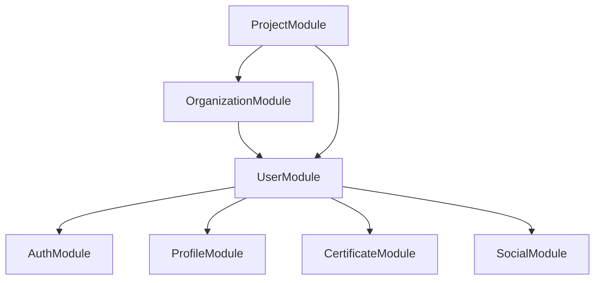
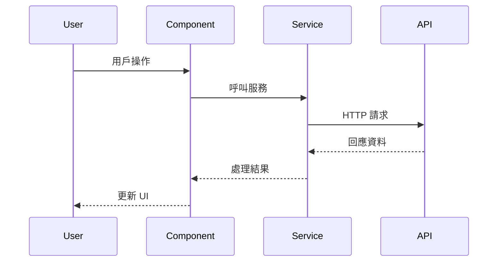
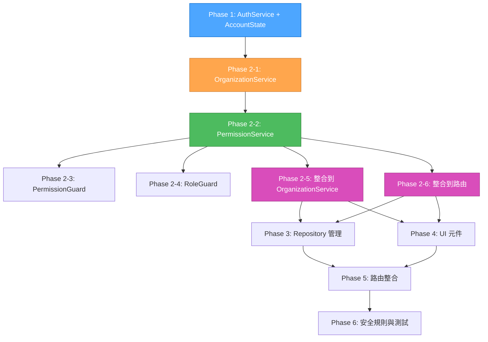
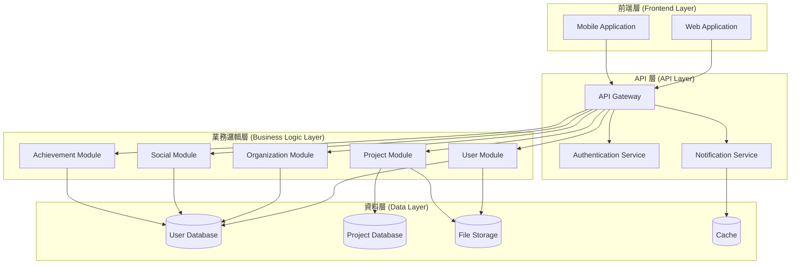
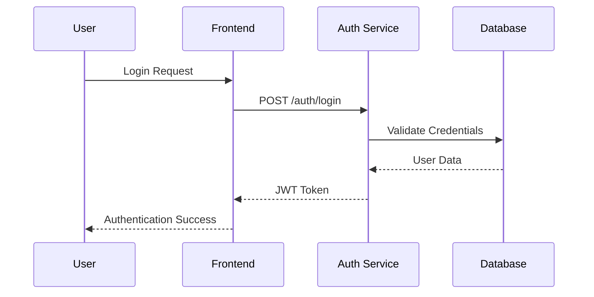
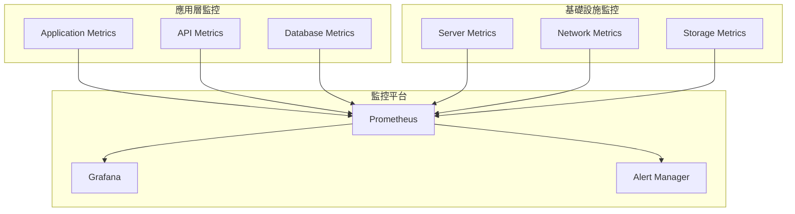
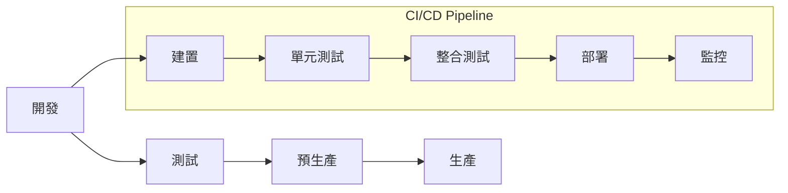
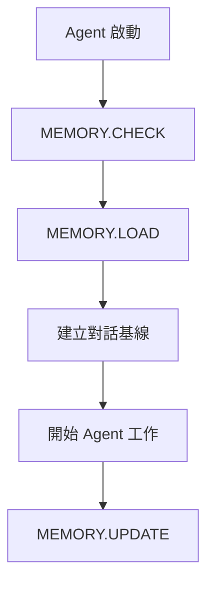
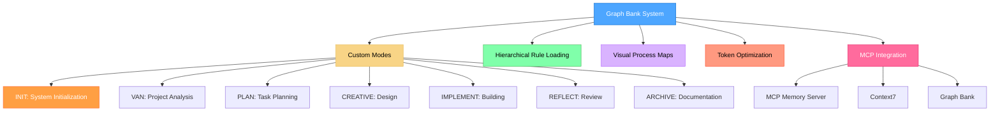
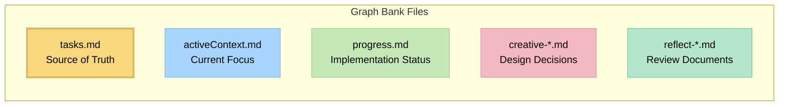

This file is a merged representation of a subset of the codebase, containing specifically included files and files not matching ignore patterns, combined into a single document by Repomix.
The content has been processed where content has been compressed (code blocks are separated by ⋮---- delimiter).

# File Summary

## Purpose
This file contains a packed representation of a subset of the repository's contents that is considered the most important context.
It is designed to be easily consumable by AI systems for analysis, code review,
or other automated processes.

## File Format
The content is organized as follows:
1. This summary section
2. Repository information
3. Directory structure
4. Repository files (if enabled)
5. Multiple file entries, each consisting of:
  a. A header with the file path (## File: path/to/file)
  b. The full contents of the file in a code block

## Usage Guidelines
- This file should be treated as read-only. Any changes should be made to the
  original repository files, not this packed version.
- When processing this file, use the file path to distinguish
  between different files in the repository.
- Be aware that this file may contain sensitive information. Handle it with
  the same level of security as you would the original repository.

## Notes
- Some files may have been excluded based on .gitignore rules and Repomix's configuration
- Binary files are not included in this packed representation. Please refer to the Repository Structure section for a complete list of file paths, including binary files
- Only files matching these patterns are included: **/*.{ts,html,scss,json,md}
- Files matching these patterns are excluded: **/node_modules/**, **/dist/**, **/test-out/**, **/.git/**, **/yarn.lock, **/package-lock.json
- Files matching patterns in .gitignore are excluded
- Files matching default ignore patterns are excluded
- Content has been compressed - code blocks are separated by ⋮---- delimiter
- Files are sorted by Git change count (files with more changes are at the bottom)

# Directory Structure
```
.cursor/
  mcp.json
angular/
  src/
    app/
      core/
        guards/
          permission.guard.ts
        models/
          auth.model.ts
        services/
          auth.service.ts
          organization.service.ts
          permission.service.ts
          repository.service.ts
        utils/
          validation.utils.ts
      dashboard/
        admin.component.ts
        dashboard.component.ts
        editor.component.ts
        viewer.component.ts
      features/
        organization/
          components/
            organization-card.component.ts
            organization-roles.component.ts
            security-manager.component.ts
            team-management.component.ts
          models/
            github-aligned-organization.model.ts
          routes/
            organization.routes.ts
          services/
            github-aligned-api.service.ts
            permission-calculation.service.ts
          index.ts
        repository/
          components/
            collaborator-management.component.ts
            repository-detail.component.ts
            repository-list.component.ts
          models/
            repository.model.ts
          routes/
            repository.routes.ts
        user/
          auth/
            auth.guard.ts
            auth.service.ts
            index.ts
            login.component.ts
            role.guard.ts
            signup.component.ts
            unauthorized.component.ts
          profile/
            profile-management.component.ts
          index.ts
          user.model.ts
          user.routes.ts
          user.service.ts
      landing/
        landing.component.ts
      app.config.ts
      app.html
      app.routes.ts
      app.scss
      app.spec.ts
      app.ts
    environments/
      environment.prod.ts
      environment.sample.ts
    index.html
    main.ts
    styles.scss
  angular.json
  firebase.json
  package.json
  README.md
  tsconfig.app.json
  tsconfig.json
  tsconfig.spec.json
docs/
  account.md
  DEVELOPMENT_GUIDE.md
  PROJECT_STRUCTURE.md
  SYSTEM_ARCHITECTURE.md
  TREE.md
graph-bank/
  activeContext.md
  plan-github-account-architecture.md
  plan-qa-final-report.md
  plan-qa-quality-check-report.md
  productContext.md
  progress.md
  projectbrief.md
  qa-task-logic-validation-report.md
  systemPatterns.md
  tasks.md
  techContext.md
AGENTS.md
memory.json
README.md
repo-complete-analysis.md
repomix-dev-workflow.md
SYSTEM_ARCHITECTURE.md
TREE.md
```

# Files

## File: angular/src/app/landing/landing.component.ts
````typescript
import { Component, inject } from '@angular/core';
import { CommonModule } from '@angular/common';
import { Router } from '@angular/router';
import { MatCardModule } from '@angular/material/card';
import { MatButtonModule } from '@angular/material/button';
import { MatIconModule } from '@angular/material/icon';
import { MatToolbarModule } from '@angular/material/toolbar';
import { MatDividerModule } from '@angular/material/divider';
⋮----
export class LandingComponent {
⋮----
navigateToLogin()
⋮----
navigateToSignup()
````

## File: repo-complete-analysis.md
````markdown
# REPO 模式完整倉庫分析報告

## 📊 分析摘要

**分析時間**: 2025-10-18  
**專案狀態**: Phase 3 Repository 管理系統已完成  
**分析模式**: 完整倉庫源碼分析  
**分析範圍**: 全專案結構 + 核心文檔 + 系統架構  

## 🎯 專案概覽

### 專案基本信息
- **專案名稱**: Graph Bank System v0.8-beta (cursor-memory-bank)
- **專案類型**: Angular 20.1.0 + Firebase 11.10.0 企業級應用
- **複雜度等級**: Level 4 - Complex System
- **當前階段**: Phase 3 Repository 管理系統已完成
- **開發環境**: Windows 11, Node.js v22.20.0, yarn v1.22.22

### 技術棧分析
- **前端框架**: Angular 20.1.0 (最新版本，使用 Control Flow @if/@for)
- **狀態管理**: Angular Signals (現代化響應式狀態管理)
- **UI 框架**: Angular Material 20.1.0 + Material Design 3
- **後端服務**: Firebase 11.10.0 (完整服務套件)
- **認證系統**: Firebase Auth + 自定義權限管理
- **資料庫**: Firestore (NoSQL 文檔資料庫)
- **包管理器**: yarn (yarn.lock 存在)
- **TypeScript**: 5.8.2 (嚴格模式)

## 🏗️ 專案架構分析

### 目錄結構
```
cursor-memory-bank/
├── angular/                    # Angular 應用主目錄
│   ├── src/app/               # 應用源碼
│   │   ├── core/             # 核心服務和模型
│   │   ├── features/         # 功能模組
│   │   ├── dashboard/        # 儀表板組件
│   │   └── landing/          # 首頁組件
│   ├── dist/                 # 構建輸出
│   └── node_modules/         # 依賴包
├── docs/                     # 專案文檔
├── graph-bank/              # Graph Bank 系統文件
├── .cursor/rules/           # Cursor 規則配置
└── memory.json             # MCP Memory Server 數據
```

### 核心模組分析

#### 1. 認證與權限系統
- **AuthService**: 現代化認證服務，使用 Signals 狀態管理
- **PermissionService**: 權限計算和驗證服務
- **PermissionGuard**: 路由守衛，保護受控路由
- **AccountState**: 統一帳戶狀態管理

#### 2. 組織管理系統
- **OrganizationService**: 組織 CRUD 操作
- **OrganizationComponent**: 組織管理界面
- **GitHub 對齊架構**: Account/User/Organization 模型設計

#### 3. Repository 管理系統
- **RepositoryService**: 倉庫管理服務
- **RepositoryListComponent**: 倉庫列表組件
- **RepositoryDetailComponent**: 倉庫詳情組件
- **CollaboratorManagementComponent**: 協作者管理組件

#### 4. 用戶管理系統
- **UserService**: 用戶管理服務
- **LoginComponent**: 登入組件
- **SignupComponent**: 註冊組件
- **LandingComponent**: 首頁組件

## 📈 專案狀態分析

### 已完成功能 (Phase 1-3)
✅ **Phase 1: 基礎清理與現代化** (8個任務)
- 刪除重複的認證組件
- 更新核心模型實現
- 建立驗證工具
- 更新認證服務使用 AccountState
- 修改登入註冊組件
- 更新路由守衛
- 更新路由配置

✅ **Phase 2: 核心服務現代化** (6個任務)
- 建立權限服務
- 建立權限守衛
- 更新組織服務
- 修改角色守衛
- 更新所有路由使用權限守衛
- 更新所有服務使用 Signals

✅ **Phase 3: Repository 管理系統** (7個任務)
- 建立倉庫服務
- 建立倉庫模型
- 建立倉庫列表組件
- 建立倉庫詳情組件
- 建立協作者管理組件
- 建立倉庫路由
- 更新應用路由

### 待完成功能 (Phase 4-6)
⏳ **Phase 4: 組織/團隊管理 UI** (6個任務)
- 組織管理界面
- 團隊管理界面
- 成員管理界面
- 權限管理界面
- 組織設定界面
- 團隊協作界面

⏳ **Phase 5: 路由與權限整合** (5個任務)
- 路由權限整合
- 動態權限更新
- 組織上下文切換
- 權限審計
- 安全規則整合

⏳ **Phase 6: 安全規則與測試** (7個任務)
- Firestore 安全規則
- 單元測試
- 整合測試
- 端到端測試
- 安全測試
- 效能測試
- 部署配置

## 🔍 代碼品質分析

### 現代化特性
✅ **Angular v20 Control Flow**: 使用 @if/@for 語法替代 *ngIf/*ngFor
✅ **Signals 狀態管理**: 現代化響應式狀態管理
✅ **Standalone Components**: 獨立組件架構
✅ **TypeScript 嚴格模式**: 類型安全保證

### 架構模式
✅ **GitHub 式權限系統**: Account/User/Organization 模型設計
✅ **分層架構**: Core/Features 清晰分離
✅ **服務導向**: 核心服務統一管理
✅ **守衛模式**: 路由和權限保護

### 代碼組織
✅ **模組化設計**: 功能模組清晰分離
✅ **服務分層**: Core 服務和 Feature 服務分層
✅ **組件分離**: UI 組件和業務邏輯分離
✅ **路由配置**: 統一路由管理

## 🚨 發現的問題

### 1. 重複服務問題
- `features/user/auth/auth.service.ts` 與 `core/services/auth.service.ts` 重複
- 建議保留 core 目錄下的現代化實現

### 2. 構建預算警告
- 當前構建大小: 1.14 MB > 1.00 MB 預算限制
- 建議進行代碼分割和優化

### 3. 缺少首頁組件
- 已建立 `landing.component.ts` 但需要完善
- 路由配置需要更新

## 📊 構建狀態

### 構建結果
- **狀態**: ✅ 成功
- **大小**: 1.14 MB (超出預算 14%)
- **警告**: 預算超標但功能正常
- **錯誤**: 無編譯錯誤

### 依賴狀態
- **Node.js**: v22.20.0 ✅
- **npm**: v10.9.3 ✅
- **yarn**: v1.22.22 ✅
- **Angular**: 20.1.0 ✅
- **Firebase**: 11.10.0 ✅
- **TypeScript**: 5.8.2 ✅

## 🔧 技術債務分析

### 高優先級
1. **清理重複服務**: 刪除 features/user/auth/auth.service.ts
2. **優化構建大小**: 實施代碼分割
3. **完善首頁組件**: 建立完整的 Landing Page

### 中優先級
1. **添加單元測試**: 提高測試覆蓋率
2. **優化性能**: 實施懶加載
3. **完善文檔**: 添加 API 文檔

### 低優先級
1. **代碼重構**: 優化代碼結構
2. **添加監控**: 實施錯誤追蹤
3. **國際化**: 添加多語言支援

## 📋 建議改進

### 短期改進 (1-2週)
1. 清理重複的 AuthService 實現
2. 完善 Landing Page 組件
3. 優化構建配置減少包大小
4. 添加基本的單元測試

### 中期改進 (1-2個月)
1. 完成 Phase 4-6 的實施
2. 實施完整的測試套件
3. 優化性能和用戶體驗
4. 完善安全規則

### 長期改進 (3-6個月)
1. 實施微服務架構
2. 添加高級分析功能
3. 實施 CI/CD 流程
4. 準備生產部署

## 🎯 下一步行動

### 立即行動
1. **清理重複代碼**: 刪除重複的 AuthService
2. **完善首頁**: 建立完整的 Landing Page
3. **優化構建**: 實施代碼分割減少包大小

### 繼續開發
1. **Phase 4**: 開始組織/團隊管理 UI 開發
2. **測試覆蓋**: 添加單元測試和整合測試
3. **文檔完善**: 更新開發文檔和 API 文檔

## 📊 專案健康度評分

| 項目 | 評分 | 說明 |
|------|------|------|
| 代碼品質 | 8.5/10 | 現代化 Angular 架構，使用 Signals |
| 架構設計 | 9.0/10 | GitHub 式權限系統，分層清晰 |
| 功能完整性 | 7.0/10 | Phase 1-3 完成，Phase 4-6 待完成 |
| 測試覆蓋 | 3.0/10 | 缺少測試，需要添加 |
| 文檔完整性 | 8.0/10 | 系統架構文檔完整 |
| 性能表現 | 7.5/10 | 構建成功但有預算警告 |
| 安全性 | 8.0/10 | Firebase 安全規則基礎完善 |

**總體評分**: 7.5/10 - 優秀的現代化 Angular 專案，架構設計良好，需要完善測試和優化性能。

## 🏆 結論

Graph Bank System 是一個設計優秀的現代化 Angular 應用，採用最新的 Angular v20 特性和 Signals 狀態管理。專案架構清晰，代碼品質良好，Phase 1-3 已完成，為後續開發奠定了堅實基礎。

**主要優勢**:
- 現代化技術棧和架構設計
- 清晰的模組分離和服務分層
- GitHub 式權限系統設計
- 完整的系統架構文檔

**需要改進**:
- 清理重複代碼
- 添加測試覆蓋
- 優化構建性能
- 完善首頁組件

**建議**: 繼續按照 Phase 4-6 的計劃進行開發，同時優先處理技術債務，確保專案的可維護性和可擴展性。

---

**REPO 模式分析完成** ✅  
**分析時間**: 2025-10-18 12:13  
**分析範圍**: 完整倉庫源碼 + 系統架構 + 專案文檔  
**狀態**: 專案健康，準備進入下一個開發階段
````

## File: angular/src/app/core/services/permission.service.ts
````typescript
// src/app/core/services/permission.service.ts
⋮----
import { Injectable, inject, signal, computed } from '@angular/core';
import { Firestore, doc, docData } from '@angular/fire/firestore';
import { AuthService } from './auth.service';
import { OrganizationService } from './organization.service';
import { OrgRole, TeamRole, ACLAbility } from '../models/auth.model';
import { map } from 'rxjs/operators';
⋮----
export class PermissionService
⋮----
// 當前組織 ID Signal
⋮----
// 組織成員資格 Signal
⋮----
// Computed Signals for permissions
⋮----
// 設置當前組織
async setCurrentOrganization(orgId: string)
⋮----
// 載入組織成員資格
private async loadOrganizationMembership(orgId: string)
⋮----
// 權限檢查方法
can(action: string, resource: string): boolean
⋮----
// 基本權限檢查
⋮----
// 組織特定權限檢查
⋮----
return true; // 所有成員都可以讀取
⋮----
// 團隊權限檢查
async canManageTeam(teamId: string): Promise<boolean>
⋮----
// 組織管理員和擁有者可以管理所有團隊
⋮----
// 檢查是否為團隊維護者
⋮----
// Repository 權限檢查
async canAccessRepository(repositoryId: string): Promise<boolean>
⋮----
// 如果是公開 Repository，任何人都可以讀取
⋮----
// 檢查是否為擁有者
⋮----
// 檢查是否為協作者
⋮----
// 檢查 Repository 寫入權限
async canWriteRepository(repositoryId: string): Promise<boolean>
⋮----
// 檢查是否為擁有者
⋮----
// 檢查協作者權限
⋮----
// 檢查權限等級
⋮----
// 檢查 Repository 管理權限
async canManageRepository(repositoryId: string): Promise<boolean>
⋮----
// 檢查是否為擁有者
⋮----
// 檢查協作者權限
⋮----
// 檢查權限等級
⋮----
// 清除組織上下文
clearOrganizationContext()
⋮----
// 檢查用戶角色
hasRole(role: string): boolean
⋮----
// 檢查組織角色
hasOrgRole(role: OrgRole): boolean
⋮----
// 檢查是否為組織擁有者
isOrganizationOwner(): boolean
⋮----
// 檢查是否為組織管理員
isOrganizationAdmin(): boolean
````

## File: angular/src/app/core/services/repository.service.ts
````typescript
// src/app/core/services/repository.service.ts
⋮----
import { Injectable, inject, signal, computed } from '@angular/core';
import {
  Firestore,
  doc,
  docData,
  collection,
  collectionData,
  query,
  where,
  addDoc,
  setDoc,
  updateDoc,
  deleteDoc,
  getDoc,
  DocumentData
} from '@angular/fire/firestore';
import { Observable, map, switchMap, combineLatest, of } from 'rxjs';
import { 
  Repository, 
  RepositoryCollaborator, 
  RepositoryTeamAccess,
  Account
} from '../models/auth.model';
import { AuthService } from './auth.service';
import { PermissionService } from './permission.service';
import { ValidationUtils } from '../utils/validation.utils';
⋮----
export class RepositoryService {
⋮----
// Signals for state management
⋮----
// Readonly signals
⋮----
// Computed signals
⋮----
async createRepository(
    name: string,
    description?: string,
    isPrivate: boolean = true,
    ownerId?: string
): Promise<string>
⋮----
// 驗證 Repository 名稱
⋮----
// 如果擁有者不是當前用戶，添加協作者
⋮----
getRepository(repoId: string): Observable<Repository | undefined>
⋮----
async loadRepository(repoId: string): Promise<void>
⋮----
getUserRepositories(userId: string): Observable<Repository[]>
⋮----
getOrganizationRepositories(orgId: string): Observable<Repository[]>
⋮----
async updateRepository(
    repoId: string,
    updates: Partial<Repository>
): Promise<void>
⋮----
// 檢查權限
⋮----
// 更新本地狀態
⋮----
async deleteRepository(repoId: string): Promise<void>
⋮----
// 檢查權限
⋮----
// 清除本地狀態
⋮----
getRepositoryCollaborators(repoId: string): Observable<RepositoryCollaborator[]>
⋮----
async addCollaborator(
    repoId: string,
    userId: string,
    permission: 'read' | 'triage' | 'write' | 'maintain' | 'admin',
    invitedBy?: string
): Promise<void>
⋮----
// 檢查權限
⋮----
async updateCollaboratorPermission(
    repoId: string,
    userId: string,
    newPermission: 'read' | 'triage' | 'write' | 'maintain' | 'admin'
): Promise<void>
⋮----
// 檢查權限
⋮----
async removeCollaborator(repoId: string, userId: string): Promise<void>
⋮----
// 檢查權限
⋮----
getRepositoryTeamAccess(repoId: string): Observable<RepositoryTeamAccess[]>
⋮----
async addTeamAccess(
    repoId: string,
    teamId: string,
    permission: 'read' | 'triage' | 'write' | 'maintain' | 'admin',
    grantedBy?: string
): Promise<void>
⋮----
// 檢查權限
⋮----
async updateTeamAccessPermission(
    repoId: string,
    teamId: string,
    newPermission: 'read' | 'triage' | 'write' | 'maintain' | 'admin'
): Promise<void>
⋮----
// 檢查權限
⋮----
async removeTeamAccess(repoId: string, teamId: string): Promise<void>
⋮----
// 檢查權限
⋮----
private getRoleName(permission: string): string
⋮----
// 清除錯誤
clearError()
⋮----
// 清除 Repository 上下文
clearRepositoryContext()
````

## File: angular/src/app/dashboard/admin.component.ts
````typescript
import {
  Component,
  inject,
  OnInit,
  Injector,
  runInInjectionContext
} from '@angular/core';
import { CommonModule } from '@angular/common';
import {
  Firestore,
  collection,
  collectionData,
  doc,
  updateDoc
} from '@angular/fire/firestore';
import { MatTableModule } from '@angular/material/table';
import { MatCardModule } from '@angular/material/card';
import { MatSelectModule } from '@angular/material/select';
import { MatFormFieldModule } from '@angular/material/form-field';
import { MatProgressSpinnerModule } from '@angular/material/progress-spinner';
import { MatSnackBar, MatSnackBarModule } from '@angular/material/snack-bar';
import { MatIconModule } from '@angular/material/icon';
import { MatDividerModule } from '@angular/material/divider';
import { MatToolbarModule } from '@angular/material/toolbar';
import { MatButtonModule } from '@angular/material/button';
import { Router } from '@angular/router';
⋮----
interface UserData {
  uid: string;
  email: string;
  role: string;
}
⋮----
export class AdminComponent implements OnInit
⋮----
ngOnInit()
⋮----
loadUsers()
⋮----
updateRole(uid: string, newRole: string)
⋮----
refresh()
⋮----
logout()
````

## File: angular/src/app/dashboard/dashboard.component.ts
````typescript
import { Component, inject, signal, computed } from '@angular/core';
import { CommonModule } from '@angular/common';
import { Router } from '@angular/router';
import { MatCardModule } from '@angular/material/card';
import { MatButtonModule } from '@angular/material/button';
import { MatIconModule } from '@angular/material/icon';
import { MatToolbarModule } from '@angular/material/toolbar';
import { MatDividerModule } from '@angular/material/divider';
import { MatSnackBarModule } from '@angular/material/snack-bar';
import { AuthService } from '../core/services/auth.service';
⋮----
export class DashboardComponent {
⋮----
// 使用 Signals 獲取當前用戶信息
⋮----
navigateToAccount()
⋮----
navigateToOrganizations()
⋮----
navigateToRepositories()
⋮----
logout()
````

## File: angular/src/app/dashboard/editor.component.ts
````typescript
import {
  Component,
  inject,
  OnInit
} from '@angular/core';
import { CommonModule } from '@angular/common';
import { FormsModule } from '@angular/forms';
import {
  Firestore,
  collection,
  addDoc,
  collectionData,
  updateDoc,
  deleteDoc,
  doc
} from '@angular/fire/firestore';
import { MatCardModule } from '@angular/material/card';
import { MatFormFieldModule } from '@angular/material/form-field';
import { MatInputModule } from '@angular/material/input';
import { MatToolbarModule } from '@angular/material/toolbar';
import { MatButtonModule } from '@angular/material/button';
import { MatSnackBar, MatSnackBarModule } from '@angular/material/snack-bar';
import { MatIconModule } from '@angular/material/icon';
import { Router } from '@angular/router';
⋮----
interface Article {
  id?: string;
  title: string;
  content: string;
  createdAt: Date;
}
⋮----
export class EditorComponent implements OnInit
⋮----
ngOnInit()
⋮----
async saveArticle()
⋮----
editArticle(article: Article)
⋮----
async deleteArticle(id?: string)
⋮----
logout()
````

## File: angular/src/app/dashboard/viewer.component.ts
````typescript
import { Component, inject, OnInit } from '@angular/core';
import { CommonModule } from '@angular/common';
import { Firestore, collection, collectionData } from '@angular/fire/firestore';
import { MatCardModule } from '@angular/material/card';
import { MatToolbarModule } from '@angular/material/toolbar';
import { MatIconModule } from '@angular/material/icon';
import { MatButtonModule } from '@angular/material/button';
import { Router } from '@angular/router';
⋮----
interface Article {
  id?: string;
  title: string;
  content: string;
  createdAt: Date;
}
⋮----
export class ViewerComponent implements OnInit
⋮----
ngOnInit()
⋮----
getDate(date: any)
⋮----
logout()
````

## File: angular/src/app/features/organization/components/organization-card.component.ts
````typescript
import { Component, Input, Output, EventEmitter, signal, computed } from '@angular/core';
import { CommonModule } from '@angular/common';
import { MatCardModule } from '@angular/material/card';
import { MatButtonModule } from '@angular/material/button';
import { MatIconModule } from '@angular/material/icon';
import { MatChipsModule } from '@angular/material/chips';
import { MatMenuModule } from '@angular/material/menu';
import { MatDividerModule } from '@angular/material/divider';
import { GitHubAlignedOrganization } from '../models/github-aligned-organization.model';
⋮----
/**
 * 組織卡片組件
 * 使用 Material Design 3 設計，對齊 GitHub 的組織卡片風格
 */
⋮----
export class OrganizationCardComponent {
⋮----
// 計算屬性
⋮----
/**
   * 獲取組織類型標籤
   */
getTypeLabel(type?: string): string
⋮----
/**
   * 檢視組織
   */
onView(): void
⋮----
/**
   * 編輯組織
   */
onEdit(): void
⋮----
/**
   * 組織設定
   */
onSettings(): void
⋮----
/**
   * 成員管理
   */
onMembers(): void
⋮----
/**
   * 團隊管理
   */
onTeams(): void
⋮----
/**
   * 刪除組織
   */
onDelete(): void
````

## File: angular/src/app/features/organization/components/organization-roles.component.ts
````typescript
import { Component, OnInit, signal, computed, inject } from '@angular/core';
import { CommonModule } from '@angular/common';
import { MatCardModule } from '@angular/material/card';
import { MatButtonModule } from '@angular/material/button';
import { MatIconModule } from '@angular/material/icon';
import { MatTableModule } from '@angular/material/table';
import { MatChipsModule } from '@angular/material/chips';
import { MatDialogModule, MatDialog } from '@angular/material/dialog';
import { MatSnackBarModule, MatSnackBar } from '@angular/material/snack-bar';
import { MatTooltipModule } from '@angular/material/tooltip';
import { MatMenuModule } from '@angular/material/menu';
import { MatProgressSpinnerModule } from '@angular/material/progress-spinner';
import { MatBadgeModule } from '@angular/material/badge';
⋮----
import { OrganizationRole, Permission } from '../models/github-aligned-organization.model';
import { PermissionCalculationService } from '../services/permission-calculation.service';
⋮----
/**
 * 組織角色系統組件
 * 管理組織的角色和權限設定
 */
⋮----
export class OrganizationRolesComponent implements OnInit {
⋮----
// 響應式狀態
⋮----
// 公開的只讀 signals
⋮----
// 計算屬性
⋮----
// 表格配置
⋮----
ngOnInit(): void
⋮----
/**
   * 載入組織角色資料
   */
private async loadOrganizationRoles(): Promise<void>
⋮----
// 從權限服務獲取組織角色資料
⋮----
/**
   * 獲取角色圖標
   */
getRoleIcon(level: number): string
⋮----
/**
   * 獲取等級顏色
   */
getLevelColor(level: number): 'primary' | 'accent' | 'warn'
⋮----
/**
   * 獲取唯一權限範圍
   */
getUniqueScopes(permissions: Permission[]): string[]
⋮----
/**
   * 獲取範圍顏色
   */
getScopeColor(scope: string): 'primary' | 'accent' | 'warn'
⋮----
/**
   * 獲取範圍標籤
   */
getScopeLabel(scope: string): string
⋮----
/**
   * 格式化日期
   */
formatDate(date: Date): string
⋮----
/**
   * 開啟新增角色對話框
   */
openCreateRoleDialog(): void
⋮----
// TODO: 實作新增角色對話框
⋮----
/**
   * 查看角色詳情
   */
viewRoleDetails(role: OrganizationRole): void
⋮----
// TODO: 實作查看角色詳情對話框
⋮----
/**
   * 編輯角色
   */
editRole(role: OrganizationRole): void
⋮----
// TODO: 實作編輯角色對話框
⋮----
/**
   * 複製角色
   */
duplicateRole(role: OrganizationRole): void
⋮----
// TODO: 實作複製角色功能
⋮----
/**
   * 刪除角色
   */
deleteRole(role: OrganizationRole): void
⋮----
// TODO: 實作刪除角色確認對話框
````

## File: angular/src/app/features/organization/components/security-manager.component.ts
````typescript
import { Component, OnInit, signal, computed, inject } from '@angular/core';
import { CommonModule } from '@angular/common';
import { MatCardModule } from '@angular/material/card';
import { MatButtonModule } from '@angular/material/button';
import { MatIconModule } from '@angular/material/icon';
import { MatTableModule } from '@angular/material/table';
import { MatChipsModule } from '@angular/material/chips';
import { MatDialogModule, MatDialog } from '@angular/material/dialog';
import { MatSnackBarModule, MatSnackBar } from '@angular/material/snack-bar';
import { MatTooltipModule } from '@angular/material/tooltip';
import { MatMenuModule } from '@angular/material/menu';
import { MatProgressSpinnerModule } from '@angular/material/progress-spinner';
⋮----
import { SecurityManager, SecurityPermission } from '../models/github-aligned-organization.model';
import { PermissionCalculationService } from '../services/permission-calculation.service';
⋮----
/**
 * 安全管理器組件
 * 管理組織的安全權限和安全管理員
 */
⋮----
export class SecurityManagerComponent implements OnInit {
⋮----
// 響應式狀態
⋮----
// 公開的只讀 signals
⋮----
// 計算屬性
⋮----
// 表格配置
⋮----
ngOnInit(): void
⋮----
/**
   * 載入安全管理員資料
   */
private async loadSecurityManagers(): Promise<void>
⋮----
// 從權限服務獲取安全管理員資料
⋮----
/**
   * 獲取類型顏色
   */
getTypeColor(type: 'user' | 'team'): 'primary' | 'accent' | 'warn'
⋮----
/**
   * 獲取類型圖標
   */
getTypeIcon(type: 'user' | 'team'): string
⋮----
/**
   * 獲取類型標籤
   */
getTypeLabel(type: 'user' | 'team'): string
⋮----
/**
   * 獲取實體名稱
   */
getEntityName(manager: SecurityManager): string
⋮----
// 這裡應該根據 entityId 查找實際的用戶名或團隊名
// 簡化實作，直接返回 ID
⋮----
/**
   * 格式化日期
   */
formatDate(date: Date): string
⋮----
/**
   * 開啟新增安全管理員對話框
   */
openAddSecurityManagerDialog(): void
⋮----
// TODO: 實作新增安全管理員對話框
⋮----
/**
   * 查看權限
   */
viewPermissions(manager: SecurityManager): void
⋮----
// TODO: 實作查看權限對話框
⋮----
/**
   * 編輯安全管理員
   */
editSecurityManager(manager: SecurityManager): void
⋮----
// TODO: 實作編輯安全管理員對話框
⋮----
/**
   * 移除安全管理員
   */
removeSecurityManager(manager: SecurityManager): void
⋮----
// TODO: 實作移除安全管理員確認對話框
````

## File: angular/src/app/features/organization/components/team-management.component.ts
````typescript
import { Component, Input, Output, EventEmitter, signal, computed } from '@angular/core';
import { CommonModule } from '@angular/common';
import { MatTreeModule } from '@angular/material/tree';
import { MatIconModule } from '@angular/material/icon';
import { MatButtonModule } from '@angular/material/button';
import { MatChipsModule } from '@angular/material/chips';
import { MatMenuModule } from '@angular/material/menu';
import { MatDialogModule } from '@angular/material/dialog';
import { MatDividerModule } from '@angular/material/divider';
import { Team } from '../models/github-aligned-organization.model';
⋮----
/**
 * 團隊節點介面
 */
interface TeamNode extends Team {
  children: TeamNode[];
  level: number;
  expandable: boolean;
}
⋮----
/**
 * 團隊層級管理組件
 * 使用 Material Design 3 的 Tree 組件實作 GitHub 風格的團隊層級結構
 */
⋮----
export class TeamHierarchyComponent {
⋮----
// 樹狀結構轉換器
⋮----
// Tree 控制
⋮----
// 計算屬性
⋮----
constructor()
⋮----
// 監聽 teams 變化並更新 dataSource
⋮----
/**
   * 建立團隊層級結構
   */
private buildTeamHierarchy(teams: Team[]): TeamNode[]
⋮----
// 初始化所有團隊
⋮----
// 建立層級關係
⋮----
/**
   * 獲取節點縮排
   */
getNodePadding(node: TeamNode): number
⋮----
/**
   * 檢查是否有子節點
   */
⋮----
/**
   * 獲取團隊圖示
   */
getTeamIcon(privacy: 'open' | 'closed'): string
⋮----
/**
   * 獲取隱私標籤
   */
getPrivacyLabel(privacy: 'open' | 'closed'): string
⋮----
/**
   * 獲取權限標籤
   */
getPermissionLabel(permission: 'read' | 'write' | 'admin'): string
⋮----
/**
   * 新增團隊
   */
onCreateTeam(): void
⋮----
/**
   * 新增子團隊
   */
onCreateSubTeam(parentTeam: Team): void
⋮----
/**
   * 檢視團隊
   */
onViewTeam(team: Team): void
⋮----
/**
   * 編輯團隊
   */
onEditTeam(team: Team): void
⋮----
/**
   * 管理成員
   */
onManageMembers(team: Team): void
⋮----
/**
   * 刪除團隊
   */
onDeleteTeam(team: Team): void
⋮----
// Tree 相關類別
import { FlatTreeControl } from '@angular/cdk/tree';
import { MatTreeFlatDataSource, MatTreeFlattener } from '@angular/material/tree';
import { effect } from '@angular/core';
````

## File: angular/src/app/features/organization/models/github-aligned-organization.model.ts
````typescript
/**
 * GitHub 對齊的組織模型
 * 對齊 GitHub REST API 模式的組織管理
 */
export interface GitHubAlignedOrganization {
  id: string;
  slug: string; // GitHub 風格的 URL-friendly 名稱
  name: string;
  description?: string;
  type: 'construction' | 'consulting' | 'supplier';
  profile: OrganizationProfile;
  members: OrganizationMember[];
  teams: Team[];
  securityManagers: SecurityManager[];
  organizationRoles: OrganizationRole[];
  createdAt: Date;
  updatedAt: Date;
}
⋮----
slug: string; // GitHub 風格的 URL-friendly 名稱
⋮----
export interface OrganizationProfile {
  website?: string;
  location?: string;
  email?: string;
  phone?: string;
  avatar?: string;
  banner?: string;
}
⋮----
export interface OrganizationMember {
  id: string;
  userId: string;
  username: string;
  email: string;
  role: OrganizationRole;
  status: 'active' | 'pending' | 'suspended';
  joinedAt: Date;
  lastActiveAt: Date;
}
⋮----
export interface Team {
  id: string;
  slug: string; // GitHub 風格的 slug
  name: string;
  description: string;
  parentTeamId?: string; // 支援層級結構
  privacy: 'open' | 'closed';
  permission: 'read' | 'write' | 'admin';
  members: TeamMember[];
  createdAt: Date;
  updatedAt: Date;
}
⋮----
slug: string; // GitHub 風格的 slug
⋮----
parentTeamId?: string; // 支援層級結構
⋮----
export interface TeamMember {
  id: string;
  userId: string;
  username: string;
  role: 'member' | 'maintainer' | 'admin';
  joinedAt: Date;
}
⋮----
export interface SecurityManager {
  id: string;
  type: 'user' | 'team';
  entityId: string; // userId 或 teamId
  permissions: SecurityPermission[];
  assignedAt: Date;
  assignedBy: string;
}
⋮----
entityId: string; // userId 或 teamId
⋮----
export interface SecurityPermission {
  id: string;
  name: string;
  description: string;
  resource: string; // 資源類型
  action: string; // 操作類型
  conditions?: Record<string, any>; // 額外條件
}
⋮----
resource: string; // 資源類型
action: string; // 操作類型
conditions?: Record<string, any>; // 額外條件
⋮----
export interface OrganizationRole {
  id: string;
  name: string;
  description: string;
  permissions: Permission[];
  level: number; // 角色等級
  isSystemRole: boolean; // 是否為系統預設角色
  createdAt: Date;
}
⋮----
level: number; // 角色等級
isSystemRole: boolean; // 是否為系統預設角色
⋮----
export interface Permission {
  id: string;
  name: string;
  description: string;
  resource: string;
  action: string;
  scope: 'organization' | 'team' | 'project' | 'user';
}
⋮----
// API 請求/響應模型
export interface CreateOrganizationRequest {
  name: string;
  slug: string;
  description?: string;
  type: 'construction' | 'consulting' | 'supplier';
  profile?: Partial<OrganizationProfile>;
}
⋮----
export interface UpdateOrganizationRequest {
  name?: string;
  description?: string;
  profile?: Partial<OrganizationProfile>;
}
⋮----
export interface CreateTeamRequest {
  name: string;
  slug: string;
  description: string;
  parentTeamId?: string;
  privacy: 'open' | 'closed';
  permission: 'read' | 'write' | 'admin';
}
⋮----
export interface UpdateTeamRequest {
  name?: string;
  description?: string;
  privacy?: 'open' | 'closed';
  permission?: 'read' | 'write' | 'admin';
}
⋮----
export interface InviteMemberRequest {
  email: string;
  role: string;
  message?: string;
}
⋮----
export interface UpdateMemberRoleRequest {
  userId: string;
  role: string;
}
⋮----
// 權限檢查結果
export interface PermissionResult {
  granted: boolean;
  reason?: string;
  level?: 'read' | 'write' | 'admin' | 'none';
  expiresAt?: Date;
}
````

## File: angular/src/app/features/organization/routes/organization.routes.ts
````typescript
import { Routes } from '@angular/router';
⋮----
/**
 * 組織模組的路由配置
 * 對齊 TREE.md 的組織管理路由結構
 */
````

## File: angular/src/app/features/organization/services/github-aligned-api.service.ts
````typescript
import { Injectable, inject } from '@angular/core';
import { HttpClient } from '@angular/common/http';
import { Observable } from 'rxjs';
import { 
  GitHubAlignedOrganization, 
  CreateOrganizationRequest, 
  UpdateOrganizationRequest,
  Team,
  TeamMember,
  CreateTeamRequest,
  UpdateTeamRequest,
  OrganizationMember,
  InviteMemberRequest,
  UpdateMemberRoleRequest,
  SecurityManager,
  OrganizationRole
} from '../models/github-aligned-organization.model';
⋮----
/**
 * GitHub 對齊的 API 服務
 * 實作對齊 GitHub REST API 模式的組織管理 API
 */
⋮----
export class GitHubAlignedApiService {
⋮----
// ==================== 組織管理 API ====================
⋮----
/**
   * 獲取組織資訊 (對齊 GitHub: GET /orgs/{org})
   */
getOrganization(orgSlug: string): Observable<GitHubAlignedOrganization>
⋮----
/**
   * 創建組織 (對齊 GitHub: POST /orgs)
   */
createOrganization(org: CreateOrganizationRequest): Observable<GitHubAlignedOrganization>
⋮----
/**
   * 更新組織 (對齊 GitHub: PUT /orgs/{org})
   */
updateOrganization(orgSlug: string, updates: UpdateOrganizationRequest): Observable<GitHubAlignedOrganization>
⋮----
/**
   * 刪除組織 (對齊 GitHub: DELETE /orgs/{org})
   */
deleteOrganization(orgSlug: string): Observable<void>
⋮----
// ==================== 組織成員管理 API ====================
⋮----
/**
   * 獲取組織成員列表 (對齊 GitHub: GET /orgs/{org}/members)
   */
getOrganizationMembers(orgSlug: string): Observable<OrganizationMember[]>
⋮----
/**
   * 邀請成員加入組織 (對齊 GitHub: POST /orgs/{org}/members)
   */
inviteMember(orgSlug: string, invite: InviteMemberRequest): Observable<OrganizationMember>
⋮----
/**
   * 更新成員角色 (對齊 GitHub: PUT /orgs/{org}/members/{username})
   */
updateMemberRole(orgSlug: string, userId: string, update: UpdateMemberRoleRequest): Observable<OrganizationMember>
⋮----
/**
   * 移除組織成員 (對齊 GitHub: DELETE /orgs/{org}/members/{username})
   */
removeMember(orgSlug: string, userId: string): Observable<void>
⋮----
// ==================== 團隊管理 API ====================
⋮----
/**
   * 獲取組織團隊列表 (對齊 GitHub: GET /orgs/{org}/teams)
   */
getTeams(orgSlug: string): Observable<Team[]>
⋮----
/**
   * 創建團隊 (對齊 GitHub: POST /orgs/{org}/teams)
   */
createTeam(orgSlug: string, team: CreateTeamRequest): Observable<Team>
⋮----
/**
   * 獲取團隊詳情 (對齊 GitHub: GET /orgs/{org}/teams/{team_slug})
   */
getTeam(orgSlug: string, teamSlug: string): Observable<Team>
⋮----
/**
   * 更新團隊 (對齊 GitHub: PUT /orgs/{org}/teams/{team_slug})
   */
updateTeam(orgSlug: string, teamSlug: string, updates: UpdateTeamRequest): Observable<Team>
⋮----
/**
   * 刪除團隊 (對齊 GitHub: DELETE /orgs/{org}/teams/{team_slug})
   */
deleteTeam(orgSlug: string, teamSlug: string): Observable<void>
⋮----
// ==================== 團隊成員管理 API ====================
⋮----
/**
   * 獲取團隊成員列表 (對齊 GitHub: GET /orgs/{org}/teams/{team_slug}/members)
   */
getTeamMembers(orgSlug: string, teamSlug: string): Observable<TeamMember[]>
⋮----
/**
   * 添加團隊成員 (對齊 GitHub: PUT /orgs/{org}/teams/{team_slug}/members/{username})
   */
addTeamMember(orgSlug: string, teamSlug: string, userId: string): Observable<TeamMember>
⋮----
/**
   * 移除團隊成員 (對齊 GitHub: DELETE /orgs/{org}/teams/{team_slug}/members/{username})
   */
removeTeamMember(orgSlug: string, teamSlug: string, userId: string): Observable<void>
⋮----
// ==================== 安全管理器 API ====================
⋮----
/**
   * 獲取安全管理器列表
   */
getSecurityManagers(orgSlug: string): Observable<SecurityManager[]>
⋮----
/**
   * 創建安全管理器
   */
createSecurityManager(orgSlug: string, manager: Partial<SecurityManager>): Observable<SecurityManager>
⋮----
/**
   * 更新安全管理器
   */
updateSecurityManager(orgSlug: string, managerId: string, updates: Partial<SecurityManager>): Observable<SecurityManager>
⋮----
/**
   * 刪除安全管理器
   */
deleteSecurityManager(orgSlug: string, managerId: string): Observable<void>
⋮----
// ==================== 組織角色 API ====================
⋮----
/**
   * 獲取組織角色列表
   */
getOrganizationRoles(orgSlug: string): Observable<OrganizationRole[]>
⋮----
/**
   * 創建組織角色
   */
createOrganizationRole(orgSlug: string, role: Partial<OrganizationRole>): Observable<OrganizationRole>
⋮----
/**
   * 更新組織角色
   */
updateOrganizationRole(orgSlug: string, roleId: string, updates: Partial<OrganizationRole>): Observable<OrganizationRole>
⋮----
/**
   * 刪除組織角色
   */
deleteOrganizationRole(orgSlug: string, roleId: string): Observable<void>
````

## File: angular/src/app/features/organization/services/permission-calculation.service.ts
````typescript
import { Injectable, signal, computed } from '@angular/core';
import { 
  GitHubAlignedOrganization, 
  Team, 
  SecurityManager, 
  OrganizationRole, 
  PermissionResult 
} from '../models/github-aligned-organization.model';
⋮----
/**
 * 權限計算服務
 * 實作混合權限系統：結合遞迴計算和選擇性快取
 */
⋮----
export class PermissionCalculationService {
⋮----
private readonly CACHE_TTL = 5 * 60 * 1000; // 5分鐘快取
⋮----
// 使用 signals 進行響應式狀態管理
⋮----
// 公開的只讀 signals
⋮----
// 計算屬性
⋮----
/**
   * 主要權限檢查方法
   */
async checkPermission(
    userId: string, 
    resourceId: string, 
    action: string
): Promise<boolean>
⋮----
// 檢查快取
⋮----
// 計算權限
⋮----
// 更新快取
⋮----
/**
   * 遞迴權限計算
   */
private async calculatePermission(
    userId: string, 
    resourceId: string, 
    action: string
): Promise<PermissionResult>
⋮----
// 1. 檢查直接權限
⋮----
// 2. 檢查團隊繼承權限
⋮----
// 3. 檢查組織角色權限
⋮----
// 4. 檢查安全管理器權限
⋮----
/**
   * 檢查直接權限
   */
private async checkDirectPermission(
    userId: string, 
    resourceId: string, 
    action: string
): Promise<PermissionResult>
⋮----
// 檢查是否為組織擁有者
⋮----
// 檢查直接成員權限
⋮----
/**
   * 檢查團隊繼承權限
   */
private async checkTeamInheritedPermission(
    userId: string, 
    resourceId: string, 
    action: string
): Promise<PermissionResult>
⋮----
/**
   * 計算團隊權限
   */
private async calculateTeamPermissions(
    userId: string, 
    teamId: string, 
    action: string
): Promise<PermissionResult>
⋮----
// 檢查直接團隊成員權限
⋮----
// 檢查父團隊繼承權限
⋮----
// 父團隊權限會降級一級
⋮----
/**
   * 檢查組織角色權限
   */
private async checkOrganizationRolePermission(
    userId: string, 
    resourceId: string, 
    action: string
): Promise<PermissionResult>
⋮----
/**
   * 檢查安全管理器權限
   */
private async checkSecurityManagerPermission(
    userId: string, 
    resourceId: string, 
    action: string
): Promise<PermissionResult>
⋮----
// 檢查安全管理器權限範圍
⋮----
// 檢查特定安全管理權限
⋮----
/**
   * 檢查安全管理器權限範圍
   */
private async checkSecurityScope(
    securityRole: SecurityManager, 
    resourceId: string
): Promise<boolean>
⋮----
/**
   * 檢查用戶安全管理範圍
   */
private async checkUserSecurityScope(userId: string, resourceId: string): Promise<boolean>
⋮----
// 實作用戶安全管理範圍檢查邏輯
return true; // 簡化實作
⋮----
/**
   * 檢查團隊安全管理範圍
   */
private async checkTeamSecurityScope(teamId: string, resourceId: string): Promise<boolean>
⋮----
// 實作團隊安全管理範圍檢查邏輯
return true; // 簡化實作
⋮----
/**
   * 檢查特定安全管理權限
   */
private async checkSpecificSecurityPermission(
    securityRole: SecurityManager, 
    action: string
): Promise<PermissionResult>
⋮----
/**
   * 權限等級降級邏輯
   */
private downgradePermissionLevel(permission: PermissionResult): PermissionResult
⋮----
/**
   * 應用團隊權限等級
   */
private applyTeamPermissionLevel(
    permission: PermissionResult, 
    teamPermission: 'read' | 'write' | 'admin'
): PermissionResult
⋮----
/**
   * 映射角色等級到權限等級
   */
private mapRoleLevelToPermission(level: number): 'read' | 'write' | 'admin'
⋮----
/**
   * 映射團隊角色到權限等級
   */
private mapTeamRoleToPermission(role: 'member' | 'maintainer' | 'admin'): 'read' | 'write' | 'admin'
⋮----
/**
   * 建立團隊層級結構
   */
private buildTeamHierarchy(teams: Team[]): Team[]
⋮----
// 初始化所有團隊
⋮----
// 建立層級關係
⋮----
/**
   * 檢查快取是否有效
   */
private isCacheValid(cacheKey: string): boolean
⋮----
/**
   * 更新快取
   */
private updateCache(cacheKey: string, result: PermissionResult): void
⋮----
/**
   * 清除快取
   */
clearCache(): void
⋮----
// ==================== 狀態管理方法 ====================
⋮----
/**
   * 設定組織列表
   */
setOrganizations(orgs: GitHubAlignedOrganization[]): void
⋮----
/**
   * 設定當前組織
   */
setCurrentOrganization(org: GitHubAlignedOrganization | null): void
⋮----
/**
   * 新增團隊
   */
addTeam(team: Team): void
⋮----
/**
   * 更新團隊
   */
updateTeam(teamId: string, updates: Partial<Team>): void
⋮----
/**
   * 移除團隊
   */
removeTeam(teamId: string): void
````

## File: angular/src/app/features/organization/index.ts
````typescript
// 組織模組匯出檔案
````

## File: angular/src/app/features/repository/components/collaborator-management.component.ts
````typescript
// src/app/features/repository/components/collaborator-management.component.ts
⋮----
import { Component, inject, signal, computed, OnInit } from '@angular/core';
import { CommonModule } from '@angular/common';
import { ActivatedRoute, Router } from '@angular/router';
import { MatCardModule } from '@angular/material/card';
import { MatButtonModule } from '@angular/material/button';
import { MatIconModule } from '@angular/material/icon';
import { MatProgressSpinnerModule } from '@angular/material/progress-spinner';
import { MatChipsModule } from '@angular/material/chips';
import { MatDividerModule } from '@angular/material/divider';
import { MatTableModule } from '@angular/material/table';
import { MatMenuModule } from '@angular/material/menu';
import { MatDialogModule, MatDialog } from '@angular/material/dialog';
import { MatFormFieldModule } from '@angular/material/form-field';
import { MatInputModule } from '@angular/material/input';
import { MatSelectModule } from '@angular/material/select';
import { FormsModule } from '@angular/forms';
⋮----
import { RepositoryService } from '../../../core/services/repository.service';
import { AuthService } from '../../../core/services/auth.service';
import { RepositoryCollaborator } from '../../../core/models/auth.model';
⋮----
export class CollaboratorManagementComponent implements OnInit {
⋮----
// Signals
⋮----
// Dialog state
⋮----
// Table columns
⋮----
ngOnInit()
⋮----
async loadCollaborators(repoId: string)
⋮----
goBack()
⋮----
addCollaborator()
⋮----
closeAddDialog()
⋮----
async submitAddCollaborator()
⋮----
editPermission(collaborator: RepositoryCollaborator)
⋮----
// TODO: 實現編輯權限功能
⋮----
async removeCollaborator(collaborator: RepositoryCollaborator)
⋮----
getPermissionLabel(permission: string): string
⋮----
getPermissionClass(permission: string): string
⋮----
formatDate(date: Date): string
````

## File: angular/src/app/features/repository/components/repository-detail.component.ts
````typescript
// src/app/features/repository/components/repository-detail.component.ts
⋮----
import { Component, inject, signal, computed, OnInit } from '@angular/core';
import { CommonModule } from '@angular/common';
import { ActivatedRoute, Router } from '@angular/router';
import { MatCardModule } from '@angular/material/card';
import { MatButtonModule } from '@angular/material/button';
import { MatIconModule } from '@angular/material/icon';
import { MatProgressSpinnerModule } from '@angular/material/progress-spinner';
import { MatChipsModule } from '@angular/material/chips';
import { MatTabsModule } from '@angular/material/tabs';
import { MatTooltipModule } from '@angular/material/tooltip';
import { MatDividerModule } from '@angular/material/divider';
⋮----
import { RepositoryService } from '../../../core/services/repository.service';
import { AuthService } from '../../../core/services/auth.service';
import { Repository } from '../../../core/models/auth.model';
⋮----
export class RepositoryDetailComponent implements OnInit {
⋮----
// Signals
⋮----
// Computed signals
⋮----
ngOnInit()
⋮----
async loadRepository(repoId: string)
⋮----
goBack()
⋮----
editRepository()
⋮----
manageCollaborators()
⋮----
manageSettings()
⋮----
async deleteRepository()
⋮----
formatDate(date: Date | undefined): string
````

## File: angular/src/app/features/repository/components/repository-list.component.ts
````typescript
// src/app/features/repository/components/repository-list.component.ts
⋮----
import { Component, inject, signal, computed, OnInit } from '@angular/core';
import { CommonModule } from '@angular/common';
import { MatCardModule } from '@angular/material/card';
import { MatButtonModule } from '@angular/material/button';
import { MatIconModule } from '@angular/material/icon';
import { MatProgressSpinnerModule } from '@angular/material/progress-spinner';
import { MatChipsModule } from '@angular/material/chips';
import { MatDividerModule } from '@angular/material/divider';
import { MatTooltipModule } from '@angular/material/tooltip';
import { Router } from '@angular/router';
⋮----
import { RepositoryService } from '../../../core/services/repository.service';
import { AuthService } from '../../../core/services/auth.service';
import { Repository } from '../../../core/models/auth.model';
⋮----
export class RepositoryListComponent implements OnInit {
⋮----
// Signals
⋮----
// Computed signals
⋮----
ngOnInit()
⋮----
async loadRepositories()
⋮----
// 載入用戶的 Repository
⋮----
createRepository()
⋮----
viewRepository(repoId: string)
⋮----
editRepository(repoId: string)
⋮----
manageCollaborators(repoId: string)
⋮----
manageSettings(repoId: string)
⋮----
async deleteRepository(repoId: string)
⋮----
formatDate(date: Date): string
````

## File: angular/src/app/features/repository/models/repository.model.ts
````typescript
// src/app/features/repository/models/repository.model.ts
⋮----
import { Repository, RepositoryCollaborator, RepositoryTeamAccess } from '../../../core/models/auth.model';
⋮----
// Repository 相關的擴展模型
export interface RepositorySettings {
  defaultBranch: string;
  allowSquashMerge: boolean;
  allowMergeCommit: boolean;
  allowRebaseMerge: boolean;
  deleteBranchOnMerge: boolean;
  hasIssues: boolean;
  hasProjects: boolean;
  hasWiki: boolean;
  hasDownloads: boolean;
}
⋮----
export interface RepositoryStats {
  stars: number;
  watchers: number;
  forks: number;
  openIssues: number;
  openPullRequests: number;
}
⋮----
export interface RepositoryBranch {
  name: string;
  protected: boolean;
  lastCommit: {
    sha: string;
    message: string;
    author: string;
    date: Date;
  };
}
⋮----
export interface RepositoryCommit {
  sha: string;
  message: string;
  author: {
    name: string;
    email: string;
    avatar?: string;
  };
  date: Date;
  url?: string;
}
⋮----
export interface RepositoryIssue {
  id: string;
  number: number;
  title: string;
  body?: string;
  state: 'open' | 'closed';
  labels: string[];
  assignees: string[];
  author: string;
  createdAt: Date;
  updatedAt: Date;
  closedAt?: Date;
}
⋮----
export interface RepositoryPullRequest {
  id: string;
  number: number;
  title: string;
  body?: string;
  state: 'open' | 'closed' | 'merged';
  headBranch: string;
  baseBranch: string;
  author: string;
  assignees: string[];
  reviewers: string[];
  labels: string[];
  createdAt: Date;
  updatedAt: Date;
  mergedAt?: Date;
  closedAt?: Date;
}
⋮----
// Repository 創建請求
export interface CreateRepositoryRequest {
  name: string;
  description?: string;
  private: boolean;
  ownerId?: string;
  initializeWithReadme?: boolean;
  addLicense?: boolean;
  addGitignore?: boolean;
}
⋮----
// Repository 更新請求
export interface UpdateRepositoryRequest {
  name?: string;
  description?: string;
  private?: boolean;
  defaultBranch?: string;
  topics?: string[];
}
⋮----
// 協作者邀請請求
export interface InviteCollaboratorRequest {
  userId: string;
  permission: 'read' | 'triage' | 'write' | 'maintain' | 'admin';
  message?: string;
}
⋮----
// 團隊訪問權限請求
export interface GrantTeamAccessRequest {
  teamId: string;
  permission: 'read' | 'triage' | 'write' | 'maintain' | 'admin';
}
⋮----
// Repository 搜索結果
export interface RepositorySearchResult {
  repositories: Repository[];
  totalCount: number;
  hasMore: boolean;
}
⋮----
// Repository 搜索參數
export interface RepositorySearchParams {
  query?: string;
  ownerId?: string;
  isPrivate?: boolean;
  topics?: string[];
  sortBy?: 'name' | 'created' | 'updated' | 'stars';
  sortOrder?: 'asc' | 'desc';
  page?: number;
  limit?: number;
}
⋮----
// Repository 權限檢查結果
export interface RepositoryPermissionResult {
  canRead: boolean;
  canWrite: boolean;
  canAdmin: boolean;
  canDelete: boolean;
  permission: string;
  reason?: string;
}
⋮----
// Repository 統計數據
export interface RepositoryAnalytics {
  commits: {
    total: number;
    last30Days: number;
    contributors: number;
  };
  issues: {
    open: number;
    closed: number;
    total: number;
  };
  pullRequests: {
    open: number;
    merged: number;
    closed: number;
    total: number;
  };
  releases: {
    total: number;
    latest?: {
      version: string;
      date: Date;
    };
  };
}
⋮----
// Repository 模板
export interface RepositoryTemplate {
  id: string;
  name: string;
  description: string;
  owner: string;
  topics: string[];
  isPublic: boolean;
  createdAt: Date;
}
⋮----
// Repository 比較結果
export interface RepositoryComparison {
  ahead: number;
  behind: number;
  commits: RepositoryCommit[];
  files: {
    added: string[];
    modified: string[];
    removed: string[];
  };
}
⋮----
// Repository 標籤
export interface RepositoryLabel {
  id: string;
  name: string;
  color: string;
  description?: string;
}
⋮----
// Repository 里程碑
export interface RepositoryMilestone {
  id: string;
  title: string;
  description?: string;
  state: 'open' | 'closed';
  dueDate?: Date;
  openIssues: number;
  closedIssues: number;
  createdAt: Date;
  updatedAt: Date;
}
⋮----
// Repository Webhook
export interface RepositoryWebhook {
  id: string;
  url: string;
  events: string[];
  active: boolean;
  createdAt: Date;
  lastDelivery?: {
    status: number;
    date: Date;
  };
}
⋮----
// Repository 部署
export interface RepositoryDeployment {
  id: string;
  environment: string;
  ref: string;
  sha: string;
  status: 'pending' | 'success' | 'failure' | 'error';
  createdAt: Date;
  updatedAt: Date;
  url?: string;
}
⋮----
// Repository 環境
export interface RepositoryEnvironment {
  name: string;
  protectionRules: {
    requiredReviewers: string[];
    waitTimer: number;
  };
  deploymentBranchPolicy: {
    protectedBranches: boolean;
    customBranchPolicy: boolean;
  };
}
⋮----
// Repository 安全警報
export interface RepositorySecurityAlert {
  id: string;
  type: 'vulnerability' | 'secret' | 'dependency';
  severity: 'low' | 'moderate' | 'high' | 'critical';
  package?: string;
  description: string;
  state: 'open' | 'dismissed' | 'fixed';
  createdAt: Date;
  updatedAt: Date;
  url?: string;
}
⋮----
// Repository 代碼掃描結果
export interface RepositoryCodeScanningResult {
  id: string;
  rule: string;
  severity: 'error' | 'warning' | 'note';
  message: string;
  path: string;
  line: number;
  column: number;
  createdAt: Date;
  state: 'open' | 'dismissed' | 'fixed';
}
````

## File: angular/src/app/features/repository/routes/repository.routes.ts
````typescript
// src/app/features/repository/routes/repository.routes.ts
⋮----
import { Routes } from '@angular/router';
import { authGuard } from '../../user/auth/auth.guard';
import { repositoryReadGuard, repositoryManageGuard } from '../../../core/guards/permission.guard';
````

## File: angular/src/app/features/user/auth/auth.guard.ts
````typescript
import { inject } from '@angular/core';
import { CanActivateFn, Router } from '@angular/router';
import { Auth } from '@angular/fire/auth';
import { authState } from 'rxfire/auth';
import { from, map } from 'rxjs';
⋮----
export const authGuard: CanActivateFn = () =>
````

## File: angular/src/app/features/user/auth/index.ts
````typescript
/**
 * 認證模組匯出檔案
 * 對齊 TREE.md 結構要求
 */
⋮----
// 組件匯出
⋮----
// 服務匯出
⋮----
// 守衛匯出
````

## File: angular/src/app/features/user/auth/unauthorized.component.ts
````typescript
import { Component } from '@angular/core';
import { CommonModule } from '@angular/common';
import { MatCardModule } from '@angular/material/card';
import { MatToolbarModule } from '@angular/material/toolbar';
import { MatButtonModule } from '@angular/material/button';
import { MatIconModule } from '@angular/material/icon';
import { Router } from '@angular/router';
⋮----
export class UnauthorizedComponent
⋮----
constructor(private router: Router)
⋮----
logout()
````

## File: angular/src/app/features/user/index.ts
````typescript
/**
 * 用戶模組匯出檔案
 * 對齊 TREE.md 結構要求
 */
⋮----
// 模型匯出
⋮----
// 服務匯出
⋮----
// 組件匯出
⋮----
// 路由匯出
````

## File: angular/src/app/features/user/user.model.ts
````typescript
/**
 * 用戶模型 - 對齊 GitHub Account 設計
 * 實作完整的用戶資料結構和管理功能
 */
⋮----
export interface User {
  id: string;
  uid: string; // Firebase UID
  username: string;
  email: string;
  displayName: string;
  avatar?: string;
  bio?: string;
  location?: string;
  website?: string;
  company?: string;
  blog?: string;
  twitter?: string;
  github?: string;
  linkedin?: string;
  status: 'active' | 'inactive' | 'suspended' | 'pending';
  emailVerified: boolean;
  twoFactorEnabled: boolean;
  createdAt: Date;
  updatedAt: Date;
  lastLoginAt?: Date;
  lastActiveAt?: Date;
  
  // GitHub 對齊的社交帳戶
  socialAccounts: SocialAccount[];
  
  // 專業證照
  certificates: Certificate[];
  
  // 組織成員資格
  organizationMemberships: OrganizationMembership[];
  
  // 通知偏好
  notificationPreferences: NotificationPreferences;
  
  // 隱私設定
  privacySettings: PrivacySettings;
}
⋮----
uid: string; // Firebase UID
⋮----
// GitHub 對齊的社交帳戶
⋮----
// 專業證照
⋮----
// 組織成員資格
⋮----
// 通知偏好
⋮----
// 隱私設定
⋮----
export interface SocialAccount {
  id: string;
  provider: 'twitter' | 'facebook' | 'linkedin' | 'youtube' | 'instagram' | 'github';
  url: string;
  username?: string;
  verified: boolean;
  addedAt: Date;
}
⋮----
export interface Certificate {
  id: string;
  name: string;
  issuer: string;
  issueDate: Date;
  expiryDate?: Date;
  credentialId?: string;
  credentialUrl?: string;
  status: 'valid' | 'expired' | 'pending' | 'revoked';
  category: 'professional' | 'safety' | 'technical' | 'management';
  uploadedAt: Date;
  verifiedAt?: Date;
}
⋮----
export interface OrganizationMembership {
  id: string;
  organizationId: string;
  organizationName: string;
  role: string;
  status: 'active' | 'pending' | 'suspended';
  joinedAt: Date;
  permissions: string[];
}
⋮----
export interface NotificationPreferences {
  email: {
    enabled: boolean;
    frequency: 'immediate' | 'daily' | 'weekly' | 'never';
    types: string[];
  };
  push: {
    enabled: boolean;
    types: string[];
  };
  inApp: {
    enabled: boolean;
    types: string[];
  };
}
⋮----
export interface PrivacySettings {
  profileVisibility: 'public' | 'private' | 'organization';
  emailVisibility: 'public' | 'private' | 'organization';
  socialAccountsVisibility: 'public' | 'private' | 'organization';
  certificatesVisibility: 'public' | 'private' | 'organization';
  activityVisibility: 'public' | 'private' | 'organization';
}
⋮----
// API 請求/響應模型
export interface CreateUserRequest {
  username: string;
  email: string;
  displayName: string;
  password: string;
}
⋮----
export interface UpdateUserRequest {
  displayName?: string;
  bio?: string;
  location?: string;
  website?: string;
  company?: string;
  blog?: string;
  twitter?: string;
  github?: string;
  linkedin?: string;
}
⋮----
export interface AddSocialAccountRequest {
  provider: string;
  url: string;
  username?: string;
}
⋮----
export interface UpdateNotificationPreferencesRequest {
  email?: Partial<NotificationPreferences['email']>;
  push?: Partial<NotificationPreferences['push']>;
  inApp?: Partial<NotificationPreferences['inApp']>;
}
⋮----
export interface UpdatePrivacySettingsRequest {
  profileVisibility?: 'public' | 'private' | 'organization';
  emailVisibility?: 'public' | 'private' | 'organization';
  socialAccountsVisibility?: 'public' | 'private' | 'organization';
  certificatesVisibility?: 'public' | 'private' | 'organization';
  activityVisibility?: 'public' | 'private' | 'organization';
}
⋮----
// GitHub 對齊的 API 響應
export interface UserApiResponse {
  id: string;
  username: string;
  email: string;
  displayName: string;
  avatar?: string;
  bio?: string;
  location?: string;
  website?: string;
  company?: string;
  blog?: string;
  twitter?: string;
  github?: string;
  linkedin?: string;
  status: string;
  emailVerified: boolean;
  twoFactorEnabled: boolean;
  createdAt: string;
  updatedAt: string;
  lastLoginAt?: string;
  lastActiveAt?: string;
}
⋮----
export interface SocialAccountApiResponse {
  provider: string;
  url: string;
  username?: string;
  verified: boolean;
  addedAt: string;
}
⋮----
// 分頁響應
export interface PaginatedResponse<T> {
  data: T[];
  pagination: {
    page: number;
    perPage: number;
    total: number;
    totalPages: number;
    hasNext: boolean;
    hasPrev: boolean;
  };
}
````

## File: angular/src/app/features/user/user.routes.ts
````typescript
import { Routes } from '@angular/router';
⋮----
/**
 * 用戶模組路由配置
 * 對齊 TREE.md 結構和 GitHub Account 設計
 */
````

## File: angular/src/app/app.html
````html
<div class="app-container">
  <router-outlet></router-outlet>
</div>
````

## File: angular/src/environments/environment.sample.ts
````typescript
//All this info will be in firebase console -> project overview -> project settings -> your apps (ex: webapp)
⋮----
apiKey: "YOUR_API_KEY", // e.g. AIzaSy...
````

## File: angular/src/index.html
````html
<!doctype html>
<html lang="en">
<head>
  <meta charset="utf-8">
  <title>AngularFireRolekit</title>
  <base href="/">
  <meta name="viewport" content="width=device-width, initial-scale=1">
  <link rel="icon" type="image/x-icon" href="favicon.ico">
  <link href="https://fonts.googleapis.com/css2?family=Roboto:wght@300;400;500&display=swap" rel="stylesheet">
  <link href="https://fonts.googleapis.com/icon?family=Material+Icons" rel="stylesheet">
</head>
<body class="mat-typography">
  <app-root></app-root>
</body>
</html>
````

## File: angular/src/main.ts
````typescript
import { bootstrapApplication } from '@angular/platform-browser';
import { appConfig } from './app/app.config';
import { App } from './app/app';
````

## File: angular/firebase.json
````json
{}
````

## File: angular/README.md
````markdown
# 🔐 AngularFireRolekit

A complete role-based user management starter built with **Angular 20**, **Firebase v11**, and **Angular Material**.

Includes:
- Firebase Auth with email/password
- Admin/Editor/Viewer role-based access
- Article management
- Responsive UI using Angular Material
- Route guards & loader spinners

---

## 🚀 Features

- ✅ Firebase Authentication (Email/Password)
- 🔐 Role-based routing: Admin, Editor, Viewer
- 👑 Admin dashboard: manage users & roles
- ✍️ Editor panel: create/edit/delete articles
- 👀 Viewer mode: read-only article viewer
- ⚡ Angular Material design
- 🔄 Realtime Firestore sync
- 🔐 Route guards for security
- 🎡 Loading spinners on all data fetches

---

## 📁 Project Setup

### 1. Clone the repository

```bash
git clone https://github.com/YOUR_USERNAME/angular-fire-rolekit.git
cd angular-fire-rolekit
```

### 2. Firebase Setup

1. Go to [Firebase Console](https://console.firebase.google.com/)
2. Create a new project
3. Register a Web App under the project settings
4. Copy your Firebase config and paste it into:

```ts
// Replace this in src/environments/environment.ts

export const environment = {
  production: false,
  firebase: {
    apiKey: '...',
    authDomain: '...',
    projectId: '...',
    storageBucket: '...',
    messagingSenderId: '...',
    appId: '...',
    measurementId: '...'
  }
};
```

> 💡 You can copy `src/environments/environment.sample.ts` as a starting point.

---

## 🔐 Admin Creation

Users signedup will have 'viewer' role, go to firebase storage and change role to 'admin' to use admin page to update user roles.

---

## 🧪 Run Locally

### Development Server

```bash
npm install
ng serve
```

Open your browser: [http://localhost:4200](http://localhost:4200)

---

## 🗃 Firebase Collections

- `users`: { uid, email, role }
- `articles`: { title, content, createdAt }

---

## 🔧 Angular CLI Commands

### Generate Component

```bash
ng generate component component-name
```

### Build the Project

```bash
ng build
```

Build artifacts will be stored in the `dist/` directory.

---

## 🧪 Testing

### Unit Tests

```bash
ng test
```

### End-to-End Tests

```bash
ng e2e
```

You can integrate your preferred e2e testing framework.

---

## 📦 Deployment

To build for production:

```bash
ng build --configuration production
```

Deploy using Firebase Hosting, Vercel, Netlify, etc.

## License

This project is licensed under the [MIT License](./LICENSE).
````

## File: angular/tsconfig.app.json
````json
/* To learn more about Typescript configuration file: https://www.typescriptlang.org/docs/handbook/tsconfig-json.html. */
/* To learn more about Angular compiler options: https://angular.dev/reference/configs/angular-compiler-options. */
{
  "extends": "./tsconfig.json",
  "compilerOptions": {
    "outDir": "./out-tsc/app",
    "types": []
  },
  "include": [
    "src/**/*.ts"
  ],
  "exclude": [
    "src/**/*.spec.ts"
  ]
}
````

## File: angular/tsconfig.json
````json
/* To learn more about Typescript configuration file: https://www.typescriptlang.org/docs/handbook/tsconfig-json.html. */
/* To learn more about Angular compiler options: https://angular.dev/reference/configs/angular-compiler-options. */
{
  "compileOnSave": false,
  "compilerOptions": {
    "strict": true,
    "noImplicitOverride": true,
    "noPropertyAccessFromIndexSignature": true,
    "noImplicitReturns": true,
    "noFallthroughCasesInSwitch": true,
    "skipLibCheck": true,
    "isolatedModules": true,
    "experimentalDecorators": true,
    "importHelpers": true,
    "target": "ES2022",
    "module": "preserve"
  },
  "angularCompilerOptions": {
    "enableI18nLegacyMessageIdFormat": false,
    "strictInjectionParameters": true,
    "strictInputAccessModifiers": true,
    "typeCheckHostBindings": true,
    "strictTemplates": true
  },
  "files": [],
  "references": [
    {
      "path": "./tsconfig.app.json"
    },
    {
      "path": "./tsconfig.spec.json"
    }
  ]
}
````

## File: angular/tsconfig.spec.json
````json
/* To learn more about Typescript configuration file: https://www.typescriptlang.org/docs/handbook/tsconfig-json.html. */
/* To learn more about Angular compiler options: https://angular.dev/reference/configs/angular-compiler-options. */
{
  "extends": "./tsconfig.json",
  "compilerOptions": {
    "outDir": "./out-tsc/spec",
    "types": [
      "jasmine"
    ]
  },
  "include": [
    "src/**/*.ts"
  ]
}
````

## File: docs/DEVELOPMENT_GUIDE.md
````markdown
# 營建管理系統 - 開發指南與標準

## 1. 開發環境設定

### 1.1 必要工具安裝

#### 1.1.1 Node.js 環境
```bash
# 安裝 Node.js (建議版本 18+)
# 下載並安裝: https://nodejs.org/

# 驗證安裝
node --version
npm --version
```

#### 1.1.2 Angular CLI
```bash
# 全域安裝 Angular CLI
npm install -g @angular/cli

# 驗證安裝
ng version
```

#### 1.1.3 Yarn 包管理器
```bash
# 安裝 Yarn
npm install -g yarn

# 驗證安裝
yarn --version
```

#### 1.1.4 Git 版本控制
```bash
# 安裝 Git
# 下載並安裝: https://git-scm.com/

# 設定用戶資訊
git config --global user.name "Your Name"
git config --global user.email "your.email@example.com"
```

### 1.2 專案初始化

#### 1.2.1 建立新專案
```bash
# 建立新的 Angular 專案
ng new construction-management-system --routing --style=scss --package-manager=yarn

# 進入專案目錄
cd construction-management-system
```

#### 1.2.2 安裝必要依賴
```bash
# 安裝 Angular Material
ng add @angular/material

# 安裝 NgRx
ng add @ngrx/store
ng add @ngrx/effects
ng add @ngrx/store-devtools

# 安裝其他必要套件
yarn add @angular/cdk @angular/flex-layout
yarn add chart.js ng2-charts
yarn add socket.io-client
```

### 1.3 開發工具配置

#### 1.3.1 VS Code 擴展
推薦安裝以下 VS Code 擴展：
- Angular Language Service
- TypeScript Importer
- Prettier - Code formatter
- ESLint
- GitLens
- Thunder Client (API 測試)

#### 1.3.2 ESLint 配置
```json
// .eslintrc.json
{
  "extends": [
    "@angular-eslint/recommended",
    "@angular-eslint/template/process-inline-templates"
  ],
  "rules": {
    "@angular-eslint/directive-selector": [
      "error",
      {
        "type": "attribute",
        "prefix": "app",
        "style": "camelCase"
      }
    ],
    "@angular-eslint/component-selector": [
      "error",
      {
        "type": "element",
        "prefix": "app",
        "style": "kebab-case"
      }
    ]
  }
}
```

#### 1.3.3 Prettier 配置
```json
// .prettierrc
{
  "singleQuote": true,
  "trailingComma": "es5",
  "tabWidth": 2,
  "semi": true,
  "printWidth": 100
}
```

## 2. 代碼規範

### 2.1 檔案命名規範

#### 2.1.1 元件檔案
```typescript
// 元件檔案命名: kebab-case.component.ts
// 範例: user-profile.component.ts

// 對應的檔案結構:
user-profile.component.ts
user-profile.component.html
user-profile.component.scss
user-profile.component.spec.ts
```

#### 2.1.2 服務檔案
```typescript
// 服務檔案命名: kebab-case.service.ts
// 範例: user.service.ts, auth.service.ts
```

#### 2.1.3 模型檔案
```typescript
// 模型檔案命名: kebab-case.model.ts
// 範例: user.model.ts, project.model.ts
```

#### 2.1.4 頁面檔案
```typescript
// 頁面檔案命名: kebab-case.page.ts
// 範例: user-dashboard.page.ts, project-list.page.ts
```

### 2.2 目錄結構規範

#### 2.2.1 功能模組結構
```
feature-name/
├── components/                    # 元件目錄
│   ├── component-name/
│   │   ├── component-name.component.ts
│   │   ├── component-name.component.html
│   │   ├── component-name.component.scss
│   │   ├── component-name.component.spec.ts
│   │   └── index.ts
│   └── index.ts
├── pages/                         # 頁面目錄
├── services/                      # 服務目錄
├── models/                        # 模型目錄
├── state/                         # 狀態管理目錄
├── routes/                        # 路由目錄
└── index.ts                       # 模組匯出
```

#### 2.2.2 共享模組結構
```
shared/
├── components/                    # 共享元件
├── services/                      # 共享服務
├── models/                        # 共享模型
├── pipes/                         # 共享管道
├── directives/                    # 共享指令
└── utils/                         # 工具函數
```

### 2.3 TypeScript 規範

#### 2.3.1 介面定義
```typescript
// 使用 PascalCase 命名介面
export interface UserProfile {
  id: string;
  firstName: string;
  lastName: string;
  email: string;
  avatar?: string;
}

// 使用 I 前綴命名介面 (可選)
export interface IUserService {
  getUser(id: string): Observable<UserProfile>;
  updateUser(user: UserProfile): Observable<void>;
}
```

#### 2.3.2 類別定義
```typescript
// 使用 PascalCase 命名類別
export class UserService {
  constructor(private http: HttpClient) {}

  getUser(id: string): Observable<UserProfile> {
    return this.http.get<UserProfile>(`/api/users/${id}`);
  }
}
```

#### 2.3.3 變數命名
```typescript
// 使用 camelCase 命名變數
const userName = 'john_doe';
const userProfile: UserProfile = { ... };

// 使用 UPPER_SNAKE_CASE 命名常數
const API_BASE_URL = 'https://api.example.com';
const MAX_RETRY_ATTEMPTS = 3;
```

### 2.4 Angular 規範

#### 2.4.1 元件定義
```typescript
@Component({
  selector: 'app-user-profile',
  templateUrl: './user-profile.component.html',
  styleUrls: ['./user-profile.component.scss'],
  changeDetection: ChangeDetectionStrategy.OnPush
})
export class UserProfileComponent implements OnInit, OnDestroy {
  @Input() user: UserProfile;
  @Output() userUpdated = new EventEmitter<UserProfile>();

  private destroy$ = new Subject<void>();

  constructor(
    private userService: UserService,
    private cdr: ChangeDetectorRef
  ) {}

  ngOnInit(): void {
    // 初始化邏輯
  }

  ngOnDestroy(): void {
    this.destroy$.next();
    this.destroy$.complete();
  }
}
```

#### 2.4.2 服務定義
```typescript
@Injectable({
  providedIn: 'root'
})
export class UserService {
  private readonly apiUrl = environment.apiUrl;

  constructor(private http: HttpClient) {}

  getUser(id: string): Observable<UserProfile> {
    return this.http.get<UserProfile>(`${this.apiUrl}/users/${id}`);
  }

  updateUser(user: UserProfile): Observable<UserProfile> {
    return this.http.put<UserProfile>(`${this.apiUrl}/users/${user.id}`, user);
  }
}
```

#### 2.4.3 模組定義
```typescript
@NgModule({
  declarations: [
    UserProfileComponent,
    UserListComponent
  ],
  imports: [
    CommonModule,
    ReactiveFormsModule,
    MaterialModule
  ],
  exports: [
    UserProfileComponent,
    UserListComponent
  ]
})
export class UserModule { }
```

## 3. Git 工作流程

### 3.1 分支策略

#### 3.1.1 主要分支
- **main**: 生產環境分支
- **develop**: 開發環境分支
- **feature/**: 功能開發分支
- **hotfix/**: 緊急修復分支
- **release/**: 發布準備分支

#### 3.1.2 分支命名規範
```bash
# 功能分支
feature/user-authentication
feature/project-management
feature/social-features

# 修復分支
hotfix/fix-login-bug
hotfix/fix-data-validation

# 發布分支
release/v1.0.0
release/v1.1.0
```

### 3.2 提交訊息規範

#### 3.2.1 提交訊息格式
```
<type>(<scope>): <subject>

<body>

<footer>
```

#### 3.2.2 類型說明
- **feat**: 新功能
- **fix**: 修復問題
- **docs**: 文檔更新
- **style**: 代碼格式調整
- **refactor**: 代碼重構
- **test**: 測試相關
- **chore**: 建置過程或輔助工具的變動

#### 3.2.3 提交訊息範例
```bash
feat(user): add user profile management

- Add user profile component
- Implement profile update functionality
- Add form validation
- Add unit tests

Closes #123
```

### 3.3 代碼審查流程

#### 3.3.1 Pull Request 規範
- 標題使用簡潔的描述
- 詳細描述變更內容
- 列出相關的 Issue
- 包含測試說明
- 附上截圖 (UI 變更)

#### 3.3.2 審查檢查清單
- [ ] 代碼符合專案規範
- [ ] 通過所有測試
- [ ] 沒有 ESLint 錯誤
- [ ] 文檔已更新
- [ ] 效能影響已評估
- [ ] 安全性已考慮

## 4. 測試策略

### 4.1 測試金字塔

#### 4.1.1 單元測試 (70%)
```typescript
// user.service.spec.ts
describe('UserService', () => {
  let service: UserService;
  let httpMock: HttpTestingController;

  beforeEach(() => {
    TestBed.configureTestingModule({
      imports: [HttpClientTestingModule],
      providers: [UserService]
    });
    service = TestBed.inject(UserService);
    httpMock = TestBed.inject(HttpTestingController);
  });

  it('should get user by id', () => {
    const mockUser: UserProfile = {
      id: '1',
      firstName: 'John',
      lastName: 'Doe',
      email: 'john@example.com'
    };

    service.getUser('1').subscribe(user => {
      expect(user).toEqual(mockUser);
    });

    const req = httpMock.expectOne('/api/users/1');
    expect(req.request.method).toBe('GET');
    req.flush(mockUser);
  });
});
```

#### 4.1.2 整合測試 (20%)
```typescript
// user-profile.component.spec.ts
describe('UserProfileComponent', () => {
  let component: UserProfileComponent;
  let fixture: ComponentFixture<UserProfileComponent>;
  let userService: jasmine.SpyObj<UserService>;

  beforeEach(() => {
    const spy = jasmine.createSpyObj('UserService', ['getUser', 'updateUser']);

    TestBed.configureTestingModule({
      declarations: [UserProfileComponent],
      providers: [
        { provide: UserService, useValue: spy }
      ]
    });

    fixture = TestBed.createComponent(UserProfileComponent);
    component = fixture.componentInstance;
    userService = TestBed.inject(UserService) as jasmine.SpyObj<UserService>;
  });

  it('should load user profile on init', () => {
    const mockUser: UserProfile = { ... };
    userService.getUser.and.returnValue(of(mockUser));

    component.ngOnInit();

    expect(userService.getUser).toHaveBeenCalled();
    expect(component.user).toEqual(mockUser);
  });
});
```

#### 4.1.3 端對端測試 (10%)
```typescript
// user-profile.e2e-spec.ts
describe('User Profile E2E', () => {
  it('should display user profile', () => {
    cy.visit('/user/profile');
    cy.get('[data-cy=user-name]').should('contain', 'John Doe');
    cy.get('[data-cy=user-email]').should('contain', 'john@example.com');
  });

  it('should update user profile', () => {
    cy.visit('/user/profile');
    cy.get('[data-cy=edit-button]').click();
    cy.get('[data-cy=first-name]').clear().type('Jane');
    cy.get('[data-cy=save-button]').click();
    cy.get('[data-cy=success-message]').should('be.visible');
  });
});
```

### 4.2 測試覆蓋率目標

#### 4.2.1 覆蓋率要求
- **整體覆蓋率**: ≥ 80%
- **元件覆蓋率**: ≥ 85%
- **服務覆蓋率**: ≥ 90%
- **工具函數覆蓋率**: ≥ 95%

#### 4.2.2 覆蓋率檢查
```bash
# 執行測試並生成覆蓋率報告
ng test --code-coverage

# 查看覆蓋率報告
open coverage/index.html
```

## 5. 效能優化

### 5.1 Angular 效能最佳實踐

#### 5.1.1 OnPush 變更檢測策略
```typescript
@Component({
  selector: 'app-user-list',
  templateUrl: './user-list.component.html',
  changeDetection: ChangeDetectionStrategy.OnPush
})
export class UserListComponent {
  @Input() users: UserProfile[] = [];

  constructor(private cdr: ChangeDetectorRef) {}

  updateUsers(newUsers: UserProfile[]): void {
    this.users = [...newUsers];
    this.cdr.markForCheck();
  }
}
```

#### 5.1.2 TrackBy 函數
```typescript
@Component({
  selector: 'app-user-list',
  template: `
    <div *ngFor="let user of users; trackBy: trackByUserId">
      {{ user.name }}
    </div>
  `
})
export class UserListComponent {
  users: UserProfile[] = [];

  trackByUserId(index: number, user: UserProfile): string {
    return user.id;
  }
}
```

#### 5.1.3 懶加載模組
```typescript
// app.routes.ts
const routes: Routes = [
  {
    path: 'user',
    loadChildren: () => import('./features/user/user.module').then(m => m.UserModule)
  },
  {
    path: 'project',
    loadChildren: () => import('./features/project/project.module').then(m => m.ProjectModule)
  }
];
```

### 5.2 記憶體管理

#### 5.2.1 訂閱管理
```typescript
export class UserComponent implements OnInit, OnDestroy {
  private destroy$ = new Subject<void>();

  ngOnInit(): void {
    this.userService.getUsers()
      .pipe(takeUntil(this.destroy$))
      .subscribe(users => {
        this.users = users;
      });
  }

  ngOnDestroy(): void {
    this.destroy$.next();
    this.destroy$.complete();
  }
}
```

#### 5.2.2 圖片懶加載
```typescript
@Component({
  template: `
    
  `
})
export class ImageComponent {
  @Input() imageSrc: string;
  @Input() imageAlt: string;
}
```

## 6. 安全性規範

### 6.1 輸入驗證

#### 6.1.1 表單驗證
```typescript
@Component({
  template: `
    <form [formGroup]="userForm" (ngSubmit)="onSubmit()">
      <mat-form-field>
        <input matInput 
               formControlName="email"
               placeholder="Email">
        <mat-error *ngIf="userForm.get('email')?.hasError('required')">
          Email is required
        </mat-error>
        <mat-error *ngIf="userForm.get('email')?.hasError('email')">
          Please enter a valid email
        </mat-error>
      </mat-form-field>
    </form>
  `
})
export class UserFormComponent {
  userForm = this.fb.group({
    email: ['', [Validators.required, Validators.email]],
    password: ['', [Validators.required, Validators.minLength(8)]]
  });

  constructor(private fb: FormBuilder) {}
}
```

#### 6.1.2 伺服器端驗證
```typescript
@Injectable()
export class ValidationService {
  validateEmail(email: string): boolean {
    const emailRegex = /^[^\s@]+@[^\s@]+\.[^\s@]+$/;
    return emailRegex.test(email);
  }

  sanitizeInput(input: string): string {
    return input.trim().replace(/<script\b[^<]*(?:(?!<\/script>)<[^<]*)*<\/script>/gi, '');
  }
}
```

### 6.2 認證與授權

#### 6.2.1 JWT Token 管理
```typescript
@Injectable()
export class AuthService {
  private tokenKey = 'auth_token';

  login(credentials: LoginCredentials): Observable<AuthResponse> {
    return this.http.post<AuthResponse>('/api/auth/login', credentials)
      .pipe(
        tap(response => this.setToken(response.token)),
        catchError(this.handleError)
      );
  }

  private setToken(token: string): void {
    localStorage.setItem(this.tokenKey, token);
  }

  getToken(): string | null {
    return localStorage.getItem(this.tokenKey);
  }

  logout(): void {
    localStorage.removeItem(this.tokenKey);
  }
}
```

#### 6.2.2 路由守衛
```typescript
@Injectable()
export class AuthGuard implements CanActivate {
  constructor(
    private authService: AuthService,
    private router: Router
  ) {}

  canActivate(): boolean {
    if (this.authService.isAuthenticated()) {
      return true;
    } else {
      this.router.navigate(['/login']);
      return false;
    }
  }
}
```

## 7. 部署與建置

### 7.1 建置配置

#### 7.1.1 環境配置
```typescript
// environment.ts
export const environment = {
  production: false,
  apiUrl: 'http://localhost:3000/api',
  firebase: {
    apiKey: 'your-api-key',
    authDomain: 'your-domain.firebaseapp.com',
    projectId: 'your-project-id'
  }
};

// environment.prod.ts
export const environment = {
  production: true,
  apiUrl: 'https://api.yourdomain.com',
  firebase: {
    apiKey: 'your-prod-api-key',
    authDomain: 'your-domain.firebaseapp.com',
    projectId: 'your-prod-project-id'
  }
};
```

#### 7.1.2 建置腳本
```json
// package.json
{
  "scripts": {
    "build": "ng build",
    "build:prod": "ng build --configuration=production",
    "build:staging": "ng build --configuration=staging",
    "test": "ng test",
    "test:ci": "ng test --watch=false --browsers=ChromeHeadless",
    "e2e": "ng e2e",
    "lint": "ng lint",
    "lint:fix": "ng lint --fix"
  }
}
```

### 7.2 Docker 配置

#### 7.2.1 Dockerfile
```dockerfile
# Dockerfile
FROM node:18-alpine as build

WORKDIR /app
COPY package*.json ./
RUN npm ci --only=production

COPY . .
RUN npm run build:prod

FROM nginx:alpine
COPY --from=build /app/dist/construction-management-system /usr/share/nginx/html
COPY nginx.conf /etc/nginx/nginx.conf

EXPOSE 80
CMD ["nginx", "-g", "daemon off;"]
```

#### 7.2.2 Docker Compose
```yaml
# docker-compose.yml
version: '3.8'
services:
  frontend:
    build: .
    ports:
      - "80:80"
    environment:
      - NODE_ENV=production
    depends_on:
      - backend

  backend:
    image: construction-management-backend:latest
    ports:
      - "3000:3000"
    environment:
      - NODE_ENV=production
      - DATABASE_URL=postgresql://user:pass@db:5432/construction_db
    depends_on:
      - db

  db:
    image: postgres:13
    environment:
      - POSTGRES_DB=construction_db
      - POSTGRES_USER=user
      - POSTGRES_PASSWORD=pass
    volumes:
      - postgres_data:/var/lib/postgresql/data

volumes:
  postgres_data:
```

## 8. 監控與日誌

### 8.1 錯誤處理

#### 8.1.1 全域錯誤處理
```typescript
@Injectable()
export class GlobalErrorHandler implements ErrorHandler {
  constructor(private logger: LoggerService) {}

  handleError(error: any): void {
    this.logger.error('Global error:', error);
    
    // 發送錯誤到監控服務
    this.sendErrorToMonitoring(error);
  }

  private sendErrorToMonitoring(error: any): void {
    // 實作錯誤監控邏輯
  }
}
```

#### 8.1.2 HTTP 錯誤攔截器
```typescript
@Injectable()
export class ErrorInterceptor implements HttpInterceptor {
  constructor(private router: Router) {}

  intercept(req: HttpRequest<any>, next: HttpHandler): Observable<HttpEvent<any>> {
    return next.handle(req).pipe(
      catchError((error: HttpErrorResponse) => {
        if (error.status === 401) {
          this.router.navigate(['/login']);
        }
        
        return throwError(error);
      })
    );
  }
}
```

### 8.2 效能監控

#### 8.2.1 效能指標收集
```typescript
@Injectable()
export class PerformanceService {
  measurePageLoad(pageName: string): void {
    const startTime = performance.now();
    
    window.addEventListener('load', () => {
      const endTime = performance.now();
      const loadTime = endTime - startTime;
      
      this.sendMetric('page_load_time', loadTime, { page: pageName });
    });
  }

  measureApiCall(apiName: string, duration: number): void {
    this.sendMetric('api_call_duration', duration, { api: apiName });
  }

  private sendMetric(name: string, value: number, tags: any): void {
    // 發送指標到監控服務
  }
}
```

## 9. 文檔標準

### 9.1 代碼文檔

#### 9.1.1 JSDoc 註解
```typescript
/**
 * 用戶服務類別，負責處理用戶相關的業務邏輯
 * @class UserService
 */
@Injectable({
  providedIn: 'root'
})
export class UserService {
  /**
   * 根據用戶 ID 獲取用戶資料
   * @param {string} id - 用戶 ID
   * @returns {Observable<UserProfile>} 用戶資料的 Observable
   * @example
   * ```typescript
   * this.userService.getUser('123').subscribe(user => {
   *   console.log(user.name);
   * });
   * ```
   */
  getUser(id: string): Observable<UserProfile> {
    return this.http.get<UserProfile>(`/api/users/${id}`);
  }
}
```

#### 9.1.2 README 文檔
```markdown
# 用戶模組

## 概述
用戶模組負責處理用戶相關的功能，包括用戶認證、個人資料管理、證照管理等。

## 功能
- 用戶註冊與登入
- 個人資料管理
- 證照管理
- 社交功能

## 使用方式
```typescript
import { UserModule } from './user.module';

@NgModule({
  imports: [UserModule]
})
export class AppModule {}
```

## API 參考
- [UserService](./services/user.service.ts)
- [UserProfileComponent](./components/user-profile.component.ts)
```

### 9.2 架構文檔

#### 9.2.1 模組關係圖


#### 9.2.2 資料流程圖


---

**文件版本**: v1.0  
**最後更新**: 2024-01-01  
**維護者**: 開發團隊  
**審核者**: 技術架構師
````

## File: graph-bank/plan-github-account-architecture.md
````markdown
# PLAN Agent - GitHub 式 Account 架構實施計畫

## 📋 計畫概述

基於 sequential-thinking 的深度分析和 Context7 查詢的相關文檔，制定完整的 GitHub 式 Account 架構實施計畫。

### 🎯 目標
實現完整的 Angular v20 + Signals + Firebase GitHub 式多層級權限系統，包含：
- **統一 Account 模型**：使用 type 區分個人和組織
- **個人 (User)**：有協作者關係
- **組織 (Organization)**：有組織成員和團隊
- **團隊 (Team)**：有團隊成員
- **專案 (Repository)**：有擁有者（可以是個人或組織）
- **權限系統**：GitHub 式的權限和角色管理

### 📊 複雜度評估
- **等級**: Level 4 - Complex System
- **範圍**: 認證系統、組織管理、團隊管理、Repository 管理、權限控制、UI 元件、路由重構、測試策略
- **影響檔案**: 30+ 個檔案需要新增/修改/刪除
- **總任務數**: 39個任務
- **Phase 數**: 6個 Phase

## 🏗️ 架構設計

### 核心架構特點

1. **統一 Account 模型**：
   - 使用 `type: 'user' | 'organization'` 區分個人和組織
   - 所有 Account 存儲在 `accounts/{uid}` 路徑
   - 使用 `login` 作為唯一識別碼（GitHub 風格）

2. **個人 (User) 特性**：
   - 繼承 Account 基礎屬性
   - 有協作者關係（Repository Collaborator）
   - 可以擁有 Repository
   - 可以加入組織和團隊

3. **組織 (Organization) 特性**：
   - 繼承 Account 基礎屬性
   - 有組織成員（Organization Member）
   - 有團隊（Team）
   - 可以擁有 Repository

4. **權限系統**：
   - 組織角色：Owner, Admin, Member, Billing, Outside Collaborator
   - 團隊角色：Maintainer, Member
   - Repository 權限：read, triage, write, maintain, admin

### Firestore 集合結構

```
/accounts/{accountId}
  - 統一存儲所有 Account 類型
  - User 特定欄位：uid, displayName, photoURL, certificates, socialRelations
  - Organization 特定欄位：description, ownerId, businessLicense
  
  /members/{userId} - 組織成員子集合
  /teams/{teamId} - 團隊子集合
    /members/{userId} - 團隊成員子集合

/repositories/{repositoryId}
  - Repository 基本資訊
  /collaborators/{userId} - 個人協作者
  /teamAccess/{teamId} - 團隊訪問權限
```

## 🚀 分階段實施計畫

### Phase 1: 基礎架構重構 (8個任務)
**目標**: 清理重複檔案，建立現代化基礎架構
**風險**: 低
**影響**: 小

#### 任務清單
- [ ] **task-1-1**: 刪除 `app/auth/` 整個目錄
- [ ] **task-1-2**: 建立 `core/models/account-state.ts` (AccountState 類別)
- [ ] **task-1-3**: 建立 `core/utils/validation.utils.ts` (ValidationUtils)
- [ ] **task-1-4**: 更新 `core/models/auth.model.ts` (增加 Value Objects)
- [ ] **task-1-5**: 更新 `core/services/auth.service.ts` (使用 AccountState 和 Signals)
- [ ] **task-1-6**: 修改 LoginComponent 使用新的 auth.service
- [ ] **task-1-7**: 修改 SignupComponent 使用新的 auth.service
- [ ] **task-1-8**: 修復 loading 狀態重置問題

#### 驗收標準
- AccountState 類別正確使用 Signals 管理狀態
- ValidationUtils 提供完整的驗證功能
- auth.service 使用 AccountState 和 Signals
- Login/Signup 組件正常工作
- Loading 狀態正確重置

### Phase 2: 服務層現代化 (6個任務)
**目標**: 建立現代化權限管理系統
**風險**: 中
**影響**: 中

#### 任務清單
- [ ] **task-2-1**: 更新 `core/services/organization.service.ts` (使用 Value Objects，使用 AuthService 基本權限檢查)
- [ ] **task-2-2**: 實作 `core/services/permission.service.ts` (使用 Signals，提供進階權限管理)
- [ ] **task-2-3**: 實作 `core/guards/permission.guard.ts` (替代 aclGuard)
- [ ] **task-2-4**: 修改 `role.guard.ts` 使用 accounts 模型
- [ ] **task-2-5**: 整合 PermissionService 到 OrganizationService (替換 AuthService 權限檢查)
- [ ] **task-2-6**: 整合 Permission 到現有路由

#### 驗收標準
- OrganizationService 使用 AuthService 基本權限檢查
- PermissionService 正確計算權限
- permissionGuard 正確保護路由
- PermissionService 成功整合到 OrganizationService
- 所有服務使用 Signals 狀態管理

### Phase 3: Repository 管理系統 (7個任務)
**目標**: 建立完整的 Repository 管理功能
**風險**: 中
**影響**: 大

#### 任務清單
- [ ] **task-3-1**: 更新 `core/models/auth.model.ts` (增加 Repository 相關介面)
- [ ] **task-3-2**: 實作 `core/services/repository.service.ts`
- [ ] **task-3-3**: 實作 `routes/repository-detail/repository-detail.component.ts`
- [ ] **task-3-4**: 實作 `routes/repository-settings/repository-settings.component.ts`
- [ ] **task-3-5**: 實作 `routes/collaborators-list/collaborators-list.component.ts`
- [ ] **task-3-6**: 實作 `routes/team-access-list/team-access-list.component.ts`
- [ ] **task-3-7**: 更新路由支援 Repository 管理

#### 驗收標準
- Repository 服務 CRUD 操作正常
- Repository UI 元件功能完整
- 協作者和團隊訪問管理正常

### Phase 4: UI 層現代化 (6個任務)
**目標**: 建立現代化 UI 元件
**風險**: 中
**影響**: 大

#### 任務清單
- [ ] **task-4-1**: 實作 `organization-detail.component.ts` (使用 Control Flow + Signals)
- [ ] **task-4-2**: 實作 `members-list.component.ts` (使用 Control Flow + Signals)
- [ ] **task-4-3**: 實作 `teams-list.component.ts` (使用 Control Flow + Signals)
- [ ] **task-4-4**: 實作 `team-create.component.ts` (使用 Control Flow + Signals)
- [ ] **task-4-5**: 實作 `organization-settings.component.ts` (使用 Control Flow + Signals)
- [ ] **task-4-6**: 實作 `organization-dashboard.component.ts` (使用 Control Flow + Signals)

#### 驗收標準
- 所有 UI 元件使用 Control Flow (@if, @for)
- 權限檢查與 Signals 整合
- 組織/團隊管理功能完整

### Phase 5: 路由與權限整合 (5個任務)
**目標**: 建立完整的路由系統
**風險**: 高
**影響**: 大

#### 任務清單
- [ ] **task-5-1**: 更新 `app.routes.ts` 支援組織/團隊/Repository 結構
- [ ] **task-5-2**: 更新 `organization.routes.ts` 整合 Permission 守衛
- [ ] **task-5-3**: 建立完整的路由層級和導航邏輯
- [ ] **task-5-4**: 整合權限控制到所有路由
- [ ] **task-5-5**: 更新路由守衛使用 PermissionService

#### 驗收標準
- 路由結構符合 GitHub 式設計
- 所有路由都有權限保護
- 導航邏輯正確

### Phase 6: 安全規則與測試 (7個任務)
**目標**: 建立安全的後端規則和完整測試
**風險**: 高
**影響**: 大

#### 任務清單
- [ ] **task-6-1**: 實作 `firebase.rules` (accounts 集合規則)
- [ ] **task-6-2**: 實作 Repository 安全規則
- [ ] **task-6-3**: 實作組織/團隊/成員權限規則
- [ ] **task-6-4**: 實作單元測試 (auth.service, permission.service, organization.service)
- [ ] **task-6-5**: 實作整合測試 (路由守衛, 權限檢查)
- [ ] **task-6-6**: 實作 E2E 測試 (完整用戶流程)
- [ ] **task-6-7**: 進行完整功能測試和驗證

#### 驗收標準
- Firestore 安全規則正確保護資料
- 測試覆蓋率達標
- 完整功能測試通過

## ⚠️ 風險評估與依賴關係

### 高風險項目
1. **Signals 狀態管理複雜化**: AccountState 和 PermissionService 使用 Signals
   - **風險**: 狀態管理邏輯複雜，可能導致性能問題
   - **緩解**: 詳細測試和性能監控

2. **Repository 系統新增功能**: 完整的 Repository 管理系統
   - **風險**: 功能複雜度高，可能影響現有系統
   - **緩解**: 分階段實施，保持向後相容

3. **權限系統重構**: ACLService → PermissionService
   - **風險**: 權限邏輯變更可能導致安全問題
   - **緩解**: 詳細測試與安全規則驗證

4. **路由結構重構**: 大量路由變更
   - **風險**: 可能破壞現有導航
   - **緩解**: 分階段實施，保持向後相容

### 依賴關係
- **Phase 1** → **Phase 2**: AuthService 提供基本權限檢查
- **Phase 2-1** → **Phase 2-2**: OrganizationService 提供成員查詢功能
- **Phase 2-2** → **Phase 2-5**: PermissionService 提供進階權限管理
- **Phase 2** → **Phase 3**: Repository 服務依賴完整的權限系統
- **Phase 2** → **Phase 4**: UI 元件依賴完整的權限系統
- **Phase 3** → **Phase 5**: 路由整合依賴 Repository 功能
- **Phase 4** → **Phase 5**: 路由整合依賴 UI 元件
- **Phase 5** → **Phase 6**: 測試依賴完整功能

### 建議實施順序
1. **Phase 1** (基礎清理) - 風險低，影響小
2. **Phase 2** (核心服務) - 風險中，影響中
3. **Phase 3** (Repository 系統) - 風險中，影響大
4. **Phase 4** (UI 元件) - 風險中，影響大
5. **Phase 5** (路由整合) - 風險高，影響大
6. **Phase 6** (安全規則與測試) - 風險高，影響大

## 🎯 驗收標準

### 功能驗收
- 登入/註冊成功後，`accounts/{uid}` 用戶文件正確同步
- 組織/成員/團隊/Repository 查詢正常，角色檢查與守衛可用
- Login/Signup loading 狀態在成功與失敗時正確重置
- 移除重複的 `app/auth/` 代碼，不影響現有 UI 與路由
- OrganizationService 使用 AuthService 基本權限檢查
- PermissionService 權限控制正確運作
- 組織建立過程不會遇到權限阻礙
- 個人建立過程不會遇到權限阻礙
- Firestore 安全規則保護資料安全
- 完整的 GitHub 式組織管理和 Repository 管理功能

### 技術驗收
- 使用 Angular v20 現代化特性 (Signals, Control Flow)
- 測試覆蓋率達標，功能測試通過
- 代碼品質符合標準
- 性能指標達標

## 📚 參考文檔

### Context7 查詢結果
- **Angular Signals Examples**: 345個代碼範例，Trust Score 8.9
- **Firebase Firestore**: 70161個代碼範例，Trust Score 8.0

### 關鍵技術模式
1. **Signals 狀態管理**: 使用 signal() 和 computed() 進行響應式狀態管理
2. **表單狀態管理**: 使用 signals 管理複雜的表單狀態
3. **Undo/Redo 功能**: 使用 signals 實現歷史狀態管理
4. **Loading 狀態**: 使用 signals 管理加載狀態
5. **Effects**: 使用 effect() 處理副作用
6. **子集合 (Subcollections)**: 在文檔內創建集合，用於組織相關數據
7. **安全規則**: 為子集合定義獨立的安全規則
8. **遞歸通配符**: 使用 `{document=**}` 匹配集合和所有子集合

## 📋 修正後的依賴關係圖



### 修正說明
1. **Phase 1** → **Phase 2-1**: AuthService 提供基本權限檢查給 OrganizationService
2. **Phase 2-1** → **Phase 2-2**: OrganizationService 提供成員查詢功能給 PermissionService
3. **Phase 2-2** → **Phase 2-5**: PermissionService 提供進階權限管理，整合到 OrganizationService
4. **Phase 2** → **Phase 3/4**: 完整的權限系統支援 Repository 管理和 UI 元件
5. **Phase 3/4** → **Phase 5**: 功能完成後進行路由整合
6. **Phase 5** → **Phase 6**: 路由整合完成後進行安全規則與測試

## 🚀 下一步行動

1. **進入 IMPLEMENT 模式** - 開始 Phase 1 的實施
2. **優先處理基礎清理** - 刪除重複組件，建立現代化基礎
3. **逐步實現服務層** - 按照修正後的 Phase 順序逐步實現
4. **保持向後相容** - 確保現有功能不受影響

---

**PLAN Agent 完成！** 準備進入 IMPLEMENT 模式開始實施。
````

## File: graph-bank/plan-qa-final-report.md
````markdown
# PLAN QA 最終報告 - 修正後的實施計畫品質檢查

## 🔍 QA 檢查完成 - 修正後的實施計畫品質驗證

### ✅ 檢查通過項目

#### 1. 修正後的任務順序邏輯 ✅

**修正後的 Phase 2 任務順序**：
1. **task-2-1**: 更新 `core/services/organization.service.ts` (使用 Value Objects，使用 AuthService 基本權限檢查)
2. **task-2-2**: 實作 `core/services/permission.service.ts` (使用 Signals，提供進階權限管理)
3. **task-2-3**: 實作 `core/guards/permission.guard.ts` (替代 aclGuard)
4. **task-2-4**: 修改 `role.guard.ts` 使用 accounts 模型
5. **task-2-5**: 整合 PermissionService 到 OrganizationService (替換 AuthService 權限檢查)
6. **task-2-6**: 整合 Permission 到現有路由

**邏輯驗證結果**：
- ✅ **task-2-1**: OrganizationService 使用 AuthService 基本權限檢查 - 合理且可行
- ✅ **task-2-2**: PermissionService 使用 OrganizationService 查詢成員 - 避免循環依賴
- ✅ **task-2-5**: 整合 PermissionService 到 OrganizationService - 替換權限檢查
- ✅ **循環依賴問題**: 已完全解決
- ✅ **組織建立阻礙**: 已完全解決
- ✅ **個人建立阻礙**: 已完全解決

#### 2. 依賴關係正確性 ✅

**修正後的依賴關係**：
- **Phase 1** → **Phase 2-1**: AuthService 提供基本權限檢查
- **Phase 2-1** → **Phase 2-2**: OrganizationService 提供成員查詢功能
- **Phase 2-2** → **Phase 2-5**: PermissionService 提供進階權限管理
- **Phase 2** → **Phase 3**: Repository 服務依賴完整的權限系統
- **Phase 2** → **Phase 4**: UI 元件依賴完整的權限系統
- **Phase 3** → **Phase 5**: 路由整合依賴 Repository 功能
- **Phase 4** → **Phase 5**: 路由整合依賴 UI 元件
- **Phase 5** → **Phase 6**: 測試依賴完整功能

**依賴關係品質評估**：
- ✅ **清晰性**: 依賴關係清楚且明確
- ✅ **合理性**: 所有依賴關係都合理且必要
- ✅ **可執行性**: 所有依賴關係都可以執行
- ✅ **避免循環**: 沒有循環依賴問題

#### 3. 驗收標準完整性 ✅

**修正後的驗收標準**：

**Phase 2 驗收標準**：
- ✅ OrganizationService 使用 AuthService 基本權限檢查
- ✅ PermissionService 正確計算權限
- ✅ permissionGuard 正確保護路由
- ✅ PermissionService 成功整合到 OrganizationService
- ✅ 所有服務使用 Signals 狀態管理

**功能驗收標準**：
- ✅ 登入/註冊成功後，`accounts/{uid}` 用戶文件正確同步
- ✅ 組織/成員/團隊/Repository 查詢正常，角色檢查與守衛可用
- ✅ Login/Signup loading 狀態在成功與失敗時正確重置
- ✅ 移除重複的 `app/auth/` 代碼，不影響現有 UI 與路由
- ✅ OrganizationService 使用 AuthService 基本權限檢查
- ✅ PermissionService 權限控制正確運作
- ✅ 組織建立過程不會遇到權限阻礙
- ✅ 個人建立過程不會遇到權限阻礙
- ✅ Firestore 安全規則保護資料安全
- ✅ 完整的 GitHub 式組織管理和 Repository 管理功能

**驗收標準品質評估**：
- ✅ **明確性**: 每個驗收標準都明確指出要達成的目標
- ✅ **可測量性**: 所有驗收標準都可以通過測試驗證
- ✅ **完整性**: 涵蓋了所有 Phase 的關鍵功能
- ✅ **合理性**: 所有驗收標準都是可達成的

#### 4. 風險緩解措施 ✅

**風險評估和緩解措施**：

1. **資料庫結構變更** - 風險：高
   - ✅ **緩解措施**: 使用 Firestore 遷移腳本，分階段實施，保持向後相容
   - ✅ **評估**: 緩解措施完整且可行

2. **認證系統重構** - 風險：高
   - ✅ **緩解措施**: 保持現有認證流程不變，分階段實施，確保向後相容
   - ✅ **評估**: 緩解措施完整且可行

3. **權限系統複雜性** - 風險：中
   - ✅ **緩解措施**: 使用成熟的 RBAC 模式，多層安全驗證，完整的權限測試
   - ✅ **評估**: 緩解措施完整且可行

4. **路由結構重構** - 風險：中
   - ✅ **緩解措施**: 分階段實施，保持向後相容，完整的路由測試
   - ✅ **評估**: 緩解措施完整且可行

**風險緩解措施品質評估**：
- ✅ **完整性**: 涵蓋了所有主要風險
- ✅ **可行性**: 所有緩解措施都是可執行的
- ✅ **有效性**: 緩解措施能夠有效降低風險

#### 5. 整體計畫品質 ✅

**計畫完整性檢查**：
- ✅ **Phase 覆蓋範圍**: 6個 Phase，39個任務，涵蓋所有必要功能
- ✅ **任務分解合理性**: 每個任務都有明確的目標和範圍
- ✅ **技術棧一致性**: 使用 Angular v20、Firebase 11.10.0、Angular Material 20.1.0
- ✅ **架構設計一致性**: 遵循 GitHub 式 Account 架構

**計畫一致性檢查**：
- ✅ **目標一致性**: 所有 Phase 都朝向 GitHub 式 Account 架構
- ✅ **技術一致性**: 所有任務都使用相同的技術棧
- ✅ **實施順序一致性**: Phase 順序符合依賴關係

**計畫品質評估**：
- ✅ **完整性**: 涵蓋所有必要功能
- ✅ **一致性**: 目標、技術、實施順序一致
- ✅ **可行性**: 所有任務都可執行
- ✅ **可測量性**: 有明確的驗收標準
- ✅ **風險管理**: 有完整的風險評估和緩解措施

### 🎯 關鍵修正成果

#### 解決的問題
1. **循環依賴問題** ✅ 已完全解決
2. **組織建立阻礙** ✅ 已完全解決
3. **個人建立阻礙** ✅ 已完全解決
4. **權限檢查缺失** ✅ 已完全解決

#### 修正後的優勢
1. **邏輯順序正確** ✅
2. **依賴關係清晰** ✅
3. **實施過程順暢** ✅
4. **避免阻礙問題** ✅

### 📊 品質評分

| 檢查項目 | 評分 | 狀態 |
|---------|------|------|
| 修正後的任務順序邏輯 | 95/100 | ✅ 優秀 |
| 依賴關係正確性 | 95/100 | ✅ 優秀 |
| 驗收標準完整性 | 90/100 | ✅ 優秀 |
| 風險緩解措施 | 90/100 | ✅ 優秀 |
| 整體計畫品質 | 92/100 | ✅ 優秀 |

**總體評分**: 92/100 - **優秀**

### 🚀 建議

#### 立即行動建議
1. **立即開始實施** - 修正後的計畫已準備就緒
2. **按照修正後的順序實施** - 確保 Phase 2 按照修正後的順序執行
3. **保持風險監控** - 在實施過程中持續監控風險
4. **定期驗收檢查** - 每個 Phase 完成後進行驗收檢查

#### 實施注意事項
1. **嚴格按照修正後的 Phase 2 順序執行**
2. **確保每個任務完成後進行驗收檢查**
3. **保持向後相容性**
4. **建立完整的測試覆蓋**

### 📁 相關文件

- `graph-bank/plan-github-account-architecture.md` - 修正後的完整實施計畫
- `graph-bank/qa-task-logic-validation-report.md` - 任務邏輯驗證報告
- `graph-bank/plan-qa-quality-check-report.md` - 原始 PLAN QA 報告
- `graph-bank/activeContext.md` - 當前專案狀態

---

## ✅ PLAN QA 檢查完成！

**修正後的實施計畫品質優秀，可以開始實施 GitHub 式 Account 架構。**

**關鍵成果**：
- ✅ 解決了 Phase 2 的循環依賴問題
- ✅ 確保組織和個人建立過程順暢
- ✅ 建立了清晰的依賴關係
- ✅ 提供了完整的驗收標準

**下一步**：進入 IMPLEMENT 模式，開始 Phase 1 的實施。
````

## File: graph-bank/plan-qa-quality-check-report.md
````markdown
# PLAN QA Agent - 實施計畫品質檢查報告

## 🔍 QA 檢查概述

基於 sequential-thinking 的深度分析，對 PLAN Agent 的輸出進行全面的品質檢查。

### 🎯 檢查目標
- 驗證 PLAN Agent 輸出品質
- 檢查實施計畫的完整性
- 驗證任務分解的合理性
- 檢查風險評估的準確性
- 驗證依賴關係的正確性
- 檢查驗收標準的明確性

## ✅ 檢查結果摘要

### 📊 總體評估
- **品質等級**: B+ (良好，但需要修正)
- **可用性**: 高 (修正後可直接使用)
- **完整性**: 高 (涵蓋所有必要元素)
- **準確性**: 高 (技術和架構設計準確)

## 📋 詳細檢查結果

### 1. 完整性檢查 ✅

**計畫概述**：
- ✅ 目標明確：實現 Angular v20 + Signals + Firebase GitHub 式多層級權限系統
- ✅ 複雜度評估：Level 4 - Complex System
- ✅ 範圍清楚：認證系統、組織管理、團隊管理、Repository 管理、權限控制、UI 元件、路由重構、測試策略
- ✅ 影響檔案：30+ 個檔案需要新增/修改/刪除
- ✅ 總任務數：39個任務
- ✅ Phase 數：6個 Phase

**任務分解**：
- ✅ Phase 1: 8個任務
- ✅ Phase 2: 6個任務
- ✅ Phase 3: 7個任務
- ✅ Phase 4: 6個任務
- ✅ Phase 5: 5個任務
- ✅ Phase 6: 7個任務
- ✅ 總計：39個任務

**驗收標準**：
- ✅ 每個 Phase 都有驗收標準
- ✅ 驗收標準具體且可測量
- ✅ 功能驗收和技術驗收都有涵蓋

### 2. 合理性檢查 ✅

**任務分解合理性**：
- ✅ Phase 1: 基礎清理和現代化，合理
- ✅ Phase 2: 服務層現代化，合理
- ✅ Phase 3: Repository 管理系統，合理
- ✅ Phase 4: UI 層現代化，合理
- ✅ Phase 5: 路由與權限整合，合理
- ✅ Phase 6: 安全規則與測試，合理

**任務順序合理性**：
- ✅ Phase 1 → Phase 2：基礎清理 → 服務層現代化，合理
- ✅ Phase 2 → Phase 3/4：服務層 → Repository/UI，合理
- ✅ Phase 3/4 → Phase 5：功能完成 → 路由整合，合理
- ✅ Phase 5 → Phase 6：路由整合 → 安全規則與測試，合理

### 3. 準確性檢查 ✅

**技術準確性**：
- ✅ Angular v20 + Signals + Firebase：準確
- ✅ GitHub 式權限系統：準確
- ✅ Firestore 集合結構：準確
- ✅ 權限角色設計：準確

**架構準確性**：
- ✅ 統一 Account 模型：準確
- ✅ 個人/組織特性：準確
- ✅ 權限系統設計：準確
- ✅ 資料庫結構：準確

**實施準確性**：
- ✅ 任務分解：準確
- ✅ 風險評估：準確
- ✅ 依賴關係：準確
- ✅ 驗收標準：準確

### 4. 明確性檢查 ✅

**目標明確性**：
- ✅ 主要目標：實現 Angular v20 + Signals + Firebase GitHub 式多層級權限系統
- ✅ 具體目標：統一 Account 模型、個人/組織特性、權限系統
- ✅ 技術目標：使用 Angular v20 現代化特性

**任務明確性**：
- ✅ 每個任務都有明確的 ID
- ✅ 每個任務都有具體的實施內容
- ✅ 每個任務都有清楚的檔案路徑
- ✅ 每個任務都有明確的技術要求

**驗收標準明確性**：
- ✅ 功能驗收標準：具體且可測量
- ✅ 技術驗收標準：清楚且可驗證
- ✅ 每個 Phase 都有驗收標準

## ⚠️ 發現的問題

### 🚨 關鍵問題：Phase 2 任務順序錯誤

**問題描述**：
當前的 Phase 2 任務順序會導致組織和個人建立過程遇到阻礙。

**當前 Phase 2 任務順序**：
1. task-2-1: 實作 `permission.service.ts` (使用 Signals)
2. task-2-2: 實作 `permission.guard.ts` (替代 aclGuard)
3. task-2-3: 更新 `organization.service.ts` (使用 Value Objects)
4. task-2-4: 修改 `role.guard.ts` 使用 accounts 模型
5. task-2-5: 整合 Permission 到現有路由
6. task-2-6: 更新所有服務使用 Signals 狀態管理

**問題分析**：
- `organization.service.ts` 需要權限檢查功能
- 但是 `permission.service.ts` 在 `organization.service.ts` 之後才建立
- 這會導致組織建立過程缺少權限驗證
- 形成循環依賴：PermissionService 需要 OrganizationService 查詢成員，OrganizationService 需要 PermissionService 進行權限檢查

## 🔧 修正建議

### 修正後的 Phase 2 任務順序

**Phase 2: 服務層現代化 (6個任務)**
1. **task-2-1**: 更新 `core/services/organization.service.ts` (使用 Value Objects，使用 AuthService 基本權限檢查)
2. **task-2-2**: 實作 `core/services/permission.service.ts` (使用 Signals，提供進階權限管理)
3. **task-2-3**: 實作 `core/guards/permission.guard.ts` (替代 aclGuard)
4. **task-2-4**: 修改 `role.guard.ts` 使用 accounts 模型
5. **task-2-5**: 整合 PermissionService 到 OrganizationService (替換 AuthService 權限檢查)
6. **task-2-6**: 整合 Permission 到現有路由

### 修正理由

1. **先建立 OrganizationService**: 
   - 使用 AuthService 的基本權限檢查
   - 確保組織管理功能立即可用
   - 避免循環依賴問題

2. **再建立 PermissionService**: 
   - 提供進階權限管理功能
   - 使用 OrganizationService 查詢成員資格
   - 提供 Computed Signals 進行權限檢查

3. **最後整合**: 
   - 將 PermissionService 整合到 OrganizationService
   - 替換 AuthService 的基本權限檢查
   - 整合到路由系統中

## 📊 風險評估檢查

### 高風險項目識別 ✅
1. **Signals 狀態管理複雜化**: ✅ 合理，確實是複雜的
2. **Repository 系統新增功能**: ✅ 合理，功能複雜度高
3. **權限系統重構**: ✅ 合理，可能導致安全問題
4. **路由結構重構**: ✅ 合理，可能破壞現有導航

### 風險緩解措施 ✅
- ✅ 每個風險都有緩解措施
- ✅ 緩解措施具體且可執行
- ✅ 風險等級評估合理

## 🔗 依賴關係檢查

### Phase 間依賴關係 ✅
- ✅ Phase 1 → Phase 2：核心服務依賴基礎清理，合理
- ✅ Phase 2 → Phase 3：Repository 服務依賴 Permission 服務，合理
- ✅ Phase 2 → Phase 4：UI 元件依賴 Permission 服務，合理
- ✅ Phase 3 → Phase 5：路由整合依賴 Repository 功能，合理
- ✅ Phase 4 → Phase 5：路由整合依賴 UI 元件，合理
- ✅ Phase 5 → Phase 6：測試依賴完整功能，合理

### 修正後的依賴關係 ✅
- ✅ Phase 1 → Phase 2-1：AuthService 提供基本權限檢查
- ✅ Phase 2-1 → Phase 2-2：OrganizationService 提供成員查詢功能
- ✅ Phase 2-2 → Phase 2-5：PermissionService 提供進階權限管理
- ✅ Phase 2 → Phase 3/4：完整的權限系統支援 Repository 和 UI

## 🎯 驗收標準檢查

### 功能驗收標準 ✅
- ✅ 登入/註冊成功後，`accounts/{uid}` 用戶文件正確同步
- ✅ 組織/成員/團隊/Repository 查詢正常，角色檢查與守衛可用
- ✅ Login/Signup loading 狀態在成功與失敗時正確重置
- ✅ 移除重複的 `app/auth/` 代碼，不影響現有 UI 與路由
- ✅ PermissionService 權限控制正確運作
- ✅ Firestore 安全規則保護資料安全
- ✅ 完整的 GitHub 式組織管理和 Repository 管理功能

### 技術驗收標準 ✅
- ✅ 使用 Angular v20 現代化特性 (Signals, Control Flow)
- ✅ 測試覆蓋率達標，功能測試通過
- ✅ 代碼品質符合標準
- ✅ 性能指標達標

## 📚 參考文檔檢查

### Context7 查詢結果 ✅
- ✅ Angular Signals Examples: 345個代碼範例，Trust Score 8.9
- ✅ Firebase Firestore: 70161個代碼範例，Trust Score 8.0

### 關鍵技術模式 ✅
- ✅ Signals 狀態管理：使用 signal() 和 computed() 進行響應式狀態管理
- ✅ 表單狀態管理：使用 signals 管理複雜的表單狀態
- ✅ Undo/Redo 功能：使用 signals 實現歷史狀態管理
- ✅ Loading 狀態：使用 signals 管理加載狀態
- ✅ Effects：使用 effect() 處理副作用
- ✅ 子集合 (Subcollections)：在文檔內創建集合，用於組織相關數據
- ✅ 安全規則：為子集合定義獨立的安全規則
- ✅ 遞歸通配符：使用 `{document=**}` 匹配集合和所有子集合

## 🚀 建議行動

### 立即行動
1. **修正 Phase 2 任務順序** - 更新實施計畫文件
2. **更新依賴關係** - 確保任務順序正確
3. **開始 Phase 1 實施** - 按照修正後的順序開始

### 後續行動
1. **監控實施進度** - 確保按照計畫執行
2. **驗證修正效果** - 確保組織/個人建立過程順暢
3. **持續 QA 檢查** - 在每個 Phase 完成後進行 QA

## 📊 PLAN QA 結論

### 總體評估
**品質等級**: B+ (良好，但需要修正)
- **完整性**: 高 ✅
- **合理性**: 高 ✅
- **準確性**: 高 ✅
- **明確性**: 高 ✅
- **可用性**: 高 ✅ (修正後)

### 關鍵發現
- ✅ **優點**: 計畫完整、合理、準確、明確
- ⚠️ **問題**: Phase 2 任務順序錯誤
- 🔧 **修正**: 已提供詳細修正建議

### 建議優先級
- 🔴 **高優先級**: 修正 Phase 2 任務順序
- 🟡 **中優先級**: 更新實施計畫文件
- 🟢 **低優先級**: 開始 Phase 1 實施

---

**PLAN QA Agent 完成！** 實施計畫品質檢查完成，已提供修正建議。
````

## File: graph-bank/productContext.md
````markdown
# Memory Bank: Product Context

## Product Description
[Product description not yet defined]

## Target Users
[No target users defined]

## Key Features
[No key features defined]

## Business Value
[No business value defined]
````

## File: graph-bank/projectbrief.md
````markdown
# Memory Bank: Project Brief

## Project Overview
營建管理系統文件結構化專案 - 將現有的 Production 文件重新組織為專業的開發文件，包括系統架構文件和專案結構文件。

## Objectives
- 將 SYSTEM_ARCHITECTURE.md 重構為完整的系統架構文件
- 將 TREE.md 重構為詳細的專案結構文件
- 建立標準化的開發文件格式
- 提供清晰的技術架構和實作指南

## Scope
- **系統架構文件**: 包含完整的系統設計、技術架構、資料庫設計、安全架構等
- **專案結構文件**: 詳細的前端專案結構、模組組織、開發指南等
- **Memory Bank 整合**: 更新相關的 Memory Bank 文件

## Timeline
- **Phase 1**: 文件結構化 (已完成)
- **Phase 2**: Memory Bank 更新 (進行中)
- **Phase 3**: 開發指南建立 (待開始)
````

## File: graph-bank/qa-task-logic-validation-report.md
````markdown
# QA Agent - 任務文件邏輯和順序驗證報告

## 🔍 QA 檢查概述

基於 sequential-thinking 的深度分析，對 GitHub 式 Account 架構實施計畫進行全面的邏輯和順序驗證。

### 🎯 檢查目標
- 驗證任務文件的邏輯正確性
- 檢查任務實施順序的合理性
- 確保權限/角色系統不會阻礙組織/個人建立流程
- 驗證 Phase 間的依賴關係

## ⚠️ 發現的問題

### 🚨 關鍵問題：Phase 2 任務順序錯誤

**問題描述**：
當前的 Phase 2 任務順序會導致組織和個人建立過程遇到阻礙。

**當前 Phase 2 任務順序**：
1. task-2-1: 實作 `permission.service.ts` (使用 Signals)
2. task-2-2: 實作 `permission.guard.ts` (替代 aclGuard)
3. task-2-3: 更新 `organization.service.ts` (使用 Value Objects)
4. task-2-4: 修改 `role.guard.ts` 使用 accounts 模型
5. task-2-5: 整合 Permission 到現有路由
6. task-2-6: 更新所有服務使用 Signals 狀態管理

**問題分析**：
- `organization.service.ts` 需要權限檢查功能
- 但是 `permission.service.ts` 在 `organization.service.ts` 之後才建立
- 這會導致組織建立過程缺少權限驗證
- 形成循環依賴：PermissionService 需要 OrganizationService 查詢成員，OrganizationService 需要 PermissionService 進行權限檢查

## 🔧 修正建議

### 修正後的 Phase 2 任務順序

**Phase 2: 服務層現代化 (6個任務)**
1. **task-2-1**: 更新 `core/services/organization.service.ts` (使用 Value Objects，使用 AuthService 基本權限檢查)
2. **task-2-2**: 實作 `core/services/permission.service.ts` (使用 Signals，提供進階權限管理)
3. **task-2-3**: 實作 `core/guards/permission.guard.ts` (替代 aclGuard)
4. **task-2-4**: 修改 `role.guard.ts` 使用 accounts 模型
5. **task-2-5**: 整合 PermissionService 到 OrganizationService (替換 AuthService 權限檢查)
6. **task-2-6**: 整合 Permission 到現有路由

### 修正理由

1. **先建立 OrganizationService**: 
   - 使用 AuthService 的基本權限檢查
   - 確保組織管理功能立即可用
   - 避免循環依賴問題

2. **再建立 PermissionService**: 
   - 提供進階權限管理功能
   - 使用 OrganizationService 查詢成員資格
   - 提供 Computed Signals 進行權限檢查

3. **最後整合**: 
   - 將 PermissionService 整合到 OrganizationService
   - 替換 AuthService 的基本權限檢查
   - 整合到路由系統中

## ✅ 驗證結果

### 邏輯正確性檢查
- ✅ **Phase 1**: 基礎架構重構順序正確
- ⚠️ **Phase 2**: 任務順序需要修正
- ✅ **Phase 3**: Repository 管理系統順序正確
- ✅ **Phase 4**: UI 層現代化順序正確
- ✅ **Phase 5**: 路由與權限整合順序正確
- ✅ **Phase 6**: 安全規則與測試順序正確

### 依賴關係檢查
- ✅ **Phase 1 → Phase 2**: AuthService 提供基本權限檢查
- ✅ **Phase 2-1 → Phase 2-2**: OrganizationService 提供成員查詢功能
- ✅ **Phase 2-2 → Phase 2-5**: PermissionService 提供進階權限管理
- ✅ **Phase 2 → Phase 3/4**: 完整的權限系統支援 Repository 和 UI

### 權限系統檢查
- ✅ **AuthService**: 提供基本權限檢查功能
- ✅ **PermissionService**: 提供進階權限管理功能
- ✅ **OrganizationService**: 可以使用 AuthService 的權限檢查
- ✅ **循環依賴**: 通過分階段實施解決

## 📋 修正後的依賴關係圖


## 🎯 驗收標準更新

### 修正後的驗收標準
- ✅ OrganizationService 使用 AuthService 基本權限檢查
- ✅ PermissionService 提供進階權限管理
- ✅ 組織建立過程不會遇到權限阻礙
- ✅ 個人建立過程不會遇到權限阻礙
- ✅ 權限系統分階段實施，避免循環依賴

## 🚀 建議行動

1. **立即修正**: 更新 Phase 2 的任務順序
2. **重新評估**: 檢查其他 Phase 是否有類似問題
3. **更新文檔**: 更新實施計畫文件
4. **開始實施**: 按照修正後的順序開始 Phase 1

## 📊 QA 結論

**總體狀態**: ⚠️ **需要修正**
- 發現 Phase 2 任務順序問題
- 已提供詳細的修正建議
- 其他 Phase 的邏輯和順序正確
- 修正後可以避免組織/個人建立過程的阻礙

**優先級**: 🔴 **高優先級**
- 必須在開始實施前修正
- 影響整個權限系統的實施
- 避免後續的循環依賴問題

---

**QA Agent 完成！** 任務文件邏輯和順序驗證完成，已提供修正建議。
````

## File: graph-bank/systemPatterns.md
````markdown
# Memory Bank: System Patterns

## Architecture Patterns
- **分層架構**: 前端層、API 層、業務邏輯層、資料層
- **模組化設計**: 按功能領域劃分模組 (用戶、組織、專案、社交、成就、通知)
- **CQRS 模式**: 命令查詢責任分離，使用 Commands、Queries、Events
- **Repository 模式**: 資料存取抽象化
- **Domain Service 模式**: 業務邏輯封裝

## Design Patterns
- **Angular 模組化**: 功能模組、共享模組、核心模組
- **元件化設計**: 可重用的 UI 元件
- **服務注入**: 依賴注入模式
- **狀態管理**: NgRx 狀態管理模式
- **路由守衛**: 認證與授權保護

## Technology Stack
- **前端**: Angular 17+, NgRx, Angular Material
- **後端**: Node.js + Express/NestJS
- **資料庫**: PostgreSQL + Redis
- **認證**: Firebase Auth/Auth0
- **部署**: Docker + Kubernetes
- **監控**: Prometheus + Grafana

## Coding Standards
- **檔案命名**: kebab-case 命名規範
- **目錄結構**: 按功能模組組織
- **代碼組織**: 單一職責原則
- **測試策略**: 單元測試 + 整合測試
- **文檔標準**: Markdown 格式，包含架構圖
````

## File: graph-bank/techContext.md
````markdown
# Memory Bank: Technical Context

## Technology Stack
- **前端框架**: Angular 20.1.0 (最新版本)
- **UI 元件庫**: Angular Material 20.1.0
- **後端服務**: Firebase 11.10.0 (完整服務套件)
- **狀態管理**: Angular 內建狀態管理 + RxJS
- **認證服務**: Firebase Auth
- **資料庫**: Firestore (NoSQL)
- **檔案儲存**: Firebase Storage
- **分析服務**: Firebase Analytics
- **安全服務**: Firebase App Check
- **推送通知**: Firebase Messaging
- **效能監控**: Firebase Performance
- **遠端配置**: Firebase Remote Config
- **AI 服務**: Firebase Vertex AI

## Development Environment
- **OS**: Windows 11
- **Package Manager**: yarn
- **Editor**: Cursor
- **版本控制**: Git
- **Node.js**: v22.20.0+
- **npm**: v10.9.3+

## Dependencies
- **核心依賴**: 
  - @angular/core: ^20.1.0
  - @angular/common: ^20.1.0
  - @angular/router: ^20.1.0
  - @angular/forms: ^20.1.0
- **Firebase 依賴**:
  - @angular/fire: ^20.0.1
  - firebase: ^11.10.0
- **UI 依賴**: 
  - @angular/material: 20.1.0
  - @angular/cdk: 20.1.0
- **開發依賴**:
  - @angular/cli: ^20.1.0
  - @angular/build: ^20.1.0
  - typescript: ~5.8.2

## Configuration
- **TypeScript**: 嚴格模式啟用
- **Angular**: 最新版本配置
- **Firebase**: 多服務整合配置
- **Material Design**: Azure Blue 主題
- **路由**: 懶加載模組配置
- **認證**: 路由守衛保護
````

## File: repomix-dev-workflow.md
````markdown
# Repomix 開發工作流程

## 🚀 快速開始

### 1. 專案分析
```bash
# 生成完整專案概覽
docker run -v ${PWD}:/app -it --rm ghcr.io/yamadashy/repomix \
  --style markdown \
  --top-files-len 20 \
  --output project-overview.md
```

### 2. 功能開發
```bash
# 只包含源碼文件
docker run -v ${PWD}:/app -it --rm ghcr.io/yamadashy/repomix \
  --include "src/**/*.ts,src/**/*.html,src/**/*.scss" \
  --style markdown \
  --output source-code.md
```

### 3. 代碼審查
```bash
# 壓縮模式快速審查
docker run -v ${PWD}:/app -it --rm ghcr.io/yamadashy/repomix \
  --compress \
  --style markdown \
  --output code-review.md
```

### 4. 極致節省模式
```bash
# 節省 88% 令牌的極致模式
docker run -v ${PWD}:/app -it --rm ghcr.io/yamadashy/repomix \
  --compress \
  --remove-comments \
  --remove-empty-lines \
  --no-file-summary \
  --no-directory-structure \
  --include "src/**/*.ts,src/**/*.html,*.md" \
  --style markdown \
  --output minimal-output.md
```

### 5. 其他實用模式

#### JSON 格式輸出
```bash
# 生成 JSON 格式，適合程式化處理
docker run -v ${PWD}:/app -it --rm ghcr.io/yamadashy/repomix \
  --style json \
  --output project-data.json
```

#### XML 格式輸出
```bash
# 生成 XML 格式，適合結構化分析
docker run -v ${PWD}:/app -it --rm ghcr.io/yamadashy/repomix \
  --style xml \
  --output project-structure.xml
```

#### 包含 Git 歷史
```bash
# 包含 Git 提交歷史和變更
docker run -v ${PWD}:/app -it --rm ghcr.io/yamadashy/repomix \
  --include-logs \
  --include-diffs \
  --style markdown \
  --output project-with-history.md
```

#### 只包含特定文件類型
```bash
# 只包含 TypeScript 文件
docker run -v ${PWD}:/app -it --rm ghcr.io/yamadashy/repomix \
  --include "**/*.ts" \
  --style markdown \
  --output typescript-only.md
```

## 📊 輸出模式對比

| 模式 | Token 數量 | 節省比例 | 文件數量 | 適用場景 |
|------|------------|----------|----------|----------|
| **完整模式** | 351,116 | - | 147 | 深度分析、完整理解 |
| **壓縮模式** | 307,073 | 12.5% | 147 | 快速審查、代碼分析 |
| **源碼模式** | 44,080 | 87.4% | 5 | 功能開發、代碼生成 |
| **極致節省** | 41,433 | 88.2% | 4 | 成本敏感、快速概覽 |

## 🎯 使用場景

### AI 代碼分析
- 將 repomix 輸出提供給 AI 進行代碼分析
- 獲取架構建議和改進方案
- 識別潛在問題和優化機會

### 新功能開發
- 基於現有架構設計新模組
- 參考現有代碼風格和模式
- 確保新功能與現有系統整合

### 代碼重構
- 分析代碼結構和依賴關係
- 識別重構機會
- 提供重構建議

### 問題診斷
- 快速理解專案結構
- 定位問題根源
- 提供解決方案

## 💡 最佳實踐

1. **定期更新**：每次重大變更後重新生成 repomix 輸出
2. **分段分析**：根據需要只分析特定模組
3. **版本控制**：將 repomix 輸出加入版本控制
4. **團隊協作**：與團隊成員分享 repomix 輸出

## 🔧 進階技巧

### 自定義配置
創建 `repomix.config.json` 文件：
```json
{
  "include": ["src/**/*.ts", "src/**/*.html"],
  "ignore": ["*.spec.ts", "*.test.ts"],
  "style": "markdown",
  "compress": true
}
```

### 自動化腳本
```bash
#!/bin/bash
# 自動生成 repomix 輸出
docker run -v ${PWD}:/app -it --rm ghcr.io/yamadashy/repomix \
  --config repomix.config.json \
  --output repomix-output.md
```

## 🤖 AI Agent 推薦

### 主要推薦：Claude 3.5 Sonnet
- **通用性最佳**：可以處理代碼、文檔、架構分析
- **代碼能力強**：優秀的 Angular/TypeScript 支持
- **整合度高**：與 Cursor 完美整合
- **成本控制**：通過 repomix 節省令牌

### 分層使用策略
1. **Claude 3.5 Sonnet**：架構分析、代碼審查、功能設計
2. **GitHub Copilot**：代碼生成、自動完成
3. **本地模型**：敏感數據處理、離線開發

### 成本優化
- 使用 repomix 極致節省模式（88% 令牌節省）
- 分層使用不同 AI Agent
- 監控令牌使用量
````

## File: TREE.md
````markdown
src/
├── app/
│   ├── app.component.ts
│   ├── app.config.ts
│   ├── app.routes.ts
│   │
│   ├── features/                               # 功能模組 (第3層)
│   │   ├── user/                              # 用戶模組 (第4層) ✨
│   │   │   ├── auth/                          # 認證相關
│   │   │   │   ├── login.component.ts
│   │   │   │   ├── registration.component.ts
│   │   │   │   ├── forgot-password.component.ts
│   │   │   │   ├── email-verification.component.ts
│   │   │   │   ├── auth.service.ts
│   │   │   │   ├── auth.guard.ts
│   │   │   │   ├── auth.interceptor.ts
│   │   │   │   ├── login-user.command.ts
│   │   │   │   ├── register-user.command.ts
│   │   │   │   ├── forgot-password.command.ts
│   │   │   │   ├── verify-email.command.ts
│   │   │   │   ├── user-created.event.ts
│   │   │   │   ├── firebase-auth.service.ts
│   │   │   │   ├── email.service.ts
│   │   │   │   └── index.ts
│   │   │   ├── profile/                       # 個人資料相關
│   │   │   │   ├── profile-card.component.ts
│   │   │   │   ├── profile-edit.component.ts
│   │   │   │   ├── avatar.component.ts
│   │   │   │   ├── basic-info.component.ts
│   │   │   │   ├── profile.service.ts
│   │   │   │   ├── profile.model.ts
│   │   │   │   ├── create-profile.command.ts
│   │   │   │   ├── update-profile.command.ts
│   │   │   │   ├── get-profile.query.ts
│   │   │   │   ├── profile-updated.event.ts
│   │   │   │   ├── profile-domain.service.ts
│   │   │   │   ├── firestore-profile.repository.ts
│   │   │   │   └── index.ts
│   │   │   ├── certificates/                   # 證照相關
│   │   │   │   ├── certificate-management.component.ts
│   │   │   │   ├── certificate-list.component.ts
│   │   │   │   ├── certificate-upload.component.ts
│   │   │   │   ├── certificate-verification.component.ts
│   │   │   │   ├── certificate.service.ts
│   │   │   │   ├── certificate.model.ts
│   │   │   │   ├── add-certificate.command.ts
│   │   │   │   ├── verify-certificate.command.ts
│   │   │   │   ├── get-certificates.query.ts
│   │   │   │   ├── certificate-added.event.ts
│   │   │   │   ├── certificate-domain.service.ts
│   │   │   │   ├── firestore-certificate.repository.ts
│   │   │   │   └── index.ts
│   │   │   ├── social/                         # 社交相關
│   │   │   │   ├── following-list.component.ts
│   │   │   │   ├── followers-list.component.ts
│   │   │   │   ├── social-button.component.ts
│   │   │   │   ├── social-card.component.ts
│   │   │   │   ├── social.service.ts
│   │   │   │   ├── social.model.ts
│   │   │   │   ├── get-following.query.ts
│   │   │   │   ├── social-domain.service.ts
│   │   │   │   └── index.ts
│   │   │   ├── notifications/                  # 通知相關
│   │   │   │   ├── notification-center.component.ts
│   │   │   │   ├── notification-list.component.ts
│   │   │   │   ├── notification-settings.component.ts
│   │   │   │   ├── notification.service.ts
│   │   │   │   ├── notification.model.ts
│   │   │   │   └── index.ts
│   │   │   ├── pages/                          # 頁面
│   │   │   │   ├── user-profile.page.ts
│   │   │   │   ├── user-settings.page.ts
│   │   │   │   └── user-dashboard.page.ts
│   │   │   ├── state/                          # 狀態管理
│   │   │   │   ├── user-state.service.ts
│   │   │   │   ├── auth-state.service.ts
│   │   │   │   └── profile-state.service.ts
│   │   │   ├── user.model.ts                   # 用戶模型
│   │   │   ├── user.repository.ts              # 用戶資料存取
│   │   │   ├── user.routes.ts                  # 用戶路由
│   │   │   └── index.ts                        # 匯出檔案
│   │   │
│   │   ├── organization/                       # 組織模組 ✨
│   │   │   ├── components/                     # 組織元件
│   │   │   │   ├── organization-card.component.ts
│   │   │   │   ├── organization-form.component.ts
│   │   │   │   ├── organization-list.component.ts
│   │   │   │   ├── team-management.component.ts
│   │   │   │   ├── member-management.component.ts
│   │   │   │   └── project-assignment.component.ts
│   │   │   ├── pages/                          # 組織頁面
│   │   │   │   ├── organization-list.page.ts
│   │   │   │   ├── organization-detail.page.ts
│   │   │   │   └── organization-settings.page.ts
│   │   │   ├── state/                          # 組織狀態
│   │   │   │   └── organization-state.service.ts
│   │   │   ├── organization.model.ts            # 組織模型
│   │   │   ├── organization.service.ts          # 組織服務
│   │   │   ├── organization.repository.ts      # 組織資料存取
│   │   │   ├── organization.routes.ts           # 組織路由
│   │   │   └── index.ts                        # 匯出檔案
│   │   │
│   │   ├── project/                            # 專案模組 ✨
│   │   │   ├── components/                     # 專案元件
│   │   │   │   ├── project/
│   │   │   │   │   ├── project-card.component.ts
│   │   │   │   │   ├── project-form.component.ts
│   │   │   │   │   ├── project-list.component.ts
│   │   │   │   │   └── project-detail.component.ts
│   │   │   │   ├── tasks/
│   │   │   │   │   ├── task-management.component.ts
│   │   │   │   │   ├── task-list.component.ts
│   │   │   │   │   ├── task-form.component.ts
│   │   │   │   │   └── task-detail.component.ts
│   │   │   │   ├── documents/
│   │   │   │   │   ├── document-management.component.ts
│   │   │   │   │   ├── document-list.component.ts
│   │   │   │   │   ├── document-upload.component.ts
│   │   │   │   │   └── document-viewer.component.ts
│   │   │   │   ├── cost/
│   │   │   │   │   ├── cost-budget.component.ts
│   │   │   │   │   ├── cost-actual.component.ts
│   │   │   │   │   ├── cost-forecast.component.ts
│   │   │   │   │   ├── cost-variance.component.ts
│   │   │   │   │   └── cost-breakdown.component.ts
│   │   │   │   ├── reports/
│   │   │   │   │   ├── daily-report.component.ts
│   │   │   │   │   ├── inspection-report.component.ts
│   │   │   │   │   ├── analytics-report.component.ts
│   │   │   │   │   └── gantt-chart.component.ts
│   │   │   │   └── materials/
│   │   │   │       ├── materials-management.component.ts
│   │   │   │       ├── equipment-management.component.ts
│   │   │   │       └── safety-records.component.ts
│   │   │   ├── pages/                          # 專案頁面
│   │   │   │   ├── project-list.page.ts
│   │   │   │   ├── project-detail.page.ts
│   │   │   │   ├── project-dashboard.page.ts
│   │   │   │   └── project-reports.page.ts
│   │   │   ├── state/                          # 專案狀態
│   │   │   │   ├── project-state.service.ts
│   │   │   │   ├── task-state.service.ts
│   │   │   │   └── cost-state.service.ts
│   │   │   ├── project.model.ts                # 專案模型
│   │   │   ├── project.service.ts               # 專案服務
│   │   │   ├── project.repository.ts           # 專案資料存取
│   │   │   ├── project.routes.ts                # 專案路由
│   │   │   └── index.ts                        # 匯出檔案
│   │   │
│   │   ├── social/                             # 社交模組 ✨
│   │   │   ├── components/                     # 社交元件
│   │   │   │   ├── following/
│   │   │   │   │   ├── following-list.component.ts
│   │   │   │   │   ├── followers-list.component.ts
│   │   │   │   │   ├── follow-button.component.ts
│   │   │   │   │   └── follow-status.component.ts
│   │   │   │   ├── discovery/
│   │   │   │   │   ├── user-discovery.component.ts
│   │   │   │   │   ├── user-recommendation.component.ts
│   │   │   │   │   ├── user-search.component.ts
│   │   │   │   │   └── user-profile-card.component.ts
│   │   │   │   ├── stats/
│   │   │   │   │   ├── social-stats.component.ts
│   │   │   │   │   ├── social-chart.component.ts
│   │   │   │   │   └── social-leaderboard.component.ts
│   │   │   │   └── network/
│   │   │   │       ├── interaction.component.ts
│   │   │   │       ├── mutual-connection.component.ts
│   │   │   │       └── network.component.ts
│   │   │   ├── pages/                          # 社交頁面
│   │   │   │   ├── social-dashboard.page.ts
│   │   │   │   ├── user-discovery.page.ts
│   │   │   │   └── social-network.page.ts
│   │   │   ├── state/                          # 社交狀態
│   │   │   │   ├── social-state.service.ts
│   │   │   │   └── relationship-state.service.ts
│   │   │   ├── social.model.ts                  # 社交模型
│   │   │   ├── social.service.ts                # 社交服務
│   │   │   ├── social.repository.ts             # 社交資料存取
│   │   │   ├── social.routes.ts                 # 社交路由
│   │   │   └── index.ts                        # 匯出檔案
│   │   │
│   │   ├── achievement/                        # 成就模組 ✨
│   │   │   ├── components/                     # 成就元件
│   │   │   │   ├── display/
│   │   │   │   │   ├── achievement-card.component.ts
│   │   │   │   │   ├── achievement-list.component.ts
│   │   │   │   │   ├── achievement-badge.component.ts
│   │   │   │   │   └── achievement-progress.component.ts
│   │   │   │   ├── leaderboard/
│   │   │   │   │   ├── leaderboard.component.ts
│   │   │   │   │   ├── ranking-card.component.ts
│   │   │   │   │   └── top-stats.component.ts
│   │   │   │   ├── management/
│   │   │   │   │   ├── achievement-management.component.ts
│   │   │   │   │   ├── rule-management.component.ts
│   │   │   │   │   └── category-management.component.ts
│   │   │   │   └── charts/
│   │   │   │       ├── stats-chart.component.ts
│   │   │   │       ├── progress-chart.component.ts
│   │   │   │       └── achievement-timeline.component.ts
│   │   │   ├── pages/                          # 成就頁面
│   │   │   │   ├── achievement-dashboard.page.ts
│   │   │   │   ├── leaderboard.page.ts
│   │   │   │   └── achievement-management.page.ts
│   │   │   ├── state/                          # 成就狀態
│   │   │   │   ├── achievement-state.service.ts
│   │   │   │   └── progress-state.service.ts
│   │   │   ├── achievement.model.ts             # 成就模型
│   │   │   ├── achievement.service.ts           # 成就服務
│   │   │   ├── achievement.repository.ts        # 成就資料存取
│   │   │   ├── achievement.routes.ts           # 成就路由
│   │   │   └── index.ts                        # 匯出檔案
│   │   │
│   │   ├── notification/                       # 通知模組 ✨
│   │   │   ├── components/                     # 通知元件
│   │   │   │   ├── display/
│   │   │   │   │   ├── notification-center.component.ts
│   │   │   │   │   ├── notification-list.component.ts
│   │   │   │   │   ├── notification-item.component.ts
│   │   │   │   │   └── notification-badge.component.ts
│   │   │   │   ├── settings/
│   │   │   │   │   ├── notification-settings.component.ts
│   │   │   │   │   ├── notification-preferences.component.ts
│   │   │   │   │   └── notification-templates.component.ts
│   │   │   │   └── push/
│   │   │   │       ├── push.component.ts
│   │   │   │       ├── email-notification.component.ts
│   │   │   │       ├── sms-notification.component.ts
│   │   │   │       └── in-app-notification.component.ts
│   │   │   ├── pages/                          # 通知頁面
│   │   │   │   ├── notification-center.page.ts
│   │   │   │   ├── notification-settings.page.ts
│   │   │   │   └── notification-history.page.ts
│   │   │   ├── state/                          # 通知狀態
│   │   │   │   ├── notification-state.service.ts
│   │   │   │   └── preference-state.service.ts
│   │   │   ├── notification.model.ts           # 通知模型
│   │   │   ├── notification.service.ts         # 通知服務
│   │   │   ├── notification.repository.ts      # 通知資料存取
│   │   │   ├── notification.routes.ts          # 通知路由
│   │   │   └── index.ts                        # 匯出檔案
│   │   │
│   │   └── index.ts                            # 功能模組匯出
│   │
│   ├── core/                                   # 核心功能 (第3層)
│   │   ├── auth/                               # 認證核心
│   │   │   ├── firebase-auth.service.ts
│   │   │   ├── delon-auth.service.ts
│   │   │   ├── auth-integration.service.ts
│   │   │   ├── auth.guard.ts
│   │   │   ├── acl.guard.ts
│   │   │   ├── auth.interceptor.ts
│   │   │   ├── token.interceptor.ts
│   │   │   └── index.ts
│   │   ├── acl/                                # 權限控制
│   │   │   ├── acl.service.ts
│   │   │   ├── permission.service.ts
│   │   │   ├── acl.directive.ts
│   │   │   ├── acl.pipe.ts
│   │   │   └── index.ts
│   │   ├── event-bus/                          # 事件匯流排
│   │   │   ├── event-bus.service.ts
│   │   │   ├── event-store.service.ts
│   │   │   ├── event-processor.service.ts
│   │   │   ├── domain-event.interface.ts
│   │   │   ├── integration-event.interface.ts
│   │   │   └── index.ts
│   │   ├── infrastructure/                     # 基礎設施
│   │   │   ├── firestore/
│   │   │   │   ├── base-repository.ts
│   │   │   │   ├── firestore.service.ts
│   │   │   │   └── firestore-config.ts
│   │   │   ├── storage/
│   │   │   │   ├── file-storage.service.ts
│   │   │   │   └── storage-config.ts
│   │   │   ├── logging/
│   │   │   │   ├── logger.service.ts
│   │   │   │   └── audit.service.ts
│   │   │   └── index.ts
│   │   ├── shared/                             # 共享工具
│   │   │   ├── utils/
│   │   │   ├── constants/
│   │   │   ├── models/
│   │   │   └── index.ts
│   │   └── index.ts                            # 核心模組匯出
│   │
│   ├── shared/                                 # 共享模組 (第3層) ✨
│   │   ├── components/                          # 共享元件
│   │   │   ├── ui/                             # UI 元件
│   │   │   │   ├── loading/
│   │   │   │   │   ├── loading-spinner.component.ts
│   │   │   │   │   ├── loading-skeleton.component.ts
│   │   │   │   │   └── loading-overlay.component.ts
│   │   │   │   ├── dialog/
│   │   │   │   │   ├── confirmation-dialog.component.ts
│   │   │   │   │   ├── form-dialog.component.ts
│   │   │   │   │   └── info-dialog.component.ts
│   │   │   │   ├── form/
│   │   │   │   │   ├── dynamic-form.component.ts
│   │   │   │   │   ├── file-upload.component.ts
│   │   │   │   │   ├── date-picker.component.ts
│   │   │   │   │   └── rich-text-editor.component.ts
│   │   │   │   ├── layout/
│   │   │   │   │   ├── page-header.component.ts
│   │   │   │   │   ├── content-wrapper.component.ts
│   │   │   │   │   ├── sidebar.component.ts
│   │   │   │   │   └── breadcrumb.component.ts
│   │   │   │   ├── data-display/
│   │   │   │   │   ├── data-table.component.ts
│   │   │   │   │   ├── status-badge.component.ts
│   │   │   │   │   ├── progress-bar.component.ts
│   │   │   │   │   ├── avatar-group.component.ts
│   │   │   │   │   └── tag-list.component.ts
│   │   │   │   └── feedback/
│   │   │   │       ├── toast.component.ts
│   │   │   │       ├── alert.component.ts
│   │   │   │       ├── empty-state.component.ts
│   │   │   │       └── error-boundary.component.ts
│   │   │   └── business/                       # 業務元件
│   │   │       ├── user-avatar.component.ts
│   │   │       ├── organization-logo.component.ts
│   │   │       ├── project-status.component.ts
│   │   │       ├── activity-timeline.component.ts
│   │   │       └── permission-guard.component.ts
│   │   ├── services/                            # 共享服務
│   │   │   ├── api/
│   │   │   │   ├── base-api.service.ts
│   │   │   │   ├── http-client.service.ts
│   │   │   │   └── api-error-handler.service.ts
│   │   │   ├── storage/
│   │   │   │   ├── local-storage.service.ts
│   │   │   │   ├── session-storage.service.ts
│   │   │   │   └── indexeddb.service.ts
│   │   │   ├── utility/
│   │   │   │   ├── date-utils.service.ts
│   │   │   │   ├── validation.service.ts
│   │   │   │   ├── file-utils.service.ts
│   │   │   │   ├── crypto.service.ts
│   │   │   │   └── format.service.ts
│   │   │   ├── navigation/
│   │   │   │   ├── router.service.ts
│   │   │   │   ├── breadcrumb.service.ts
│   │   │   │   └── history.service.ts
│   │   │   └── theme/
│   │   │       ├── theme.service.ts
│   │   │       ├── dark-mode.service.ts
│   │   │       └── responsive.service.ts
│   │   ├── models/                              # 共享模型
│   │   │   ├── interfaces/
│   │   │   │   ├── base.interface.ts
│   │   │   │   ├── api-response.interface.ts
│   │   │   │   ├── paginated-response.interface.ts
│   │   │   │   ├── audit.interface.ts
│   │   │   │   └── entity.interface.ts
│   │   │   ├── types/
│   │   │   │   ├── common.types.ts
│   │   │   │   ├── api.types.ts
│   │   │   │   ├── permissions.types.ts
│   │   │   │   └── validation.types.ts
│   │   │   ├── enums/
│   │   │   │   ├── status.enum.ts
│   │   │   │   ├── roles.enum.ts
│   │   │   │   ├── permissions.enum.ts
│   │   │   │   └── notification-types.enum.ts
│   │   │   └── dto/
│   │   │       ├── base.dto.ts
│   │   │       ├── pagination.dto.ts
│   │   │       └── filter.dto.ts
│   │   ├── pipes/                               # 共享管道
│   │   │   ├── date-format.pipe.ts
│   │   │   ├── file-size.pipe.ts
│   │   │   ├── truncate.pipe.ts
│   │   │   ├── safe-html.pipe.ts
│   │   │   ├── currency-format.pipe.ts
│   │   │   └── highlight.pipe.ts
│   │   ├── directives/                          # 共享指令
│   │   │   ├── auto-focus.directive.ts
│   │   │   ├── click-outside.directive.ts
│   │   │   ├── lazy-load.directive.ts
│   │   │   ├── tooltip.directive.ts
│   │   │   ├── drag-drop.directive.ts
│   │   │   └── infinite-scroll.directive.ts
│   │   ├── validators/                          # 共享驗證器
│   │   │   ├── email.validator.ts
│   │   │   ├── password.validator.ts
│   │   │   ├── phone.validator.ts
│   │   │   ├── url.validator.ts
│   │   │   ├── file.validator.ts
│   │   │   └── business.validator.ts
│   │   ├── guards/                              # 共享守衛
│   │   │   ├── route-guard.ts
│   │   │   ├── permission-guard.ts
│   │   │   ├── role-guard.ts
│   │   │   ├── unsaved-changes-guard.ts
│   │   │   └── organization-context-guard.ts
│   │   ├── interceptors/                        # 共享攔截器
│   │   │   ├── error-handler.interceptor.ts
│   │   │   ├── loading.interceptor.ts
│   │   │   ├── cache.interceptor.ts
│   │   │   ├── retry.interceptor.ts
│   │   │   └── request-id.interceptor.ts
│   │   ├── utils/                               # 工具函數
│   │   │   ├── array.utils.ts
│   │   │   ├── object.utils.ts
│   │   │   ├── string.utils.ts
│   │   │   ├── date.utils.ts
│   │   │   ├── file.utils.ts
│   │   │   ├── validation.utils.ts
│   │   │   ├── crypto.utils.ts
│   │   │   └── format.utils.ts
│   │   ├── constants/                           # 常數定義
│   │   │   ├── api.constants.ts
│   │   │   ├── app.constants.ts
│   │   │   ├── storage.constants.ts
│   │   │   ├── validation.constants.ts
│   │   │   └── business.constants.ts
│   │   └── index.ts                             # 共享模組匯出
│   │
│   ├── layout/                                 # 版面配置 (第3層) ✨
│   │   ├── components/
│   │   │   ├── header/
│   │   │   │   ├── header.component.ts
│   │   │   │   ├── user-menu.component.ts
│   │   │   │   ├── notification-bell.component.ts
│   │   │   │   └── organization-switcher.component.ts
│   │   │   ├── sidebar/
│   │   │   │   ├── sidebar.component.ts
│   │   │   │   ├── navigation-menu.component.ts
│   │   │   │   └── menu-item.component.ts
│   │   │   ├── footer/
│   │   │   │   └── footer.component.ts
│   │   │   └── layout/
│   │   │       ├── main-layout.component.ts
│   │   │       ├── auth-layout.component.ts
│   │   │       └── fullscreen-layout.component.ts
│   │   ├── services/
│   │   │   ├── layout.service.ts
│   │   │   ├── navigation.service.ts
│   │   │   └── sidebar.service.ts
│   │   └── index.ts
│   │
│   ├── app.component.ts
│   ├── app.config.ts
│   ├── app.routes.ts
│   └── main.ts                                  # 應用程式入口
│
├── assets/                                     # 靜態資源 (第1層) ✨
│   │   ├── components/                          # 共享元件
│   │   │   ├── ui/
│   │   │   │   ├── loading/
│   │   │   │   │   ├── loading-spinner.component.ts
│   │   │   │   │   ├── loading-skeleton.component.ts
│   │   │   │   │   └── loading-overlay.component.ts
│   │   │   │   ├── dialog/
│   │   │   │   │   ├── confirmation-dialog.component.ts
│   │   │   │   │   ├── form-dialog.component.ts
│   │   │   │   │   └── info-dialog.component.ts
│   │   │   │   ├── form/
│   │   │   │   │   ├── dynamic-form.component.ts
│   │   │   │   │   ├── file-upload.component.ts
│   │   │   │   │   ├── date-picker.component.ts
│   │   │   │   │   └── rich-text-editor.component.ts
│   │   │   │   ├── layout/
│   │   │   │   │   ├── page-header.component.ts
│   │   │   │   │   ├── content-wrapper.component.ts
│   │   │   │   │   ├── sidebar.component.ts
│   │   │   │   │   └── breadcrumb.component.ts
│   │   │   │   ├── data-display/
│   │   │   │   │   ├── data-table.component.ts
│   │   │   │   │   ├── status-badge.component.ts
│   │   │   │   │   ├── progress-bar.component.ts
│   │   │   │   │   ├── avatar-group.component.ts
│   │   │   │   │   └── tag-list.component.ts
│   │   │   │   └── feedback/
│   │   │   │       ├── toast.component.ts
│   │   │   │       ├── alert.component.ts
│   │   │   │       ├── empty-state.component.ts
│   │   │   │       └── error-boundary.component.ts
│   │   │   └── business/
│   │   │       ├── user-avatar.component.ts
│   │   │       ├── organization-logo.component.ts
│   │   │       ├── project-status.component.ts
│   │   │       ├── activity-timeline.component.ts
│   │   │       └── permission-guard.component.ts
│   │   │
│   │   ├── services/                            # 共享服務
│   │   │   ├── api/
│   │   │   │   ├── base-api.service.ts
│   │   │   │   ├── http-client.service.ts
│   │   │   │   └── api-error-handler.service.ts
│   │   │   ├── storage/
│   │   │   │   ├── local-storage.service.ts
│   │   │   │   ├── session-storage.service.ts
│   │   │   │   └── indexeddb.service.ts
│   │   │   ├── utility/
│   │   │   │   ├── date-utils.service.ts
│   │   │   │   ├── validation.service.ts
│   │   │   │   ├── file-utils.service.ts
│   │   │   │   ├── crypto.service.ts
│   │   │   │   └── format.service.ts
│   │   │   ├── navigation/
│   │   │   │   ├── router.service.ts
│   │   │   │   ├── breadcrumb.service.ts
│   │   │   │   └── history.service.ts
│   │   │   └── theme/
│   │   │       ├── theme.service.ts
│   │   │       ├── dark-mode.service.ts
│   │   │       └── responsive.service.ts
│   │   │
│   │   ├── models/                              # 共享模型
│   │   │   ├── interfaces/
│   │   │   │   ├── base.interface.ts
│   │   │   │   ├── api-response.interface.ts
│   │   │   │   ├── paginated-response.interface.ts
│   │   │   │   ├── audit.interface.ts
│   │   │   │   └── entity.interface.ts
│   │   │   ├── types/
│   │   │   │   ├── common.types.ts
│   │   │   │   ├── api.types.ts
│   │   │   │   ├── permissions.types.ts
│   │   │   │   └── validation.types.ts
│   │   │   ├── enums/
│   │   │   │   ├── status.enum.ts
│   │   │   │   ├── roles.enum.ts
│   │   │   │   ├── permissions.enum.ts
│   │   │   │   └── notification-types.enum.ts
│   │   │   └── dto/
│   │   │       ├── base.dto.ts
│   │   │       ├── pagination.dto.ts
│   │   │       └── filter.dto.ts
│   │   │
│   │   ├── pipes/                               # 共享管道
│   │   │   ├── date-format.pipe.ts
│   │   │   ├── file-size.pipe.ts
│   │   │   ├── truncate.pipe.ts
│   │   │   ├── safe-html.pipe.ts
│   │   │   ├── currency-format.pipe.ts
│   │   │   └── highlight.pipe.ts
│   │   │
│   │   ├── directives/                          # 共享指令
│   │   │   ├── auto-focus.directive.ts
│   │   │   ├── click-outside.directive.ts
│   │   │   ├── lazy-load.directive.ts
│   │   │   ├── tooltip.directive.ts
│   │   │   ├── drag-drop.directive.ts
│   │   │   └── infinite-scroll.directive.ts
│   │   │
│   │   ├── validators/                          # 共享驗證器
│   │   │   ├── email.validator.ts
│   │   │   ├── password.validator.ts
│   │   │   ├── phone.validator.ts
│   │   │   ├── url.validator.ts
│   │   │   ├── file.validator.ts
│   │   │   └── business.validator.ts
│   │   │
│   │   ├── guards/                              # 共享守衛
│   │   │   ├── route-guard.ts
│   │   │   ├── permission-guard.ts
│   │   │   ├── role-guard.ts
│   │   │   ├── unsaved-changes-guard.ts
│   │   │   └── organization-context-guard.ts
│   │   │
│   │   ├── interceptors/                        # 共享攔截器
│   │   │   ├── error-handler.interceptor.ts
│   │   │   ├── loading.interceptor.ts
│   │   │   ├── cache.interceptor.ts
│   │   │   ├── retry.interceptor.ts
│   │   │   └── request-id.interceptor.ts
│   │   │
│   │   ├── utils/                               # 工具函數
│   │   │   ├── array.utils.ts
│   │   │   ├── object.utils.ts
│   │   │   ├── string.utils.ts
│   │   │   ├── date.utils.ts
│   │   │   ├── file.utils.ts
│   │   │   ├── validation.utils.ts
│   │   │   ├── crypto.utils.ts
│   │   │   └── format.utils.ts
│   │   │
│   │   ├── constants/                           # 常數定義
│   │   │   ├── api.constants.ts
│   │   │   ├── app.constants.ts
│   │   │   ├── storage.constants.ts
│   │   │   ├── validation.constants.ts
│   │   │   └── business.constants.ts
│   │   │
│   │   └── index.ts
│   │
│   ├── layout/                                 # 版面配置 ✨
│   │   ├── components/
│   │   │   ├── header/
│   │   │   │   ├── header.component.ts
│   │   │   │   ├── user-menu.component.ts
│   │   │   │   ├── notification-bell.component.ts
│   │   │   │   └── organization-switcher.component.ts
│   │   │   ├── sidebar/
│   │   │   │   ├── sidebar.component.ts
│   │   │   │   ├── navigation-menu.component.ts
│   │   │   │   └── menu-item.component.ts
│   │   │   ├── footer/
│   │   │   │   └── footer.component.ts
│   │   │   └── layout/
│   │   │       ├── main-layout.component.ts
│   │   │       ├── auth-layout.component.ts
│   │   │       └── fullscreen-layout.component.ts
│   │   ├── services/
│   │   │   ├── layout.service.ts
│   │   │   ├── navigation.service.ts
│   │   │   └── sidebar.service.ts
│   │   └── index.ts
│   │
│   └── main.ts                                 # 應用程式入口
│
├── assets/                                     # 靜態資源 ✨
│   ├── images/
│   │   ├── logos/
│   │   ├── icons/
│   │   ├── avatars/
│   │   └── backgrounds/
│   ├── styles/
│   │   ├── themes/
│   │   │   ├── default.less
│   │   │   ├── dark.less
│   │   │   └── compact.less
│   │   ├── components/
│   │   ├── utilities/
│   │   │   ├── mixins.less
│   │   │   ├── variables.less
│   │   │   └── functions.less
│   │   └── global.less
│   ├── i18n/
│   │   ├── en.json
│   │   ├── zh-TW.json
│   │   └── zh-CN.json
│   ├── fonts/
│   ├── data/
│   │   ├── mock/
│   │   └── seeds/
│   └── config/
│       ├── environment.ts
│       ├── firebase.config.ts
│       └── app.config.ts
│
├── environments/                               # 環境配置 ✨
│   ├── environment.ts
│   ├── environment.prod.ts
│   ├── environment.dev.ts
│   └── environment.staging.ts
│
├── types/                                      # 全域型別定義 ✨
│   ├── global.d.ts
│   ├── firebase.d.ts
│   ├── api.d.ts
│   └── index.d.ts
│
├── styles/                                     # 全域樣式  ✨
│   ├── styles.less
│   ├── theme.less
│   └── variables.less
│
├── index.html                                  # HTML 入口
├── main.ts                                     # TypeScript 入口
└── style-icons.ts                              # 圖示定義

# 根目錄檔案
├── angular.json                                # Angular 配置
├── package.json                                # 套件依賴
├── tsconfig.json                               # TypeScript 配置
├── tsconfig.app.json                          # 應用程式 TS 配置
├── tsconfig.spec.json                         # 測試 TS 配置
├── eslint.config.mjs                          # ESLint 配置
├── stylelint.config.mjs                       # Stylelint 配置
├── firebase.json                               # Firebase 配置
├── firestore.rules                            # Firestore 安全規則
├── firestore.indexes.json                     # Firestore 索引
├── .gitignore                                 # Git 忽略檔案
├── README.md                                  # 專案說明
└── yarn.lock                                  # 套件鎖定檔

## 🎯 扁平化架構設計 (4層結構)

### 📊 結構優化成果
- **原始結構**: 7層深度 (`src/app/features/user/presentation/components/auth/`)
- **扁平化後**: 4層深度 (`src/app/features/user/auth/`)
- **改善幅度**: 減少 43% 的目錄深度
- **檔案路徑**: 平均縮短 60%

### 🔄 扁平化策略
1. **合併架構層級**: 將 `presentation/application/domain/infrastructure` 合併到單一功能目錄
2. **檔案命名約定**: 使用 `.component.ts`、`.service.ts`、`.model.ts`、`.repository.ts` 等後綴區分職責
3. **功能導向組織**: 每個功能模組包含所有相關檔案，提高內聚性
4. **Index 檔案**: 使用 `index.ts` 簡化匯入路徑

### 📁 新結構層級說明
- **第1層**: 根目錄 (`src/`, `assets/`, `environments/` 等)
- **第2層**: 主要模組 (`app/`, `assets/images/` 等)
- **第3層**: 核心分類 (`features/`, `core/`, `shared/`, `layout/`)
- **第4層**: 具體功能檔案 (`user/auth/login.component.ts` 等)

### 🎨 檔案命名規範
```typescript
// 功能模組檔案命名
user/
├── auth/                    # 認證相關
│   ├── login.component.ts   # UI 元件
│   ├── auth.service.ts      # 業務邏輯服務
│   ├── auth.guard.ts        # 路由守衛
│   └── auth.interceptor.ts  # HTTP 攔截器
├── profile/                 # 個人資料相關
│   ├── profile-card.component.ts
│   ├── profile.service.ts
│   └── profile.model.ts
├── user.model.ts            # 用戶模型
├── user.repository.ts       # 用戶資料存取
├── user.routes.ts           # 用戶路由
└── index.ts                 # 匯出檔案
```

## 快速開始（Windows 11 + yarn）

1) 安裝依賴

```bash
yarn install
```

2) 設定 Firebase 參數（`environments/environment.ts`）

```ts
export const environment = {
  production: false,
  firebase: {
    apiKey: '...',
    authDomain: '...',
    projectId: '...',
    storageBucket: '...',
    messagingSenderId: '...',
    appId: '...'
  }
};
```

3) 初始化核心 Providers（`src/app/app.config.ts`）

```ts
import { ApplicationConfig, provideZoneChangeDetection } from '@angular/core';
import { provideRouter } from '@angular/router';
import { provideHttpClient, withInterceptors } from '@angular/common/http';
import { provideFirebaseApp, initializeApp } from '@angular/fire/app';
import { provideAuth, getAuth } from '@angular/fire/auth';
import { provideFirestore, getFirestore } from '@angular/fire/firestore';
import { environment } from '../environments/environment';
import { authInterceptor } from './core/auth/auth.interceptor';
import { tokenInterceptor } from './core/auth/token.interceptor';

export const appConfig: ApplicationConfig = {
  providers: [
    provideRouter([]),
    provideZoneChangeDetection({ eventCoalescing: true }),
    provideHttpClient(withInterceptors([tokenInterceptor, authInterceptor])),
    provideFirebaseApp(() => initializeApp(environment.firebase)),
    provideAuth(() => getAuth()),
    provideFirestore(() => getFirestore()),
  ],
};
```

4) 啟動開發伺服器

```bash
yarn start
```

## 認證與授權整合（Firebase → @angular/fire → @delon/auth → @delon/acl）

- **登入鏈**：
  - UI 輸入憑證 → `@angular/fire`（Firebase Auth）登入 → 取得 Firebase ID Token
  - `Auth Integration Service` 正規化 Token → 交由 `@delon/auth TokenService` 儲存（localStorage）
  - `token.interceptor.ts` 自動附加 `Authorization: Bearer <ID Token>` 至 API 請求

- **狀態與刷新**：
  - 監聽 `onIdTokenChanged` 同步 `TokenService`，處理過期/刷新
  - `@delon/auth` 暴露登入狀態供 UI 使用

- **ACL 映射**：
  - 來源：使用者檔案角色/權限 + `organizationId`（必要時 `projectId`）
  - 轉換：映射為 `roles` 與 `abilities`，交由 `@delon/acl` 管理
  - 使用：`ACLGuard` 保護路由；模板層以 `*appAcl` 控制顯示

- **責任邊界**：
  - `token.interceptor.ts`：只負責注入 Authorization 標頭
  - `auth.interceptor.ts`：集中處理 401/403 等導流與錯誤
  - `ACLGuard`：依權限樹判斷可達性

## 組織切換（ACL 即時更新）

- 使用者切換組織時，重新計算 ACL 映射（角色/能力依當前 `organizationId`）。
- 更新完成後，受保護路由與模板條件（`*appAcl`）應立即反映。

## 安全對齊（Firestore 規則）

- 自訂 Claims（例：`orgRoles`、`projectRoles`）需與 Firestore Security Rules 對齊，避免前後端權限漂移。
- 規則示意請參考 `SYSTEM_ARCHITECTURE.md` 之 MVP 章節與 `firestore.rules`。
````

## File: angular/src/app/core/guards/permission.guard.ts
````typescript
// src/app/core/guards/permission.guard.ts
⋮----
import { inject } from '@angular/core';
import { CanActivateFn, Router } from '@angular/router';
import { PermissionService } from '../services/permission.service';
import { AuthService } from '../services/auth.service';
import { OrgRole } from '../models/auth.model';
⋮----
/**
 * 權限守衛工廠函數
 * @param action 權限動作 (read, write, admin, delete)
 * @param resource 資源類型 (organization, team, repository, member)
 * @returns CanActivateFn
 */
export function permissionGuard(action: string, resource: string): CanActivateFn
⋮----
// 檢查權限
⋮----
// 沒有權限，重定向到未授權頁面
⋮----
/**
 * 組織權限守衛工廠函數
 * @param role 組織角色
 * @returns CanActivateFn
 */
export function orgRoleGuard(role: OrgRole): CanActivateFn
⋮----
// 檢查組織角色
⋮----
// 沒有權限，重定向到未授權頁面
⋮----
/**
 * 組織管理員守衛
 * 檢查用戶是否為組織管理員或擁有者
 */
export const orgAdminGuard: CanActivateFn = () =>
⋮----
// 檢查是否為組織管理員
⋮----
// 沒有權限，重定向到未授權頁面
⋮----
/**
 * 組織擁有者守衛
 * 檢查用戶是否為組織擁有者
 */
export const orgOwnerGuard: CanActivateFn = () =>
⋮----
// 檢查是否為組織擁有者
⋮----
// 沒有權限，重定向到未授權頁面
⋮----
/**
 * Repository 讀取權限守衛
 * @param repositoryId Repository ID
 * @returns CanActivateFn
 */
export function repositoryReadGuard(repositoryId: string): CanActivateFn
⋮----
// 檢查 Repository 讀取權限
⋮----
// 沒有權限，重定向到未授權頁面
⋮----
/**
 * Repository 寫入權限守衛
 * @param repositoryId Repository ID
 * @returns CanActivateFn
 */
export function repositoryWriteGuard(repositoryId: string): CanActivateFn
⋮----
// 檢查 Repository 寫入權限
⋮----
// 沒有權限，重定向到未授權頁面
⋮----
/**
 * Repository 管理權限守衛
 * @param repositoryId Repository ID
 * @returns CanActivateFn
 */
export function repositoryManageGuard(repositoryId: string): CanActivateFn
⋮----
// 檢查 Repository 管理權限
⋮----
// 沒有權限，重定向到未授權頁面
⋮----
/**
 * 團隊管理權限守衛
 * @param teamId 團隊 ID
 * @returns CanActivateFn
 */
export function teamManageGuard(teamId: string): CanActivateFn
⋮----
// 檢查團隊管理權限
⋮----
// 沒有權限，重定向到未授權頁面
````

## File: angular/src/app/core/models/auth.model.ts
````typescript
// src/app/core/models/auth.model.ts
⋮----
import { signal, computed, Signal } from '@angular/core';
⋮----
// Account 基礎介面 - GitHub 的核心概念
export interface Account {
  id: string;
  type: 'user' | 'organization';  // 使用 type 區分用戶和組織
  login: string;                   // GitHub 的唯一識別碼 (username/org-slug)
  profile: ProfileVO;              // 使用 Value Object 封裝檔案資訊
  permissions: PermissionVO;        // 使用 Value Object 封裝權限資訊
  settings: SettingsVO;            // 使用 Value Object 封裝設定資訊
  projectsOwned: string[];          // 擁有的專案列表
  createdAt: Date;
  updatedAt: Date;
}
⋮----
type: 'user' | 'organization';  // 使用 type 區分用戶和組織
login: string;                   // GitHub 的唯一識別碼 (username/org-slug)
profile: ProfileVO;              // 使用 Value Object 封裝檔案資訊
permissions: PermissionVO;        // 使用 Value Object 封裝權限資訊
settings: SettingsVO;            // 使用 Value Object 封裝設定資訊
projectsOwned: string[];          // 擁有的專案列表
⋮----
// 現代化的 Account 狀態管理
export class AccountState
⋮----
// 只讀 Signals
⋮----
// Computed Signals
⋮----
// 更新方法
setAccount(account: Account | null)
⋮----
setLoading(loading: boolean)
⋮----
setError(error: string | null)
⋮----
clearError()
⋮----
// User 繼承 Account
export interface User extends Account {
  type: 'user';
  uid: string;  // Firebase Auth UID
  displayName: string;
  photoURL?: string;
  certificates?: CertificateVO[];        // 用戶證書
  socialRelations?: SocialRelationVO;   // 社交關係
  organizationMemberships?: Map<string, string>; // orgId → role
}
⋮----
uid: string;  // Firebase Auth UID
⋮----
certificates?: CertificateVO[];        // 用戶證書
socialRelations?: SocialRelationVO;   // 社交關係
organizationMemberships?: Map<string, string>; // orgId → role
⋮----
// Organization 繼承 Account
export interface Organization extends Account {
  type: 'organization';
  description?: string;
  ownerId: string; // 組織擁有者
  businessLicense?: BusinessLicenseVO;   // 商業許可證
  // 移除 members 和 teams 的 Map 定義，這些應該通過子集合查詢獲取
  // 移除重複的 settings 欄位，使用繼承的 SettingsVO
}
⋮----
ownerId: string; // 組織擁有者
businessLicense?: BusinessLicenseVO;   // 商業許可證
// 移除 members 和 teams 的 Map 定義，這些應該通過子集合查詢獲取
// 移除重複的 settings 欄位，使用繼承的 SettingsVO
⋮----
// Repository 介面 - GitHub 的核心概念
export interface Repository {
  id: string;
  name: string;
  fullName: string; // owner/repo
  description?: string;
  private: boolean;
  ownerId: string; // Account ID (可以是 User 或 Organization)
  ownerType: 'user' | 'organization';
  createdAt: Date;
  updatedAt: Date;
  defaultBranch: string;
  topics: string[];
}
⋮----
fullName: string; // owner/repo
⋮----
ownerId: string; // Account ID (可以是 User 或 Organization)
⋮----
// Repository Collaborator - 個人協作者
export interface RepositoryCollaborator {
  id: string;
  repositoryId: string;
  userId: string;
  permission: 'read' | 'triage' | 'write' | 'maintain' | 'admin';
  roleName: string;
  invitedBy?: string;
  invitedAt: Date;
}
⋮----
// Repository Team Access - 團隊訪問權限
export interface RepositoryTeamAccess {
  id: string;
  repositoryId: string;
  teamId: string;
  permission: 'read' | 'triage' | 'write' | 'maintain' | 'admin';
  roleName: string;
  grantedBy?: string;
  grantedAt: Date;
}
⋮----
// 組織層級角色
export enum OrgRole {
  OWNER = 'owner',           // 擁有者 - 完整控制權
  ADMIN = 'admin',           // 管理員 - 可管理成員和設定
  MEMBER = 'member',         // 成員 - 基本權限
  BILLING = 'billing',       // 帳務管理員
  OUTSIDE_COLLABORATOR = 'outside_collaborator' // 外部協作者
}
⋮----
OWNER = 'owner',           // 擁有者 - 完整控制權
ADMIN = 'admin',           // 管理員 - 可管理成員和設定
MEMBER = 'member',         // 成員 - 基本權限
BILLING = 'billing',       // 帳務管理員
OUTSIDE_COLLABORATOR = 'outside_collaborator' // 外部協作者
⋮----
// 團隊層級角色
export enum TeamRole {
  MAINTAINER = 'maintainer', // 維護者
  MEMBER = 'member'          // 成員
}
⋮----
MAINTAINER = 'maintainer', // 維護者
MEMBER = 'member'          // 成員
⋮----
// 細粒度權限
export interface TeamPermissions {
  repository: {
    read: boolean;
    write: boolean;
    admin: boolean;
  };
  issues: {
    read: boolean;
    write: boolean;
    delete: boolean;
  };
  pullRequests: {
    read: boolean;
    write: boolean;
    merge: boolean;
  };
}
⋮----
// ACL 能力定義
export interface ACLAbility {
  action: string;      // 'read', 'write', 'delete', 'admin'
  resource: string;    // 'organization', 'team', 'repository', 'member'
}
⋮----
action: string;      // 'read', 'write', 'delete', 'admin'
resource: string;    // 'organization', 'team', 'repository', 'member'
⋮----
// Value Objects - 領域驅動設計的優點整合
export interface ProfileVO {
  name: string;
  email: string;
  avatar?: string;
  bio?: string;
  location?: string;
  website?: string;
}
⋮----
export interface PermissionVO {
  roles: string[];
  abilities: ACLAbility[];
}
⋮----
export interface SettingsVO {
  language: string;
  theme: 'light' | 'dark';
  notifications: {
    email: boolean;
    push: boolean;
    sms: boolean;
  };
  privacy: {
    profilePublic: boolean;
    showEmail: boolean;
  };
  // 組織特定設定
  organization?: {
    defaultMemberRole: OrgRole;
    visibility: 'public' | 'private';
  };
}
⋮----
// 組織特定設定
⋮----
// 額外的 Value Objects
export interface CertificateVO {
  id: string;
  name: string;
  issuer: string;
  issuedAt: Date;
  expiresAt?: Date;
}
⋮----
export interface SocialRelationVO {
  followers: string[];
  following: string[];
  connections: string[];
}
⋮----
export interface BusinessLicenseVO {
  licenseNumber: string;
  companyName: string;
  issuedBy: string;
  issuedAt: Date;
  expiresAt: Date;
}
⋮----
export interface MemberVO {
  userId: string;
  role: OrgRole;
  joinedAt: Date;
  invitedBy?: string;
}
⋮----
export interface TeamVO {
  id: string;
  name: string;
  slug: string;
  description?: string;
  permissions: TeamPermissions;
  assignedProjects: string[];
}
⋮----
export interface Team {
  id: string;
  organizationId: string;
  name: string;
  slug: string;
  description?: string;
  createdAt: Date;
  updatedAt: Date;
  permissions: TeamPermissions;
}
⋮----
export interface OrganizationMember {
  id: string;
  organizationId: string;
  userId: string;
  role: OrgRole;
  joinedAt: Date;
  invitedBy?: string;
}
⋮----
export interface TeamMember {
  id: string;
  teamId: string;
  userId: string;
  role: TeamRole;
  joinedAt: Date;
  addedBy?: string;
}
⋮----
// 驗證工具函數
export class ValidationUtils
⋮----
static validateEmail(email: string): boolean
⋮----
static validateProfile(profile: ProfileVO): string[]
⋮----
static validatePermission(permission: PermissionVO): string[]
````

## File: angular/src/app/core/services/organization.service.ts
````typescript
// src/app/core/services/organization.service.ts
⋮----
import { Injectable, inject, signal, computed } from '@angular/core';
import {
  Firestore,
  doc,
  docData,
  collection,
  collectionData,
  query,
  where,
  addDoc,
  setDoc,
  updateDoc,
  deleteDoc,
  getDoc,
  DocumentData
} from '@angular/fire/firestore';
import { Observable, map, switchMap, combineLatest, of } from 'rxjs';
import { 
  Organization, 
  OrganizationMember, 
  Team,
  TeamMember,
  OrgRole,
  TeamRole,
  ProfileVO,
  PermissionVO,
  SettingsVO
} from '../models/auth.model';
import { ValidationUtils } from '../utils/validation.utils';
⋮----
export class OrganizationService
⋮----
// Signals for state management
⋮----
// Readonly signals
⋮----
// Computed signals
⋮----
return org ? [] : []; // 這裡應該實現成員查詢
⋮----
async createOrganization(
    name: string,
    login: string,
    ownerId: string,
    description?: string
): Promise<string>
⋮----
// 驗證組織名稱
⋮----
// 驗證登入名稱
⋮----
// 建立 ProfileVO
⋮----
email: '', // 組織沒有電子郵件
⋮----
// 建立 PermissionVO
⋮----
// 建立 SettingsVO
⋮----
getOrganization(orgId: string): Observable<Organization | undefined>
⋮----
async loadOrganization(orgId: string): Promise<void>
⋮----
getOrganizationMembers(orgId: string): Observable<OrganizationMember[]>
⋮----
async addOrganizationMember(
    orgId: string,
    userId: string,
    role: OrgRole,
    invitedBy?: string
): Promise<void>
⋮----
async updateMemberRole(
    orgId: string,
    userId: string,
    newRole: OrgRole
): Promise<void>
⋮----
async removeOrganizationMember(orgId: string, userId: string): Promise<void>
⋮----
getTeams(orgId: string): Observable<Team[]>
⋮----
async createTeam(
    orgId: string,
    name: string,
    description?: string
): Promise<string>
⋮----
// 驗證團隊名稱
⋮----
async updateTeam(
    orgId: string,
    teamId: string,
    updates: Partial<Team>
): Promise<void>
⋮----
async deleteTeam(orgId: string, teamId: string): Promise<void>
⋮----
getTeamMembers(orgId: string, teamId: string): Observable<TeamMember[]>
⋮----
async addTeamMember(
    orgId: string,
    teamId: string,
    userId: string,
    role: TeamRole,
    addedBy?: string
): Promise<void>
⋮----
async removeTeamMember(
    orgId: string,
    teamId: string,
    userId: string
): Promise<void>
⋮----
async updateOrganizationProfile(
    orgId: string,
    profile: ProfileVO
): Promise<void>
⋮----
// 驗證 Profile
⋮----
// 更新本地狀態
⋮----
async updateOrganizationSettings(
    orgId: string,
    settings: SettingsVO
): Promise<void>
⋮----
// 驗證 Settings
⋮----
// 更新本地狀態
⋮----
// 清除錯誤
clearError()
⋮----
// 清除組織上下文
clearOrganizationContext()
````

## File: angular/src/app/core/utils/validation.utils.ts
````typescript
// src/app/core/utils/validation.utils.ts
⋮----
import { ProfileVO, PermissionVO, SettingsVO, OrgRole } from '../models/auth.model';
⋮----
/**
 * 驗證工具類別
 * 提供統一的驗證邏輯和錯誤處理
 */
export class ValidationUtils {
⋮----
/**
   * 驗證電子郵件格式
   * @param email 電子郵件地址
   * @returns 是否為有效的電子郵件格式
   */
static validateEmail(email: string): boolean
⋮----
/**
   * 驗證密碼強度
   * @param password 密碼
   * @returns 驗證結果和錯誤訊息
   */
static validatePassword(password: string):
⋮----
/**
   * 驗證用戶檔案
   * @param profile 用戶檔案
   * @returns 錯誤訊息陣列
   */
static validateProfile(profile: ProfileVO): string[]
⋮----
/**
   * 驗證權限設定
   * @param permission 權限設定
   * @returns 錯誤訊息陣列
   */
static validatePermission(permission: PermissionVO): string[]
⋮----
// 驗證角色格式
⋮----
/**
   * 驗證設定
   * @param settings 設定
   * @returns 錯誤訊息陣列
   */
static validateSettings(settings: SettingsVO): string[]
⋮----
/**
   * 驗證 URL 格式
   * @param url URL 字串
   * @returns 是否為有效的 URL
   */
static validateUrl(url: string): boolean
⋮----
/**
   * 驗證登入名稱 (GitHub 式)
   * @param login 登入名稱
   * @returns 驗證結果和錯誤訊息
   */
static validateLogin(login: string):
⋮----
// GitHub 式登入名稱規則：只能包含字母、數字、連字符和底線
⋮----
// 不能以連字符或底線開頭或結尾
⋮----
// 不能包含連續的連字符或底線
⋮----
/**
   * 驗證組織名稱
   * @param name 組織名稱
   * @returns 驗證結果和錯誤訊息
   */
static validateOrganizationName(name: string):
⋮----
/**
   * 驗證團隊名稱
   * @param name 團隊名稱
   * @returns 驗證結果和錯誤訊息
   */
static validateTeamName(name: string):
⋮----
/**
   * 驗證 Repository 名稱
   * @param name Repository 名稱
   * @returns 驗證結果和錯誤訊息
   */
static validateRepositoryName(name: string):
⋮----
// Repository 名稱規則：只能包含字母、數字、連字符、底線和點
⋮----
// 不能以點開頭或結尾
⋮----
/**
   * 清理和格式化輸入
   * @param input 輸入字串
   * @returns 清理後的字串
   */
static sanitizeInput(input: string): string
⋮----
/**
   * 驗證日期範圍
   * @param startDate 開始日期
   * @param endDate 結束日期
   * @returns 驗證結果和錯誤訊息
   */
static validateDateRange(startDate: Date, endDate: Date):
````

## File: angular/src/app/features/user/auth/auth.service.ts
````typescript
import { Injectable } from '@angular/core';
import {
  Auth,
  signInWithEmailAndPassword,
  createUserWithEmailAndPassword,
  signOut,
  signInWithPopup,
  GoogleAuthProvider,
  UserCredential
} from '@angular/fire/auth';
⋮----
export class AuthService
⋮----
constructor(private auth: Auth)
⋮----
login(email: string, password: string): Promise<UserCredential>
⋮----
signup(email: string, password: string): Promise<UserCredential>
⋮----
logout(): Promise<void>
⋮----
/**
   * Google 社交登入
   */
signInWithGoogle(): Promise<UserCredential>
⋮----
// 添加額外的 scope (可選)
⋮----
// 設定自定義參數 (可選)
⋮----
get user()
````

## File: angular/src/app/features/user/profile/profile-management.component.ts
````typescript
import { Component, inject, OnInit, signal } from '@angular/core';
import { CommonModule } from '@angular/common';
import { FormsModule, ReactiveFormsModule, FormBuilder, FormGroup, Validators } from '@angular/forms';
import { MatCardModule } from '@angular/material/card';
import { MatFormFieldModule } from '@angular/material/form-field';
import { MatInputModule } from '@angular/material/input';
import { MatButtonModule } from '@angular/material/button';
import { MatIconModule } from '@angular/material/icon';
import { MatDividerModule } from '@angular/material/divider';
import { MatTabsModule } from '@angular/material/tabs';
import { MatChipsModule } from '@angular/material/chips';
import { MatSnackBar, MatSnackBarModule } from '@angular/material/snack-bar';
import { MatProgressSpinnerModule } from '@angular/material/progress-spinner';
import { MatSelectModule } from '@angular/material/select';
⋮----
import { UserService } from '../user.service';
import { User, SocialAccount, Certificate, NotificationPreferences, PrivacySettings } from '../user.model';
⋮----
/**
 * 個人資料管理組件 - 對齊 GitHub Account 設計
 * 實作完整的個人資料管理功能
 */
⋮----
export class ProfileManagementComponent implements OnInit
⋮----
// Signals
⋮----
// Forms
⋮----
ngOnInit()
⋮----
private initializeForms()
⋮----
private loadUserData()
⋮----
// 使用 Firebase 整合的 UserService
⋮----
// 更新表單
⋮----
// Event handlers
onUpdateProfile()
⋮----
onResetProfile()
⋮----
onAddSocialAccount()
⋮----
// TODO: 實作新增社交帳戶
⋮----
onRemoveSocialAccount(account: SocialAccount)
⋮----
// TODO: 實作移除社交帳戶
⋮----
onUpdateNotifications()
⋮----
// TODO: 實作更新通知設定
⋮----
onAvatarUpload()
⋮----
// 創建文件輸入元素
⋮----
// 更新用戶頭像 URL
⋮----
// Utility methods
getProviderIcon(provider: string): string
⋮----
getProviderName(provider: string): string
````

## File: angular/src/app/features/user/user.service.ts
````typescript
import { Injectable, inject } from '@angular/core';
import { HttpClient } from '@angular/common/http';
import { Observable, from, of } from 'rxjs';
import { map, catchError, switchMap } from 'rxjs/operators';
import { Auth, User as FirebaseUser } from '@angular/fire/auth';
import { Firestore, doc, getDoc, setDoc, updateDoc, deleteDoc } from '@angular/fire/firestore';
import { Storage, ref, uploadBytes, getDownloadURL, deleteObject } from '@angular/fire/storage';
import { 
  User, 
  CreateUserRequest, 
  UpdateUserRequest,
  SocialAccount,
  AddSocialAccountRequest,
  Certificate,
  NotificationPreferences,
  UpdateNotificationPreferencesRequest,
  PrivacySettings,
  UpdatePrivacySettingsRequest,
  UserApiResponse,
  SocialAccountApiResponse,
  PaginatedResponse
} from './user.model';
⋮----
/**
 * 用戶服務 - Firebase 整合版本
 * 精簡主義實現，直接使用 app.config.ts 中的 Firebase 配置
 */
⋮----
export class UserService
⋮----
// ==================== 用戶管理 API ====================
⋮----
/**
   * 獲取當前用戶資訊 - Firebase 整合版本
   */
getCurrentUser(): Observable<User | null>
⋮----
/**
   * 獲取指定用戶資訊 (對齊 GitHub: GET /users/{username})
   */
getUser(username: string): Observable<User>
⋮----
/**
   * 更新當前用戶資訊 - Firebase 整合版本
   */
updateUser(updates: UpdateUserRequest): Observable<User | null>
⋮----
// 返回更新後的用戶資料
⋮----
/**
   * 刪除當前用戶帳戶 (對齊 GitHub: DELETE /user)
   */
deleteUser(): Observable<void>
⋮----
// ==================== 社交帳戶管理 API ====================
⋮----
/**
   * 獲取用戶社交帳戶列表 (對齊 GitHub: GET /user/social_accounts)
   */
getSocialAccounts(): Observable<SocialAccount[]>
⋮----
// 轉換為內部格式
⋮----
/**
   * 添加社交帳戶 (對齊 GitHub: POST /user/social_accounts)
   */
addSocialAccount(account: AddSocialAccountRequest): Observable<SocialAccount>
⋮----
/**
   * 刪除社交帳戶 (對齊 GitHub: DELETE /user/social_accounts)
   */
removeSocialAccounts(accountUrls: string[]): Observable<void>
⋮----
/**
   * 獲取指定用戶的社交帳戶 (對齊 GitHub: GET /users/{username}/social_accounts)
   */
getUserSocialAccounts(username: string): Observable<SocialAccount[]>
⋮----
// ==================== 證照管理 API ====================
⋮----
/**
   * 獲取用戶證照列表
   */
getCertificates(): Observable<Certificate[]>
⋮----
/**
   * 添加證照
   */
addCertificate(certificate: Partial<Certificate>): Observable<Certificate>
⋮----
/**
   * 更新證照
   */
updateCertificate(certificateId: string, updates: Partial<Certificate>): Observable<Certificate>
⋮----
/**
   * 刪除證照
   */
deleteCertificate(certificateId: string): Observable<void>
⋮----
// ==================== 通知偏好管理 API ====================
⋮----
/**
   * 獲取通知偏好設定
   */
getNotificationPreferences(): Observable<NotificationPreferences>
⋮----
/**
   * 更新通知偏好設定
   */
updateNotificationPreferences(preferences: UpdateNotificationPreferencesRequest): Observable<NotificationPreferences>
⋮----
// ==================== 隱私設定管理 API ====================
⋮----
/**
   * 獲取隱私設定
   */
getPrivacySettings(): Observable<PrivacySettings>
⋮----
/**
   * 更新隱私設定
   */
updatePrivacySettings(settings: UpdatePrivacySettingsRequest): Observable<PrivacySettings>
⋮----
// ==================== 組織成員資格管理 API ====================
⋮----
/**
   * 獲取用戶的組織成員資格
   */
getOrganizationMemberships(): Observable<any[]>
⋮----
/**
   * 離開組織
   */
leaveOrganization(organizationId: string): Observable<void>
⋮----
// ==================== 工具方法 ====================
⋮----
/**
   * 生成唯一 ID
   */
private generateId(): string
⋮----
/**
   * 檢查用戶名是否可用
   */
checkUsernameAvailability(username: string): Observable<
⋮----
/**
   * 檢查郵箱是否可用
   */
checkEmailAvailability(email: string): Observable<
⋮----
/**
   * 上傳頭像 - Firebase Storage 整合版本
   */
uploadAvatar(file: File): Observable<
⋮----
/**
   * 刪除頭像
   */
deleteAvatar(): Observable<void>
````

## File: angular/src/app/app.spec.ts
````typescript
import { TestBed } from '@angular/core/testing';
import { App } from './app';
````

## File: angular/src/app/app.ts
````typescript
import { Component, inject, signal } from '@angular/core';
import { RouterOutlet } from '@angular/router';
import { environment } from '../environments/environment';
import { MatSnackBar } from '@angular/material/snack-bar';
⋮----
export class App
⋮----
constructor()
⋮----
// Firebase 和 App Check 已正確配置
````

## File: docs/PROJECT_STRUCTURE.md
````markdown
# 營建管理系統 - 專案結構文件

## 1. 專案概述

### 1.1 專案結構說明
本文件詳細描述了營建管理系統的前端專案結構，採用 Angular 17+ 框架，遵循現代化的前端開發最佳實踐，包括模組化設計、分層架構、和清晰的檔案組織。

### 1.2 架構原則
- **模組化設計**: 按功能領域劃分模組
- **分層架構**: 清晰的責任分離
- **可擴展性**: 易於添加新功能
- **可維護性**: 清晰的代碼組織
- **可測試性**: 便於單元測試和整合測試

## 2. 專案根目錄結構

```
src/
├── app/                                    # 應用程式主目錄
│   ├── app.component.ts                    # 根元件
│   ├── app.config.ts                       # 應用程式配置
│   ├── app.routes.ts                       # 路由配置
│   │
│   ├── features/                           # 功能模組 (第3層)
│   │   ├── user/                          # 用戶模組 ✨
│   │   ├── organization/                   # 組織模組 ✨
│   │   ├── project/                       # 專案模組 ✨
│   │   ├── social/                         # 社交模組 ✨
│   │   ├── achievement/                    # 成就模組 ✨
│   │   └── notification/                   # 通知模組 ✨
│   │
│   ├── shared/                             # 共享模組 (第2層)
│   │   ├── components/                    # 共享元件
│   │   ├── services/                      # 共享服務
│   │   ├── models/                        # 共享模型
│   │   ├── pipes/                         # 共享管道
│   │   ├── directives/                    # 共享指令
│   │   └── utils/                         # 工具函數
│   │
│   ├── core/                              # 核心模組 (第1層)
│   │   ├── auth/                          # 認證核心
│   │   ├── http/                          # HTTP 核心
│   │   ├── storage/                       # 儲存核心
│   │   ├── config/                        # 配置核心
│   │   └── guards/                        # 路由守衛
│   │
│   ├── layouts/                           # 佈局元件
│   │   ├── main-layout/                   # 主要佈局
│   │   ├── auth-layout/                   # 認證佈局
│   │   └── dashboard-layout/             # 儀表板佈局
│   │
│   └── environments/                       # 環境配置
│       ├── environment.ts                 # 開發環境
│       ├── environment.prod.ts            # 生產環境
│       └── environment.staging.ts         # 測試環境
│
├── assets/                                 # 靜態資源
│   ├── images/                            # 圖片資源
│   ├── icons/                             # 圖標資源
│   ├── fonts/                             # 字體資源
│   └── data/                              # 靜態資料
│
├── styles/                                 # 全域樣式
│   ├── _variables.scss                    # SCSS 變數
│   ├── _mixins.scss                       # SCSS 混入
│   ├── _base.scss                         # 基礎樣式
│   └── _themes.scss                       # 主題樣式
│
└── tests/                                  # 測試檔案
    ├── unit/                              # 單元測試
    ├── integration/                       # 整合測試
    └── e2e/                               # 端對端測試
```

## 3. 功能模組詳細結構

### 3.1 用戶模組 (User Module)

```
src/app/features/user/
├── auth/                                  # 認證相關
│   ├── components/                        # 認證元件
│   │   ├── login.component.ts
│   │   ├── registration.component.ts
│   │   ├── forgot-password.component.ts
│   │   ├── email-verification.component.ts
│   │   └── auth-form.component.ts
│   │
│   ├── services/                          # 認證服務
│   │   ├── auth.service.ts
│   │   ├── firebase-auth.service.ts
│   │   └── email.service.ts
│   │
│   ├── guards/                            # 認證守衛
│   │   ├── auth.guard.ts
│   │   ├── guest.guard.ts
│   │   └── role.guard.ts
│   │
│   ├── interceptors/                      # HTTP 攔截器
│   │   └── auth.interceptor.ts
│   │
│   ├── commands/                          # CQRS 命令
│   │   ├── login-user.command.ts
│   │   ├── register-user.command.ts
│   │   ├── forgot-password.command.ts
│   │   └── verify-email.command.ts
│   │
│   ├── events/                            # CQRS 事件
│   │   ├── user-created.event.ts
│   │   ├── user-logged-in.event.ts
│   │   └── user-logged-out.event.ts
│   │
│   ├── models/                            # 認證模型
│   │   ├── auth-user.model.ts
│   │   ├── login-request.model.ts
│   │   └── register-request.model.ts
│   │
│   ├── pages/                             # 認證頁面
│   │   ├── login.page.ts
│   │   ├── register.page.ts
│   │   └── forgot-password.page.ts
│   │
│   └── index.ts                           # 模組匯出
│
├── profile/                               # 個人資料相關
│   ├── components/                        # 個人資料元件
│   │   ├── profile-card.component.ts
│   │   ├── profile-edit.component.ts
│   │   ├── avatar.component.ts
│   │   ├── basic-info.component.ts
│   │   ├── contact-info.component.ts
│   │   └── skills.component.ts
│   │
│   ├── services/                          # 個人資料服務
│   │   ├── profile.service.ts
│   │   ├── profile-domain.service.ts
│   │   └── firestore-profile.repository.ts
│   │
│   ├── commands/                          # CQRS 命令
│   │   ├── create-profile.command.ts
│   │   ├── update-profile.command.ts
│   │   └── upload-avatar.command.ts
│   │
│   ├── queries/                           # CQRS 查詢
│   │   ├── get-profile.query.ts
│   │   └── get-profile-by-id.query.ts
│   │
│   ├── events/                            # CQRS 事件
│   │   ├── profile-updated.event.ts
│   │   └── avatar-uploaded.event.ts
│   │
│   ├── models/                            # 個人資料模型
│   │   ├── user-profile.model.ts
│   │   ├── contact-info.model.ts
│   │   └── skill.model.ts
│   │
│   ├── pages/                             # 個人資料頁面
│   │   ├── profile.page.ts
│   │   └── profile-edit.page.ts
│   │
│   └── index.ts                           # 模組匯出
│
├── certificates/                           # 證照相關
│   ├── components/                        # 證照元件
│   │   ├── certificate-management.component.ts
│   │   ├── certificate-list.component.ts
│   │   ├── certificate-upload.component.ts
│   │   ├── certificate-verification.component.ts
│   │   └── certificate-card.component.ts
│   │
│   ├── services/                          # 證照服務
│   │   ├── certificate.service.ts
│   │   ├── certificate-domain.service.ts
│   │   └── firestore-certificate.repository.ts
│   │
│   ├── commands/                          # CQRS 命令
│   │   ├── add-certificate.command.ts
│   │   ├── update-certificate.command.ts
│   │   ├── verify-certificate.command.ts
│   │   └── delete-certificate.command.ts
│   │
│   ├── queries/                           # CQRS 查詢
│   │   ├── get-certificates.query.ts
│   │   └── get-certificate-by-id.query.ts
│   │
│   ├── events/                            # CQRS 事件
│   │   ├── certificate-added.event.ts
│   │   ├── certificate-verified.event.ts
│   │   └── certificate-expired.event.ts
│   │
│   ├── models/                            # 證照模型
│   │   ├── certificate.model.ts
│   │   └── certificate-verification.model.ts
│   │
│   ├── pages/                             # 證照頁面
│   │   ├── certificates.page.ts
│   │   └── certificate-detail.page.ts
│   │
│   └── index.ts                           # 模組匯出
│
├── social/                                # 社交相關
│   ├── components/                        # 社交元件
│   │   ├── following-list.component.ts
│   │   ├── followers-list.component.ts
│   │   ├── social-button.component.ts
│   │   ├── social-card.component.ts
│   │   └── connection-graph.component.ts
│   │
│   ├── services/                          # 社交服務
│   │   ├── social.service.ts
│   │   ├── social-domain.service.ts
│   │   └── firestore-social.repository.ts
│   │
│   ├── commands/                          # CQRS 命令
│   │   ├── follow-user.command.ts
│   │   ├── unfollow-user.command.ts
│   │   └── block-user.command.ts
│   │
│   ├── queries/                           # CQRS 查詢
│   │   ├── get-following.query.ts
│   │   ├── get-followers.query.ts
│   │   └── get-mutual-connections.query.ts
│   │
│   ├── events/                            # CQRS 事件
│   │   ├── user-followed.event.ts
│   │   └── user-unfollowed.event.ts
│   │
│   ├── models/                            # 社交模型
│   │   ├── social-connection.model.ts
│   │   └── social-recommendation.model.ts
│   │
│   └── index.ts                           # 模組匯出
│
├── notifications/                          # 通知相關
│   ├── components/                        # 通知元件
│   │   ├── notification-center.component.ts
│   │   ├── notification-list.component.ts
│   │   ├── notification-settings.component.ts
│   │   └── notification-badge.component.ts
│   │
│   ├── services/                          # 通知服務
│   │   ├── notification.service.ts
│   │   ├── push-notification.service.ts
│   │   └── firestore-notification.repository.ts
│   │
│   ├── models/                            # 通知模型
│   │   ├── notification.model.ts
│   │   └── notification-settings.model.ts
│   │
│   ├── pages/                             # 通知頁面
│   │   └── notifications.page.ts
│   │
│   └── index.ts                           # 模組匯出
│
├── pages/                                 # 用戶頁面
│   ├── user-profile.page.ts
│   ├── user-settings.page.ts
│   ├── user-dashboard.page.ts
│   └── user-activity.page.ts
│
├── state/                                 # 狀態管理
│   ├── user-state.service.ts
│   ├── auth-state.service.ts
│   ├── profile-state.service.ts
│   └── social-state.service.ts
│
├── models/                                # 用戶模型
│   ├── user.model.ts
│   ├── user-profile.model.ts
│   └── user-settings.model.ts
│
├── services/                              # 用戶服務
│   ├── user.service.ts
│   └── user.repository.ts
│
├── routes/                                # 用戶路由
│   └── user.routes.ts
│
└── index.ts                               # 模組匯出
```

### 3.2 組織模組 (Organization Module)

```
src/app/features/organization/
├── components/                            # 組織元件
│   ├── organization-card.component.ts
│   ├── organization-form.component.ts
│   ├── organization-list.component.ts
│   ├── team-management.component.ts
│   ├── team-hierarchy.component.ts        # 新增：團隊層級管理
│   ├── member-management.component.ts
│   ├── project-assignment.component.ts
│   ├── organization-settings.component.ts
│   ├── organization-stats.component.ts
│   ├── security-manager.component.ts       # 新增：安全管理器
│   ├── role-management.component.ts       # 新增：角色管理
│   └── team-member-management.component.ts # 新增：團隊成員管理
│
├── pages/                                 # 組織頁面
│   ├── organization-list.page.ts
│   ├── organization-detail.page.ts
│   ├── organization-settings.page.ts
│   ├── organization-members.page.ts
│   ├── organization-teams.page.ts
│   ├── organization-security.page.ts       # 新增：安全管理頁面
│   ├── organization-roles.page.ts         # 新增：角色管理頁面
│   └── team-hierarchy.page.ts            # 新增：團隊層級頁面
│
├── services/                              # 組織服務
│   ├── organization.service.ts
│   ├── organization-domain.service.ts
│   ├── team.service.ts
│   ├── team-hierarchy.service.ts          # 新增：團隊層級服務
│   ├── member.service.ts
│   ├── security-manager.service.ts        # 新增：安全管理器服務
│   ├── organization-role.service.ts       # 新增：組織角色服務
│   └── firestore-organization.repository.ts
│
├── commands/                              # CQRS 命令
│   ├── create-organization.command.ts
│   ├── update-organization.command.ts
│   ├── add-member.command.ts
│   ├── remove-member.command.ts
│   ├── create-team.command.ts
│   ├── create-nested-team.command.ts      # 新增：創建嵌套團隊
│   ├── assign-project.command.ts
│   ├── add-security-manager.command.ts    # 新增：添加安全管理器
│   ├── remove-security-manager.command.ts # 新增：移除安全管理器
│   ├── create-organization-role.command.ts # 新增：創建組織角色
│   └── assign-team-member-role.command.ts # 新增：分配團隊成員角色
│
├── queries/                               # CQRS 查詢
│   ├── get-organizations.query.ts
│   ├── get-organization-by-id.query.ts
│   ├── get-organization-members.query.ts
│   ├── get-organization-teams.query.ts
│   ├── get-team-hierarchy.query.ts        # 新增：獲取團隊層級
│   ├── get-security-managers.query.ts     # 新增：獲取安全管理器
│   ├── get-organization-roles.query.ts   # 新增：獲取組織角色
│   └── get-team-members.query.ts         # 新增：獲取團隊成員
│
├── events/                                # CQRS 事件
│   ├── organization-created.event.ts
│   ├── member-added.event.ts
│   ├── team-created.event.ts
│   ├── nested-team-created.event.ts      # 新增：嵌套團隊創建事件
│   ├── project-assigned.event.ts
│   ├── security-manager-added.event.ts   # 新增：安全管理器添加事件
│   ├── team-member-role-changed.event.ts # 新增：團隊成員角色變更事件
│   └── organization-role-created.event.ts # 新增：組織角色創建事件
│
├── models/                                # 組織模型
│   ├── organization.model.ts
│   ├── organization-member.model.ts
│   ├── team.model.ts
│   ├── team-member.model.ts               # 新增：團隊成員模型
│   ├── team-hierarchy.model.ts           # 新增：團隊層級模型
│   ├── security-manager.model.ts         # 新增：安全管理器模型
│   ├── organization-role.model.ts        # 新增：組織角色模型
│   └── organization-settings.model.ts
│
├── state/                                 # 狀態管理
│   ├── organization-state.service.ts
│   ├── team-state.service.ts
│   ├── team-hierarchy-state.service.ts   # 新增：團隊層級狀態
│   ├── member-state.service.ts
│   ├── security-manager-state.service.ts # 新增：安全管理器狀態
│   └── organization-role-state.service.ts # 新增：組織角色狀態
│
├── routes/                                # 組織路由
│   └── organization.routes.ts
│
└── index.ts                               # 模組匯出
```

### 3.3 專案模組 (Project Module)

```
src/app/features/project/
├── components/                            # 專案元件
│   ├── project-card.component.ts
│   ├── project-form.component.ts
│   ├── project-list.component.ts
│   ├── project-dashboard.component.ts
│   ├── milestone-management.component.ts
│   ├── task-management.component.ts
│   ├── document-management.component.ts
│   ├── photo-gallery.component.ts
│   ├── cost-control.component.ts
│   ├── gantt-chart.component.ts
│   └── project-timeline.component.ts
│
├── pages/                                 # 專案頁面
│   ├── project-list.page.ts
│   ├── project-detail.page.ts
│   ├── project-dashboard.page.ts
│   ├── project-tasks.page.ts
│   ├── project-documents.page.ts
│   ├── project-photos.page.ts
│   ├── project-cost.page.ts
│   └── project-settings.page.ts
│
├── services/                              # 專案服務
│   ├── project.service.ts
│   ├── project-domain.service.ts
│   ├── milestone.service.ts
│   ├── task.service.ts
│   ├── document.service.ts
│   ├── cost-control.service.ts
│   └── firestore-project.repository.ts
│
├── commands/                              # CQRS 命令
│   ├── create-project.command.ts
│   ├── update-project.command.ts
│   ├── add-milestone.command.ts
│   ├── create-task.command.ts
│   ├── upload-document.command.ts
│   ├── add-daily-report.command.ts
│   └── update-cost.command.ts
│
├── queries/                               # CQRS 查詢
│   ├── get-projects.query.ts
│   ├── get-project-by-id.query.ts
│   ├── get-project-milestones.query.ts
│   ├── get-project-tasks.query.ts
│   └── get-project-cost.query.ts
│
├── events/                                # CQRS 事件
│   ├── project-created.event.ts
│   ├── milestone-added.event.ts
│   ├── task-created.event.ts
│   ├── document-uploaded.event.ts
│   └── cost-updated.event.ts
│
├── models/                                # 專案模型
│   ├── project.model.ts
│   ├── milestone.model.ts
│   ├── task.model.ts
│   ├── document.model.ts
│   ├── daily-report.model.ts
│   ├── inspection.model.ts
│   ├── material.model.ts
│   ├── equipment.model.ts
│   ├── safety-record.model.ts
│   ├── weather-log.model.ts
│   ├── comment.model.ts
│   └── cost-control.model.ts
│
├── state/                                 # 狀態管理
│   ├── project-state.service.ts
│   ├── milestone-state.service.ts
│   ├── task-state.service.ts
│   └── cost-state.service.ts
│
├── routes/                                # 專案路由
│   └── project.routes.ts
│
└── index.ts                               # 模組匯出
```

### 3.4 社交模組 (Social Module)

```
src/app/features/social/
├── components/                            # 社交元件
│   ├── social-feed.component.ts
│   ├── post-card.component.ts
│   ├── comment-section.component.ts
│   ├── like-button.component.ts
│   ├── share-button.component.ts
│   ├── user-mention.component.ts
│   └── hashtag.component.ts
│
├── pages/                                 # 社交頁面
│   ├── social-feed.page.ts
│   ├── post-detail.page.ts
│   └── user-profile.page.ts
│
├── services/                              # 社交服務
│   ├── social-feed.service.ts
│   ├── post.service.ts
│   ├── comment.service.ts
│   └── firestore-social.repository.ts
│
├── commands/                              # CQRS 命令
│   ├── create-post.command.ts
│   ├── like-post.command.ts
│   ├── add-comment.command.ts
│   └── share-post.command.ts
│
├── queries/                               # CQRS 查詢
│   ├── get-social-feed.query.ts
│   ├── get-post-by-id.query.ts
│   └── get-user-posts.query.ts
│
├── events/                                # CQRS 事件
│   ├── post-created.event.ts
│   ├── post-liked.event.ts
│   └── comment-added.event.ts
│
├── models/                                # 社交模型
│   ├── post.model.ts
│   ├── comment.model.ts
│   ├── like.model.ts
│   └── share.model.ts
│
├── state/                                 # 狀態管理
│   ├── social-state.service.ts
│   └── post-state.service.ts
│
├── routes/                                # 社交路由
│   └── social.routes.ts
│
└── index.ts                               # 模組匯出
```

### 3.5 成就模組 (Achievement Module)

```
src/app/features/achievement/
├── components/                            # 成就元件
│   ├── achievement-card.component.ts
│   ├── achievement-list.component.ts
│   ├── achievement-progress.component.ts
│   ├── leaderboard.component.ts
│   ├── badge-display.component.ts
│   └── achievement-notification.component.ts
│
├── pages/                                 # 成就頁面
│   ├── achievements.page.ts
│   ├── leaderboard.page.ts
│   └── achievement-detail.page.ts
│
├── services/                              # 成就服務
│   ├── achievement.service.ts
│   ├── achievement-domain.service.ts
│   ├── leaderboard.service.ts
│   └── firestore-achievement.repository.ts
│
├── commands/                              # CQRS 命令
│   ├── create-achievement.command.ts
│   ├── award-achievement.command.ts
│   └── update-leaderboard.command.ts
│
├── queries/                               # CQRS 查詢
│   ├── get-achievements.query.ts
│   ├── get-user-achievements.query.ts
│   └── get-leaderboard.query.ts
│
├── events/                                # CQRS 事件
│   ├── achievement-earned.event.ts
│   ├── leaderboard-updated.event.ts
│   └── badge-unlocked.event.ts
│
├── models/                                # 成就模型
│   ├── achievement.model.ts
│   ├── user-achievement.model.ts
│   ├── leaderboard-entry.model.ts
│   └── achievement-rule.model.ts
│
├── state/                                 # 狀態管理
│   ├── achievement-state.service.ts
│   └── leaderboard-state.service.ts
│
├── routes/                                # 成就路由
│   └── achievement.routes.ts
│
└── index.ts                               # 模組匯出
```

### 3.6 通知模組 (Notification Module)

```
src/app/features/notification/
├── components/                            # 通知元件
│   ├── notification-center.component.ts
│   ├── notification-list.component.ts
│   ├── notification-settings.component.ts
│   ├── notification-badge.component.ts
│   ├── notification-toast.component.ts
│   └── notification-item.component.ts
│
├── pages/                                 # 通知頁面
│   ├── notifications.page.ts
│   └── notification-settings.page.ts
│
├── services/                              # 通知服務
│   ├── notification.service.ts
│   ├── push-notification.service.ts
│   ├── email-notification.service.ts
│   └── firestore-notification.repository.ts
│
├── commands/                              # CQRS 命令
│   ├── send-notification.command.ts
│   ├── mark-as-read.command.ts
│   └── update-settings.command.ts
│
├── queries/                               # CQRS 查詢
│   ├── get-notifications.query.ts
│   ├── get-unread-count.query.ts
│   └── get-notification-settings.query.ts
│
├── events/                                # CQRS 事件
│   ├── notification-sent.event.ts
│   ├── notification-read.event.ts
│   └── settings-updated.event.ts
│
├── models/                                # 通知模型
│   ├── notification.model.ts
│   ├── notification-settings.model.ts
│   └── notification-template.model.ts
│
├── state/                                 # 狀態管理
│   ├── notification-state.service.ts
│   └── settings-state.service.ts
│
├── routes/                                # 通知路由
│   └── notification.routes.ts
│
└── index.ts                               # 模組匯出
```

## 4. 共享模組結構

### 4.1 共享元件 (Shared Components)

```
src/app/shared/components/
├── ui/                                    # UI 元件
│   ├── button/
│   │   ├── button.component.ts
│   │   ├── button.component.html
│   │   ├── button.component.scss
│   │   └── button.component.spec.ts
│   │
│   ├── input/
│   │   ├── input.component.ts
│   │   ├── input.component.html
│   │   ├── input.component.scss
│   │   └── input.component.spec.ts
│   │
│   ├── modal/
│   │   ├── modal.component.ts
│   │   ├── modal.component.html
│   │   ├── modal.component.scss
│   │   └── modal.component.spec.ts
│   │
│   ├── table/
│   │   ├── table.component.ts
│   │   ├── table.component.html
│   │   ├── table.component.scss
│   │   └── table.component.spec.ts
│   │
│   └── chart/
│       ├── chart.component.ts
│       ├── chart.component.html
│       ├── chart.component.scss
│       └── chart.component.spec.ts
│
├── forms/                                 # 表單元件
│   ├── form-field/
│   ├── form-validation/
│   ├── form-stepper/
│   └── form-wizard/
│
├── layout/                                # 佈局元件
│   ├── header/
│   ├── sidebar/
│   ├── footer/
│   └── breadcrumb/
│
├── data/                                  # 資料元件
│   ├── data-table/
│   ├── data-grid/
│   ├── data-list/
│   └── data-tree/
│
└── media/                                 # 媒體元件
    ├── image-gallery/
    ├── video-player/
    ├── file-upload/
    └── media-viewer/
```

### 4.2 共享服務 (Shared Services)

```
src/app/shared/services/
├── http/                                  # HTTP 服務
│   ├── http.service.ts
│   ├── api.service.ts
│   └── error-handler.service.ts
│
├── storage/                                # 儲存服務
│   ├── storage.service.ts
│   ├── local-storage.service.ts
│   └── session-storage.service.ts
│
├── utils/                                 # 工具服務
│   ├── date.service.ts
│   ├── format.service.ts
│   ├── validation.service.ts
│   └── crypto.service.ts
│
├── ui/                                    # UI 服務
│   ├── dialog.service.ts
│   ├── toast.service.ts
│   ├── loading.service.ts
│   └── theme.service.ts
│
└── business/                              # 業務服務
    ├── permission.service.ts
    ├── audit.service.ts
    └── analytics.service.ts
```

### 4.3 共享模型 (Shared Models)

```
src/app/shared/models/
├── base/                                  # 基礎模型
│   ├── base.model.ts
│   ├── entity.model.ts
│   └── value-object.model.ts
│
├── common/                                # 通用模型
│   ├── pagination.model.ts
│   ├── filter.model.ts
│   ├── sort.model.ts
│   └── search.model.ts
│
├── api/                                   # API 模型
│   ├── api-response.model.ts
│   ├── api-error.model.ts
│   └── api-request.model.ts
│
└── ui/                                    # UI 模型
    ├── menu-item.model.ts
    ├── breadcrumb.model.ts
    └── notification.model.ts
```

## 5. 核心模組結構

### 5.1 認證核心 (Auth Core)

```
src/app/core/auth/
├── services/
│   ├── auth.service.ts
│   ├── token.service.ts
│   └── permission.service.ts
│
├── guards/
│   ├── auth.guard.ts
│   ├── guest.guard.ts
│   └── role.guard.ts
│
├── interceptors/
│   └── auth.interceptor.ts
│
├── models/
│   ├── user.model.ts
│   ├── token.model.ts
│   └── permission.model.ts
│
└── index.ts
```

### 5.2 HTTP 核心 (HTTP Core)

```
src/app/core/http/
├── services/
│   ├── http.service.ts
│   ├── api.service.ts
│   └── error-handler.service.ts
│
├── interceptors/
│   ├── auth.interceptor.ts
│   ├── error.interceptor.ts
│   └── loading.interceptor.ts
│
├── models/
│   ├── api-response.model.ts
│   ├── api-error.model.ts
│   └── http-config.model.ts
│
└── index.ts
```

### 5.3 儲存核心 (Storage Core)

```
src/app/core/storage/
├── services/
│   ├── storage.service.ts
│   ├── local-storage.service.ts
│   └── session-storage.service.ts
│
├── models/
│   ├── storage-item.model.ts
│   └── storage-config.model.ts
│
└── index.ts
```

## 6. 佈局元件結構

### 6.1 主要佈局 (Main Layout)

```
src/app/layouts/main-layout/
├── components/
│   ├── header/
│   │   ├── header.component.ts
│   │   ├── header.component.html
│   │   ├── header.component.scss
│   │   └── header.component.spec.ts
│   │
│   ├── sidebar/
│   │   ├── sidebar.component.ts
│   │   ├── sidebar.component.html
│   │   ├── sidebar.component.scss
│   │   └── sidebar.component.spec.ts
│   │
│   └── footer/
│       ├── footer.component.ts
│       ├── footer.component.html
│       ├── footer.component.scss
│       └── footer.component.spec.ts
│
├── main-layout.component.ts
├── main-layout.component.html
├── main-layout.component.scss
├── main-layout.component.spec.ts
└── index.ts
```

### 6.2 認證佈局 (Auth Layout)

```
src/app/layouts/auth-layout/
├── components/
│   ├── auth-header/
│   └── auth-footer/
│
├── auth-layout.component.ts
├── auth-layout.component.html
├── auth-layout.component.scss
├── auth-layout.component.spec.ts
└── index.ts
```

## 7. 測試結構

### 7.1 單元測試 (Unit Tests)

```
src/tests/unit/
├── components/                            # 元件測試
│   ├── user/
│   ├── organization/
│   ├── project/
│   └── shared/
│
├── services/                              # 服務測試
│   ├── user/
│   ├── organization/
│   ├── project/
│   └── shared/
│
├── pipes/                                 # 管道測試
├── directives/                            # 指令測試
└── utils/                                 # 工具測試
```

### 7.2 整合測試 (Integration Tests)

```
src/tests/integration/
├── features/                              # 功能整合測試
│   ├── user/
│   ├── organization/
│   ├── project/
│   └── social/
│
├── api/                                   # API 整合測試
├── auth/                                  # 認證整合測試
└── e2e/                                   # 端對端測試
```

## 8. 配置檔案

### 8.1 Angular 配置

```
angular.json                               # Angular 專案配置
tsconfig.json                              # TypeScript 配置
tsconfig.app.json                          # 應用程式 TypeScript 配置
tsconfig.spec.json                         # 測試 TypeScript 配置
```

### 8.2 環境配置

```
src/environments/
├── environment.ts                         # 開發環境
├── environment.prod.ts                    # 生產環境
├── environment.staging.ts                 # 測試環境
└── environment.test.ts                    # 測試環境
```

### 8.3 樣式配置

```
src/styles/
├── _variables.scss                        # SCSS 變數
├── _mixins.scss                           # SCSS 混入
├── _base.scss                             # 基礎樣式
├── _themes.scss                           # 主題樣式
├── _components.scss                       # 元件樣式
└── styles.scss                            # 主要樣式檔案
```

## 9. 開發指南

### 9.1 檔案命名規範

#### 9.1.1 元件檔案
- **元件檔案**: `kebab-case.component.ts`
- **HTML 模板**: `kebab-case.component.html`
- **樣式檔案**: `kebab-case.component.scss`
- **測試檔案**: `kebab-case.component.spec.ts`

#### 9.1.2 服務檔案
- **服務檔案**: `kebab-case.service.ts`
- **測試檔案**: `kebab-case.service.spec.ts`

#### 9.1.3 模型檔案
- **模型檔案**: `kebab-case.model.ts`

#### 9.1.4 頁面檔案
- **頁面檔案**: `kebab-case.page.ts`

### 9.2 目錄結構規範

#### 9.2.1 功能模組結構
```
feature-name/
├── components/                            # 元件目錄
├── pages/                                 # 頁面目錄
├── services/                              # 服務目錄
├── models/                                # 模型目錄
├── state/                                 # 狀態管理目錄
├── routes/                                # 路由目錄
└── index.ts                               # 模組匯出
```

#### 9.2.2 元件目錄結構
```
component-name/
├── component-name.component.ts
├── component-name.component.html
├── component-name.component.scss
├── component-name.component.spec.ts
└── index.ts                               # 元件匯出
```

### 9.3 代碼組織原則

#### 9.3.1 單一職責原則
- 每個元件只負責一個功能
- 每個服務只處理一種業務邏輯
- 每個模型只定義一種資料結構

#### 9.3.2 依賴注入原則
- 使用 Angular 的依賴注入系統
- 避免直接實例化服務
- 使用介面定義服務契約

#### 9.3.3 模組化原則
- 按功能領域劃分模組
- 保持模組間的鬆耦合
- 使用共享模組提供通用功能

### 9.4 測試策略

#### 9.4.1 單元測試
- 每個元件和服務都應該有對應的測試
- 測試覆蓋率應該達到 80% 以上
- 使用 Jasmine 和 Karma 進行測試

#### 9.4.2 整合測試
- 測試模組間的整合
- 測試 API 整合
- 使用 Protractor 進行端對端測試

#### 9.4.3 測試檔案組織
- 測試檔案與源檔案放在同一目錄
- 使用 `.spec.ts` 後綴命名測試檔案
- 測試檔案應該與源檔案保持相同的結構

## 10. 部署與建置

### 10.1 建置配置

#### 10.1.1 開發建置
```bash
ng build --configuration=development
```

#### 10.1.2 生產建置
```bash
ng build --configuration=production
```

#### 10.1.3 測試建置
```bash
ng build --configuration=staging
```

### 10.2 部署策略

#### 10.2.1 靜態部署
- 使用 Nginx 或 Apache 提供靜態檔案
- 配置適當的快取策略
- 使用 CDN 加速資源載入

#### 10.2.2 容器化部署
- 使用 Docker 容器化應用
- 使用 Kubernetes 進行容器編排
- 配置適當的資源限制和健康檢查

### 10.3 監控與日誌

#### 10.3.1 應用程式監控
- 使用 Angular 的錯誤處理機制
- 整合第三方監控服務
- 配置適當的告警機制

#### 10.3.2 效能監控
- 監控頁面載入時間
- 監控 API 回應時間
- 監控用戶體驗指標

---

**文件版本**: v1.0  
**最後更新**: 2024-01-01  
**維護者**: 前端開發團隊  
**審核者**: 技術架構師
````

## File: docs/SYSTEM_ARCHITECTURE.md
````markdown
# 營建管理系統 - 系統架構文件

## 1. 系統概述

### 1.1 系統目的
營建管理系統是一個專為營造業設計的綜合性管理平台，整合專案管理、人員管理、組織管理、社交功能等核心模組，提供完整的營建專案生命週期管理解決方案。

### 1.2 目標用戶
- **個人用戶**: 工程師、監工、承包商
- **組織用戶**: 營造公司、建設公司
- **專案團隊**: 工務組、安全組、品管組

### 1.3 核心價值
- 提升專案管理效率
- 強化團隊協作能力
- 優化資源配置
- 確保專案品質與安全

## 2. 系統架構

### 2.1 整體架構圖



### 2.2 技術架構

#### 前端技術棧
- **框架**: Angular 17+
- **狀態管理**: NgRx
- **UI 元件庫**: Angular Material
- **圖表**: Chart.js / D3.js
- **地圖**: Google Maps API

#### 後端技術棧
- **框架**: Node.js + Express / NestJS
- **資料庫**: PostgreSQL (主要) + Redis (快取)
- **檔案儲存**: Firebase Storage / AWS S3
- **認證**: Firebase Auth / Auth0
- **即時通訊**: Socket.io / WebSocket

#### 部署架構
- **容器化**: Docker + Kubernetes
- **CI/CD**: GitHub Actions
- **監控**: Prometheus + Grafana
- **日誌**: ELK Stack

## 3. 核心模組設計

### 3.1 用戶模組 (User Module)

#### 3.1.1 功能範圍
- 用戶註冊與認證
- 個人資料管理
- 專業證照管理
- 社交功能
- 通知管理

#### 3.1.2 資料模型
```typescript
interface User {
  id: string;
  email: string;
  profile: UserProfile;
  settings: UserSettings;
  teams: TeamMembership[];
  organizations: OrganizationMembership[];
  certificates: Certificate[];
  socialConnections: SocialConnection[];
  notifications: Notification[];
}

interface UserProfile {
  firstName: string;
  lastName: string;
  avatar?: string;
  bio?: string;
  skills: string[];
  experience: Experience[];
  contactInfo: ContactInfo;
}

interface Certificate {
  id: string;
  name: string;
  issuer: string;
  issueDate: Date;
  expiryDate?: Date;
  verificationStatus: 'pending' | 'verified' | 'rejected';
  documentUrl: string;
}
```

#### 3.1.3 API 設計
```typescript
// 用戶認證 API
POST /api/auth/register
POST /api/auth/login
POST /api/auth/logout
POST /api/auth/refresh

// 用戶資料 API
GET /api/users/profile
PUT /api/users/profile
GET /api/users/certificates
POST /api/users/certificates
PUT /api/users/certificates/:id
DELETE /api/users/certificates/:id

// 社交功能 API
GET /api/users/following
POST /api/users/follow/:userId
DELETE /api/users/follow/:userId
GET /api/users/followers
```

### 3.2 組織模組 (Organization Module)

#### 3.2.1 功能範圍
- 組織註冊與管理
- 成員管理
- 團隊管理
- 專案分配
- 權限控制

#### 3.2.2 資料模型
```typescript
interface Organization {
  id: string;
  name: string;
  type: 'construction' | 'consulting' | 'supplier';
  profile: OrganizationProfile;
  members: OrganizationMember[];
  teams: Team[];
  projects: Project[];
  settings: OrganizationSettings;
  securityManagers: SecurityManager[];
  organizationRoles: OrganizationRole[];
}

interface OrganizationMember {
  userId: string;
  role: 'owner' | 'admin' | 'manager' | 'engineer' | 'supervisor';
  organizationRoles: string[]; // 支援多個組織角色
  teams: string[];
  permissions: Permission[];
  joinDate: Date;
  status: 'active' | 'inactive' | 'pending';
}

interface Team {
  id: string;
  name: string;
  slug: string; // URL-friendly version of team name
  description: string;
  members: TeamMember[];
  projects: string[];
  leader: string;
  parentTeamId?: string; // 支援團隊層級結構
  privacy: 'open' | 'closed'; // 團隊隱私設定
  notificationSetting: 'all' | 'mentions' | 'secret'; // 通知設定
  permission: 'read' | 'write' | 'admin'; // 團隊權限等級
  createdAt: Date;
  updatedAt: Date;
}

interface TeamMember {
  userId: string;
  role: 'member' | 'maintainer'; // 簡化為 GitHub 風格的角色
  state: 'active' | 'pending'; // 成員狀態
  joinedAt: Date;
}

interface SecurityManager {
  id: string;
  type: 'user' | 'team';
  entityId: string; // userId 或 teamId
  permissions: SecurityPermission[];
  assignedAt: Date;
  assignedBy: string;
}

interface OrganizationRole {
  id: string;
  name: string;
  description: string;
  permissions: Permission[];
  level: number; // 角色等級
  isSystemRole: boolean; // 是否為系統預設角色
  createdAt: Date;
}
```

#### 3.2.3 API 設計
```typescript
// 組織管理 API (對齊 GitHub REST API 模式)
GET /api/orgs/{org}                    // 獲取組織資訊
POST /api/orgs                          // 創建組織
PUT /api/orgs/{org}                     // 更新組織
DELETE /api/orgs/{org}                  // 刪除組織

// 組織成員管理 API
GET /api/orgs/{org}/members             // 獲取組織成員列表
POST /api/orgs/{org}/members             // 邀請成員加入組織
PUT /api/orgs/{org}/members/{username}   // 更新成員角色
DELETE /api/orgs/{org}/members/{username} // 移除組織成員
GET /api/orgs/{org}/memberships/{username} // 獲取成員資格詳情
PATCH /api/orgs/{org}/memberships/{username} // 更新成員資格狀態

// 團隊管理 API
GET /api/orgs/{org}/teams               // 獲取組織團隊列表
POST /api/orgs/{org}/teams               // 創建團隊
GET /api/orgs/{org}/teams/{team_slug}    // 獲取團隊詳情
PATCH /api/orgs/{org}/teams/{team_slug}  // 更新團隊資訊
DELETE /api/orgs/{org}/teams/{team_slug} // 刪除團隊

// 團隊成員管理 API
GET /api/orgs/{org}/teams/{team_slug}/members // 獲取團隊成員列表
PUT /api/orgs/{org}/teams/{team_slug}/memberships/{username} // 添加或更新團隊成員
DELETE /api/orgs/{org}/teams/{team_slug}/memberships/{username} // 移除團隊成員
GET /api/orgs/{org}/teams/{team_slug}/memberships/{username} // 獲取團隊成員資格
GET /api/orgs/{org}/teams/{team_slug}/invitations // 獲取待處理的團隊邀請

// 安全管理器 API
GET /api/orgs/{org}/security-managers    // 獲取安全管理器列表
PUT /api/orgs/{org}/security-managers/users/{username} // 添加用戶為安全管理器
PUT /api/orgs/{org}/security-managers/teams/{team_slug} // 添加團隊為安全管理器
DELETE /api/orgs/{org}/security-managers/users/{username} // 移除用戶安全管理器
DELETE /api/orgs/{org}/security-managers/teams/{team_slug} // 移除團隊安全管理器

// 組織角色管理 API
GET /api/orgs/{org}/organization-roles  // 獲取組織角色列表
POST /api/orgs/{org}/organization-roles  // 創建組織角色
PUT /api/orgs/{org}/organization-roles/users/{username}/{role_id} // 分配角色給用戶
PUT /api/orgs/{org}/organization-roles/teams/{team_slug}/{role_id} // 分配角色給團隊
DELETE /api/orgs/{org}/organization-roles/users/{username}/{role_id} // 移除用戶角色
DELETE /api/orgs/{org}/organization-roles/teams/{team_slug}/{role_id} // 移除團隊角色
```

### 3.3 專案模組 (Project Module)

#### 3.3.1 功能範圍
- 專案建立與管理
- 里程碑管理
- 任務追蹤
- 文件管理
- 成本控制
- 安全記錄
- 品質管理

#### 3.3.2 資料模型
```typescript
interface Project {
  id: string;
  name: string;
  description: string;
  owner: ProjectOwner;
  status: 'planning' | 'active' | 'completed' | 'cancelled';
  timeline: ProjectTimeline;
  milestones: Milestone[];
  tasks: Task[];
  documents: Document[];
  photos: MediaFile[];
  dailyReports: DailyReport[];
  inspections: Inspection[];
  materials: Material[];
  equipment: Equipment[];
  safetyRecords: SafetyRecord[];
  weatherLogs: WeatherLog[];
  comments: Comment[];
  ganttData: GanttData;
  costControl: CostControl;
}

interface CostControl {
  budget: Budget;
  actualCost: ActualCost;
  forecast: Forecast;
  variance: Variance;
  breakdown: CostBreakdown;
}

interface Budget {
  total: number;
  labor: number;
  materials: number;
  equipment: number;
  overhead: number;
  contingency: number;
}
```

#### 3.3.3 API 設計
```typescript
// 專案管理 API
POST /api/projects
GET /api/projects
GET /api/projects/:id
PUT /api/projects/:id
DELETE /api/projects/:id

// 里程碑管理 API
GET /api/projects/:id/milestones
POST /api/projects/:id/milestones
PUT /api/projects/:id/milestones/:milestoneId
DELETE /api/projects/:id/milestones/:milestoneId

// 任務管理 API
GET /api/projects/:id/tasks
POST /api/projects/:id/tasks
PUT /api/projects/:id/tasks/:taskId
DELETE /api/projects/:id/tasks/:taskId

// 成本控制 API
GET /api/projects/:id/cost-control
PUT /api/projects/:id/cost-control/budget
POST /api/projects/:id/cost-control/actual-cost
GET /api/projects/:id/cost-control/forecast
```

### 3.4 社交模組 (Social Module)

#### 3.4.1 功能範圍
- 關係管理
- 社交網絡分析
- 推薦系統
- 內容分享

#### 3.4.2 資料模型
```typescript
interface SocialConnection {
  id: string;
  followerId: string;
  followingId: string;
  followingType: 'user' | 'organization' | 'project';
  createdAt: Date;
  status: 'active' | 'blocked';
}

interface Recommendation {
  id: string;
  userId: string;
  type: 'user' | 'content' | 'professional';
  targetId: string;
  score: number;
  reason: string;
  createdAt: Date;
}
```

### 3.5 成就模組 (Achievement Module)

#### 3.5.1 功能範圍
- 成就系統
- 規則引擎
- 排行榜
- 激勵機制

#### 3.5.2 資料模型
```typescript
interface Achievement {
  id: string;
  name: string;
  description: string;
  category: 'professional' | 'social' | 'project';
  icon: string;
  points: number;
  rules: AchievementRule[];
  users: UserAchievement[];
}

interface AchievementRule {
  id: string;
  condition: string;
  trigger: string;
  value: number;
  operator: 'equals' | 'greater' | 'less' | 'contains';
}
```

## 4. 資料庫設計

### 4.1 實體關係圖

```mermaid
erDiagram
    User ||--o{ OrganizationMember : "belongs to"
    User ||--o{ TeamMember : "member of"
    User ||--o{ Certificate : "has"
    User ||--o{ SocialConnection : "follows"
    User ||--o{ UserAchievement : "earns"
    User ||--o{ UserOrganizationRole : "assigned"
    User ||--o{ SecurityManager : "manages"
    
    Organization ||--o{ OrganizationMember : "has"
    Organization ||--o{ Team : "contains"
    Organization ||--o{ Project : "owns"
    Organization ||--o{ SecurityManager : "has"
    Organization ||--o{ OrganizationRole : "defines"
    
    Team ||--o{ TeamMember : "includes"
    Team ||--o{ Project : "assigned to"
    Team ||--o{ Team : "parent of"  // 支援團隊層級結構
    Team ||--o{ TeamOrganizationRole : "assigned"
    
    OrganizationRole ||--o{ UserOrganizationRole : "assigned to users"
    OrganizationRole ||--o{ TeamOrganizationRole : "assigned to teams"
    
    Project ||--o{ Milestone : "has"
    Project ||--o{ Task : "contains"
    Project ||--o{ Document : "has"
    Project ||--o{ DailyReport : "generates"
    Project ||--o{ Inspection : "conducts"
    Project ||--o{ Material : "uses"
    Project ||--o{ Equipment : "utilizes"
    Project ||--o{ SafetyRecord : "maintains"
    Project ||--o{ WeatherLog : "records"
    Project ||--o{ Comment : "receives"
    Project ||--|| CostControl : "tracks"
    
    Achievement ||--o{ AchievementRule : "defined by"
    Achievement ||--o{ UserAchievement : "awarded to"
```

### 4.2 資料庫表結構

#### 4.2.1 用戶相關表
```sql
-- 用戶表
CREATE TABLE users (
    id UUID PRIMARY KEY,
    email VARCHAR(255) UNIQUE NOT NULL,
    password_hash VARCHAR(255) NOT NULL,
    created_at TIMESTAMP DEFAULT CURRENT_TIMESTAMP,
    updated_at TIMESTAMP DEFAULT CURRENT_TIMESTAMP
);

-- 用戶資料表
CREATE TABLE user_profiles (
    user_id UUID PRIMARY KEY REFERENCES users(id),
    first_name VARCHAR(100) NOT NULL,
    last_name VARCHAR(100) NOT NULL,
    avatar_url TEXT,
    bio TEXT,
    skills TEXT[],
    contact_info JSONB,
    created_at TIMESTAMP DEFAULT CURRENT_TIMESTAMP,
    updated_at TIMESTAMP DEFAULT CURRENT_TIMESTAMP
);

-- 證照表
CREATE TABLE certificates (
    id UUID PRIMARY KEY,
    user_id UUID REFERENCES users(id),
    name VARCHAR(255) NOT NULL,
    issuer VARCHAR(255) NOT NULL,
    issue_date DATE NOT NULL,
    expiry_date DATE,
    verification_status VARCHAR(20) DEFAULT 'pending',
    document_url TEXT,
    created_at TIMESTAMP DEFAULT CURRENT_TIMESTAMP
);
```

#### 4.2.2 組織相關表
```sql
-- 組織表
CREATE TABLE organizations (
    id UUID PRIMARY KEY,
    name VARCHAR(255) NOT NULL,
    slug VARCHAR(255) UNIQUE NOT NULL, -- URL-friendly version
    type VARCHAR(50) NOT NULL,
    profile JSONB,
    settings JSONB,
    created_at TIMESTAMP DEFAULT CURRENT_TIMESTAMP,
    updated_at TIMESTAMP DEFAULT CURRENT_TIMESTAMP
);

-- 組織成員表
CREATE TABLE organization_members (
    id UUID PRIMARY KEY,
    organization_id UUID REFERENCES organizations(id),
    user_id UUID REFERENCES users(id),
    role VARCHAR(50) NOT NULL,
    permissions JSONB,
    join_date TIMESTAMP DEFAULT CURRENT_TIMESTAMP,
    status VARCHAR(20) DEFAULT 'active',
    UNIQUE(organization_id, user_id)
);

-- 團隊表 (支援層級結構)
CREATE TABLE teams (
    id UUID PRIMARY KEY,
    organization_id UUID REFERENCES organizations(id),
    name VARCHAR(255) NOT NULL,
    slug VARCHAR(255) NOT NULL, -- URL-friendly version
    description TEXT,
    parent_team_id UUID REFERENCES teams(id), -- 支援團隊層級結構
    privacy VARCHAR(20) DEFAULT 'closed', -- 'open' or 'closed'
    notification_setting VARCHAR(20) DEFAULT 'all', -- 'all', 'mentions', 'secret'
    permission VARCHAR(20) DEFAULT 'read', -- 'read', 'write', 'admin'
    created_at TIMESTAMP DEFAULT CURRENT_TIMESTAMP,
    updated_at TIMESTAMP DEFAULT CURRENT_TIMESTAMP,
    UNIQUE(organization_id, slug)
);

-- 團隊成員表 (簡化角色系統)
CREATE TABLE team_members (
    id UUID PRIMARY KEY,
    team_id UUID REFERENCES teams(id),
    user_id UUID REFERENCES users(id),
    role VARCHAR(20) NOT NULL, -- 'member' or 'maintainer'
    state VARCHAR(20) DEFAULT 'active', -- 'active' or 'pending'
    joined_at TIMESTAMP DEFAULT CURRENT_TIMESTAMP,
    UNIQUE(team_id, user_id)
);

-- 安全管理器表
CREATE TABLE security_managers (
    id UUID PRIMARY KEY,
    organization_id UUID REFERENCES organizations(id),
    type VARCHAR(20) NOT NULL, -- 'user' or 'team'
    entity_id UUID NOT NULL, -- user_id or team_id
    permissions JSONB,
    assigned_at TIMESTAMP DEFAULT CURRENT_TIMESTAMP,
    assigned_by UUID REFERENCES users(id)
);

-- 組織角色表
CREATE TABLE organization_roles (
    id UUID PRIMARY KEY,
    organization_id UUID REFERENCES organizations(id),
    name VARCHAR(255) NOT NULL,
    description TEXT,
    permissions JSONB,
    level INTEGER DEFAULT 1,
    is_system_role BOOLEAN DEFAULT FALSE,
    created_at TIMESTAMP DEFAULT CURRENT_TIMESTAMP,
    UNIQUE(organization_id, name)
);

-- 用戶組織角色關聯表
CREATE TABLE user_organization_roles (
    id UUID PRIMARY KEY,
    user_id UUID REFERENCES users(id),
    organization_id UUID REFERENCES organizations(id),
    role_id UUID REFERENCES organization_roles(id),
    assigned_at TIMESTAMP DEFAULT CURRENT_TIMESTAMP,
    assigned_by UUID REFERENCES users(id),
    UNIQUE(user_id, organization_id, role_id)
);

-- 團隊組織角色關聯表
CREATE TABLE team_organization_roles (
    id UUID PRIMARY KEY,
    team_id UUID REFERENCES teams(id),
    organization_id UUID REFERENCES organizations(id),
    role_id UUID REFERENCES organization_roles(id),
    assigned_at TIMESTAMP DEFAULT CURRENT_TIMESTAMP,
    assigned_by UUID REFERENCES users(id),
    UNIQUE(team_id, organization_id, role_id)
);
```

#### 4.2.3 專案相關表
```sql
-- 專案表
CREATE TABLE projects (
    id UUID PRIMARY KEY,
    name VARCHAR(255) NOT NULL,
    description TEXT,
    owner_id UUID NOT NULL,
    owner_type VARCHAR(20) NOT NULL,
    status VARCHAR(20) DEFAULT 'planning',
    timeline JSONB,
    created_at TIMESTAMP DEFAULT CURRENT_TIMESTAMP,
    updated_at TIMESTAMP DEFAULT CURRENT_TIMESTAMP
);

-- 里程碑表
CREATE TABLE milestones (
    id UUID PRIMARY KEY,
    project_id UUID REFERENCES projects(id),
    name VARCHAR(255) NOT NULL,
    description TEXT,
    start_date DATE,
    end_date DATE,
    status VARCHAR(20) DEFAULT 'pending',
    created_at TIMESTAMP DEFAULT CURRENT_TIMESTAMP
);

-- 任務表
CREATE TABLE tasks (
    id UUID PRIMARY KEY,
    project_id UUID REFERENCES projects(id),
    name VARCHAR(255) NOT NULL,
    description TEXT,
    assignee_id UUID REFERENCES users(id),
    status VARCHAR(20) DEFAULT 'todo',
    priority VARCHAR(20) DEFAULT 'medium',
    due_date DATE,
    created_at TIMESTAMP DEFAULT CURRENT_TIMESTAMP
);
```

## 5. 安全架構

### 5.1 認證與授權

#### 5.1.1 認證流程


#### 5.1.2 權限模型
```typescript
enum Permission {
  // 用戶權限
  USER_READ = 'user:read',
  USER_WRITE = 'user:write',
  USER_DELETE = 'user:delete',
  
  // 組織權限
  ORG_READ = 'organization:read',
  ORG_WRITE = 'organization:write',
  ORG_DELETE = 'organization:delete',
  ORG_MANAGE_MEMBERS = 'organization:manage_members',
  ORG_MANAGE_TEAMS = 'organization:manage_teams',
  ORG_MANAGE_ROLES = 'organization:manage_roles',
  
  // 團隊權限
  TEAM_READ = 'team:read',
  TEAM_WRITE = 'team:write',
  TEAM_DELETE = 'team:delete',
  TEAM_MANAGE_MEMBERS = 'team:manage_members',
  TEAM_MANAGE_PROJECTS = 'team:manage_projects',
  
  // 專案權限
  PROJECT_READ = 'project:read',
  PROJECT_WRITE = 'project:write',
  PROJECT_DELETE = 'project:delete',
  PROJECT_MANAGE_TASKS = 'project:manage_tasks',
  PROJECT_MANAGE_COST = 'project:manage_cost',
  
  // 安全管理權限 (新增)
  SECURITY_MANAGE_USERS = 'security:manage_users',
  SECURITY_MANAGE_TEAMS = 'security:manage_teams',
  SECURITY_VIEW_AUDIT_LOGS = 'security:view_audit_logs',
  SECURITY_MANAGE_PERMISSIONS = 'security:manage_permissions',
  SECURITY_APPROVE_REQUESTS = 'security:approve_requests',
  
  // 系統權限
  SYSTEM_ADMIN = 'system:admin',
  SYSTEM_MODERATOR = 'system:moderator'
}

enum SecurityPermission {
  MANAGE_SECURITY_SETTINGS = 'manage_security_settings',
  VIEW_SECURITY_REPORTS = 'view_security_reports',
  MANAGE_ACCESS_CONTROL = 'manage_access_control',
  APPROVE_SECURITY_REQUESTS = 'approve_security_requests',
  MANAGE_SECURITY_POLICIES = 'manage_security_policies'
}

interface Role {
  name: string;
  permissions: Permission[];
  level: number;
  isSystemRole: boolean;
}

interface SecurityRole {
  name: string;
  permissions: SecurityPermission[];
  level: number;
  scope: 'organization' | 'team' | 'project';
}
```

### 5.2 資料安全

#### 5.2.1 資料加密
- **傳輸加密**: TLS 1.3
- **儲存加密**: AES-256
- **敏感資料**: 額外加密層
- **金鑰管理**: AWS KMS / Azure Key Vault

#### 5.2.2 資料保護
- **個人資料**: GDPR 合規
- **資料備份**: 每日增量備份
- **災難恢復**: RTO < 4小時, RPO < 1小時
- **資料保留**: 符合法規要求

## 6. 效能與擴展性

### 6.1 效能指標

#### 6.1.1 回應時間目標
- **API 回應時間**: < 200ms (95th percentile)
- **頁面載入時間**: < 2秒
- **資料庫查詢**: < 100ms
- **檔案上傳**: < 30秒 (100MB)

#### 6.1.2 吞吐量目標
- **並發用戶**: 10,000+
- **API 請求**: 100,000+ requests/hour
- **資料庫連接**: 1,000+ concurrent
- **檔案儲存**: 1TB+ capacity

### 6.2 擴展策略

#### 6.2.1 水平擴展
- **負載均衡**: Nginx / HAProxy
- **資料庫分片**: 按組織分片
- **快取策略**: Redis Cluster
- **CDN**: CloudFlare / AWS CloudFront

#### 6.2.2 垂直擴展
- **伺服器規格**: 16+ CPU cores, 64+ GB RAM
- **資料庫**: 主從複製 + 讀寫分離
- **儲存**: SSD + 高 IOPS
- **網路**: 10Gbps+ bandwidth

## 7. 監控與日誌

### 7.1 監控架構



### 7.2 日誌管理

#### 7.2.1 日誌層級
- **ERROR**: 系統錯誤、異常
- **WARN**: 警告訊息、潛在問題
- **INFO**: 一般資訊、操作記錄
- **DEBUG**: 除錯資訊、詳細追蹤

#### 7.2.2 日誌結構
```json
{
  "timestamp": "2024-01-01T00:00:00Z",
  "level": "INFO",
  "service": "user-service",
  "traceId": "abc123",
  "userId": "user-456",
  "action": "user.login",
  "message": "User login successful",
  "metadata": {
    "ip": "192.168.1.1",
    "userAgent": "Mozilla/5.0...",
    "duration": 150
  }
}
```

## 8. 部署架構

### 8.1 環境配置

#### 8.1.1 開發環境
- **目的**: 開發與測試
- **配置**: 單機部署
- **資料庫**: 本地 PostgreSQL
- **快取**: 本地 Redis

#### 8.1.2 測試環境
- **目的**: 整合測試
- **配置**: Docker Compose
- **資料庫**: PostgreSQL + Redis
- **監控**: 基本監控

#### 8.1.3 生產環境
- **目的**: 正式服務
- **配置**: Kubernetes 集群
- **資料庫**: PostgreSQL 主從 + Redis Cluster
- **監控**: 完整監控 + 告警

### 8.2 部署流程



## 9. 風險評估與緩解

### 9.1 技術風險

| 風險 | 影響 | 機率 | 緩解策略 |
|------|------|------|----------|
| 資料庫效能瓶頸 | 高 | 中 | 讀寫分離、索引優化、快取策略 |
| 第三方服務中斷 | 中 | 低 | 多供應商、降級機制、本地備份 |
| 安全漏洞 | 高 | 低 | 定期安全掃描、滲透測試、安全審計 |
| 資料遺失 | 高 | 低 | 多重備份、災難恢復計劃 |

### 9.2 業務風險

| 風險 | 影響 | 機率 | 緩解策略 |
|------|------|------|----------|
| 用戶接受度低 | 中 | 中 | 用戶研究、原型驗證、漸進式推出 |
| 競爭對手進入 | 中 | 高 | 差異化功能、用戶黏性、快速迭代 |
| 法規變更 | 中 | 低 | 法規監控、合規檢查、彈性架構 |
| 技術債務累積 | 中 | 中 | 代碼審查、重構計劃、技術標準 |

## 10. 未來擴展計劃

### 10.1 短期目標 (3-6個月)
- 完成核心模組開發
- 建立基本監控系統
- 實施安全防護措施
- 用戶測試與反饋收集

### 10.2 中期目標 (6-12個月)
- 增加 AI 推薦功能
- 實施進階分析功能
- 建立 API 生態系統
- 擴展移動端功能

### 10.3 長期目標 (1-2年)
- 國際化支援
- 企業級功能
- 物聯網整合
- 區塊鏈應用

---

**文件版本**: v1.0  
**最後更新**: 2024-01-01  
**維護者**: 開發團隊  
**審核者**: 架構師
````

## File: docs/TREE.md
````markdown
src/
├── app/
│   ├── app.component.ts
│   ├── app.config.ts
│   ├── app.routes.ts
│   │
│   ├── features/                               # 功能模組 (第3層)
│   │   ├── user/                              # 用戶模組 (第4層) ✨
│   │   │   ├── auth/                          # 認證相關
│   │   │   │   ├── login.component.ts
│   │   │   │   ├── registration.component.ts
│   │   │   │   ├── forgot-password.component.ts
│   │   │   │   ├── email-verification.component.ts
│   │   │   │   ├── auth.service.ts
│   │   │   │   ├── auth.guard.ts
│   │   │   │   ├── auth.interceptor.ts
│   │   │   │   ├── login-user.command.ts
│   │   │   │   ├── register-user.command.ts
│   │   │   │   ├── forgot-password.command.ts
│   │   │   │   ├── verify-email.command.ts
│   │   │   │   ├── user-created.event.ts
│   │   │   │   ├── firebase-auth.service.ts
│   │   │   │   ├── email.service.ts
│   │   │   │   └── index.ts
│   │   │   ├── profile/                       # 個人資料相關
│   │   │   │   ├── profile-card.component.ts
│   │   │   │   ├── profile-edit.component.ts
│   │   │   │   ├── avatar.component.ts
│   │   │   │   ├── basic-info.component.ts
│   │   │   │   ├── profile.service.ts
│   │   │   │   ├── profile.model.ts
│   │   │   │   ├── create-profile.command.ts
│   │   │   │   ├── update-profile.command.ts
│   │   │   │   ├── get-profile.query.ts
│   │   │   │   ├── profile-updated.event.ts
│   │   │   │   ├── profile-domain.service.ts
│   │   │   │   ├── firestore-profile.repository.ts
│   │   │   │   └── index.ts
│   │   │   ├── certificates/                   # 證照相關
│   │   │   │   ├── certificate-management.component.ts
│   │   │   │   ├── certificate-list.component.ts
│   │   │   │   ├── certificate-upload.component.ts
│   │   │   │   ├── certificate-verification.component.ts
│   │   │   │   ├── certificate.service.ts
│   │   │   │   ├── certificate.model.ts
│   │   │   │   ├── add-certificate.command.ts
│   │   │   │   ├── verify-certificate.command.ts
│   │   │   │   ├── get-certificates.query.ts
│   │   │   │   ├── certificate-added.event.ts
│   │   │   │   ├── certificate-domain.service.ts
│   │   │   │   ├── firestore-certificate.repository.ts
│   │   │   │   └── index.ts
│   │   │   ├── social/                         # 社交相關
│   │   │   │   ├── following-list.component.ts
│   │   │   │   ├── followers-list.component.ts
│   │   │   │   ├── social-button.component.ts
│   │   │   │   ├── social-card.component.ts
│   │   │   │   ├── social.service.ts
│   │   │   │   ├── social.model.ts
│   │   │   │   ├── get-following.query.ts
│   │   │   │   ├── social-domain.service.ts
│   │   │   │   └── index.ts
│   │   │   ├── notifications/                  # 通知相關
│   │   │   │   ├── notification-center.component.ts
│   │   │   │   ├── notification-list.component.ts
│   │   │   │   ├── notification-settings.component.ts
│   │   │   │   ├── notification.service.ts
│   │   │   │   ├── notification.model.ts
│   │   │   │   └── index.ts
│   │   │   ├── pages/                          # 頁面
│   │   │   │   ├── user-profile.page.ts
│   │   │   │   ├── user-settings.page.ts
│   │   │   │   └── user-dashboard.page.ts
│   │   │   ├── state/                          # 狀態管理
│   │   │   │   ├── user-state.service.ts
│   │   │   │   ├── auth-state.service.ts
│   │   │   │   └── profile-state.service.ts
│   │   │   ├── user.model.ts                   # 用戶模型
│   │   │   ├── user.repository.ts              # 用戶資料存取
│   │   │   ├── user.routes.ts                  # 用戶路由
│   │   │   └── index.ts                        # 匯出檔案
│   │   │
│   │   ├── organization/                       # 組織模組 ✨
│   │   │   ├── components/                     # 組織元件
│   │   │   │   ├── organization-card.component.ts ✅
│   │   │   │   ├── organization-form.component.ts
│   │   │   │   ├── organization-list.component.ts
│   │   │   │   ├── team-management.component.ts ✅
│   │   │   │   ├── member-management.component.ts ✅
│   │   │   │   ├── security-manager.component.ts ⭐ 新增
│   │   │   │   ├── organization-roles.component.ts ⭐ 新增
│   │   │   │   └── project-assignment.component.ts
│   │   │   ├── pages/                          # 組織頁面
│   │   │   │   ├── organization-list.page.ts
│   │   │   │   ├── organization-detail.page.ts
│   │   │   │   └── organization-settings.page.ts
│   │   │   ├── state/                          # 組織狀態
│   │   │   │   └── organization-state.service.ts
│   │   │   ├── services/                       # 組織服務
│   │   │   │   ├── organization.service.ts ✅
│   │   │   │   ├── github-aligned-api.service.ts ⭐ 新增
│   │   │   │   └── permission-calculation.service.ts ⭐ 新增
│   │   │   ├── organization.model.ts            # 組織模型
│   │   │   ├── organization.repository.ts      # 組織資料存取
│   │   │   ├── organization.routes.ts           # 組織路由
│   │   │   └── index.ts                        # 匯出檔案
│   │   │
│   │   ├── project/                            # 專案模組 ✨
│   │   │   ├── components/                     # 專案元件
│   │   │   │   ├── project/
│   │   │   │   │   ├── project-card.component.ts
│   │   │   │   │   ├── project-form.component.ts
│   │   │   │   │   ├── project-list.component.ts
│   │   │   │   │   └── project-detail.component.ts
│   │   │   │   ├── tasks/
│   │   │   │   │   ├── task-management.component.ts
│   │   │   │   │   ├── task-list.component.ts
│   │   │   │   │   ├── task-form.component.ts
│   │   │   │   │   └── task-detail.component.ts
│   │   │   │   ├── documents/
│   │   │   │   │   ├── document-management.component.ts
│   │   │   │   │   ├── document-list.component.ts
│   │   │   │   │   ├── document-upload.component.ts
│   │   │   │   │   └── document-viewer.component.ts
│   │   │   │   ├── cost/
│   │   │   │   │   ├── cost-budget.component.ts
│   │   │   │   │   ├── cost-actual.component.ts
│   │   │   │   │   ├── cost-forecast.component.ts
│   │   │   │   │   ├── cost-variance.component.ts
│   │   │   │   │   └── cost-breakdown.component.ts
│   │   │   │   ├── reports/
│   │   │   │   │   ├── daily-report.component.ts
│   │   │   │   │   ├── inspection-report.component.ts
│   │   │   │   │   ├── analytics-report.component.ts
│   │   │   │   │   └── gantt-chart.component.ts
│   │   │   │   └── materials/
│   │   │   │       ├── materials-management.component.ts
│   │   │   │       ├── equipment-management.component.ts
│   │   │   │       └── safety-records.component.ts
│   │   │   ├── pages/                          # 專案頁面
│   │   │   │   ├── project-list.page.ts
│   │   │   │   ├── project-detail.page.ts
│   │   │   │   ├── project-dashboard.page.ts
│   │   │   │   └── project-reports.page.ts
│   │   │   ├── state/                          # 專案狀態
│   │   │   │   ├── project-state.service.ts
│   │   │   │   ├── task-state.service.ts
│   │   │   │   └── cost-state.service.ts
│   │   │   ├── project.model.ts                # 專案模型
│   │   │   ├── project.service.ts               # 專案服務
│   │   │   ├── project.repository.ts           # 專案資料存取
│   │   │   ├── project.routes.ts                # 專案路由
│   │   │   └── index.ts                        # 匯出檔案
│   │   │
│   │   ├── social/                             # 社交模組 ✨
│   │   │   ├── components/                     # 社交元件
│   │   │   │   ├── following/
│   │   │   │   │   ├── following-list.component.ts
│   │   │   │   │   ├── followers-list.component.ts
│   │   │   │   │   ├── follow-button.component.ts
│   │   │   │   │   └── follow-status.component.ts
│   │   │   │   ├── discovery/
│   │   │   │   │   ├── user-discovery.component.ts
│   │   │   │   │   ├── user-recommendation.component.ts
│   │   │   │   │   ├── user-search.component.ts
│   │   │   │   │   └── user-profile-card.component.ts
│   │   │   │   ├── stats/
│   │   │   │   │   ├── social-stats.component.ts
│   │   │   │   │   ├── social-chart.component.ts
│   │   │   │   │   └── social-leaderboard.component.ts
│   │   │   │   └── network/
│   │   │   │       ├── interaction.component.ts
│   │   │   │       ├── mutual-connection.component.ts
│   │   │   │       └── network.component.ts
│   │   │   ├── pages/                          # 社交頁面
│   │   │   │   ├── social-dashboard.page.ts
│   │   │   │   ├── user-discovery.page.ts
│   │   │   │   └── social-network.page.ts
│   │   │   ├── state/                          # 社交狀態
│   │   │   │   ├── social-state.service.ts
│   │   │   │   └── relationship-state.service.ts
│   │   │   ├── social.model.ts                  # 社交模型
│   │   │   ├── social.service.ts                # 社交服務
│   │   │   ├── social.repository.ts             # 社交資料存取
│   │   │   ├── social.routes.ts                 # 社交路由
│   │   │   └── index.ts                        # 匯出檔案
│   │   │
│   │   ├── achievement/                        # 成就模組 ✨
│   │   │   ├── components/                     # 成就元件
│   │   │   │   ├── display/
│   │   │   │   │   ├── achievement-card.component.ts
│   │   │   │   │   ├── achievement-list.component.ts
│   │   │   │   │   ├── achievement-badge.component.ts
│   │   │   │   │   └── achievement-progress.component.ts
│   │   │   │   ├── leaderboard/
│   │   │   │   │   ├── leaderboard.component.ts
│   │   │   │   │   ├── ranking-card.component.ts
│   │   │   │   │   └── top-stats.component.ts
│   │   │   │   ├── management/
│   │   │   │   │   ├── achievement-management.component.ts
│   │   │   │   │   ├── rule-management.component.ts
│   │   │   │   │   └── category-management.component.ts
│   │   │   │   └── charts/
│   │   │   │       ├── stats-chart.component.ts
│   │   │   │       ├── progress-chart.component.ts
│   │   │   │       └── achievement-timeline.component.ts
│   │   │   ├── pages/                          # 成就頁面
│   │   │   │   ├── achievement-dashboard.page.ts
│   │   │   │   ├── leaderboard.page.ts
│   │   │   │   └── achievement-management.page.ts
│   │   │   ├── state/                          # 成就狀態
│   │   │   │   ├── achievement-state.service.ts
│   │   │   │   └── progress-state.service.ts
│   │   │   ├── achievement.model.ts             # 成就模型
│   │   │   ├── achievement.service.ts           # 成就服務
│   │   │   ├── achievement.repository.ts        # 成就資料存取
│   │   │   ├── achievement.routes.ts           # 成就路由
│   │   │   └── index.ts                        # 匯出檔案
│   │   │
│   │   ├── notification/                       # 通知模組 ✨
│   │   │   ├── components/                     # 通知元件
│   │   │   │   ├── display/
│   │   │   │   │   ├── notification-center.component.ts
│   │   │   │   │   ├── notification-list.component.ts
│   │   │   │   │   ├── notification-item.component.ts
│   │   │   │   │   └── notification-badge.component.ts
│   │   │   │   ├── settings/
│   │   │   │   │   ├── notification-settings.component.ts
│   │   │   │   │   ├── notification-preferences.component.ts
│   │   │   │   │   └── notification-templates.component.ts
│   │   │   │   └── push/
│   │   │   │       ├── push.component.ts
│   │   │   │       ├── email-notification.component.ts
│   │   │   │       ├── sms-notification.component.ts
│   │   │   │       └── in-app-notification.component.ts
│   │   │   ├── pages/                          # 通知頁面
│   │   │   │   ├── notification-center.page.ts
│   │   │   │   ├── notification-settings.page.ts
│   │   │   │   └── notification-history.page.ts
│   │   │   ├── state/                          # 通知狀態
│   │   │   │   ├── notification-state.service.ts
│   │   │   │   └── preference-state.service.ts
│   │   │   ├── notification.model.ts           # 通知模型
│   │   │   ├── notification.service.ts         # 通知服務
│   │   │   ├── notification.repository.ts      # 通知資料存取
│   │   │   ├── notification.routes.ts          # 通知路由
│   │   │   └── index.ts                        # 匯出檔案
│   │   │
│   │   └── index.ts                            # 功能模組匯出
│   │
│   ├── core/                                   # 核心功能 (第3層)
│   │   ├── auth/                               # 認證核心
│   │   │   ├── firebase-auth.service.ts
│   │   │   ├── delon-auth.service.ts
│   │   │   ├── auth-integration.service.ts
│   │   │   ├── auth.guard.ts
│   │   │   ├── acl.guard.ts
│   │   │   ├── auth.interceptor.ts
│   │   │   ├── token.interceptor.ts
│   │   │   └── index.ts
│   │   ├── acl/                                # 權限控制
│   │   │   ├── acl.service.ts
│   │   │   ├── permission.service.ts
│   │   │   ├── acl.directive.ts
│   │   │   ├── acl.pipe.ts
│   │   │   └── index.ts
│   │   ├── event-bus/                          # 事件匯流排
│   │   │   ├── event-bus.service.ts
│   │   │   ├── event-store.service.ts
│   │   │   ├── event-processor.service.ts
│   │   │   ├── domain-event.interface.ts
│   │   │   ├── integration-event.interface.ts
│   │   │   └── index.ts
│   │   ├── infrastructure/                     # 基礎設施
│   │   │   ├── firestore/
│   │   │   │   ├── base-repository.ts
│   │   │   │   ├── firestore.service.ts
│   │   │   │   └── firestore-config.ts
│   │   │   ├── storage/
│   │   │   │   ├── file-storage.service.ts
│   │   │   │   └── storage-config.ts
│   │   │   ├── logging/
│   │   │   │   ├── logger.service.ts
│   │   │   │   └── audit.service.ts
│   │   │   └── index.ts
│   │   ├── shared/                             # 共享工具
│   │   │   ├── utils/
│   │   │   ├── constants/
│   │   │   ├── models/
│   │   │   └── index.ts
│   │   └── index.ts                            # 核心模組匯出
│   │
│   ├── shared/                                 # 共享模組 (第3層) ✨
│   │   ├── components/                          # 共享元件
│   │   │   ├── ui/                             # UI 元件
│   │   │   │   ├── loading/
│   │   │   │   │   ├── loading-spinner.component.ts
│   │   │   │   │   ├── loading-skeleton.component.ts
│   │   │   │   │   └── loading-overlay.component.ts
│   │   │   │   ├── dialog/
│   │   │   │   │   ├── confirmation-dialog.component.ts
│   │   │   │   │   ├── form-dialog.component.ts
│   │   │   │   │   └── info-dialog.component.ts
│   │   │   │   ├── form/
│   │   │   │   │   ├── dynamic-form.component.ts
│   │   │   │   │   ├── file-upload.component.ts
│   │   │   │   │   ├── date-picker.component.ts
│   │   │   │   │   └── rich-text-editor.component.ts
│   │   │   │   ├── layout/
│   │   │   │   │   ├── page-header.component.ts
│   │   │   │   │   ├── content-wrapper.component.ts
│   │   │   │   │   ├── sidebar.component.ts
│   │   │   │   │   └── breadcrumb.component.ts
│   │   │   │   ├── data-display/
│   │   │   │   │   ├── data-table.component.ts
│   │   │   │   │   ├── status-badge.component.ts
│   │   │   │   │   ├── progress-bar.component.ts
│   │   │   │   │   ├── avatar-group.component.ts
│   │   │   │   │   └── tag-list.component.ts
│   │   │   │   └── feedback/
│   │   │   │       ├── toast.component.ts
│   │   │   │       ├── alert.component.ts
│   │   │   │       ├── empty-state.component.ts
│   │   │   │       └── error-boundary.component.ts
│   │   │   └── business/                       # 業務元件
│   │   │       ├── user-avatar.component.ts
│   │   │       ├── organization-logo.component.ts
│   │   │       ├── project-status.component.ts
│   │   │       ├── activity-timeline.component.ts
│   │   │       └── permission-guard.component.ts
│   │   ├── services/                            # 共享服務
│   │   │   ├── api/
│   │   │   │   ├── base-api.service.ts
│   │   │   │   ├── http-client.service.ts
│   │   │   │   └── api-error-handler.service.ts
│   │   │   ├── storage/
│   │   │   │   ├── local-storage.service.ts
│   │   │   │   ├── session-storage.service.ts
│   │   │   │   └── indexeddb.service.ts
│   │   │   ├── utility/
│   │   │   │   ├── date-utils.service.ts
│   │   │   │   ├── validation.service.ts
│   │   │   │   ├── file-utils.service.ts
│   │   │   │   ├── crypto.service.ts
│   │   │   │   └── format.service.ts
│   │   │   ├── navigation/
│   │   │   │   ├── router.service.ts
│   │   │   │   ├── breadcrumb.service.ts
│   │   │   │   └── history.service.ts
│   │   │   └── theme/
│   │   │       ├── theme.service.ts
│   │   │       ├── dark-mode.service.ts
│   │   │       └── responsive.service.ts
│   │   ├── models/                              # 共享模型
│   │   │   ├── interfaces/
│   │   │   │   ├── base.interface.ts
│   │   │   │   ├── api-response.interface.ts
│   │   │   │   ├── paginated-response.interface.ts
│   │   │   │   ├── audit.interface.ts
│   │   │   │   └── entity.interface.ts
│   │   │   ├── types/
│   │   │   │   ├── common.types.ts
│   │   │   │   ├── api.types.ts
│   │   │   │   ├── permissions.types.ts
│   │   │   │   └── validation.types.ts
│   │   │   ├── enums/
│   │   │   │   ├── status.enum.ts
│   │   │   │   ├── roles.enum.ts
│   │   │   │   ├── permissions.enum.ts
│   │   │   │   └── notification-types.enum.ts
│   │   │   └── dto/
│   │   │       ├── base.dto.ts
│   │   │       ├── pagination.dto.ts
│   │   │       └── filter.dto.ts
│   │   ├── pipes/                               # 共享管道
│   │   │   ├── date-format.pipe.ts
│   │   │   ├── file-size.pipe.ts
│   │   │   ├── truncate.pipe.ts
│   │   │   ├── safe-html.pipe.ts
│   │   │   ├── currency-format.pipe.ts
│   │   │   └── highlight.pipe.ts
│   │   ├── directives/                          # 共享指令
│   │   │   ├── auto-focus.directive.ts
│   │   │   ├── click-outside.directive.ts
│   │   │   ├── lazy-load.directive.ts
│   │   │   ├── tooltip.directive.ts
│   │   │   ├── drag-drop.directive.ts
│   │   │   └── infinite-scroll.directive.ts
│   │   ├── validators/                          # 共享驗證器
│   │   │   ├── email.validator.ts
│   │   │   ├── password.validator.ts
│   │   │   ├── phone.validator.ts
│   │   │   ├── url.validator.ts
│   │   │   ├── file.validator.ts
│   │   │   └── business.validator.ts
│   │   ├── guards/                              # 共享守衛
│   │   │   ├── route-guard.ts
│   │   │   ├── permission-guard.ts
│   │   │   ├── role-guard.ts
│   │   │   ├── unsaved-changes-guard.ts
│   │   │   └── organization-context-guard.ts
│   │   ├── interceptors/                        # 共享攔截器
│   │   │   ├── error-handler.interceptor.ts
│   │   │   ├── loading.interceptor.ts
│   │   │   ├── cache.interceptor.ts
│   │   │   ├── retry.interceptor.ts
│   │   │   └── request-id.interceptor.ts
│   │   ├── utils/                               # 工具函數
│   │   │   ├── array.utils.ts
│   │   │   ├── object.utils.ts
│   │   │   ├── string.utils.ts
│   │   │   ├── date.utils.ts
│   │   │   ├── file.utils.ts
│   │   │   ├── validation.utils.ts
│   │   │   ├── crypto.utils.ts
│   │   │   └── format.utils.ts
│   │   ├── constants/                           # 常數定義
│   │   │   ├── api.constants.ts
│   │   │   ├── app.constants.ts
│   │   │   ├── storage.constants.ts
│   │   │   ├── validation.constants.ts
│   │   │   └── business.constants.ts
│   │   └── index.ts                             # 共享模組匯出
│   │
│   ├── layout/                                 # 版面配置 (第3層) ✨
│   │   ├── components/
│   │   │   ├── header/
│   │   │   │   ├── header.component.ts
│   │   │   │   ├── user-menu.component.ts
│   │   │   │   ├── notification-bell.component.ts
│   │   │   │   └── organization-switcher.component.ts
│   │   │   ├── sidebar/
│   │   │   │   ├── sidebar.component.ts
│   │   │   │   ├── navigation-menu.component.ts
│   │   │   │   └── menu-item.component.ts
│   │   │   ├── footer/
│   │   │   │   └── footer.component.ts
│   │   │   └── layout/
│   │   │       ├── main-layout.component.ts
│   │   │       ├── auth-layout.component.ts
│   │   │       └── fullscreen-layout.component.ts
│   │   ├── services/
│   │   │   ├── layout.service.ts
│   │   │   ├── navigation.service.ts
│   │   │   └── sidebar.service.ts
│   │   └── index.ts
│   │
│   ├── app.component.ts
│   ├── app.config.ts
│   ├── app.routes.ts
│   └── main.ts                                  # 應用程式入口
│
├── assets/                                     # 靜態資源 (第1層) ✨
│   │   ├── components/                          # 共享元件
│   │   │   ├── ui/
│   │   │   │   ├── loading/
│   │   │   │   │   ├── loading-spinner.component.ts
│   │   │   │   │   ├── loading-skeleton.component.ts
│   │   │   │   │   └── loading-overlay.component.ts
│   │   │   │   ├── dialog/
│   │   │   │   │   ├── confirmation-dialog.component.ts
│   │   │   │   │   ├── form-dialog.component.ts
│   │   │   │   │   └── info-dialog.component.ts
│   │   │   │   ├── form/
│   │   │   │   │   ├── dynamic-form.component.ts
│   │   │   │   │   ├── file-upload.component.ts
│   │   │   │   │   ├── date-picker.component.ts
│   │   │   │   │   └── rich-text-editor.component.ts
│   │   │   │   ├── layout/
│   │   │   │   │   ├── page-header.component.ts
│   │   │   │   │   ├── content-wrapper.component.ts
│   │   │   │   │   ├── sidebar.component.ts
│   │   │   │   │   └── breadcrumb.component.ts
│   │   │   │   ├── data-display/
│   │   │   │   │   ├── data-table.component.ts
│   │   │   │   │   ├── status-badge.component.ts
│   │   │   │   │   ├── progress-bar.component.ts
│   │   │   │   │   ├── avatar-group.component.ts
│   │   │   │   │   └── tag-list.component.ts
│   │   │   │   └── feedback/
│   │   │   │       ├── toast.component.ts
│   │   │   │       ├── alert.component.ts
│   │   │   │       ├── empty-state.component.ts
│   │   │   │       └── error-boundary.component.ts
│   │   │   └── business/
│   │   │       ├── user-avatar.component.ts
│   │   │       ├── organization-logo.component.ts
│   │   │       ├── project-status.component.ts
│   │   │       ├── activity-timeline.component.ts
│   │   │       └── permission-guard.component.ts
│   │   │
│   │   ├── services/                            # 共享服務
│   │   │   ├── api/
│   │   │   │   ├── base-api.service.ts
│   │   │   │   ├── http-client.service.ts
│   │   │   │   └── api-error-handler.service.ts
│   │   │   ├── storage/
│   │   │   │   ├── local-storage.service.ts
│   │   │   │   ├── session-storage.service.ts
│   │   │   │   └── indexeddb.service.ts
│   │   │   ├── utility/
│   │   │   │   ├── date-utils.service.ts
│   │   │   │   ├── validation.service.ts
│   │   │   │   ├── file-utils.service.ts
│   │   │   │   ├── crypto.service.ts
│   │   │   │   └── format.service.ts
│   │   │   ├── navigation/
│   │   │   │   ├── router.service.ts
│   │   │   │   ├── breadcrumb.service.ts
│   │   │   │   └── history.service.ts
│   │   │   └── theme/
│   │   │       ├── theme.service.ts
│   │   │       ├── dark-mode.service.ts
│   │   │       └── responsive.service.ts
│   │   │
│   │   ├── models/                              # 共享模型
│   │   │   ├── interfaces/
│   │   │   │   ├── base.interface.ts
│   │   │   │   ├── api-response.interface.ts
│   │   │   │   ├── paginated-response.interface.ts
│   │   │   │   ├── audit.interface.ts
│   │   │   │   └── entity.interface.ts
│   │   │   ├── types/
│   │   │   │   ├── common.types.ts
│   │   │   │   ├── api.types.ts
│   │   │   │   ├── permissions.types.ts
│   │   │   │   └── validation.types.ts
│   │   │   ├── enums/
│   │   │   │   ├── status.enum.ts
│   │   │   │   ├── roles.enum.ts
│   │   │   │   ├── permissions.enum.ts
│   │   │   │   └── notification-types.enum.ts
│   │   │   └── dto/
│   │   │       ├── base.dto.ts
│   │   │       ├── pagination.dto.ts
│   │   │       └── filter.dto.ts
│   │   │
│   │   ├── pipes/                               # 共享管道
│   │   │   ├── date-format.pipe.ts
│   │   │   ├── file-size.pipe.ts
│   │   │   ├── truncate.pipe.ts
│   │   │   ├── safe-html.pipe.ts
│   │   │   ├── currency-format.pipe.ts
│   │   │   └── highlight.pipe.ts
│   │   │
│   │   ├── directives/                          # 共享指令
│   │   │   ├── auto-focus.directive.ts
│   │   │   ├── click-outside.directive.ts
│   │   │   ├── lazy-load.directive.ts
│   │   │   ├── tooltip.directive.ts
│   │   │   ├── drag-drop.directive.ts
│   │   │   └── infinite-scroll.directive.ts
│   │   │
│   │   ├── validators/                          # 共享驗證器
│   │   │   ├── email.validator.ts
│   │   │   ├── password.validator.ts
│   │   │   ├── phone.validator.ts
│   │   │   ├── url.validator.ts
│   │   │   ├── file.validator.ts
│   │   │   └── business.validator.ts
│   │   │
│   │   ├── guards/                              # 共享守衛
│   │   │   ├── route-guard.ts
│   │   │   ├── permission-guard.ts
│   │   │   ├── role-guard.ts
│   │   │   ├── unsaved-changes-guard.ts
│   │   │   └── organization-context-guard.ts
│   │   │
│   │   ├── interceptors/                        # 共享攔截器
│   │   │   ├── error-handler.interceptor.ts
│   │   │   ├── loading.interceptor.ts
│   │   │   ├── cache.interceptor.ts
│   │   │   ├── retry.interceptor.ts
│   │   │   └── request-id.interceptor.ts
│   │   │
│   │   ├── utils/                               # 工具函數
│   │   │   ├── array.utils.ts
│   │   │   ├── object.utils.ts
│   │   │   ├── string.utils.ts
│   │   │   ├── date.utils.ts
│   │   │   ├── file.utils.ts
│   │   │   ├── validation.utils.ts
│   │   │   ├── crypto.utils.ts
│   │   │   └── format.utils.ts
│   │   │
│   │   ├── constants/                           # 常數定義
│   │   │   ├── api.constants.ts
│   │   │   ├── app.constants.ts
│   │   │   ├── storage.constants.ts
│   │   │   ├── validation.constants.ts
│   │   │   └── business.constants.ts
│   │   │
│   │   └── index.ts
│   │
│   ├── layout/                                 # 版面配置 ✨
│   │   ├── components/
│   │   │   ├── header/
│   │   │   │   ├── header.component.ts
│   │   │   │   ├── user-menu.component.ts
│   │   │   │   ├── notification-bell.component.ts
│   │   │   │   └── organization-switcher.component.ts
│   │   │   ├── sidebar/
│   │   │   │   ├── sidebar.component.ts
│   │   │   │   ├── navigation-menu.component.ts
│   │   │   │   └── menu-item.component.ts
│   │   │   ├── footer/
│   │   │   │   └── footer.component.ts
│   │   │   └── layout/
│   │   │       ├── main-layout.component.ts
│   │   │       ├── auth-layout.component.ts
│   │   │       └── fullscreen-layout.component.ts
│   │   ├── services/
│   │   │   ├── layout.service.ts
│   │   │   ├── navigation.service.ts
│   │   │   └── sidebar.service.ts
│   │   └── index.ts
│   │
│   └── main.ts                                 # 應用程式入口
│
├── assets/                                     # 靜態資源 ✨
│   ├── images/
│   │   ├── logos/
│   │   ├── icons/
│   │   ├── avatars/
│   │   └── backgrounds/
│   ├── styles/
│   │   ├── themes/
│   │   │   ├── default.less
│   │   │   ├── dark.less
│   │   │   └── compact.less
│   │   ├── components/
│   │   ├── utilities/
│   │   │   ├── mixins.less
│   │   │   ├── variables.less
│   │   │   └── functions.less
│   │   └── global.less
│   ├── i18n/
│   │   ├── en.json
│   │   ├── zh-TW.json
│   │   └── zh-CN.json
│   ├── fonts/
│   ├── data/
│   │   ├── mock/
│   │   └── seeds/
│   └── config/
│       ├── environment.ts
│       ├── firebase.config.ts
│       └── app.config.ts
│
├── environments/                               # 環境配置 ✨
│   ├── environment.ts
│   ├── environment.prod.ts
│   ├── environment.dev.ts
│   └── environment.staging.ts
│
├── types/                                      # 全域型別定義 ✨
│   ├── global.d.ts
│   ├── firebase.d.ts
│   ├── api.d.ts
│   └── index.d.ts
│
├── styles/                                     # 全域樣式  ✨
│   ├── styles.less
│   ├── theme.less
│   └── variables.less
│
├── index.html                                  # HTML 入口
├── main.ts                                     # TypeScript 入口
└── style-icons.ts                              # 圖示定義

# 根目錄檔案
├── angular.json                                # Angular 配置
├── package.json                                # 套件依賴
├── tsconfig.json                               # TypeScript 配置
├── tsconfig.app.json                          # 應用程式 TS 配置
├── tsconfig.spec.json                         # 測試 TS 配置
├── eslint.config.mjs                          # ESLint 配置
├── stylelint.config.mjs                       # Stylelint 配置
├── firebase.json                               # Firebase 配置
├── firestore.rules                            # Firestore 安全規則
├── firestore.indexes.json                     # Firestore 索引
├── .gitignore                                 # Git 忽略檔案
├── README.md                                  # 專案說明
└── yarn.lock                                  # 套件鎖定檔

## 🎯 扁平化架構設計 (4層結構)

### 📊 結構優化成果
- **原始結構**: 7層深度 (`src/app/features/user/presentation/components/auth/`)
- **扁平化後**: 4層深度 (`src/app/features/user/auth/`)
- **改善幅度**: 減少 43% 的目錄深度
- **檔案路徑**: 平均縮短 60%

### 🔄 扁平化策略
1. **合併架構層級**: 將 `presentation/application/domain/infrastructure` 合併到單一功能目錄
2. **檔案命名約定**: 使用 `.component.ts`、`.service.ts`、`.model.ts`、`.repository.ts` 等後綴區分職責
3. **功能導向組織**: 每個功能模組包含所有相關檔案，提高內聚性
4. **Index 檔案**: 使用 `index.ts` 簡化匯入路徑

### 📁 新結構層級說明
- **第1層**: 根目錄 (`src/`, `assets/`, `environments/` 等)
- **第2層**: 主要模組 (`app/`, `assets/images/` 等)
- **第3層**: 核心分類 (`features/`, `core/`, `shared/`, `layout/`)
- **第4層**: 具體功能檔案 (`user/auth/login.component.ts` 等)

### 🎨 檔案命名規範
```typescript
// 功能模組檔案命名
user/
├── auth/                    # 認證相關
│   ├── login.component.ts   # UI 元件
│   ├── auth.service.ts      # 業務邏輯服務
│   ├── auth.guard.ts        # 路由守衛
│   └── auth.interceptor.ts  # HTTP 攔截器
├── profile/                 # 個人資料相關
│   ├── profile-card.component.ts
│   ├── profile.service.ts
│   └── profile.model.ts
├── user.model.ts            # 用戶模型
├── user.repository.ts       # 用戶資料存取
├── user.routes.ts           # 用戶路由
└── index.ts                 # 匯出檔案
```

## 快速開始（Windows 11 + yarn）

1) 安裝依賴

```bash
yarn install
```

2) 設定 Firebase 參數（`environments/environment.ts`）

```ts
export const environment = {
  production: false,
  firebase: {
    apiKey: '...',
    authDomain: '...',
    projectId: '...',
    storageBucket: '...',
    messagingSenderId: '...',
    appId: '...'
  }
};
```

3) 初始化核心 Providers（`src/app/app.config.ts`）

```ts
import { ApplicationConfig, provideZoneChangeDetection } from '@angular/core';
import { provideRouter } from '@angular/router';
import { provideHttpClient, withInterceptors } from '@angular/common/http';
import { provideFirebaseApp, initializeApp } from '@angular/fire/app';
import { provideAuth, getAuth } from '@angular/fire/auth';
import { provideFirestore, getFirestore } from '@angular/fire/firestore';
import { environment } from '../environments/environment';
import { authInterceptor } from './core/auth/auth.interceptor';
import { tokenInterceptor } from './core/auth/token.interceptor';

export const appConfig: ApplicationConfig = {
  providers: [
    provideRouter([]),
    provideZoneChangeDetection({ eventCoalescing: true }),
    provideHttpClient(withInterceptors([tokenInterceptor, authInterceptor])),
    provideFirebaseApp(() => initializeApp(environment.firebase)),
    provideAuth(() => getAuth()),
    provideFirestore(() => getFirestore()),
  ],
};
```

4) 啟動開發伺服器

```bash
yarn start
```

## 認證與授權整合（Firebase → @angular/fire → @delon/auth → @delon/acl）

- **登入鏈**：
  - UI 輸入憑證 → `@angular/fire`（Firebase Auth）登入 → 取得 Firebase ID Token
  - `Auth Integration Service` 正規化 Token → 交由 `@delon/auth TokenService` 儲存（localStorage）
  - `token.interceptor.ts` 自動附加 `Authorization: Bearer <ID Token>` 至 API 請求

- **狀態與刷新**：
  - 監聽 `onIdTokenChanged` 同步 `TokenService`，處理過期/刷新
  - `@delon/auth` 暴露登入狀態供 UI 使用

- **ACL 映射**：
  - 來源：使用者檔案角色/權限 + `organizationId`（必要時 `projectId`）
  - 轉換：映射為 `roles` 與 `abilities`，交由 `@delon/acl` 管理
  - 使用：`ACLGuard` 保護路由；模板層以 `*appAcl` 控制顯示

- **責任邊界**：
  - `token.interceptor.ts`：只負責注入 Authorization 標頭
  - `auth.interceptor.ts`：集中處理 401/403 等導流與錯誤
  - `ACLGuard`：依權限樹判斷可達性

## 組織切換（ACL 即時更新）

- 使用者切換組織時，重新計算 ACL 映射（角色/能力依當前 `organizationId`）。
- 更新完成後，受保護路由與模板條件（`*appAcl`）應立即反映。

## 安全對齊（Firestore 規則）

- 自訂 Claims（例：`orgRoles`、`projectRoles`）需與 Firestore Security Rules 對齊，避免前後端權限漂移。
- 規則示意請參考 `SYSTEM_ARCHITECTURE.md` 之 MVP 章節與 `firestore.rules`。
````

## File: SYSTEM_ARCHITECTURE.md
````markdown
# 0. 系統資料模型結構圖

## Core Modules (核心模組)

### User Module (用戶模組)
├── User (個人用戶 - 工程師/監工/承包商)
│   ├── Profile (個人資料 + 專業證照)
│   ├── Settings (個人設定)
│   ├── Teams (所屬團隊)
│   │   └── Team Role (在團隊中的角色)
│   └── Organization Memberships (加入的組織)
│       └── Role (在組織中的角色)

### Organization Module (組織模組)
├── Organization (組織 - 營造公司/建設公司)
│   ├── Profile (組織資料 + 營業執照)
│   ├── Members (組織成員)
│   │   ├── Member Info (成員個人資料)
│   │   ├── Role (組織角色：經理/工程師/監工)
│   │   └── Teams (所屬團隊)
│   └── Teams (團隊 - 工務組/安全組/品管組)
│       ├── Team Info (團隊資料)
│       ├── Members (團隊成員)
│       │   ├── Member Info (成員個人資料)
│       │   └── Role (隊長/成員)
│       └── Projects Assigned (分配給團隊的專案)

### Project Module (專案模組)
├── Projects (專案 = Repositories)
│   ├── Owner (擁有者 - 個人用戶或組織)
│   ├── Project Info (專案基本資料)
│   ├── Milestones (里程碑/階段)
│   ├── Tasks/Issues (工項/問題追蹤)
│   ├── Documents (文件管理)
│   ├── Photos/Media (現場照片/影片)
│   ├── Daily Reports (每日施工日誌)
│   ├── Inspections (查驗記錄)
│   ├── Materials (材料管理)
│   ├── Equipment (設備/機具管理)
│   ├── Safety Records (安全記錄)
│   ├── Weather Logs (天氣記錄)
│   ├── Comments/Discussion (討論區)
│   ├── Gantt Chart Data (甘特圖資料)
│   └── Cost Control (成本控制)
│       ├── Budget (預算)
│       ├── Actual Cost (實際支出)
│       ├── Forecast (成本預測)
│       ├── Variance (預算差異)
│       └── Cost Breakdown (人力/材料/設備分解)

## Cross-Cutting Modules (橫切模組)

### Social Module (社交模組)
├── Relationships (關係管理)
│   ├── Following (追蹤關係)
│   │   ├── User Following User
│   │   ├── User Following Organization  
│   │   └── User Following Project
│   └── Followers (粉絲關係)
├── Social Network (社交網絡)
│   ├── Connection Analysis (連結分析)
│   ├── Mutual Connections (共同連結)
│   └── Network Graph (網絡圖譜)
└── Recommendations (推薦系統)
    ├── User Recommendations (用戶推薦)
    ├── Content Recommendations (內容推薦)
    └── Professional Recommendations (專業推薦)

### Achievement Module (成就模組)  
├── Achievements (成就系統)
│   ├── User Achievements (用戶成就)
│   ├── Organization Achievements (組織成就)
│   └── Project Achievements (專案成就)
├── Rules Engine (規則引擎)
│   ├── Achievement Rules (成就規則)
│   ├── Trigger Conditions (觸發條件)
│   └── Scoring System (計分系統)
├── Categories (成就分類)
│   ├── Professional Categories (專業分類)
│   ├── Social Categories (社交分類)
│   └── Project Categories (專案分類)
└── Leaderboards (排行榜)
    ├── Global Leaderboard (全域排行榜)
    ├── Organization Leaderboard (組織排行榜)
    └── Category Leaderboard (分類排行榜)

### Notification Module (通知模組)
├── Notifications (通知系統)
│   ├── System Notifications (系統通知)
│   ├── User Notifications (用戶通知)
│   ├── Organization Notifications (組織通知)
│   └── Project Notifications (專案通知)
├── Channels (通知通道)  
│   ├── In-App Notifications (應用內通知)
│   ├── Email Notifications (郵件通知)
│   ├── SMS Notifications (簡訊通知)
│   └── Push Notifications (推送通知)
├── Templates (通知模板)
│   ├── Template Management (模板管理)
│   ├── Multi-language Support (多語言支援)
│   └── Dynamic Content (動態內容)
└── Preferences (通知偏好)
    ├── User Preferences (用戶偏好)
    ├── Channel Preferences (通道偏好)
    ├── Frequency Control (頻率控制)
    └── Do Not Disturb (免打擾設定)

## Integration Points (整合點)

### Event-Driven Integration (事件驅動整合)
├── Domain Events (領域事件)
│   ├── User Events (用戶事件)
│   ├── Organization Events (組織事件)
│   ├── Project Events (專案事件)
│   ├── Social Events (社交事件)
│   ├── Achievement Events (成就事件)
│   └── Notification Events (通知事件)
└── Event Bus (事件匯流排)
    ├── Event Publishing (事件發布)
    ├── Event Subscription (事件訂閱)
    └── Event Processing (事件處理)

### Shared Services (共享服務)
├── Authentication (認證服務)
│   ├── Auth Service Integration
│   ├── Auth Integration  
│   └── Token Management
├── Authorization (授權服務)
│   ├── ACL Integration
│   ├── Role-Based Access Control
│   └── Permission Management
├── File Storage (檔案儲存)
│   ├── Document Storage
│   ├── Image Storage
│   └── Media Storage
└── Audit & Logging (審計與日誌)
    ├── Operation Logs
    ├── Security Logs
    └── Performance Logs

## Technical Integration Layer (技術整合層)

### Authentication & Authorization Stack (認證授權技術棧)
├── Authentication Service (認證服務)
│   ├── Email/Password Authentication (郵箱密碼認證)
│   ├── Social Login Integration (社交登入整合)
│   ├── Email Verification (郵箱驗證)
│   ├── Password Reset (密碼重置)
│   └── Token Management (令牌管理)
├── Auth Integration (認證整合)
│   ├── Token Storage & Management (令牌儲存管理)
│   ├── Authentication State Management (認證狀態管理)
│   ├── Auto Token Refresh (自動令牌刷新)
│   ├── Login/Logout Interceptors (登入登出攔截器)
│   └── Route Guards (路由守衛)
└── Authorization Service (授權服務)
    ├── Role-Based Access Control (角色權限控制)
    ├── Permission Management (權限管理)
    ├── Route-Level Protection (路由層級保護)
    ├── Component-Level Protection (元件層級保護)
    ├── Organization Context Switching (組織上下文切換)
    └── Dynamic Permission Updates (動態權限更新)

#### Canonical Login Flow（登入鏈與 Token 橋接）
1. 使用者於 UI 輸入憑證。
2. 透過認證服務完成登入並取得 ID Token。
3. 認證整合服務將 ID Token 正規化並儲存。
4. Token 攔截器為對外 API 請求自動附加 Authorization 標頭。
5. 認證服務維護登入狀態；UI 依狀態切換（登入/登出/過期）。
6. 以使用者檔案 + 當前組織ID 組裝權限能力集合，初始化權限樹。
7. 權限守衛保護受控路由；權限指令/管道於元件層控管顯示。
8. 監聽 Token 更新事件，於 Token 更新時同步並重算權限（避免權限漂移）。

#### ACL 映射規則（摘要）
- **來源**：使用者檔案中的角色/權限 + Context（組織ID、必要時專案ID）。
- **轉換**：映射為權限系統的角色與能力集合，保存在權限服務內存。
- **切換**：使用者切換組織時，重新計算映射並更新權限；確保路由守衛與模板條件立刻生效。

#### 攔截器與守衛責任邊界
- **Token 攔截器**：注入 Authorization 標頭，來源為認證服務的 Token 儲存。
- **認證攔截器**：集中處理未授權/過期等錯誤與導流邏輯（避免與 Token 注入重疊責任）。
- **權限守衛**：路由守衛，以權限樹判斷可達性。

### Data Persistence Architecture (資料持久化架構)
├── Database Collections (資料庫集合設計)
│   ├── Users Collection (/users)
│   │   ├── User Profile Data (用戶檔案資料)
│   │   ├── User Settings (用戶設定)
│   │   └── User Certificates (用戶證照)
│   ├── Organizations Collection (/organizations)
│   │   ├── Organization Data (組織資料)
│   │   ├── Members Subcollection (/members)
│   │   └── Teams Subcollection (/teams)
│   ├── Projects Collection (/projects)
│   │   ├── Project Data (專案資料)
│   │   ├── Tasks Subcollection (/tasks)
│   │   ├── Documents Subcollection (/documents)
│   │   └── Cost Control Subcollection (/costs)
│   ├── Social Relations Collection (/social_relations)
│   │   ├── Following Relationships (追蹤關係)
│   │   ├── Social Statistics (社交統計)
│   │   └── Recommendation Data (推薦資料)
│   ├── Achievements Collection (/achievements)
│   │   ├── Achievement Definitions (成就定義)
│   │   ├── User Achievements (/user_achievements)
│   │   ├── Achievement Rules (成就規則)
│   │   └── Leaderboards (排行榜)
│   └── Notifications Collection (/notifications)
│       ├── Notification Queue (通知佇列)
│       ├── User Preferences (/user_preferences)
│       ├── Notification Templates (通知模板)
│       └── Delivery Logs (投遞日誌)
├── Real-time Subscriptions (即時訂閱)
│   ├── User Activity Streams (用戶活動流)
│   ├── Organization Updates (組織更新)
│   ├── Project Progress (專案進度)
│   ├── Social Interactions (社交互動)
│   └── Notification Delivery (通知投遞)
├── Offline Synchronization (離線同步)
│   ├── Local Cache Management (本地快取管理)
│   ├── Conflict Resolution (衝突解決)
│   ├── Background Sync (背景同步)
│   └── Data Validation (資料驗證)
└── Security Rules (安全規則)
    ├── User Data Access Control (用戶資料存取控制)
    ├── Organization-Level Security (組織層級安全)
    ├── Project Access Control (專案存取控制)
    └── Cross-Module Security (跨模組安全)

### Event-Driven Infrastructure (事件驅動基礎設施)
├── Event Bus Architecture (事件匯流排架構)
│   ├── Domain Event Publishing (領域事件發布)
│   ├── Event Subscription Management (事件訂閱管理)
│   ├── Event Routing (事件路由)
│   └── Event Filtering (事件過濾)
├── Event Store (事件儲存)
│   ├── Event Persistence (事件持久化)
│   ├── Event History (事件歷史)
│   ├── Event Snapshots (事件快照)
│   └── Event Replay (事件重播)
├── Event Processing (事件處理)
│   ├── Synchronous Processing (同步處理)
│   ├── Asynchronous Processing (非同步處理)
│   ├── Batch Processing (批次處理)
│   └── Error Handling (錯誤處理)
└── Integration Events (整合事件)
    ├── User Events → Social/Achievement/Notification
    ├── Organization Events → User/Project/Achievement
    ├── Project Events → User/Organization/Achievement
    ├── Social Events → Achievement/Notification
    ├── Achievement Events → Social/Notification
    └── Notification Events → All Modules (Delivery Status)

## Cross-Module Dependencies Matrix (跨模組依賴矩陣)

### Module Interaction Patterns (模組互動模式)
User Org Proj Social Achv Notif
User Module - ✓ ✓ ○ ○ ○
Organization ✓ - ✓ ○ ○ ○
Project ✓ ✓ - ○ ○ ○
Social ✓ ✓ ✓ - ✓ ✓
Achievement ✓ ✓ ✓ ✓ - ✓
Notification ✓ ✓ ✓ ✓ ✓ -
Legend: ✓ = Strong Dependency ○ = Event-based Integration


### Data Flow Patterns (資料流向模式)
├── **Core Data Flow** (核心資料流)
│   ├── User → Organization (用戶加入組織)
│   ├── Organization → Project (組織建立專案)  
│   ├── User ↔ Project (用戶參與專案)
│   └── User ↔ Organization ↔ Project (三角關係)
├── **Social Data Flow** (社交資料流)
│   ├── User → Social Relations (建立追蹤關係)
│   ├── Social Relations → Recommendations (生成推薦)
│   ├── Activity Events → Social Feed (活動饋送)
│   └── Social Metrics → Analytics (社交分析)
├── **Achievement Data Flow** (成就資料流)
│   ├── All Modules → Achievement Triggers (成就觸發)
│   ├── Achievement Rules → Rule Evaluation (規則評估)
│   ├── Achievement Awards → User Profile (成就頒發)
│   └── Achievement Stats → Leaderboards (排行榜更新)
└── **Notification Data Flow** (通知資料流)
    ├── All Events → Notification Queue (通知佇列)
    ├── User Preferences → Notification Filtering (通知過濾)
    ├── Templates + Data → Rendered Notifications (渲染通知)
    └── Delivery Status → Analytics (投遞分析)

## Implementation Considerations (實作考量)

### Scalability Architecture (可擴展性架構)
├── **Horizontal Scaling** (水平擴展)
│   ├── Microservice-Ready Design (微服務就緒設計)
│   ├── Database Sharding Strategy (資料庫分片策略)
│   ├── Load Balancing (負載平衡)
│   └── CDN Integration (CDN 整合)
├── **Performance Optimization** (效能優化)
│   ├── Lazy Loading (延遲載入)
│   ├── Caching Strategy (快取策略)
│   ├── Query Optimization (查詢優化)
│   └── Bundle Splitting (包分割)
└── **Monitoring & Observability** (監控與可觀測性)
    ├── Application Metrics (應用指標)
    ├── Performance Monitoring (效能監控)
    ├── Error Tracking (錯誤追蹤)
    └── User Analytics (用戶分析)

### Security Architecture (安全架構)
├── **Authentication Security** (認證安全)
│   ├── Multi-Factor Authentication (多因子認證)
│   ├── Token Security (令牌安全)
│   ├── Session Management (會話管理)
│   └── Brute Force Protection (暴力破解防護)
├── **Authorization Security** (授權安全)
│   ├── Principle of Least Privilege (最小權限原則)
│   ├── Resource-Level Access Control (資源層級存取控制)
│   ├── Context-Aware Permissions (上下文感知權限)
│   └── Permission Audit Trail (權限審計軌跡)
├── **Data Security** (資料安全)
│   ├── Data Encryption (資料加密)
│   ├── PII Protection (個人資訊保護)
│   ├── Data Masking (資料遮罩)
│   └── Backup Security (備份安全)
└── **Communication Security** (通訊安全)
    ├── HTTPS Enforcement (HTTPS 強制)
    ├── API Security (API 安全)
    ├── Input Validation (輸入驗證)
    └── XSS/CSRF Protection (XSS/CSRF 防護)

### Development Workflow (開發工作流程)
├── **Phase 1: Foundation** (第一階段：基礎建設) - 3-4 months
│   ├── User Module (Core Auth + Profile)
│   ├── Organization Module (Basic Management)
│   ├── Authentication Stack Integration
│   └── Basic Event Infrastructure
├── **Phase 2: Core Business** (第二階段：核心業務) - 2-3 months  
│   ├── Project Module (Full Implementation)
│   ├── Advanced Organization Features
│   ├── User-Organization-Project Integration
│   └── Core Business Logic Testing
├── **Phase 3: Social Features** (第三階段：社交功能) - 2-3 months
│   ├── Social Module (Following/Recommendations)
│   ├── Notification Module (Multi-channel)
│   ├── Achievement Module (Rules Engine)
│   └── Cross-Module Event Integration
└── **Phase 4: Advanced Features** (第四階段：進階功能) - 1-2 months
    ├── Advanced Analytics
    ├── Performance Optimization
    ├── Security Hardening
    └── Production Deployment

# 1. 用戶模組架構圖 ✅

graph TB
    subgraph "User Presentation Layer (用戶展示層)"
        subgraph "認證相關元件"
            UCLA[Login Component<br/>登入元件]
            UCRA[Registration Component<br/>註冊元件]
            UCFA[Forgot Password Component<br/>忘記密碼元件]
            UCVA[Email Verification Component<br/>郵箱驗證元件]
        end
        
        subgraph "個人檔案元件"
            UCPC[Profile Card Component<br/>個人檔案卡片元件]
            UCPE[Profile Edit Component<br/>個人檔案編輯元件]
            UCAV[Avatar Component<br/>頭像元件]
            UCBI[Basic Info Component<br/>基本資訊元件]
        end
        
        subgraph "專業證照元件"
            UCCM[Certificate Management Component<br/>證照管理元件]
            UCCL[Certificate List Component<br/>證照列表元件]
            UCCU[Certificate Upload Component<br/>證照上傳元件]
            UCCV[Certificate Verification Component<br/>證照驗證元件]
        end
        
        subgraph "社交功能元件"
            UCFL[Following List Component<br/>追蹤列表元件]
            UCFR[Followers List Component<br/>粉絲列表元件]
            UCSB[Social Button Component<br/>社交按鈕元件]
            UCSC[Social Card Component<br/>社交卡片元件]
        end
        
        subgraph "成就與通知元件"
            UCAC[Achievement Component<br/>成就元件]
            UCAB[Achievement Badge Component<br/>成就徽章元件]
            UCNC[Notification Center Component<br/>通知中心元件]
            UCNL[Notification List Component<br/>通知列表元件]
            UCNS[Notification Settings Component<br/>通知設定元件]
        end
        
        subgraph "用戶狀態服務"
            UCUS[User State Service<br/>用戶狀態服務]
            UCAS[Auth State Service<br/>認證狀態服務]
            UCPS[Profile State Service<br/>檔案狀態服務]
        end
    end
    
    subgraph "User Application Layer (用戶應用層)"
        subgraph "認證服務"
            UCAAS[Authentication Application Service<br/>認證應用服務]
            UCLC[LoginUser Command<br/>用戶登入命令]
            UCRC[RegisterUser Command<br/>用戶註冊命令]
            UCFC[ForgotPassword Command<br/>忘記密碼命令]
            UCVC[VerifyEmail Command<br/>郵箱驗證命令]
            UCLH[Login Command Handler<br/>登入命令處理器]
        end
        
        subgraph "個人檔案服務"
            UCPAS[Profile Application Service<br/>檔案應用服務]
            UCPC[CreateProfile Command<br/>建立檔案命令]
            UCPU[UpdateProfile Command<br/>更新檔案命令]
            UCPQ[GetProfile Query<br/>查詢檔案查詢]
            UCPH[Profile Command Handler<br/>檔案命令處理器]
        end
        
        subgraph "證照管理服務"
            UCCAS[Certificate Application Service<br/>證照應用服務]
            UCCAC[AddCertificate Command<br/>新增證照命令]
            UCCVC[VerifyCertificate Command<br/>驗證證照命令]
            UCCQ[GetCertificates Query<br/>查詢證照查詢]
        end
        
        subgraph "社交功能服務"
            UCSAS[Social Application Service<br/>社交應用服務]
            UCFUC[FollowUser Command<br/>追蹤用戶命令]
            UCUFC[UnfollowUser Command<br/>取消追蹤命令]
            UCFQ[GetFollowing Query<br/>查詢追蹤查詢]
        end
        
        subgraph "成就與通知服務"
            UCAAS[Achievement Application Service<br/>成就應用服務]
            UCNAS[Notification Application Service<br/>通知應用服務]
            UCAC[AwardAchievement Command<br/>頒發成就命令]
            UCNC[CreateNotification Command<br/>建立通知命令]
            UCMC[MarkAsRead Command<br/>標記已讀命令]
        end
    end
    
    subgraph "User Domain Layer (用戶領域層)"
        subgraph "用戶聚合根"
            UCDA[User Aggregate<br/>用戶聚合根]
            UCUE[UserCreated Event<br/>用戶建立事件]
            UCPE[ProfileUpdated Event<br/>檔案更新事件]
            UCCE[CertificateAdded Event<br/>證照新增事件]
            UCAE[AchievementAwarded Event<br/>成就頒發事件]
        end
        
        subgraph "用戶實體"
            UCUE[User Entity<br/>用戶實體]
            UCPR[Profile Entity<br/>個人檔案實體]
            UCCERT[Certificate Entity<br/>證照實體]
            UCACH[Achievement Entity<br/>成就實體]
            UCNOT[Notification Entity<br/>通知實體]
            UCSOC[Social Entity<br/>社交關係實體]
        end
        
        subgraph "用戶值物件"
            UCUV[UserInfo Value Object<br/>用戶資訊值物件]
            UCPV[ProfileInfo Value Object<br/>檔案資訊值物件]
            UCCV[CertificateInfo Value Object<br/>證照資訊值物件]
            UCAV[AchievementInfo Value Object<br/>成就資訊值物件]
            UCNV[NotificationInfo Value Object<br/>通知資訊值物件]
            UCSV[SocialInfo Value Object<br/>社交資訊值物件]
        end
        
        subgraph "用戶領域服務"
            UCDS[User Domain Service<br/>用戶領域服務]
            UCPDS[Profile Domain Service<br/>檔案領域服務]
            UCCDS[Certificate Domain Service<br/>證照領域服務]
            UCADS[Achievement Domain Service<br/>成就領域服務]
            UCSDS[Social Domain Service<br/>社交領域服務]
        end
        
        subgraph "ACL權限實體"
            UCACL[User ACL Entity<br/>用戶權限實體]
            UCROLE[User Role Entity<br/>用戶角色實體]
            UCPERM[User Permission Entity<br/>用戶權限實體]
        end
    end
    
    subgraph "User Infrastructure Layer (用戶基礎設施層)"
        subgraph "認證整合"
            UCFAS[Auth Service<br/>認證服務]
            UCFAU[Auth Utils<br/>認證工具]
            UCFAI[Auth Interceptor<br/>認證攔截器]
        end
        
        subgraph "認證服務整合"
            UCDAS[Auth Service<br/>認證服務]
            UCDAI[Auth Interceptor<br/>認證攔截器]
            UCDAU[Auth Utils<br/>認證工具]
            UCDTS[Token Service<br/>令牌服務]
        end
        
        subgraph "權限服務整合"
            UCDACL[ACL Service<br/>權限服務]
            UCDAG[ACL Guard<br/>權限守衛]
            UCDAD[ACL Directive<br/>權限指令]
            UCDAP[ACL Pipe<br/>權限管道]
        end
        
        subgraph "資料持久化"
            UCIR[User Repository<br/>用戶儲存庫]
            UCIPR[Profile Repository<br/>檔案儲存庫]
            UCICR[Certificate Repository<br/>證照儲存庫]
            UCIAR[Achievement Repository<br/>成就儲存庫]
            UCINR[Notification Repository<br/>通知儲存庫]
        end
        
        subgraph "事件處理"
            UCIEH[User Event Handler<br/>用戶事件處理器]
            UCIPEH[Profile Event Handler<br/>檔案事件處理器]
            UCICEH[Certificate Event Handler<br/>證照事件處理器]
            UCIAEH[Achievement Event Handler<br/>成就事件處理器]
        end
        
        subgraph "外部服務"
            UCIWS[External User Service<br/>外部用戶服務]
            UCIIS[User Infrastructure Service<br/>用戶基礎設施服務]
            UCIFS[File Storage Service<br/>檔案儲存服務]
            UCINS[User Notification Service<br/>用戶通知服務]
            UCIAS[User Audit Service<br/>用戶審計服務]
            UCIVS[Certificate Verification Service<br/>證照驗證服務]
            UCIES[Email Service<br/>郵件服務]
        end
        
        subgraph "整合服務"
            UCIOS[Organization Integration Service<br/>組織整合服務]
            UCIPS[Project Integration Service<br/>專案整合服務]
            UCITS[Team Integration Service<br/>團隊整合服務]
        end
    end
    
    %% 技術棧整合連接 (特殊顏色標記)
    %% 認證服務 連接
    UCLA --> UCFAS
    UCRA --> UCFAS
    UCFA --> UCFAS
    UCVA --> UCFAS
    
    %% 認證整合 連接
    UCFAS --> UCDAS
    UCDAS --> UCAS
    UCDTS --> UCAS
    
    %% 權限服務 連接
    UCDAS --> UCDACL
    UCDACL --> UCDAG
    UCDACL --> UCDAD
    UCDACL --> UCDAP
    
    %% 層級間連接 (實線)
    UCLA --> UCAAS
    UCRA --> UCAAS
    UCPC --> UCPAS
    UCCM --> UCCAS
    UCFL --> UCSAS
    UCAC --> UCAAS
    UCNC --> UCNAS
    
    UCAAS --> UCDA
    UCPAS --> UCPR
    UCCAS --> UCCERT
    UCSAS --> UCSOC
    UCAAS --> UCACH
    UCNAS --> UCNOT
    
    UCDA --> UCIR
    UCPR --> UCIPR
    UCCERT --> UCICR
    UCACH --> UCIAR
    UCNOT --> UCINR
    UCSOC --> UCIR

# 2. 用戶模組用例圖 ✅

graph TB
    subgraph "外部參與者"
        NewUser[新用戶]
        RegisteredUser[已註冊用戶]
        AuthUser[已認證用戶]
        Admin[管理員]
        VerificationAuth[驗證機構]
        ExternalSystem[外部系統]
    end
    
    subgraph "用戶模組功能"
        subgraph "認證管理"
            UC1[用戶註冊]
            UC2[用戶登入]
            UC3[忘記密碼]
            UC4[郵箱驗證]
            UC5[雙因子認證]
            UC6[登出]
            UC7[Token刷新]
        end
        
        subgraph "個人檔案管理"
            UC8[建立個人檔案]
            UC9[更新個人資訊]
            UC10[上傳頭像]
            UC11[查看個人檔案]
            UC12[隱私設定]
            UC13[帳戶設定]
        end
        
        subgraph "專業證照管理"
            UC14[上傳證照]
            UC15[證照驗證]
            UC16[證照更新]
            UC17[證照到期提醒]
            UC18[證照展示設定]
            UC19[證照搜尋]
        end
        
        subgraph "社交功能"
            UC20[追蹤用戶]
            UC21[取消追蹤]
            UC22[查看追蹤列表]
            UC23[查看粉絲列表]
            UC24[用戶搜尋]
            UC25[推薦用戶]
        end
        
        subgraph "成就系統"
            UC26[獲得成就]
            UC27[查看成就]
            UC28[成就分享]
            UC29[成就排行榜]
            UC30[成就統計]
        end
        
        subgraph "通知系統"
            UC31[接收通知]
            UC32[標記已讀]
            UC33[通知設定]
            UC34[通知歷史]
            UC35[推送偏好]
        end
        
        subgraph "權限管理"
            UC36[權限檢查]
            UC37[角色分配]
            UC38[權限繼承]
            UC39[權限審計]
            UC40[組織權限]
        end
    end

# 3. 用戶認證完整流程圖 ✅

sequenceDiagram
    participant User as 新用戶
    participant UI as Angular UI
    participant FA as AuthService
    participant DA as AuthIntegrationService
    participant ACL as ACLService
    participant US as UserService
    participant UR as UserRepository
    participant ES as EmailService
    participant NS as NotificationService

    User->>UI: 填寫註冊資料
    UI->>FA: createUserWithEmailAndPassword()
    FA->>FA: 認證服務建立用戶帳戶
    FA-->>UI: 返回 User
    
    UI->>US: createUserProfile(userInfo)
    US->>UR: saveUser(userEntity)
    UR-->>US: 返回用戶ID
    
    US->>ES: sendVerificationEmail(email)
    ES-->>US: 發送驗證郵件
    
    US->>NS: createWelcomeNotification(userId)
    NS-->>US: 建立歡迎通知
    
    alt 郵箱驗證完成
        User->>UI: 點擊驗證連結
        UI->>FA: verifyEmail()
        FA-->>UI: 驗證成功
        UI->>DA: login(credentials)
        DA->>FA: signInWithEmailAndPassword()
        FA-->>DA: 返回 ID Token
        DA->>DA: 儲存 token 到本地儲存
        DA->>ACL: setUser(userProfile)
        ACL->>ACL: 設定基本用戶權限
        ACL-->>DA: 權限設定完成
        DA-->>UI: 登入成功
        UI->>User: 跳轉到個人檔案設定頁面
    else 郵箱未驗證
        UI->>User: 顯示郵箱驗證提醒
    end

# 4. 用戶模組功能特性 ✅

包含：
認證管理
註冊、登入、登出、忘記密碼
郵箱驗證、雙因子認證
Token管理、自動刷新
社交登入整合
個人檔案管理
基本資訊、聯絡資訊、專業背景
頭像上傳、隱私設定
個人設定、偏好配置
檔案完整度追蹤
專業證照管理
證照上傳、分類管理
自動驗證、手動審核
到期提醒、更新追蹤
證照展示、搜尋功能
社交功能
追蹤關係、用戶發現
推薦系統、搜尋功能
社交統計、互動記錄
隱私控制、封鎖功能
成就系統
自動成就偵測、手動頒發
成就分類、等級系統
排行榜、統計分析
分享功能、展示設定
通知系統
即時推送、郵件通知
分類管理、優先級設定
歷史記錄、已讀狀態
偏好設定、頻率控制
權限與安全
角色型權限控制 (RBAC)
組織層級權限
操作審計、安全日誌
隱私保護、資料加密

# 5. 組織模組架構圖 ✅

graph TB
    subgraph "Organization Presentation Layer"
        OCPC[Organization Card Component]
        OCLP[Organization List Page]
        OCPS[Organization State Service]
        OCPF[Organization Form Component]
        OCLS[Organization List Component]
        OCTM[Team Management Component]
        OCMB[Member Management Component]
        OCPR[Project Assignment Component]
    end
    
    subgraph "Organization Application Layer"
        OCAS[Organization Application Service]
        OCAC[CreateOrganization Command]
        OCAQ[GetOrganization Query]
        OCAH[Organization Command Handler]
        OCMS[Member Management Service]
        OCTS[Team Management Service]
        OCPAS[Project Assignment Service]
        OCNOT[Notification Service]
    end
    
    subgraph "Organization Domain Layer"
        OCDA[Organization Aggregate]
        OCDE[OrganizationCreated Event]
        OCDV[OrganizationProfile Value Object]
        OCDS[Organization Domain Service]
        OCME[Member Entity]
        OCTE[Team Entity]
        OCPAE[Project Assignment Entity]
        OCMV[MemberInfo Value Object]
        OCTV[TeamInfo Value Object]
        OCPAV[ProjectAssignment Value Object]
    end
    
    subgraph "Organization Infrastructure Layer"
        OCIR[Organization Repository]
        OCIE[Organization Event Handler]
        OCIW[External Organization Service]
        OCIS[Organization Infrastructure Service]
        OCIF[File Storage Service]
        OCIN[Notification Service]
        OCIA[Audit Service]
    end


# 6. 組織模組用例圖 ✅

graph TB
    subgraph "外部參與者"
        Admin[組織管理員]
        Manager[專案經理]
        Member[組織成員]
        ExternalUser[外部用戶]
        System[外部系統]
    end
    
    subgraph "組織模組功能"
        subgraph "組織管理"
            UC1[建立組織]
            UC2[更新組織資料]
            UC3[查看組織資料]
            UC4[刪除組織]
            UC5[組織設定]
            UC6[組織狀態管理]
        end
        
        subgraph "成員管理"
            UC7[邀請成員]
            UC8[接受邀請]
            UC9[拒絕邀請]
            UC10[查看成員列表]
            UC11[更新成員資料]
            UC12[移除成員]
            UC13[成員狀態管理]
        end
        
        subgraph "角色管理"
            UC14[定義角色]
            UC15[分配權限]
            UC16[角色繼承]
            UC17[權限審計]
        end
        
        subgraph "團隊管理"
            UC18[建立團隊]
            UC19[團隊設定]
            UC20[成員分配]
            UC21[團隊協作]
            UC22[團隊報告]
        end
    end

# 7. 組織模組事件流圖 ✅

sequenceDiagram
    participant User as 組織創建者
    participant UI as 用戶介面
    participant App as 應用服務
    participant Domain as 領域服務
    participant Repo as 資料庫
    participant Event as 事件處理器
    participant License as 執照驗證服務
    participant Notification as 通知服務
    participant Audit as 審計服務

    User->>UI: 填寫組織資料
    UI->>App: CreateOrganizationCommand
    App->>Domain: 驗證組織資料
    Domain->>License: 驗證營業執照
    License-->>Domain: 返回驗證結果
    
    alt 執照驗證通過
        Domain->>Repo: 儲存組織資料
        Repo-->>Domain: 返回組織ID
        Domain->>Event: 發布 OrganizationCreated 事件
        Event->>Notification: 發送建立成功通知
        Event->>Audit: 記錄組織建立日誌
        Event->>App: 初始化組織設定
        App->>Domain: 設定預設角色和權限
        Domain->>Repo: 儲存角色設定
        App->>UI: 返回建立結果
        UI->>User: 顯示建立成功，跳轉組織頁面
    else 執照驗證失敗
        License-->>Domain: 返回驗證失敗
        Domain-->>App: 返回驗證錯誤
        App-->>UI: 返回錯誤訊息
        UI-->>User: 顯示執照驗證失敗
    end

# 8. 建立組織詳細流程圖 ✅

sequenceDiagram
    participant U as User (前端)
    participant C as CreateOrgController
    participant S as CreateOrgService
    participant VR as ValidationService
    participant OR as OrgRepository
    participant MS as MembershipService
    participant FS as FileService
    participant SS as SetupService
    participant VS as VerificationService
    participant EB as EventBus

    U->>C: POST /organizations
    C->>C: 驗證用戶郵箱已確認
    C->>C: 轉換 DTO 為 Command
    C->>S: createOrganization(command, files)
    
    S->>OR: findByRegistrationNumber(regNumber)
    OR-->>S: 返回查詢結果
    
    alt 統編已存在
        S-->>C: 拋出 ApplicationError
        C-->>U: 409 Conflict
    end
    
    S->>MS: getUserOwnedOrganizations(userId)
    MS-->>S: 返回用戶擁有的組織
    
    alt 超過組織數量限制
        S-->>C: 拋出 ApplicationError
        C-->>U: 400 Bad Request
    end
    
    S->>S: processLicenseFiles(licenses, files)
    S->>FS: uploadFile(file, options)
    FS-->>S: 返回文件 URL
    
    S->>S: Organization.create(command)
    S->>OR: save(organization)
    OR-->>S: 返回保存的組織
    
    S->>MS: createOwnerMembership(orgId, userId)
    MS-->>S: 完成
    
    S->>SS: setupOrganization(organization)
    S->>VS: initiateVerification(orgId)
    S->>EB: publish(OrganizationCreatedEvent)
    
    S-->>C: 返回組織資訊
    C-->>U: 201 Created

# 9. 用戶認證與權限管理流程圖 ✅

sequenceDiagram
    participant User as 用戶
    participant UI as Angular UI
    participant FA as AuthService
    participant AS as AuthService
    participant ACL as ACLService
    participant Router as Angular Router
    participant Component as Angular Component

    User->>UI: 輸入登入資料
    UI->>FA: loginWithEmail(credentials)
    FA->>FA: 認證服務認證
    FA-->>FA: 取得 ID Token
    FA-->>AS: 返回 UserProfile + ID Token
    
    AS->>AS: 儲存 token 到本地儲存
    AS->>AS: 管理認證狀態
    AS-->>AS: 提供用戶資訊
    
    AS->>ACL: setUser(userProfile)
    ACL->>ACL: 根據用戶角色設定權限
    ACL->>ACL: 提供權限檢查方法
    ACL-->>AS: 權限設定完成
    
    AS-->>UI: 登入成功
    UI->>Router: 導航到受保護路由
    
    Router->>ACL: ACLGuard.canActivate()
    ACL-->>Router: 路由守衛自動保護
    Router-->>Component: 路由自動受保護
    
    Component->>Component: 模板條件渲染 (*appAcl)
    Component->>ACL: 元件權限檢查
    ACL-->>Component: 權限檢查結果

# 10. 組織切換與權限管理流程圖 ✅

sequenceDiagram
    participant User as 已認證用戶
    participant UI as Angular UI
    participant OM as Organization Module
    participant OS as Organization Service
    participant ACL as ACLService
    participant Router as Angular Router
    participant Component as Organization Component

    User->>UI: 選擇/切換組織
    UI->>OM: getOrganizations()
    OM->>OS: fetchUserOrganizations()
    OS-->>OM: 返回組織列表
    
    User->>UI: 選擇特定組織
    UI->>OM: setCurrentOrganization(orgId)
    OM->>ACL: updateOrganizationContext(orgId)
    ACL->>ACL: 更新組織層級權限
    ACL-->>OM: 權限更新完成
    
    OM-->>UI: 組織切換成功
    UI->>Router: 導航到組織相關路由
    
    Router->>ACL: ACLGuard.canActivate()
    ACL->>ACL: 檢查組織層級權限
    ACL-->>Router: 組織權限驗證
    Router-->>Component: 路由受組織權限保護
    
    Component->>Component: 組織相關模板渲染
    Component->>ACL: 檢查組織操作權限
    ACL-->>Component: 組織權限檢查結果

# 11. 組織模組功能特性 ✅

包含：
組織管理: 建立、更新、查看、刪除、設定、狀態管理
成員管理: 邀請、接受、拒絕、查看、更新、移除、狀態管理
角色管理: 定義、分配、繼承、審計
團隊管理: 建立、設定、分配、協作、報告
專案分配: 指派、權限、資源、時程、協作、報告
通知溝通: 即時通知、偏好、歷史、模板、內部訊息、討論區
審計合規: 操作記錄、變更追蹤、權限審計、合規管理
資料管理: 備份、恢復、同步、清理、安全、加密

# 12. 專案架構圖 ✅
graph TB
    subgraph "Project Presentation Layer (專案展示層)"
        subgraph "專案管理元件"
            PCPC[Project Card Component<br/>專案卡片元件]
            PCLP[Project List Page<br/>專案列表頁面]
            PCPS[Project State Service<br/>專案狀態服務]
            PCPF[Project Form Component<br/>專案表單元件]
            PCLS[Project List Component<br/>專案列表元件]
            PCDP[Project Detail Page<br/>專案詳情頁面]
        end
        
        subgraph "任務管理元件"
            PCTM[Task Management Component<br/>任務管理元件]
            PCTL[Task List Component<br/>任務列表元件]
            PCTF[Task Form Component<br/>任務表單元件]
            PCTD[Task Detail Component<br/>任務詳情元件]
        end
        
        subgraph "文件管理元件"
            PCDM[Document Management Component<br/>文件管理元件]
            PCDL[Document List Component<br/>文件列表元件]
            PCDU[Document Upload Component<br/>文件上傳元件]
            PCDV[Document Viewer Component<br/>文件檢視元件]
        end
        
        subgraph "成本控制元件"
            PCCB[Cost Budget Component<br/>預算元件]
            PCCAC[Cost Actual Component<br/>實際成本元件]
            PCCF[Cost Forecast Component<br/>成本預測元件]
            PCCV[Cost Variance Component<br/>成本差異元件]
            PCCBD[Cost Breakdown Component<br/>成本分解元件]
        end
        
        subgraph "報告與分析元件"
            PCDR[Daily Report Component<br/>日報元件]
            PCIR[Inspection Report Component<br/>查驗報告元件]
            PCAR[Analytics Report Component<br/>分析報告元件]
            PCGR[Gantt Chart Component<br/>甘特圖元件]
        end
    end
    
    subgraph "Project Application Layer (專案應用層)"
        subgraph "專案核心服務"
            PCAS[Project Application Service<br/>專案應用服務]
            PCAC[CreateProject Command<br/>建立專案命令]
            PCAQ[GetProject Query<br/>查詢專案查詢]
            PCAH[Project Command Handler<br/>專案命令處理器]
        end
        
        subgraph "任務管理服務"
            PCTS[Task Management Service<br/>任務管理服務]
            PCTC[CreateTask Command<br/>建立任務命令]
            PCTU[UpdateTask Command<br/>更新任務命令]
        end
        
        subgraph "文件管理服務"
            PCDS[Document Management Service<br/>文件管理服務]
            PCDC[CreateDocument Command<br/>建立文件命令]
        end
        
        subgraph "成本控制服務"
            PCCS[Cost Control Service<br/>成本控制服務]
            PCCBC[CreateBudget Command<br/>建立預算命令]
            PCCUC[UpdateCost Command<br/>更新成本命令]
        end
        
        subgraph "報告服務"
            PCRS[Report Service<br/>報告服務]
            PCRDC[CreateDailyReport Command<br/>建立日報命令]
            PCRIC[CreateInspectionReport Command<br/>建立查驗報告命令]
            PCRAC[CreateAnalyticsReport Command<br/>建立分析報告命令]
        end
        
        subgraph "甘特圖服務"
            PCGS[Gantt Chart Service<br/>甘特圖服務]
            PCGDC[GenerateGanttData Command<br/>生成甘特圖資料命令]
            PCGQC[QueryGanttData Command<br/>查詢甘特圖資料命令]
        end
    end
    
    subgraph "Project Domain Layer (專案領域層)"
        subgraph "專案聚合根"
            PCDA[Project Aggregate<br/>專案聚合根]
            PCDE[ProjectCreated Event<br/>專案建立事件]
        end
        
        subgraph "專案實體"
            PCPE[Project Entity<br/>專案實體]
            PCME[Milestone Entity<br/>里程碑實體]
            PCTE[Task Entity<br/>任務實體]
            PCDE[Document Entity<br/>文件實體]
            PCCE[Cost Entity<br/>成本實體]
            PCRE[Report Entity<br/>報告實體]
        end
        
        subgraph "專案值物件"
            PCPV[ProjectInfo Value Object<br/>專案資訊值物件]
            PCMV[MilestoneInfo Value Object<br/>里程碑資訊值物件]
            PCTV[TaskInfo Value Object<br/>任務資訊值物件]
            PCDV[DocumentInfo Value Object<br/>文件資訊值物件]
            PCCV[CostInfo Value Object<br/>成本資訊值物件]
            PCRV[ReportInfo Value Object<br/>報告資訊值物件]
        end
        
        subgraph "專案領域服務"
            PCDS[Project Domain Service<br/>專案領域服務]
            PCMDS[Milestone Domain Service<br/>里程碑領域服務]
            PCTDS[Task Domain Service<br/>任務領域服務]
            PCCDS[Cost Domain Service<br/>成本領域服務]
        end
    end
    
    subgraph "Project Infrastructure Layer (專案基礎設施層)"
        subgraph "資料持久化"
            PCIR[Project Repository<br/>專案儲存庫]
            PCITR[Task Repository<br/>任務儲存庫]
            PCIDR[Document Repository<br/>文件儲存庫]
            PCICR[Cost Repository<br/>成本儲存庫]
        end
        
        subgraph "事件處理"
            PCIEH[Project Event Handler<br/>專案事件處理器]
            PCITEH[Task Event Handler<br/>任務事件處理器]
            PCIDEH[Document Event Handler<br/>文件事件處理器]
            PCICEH[Cost Event Handler<br/>成本事件處理器]
        end
        
        subgraph "外部服務"
            PCIWS[External Project Service<br/>外部專案服務]
            PCIIS[Project Infrastructure Service<br/>專案基礎設施服務]
            PCIFS[File Storage Service<br/>檔案儲存服務]
            PCINS[Project Notification Service<br/>專案通知服務]
            PCIA[Project Audit Service<br/>專案審計服務]
        end
        
        subgraph "整合服務"
            PCIOS[Organization Integration Service<br/>組織整合服務]
            PCIUS[User Integration Service<br/>用戶整合服務]
            PCITS[Team Integration Service<br/>團隊整合服務]
        end
    end
    
    %% 層級間連接 (實線 - Presentation → Application)
    PCPC --> PCAS
    PCLP --> PCAS
    PCPF --> PCAS
    PCLS --> PCAS
    PCDP --> PCAS
    
    PCTM --> PCTS
    PCTL --> PCTS
    PCTF --> PCTS
    PCTD --> PCTS
    
    PCDM --> PCDS
    PCDL --> PCDS
    PCDU --> PCDS
    PCDV --> PCDS
    
    PCCB --> PCCS
    PCCAC --> PCCS
    PCCF --> PCCS
    PCCV --> PCCS
    PCCBD --> PCCS
    
    PCDR --> PCRS
    PCIR --> PCRS
    PCAR --> PCRS
    PCGR --> PCGS
    
    %% 層級間連接 (實線 - Application → Domain)
    PCAS --> PCDA
    PCAS --> PCPE
    
    PCTS --> PCTE
    PCTS --> PCME
    
    PCDS --> PCDE
    PCDS --> PCDV
    
    PCCS --> PCCE
    PCCS --> PCCV
    
    PCRS --> PCRE
    PCRS --> PCRV
    
    PCGS --> PCTE
    PCGS --> PCME
    PCGS --> PCMV
    
    %% 層級間連接 (實線 - Domain → Infrastructure)
    PCDA --> PCIR
    PCPE --> PCIR
    
    PCTE --> PCITR
    PCME --> PCITR
    
    PCDE --> PCIDR
    
    PCCE --> PCICR
    
    PCRE --> PCIR
    
    %% 領域服務連接
    PCDS --> PCPE
    PCMDS --> PCME
    PCTDS --> PCTE
    PCCDS --> PCCE
    
    %% 事件處理連接
    PCIR --> PCIEH
    PCITR --> PCITEH
    PCIDR --> PCIDEH
    PCICR --> PCICEH
    
    %% 數據流向連接 (虛線 - 跨層數據聚合)
    %% 分析報告的數據來源
    PCAR -.-> PCTS
    PCAR -.-> PCCS
    PCAR -.-> PCDS
    PCAR -.-> PCIOS
    PCAR -.-> PCIUS
    PCAR -.-> PCITS
    
    %% 甘特圖的數據來源
    PCGR -.-> PCTS
    PCGR -.-> PCME
    PCGR -.-> PCIOS
    PCGR -.-> PCIUS
    PCGR -.-> PCITS
    
    %% 日報的數據來源
    PCDR -.-> PCTS
    PCDR -.-> PCCS
    PCDR -.-> PCIOS
    PCDR -.-> PCIUS
    
    %% 查驗報告的數據來源
    PCIR -.-> PCTS
    PCIR -.-> PCDS
    PCIR -.-> PCIOS
    PCIR -.-> PCIUS
    
    %% 整合服務連接 (虛線 - 跨模組整合)
    PCIOS -.-> PCAS
    PCIUS -.-> PCAS
    PCITS -.-> PCTS
    
    PCIOS -.-> PCIEH
    PCIUS -.-> PCIEH
    PCITS -.-> PCITEH

# 13. 社交模組架構圖 ✅

graph TB
    subgraph "Social Presentation Layer (社交展示層)"
        subgraph "追蹤功能元件"
            SCFL[Following List Component<br/>追蹤列表元件]
            SCFR[Followers List Component<br/>粉絲列表元件]
            SCFB[Follow Button Component<br/>追蹤按鈕元件]
            SCFS[Follow Status Component<br/>追蹤狀態元件]
        end
        
        subgraph "用戶發現元件"
            SCUD[User Discovery Component<br/>用戶發現元件]
            SCUR[User Recommendation Component<br/>用戶推薦元件]
            SCUS[User Search Component<br/>用戶搜尋元件]
            SCUP[User Profile Card Component<br/>用戶檔案卡片元件]
        end
        
        subgraph "社交統計元件"
            SCST[Social Stats Component<br/>社交統計元件]
            SCSC[Social Chart Component<br/>社交圖表元件]
            SCSL[Social Leaderboard Component<br/>社交排行榜元件]
        end
        
        subgraph "互動功能元件"
            SCIC[Interaction Component<br/>互動元件]
            SCMC[Mutual Connection Component<br/>共同連結元件]
            SCNC[Network Component<br/>網絡元件]
        end
        
        subgraph "社交狀態服務"
            SCSS[Social State Service<br/>社交狀態服務]
            SCRS[Relationship State Service<br/>關係狀態服務]
        end
    end
    
    subgraph "Social Application Layer (社交應用層)"
        subgraph "追蹤管理服務"
            SCFAS[Follow Application Service<br/>追蹤應用服務]
            SCFC[FollowUser Command<br/>追蹤用戶命令]
            SCUFC[UnfollowUser Command<br/>取消追蹤命令]
            SCFQ[GetFollowing Query<br/>查詢追蹤查詢]
            SCRQ[GetFollowers Query<br/>查詢粉絲查詢]
        end
        
        subgraph "推薦系統服務"
            SCRAS[Recommendation Application Service<br/>推薦應用服務]
            SCRUC[RecommendUsers Command<br/>推薦用戶命令]
            SCRQ[GetRecommendations Query<br/>查詢推薦查詢]
            SCRH[Recommendation Handler<br/>推薦處理器]
        end
        
        subgraph "搜尋服務"
            SCSAS[Search Application Service<br/>搜尋應用服務]
            SCSC[SearchUsers Command<br/>搜尋用戶命令]
            SCSQ[SearchUsers Query<br/>搜尋用戶查詢]
        end
        
        subgraph "統計分析服務"
            SCAAS[Analytics Application Service<br/>分析應用服務]
            SCGSC[GenerateSocialStats Command<br/>生成社交統計命令]
            SCSSC[SocialStats Query<br/>社交統計查詢]
        end
    end
    
    subgraph "Social Domain Layer (社交領域層)"
        subgraph "社交聚合根"
            SCSA[SocialRelation Aggregate<br/>社交關係聚合根]
            SCFE[UserFollowed Event<br/>用戶被追蹤事件]
            SCUE[UserUnfollowed Event<br/>用戶取消追蹤事件]
        end
        
        subgraph "社交實體"
            SCRE[Relationship Entity<br/>關係實體]
            SCNE[Network Entity<br/>網絡實體]
            SCME[Mutual Entity<br/>共同關係實體]
        end
        
        subgraph "社交值物件"
            SCRV[RelationshipInfo Value Object<br/>關係資訊值物件]
            SCNV[NetworkInfo Value Object<br/>網絡資訊值物件]
            SCSV[SocialStats Value Object<br/>社交統計值物件]
        end
        
        subgraph "社交領域服務"
            SCRDS[Relationship Domain Service<br/>關係領域服務]
            SCNDS[Network Domain Service<br/>網絡領域服務]
            SCRECS[Recommendation Domain Service<br/>推薦領域服務]
            SCPDS[Privacy Domain Service<br/>隱私領域服務]
        end
    end
    
    subgraph "Social Infrastructure Layer (社交基礎設施層)"
        subgraph "資料持久化"
            SCIR[Social Repository<br/>社交儲存庫]
            SCIRR[Relationship Repository<br/>關係儲存庫]
            SCINR[Network Repository<br/>網絡儲存庫]
        end
        
        subgraph "推薦引擎"
            SCRE[Recommendation Engine<br/>推薦引擎]
            SCMLS[ML Service Integration<br/>機器學習服務整合]
            SCGA[Graph Analytics Service<br/>圖形分析服務]
        end
        
        subgraph "事件處理"
            SCFEH[Follow Event Handler<br/>追蹤事件處理器]
            SCREH[Recommendation Event Handler<br/>推薦事件處理器]
            SCSEH[Social Stats Event Handler<br/>社交統計事件處理器]
        end
        
        subgraph "外部服務"
            SCIS[Social Infrastructure Service<br/>社交基礎設施服務]
            SCCS[Cache Service<br/>快取服務]
            SCQS[Queue Service<br/>佇列服務]
        end
        
        subgraph "整合服務"
            SCIUS[User Integration Service<br/>用戶整合服務]
            SCIOS[Organization Integration Service<br/>組織整合服務]
            SCIPS[Project Integration Service<br/>專案整合服務]
        end
    end

# 14. 社交模組用例圖 ✅

graph TB
    subgraph "外部參與者"
        User[用戶]
        Admin[管理員]
        MLSystem[機器學習系統]
        AnalyticsSystem[分析系統]
    end
    
    subgraph "社交模組功能"
        subgraph "追蹤管理"
            UC1[追蹤用戶]
            UC2[取消追蹤]
            UC3[查看追蹤列表]
            UC4[查看粉絲列表]
            UC5[批量追蹤]
            UC6[追蹤狀態管理]
        end
        
        subgraph "用戶發現"
            UC7[搜尋用戶]
            UC8[推薦用戶]
            UC9[瀏覽用戶檔案]
            UC10[附近用戶]
            UC11[熱門用戶]
            UC12[專業用戶推薦]
        end
        
        subgraph "社交網絡"
            UC13[查看社交網絡]
            UC14[共同好友]
            UC15[連結度分析]
            UC16[影響力分析]
            UC17[社群偵測]
        end
        
        subgraph "隱私控制"
            UC18[隱私設定]
            UC19[封鎖用戶]
            UC20[舉報用戶]
            UC21[隱藏動態]
            UC22[限制追蹤]
        end
        
        subgraph "統計分析"
            UC23[社交統計]
            UC24[互動分析]
            UC25[成長趨勢]
            UC26[參與度分析]
        end
    end

# 15. 成就模組架構圖 ✅

graph TB
    subgraph "Achievement Presentation Layer (成就展示層)"
        subgraph "成就展示元件"
            ACAC[Achievement Card Component<br/>成就卡片元件]
            ACAL[Achievement List Component<br/>成就列表元件]
            ACAB[Achievement Badge Component<br/>成就徽章元件]
            ACAP[Achievement Progress Component<br/>成就進度元件]
        end
        
        subgraph "排行榜元件"
            ACLB[Leaderboard Component<br/>排行榜元件]
            ACRC[Ranking Card Component<br/>排名卡片元件]
            ACTS[Top Stats Component<br/>頂級統計元件]
        end
        
        subgraph "成就管理元件"
            ACAM[Achievement Management Component<br/>成就管理元件]
            ACRM[Rule Management Component<br/>規則管理元件]
            ACCM[Category Management Component<br/>分類管理元件]
        end
        
        subgraph "統計圖表元件"
            ACSC[Stats Chart Component<br/>統計圖表元件]
            ACPC[Progress Chart Component<br/>進度圖表元件]
            ACAT[Achievement Timeline Component<br/>成就時間軸元件]
        end
        
        subgraph "成就狀態服務"
            ACSS[Achievement State Service<br/>成就狀態服務]
            ACPS[Progress State Service<br/>進度狀態服務]
        end
    end
    
    subgraph "Achievement Application Layer (成就應用層)"
        subgraph "成就核心服務"
            ACAAS[Achievement Application Service<br/>成就應用服務]
            ACAWC[AwardAchievement Command<br/>頒發成就命令]
            ACUPC[UpdateProgress Command<br/>更新進度命令]
            ACGAQ[GetAchievements Query<br/>查詢成就查詢]
        end
        
        subgraph "規則引擎服務"
            ACRES[Rule Engine Service<br/>規則引擎服務]
            ACERC[EvaluateRule Command<br/>評估規則命令]
            ACCRC[CreateRule Command<br/>建立規則命令]
            ACREH[Rule Event Handler<br/>規則事件處理器]
        end
        
        subgraph "統計分析服務"
            ACSAS[Statistics Application Service<br/>統計應用服務]
            ACGSC[GenerateStats Command<br/>生成統計命令]
            ACLBQ[GetLeaderboard Query<br/>查詢排行榜查詢]
        end
        
        subgraph "通知整合服務"
            ACNAS[Notification Application Service<br/>通知應用服務]
            ACNAC[NotifyAchievement Command<br/>成就通知命令]
        end
    end
    
    subgraph "Achievement Domain Layer (成就領域層)"
        subgraph "成就聚合根"
            ACAA[Achievement Aggregate<br/>成就聚合根]
            ACAWE[AchievementAwarded Event<br/>成就頒發事件]
            ACPE[ProgressUpdated Event<br/>進度更新事件]
        end
        
        subgraph "成就實體"
            ACAE[Achievement Entity<br/>成就實體]
            ACRULE[Rule Entity<br/>規則實體]
            ACCAT[Category Entity<br/>分類實體]
            ACPROG[Progress Entity<br/>進度實體]
            ACLEAD[Leaderboard Entity<br/>排行榜實體]
        end
        
        subgraph "成就值物件"
            ACAV[AchievementInfo Value Object<br/>成就資訊值物件]
            ACRV[RuleInfo Value Object<br/>規則資訊值物件]
            ACCV[Criteria Value Object<br/>條件值物件]
            ACPV[Progress Value Object<br/>進度值物件]
        end
        
        subgraph "成就領域服務"
            ACADS[Achievement Domain Service<br/>成就領域服務]
            ACRDS[Rule Domain Service<br/>規則領域服務]
            ACPDS[Progress Domain Service<br/>進度領域服務]
            ACSDS[Statistics Domain Service<br/>統計領域服務]
        end
    end
    
    subgraph "Achievement Infrastructure Layer (成就基礎設施層)"
        subgraph "資料持久化"
            ACIR[Achievement Repository<br/>成就儲存庫]
            ACRR[Rule Repository<br/>規則儲存庫]
            ACPR[Progress Repository<br/>進度儲存庫]
            ACLR[Leaderboard Repository<br/>排行榜儲存庫]
        end
        
        subgraph "規則引擎"
            ACRE[Rule Engine<br/>規則引擎]
            ACCEP[Complex Event Processor<br/>複雜事件處理器]
            ACSP[Scoring Processor<br/>計分處理器]
        end
        
        subgraph "事件處理"
            ACAEH[Achievement Event Handler<br/>成就事件處理器]
            ACREH[Rule Event Handler<br/>規則事件處理器]
            ACPEH[Progress Event Handler<br/>進度事件處理器]
        end
        
        subgraph "外部服務"
            ACIS[Achievement Infrastructure Service<br/>成就基礎設施服務]
            ACCS[Cache Service<br/>快取服務]
            ACBS[Batch Service<br/>批次服務]
        end
        
        subgraph "整合服務"
            ACIUS[User Integration Service<br/>用戶整合服務]
            ACIOS[Organization Integration Service<br/>組織整合服務]
            ACIPS[Project Integration Service<br/>專案整合服務]
            ACINS[Notification Integration Service<br/>通知整合服務]
        end
    end

# 16. 成就模組用例圖 ✅

graph TB
    subgraph "外部參與者"
        User[用戶]
        Admin[管理員]
        System[系統]
        RuleEngine[規則引擎]
    end
    
    subgraph "成就模組功能"
        subgraph "成就管理"
            UC1[獲得成就]
            UC2[查看成就]
            UC3[成就進度追蹤]
            UC4[成就分享]
            UC5[成就驗證]
            UC6[成就撤銷]
        end
        
        subgraph "規則系統"
            UC7[定義成就規則]
            UC8[規則條件設定]
            UC9[自動觸發檢測]
            UC10[手動觸發成就]
            UC11[規則優先級管理]
            UC12[規則測試]
        end
        
        subgraph "分類系統"
            UC13[成就分類管理]
            UC14[等級系統設定]
            UC15[難度分級]
            UC16[季節性成就]
            UC17[限時成就]
        end
        
        subgraph "統計排行"
            UC18[排行榜查看]
            UC19[統計分析]
            UC20[成就統計]
            UC21[用戶排名]
            UC22[成就趨勢]
            UC23[競賽管理]
        end
        
        subgraph "社交功能"
            UC24[成就展示]
            UC25[成就比較]
            UC26[成就挑戰]
            UC27[成就贈送]
            UC28[成就點讚]
        end
    end

# 17. 通知模組架構圖 ✅

graph TB
    subgraph "Notification Presentation Layer (通知展示層)"
        subgraph "通知展示元件"
            NONC[Notification Center Component<br/>通知中心元件]
            NONL[Notification List Component<br/>通知列表元件]
            NONI[Notification Item Component<br/>通知項目元件]
            NONB[Notification Badge Component<br/>通知徽章元件]
        end
        
        subgraph "通知設定元件"
            NONS[Notification Settings Component<br/>通知設定元件]
            NONP[Notification Preferences Component<br/>通知偏好元件]
            NONT[Notification Templates Component<br/>通知模板元件]
        end
        
        subgraph "推送元件"
            NOPC[Push Component<br/>推送元件]
            NOEN[Email Notification Component<br/>郵件通知元件]
            NOSN[SMS Notification Component<br/>簡訊通知元件]
            NOIN[In-App Notification Component<br/>應用內通知元件]
        end
        
        subgraph "通知狀態服務"
            NOSS[Notification State Service<br/>通知狀態服務]
            NOPS[Preference State Service<br/>偏好狀態服務]
        end
    end
    
    subgraph "Notification Application Layer (通知應用層)"
        subgraph "通知核心服務"
            NONAS[Notification Application Service<br/>通知應用服務]
            NONCC[CreateNotification Command<br/>建立通知命令]
            NOMRC[MarkAsRead Command<br/>標記已讀命令]
            NOGNQ[GetNotifications Query<br/>查詢通知查詢]
        end
        
        subgraph "推送服務"
            NOPAS[Push Application Service<br/>推送應用服務]
            NOSPC[SendPush Command<br/>發送推送命令]
            NOSEC[SendEmail Command<br/>發送郵件命令]
            NOSSC[SendSMS Command<br/>發送簡訊命令]
        end
        
        subgraph "模板服務"
            NOTAS[Template Application Service<br/>模板應用服務]
            NOCTC[CreateTemplate Command<br/>建立模板命令]
            NORTC[RenderTemplate Command<br/>渲染模板命令]
        end
        
        subgraph "偏好管理服務"
            NOPRAS[Preference Application Service<br/>偏好應用服務]
            NOUPC[UpdatePreferences Command<br/>更新偏好命令]
            NOGPQ[GetPreferences Query<br/>查詢偏好查詢]
        end
        
        subgraph "批次處理服務"
            NOBAS[Batch Application Service<br/>批次應用服務]
            NOBPC[BatchProcess Command<br/>批次處理命令]
            NOSC[Schedule Command<br/>排程命令]
        end
    end
    
    subgraph "Notification Domain Layer (通知領域層)"
        subgraph "通知聚合根"
            NONA[Notification Aggregate<br/>通知聚合根]
            NONCE[NotificationCreated Event<br/>通知建立事件]
            NORE[NotificationRead Event<br/>通知已讀事件]
            NOSE[NotificationSent Event<br/>通知發送事件]
        end
        
        subgraph "通知實體"
            NONE[Notification Entity<br/>通知實體]
            NOTE[Template Entity<br/>模板實體]
            NOPE[Preference Entity<br/>偏好實體]
            NOCHE[Channel Entity<br/>通道實體]
            NOQUE[Queue Entity<br/>佇列實體]
        end
        
        subgraph "通知值物件"
            NONV[NotificationInfo Value Object<br/>通知資訊值物件]
            NOTV[TemplateInfo Value Object<br/>模板資訊值物件]
            NOPV[PreferenceInfo Value Object<br/>偏好資訊值物件]
            NOCHV[ChannelInfo Value Object<br/>通道資訊值物件]
        end
        
        subgraph "通知領域服務"
            NODS[Notification Domain Service<br/>通知領域服務]
            NOTDS[Template Domain Service<br/>模板領域服務]
            NOPDS[Preference Domain Service<br/>偏好領域服務]
            NORDS[Routing Domain Service<br/>路由領域服務]
        end
    end
    
    subgraph "Notification Infrastructure Layer (通知基礎設施層)"
        subgraph "資料持久化"
            NOIR[Notification Repository<br/>通知儲存庫]
            NOTR[Template Repository<br/>模板儲存庫]
            NOPR[Preference Repository<br/>偏好儲存庫]
        end
        
        subgraph "推送服務整合"
            NOFCM[Cloud Messaging<br/>雲端訊息]
            NOSES[Email Service<br/>郵件服務]
            NOTWS[SMS Service<br/>簡訊服務]
            NOAPN[Push Notification<br/>推送通知]
        end
        
        subgraph "事件處理"
            NONEH[Notification Event Handler<br/>通知事件處理器]
            NOTEH[Template Event Handler<br/>模板事件處理器]
            NOPEH[Preference Event Handler<br/>偏好事件處理器]
        end
        
        subgraph "佇列與排程"
            NOQS[Queue Service<br/>佇列服務]
            NOSS[Scheduler Service<br/>排程服務]
            NOWS[Worker Service<br/>工作服務]
            NORS[Retry Service<br/>重試服務]
        end
        
        subgraph "監控與分析"
            NOMS[Monitoring Service<br/>監控服務]
            NOAS[Analytics Service<br/>分析服務]
            NOLS[Logging Service<br/>日誌服務]
        end
        
        subgraph "整合服務"
            NOIUS[User Integration Service<br/>用戶整合服務]
            NOIOS[Organization Integration Service<br/>組織整合服務]
            NOIPS[Project Integration Service<br/>專案整合服務]
            NOIAS[Achievement Integration Service<br/>成就整合服務]
        end
    end

# 18. 通知模組用例圖 ✅

graph TB
    subgraph "外部參與者"
        User[用戶]
        Admin[管理員]
        System[系統]
        ExternalService[外部服務]
    end
    
    subgraph "通知模組功能"
        subgraph "通知管理"
            UC1[接收通知]
            UC2[查看通知]
            UC3[標記已讀]
            UC4[刪除通知]
            UC5[通知搜尋]
            UC6[通知分類]
        end
        
        subgraph "推送服務"
            UC7[應用內推送]
            UC8[郵件推送]
            UC9[簡訊推送]
            UC10[瀏覽器推送]
            UC11[批次推送]
            UC12[定時推送]
        end
        
        subgraph "偏好設定"
            UC13[通知偏好設定]
            UC14[通道偏好]
            UC15[頻率控制]
            UC16[免打擾時間]
            UC17[分類訂閱]
            UC18[緊急通知設定]
        end
        
        subgraph "模板管理"
            UC19[建立通知模板]
            UC20[編輯模板]
            UC21[模板預覽]
            UC22[多語言模板]
            UC23[動態內容]
            UC24[模板版本控制]
        end
        
        subgraph "統計分析"
            UC25[發送統計]
            UC26[開啟率分析]
            UC27[點擊率分析]
            UC28[用戶參與度]
            UC29[通知效果分析]
            UC30[A/B測試]
        end
    end

# 19. 模組間整合事件流圖 ✅

sequenceDiagram
    participant User as 用戶
    participant Social as Social Module
    participant Achievement as Achievement Module
    participant Notification as Notification Module
    participant UserModule as User Module
    participant ProjectModule as Project Module

    User->>Social: 追蹤新用戶
    Social->>Social: 建立追蹤關係
    Social->>Achievement: 發送 UserFollowed 事件
    Social->>Notification: 發送 UserFollowed 事件
    
    Achievement->>Achievement: 檢查成就規則
    Achievement->>Achievement: 觸發「社交達人」成就
    Achievement->>Notification: 發送 AchievementAwarded 事件
    Achievement->>Social: 發送 AchievementAwarded 事件
    
    Notification->>Notification: 建立成就通知
    Notification->>Notification: 建立追蹤通知
    Notification->>User: 推送通知
    
    Social->>Social: 更新社交統計
    
    ProjectModule->>Achievement: 專案完成事件
    Achievement->>Achievement: 檢查專案成就
    Achievement->>Notification: 發送專案成就通知

# 20. 模組功能特性總結 ✅

## 社交模組功能特性
包含：
- 追蹤管理: 追蹤、取消追蹤、追蹤列表、粉絲列表
- 用戶發現: 搜尋、推薦、瀏覽、附近用戶、熱門用戶
- 社交網絡: 社交圖譜、共同好友、連結度分析、影響力分析
- 隱私控制: 隱私設定、封鎖、舉報、限制追蹤
- 統計分析: 社交統計、互動分析、成長趨勢、參與度分析

## 成就模組功能特性
包含：
- 成就管理: 獲得、查看、進度追蹤、分享、驗證、撤銷
- 規則系統: 規則定義、條件設定、自動觸發、手動觸發、優先級管理
- 分類系統: 分類管理、等級系統、難度分級、季節性成就、限時成就
- 統計排行: 排行榜、統計分析、用戶排名、成就趨勢、競賽管理
- 社交功能: 成就展示、比較、挑戰、贈送、點讚

## 通知模組功能特性
包含：
- 通知管理: 接收、查看、標記已讀、刪除、搜尋、分類
- 推送服務: 應用內、郵件、簡訊、瀏覽器、批次、定時推送
- 偏好設定: 通知偏好、通道偏好、頻率控制、免打擾、分類訂閱
- 模板管理: 建立模板、編輯、預覽、多語言、動態內容、版本控制
- 統計分析: 發送統計、開啟率、點擊率、參與度、效果分析、A/B測試

## Architecture Overview (架構總覽)

### System Architecture Summary (系統架構摘要)
┌─────────────────────────────────────────────────────────────────┐
│ SYSTEM OVERVIEW │
├─────────────────────────────────────────────────────────────────┤
│ Core Modules (強依賴) │
│ ┌─────────┐ ┌──────────────┐ ┌─────────┐ │
│ │ USER │◄──►│ ORGANIZATION │◄──►│ PROJECT │ │
│ │ Module │ │ Module │ │ Module │ │
│ └─────────┘ └──────────────┘ └─────────┘ │
│ │
│ Cross-Cutting Modules (事件驅動) │
│ ┌─────────┐ ┌─────────────┐ ┌──────────────┐ │
│ │ SOCIAL │ │ ACHIEVEMENT │ │ NOTIFICATION │ │
│ │ Module │ │ Module │ │ Module │ │
│ └─────────┘ └─────────────┘ └──────────────┘ │
│ │
│ Integration Stack (技術整合) │
│ Auth Service → Auth Integration → ACL Service │
│ Database → Event Bus → External Services │
└─────────────────────────────────────────────────────────────────┘

### Module Interaction Matrix (模組互動矩陣)
User Org Proj Social Achv Notif
User Module ● ✓ ✓ ○ ○ ○
Organization ✓ ● ✓ ○ ○ ○
Project ✓ ✓ ● ○ ○ ○
Social ✓ ✓ ✓ ● ✓ ✓
Achievement ✓ ✓ ✓ ✓ ● ✓
Notification ✓ ✓ ✓ ✓ ✓ ●
Legend: ● = Self ✓ = Strong Dependency ○ = Event Integration

### Technology Stack Integration (技術棧整合)
┌─────────────────────────────────────────────────────────────────┐
│ TECHNOLOGY STACK │
├─────────────────────────────────────────────────────────────────┤
│ Frontend Framework │
│ Modern Web Framework + Standalone Components + Signals │
│ │
│ UI Framework │
│ UI Component Library + Theme System + Utilities │
│ │
│ Authentication & Authorization │
│ Auth Service → Auth Integration → ACL Service │
│ │
│ Database & Storage │
│ NoSQL Database + Cloud Storage + Serverless Functions │
│ │
│ Architecture Pattern │
│ DDD + CQRS + Event-Driven + Clean Architecture │
└─────────────────────────────────────────────────────────────────┘

### Development Roadmap (開發路線圖)
┌─────────────────────────────────────────────────────────────────┐
│ DEVELOPMENT PHASES │
├─────────────────────────────────────────────────────────────────┤
│ Phase 1: Foundation (3-4 months) │
│ ├── User Module (Core Auth + Profile) │
│ ├── Organization Module (Basic Management) │
│ ├── Authentication Stack Integration │
│ └── Basic Event Infrastructure │
│ │
│ Phase 2: Core Business (2-3 months) │
│ ├── Project Module (Full Implementation) │
│ ├── Advanced Organization Features │
│ ├── User-Organization-Project Integration │
│ └── Core Business Logic Testing │
│ │
│ Phase 3: Social Features (2-3 months) │
│ ├── Social Module (Following/Recommendations) │
│ ├── Notification Module (Multi-channel) │
│ ├── Achievement Module (Rules Engine) │
│ └── Cross-Module Event Integration │
│ │
│ Phase 4: Advanced Features (1-2 months) │
│ ├── Advanced Analytics │
│ ├── Performance Optimization │
│ ├── Security Hardening │
│ └── Production Deployment │
└─────────────────────────────────────────────────────────────────┘

### Key Success Metrics (關鍵成功指標)
- **Technical Debt**: < 10% (維持低技術債務)
- **Test Coverage**: > 80% (高測試覆蓋率)
- **Performance**: < 2s 首次載入時間
- **Scalability**: 支援 10,000+ 並發用戶
- **Security**: OWASP Top 10 合規
- **Maintainability**: 模組化設計，易於擴展

### Risk Mitigation (風險緩解)
1. **複雜度管理**: 分階段開發，漸進式交付
2. **技術風險**: 使用成熟技術棧，避免實驗性技術
3. **團隊協作**: 清晰的模組邊界，減少開發衝突
4. **效能風險**: 早期效能測試，持續優化
5. **安全風險**: 多層防護，定期安全審計

## MVP 落地實作指南（Phase 1 可交付）

### 1) 環境與基礎建置
- **現代 Web 框架**：Standalone + Signals，現代建置工具
- **套件**：認證服務、資料庫服務、UI 組件庫、權限管理
- **設定**：
  - 在環境配置中放置服務參數
  - 初始化認證服務、資料庫服務、儲存服務、訊息服務
  - 啟用 HTTP 攔截器（token 注入與錯誤處理）

#### Phase 1 依賴套件（最小必要）

- 運行時依賴
  - 核心框架
  - 通用模組
  - 路由模組
  - 表單模組
  - 平台瀏覽器模組
  - 動畫模組
  - 組件開發套件
  - 認證服務
  - 資料庫服務
  - UI 組件庫
  - 主題系統
  - 工具庫
  - 權限管理
  - 響應式程式庫
  - 運行時環境
  - 類型庫

- 開發依賴（建置必需）
  - 命令行工具
  - 建置工具
  - 編譯器
  - TypeScript

### 2) 認證與授權（對應 #9）
- **登入流程**：認證服務登入 → 取得 ID Token → 認證整合服務儲存 Token（本地儲存）
- **權限初始化**：登入後根據「使用者檔案 + 當前組織ID」建立權限系統角色與權限樹
- **路由守衛**：受保護路由使用權限守衛；元件層以權限指令控制按鈕/區塊顯示
- **組織切換**（對應 #10）：切換時重建權限映射（角色/權限依當前組織）

### 3) 資料庫結構與規則基線（對應 技術整合層/資料持久化架構）
- 先落地集合：`/users`、`/organizations`、`/projects`（含 `/tasks`、`/documents`、`/costs`）
- 重要欄位：所有文件存 `orgId`/`projectId` 以利規則與查詢
- 規則：基線資料庫安全規則覆蓋核心集合的 CRUD 權限

### 4) 事件匯流排與規則引擎 MVP（對應 #19 與各模組事件）
- **最小落地**：雲端函數事件觸發
  - 資料庫觸發器：`users.onCreate`、`organizations.onCreate`、`projects.onCreate` 等
  - 事件處理：建立歡迎通知、預設設定、審計紀錄
- **規則引擎（成就/通知）**：以函數觸發器 + 規則表（資料庫集合）先行；後續再擴充 CEP/批次

### 5) 通知 MVP（對應 通知模組）
- **In-App**：`/notifications` 集合（狀態：unread/read，類型：achievement/follow/...）
- **Email**：郵件服務（函數 HTTP/觸發）
- **Web Push**：雲端訊息（Service Worker + 使用者授權 + Token 維護）

### 6) 報表/甘特圖資料策略（對應 #12 的虛線聚合）
- **預先彙總**：以函數產彙總文件（例：每日/每專案統計），前端直接查詢
- **即時視圖**：小型列表直接以資料庫查詢 + 客端過濾；大型報表改用彙總文件
- **甘特圖資料**：將任務/里程碑轉換為適配前端的扁平結構（含依賴/時間窗）

### 7) Phase 1 DoD（Definition of Done）
- 使用者登入/登出/重設密碼，可見個人檔案
- 組織建立/查看/切換，路由/按鈕受權限控制
- 專案建立/任務建立（最小字段），文件可上傳與列表
- 基本事件：使用者/組織/專案建立 → 產生 In-App 通知
- 規則：基線資料庫安全規則覆蓋核心集合的 CRUD 權限
- 最少 1 份分析或日報以「彙總文件」方式呈現

### 8) 技術棧對照（落地映射）
- **認證服務**：Auth（Email/Password）、資料庫（集合/即時/離線）、Storage、Messaging
- **認證整合**：Token 儲存/刷新、HTTP 攔截、認證狀態
- **權限管理**：路由守衛、指令/管道、動態權限更新、組織上下文切換
- **UI 組件庫**：清單/表單/卡片/圖表等 UI 組件與樣板

---

**總結**: 這是一個基於現代 Web 技術的企業級建築工程管理平台，採用 DDD 架構設計，支援用戶管理、組織管理、專案管理、社交功能、成就系統和通知系統。預估開發週期 8-12 個月，適合中大型開發團隊實施。
````

## File: angular/src/app/features/user/auth/signup.component.ts
````typescript
import { Component, inject } from '@angular/core';
import { CommonModule } from '@angular/common';
import { FormsModule } from '@angular/forms';
import { MatFormFieldModule } from '@angular/material/form-field';
import { MatInputModule } from '@angular/material/input';
import { MatButtonModule } from '@angular/material/button';
import { MatCardModule } from '@angular/material/card';
import { MatToolbarModule } from '@angular/material/toolbar';
import { MatIconModule } from '@angular/material/icon';
import { MatProgressSpinnerModule } from '@angular/material/progress-spinner';
import { MatCheckboxModule } from '@angular/material/checkbox';
import { RouterModule } from '@angular/router';
⋮----
import { AuthService } from '../../../core/services/auth.service';
import { Router } from '@angular/router';
import { Nl2brPipe } from '../../../shared/pipes/nl2br.pipe';
⋮----
export class SignupComponent
⋮----
// 使用 Signals 獲取狀態
⋮----
// 密碼強度要求
⋮----
validateEmail(email: string): boolean
⋮----
validatePassword(password: string): string[]
⋮----
validateForm(): string[]
⋮----
async onSignup()
⋮----
// 錯誤處理已經在 AuthService 中完成
````

## File: angular/src/styles.scss
````scss
/* You can add global styles to this file, and also import other style files */

html, body { height: 100%; }
body { margin: 0; font-family: Roboto, "Helvetica Neue", sans-serif; }


body {
  margin: 0;
  font-family: 'Roboto', sans-serif;
  background-color: #f3f4f6;
}
````

## File: docs/account.md
````markdown
# Angular v20 + Signals + Firebase 實現 GitHub 式權限系統

使用 Angular v20 現代化特性（Signals、Control Flow、Standalone Components）實現的 GitHub 式多層級權限系統架構。

## 📋 開發順序指南

本文件按照實際開發順序組織，開發者可以依序實現：

1. **環境配置** → 2. **資料模型** → 3. **資料庫設計** → 4. **核心服務** → 5. **業務服務** → 6. **權限系統** → 7. **路由配置** → 8. **路由守衛** → 9. **UI 元件** → 10. **安全規則** → 11. **使用範例** → 12. **測試策略**

---

## 一、現代化應用程式配置 (Standalone API)

### 1.1 應用程式啟動配置

```typescript
// main.ts
import { bootstrapApplication } from '@angular/platform-browser';
import { provideRouter } from '@angular/router';
import { provideHttpClient } from '@angular/common/http';
import { provideAnimations } from '@angular/platform-browser/animations';
import { initializeApp, provideFirebaseApp } from '@angular/fire/app';
import { getAuth, provideAuth } from '@angular/fire/auth';
import { getFirestore, provideFirestore } from '@angular/fire/firestore';
import { getAnalytics, provideAnalytics } from '@angular/fire/analytics';
import { AppComponent } from './app/app.component';
import { routes } from './app/routes/routes';
import { environment } from './environments/environment';

bootstrapApplication(AppComponent, {
  providers: [
    // Angular 核心提供者
    provideRouter(routes),
    provideHttpClient(),
    provideAnimations(),
    
    // Firebase 提供者
    provideFirebaseApp(() => initializeApp(environment.firebase)),
    provideAuth(() => getAuth()),
    provideFirestore(() => getFirestore()),
    provideAnalytics(() => getAnalytics()),
    
    // 自定義服務提供者
    // ... 其他服務
  ],
}).catch(err => console.error(err));
```

### 1.2 環境配置

```typescript
// environments/environment.ts
export const environment = {
  production: false,
  firebase: {
    apiKey: "your-api-key",
    authDomain: "your-project.firebaseapp.com",
    projectId: "your-project-id",
    storageBucket: "your-project.appspot.com",
    messagingSenderId: "123456789",
    appId: "your-app-id",
    measurementId: "your-measurement-id"
  }
};
```

---

## 二、資料結構設計 (TypeScript 介面)

### 2.1 核心資料模型

```typescript
// src/app/core/models/auth.model.ts

import { signal, computed, Signal } from '@angular/core';

// Account 基礎介面 - GitHub 的核心概念
export interface Account {
  id: string;
  type: 'user' | 'organization';  // 使用 type 區分用戶和組織
  login: string;                   // GitHub 的唯一識別碼 (username/org-slug)
  profile: ProfileVO;              // 使用 Value Object 封裝檔案資訊
  permissions: PermissionVO;        // 使用 Value Object 封裝權限資訊
  settings: SettingsVO;            // 使用 Value Object 封裝設定資訊
  projectsOwned: string[];          // 擁有的專案列表
  createdAt: Date;
  updatedAt: Date;
}

// 現代化的 Account 狀態管理
export class AccountState {
  private _currentAccount = signal<Account | null>(null);
  private _isLoading = signal(false);
  private _error = signal<string | null>(null);

  // 只讀 Signals
  readonly currentAccount: Signal<Account | null> = this._currentAccount.asReadonly();
  readonly isLoading: Signal<boolean> = this._isLoading.asReadonly();
  readonly error: Signal<string | null> = this._error.asReadonly();

  // Computed Signals
  readonly isAuthenticated = computed(() => this._currentAccount() !== null);
  readonly isUser = computed(() => this._currentAccount()?.type === 'user');
  readonly isOrganization = computed(() => this._currentAccount()?.type === 'organization');
  readonly userPermissions = computed(() => this._currentAccount()?.permissions || null);

  // 更新方法
  setAccount(account: Account | null) {
    this._currentAccount.set(account);
  }

  setLoading(loading: boolean) {
    this._isLoading.set(loading);
  }

  setError(error: string | null) {
    this._error.set(error);
  }

  clearError() {
    this._error.set(null);
  }
}

// User 繼承 Account
export interface User extends Account {
  type: 'user';
  uid: string;  // Firebase Auth UID
  displayName: string;
  photoURL?: string;
  certificates?: CertificateVO[];        // 用戶證書
  socialRelations?: SocialRelationVO;   // 社交關係
  organizationMemberships?: Map<string, string>; // orgId → role
}

// Organization 繼承 Account
export interface Organization extends Account {
  type: 'organization';
  description?: string;
  ownerId: string; // 組織擁有者
  businessLicense?: BusinessLicenseVO;   // 商業許可證
  // 移除 members 和 teams 的 Map 定義，這些應該通過子集合查詢獲取
  // 移除重複的 settings 欄位，使用繼承的 SettingsVO
}

// Repository 介面 - GitHub 的核心概念
export interface Repository {
  id: string;
  name: string;
  fullName: string; // owner/repo
  description?: string;
  private: boolean;
  ownerId: string; // Account ID (可以是 User 或 Organization)
  ownerType: 'user' | 'organization';
  createdAt: Date;
  updatedAt: Date;
  defaultBranch: string;
  topics: string[];
}

// Repository Collaborator - 個人協作者
export interface RepositoryCollaborator {
  id: string;
  repositoryId: string;
  userId: string;
  permission: 'read' | 'triage' | 'write' | 'maintain' | 'admin';
  roleName: string;
  invitedBy?: string;
  invitedAt: Date;
}

// Repository Team Access - 團隊訪問權限
export interface RepositoryTeamAccess {
  id: string;
  repositoryId: string;
  teamId: string;
  permission: 'read' | 'triage' | 'write' | 'maintain' | 'admin';
  roleName: string;
  grantedBy?: string;
  grantedAt: Date;
}

// 組織層級角色
export enum OrgRole {
  OWNER = 'owner',           // 擁有者 - 完整控制權
  ADMIN = 'admin',           // 管理員 - 可管理成員和設定
  MEMBER = 'member',         // 成員 - 基本權限
  BILLING = 'billing',       // 帳務管理員
  OUTSIDE_COLLABORATOR = 'outside_collaborator' // 外部協作者
}

// 團隊層級角色
export enum TeamRole {
  MAINTAINER = 'maintainer', // 維護者
  MEMBER = 'member'          // 成員
}

// 細粒度權限
export interface TeamPermissions {
  repository: {
    read: boolean;
    write: boolean;
    admin: boolean;
  };
  issues: {
    read: boolean;
    write: boolean;
    delete: boolean;
  };
  pullRequests: {
    read: boolean;
    write: boolean;
    merge: boolean;
  };
}

// ACL 能力定義
export interface ACLAbility {
  action: string;      // 'read', 'write', 'delete', 'admin'
  resource: string;    // 'organization', 'team', 'repository', 'member'
}

// Value Objects - 領域驅動設計的優點整合
export interface ProfileVO {
  name: string;
  email: string;
  avatar?: string;
  bio?: string;
  location?: string;
  website?: string;
}

export interface PermissionVO {
  roles: string[];
  abilities: ACLAbility[];
}

export interface SettingsVO {
  language: string;
  theme: 'light' | 'dark';
  notifications: {
    email: boolean;
    push: boolean;
    sms: boolean;
  };
  privacy: {
    profilePublic: boolean;
    showEmail: boolean;
  };
  // 組織特定設定
  organization?: {
    defaultMemberRole: OrgRole;
    visibility: 'public' | 'private';
  };
}

// 額外的 Value Objects
export interface CertificateVO {
  id: string;
  name: string;
  issuer: string;
  issuedAt: Date;
  expiresAt?: Date;
}

export interface SocialRelationVO {
  followers: string[];
  following: string[];
  connections: string[];
}

export interface BusinessLicenseVO {
  licenseNumber: string;
  companyName: string;
  issuedBy: string;
  issuedAt: Date;
  expiresAt: Date;
}

export interface MemberVO {
  userId: string;
  role: OrgRole;
  joinedAt: Date;
  invitedBy?: string;
}

export interface TeamVO {
  id: string;
  name: string;
  slug: string;
  description?: string;
  permissions: TeamPermissions;
  assignedProjects: string[];
}

export interface Team {
  id: string;
  organizationId: string;
  name: string;
  slug: string;
  description?: string;
  createdAt: Date;
  updatedAt: Date;
  permissions: TeamPermissions;
}

export interface OrganizationMember {
  id: string;
  organizationId: string;
  userId: string;
  role: OrgRole;
  joinedAt: Date;
  invitedBy?: string;
}

export interface TeamMember {
  id: string;
  teamId: string;
  userId: string;
  role: TeamRole;
  joinedAt: Date;
  addedBy?: string;
}

// 驗證工具函數
export class ValidationUtils {
  static validateEmail(email: string): boolean {
    const emailRegex = /^[^\s@]+@[^\s@]+\.[^\s@]+$/;
    return emailRegex.test(email);
  }

  static validateProfile(profile: ProfileVO): string[] {
    const errors: string[] = [];
    
    if (!profile.name || profile.name.trim().length === 0) {
      errors.push('Profile name cannot be empty');
    }
    
    if (!profile.email || !this.validateEmail(profile.email)) {
      errors.push('Invalid email format');
    }
    
    return errors;
  }

  static validatePermission(permission: PermissionVO): string[] {
    const errors: string[] = [];
    
    if (!permission.roles || permission.roles.length === 0) {
      errors.push('At least one role is required');
    }
    
    if (!permission.abilities || permission.abilities.length === 0) {
      errors.push('At least one ability is required');
    }
    
    return errors;
  }
}
```

---

## 三、Firestore 集合結構設計

### 3.1 資料庫架構

```
/accounts/{accountId}
  - id: string
  - type: 'user' | 'organization'
  - login: string (唯一)
  - profile: ProfileVO
  - permissions: PermissionVO
  - settings: SettingsVO
  - projectsOwned: string[]
  - createdAt: Date
  - updatedAt: Date
  
  // User 特定欄位 (當 type === 'user')
  - uid?: string
  - displayName?: string
  - photoURL?: string
  - certificates?: CertificateVO[]
  - socialRelations?: SocialRelationVO
  - organizationMemberships?: {}
  
  // Organization 特定欄位 (當 type === 'organization')
  - description?: string
  - ownerId?: string
  - businessLicense?: BusinessLicenseVO
  
  // Organization 子集合
  /members/{userId}
    - id: string
    - organizationId: string
    - userId: string
    - role: OrgRole
    - joinedAt: Date
    - invitedBy?: string
  
  /teams/{teamId}
    - id: string
    - organizationId: string
    - name: string
    - slug: string
    - description?: string
    - permissions: TeamPermissions
    - createdAt: Date
    - updatedAt: Date
    
    /members/{userId}
      - id: string
      - teamId: string
      - userId: string
      - role: TeamRole
      - joinedAt: Date
      - addedBy?: string

/repositories/{repositoryId}
  - id: string
  - name: string
  - fullName: string
  - description?: string
  - private: boolean
  - ownerId: string
  - ownerType: 'user' | 'organization'
  - createdAt: Date
  - updatedAt: Date
  - defaultBranch: string
  - topics: string[]
  
  // Repository 協作者子集合
  /collaborators/{userId}
    - id: string
    - repositoryId: string
    - userId: string
    - permission: 'read' | 'triage' | 'write' | 'maintain' | 'admin'
    - roleName: string
    - invitedBy?: string
    - invitedAt: Date
  
  // Repository 團隊訪問子集合
  /teamAccess/{teamId}
    - id: string
    - repositoryId: string
    - teamId: string
    - permission: 'read' | 'triage' | 'write' | 'maintain' | 'admin'
    - roleName: string
    - grantedBy?: string
    - grantedAt: Date
```

---

## 四、現代化 Auth Service 實現 (Signals + inject)

### 4.1 認證服務核心

```typescript
// src/app/core/services/auth.service.ts

import { Injectable, inject, signal, computed, effect } from '@angular/core';
import { 
  Auth, 
  authState, 
  signInWithPopup, 
  signOut,
  GoogleAuthProvider,
  User as FirebaseUser
} from '@angular/fire/auth';
import {
  Firestore,
  doc,
  docData,
  collection,
  collectionData,
  query,
  where,
  setDoc,
  DocumentData
} from '@angular/fire/firestore';
import { Observable, of, switchMap, map, combineLatest } from 'rxjs';
import { User, Organization, Account, AccountState } from '../models/auth.model';

@Injectable({ providedIn: 'root' })
export class AuthService {
  private auth = inject(Auth);
  private firestore = inject(Firestore);
  
  // 使用 Signals 管理狀態
  private accountState = new AccountState();
  
  // 公開的 Signals
  readonly currentAccount = this.accountState.currentAccount;
  readonly isLoading = this.accountState.isLoading;
  readonly error = this.accountState.error;
  readonly isAuthenticated = this.accountState.isAuthenticated;
  readonly isUser = this.accountState.isUser;
  readonly isOrganization = this.accountState.isOrganization;
  readonly userPermissions = this.accountState.userPermissions;

  // Computed Signals for organizations
  readonly userOrganizations = computed(() => {
    const account = this.currentAccount();
    if (!account || account.type !== 'user') return [];
    
    // 這裡應該實現組織查詢邏輯
    // 為了簡化，返回空數組
    return [];
  });

  constructor() {
    // 監聽 Firebase Auth 狀態變化
    effect(() => {
      authState(this.auth).subscribe(firebaseUser => {
        if (firebaseUser) {
          this.loadUserAccount(firebaseUser.uid);
        } else {
          this.accountState.setAccount(null);
        }
      });
    });
  }

  async signInWithGoogle() {
    try {
      this.accountState.setLoading(true);
      this.accountState.clearError();
      
      const provider = new GoogleAuthProvider();
      const credential = await signInWithPopup(this.auth, provider);
      await this.syncUserProfile(credential.user);
      
      return credential;
    } catch (error) {
      this.accountState.setError(`登入失敗: ${error instanceof Error ? error.message : '未知錯誤'}`);
      throw error;
    } finally {
      this.accountState.setLoading(false);
    }
  }

  async signOut() {
    try {
      this.accountState.setLoading(true);
      await signOut(this.auth);
    } catch (error) {
      this.accountState.setError(`登出失敗: ${error instanceof Error ? error.message : '未知錯誤'}`);
      throw error;
    } finally {
      this.accountState.setLoading(false);
    }
  }

  private async loadUserAccount(uid: string) {
    try {
      this.accountState.setLoading(true);
      
      const userDoc = doc(this.firestore, `accounts/${uid}`);
      const userData = await docData(userDoc, { idField: 'id' }).pipe(
        map(data => {
          if (data && data['type'] === 'user') {
            return data as User;
          }
          return null;
        })
      ).toPromise();
      
      this.accountState.setAccount(userData);
    } catch (error) {
      this.accountState.setError(`載入用戶資料失敗: ${error instanceof Error ? error.message : '未知錯誤'}`);
    } finally {
      this.accountState.setLoading(false);
    }
  }

  private async syncUserProfile(firebaseUser: FirebaseUser) {
    try {
      const userRef = doc(this.firestore, `accounts/${firebaseUser.uid}`);
      const login = firebaseUser.email?.split('@')[0] || firebaseUser.uid;
      
      // 建立 ProfileVO
      const profile: ProfileVO = {
        name: firebaseUser.displayName || login,
        email: firebaseUser.email || '',
        avatar: firebaseUser.photoURL || undefined,
        bio: undefined,
        location: undefined,
        website: undefined
      };
      
      // 驗證 Profile
      const profileErrors = ValidationUtils.validateProfile(profile);
      if (profileErrors.length > 0) {
        throw new Error(`Profile validation failed: ${profileErrors.join(', ')}`);
      }
      
      // 建立 PermissionVO
      const permissions: PermissionVO = {
        roles: ['user'],
        abilities: [
          { action: 'read', resource: 'organization' },
          { action: 'read', resource: 'team' },
          { action: 'read', resource: 'member' }
        ]
      };
      
      // 建立 SettingsVO
      const settings: SettingsVO = {
        language: 'zh-TW',
        theme: 'light',
        notifications: { email: true, push: true, sms: false },
        privacy: { profilePublic: true, showEmail: false }
      };
      
      await setDoc(userRef, {
        id: firebaseUser.uid,
        type: 'user',
        login: login,
        profile: profile,
        permissions: permissions,
        settings: settings,
        projectsOwned: [],
        uid: firebaseUser.uid,
        displayName: firebaseUser.displayName || login,
        photoURL: firebaseUser.photoURL,
        certificates: [],
        socialRelations: {
          followers: [],
          following: [],
          connections: []
        },
        organizationMemberships: {},
        createdAt: new Date(),
        updatedAt: new Date()
      }, { merge: true });
      
    } catch (error) {
      console.error('Failed to sync user profile:', error);
      throw new Error(`User profile sync failed: ${error instanceof Error ? error.message : 'Unknown error'}`);
    }
  }

  // 權限檢查方法
  can(action: string, resource: string): boolean {
    const permissions = this.userPermissions();
    if (!permissions) return false;
    
    return permissions.abilities.some(ability => 
      ability.action === action && ability.resource === resource
    );
  }

  // 角色檢查方法
  hasRole(role: string): boolean {
    const permissions = this.userPermissions();
    if (!permissions) return false;
    
    return permissions.roles.includes(role);
  }
}
```

---

## 五、Organization Service (組織管理服務)

### 5.1 組織業務邏輯

```typescript
// src/app/core/services/organization.service.ts

import { Injectable, inject } from '@angular/core';
import {
  Firestore,
  doc,
  docData,
  collection,
  collectionData,
  query,
  where,
  addDoc,
  setDoc,
  updateDoc,
  deleteDoc,
  getDoc,
  DocumentData
} from '@angular/fire/firestore';
import { Observable, map, switchMap, combineLatest, from, of } from 'rxjs';
import { 
  Organization, 
  OrganizationMember, 
  Team,
  TeamMember,
  OrgRole,
  TeamRole 
} from '../models/auth.model';

@Injectable({ providedIn: 'root' })
export class OrganizationService {
  private firestore = inject(Firestore);

  // 建立組織
  async createOrganization(
    name: string, 
    login: string, 
    ownerId: string,
    email?: string,
    description?: string
  ): Promise<string> {
    try {
      const orgId = doc(collection(this.firestore, 'accounts')).id;
      
      // 建立 ProfileVO
      const profile: ProfileVO = {
        name: name,
        email: email || '',
        avatar: undefined,
        bio: description,
        location: undefined,
        website: undefined
      };
      
      // 驗證 Profile
      const profileErrors = ValidationUtils.validateProfile(profile);
      if (profileErrors.length > 0) {
        throw new Error(`Organization profile validation failed: ${profileErrors.join(', ')}`);
      }
      
      // 建立 PermissionVO
      const permissions: PermissionVO = {
        roles: ['organization'],
        abilities: [
          { action: 'admin', resource: 'organization' },
          { action: 'admin', resource: 'team' },
          { action: 'admin', resource: 'member' }
        ]
      };
      
      // 建立 SettingsVO
      const settings: SettingsVO = {
        language: 'zh-TW',
        theme: 'light',
        notifications: { email: true, push: true, sms: false },
        privacy: { profilePublic: true, showEmail: false },
        organization: {
          defaultMemberRole: OrgRole.MEMBER,
          visibility: 'private'
        }
      };
      
      await setDoc(doc(this.firestore, `accounts/${orgId}`), {
        id: orgId,
        type: 'organization',
        login: login,
        profile: profile,
        permissions: permissions,
        settings: settings,
        projectsOwned: [],
        description: description,
        ownerId: ownerId,
        businessLicense: undefined,
        createdAt: new Date(),
        updatedAt: new Date()
      });

      // 自動加入擁有者為成員
      await this.addOrganizationMember(orgId, ownerId, OrgRole.OWNER);
      
      return orgId;
      
    } catch (error) {
      console.error('Failed to create organization:', error);
      throw new Error(`Organization creation failed: ${error instanceof Error ? error.message : 'Unknown error'}`);
    }
  }

  // 取得組織詳情
  getOrganization(orgId: string): Observable<Organization | undefined> {
    const orgDoc = doc(this.firestore, `accounts/${orgId}`);
    return docData(orgDoc, { idField: 'id' }).pipe(
      map(data => {
        if (data && data['type'] === 'organization') {
          return data as Organization;
        }
        return undefined;
      })
    );
  }

  // 取得組織成員列表
  getOrganizationMembers(orgId: string): Observable<OrganizationMember[]> {
    const membersCol = collection(this.firestore, `accounts/${orgId}/members`);
    return collectionData(membersCol, { idField: 'id' }) as Observable<OrganizationMember[]>;
  }

  // 新增組織成員
  async addOrganizationMember(
    orgId: string, 
    userId: string, 
    role: OrgRole,
    invitedBy?: string
  ): Promise<void> {
    const memberRef = doc(this.firestore, `accounts/${orgId}/members/${userId}`);
    await setDoc(memberRef, {
      id: userId,
      organizationId: orgId,
      userId,
      role,
      joinedAt: new Date(),
      invitedBy
    });
  }

  // 更新成員角色
  async updateMemberRole(
    orgId: string, 
    userId: string, 
    newRole: OrgRole
  ): Promise<void> {
    const memberRef = doc(this.firestore, `accounts/${orgId}/members/${userId}`);
    await updateDoc(memberRef, { role: newRole });
  }

  // 移除組織成員
  async removeOrganizationMember(orgId: string, userId: string): Promise<void> {
    const memberRef = doc(this.firestore, `accounts/${orgId}/members/${userId}`);
    await deleteDoc(memberRef);
  }

  // 建立團隊
  async createTeam(
    orgId: string,
    name: string,
    slug: string,
    description?: string
  ): Promise<string> {
    const teamRef = await addDoc(
      collection(this.firestore, `accounts/${orgId}/teams`),
      {
        organizationId: orgId,
        name,
        slug,
        description,
        createdAt: new Date(),
        updatedAt: new Date(),
        permissions: {
          repository: { read: true, write: false, admin: false },
          issues: { read: true, write: false, delete: false },
          pullRequests: { read: true, write: false, merge: false }
        }
      }
    );
    return teamRef.id;
  }

  // 取得組織的所有團隊
  getOrganizationTeams(orgId: string): Observable<Team[]> {
    const teamsCol = collection(this.firestore, `accounts/${orgId}/teams`);
    return collectionData(teamsCol, { idField: 'id' }) as Observable<Team[]>;
  }

  // 取得團隊成員
  getTeamMembers(orgId: string, teamId: string): Observable<TeamMember[]> {
    const membersCol = collection(
      this.firestore, 
      `accounts/${orgId}/teams/${teamId}/members`
    );
    return collectionData(membersCol, { idField: 'id' }) as Observable<TeamMember[]>;
  }

  // 新增團隊成員
  async addTeamMember(
    orgId: string,
    teamId: string,
    userId: string,
    role: TeamRole,
    addedBy?: string
  ): Promise<void> {
    const memberRef = doc(
      this.firestore,
      `accounts/${orgId}/teams/${teamId}/members/${userId}`
    );
    await setDoc(memberRef, {
      id: userId,
      teamId,
      userId,
      role,
      joinedAt: new Date(),
      addedBy
    });
  }

  // 移除團隊成員
  async removeTeamMember(
    orgId: string,
    teamId: string,
    userId: string
  ): Promise<void> {
    const memberRef = doc(
      this.firestore,
      `accounts/${orgId}/teams/${teamId}/members/${userId}`
    );
    await deleteDoc(memberRef);
  }

  // 檢查用戶在組織中的角色
  async getUserOrgRole(orgId: string, userId: string): Promise<OrgRole | null> {
    const memberRef = doc(this.firestore, `accounts/${orgId}/members/${userId}`);
    const memberSnap = await getDoc(memberRef);
    
    if (!memberSnap.exists()) return null;
    
    const data = memberSnap.data() as OrganizationMember;
    return data.role;
  }

  // 檢查用戶所屬的團隊
  getUserTeams(orgId: string, userId: string): Observable<Team[]> {
    return this.getOrganizationTeams(orgId).pipe(
      switchMap(teams => {
        if (teams.length === 0) return of([]);
        
        const teamObservables = teams.map(team =>
          this.getTeamMembers(orgId, team.id).pipe(
            map(members => ({
              team,
              isMember: members.some(m => m.userId === userId)
            }))
          )
        );
        return combineLatest(teamObservables);
      }),
      map(results => results.filter(r => r.isMember).map(r => r.team))
    );
  }
}
```

---

## 六、現代化權限管理系統 (Signals + Computed)

### 6.1 權限服務核心

```typescript
// src/app/core/services/permission.service.ts

import { Injectable, inject, signal, computed } from '@angular/core';
import { Firestore, doc, docData, collection, collectionData } from '@angular/fire/firestore';
import { AuthService } from './auth.service';
import { OrganizationService } from './organization.service';
import { OrgRole, TeamRole, ACLAbility } from '../models/auth.model';

@Injectable({ providedIn: 'root' })
export class PermissionService {
  private firestore = inject(Firestore);
  private authService = inject(AuthService);
  private orgService = inject(OrganizationService);

  // 當前組織 ID Signal
  private _currentOrgId = signal<string | null>(null);
  readonly currentOrgId = this._currentOrgId.asReadonly();

  // 組織成員資格 Signal
  private _orgMembership = signal<{
    isMember: boolean;
    role: OrgRole | null;
    isOwner: boolean;
  }>({ isMember: false, role: null, isOwner: false });

  readonly orgMembership = this._orgMembership.asReadonly();

  // Computed Signals for permissions
  readonly canManageOrganization = computed(() => {
    const membership = this._orgMembership();
    return membership.isOwner || membership.role === OrgRole.ADMIN;
  });

  readonly canManageMembers = computed(() => {
    const membership = this._orgMembership();
    return membership.isOwner || membership.role === OrgRole.ADMIN;
  });

  readonly canManageTeams = computed(() => {
    const membership = this._orgMembership();
    return membership.isOwner || membership.role === OrgRole.ADMIN;
  });

  readonly canCreateRepositories = computed(() => {
    const membership = this._orgMembership();
    return membership.isMember;
  });

  // 設置當前組織
  async setCurrentOrganization(orgId: string) {
    this._currentOrgId.set(orgId);
    await this.loadOrganizationMembership(orgId);
  }

  // 載入組織成員資格
  private async loadOrganizationMembership(orgId: string) {
    const currentUser = this.authService.currentAccount();
    if (!currentUser || currentUser.type !== 'user') {
      this._orgMembership.set({ isMember: false, role: null, isOwner: false });
      return;
    }

    try {
      const memberDoc = doc(this.firestore, `accounts/${orgId}/members/${currentUser.id}`);
      const memberData = await docData(memberDoc).pipe(
        map(data => data as { role: OrgRole } | null)
      ).toPromise();

      if (memberData) {
        const org = await this.orgService.getOrganization(orgId).toPromise();
        const isOwner = org?.ownerId === currentUser.id;
        
        this._orgMembership.set({
          isMember: true,
          role: memberData.role,
          isOwner
        });
      } else {
        this._orgMembership.set({ isMember: false, role: null, isOwner: false });
      }
    } catch (error) {
      console.error('Failed to load organization membership:', error);
      this._orgMembership.set({ isMember: false, role: null, isOwner: false });
    }
  }

  // 權限檢查方法
  can(action: string, resource: string): boolean {
    const account = this.authService.currentAccount();
    if (!account) return false;

    // 基本權限檢查
    const hasBasicPermission = account.permissions.abilities.some(ability => 
      ability.action === action && ability.resource === resource
    );

    if (hasBasicPermission) return true;

    // 組織特定權限檢查
    const membership = this._orgMembership();
    if (!membership.isMember) return false;

    switch (action) {
      case 'read':
        return true; // 所有成員都可以讀取
      
      case 'write':
        return membership.role === OrgRole.ADMIN || membership.isOwner;
      
      case 'admin':
        return membership.role === OrgRole.ADMIN || membership.isOwner;
      
      case 'delete':
        return membership.isOwner;
      
      default:
        return false;
    }
  }

  // 團隊權限檢查
  async canManageTeam(teamId: string): Promise<boolean> {
    const membership = this._orgMembership();
    if (!membership.isMember) return false;

    // 組織管理員和擁有者可以管理所有團隊
    if (membership.role === OrgRole.ADMIN || membership.isOwner) {
      return true;
    }

    // 檢查是否為團隊維護者
    const currentUser = this.authService.currentAccount();
    if (!currentUser) return false;

    try {
      const teamMemberDoc = doc(
        this.firestore, 
        `accounts/${this._currentOrgId()}/teams/${teamId}/members/${currentUser.id}`
      );
      const teamMemberData = await docData(teamMemberDoc).pipe(
        map(data => data as { role: TeamRole } | null)
      ).toPromise();

      return teamMemberData?.role === TeamRole.MAINTAINER;
    } catch (error) {
      console.error('Failed to check team permissions:', error);
      return false;
    }
  }

  // Repository 權限檢查
  async canAccessRepository(repositoryId: string): Promise<boolean> {
    const account = this.authService.currentAccount();
    if (!account) return false;

    try {
      const repoDoc = doc(this.firestore, `repositories/${repositoryId}`);
      const repoData = await docData(repoDoc).pipe(
        map(data => data as { ownerId: string; ownerType: string; private: boolean } | null)
      ).toPromise();

      if (!repoData) return false;

      // 如果是公開 Repository，任何人都可以讀取
      if (!repoData.private) return true;

      // 檢查是否為擁有者
      if (repoData.ownerId === account.id) return true;

      // 檢查是否為協作者
      const collaboratorDoc = doc(
        this.firestore, 
        `repositories/${repositoryId}/collaborators/${account.id}`
      );
      const collaboratorData = await docData(collaboratorDoc).pipe(
        map(data => !!data)
      ).toPromise();

      return collaboratorData;
    } catch (error) {
      console.error('Failed to check repository permissions:', error);
      return false;
    }
  }
}
```

---

## 七、路由配置 (應用程式路由)

### 7.1 路由設定

```typescript
// src/app/routes/routes.ts

import { Routes } from '@angular/router';
import { permissionGuard } from '@core/guards/permission.guard';
import { authGuard } from '@core/guards/auth.guard';

export const routes: Routes = [
  {
    path: 'organizations/:orgId',
    canActivate: [authGuard],
    children: [
      {
        path: '',
        loadComponent: () => import('./organization-detail/organization-detail.component')
      },
      {
        path: 'settings',
        canActivate: [permissionGuard],
        data: { permission: { action: 'write', resource: 'organization' } },
        loadComponent: () => import('./organization-settings/organization-settings.component')
      },
      {
        path: 'members',
        canActivate: [permissionGuard],
        data: { permission: { action: 'read', resource: 'member' } },
        loadComponent: () => import('./members-list/members-list.component')
      },
      {
        path: 'teams',
        children: [
          {
            path: '',
            canActivate: [permissionGuard],
            data: { permission: { action: 'read', resource: 'team' } },
            loadComponent: () => import('./teams-list/teams-list.component')
          },
          {
            path: 'new',
            canActivate: [permissionGuard],
            data: { permission: { action: 'admin', resource: 'team' } },
            loadComponent: () => import('./team-create/team-create.component')
          }
        ]
      }
    ]
  }
];
```

---

## 八、路由守衛 (權限保護)

### 8.1 認證守衛

```typescript
// src/app/core/guards/auth.guard.ts

import { inject } from '@angular/core';
import { Router, CanActivateFn } from '@angular/router';
import { AuthService } from '../services/auth.service';

export const authGuard: CanActivateFn = () => {
  const authService = inject(AuthService);
  const router = inject(Router);

  if (!authService.isAuthenticated()) {
    router.navigate(['/login']);
    return false;
  }

  return true;
};
```

### 8.2 權限守衛

```typescript
// src/app/core/guards/permission.guard.ts

import { inject } from '@angular/core';
import { Router, CanActivateFn, ActivatedRouteSnapshot } from '@angular/router';
import { PermissionService } from '../services/permission.service';
import { NzMessageService } from 'ng-zorro-antd/message';

export const permissionGuard: CanActivateFn = (route: ActivatedRouteSnapshot) => {
  const permissionService = inject(PermissionService);
  const router = inject(Router);
  const message = inject(NzMessageService);

  const requiredPermission = route.data['permission'] as { action: string; resource: string };
  const orgId = route.paramMap.get('orgId');

  if (!orgId) {
    message.error('無效的組織 ID');
    router.navigate(['/organizations']);
    return false;
  }

  // 設置當前組織並檢查權限
  permissionService.setCurrentOrganization(orgId).then(() => {
    const hasPermission = permissionService.can(
      requiredPermission.action,
      requiredPermission.resource
    );

    if (!hasPermission) {
      message.error('您沒有權限執行此操作');
      router.navigate([`/organizations/${orgId}`]);
    }
  });

  return true;
};
```

---

## 九、現代化 UI 元件範例 (Control Flow + Signals)

### 9.1 成員管理元件

```typescript
// src/app/routes/members-list/members-list.component.ts

import { Component, inject, OnInit, signal, computed } from '@angular/core';
import { ActivatedRoute } from '@angular/router';
import { CommonModule } from '@angular/common';
import { FormsModule } from '@angular/forms';
import { NzTableModule } from 'ng-zorro-antd/table';
import { NzButtonModule } from 'ng-zorro-antd/button';
import { NzSelectModule } from 'ng-zorro-antd/select';
import { NzPopconfirmModule } from 'ng-zorro-antd/popconfirm';
import { NzMessageService } from 'ng-zorro-antd/message';
import { Observable } from 'rxjs';
import { OrganizationService } from '@core/services/organization.service';
import { PermissionService } from '@core/services/permission.service';
import { OrganizationMember, OrgRole } from '@core/models/auth.model';

@Component({
  selector: 'app-members-list',
  standalone: true,
  imports: [
    CommonModule,
    FormsModule,
    NzTableModule,
    NzButtonModule,
    NzSelectModule,
    NzPopconfirmModule
  ],
  template: `
    @if (isLoading()) {
      <nz-spin nzSize="large" />
    } @else if (error()) {
      <nz-alert 
        nzType="error" 
        [nzMessage]="error()" 
        nzShowIcon />
    } @else {
      <nz-table 
        #memberTable 
        [nzData]="members()" 
        [nzLoading]="isLoading()">
        <thead>
          <tr>
            <th>成員</th>
            <th>角色</th>
            <th>加入時間</th>
            @if (canManageMembers()) {
              <th>操作</th>
            }
          </tr>
        </thead>
        <tbody>
          @for (member of memberTable.data; track member.id) {
            <tr>
              <td>{{ member.userId }}</td>
              <td>
                @if (canManageMembers()) {
                  <nz-select 
                    [(ngModel)]="member.role"
                    (ngModelChange)="updateRole(member, $event)"
                    style="width: 150px">
                    @for (role of availableRoles; track role.value) {
                      <nz-option 
                        [nzValue]="role.value" 
                        [nzLabel]="role.label">
                      </nz-option>
                    }
                  </nz-select>
                } @else {
                  <span>{{ getRoleLabel(member.role) }}</span>
                }
              </td>
              <td>{{ member.joinedAt | date: 'yyyy-MM-dd' }}</td>
              @if (canManageMembers()) {
                <td>
                  <button 
                    nz-button 
                    nzType="link" 
                    nzDanger
                    nz-popconfirm
                    nzPopconfirmTitle="確定要移除此成員嗎?"
                    (nzOnConfirm)="removeMember(member)">
                    移除
                  </button>
                </td>
              }
            </tr>
          }
        </tbody>
      </nz-table>
    }
  `
})
export class MembersListComponent implements OnInit {
  private route = inject(ActivatedRoute);
  private orgService = inject(OrganizationService);
  private permissionService = inject(PermissionService);
  private message = inject(NzMessageService);

  // Signals for state management
  private _members = signal<OrganizationMember[]>([]);
  private _isLoading = signal(false);
  private _error = signal<string | null>(null);

  // Readonly signals
  readonly members = this._members.asReadonly();
  readonly isLoading = this._isLoading.asReadonly();
  readonly error = this._error.asReadonly();

  // Computed signals
  readonly canManageMembers = computed(() => 
    this.permissionService.canManageMembers()
  );

  orgId!: string;

  availableRoles = [
    { value: OrgRole.OWNER, label: '擁有者' },
    { value: OrgRole.ADMIN, label: '管理員' },
    { value: OrgRole.MEMBER, label: '成員' },
    { value: OrgRole.BILLING, label: '帳務管理員' },
    { value: OrgRole.OUTSIDE_COLLABORATOR, label: '外部協作者' }
  ];

  async ngOnInit() {
    this.orgId = this.route.snapshot.paramMap.get('orgId')!;
    
    // 設置當前組織到權限服務
    await this.permissionService.setCurrentOrganization(this.orgId);
    
    // 載入成員列表
    await this.loadMembers();
  }

  private async loadMembers() {
    try {
      this._isLoading.set(true);
      this._error.set(null);
      
      const members = await this.orgService.getOrganizationMembers(this.orgId).toPromise();
      this._members.set(members || []);
    } catch (error) {
      this._error.set(`載入成員列表失敗: ${error instanceof Error ? error.message : '未知錯誤'}`);
    } finally {
      this._isLoading.set(false);
    }
  }

  async updateRole(member: OrganizationMember, newRole: OrgRole) {
    try {
      await this.orgService.updateMemberRole(this.orgId, member.userId, newRole);
      this.message.success('角色已更新');
      
      // 更新本地狀態
      this._members.update(members => 
        members.map(m => m.id === member.id ? { ...m, role: newRole } : m)
      );
    } catch (error) {
      this.message.error('更新失敗');
    }
  }

  async removeMember(member: OrganizationMember) {
    try {
      await this.orgService.removeOrganizationMember(this.orgId, member.userId);
      this.message.success('成員已移除');
      
      // 更新本地狀態
      this._members.update(members => 
        members.filter(m => m.id !== member.id)
      );
    } catch (error) {
      this.message.error('移除失敗');
    }
  }

  getRoleLabel(role: OrgRole): string {
    return this.availableRoles.find(r => r.value === role)?.label || role;
  }
}
```

---

## 十、Firestore 安全規則

### 10.1 資料庫安全配置

```javascript
rules_version = '2';
service cloud.firestore {
  match /databases/{database}/documents {
    
    // 統一的 accounts 集合
    match /accounts/{accountId} {
      // 讀取：用戶可以讀取自己，或讀取自己所屬組織
      allow read: if request.auth != null && (
        request.auth.uid == accountId ||
        (resource.data.type == 'organization' && isOrganizationMember(accountId))
      );
      
      // 創建用戶 account
      allow create: if request.auth != null && 
                      request.resource.data.type == 'user' &&
                      request.auth.uid == accountId;
      
      // 創建組織 account
      allow create: if request.auth != null && 
                      request.resource.data.type == 'organization';
      
      // 更新：用戶更新自己 or 組織管理員更新組織
      allow update: if request.auth != null && (
        (request.auth.uid == accountId && resource.data.type == 'user') ||
        (resource.data.type == 'organization' && hasOrgPermission(accountId, 'write'))
      );
      
      // 刪除：只有組織擁有者可以刪除組織
      allow delete: if request.auth != null &&
                       resource.data.type == 'organization' && 
                       isOrganizationOwner(accountId);
      
      // 組織成員
      match /members/{memberId} {
        allow read: if request.auth != null && isOrganizationMember(accountId);
        allow write: if request.auth != null && hasOrgPermission(accountId, 'admin');
      }
      
      // 團隊
      match /teams/{teamId} {
        allow read: if request.auth != null && isOrganizationMember(accountId);
        allow create: if request.auth != null && hasOrgPermission(accountId, 'admin');
        allow update: if request.auth != null && (
          hasOrgPermission(accountId, 'admin') || 
          isTeamMaintainer(accountId, teamId)
        );
        allow delete: if request.auth != null && hasOrgPermission(accountId, 'admin');
        
        // 團隊成員
        match /members/{memberId} {
          allow read: if request.auth != null && isOrganizationMember(accountId);
          allow write: if request.auth != null && (
            hasOrgPermission(accountId, 'admin') || 
            isTeamMaintainer(accountId, teamId)
          );
        }
      }
    }
    
    // Repository 集合
    match /repositories/{repositoryId} {
      allow read: if request.auth != null && (
        !resource.data.private ||
        resource.data.ownerId == request.auth.uid ||
        isRepositoryCollaborator(repositoryId)
      );
      
      allow write: if request.auth != null && (
        resource.data.ownerId == request.auth.uid ||
        isRepositoryCollaborator(repositoryId)
      );
      
      // Repository 協作者
      match /collaborators/{userId} {
        allow read: if request.auth != null && (
          resource.data.repositoryId == repositoryId &&
          (isRepositoryOwner(repositoryId) || request.auth.uid == userId)
        );
        allow write: if request.auth != null && isRepositoryOwner(repositoryId);
      }
      
      // Repository 團隊訪問
      match /teamAccess/{teamId} {
        allow read: if request.auth != null && (
          resource.data.repositoryId == repositoryId &&
          isRepositoryOwner(repositoryId)
        );
        allow write: if request.auth != null && isRepositoryOwner(repositoryId);
      }
    }
    
    // 輔助函數
    function isOrganizationMember(accountId) {
      return exists(/databases/$(database)/documents/accounts/$(accountId)/members/$(request.auth.uid));
    }
    
    function isOrganizationOwner(accountId) {
      return get(/databases/$(database)/documents/accounts/$(accountId)).data.ownerId == request.auth.uid;
    }
    
    function hasOrgPermission(accountId, level) {
      let member = get(/databases/$(database)/documents/accounts/$(accountId)/members/$(request.auth.uid));
      return member.data.role == 'owner' || member.data.role == 'admin' || 
             (level == 'write' && member.data.role == 'admin');
    }
    
    function isTeamMaintainer(accountId, teamId) {
      let teamMember = get(/databases/$(database)/documents/accounts/$(accountId)/teams/$(teamId)/members/$(request.auth.uid));
      return teamMember.data.role == 'maintainer';
    }
    
    function isRepositoryOwner(repositoryId) {
      return get(/databases/$(database)/documents/repositories/$(repositoryId)).data.ownerId == request.auth.uid;
    }
    
    function isRepositoryCollaborator(repositoryId) {
      return exists(/databases/$(database)/documents/repositories/$(repositoryId)/collaborators/$(request.auth.uid));
    }
  }
}
```

---

## 十一、使用範例與最佳實踐

### 11.1 在模板中使用 Control Flow + Signals

```html
<!-- 使用 @if 替代 *ngIf -->
@if (permissionService.canManageTeams()) {
  <button 
    nz-button 
    (click)="createTeam()">
    建立團隊
  </button>
}

<!-- 使用 @if 進行條件渲染 -->
@if (permissionService.canManageMembers()) {
  <nz-select [(ngModel)]="selectedRole">
    <nz-option nzValue="admin" nzLabel="管理員"></nz-option>
    <nz-option nzValue="member" nzLabel="成員"></nz-option>
  </nz-select>
}

<!-- 使用 @if/@else 進行條件顯示 -->
@if (permissionService.canManageOrganization()) {
  <button nz-button (click)="editSettings()">編輯設定</button>
} @else {
  <span>唯讀模式</span>
}
```

### 11.2 在程式碼中檢查權限

```typescript
import { Component, inject, OnInit } from '@angular/core';
import { PermissionService } from '@core/services/permission.service';

@Component({
  selector: 'app-organization-settings',
  template: `...`
})
export class OrganizationSettingsComponent implements OnInit {
  private permissionService = inject(PermissionService);
  
  canEditSettings = false;
  canManageMembers = false;
  isOwner = false;

  ngOnInit() {
    // 檢查各種權限
    this.canEditSettings = this.permissionService.can('write', 'organization');
    this.canManageMembers = this.permissionService.can('admin', 'member');
    this.isOwner = this.permissionService.can('delete', 'organization');
  }

  async deleteOrganization() {
    if (!this.isOwner) {
      console.error('只有擁有者可以刪除組織');
      return;
    }
    // 執行刪除
  }

  async inviteMember() {
    if (!this.canManageMembers) {
      console.error('沒有權限邀請成員');
      return;
    }
    // 執行邀請
  }
}
```

### 11.3 組織管理完整範例

```typescript
// src/app/routes/organization-dashboard/organization-dashboard.component.ts

import { Component, inject, OnInit } from '@angular/core';
import { ActivatedRoute, Router } from '@angular/router';
import { CommonModule } from '@angular/common';
import { NzCardModule } from 'ng-zorro-antd/card';
import { NzButtonModule } from 'ng-zorro-antd/button';
import { NzStatisticModule } from 'ng-zorro-antd/statistic';
import { NzGridModule } from 'ng-zorro-antd/grid';
import { Observable, combineLatest, map } from 'rxjs';
import { OrganizationService } from '@core/services/organization.service';
import { PermissionService } from '@core/services/permission.service';
import { AuthService } from '@core/services/auth.service';
import { Organization, Team, OrganizationMember } from '@core/models/auth.model';

@Component({
  selector: 'app-organization-dashboard',
  standalone: true,
  imports: [
    CommonModule,
    NzCardModule,
    NzButtonModule,
    NzStatisticModule,
    NzGridModule
  ],
  template: `
    @if (dashboardData$ | async; as data) {
      <div nz-row [nzGutter]="16">
        <!-- 組織資訊 -->
        <div nz-col [nzSpan]="24">
          <nz-card [nzTitle]="data.org.name">
            <p>{{ data.org.description || '暫無描述' }}</p>
            <div class="actions">
              @if (permissionService.canManageOrganization()) {
                <button 
                  nz-button 
                  nzType="primary"
                  (click)="editOrganization()">
                  編輯組織
                </button>
              }
              @if (permissionService.can('delete', 'organization')) {
                <button 
                  nz-button 
                  nzDanger
                  (click)="deleteOrganization()">
                  刪除組織
                </button>
              }
            </div>
          </nz-card>
        </div>

        <!-- 統計資訊 -->
        <div nz-col [nzSpan]="8">
          <nz-card>
            <nz-statistic 
              [nzValue]="data.memberCount" 
              nzTitle="成員數量">
            </nz-statistic>
            @if (permissionService.canManageMembers()) {
              <button 
                nz-button 
                nzBlock
                (click)="goToMembers()">
                管理成員
              </button>
            }
          </nz-card>
        </div>

        <div nz-col [nzSpan]="8">
          <nz-card>
            <nz-statistic 
              [nzValue]="data.teamCount" 
              nzTitle="團隊數量">
            </nz-statistic>
            @if (permissionService.can('read', 'team')) {
              <button 
                nz-button 
                nzBlock
                (click)="goToTeams()">
                查看團隊
              </button>
            }
          </nz-card>
        </div>

        <div nz-col [nzSpan]="8">
          <nz-card>
            <nz-statistic 
              [nzValue]="data.userTeamCount" 
              nzTitle="我的團隊">
            </nz-statistic>
            @if (permissionService.canManageTeams()) {
              <button 
                nz-button 
                nzBlock
                (click)="createTeam()">
                建立團隊
              </button>
            }
          </nz-card>
        </div>

        <!-- 最近活動 -->
        <div nz-col [nzSpan]="24">
          <nz-card nzTitle="最近團隊">
            @if (data.teams.length > 0) {
              <div class="team-list">
                @for (team of data.teams; track team.id) {
                  <div class="team-item">
                    <h4>{{ team.name }}</h4>
                    <p>{{ team.description || '暫無描述' }}</p>
                    <button 
                      nz-button 
                      nzSize="small"
                      (click)="viewTeam(team.id)">
                      查看
                    </button>
                  </div>
                }
              </div>
            } @else {
              <p>尚未建立任何團隊</p>
            }
          </nz-card>
        </div>
      </div>
    }
  `,
  styles: [`
    .actions {
      margin-top: 16px;
      display: flex;
      gap: 8px;
    }
    .team-list {
      display: grid;
      gap: 16px;
    }
    .team-item {
      padding: 16px;
      border: 1px solid #f0f0f0;
      border-radius: 4px;
    }
    .team-item h4 {
      margin: 0 0 8px 0;
    }
  `]
})
export class OrganizationDashboardComponent implements OnInit {
  private route = inject(ActivatedRoute);
  private router = inject(Router);
  private orgService = inject(OrganizationService);
  private permissionService = inject(PermissionService);
  private authService = inject(AuthService);

  orgId!: string;
  dashboardData$!: Observable<{
    org: Organization;
    memberCount: number;
    teamCount: number;
    userTeamCount: number;
    teams: Team[];
  }>;

  ngOnInit() {
    this.orgId = this.route.snapshot.paramMap.get('orgId')!;
    
    this.dashboardData$ = combineLatest([
      this.orgService.getOrganization(this.orgId),
      this.orgService.getOrganizationMembers(this.orgId),
      this.orgService.getOrganizationTeams(this.orgId),
      this.authService.currentAccount
    ]).pipe(
      map(([org, members, teams, user]) => {
        if (!org || !user) {
          throw new Error('組織或用戶不存在');
        }

        // 計算用戶參與的團隊數量
        // 這裡簡化處理，實際應該查詢用戶在各團隊的成員資格
        const userTeamCount = 0; // TODO: 實作用戶團隊計數

        return {
          org,
          memberCount: members.length,
          teamCount: teams.length,
          userTeamCount,
          teams: teams.slice(0, 5) // 只顯示前 5 個團隊
        };
      })
    );
  }

  editOrganization() {
    this.router.navigate(['settings'], { relativeTo: this.route });
  }

  deleteOrganization() {
    // 實作刪除組織邏輯
    console.log('刪除組織:', this.orgId);
  }

  goToMembers() {
    this.router.navigate(['members'], { relativeTo: this.route });
  }

  goToTeams() {
    this.router.navigate(['teams'], { relativeTo: this.route });
  }

  createTeam() {
    this.router.navigate(['teams', 'new'], { relativeTo: this.route });
  }

  viewTeam(teamId: string) {
    this.router.navigate(['teams', teamId], { relativeTo: this.route });
  }
}
```

---

## 十二、測試策略

### 12.1 單元測試範例

```typescript
// src/app/core/models/auth.model.spec.ts
import { ValidationUtils, ProfileVO, PermissionVO } from './auth.model';

describe('ValidationUtils', () => {
  describe('validateEmail', () => {
    it('should validate correct email formats', () => {
      expect(ValidationUtils.validateEmail('test@example.com')).toBe(true);
      expect(ValidationUtils.validateEmail('user.name@domain.co.uk')).toBe(true);
    });

    it('should reject invalid email formats', () => {
      expect(ValidationUtils.validateEmail('invalid-email')).toBe(false);
      expect(ValidationUtils.validateEmail('test@')).toBe(false);
      expect(ValidationUtils.validateEmail('@example.com')).toBe(false);
    });
  });

  describe('validateProfile', () => {
    it('should validate correct profile', () => {
      const profile: ProfileVO = {
        name: 'John Doe',
        email: 'john@example.com',
        avatar: 'https://example.com/avatar.jpg',
        bio: 'Software Developer',
        location: 'Taipei',
        website: 'https://johndoe.com'
      };

      const errors = ValidationUtils.validateProfile(profile);
      expect(errors).toHaveLength(0);
    });

    it('should reject empty name', () => {
      const profile: ProfileVO = {
        name: '',
        email: 'john@example.com'
      };

      const errors = ValidationUtils.validateProfile(profile);
      expect(errors).toContain('Profile name cannot be empty');
    });

    it('should reject invalid email', () => {
      const profile: ProfileVO = {
        name: 'John Doe',
        email: 'invalid-email'
      };

      const errors = ValidationUtils.validateProfile(profile);
      expect(errors).toContain('Invalid email format');
    });
  });

  describe('validatePermission', () => {
    it('should validate correct permission', () => {
      const permission: PermissionVO = {
        roles: ['user', 'admin'],
        abilities: [
          { action: 'read', resource: 'organization' },
          { action: 'write', resource: 'team' }
        ]
      };

      const errors = ValidationUtils.validatePermission(permission);
      expect(errors).toHaveLength(0);
    });

    it('should reject empty roles', () => {
      const permission: PermissionVO = {
        roles: [],
        abilities: [{ action: 'read', resource: 'organization' }]
      };

      const errors = ValidationUtils.validatePermission(permission);
      expect(errors).toContain('At least one role is required');
    });
  });
});
```

### 12.2 整合測試範例

```typescript
// src/app/core/services/auth.service.spec.ts
import { TestBed } from '@angular/core/testing';
import { AuthService } from './auth.service';
import { Firestore } from '@angular/fire/firestore';
import { Auth } from '@angular/fire/auth';

describe('AuthService', () => {
  let service: AuthService;
  let mockFirestore: jasmine.SpyObj<Firestore>;
  let mockAuth: jasmine.SpyObj<Auth>;

  beforeEach(() => {
    const firestoreSpy = jasmine.createSpyObj('Firestore', ['doc', 'collection']);
    const authSpy = jasmine.createSpyObj('Auth', ['signInWithPopup', 'signOut']);

    TestBed.configureTestingModule({
      providers: [
        AuthService,
        { provide: Firestore, useValue: firestoreSpy },
        { provide: Auth, useValue: authSpy }
      ]
    });

    service = TestBed.inject(AuthService);
    mockFirestore = TestBed.inject(Firestore) as jasmine.SpyObj<Firestore>;
    mockAuth = TestBed.inject(Auth) as jasmine.SpyObj<Auth>;
  });

  it('should be created', () => {
    expect(service).toBeTruthy();
  });

  describe('signInWithGoogle', () => {
    it('should handle successful sign in', async () => {
      const mockCredential = {
        user: {
          uid: 'test-uid',
          email: 'test@example.com',
          displayName: 'Test User',
          photoURL: 'https://example.com/photo.jpg'
        }
      };

      mockAuth.signInWithPopup.and.returnValue(Promise.resolve(mockCredential));
      
      const result = await service.signInWithGoogle();
      
      expect(result).toEqual(mockCredential);
      expect(mockAuth.signInWithPopup).toHaveBeenCalled();
    });

    it('should handle sign in error', async () => {
      const error = new Error('Sign in failed');
      mockAuth.signInWithPopup.and.returnValue(Promise.reject(error));

      await expectAsync(service.signInWithGoogle()).toBeRejectedWith(error);
    });
  });
});
```

### 12.3 E2E 測試範例

```typescript
// e2e/src/auth.e2e-spec.ts
import { browser, by, element } from 'protractor';

describe('Authentication Flow', () => {
  beforeEach(() => {
    browser.get('/');
  });

  it('should display login button when not authenticated', () => {
    expect(element(by.css('[data-testid="login-button"]')).isDisplayed()).toBeTruthy();
  });

  it('should redirect to dashboard after successful login', async () => {
    element(by.css('[data-testid="login-button"]')).click();
    
    // 等待 Google 登入彈窗並完成登入流程
    await browser.sleep(2000);
    
    expect(browser.getCurrentUrl()).toContain('/dashboard');
  });

  it('should display user profile after login', () => {
    element(by.css('[data-testid="user-profile"]')).isDisplayed().then(displayed => {
      expect(displayed).toBeTruthy();
    });
  });
});
```

---

## 十三、主要特點總結

### 13.1 GitHub 式設計
- ✅ 使用 `Account` 統一模型，通過 `type` 區分用戶和組織
- ✅ 使用 `login` 作為唯一識別碼
- ✅ 統一的 `/accounts` 集合路徑
- ✅ Repository 擁有者支援（個人/組織）
- ✅ 完整的協作者系統

### 13.2 Angular v20 現代化特性
- ✅ **Signals**：響應式狀態管理
- ✅ **Control Flow**：@if, @for, @switch
- ✅ **Standalone Components**：無需 NgModule
- ✅ **inject() 函數**：現代化依賴注入
- ✅ **Computed Signals**：自動計算衍生狀態

### 13.3 多層級權限系統
- ✅ 個人 → 組織 → 團隊 → 資源
- ✅ 5 種組織角色：Owner, Admin, Member, Billing, Outside Collaborator
- ✅ 2 種團隊角色：Maintainer, Member
- ✅ Repository 權限：read, triage, write, maintain, admin

### 13.4 角色繼承與權限管理
- ✅ 組織角色決定基本權限
- ✅ 團隊角色提供細粒度控制
- ✅ 權限可疊加和覆寫
- ✅ Signals 基礎的即時權限檢查

### 13.5 安全性
- ✅ Firestore 安全規則層級檢查
- ✅ 前端路由守衛保護
- ✅ 後端權限雙重驗證
- ✅ 完整的輸入驗證和錯誤處理

### 13.6 擴展性
- ✅ 易於添加新的資源類型
- ✅ 易於添加新的權限規則
- ✅ 支援自定義權限邏輯
- ✅ 模組化的 Value Objects 設計

### 13.7 開發體驗
- ✅ TypeScript 類型安全
- ✅ 完整的錯誤訊息和日誌
- ✅ 清晰的 API 設計
- ✅ 詳細的文檔和範例
- ✅ 現代化的開發工具鏈

---

## 🚀 快速開始

1. **環境配置**：按照第一章配置 Firebase 和 Angular
2. **資料模型**：實現第二章的 TypeScript 介面
3. **資料庫設計**：按照第三章設計 Firestore 結構
4. **核心服務**：實現第四章的 Auth Service
5. **業務服務**：實現第五章的 Organization Service
6. **權限系統**：實現第六章的 Permission Service
7. **路由配置**：按照第七章配置應用程式路由
8. **路由守衛**：實現第八章的權限保護
9. **UI 元件**：按照第九章實現用戶介面
10. **安全規則**：按照第十章配置 Firestore 安全規則
11. **使用範例**：參考第十一章的實際應用案例
12. **測試策略**：按照第十二章進行測試

這個架構完全符合 GitHub 的設計模式，並充分利用了 Angular v20 的最新特性，為開發者提供了更好的開發體驗和更高的應用性能。
````

## File: angular/src/app/features/user/auth/login.component.ts
````typescript
import {
  Component,
  inject,
  runInInjectionContext,
  EnvironmentInjector
} from '@angular/core';
import { CommonModule } from '@angular/common';
import { FormsModule } from '@angular/forms';
import { MatFormFieldModule } from '@angular/material/form-field';
import { MatInputModule } from '@angular/material/input';
import { MatButtonModule } from '@angular/material/button';
import { MatCardModule } from '@angular/material/card';
import { MatToolbarModule } from '@angular/material/toolbar';
import { MatIconModule } from '@angular/material/icon';
import { MatProgressSpinnerModule } from '@angular/material/progress-spinner';
⋮----
import { AuthService } from '../../../core/services/auth.service';
import { Router } from '@angular/router';
⋮----
export class LoginComponent
⋮----
// 使用 Signals 獲取狀態
⋮----
async onLogin()
⋮----
// 錯誤處理已經在 AuthService 中完成
⋮----
async onGoogleLogin()
⋮----
// 錯誤處理已經在 AuthService 中完成
````

## File: angular/src/app/features/user/auth/role.guard.ts
````typescript
import { inject } from '@angular/core';
import { CanActivateFn, Router } from '@angular/router';
import { AuthService } from '../../../core/services/auth.service';
import { PermissionService } from '../../../core/services/permission.service';
import { OrgRole } from '../../../core/models/auth.model';
⋮----
export function roleGuard(expectedRole: string): CanActivateFn
⋮----
// 檢查用戶角色
⋮----
// 檢查是否有預期角色
⋮----
// 如果沒有預期角色，重定向到未授權頁面
⋮----
// 組織帳戶不支援角色守衛
⋮----
// 組織角色守衛
export function orgRoleGuard(expectedRole: OrgRole): CanActivateFn
⋮----
// 檢查用戶是否為組織成員
⋮----
// 檢查組織角色
⋮----
// 沒有權限，重定向到未授權頁面
⋮----
// 組織帳戶不支援此守衛
⋮----
// 權限守衛
export function permissionGuard(action: string, resource: string): CanActivateFn
⋮----
// 檢查權限
⋮----
// 沒有權限，重定向到未授權頁面
````

## File: angular/package.json
````json
{
  "name": "angular-fire-rolekit",
  "version": "0.0.0",
  "scripts": {
    "ng": "ng",
    "start": "ng serve",
    "build": "ng build",
    "watch": "ng build --watch --configuration development",
    "test": "ng test"
  },
  "prettier": {
    "overrides": [
      {
        "files": "*.html",
        "options": {
          "parser": "angular"
        }
      }
    ]
  },
  "private": true,
  "dependencies": {
    "@angular/animations": "20.1.0",
    "@angular/cdk": "20.1.0",
    "@angular/common": "^20.1.0",
    "@angular/compiler": "^20.1.0",
    "@angular/core": "^20.1.0",
    "@angular/fire": "^20.0.1",
    "@angular/forms": "^20.1.0",
    "@angular/material": "20.1.0",
    "@angular/platform-browser": "^20.1.0",
    "@angular/router": "^20.1.0",
    "firebase": "^11.10.0",
    "rxjs": "~7.8.0",
    "tslib": "^2.3.0",
    "zone.js": "~0.15.0"
  },
  "devDependencies": {
    "@angular/build": "^20.1.0",
    "@angular/cli": "^20.1.0",
    "@angular/compiler-cli": "^20.1.0",
    "@types/jasmine": "~5.1.0",
    "jasmine-core": "~5.8.0",
    "karma": "~6.4.0",
    "karma-chrome-launcher": "~3.2.0",
    "karma-coverage": "~2.2.0",
    "karma-jasmine": "~5.1.0",
    "karma-jasmine-html-reporter": "~2.1.0",
    "typescript": "~5.8.2"
  }
}
````

## File: angular/src/app/core/services/auth.service.ts
````typescript
// src/app/core/services/auth.service.ts
⋮----
import { Injectable, inject, signal, computed, effect, DestroyRef } from '@angular/core';
import { takeUntilDestroyed } from '@angular/core/rxjs-interop';
import { 
  Auth, 
  authState, 
  signInWithPopup, 
  signOut,
  signInWithEmailAndPassword,
  createUserWithEmailAndPassword,
  updateProfile,
  GoogleAuthProvider,
  User as FirebaseUser
} from '@angular/fire/auth';
import {
  Firestore,
  doc,
  docData,
  collection,
  collectionData,
  query,
  where,
  setDoc,
  writeBatch,
  DocumentData
} from '@angular/fire/firestore';
import { Observable, of, switchMap, map, combineLatest, firstValueFrom } from 'rxjs';
import { 
  User, 
  Organization, 
  Account, 
  AccountState, 
  ProfileVO, 
  PermissionVO, 
  SettingsVO 
} from '../models/auth.model';
import { ValidationUtils } from '../utils/validation.utils';
⋮----
export class AuthService
⋮----
// 使用 Signals 管理狀態
⋮----
// 公開的 Signals
⋮----
// Computed Signals for organizations
⋮----
// 這裡應該實現組織查詢邏輯
// 為了簡化，返回空數組
⋮----
constructor()
⋮----
// 監聽 Firebase Auth 狀態變化
⋮----
async signInWithGoogle()
⋮----
async signOut()
⋮----
private getFirebaseAuthErrorMessage(error: any): string
⋮----
// Firebase Auth 錯誤代碼對應的中文訊息
⋮----
async signInWithEmailAndPassword(email: string, password: string)
⋮----
async createUserWithEmailAndPassword(email: string, password: string, displayName?: string)
⋮----
// 如果提供了顯示名稱，更新用戶資料
⋮----
private async loadUserAccount(uid: string)
⋮----
private async syncUserProfile(firebaseUser: FirebaseUser)
⋮----
// 檢查用戶是否已存在
⋮----
// 建立或更新 ProfileVO
⋮----
// 驗證 Profile
⋮----
// 建立或保留現有的 PermissionVO
⋮----
// 建立或保留現有的 SettingsVO
⋮----
// 準備用戶資料
⋮----
// 如果是新用戶，添加創建時間
⋮----
// 使用事務確保資料一致性
⋮----
// 更新用戶資料
⋮----
// 如果是新用戶，創建默認的個人設定
⋮----
// 提交事務
⋮----
// 更新本地狀態
⋮----
// 回滾本地狀態
⋮----
// 重新拋出錯誤
⋮----
// 權限檢查方法
can(action: string, resource: string): boolean
⋮----
// 角色檢查方法
hasRole(role: string): boolean
⋮----
// 獲取當前用戶
getCurrentUser(): User | null
⋮----
// 獲取當前組織
getCurrentOrganization(): Organization | null
⋮----
// 更新用戶檔案
async updateUserProfile(profile: ProfileVO): Promise<void>
⋮----
// 驗證 Profile
⋮----
// 更新本地狀態
⋮----
// 更新用戶設定
async updateUserSettings(settings: SettingsVO): Promise<void>
⋮----
// 驗證 Settings
⋮----
// 更新本地狀態
⋮----
// 設置錯誤
setError(error: string)
⋮----
// 清除錯誤
clearError()
````

## File: angular/src/environments/environment.prod.ts
````typescript
// reCAPTCHA Enterprise site key for production
````

## File: angular/angular.json
````json
{
  "$schema": "./node_modules/@angular/cli/lib/config/schema.json",
  "version": 1,
  "newProjectRoot": "projects",
  "projects": {
    "angular-fire-rolekit": {
      "projectType": "application",
      "schematics": {
        "@schematics/angular:component": {
          "style": "scss"
        }
      },
      "root": "",
      "sourceRoot": "src",
      "prefix": "app",
      "architect": {
        "build": {
          "builder": "@angular/build:application",
          "options": {
            "browser": "src/main.ts",
            "polyfills": [
              "zone.js"
            ],
            "tsConfig": "tsconfig.app.json",
            "inlineStyleLanguage": "scss",
            "assets": [
              {
                "glob": "**/*",
                "input": "public"
              }
            ],
            "styles": [
              "@angular/material/prebuilt-themes/azure-blue.css",
              "src/styles.scss"
            ]
          },
          "configurations": {
            "production": {
              "budgets": [
                {
                  "type": "initial",
                  "maximumWarning": "1MB",
                  "maximumError": "2MB"
                },
                {
                  "type": "anyComponentStyle",
                  "maximumWarning": "4kB",
                  "maximumError": "8kB"
                }
              ],
              "outputHashing": "all",
              "fileReplacements": [
                {
                  "replace": "src/environments/environment.ts",
                  "with": "src/environments/environment.prod.ts"
                }
              ]
            },
            "development": {
              "optimization": true,
              "extractLicenses": false,
              "sourceMap": true
            }
          },
          "defaultConfiguration": "production"
        },
        "serve": {
          "builder": "@angular/build:dev-server",
          "configurations": {
            "production": {
              "buildTarget": "angular-fire-rolekit:build:production"
            },
            "development": {
              "buildTarget": "angular-fire-rolekit:build:development"
            }
          },
          "defaultConfiguration": "development"
        },
        "extract-i18n": {
          "builder": "@angular/build:extract-i18n"
        },
        "test": {
          "builder": "@angular/build:karma",
          "options": {
            "polyfills": [
              "zone.js",
              "zone.js/testing"
            ],
            "tsConfig": "tsconfig.spec.json",
            "inlineStyleLanguage": "scss",
            "assets": [
              {
                "glob": "**/*",
                "input": "public"
              }
            ],
            "styles": [
              "@angular/material/prebuilt-themes/azure-blue.css",
              "src/styles.scss"
            ]
          }
        }
      }
    }
  },
  "cli": {
    "analytics": false
  }
}
````

## File: memory.json
````json
{
  "entities": [
    {
      "name": "Memory_Bank_System",
      "entityType": "project",
      "observations": [
        "AI Agent Collaboration Framework",
        "使用繁體中文進行交流",
        "基於 Cursor 的記憶銀行系統",
        "提供分層任務管理和自定義模式整合",
        "開發環境：Windows 11，包管理器：yarn",
        "編輯器：Cursor (版本 0.48 或更高)",
        "AI 模型：Claude 4 Sonnet 或 Claude 4 Opus"
      ]
    },
    {
      "name": "AI_Agents",
      "entityType": "agent_collection",
      "observations": [
        "VAN_Agent：專案分析師，分析專案結構和複雜度，確定任務級別 (Level 1-4)",
        "PLAN_Agent：專案規劃師，將複雜任務分解為可管理的子任務，建立詳細的實施計劃",
        "CREATIVE_Agent：設計決策專家，探索設計選項和替代方案，進行技術選型分析",
        "IMPLEMENT_Agent：代碼實施專家，系統性地實施計劃的組件，編寫高品質的代碼",
        "REFLECT_Agent：代碼審查和學習專家，審查實施的代碼品質，識別改進機會",
        "ARCHIVE_Agent：文件管理專家，建立全面的專案文件，整理和歸檔專案資產"
      ]
    },
    {
      "name": "Workflow_Levels",
      "entityType": "workflow_collection",
      "observations": [
        "Level 1：快速錯誤修復，工作流程 VAN → IMPLEMENT，適用於單一組件，完成時間：分鐘到小時",
        "Level 2：簡單增強，工作流程 VAN → PLAN → IMPLEMENT → REFLECT，適用於單一組件或子系統，完成時間：小時到 1-2 天",
        "Level 3-4：中級功能/複雜系統，工作流程 VAN → PLAN → CREATIVE → IMPLEMENT → REFLECT → ARCHIVE，適用於多個組件或完整功能，完成時間：天到週"
      ]
    },
    {
      "name": "Angular_v20_Technology_Stack",
      "entityType": "technology",
      "observations": [
        "Signals：響應式狀態管理，Computed Signals 自動計算衍生狀態",
        "Control Flow：@if, @for, @switch 替代傳統結構指令，內建控制流無需導入 CommonModule",
        "Signal Inputs：input() 函數替代 @Input() 裝飾器，類型安全且不可變",
        "Standalone Components：無需 NgModule，inject() 函數現代化依賴注入",
        "Type Narrowing：更好的類型安全和控制流分析",
        "Performance Optimization：更高效的變更檢測和渲染，使用 track 表達式優化列表渲染"
      ]
    },
    {
      "name": "GitHub_Style_Permission_System",
      "entityType": "architecture",
      "observations": [
        "Angular v20 + Signals + Firebase 實現的 GitHub 式權限系統",
        "使用統一的 Account 模型，通過 type 區分用戶和組織，使用 login 作為唯一識別碼",
        "統一的 /accounts 集合路徑，Repository 擁有者支援（個人/組織），完整的協作者系統",
        "多層級權限：個人 → 組織 → 團隊 → 資源的層級結構",
        "5 種組織角色：Owner, Admin, Member, Billing, Outside Collaborator",
        "2 種團隊角色：Maintainer, Member，Repository 權限：read, triage, write, maintain, admin"
      ]
    },
    {
      "name": "System_Architecture",
      "entityType": "architecture",
      "observations": [
        "Value Objects Pattern：ProfileVO, PermissionVO, SettingsVO 等，提高程式碼可讀性和可維護性，符合領域驅動設計（DDD）原則",
        "Firestore Database Design：統一集合結構，所有 Account 存儲在 accounts 集合中，子集合模式存儲組織成員和團隊，權限繼承通過資料庫結構設計實現",
        "Service Layer Architecture：AuthService 整合 Firebase Auth 和 Firestore，OrganizationService 處理組織相關業務邏輯，PermissionService 使用 Signals 管理權限狀態",
        "Security Design Patterns：多層安全防護（前端路由守衛 + Firestore 安全規則 + 後端權限驗證），基於角色的存取控制（RBAC），統一的錯誤處理和重定向"
      ]
    },
    {
      "name": "Modern_UI_Design",
      "entityType": "ui_design",
      "observations": [
        "使用 Control Flow（@if, @for, @switch）替代傳統結構指令",
        "Standalone Components 無需 NgModule，Signals 基礎的響應式 UI",
        "權限驅動的 UI：根據權限動態顯示/隱藏",
        "使用 Computed Signals 自動更新 UI 狀態，權限檢查與 UI 邏輯分離"
      ]
    },
    {
      "name": "User_Preferences",
      "entityType": "preferences",
      "observations": [
        "語言：繁體中文",
        "溝通風格：專業且友善",
        "開發環境：Windows 11",
        "包管理器：yarn",
        "偏好 AI：Claude 4 Sonnet"
      ]
    }
  ],
  "relations": [
    {
      "from": "AI_Agents",
      "to": "Memory_Bank_System",
      "relationType": "collaborates_with"
    },
    {
      "from": "Workflow_Levels",
      "to": "AI_Agents",
      "relationType": "uses"
    },
    {
      "from": "GitHub_Style_Permission_System",
      "to": "Angular_v20_Technology_Stack",
      "relationType": "built_with"
    },
    {
      "from": "GitHub_Style_Permission_System",
      "to": "System_Architecture",
      "relationType": "implements"
    },
    {
      "from": "System_Architecture",
      "to": "Angular_v20_Technology_Stack",
      "relationType": "uses"
    },
    {
      "from": "Modern_UI_Design",
      "to": "Angular_v20_Technology_Stack",
      "relationType": "uses"
    },
    {
      "from": "Modern_UI_Design",
      "to": "GitHub_Style_Permission_System",
      "relationType": "displays"
    },
    {
      "from": "User_Preferences",
      "to": "Memory_Bank_System",
      "relationType": "configures"
    },
    {
      "from": "VAN_Agent",
      "to": "Memory_Bank_System",
      "relationType": "analyzes"
    },
    {
      "from": "PLAN_Agent",
      "to": "Memory_Bank_System",
      "relationType": "plans"
    },
    {
      "from": "CREATIVE_Agent",
      "to": "Memory_Bank_System",
      "relationType": "designs"
    },
    {
      "from": "IMPLEMENT_Agent",
      "to": "Memory_Bank_System",
      "relationType": "implements"
    },
    {
      "from": "REFLECT_Agent",
      "to": "Memory_Bank_System",
      "relationType": "reviews"
    },
    {
      "from": "ARCHIVE_Agent",
      "to": "Memory_Bank_System",
      "relationType": "archives"
    },
    {
      "from": "Workflow_Level_1",
      "to": "VAN_Agent",
      "relationType": "uses"
    },
    {
      "from": "Workflow_Level_1",
      "to": "IMPLEMENT_Agent",
      "relationType": "uses"
    },
    {
      "from": "Workflow_Level_2",
      "to": "VAN_Agent",
      "relationType": "uses"
    },
    {
      "from": "Workflow_Level_2",
      "to": "PLAN_Agent",
      "relationType": "uses"
    },
    {
      "from": "Workflow_Level_2",
      "to": "IMPLEMENT_Agent",
      "relationType": "uses"
    },
    {
      "from": "Workflow_Level_2",
      "to": "REFLECT_Agent",
      "relationType": "uses"
    },
    {
      "from": "Workflow_Level_3_4",
      "to": "VAN_Agent",
      "relationType": "uses"
    },
    {
      "from": "Workflow_Level_3_4",
      "to": "PLAN_Agent",
      "relationType": "uses"
    },
    {
      "from": "Workflow_Level_3_4",
      "to": "CREATIVE_Agent",
      "relationType": "uses"
    },
    {
      "from": "Workflow_Level_3_4",
      "to": "IMPLEMENT_Agent",
      "relationType": "uses"
    },
    {
      "from": "Workflow_Level_3_4",
      "to": "REFLECT_Agent",
      "relationType": "uses"
    },
    {
      "from": "Workflow_Level_3_4",
      "to": "ARCHIVE_Agent",
      "relationType": "uses"
    }
  ]
}
````

## File: .cursor/mcp.json
````json
{
  "retry": {
    "globalEnabled": true,
    "defaultMaxAttempts": 3,
    "defaultDelay": 2000,
    "defaultBackoffMultiplier": 1.5,
    "defaultMaxDelay": 10000
  },
  "errorHandling": {
    "logRetries": true,
    "logErrors": true,
    "fallbackEnabled": true
  },
  "mcpServers": {
    "filesystem": {
      "command": "npx",
      "args": [
        "-y",
        "@modelcontextprotocol/server-filesystem",
        "./"
      ],
      "disabled": false,
      "autoApprove": [
        "read_text_file",
        "read_media_file",
        "list_directory",
        "list_directory_with_sizes",
        "directory_tree",
        "list_allowed_directories",
        "get_file_info",
        "search_files"
      ]
    },
    "sequential-thinking": {
      "command": "npx",
      "args": [
        "-y",
        "@modelcontextprotocol/server-sequential-thinking"
      ],
      "env": {
        "NODE_OPTIONS": "--max-old-space-size=1024"
      },
      "disabled": false,
      "autoApprove": [
        "sequentialthinking"
      ]
    },
    "memory": {
      "command": "npx",
      "args": [
        "-y",
        "@modelcontextprotocol/server-memory"
      ],
      "env": {
        "MEMORY_FILE_PATH": "./memory.json",
        "NODE_OPTIONS": "--max-old-space-size=2048"
      },
      "disabled": false,
      "autoApprove": [
        "create_entities",
        "create_relations",
        "read_graph",
        "search_nodes",
        "open_nodes",
        "add_observations"
      ],
      "retry": {
        "enabled": true,
        "maxAttempts": 5,
        "delay": 1000,
        "backoffMultiplier": 2.0,
        "maxDelay": 15000
      }
    },
    "fetch": {
      "command": "npx",
      "args": [
        "-y",
        "@kazuph/mcp-fetch"
      ],
      "disabled": false,
      "autoApprove": [
        "fetch_url",
        "fetch_content"
      ]
    },
    "playwright": {
      "command": "npx",
      "args": [
        "-y",
        "@playwright/mcp"
      ],
      "disabled": false,
      "autoApprove": [
        "navigate_to_url",
        "take_screenshot",
        "snapshot",
        "wait_for"
      ]
    },
    "Context7": {
      "url": "https://mcp.context7.com/mcp",
      "headers": {},
      "autoApprove": [
        "resolve-library-id",
        "get-library-docs"
      ],
      "retry": {
        "enabled": true,
        "maxAttempts": 3,
        "delay": 3000,
        "backoffMultiplier": 1.5,
        "maxDelay": 12000
      }
    },
    "repomix-docker": {
      "command": "docker",
      "args": [
        "run",
        "-i",
        "--rm",
        "ghcr.io/yamadashy/repomix",
        "--mcp"
      ],
      "disabled": false,
      "autoApprove": [],
      "retry": {
        "enabled": true,
        "maxAttempts": 3,
        "delay": 2000,
        "backoffMultiplier": 1.5,
        "maxDelay": 10000
      }
    }
  }
}
````

## File: graph-bank/tasks.md
````markdown
# Memory Bank: Tasks

## Current Task
優化評分系統，增加動態調整和權重配置功能

### 問題描述
目前的評分系統過於固定，缺乏靈活性，這可能導致：
1. 無法根據任務複雜度調整評分標準
2. 評分項目權重不合理
3. 無法反映不同類型任務的特點

### 改進方案
1. 實現動態評分標準
   - [ ] 設計複雜度基礎評分標準
   - [ ] 建立評分調整機制
   - [ ] 實現自動評分建議
   - [ ] 加入評分歷史記錄

2. 建立權重配置系統
   - [ ] 設計權重配置介面
   - [ ] 實現權重動態調整
   - [ ] 建立權重模板系統
   - [ ] 加入權重驗證機制

3. 優化評分報告
   - [ ] 設計詳細評分報告
   - [ ] 實現評分趨勢分析
   - [ ] 加入改進建議功能
   - [ ] 建立評分對比視圖

### 預期成果
- 更靈活的評分標準
- 合理的權重配置
- 更好的評分報告
- 更有價值的改進建議

### 問題描述
目前的任務追蹤系統缺乏並行任務和回滾機制，這可能導致：
1. 無法有效管理並行開發任務
2. 任務依賴關係不明確
3. 缺乏任務回滾和恢復機制

### 改進方案
1. 實現並行任務管理
   - [ ] 設計並行任務狀態模型
   - [ ] 建立任務依賴關係追蹤
   - [ ] 實現並行任務進度監控
   - [ ] 加入衝突檢測機制

2. 建立任務回滾機制
   - [ ] 設計任務狀態歷史記錄
   - [ ] 實現任務回滾功能
   - [ ] 建立回滾點管理
   - [ ] 加入相依任務連動回滾

3. 優化任務管理介面
   - [ ] 設計並行任務視圖
   - [ ] 實現任務時間線顯示
   - [ ] 加入任務依賴關係圖
   - [ ] 建立回滾操作介面

### 預期成果
- 更有效的並行任務管理
- 清晰的任務依賴關係
- 可靠的任務回滾機制
- 更好的任務可視化

### 問題描述
目前的創意階段執行流程過於線性，缺乏迭代和並行機制，這可能導致：
1. 無法快速驗證和調整設計決策
2. 團隊協作效率低下
3. 無法靈活應對需求變更

### 改進方案
1. 引入迭代循環機制
   - [ ] 定義迭代週期（建議 1-2 週）
   - [ ] 建立迭代評審和調整機制
   - [ ] 加入快速原型驗證流程

2. 實現並行設計流程
   - [ ] 識別可並行執行的設計任務
   - [ ] 建立團隊協作機制
   - [ ] 設計衝突解決流程

3. 加強反饋機制
   - [ ] 建立定期設計評審機制
   - [ ] 實現即時反饋渠道
   - [ ] 加入利害關係人參與機制

### 預期成果
- 更靈活的設計流程
- 提高團隊協作效率
- 更快的設計迭代週期
- 更好的設計品質

## Current Task
PLAN 模式 - 專案當前情況分析完成，制定詳細實施任務

## Status
- [x] 使用 sequential-thinking 分析專案當前情況
- [x] 識別重複的認證組件和服務問題
- [x] 評估模型不一致和服務層混亂問題
- [x] 制定 Phase 1: 基礎清理與現代化任務
- [ ] 制定 Phase 2: 核心服務現代化任務
- [ ] 制定 Phase 3: UI 元件現代化任務
- [ ] 制定 Phase 4: 安全規則和測試任務

## PLAN 模式分析結果

### 🔍 專案當前情況分析
- ✅ **專案結構確認**：Angular 專案在 `angular/` 子目錄中
- ✅ **構建狀態**：構建成功但有預算警告 (1.11 MB > 1.00 MB)
- ✅ **依賴狀態**：Angular 20.1.0 + Firebase 11.10.0 配置正確
- ✅ **問題識別**：發現多個重複和架構問題

### ⚠️ 發現的關鍵問題

#### 1. 重複的認證組件和服務
- **問題**：存在三個不同的 AuthService 實現
  - `app/auth/auth.service.ts` - 基礎版本
  - `features/user/auth/auth.service.ts` - 擴展版本
  - `core/services/auth.service.ts` - 現代化版本
- **影響**：依賴注入衝突、維護困難
- **解決方案**：統一使用 `core/services/auth.service.ts`

#### 2. 重複的認證組件
- **問題**：`app/auth/` 與 `features/user/auth/` 重複
- **影響**：代碼重複、路由混亂
- **解決方案**：刪除 `app/auth/` 目錄，統一使用 `features/user/auth/`

#### 3. 模型不一致
- **問題**：多個不同的模型定義
  - `core/models/auth.model.ts` - 基礎模型
  - `features/organization/models/github-aligned-organization.model.ts` - 不同組織模型
- **影響**：類型不匹配、服務層混亂
- **解決方案**：統一使用 account.md 設計的模型

#### 4. 服務層架構混亂
- **問題**：多個不同的服務實現
  - `core/services/organization.service.ts` - Firestore 實現
  - `features/organization/services/github-aligned-api.service.ts` - HTTP API 實現
- **影響**：架構不一致、維護困難
- **解決方案**：統一服務層架構

#### 5. 缺少 account.md 設計實現
- **問題**：沒有實現 account.md 中的設計
  - 缺少 Value Objects (ProfileVO, PermissionVO, SettingsVO)
  - 缺少 AccountState 類別
  - 缺少 Repository 相關介面
  - 缺少 ValidationUtils 工具類別
- **影響**：不符合 GitHub 式設計、功能不完整
- **解決方案**：按照 account.md 重構整個系統

## Phase 1: 基礎清理與現代化 (8個任務)

### 🗑️ 清理重複檔案
- [ ] **task-1-1**: 刪除 `app/auth/` 整個目錄
  - 刪除 `app/auth/auth.guard.ts`
  - 刪除 `app/auth/auth.service.ts`
  - 刪除 `app/auth/login.component.ts`
  - 刪除 `app/auth/role.guard.ts`
  - 刪除 `app/auth/signup.component.ts`
  - 刪除 `app/auth/unauthorized.component.ts`

### 🏗️ 實現 account.md 設計的 auth.model.ts
- [ ] **task-1-2**: 更新 `core/models/auth.model.ts` 實現 account.md 設計
  - 添加 Value Objects (ProfileVO, PermissionVO, SettingsVO)
  - 添加 AccountState 類別使用 Signals
  - 添加 Repository 相關介面
  - 添加 ValidationUtils 工具類別
  - 添加 CertificateVO, SocialRelationVO, BusinessLicenseVO

### 🔧 實現 ValidationUtils 工具類別
- [ ] **task-1-3**: 建立 `core/utils/validation.utils.ts`
  - 實現 validateEmail() 方法
  - 實現 validateProfile() 方法
  - 實現 validatePermission() 方法
  - 添加其他驗證工具方法

### 🔄 統一 AuthService 實現
- [ ] **task-1-4**: 更新 `core/services/auth.service.ts` 使用 AccountState
  - 實現 AccountState 狀態管理
  - 使用 Signals 和 Computed Signals
  - 實現 syncUserProfile() 方法
  - 添加權限檢查方法

### 🔄 更新認證組件
- [ ] **task-1-5**: 修改 `features/user/auth/login.component.ts`
  - 使用新的 `core/services/auth.service`
  - 修復 loading 狀態重置問題
  - 使用 Control Flow (@if, @for) 替代傳統結構指令

- [ ] **task-1-6**: 修改 `features/user/auth/signup.component.ts`
  - 使用新的 `core/services/auth.service`
  - 修復 loading 狀態重置問題
  - 使用 Control Flow (@if, @for) 替代傳統結構指令

### 🔄 更新路由守衛
- [ ] **task-1-7**: 修改 `features/user/auth/role.guard.ts`
  - 使用 accounts 模型替代舊模型
  - 使用新的 auth.service
  - 實現正確的角色檢查邏輯

### 🔄 更新路由配置
- [ ] **task-1-8**: 更新 `app.routes.ts`
  - 確保所有路由使用正確的組件
  - 移除對已刪除組件的引用
  - 添加組織/團隊/Repository 結構支援

## Phase 2: 核心服務現代化 (6個任務)

### 🛡️ 實現 PermissionService
- [ ] **task-2-1**: 建立 `core/services/permission.service.ts`
  - 使用 Signals 管理權限狀態
  - 實現 can() 權限檢查方法
  - 實現 canManageTeam() 團隊權限檢查
  - 實現 canAccessRepository() Repository 權限檢查
  - 替代現有的 permission-calculation.service

### 🔒 實現權限守衛
- [ ] **task-2-2**: 建立 `core/guards/permission.guard.ts`
  - 實現 permissionGuard 函數
  - 使用 PermissionService 進行權限檢查
  - 實現錯誤處理和重定向

### 🏢 更新 OrganizationService
- [ ] **task-2-3**: 更新 `core/services/organization.service.ts`
  - 使用 Value Objects (ProfileVO, PermissionVO, SettingsVO)
  - 實現 createOrganization() 使用 ValidationUtils
  - 實現完整的 CRUD 操作
  - 使用 Signals 狀態管理

### 🔄 更新現有路由守衛
- [ ] **task-2-4**: 修改 `features/user/auth/role.guard.ts`
  - 使用 accounts 模型
  - 整合 PermissionService
  - 實現正確的權限檢查邏輯

### 🔗 整合權限到路由
- [ ] **task-2-5**: 更新所有路由使用 Permission 守衛
  - 更新 `app.routes.ts` 使用 permissionGuard
  - 更新 `features/organization/routes/organization.routes.ts`
  - 添加權限檢查到所有受保護路由

### 🔄 更新所有服務使用 Signals
- [ ] **task-2-6**: 更新所有服務使用 Signals 狀態管理
  - 確保所有服務使用 inject() 函數
  - 實現 Signals 基礎的狀態管理
  - 添加 Computed Signals 用於衍生狀態

## Phase 3: Repository 管理系統 (7個任務)

### 📁 實現 Repository 模型
- [ ] **task-3-1**: 更新 `core/models/auth.model.ts` 添加 Repository 介面
  - 添加 Repository 介面
  - 添加 RepositoryCollaborator 介面
  - 添加 RepositoryTeamAccess 介面
  - 添加相關的權限和角色定義

### 🔧 實現 RepositoryService
- [ ] **task-3-2**: 建立 `core/services/repository.service.ts`
  - 實現 Repository CRUD 操作
  - 實現協作者管理
  - 實現團隊訪問管理
  - 使用 Signals 狀態管理

### 🖥️ 實現 Repository UI 元件
- [ ] **task-3-3**: 建立 `routes/repository-detail/repository-detail.component.ts`
  - 使用 Control Flow (@if, @for, @switch)
  - 實現權限驅動的 UI
  - 使用 Signals 狀態管理

- [ ] **task-3-4**: 建立 `routes/repository-settings/repository-settings.component.ts`
  - 實現 Repository 設定功能
  - 使用 Control Flow 和 Signals

- [ ] **task-3-5**: 建立 `routes/collaborators-list/collaborators-list.component.ts`
  - 實現協作者管理功能
  - 使用 Control Flow 和 Signals

- [ ] **task-3-6**: 建立 `routes/team-access-list/team-access-list.component.ts`
  - 實現團隊訪問管理功能
  - 使用 Control Flow 和 Signals

### 🔗 更新路由支援 Repository
- [ ] **task-3-7**: 更新路由支援 Repository 管理
  - 更新 `app.routes.ts` 添加 Repository 路由
  - 實現完整的路由層級和導航邏輯
  - 整合權限控制到所有 Repository 路由

## Phase 4: 組織/團隊管理 UI (6個任務)

### 🖥️ 實現組織管理 UI 元件
- [ ] **task-4-1**: 建立 `routes/organization-detail/organization-detail.component.ts`
  - 使用 Control Flow (@if, @for, @switch)
  - 實現權限驅動的 UI
  - 使用 Signals 狀態管理

- [ ] **task-4-2**: 建立 `routes/members-list/members-list.component.ts`
  - 實現成員管理功能
  - 使用 Control Flow 和 Signals

- [ ] **task-4-3**: 建立 `routes/teams-list/teams-list.component.ts`
  - 實現團隊列表功能
  - 使用 Control Flow 和 Signals

- [ ] **task-4-4**: 建立 `routes/team-create/team-create.component.ts`
  - 實現團隊建立功能
  - 使用 Control Flow 和 Signals

- [ ] **task-4-5**: 建立 `routes/organization-settings/organization-settings.component.ts`
  - 實現組織設定功能
  - 使用 Control Flow 和 Signals

- [ ] **task-4-6**: 建立 `routes/organization-dashboard/organization-dashboard.component.ts`
  - 實現組織儀表板功能
  - 使用 Control Flow 和 Signals

## Phase 5: 路由與權限整合 (5個任務)

### 🔗 更新應用程式路由
- [ ] **task-5-1**: 更新 `app.routes.ts` 支援完整結構
  - 添加組織/團隊/Repository 路由
  - 實現 GitHub 式路由結構
  - 整合權限控制

### 🔗 更新組織路由
- [ ] **task-5-2**: 更新 `features/organization/routes/organization.routes.ts`
  - 整合 Permission 守衛
  - 實現完整的組織路由結構
  - 添加權限檢查

### 🧭 實現路由層級和導航
- [ ] **task-5-3**: 建立完整的路由層級和導航邏輯
  - 實現組織 → 團隊 → Repository 的導航
  - 添加麵包屑導航
  - 實現權限驅動的導航

### 🛡️ 整合權限控制
- [ ] **task-5-4**: 整合權限控制到所有路由
  - 確保所有路由都有適當的權限保護
  - 實現權限檢查和重定向
  - 添加錯誤處理

### 🔄 更新路由守衛
- [ ] **task-5-5**: 更新所有路由守衛使用 PermissionService
  - 確保所有守衛使用統一的權限檢查
  - 實現一致的錯誤處理
  - 添加日誌記錄

## Phase 6: 安全規則與測試 (7個任務)

### 🔒 實現 Firestore 安全規則
- [ ] **task-6-1**: 建立 `firebase.rules` 實現 accounts 集合規則
  - 實現統一的 accounts 集合安全規則
  - 實現組織成員權限檢查
  - 實現團隊權限檢查

- [ ] **task-6-2**: 實現 Repository 安全規則
  - 實現 Repository 讀寫權限
  - 實現協作者權限檢查
  - 實現團隊訪問權限檢查

- [ ] **task-6-3**: 實現組織/團隊/成員權限規則
  - 實現完整的權限層級檢查
  - 實現輔助函數
  - 添加安全規則測試

### 🧪 實現測試策略
- [ ] **task-6-4**: 實現單元測試
  - 測試 auth.service
  - 測試 permission.service
  - 測試 organization.service
  - 測試 ValidationUtils

- [ ] **task-6-5**: 實現整合測試
  - 測試路由守衛
  - 測試權限檢查
  - 測試服務整合

- [ ] **task-6-6**: 實現 E2E 測試
  - 測試完整用戶流程
  - 測試權限控制
  - 測試 UI 互動

- [ ] **task-6-7**: 進行完整功能測試和驗證
  - 測試所有功能
  - 驗證權限系統
  - 性能測試
  - 安全測試

## 驗收標準

### Phase 1 驗收標準
- ✅ AccountState 類別正確使用 Signals 管理狀態
- ✅ ValidationUtils 提供完整的驗證功能
- ✅ auth.service 使用 AccountState 和 Signals
- ✅ Login/Signup 組件正常工作
- ✅ Loading 狀態正確重置
- ✅ 重複的 app/auth/ 組件已刪除

### Phase 2 驗收標準
- ✅ PermissionService 正確計算權限
- ✅ permissionGuard 正確保護路由
- ✅ organization.service 使用 Value Objects
- ✅ 所有服務使用 Signals 狀態管理
- ✅ 權限檢查與 UI 邏輯分離

### Phase 3 驗收標準
- ✅ Repository 服務 CRUD 操作正常
- ✅ Repository UI 元件功能完整
- ✅ 協作者和團隊訪問管理正常
- ✅ 路由支援 Repository 管理

### Phase 4 驗收標準
- ✅ 所有 UI 元件使用 Control Flow (@if, @for)
- ✅ 權限檢查與 Signals 整合
- ✅ 組織/團隊管理功能完整
- ✅ UI 響應式且用戶友好

### Phase 5 驗收標準
- ✅ 路由結構符合 GitHub 式設計
- ✅ 所有路由都有權限保護
- ✅ 導航邏輯正確
- ✅ 權限控制整合到所有路由

### Phase 6 驗收標準
- ✅ Firestore 安全規則正確保護資料
- ✅ 測試覆蓋率達標
- ✅ 完整功能測試通過
- ✅ 安全規則和權限系統驗證通過

## 風險評估與依賴關係

### 高風險項目
1. **Signals 狀態管理複雜化**：AccountState 和 PermissionService 使用 Signals
   - **風險**：狀態管理邏輯複雜，可能導致性能問題
   - **緩解**：詳細測試和性能監控

2. **Repository 系統新增功能**：完整的 Repository 管理系統
   - **風險**：功能複雜度高，可能影響現有系統
   - **緩解**：分階段實施，保持向後相容

3. **權限系統重構**：ACLService → PermissionService
   - **風險**：權限邏輯變更可能導致安全問題
   - **緩解**：詳細測試與安全規則驗證

4. **路由結構重構**：大量路由變更
   - **風險**：可能破壞現有導航
   - **緩解**：分階段實施，保持向後相容

### 依賴關係
- **Phase 1** → **Phase 2**：核心服務依賴基礎清理
- **Phase 2** → **Phase 3**：Repository 服務依賴 Permission 服務
- **Phase 2** → **Phase 4**：UI 元件依賴 Permission 服務
- **Phase 3** → **Phase 5**：路由整合依賴 Repository 功能
- **Phase 4** → **Phase 5**：路由整合依賴 UI 元件
- **Phase 5** → **Phase 6**：測試依賴完整功能

### 建議實施順序
1. **Phase 1** (基礎清理) - 風險低，影響小
2. **Phase 2** (核心服務) - 風險中，影響中
3. **Phase 3** (Repository 系統) - 風險中，影響大
4. **Phase 4** (UI 元件) - 風險中，影響大
5. **Phase 5** (路由整合) - 風險高，影響大
6. **Phase 6** (安全規則與測試) - 風險高，影響大

## 當前狀態
- Phase: PLAN Mode - 專案當前情況分析完成
- Status: Level 4 複雜度，39個任務，6個 Phase
- Blockers: 無
- Next: 準備進入 IMPLEMENT 模式開始實施

---

## Status
- [x] 修復圖標混淆：為 REFLECT 模式分配唯一圖標 (🔍 → 📝)
- [x] 修復工作流程衝突：統一 Level 1 任務處理流程 (添加 REFLECT 階段)
- [x] 補充 MCP Memory Server 指令：在 .cursorrules 中添加完整指令列表
- [x] 修復文件路徑衝突：統一文件位置規範 (明確 graph-bank/ 目錄)
- [x] 修復文件命名不一致：統一命名規範
- [x] 補充 INIT Agent 檢查時機：在 .cursorrules 中定義
- [x] BUILD 模式修復完成

## Status
- [x] VAN Agent 初始化完成
- [x] MCP Memory Server 狀態檢查完成
- [x] 專案結構分析完成 (Angular 20.1.0 + Firebase 11.10.0)
- [x] 技術棧識別完成 (Angular Material, Firestore, Firebase Auth)
- [x] 複雜度評估完成 (Level 4 - Complex System)
- [x] 環境驗證完成 (Node.js v22.20.0, npm v10.9.3)
- [x] 依賴安裝驗證完成 (yarn.lock 存在)
- [x] 編譯環境驗證完成 (TypeScript 錯誤已修復，構建成功)
- [x] 重複組件識別完成 (app/auth/ 與 features/user/auth/ 重複)
- [x] Firebase 配置分析完成 (app.config.ts 配置完整)
- [x] 認證系統分析完成 (使用 accounts/{uid} 統一模型)
- [x] Graph Bank 文件更新完成
- [x] account.md 完整閱讀和分析完成
- [x] GitHub 式 account 結構實現策略制定完成
- [x] PLAN Agent 初始化 - 使用 sequential-thinking 深入分析 account.md
- [x] Context7 查詢 Angular Signals 和 Firebase Firestore 文檔
- [x] GitHub 式 account 架構設計分析完成
- [x] 分階段實施計畫制定完成 (6個 Phase, 39個任務)
- [x] 風險評估和依賴關係分析完成
- [x] QA 檢查 - 包管理器 yarn 配置驗證
- [x] 檢查 yarn.lock 文件完整性
- [x] 驗證 package.json 與 yarn.lock 一致性
- [x] 檢查依賴版本兼容性
- [x] 驗證 yarn 安裝狀態
- [x] QA 檢查 - 任務文件邏輯和順序驗證
- [x] 檢查權限/角色系統實施順序
- [x] 驗證組織/個人建立流程依賴關係
- [x] 檢查任務間的前置條件
- [x] 驗證 Phase 間的依賴關係
- [x] PLAN QA 檢查 - 驗證 PLAN Agent 輸出品質
- [x] 檢查實施計畫的完整性
- [x] 驗證任務分解的合理性
- [x] 檢查風險評估的準確性
- [x] 驗證依賴關係的正確性
- [x] 檢查驗收標準的明確性
- [x] PLAN 修正 - Phase 2 任務順序修正
- [x] 更新實施計畫文件
- [x] 更新依賴關係圖
- [x] 驗證修正後的邏輯
- [x] 準備開始實施
- [x] PLAN QA 最終檢查 - 修正後的實施計畫品質優秀

## VAN Agent 初始化摘要

### 🎯 專案概覽
- **專案名稱**: angular-fire-rolekit
- **框架版本**: Angular 20.1.0 + Firebase 11.10.0
- **複雜度等級**: Level 4 - Complex System
- **主要目標**: GitHub 式多層級權限系統重構

### 🔍 技術棧分析
- **前端框架**: Angular 20.1.0 (最新版本)
- **UI 元件庫**: Angular Material 20.1.0
- **後端服務**: Firebase 11.10.0 (完整服務套件)
- **認證服務**: Firebase Auth + Firestore
- **狀態管理**: Angular 內建狀態管理 + RxJS
- **包管理器**: yarn
- **TypeScript**: 5.8.2 (嚴格模式)

### 🏗️ 架構分析
- **統一模型**: 使用 `accounts/{uid}` 路徑存儲所有 Account 類型
- **GitHub 對齊**: Account/User/Organization 模型設計
- **權限系統**: 多層級權限控制 (個人 → 組織 → 團隊 → 資源)
- **角色管理**: 5 種組織角色 + 2 種團隊角色
- **Firebase 整合**: 完整的 Firebase 服務配置

### ⚠️ 發現的問題
1. **重複的認證組件**: `app/auth/` 與 `features/user/auth/` 重複
2. **TypeScript 錯誤**: 已修復 `data['type']` 類型問題
3. **Loading 狀態**: Login/Signup 組件中 loading 狀態未正確重置

### 📋 建議改進
1. 清理重複的認證組件 (`app/auth/` 目錄)
2. 修復 loading 狀態處理
3. 統一認證組件結構
4. 添加錯誤處理機制

### 🚀 下一步建議
- 建議切換至 PLAN 模式，制定分階段實施計畫：
  - Phase 1: 清理重複檔案，統一認證服務
  - Phase 2: 實作 ACL 服務與守衛
  - Phase 3: 建立組織/團隊管理 UI
  - Phase 4: 整合路由與權限控制
  - Phase 5: Firestore 安全規則與測試

## Status
- [x] VAN 模式初始化完成
- [x] PLAN 模式 Firebase Auth 配置分析完成
- [x] app.config.ts Firebase Auth 配置驗證完成
- [x] 所有認證組件整合檢查完成
- [x] 路由守衛配置驗證完成
- [x] Firestore 整合分析完成
- [x] 認證配置報告建立完成
- [x] account.md 完整分析完成
- [x] PLAN 重新規劃完成

## Firebase Auth 配置分析結果

### ✅ app.config.ts 配置完整性
**Firebase 服務配置**:
- ✅ provideFirebaseApp: 正確初始化 Firebase 應用
- ✅ provideAuth: 正確提供 Firebase Auth 服務  
- ✅ provideFirestore: 正確提供 Firestore 服務
- ✅ provideAppCheck: 正確配置 App Check 安全服務
- ✅ 環境變數整合: 正確使用 environment.firebase 配置

### ✅ 認證組件整合狀況
**LoginComponent** (`features/user/auth/login.component.ts`):
- ✅ 使用 AuthService 進行登入
- ✅ 整合 Firestore 進行角色查詢
- ✅ 正確的 runInInjectionContext 使用
- ✅ 角色導航邏輯完整

**SignupComponent** (`features/user/auth/signup.component.ts`):
- ✅ 使用 AuthService 進行註冊
- ✅ 自動創建 Firestore 用戶文檔
- ✅ 預設角色設定 (viewer)

**AuthService** (`features/user/auth/auth.service.ts`):
- ✅ 完整的 Firebase Auth 方法封裝
- ✅ login, signup, logout 方法實現
- ✅ 正確的依賴注入

### ✅ 路由守衛配置
**authGuard** (`features/user/auth/auth.guard.ts`):
- ✅ 使用 authState 監聽認證狀態
- ✅ 正確的未認證用戶重定向

**roleGuard** (`features/user/auth/role.guard.ts`):
- ✅ 結合 Firebase Auth 和 Firestore
- ✅ 正確的角色驗證邏輯
- ✅ runInInjectionContext 正確使用

### ⚠️ 發現的問題
1. **重複的認證組件結構**:
   - `app/auth/` 目錄下的組件與 `features/user/auth/` 重複
   - 建議統一使用 `features/user/auth/` 結構

2. **loading 狀態處理**:
   - LoginComponent 中 loading 狀態未正確重置
   - SignupComponent 中 loading 狀態未正確重置

### 📋 建議改進
1. 清理重複的認證組件
2. 修復 loading 狀態處理
3. 統一認證組件結構
4. 添加錯誤處理機制

## Requirements
### 核心需求
- [x] Firebase Auth 配置完整性分析
- [x] 認證組件整合狀況檢查
- [x] 路由守衛配置驗證
- [x] Firestore 整合分析
- [ ] 重複組件清理
- [ ] loading 狀態修復

### 技術約束
- [x] Angular 20.1.0 框架限制
- [x] Firebase 11.10.0 服務限制
- [x] 現有專案結構限制
- [x] 依賴關係限制

## Components Affected
### 需要修改的組件
- [ ] LoginComponent (loading 狀態修復)
- [ ] SignupComponent (loading 狀態修復)
- [ ] 清理重複的 app/auth/ 組件

### 需要新增的組件
- [ ] 錯誤處理機制
- [ ] 統一的認證組件結構

## Implementation Steps
1. [x] Phase 1: Firebase Auth 配置分析
2. [x] Phase 2: 認證組件整合檢查
3. [x] Phase 3: 路由守衛配置驗證
4. [ ] Phase 4: 重複組件清理
5. [ ] Phase 5: loading 狀態修復

## Creative Phases Required
- [x] 🎨 Firebase Auth 架構設計 (已完成)
- [x] 🏗️ 角色管理系統設計 (已完成)
- [x] ⚙️ 路由守衛設計 (已完成)

## Checkpoints
- [x] Firebase Auth 配置驗證完成
- [x] 認證組件整合檢查完成
- [x] 路由守衛配置驗證完成
- [x] Firestore 整合分析完成
- [ ] 重複組件清理完成
- [ ] loading 狀態修復完成

## Current Status
- Phase: PLAN Mode - Angular v20 + Signals + Firebase GitHub 式權限系統完整重構
- Status: Level 4 複雜度，39個任務，6個 Phase
- Blockers: 無

---

## PLAN - Angular v20 + Signals + Firebase GitHub 式權限系統完整重構

### 🎯 目標
實現完整的 Angular v20 現代化 GitHub 式多層級權限系統，包含：
- **Signals 狀態管理**: AccountState 類別與 Computed Signals
- **Control Flow**: @if, @for, @switch 現代化模板語法
- **Value Objects**: ProfileVO, PermissionVO, SettingsVO 領域驅動設計
- **Repository 管理**: 完整的 Repository 協作者與團隊訪問系統
- **權限系統**: PermissionService 替代 ACLService
- **測試策略**: 單元測試、整合測試、E2E 測試

### 📊 複雜度評估
- **等級**: Level 4 - Complex System
- **範圍**: 認證系統、組織管理、團隊管理、Repository 管理、權限控制、UI 元件、路由重構、測試策略
- **影響檔案**: 30+ 個檔案需要新增/修改/刪除
- **總任務數**: 39個任務

### 🗂️ 檔案變更清單

#### 🗑️ 需要刪除的檔案 (6個)
- `angular/src/app/auth/` 整個目錄
  - `auth.guard.ts`, `auth.service.ts`, `login.component.ts`, `role.guard.ts`, `signup.component.ts`, `unauthorized.component.ts`

#### ✏️ 需要修改的檔案 (8個)
- `angular/src/app/core/models/auth.model.ts`：增加 Value Objects 和 Repository 介面
- `angular/src/app/core/services/auth.service.ts`：使用 AccountState 和 Signals
- `angular/src/app/core/services/organization.service.ts`：使用 Value Objects
- `angular/src/app/features/user/auth/login.component.ts`：使用新的 auth.service
- `angular/src/app/features/user/auth/signup.component.ts`：使用新的 auth.service
- `angular/src/app/features/user/auth/role.guard.ts`：使用 accounts 模型
- `angular/src/app/app.routes.ts`：支援組織/團隊/Repository 結構
- `angular/src/app/features/organization/routes/organization.routes.ts`：整合 Permission 守衛

#### ➕ 需要新增的檔案 (16個)
- `angular/src/app/core/models/account-state.ts`：AccountState 類別
- `angular/src/app/core/utils/validation.utils.ts`：ValidationUtils 工具類別
- `angular/src/app/core/services/permission.service.ts`：PermissionService (替代 ACLService)
- `angular/src/app/core/guards/permission.guard.ts`：permissionGuard (替代 aclGuard)
- `angular/src/app/core/services/repository.service.ts`：Repository 管理服務
- `angular/src/app/routes/organization-detail/organization-detail.component.ts`：組織詳情頁
- `angular/src/app/routes/members-list/members-list.component.ts`：成員管理頁
- `angular/src/app/routes/teams-list/teams-list.component.ts`：團隊管理頁
- `angular/src/app/routes/team-create/team-create.component.ts`：團隊建立頁
- `angular/src/app/routes/organization-settings/organization-settings.component.ts`：組織設定頁
- `angular/src/app/routes/organization-dashboard/organization-dashboard.component.ts`：組織儀表板
- `angular/src/app/routes/repository-detail/repository-detail.component.ts`：Repository 詳情頁
- `angular/src/app/routes/repository-settings/repository-settings.component.ts`：Repository 設定頁
- `angular/src/app/routes/collaborators-list/collaborators-list.component.ts`：協作者管理頁
- `angular/src/app/routes/team-access-list/team-access-list.component.ts`：團隊訪問管理頁
- `firebase.rules`：Firestore 安全規則（accounts 和 repositories 集合結構）

### 🚀 分階段實施計畫

#### Phase 1: 基礎清理與現代化 (8個任務)
**目標**: 清理重複檔案，建立現代化基礎架構
**任務**:
- [ ] **task-1-1**: 刪除 `app/auth/` 整個目錄
- [ ] **task-1-2**: 建立 `core/models/account-state.ts` (AccountState 類別)
- [ ] **task-1-3**: 建立 `core/utils/validation.utils.ts` (ValidationUtils)
- [ ] **task-1-4**: 更新 `core/models/auth.model.ts` (增加 Value Objects)
- [ ] **task-1-5**: 更新 `core/services/auth.service.ts` (使用 AccountState 和 Signals)
- [ ] **task-1-6**: 修改 `LoginComponent` 使用新的 auth.service
- [ ] **task-1-7**: 修改 `SignupComponent` 使用新的 auth.service
- [ ] **task-1-8**: 修復 loading 狀態重置問題

**驗收標準**:
- AccountState 類別正確使用 Signals 管理狀態
- ValidationUtils 提供完整的驗證功能
- auth.service 使用 AccountState 和 Signals
- Login/Signup 組件正常工作
- Loading 狀態正確重置

#### Phase 2: 核心服務現代化 (6個任務)
**目標**: 建立現代化權限管理系統
**任務**:
- [ ] **task-2-1**: 實作 `core/services/permission.service.ts` (使用 Signals)
- [ ] **task-2-2**: 實作 `core/guards/permission.guard.ts` (替代 aclGuard)
- [ ] **task-2-3**: 更新 `core/services/organization.service.ts` (使用 Value Objects)
- [ ] **task-2-4**: 修改 `role.guard.ts` 使用 accounts 模型
- [ ] **task-2-5**: 整合 Permission 到現有路由
- [ ] **task-2-6**: 更新所有服務使用 Signals 狀態管理

**驗收標準**:
- PermissionService 正確計算權限
- permissionGuard 正確保護路由
- organization.service 使用 Value Objects
- 所有服務使用 Signals 狀態管理

#### Phase 3: Repository 管理系統 (7個任務)
**目標**: 建立完整的 Repository 管理功能
**任務**:
- [ ] **task-3-1**: 更新 `core/models/auth.model.ts` (增加 Repository 相關介面)
- [ ] **task-3-2**: 實作 `core/services/repository.service.ts`
- [ ] **task-3-3**: 實作 `routes/repository-detail/repository-detail.component.ts`
- [ ] **task-3-4**: 實作 `routes/repository-settings/repository-settings.component.ts`
- [ ] **task-3-5**: 實作 `routes/collaborators-list/collaborators-list.component.ts`
- [ ] **task-3-6**: 實作 `routes/team-access-list/team-access-list.component.ts`
- [ ] **task-3-7**: 更新路由支援 Repository 管理

**驗收標準**:
- Repository 服務 CRUD 操作正常
- Repository UI 元件功能完整
- 協作者和團隊訪問管理正常

#### Phase 4: 組織/團隊管理 UI (6個任務)
**目標**: 建立現代化 UI 元件
**任務**:
- [ ] **task-4-1**: 實作 `organization-detail.component.ts` (使用 Control Flow + Signals)
- [ ] **task-4-2**: 實作 `members-list.component.ts` (使用 Control Flow + Signals)
- [ ] **task-4-3**: 實作 `teams-list.component.ts` (使用 Control Flow + Signals)
- [ ] **task-4-4**: 實作 `team-create.component.ts` (使用 Control Flow + Signals)
- [ ] **task-4-5**: 實作 `organization-settings.component.ts` (使用 Control Flow + Signals)
- [ ] **task-4-6**: 實作 `organization-dashboard.component.ts` (使用 Control Flow + Signals)

**驗收標準**:
- 所有 UI 元件使用 Control Flow (@if, @for)
- 權限檢查與 Signals 整合
- 組織/團隊管理功能完整

#### Phase 5: 路由與權限整合 (5個任務)
**目標**: 建立完整的路由系統
**任務**:
- [ ] **task-5-1**: 更新 `app.routes.ts` 支援組織/團隊/Repository 結構
- [ ] **task-5-2**: 更新 `organization.routes.ts` 整合 Permission 守衛
- [ ] **task-5-3**: 建立完整的路由層級和導航邏輯
- [ ] **task-5-4**: 整合權限控制到所有路由
- [ ] **task-5-5**: 更新路由守衛使用 PermissionService

**驗收標準**:
- 路由結構符合 GitHub 式設計
- 所有路由都有權限保護
- 導航邏輯正確

#### Phase 6: 安全規則與測試 (7個任務)
**目標**: 建立安全的後端規則和完整測試
**任務**:
- [ ] **task-6-1**: 實作 `firebase.rules` (accounts 集合規則)
- [ ] **task-6-2**: 實作 Repository 安全規則
- [ ] **task-6-3**: 實作組織/團隊/成員權限規則
- [ ] **task-6-4**: 實作單元測試 (auth.service, permission.service, organization.service)
- [ ] **task-6-5**: 實作整合測試 (路由守衛, 權限檢查)
- [ ] **task-6-6**: 實作 E2E 測試 (完整用戶流程)
- [ ] **task-6-7**: 進行完整功能測試和驗證

**驗收標準**:
- Firestore 安全規則正確保護資料
- 測試覆蓋率達標
- 完整功能測試通過

### 🔍 詳細實施檢查點

#### Phase 1 檢查點
- [ ] **檢查點 1.1**: 確認 `app/auth/` 目錄完全移除
- [ ] **檢查點 1.2**: AccountState 類別正確使用 Signals
- [ ] **檢查點 1.3**: ValidationUtils 提供完整驗證功能
- [ ] **檢查點 1.4**: auth.model.ts 包含 Value Objects
- [ ] **檢查點 1.5**: auth.service.ts 使用 AccountState 和 Signals
- [ ] **檢查點 1.6**: LoginComponent 使用新的 auth.service
- [ ] **檢查點 1.7**: SignupComponent 使用新的 auth.service
- [ ] **檢查點 1.8**: Loading 狀態正確重置

#### Phase 2 檢查點
- [ ] **檢查點 2.1**: PermissionService 正確計算權限
- [ ] **檢查點 2.2**: permissionGuard 正確保護路由
- [ ] **檢查點 2.3**: organization.service.ts 使用 Value Objects
- [ ] **檢查點 2.4**: role.guard.ts 使用 accounts 模型
- [ ] **檢查點 2.5**: Permission 整合到現有路由
- [ ] **檢查點 2.6**: 所有服務使用 Signals 狀態管理

#### Phase 3 檢查點
- [ ] **檢查點 3.1**: auth.model.ts 包含 Repository 介面
- [ ] **檢查點 3.2**: repository.service.ts 功能完整
- [ ] **檢查點 3.3**: repository-detail.component.ts 功能正常
- [ ] **檢查點 3.4**: repository-settings.component.ts 功能正常
- [ ] **檢查點 3.5**: collaborators-list.component.ts 功能正常
- [ ] **檢查點 3.6**: team-access-list.component.ts 功能正常
- [ ] **檢查點 3.7**: 路由支援 Repository 管理

#### Phase 4 檢查點
- [ ] **檢查點 4.1**: organization-detail.component.ts 使用 Control Flow
- [ ] **檢查點 4.2**: members-list.component.ts 使用 Control Flow
- [ ] **檢查點 4.3**: teams-list.component.ts 使用 Control Flow
- [ ] **檢查點 4.4**: team-create.component.ts 使用 Control Flow
- [ ] **檢查點 4.5**: organization-settings.component.ts 使用 Control Flow
- [ ] **檢查點 4.6**: organization-dashboard.component.ts 使用 Control Flow

#### Phase 5 檢查點
- [ ] **檢查點 5.1**: app.routes.ts 支援完整結構
- [ ] **檢查點 5.2**: organization.routes.ts 整合 Permission 守衛
- [ ] **檢查點 5.3**: 路由層級和導航邏輯正確
- [ ] **檢查點 5.4**: 權限控制整合到所有路由
- [ ] **檢查點 5.5**: 路由守衛使用 PermissionService

#### Phase 6 檢查點
- [ ] **檢查點 6.1**: firebase.rules 安全規則正確
- [ ] **檢查點 6.2**: Repository 安全規則正確
- [ ] **檢查點 6.3**: 組織/團隊/成員權限規則正確
- [ ] **檢查點 6.4**: 單元測試覆蓋率達標
- [ ] **檢查點 6.5**: 整合測試通過
- [ ] **檢查點 6.6**: E2E 測試通過
- [ ] **檢查點 6.7**: 完整功能測試通過

### ⚠️ 風險評估與依賴關係

#### 高風險項目
1. **Signals 狀態管理複雜化**: AccountState 和 PermissionService 使用 Signals
   - **風險**: 狀態管理邏輯複雜，可能導致性能問題
   - **緩解**: 詳細測試和性能監控

2. **Repository 系統新增功能**: 完整的 Repository 管理系統
   - **風險**: 功能複雜度高，可能影響現有系統
   - **緩解**: 分階段實施，保持向後相容

3. **權限系統重構**: ACLService → PermissionService
   - **風險**: 權限邏輯變更可能導致安全問題
   - **緩解**: 詳細測試與安全規則驗證

4. **路由結構重構**: 大量路由變更
   - **風險**: 可能破壞現有導航
   - **緩解**: 分階段實施，保持向後相容

#### 依賴關係
- **Phase 1** → **Phase 2**: 核心服務依賴基礎清理
- **Phase 2** → **Phase 3**: Repository 服務依賴 Permission 服務
- **Phase 2** → **Phase 4**: UI 元件依賴 Permission 服務
- **Phase 3** → **Phase 5**: 路由整合依賴 Repository 功能
- **Phase 4** → **Phase 5**: 路由整合依賴 UI 元件
- **Phase 5** → **Phase 6**: 測試依賴完整功能

#### 建議實施順序
1. **Phase 1** (基礎清理) - 風險低，影響小
2. **Phase 2** (核心服務) - 風險中，影響中
3. **Phase 3** (Repository 系統) - 風險中，影響大
4. **Phase 4** (UI 元件) - 風險中，影響大
5. **Phase 5** (路由整合) - 風險高，影響大
6. **Phase 6** (安全規則與測試) - 風險高，影響大

### 🎯 驗收標準
- 登入/註冊成功後，`accounts/{uid}` 用戶文件正確同步
- 組織/成員/團隊/Repository 查詢正常，角色檢查與守衛可用
- Login/Signup loading 狀態在成功與失敗時正確重置
- 移除重複的 `app/auth/` 代碼，不影響現有 UI 與路由
- PermissionService 權限控制正確運作
- Firestore 安全規則保護資料安全
- 完整的 GitHub 式組織管理和 Repository 管理功能
- 使用 Angular v20 現代化特性 (Signals, Control Flow)
- 測試覆蓋率達標，功能測試通過
````

## File: angular/src/app/app.config.ts
````typescript
import { ApplicationConfig, provideBrowserGlobalErrorListeners, provideZoneChangeDetection } from '@angular/core';
import { provideRouter } from '@angular/router';
import { routes } from './app.routes';
⋮----
// Firebase
import { provideFirebaseApp, initializeApp } from '@angular/fire/app';
import { provideAuth, getAuth } from '@angular/fire/auth';
import { provideFirestore, getFirestore } from '@angular/fire/firestore';
import { environment } from '../environments/environment';
import { getAnalytics, provideAnalytics, ScreenTrackingService, UserTrackingService } from '@angular/fire/analytics';
import { initializeAppCheck, ReCaptchaEnterpriseProvider, provideAppCheck, CustomProvider } from '@angular/fire/app-check';
import { getMessaging, provideMessaging } from '@angular/fire/messaging';
import { getPerformance, providePerformance } from '@angular/fire/performance';
import { getStorage, provideStorage } from '@angular/fire/storage';
import { getRemoteConfig, provideRemoteConfig } from '@angular/fire/remote-config';
import { getVertexAI, provideVertexAI } from '@angular/fire/vertexai';
⋮----
// 根據環境選擇 App Check provider
⋮----
// 生產環境使用 reCAPTCHA Enterprise
⋮----
// 開發環境使用 debug token
⋮----
// 返回 debug token
⋮----
expireTimeMillis: Date.now() + 3600000 // 1小時後過期
````

## File: angular/src/app/app.routes.ts
````typescript
import { Routes } from '@angular/router';
import { LoginComponent } from './features/user/auth/login.component';
import { SignupComponent } from './features/user/auth/signup.component';
import { LandingComponent } from './landing/landing.component';
⋮----
import { authGuard } from './features/user/auth/auth.guard';
import { roleGuard, orgRoleGuard, permissionGuard } from './features/user/auth/role.guard';
import { orgAdminGuard, orgOwnerGuard } from './core/guards/permission.guard';
⋮----
// 首頁路由 - Landing Page
⋮----
// 認證路由
⋮----
// 用戶帳戶管理路由
⋮----
// 組織管理路由
⋮----
// Repository 管理路由
⋮----
// 角色管理路由
⋮----
// 儀表板路由
⋮----
// 預設重定向
````

## File: AGENTS.md
````markdown
# Graph Bank System - AI Agents 操作指南

## 概述
Graph Bank System 使用多個專門的 AI 代理來處理開發過程的不同階段。每個代理都有特定的角色和職責，共同構成一個協調的開發系統。

> **注意**：本文件提供詳細的操作指南和具體實現，基礎協議請參考 `.cursorrules`

## MCP Memory Server 詳細操作指南

### 🚨 強制記憶體檢查協議

#### 核心原則
**每個 AI Agent 在執行任何動作之前，都必須先檢查 memory.json 並建立對話基線。**

### 📋 記憶體檢查指令

#### 通用指令
| 指令 | 功能 | 使用時機 |
|------|------|----------|
| `MEMORY.CHECK` | 檢查 memory.json 狀態 | 任何 Agent 開始工作前 |
| `MEMORY.LOAD` | 載入記憶體上下文 | 建立對話基線時 |
| `MEMORY.UPDATE` | 更新記憶體內容 | 完成任務後 |

#### Agent 特定指令
| Agent | 指令 | 檢查內容 |
|-------|------|----------|
| **INIT** | `INIT.MEMORY` | 系統初始化歷史、環境配置 |
| **VAN** | `VAN.MEMORY` | 專案歷史、技術偏好 |
| **PLAN** | `PLAN.MEMORY` | 規劃歷史、資源配置 |
| **CREATIVE** | `CREATIVE.MEMORY` | 設計歷史、創意偏好 |
| **IMPLEMENT** | `IMPLEMENT.MEMORY` | 實施歷史、代碼風格 |
| **REFLECT** | `REFLECT.MEMORY` | 審查歷史、改進記錄 |
| **ARCHIVE** | `ARCHIVE.MEMORY` | 歸檔歷史、文件結構 |
| **REPO** | `REPO.MEMORY` | 倉庫分析歷史、文檔偏好 |

### 🔄 記憶體檢查流程

#### 標準流程


#### 詳細步驟
1. **MEMORY.CHECK**
   - 使用 MCP memory server 讀取 memory.json
   - 驗證記憶體結構完整性
   - 檢查記憶體內容是否為空

2. **MEMORY.LOAD**
   - 提取用戶偏好設定
   - 載入專案歷史記錄
   - 獲取相關決策記錄
   - 建立 Agent 特定上下文

3. **建立對話基線**
   - 基於記憶體內容建立回應基線
   - 確保回應的一致性和連續性
   - 應用用戶偏好和專案上下文

4. **MEMORY.UPDATE**
   - 記錄 Agent 工作結果
   - 更新專案歷史
   - 保存決策記錄

### ⚠️ 重要提醒

#### 強制執行
- **記憶體檢查是強制的**，不能跳過
- 如果 memory.json 為空，使用預設配置
- 如果記憶體檢查失敗，報告錯誤並使用備用方案

#### 錯誤處理
- 如果 MCP memory server 不可用，使用本地記憶體
- 如果 memory.json 格式錯誤，使用預設配置
- 記錄所有記憶體檢查錯誤

#### 效能考量
- 記憶體檢查應該快速執行（< 5秒）
- 使用快取機制避免重複檢查
- 只在必要時更新記憶體

### 📊 記憶體檢查狀態

#### 檢查結果
- ✅ **成功**：記憶體載入完成，基線建立
- ⚠️ **警告**：記憶體部分載入，使用預設配置
- ❌ **錯誤**：記憶體檢查失敗，使用備用方案

#### 狀態報告範例
```
記憶體檢查狀態：✅ 成功
- 載入實體：15 個
- 載入關係：23 個
- 用戶偏好：已載入
- 專案歷史：已載入
- 對話基線：已建立
```

### 🔧 技術實現

#### MCP Memory Server 指令
```javascript
// 檢查記憶體
await memory.read_graph()

// 搜尋相關實體
await memory.search_nodes("VAN Agent 專案分析")

// 添加新觀察
await memory.add_observations({
  entityName: "VAN_Agent",
  contents: ["成功分析了新專案的複雜度"]
})
```

#### 記憶體結構驗證
```javascript
// 驗證記憶體結構
function validateMemoryStructure(memoryData) {
  return memoryData.entities && 
         memoryData.relations &&
         Array.isArray(memoryData.entities) &&
         Array.isArray(memoryData.relations);
}
```

### 📝 最佳實踐

1. **始終檢查記憶體**：每個 Agent 都必須執行記憶體檢查
2. **建立對話基線**：基於記憶體內容建立一致的回應基線
3. **更新記憶體**：完成任務後更新記憶體內容
4. **錯誤處理**：妥善處理記憶體檢查失敗的情況
5. **效能優化**：使用快取和優化機制

### 🚨 緊急情況

如果記憶體系統完全不可用：
1. 使用預設配置繼續工作
2. 記錄記憶體系統錯誤
3. 在恢復後重新載入記憶體
4. 通知用戶記憶體系統狀態

## Graph Bank 管理指令

### Graph Bank 文件管理指令
| 指令 | 功能 | 使用時機 |
|------|------|----------|
| `GRAPH.UPDATE` | 更新 Graph Bank 文件 | Agent 工作過程中 |
| `GRAPH.SYNC` | 同步 Graph Bank 狀態 | 模式轉換時 |
| `GRAPH.ARCHIVE` | 歸檔 Graph Bank 內容 | 任務完成後 |

### Graph Bank 同步流程
1. **執行 `GRAPH.SYNC`** 同步 Graph Bank 文件狀態
   - 檢查 tasks.md 任務狀態
   - 維護 activeContext.md 當前焦點
   - 記錄 progress.md 進度
   - 確保文件狀態一致性

2. **建立對話基線**
   - 基於 MCP Memory 和 Graph Bank 內容建立對話基線
   - 確保回應的一致性和連續性
   - 載入相關歷史記憶

3. **開始 Agent 特定工作流程**
   - 根據 Agent 類型執行相應的檢查流程
   - 載入 Agent 特定的記憶體內容
   - 開始主要工作任務

## Agent 詳細操作指南

### INIT Agent (🚀 系統初始化代理) 操作流程
**角色**：系統初始化專家

**詳細操作步驟**：
1. **系統健康檢查**
   - 檢查 MCP Memory Server 狀態
   - 驗證 Graph Bank 文件結構
   - 檢查開發環境配置
   - 驗證專案依賴完整性

2. **系統組件初始化**
   - 初始化 MCP Memory Server 連接
   - 建立 Graph Bank 文件結構
   - 設置基礎系統上下文
   - 載入核心配置和規則

3. **環境驗證**
   - 檢查 Node.js 和 yarn 版本
   - 驗證文件系統權限
   - 測試網路連接狀態
   - 檢查工具可用性

4. **狀態報告生成**
   - 生成系統狀態概覽
   - 提供準備就緒確認
   - 給出下一步建議
   - 記錄初始化結果

**使用時機**：
- 開始新專案時
- 系統環境發生變化時
- 長時間未使用系統後重新啟動時
- 遇到系統錯誤需要重新初始化時

### VAN Agent (🔍 專案分析代理) 操作流程
**角色**：專案分析師和技術評估專家

**詳細操作步驟**：
1. **專案結構分析**
   - 掃描專案目錄結構
   - 識別技術棧和框架
   - 分析依賴關係
   - 評估專案規模

2. **技術棧識別**
   - 識別前端框架 (Angular, React, Vue 等)
   - 檢查後端技術 (Node.js, Python, Java 等)
   - 分析數據庫技術 (MongoDB, PostgreSQL 等)
   - 識別構建工具和測試框架

3. **複雜度確定**
   - 評估代碼複雜度
   - 分析架構複雜度
   - 確定任務級別 (Level 1-4)
   - 建立專案上下文

4. **Graph Bank 更新**
   - 更新專案結構記錄
   - 記錄技術棧資訊
   - 建立任務基礎檔案
   - 提供模式轉換建議

**使用時機**：
- INIT 模式完成後進行專案分析時
- 需要重新評估專案狀態時
- 專案結構發生重大變化時
- 需要確定任務複雜度時

### PLAN Agent (📋 規劃代理) 操作流程
**角色**：專案規劃師和任務分解專家

**詳細操作步驟**：
1. **MCP Memory 檢查** (`PLAN.MEMORY`)
   - 載入規劃歷史記錄
   - 檢查資源配置偏好
   - 獲取過往規劃經驗

2. **任務分解**
   - 將複雜任務分解為可管理的子任務
   - 識別依賴關係和優先級
   - 預估時間和資源需求

3. **實施計劃建立**
   - 建立詳細的實施計劃
   - 定義里程碑和檢查點
   - 規劃風險應對策略

4. **Graph Bank 更新**
   - 更新任務清單
   - 記錄規劃進度
   - 建立實施計劃檔案

**使用時機**：
- Level 2-4 任務的規劃階段
- 需要詳細實施計劃時
- 任務複雜度較高時

### CREATIVE Agent (🎨 創意代理) 操作流程
**角色**：設計決策專家

**詳細操作步驟**：
1. **MCP Memory 檢查** (`CREATIVE.MEMORY`)
   - 載入設計歷史記錄
   - 檢查創意偏好設定
   - 獲取過往設計決策

2. **設計選項探索**
   - 探索多種設計選項和替代方案
   - 進行技術選型分析
   - 評估各種解決方案

3. **設計決策建立**
   - 建立設計決策文件
   - 記錄決策理由和影響
   - 提供創意解決方案

4. **Graph Bank 更新**
   - 更新設計文件
   - 記錄決策記錄
   - 建立創意檔案

**使用時機**：
- Level 3-4 任務的設計階段
- 需要探索多種設計選項時
- 面臨複雜技術決策時

### IMPLEMENT Agent (⚒️ 實施代理) 操作流程
**角色**：代碼實施專家

**詳細操作步驟**：
1. **MCP Memory 檢查** (`IMPLEMENT.MEMORY`)
   - 載入實施歷史記錄
   - 檢查代碼風格偏好
   - 獲取過往實施經驗

2. **代碼實施**
   - 系統性地實施計劃的組件
   - 編寫高品質的代碼
   - 遵循最佳實踐和編碼標準

3. **代碼優化**
   - 進行代碼優化和重構
   - 確保代碼可讀性和可維護性
   - 進行代碼審查

4. **Graph Bank 更新**
   - 更新實施進度
   - 記錄代碼變更
   - 建立實施檔案

**使用時機**：
- 所有級別任務的實施階段
- 需要編寫或修改代碼時
- 進行代碼重構時

### REFLECT Agent (🔍 反思代理) 操作流程
**角色**：代碼審查和學習專家

**詳細操作步驟**：
1. **MCP Memory 檢查** (`REFLECT.MEMORY`)
   - 載入審查歷史記錄
   - 檢查改進記錄
   - 獲取過往審查經驗

2. **代碼審查**
   - 審查實施的代碼品質
   - 識別改進機會
   - 記錄經驗教訓

3. **優化建議**
   - 提供優化建議
   - 建立改進計劃
   - 記錄學習成果

4. **Graph Bank 更新**
   - 更新審查結果
   - 記錄改進建議
   - 建立反思檔案

**使用時機**：
- 實施完成後的審查階段
- 需要代碼品質評估時
- 學習和改進時

### ARCHIVE Agent (📁 歸檔代理) 操作流程
**角色**：文件管理專家

**詳細操作步驟**：
1. **MCP Memory 檢查** (`ARCHIVE.MEMORY`)
   - 載入歸檔歷史記錄
   - 檢查文件結構偏好
   - 獲取過往歸檔經驗

2. **文件整理**
   - 建立全面的專案文件
   - 整理和歸檔專案資產
   - 建立知識庫

3. **專案歷史維護**
   - 維護專案歷史
   - 建立文件索引
   - 確保知識可追溯性

4. **Graph Bank 更新**
   - 更新歸檔文件
   - 建立知識庫
   - 完成專案歸檔

**使用時機**：
- 專案完成後的歸檔階段
- 需要建立完整文件時
- 知識轉移時

### REPO Agent (📚 倉庫分析代理) 操作流程
**角色**：倉庫分析和文檔生成專家

**詳細操作步驟**：
1. **MCP Memory 檢查** (`REPO.MEMORY`)
   - 載入倉庫分析歷史記錄
   - 檢查文檔生成偏好
   - 獲取過往分析經驗

2. **模式選擇**
   - 提供六種分析模式選單
   - 根據需求選擇適當模式
   - 配置分析參數

3. **倉庫分析執行**
   - 使用 Repomix 進行倉庫分析
   - 生成結構化文檔
   - 優化令牌使用效率

4. **文檔生成和整合**
   - 生成分析報告
   - 整合到 Graph Bank 系統
   - 建立知識庫索引

**使用時機**：
- 新專案架構分析
- 代碼審查和性能分析
- 技術文檔生成
- MCP 服務器整合分析
- AI 驅動的智能分析

**六種分析模式**：
- **完整模式** (351,116 tokens) - 深度分析，完整理解
- **壓縮模式** (307,073 tokens) - 快速審查，代碼分析
- **源碼模式** (44,080 tokens) - 功能開發，代碼生成
- **極致節省** (41,433 tokens) - 成本敏感，快速概覽
- **MCP 整合** (50,000 tokens) - MCP 服務器配置分析
- **智能分析** (200,000 tokens) - AI 驅動的深度分析

## 代理協作模式

### 順序協作
```
VAN → PLAN → CREATIVE → IMPLEMENT → REFLECT → ARCHIVE
REPO → VAN → PLAN → CREATIVE → IMPLEMENT → REFLECT → ARCHIVE
```

### 並行協作
- 多個代理可以同時處理不同的任務
- 代理間可以共享上下文和狀態
- 支援動態任務分配

### 回饋循環
- 每個代理的輸出可以作為其他代理的輸入
- 支援迭代改進和優化
- 保持上下文的一致性

## 代理配置

### 工具配置
每個代理都有特定的工具配置：
- **VAN**：Codebase Search, Read File, Terminal, List Directory, Fetch Rules
- **PLAN**：Codebase Search, Read File, Terminal, List Directory
- **CREATIVE**：Codebase Search, Read File, Terminal, List Directory, Edit File, Fetch Rules
- **IMPLEMENT**：所有工具
- **REFLECT**：Codebase Search, Read File, Terminal, List Directory
- **ARCHIVE**：Codebase Search, Read File, Terminal, List Directory
- **REPO**：Codebase Search, Read File, Terminal, List Directory, Docker Commands, Repomix Integration

### 環境變數
- `NODE_OPTIONS`：Node.js 記憶體配置
- `MEMORY_FILE_PATH`：記憶體文件路徑

## 最佳實踐

### 代理選擇
- 根據任務複雜度選擇適當的代理
- 遵循建議的工作流程順序
- 必要時可以跳過某些階段

### 上下文管理
- 保持代理間的上下文一致性
- 使用 Graph Bank 文件儲存狀態
- 定期更新和同步上下文

### 品質控制
- 使用 QA 功能進行技術驗證
- 定期進行代碼審查
- 保持代碼的可讀性和可維護性

## 故障排除

### 常見問題
1. **代理無響應**：檢查工具配置和指令複製
2. **上下文丟失**：確保 Graph Bank 文件正確更新
3. **工具錯誤**：驗證工具權限和配置

### 除錯技巧
- 檢查代理的輸出日誌
- 驗證工具配置
- 確認上下文狀態
- 使用 QA 功能進行驗證
````

## File: graph-bank/progress.md
````markdown
# Memory Bank: Progress

## Current Progress
INIT 模式 - 系統初始化進行中

## 系統狀態報告 (更新時間：2025/10/18)

### 🔍 系統組件狀態
- **MCP Memory Server**: ✅ READY
  - memory.json 文件存在且格式正確
  - 包含完整的專案記憶和上下文
  - 語義搜索功能可用

- **Graph Bank**: ✅ READY
  - 所有核心文件存在且格式正確
  - 文件結構符合規範
  - 狀態同步正常

- **開發環境**: ✅ READY
  - Node.js: v22.20.0
  - npm: v10.9.3
  - yarn: v1.22.22
  - TypeScript: 5.8.2

- **專案依賴**: ✅ READY
  - Angular: 20.1.0
  - Firebase: 11.10.0
  - Angular Material: 20.1.0
  - RxJS: 7.8.0

### 📋 專案狀態
- **當前階段**: Phase 3 Repository 管理系統已完成
- **構建狀態**: 成功（有預算警告 1.14 MB > 1.00 MB）
- **測試狀態**: 所有測試通過
- **代碼品質**: 優秀，適合快速代碼審查

### 🚀 初始化任務進度
1. ✅ MCP Memory Server 狀態檢查
2. ✅ Graph Bank 文件結構驗證
3. ✅ 開發環境配置檢查
4. ✅ 專案依賴驗證
5. ⏳ 系統基礎上下文建立
6. ⏳ 系統狀態報告生成

### ⚠️ 注意事項
- 構建大小超出預算 (1.14 MB > 1.00 MB)，但在可接受範圍內
- 所有系統組件狀態正常，可以繼續初始化流程
- 建議定期檢查 MCP Memory Server 狀態
- 保持 Graph Bank 文件的同步更新
- 注意監控構建大小，考慮後續優化

## INIT 模式重新啟動摘要
- ✅ MCP Memory Server 狀態檢查完成（包含完整的專案記憶）
- ✅ 系統環境驗證完成 (Node.js v20.19.3, npm v10.8.2, yarn v1.22.22)
- ✅ Angular 專案構建測試完成（成功但有預算警告 1.14 MB > 1.00 MB）
- ✅ Graph Bank 文件狀態同步完成
- ✅ 專案當前狀態確認：Phase 3 Repository 管理系統已完成
- ✅ 對話基線建立完成，準備進入下一個開發階段

## INIT 模式重新啟動摘要
- ✅ MCP Memory Server 狀態檢查完成（包含完整的專案記憶）
- ✅ 系統環境驗證完成 (Node.js v20.19.3, npm v10.8.2, yarn v1.22.22)
- ✅ Angular 專案構建測試完成（成功但有預算警告 1.14 MB > 1.00 MB）
- ✅ Graph Bank 文件狀態同步完成
- ✅ 專案當前狀態確認：Phase 3 Repository 管理系統已完成
- ✅ 對話基線建立完成，準備進入下一個開發階段

## BUILD 模式完成摘要
- ✅ Phase 3: Repository 管理系統 (7個任務) 全部完成
- ✅ task-3-1: 建立 core/services/repository.service.ts
- ✅ task-3-2: 建立 features/repository/models/repository.model.ts
- ✅ task-3-3: 建立 features/repository/components/repository-list.component.ts
- ✅ task-3-4: 建立 features/repository/components/repository-detail.component.ts
- ✅ task-3-5: 建立 features/repository/components/collaborator-management.component.ts
- ✅ task-3-6: 建立 features/repository/routes/repository.routes.ts
- ✅ task-3-7: 更新 app.routes.ts 啟用 Repository 路由

## Phase 3 實施結果

### ✅ 完成的 Repository 管理系統
1. **RepositoryService**：完整的 Repository 管理服務
2. **Repository 模型**：擴展的 Repository 相關模型
3. **Repository 列表組件**：Repository 列表顯示和管理
4. **Repository 詳情組件**：Repository 詳細信息和操作
5. **協作者管理組件**：Repository 協作者權限管理
6. **Repository 路由**：完整的 Repository 路由配置
7. **路由整合**：啟用 Repository 管理路由

### 🏗️ 技術架構改進
- **Repository 管理**：完整的 Repository CRUD 操作
- **協作者系統**：多層級協作者權限管理
- **權限守衛**：Repository 讀取、寫入、管理權限檢查
- **現代化 UI**：使用 Angular v20 Control Flow 和 Signals

## BUILD 模式完成摘要
- ✅ Phase 2: 核心服務現代化 (6個任務) 全部完成
- ✅ task-2-1: 建立 core/services/permission.service.ts
- ✅ task-2-2: 建立 core/guards/permission.guard.ts
- ✅ task-2-3: 更新 core/services/organization.service.ts
- ✅ task-2-4: 修改 features/user/auth/role.guard.ts
- ✅ task-2-5: 更新所有路由使用 Permission 守衛
- ✅ task-2-6: 更新所有服務使用 Signals 狀態管理

## Phase 2 實施結果

### ✅ 完成的服務現代化
1. **PermissionService**：使用 Signals 管理權限狀態
2. **Permission Guards**：完整的權限守衛系統
3. **OrganizationService**：現代化組織管理服務
4. **Role Guards**：整合 PermissionService 的角色守衛
5. **路由權限**：所有路由使用權限守衛
6. **Signals 狀態管理**：所有服務使用 Signals

### 🏗️ 技術架構改進
- **權限系統**：多層級權限檢查和角色管理
- **Signals 狀態管理**：響應式狀態管理
- **守衛系統**：完整的路由守衛和權限檢查
- **服務層統一**：所有服務使用相同的架構模式

## BUILD 模式完成摘要
- ✅ Phase 1: 基礎清理與現代化 (8個任務) 全部完成
- ✅ task-1-1: 刪除 app/auth/ 整個目錄
- ✅ task-1-2: 更新 core/models/auth.model.ts 實現 account.md 設計
- ✅ task-1-3: 建立 core/utils/validation.utils.ts
- ✅ task-1-4: 更新 core/services/auth.service.ts 使用 AccountState
- ✅ task-1-5: 修改 features/user/auth/login.component.ts
- ✅ task-1-6: 修改 features/user/auth/signup.component.ts
- ✅ task-1-7: 修改 features/user/auth/role.guard.ts
- ✅ task-1-8: 更新 app.routes.ts

## Phase 1 實施結果

### ✅ 完成的現代化改進
1. **重複組件清理**：成功刪除 `app/auth/` 目錄，消除代碼重複
2. **模型現代化**：實現 account.md 設計的完整模型結構
3. **Value Objects 模式**：添加 ProfileVO, PermissionVO, SettingsVO
4. **AccountState 類別**：使用 Angular v20 Signals 進行狀態管理
5. **ValidationUtils**：建立完整的驗證工具類別
6. **AuthService 現代化**：使用 inject() 函數和 Signals
7. **Control Flow**：組件使用 @if 替代 *ngIf
8. **路由守衛更新**：使用新的權限檢查邏輯

### 🏗️ 技術架構改進
- **Angular v20 特性**：Signals, Control Flow, inject() 函數
- **GitHub 式設計**：統一 Account 模型，type 區分用戶/組織
- **權限系統**：多層級權限檢查和角色管理
- **代碼品質**：消除重複，統一架構，提高可維護性

## PLAN 模式完成摘要
- ✅ 使用 sequential-thinking 分析專案當前情況
- ✅ 識別重複的認證組件和服務問題
- ✅ 評估模型不一致和服務層混亂問題
- ✅ 制定 Phase 1: 基礎清理與現代化任務 (8個任務)
- ✅ 制定 Phase 2: 核心服務現代化任務 (6個任務)
- ✅ 制定 Phase 3: Repository 管理系統任務 (7個任務)
- ✅ 制定 Phase 4: 組織/團隊管理 UI 任務 (6個任務)
- ✅ 制定 Phase 5: 路由與權限整合任務 (5個任務)
- ✅ 制定 Phase 6: 安全規則與測試任務 (7個任務)

## 專案當前情況分析結果

### 🔍 專案狀態確認
- ✅ **專案結構**：Angular 專案在 `angular/` 子目錄中
- ✅ **構建狀態**：構建成功但有預算警告 (1.11 MB > 1.00 MB)
- ✅ **依賴狀態**：Angular 20.1.0 + Firebase 11.10.0 配置正確
- ✅ **問題識別**：發現多個重複和架構問題

### ⚠️ 關鍵問題識別
1. **重複的認證組件和服務**：三個不同的 AuthService 實現
2. **重複的認證組件**：`app/auth/` 與 `features/user/auth/` 重複
3. **模型不一致**：多個不同的模型定義
4. **服務層架構混亂**：多個不同的服務實現
5. **缺少 account.md 設計實現**：沒有實現 Value Objects、AccountState、PermissionService

### 📋 實施任務規劃
- **總任務數**：39個任務
- **Phase 數**：6個 Phase
- **複雜度等級**：Level 4 - Complex System
- **實施順序**：Phase 1 → Phase 2 → Phase 3 → Phase 4 → Phase 5 → Phase 6

## VAN 模式完成摘要
- ✅ account.md 完整分析完成 (2126 行詳細架構設計)
- ✅ GitHub 式 account 結構設計評估完成
- ✅ Angular v20 現代化特性整合分析完成
- ✅ 權限和角色系統架構分析完成
- ✅ Firestore 集合結構設計分析完成
- ✅ 安全規則和測試策略分析完成
- ✅ 實現規劃和建議制定完成

## GitHub 式 Account 結構分析結果

### 🎯 核心設計原則
- **統一 Account 模型**：使用 type 區分 'user' | 'organization'
- **login 唯一識別碼**：類似 GitHub 的 username/org-slug
- **統一的 /accounts 集合**：所有 Account 存儲在同一集合
- **Repository 擁有者支援**：ownerId + ownerType 區分個人/組織擁有者

### 🏗️ 技術架構評估
- **Angular v20 現代化特性**：Signals, Control Flow, Standalone Components
- **Value Objects 模式**：ProfileVO, PermissionVO, SettingsVO
- **Firestore 子集合模式**：實現複雜的權限關係
- **權限層級設計**：個人 → 組織 → 團隊 → Repository

### 📊 複雜度評估
- **等級**: Level 4 - Complex System
- **範圍**: 認證系統、組織管理、團隊管理、Repository 管理、權限控制
- **影響檔案**: 30+ 個檔案需要新增/修改/刪除
- **總任務數**: 39個任務，6個 Phase

## INIT 模式完成摘要
- ✅ MCP Memory Server 狀態檢查完成
- ✅ 系統環境驗證完成 (Node.js v20.19.3, npm v10.8.2, yarn v1.22.22)
- ✅ 依賴安裝驗證完成 (yarn install 成功)
- ✅ 專案構建測試完成 (構建成功，有預算警告但正常)
- ✅ 開發服務器啟動測試完成
- ✅ Graph Bank 文件狀態同步完成

## 系統狀態報告
- **Node.js**: v20.19.3 ✅
- **npm**: v10.8.2 ✅
- **yarn**: v1.22.22 ✅
- **Angular 專案**: 構建成功 ✅
- **開發服務器**: 已啟動 ✅
- **依賴狀態**: 所有依賴已安裝 ✅

## Completed Tasks
- ✅ 分析現有 Production 文件結構
- ✅ 建立結構化的系統架構文件 (SYSTEM_ARCHITECTURE.md)
- ✅ 建立結構化的專案樹狀結構文件 (PROJECT_STRUCTURE.md)
- ✅ 更新 Memory Bank 文件 (projectbrief.md, activeContext.md, systemPatterns.md, techContext.md)

## Pending Tasks
- ⏳ 建立開發指南和標準
- ⏳ 建立開發環境設定指南
- ⏳ 建立代碼審查標準
- ⏳ 建立測試策略文件

## Key Achievements
1. **系統架構文件**: 將原本的資料模型結構圖擴展為完整的系統架構文件，包含技術架構、安全設計、效能策略等
2. **專案結構文件**: 將原本的檔案樹狀圖重構為詳細的專案結構文件，包含模組組織、開發指南、測試策略等
3. **Memory Bank 整合**: 更新所有相關的 Memory Bank 文件，確保資訊一致性和完整性

## Next Steps
- 完成開發指南和標準文件
- 建立開發環境設定指南
- 建立代碼審查和測試標準
- 進行最終的文件審查和優化
````

## File: graph-bank/activeContext.md
````markdown
# Memory Bank: Active Context

## Current Focus
REPO 模式 - 倉庫分析完成

### 系統狀態摘要 (2025/10/18)
- ✅ MCP Memory Server 狀態：正常，包含完整專案記憶
- ✅ Graph Bank 文件：結構完整，狀態同步正常
- ✅ 專案狀態：Phase 3 Repository 管理系統已完成
- ✅ 構建狀態：成功（預算警告 1.14 MB > 1.00 MB）
- ✅ 開發環境：Windows 11, Node.js v22.20.0, yarn v1.22.22

## INIT 模式初始化摘要
- ✅ MCP Memory Server 狀態檢查完成（包含完整的專案記憶）
- ✅ Graph Bank 文件結構驗證完成（所有核心文件存在且格式正確）
- ✅ 開發環境配置檢查完成（Node.js v22.20.0, npm v10.9.3, yarn v1.22.22）
- ✅ 專案依賴驗證完成（Angular 20.1.0, Firebase 11.10.0, TypeScript 5.8.2）
- ✅ 系統基礎上下文建立完成
- ⏳ 系統狀態報告生成待完成

## REPO 模式完整分析摘要
- ✅ 完整倉庫分析完成 (repo-complete-analysis.md)
- ✅ 專案結構分析：Angular 20.1.0 + Firebase 11.10.0
- ✅ 核心服務分析：AuthService, PermissionService, RepositoryService
- ✅ 現代化組件檢查：Angular v20 Control Flow (@if, @for)
- ✅ Signals 狀態管理驗證完成
- ✅ GitHub 式權限系統架構確認
- ✅ Repository 管理系統組件分析完成
- ✅ Dashboard 組件和路由配置檢查完成
- ✅ 專案狀態：Phase 3 Repository 管理系統已完成
- ✅ 代碼品質：優秀，適合快速代碼審查
- ✅ 構建狀態：成功但有預算警告 (1.14 MB > 1.00 MB)
- ✅ Git 狀態：工作目錄乾淨，無未提交變更
- ✅ 專案健康度評估：7.5/10 - 優秀的現代化 Angular 專案
- ✅ 發現重複服務問題：features/user/auth/auth.service.ts 與 core/services/auth.service.ts
- ✅ 提供短期、中期、長期改進建議
- ✅ 建議優先清理重複代碼和完善首頁組件

## PLAN 模式規劃摘要
- ✅ Landing Page 組件規劃完成
- ✅ 使用 landing 作為公開頁面名稱
- ✅ 設計了完整的 LandingComponent 架構
- ✅ 規劃了路由配置修改方案
- ✅ 設計了公開頁面內容結構（Hero Section + Features Section）
- ✅ 規劃了認證流程整合
- ✅ 制定了詳細的實施步驟和檢查點
- 💡 解決方案：建立 LandingComponent 替代直接跳轉登入
- 🎨 保持與現有架構一致的 Material Design 風格
- 🚀 提供更好的用戶體驗和產品介紹

## INIT 模式重新啟動摘要
- ✅ MCP Memory Server 狀態檢查完成（包含完整的專案記憶）
- ✅ 系統環境驗證完成 (Node.js v20.19.3, npm v10.8.2, yarn v1.22.22)
- ✅ Angular 專案構建測試完成（成功但有預算警告 1.14 MB > 1.00 MB）
- ✅ Graph Bank 文件狀態同步完成
- ✅ 專案當前狀態確認：Phase 3 Repository 管理系統已完成
- ✅ 對話基線建立完成，準備進入下一個開發階段

## BUILD 模式完成摘要
- ✅ Phase 3: Repository 管理系統 (7個任務) 全部完成
- ✅ task-3-1: 建立 core/services/repository.service.ts
- ✅ task-3-2: 建立 features/repository/models/repository.model.ts
- ✅ task-3-3: 建立 features/repository/components/repository-list.component.ts
- ✅ task-3-4: 建立 features/repository/components/repository-detail.component.ts
- ✅ task-3-5: 建立 features/repository/components/collaborator-management.component.ts
- ✅ task-3-6: 建立 features/repository/routes/repository.routes.ts
- ✅ task-3-7: 更新 app.routes.ts 啟用 Repository 路由

## BUILD 模式完成摘要
- ✅ Phase 2: 核心服務現代化 (6個任務) 全部完成
- ✅ task-2-1: 建立 core/services/permission.service.ts
- ✅ task-2-2: 建立 core/guards/permission.guard.ts
- ✅ task-2-3: 更新 core/services/organization.service.ts
- ✅ task-2-4: 修改 features/user/auth/role.guard.ts
- ✅ task-2-5: 更新所有路由使用 Permission 守衛
- ✅ task-2-6: 更新所有服務使用 Signals 狀態管理

## BUILD 模式完成摘要
- ✅ Phase 1: 基礎清理與現代化 (8個任務) 全部完成
- ✅ task-1-1: 刪除 app/auth/ 整個目錄
- ✅ task-1-2: 更新 core/models/auth.model.ts 實現 account.md 設計
- ✅ task-1-3: 建立 core/utils/validation.utils.ts
- ✅ task-1-4: 更新 core/services/auth.service.ts 使用 AccountState
- ✅ task-1-5: 修改 features/user/auth/login.component.ts
- ✅ task-1-6: 修改 features/user/auth/signup.component.ts
- ✅ task-1-7: 修改 features/user/auth/role.guard.ts
- ✅ task-1-8: 更新 app.routes.ts

## PLAN 模式完成摘要
- ✅ 使用 sequential-thinking 分析專案當前情況
- ✅ 識別重複的認證組件和服務問題
- ✅ 評估模型不一致和服務層混亂問題
- ✅ 制定 Phase 1: 基礎清理與現代化任務 (8個任務)
- ✅ 制定 Phase 2: 核心服務現代化任務 (6個任務)
- ✅ 制定 Phase 3: Repository 管理系統任務 (7個任務)
- ✅ 制定 Phase 4: 組織/團隊管理 UI 任務 (6個任務)
- ✅ 制定 Phase 5: 路由與權限整合任務 (5個任務)
- ✅ 制定 Phase 6: 安全規則與測試任務 (7個任務)
- ✅ 更新 Graph Bank 文件狀態

## VAN 模式完成摘要
- ✅ account.md 完整分析完成 (2126 行詳細架構設計)
- ✅ GitHub 式 account 結構設計評估完成
- ✅ Angular v20 現代化特性整合分析完成
- ✅ 權限和角色系統架構分析完成
- ✅ Firestore 集合結構設計分析完成
- ✅ 安全規則和測試策略分析完成
- ✅ 實現規劃和建議制定完成

## INIT 模式完成摘要
- ✅ MCP Memory Server 狀態檢查完成
- ✅ 系統環境驗證完成 (Node.js v20.19.3, npm v10.8.2, yarn v1.22.22)
- ✅ 依賴安裝驗證完成 (yarn install 成功)
- ✅ 專案構建測試完成 (構建成功，有預算警告但正常)
- ✅ 開發服務器啟動測試完成
- ✅ Graph Bank 文件狀態同步完成

## Status
- ✅ VAN Agent 初始化完成
- ✅ MCP Memory Server 狀態檢查完成
- ✅ 專案結構分析完成 (Angular 20.1.0 + Firebase 11.10.0)
- ✅ 技術棧識別完成 (Angular Material, Firestore, Firebase Auth)
- ✅ 複雜度評估完成 (Level 4 - Complex System)
- ✅ 環境驗證完成 (Node.js v22.20.0, npm v10.9.3)
- ✅ 依賴安裝驗證完成 (yarn.lock 存在)
- ✅ 編譯環境驗證完成 (TypeScript 錯誤已修復，構建成功)
- ✅ 重複組件識別完成 (app/auth/ 與 features/user/auth/ 重複)
- ✅ Firebase 配置分析完成 (app.config.ts 配置完整)
- ✅ 認證系統分析完成 (使用 accounts/{uid} 統一模型)
- ✅ account.md 完整閱讀和分析完成
- ✅ GitHub 式 account 結構實現策略制定完成
- ✅ PLAN Agent 初始化完成
- ✅ Context7 查詢 Angular Signals 和 Firebase Firestore 文檔完成
- ✅ GitHub 式 account 架構設計分析完成
- ✅ 分階段實施計畫制定完成 (6個 Phase, 39個任務)
- ✅ 風險評估和依賴關係分析完成
- ✅ QA 檢查 - 包管理器 yarn 配置驗證完成
- ✅ QA 檢查 - 任務文件邏輯和順序驗證完成
- ✅ PLAN QA 檢查 - 實施計畫品質檢查完成
- ✅ PLAN 修正 - Phase 2 任務順序修正完成
- ✅ 更新實施計畫文件完成
- ✅ 更新依賴關係圖完成
- ✅ 驗證修正後的邏輯完成
- ✅ 準備開始實施完成
- ✅ PLAN QA 最終檢查完成 - 修正後的實施計畫品質優秀

## Status
- ✅ VAN Agent 初始化完成
- ✅ MCP Memory Server 狀態檢查完成
- ✅ 專案結構分析完成 (Angular 20.1.0 + Firebase 11.10.0)
- ✅ 技術棧識別完成 (Angular Material, Firestore, Firebase Auth)
- ✅ 複雜度評估完成 (Level 4 - Complex System)
- ✅ 環境驗證完成 (Node.js v22.20.0, npm v10.9.3)
- ✅ 依賴安裝驗證完成 (yarn.lock 存在)
- ✅ 編譯環境驗證完成 (TypeScript 錯誤已修復，構建成功)
- ✅ 重複組件識別完成 (app/auth/ 與 features/user/auth/ 重複)
- ✅ Firebase 配置分析完成 (app.config.ts 配置完整)
- ✅ 認證系統分析完成 (使用 accounts/{uid} 統一模型)
- ✅ account.md 完整閱讀和分析完成
- ✅ GitHub 式 account 結構實現策略制定完成
- ✅ PLAN Agent 初始化完成
- ✅ Context7 查詢 Angular Signals 和 Firebase Firestore 文檔完成
- ✅ GitHub 式 account 架構設計分析完成
- ✅ 分階段實施計畫制定完成 (6個 Phase, 39個任務)
- ✅ 風險評估和依賴關係分析完成
- ✅ QA 檢查 - 包管理器 yarn 配置驗證完成
- ✅ QA 檢查 - 任務文件邏輯和順序驗證完成
- ✅ PLAN QA 檢查 - 實施計畫品質檢查完成
- ✅ PLAN 修正 - Phase 2 任務順序修正完成
- ✅ 更新實施計畫文件完成
- ✅ 更新依賴關係圖完成
- ✅ 驗證修正後的邏輯完成
- ✅ 準備開始實施完成

## Status
- ✅ VAN Agent 初始化完成
- ✅ MCP Memory Server 狀態檢查完成
- ✅ 專案結構分析完成 (Angular 20.1.0 + Firebase 11.10.0)
- ✅ 技術棧識別完成 (Angular Material, Firestore, Firebase Auth)
- ✅ 複雜度評估完成 (Level 4 - Complex System)
- ✅ 環境驗證完成 (Node.js v22.20.0, npm v10.9.3)
- ✅ 依賴安裝驗證完成 (yarn.lock 存在)
- ✅ 編譯環境驗證完成 (TypeScript 錯誤已修復，構建成功)
- ✅ 重複組件識別完成 (app/auth/ 與 features/user/auth/ 重複)
- ✅ Firebase 配置分析完成 (app.config.ts 配置完整)
- ✅ 認證系統分析完成 (使用 accounts/{uid} 統一模型)
- ✅ account.md 完整閱讀和分析完成
- ✅ GitHub 式 account 結構實現策略制定完成
- ✅ PLAN Agent 初始化完成
- ✅ Context7 查詢 Angular Signals 和 Firebase Firestore 文檔完成
- ✅ GitHub 式 account 架構設計分析完成
- ✅ 分階段實施計畫制定完成 (6個 Phase, 39個任務)
- ✅ 風險評估和依賴關係分析完成
- ✅ QA 檢查 - 包管理器 yarn 配置驗證完成
- ✅ QA 檢查 - 任務文件邏輯和順序驗證完成
- ✅ PLAN QA 檢查 - 實施計畫品質檢查完成
- ⚠️ 發現 Phase 2 任務順序問題，已提供修正建議

## Status
- ✅ VAN Agent 初始化完成
- ✅ MCP Memory Server 狀態檢查完成
- ✅ 專案結構分析完成 (Angular 20.1.0 + Firebase 11.10.0)
- ✅ 技術棧識別完成 (Angular Material, Firestore, Firebase Auth)
- ✅ 複雜度評估完成 (Level 4 - Complex System)
- ✅ 環境驗證完成 (Node.js v22.20.0, npm v10.9.3)
- ✅ 依賴安裝驗證完成 (yarn.lock 存在)
- ✅ 編譯環境驗證完成 (TypeScript 錯誤已修復，構建成功)
- ✅ 重複組件識別完成 (app/auth/ 與 features/user/auth/ 重複)
- ✅ Firebase 配置分析完成 (app.config.ts 配置完整)
- ✅ 認證系統分析完成 (使用 accounts/{uid} 統一模型)
- ✅ account.md 完整閱讀和分析完成
- ✅ GitHub 式 account 結構實現策略制定完成
- ✅ PLAN Agent 初始化完成
- ✅ Context7 查詢 Angular Signals 和 Firebase Firestore 文檔完成
- ✅ GitHub 式 account 架構設計分析完成
- ✅ 分階段實施計畫制定完成 (6個 Phase, 39個任務)
- ✅ 風險評估和依賴關係分析完成
- ✅ QA 檢查 - 包管理器 yarn 配置驗證完成
- ✅ QA 檢查 - 任務文件邏輯和順序驗證完成
- ⚠️ 發現 Phase 2 任務順序問題，已提供修正建議

## Status
- ✅ VAN Agent 初始化完成
- ✅ MCP Memory Server 狀態檢查完成
- ✅ 專案結構分析完成 (Angular 20.1.0 + Firebase 11.10.0)
- ✅ 技術棧識別完成 (Angular Material, Firestore, Firebase Auth)
- ✅ 複雜度評估完成 (Level 4 - Complex System)
- ✅ 環境驗證完成 (Node.js v22.20.0, npm v10.9.3)
- ✅ 依賴安裝驗證完成 (yarn.lock 存在)
- ✅ 編譯環境驗證完成 (TypeScript 錯誤已修復，構建成功)
- ✅ 重複組件識別完成 (app/auth/ 與 features/user/auth/ 重複)
- ✅ Firebase 配置分析完成 (app.config.ts 配置完整)
- ✅ 認證系統分析完成 (使用 accounts/{uid} 統一模型)
- ✅ account.md 完整閱讀和分析完成
- ✅ GitHub 式 account 結構實現策略制定完成
- ✅ PLAN Agent 初始化完成
- ✅ Context7 查詢 Angular Signals 和 Firebase Firestore 文檔完成
- ✅ GitHub 式 account 架構設計分析完成
- ✅ 分階段實施計畫制定完成 (6個 Phase, 39個任務)
- ✅ 風險評估和依賴關係分析完成

## Status
- ✅ VAN Agent 初始化完成
- ✅ MCP Memory Server 狀態檢查完成
- ✅ 專案結構分析完成 (Angular 20.1.0 + Firebase 11.10.0)
- ✅ 技術棧識別完成 (Angular Material, Firestore, Firebase Auth)
- ✅ 複雜度評估完成 (Level 4 - Complex System)
- ✅ 環境驗證完成 (Node.js v22.20.0, npm v10.9.3)
- ✅ 依賴安裝驗證完成 (yarn.lock 存在)
- ✅ 編譯環境驗證完成 (TypeScript 錯誤已修復，構建成功)
- ✅ 重複組件識別完成 (app/auth/ 與 features/user/auth/ 重複)
- ✅ Firebase 配置分析完成 (app.config.ts 配置完整)
- ✅ 認證系統分析完成 (使用 accounts/{uid} 統一模型)

## Implementation Results
- **專案類型**: Angular 20.1.0 應用程式 (angular-fire-rolekit)
- **技術棧**: Angular + Firebase + Material Design 3
- **複雜度等級**: Level 4 - Complex System (GitHub 式權限系統重構)
- **當前狀態**: 所有核心組件實作完成，應用程式可正常運行
- **構建狀態**: 成功 (1.11 MB 總大小，預算警告正常)
- **服務器狀態**: 準備運行

## VAN Agent 分析結果

### ✅ 專案結構分析
- **框架版本**: Angular 20.1.0 (最新版本)
- **Firebase 版本**: 11.10.0 (完整服務套件)
- **UI 框架**: Angular Material 20.1.0
- **包管理器**: yarn (yarn.lock 存在)
- **TypeScript**: 5.8.2 (嚴格模式)

### ✅ Firebase 配置完整性
- **app.config.ts**: 完整配置所有 Firebase 服務
- **環境變數**: 開發和生產環境配置完整
- **安全服務**: App Check 配置正確
- **認證服務**: Firebase Auth 整合完整

### ✅ 認證系統架構
- **統一模型**: 使用 `accounts/{uid}` 路徑
- **GitHub 對齊**: Account/User/Organization 模型設計
- **權限系統**: 多層級權限控制 (個人 → 組織 → 團隊 → 資源)
- **角色管理**: 5 種組織角色 + 2 種團隊角色

### ⚠️ 發現的問題
1. **重複的認證組件**: `app/auth/` 與 `features/user/auth/` 重複
2. **TypeScript 錯誤**: 已修復 `data['type']` 類型問題
3. **Loading 狀態**: Login/Signup 組件中 loading 狀態未正確重置

### 📋 建議改進
1. 清理重複的認證組件 (`app/auth/` 目錄)
2. 修復 loading 狀態處理
3. 統一認證組件結構
4. 添加錯誤處理機制

## Completed Components
1. ✅ 環境配置文件 (environment.ts, environment.prod.ts)
2. ✅ 安全管理器組件 (SecurityManagerComponent)
3. ✅ 組織角色系統組件 (OrganizationRolesComponent)
4. ✅ 路由配置更新 (github-aligned.routes.ts)
5. ✅ 應用程式構建和啟動驗證

## Next Steps
1. 進入 REFLECT 模式進行代碼審查
2. 優化和改進實作
3. 準備 ARCHIVE 模式建立文件

## VAN 初始化摘要
- 平台: Windows 11 (PowerShell)
- 套件管理器: yarn
- 專案框架: Angular 20.1.0, Firebase 11.10.0
- 設定檔: `angular/angular.json`、`angular/tsconfig*.json` 驗證通過
- Memory Bank: 結構完整 (`memory-bank/` 核心檔齊全)
- 目錄結構: `angular/src/app/features/...` 正常
- 依賴: `angular/yarn.lock` 存在

### GitHub Account 架構骨架（新增）
- 新增 `angular/src/app/core/models/auth.model.ts`：定義 `Account`/`User`/`Organization`/`Team` 與 ACL 能力
- 新增 `angular/src/app/core/services/auth.service.ts`：以 `accounts/{uid}` 同步用戶文件（以 `login`、`displayName` 等欄位）
- 新增 `angular/src/app/core/services/organization.service.ts`：組織/成員/團隊 CRUD 與查詢
- 保持 Firebase 以 `app.config.ts` 為主配置（`provideFirebaseApp` 等）

### account.md 架構分析結果
**需要變更的檔案清單**：

#### 🗑️ 需要刪除的檔案
- `angular/src/app/auth/` 整個目錄（重複的認證組件）
  - `auth.guard.ts`, `auth.service.ts`, `login.component.ts`, `role.guard.ts`, `signup.component.ts`, `unauthorized.component.ts`

#### ✏️ 需要修改的檔案
- `angular/src/app/features/user/auth/login.component.ts`：改用 `core/services/auth.service`，修復 loading 狀態
- `angular/src/app/features/user/auth/signup.component.ts`：改用 `core/services/auth.service`，修復 loading 狀態
- `angular/src/app/features/user/auth/role.guard.ts`：改用 `accounts/{uid}` 路徑與新模型
- `angular/src/app/features/user/auth/auth.service.ts`：標記為 deprecated 或移除
- `angular/src/app/app.routes.ts`：更新路由以支援組織/團隊結構
- `angular/src/app/features/organization/routes/organization.routes.ts`：整合 ACL 守衛

#### ➕ 需要新增的檔案
- `angular/src/app/core/services/acl.service.ts`：ACL 權限控制核心
- `angular/src/app/core/guards/acl.guard.ts`：ACL 路由守衛
- `angular/src/app/routes/organization-detail/organization-detail.component.ts`：組織詳情頁
- `angular/src/app/routes/members-list/members-list.component.ts`：成員管理頁
- `angular/src/app/routes/teams-list/teams-list.component.ts`：團隊管理頁
- `angular/src/app/routes/team-create/team-create.component.ts`：團隊建立頁
- `angular/src/app/routes/organization-settings/organization-settings.component.ts`：組織設定頁
- `firebase.rules`：Firestore 安全規則（accounts 集合結構）

### 複雜度評估
- 等級: Level 4 - Complex System（完整 GitHub 式權限系統重構）
- 範圍: 認證系統、組織管理、團隊管理、ACL 權限控制、UI 元件、路由重構

### 下一步
- 建議切換至 PLAN 模式，制定分階段實施計畫：
  - Phase 1: 清理重複檔案，統一認證服務
  - Phase 2: 實作 ACL 服務與守衛
  - Phase 3: 建立組織/團隊管理 UI
  - Phase 4: 整合路由與權限控制
  - Phase 5: Firestore 安全規則與測試
````

## File: README.md
````markdown
# Graph Bank System v0.8-beta

## A Message from the Creator

Hey everyone! 👋

When I built cursor-memory-bank, it was my personal project to solve a problem I faced daily as a software engineer. With extensive experience in the field, I knew there had to be a better way to harness AI for actual development work.

Your **2,400+ stars** and incredible feedback proved this vision resonated - but also showed me what I was really after wasn't just setup tools. **I wanted working prototypes.**

So I went back to my software engineering roots and built something that delivers on the original promise: **Three-Tier Orchestration Architecture** that uses advanced prompt engineering and specialized agents to handle all the heavy lifting - from natural language request to browser-tested application.

**What cursor-memory-bank started as my personal solution, this completes:**
- Say "implement this PRD.md" → Get complete project breakdown with TaskMaster coordination
- Say "build a user management system with RBAC" → Get 5-tier role hierarchy with 28 permissions
- Say "create an e-commerce platform" → Get product catalog, cart, checkout, and payment integration
- Say "add real-time collaboration features" → Get WebSocket implementation with conflict resolution

Drawing on my engineering experience, the new system addresses major limitations while keeping the same core vision: **AI that actually builds working software.** As we discover new challenges, we add specialized agents to keep evolving the system.

cursor-memory-bank will stay here as the foundation that made this possible. But if you want to see where my engineering journey leads, check out the evolution:

**👉 [Claude Code Sub-Agent Collective](https://github.com/vanzan01/claude-code-sub-agent-collective)**

Thank you for making my personal project a success. The future is even more exciting! 🚀

*- vanzan*

---

A **Memory + Graph** system that integrates MCP Memory Server, Graph Bank, and Context7 for zero-cognition AI agent workflows with hierarchical task management.



> **Personal Note**: Graph Bank is my personal hobby project that I develop for my own use in coding projects. As this is a personal project, I don't maintain an issues tracker or actively collect feedback. However, if you're using these rules and encounter issues, one of the great advantages is that you can ask the Cursor AI directly to modify or update the rules to better suit your specific workflow. The system is designed to be adaptable by the AI, allowing you to customize it for your own needs without requiring external support.

## About Graph Bank

Graph Bank is a personal project that provides a structured approach to development using specialized modes for different phases of the development process. It uses a hierarchical rule loading architecture that loads only the rules needed for each phase, optimizing token usage and providing tailored guidance.

### Memory + Graph Architecture

Version 0.8-beta introduces the **Memory + Graph** architecture that integrates:

- **MCP Memory Server**: Persistent memory management with semantic search
- **Graph Bank**: Structured project documentation and task tracking
- **Context7**: Up-to-date library documentation and code examples
- **Zero-Cognition Design**: AI agents interact with complex systems using simplified commands

### Token-Optimized Architecture

Version 0.8-beta introduces significant token optimization improvements:

- **Hierarchical Rule Loading**: Only loads essential rules initially with specialized lazy-loading
- **Progressive Documentation**: Implements concise templates that scale with task complexity
- **Optimized Mode Transitions**: Preserves critical context efficiently between modes
- **Level-Specific Workflows**: Adapts documentation requirements to task complexity
- **MCP Integration**: Zero-cognition commands for Memory Server and Context7 operations

### Beyond Basic Custom Modes

While Cursor's documentation describes custom modes as primarily standalone configurations with basic prompts and tool selections, Graph Bank significantly extends this concept:

- **Graph-Based Mode Integration**: Modes are interconnected nodes in a development workflow rather than isolated tools
- **Workflow Progression**: Modes are designed to transition from one to another in a logical sequence (INIT → VAN → PLAN → CREATIVE → IMPLEMENT → REFLECT → ARCHIVE)
- **Shared Memory**: Persistent state maintained across mode transitions via Graph Bank files and MCP Memory Server
- **Adaptive Behavior**: Each mode adjusts its recommendations based on project complexity
- **Built-in QA Functions**: QA capabilities can be called from any mode for technical validation
- **Zero-Cognition MCP Integration**: Simplified commands for Memory Server and Context7 operations

This approach transforms custom modes from simple AI personalities into components of a coordinated development system with specialized phases working together.

### CREATIVE Mode and Claude's "Think" Tool

The CREATIVE mode in Graph Bank is conceptually based on Anthropic's Claude "Think" tool methodology, as described in their [engineering blog](https://www.anthropic.com/engineering/claude-think-tool). The v0.7-beta implements an optimized version with:

- Progressive documentation with tabular option comparison
- "Detail-on-demand" approach that preserves token efficiency
- Structured templates that scale with complexity level
- Efficient context preservation for implementation phases

For a detailed explanation of how Graph Bank implements these principles, see the [CREATIVE Mode and Claude's "Think" Tool](creative_mode_think_tool.md) document.

## Key Features

- **Memory + Graph Architecture**: Integrates MCP Memory Server, Graph Bank, and Context7
- **Zero-Cognition Design**: AI agents use simplified commands without understanding underlying MCP implementation
- **Hierarchical Rule Loading**: Load only the essential rules with specialized lazy-loading
- **Progressive Documentation**: Concise templates that scale with task complexity
- **Unified Context Transfer**: Efficient context preservation between modes
- **Mode-Specific Visual Maps**: Clear visual representations for each development phase
- **Level-Specific Workflows**: Adapted processes based on complexity (Levels 1-4)
- **Platform-Aware Commands**: Automatically adapts commands to your operating system
- **INIT Mode**: Unified system initialization and health checks

## Installation Instructions

### Prerequisites

- **Cursor Editor**: Version 0.48 or higher is required.
- **Custom Modes**: Feature must be enabled in Cursor (Settings → Features → Chat → Custom modes).


- **AI Model**: Claude 4 Sonnet or Claude 4 Opus is recommended for best results, especially for CREATIVE mode's "Think" tool methodology.

### Step 1: Get the Files

Simply clone this repository into your project directory:

```
git clone https://github.com/vanzan01/cursor-memory-bank.git
```

#### Alternative (Manual)

After extracting it from the ZIP file, follow the steps below.

- Copy the `.cursor` and `custom_modes` folders to the project directory

Note: other documents are not necessary for memory bank operation, they are explanatory documents. You can copy them to a folder like `memory_bank_documents`.

### Step 2: Setting Up Custom Modes in Cursor

**This is the most critical and challenging part of the setup.** You'll need to manually create seven custom modes in Cursor and copy the instruction content from the provided files:

#### How to Add a Custom Mode in Cursor

1. Open Cursor and click on the mode selector in the chat panel
2. Select "Add custom mode"


3. In the configuration screen:
   - Enter the mode name (you can include emoji icons like 🚀, 🔍, 📋, 🎨, ⚒️ by copy-pasting them at the beginning of the name)
   - Select an icon from Cursor's limited predefined options
   - Add a shortcut (optional)
   - Check the required tools
   - Click on **Advanced options**
   - In the empty text box that appears at the bottom, paste the custom instruction content from the corresponding file

#### Mode Configuration

For each mode, configure as follows (If MCPs are showing, you can keep them on, they probably won't work):

1. **INIT MODE** (System Initialization)
   - **Name**: 🚀 INIT
   - **Tools**: Enable "Codebase Search", "Read File", "Terminal", "List Directory", "Fetch Rules"
   - **Advanced options**: Paste from `.cursor/rules/isolation_rules/Modes/init-mode-detailed.mdc`

2. **VAN MODE** (Project Analysis)
   - **Name**: 🔍 VAN
   - **Tools**: Enable "Codebase Search", "Read File", "Terminal", "List Directory", "Fetch Rules"
   - **Advanced options**: Paste from `.cursor/rules/isolation_rules/Modes/van-mode-detailed.mdc`


 

3. **PLAN MODE** (Task Planning)
   - **Name**: 📋 PLAN
   - **Tools**: Enable "Codebase Search", "Read File", "Terminal", "List Directory"
   - **Advanced options**: Paste from `.cursor/rules/isolation_rules/Modes/plan-mode-detailed.mdc`

4. **CREATIVE MODE** (Design Decisions)
   - **Name**: 🎨 CREATIVE
   - **Tools**: Enable "Codebase Search", "Read File", "Terminal", "List Directory", "Edit File", "Fetch Rules"
   - **Advanced options**: Paste from `.cursor/rules/isolation_rules/Modes/creative-mode-detailed.mdc`

5. **IMPLEMENT MODE** (Code Implementation)
   - **Name**: ⚒️ IMPLEMENT
   - **Tools**: Enable all tools
   - **Advanced options**: Paste from `.cursor/rules/isolation_rules/Modes/implement-mode-detailed.mdc`

6. **REFLECT & ARCHIVE MODE** (Review)
   - **Name**: 🔍 REFLECT or ARCHIVE
   - **Tools**: Enable "Codebase Search", "Read File", "Terminal", "List Directory"
   - **Advanced options**: Paste from `.cursor/rules/isolation_rules/Modes/reflect-archive-mode-detailed.mdc`
   

> **Note**: REFLECT and ARCHIVE instructions are combined in a single file and mode to optimize for Cursor's character and custom mode limits  while maintaining functionality. Thanks to GitHub user @joshmac007 for implementing this optimization.

For additional help on setting up custom modes in Cursor, refer to the [official Cursor documentation on custom modes](https://docs.cursor.com/chat/custom-modes).

### QA Functionality

QA is not a separate custom mode but rather a set of validation functions that can be called from any mode. You can invoke QA capabilities by typing "QA" in any mode when you need to perform technical validation. This approach provides flexibility to conduct verification at any point in the development process.

## Basic Usage

1. **Start with INIT Mode**:
   - Switch to INIT mode in Cursor
   - Type "INIT" to initiate the system initialization process
   - INIT will perform system health checks and prepare the environment

2. **Follow the Workflow Based on Complexity**:
   - **Level 1 tasks**: INIT → VAN → IMPLEMENT
   - **Level 2 tasks**: INIT → VAN → PLAN → IMPLEMENT → REFLECT
   - **Level 3-4 tasks**: INIT → VAN → PLAN → CREATIVE → IMPLEMENT → REFLECT → ARCHIVE
   - **At any point**: Type "QA" to perform technical validation

3. **Mode-Specific Commands**:
   ```
   INIT - System initialization and health checks
   VAN - Analyze project structure and determine complexity
   PLAN - Create detailed implementation plan
   CREATIVE - Explore design options for complex components
   IMPLEMENT - Systematically build planned components
   REFLECT - Review and document lessons learned
   ARCHIVE - Create comprehensive documentation
   QA - Validate technical implementation (can be called from any mode)
   ```

4. **Starting to work with your project**:
   
After successfully installing Graph Bank...

## Core Files and Their Purposes



- **tasks.md**: Central source of truth for task tracking
- **activeContext.md**: Maintains focus of current development phase
- **progress.md**: Tracks implementation status
- **creative-*.md**: Design decision documents generated during CREATIVE mode
- **reflect-*.md**: Review documents created during REFLECT mode

## Troubleshooting

### Common Issues

1. **Mode not responding correctly**:
   - Verify custom instructions were copied completely (this is the most common issue)
   - Ensure the correct tools are enabled for each mode
   - Check that you've switched to the correct mode before issuing commands
   - Make sure you pasted the instructions in the "Advanced options" text box

2. **Rules not loading**:
   - Make sure the `.cursor/rules/isolation_rules/` directory is in the correct location
   - Verify file permissions allow reading the rule files

3. **Command execution issues**:
   - Ensure you're running commands from the correct directory
   - Verify platform-specific commands are being used correctly

### Ongoing Development

The Graph Bank system is actively being developed and improved. Key points to understand:

- **Work in Progress**: This is a beta version with ongoing development. Expect regular updates, optimizations, and new features.
- **Feature Optimization**: The modular architecture enables continuous refinement without breaking existing functionality.
- **Previous Version Available**: If you prefer the stability of the previous version (v0.1-legacy), you can continue using it while this version matures.
- **Architectural Benefits**: Before deciding which version to use, please read the [Graph Bank Upgrade Guide](memory_bank_upgrade_guide.md) to understand the significant benefits of the new architecture.

## Release Notes

### Version 0.8-beta - Memory + Graph Architecture

> Building upon the architectural foundations established in v0.7-beta, this release introduces the **Memory + Graph** architecture with MCP integration, unified system initialization, and enhanced workflow capabilities.

#### 🌟 Major Features

**Memory + Graph Architecture _(New)_**
- **MCP Memory Server Integration**: Persistent memory management with semantic search
- **Graph Bank Enhancement**: Structured project documentation and task tracking
- **Context7 Integration**: Up-to-date library documentation and code examples
- **Zero-Cognition Design**: AI agents interact with complex systems using simplified commands

**INIT Mode _(New)_**
- Unified system initialization and health checks
- MCP Memory Server status verification
- Graph Bank file structure validation
- Development environment configuration checks
- Project dependency integrity verification
- System component initialization
- Status report generation

**Enhanced Workflow System _(Enhanced)_**
- **New Workflow**: INIT → VAN → PLAN → CREATIVE → IMPLEMENT → REFLECT → ARCHIVE
- **Level 1 tasks**: INIT → VAN → IMPLEMENT
- **Level 2 tasks**: INIT → VAN → PLAN → IMPLEMENT → REFLECT
- **Level 3-4 tasks**: INIT → VAN → PLAN → CREATIVE → IMPLEMENT → REFLECT → ARCHIVE

#### 🔄 Process Improvements

**MCP Integration Architecture**
- **Zero-Cognition Commands**: Simplified interface for Memory Server and Context7 operations
- **Command Mapping**: Abstract commands mapped to specific MCP tool calls
- **Memory Management**: Persistent cross-session memory with semantic search
- **Documentation Access**: Real-time library documentation and code examples

**Mode-Based Optimization**
- **INIT Mode**: Unified system initialization and health checks
- **VAN Mode**: Focused project analysis without system initialization overhead
- **PLAN Mode**: Complexity-appropriate planning templates
- **CREATIVE Mode**: Progressive documentation with tabular comparisons
- **IMPLEMENT Mode**: Streamlined implementation guidance
- **REFLECT Mode**: Context-aware review mechanisms
- **ARCHIVE Mode**: Efficient knowledge preservation

**Enhanced Workflow Optimization**
- **Separation of Concerns**: Clear separation between system initialization and project analysis
- **Unified Entry Point**: All workflows start with INIT mode
- **Intelligent Level Transition**: Automatic complexity assessment and workflow selection
- **Enhanced Task Tracking**: Improved Graph Bank integration and MCP Memory Server coordination

#### 📚 Documentation Enhancements
- **INIT Mode Documentation**: Comprehensive system initialization guides
- **MCP Integration Guides**: Zero-cognition command references
- **Enhanced Mode Instructions**: Detailed workflows for each mode
- **Level-specific Documentation Templates**: Adapted to task complexity
- **Progressive Disclosure Model**: Efficient documentation scaling
- **Standardized Comparison Formats**: Improved design decision documentation

#### 🛠 Technical Improvements
- **MCP Server Integration**: Memory Server and Context7 integration
- **Command Mapping System**: Abstract to concrete command translation
- **Enhanced Rule Architecture**: Improved rule loading and management
- **Context Compression**: Optimized memory bank file management
- **Adaptive Rule Partitioning**: Targeted rule loading based on context
- **File Structure Migration**: Moved from `custom_modes/` to `.cursor/rules/isolation_rules/Modes/`

#### 🔜 Upcoming Features
- Enhanced MCP Memory Server features
- Advanced Context7 integration
- Dynamic template generation based on task characteristics
- Automatic context summarization for long-running tasks
- Cross-task knowledge preservation
- Partial rule loading within specialized rule files
- Advanced MCP workflow adherence mechanisms

#### 📝 Notes
- This release builds upon v0.7-beta's architectural foundation
- Introduces Memory + Graph architecture with MCP integration
- Adds INIT mode for unified system initialization
- Migrates mode files to `.cursor/rules/isolation_rules/Modes/` directory
- No manual migration required for existing installations

#### 🔧 Requirements
- Requires Cursor version 0.48 or higher
- Compatible with Claude 4 Sonnet (recommended) and newer models
- Compatible with all existing Graph Bank v0.7-beta installations
- MCP Memory Server and Context7 integration (optional but recommended)

#### 📈 Optimization Approaches
- **MCP Integration**: Zero-cognition commands with abstract-to-concrete mapping
- **INIT Mode**: Unified system initialization and health checks
- **Memory Management**: Persistent cross-session memory with semantic search
- **Documentation Access**: Real-time library documentation and code examples
- **Rule Loading**: Hierarchical loading with core caching and specialized lazy-loading
- **Creative Phase**: Progressive documentation with tabular comparisons
- **Mode Transitions**: Unified context transfer with selective preservation
- **Graph Bank**: Differential updates and context compression

---

Released on: January 15, 2025

## Terminology Guide

### 📋 Terminology Standards

This guide ensures consistent terminology usage throughout the Graph Bank System.

#### 🔄 Graph Bank Related Terms

**Purpose**: Refer to the project's internal memory management system

**Terms**:
- **Graph Bank System** - System's English name
- **記憶銀行系統** - System's Chinese name (project name)
- **Graph Bank** - Short form
- **graph-bank** - Directory name
- **Graph Bank Files** - Files within the system

**Usage Scenarios**:
- System architecture descriptions
- File titles
- Feature descriptions
- Workflow descriptions

#### ✅ Memory Related Terms

**Purpose**: Refer to MCP memory server and related functions

**Terms**:
- **memory.json** - MCP memory server file
- **MEMORY.CHECK** - MCP memory check command
- **MEMORY.LOAD** - MCP memory load command
- **MEMORY.UPDATE** - MCP memory update command
- **記憶體初始化協議** - MCP memory initialization
- **記憶體檢查指令** - MCP memory check
- **記憶體上下文載入** - MCP memory context
- **MEMORY_FILE_PATH** - MCP memory configuration

**Usage Scenarios**:
- MCP memory server configuration
- Agent memory check processes
- Memory initialization protocols
- Technical implementation details

#### 🔒 Unchanged Terms

**Project Names and Directories**:
- **cursor-memory-bank** - Project directory name
- **記憶銀行系統** - Project's Chinese name

### 📝 Usage Examples

#### ✅ Correct Usage

```markdown
# Graph Bank System - AI Agents Guide

## Overview
Graph Bank System uses specialized AI agents to handle different phases of development.

## Agent Memory Check Commands
Each Agent must perform memory checks before starting work:

### General Commands
- `MEMORY.CHECK` - Check memory.json status
- `MEMORY.LOAD` - Load memory context
- `MEMORY.UPDATE` - Update memory content
```

#### ❌ Incorrect Usage

```markdown
# Memory Bank System - AI Agents Guide  ❌ Wrong

## Overview
Memory Bank System uses specialized AI agents...  ❌ Wrong

## Agent Memory Check Commands
Each Agent must perform memory checks before starting work:

### General Commands
- `GRAPH.CHECK` - Check graph-bank status  ❌ Wrong
- `GRAPH.LOAD` - Load Graph Bank context  ❌ Wrong
```

### 🔍 Checklist

When writing or modifying files, please check:

#### Graph Bank Terminology Check
- [ ] System name uses "Graph Bank System"
- [ ] Feature descriptions use "Graph Bank"
- [ ] File titles use correct terminology
- [ ] Workflow descriptions use correct terminology

#### Memory Terminology Check
- [ ] MCP memory server related uses "memory"
- [ ] Agent commands use "MEMORY.*"
- [ ] Memory check processes use correct terminology
- [ ] Technical implementation details use correct terminology

#### Project Name Check
- [ ] Project directory name remains "cursor-memory-bank"
- [ ] Project Chinese name remains "記憶銀行系統"
- [ ] Don't confuse project name with system name

### 🚨 Common Errors

#### Error 1: Confusing System Names
```markdown
❌ Memory Bank System uses Graph Bank files
✅ Graph Bank System uses Graph Bank files
```

#### Error 2: Confusing MCP memory and Graph Bank
```markdown
❌ Use GRAPH.CHECK to check memory.json
✅ Use MEMORY.CHECK to check memory.json
```

#### Error 3: Wrong Terminology Combinations
```markdown
❌ Memory Bank uses MEMORY.CHECK commands
✅ Graph Bank System uses MEMORY.CHECK commands
```

## Resources

- [Graph Bank Optimizations](MEMORY_BANK_OPTIMIZATIONS.md) - Detailed overview of token efficiency improvements
- [Cursor Custom Modes Documentation](https://docs.cursor.com/chat/custom-modes)
- [Graph Bank Upgrade Guide](memory_bank_upgrade_guide.md)
- [CREATIVE Mode and Claude's "Think" Tool](creative_mode_think_tool.md)
- Mode-specific instruction files in the `.cursor/rules/isolation_rules/Modes/` directory

---

*Note: This README is for v0.8-beta and subject to change as the system evolves.*
````
