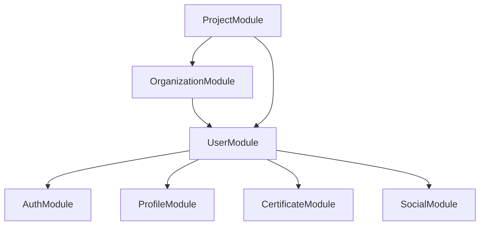
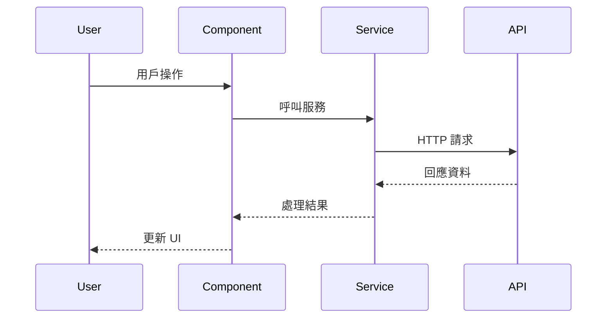

# 營建管理系統 - 開發指南與標準

## 1. 開發環境設定

### 1.1 必要工具安裝

#### 1.1.1 Node.js 環境
```bash
# 安裝 Node.js (建議版本 18+)
# 下載並安裝: https://nodejs.org/

# 驗證安裝
node --version
npm --version
```

#### 1.1.2 Angular CLI
```bash
# 全域安裝 Angular CLI
npm install -g @angular/cli

# 驗證安裝
ng version
```

#### 1.1.3 Yarn 包管理器
```bash
# 安裝 Yarn
npm install -g yarn

# 驗證安裝
yarn --version
```

#### 1.1.4 Git 版本控制
```bash
# 安裝 Git
# 下載並安裝: https://git-scm.com/

# 設定用戶資訊
git config --global user.name "Your Name"
git config --global user.email "your.email@example.com"
```

### 1.2 專案初始化

#### 1.2.1 建立新專案
```bash
# 建立新的 Angular 專案
ng new construction-management-system --routing --style=scss --package-manager=yarn

# 進入專案目錄
cd construction-management-system
```

#### 1.2.2 安裝必要依賴
```bash
# 安裝 Angular Material
ng add @angular/material

# 安裝 NgRx
ng add @ngrx/store
ng add @ngrx/effects
ng add @ngrx/store-devtools

# 安裝其他必要套件
yarn add @angular/cdk @angular/flex-layout
yarn add chart.js ng2-charts
yarn add socket.io-client
```

### 1.3 開發工具配置

#### 1.3.1 VS Code 擴展
推薦安裝以下 VS Code 擴展：
- Angular Language Service
- TypeScript Importer
- Prettier - Code formatter
- ESLint
- GitLens
- Thunder Client (API 測試)

#### 1.3.2 ESLint 配置
```json
// .eslintrc.json
{
  "extends": [
    "@angular-eslint/recommended",
    "@angular-eslint/template/process-inline-templates"
  ],
  "rules": {
    "@angular-eslint/directive-selector": [
      "error",
      {
        "type": "attribute",
        "prefix": "app",
        "style": "camelCase"
      }
    ],
    "@angular-eslint/component-selector": [
      "error",
      {
        "type": "element",
        "prefix": "app",
        "style": "kebab-case"
      }
    ]
  }
}
```

#### 1.3.3 Prettier 配置
```json
// .prettierrc
{
  "singleQuote": true,
  "trailingComma": "es5",
  "tabWidth": 2,
  "semi": true,
  "printWidth": 100
}
```

## 2. 代碼規範

### 2.1 檔案命名規範

#### 2.1.1 元件檔案
```typescript
// 元件檔案命名: kebab-case.component.ts
// 範例: user-profile.component.ts

// 對應的檔案結構:
user-profile.component.ts
user-profile.component.html
user-profile.component.scss
user-profile.component.spec.ts
```

#### 2.1.2 服務檔案
```typescript
// 服務檔案命名: kebab-case.service.ts
// 範例: user.service.ts, auth.service.ts
```

#### 2.1.3 模型檔案
```typescript
// 模型檔案命名: kebab-case.model.ts
// 範例: user.model.ts, project.model.ts
```

#### 2.1.4 頁面檔案
```typescript
// 頁面檔案命名: kebab-case.page.ts
// 範例: user-dashboard.page.ts, project-list.page.ts
```

### 2.2 目錄結構規範

#### 2.2.1 功能模組結構
```
feature-name/
├── components/                    # 元件目錄
│   ├── component-name/
│   │   ├── component-name.component.ts
│   │   ├── component-name.component.html
│   │   ├── component-name.component.scss
│   │   ├── component-name.component.spec.ts
│   │   └── index.ts
│   └── index.ts
├── pages/                         # 頁面目錄
├── services/                      # 服務目錄
├── models/                        # 模型目錄
├── state/                         # 狀態管理目錄
├── routes/                        # 路由目錄
└── index.ts                       # 模組匯出
```

#### 2.2.2 共享模組結構
```
shared/
├── components/                    # 共享元件
├── services/                      # 共享服務
├── models/                        # 共享模型
├── pipes/                         # 共享管道
├── directives/                    # 共享指令
└── utils/                         # 工具函數
```

### 2.3 TypeScript 規範

#### 2.3.1 介面定義
```typescript
// 使用 PascalCase 命名介面
export interface UserProfile {
  id: string;
  firstName: string;
  lastName: string;
  email: string;
  avatar?: string;
}

// 使用 I 前綴命名介面 (可選)
export interface IUserService {
  getUser(id: string): Observable<UserProfile>;
  updateUser(user: UserProfile): Observable<void>;
}
```

#### 2.3.2 類別定義
```typescript
// 使用 PascalCase 命名類別
export class UserService {
  constructor(private http: HttpClient) {}

  getUser(id: string): Observable<UserProfile> {
    return this.http.get<UserProfile>(`/api/users/${id}`);
  }
}
```

#### 2.3.3 變數命名
```typescript
// 使用 camelCase 命名變數
const userName = 'john_doe';
const userProfile: UserProfile = { ... };

// 使用 UPPER_SNAKE_CASE 命名常數
const API_BASE_URL = 'https://api.example.com';
const MAX_RETRY_ATTEMPTS = 3;
```

### 2.4 Angular 規範

#### 2.4.1 元件定義
```typescript
@Component({
  selector: 'app-user-profile',
  templateUrl: './user-profile.component.html',
  styleUrls: ['./user-profile.component.scss'],
  changeDetection: ChangeDetectionStrategy.OnPush
})
export class UserProfileComponent implements OnInit, OnDestroy {
  @Input() user: UserProfile;
  @Output() userUpdated = new EventEmitter<UserProfile>();

  private destroy$ = new Subject<void>();

  constructor(
    private userService: UserService,
    private cdr: ChangeDetectorRef
  ) {}

  ngOnInit(): void {
    // 初始化邏輯
  }

  ngOnDestroy(): void {
    this.destroy$.next();
    this.destroy$.complete();
  }
}
```

#### 2.4.2 服務定義
```typescript
@Injectable({
  providedIn: 'root'
})
export class UserService {
  private readonly apiUrl = environment.apiUrl;

  constructor(private http: HttpClient) {}

  getUser(id: string): Observable<UserProfile> {
    return this.http.get<UserProfile>(`${this.apiUrl}/users/${id}`);
  }

  updateUser(user: UserProfile): Observable<UserProfile> {
    return this.http.put<UserProfile>(`${this.apiUrl}/users/${user.id}`, user);
  }
}
```

#### 2.4.3 模組定義
```typescript
@NgModule({
  declarations: [
    UserProfileComponent,
    UserListComponent
  ],
  imports: [
    CommonModule,
    ReactiveFormsModule,
    MaterialModule
  ],
  exports: [
    UserProfileComponent,
    UserListComponent
  ]
})
export class UserModule { }
```

## 3. Git 工作流程

### 3.1 分支策略

#### 3.1.1 主要分支
- **main**: 生產環境分支
- **develop**: 開發環境分支
- **feature/**: 功能開發分支
- **hotfix/**: 緊急修復分支
- **release/**: 發布準備分支

#### 3.1.2 分支命名規範
```bash
# 功能分支
feature/user-authentication
feature/project-management
feature/social-features

# 修復分支
hotfix/fix-login-bug
hotfix/fix-data-validation

# 發布分支
release/v1.0.0
release/v1.1.0
```

### 3.2 提交訊息規範

#### 3.2.1 提交訊息格式
```
<type>(<scope>): <subject>

<body>

<footer>
```

#### 3.2.2 類型說明
- **feat**: 新功能
- **fix**: 修復問題
- **docs**: 文檔更新
- **style**: 代碼格式調整
- **refactor**: 代碼重構
- **test**: 測試相關
- **chore**: 建置過程或輔助工具的變動

#### 3.2.3 提交訊息範例
```bash
feat(user): add user profile management

- Add user profile component
- Implement profile update functionality
- Add form validation
- Add unit tests

Closes #123
```

### 3.3 代碼審查流程

#### 3.3.1 Pull Request 規範
- 標題使用簡潔的描述
- 詳細描述變更內容
- 列出相關的 Issue
- 包含測試說明
- 附上截圖 (UI 變更)

#### 3.3.2 審查檢查清單
- [ ] 代碼符合專案規範
- [ ] 通過所有測試
- [ ] 沒有 ESLint 錯誤
- [ ] 文檔已更新
- [ ] 效能影響已評估
- [ ] 安全性已考慮

## 4. 測試策略

### 4.1 測試金字塔

#### 4.1.1 單元測試 (70%)
```typescript
// user.service.spec.ts
describe('UserService', () => {
  let service: UserService;
  let httpMock: HttpTestingController;

  beforeEach(() => {
    TestBed.configureTestingModule({
      imports: [HttpClientTestingModule],
      providers: [UserService]
    });
    service = TestBed.inject(UserService);
    httpMock = TestBed.inject(HttpTestingController);
  });

  it('should get user by id', () => {
    const mockUser: UserProfile = {
      id: '1',
      firstName: 'John',
      lastName: 'Doe',
      email: 'john@example.com'
    };

    service.getUser('1').subscribe(user => {
      expect(user).toEqual(mockUser);
    });

    const req = httpMock.expectOne('/api/users/1');
    expect(req.request.method).toBe('GET');
    req.flush(mockUser);
  });
});
```

#### 4.1.2 整合測試 (20%)
```typescript
// user-profile.component.spec.ts
describe('UserProfileComponent', () => {
  let component: UserProfileComponent;
  let fixture: ComponentFixture<UserProfileComponent>;
  let userService: jasmine.SpyObj<UserService>;

  beforeEach(() => {
    const spy = jasmine.createSpyObj('UserService', ['getUser', 'updateUser']);

    TestBed.configureTestingModule({
      declarations: [UserProfileComponent],
      providers: [
        { provide: UserService, useValue: spy }
      ]
    });

    fixture = TestBed.createComponent(UserProfileComponent);
    component = fixture.componentInstance;
    userService = TestBed.inject(UserService) as jasmine.SpyObj<UserService>;
  });

  it('should load user profile on init', () => {
    const mockUser: UserProfile = { ... };
    userService.getUser.and.returnValue(of(mockUser));

    component.ngOnInit();

    expect(userService.getUser).toHaveBeenCalled();
    expect(component.user).toEqual(mockUser);
  });
});
```

#### 4.1.3 端對端測試 (10%)
```typescript
// user-profile.e2e-spec.ts
describe('User Profile E2E', () => {
  it('should display user profile', () => {
    cy.visit('/user/profile');
    cy.get('[data-cy=user-name]').should('contain', 'John Doe');
    cy.get('[data-cy=user-email]').should('contain', 'john@example.com');
  });

  it('should update user profile', () => {
    cy.visit('/user/profile');
    cy.get('[data-cy=edit-button]').click();
    cy.get('[data-cy=first-name]').clear().type('Jane');
    cy.get('[data-cy=save-button]').click();
    cy.get('[data-cy=success-message]').should('be.visible');
  });
});
```

### 4.2 測試覆蓋率目標

#### 4.2.1 覆蓋率要求
- **整體覆蓋率**: ≥ 80%
- **元件覆蓋率**: ≥ 85%
- **服務覆蓋率**: ≥ 90%
- **工具函數覆蓋率**: ≥ 95%

#### 4.2.2 覆蓋率檢查
```bash
# 執行測試並生成覆蓋率報告
ng test --code-coverage

# 查看覆蓋率報告
open coverage/index.html
```

## 5. 效能優化

### 5.1 Angular 效能最佳實踐

#### 5.1.1 OnPush 變更檢測策略
```typescript
@Component({
  selector: 'app-user-list',
  templateUrl: './user-list.component.html',
  changeDetection: ChangeDetectionStrategy.OnPush
})
export class UserListComponent {
  @Input() users: UserProfile[] = [];

  constructor(private cdr: ChangeDetectorRef) {}

  updateUsers(newUsers: UserProfile[]): void {
    this.users = [...newUsers];
    this.cdr.markForCheck();
  }
}
```

#### 5.1.2 TrackBy 函數
```typescript
@Component({
  selector: 'app-user-list',
  template: `
    <div *ngFor="let user of users; trackBy: trackByUserId">
      {{ user.name }}
    </div>
  `
})
export class UserListComponent {
  users: UserProfile[] = [];

  trackByUserId(index: number, user: UserProfile): string {
    return user.id;
  }
}
```

#### 5.1.3 懶加載模組
```typescript
// app.routes.ts
const routes: Routes = [
  {
    path: 'user',
    loadChildren: () => import('./features/user/user.module').then(m => m.UserModule)
  },
  {
    path: 'project',
    loadChildren: () => import('./features/project/project.module').then(m => m.ProjectModule)
  }
];
```

### 5.2 記憶體管理

#### 5.2.1 訂閱管理
```typescript
export class UserComponent implements OnInit, OnDestroy {
  private destroy$ = new Subject<void>();

  ngOnInit(): void {
    this.userService.getUsers()
      .pipe(takeUntil(this.destroy$))
      .subscribe(users => {
        this.users = users;
      });
  }

  ngOnDestroy(): void {
    this.destroy$.next();
    this.destroy$.complete();
  }
}
```

#### 5.2.2 圖片懶加載
```typescript
@Component({
  template: `
    
  `
})
export class ImageComponent {
  @Input() imageSrc: string;
  @Input() imageAlt: string;
}
```

## 6. 安全性規範

### 6.1 輸入驗證

#### 6.1.1 表單驗證
```typescript
@Component({
  template: `
    <form [formGroup]="userForm" (ngSubmit)="onSubmit()">
      <mat-form-field>
        <input matInput 
               formControlName="email"
               placeholder="Email">
        <mat-error *ngIf="userForm.get('email')?.hasError('required')">
          Email is required
        </mat-error>
        <mat-error *ngIf="userForm.get('email')?.hasError('email')">
          Please enter a valid email
        </mat-error>
      </mat-form-field>
    </form>
  `
})
export class UserFormComponent {
  userForm = this.fb.group({
    email: ['', [Validators.required, Validators.email]],
    password: ['', [Validators.required, Validators.minLength(8)]]
  });

  constructor(private fb: FormBuilder) {}
}
```

#### 6.1.2 伺服器端驗證
```typescript
@Injectable()
export class ValidationService {
  validateEmail(email: string): boolean {
    const emailRegex = /^[^\s@]+@[^\s@]+\.[^\s@]+$/;
    return emailRegex.test(email);
  }

  sanitizeInput(input: string): string {
    return input.trim().replace(/<script\b[^<]*(?:(?!<\/script>)<[^<]*)*<\/script>/gi, '');
  }
}
```

### 6.2 認證與授權

#### 6.2.1 JWT Token 管理
```typescript
@Injectable()
export class AuthService {
  private tokenKey = 'auth_token';

  login(credentials: LoginCredentials): Observable<AuthResponse> {
    return this.http.post<AuthResponse>('/api/auth/login', credentials)
      .pipe(
        tap(response => this.setToken(response.token)),
        catchError(this.handleError)
      );
  }

  private setToken(token: string): void {
    localStorage.setItem(this.tokenKey, token);
  }

  getToken(): string | null {
    return localStorage.getItem(this.tokenKey);
  }

  logout(): void {
    localStorage.removeItem(this.tokenKey);
  }
}
```

#### 6.2.2 路由守衛
```typescript
@Injectable()
export class AuthGuard implements CanActivate {
  constructor(
    private authService: AuthService,
    private router: Router
  ) {}

  canActivate(): boolean {
    if (this.authService.isAuthenticated()) {
      return true;
    } else {
      this.router.navigate(['/login']);
      return false;
    }
  }
}
```

## 7. 部署與建置

### 7.1 建置配置

#### 7.1.1 環境配置
```typescript
// environment.ts
export const environment = {
  production: false,
  apiUrl: 'http://localhost:3000/api',
  firebase: {
    apiKey: 'your-api-key',
    authDomain: 'your-domain.firebaseapp.com',
    projectId: 'your-project-id'
  }
};

// environment.prod.ts
export const environment = {
  production: true,
  apiUrl: 'https://api.yourdomain.com',
  firebase: {
    apiKey: 'your-prod-api-key',
    authDomain: 'your-domain.firebaseapp.com',
    projectId: 'your-prod-project-id'
  }
};
```

#### 7.1.2 建置腳本
```json
// package.json
{
  "scripts": {
    "build": "ng build",
    "build:prod": "ng build --configuration=production",
    "build:staging": "ng build --configuration=staging",
    "test": "ng test",
    "test:ci": "ng test --watch=false --browsers=ChromeHeadless",
    "e2e": "ng e2e",
    "lint": "ng lint",
    "lint:fix": "ng lint --fix"
  }
}
```

### 7.2 Docker 配置

#### 7.2.1 Dockerfile
```dockerfile
# Dockerfile
FROM node:18-alpine as build

WORKDIR /app
COPY package*.json ./
RUN npm ci --only=production

COPY . .
RUN npm run build:prod

FROM nginx:alpine
COPY --from=build /app/dist/construction-management-system /usr/share/nginx/html
COPY nginx.conf /etc/nginx/nginx.conf

EXPOSE 80
CMD ["nginx", "-g", "daemon off;"]
```

#### 7.2.2 Docker Compose
```yaml
# docker-compose.yml
version: '3.8'
services:
  frontend:
    build: .
    ports:
      - "80:80"
    environment:
      - NODE_ENV=production
    depends_on:
      - backend

  backend:
    image: construction-management-backend:latest
    ports:
      - "3000:3000"
    environment:
      - NODE_ENV=production
      - DATABASE_URL=postgresql://user:pass@db:5432/construction_db
    depends_on:
      - db

  db:
    image: postgres:13
    environment:
      - POSTGRES_DB=construction_db
      - POSTGRES_USER=user
      - POSTGRES_PASSWORD=pass
    volumes:
      - postgres_data:/var/lib/postgresql/data

volumes:
  postgres_data:
```

## 8. 監控與日誌

### 8.1 錯誤處理

#### 8.1.1 全域錯誤處理
```typescript
@Injectable()
export class GlobalErrorHandler implements ErrorHandler {
  constructor(private logger: LoggerService) {}

  handleError(error: any): void {
    this.logger.error('Global error:', error);
    
    // 發送錯誤到監控服務
    this.sendErrorToMonitoring(error);
  }

  private sendErrorToMonitoring(error: any): void {
    // 實作錯誤監控邏輯
  }
}
```

#### 8.1.2 HTTP 錯誤攔截器
```typescript
@Injectable()
export class ErrorInterceptor implements HttpInterceptor {
  constructor(private router: Router) {}

  intercept(req: HttpRequest<any>, next: HttpHandler): Observable<HttpEvent<any>> {
    return next.handle(req).pipe(
      catchError((error: HttpErrorResponse) => {
        if (error.status === 401) {
          this.router.navigate(['/login']);
        }
        
        return throwError(error);
      })
    );
  }
}
```

### 8.2 效能監控

#### 8.2.1 效能指標收集
```typescript
@Injectable()
export class PerformanceService {
  measurePageLoad(pageName: string): void {
    const startTime = performance.now();
    
    window.addEventListener('load', () => {
      const endTime = performance.now();
      const loadTime = endTime - startTime;
      
      this.sendMetric('page_load_time', loadTime, { page: pageName });
    });
  }

  measureApiCall(apiName: string, duration: number): void {
    this.sendMetric('api_call_duration', duration, { api: apiName });
  }

  private sendMetric(name: string, value: number, tags: any): void {
    // 發送指標到監控服務
  }
}
```

## 9. 文檔標準

### 9.1 代碼文檔

#### 9.1.1 JSDoc 註解
```typescript
/**
 * 用戶服務類別，負責處理用戶相關的業務邏輯
 * @class UserService
 */
@Injectable({
  providedIn: 'root'
})
export class UserService {
  /**
   * 根據用戶 ID 獲取用戶資料
   * @param {string} id - 用戶 ID
   * @returns {Observable<UserProfile>} 用戶資料的 Observable
   * @example
   * ```typescript
   * this.userService.getUser('123').subscribe(user => {
   *   console.log(user.name);
   * });
   * ```
   */
  getUser(id: string): Observable<UserProfile> {
    return this.http.get<UserProfile>(`/api/users/${id}`);
  }
}
```

#### 9.1.2 README 文檔
```markdown
# 用戶模組

## 概述
用戶模組負責處理用戶相關的功能，包括用戶認證、個人資料管理、證照管理等。

## 功能
- 用戶註冊與登入
- 個人資料管理
- 證照管理
- 社交功能

## 使用方式
```typescript
import { UserModule } from './user.module';

@NgModule({
  imports: [UserModule]
})
export class AppModule {}
```

## API 參考
- [UserService](./services/user.service.ts)
- [UserProfileComponent](./components/user-profile.component.ts)
```

### 9.2 架構文檔

#### 9.2.1 模組關係圖


#### 9.2.2 資料流程圖


---

**文件版本**: v1.0  
**最後更新**: 2024-01-01  
**維護者**: 開發團隊  
**審核者**: 技術架構師
