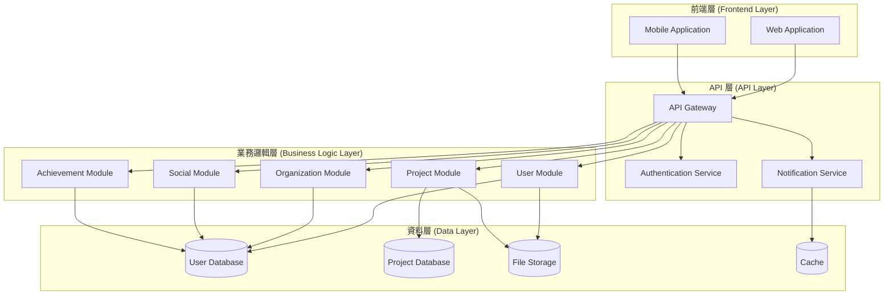
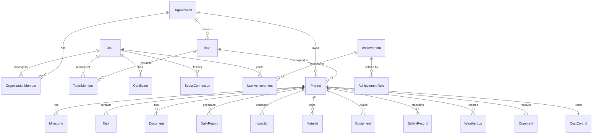
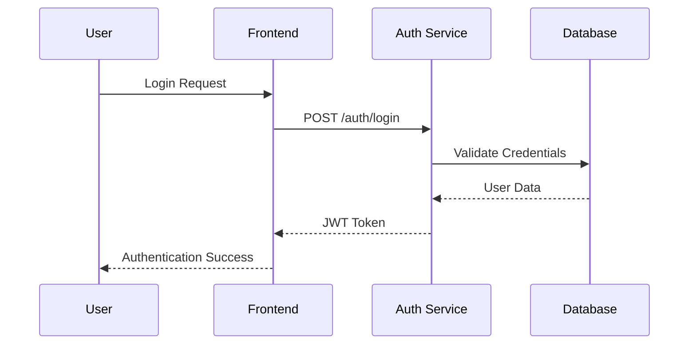
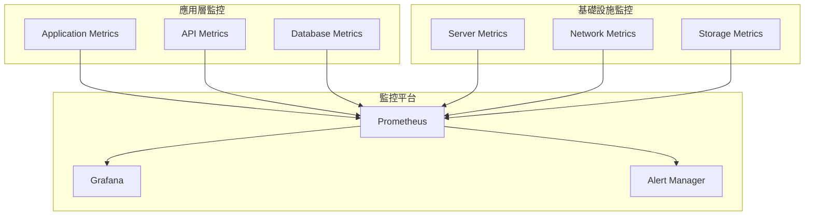
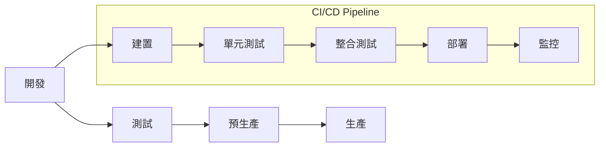

# 營建管理系統 - 系統架構文件

## 1. 系統概述

### 1.1 系統目的
營建管理系統是一個專為營造業設計的綜合性管理平台，整合專案管理、人員管理、組織管理、社交功能等核心模組，提供完整的營建專案生命週期管理解決方案。

### 1.2 目標用戶
- **個人用戶**: 工程師、監工、承包商
- **組織用戶**: 營造公司、建設公司
- **專案團隊**: 工務組、安全組、品管組

### 1.3 核心價值
- 提升專案管理效率
- 強化團隊協作能力
- 優化資源配置
- 確保專案品質與安全

## 2. 系統架構

### 2.1 整體架構圖



### 2.2 技術架構

#### 前端技術棧
- **框架**: Angular 17+
- **狀態管理**: NgRx
- **UI 元件庫**: Angular Material
- **圖表**: Chart.js / D3.js
- **地圖**: Google Maps API

#### 後端技術棧
- **框架**: Node.js + Express / NestJS
- **資料庫**: PostgreSQL (主要) + Redis (快取)
- **檔案儲存**: Firebase Storage / AWS S3
- **認證**: Firebase Auth / Auth0
- **即時通訊**: Socket.io / WebSocket

#### 部署架構
- **容器化**: Docker + Kubernetes
- **CI/CD**: GitHub Actions
- **監控**: Prometheus + Grafana
- **日誌**: ELK Stack

## 3. 核心模組設計

### 3.1 用戶模組 (User Module)

#### 3.1.1 功能範圍
- 用戶註冊與認證
- 個人資料管理
- 專業證照管理
- 社交功能
- 通知管理

#### 3.1.2 資料模型
```typescript
interface User {
  id: string;
  email: string;
  profile: UserProfile;
  settings: UserSettings;
  teams: TeamMembership[];
  organizations: OrganizationMembership[];
  certificates: Certificate[];
  socialConnections: SocialConnection[];
  notifications: Notification[];
}

interface UserProfile {
  firstName: string;
  lastName: string;
  avatar?: string;
  bio?: string;
  skills: string[];
  experience: Experience[];
  contactInfo: ContactInfo;
}

interface Certificate {
  id: string;
  name: string;
  issuer: string;
  issueDate: Date;
  expiryDate?: Date;
  verificationStatus: 'pending' | 'verified' | 'rejected';
  documentUrl: string;
}
```

#### 3.1.3 API 設計
```typescript
// 用戶認證 API
POST /api/auth/register
POST /api/auth/login
POST /api/auth/logout
POST /api/auth/refresh

// 用戶資料 API
GET /api/users/profile
PUT /api/users/profile
GET /api/users/certificates
POST /api/users/certificates
PUT /api/users/certificates/:id
DELETE /api/users/certificates/:id

// 社交功能 API
GET /api/users/following
POST /api/users/follow/:userId
DELETE /api/users/follow/:userId
GET /api/users/followers
```

### 3.2 組織模組 (Organization Module)

#### 3.2.1 功能範圍
- 組織註冊與管理
- 成員管理
- 團隊管理
- 專案分配
- 權限控制

#### 3.2.2 資料模型
```typescript
interface Organization {
  id: string;
  name: string;
  type: 'construction' | 'consulting' | 'supplier';
  profile: OrganizationProfile;
  members: OrganizationMember[];
  teams: Team[];
  projects: Project[];
  settings: OrganizationSettings;
}

interface OrganizationMember {
  userId: string;
  role: 'owner' | 'admin' | 'manager' | 'engineer' | 'supervisor';
  teams: string[];
  permissions: Permission[];
  joinDate: Date;
  status: 'active' | 'inactive' | 'pending';
}

interface Team {
  id: string;
  name: string;
  description: string;
  members: TeamMember[];
  projects: string[];
  leader: string;
}
```

#### 3.2.3 API 設計
```typescript
// 組織管理 API
POST /api/organizations
GET /api/organizations
GET /api/organizations/:id
PUT /api/organizations/:id
DELETE /api/organizations/:id

// 成員管理 API
GET /api/organizations/:id/members
POST /api/organizations/:id/members
PUT /api/organizations/:id/members/:userId
DELETE /api/organizations/:id/members/:userId

// 團隊管理 API
GET /api/organizations/:id/teams
POST /api/organizations/:id/teams
PUT /api/organizations/:id/teams/:teamId
DELETE /api/organizations/:id/teams/:teamId
```

### 3.3 專案模組 (Project Module)

#### 3.3.1 功能範圍
- 專案建立與管理
- 里程碑管理
- 任務追蹤
- 文件管理
- 成本控制
- 安全記錄
- 品質管理

#### 3.3.2 資料模型
```typescript
interface Project {
  id: string;
  name: string;
  description: string;
  owner: ProjectOwner;
  status: 'planning' | 'active' | 'completed' | 'cancelled';
  timeline: ProjectTimeline;
  milestones: Milestone[];
  tasks: Task[];
  documents: Document[];
  photos: MediaFile[];
  dailyReports: DailyReport[];
  inspections: Inspection[];
  materials: Material[];
  equipment: Equipment[];
  safetyRecords: SafetyRecord[];
  weatherLogs: WeatherLog[];
  comments: Comment[];
  ganttData: GanttData;
  costControl: CostControl;
}

interface CostControl {
  budget: Budget;
  actualCost: ActualCost;
  forecast: Forecast;
  variance: Variance;
  breakdown: CostBreakdown;
}

interface Budget {
  total: number;
  labor: number;
  materials: number;
  equipment: number;
  overhead: number;
  contingency: number;
}
```

#### 3.3.3 API 設計
```typescript
// 專案管理 API
POST /api/projects
GET /api/projects
GET /api/projects/:id
PUT /api/projects/:id
DELETE /api/projects/:id

// 里程碑管理 API
GET /api/projects/:id/milestones
POST /api/projects/:id/milestones
PUT /api/projects/:id/milestones/:milestoneId
DELETE /api/projects/:id/milestones/:milestoneId

// 任務管理 API
GET /api/projects/:id/tasks
POST /api/projects/:id/tasks
PUT /api/projects/:id/tasks/:taskId
DELETE /api/projects/:id/tasks/:taskId

// 成本控制 API
GET /api/projects/:id/cost-control
PUT /api/projects/:id/cost-control/budget
POST /api/projects/:id/cost-control/actual-cost
GET /api/projects/:id/cost-control/forecast
```

### 3.4 社交模組 (Social Module)

#### 3.4.1 功能範圍
- 關係管理
- 社交網絡分析
- 推薦系統
- 內容分享

#### 3.4.2 資料模型
```typescript
interface SocialConnection {
  id: string;
  followerId: string;
  followingId: string;
  followingType: 'user' | 'organization' | 'project';
  createdAt: Date;
  status: 'active' | 'blocked';
}

interface Recommendation {
  id: string;
  userId: string;
  type: 'user' | 'content' | 'professional';
  targetId: string;
  score: number;
  reason: string;
  createdAt: Date;
}
```

### 3.5 成就模組 (Achievement Module)

#### 3.5.1 功能範圍
- 成就系統
- 規則引擎
- 排行榜
- 激勵機制

#### 3.5.2 資料模型
```typescript
interface Achievement {
  id: string;
  name: string;
  description: string;
  category: 'professional' | 'social' | 'project';
  icon: string;
  points: number;
  rules: AchievementRule[];
  users: UserAchievement[];
}

interface AchievementRule {
  id: string;
  condition: string;
  trigger: string;
  value: number;
  operator: 'equals' | 'greater' | 'less' | 'contains';
}
```

## 4. 資料庫設計

### 4.1 實體關係圖



### 4.2 資料庫表結構

#### 4.2.1 用戶相關表
```sql
-- 用戶表
CREATE TABLE users (
    id UUID PRIMARY KEY,
    email VARCHAR(255) UNIQUE NOT NULL,
    password_hash VARCHAR(255) NOT NULL,
    created_at TIMESTAMP DEFAULT CURRENT_TIMESTAMP,
    updated_at TIMESTAMP DEFAULT CURRENT_TIMESTAMP
);

-- 用戶資料表
CREATE TABLE user_profiles (
    user_id UUID PRIMARY KEY REFERENCES users(id),
    first_name VARCHAR(100) NOT NULL,
    last_name VARCHAR(100) NOT NULL,
    avatar_url TEXT,
    bio TEXT,
    skills TEXT[],
    contact_info JSONB,
    created_at TIMESTAMP DEFAULT CURRENT_TIMESTAMP,
    updated_at TIMESTAMP DEFAULT CURRENT_TIMESTAMP
);

-- 證照表
CREATE TABLE certificates (
    id UUID PRIMARY KEY,
    user_id UUID REFERENCES users(id),
    name VARCHAR(255) NOT NULL,
    issuer VARCHAR(255) NOT NULL,
    issue_date DATE NOT NULL,
    expiry_date DATE,
    verification_status VARCHAR(20) DEFAULT 'pending',
    document_url TEXT,
    created_at TIMESTAMP DEFAULT CURRENT_TIMESTAMP
);
```

#### 4.2.2 組織相關表
```sql
-- 組織表
CREATE TABLE organizations (
    id UUID PRIMARY KEY,
    name VARCHAR(255) NOT NULL,
    type VARCHAR(50) NOT NULL,
    profile JSONB,
    settings JSONB,
    created_at TIMESTAMP DEFAULT CURRENT_TIMESTAMP,
    updated_at TIMESTAMP DEFAULT CURRENT_TIMESTAMP
);

-- 組織成員表
CREATE TABLE organization_members (
    id UUID PRIMARY KEY,
    organization_id UUID REFERENCES organizations(id),
    user_id UUID REFERENCES users(id),
    role VARCHAR(50) NOT NULL,
    permissions JSONB,
    join_date TIMESTAMP DEFAULT CURRENT_TIMESTAMP,
    status VARCHAR(20) DEFAULT 'active'
);

-- 團隊表
CREATE TABLE teams (
    id UUID PRIMARY KEY,
    organization_id UUID REFERENCES organizations(id),
    name VARCHAR(255) NOT NULL,
    description TEXT,
    leader_id UUID REFERENCES users(id),
    created_at TIMESTAMP DEFAULT CURRENT_TIMESTAMP
);
```

#### 4.2.3 專案相關表
```sql
-- 專案表
CREATE TABLE projects (
    id UUID PRIMARY KEY,
    name VARCHAR(255) NOT NULL,
    description TEXT,
    owner_id UUID NOT NULL,
    owner_type VARCHAR(20) NOT NULL,
    status VARCHAR(20) DEFAULT 'planning',
    timeline JSONB,
    created_at TIMESTAMP DEFAULT CURRENT_TIMESTAMP,
    updated_at TIMESTAMP DEFAULT CURRENT_TIMESTAMP
);

-- 里程碑表
CREATE TABLE milestones (
    id UUID PRIMARY KEY,
    project_id UUID REFERENCES projects(id),
    name VARCHAR(255) NOT NULL,
    description TEXT,
    start_date DATE,
    end_date DATE,
    status VARCHAR(20) DEFAULT 'pending',
    created_at TIMESTAMP DEFAULT CURRENT_TIMESTAMP
);

-- 任務表
CREATE TABLE tasks (
    id UUID PRIMARY KEY,
    project_id UUID REFERENCES projects(id),
    name VARCHAR(255) NOT NULL,
    description TEXT,
    assignee_id UUID REFERENCES users(id),
    status VARCHAR(20) DEFAULT 'todo',
    priority VARCHAR(20) DEFAULT 'medium',
    due_date DATE,
    created_at TIMESTAMP DEFAULT CURRENT_TIMESTAMP
);
```

## 5. 安全架構

### 5.1 認證與授權

#### 5.1.1 認證流程


#### 5.1.2 權限模型
```typescript
enum Permission {
  // 用戶權限
  USER_READ = 'user:read',
  USER_WRITE = 'user:write',
  USER_DELETE = 'user:delete',
  
  // 組織權限
  ORG_READ = 'organization:read',
  ORG_WRITE = 'organization:write',
  ORG_DELETE = 'organization:delete',
  ORG_MANAGE_MEMBERS = 'organization:manage_members',
  
  // 專案權限
  PROJECT_READ = 'project:read',
  PROJECT_WRITE = 'project:write',
  PROJECT_DELETE = 'project:delete',
  PROJECT_MANAGE_TASKS = 'project:manage_tasks',
  PROJECT_MANAGE_COST = 'project:manage_cost',
  
  // 系統權限
  SYSTEM_ADMIN = 'system:admin',
  SYSTEM_MODERATOR = 'system:moderator'
}

interface Role {
  name: string;
  permissions: Permission[];
  level: number;
}
```

### 5.2 資料安全

#### 5.2.1 資料加密
- **傳輸加密**: TLS 1.3
- **儲存加密**: AES-256
- **敏感資料**: 額外加密層
- **金鑰管理**: AWS KMS / Azure Key Vault

#### 5.2.2 資料保護
- **個人資料**: GDPR 合規
- **資料備份**: 每日增量備份
- **災難恢復**: RTO < 4小時, RPO < 1小時
- **資料保留**: 符合法規要求

## 6. 效能與擴展性

### 6.1 效能指標

#### 6.1.1 回應時間目標
- **API 回應時間**: < 200ms (95th percentile)
- **頁面載入時間**: < 2秒
- **資料庫查詢**: < 100ms
- **檔案上傳**: < 30秒 (100MB)

#### 6.1.2 吞吐量目標
- **並發用戶**: 10,000+
- **API 請求**: 100,000+ requests/hour
- **資料庫連接**: 1,000+ concurrent
- **檔案儲存**: 1TB+ capacity

### 6.2 擴展策略

#### 6.2.1 水平擴展
- **負載均衡**: Nginx / HAProxy
- **資料庫分片**: 按組織分片
- **快取策略**: Redis Cluster
- **CDN**: CloudFlare / AWS CloudFront

#### 6.2.2 垂直擴展
- **伺服器規格**: 16+ CPU cores, 64+ GB RAM
- **資料庫**: 主從複製 + 讀寫分離
- **儲存**: SSD + 高 IOPS
- **網路**: 10Gbps+ bandwidth

## 7. 監控與日誌

### 7.1 監控架構



### 7.2 日誌管理

#### 7.2.1 日誌層級
- **ERROR**: 系統錯誤、異常
- **WARN**: 警告訊息、潛在問題
- **INFO**: 一般資訊、操作記錄
- **DEBUG**: 除錯資訊、詳細追蹤

#### 7.2.2 日誌結構
```json
{
  "timestamp": "2024-01-01T00:00:00Z",
  "level": "INFO",
  "service": "user-service",
  "traceId": "abc123",
  "userId": "user-456",
  "action": "user.login",
  "message": "User login successful",
  "metadata": {
    "ip": "192.168.1.1",
    "userAgent": "Mozilla/5.0...",
    "duration": 150
  }
}
```

## 8. 部署架構

### 8.1 環境配置

#### 8.1.1 開發環境
- **目的**: 開發與測試
- **配置**: 單機部署
- **資料庫**: 本地 PostgreSQL
- **快取**: 本地 Redis

#### 8.1.2 測試環境
- **目的**: 整合測試
- **配置**: Docker Compose
- **資料庫**: PostgreSQL + Redis
- **監控**: 基本監控

#### 8.1.3 生產環境
- **目的**: 正式服務
- **配置**: Kubernetes 集群
- **資料庫**: PostgreSQL 主從 + Redis Cluster
- **監控**: 完整監控 + 告警

### 8.2 部署流程



## 9. 風險評估與緩解

### 9.1 技術風險

| 風險 | 影響 | 機率 | 緩解策略 |
|------|------|------|----------|
| 資料庫效能瓶頸 | 高 | 中 | 讀寫分離、索引優化、快取策略 |
| 第三方服務中斷 | 中 | 低 | 多供應商、降級機制、本地備份 |
| 安全漏洞 | 高 | 低 | 定期安全掃描、滲透測試、安全審計 |
| 資料遺失 | 高 | 低 | 多重備份、災難恢復計劃 |

### 9.2 業務風險

| 風險 | 影響 | 機率 | 緩解策略 |
|------|------|------|----------|
| 用戶接受度低 | 中 | 中 | 用戶研究、原型驗證、漸進式推出 |
| 競爭對手進入 | 中 | 高 | 差異化功能、用戶黏性、快速迭代 |
| 法規變更 | 中 | 低 | 法規監控、合規檢查、彈性架構 |
| 技術債務累積 | 中 | 中 | 代碼審查、重構計劃、技術標準 |

## 10. 未來擴展計劃

### 10.1 短期目標 (3-6個月)
- 完成核心模組開發
- 建立基本監控系統
- 實施安全防護措施
- 用戶測試與反饋收集

### 10.2 中期目標 (6-12個月)
- 增加 AI 推薦功能
- 實施進階分析功能
- 建立 API 生態系統
- 擴展移動端功能

### 10.3 長期目標 (1-2年)
- 國際化支援
- 企業級功能
- 物聯網整合
- 區塊鏈應用

---

**文件版本**: v1.0  
**最後更新**: 2024-01-01  
**維護者**: 開發團隊  
**審核者**: 架構師