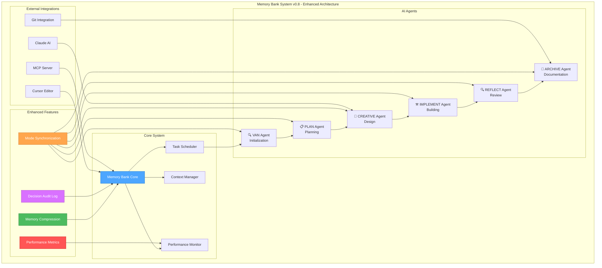

# Memory Bank System v0.8 - Enhanced Architecture

## 系統架構圖

## 優化建議詳細說明

### 1. 模式同步機制 (Mode Synchronization)
- 實現代理間的實時狀態共享
- 建立統一的上下文傳輸協議
- 添加模式切換時的狀態驗證

### 2. 記憶壓縮系統 (Memory Compression)
- 自動識別和壓縮重複內容
- 實現增量更新機制
- 建立記憶生命週期管理

### 3. 決策審計日誌 (Decision Audit Log)
- 記錄所有 AI 決策過程
- 建立決策追蹤和回滾機制
- 提供決策分析和優化建議

### 4. 性能監控系統 (Performance Metrics)
- 追蹤每個模式的執行效率
- 監控 token 使用情況
- 提供性能優化建議

### 5. 外部整合增強
- **Cursor 整合**：利用最新的 Cursor API 功能
- **Claude 整合**：優化 Claude 模型的使用效率
- **MCP 整合**：實現更穩定的工作流程
- **Git 整合**：自動化版本控制和協作