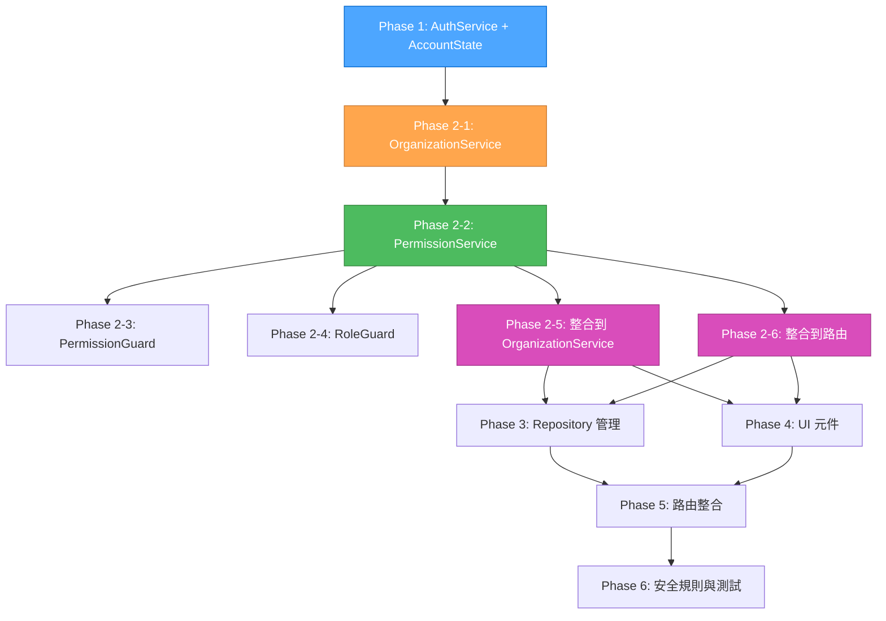

# PLAN Agent - GitHub 式 Account 架構實施計畫

## 📋 計畫概述

基於 sequential-thinking 的深度分析和 Context7 查詢的相關文檔，制定完整的 GitHub 式 Account 架構實施計畫。

### 🎯 目標
實現完整的 Angular v20 + Signals + Firebase GitHub 式多層級權限系統，包含：
- **統一 Account 模型**：使用 type 區分個人和組織
- **個人 (User)**：有協作者關係
- **組織 (Organization)**：有組織成員和團隊
- **團隊 (Team)**：有團隊成員
- **專案 (Repository)**：有擁有者（可以是個人或組織）
- **權限系統**：GitHub 式的權限和角色管理

### 📊 複雜度評估
- **等級**: Level 4 - Complex System
- **範圍**: 認證系統、組織管理、團隊管理、Repository 管理、權限控制、UI 元件、路由重構、測試策略
- **影響檔案**: 30+ 個檔案需要新增/修改/刪除
- **總任務數**: 39個任務
- **Phase 數**: 6個 Phase

## 🏗️ 架構設計

### 核心架構特點

1. **統一 Account 模型**：
   - 使用 `type: 'user' | 'organization'` 區分個人和組織
   - 所有 Account 存儲在 `accounts/{uid}` 路徑
   - 使用 `login` 作為唯一識別碼（GitHub 風格）

2. **個人 (User) 特性**：
   - 繼承 Account 基礎屬性
   - 有協作者關係（Repository Collaborator）
   - 可以擁有 Repository
   - 可以加入組織和團隊

3. **組織 (Organization) 特性**：
   - 繼承 Account 基礎屬性
   - 有組織成員（Organization Member）
   - 有團隊（Team）
   - 可以擁有 Repository

4. **權限系統**：
   - 組織角色：Owner, Admin, Member, Billing, Outside Collaborator
   - 團隊角色：Maintainer, Member
   - Repository 權限：read, triage, write, maintain, admin

### Firestore 集合結構

```
/accounts/{accountId}
  - 統一存儲所有 Account 類型
  - User 特定欄位：uid, displayName, photoURL, certificates, socialRelations
  - Organization 特定欄位：description, ownerId, businessLicense
  
  /members/{userId} - 組織成員子集合
  /teams/{teamId} - 團隊子集合
    /members/{userId} - 團隊成員子集合

/repositories/{repositoryId}
  - Repository 基本資訊
  /collaborators/{userId} - 個人協作者
  /teamAccess/{teamId} - 團隊訪問權限
```

## 🚀 分階段實施計畫

### Phase 1: 基礎架構重構 (8個任務)
**目標**: 清理重複檔案，建立現代化基礎架構
**風險**: 低
**影響**: 小

#### 任務清單
- [ ] **task-1-1**: 刪除 `app/auth/` 整個目錄
- [ ] **task-1-2**: 建立 `core/models/account-state.ts` (AccountState 類別)
- [ ] **task-1-3**: 建立 `core/utils/validation.utils.ts` (ValidationUtils)
- [ ] **task-1-4**: 更新 `core/models/auth.model.ts` (增加 Value Objects)
- [ ] **task-1-5**: 更新 `core/services/auth.service.ts` (使用 AccountState 和 Signals)
- [ ] **task-1-6**: 修改 LoginComponent 使用新的 auth.service
- [ ] **task-1-7**: 修改 SignupComponent 使用新的 auth.service
- [ ] **task-1-8**: 修復 loading 狀態重置問題

#### 驗收標準
- AccountState 類別正確使用 Signals 管理狀態
- ValidationUtils 提供完整的驗證功能
- auth.service 使用 AccountState 和 Signals
- Login/Signup 組件正常工作
- Loading 狀態正確重置

### Phase 2: 服務層現代化 (6個任務)
**目標**: 建立現代化權限管理系統
**風險**: 中
**影響**: 中

#### 任務清單
- [ ] **task-2-1**: 更新 `core/services/organization.service.ts` (使用 Value Objects，使用 AuthService 基本權限檢查)
- [ ] **task-2-2**: 實作 `core/services/permission.service.ts` (使用 Signals，提供進階權限管理)
- [ ] **task-2-3**: 實作 `core/guards/permission.guard.ts` (替代 aclGuard)
- [ ] **task-2-4**: 修改 `role.guard.ts` 使用 accounts 模型
- [ ] **task-2-5**: 整合 PermissionService 到 OrganizationService (替換 AuthService 權限檢查)
- [ ] **task-2-6**: 整合 Permission 到現有路由

#### 驗收標準
- OrganizationService 使用 AuthService 基本權限檢查
- PermissionService 正確計算權限
- permissionGuard 正確保護路由
- PermissionService 成功整合到 OrganizationService
- 所有服務使用 Signals 狀態管理

### Phase 3: Repository 管理系統 (7個任務)
**目標**: 建立完整的 Repository 管理功能
**風險**: 中
**影響**: 大

#### 任務清單
- [ ] **task-3-1**: 更新 `core/models/auth.model.ts` (增加 Repository 相關介面)
- [ ] **task-3-2**: 實作 `core/services/repository.service.ts`
- [ ] **task-3-3**: 實作 `routes/repository-detail/repository-detail.component.ts`
- [ ] **task-3-4**: 實作 `routes/repository-settings/repository-settings.component.ts`
- [ ] **task-3-5**: 實作 `routes/collaborators-list/collaborators-list.component.ts`
- [ ] **task-3-6**: 實作 `routes/team-access-list/team-access-list.component.ts`
- [ ] **task-3-7**: 更新路由支援 Repository 管理

#### 驗收標準
- Repository 服務 CRUD 操作正常
- Repository UI 元件功能完整
- 協作者和團隊訪問管理正常

### Phase 4: UI 層現代化 (6個任務)
**目標**: 建立現代化 UI 元件
**風險**: 中
**影響**: 大

#### 任務清單
- [ ] **task-4-1**: 實作 `organization-detail.component.ts` (使用 Control Flow + Signals)
- [ ] **task-4-2**: 實作 `members-list.component.ts` (使用 Control Flow + Signals)
- [ ] **task-4-3**: 實作 `teams-list.component.ts` (使用 Control Flow + Signals)
- [ ] **task-4-4**: 實作 `team-create.component.ts` (使用 Control Flow + Signals)
- [ ] **task-4-5**: 實作 `organization-settings.component.ts` (使用 Control Flow + Signals)
- [ ] **task-4-6**: 實作 `organization-dashboard.component.ts` (使用 Control Flow + Signals)

#### 驗收標準
- 所有 UI 元件使用 Control Flow (@if, @for)
- 權限檢查與 Signals 整合
- 組織/團隊管理功能完整

### Phase 5: 路由與權限整合 (5個任務)
**目標**: 建立完整的路由系統
**風險**: 高
**影響**: 大

#### 任務清單
- [ ] **task-5-1**: 更新 `app.routes.ts` 支援組織/團隊/Repository 結構
- [ ] **task-5-2**: 更新 `organization.routes.ts` 整合 Permission 守衛
- [ ] **task-5-3**: 建立完整的路由層級和導航邏輯
- [ ] **task-5-4**: 整合權限控制到所有路由
- [ ] **task-5-5**: 更新路由守衛使用 PermissionService

#### 驗收標準
- 路由結構符合 GitHub 式設計
- 所有路由都有權限保護
- 導航邏輯正確

### Phase 6: 安全規則與測試 (7個任務)
**目標**: 建立安全的後端規則和完整測試
**風險**: 高
**影響**: 大

#### 任務清單
- [ ] **task-6-1**: 實作 `firebase.rules` (accounts 集合規則)
- [ ] **task-6-2**: 實作 Repository 安全規則
- [ ] **task-6-3**: 實作組織/團隊/成員權限規則
- [ ] **task-6-4**: 實作單元測試 (auth.service, permission.service, organization.service)
- [ ] **task-6-5**: 實作整合測試 (路由守衛, 權限檢查)
- [ ] **task-6-6**: 實作 E2E 測試 (完整用戶流程)
- [ ] **task-6-7**: 進行完整功能測試和驗證

#### 驗收標準
- Firestore 安全規則正確保護資料
- 測試覆蓋率達標
- 完整功能測試通過

## ⚠️ 風險評估與依賴關係

### 高風險項目
1. **Signals 狀態管理複雜化**: AccountState 和 PermissionService 使用 Signals
   - **風險**: 狀態管理邏輯複雜，可能導致性能問題
   - **緩解**: 詳細測試和性能監控

2. **Repository 系統新增功能**: 完整的 Repository 管理系統
   - **風險**: 功能複雜度高，可能影響現有系統
   - **緩解**: 分階段實施，保持向後相容

3. **權限系統重構**: ACLService → PermissionService
   - **風險**: 權限邏輯變更可能導致安全問題
   - **緩解**: 詳細測試與安全規則驗證

4. **路由結構重構**: 大量路由變更
   - **風險**: 可能破壞現有導航
   - **緩解**: 分階段實施，保持向後相容

### 依賴關係
- **Phase 1** → **Phase 2**: AuthService 提供基本權限檢查
- **Phase 2-1** → **Phase 2-2**: OrganizationService 提供成員查詢功能
- **Phase 2-2** → **Phase 2-5**: PermissionService 提供進階權限管理
- **Phase 2** → **Phase 3**: Repository 服務依賴完整的權限系統
- **Phase 2** → **Phase 4**: UI 元件依賴完整的權限系統
- **Phase 3** → **Phase 5**: 路由整合依賴 Repository 功能
- **Phase 4** → **Phase 5**: 路由整合依賴 UI 元件
- **Phase 5** → **Phase 6**: 測試依賴完整功能

### 建議實施順序
1. **Phase 1** (基礎清理) - 風險低，影響小
2. **Phase 2** (核心服務) - 風險中，影響中
3. **Phase 3** (Repository 系統) - 風險中，影響大
4. **Phase 4** (UI 元件) - 風險中，影響大
5. **Phase 5** (路由整合) - 風險高，影響大
6. **Phase 6** (安全規則與測試) - 風險高，影響大

## 🎯 驗收標準

### 功能驗收
- 登入/註冊成功後，`accounts/{uid}` 用戶文件正確同步
- 組織/成員/團隊/Repository 查詢正常，角色檢查與守衛可用
- Login/Signup loading 狀態在成功與失敗時正確重置
- 移除重複的 `app/auth/` 代碼，不影響現有 UI 與路由
- OrganizationService 使用 AuthService 基本權限檢查
- PermissionService 權限控制正確運作
- 組織建立過程不會遇到權限阻礙
- 個人建立過程不會遇到權限阻礙
- Firestore 安全規則保護資料安全
- 完整的 GitHub 式組織管理和 Repository 管理功能

### 技術驗收
- 使用 Angular v20 現代化特性 (Signals, Control Flow)
- 測試覆蓋率達標，功能測試通過
- 代碼品質符合標準
- 性能指標達標

## 📚 參考文檔

### Context7 查詢結果
- **Angular Signals Examples**: 345個代碼範例，Trust Score 8.9
- **Firebase Firestore**: 70161個代碼範例，Trust Score 8.0

### 關鍵技術模式
1. **Signals 狀態管理**: 使用 signal() 和 computed() 進行響應式狀態管理
2. **表單狀態管理**: 使用 signals 管理複雜的表單狀態
3. **Undo/Redo 功能**: 使用 signals 實現歷史狀態管理
4. **Loading 狀態**: 使用 signals 管理加載狀態
5. **Effects**: 使用 effect() 處理副作用
6. **子集合 (Subcollections)**: 在文檔內創建集合，用於組織相關數據
7. **安全規則**: 為子集合定義獨立的安全規則
8. **遞歸通配符**: 使用 `{document=**}` 匹配集合和所有子集合

## 📋 修正後的依賴關係圖



### 修正說明
1. **Phase 1** → **Phase 2-1**: AuthService 提供基本權限檢查給 OrganizationService
2. **Phase 2-1** → **Phase 2-2**: OrganizationService 提供成員查詢功能給 PermissionService
3. **Phase 2-2** → **Phase 2-5**: PermissionService 提供進階權限管理，整合到 OrganizationService
4. **Phase 2** → **Phase 3/4**: 完整的權限系統支援 Repository 管理和 UI 元件
5. **Phase 3/4** → **Phase 5**: 功能完成後進行路由整合
6. **Phase 5** → **Phase 6**: 路由整合完成後進行安全規則與測試

## 🚀 下一步行動

1. **進入 IMPLEMENT 模式** - 開始 Phase 1 的實施
2. **優先處理基礎清理** - 刪除重複組件，建立現代化基礎
3. **逐步實現服務層** - 按照修正後的 Phase 順序逐步實現
4. **保持向後相容** - 確保現有功能不受影響

---

**PLAN Agent 完成！** 準備進入 IMPLEMENT 模式開始實施。
