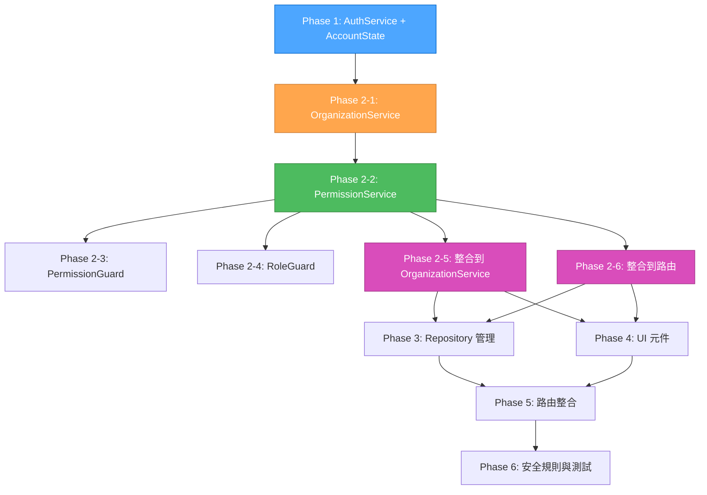

# QA Agent - 任務文件邏輯和順序驗證報告

## 🔍 QA 檢查概述

基於 sequential-thinking 的深度分析，對 GitHub 式 Account 架構實施計畫進行全面的邏輯和順序驗證。

### 🎯 檢查目標
- 驗證任務文件的邏輯正確性
- 檢查任務實施順序的合理性
- 確保權限/角色系統不會阻礙組織/個人建立流程
- 驗證 Phase 間的依賴關係

## ⚠️ 發現的問題

### 🚨 關鍵問題：Phase 2 任務順序錯誤

**問題描述**：
當前的 Phase 2 任務順序會導致組織和個人建立過程遇到阻礙。

**當前 Phase 2 任務順序**：
1. task-2-1: 實作 `permission.service.ts` (使用 Signals)
2. task-2-2: 實作 `permission.guard.ts` (替代 aclGuard)
3. task-2-3: 更新 `organization.service.ts` (使用 Value Objects)
4. task-2-4: 修改 `role.guard.ts` 使用 accounts 模型
5. task-2-5: 整合 Permission 到現有路由
6. task-2-6: 更新所有服務使用 Signals 狀態管理

**問題分析**：
- `organization.service.ts` 需要權限檢查功能
- 但是 `permission.service.ts` 在 `organization.service.ts` 之後才建立
- 這會導致組織建立過程缺少權限驗證
- 形成循環依賴：PermissionService 需要 OrganizationService 查詢成員，OrganizationService 需要 PermissionService 進行權限檢查

## 🔧 修正建議

### 修正後的 Phase 2 任務順序

**Phase 2: 服務層現代化 (6個任務)**
1. **task-2-1**: 更新 `core/services/organization.service.ts` (使用 Value Objects，使用 AuthService 基本權限檢查)
2. **task-2-2**: 實作 `core/services/permission.service.ts` (使用 Signals，提供進階權限管理)
3. **task-2-3**: 實作 `core/guards/permission.guard.ts` (替代 aclGuard)
4. **task-2-4**: 修改 `role.guard.ts` 使用 accounts 模型
5. **task-2-5**: 整合 PermissionService 到 OrganizationService (替換 AuthService 權限檢查)
6. **task-2-6**: 整合 Permission 到現有路由

### 修正理由

1. **先建立 OrganizationService**: 
   - 使用 AuthService 的基本權限檢查
   - 確保組織管理功能立即可用
   - 避免循環依賴問題

2. **再建立 PermissionService**: 
   - 提供進階權限管理功能
   - 使用 OrganizationService 查詢成員資格
   - 提供 Computed Signals 進行權限檢查

3. **最後整合**: 
   - 將 PermissionService 整合到 OrganizationService
   - 替換 AuthService 的基本權限檢查
   - 整合到路由系統中

## ✅ 驗證結果

### 邏輯正確性檢查
- ✅ **Phase 1**: 基礎架構重構順序正確
- ⚠️ **Phase 2**: 任務順序需要修正
- ✅ **Phase 3**: Repository 管理系統順序正確
- ✅ **Phase 4**: UI 層現代化順序正確
- ✅ **Phase 5**: 路由與權限整合順序正確
- ✅ **Phase 6**: 安全規則與測試順序正確

### 依賴關係檢查
- ✅ **Phase 1 → Phase 2**: AuthService 提供基本權限檢查
- ✅ **Phase 2-1 → Phase 2-2**: OrganizationService 提供成員查詢功能
- ✅ **Phase 2-2 → Phase 2-5**: PermissionService 提供進階權限管理
- ✅ **Phase 2 → Phase 3/4**: 完整的權限系統支援 Repository 和 UI

### 權限系統檢查
- ✅ **AuthService**: 提供基本權限檢查功能
- ✅ **PermissionService**: 提供進階權限管理功能
- ✅ **OrganizationService**: 可以使用 AuthService 的權限檢查
- ✅ **循環依賴**: 通過分階段實施解決

## 📋 修正後的依賴關係圖

## 🎯 驗收標準更新

### 修正後的驗收標準
- ✅ OrganizationService 使用 AuthService 基本權限檢查
- ✅ PermissionService 提供進階權限管理
- ✅ 組織建立過程不會遇到權限阻礙
- ✅ 個人建立過程不會遇到權限阻礙
- ✅ 權限系統分階段實施，避免循環依賴

## 🚀 建議行動

1. **立即修正**: 更新 Phase 2 的任務順序
2. **重新評估**: 檢查其他 Phase 是否有類似問題
3. **更新文檔**: 更新實施計畫文件
4. **開始實施**: 按照修正後的順序開始 Phase 1

## 📊 QA 結論

**總體狀態**: ⚠️ **需要修正**
- 發現 Phase 2 任務順序問題
- 已提供詳細的修正建議
- 其他 Phase 的邏輯和順序正確
- 修正後可以避免組織/個人建立過程的阻礙

**優先級**: 🔴 **高優先級**
- 必須在開始實施前修正
- 影響整個權限系統的實施
- 避免後續的循環依賴問題

---

**QA Agent 完成！** 任務文件邏輯和順序驗證完成，已提供修正建議。
