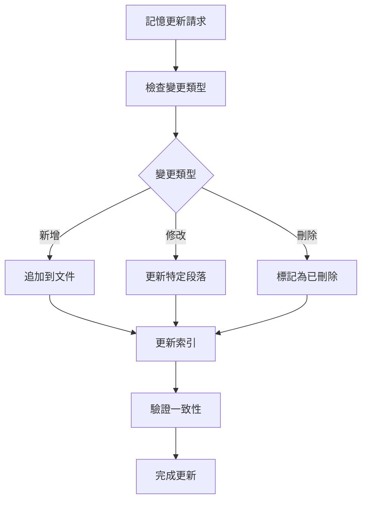
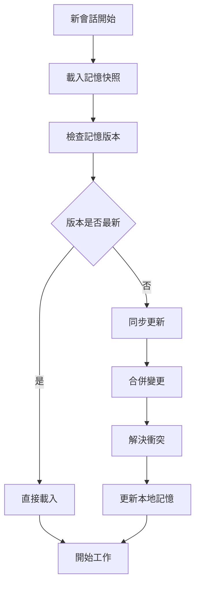

# Memory Bank System - 記憶管理增強方案

## 當前記憶管理架構分析

您的 Memory Bank System 已經實現了：
- `tasks.md` 作為單一真實來源
- `activeContext.md` 維護當前焦點
- `progress.md` 追蹤實施狀態
- 創意階段文件 (`creative-*.md`)
- 反思文件 (`reflect-*.md`)

## 建議的增強功能

### 1. 增量記憶更新機制



### 2. 記憶壓縮算法

#### 壓縮策略
- **時間壓縮**：將超過 30 天的舊記憶壓縮為摘要
- **重要性壓縮**：保留高重要性內容，壓縮低重要性內容
- **重複壓縮**：識別和合併重複的記憶內容

#### 壓縮層級
1. **Level 1**：基本壓縮（移除空白和格式）
2. **Level 2**：內容壓縮（合併相似內容）
3. **Level 3**：摘要壓縮（生成關鍵摘要）

### 3. 跨會話記憶同步



### 4. 記憶生命週期管理

#### 記憶分類
- **永久記憶**：核心系統配置和重要決策
- **臨時記憶**：當前任務相關的臨時信息
- **快取記憶**：可重新生成的計算結果

#### 生命週期規則
- **永久記憶**：永不自動刪除
- **臨時記憶**：任務完成後 7 天自動清理
- **快取記憶**：1 小時後自動清理

### 5. 記憶搜尋和檢索優化

#### 搜尋功能
- **全文搜尋**：支援關鍵字和短語搜尋
- **語義搜尋**：基於語義相似性的搜尋
- **時間範圍搜尋**：按時間範圍篩選記憶
- **標籤搜尋**：基於標籤的分類搜尋

#### 檢索優化
- **相關性排序**：根據相關性排序搜尋結果
- **上下文感知**：根據當前上下文調整搜尋結果
- **快速預覽**：提供記憶內容的快速預覽

## 實施計劃

### 階段 1：基礎增強（1-2 週）
1. 實現增量更新機制
2. 添加記憶版本控制
3. 建立基本的壓縮功能

### 階段 2：進階功能（2-3 週）
1. 實現跨會話同步
2. 添加記憶生命週期管理
3. 建立搜尋和檢索系統

### 階段 3：優化和整合（1-2 週）
1. 性能優化
2. 與現有系統整合
3. 測試和調試

## 技術實現建議

### 1. 記憶存儲格式
```json
{
  "memory_id": "unique_identifier",
  "timestamp": "2024-01-01T00:00:00Z",
  "type": "task|context|progress|creative|reflect",
  "content": "actual_content",
  "metadata": {
    "importance": "high|medium|low",
    "tags": ["tag1", "tag2"],
    "version": "1.0",
    "compression_level": "none|basic|summary"
  },
  "dependencies": ["memory_id_1", "memory_id_2"]
}
```

### 2. 壓縮算法實現
```python
def compress_memory(memory, level):
    if level == "basic":
        return remove_whitespace(memory)
    elif level == "content":
        return merge_similar_content(memory)
    elif level == "summary":
        return generate_summary(memory)
    return memory
```

### 3. 同步機制
```python
def sync_memories(local_memories, remote_memories):
    conflicts = detect_conflicts(local_memories, remote_memories)
    if conflicts:
        resolved = resolve_conflicts(conflicts)
        return merge_memories(local_memories, remote_memories, resolved)
    return merge_memories(local_memories, remote_memories)
```