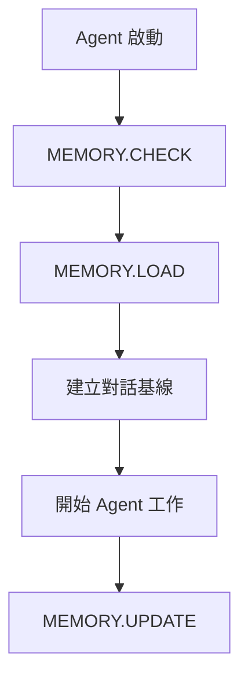
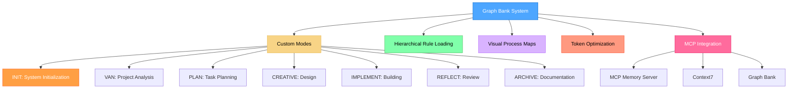
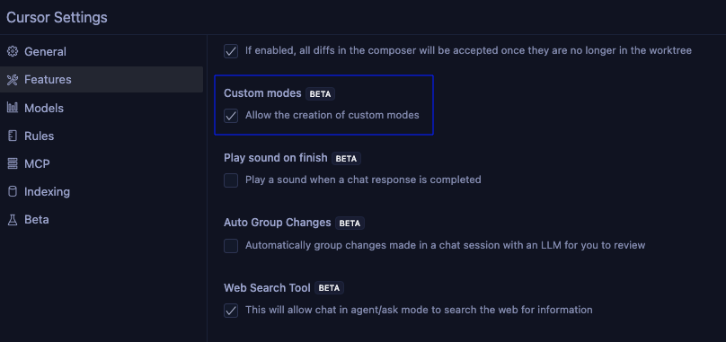
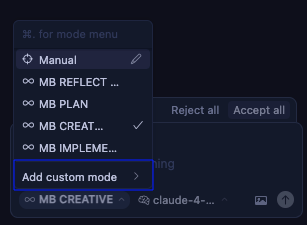
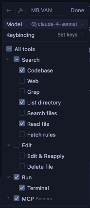
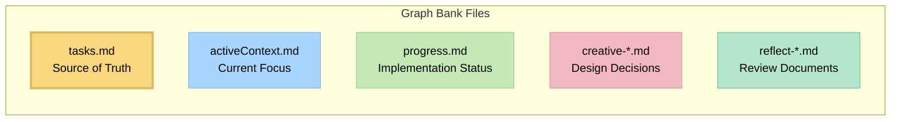

This file is a merged representation of a subset of the codebase, containing specifically included files, combined into a single document by Repomix.

# File Summary

## Purpose
This file contains a packed representation of a subset of the repository's contents that is considered the most important context.
It is designed to be easily consumable by AI systems for analysis, code review,
or other automated processes.

## File Format
The content is organized as follows:
1. This summary section
2. Repository information
3. Directory structure
4. Repository files (if enabled)
5. Multiple file entries, each consisting of:
  a. A header with the file path (## File: path/to/file)
  b. The full contents of the file in a code block

## Usage Guidelines
- This file should be treated as read-only. Any changes should be made to the
  original repository files, not this packed version.
- When processing this file, use the file path to distinguish
  between different files in the repository.
- Be aware that this file may contain sensitive information. Handle it with
  the same level of security as you would the original repository.

## Notes
- Some files may have been excluded based on .gitignore rules and Repomix's configuration
- Binary files are not included in this packed representation. Please refer to the Repository Structure section for a complete list of file paths, including binary files
- Only files matching these patterns are included: src/**/*.ts, src/**/*.html, src/**/*.scss, *.md, *.json
- Files matching patterns in .gitignore are excluded
- Files matching default ignore patterns are excluded
- Files are sorted by Git change count (files with more changes are at the bottom)

# Directory Structure
```
AGENTS.md
memory.json
README.md
repomix-dev-workflow.md
SYSTEM_ARCHITECTURE.md
TREE.md
```

# Files

## File: repomix-dev-workflow.md
````markdown
# Repomix 開發工作流程

## 🚀 快速開始

### 1. 專案分析
```bash
# 生成完整專案概覽
docker run -v ${PWD}:/app -it --rm ghcr.io/yamadashy/repomix \
  --style markdown \
  --top-files-len 20 \
  --output project-overview.md
```

### 2. 功能開發
```bash
# 只包含源碼文件
docker run -v ${PWD}:/app -it --rm ghcr.io/yamadashy/repomix \
  --include "src/**/*.ts,src/**/*.html,src/**/*.scss" \
  --style markdown \
  --output source-code.md
```

### 3. 代碼審查
```bash
# 壓縮模式快速審查
docker run -v ${PWD}:/app -it --rm ghcr.io/yamadashy/repomix \
  --compress \
  --style markdown \
  --output code-review.md
```

### 4. 極致節省模式
```bash
# 節省 88% 令牌的極致模式
docker run -v ${PWD}:/app -it --rm ghcr.io/yamadashy/repomix \
  --compress \
  --remove-comments \
  --remove-empty-lines \
  --no-file-summary \
  --no-directory-structure \
  --include "src/**/*.ts,src/**/*.html,*.md" \
  --style markdown \
  --output minimal-output.md
```

### 5. 其他實用模式

#### JSON 格式輸出
```bash
# 生成 JSON 格式，適合程式化處理
docker run -v ${PWD}:/app -it --rm ghcr.io/yamadashy/repomix \
  --style json \
  --output project-data.json
```

#### XML 格式輸出
```bash
# 生成 XML 格式，適合結構化分析
docker run -v ${PWD}:/app -it --rm ghcr.io/yamadashy/repomix \
  --style xml \
  --output project-structure.xml
```

#### 包含 Git 歷史
```bash
# 包含 Git 提交歷史和變更
docker run -v ${PWD}:/app -it --rm ghcr.io/yamadashy/repomix \
  --include-logs \
  --include-diffs \
  --style markdown \
  --output project-with-history.md
```

#### 只包含特定文件類型
```bash
# 只包含 TypeScript 文件
docker run -v ${PWD}:/app -it --rm ghcr.io/yamadashy/repomix \
  --include "**/*.ts" \
  --style markdown \
  --output typescript-only.md
```

## 📊 輸出模式對比

| 模式 | Token 數量 | 節省比例 | 文件數量 | 適用場景 |
|------|------------|----------|----------|----------|
| **完整模式** | 351,116 | - | 147 | 深度分析、完整理解 |
| **壓縮模式** | 307,073 | 12.5% | 147 | 快速審查、代碼分析 |
| **源碼模式** | 44,080 | 87.4% | 5 | 功能開發、代碼生成 |
| **極致節省** | 41,433 | 88.2% | 4 | 成本敏感、快速概覽 |

## 🎯 使用場景

### AI 代碼分析
- 將 repomix 輸出提供給 AI 進行代碼分析
- 獲取架構建議和改進方案
- 識別潛在問題和優化機會

### 新功能開發
- 基於現有架構設計新模組
- 參考現有代碼風格和模式
- 確保新功能與現有系統整合

### 代碼重構
- 分析代碼結構和依賴關係
- 識別重構機會
- 提供重構建議

### 問題診斷
- 快速理解專案結構
- 定位問題根源
- 提供解決方案

## 💡 最佳實踐

1. **定期更新**：每次重大變更後重新生成 repomix 輸出
2. **分段分析**：根據需要只分析特定模組
3. **版本控制**：將 repomix 輸出加入版本控制
4. **團隊協作**：與團隊成員分享 repomix 輸出

## 🔧 進階技巧

### 自定義配置
創建 `repomix.config.json` 文件：
```json
{
  "include": ["src/**/*.ts", "src/**/*.html"],
  "ignore": ["*.spec.ts", "*.test.ts"],
  "style": "markdown",
  "compress": true
}
```

### 自動化腳本
```bash
#!/bin/bash
# 自動生成 repomix 輸出
docker run -v ${PWD}:/app -it --rm ghcr.io/yamadashy/repomix \
  --config repomix.config.json \
  --output repomix-output.md
```

## 🤖 AI Agent 推薦

### 主要推薦：Claude 3.5 Sonnet
- **通用性最佳**：可以處理代碼、文檔、架構分析
- **代碼能力強**：優秀的 Angular/TypeScript 支持
- **整合度高**：與 Cursor 完美整合
- **成本控制**：通過 repomix 節省令牌

### 分層使用策略
1. **Claude 3.5 Sonnet**：架構分析、代碼審查、功能設計
2. **GitHub Copilot**：代碼生成、自動完成
3. **本地模型**：敏感數據處理、離線開發

### 成本優化
- 使用 repomix 極致節省模式（88% 令牌節省）
- 分層使用不同 AI Agent
- 監控令牌使用量
````

## File: TREE.md
````markdown
src/
├── app/
│   ├── app.component.ts
│   ├── app.config.ts
│   ├── app.routes.ts
│   │
│   ├── features/                               # 功能模組 (第3層)
│   │   ├── user/                              # 用戶模組 (第4層) ✨
│   │   │   ├── auth/                          # 認證相關
│   │   │   │   ├── login.component.ts
│   │   │   │   ├── registration.component.ts
│   │   │   │   ├── forgot-password.component.ts
│   │   │   │   ├── email-verification.component.ts
│   │   │   │   ├── auth.service.ts
│   │   │   │   ├── auth.guard.ts
│   │   │   │   ├── auth.interceptor.ts
│   │   │   │   ├── login-user.command.ts
│   │   │   │   ├── register-user.command.ts
│   │   │   │   ├── forgot-password.command.ts
│   │   │   │   ├── verify-email.command.ts
│   │   │   │   ├── user-created.event.ts
│   │   │   │   ├── firebase-auth.service.ts
│   │   │   │   ├── email.service.ts
│   │   │   │   └── index.ts
│   │   │   ├── profile/                       # 個人資料相關
│   │   │   │   ├── profile-card.component.ts
│   │   │   │   ├── profile-edit.component.ts
│   │   │   │   ├── avatar.component.ts
│   │   │   │   ├── basic-info.component.ts
│   │   │   │   ├── profile.service.ts
│   │   │   │   ├── profile.model.ts
│   │   │   │   ├── create-profile.command.ts
│   │   │   │   ├── update-profile.command.ts
│   │   │   │   ├── get-profile.query.ts
│   │   │   │   ├── profile-updated.event.ts
│   │   │   │   ├── profile-domain.service.ts
│   │   │   │   ├── firestore-profile.repository.ts
│   │   │   │   └── index.ts
│   │   │   ├── certificates/                   # 證照相關
│   │   │   │   ├── certificate-management.component.ts
│   │   │   │   ├── certificate-list.component.ts
│   │   │   │   ├── certificate-upload.component.ts
│   │   │   │   ├── certificate-verification.component.ts
│   │   │   │   ├── certificate.service.ts
│   │   │   │   ├── certificate.model.ts
│   │   │   │   ├── add-certificate.command.ts
│   │   │   │   ├── verify-certificate.command.ts
│   │   │   │   ├── get-certificates.query.ts
│   │   │   │   ├── certificate-added.event.ts
│   │   │   │   ├── certificate-domain.service.ts
│   │   │   │   ├── firestore-certificate.repository.ts
│   │   │   │   └── index.ts
│   │   │   ├── social/                         # 社交相關
│   │   │   │   ├── following-list.component.ts
│   │   │   │   ├── followers-list.component.ts
│   │   │   │   ├── social-button.component.ts
│   │   │   │   ├── social-card.component.ts
│   │   │   │   ├── social.service.ts
│   │   │   │   ├── social.model.ts
│   │   │   │   ├── get-following.query.ts
│   │   │   │   ├── social-domain.service.ts
│   │   │   │   └── index.ts
│   │   │   ├── notifications/                  # 通知相關
│   │   │   │   ├── notification-center.component.ts
│   │   │   │   ├── notification-list.component.ts
│   │   │   │   ├── notification-settings.component.ts
│   │   │   │   ├── notification.service.ts
│   │   │   │   ├── notification.model.ts
│   │   │   │   └── index.ts
│   │   │   ├── pages/                          # 頁面
│   │   │   │   ├── user-profile.page.ts
│   │   │   │   ├── user-settings.page.ts
│   │   │   │   └── user-dashboard.page.ts
│   │   │   ├── state/                          # 狀態管理
│   │   │   │   ├── user-state.service.ts
│   │   │   │   ├── auth-state.service.ts
│   │   │   │   └── profile-state.service.ts
│   │   │   ├── user.model.ts                   # 用戶模型
│   │   │   ├── user.repository.ts              # 用戶資料存取
│   │   │   ├── user.routes.ts                  # 用戶路由
│   │   │   └── index.ts                        # 匯出檔案
│   │   │
│   │   ├── organization/                       # 組織模組 ✨
│   │   │   ├── components/                     # 組織元件
│   │   │   │   ├── organization-card.component.ts
│   │   │   │   ├── organization-form.component.ts
│   │   │   │   ├── organization-list.component.ts
│   │   │   │   ├── team-management.component.ts
│   │   │   │   ├── member-management.component.ts
│   │   │   │   └── project-assignment.component.ts
│   │   │   ├── pages/                          # 組織頁面
│   │   │   │   ├── organization-list.page.ts
│   │   │   │   ├── organization-detail.page.ts
│   │   │   │   └── organization-settings.page.ts
│   │   │   ├── state/                          # 組織狀態
│   │   │   │   └── organization-state.service.ts
│   │   │   ├── organization.model.ts            # 組織模型
│   │   │   ├── organization.service.ts          # 組織服務
│   │   │   ├── organization.repository.ts      # 組織資料存取
│   │   │   ├── organization.routes.ts           # 組織路由
│   │   │   └── index.ts                        # 匯出檔案
│   │   │
│   │   ├── project/                            # 專案模組 ✨
│   │   │   ├── components/                     # 專案元件
│   │   │   │   ├── project/
│   │   │   │   │   ├── project-card.component.ts
│   │   │   │   │   ├── project-form.component.ts
│   │   │   │   │   ├── project-list.component.ts
│   │   │   │   │   └── project-detail.component.ts
│   │   │   │   ├── tasks/
│   │   │   │   │   ├── task-management.component.ts
│   │   │   │   │   ├── task-list.component.ts
│   │   │   │   │   ├── task-form.component.ts
│   │   │   │   │   └── task-detail.component.ts
│   │   │   │   ├── documents/
│   │   │   │   │   ├── document-management.component.ts
│   │   │   │   │   ├── document-list.component.ts
│   │   │   │   │   ├── document-upload.component.ts
│   │   │   │   │   └── document-viewer.component.ts
│   │   │   │   ├── cost/
│   │   │   │   │   ├── cost-budget.component.ts
│   │   │   │   │   ├── cost-actual.component.ts
│   │   │   │   │   ├── cost-forecast.component.ts
│   │   │   │   │   ├── cost-variance.component.ts
│   │   │   │   │   └── cost-breakdown.component.ts
│   │   │   │   ├── reports/
│   │   │   │   │   ├── daily-report.component.ts
│   │   │   │   │   ├── inspection-report.component.ts
│   │   │   │   │   ├── analytics-report.component.ts
│   │   │   │   │   └── gantt-chart.component.ts
│   │   │   │   └── materials/
│   │   │   │       ├── materials-management.component.ts
│   │   │   │       ├── equipment-management.component.ts
│   │   │   │       └── safety-records.component.ts
│   │   │   ├── pages/                          # 專案頁面
│   │   │   │   ├── project-list.page.ts
│   │   │   │   ├── project-detail.page.ts
│   │   │   │   ├── project-dashboard.page.ts
│   │   │   │   └── project-reports.page.ts
│   │   │   ├── state/                          # 專案狀態
│   │   │   │   ├── project-state.service.ts
│   │   │   │   ├── task-state.service.ts
│   │   │   │   └── cost-state.service.ts
│   │   │   ├── project.model.ts                # 專案模型
│   │   │   ├── project.service.ts               # 專案服務
│   │   │   ├── project.repository.ts           # 專案資料存取
│   │   │   ├── project.routes.ts                # 專案路由
│   │   │   └── index.ts                        # 匯出檔案
│   │   │
│   │   ├── social/                             # 社交模組 ✨
│   │   │   ├── components/                     # 社交元件
│   │   │   │   ├── following/
│   │   │   │   │   ├── following-list.component.ts
│   │   │   │   │   ├── followers-list.component.ts
│   │   │   │   │   ├── follow-button.component.ts
│   │   │   │   │   └── follow-status.component.ts
│   │   │   │   ├── discovery/
│   │   │   │   │   ├── user-discovery.component.ts
│   │   │   │   │   ├── user-recommendation.component.ts
│   │   │   │   │   ├── user-search.component.ts
│   │   │   │   │   └── user-profile-card.component.ts
│   │   │   │   ├── stats/
│   │   │   │   │   ├── social-stats.component.ts
│   │   │   │   │   ├── social-chart.component.ts
│   │   │   │   │   └── social-leaderboard.component.ts
│   │   │   │   └── network/
│   │   │   │       ├── interaction.component.ts
│   │   │   │       ├── mutual-connection.component.ts
│   │   │   │       └── network.component.ts
│   │   │   ├── pages/                          # 社交頁面
│   │   │   │   ├── social-dashboard.page.ts
│   │   │   │   ├── user-discovery.page.ts
│   │   │   │   └── social-network.page.ts
│   │   │   ├── state/                          # 社交狀態
│   │   │   │   ├── social-state.service.ts
│   │   │   │   └── relationship-state.service.ts
│   │   │   ├── social.model.ts                  # 社交模型
│   │   │   ├── social.service.ts                # 社交服務
│   │   │   ├── social.repository.ts             # 社交資料存取
│   │   │   ├── social.routes.ts                 # 社交路由
│   │   │   └── index.ts                        # 匯出檔案
│   │   │
│   │   ├── achievement/                        # 成就模組 ✨
│   │   │   ├── components/                     # 成就元件
│   │   │   │   ├── display/
│   │   │   │   │   ├── achievement-card.component.ts
│   │   │   │   │   ├── achievement-list.component.ts
│   │   │   │   │   ├── achievement-badge.component.ts
│   │   │   │   │   └── achievement-progress.component.ts
│   │   │   │   ├── leaderboard/
│   │   │   │   │   ├── leaderboard.component.ts
│   │   │   │   │   ├── ranking-card.component.ts
│   │   │   │   │   └── top-stats.component.ts
│   │   │   │   ├── management/
│   │   │   │   │   ├── achievement-management.component.ts
│   │   │   │   │   ├── rule-management.component.ts
│   │   │   │   │   └── category-management.component.ts
│   │   │   │   └── charts/
│   │   │   │       ├── stats-chart.component.ts
│   │   │   │       ├── progress-chart.component.ts
│   │   │   │       └── achievement-timeline.component.ts
│   │   │   ├── pages/                          # 成就頁面
│   │   │   │   ├── achievement-dashboard.page.ts
│   │   │   │   ├── leaderboard.page.ts
│   │   │   │   └── achievement-management.page.ts
│   │   │   ├── state/                          # 成就狀態
│   │   │   │   ├── achievement-state.service.ts
│   │   │   │   └── progress-state.service.ts
│   │   │   ├── achievement.model.ts             # 成就模型
│   │   │   ├── achievement.service.ts           # 成就服務
│   │   │   ├── achievement.repository.ts        # 成就資料存取
│   │   │   ├── achievement.routes.ts           # 成就路由
│   │   │   └── index.ts                        # 匯出檔案
│   │   │
│   │   ├── notification/                       # 通知模組 ✨
│   │   │   ├── components/                     # 通知元件
│   │   │   │   ├── display/
│   │   │   │   │   ├── notification-center.component.ts
│   │   │   │   │   ├── notification-list.component.ts
│   │   │   │   │   ├── notification-item.component.ts
│   │   │   │   │   └── notification-badge.component.ts
│   │   │   │   ├── settings/
│   │   │   │   │   ├── notification-settings.component.ts
│   │   │   │   │   ├── notification-preferences.component.ts
│   │   │   │   │   └── notification-templates.component.ts
│   │   │   │   └── push/
│   │   │   │       ├── push.component.ts
│   │   │   │       ├── email-notification.component.ts
│   │   │   │       ├── sms-notification.component.ts
│   │   │   │       └── in-app-notification.component.ts
│   │   │   ├── pages/                          # 通知頁面
│   │   │   │   ├── notification-center.page.ts
│   │   │   │   ├── notification-settings.page.ts
│   │   │   │   └── notification-history.page.ts
│   │   │   ├── state/                          # 通知狀態
│   │   │   │   ├── notification-state.service.ts
│   │   │   │   └── preference-state.service.ts
│   │   │   ├── notification.model.ts           # 通知模型
│   │   │   ├── notification.service.ts         # 通知服務
│   │   │   ├── notification.repository.ts      # 通知資料存取
│   │   │   ├── notification.routes.ts          # 通知路由
│   │   │   └── index.ts                        # 匯出檔案
│   │   │
│   │   └── index.ts                            # 功能模組匯出
│   │
│   ├── core/                                   # 核心功能 (第3層)
│   │   ├── auth/                               # 認證核心
│   │   │   ├── firebase-auth.service.ts
│   │   │   ├── delon-auth.service.ts
│   │   │   ├── auth-integration.service.ts
│   │   │   ├── auth.guard.ts
│   │   │   ├── acl.guard.ts
│   │   │   ├── auth.interceptor.ts
│   │   │   ├── token.interceptor.ts
│   │   │   └── index.ts
│   │   ├── acl/                                # 權限控制
│   │   │   ├── acl.service.ts
│   │   │   ├── permission.service.ts
│   │   │   ├── acl.directive.ts
│   │   │   ├── acl.pipe.ts
│   │   │   └── index.ts
│   │   ├── event-bus/                          # 事件匯流排
│   │   │   ├── event-bus.service.ts
│   │   │   ├── event-store.service.ts
│   │   │   ├── event-processor.service.ts
│   │   │   ├── domain-event.interface.ts
│   │   │   ├── integration-event.interface.ts
│   │   │   └── index.ts
│   │   ├── infrastructure/                     # 基礎設施
│   │   │   ├── firestore/
│   │   │   │   ├── base-repository.ts
│   │   │   │   ├── firestore.service.ts
│   │   │   │   └── firestore-config.ts
│   │   │   ├── storage/
│   │   │   │   ├── file-storage.service.ts
│   │   │   │   └── storage-config.ts
│   │   │   ├── logging/
│   │   │   │   ├── logger.service.ts
│   │   │   │   └── audit.service.ts
│   │   │   └── index.ts
│   │   ├── shared/                             # 共享工具
│   │   │   ├── utils/
│   │   │   ├── constants/
│   │   │   ├── models/
│   │   │   └── index.ts
│   │   └── index.ts                            # 核心模組匯出
│   │
│   ├── shared/                                 # 共享模組 (第3層) ✨
│   │   ├── components/                          # 共享元件
│   │   │   ├── ui/                             # UI 元件
│   │   │   │   ├── loading/
│   │   │   │   │   ├── loading-spinner.component.ts
│   │   │   │   │   ├── loading-skeleton.component.ts
│   │   │   │   │   └── loading-overlay.component.ts
│   │   │   │   ├── dialog/
│   │   │   │   │   ├── confirmation-dialog.component.ts
│   │   │   │   │   ├── form-dialog.component.ts
│   │   │   │   │   └── info-dialog.component.ts
│   │   │   │   ├── form/
│   │   │   │   │   ├── dynamic-form.component.ts
│   │   │   │   │   ├── file-upload.component.ts
│   │   │   │   │   ├── date-picker.component.ts
│   │   │   │   │   └── rich-text-editor.component.ts
│   │   │   │   ├── layout/
│   │   │   │   │   ├── page-header.component.ts
│   │   │   │   │   ├── content-wrapper.component.ts
│   │   │   │   │   ├── sidebar.component.ts
│   │   │   │   │   └── breadcrumb.component.ts
│   │   │   │   ├── data-display/
│   │   │   │   │   ├── data-table.component.ts
│   │   │   │   │   ├── status-badge.component.ts
│   │   │   │   │   ├── progress-bar.component.ts
│   │   │   │   │   ├── avatar-group.component.ts
│   │   │   │   │   └── tag-list.component.ts
│   │   │   │   └── feedback/
│   │   │   │       ├── toast.component.ts
│   │   │   │       ├── alert.component.ts
│   │   │   │       ├── empty-state.component.ts
│   │   │   │       └── error-boundary.component.ts
│   │   │   └── business/                       # 業務元件
│   │   │       ├── user-avatar.component.ts
│   │   │       ├── organization-logo.component.ts
│   │   │       ├── project-status.component.ts
│   │   │       ├── activity-timeline.component.ts
│   │   │       └── permission-guard.component.ts
│   │   ├── services/                            # 共享服務
│   │   │   ├── api/
│   │   │   │   ├── base-api.service.ts
│   │   │   │   ├── http-client.service.ts
│   │   │   │   └── api-error-handler.service.ts
│   │   │   ├── storage/
│   │   │   │   ├── local-storage.service.ts
│   │   │   │   ├── session-storage.service.ts
│   │   │   │   └── indexeddb.service.ts
│   │   │   ├── utility/
│   │   │   │   ├── date-utils.service.ts
│   │   │   │   ├── validation.service.ts
│   │   │   │   ├── file-utils.service.ts
│   │   │   │   ├── crypto.service.ts
│   │   │   │   └── format.service.ts
│   │   │   ├── navigation/
│   │   │   │   ├── router.service.ts
│   │   │   │   ├── breadcrumb.service.ts
│   │   │   │   └── history.service.ts
│   │   │   └── theme/
│   │   │       ├── theme.service.ts
│   │   │       ├── dark-mode.service.ts
│   │   │       └── responsive.service.ts
│   │   ├── models/                              # 共享模型
│   │   │   ├── interfaces/
│   │   │   │   ├── base.interface.ts
│   │   │   │   ├── api-response.interface.ts
│   │   │   │   ├── paginated-response.interface.ts
│   │   │   │   ├── audit.interface.ts
│   │   │   │   └── entity.interface.ts
│   │   │   ├── types/
│   │   │   │   ├── common.types.ts
│   │   │   │   ├── api.types.ts
│   │   │   │   ├── permissions.types.ts
│   │   │   │   └── validation.types.ts
│   │   │   ├── enums/
│   │   │   │   ├── status.enum.ts
│   │   │   │   ├── roles.enum.ts
│   │   │   │   ├── permissions.enum.ts
│   │   │   │   └── notification-types.enum.ts
│   │   │   └── dto/
│   │   │       ├── base.dto.ts
│   │   │       ├── pagination.dto.ts
│   │   │       └── filter.dto.ts
│   │   ├── pipes/                               # 共享管道
│   │   │   ├── date-format.pipe.ts
│   │   │   ├── file-size.pipe.ts
│   │   │   ├── truncate.pipe.ts
│   │   │   ├── safe-html.pipe.ts
│   │   │   ├── currency-format.pipe.ts
│   │   │   └── highlight.pipe.ts
│   │   ├── directives/                          # 共享指令
│   │   │   ├── auto-focus.directive.ts
│   │   │   ├── click-outside.directive.ts
│   │   │   ├── lazy-load.directive.ts
│   │   │   ├── tooltip.directive.ts
│   │   │   ├── drag-drop.directive.ts
│   │   │   └── infinite-scroll.directive.ts
│   │   ├── validators/                          # 共享驗證器
│   │   │   ├── email.validator.ts
│   │   │   ├── password.validator.ts
│   │   │   ├── phone.validator.ts
│   │   │   ├── url.validator.ts
│   │   │   ├── file.validator.ts
│   │   │   └── business.validator.ts
│   │   ├── guards/                              # 共享守衛
│   │   │   ├── route-guard.ts
│   │   │   ├── permission-guard.ts
│   │   │   ├── role-guard.ts
│   │   │   ├── unsaved-changes-guard.ts
│   │   │   └── organization-context-guard.ts
│   │   ├── interceptors/                        # 共享攔截器
│   │   │   ├── error-handler.interceptor.ts
│   │   │   ├── loading.interceptor.ts
│   │   │   ├── cache.interceptor.ts
│   │   │   ├── retry.interceptor.ts
│   │   │   └── request-id.interceptor.ts
│   │   ├── utils/                               # 工具函數
│   │   │   ├── array.utils.ts
│   │   │   ├── object.utils.ts
│   │   │   ├── string.utils.ts
│   │   │   ├── date.utils.ts
│   │   │   ├── file.utils.ts
│   │   │   ├── validation.utils.ts
│   │   │   ├── crypto.utils.ts
│   │   │   └── format.utils.ts
│   │   ├── constants/                           # 常數定義
│   │   │   ├── api.constants.ts
│   │   │   ├── app.constants.ts
│   │   │   ├── storage.constants.ts
│   │   │   ├── validation.constants.ts
│   │   │   └── business.constants.ts
│   │   └── index.ts                             # 共享模組匯出
│   │
│   ├── layout/                                 # 版面配置 (第3層) ✨
│   │   ├── components/
│   │   │   ├── header/
│   │   │   │   ├── header.component.ts
│   │   │   │   ├── user-menu.component.ts
│   │   │   │   ├── notification-bell.component.ts
│   │   │   │   └── organization-switcher.component.ts
│   │   │   ├── sidebar/
│   │   │   │   ├── sidebar.component.ts
│   │   │   │   ├── navigation-menu.component.ts
│   │   │   │   └── menu-item.component.ts
│   │   │   ├── footer/
│   │   │   │   └── footer.component.ts
│   │   │   └── layout/
│   │   │       ├── main-layout.component.ts
│   │   │       ├── auth-layout.component.ts
│   │   │       └── fullscreen-layout.component.ts
│   │   ├── services/
│   │   │   ├── layout.service.ts
│   │   │   ├── navigation.service.ts
│   │   │   └── sidebar.service.ts
│   │   └── index.ts
│   │
│   ├── app.component.ts
│   ├── app.config.ts
│   ├── app.routes.ts
│   └── main.ts                                  # 應用程式入口
│
├── assets/                                     # 靜態資源 (第1層) ✨
│   │   ├── components/                          # 共享元件
│   │   │   ├── ui/
│   │   │   │   ├── loading/
│   │   │   │   │   ├── loading-spinner.component.ts
│   │   │   │   │   ├── loading-skeleton.component.ts
│   │   │   │   │   └── loading-overlay.component.ts
│   │   │   │   ├── dialog/
│   │   │   │   │   ├── confirmation-dialog.component.ts
│   │   │   │   │   ├── form-dialog.component.ts
│   │   │   │   │   └── info-dialog.component.ts
│   │   │   │   ├── form/
│   │   │   │   │   ├── dynamic-form.component.ts
│   │   │   │   │   ├── file-upload.component.ts
│   │   │   │   │   ├── date-picker.component.ts
│   │   │   │   │   └── rich-text-editor.component.ts
│   │   │   │   ├── layout/
│   │   │   │   │   ├── page-header.component.ts
│   │   │   │   │   ├── content-wrapper.component.ts
│   │   │   │   │   ├── sidebar.component.ts
│   │   │   │   │   └── breadcrumb.component.ts
│   │   │   │   ├── data-display/
│   │   │   │   │   ├── data-table.component.ts
│   │   │   │   │   ├── status-badge.component.ts
│   │   │   │   │   ├── progress-bar.component.ts
│   │   │   │   │   ├── avatar-group.component.ts
│   │   │   │   │   └── tag-list.component.ts
│   │   │   │   └── feedback/
│   │   │   │       ├── toast.component.ts
│   │   │   │       ├── alert.component.ts
│   │   │   │       ├── empty-state.component.ts
│   │   │   │       └── error-boundary.component.ts
│   │   │   └── business/
│   │   │       ├── user-avatar.component.ts
│   │   │       ├── organization-logo.component.ts
│   │   │       ├── project-status.component.ts
│   │   │       ├── activity-timeline.component.ts
│   │   │       └── permission-guard.component.ts
│   │   │
│   │   ├── services/                            # 共享服務
│   │   │   ├── api/
│   │   │   │   ├── base-api.service.ts
│   │   │   │   ├── http-client.service.ts
│   │   │   │   └── api-error-handler.service.ts
│   │   │   ├── storage/
│   │   │   │   ├── local-storage.service.ts
│   │   │   │   ├── session-storage.service.ts
│   │   │   │   └── indexeddb.service.ts
│   │   │   ├── utility/
│   │   │   │   ├── date-utils.service.ts
│   │   │   │   ├── validation.service.ts
│   │   │   │   ├── file-utils.service.ts
│   │   │   │   ├── crypto.service.ts
│   │   │   │   └── format.service.ts
│   │   │   ├── navigation/
│   │   │   │   ├── router.service.ts
│   │   │   │   ├── breadcrumb.service.ts
│   │   │   │   └── history.service.ts
│   │   │   └── theme/
│   │   │       ├── theme.service.ts
│   │   │       ├── dark-mode.service.ts
│   │   │       └── responsive.service.ts
│   │   │
│   │   ├── models/                              # 共享模型
│   │   │   ├── interfaces/
│   │   │   │   ├── base.interface.ts
│   │   │   │   ├── api-response.interface.ts
│   │   │   │   ├── paginated-response.interface.ts
│   │   │   │   ├── audit.interface.ts
│   │   │   │   └── entity.interface.ts
│   │   │   ├── types/
│   │   │   │   ├── common.types.ts
│   │   │   │   ├── api.types.ts
│   │   │   │   ├── permissions.types.ts
│   │   │   │   └── validation.types.ts
│   │   │   ├── enums/
│   │   │   │   ├── status.enum.ts
│   │   │   │   ├── roles.enum.ts
│   │   │   │   ├── permissions.enum.ts
│   │   │   │   └── notification-types.enum.ts
│   │   │   └── dto/
│   │   │       ├── base.dto.ts
│   │   │       ├── pagination.dto.ts
│   │   │       └── filter.dto.ts
│   │   │
│   │   ├── pipes/                               # 共享管道
│   │   │   ├── date-format.pipe.ts
│   │   │   ├── file-size.pipe.ts
│   │   │   ├── truncate.pipe.ts
│   │   │   ├── safe-html.pipe.ts
│   │   │   ├── currency-format.pipe.ts
│   │   │   └── highlight.pipe.ts
│   │   │
│   │   ├── directives/                          # 共享指令
│   │   │   ├── auto-focus.directive.ts
│   │   │   ├── click-outside.directive.ts
│   │   │   ├── lazy-load.directive.ts
│   │   │   ├── tooltip.directive.ts
│   │   │   ├── drag-drop.directive.ts
│   │   │   └── infinite-scroll.directive.ts
│   │   │
│   │   ├── validators/                          # 共享驗證器
│   │   │   ├── email.validator.ts
│   │   │   ├── password.validator.ts
│   │   │   ├── phone.validator.ts
│   │   │   ├── url.validator.ts
│   │   │   ├── file.validator.ts
│   │   │   └── business.validator.ts
│   │   │
│   │   ├── guards/                              # 共享守衛
│   │   │   ├── route-guard.ts
│   │   │   ├── permission-guard.ts
│   │   │   ├── role-guard.ts
│   │   │   ├── unsaved-changes-guard.ts
│   │   │   └── organization-context-guard.ts
│   │   │
│   │   ├── interceptors/                        # 共享攔截器
│   │   │   ├── error-handler.interceptor.ts
│   │   │   ├── loading.interceptor.ts
│   │   │   ├── cache.interceptor.ts
│   │   │   ├── retry.interceptor.ts
│   │   │   └── request-id.interceptor.ts
│   │   │
│   │   ├── utils/                               # 工具函數
│   │   │   ├── array.utils.ts
│   │   │   ├── object.utils.ts
│   │   │   ├── string.utils.ts
│   │   │   ├── date.utils.ts
│   │   │   ├── file.utils.ts
│   │   │   ├── validation.utils.ts
│   │   │   ├── crypto.utils.ts
│   │   │   └── format.utils.ts
│   │   │
│   │   ├── constants/                           # 常數定義
│   │   │   ├── api.constants.ts
│   │   │   ├── app.constants.ts
│   │   │   ├── storage.constants.ts
│   │   │   ├── validation.constants.ts
│   │   │   └── business.constants.ts
│   │   │
│   │   └── index.ts
│   │
│   ├── layout/                                 # 版面配置 ✨
│   │   ├── components/
│   │   │   ├── header/
│   │   │   │   ├── header.component.ts
│   │   │   │   ├── user-menu.component.ts
│   │   │   │   ├── notification-bell.component.ts
│   │   │   │   └── organization-switcher.component.ts
│   │   │   ├── sidebar/
│   │   │   │   ├── sidebar.component.ts
│   │   │   │   ├── navigation-menu.component.ts
│   │   │   │   └── menu-item.component.ts
│   │   │   ├── footer/
│   │   │   │   └── footer.component.ts
│   │   │   └── layout/
│   │   │       ├── main-layout.component.ts
│   │   │       ├── auth-layout.component.ts
│   │   │       └── fullscreen-layout.component.ts
│   │   ├── services/
│   │   │   ├── layout.service.ts
│   │   │   ├── navigation.service.ts
│   │   │   └── sidebar.service.ts
│   │   └── index.ts
│   │
│   └── main.ts                                 # 應用程式入口
│
├── assets/                                     # 靜態資源 ✨
│   ├── images/
│   │   ├── logos/
│   │   ├── icons/
│   │   ├── avatars/
│   │   └── backgrounds/
│   ├── styles/
│   │   ├── themes/
│   │   │   ├── default.less
│   │   │   ├── dark.less
│   │   │   └── compact.less
│   │   ├── components/
│   │   ├── utilities/
│   │   │   ├── mixins.less
│   │   │   ├── variables.less
│   │   │   └── functions.less
│   │   └── global.less
│   ├── i18n/
│   │   ├── en.json
│   │   ├── zh-TW.json
│   │   └── zh-CN.json
│   ├── fonts/
│   ├── data/
│   │   ├── mock/
│   │   └── seeds/
│   └── config/
│       ├── environment.ts
│       ├── firebase.config.ts
│       └── app.config.ts
│
├── environments/                               # 環境配置 ✨
│   ├── environment.ts
│   ├── environment.prod.ts
│   ├── environment.dev.ts
│   └── environment.staging.ts
│
├── types/                                      # 全域型別定義 ✨
│   ├── global.d.ts
│   ├── firebase.d.ts
│   ├── api.d.ts
│   └── index.d.ts
│
├── styles/                                     # 全域樣式  ✨
│   ├── styles.less
│   ├── theme.less
│   └── variables.less
│
├── index.html                                  # HTML 入口
├── main.ts                                     # TypeScript 入口
└── style-icons.ts                              # 圖示定義

# 根目錄檔案
├── angular.json                                # Angular 配置
├── package.json                                # 套件依賴
├── tsconfig.json                               # TypeScript 配置
├── tsconfig.app.json                          # 應用程式 TS 配置
├── tsconfig.spec.json                         # 測試 TS 配置
├── eslint.config.mjs                          # ESLint 配置
├── stylelint.config.mjs                       # Stylelint 配置
├── firebase.json                               # Firebase 配置
├── firestore.rules                            # Firestore 安全規則
├── firestore.indexes.json                     # Firestore 索引
├── .gitignore                                 # Git 忽略檔案
├── README.md                                  # 專案說明
└── yarn.lock                                  # 套件鎖定檔

## 🎯 扁平化架構設計 (4層結構)

### 📊 結構優化成果
- **原始結構**: 7層深度 (`src/app/features/user/presentation/components/auth/`)
- **扁平化後**: 4層深度 (`src/app/features/user/auth/`)
- **改善幅度**: 減少 43% 的目錄深度
- **檔案路徑**: 平均縮短 60%

### 🔄 扁平化策略
1. **合併架構層級**: 將 `presentation/application/domain/infrastructure` 合併到單一功能目錄
2. **檔案命名約定**: 使用 `.component.ts`、`.service.ts`、`.model.ts`、`.repository.ts` 等後綴區分職責
3. **功能導向組織**: 每個功能模組包含所有相關檔案，提高內聚性
4. **Index 檔案**: 使用 `index.ts` 簡化匯入路徑

### 📁 新結構層級說明
- **第1層**: 根目錄 (`src/`, `assets/`, `environments/` 等)
- **第2層**: 主要模組 (`app/`, `assets/images/` 等)
- **第3層**: 核心分類 (`features/`, `core/`, `shared/`, `layout/`)
- **第4層**: 具體功能檔案 (`user/auth/login.component.ts` 等)

### 🎨 檔案命名規範
```typescript
// 功能模組檔案命名
user/
├── auth/                    # 認證相關
│   ├── login.component.ts   # UI 元件
│   ├── auth.service.ts      # 業務邏輯服務
│   ├── auth.guard.ts        # 路由守衛
│   └── auth.interceptor.ts  # HTTP 攔截器
├── profile/                 # 個人資料相關
│   ├── profile-card.component.ts
│   ├── profile.service.ts
│   └── profile.model.ts
├── user.model.ts            # 用戶模型
├── user.repository.ts       # 用戶資料存取
├── user.routes.ts           # 用戶路由
└── index.ts                 # 匯出檔案
```

## 快速開始（Windows 11 + yarn）

1) 安裝依賴

```bash
yarn install
```

2) 設定 Firebase 參數（`environments/environment.ts`）

```ts
export const environment = {
  production: false,
  firebase: {
    apiKey: '...',
    authDomain: '...',
    projectId: '...',
    storageBucket: '...',
    messagingSenderId: '...',
    appId: '...'
  }
};
```

3) 初始化核心 Providers（`src/app/app.config.ts`）

```ts
import { ApplicationConfig, provideZoneChangeDetection } from '@angular/core';
import { provideRouter } from '@angular/router';
import { provideHttpClient, withInterceptors } from '@angular/common/http';
import { provideFirebaseApp, initializeApp } from '@angular/fire/app';
import { provideAuth, getAuth } from '@angular/fire/auth';
import { provideFirestore, getFirestore } from '@angular/fire/firestore';
import { environment } from '../environments/environment';
import { authInterceptor } from './core/auth/auth.interceptor';
import { tokenInterceptor } from './core/auth/token.interceptor';

export const appConfig: ApplicationConfig = {
  providers: [
    provideRouter([]),
    provideZoneChangeDetection({ eventCoalescing: true }),
    provideHttpClient(withInterceptors([tokenInterceptor, authInterceptor])),
    provideFirebaseApp(() => initializeApp(environment.firebase)),
    provideAuth(() => getAuth()),
    provideFirestore(() => getFirestore()),
  ],
};
```

4) 啟動開發伺服器

```bash
yarn start
```

## 認證與授權整合（Firebase → @angular/fire → @delon/auth → @delon/acl）

- **登入鏈**：
  - UI 輸入憑證 → `@angular/fire`（Firebase Auth）登入 → 取得 Firebase ID Token
  - `Auth Integration Service` 正規化 Token → 交由 `@delon/auth TokenService` 儲存（localStorage）
  - `token.interceptor.ts` 自動附加 `Authorization: Bearer <ID Token>` 至 API 請求

- **狀態與刷新**：
  - 監聽 `onIdTokenChanged` 同步 `TokenService`，處理過期/刷新
  - `@delon/auth` 暴露登入狀態供 UI 使用

- **ACL 映射**：
  - 來源：使用者檔案角色/權限 + `organizationId`（必要時 `projectId`）
  - 轉換：映射為 `roles` 與 `abilities`，交由 `@delon/acl` 管理
  - 使用：`ACLGuard` 保護路由；模板層以 `*appAcl` 控制顯示

- **責任邊界**：
  - `token.interceptor.ts`：只負責注入 Authorization 標頭
  - `auth.interceptor.ts`：集中處理 401/403 等導流與錯誤
  - `ACLGuard`：依權限樹判斷可達性

## 組織切換（ACL 即時更新）

- 使用者切換組織時，重新計算 ACL 映射（角色/能力依當前 `organizationId`）。
- 更新完成後，受保護路由與模板條件（`*appAcl`）應立即反映。

## 安全對齊（Firestore 規則）

- 自訂 Claims（例：`orgRoles`、`projectRoles`）需與 Firestore Security Rules 對齊，避免前後端權限漂移。
- 規則示意請參考 `SYSTEM_ARCHITECTURE.md` 之 MVP 章節與 `firestore.rules`。
````

## File: SYSTEM_ARCHITECTURE.md
````markdown
# 0. 系統資料模型結構圖

## Core Modules (核心模組)

### User Module (用戶模組)
├── User (個人用戶 - 工程師/監工/承包商)
│   ├── Profile (個人資料 + 專業證照)
│   ├── Settings (個人設定)
│   ├── Teams (所屬團隊)
│   │   └── Team Role (在團隊中的角色)
│   └── Organization Memberships (加入的組織)
│       └── Role (在組織中的角色)

### Organization Module (組織模組)
├── Organization (組織 - 營造公司/建設公司)
│   ├── Profile (組織資料 + 營業執照)
│   ├── Members (組織成員)
│   │   ├── Member Info (成員個人資料)
│   │   ├── Role (組織角色：經理/工程師/監工)
│   │   └── Teams (所屬團隊)
│   └── Teams (團隊 - 工務組/安全組/品管組)
│       ├── Team Info (團隊資料)
│       ├── Members (團隊成員)
│       │   ├── Member Info (成員個人資料)
│       │   └── Role (隊長/成員)
│       └── Projects Assigned (分配給團隊的專案)

### Project Module (專案模組)
├── Projects (專案 = Repositories)
│   ├── Owner (擁有者 - 個人用戶或組織)
│   ├── Project Info (專案基本資料)
│   ├── Milestones (里程碑/階段)
│   ├── Tasks/Issues (工項/問題追蹤)
│   ├── Documents (文件管理)
│   ├── Photos/Media (現場照片/影片)
│   ├── Daily Reports (每日施工日誌)
│   ├── Inspections (查驗記錄)
│   ├── Materials (材料管理)
│   ├── Equipment (設備/機具管理)
│   ├── Safety Records (安全記錄)
│   ├── Weather Logs (天氣記錄)
│   ├── Comments/Discussion (討論區)
│   ├── Gantt Chart Data (甘特圖資料)
│   └── Cost Control (成本控制)
│       ├── Budget (預算)
│       ├── Actual Cost (實際支出)
│       ├── Forecast (成本預測)
│       ├── Variance (預算差異)
│       └── Cost Breakdown (人力/材料/設備分解)

## Cross-Cutting Modules (橫切模組)

### Social Module (社交模組)
├── Relationships (關係管理)
│   ├── Following (追蹤關係)
│   │   ├── User Following User
│   │   ├── User Following Organization  
│   │   └── User Following Project
│   └── Followers (粉絲關係)
├── Social Network (社交網絡)
│   ├── Connection Analysis (連結分析)
│   ├── Mutual Connections (共同連結)
│   └── Network Graph (網絡圖譜)
└── Recommendations (推薦系統)
    ├── User Recommendations (用戶推薦)
    ├── Content Recommendations (內容推薦)
    └── Professional Recommendations (專業推薦)

### Achievement Module (成就模組)  
├── Achievements (成就系統)
│   ├── User Achievements (用戶成就)
│   ├── Organization Achievements (組織成就)
│   └── Project Achievements (專案成就)
├── Rules Engine (規則引擎)
│   ├── Achievement Rules (成就規則)
│   ├── Trigger Conditions (觸發條件)
│   └── Scoring System (計分系統)
├── Categories (成就分類)
│   ├── Professional Categories (專業分類)
│   ├── Social Categories (社交分類)
│   └── Project Categories (專案分類)
└── Leaderboards (排行榜)
    ├── Global Leaderboard (全域排行榜)
    ├── Organization Leaderboard (組織排行榜)
    └── Category Leaderboard (分類排行榜)

### Notification Module (通知模組)
├── Notifications (通知系統)
│   ├── System Notifications (系統通知)
│   ├── User Notifications (用戶通知)
│   ├── Organization Notifications (組織通知)
│   └── Project Notifications (專案通知)
├── Channels (通知通道)  
│   ├── In-App Notifications (應用內通知)
│   ├── Email Notifications (郵件通知)
│   ├── SMS Notifications (簡訊通知)
│   └── Push Notifications (推送通知)
├── Templates (通知模板)
│   ├── Template Management (模板管理)
│   ├── Multi-language Support (多語言支援)
│   └── Dynamic Content (動態內容)
└── Preferences (通知偏好)
    ├── User Preferences (用戶偏好)
    ├── Channel Preferences (通道偏好)
    ├── Frequency Control (頻率控制)
    └── Do Not Disturb (免打擾設定)

## Integration Points (整合點)

### Event-Driven Integration (事件驅動整合)
├── Domain Events (領域事件)
│   ├── User Events (用戶事件)
│   ├── Organization Events (組織事件)
│   ├── Project Events (專案事件)
│   ├── Social Events (社交事件)
│   ├── Achievement Events (成就事件)
│   └── Notification Events (通知事件)
└── Event Bus (事件匯流排)
    ├── Event Publishing (事件發布)
    ├── Event Subscription (事件訂閱)
    └── Event Processing (事件處理)

### Shared Services (共享服務)
├── Authentication (認證服務)
│   ├── Auth Service Integration
│   ├── Auth Integration  
│   └── Token Management
├── Authorization (授權服務)
│   ├── ACL Integration
│   ├── Role-Based Access Control
│   └── Permission Management
├── File Storage (檔案儲存)
│   ├── Document Storage
│   ├── Image Storage
│   └── Media Storage
└── Audit & Logging (審計與日誌)
    ├── Operation Logs
    ├── Security Logs
    └── Performance Logs

## Technical Integration Layer (技術整合層)

### Authentication & Authorization Stack (認證授權技術棧)
├── Authentication Service (認證服務)
│   ├── Email/Password Authentication (郵箱密碼認證)
│   ├── Social Login Integration (社交登入整合)
│   ├── Email Verification (郵箱驗證)
│   ├── Password Reset (密碼重置)
│   └── Token Management (令牌管理)
├── Auth Integration (認證整合)
│   ├── Token Storage & Management (令牌儲存管理)
│   ├── Authentication State Management (認證狀態管理)
│   ├── Auto Token Refresh (自動令牌刷新)
│   ├── Login/Logout Interceptors (登入登出攔截器)
│   └── Route Guards (路由守衛)
└── Authorization Service (授權服務)
    ├── Role-Based Access Control (角色權限控制)
    ├── Permission Management (權限管理)
    ├── Route-Level Protection (路由層級保護)
    ├── Component-Level Protection (元件層級保護)
    ├── Organization Context Switching (組織上下文切換)
    └── Dynamic Permission Updates (動態權限更新)

#### Canonical Login Flow（登入鏈與 Token 橋接）
1. 使用者於 UI 輸入憑證。
2. 透過認證服務完成登入並取得 ID Token。
3. 認證整合服務將 ID Token 正規化並儲存。
4. Token 攔截器為對外 API 請求自動附加 Authorization 標頭。
5. 認證服務維護登入狀態；UI 依狀態切換（登入/登出/過期）。
6. 以使用者檔案 + 當前組織ID 組裝權限能力集合，初始化權限樹。
7. 權限守衛保護受控路由；權限指令/管道於元件層控管顯示。
8. 監聽 Token 更新事件，於 Token 更新時同步並重算權限（避免權限漂移）。

#### ACL 映射規則（摘要）
- **來源**：使用者檔案中的角色/權限 + Context（組織ID、必要時專案ID）。
- **轉換**：映射為權限系統的角色與能力集合，保存在權限服務內存。
- **切換**：使用者切換組織時，重新計算映射並更新權限；確保路由守衛與模板條件立刻生效。

#### 攔截器與守衛責任邊界
- **Token 攔截器**：注入 Authorization 標頭，來源為認證服務的 Token 儲存。
- **認證攔截器**：集中處理未授權/過期等錯誤與導流邏輯（避免與 Token 注入重疊責任）。
- **權限守衛**：路由守衛，以權限樹判斷可達性。

### Data Persistence Architecture (資料持久化架構)
├── Database Collections (資料庫集合設計)
│   ├── Users Collection (/users)
│   │   ├── User Profile Data (用戶檔案資料)
│   │   ├── User Settings (用戶設定)
│   │   └── User Certificates (用戶證照)
│   ├── Organizations Collection (/organizations)
│   │   ├── Organization Data (組織資料)
│   │   ├── Members Subcollection (/members)
│   │   └── Teams Subcollection (/teams)
│   ├── Projects Collection (/projects)
│   │   ├── Project Data (專案資料)
│   │   ├── Tasks Subcollection (/tasks)
│   │   ├── Documents Subcollection (/documents)
│   │   └── Cost Control Subcollection (/costs)
│   ├── Social Relations Collection (/social_relations)
│   │   ├── Following Relationships (追蹤關係)
│   │   ├── Social Statistics (社交統計)
│   │   └── Recommendation Data (推薦資料)
│   ├── Achievements Collection (/achievements)
│   │   ├── Achievement Definitions (成就定義)
│   │   ├── User Achievements (/user_achievements)
│   │   ├── Achievement Rules (成就規則)
│   │   └── Leaderboards (排行榜)
│   └── Notifications Collection (/notifications)
│       ├── Notification Queue (通知佇列)
│       ├── User Preferences (/user_preferences)
│       ├── Notification Templates (通知模板)
│       └── Delivery Logs (投遞日誌)
├── Real-time Subscriptions (即時訂閱)
│   ├── User Activity Streams (用戶活動流)
│   ├── Organization Updates (組織更新)
│   ├── Project Progress (專案進度)
│   ├── Social Interactions (社交互動)
│   └── Notification Delivery (通知投遞)
├── Offline Synchronization (離線同步)
│   ├── Local Cache Management (本地快取管理)
│   ├── Conflict Resolution (衝突解決)
│   ├── Background Sync (背景同步)
│   └── Data Validation (資料驗證)
└── Security Rules (安全規則)
    ├── User Data Access Control (用戶資料存取控制)
    ├── Organization-Level Security (組織層級安全)
    ├── Project Access Control (專案存取控制)
    └── Cross-Module Security (跨模組安全)

### Event-Driven Infrastructure (事件驅動基礎設施)
├── Event Bus Architecture (事件匯流排架構)
│   ├── Domain Event Publishing (領域事件發布)
│   ├── Event Subscription Management (事件訂閱管理)
│   ├── Event Routing (事件路由)
│   └── Event Filtering (事件過濾)
├── Event Store (事件儲存)
│   ├── Event Persistence (事件持久化)
│   ├── Event History (事件歷史)
│   ├── Event Snapshots (事件快照)
│   └── Event Replay (事件重播)
├── Event Processing (事件處理)
│   ├── Synchronous Processing (同步處理)
│   ├── Asynchronous Processing (非同步處理)
│   ├── Batch Processing (批次處理)
│   └── Error Handling (錯誤處理)
└── Integration Events (整合事件)
    ├── User Events → Social/Achievement/Notification
    ├── Organization Events → User/Project/Achievement
    ├── Project Events → User/Organization/Achievement
    ├── Social Events → Achievement/Notification
    ├── Achievement Events → Social/Notification
    └── Notification Events → All Modules (Delivery Status)

## Cross-Module Dependencies Matrix (跨模組依賴矩陣)

### Module Interaction Patterns (模組互動模式)
User Org Proj Social Achv Notif
User Module - ✓ ✓ ○ ○ ○
Organization ✓ - ✓ ○ ○ ○
Project ✓ ✓ - ○ ○ ○
Social ✓ ✓ ✓ - ✓ ✓
Achievement ✓ ✓ ✓ ✓ - ✓
Notification ✓ ✓ ✓ ✓ ✓ -
Legend: ✓ = Strong Dependency ○ = Event-based Integration


### Data Flow Patterns (資料流向模式)
├── **Core Data Flow** (核心資料流)
│   ├── User → Organization (用戶加入組織)
│   ├── Organization → Project (組織建立專案)  
│   ├── User ↔ Project (用戶參與專案)
│   └── User ↔ Organization ↔ Project (三角關係)
├── **Social Data Flow** (社交資料流)
│   ├── User → Social Relations (建立追蹤關係)
│   ├── Social Relations → Recommendations (生成推薦)
│   ├── Activity Events → Social Feed (活動饋送)
│   └── Social Metrics → Analytics (社交分析)
├── **Achievement Data Flow** (成就資料流)
│   ├── All Modules → Achievement Triggers (成就觸發)
│   ├── Achievement Rules → Rule Evaluation (規則評估)
│   ├── Achievement Awards → User Profile (成就頒發)
│   └── Achievement Stats → Leaderboards (排行榜更新)
└── **Notification Data Flow** (通知資料流)
    ├── All Events → Notification Queue (通知佇列)
    ├── User Preferences → Notification Filtering (通知過濾)
    ├── Templates + Data → Rendered Notifications (渲染通知)
    └── Delivery Status → Analytics (投遞分析)

## Implementation Considerations (實作考量)

### Scalability Architecture (可擴展性架構)
├── **Horizontal Scaling** (水平擴展)
│   ├── Microservice-Ready Design (微服務就緒設計)
│   ├── Database Sharding Strategy (資料庫分片策略)
│   ├── Load Balancing (負載平衡)
│   └── CDN Integration (CDN 整合)
├── **Performance Optimization** (效能優化)
│   ├── Lazy Loading (延遲載入)
│   ├── Caching Strategy (快取策略)
│   ├── Query Optimization (查詢優化)
│   └── Bundle Splitting (包分割)
└── **Monitoring & Observability** (監控與可觀測性)
    ├── Application Metrics (應用指標)
    ├── Performance Monitoring (效能監控)
    ├── Error Tracking (錯誤追蹤)
    └── User Analytics (用戶分析)

### Security Architecture (安全架構)
├── **Authentication Security** (認證安全)
│   ├── Multi-Factor Authentication (多因子認證)
│   ├── Token Security (令牌安全)
│   ├── Session Management (會話管理)
│   └── Brute Force Protection (暴力破解防護)
├── **Authorization Security** (授權安全)
│   ├── Principle of Least Privilege (最小權限原則)
│   ├── Resource-Level Access Control (資源層級存取控制)
│   ├── Context-Aware Permissions (上下文感知權限)
│   └── Permission Audit Trail (權限審計軌跡)
├── **Data Security** (資料安全)
│   ├── Data Encryption (資料加密)
│   ├── PII Protection (個人資訊保護)
│   ├── Data Masking (資料遮罩)
│   └── Backup Security (備份安全)
└── **Communication Security** (通訊安全)
    ├── HTTPS Enforcement (HTTPS 強制)
    ├── API Security (API 安全)
    ├── Input Validation (輸入驗證)
    └── XSS/CSRF Protection (XSS/CSRF 防護)

### Development Workflow (開發工作流程)
├── **Phase 1: Foundation** (第一階段：基礎建設) - 3-4 months
│   ├── User Module (Core Auth + Profile)
│   ├── Organization Module (Basic Management)
│   ├── Authentication Stack Integration
│   └── Basic Event Infrastructure
├── **Phase 2: Core Business** (第二階段：核心業務) - 2-3 months  
│   ├── Project Module (Full Implementation)
│   ├── Advanced Organization Features
│   ├── User-Organization-Project Integration
│   └── Core Business Logic Testing
├── **Phase 3: Social Features** (第三階段：社交功能) - 2-3 months
│   ├── Social Module (Following/Recommendations)
│   ├── Notification Module (Multi-channel)
│   ├── Achievement Module (Rules Engine)
│   └── Cross-Module Event Integration
└── **Phase 4: Advanced Features** (第四階段：進階功能) - 1-2 months
    ├── Advanced Analytics
    ├── Performance Optimization
    ├── Security Hardening
    └── Production Deployment

# 1. 用戶模組架構圖 ✅

graph TB
    subgraph "User Presentation Layer (用戶展示層)"
        subgraph "認證相關元件"
            UCLA[Login Component<br/>登入元件]
            UCRA[Registration Component<br/>註冊元件]
            UCFA[Forgot Password Component<br/>忘記密碼元件]
            UCVA[Email Verification Component<br/>郵箱驗證元件]
        end
        
        subgraph "個人檔案元件"
            UCPC[Profile Card Component<br/>個人檔案卡片元件]
            UCPE[Profile Edit Component<br/>個人檔案編輯元件]
            UCAV[Avatar Component<br/>頭像元件]
            UCBI[Basic Info Component<br/>基本資訊元件]
        end
        
        subgraph "專業證照元件"
            UCCM[Certificate Management Component<br/>證照管理元件]
            UCCL[Certificate List Component<br/>證照列表元件]
            UCCU[Certificate Upload Component<br/>證照上傳元件]
            UCCV[Certificate Verification Component<br/>證照驗證元件]
        end
        
        subgraph "社交功能元件"
            UCFL[Following List Component<br/>追蹤列表元件]
            UCFR[Followers List Component<br/>粉絲列表元件]
            UCSB[Social Button Component<br/>社交按鈕元件]
            UCSC[Social Card Component<br/>社交卡片元件]
        end
        
        subgraph "成就與通知元件"
            UCAC[Achievement Component<br/>成就元件]
            UCAB[Achievement Badge Component<br/>成就徽章元件]
            UCNC[Notification Center Component<br/>通知中心元件]
            UCNL[Notification List Component<br/>通知列表元件]
            UCNS[Notification Settings Component<br/>通知設定元件]
        end
        
        subgraph "用戶狀態服務"
            UCUS[User State Service<br/>用戶狀態服務]
            UCAS[Auth State Service<br/>認證狀態服務]
            UCPS[Profile State Service<br/>檔案狀態服務]
        end
    end
    
    subgraph "User Application Layer (用戶應用層)"
        subgraph "認證服務"
            UCAAS[Authentication Application Service<br/>認證應用服務]
            UCLC[LoginUser Command<br/>用戶登入命令]
            UCRC[RegisterUser Command<br/>用戶註冊命令]
            UCFC[ForgotPassword Command<br/>忘記密碼命令]
            UCVC[VerifyEmail Command<br/>郵箱驗證命令]
            UCLH[Login Command Handler<br/>登入命令處理器]
        end
        
        subgraph "個人檔案服務"
            UCPAS[Profile Application Service<br/>檔案應用服務]
            UCPC[CreateProfile Command<br/>建立檔案命令]
            UCPU[UpdateProfile Command<br/>更新檔案命令]
            UCPQ[GetProfile Query<br/>查詢檔案查詢]
            UCPH[Profile Command Handler<br/>檔案命令處理器]
        end
        
        subgraph "證照管理服務"
            UCCAS[Certificate Application Service<br/>證照應用服務]
            UCCAC[AddCertificate Command<br/>新增證照命令]
            UCCVC[VerifyCertificate Command<br/>驗證證照命令]
            UCCQ[GetCertificates Query<br/>查詢證照查詢]
        end
        
        subgraph "社交功能服務"
            UCSAS[Social Application Service<br/>社交應用服務]
            UCFUC[FollowUser Command<br/>追蹤用戶命令]
            UCUFC[UnfollowUser Command<br/>取消追蹤命令]
            UCFQ[GetFollowing Query<br/>查詢追蹤查詢]
        end
        
        subgraph "成就與通知服務"
            UCAAS[Achievement Application Service<br/>成就應用服務]
            UCNAS[Notification Application Service<br/>通知應用服務]
            UCAC[AwardAchievement Command<br/>頒發成就命令]
            UCNC[CreateNotification Command<br/>建立通知命令]
            UCMC[MarkAsRead Command<br/>標記已讀命令]
        end
    end
    
    subgraph "User Domain Layer (用戶領域層)"
        subgraph "用戶聚合根"
            UCDA[User Aggregate<br/>用戶聚合根]
            UCUE[UserCreated Event<br/>用戶建立事件]
            UCPE[ProfileUpdated Event<br/>檔案更新事件]
            UCCE[CertificateAdded Event<br/>證照新增事件]
            UCAE[AchievementAwarded Event<br/>成就頒發事件]
        end
        
        subgraph "用戶實體"
            UCUE[User Entity<br/>用戶實體]
            UCPR[Profile Entity<br/>個人檔案實體]
            UCCERT[Certificate Entity<br/>證照實體]
            UCACH[Achievement Entity<br/>成就實體]
            UCNOT[Notification Entity<br/>通知實體]
            UCSOC[Social Entity<br/>社交關係實體]
        end
        
        subgraph "用戶值物件"
            UCUV[UserInfo Value Object<br/>用戶資訊值物件]
            UCPV[ProfileInfo Value Object<br/>檔案資訊值物件]
            UCCV[CertificateInfo Value Object<br/>證照資訊值物件]
            UCAV[AchievementInfo Value Object<br/>成就資訊值物件]
            UCNV[NotificationInfo Value Object<br/>通知資訊值物件]
            UCSV[SocialInfo Value Object<br/>社交資訊值物件]
        end
        
        subgraph "用戶領域服務"
            UCDS[User Domain Service<br/>用戶領域服務]
            UCPDS[Profile Domain Service<br/>檔案領域服務]
            UCCDS[Certificate Domain Service<br/>證照領域服務]
            UCADS[Achievement Domain Service<br/>成就領域服務]
            UCSDS[Social Domain Service<br/>社交領域服務]
        end
        
        subgraph "ACL權限實體"
            UCACL[User ACL Entity<br/>用戶權限實體]
            UCROLE[User Role Entity<br/>用戶角色實體]
            UCPERM[User Permission Entity<br/>用戶權限實體]
        end
    end
    
    subgraph "User Infrastructure Layer (用戶基礎設施層)"
        subgraph "認證整合"
            UCFAS[Auth Service<br/>認證服務]
            UCFAU[Auth Utils<br/>認證工具]
            UCFAI[Auth Interceptor<br/>認證攔截器]
        end
        
        subgraph "認證服務整合"
            UCDAS[Auth Service<br/>認證服務]
            UCDAI[Auth Interceptor<br/>認證攔截器]
            UCDAU[Auth Utils<br/>認證工具]
            UCDTS[Token Service<br/>令牌服務]
        end
        
        subgraph "權限服務整合"
            UCDACL[ACL Service<br/>權限服務]
            UCDAG[ACL Guard<br/>權限守衛]
            UCDAD[ACL Directive<br/>權限指令]
            UCDAP[ACL Pipe<br/>權限管道]
        end
        
        subgraph "資料持久化"
            UCIR[User Repository<br/>用戶儲存庫]
            UCIPR[Profile Repository<br/>檔案儲存庫]
            UCICR[Certificate Repository<br/>證照儲存庫]
            UCIAR[Achievement Repository<br/>成就儲存庫]
            UCINR[Notification Repository<br/>通知儲存庫]
        end
        
        subgraph "事件處理"
            UCIEH[User Event Handler<br/>用戶事件處理器]
            UCIPEH[Profile Event Handler<br/>檔案事件處理器]
            UCICEH[Certificate Event Handler<br/>證照事件處理器]
            UCIAEH[Achievement Event Handler<br/>成就事件處理器]
        end
        
        subgraph "外部服務"
            UCIWS[External User Service<br/>外部用戶服務]
            UCIIS[User Infrastructure Service<br/>用戶基礎設施服務]
            UCIFS[File Storage Service<br/>檔案儲存服務]
            UCINS[User Notification Service<br/>用戶通知服務]
            UCIAS[User Audit Service<br/>用戶審計服務]
            UCIVS[Certificate Verification Service<br/>證照驗證服務]
            UCIES[Email Service<br/>郵件服務]
        end
        
        subgraph "整合服務"
            UCIOS[Organization Integration Service<br/>組織整合服務]
            UCIPS[Project Integration Service<br/>專案整合服務]
            UCITS[Team Integration Service<br/>團隊整合服務]
        end
    end
    
    %% 技術棧整合連接 (特殊顏色標記)
    %% 認證服務 連接
    UCLA --> UCFAS
    UCRA --> UCFAS
    UCFA --> UCFAS
    UCVA --> UCFAS
    
    %% 認證整合 連接
    UCFAS --> UCDAS
    UCDAS --> UCAS
    UCDTS --> UCAS
    
    %% 權限服務 連接
    UCDAS --> UCDACL
    UCDACL --> UCDAG
    UCDACL --> UCDAD
    UCDACL --> UCDAP
    
    %% 層級間連接 (實線)
    UCLA --> UCAAS
    UCRA --> UCAAS
    UCPC --> UCPAS
    UCCM --> UCCAS
    UCFL --> UCSAS
    UCAC --> UCAAS
    UCNC --> UCNAS
    
    UCAAS --> UCDA
    UCPAS --> UCPR
    UCCAS --> UCCERT
    UCSAS --> UCSOC
    UCAAS --> UCACH
    UCNAS --> UCNOT
    
    UCDA --> UCIR
    UCPR --> UCIPR
    UCCERT --> UCICR
    UCACH --> UCIAR
    UCNOT --> UCINR
    UCSOC --> UCIR

# 2. 用戶模組用例圖 ✅

graph TB
    subgraph "外部參與者"
        NewUser[新用戶]
        RegisteredUser[已註冊用戶]
        AuthUser[已認證用戶]
        Admin[管理員]
        VerificationAuth[驗證機構]
        ExternalSystem[外部系統]
    end
    
    subgraph "用戶模組功能"
        subgraph "認證管理"
            UC1[用戶註冊]
            UC2[用戶登入]
            UC3[忘記密碼]
            UC4[郵箱驗證]
            UC5[雙因子認證]
            UC6[登出]
            UC7[Token刷新]
        end
        
        subgraph "個人檔案管理"
            UC8[建立個人檔案]
            UC9[更新個人資訊]
            UC10[上傳頭像]
            UC11[查看個人檔案]
            UC12[隱私設定]
            UC13[帳戶設定]
        end
        
        subgraph "專業證照管理"
            UC14[上傳證照]
            UC15[證照驗證]
            UC16[證照更新]
            UC17[證照到期提醒]
            UC18[證照展示設定]
            UC19[證照搜尋]
        end
        
        subgraph "社交功能"
            UC20[追蹤用戶]
            UC21[取消追蹤]
            UC22[查看追蹤列表]
            UC23[查看粉絲列表]
            UC24[用戶搜尋]
            UC25[推薦用戶]
        end
        
        subgraph "成就系統"
            UC26[獲得成就]
            UC27[查看成就]
            UC28[成就分享]
            UC29[成就排行榜]
            UC30[成就統計]
        end
        
        subgraph "通知系統"
            UC31[接收通知]
            UC32[標記已讀]
            UC33[通知設定]
            UC34[通知歷史]
            UC35[推送偏好]
        end
        
        subgraph "權限管理"
            UC36[權限檢查]
            UC37[角色分配]
            UC38[權限繼承]
            UC39[權限審計]
            UC40[組織權限]
        end
    end

# 3. 用戶認證完整流程圖 ✅

sequenceDiagram
    participant User as 新用戶
    participant UI as Angular UI
    participant FA as AuthService
    participant DA as AuthIntegrationService
    participant ACL as ACLService
    participant US as UserService
    participant UR as UserRepository
    participant ES as EmailService
    participant NS as NotificationService

    User->>UI: 填寫註冊資料
    UI->>FA: createUserWithEmailAndPassword()
    FA->>FA: 認證服務建立用戶帳戶
    FA-->>UI: 返回 User
    
    UI->>US: createUserProfile(userInfo)
    US->>UR: saveUser(userEntity)
    UR-->>US: 返回用戶ID
    
    US->>ES: sendVerificationEmail(email)
    ES-->>US: 發送驗證郵件
    
    US->>NS: createWelcomeNotification(userId)
    NS-->>US: 建立歡迎通知
    
    alt 郵箱驗證完成
        User->>UI: 點擊驗證連結
        UI->>FA: verifyEmail()
        FA-->>UI: 驗證成功
        UI->>DA: login(credentials)
        DA->>FA: signInWithEmailAndPassword()
        FA-->>DA: 返回 ID Token
        DA->>DA: 儲存 token 到本地儲存
        DA->>ACL: setUser(userProfile)
        ACL->>ACL: 設定基本用戶權限
        ACL-->>DA: 權限設定完成
        DA-->>UI: 登入成功
        UI->>User: 跳轉到個人檔案設定頁面
    else 郵箱未驗證
        UI->>User: 顯示郵箱驗證提醒
    end

# 4. 用戶模組功能特性 ✅

包含：
認證管理
註冊、登入、登出、忘記密碼
郵箱驗證、雙因子認證
Token管理、自動刷新
社交登入整合
個人檔案管理
基本資訊、聯絡資訊、專業背景
頭像上傳、隱私設定
個人設定、偏好配置
檔案完整度追蹤
專業證照管理
證照上傳、分類管理
自動驗證、手動審核
到期提醒、更新追蹤
證照展示、搜尋功能
社交功能
追蹤關係、用戶發現
推薦系統、搜尋功能
社交統計、互動記錄
隱私控制、封鎖功能
成就系統
自動成就偵測、手動頒發
成就分類、等級系統
排行榜、統計分析
分享功能、展示設定
通知系統
即時推送、郵件通知
分類管理、優先級設定
歷史記錄、已讀狀態
偏好設定、頻率控制
權限與安全
角色型權限控制 (RBAC)
組織層級權限
操作審計、安全日誌
隱私保護、資料加密

# 5. 組織模組架構圖 ✅

graph TB
    subgraph "Organization Presentation Layer"
        OCPC[Organization Card Component]
        OCLP[Organization List Page]
        OCPS[Organization State Service]
        OCPF[Organization Form Component]
        OCLS[Organization List Component]
        OCTM[Team Management Component]
        OCMB[Member Management Component]
        OCPR[Project Assignment Component]
    end
    
    subgraph "Organization Application Layer"
        OCAS[Organization Application Service]
        OCAC[CreateOrganization Command]
        OCAQ[GetOrganization Query]
        OCAH[Organization Command Handler]
        OCMS[Member Management Service]
        OCTS[Team Management Service]
        OCPAS[Project Assignment Service]
        OCNOT[Notification Service]
    end
    
    subgraph "Organization Domain Layer"
        OCDA[Organization Aggregate]
        OCDE[OrganizationCreated Event]
        OCDV[OrganizationProfile Value Object]
        OCDS[Organization Domain Service]
        OCME[Member Entity]
        OCTE[Team Entity]
        OCPAE[Project Assignment Entity]
        OCMV[MemberInfo Value Object]
        OCTV[TeamInfo Value Object]
        OCPAV[ProjectAssignment Value Object]
    end
    
    subgraph "Organization Infrastructure Layer"
        OCIR[Organization Repository]
        OCIE[Organization Event Handler]
        OCIW[External Organization Service]
        OCIS[Organization Infrastructure Service]
        OCIF[File Storage Service]
        OCIN[Notification Service]
        OCIA[Audit Service]
    end


# 6. 組織模組用例圖 ✅

graph TB
    subgraph "外部參與者"
        Admin[組織管理員]
        Manager[專案經理]
        Member[組織成員]
        ExternalUser[外部用戶]
        System[外部系統]
    end
    
    subgraph "組織模組功能"
        subgraph "組織管理"
            UC1[建立組織]
            UC2[更新組織資料]
            UC3[查看組織資料]
            UC4[刪除組織]
            UC5[組織設定]
            UC6[組織狀態管理]
        end
        
        subgraph "成員管理"
            UC7[邀請成員]
            UC8[接受邀請]
            UC9[拒絕邀請]
            UC10[查看成員列表]
            UC11[更新成員資料]
            UC12[移除成員]
            UC13[成員狀態管理]
        end
        
        subgraph "角色管理"
            UC14[定義角色]
            UC15[分配權限]
            UC16[角色繼承]
            UC17[權限審計]
        end
        
        subgraph "團隊管理"
            UC18[建立團隊]
            UC19[團隊設定]
            UC20[成員分配]
            UC21[團隊協作]
            UC22[團隊報告]
        end
    end

# 7. 組織模組事件流圖 ✅

sequenceDiagram
    participant User as 組織創建者
    participant UI as 用戶介面
    participant App as 應用服務
    participant Domain as 領域服務
    participant Repo as 資料庫
    participant Event as 事件處理器
    participant License as 執照驗證服務
    participant Notification as 通知服務
    participant Audit as 審計服務

    User->>UI: 填寫組織資料
    UI->>App: CreateOrganizationCommand
    App->>Domain: 驗證組織資料
    Domain->>License: 驗證營業執照
    License-->>Domain: 返回驗證結果
    
    alt 執照驗證通過
        Domain->>Repo: 儲存組織資料
        Repo-->>Domain: 返回組織ID
        Domain->>Event: 發布 OrganizationCreated 事件
        Event->>Notification: 發送建立成功通知
        Event->>Audit: 記錄組織建立日誌
        Event->>App: 初始化組織設定
        App->>Domain: 設定預設角色和權限
        Domain->>Repo: 儲存角色設定
        App->>UI: 返回建立結果
        UI->>User: 顯示建立成功，跳轉組織頁面
    else 執照驗證失敗
        License-->>Domain: 返回驗證失敗
        Domain-->>App: 返回驗證錯誤
        App-->>UI: 返回錯誤訊息
        UI-->>User: 顯示執照驗證失敗
    end

# 8. 建立組織詳細流程圖 ✅

sequenceDiagram
    participant U as User (前端)
    participant C as CreateOrgController
    participant S as CreateOrgService
    participant VR as ValidationService
    participant OR as OrgRepository
    participant MS as MembershipService
    participant FS as FileService
    participant SS as SetupService
    participant VS as VerificationService
    participant EB as EventBus

    U->>C: POST /organizations
    C->>C: 驗證用戶郵箱已確認
    C->>C: 轉換 DTO 為 Command
    C->>S: createOrganization(command, files)
    
    S->>OR: findByRegistrationNumber(regNumber)
    OR-->>S: 返回查詢結果
    
    alt 統編已存在
        S-->>C: 拋出 ApplicationError
        C-->>U: 409 Conflict
    end
    
    S->>MS: getUserOwnedOrganizations(userId)
    MS-->>S: 返回用戶擁有的組織
    
    alt 超過組織數量限制
        S-->>C: 拋出 ApplicationError
        C-->>U: 400 Bad Request
    end
    
    S->>S: processLicenseFiles(licenses, files)
    S->>FS: uploadFile(file, options)
    FS-->>S: 返回文件 URL
    
    S->>S: Organization.create(command)
    S->>OR: save(organization)
    OR-->>S: 返回保存的組織
    
    S->>MS: createOwnerMembership(orgId, userId)
    MS-->>S: 完成
    
    S->>SS: setupOrganization(organization)
    S->>VS: initiateVerification(orgId)
    S->>EB: publish(OrganizationCreatedEvent)
    
    S-->>C: 返回組織資訊
    C-->>U: 201 Created

# 9. 用戶認證與權限管理流程圖 ✅

sequenceDiagram
    participant User as 用戶
    participant UI as Angular UI
    participant FA as AuthService
    participant AS as AuthService
    participant ACL as ACLService
    participant Router as Angular Router
    participant Component as Angular Component

    User->>UI: 輸入登入資料
    UI->>FA: loginWithEmail(credentials)
    FA->>FA: 認證服務認證
    FA-->>FA: 取得 ID Token
    FA-->>AS: 返回 UserProfile + ID Token
    
    AS->>AS: 儲存 token 到本地儲存
    AS->>AS: 管理認證狀態
    AS-->>AS: 提供用戶資訊
    
    AS->>ACL: setUser(userProfile)
    ACL->>ACL: 根據用戶角色設定權限
    ACL->>ACL: 提供權限檢查方法
    ACL-->>AS: 權限設定完成
    
    AS-->>UI: 登入成功
    UI->>Router: 導航到受保護路由
    
    Router->>ACL: ACLGuard.canActivate()
    ACL-->>Router: 路由守衛自動保護
    Router-->>Component: 路由自動受保護
    
    Component->>Component: 模板條件渲染 (*appAcl)
    Component->>ACL: 元件權限檢查
    ACL-->>Component: 權限檢查結果

# 10. 組織切換與權限管理流程圖 ✅

sequenceDiagram
    participant User as 已認證用戶
    participant UI as Angular UI
    participant OM as Organization Module
    participant OS as Organization Service
    participant ACL as ACLService
    participant Router as Angular Router
    participant Component as Organization Component

    User->>UI: 選擇/切換組織
    UI->>OM: getOrganizations()
    OM->>OS: fetchUserOrganizations()
    OS-->>OM: 返回組織列表
    
    User->>UI: 選擇特定組織
    UI->>OM: setCurrentOrganization(orgId)
    OM->>ACL: updateOrganizationContext(orgId)
    ACL->>ACL: 更新組織層級權限
    ACL-->>OM: 權限更新完成
    
    OM-->>UI: 組織切換成功
    UI->>Router: 導航到組織相關路由
    
    Router->>ACL: ACLGuard.canActivate()
    ACL->>ACL: 檢查組織層級權限
    ACL-->>Router: 組織權限驗證
    Router-->>Component: 路由受組織權限保護
    
    Component->>Component: 組織相關模板渲染
    Component->>ACL: 檢查組織操作權限
    ACL-->>Component: 組織權限檢查結果

# 11. 組織模組功能特性 ✅

包含：
組織管理: 建立、更新、查看、刪除、設定、狀態管理
成員管理: 邀請、接受、拒絕、查看、更新、移除、狀態管理
角色管理: 定義、分配、繼承、審計
團隊管理: 建立、設定、分配、協作、報告
專案分配: 指派、權限、資源、時程、協作、報告
通知溝通: 即時通知、偏好、歷史、模板、內部訊息、討論區
審計合規: 操作記錄、變更追蹤、權限審計、合規管理
資料管理: 備份、恢復、同步、清理、安全、加密

# 12. 專案架構圖 ✅
graph TB
    subgraph "Project Presentation Layer (專案展示層)"
        subgraph "專案管理元件"
            PCPC[Project Card Component<br/>專案卡片元件]
            PCLP[Project List Page<br/>專案列表頁面]
            PCPS[Project State Service<br/>專案狀態服務]
            PCPF[Project Form Component<br/>專案表單元件]
            PCLS[Project List Component<br/>專案列表元件]
            PCDP[Project Detail Page<br/>專案詳情頁面]
        end
        
        subgraph "任務管理元件"
            PCTM[Task Management Component<br/>任務管理元件]
            PCTL[Task List Component<br/>任務列表元件]
            PCTF[Task Form Component<br/>任務表單元件]
            PCTD[Task Detail Component<br/>任務詳情元件]
        end
        
        subgraph "文件管理元件"
            PCDM[Document Management Component<br/>文件管理元件]
            PCDL[Document List Component<br/>文件列表元件]
            PCDU[Document Upload Component<br/>文件上傳元件]
            PCDV[Document Viewer Component<br/>文件檢視元件]
        end
        
        subgraph "成本控制元件"
            PCCB[Cost Budget Component<br/>預算元件]
            PCCAC[Cost Actual Component<br/>實際成本元件]
            PCCF[Cost Forecast Component<br/>成本預測元件]
            PCCV[Cost Variance Component<br/>成本差異元件]
            PCCBD[Cost Breakdown Component<br/>成本分解元件]
        end
        
        subgraph "報告與分析元件"
            PCDR[Daily Report Component<br/>日報元件]
            PCIR[Inspection Report Component<br/>查驗報告元件]
            PCAR[Analytics Report Component<br/>分析報告元件]
            PCGR[Gantt Chart Component<br/>甘特圖元件]
        end
    end
    
    subgraph "Project Application Layer (專案應用層)"
        subgraph "專案核心服務"
            PCAS[Project Application Service<br/>專案應用服務]
            PCAC[CreateProject Command<br/>建立專案命令]
            PCAQ[GetProject Query<br/>查詢專案查詢]
            PCAH[Project Command Handler<br/>專案命令處理器]
        end
        
        subgraph "任務管理服務"
            PCTS[Task Management Service<br/>任務管理服務]
            PCTC[CreateTask Command<br/>建立任務命令]
            PCTU[UpdateTask Command<br/>更新任務命令]
        end
        
        subgraph "文件管理服務"
            PCDS[Document Management Service<br/>文件管理服務]
            PCDC[CreateDocument Command<br/>建立文件命令]
        end
        
        subgraph "成本控制服務"
            PCCS[Cost Control Service<br/>成本控制服務]
            PCCBC[CreateBudget Command<br/>建立預算命令]
            PCCUC[UpdateCost Command<br/>更新成本命令]
        end
        
        subgraph "報告服務"
            PCRS[Report Service<br/>報告服務]
            PCRDC[CreateDailyReport Command<br/>建立日報命令]
            PCRIC[CreateInspectionReport Command<br/>建立查驗報告命令]
            PCRAC[CreateAnalyticsReport Command<br/>建立分析報告命令]
        end
        
        subgraph "甘特圖服務"
            PCGS[Gantt Chart Service<br/>甘特圖服務]
            PCGDC[GenerateGanttData Command<br/>生成甘特圖資料命令]
            PCGQC[QueryGanttData Command<br/>查詢甘特圖資料命令]
        end
    end
    
    subgraph "Project Domain Layer (專案領域層)"
        subgraph "專案聚合根"
            PCDA[Project Aggregate<br/>專案聚合根]
            PCDE[ProjectCreated Event<br/>專案建立事件]
        end
        
        subgraph "專案實體"
            PCPE[Project Entity<br/>專案實體]
            PCME[Milestone Entity<br/>里程碑實體]
            PCTE[Task Entity<br/>任務實體]
            PCDE[Document Entity<br/>文件實體]
            PCCE[Cost Entity<br/>成本實體]
            PCRE[Report Entity<br/>報告實體]
        end
        
        subgraph "專案值物件"
            PCPV[ProjectInfo Value Object<br/>專案資訊值物件]
            PCMV[MilestoneInfo Value Object<br/>里程碑資訊值物件]
            PCTV[TaskInfo Value Object<br/>任務資訊值物件]
            PCDV[DocumentInfo Value Object<br/>文件資訊值物件]
            PCCV[CostInfo Value Object<br/>成本資訊值物件]
            PCRV[ReportInfo Value Object<br/>報告資訊值物件]
        end
        
        subgraph "專案領域服務"
            PCDS[Project Domain Service<br/>專案領域服務]
            PCMDS[Milestone Domain Service<br/>里程碑領域服務]
            PCTDS[Task Domain Service<br/>任務領域服務]
            PCCDS[Cost Domain Service<br/>成本領域服務]
        end
    end
    
    subgraph "Project Infrastructure Layer (專案基礎設施層)"
        subgraph "資料持久化"
            PCIR[Project Repository<br/>專案儲存庫]
            PCITR[Task Repository<br/>任務儲存庫]
            PCIDR[Document Repository<br/>文件儲存庫]
            PCICR[Cost Repository<br/>成本儲存庫]
        end
        
        subgraph "事件處理"
            PCIEH[Project Event Handler<br/>專案事件處理器]
            PCITEH[Task Event Handler<br/>任務事件處理器]
            PCIDEH[Document Event Handler<br/>文件事件處理器]
            PCICEH[Cost Event Handler<br/>成本事件處理器]
        end
        
        subgraph "外部服務"
            PCIWS[External Project Service<br/>外部專案服務]
            PCIIS[Project Infrastructure Service<br/>專案基礎設施服務]
            PCIFS[File Storage Service<br/>檔案儲存服務]
            PCINS[Project Notification Service<br/>專案通知服務]
            PCIA[Project Audit Service<br/>專案審計服務]
        end
        
        subgraph "整合服務"
            PCIOS[Organization Integration Service<br/>組織整合服務]
            PCIUS[User Integration Service<br/>用戶整合服務]
            PCITS[Team Integration Service<br/>團隊整合服務]
        end
    end
    
    %% 層級間連接 (實線 - Presentation → Application)
    PCPC --> PCAS
    PCLP --> PCAS
    PCPF --> PCAS
    PCLS --> PCAS
    PCDP --> PCAS
    
    PCTM --> PCTS
    PCTL --> PCTS
    PCTF --> PCTS
    PCTD --> PCTS
    
    PCDM --> PCDS
    PCDL --> PCDS
    PCDU --> PCDS
    PCDV --> PCDS
    
    PCCB --> PCCS
    PCCAC --> PCCS
    PCCF --> PCCS
    PCCV --> PCCS
    PCCBD --> PCCS
    
    PCDR --> PCRS
    PCIR --> PCRS
    PCAR --> PCRS
    PCGR --> PCGS
    
    %% 層級間連接 (實線 - Application → Domain)
    PCAS --> PCDA
    PCAS --> PCPE
    
    PCTS --> PCTE
    PCTS --> PCME
    
    PCDS --> PCDE
    PCDS --> PCDV
    
    PCCS --> PCCE
    PCCS --> PCCV
    
    PCRS --> PCRE
    PCRS --> PCRV
    
    PCGS --> PCTE
    PCGS --> PCME
    PCGS --> PCMV
    
    %% 層級間連接 (實線 - Domain → Infrastructure)
    PCDA --> PCIR
    PCPE --> PCIR
    
    PCTE --> PCITR
    PCME --> PCITR
    
    PCDE --> PCIDR
    
    PCCE --> PCICR
    
    PCRE --> PCIR
    
    %% 領域服務連接
    PCDS --> PCPE
    PCMDS --> PCME
    PCTDS --> PCTE
    PCCDS --> PCCE
    
    %% 事件處理連接
    PCIR --> PCIEH
    PCITR --> PCITEH
    PCIDR --> PCIDEH
    PCICR --> PCICEH
    
    %% 數據流向連接 (虛線 - 跨層數據聚合)
    %% 分析報告的數據來源
    PCAR -.-> PCTS
    PCAR -.-> PCCS
    PCAR -.-> PCDS
    PCAR -.-> PCIOS
    PCAR -.-> PCIUS
    PCAR -.-> PCITS
    
    %% 甘特圖的數據來源
    PCGR -.-> PCTS
    PCGR -.-> PCME
    PCGR -.-> PCIOS
    PCGR -.-> PCIUS
    PCGR -.-> PCITS
    
    %% 日報的數據來源
    PCDR -.-> PCTS
    PCDR -.-> PCCS
    PCDR -.-> PCIOS
    PCDR -.-> PCIUS
    
    %% 查驗報告的數據來源
    PCIR -.-> PCTS
    PCIR -.-> PCDS
    PCIR -.-> PCIOS
    PCIR -.-> PCIUS
    
    %% 整合服務連接 (虛線 - 跨模組整合)
    PCIOS -.-> PCAS
    PCIUS -.-> PCAS
    PCITS -.-> PCTS
    
    PCIOS -.-> PCIEH
    PCIUS -.-> PCIEH
    PCITS -.-> PCITEH

# 13. 社交模組架構圖 ✅

graph TB
    subgraph "Social Presentation Layer (社交展示層)"
        subgraph "追蹤功能元件"
            SCFL[Following List Component<br/>追蹤列表元件]
            SCFR[Followers List Component<br/>粉絲列表元件]
            SCFB[Follow Button Component<br/>追蹤按鈕元件]
            SCFS[Follow Status Component<br/>追蹤狀態元件]
        end
        
        subgraph "用戶發現元件"
            SCUD[User Discovery Component<br/>用戶發現元件]
            SCUR[User Recommendation Component<br/>用戶推薦元件]
            SCUS[User Search Component<br/>用戶搜尋元件]
            SCUP[User Profile Card Component<br/>用戶檔案卡片元件]
        end
        
        subgraph "社交統計元件"
            SCST[Social Stats Component<br/>社交統計元件]
            SCSC[Social Chart Component<br/>社交圖表元件]
            SCSL[Social Leaderboard Component<br/>社交排行榜元件]
        end
        
        subgraph "互動功能元件"
            SCIC[Interaction Component<br/>互動元件]
            SCMC[Mutual Connection Component<br/>共同連結元件]
            SCNC[Network Component<br/>網絡元件]
        end
        
        subgraph "社交狀態服務"
            SCSS[Social State Service<br/>社交狀態服務]
            SCRS[Relationship State Service<br/>關係狀態服務]
        end
    end
    
    subgraph "Social Application Layer (社交應用層)"
        subgraph "追蹤管理服務"
            SCFAS[Follow Application Service<br/>追蹤應用服務]
            SCFC[FollowUser Command<br/>追蹤用戶命令]
            SCUFC[UnfollowUser Command<br/>取消追蹤命令]
            SCFQ[GetFollowing Query<br/>查詢追蹤查詢]
            SCRQ[GetFollowers Query<br/>查詢粉絲查詢]
        end
        
        subgraph "推薦系統服務"
            SCRAS[Recommendation Application Service<br/>推薦應用服務]
            SCRUC[RecommendUsers Command<br/>推薦用戶命令]
            SCRQ[GetRecommendations Query<br/>查詢推薦查詢]
            SCRH[Recommendation Handler<br/>推薦處理器]
        end
        
        subgraph "搜尋服務"
            SCSAS[Search Application Service<br/>搜尋應用服務]
            SCSC[SearchUsers Command<br/>搜尋用戶命令]
            SCSQ[SearchUsers Query<br/>搜尋用戶查詢]
        end
        
        subgraph "統計分析服務"
            SCAAS[Analytics Application Service<br/>分析應用服務]
            SCGSC[GenerateSocialStats Command<br/>生成社交統計命令]
            SCSSC[SocialStats Query<br/>社交統計查詢]
        end
    end
    
    subgraph "Social Domain Layer (社交領域層)"
        subgraph "社交聚合根"
            SCSA[SocialRelation Aggregate<br/>社交關係聚合根]
            SCFE[UserFollowed Event<br/>用戶被追蹤事件]
            SCUE[UserUnfollowed Event<br/>用戶取消追蹤事件]
        end
        
        subgraph "社交實體"
            SCRE[Relationship Entity<br/>關係實體]
            SCNE[Network Entity<br/>網絡實體]
            SCME[Mutual Entity<br/>共同關係實體]
        end
        
        subgraph "社交值物件"
            SCRV[RelationshipInfo Value Object<br/>關係資訊值物件]
            SCNV[NetworkInfo Value Object<br/>網絡資訊值物件]
            SCSV[SocialStats Value Object<br/>社交統計值物件]
        end
        
        subgraph "社交領域服務"
            SCRDS[Relationship Domain Service<br/>關係領域服務]
            SCNDS[Network Domain Service<br/>網絡領域服務]
            SCRECS[Recommendation Domain Service<br/>推薦領域服務]
            SCPDS[Privacy Domain Service<br/>隱私領域服務]
        end
    end
    
    subgraph "Social Infrastructure Layer (社交基礎設施層)"
        subgraph "資料持久化"
            SCIR[Social Repository<br/>社交儲存庫]
            SCIRR[Relationship Repository<br/>關係儲存庫]
            SCINR[Network Repository<br/>網絡儲存庫]
        end
        
        subgraph "推薦引擎"
            SCRE[Recommendation Engine<br/>推薦引擎]
            SCMLS[ML Service Integration<br/>機器學習服務整合]
            SCGA[Graph Analytics Service<br/>圖形分析服務]
        end
        
        subgraph "事件處理"
            SCFEH[Follow Event Handler<br/>追蹤事件處理器]
            SCREH[Recommendation Event Handler<br/>推薦事件處理器]
            SCSEH[Social Stats Event Handler<br/>社交統計事件處理器]
        end
        
        subgraph "外部服務"
            SCIS[Social Infrastructure Service<br/>社交基礎設施服務]
            SCCS[Cache Service<br/>快取服務]
            SCQS[Queue Service<br/>佇列服務]
        end
        
        subgraph "整合服務"
            SCIUS[User Integration Service<br/>用戶整合服務]
            SCIOS[Organization Integration Service<br/>組織整合服務]
            SCIPS[Project Integration Service<br/>專案整合服務]
        end
    end

# 14. 社交模組用例圖 ✅

graph TB
    subgraph "外部參與者"
        User[用戶]
        Admin[管理員]
        MLSystem[機器學習系統]
        AnalyticsSystem[分析系統]
    end
    
    subgraph "社交模組功能"
        subgraph "追蹤管理"
            UC1[追蹤用戶]
            UC2[取消追蹤]
            UC3[查看追蹤列表]
            UC4[查看粉絲列表]
            UC5[批量追蹤]
            UC6[追蹤狀態管理]
        end
        
        subgraph "用戶發現"
            UC7[搜尋用戶]
            UC8[推薦用戶]
            UC9[瀏覽用戶檔案]
            UC10[附近用戶]
            UC11[熱門用戶]
            UC12[專業用戶推薦]
        end
        
        subgraph "社交網絡"
            UC13[查看社交網絡]
            UC14[共同好友]
            UC15[連結度分析]
            UC16[影響力分析]
            UC17[社群偵測]
        end
        
        subgraph "隱私控制"
            UC18[隱私設定]
            UC19[封鎖用戶]
            UC20[舉報用戶]
            UC21[隱藏動態]
            UC22[限制追蹤]
        end
        
        subgraph "統計分析"
            UC23[社交統計]
            UC24[互動分析]
            UC25[成長趨勢]
            UC26[參與度分析]
        end
    end

# 15. 成就模組架構圖 ✅

graph TB
    subgraph "Achievement Presentation Layer (成就展示層)"
        subgraph "成就展示元件"
            ACAC[Achievement Card Component<br/>成就卡片元件]
            ACAL[Achievement List Component<br/>成就列表元件]
            ACAB[Achievement Badge Component<br/>成就徽章元件]
            ACAP[Achievement Progress Component<br/>成就進度元件]
        end
        
        subgraph "排行榜元件"
            ACLB[Leaderboard Component<br/>排行榜元件]
            ACRC[Ranking Card Component<br/>排名卡片元件]
            ACTS[Top Stats Component<br/>頂級統計元件]
        end
        
        subgraph "成就管理元件"
            ACAM[Achievement Management Component<br/>成就管理元件]
            ACRM[Rule Management Component<br/>規則管理元件]
            ACCM[Category Management Component<br/>分類管理元件]
        end
        
        subgraph "統計圖表元件"
            ACSC[Stats Chart Component<br/>統計圖表元件]
            ACPC[Progress Chart Component<br/>進度圖表元件]
            ACAT[Achievement Timeline Component<br/>成就時間軸元件]
        end
        
        subgraph "成就狀態服務"
            ACSS[Achievement State Service<br/>成就狀態服務]
            ACPS[Progress State Service<br/>進度狀態服務]
        end
    end
    
    subgraph "Achievement Application Layer (成就應用層)"
        subgraph "成就核心服務"
            ACAAS[Achievement Application Service<br/>成就應用服務]
            ACAWC[AwardAchievement Command<br/>頒發成就命令]
            ACUPC[UpdateProgress Command<br/>更新進度命令]
            ACGAQ[GetAchievements Query<br/>查詢成就查詢]
        end
        
        subgraph "規則引擎服務"
            ACRES[Rule Engine Service<br/>規則引擎服務]
            ACERC[EvaluateRule Command<br/>評估規則命令]
            ACCRC[CreateRule Command<br/>建立規則命令]
            ACREH[Rule Event Handler<br/>規則事件處理器]
        end
        
        subgraph "統計分析服務"
            ACSAS[Statistics Application Service<br/>統計應用服務]
            ACGSC[GenerateStats Command<br/>生成統計命令]
            ACLBQ[GetLeaderboard Query<br/>查詢排行榜查詢]
        end
        
        subgraph "通知整合服務"
            ACNAS[Notification Application Service<br/>通知應用服務]
            ACNAC[NotifyAchievement Command<br/>成就通知命令]
        end
    end
    
    subgraph "Achievement Domain Layer (成就領域層)"
        subgraph "成就聚合根"
            ACAA[Achievement Aggregate<br/>成就聚合根]
            ACAWE[AchievementAwarded Event<br/>成就頒發事件]
            ACPE[ProgressUpdated Event<br/>進度更新事件]
        end
        
        subgraph "成就實體"
            ACAE[Achievement Entity<br/>成就實體]
            ACRULE[Rule Entity<br/>規則實體]
            ACCAT[Category Entity<br/>分類實體]
            ACPROG[Progress Entity<br/>進度實體]
            ACLEAD[Leaderboard Entity<br/>排行榜實體]
        end
        
        subgraph "成就值物件"
            ACAV[AchievementInfo Value Object<br/>成就資訊值物件]
            ACRV[RuleInfo Value Object<br/>規則資訊值物件]
            ACCV[Criteria Value Object<br/>條件值物件]
            ACPV[Progress Value Object<br/>進度值物件]
        end
        
        subgraph "成就領域服務"
            ACADS[Achievement Domain Service<br/>成就領域服務]
            ACRDS[Rule Domain Service<br/>規則領域服務]
            ACPDS[Progress Domain Service<br/>進度領域服務]
            ACSDS[Statistics Domain Service<br/>統計領域服務]
        end
    end
    
    subgraph "Achievement Infrastructure Layer (成就基礎設施層)"
        subgraph "資料持久化"
            ACIR[Achievement Repository<br/>成就儲存庫]
            ACRR[Rule Repository<br/>規則儲存庫]
            ACPR[Progress Repository<br/>進度儲存庫]
            ACLR[Leaderboard Repository<br/>排行榜儲存庫]
        end
        
        subgraph "規則引擎"
            ACRE[Rule Engine<br/>規則引擎]
            ACCEP[Complex Event Processor<br/>複雜事件處理器]
            ACSP[Scoring Processor<br/>計分處理器]
        end
        
        subgraph "事件處理"
            ACAEH[Achievement Event Handler<br/>成就事件處理器]
            ACREH[Rule Event Handler<br/>規則事件處理器]
            ACPEH[Progress Event Handler<br/>進度事件處理器]
        end
        
        subgraph "外部服務"
            ACIS[Achievement Infrastructure Service<br/>成就基礎設施服務]
            ACCS[Cache Service<br/>快取服務]
            ACBS[Batch Service<br/>批次服務]
        end
        
        subgraph "整合服務"
            ACIUS[User Integration Service<br/>用戶整合服務]
            ACIOS[Organization Integration Service<br/>組織整合服務]
            ACIPS[Project Integration Service<br/>專案整合服務]
            ACINS[Notification Integration Service<br/>通知整合服務]
        end
    end

# 16. 成就模組用例圖 ✅

graph TB
    subgraph "外部參與者"
        User[用戶]
        Admin[管理員]
        System[系統]
        RuleEngine[規則引擎]
    end
    
    subgraph "成就模組功能"
        subgraph "成就管理"
            UC1[獲得成就]
            UC2[查看成就]
            UC3[成就進度追蹤]
            UC4[成就分享]
            UC5[成就驗證]
            UC6[成就撤銷]
        end
        
        subgraph "規則系統"
            UC7[定義成就規則]
            UC8[規則條件設定]
            UC9[自動觸發檢測]
            UC10[手動觸發成就]
            UC11[規則優先級管理]
            UC12[規則測試]
        end
        
        subgraph "分類系統"
            UC13[成就分類管理]
            UC14[等級系統設定]
            UC15[難度分級]
            UC16[季節性成就]
            UC17[限時成就]
        end
        
        subgraph "統計排行"
            UC18[排行榜查看]
            UC19[統計分析]
            UC20[成就統計]
            UC21[用戶排名]
            UC22[成就趨勢]
            UC23[競賽管理]
        end
        
        subgraph "社交功能"
            UC24[成就展示]
            UC25[成就比較]
            UC26[成就挑戰]
            UC27[成就贈送]
            UC28[成就點讚]
        end
    end

# 17. 通知模組架構圖 ✅

graph TB
    subgraph "Notification Presentation Layer (通知展示層)"
        subgraph "通知展示元件"
            NONC[Notification Center Component<br/>通知中心元件]
            NONL[Notification List Component<br/>通知列表元件]
            NONI[Notification Item Component<br/>通知項目元件]
            NONB[Notification Badge Component<br/>通知徽章元件]
        end
        
        subgraph "通知設定元件"
            NONS[Notification Settings Component<br/>通知設定元件]
            NONP[Notification Preferences Component<br/>通知偏好元件]
            NONT[Notification Templates Component<br/>通知模板元件]
        end
        
        subgraph "推送元件"
            NOPC[Push Component<br/>推送元件]
            NOEN[Email Notification Component<br/>郵件通知元件]
            NOSN[SMS Notification Component<br/>簡訊通知元件]
            NOIN[In-App Notification Component<br/>應用內通知元件]
        end
        
        subgraph "通知狀態服務"
            NOSS[Notification State Service<br/>通知狀態服務]
            NOPS[Preference State Service<br/>偏好狀態服務]
        end
    end
    
    subgraph "Notification Application Layer (通知應用層)"
        subgraph "通知核心服務"
            NONAS[Notification Application Service<br/>通知應用服務]
            NONCC[CreateNotification Command<br/>建立通知命令]
            NOMRC[MarkAsRead Command<br/>標記已讀命令]
            NOGNQ[GetNotifications Query<br/>查詢通知查詢]
        end
        
        subgraph "推送服務"
            NOPAS[Push Application Service<br/>推送應用服務]
            NOSPC[SendPush Command<br/>發送推送命令]
            NOSEC[SendEmail Command<br/>發送郵件命令]
            NOSSC[SendSMS Command<br/>發送簡訊命令]
        end
        
        subgraph "模板服務"
            NOTAS[Template Application Service<br/>模板應用服務]
            NOCTC[CreateTemplate Command<br/>建立模板命令]
            NORTC[RenderTemplate Command<br/>渲染模板命令]
        end
        
        subgraph "偏好管理服務"
            NOPRAS[Preference Application Service<br/>偏好應用服務]
            NOUPC[UpdatePreferences Command<br/>更新偏好命令]
            NOGPQ[GetPreferences Query<br/>查詢偏好查詢]
        end
        
        subgraph "批次處理服務"
            NOBAS[Batch Application Service<br/>批次應用服務]
            NOBPC[BatchProcess Command<br/>批次處理命令]
            NOSC[Schedule Command<br/>排程命令]
        end
    end
    
    subgraph "Notification Domain Layer (通知領域層)"
        subgraph "通知聚合根"
            NONA[Notification Aggregate<br/>通知聚合根]
            NONCE[NotificationCreated Event<br/>通知建立事件]
            NORE[NotificationRead Event<br/>通知已讀事件]
            NOSE[NotificationSent Event<br/>通知發送事件]
        end
        
        subgraph "通知實體"
            NONE[Notification Entity<br/>通知實體]
            NOTE[Template Entity<br/>模板實體]
            NOPE[Preference Entity<br/>偏好實體]
            NOCHE[Channel Entity<br/>通道實體]
            NOQUE[Queue Entity<br/>佇列實體]
        end
        
        subgraph "通知值物件"
            NONV[NotificationInfo Value Object<br/>通知資訊值物件]
            NOTV[TemplateInfo Value Object<br/>模板資訊值物件]
            NOPV[PreferenceInfo Value Object<br/>偏好資訊值物件]
            NOCHV[ChannelInfo Value Object<br/>通道資訊值物件]
        end
        
        subgraph "通知領域服務"
            NODS[Notification Domain Service<br/>通知領域服務]
            NOTDS[Template Domain Service<br/>模板領域服務]
            NOPDS[Preference Domain Service<br/>偏好領域服務]
            NORDS[Routing Domain Service<br/>路由領域服務]
        end
    end
    
    subgraph "Notification Infrastructure Layer (通知基礎設施層)"
        subgraph "資料持久化"
            NOIR[Notification Repository<br/>通知儲存庫]
            NOTR[Template Repository<br/>模板儲存庫]
            NOPR[Preference Repository<br/>偏好儲存庫]
        end
        
        subgraph "推送服務整合"
            NOFCM[Cloud Messaging<br/>雲端訊息]
            NOSES[Email Service<br/>郵件服務]
            NOTWS[SMS Service<br/>簡訊服務]
            NOAPN[Push Notification<br/>推送通知]
        end
        
        subgraph "事件處理"
            NONEH[Notification Event Handler<br/>通知事件處理器]
            NOTEH[Template Event Handler<br/>模板事件處理器]
            NOPEH[Preference Event Handler<br/>偏好事件處理器]
        end
        
        subgraph "佇列與排程"
            NOQS[Queue Service<br/>佇列服務]
            NOSS[Scheduler Service<br/>排程服務]
            NOWS[Worker Service<br/>工作服務]
            NORS[Retry Service<br/>重試服務]
        end
        
        subgraph "監控與分析"
            NOMS[Monitoring Service<br/>監控服務]
            NOAS[Analytics Service<br/>分析服務]
            NOLS[Logging Service<br/>日誌服務]
        end
        
        subgraph "整合服務"
            NOIUS[User Integration Service<br/>用戶整合服務]
            NOIOS[Organization Integration Service<br/>組織整合服務]
            NOIPS[Project Integration Service<br/>專案整合服務]
            NOIAS[Achievement Integration Service<br/>成就整合服務]
        end
    end

# 18. 通知模組用例圖 ✅

graph TB
    subgraph "外部參與者"
        User[用戶]
        Admin[管理員]
        System[系統]
        ExternalService[外部服務]
    end
    
    subgraph "通知模組功能"
        subgraph "通知管理"
            UC1[接收通知]
            UC2[查看通知]
            UC3[標記已讀]
            UC4[刪除通知]
            UC5[通知搜尋]
            UC6[通知分類]
        end
        
        subgraph "推送服務"
            UC7[應用內推送]
            UC8[郵件推送]
            UC9[簡訊推送]
            UC10[瀏覽器推送]
            UC11[批次推送]
            UC12[定時推送]
        end
        
        subgraph "偏好設定"
            UC13[通知偏好設定]
            UC14[通道偏好]
            UC15[頻率控制]
            UC16[免打擾時間]
            UC17[分類訂閱]
            UC18[緊急通知設定]
        end
        
        subgraph "模板管理"
            UC19[建立通知模板]
            UC20[編輯模板]
            UC21[模板預覽]
            UC22[多語言模板]
            UC23[動態內容]
            UC24[模板版本控制]
        end
        
        subgraph "統計分析"
            UC25[發送統計]
            UC26[開啟率分析]
            UC27[點擊率分析]
            UC28[用戶參與度]
            UC29[通知效果分析]
            UC30[A/B測試]
        end
    end

# 19. 模組間整合事件流圖 ✅

sequenceDiagram
    participant User as 用戶
    participant Social as Social Module
    participant Achievement as Achievement Module
    participant Notification as Notification Module
    participant UserModule as User Module
    participant ProjectModule as Project Module

    User->>Social: 追蹤新用戶
    Social->>Social: 建立追蹤關係
    Social->>Achievement: 發送 UserFollowed 事件
    Social->>Notification: 發送 UserFollowed 事件
    
    Achievement->>Achievement: 檢查成就規則
    Achievement->>Achievement: 觸發「社交達人」成就
    Achievement->>Notification: 發送 AchievementAwarded 事件
    Achievement->>Social: 發送 AchievementAwarded 事件
    
    Notification->>Notification: 建立成就通知
    Notification->>Notification: 建立追蹤通知
    Notification->>User: 推送通知
    
    Social->>Social: 更新社交統計
    
    ProjectModule->>Achievement: 專案完成事件
    Achievement->>Achievement: 檢查專案成就
    Achievement->>Notification: 發送專案成就通知

# 20. 模組功能特性總結 ✅

## 社交模組功能特性
包含：
- 追蹤管理: 追蹤、取消追蹤、追蹤列表、粉絲列表
- 用戶發現: 搜尋、推薦、瀏覽、附近用戶、熱門用戶
- 社交網絡: 社交圖譜、共同好友、連結度分析、影響力分析
- 隱私控制: 隱私設定、封鎖、舉報、限制追蹤
- 統計分析: 社交統計、互動分析、成長趨勢、參與度分析

## 成就模組功能特性
包含：
- 成就管理: 獲得、查看、進度追蹤、分享、驗證、撤銷
- 規則系統: 規則定義、條件設定、自動觸發、手動觸發、優先級管理
- 分類系統: 分類管理、等級系統、難度分級、季節性成就、限時成就
- 統計排行: 排行榜、統計分析、用戶排名、成就趨勢、競賽管理
- 社交功能: 成就展示、比較、挑戰、贈送、點讚

## 通知模組功能特性
包含：
- 通知管理: 接收、查看、標記已讀、刪除、搜尋、分類
- 推送服務: 應用內、郵件、簡訊、瀏覽器、批次、定時推送
- 偏好設定: 通知偏好、通道偏好、頻率控制、免打擾、分類訂閱
- 模板管理: 建立模板、編輯、預覽、多語言、動態內容、版本控制
- 統計分析: 發送統計、開啟率、點擊率、參與度、效果分析、A/B測試

## Architecture Overview (架構總覽)

### System Architecture Summary (系統架構摘要)
┌─────────────────────────────────────────────────────────────────┐
│ SYSTEM OVERVIEW │
├─────────────────────────────────────────────────────────────────┤
│ Core Modules (強依賴) │
│ ┌─────────┐ ┌──────────────┐ ┌─────────┐ │
│ │ USER │◄──►│ ORGANIZATION │◄──►│ PROJECT │ │
│ │ Module │ │ Module │ │ Module │ │
│ └─────────┘ └──────────────┘ └─────────┘ │
│ │
│ Cross-Cutting Modules (事件驅動) │
│ ┌─────────┐ ┌─────────────┐ ┌──────────────┐ │
│ │ SOCIAL │ │ ACHIEVEMENT │ │ NOTIFICATION │ │
│ │ Module │ │ Module │ │ Module │ │
│ └─────────┘ └─────────────┘ └──────────────┘ │
│ │
│ Integration Stack (技術整合) │
│ Auth Service → Auth Integration → ACL Service │
│ Database → Event Bus → External Services │
└─────────────────────────────────────────────────────────────────┘

### Module Interaction Matrix (模組互動矩陣)
User Org Proj Social Achv Notif
User Module ● ✓ ✓ ○ ○ ○
Organization ✓ ● ✓ ○ ○ ○
Project ✓ ✓ ● ○ ○ ○
Social ✓ ✓ ✓ ● ✓ ✓
Achievement ✓ ✓ ✓ ✓ ● ✓
Notification ✓ ✓ ✓ ✓ ✓ ●
Legend: ● = Self ✓ = Strong Dependency ○ = Event Integration

### Technology Stack Integration (技術棧整合)
┌─────────────────────────────────────────────────────────────────┐
│ TECHNOLOGY STACK │
├─────────────────────────────────────────────────────────────────┤
│ Frontend Framework │
│ Modern Web Framework + Standalone Components + Signals │
│ │
│ UI Framework │
│ UI Component Library + Theme System + Utilities │
│ │
│ Authentication & Authorization │
│ Auth Service → Auth Integration → ACL Service │
│ │
│ Database & Storage │
│ NoSQL Database + Cloud Storage + Serverless Functions │
│ │
│ Architecture Pattern │
│ DDD + CQRS + Event-Driven + Clean Architecture │
└─────────────────────────────────────────────────────────────────┘

### Development Roadmap (開發路線圖)
┌─────────────────────────────────────────────────────────────────┐
│ DEVELOPMENT PHASES │
├─────────────────────────────────────────────────────────────────┤
│ Phase 1: Foundation (3-4 months) │
│ ├── User Module (Core Auth + Profile) │
│ ├── Organization Module (Basic Management) │
│ ├── Authentication Stack Integration │
│ └── Basic Event Infrastructure │
│ │
│ Phase 2: Core Business (2-3 months) │
│ ├── Project Module (Full Implementation) │
│ ├── Advanced Organization Features │
│ ├── User-Organization-Project Integration │
│ └── Core Business Logic Testing │
│ │
│ Phase 3: Social Features (2-3 months) │
│ ├── Social Module (Following/Recommendations) │
│ ├── Notification Module (Multi-channel) │
│ ├── Achievement Module (Rules Engine) │
│ └── Cross-Module Event Integration │
│ │
│ Phase 4: Advanced Features (1-2 months) │
│ ├── Advanced Analytics │
│ ├── Performance Optimization │
│ ├── Security Hardening │
│ └── Production Deployment │
└─────────────────────────────────────────────────────────────────┘

### Key Success Metrics (關鍵成功指標)
- **Technical Debt**: < 10% (維持低技術債務)
- **Test Coverage**: > 80% (高測試覆蓋率)
- **Performance**: < 2s 首次載入時間
- **Scalability**: 支援 10,000+ 並發用戶
- **Security**: OWASP Top 10 合規
- **Maintainability**: 模組化設計，易於擴展

### Risk Mitigation (風險緩解)
1. **複雜度管理**: 分階段開發，漸進式交付
2. **技術風險**: 使用成熟技術棧，避免實驗性技術
3. **團隊協作**: 清晰的模組邊界，減少開發衝突
4. **效能風險**: 早期效能測試，持續優化
5. **安全風險**: 多層防護，定期安全審計

## MVP 落地實作指南（Phase 1 可交付）

### 1) 環境與基礎建置
- **現代 Web 框架**：Standalone + Signals，現代建置工具
- **套件**：認證服務、資料庫服務、UI 組件庫、權限管理
- **設定**：
  - 在環境配置中放置服務參數
  - 初始化認證服務、資料庫服務、儲存服務、訊息服務
  - 啟用 HTTP 攔截器（token 注入與錯誤處理）

#### Phase 1 依賴套件（最小必要）

- 運行時依賴
  - 核心框架
  - 通用模組
  - 路由模組
  - 表單模組
  - 平台瀏覽器模組
  - 動畫模組
  - 組件開發套件
  - 認證服務
  - 資料庫服務
  - UI 組件庫
  - 主題系統
  - 工具庫
  - 權限管理
  - 響應式程式庫
  - 運行時環境
  - 類型庫

- 開發依賴（建置必需）
  - 命令行工具
  - 建置工具
  - 編譯器
  - TypeScript

### 2) 認證與授權（對應 #9）
- **登入流程**：認證服務登入 → 取得 ID Token → 認證整合服務儲存 Token（本地儲存）
- **權限初始化**：登入後根據「使用者檔案 + 當前組織ID」建立權限系統角色與權限樹
- **路由守衛**：受保護路由使用權限守衛；元件層以權限指令控制按鈕/區塊顯示
- **組織切換**（對應 #10）：切換時重建權限映射（角色/權限依當前組織）

### 3) 資料庫結構與規則基線（對應 技術整合層/資料持久化架構）
- 先落地集合：`/users`、`/organizations`、`/projects`（含 `/tasks`、`/documents`、`/costs`）
- 重要欄位：所有文件存 `orgId`/`projectId` 以利規則與查詢
- 規則：基線資料庫安全規則覆蓋核心集合的 CRUD 權限

### 4) 事件匯流排與規則引擎 MVP（對應 #19 與各模組事件）
- **最小落地**：雲端函數事件觸發
  - 資料庫觸發器：`users.onCreate`、`organizations.onCreate`、`projects.onCreate` 等
  - 事件處理：建立歡迎通知、預設設定、審計紀錄
- **規則引擎（成就/通知）**：以函數觸發器 + 規則表（資料庫集合）先行；後續再擴充 CEP/批次

### 5) 通知 MVP（對應 通知模組）
- **In-App**：`/notifications` 集合（狀態：unread/read，類型：achievement/follow/...）
- **Email**：郵件服務（函數 HTTP/觸發）
- **Web Push**：雲端訊息（Service Worker + 使用者授權 + Token 維護）

### 6) 報表/甘特圖資料策略（對應 #12 的虛線聚合）
- **預先彙總**：以函數產彙總文件（例：每日/每專案統計），前端直接查詢
- **即時視圖**：小型列表直接以資料庫查詢 + 客端過濾；大型報表改用彙總文件
- **甘特圖資料**：將任務/里程碑轉換為適配前端的扁平結構（含依賴/時間窗）

### 7) Phase 1 DoD（Definition of Done）
- 使用者登入/登出/重設密碼，可見個人檔案
- 組織建立/查看/切換，路由/按鈕受權限控制
- 專案建立/任務建立（最小字段），文件可上傳與列表
- 基本事件：使用者/組織/專案建立 → 產生 In-App 通知
- 規則：基線資料庫安全規則覆蓋核心集合的 CRUD 權限
- 最少 1 份分析或日報以「彙總文件」方式呈現

### 8) 技術棧對照（落地映射）
- **認證服務**：Auth（Email/Password）、資料庫（集合/即時/離線）、Storage、Messaging
- **認證整合**：Token 儲存/刷新、HTTP 攔截、認證狀態
- **權限管理**：路由守衛、指令/管道、動態權限更新、組織上下文切換
- **UI 組件庫**：清單/表單/卡片/圖表等 UI 組件與樣板

---

**總結**: 這是一個基於現代 Web 技術的企業級建築工程管理平台，採用 DDD 架構設計，支援用戶管理、組織管理、專案管理、社交功能、成就系統和通知系統。預估開發週期 8-12 個月，適合中大型開發團隊實施。
````

## File: memory.json
````json
{
  "entities": [
    {
      "name": "Memory_Bank_System",
      "entityType": "project",
      "observations": [
        "AI Agent Collaboration Framework",
        "使用繁體中文進行交流",
        "基於 Cursor 的記憶銀行系統",
        "提供分層任務管理和自定義模式整合",
        "開發環境：Windows 11，包管理器：yarn",
        "編輯器：Cursor (版本 0.48 或更高)",
        "AI 模型：Claude 4 Sonnet 或 Claude 4 Opus"
      ]
    },
    {
      "name": "AI_Agents",
      "entityType": "agent_collection",
      "observations": [
        "VAN_Agent：專案分析師，分析專案結構和複雜度，確定任務級別 (Level 1-4)",
        "PLAN_Agent：專案規劃師，將複雜任務分解為可管理的子任務，建立詳細的實施計劃",
        "CREATIVE_Agent：設計決策專家，探索設計選項和替代方案，進行技術選型分析",
        "IMPLEMENT_Agent：代碼實施專家，系統性地實施計劃的組件，編寫高品質的代碼",
        "REFLECT_Agent：代碼審查和學習專家，審查實施的代碼品質，識別改進機會",
        "ARCHIVE_Agent：文件管理專家，建立全面的專案文件，整理和歸檔專案資產"
      ]
    },
    {
      "name": "Workflow_Levels",
      "entityType": "workflow_collection",
      "observations": [
        "Level 1：快速錯誤修復，工作流程 VAN → IMPLEMENT，適用於單一組件，完成時間：分鐘到小時",
        "Level 2：簡單增強，工作流程 VAN → PLAN → IMPLEMENT → REFLECT，適用於單一組件或子系統，完成時間：小時到 1-2 天",
        "Level 3-4：中級功能/複雜系統，工作流程 VAN → PLAN → CREATIVE → IMPLEMENT → REFLECT → ARCHIVE，適用於多個組件或完整功能，完成時間：天到週"
      ]
    },
    {
      "name": "Angular_v20_Technology_Stack",
      "entityType": "technology",
      "observations": [
        "Signals：響應式狀態管理，Computed Signals 自動計算衍生狀態",
        "Control Flow：@if, @for, @switch 替代傳統結構指令，內建控制流無需導入 CommonModule",
        "Signal Inputs：input() 函數替代 @Input() 裝飾器，類型安全且不可變",
        "Standalone Components：無需 NgModule，inject() 函數現代化依賴注入",
        "Type Narrowing：更好的類型安全和控制流分析",
        "Performance Optimization：更高效的變更檢測和渲染，使用 track 表達式優化列表渲染"
      ]
    },
    {
      "name": "GitHub_Style_Permission_System",
      "entityType": "architecture",
      "observations": [
        "Angular v20 + Signals + Firebase 實現的 GitHub 式權限系統",
        "使用統一的 Account 模型，通過 type 區分用戶和組織，使用 login 作為唯一識別碼",
        "統一的 /accounts 集合路徑，Repository 擁有者支援（個人/組織），完整的協作者系統",
        "多層級權限：個人 → 組織 → 團隊 → 資源的層級結構",
        "5 種組織角色：Owner, Admin, Member, Billing, Outside Collaborator",
        "2 種團隊角色：Maintainer, Member，Repository 權限：read, triage, write, maintain, admin"
      ]
    },
    {
      "name": "System_Architecture",
      "entityType": "architecture",
      "observations": [
        "Value Objects Pattern：ProfileVO, PermissionVO, SettingsVO 等，提高程式碼可讀性和可維護性，符合領域驅動設計（DDD）原則",
        "Firestore Database Design：統一集合結構，所有 Account 存儲在 accounts 集合中，子集合模式存儲組織成員和團隊，權限繼承通過資料庫結構設計實現",
        "Service Layer Architecture：AuthService 整合 Firebase Auth 和 Firestore，OrganizationService 處理組織相關業務邏輯，PermissionService 使用 Signals 管理權限狀態",
        "Security Design Patterns：多層安全防護（前端路由守衛 + Firestore 安全規則 + 後端權限驗證），基於角色的存取控制（RBAC），統一的錯誤處理和重定向"
      ]
    },
    {
      "name": "Modern_UI_Design",
      "entityType": "ui_design",
      "observations": [
        "使用 Control Flow（@if, @for, @switch）替代傳統結構指令",
        "Standalone Components 無需 NgModule，Signals 基礎的響應式 UI",
        "權限驅動的 UI：根據權限動態顯示/隱藏",
        "使用 Computed Signals 自動更新 UI 狀態，權限檢查與 UI 邏輯分離"
      ]
    },
    {
      "name": "User_Preferences",
      "entityType": "preferences",
      "observations": [
        "語言：繁體中文",
        "溝通風格：專業且友善",
        "開發環境：Windows 11",
        "包管理器：yarn",
        "偏好 AI：Claude 4 Sonnet"
      ]
    }
  ],
  "relations": [
    {
      "from": "AI_Agents",
      "to": "Memory_Bank_System",
      "relationType": "collaborates_with"
    },
    {
      "from": "Workflow_Levels",
      "to": "AI_Agents",
      "relationType": "uses"
    },
    {
      "from": "GitHub_Style_Permission_System",
      "to": "Angular_v20_Technology_Stack",
      "relationType": "built_with"
    },
    {
      "from": "GitHub_Style_Permission_System",
      "to": "System_Architecture",
      "relationType": "implements"
    },
    {
      "from": "System_Architecture",
      "to": "Angular_v20_Technology_Stack",
      "relationType": "uses"
    },
    {
      "from": "Modern_UI_Design",
      "to": "Angular_v20_Technology_Stack",
      "relationType": "uses"
    },
    {
      "from": "Modern_UI_Design",
      "to": "GitHub_Style_Permission_System",
      "relationType": "displays"
    },
    {
      "from": "User_Preferences",
      "to": "Memory_Bank_System",
      "relationType": "configures"
    },
    {
      "from": "VAN_Agent",
      "to": "Memory_Bank_System",
      "relationType": "analyzes"
    },
    {
      "from": "PLAN_Agent",
      "to": "Memory_Bank_System",
      "relationType": "plans"
    },
    {
      "from": "CREATIVE_Agent",
      "to": "Memory_Bank_System",
      "relationType": "designs"
    },
    {
      "from": "IMPLEMENT_Agent",
      "to": "Memory_Bank_System",
      "relationType": "implements"
    },
    {
      "from": "REFLECT_Agent",
      "to": "Memory_Bank_System",
      "relationType": "reviews"
    },
    {
      "from": "ARCHIVE_Agent",
      "to": "Memory_Bank_System",
      "relationType": "archives"
    },
    {
      "from": "Workflow_Level_1",
      "to": "VAN_Agent",
      "relationType": "uses"
    },
    {
      "from": "Workflow_Level_1",
      "to": "IMPLEMENT_Agent",
      "relationType": "uses"
    },
    {
      "from": "Workflow_Level_2",
      "to": "VAN_Agent",
      "relationType": "uses"
    },
    {
      "from": "Workflow_Level_2",
      "to": "PLAN_Agent",
      "relationType": "uses"
    },
    {
      "from": "Workflow_Level_2",
      "to": "IMPLEMENT_Agent",
      "relationType": "uses"
    },
    {
      "from": "Workflow_Level_2",
      "to": "REFLECT_Agent",
      "relationType": "uses"
    },
    {
      "from": "Workflow_Level_3_4",
      "to": "VAN_Agent",
      "relationType": "uses"
    },
    {
      "from": "Workflow_Level_3_4",
      "to": "PLAN_Agent",
      "relationType": "uses"
    },
    {
      "from": "Workflow_Level_3_4",
      "to": "CREATIVE_Agent",
      "relationType": "uses"
    },
    {
      "from": "Workflow_Level_3_4",
      "to": "IMPLEMENT_Agent",
      "relationType": "uses"
    },
    {
      "from": "Workflow_Level_3_4",
      "to": "REFLECT_Agent",
      "relationType": "uses"
    },
    {
      "from": "Workflow_Level_3_4",
      "to": "ARCHIVE_Agent",
      "relationType": "uses"
    }
  ]
}
````

## File: AGENTS.md
````markdown
# Graph Bank System - AI Agents 操作指南

## 概述
Graph Bank System 使用多個專門的 AI 代理來處理開發過程的不同階段。每個代理都有特定的角色和職責，共同構成一個協調的開發系統。

> **注意**：本文件提供詳細的操作指南和具體實現，基礎協議請參考 `.cursorrules`

## MCP Memory Server 詳細操作指南

### 🚨 強制記憶體檢查協議

#### 核心原則
**每個 AI Agent 在執行任何動作之前，都必須先檢查 memory.json 並建立對話基線。**

### 📋 記憶體檢查指令

#### 通用指令
| 指令 | 功能 | 使用時機 |
|------|------|----------|
| `MEMORY.CHECK` | 檢查 memory.json 狀態 | 任何 Agent 開始工作前 |
| `MEMORY.LOAD` | 載入記憶體上下文 | 建立對話基線時 |
| `MEMORY.UPDATE` | 更新記憶體內容 | 完成任務後 |

#### Agent 特定指令
| Agent | 指令 | 檢查內容 |
|-------|------|----------|
| **INIT** | `INIT.MEMORY` | 系統初始化歷史、環境配置 |
| **VAN** | `VAN.MEMORY` | 專案歷史、技術偏好 |
| **PLAN** | `PLAN.MEMORY` | 規劃歷史、資源配置 |
| **CREATIVE** | `CREATIVE.MEMORY` | 設計歷史、創意偏好 |
| **IMPLEMENT** | `IMPLEMENT.MEMORY` | 實施歷史、代碼風格 |
| **REFLECT** | `REFLECT.MEMORY` | 審查歷史、改進記錄 |
| **ARCHIVE** | `ARCHIVE.MEMORY` | 歸檔歷史、文件結構 |

### 🔄 記憶體檢查流程

#### 標準流程


#### 詳細步驟
1. **MEMORY.CHECK**
   - 使用 MCP memory server 讀取 memory.json
   - 驗證記憶體結構完整性
   - 檢查記憶體內容是否為空

2. **MEMORY.LOAD**
   - 提取用戶偏好設定
   - 載入專案歷史記錄
   - 獲取相關決策記錄
   - 建立 Agent 特定上下文

3. **建立對話基線**
   - 基於記憶體內容建立回應基線
   - 確保回應的一致性和連續性
   - 應用用戶偏好和專案上下文

4. **MEMORY.UPDATE**
   - 記錄 Agent 工作結果
   - 更新專案歷史
   - 保存決策記錄

### ⚠️ 重要提醒

#### 強制執行
- **記憶體檢查是強制的**，不能跳過
- 如果 memory.json 為空，使用預設配置
- 如果記憶體檢查失敗，報告錯誤並使用備用方案

#### 錯誤處理
- 如果 MCP memory server 不可用，使用本地記憶體
- 如果 memory.json 格式錯誤，使用預設配置
- 記錄所有記憶體檢查錯誤

#### 效能考量
- 記憶體檢查應該快速執行（< 5秒）
- 使用快取機制避免重複檢查
- 只在必要時更新記憶體

### 📊 記憶體檢查狀態

#### 檢查結果
- ✅ **成功**：記憶體載入完成，基線建立
- ⚠️ **警告**：記憶體部分載入，使用預設配置
- ❌ **錯誤**：記憶體檢查失敗，使用備用方案

#### 狀態報告範例
```
記憶體檢查狀態：✅ 成功
- 載入實體：15 個
- 載入關係：23 個
- 用戶偏好：已載入
- 專案歷史：已載入
- 對話基線：已建立
```

### 🔧 技術實現

#### MCP Memory Server 指令
```javascript
// 檢查記憶體
await memory.read_graph()

// 搜尋相關實體
await memory.search_nodes("VAN Agent 專案分析")

// 添加新觀察
await memory.add_observations({
  entityName: "VAN_Agent",
  contents: ["成功分析了新專案的複雜度"]
})
```

#### 記憶體結構驗證
```javascript
// 驗證記憶體結構
function validateMemoryStructure(memoryData) {
  return memoryData.entities && 
         memoryData.relations &&
         Array.isArray(memoryData.entities) &&
         Array.isArray(memoryData.relations);
}
```

### 📝 最佳實踐

1. **始終檢查記憶體**：每個 Agent 都必須執行記憶體檢查
2. **建立對話基線**：基於記憶體內容建立一致的回應基線
3. **更新記憶體**：完成任務後更新記憶體內容
4. **錯誤處理**：妥善處理記憶體檢查失敗的情況
5. **效能優化**：使用快取和優化機制

### 🚨 緊急情況

如果記憶體系統完全不可用：
1. 使用預設配置繼續工作
2. 記錄記憶體系統錯誤
3. 在恢復後重新載入記憶體
4. 通知用戶記憶體系統狀態

## Graph Bank 管理指令

### Graph Bank 文件管理指令
| 指令 | 功能 | 使用時機 |
|------|------|----------|
| `GRAPH.UPDATE` | 更新 Graph Bank 文件 | Agent 工作過程中 |
| `GRAPH.SYNC` | 同步 Graph Bank 狀態 | 模式轉換時 |
| `GRAPH.ARCHIVE` | 歸檔 Graph Bank 內容 | 任務完成後 |

### Graph Bank 同步流程
1. **執行 `GRAPH.SYNC`** 同步 Graph Bank 文件狀態
   - 檢查 tasks.md 任務狀態
   - 維護 activeContext.md 當前焦點
   - 記錄 progress.md 進度
   - 確保文件狀態一致性

2. **建立對話基線**
   - 基於 MCP Memory 和 Graph Bank 內容建立對話基線
   - 確保回應的一致性和連續性
   - 載入相關歷史記憶

3. **開始 Agent 特定工作流程**
   - 根據 Agent 類型執行相應的檢查流程
   - 載入 Agent 特定的記憶體內容
   - 開始主要工作任務

## Agent 詳細操作指南

### INIT Agent (🚀 系統初始化代理) 操作流程
**角色**：系統初始化專家

**詳細操作步驟**：
1. **系統健康檢查**
   - 檢查 MCP Memory Server 狀態
   - 驗證 Graph Bank 文件結構
   - 檢查開發環境配置
   - 驗證專案依賴完整性

2. **系統組件初始化**
   - 初始化 MCP Memory Server 連接
   - 建立 Graph Bank 文件結構
   - 設置基礎系統上下文
   - 載入核心配置和規則

3. **環境驗證**
   - 檢查 Node.js 和 yarn 版本
   - 驗證文件系統權限
   - 測試網路連接狀態
   - 檢查工具可用性

4. **狀態報告生成**
   - 生成系統狀態概覽
   - 提供準備就緒確認
   - 給出下一步建議
   - 記錄初始化結果

**使用時機**：
- 開始新專案時
- 系統環境發生變化時
- 長時間未使用系統後重新啟動時
- 遇到系統錯誤需要重新初始化時

### VAN Agent (🔍 專案分析代理) 操作流程
**角色**：專案分析師和技術評估專家

**詳細操作步驟**：
1. **專案結構分析**
   - 掃描專案目錄結構
   - 識別技術棧和框架
   - 分析依賴關係
   - 評估專案規模

2. **技術棧識別**
   - 識別前端框架 (Angular, React, Vue 等)
   - 檢查後端技術 (Node.js, Python, Java 等)
   - 分析數據庫技術 (MongoDB, PostgreSQL 等)
   - 識別構建工具和測試框架

3. **複雜度確定**
   - 評估代碼複雜度
   - 分析架構複雜度
   - 確定任務級別 (Level 1-4)
   - 建立專案上下文

4. **Graph Bank 更新**
   - 更新專案結構記錄
   - 記錄技術棧資訊
   - 建立任務基礎檔案
   - 提供模式轉換建議

**使用時機**：
- INIT 模式完成後進行專案分析時
- 需要重新評估專案狀態時
- 專案結構發生重大變化時
- 需要確定任務複雜度時

### PLAN Agent (📋 規劃代理) 操作流程
**角色**：專案規劃師和任務分解專家

**詳細操作步驟**：
1. **MCP Memory 檢查** (`PLAN.MEMORY`)
   - 載入規劃歷史記錄
   - 檢查資源配置偏好
   - 獲取過往規劃經驗

2. **任務分解**
   - 將複雜任務分解為可管理的子任務
   - 識別依賴關係和優先級
   - 預估時間和資源需求

3. **實施計劃建立**
   - 建立詳細的實施計劃
   - 定義里程碑和檢查點
   - 規劃風險應對策略

4. **Graph Bank 更新**
   - 更新任務清單
   - 記錄規劃進度
   - 建立實施計劃檔案

**使用時機**：
- Level 2-4 任務的規劃階段
- 需要詳細實施計劃時
- 任務複雜度較高時

### CREATIVE Agent (🎨 創意代理) 操作流程
**角色**：設計決策專家

**詳細操作步驟**：
1. **MCP Memory 檢查** (`CREATIVE.MEMORY`)
   - 載入設計歷史記錄
   - 檢查創意偏好設定
   - 獲取過往設計決策

2. **設計選項探索**
   - 探索多種設計選項和替代方案
   - 進行技術選型分析
   - 評估各種解決方案

3. **設計決策建立**
   - 建立設計決策文件
   - 記錄決策理由和影響
   - 提供創意解決方案

4. **Graph Bank 更新**
   - 更新設計文件
   - 記錄決策記錄
   - 建立創意檔案

**使用時機**：
- Level 3-4 任務的設計階段
- 需要探索多種設計選項時
- 面臨複雜技術決策時

### IMPLEMENT Agent (⚒️ 實施代理) 操作流程
**角色**：代碼實施專家

**詳細操作步驟**：
1. **MCP Memory 檢查** (`IMPLEMENT.MEMORY`)
   - 載入實施歷史記錄
   - 檢查代碼風格偏好
   - 獲取過往實施經驗

2. **代碼實施**
   - 系統性地實施計劃的組件
   - 編寫高品質的代碼
   - 遵循最佳實踐和編碼標準

3. **代碼優化**
   - 進行代碼優化和重構
   - 確保代碼可讀性和可維護性
   - 進行代碼審查

4. **Graph Bank 更新**
   - 更新實施進度
   - 記錄代碼變更
   - 建立實施檔案

**使用時機**：
- 所有級別任務的實施階段
- 需要編寫或修改代碼時
- 進行代碼重構時

### REFLECT Agent (🔍 反思代理) 操作流程
**角色**：代碼審查和學習專家

**詳細操作步驟**：
1. **MCP Memory 檢查** (`REFLECT.MEMORY`)
   - 載入審查歷史記錄
   - 檢查改進記錄
   - 獲取過往審查經驗

2. **代碼審查**
   - 審查實施的代碼品質
   - 識別改進機會
   - 記錄經驗教訓

3. **優化建議**
   - 提供優化建議
   - 建立改進計劃
   - 記錄學習成果

4. **Graph Bank 更新**
   - 更新審查結果
   - 記錄改進建議
   - 建立反思檔案

**使用時機**：
- 實施完成後的審查階段
- 需要代碼品質評估時
- 學習和改進時

### ARCHIVE Agent (📁 歸檔代理) 操作流程
**角色**：文件管理專家

**詳細操作步驟**：
1. **MCP Memory 檢查** (`ARCHIVE.MEMORY`)
   - 載入歸檔歷史記錄
   - 檢查文件結構偏好
   - 獲取過往歸檔經驗

2. **文件整理**
   - 建立全面的專案文件
   - 整理和歸檔專案資產
   - 建立知識庫

3. **專案歷史維護**
   - 維護專案歷史
   - 建立文件索引
   - 確保知識可追溯性

4. **Graph Bank 更新**
   - 更新歸檔文件
   - 建立知識庫
   - 完成專案歸檔

**使用時機**：
- 專案完成後的歸檔階段
- 需要建立完整文件時
- 知識轉移時

## 代理協作模式

### 順序協作
```
VAN → PLAN → CREATIVE → IMPLEMENT → REFLECT → ARCHIVE
```

### 並行協作
- 多個代理可以同時處理不同的任務
- 代理間可以共享上下文和狀態
- 支援動態任務分配

### 回饋循環
- 每個代理的輸出可以作為其他代理的輸入
- 支援迭代改進和優化
- 保持上下文的一致性

## 代理配置

### 工具配置
每個代理都有特定的工具配置：
- **VAN**：Codebase Search, Read File, Terminal, List Directory, Fetch Rules
- **PLAN**：Codebase Search, Read File, Terminal, List Directory
- **CREATIVE**：Codebase Search, Read File, Terminal, List Directory, Edit File, Fetch Rules
- **IMPLEMENT**：所有工具
- **REFLECT**：Codebase Search, Read File, Terminal, List Directory
- **ARCHIVE**：Codebase Search, Read File, Terminal, List Directory

### 環境變數
- `NODE_OPTIONS`：Node.js 記憶體配置
- `MEMORY_FILE_PATH`：記憶體文件路徑

## 最佳實踐

### 代理選擇
- 根據任務複雜度選擇適當的代理
- 遵循建議的工作流程順序
- 必要時可以跳過某些階段

### 上下文管理
- 保持代理間的上下文一致性
- 使用 Graph Bank 文件儲存狀態
- 定期更新和同步上下文

### 品質控制
- 使用 QA 功能進行技術驗證
- 定期進行代碼審查
- 保持代碼的可讀性和可維護性

## 故障排除

### 常見問題
1. **代理無響應**：檢查工具配置和指令複製
2. **上下文丟失**：確保 Graph Bank 文件正確更新
3. **工具錯誤**：驗證工具權限和配置

### 除錯技巧
- 檢查代理的輸出日誌
- 驗證工具配置
- 確認上下文狀態
- 使用 QA 功能進行驗證
````

## File: README.md
````markdown
# Graph Bank System v0.8-beta

## A Message from the Creator

Hey everyone! 👋

When I built cursor-memory-bank, it was my personal project to solve a problem I faced daily as a software engineer. With extensive experience in the field, I knew there had to be a better way to harness AI for actual development work.

Your **2,400+ stars** and incredible feedback proved this vision resonated - but also showed me what I was really after wasn't just setup tools. **I wanted working prototypes.**

So I went back to my software engineering roots and built something that delivers on the original promise: **Three-Tier Orchestration Architecture** that uses advanced prompt engineering and specialized agents to handle all the heavy lifting - from natural language request to browser-tested application.

**What cursor-memory-bank started as my personal solution, this completes:**
- Say "implement this PRD.md" → Get complete project breakdown with TaskMaster coordination
- Say "build a user management system with RBAC" → Get 5-tier role hierarchy with 28 permissions
- Say "create an e-commerce platform" → Get product catalog, cart, checkout, and payment integration
- Say "add real-time collaboration features" → Get WebSocket implementation with conflict resolution

Drawing on my engineering experience, the new system addresses major limitations while keeping the same core vision: **AI that actually builds working software.** As we discover new challenges, we add specialized agents to keep evolving the system.

cursor-memory-bank will stay here as the foundation that made this possible. But if you want to see where my engineering journey leads, check out the evolution:

**👉 [Claude Code Sub-Agent Collective](https://github.com/vanzan01/claude-code-sub-agent-collective)**

Thank you for making my personal project a success. The future is even more exciting! 🚀

*- vanzan*

---

A **Memory + Graph** system that integrates MCP Memory Server, Graph Bank, and Context7 for zero-cognition AI agent workflows with hierarchical task management.



> **Personal Note**: Graph Bank is my personal hobby project that I develop for my own use in coding projects. As this is a personal project, I don't maintain an issues tracker or actively collect feedback. However, if you're using these rules and encounter issues, one of the great advantages is that you can ask the Cursor AI directly to modify or update the rules to better suit your specific workflow. The system is designed to be adaptable by the AI, allowing you to customize it for your own needs without requiring external support.

## About Graph Bank

Graph Bank is a personal project that provides a structured approach to development using specialized modes for different phases of the development process. It uses a hierarchical rule loading architecture that loads only the rules needed for each phase, optimizing token usage and providing tailored guidance.

### Memory + Graph Architecture

Version 0.8-beta introduces the **Memory + Graph** architecture that integrates:

- **MCP Memory Server**: Persistent memory management with semantic search
- **Graph Bank**: Structured project documentation and task tracking
- **Context7**: Up-to-date library documentation and code examples
- **Zero-Cognition Design**: AI agents interact with complex systems using simplified commands

### Token-Optimized Architecture

Version 0.8-beta introduces significant token optimization improvements:

- **Hierarchical Rule Loading**: Only loads essential rules initially with specialized lazy-loading
- **Progressive Documentation**: Implements concise templates that scale with task complexity
- **Optimized Mode Transitions**: Preserves critical context efficiently between modes
- **Level-Specific Workflows**: Adapts documentation requirements to task complexity
- **MCP Integration**: Zero-cognition commands for Memory Server and Context7 operations

### Beyond Basic Custom Modes

While Cursor's documentation describes custom modes as primarily standalone configurations with basic prompts and tool selections, Graph Bank significantly extends this concept:

- **Graph-Based Mode Integration**: Modes are interconnected nodes in a development workflow rather than isolated tools
- **Workflow Progression**: Modes are designed to transition from one to another in a logical sequence (INIT → VAN → PLAN → CREATIVE → IMPLEMENT → REFLECT → ARCHIVE)
- **Shared Memory**: Persistent state maintained across mode transitions via Graph Bank files and MCP Memory Server
- **Adaptive Behavior**: Each mode adjusts its recommendations based on project complexity
- **Built-in QA Functions**: QA capabilities can be called from any mode for technical validation
- **Zero-Cognition MCP Integration**: Simplified commands for Memory Server and Context7 operations

This approach transforms custom modes from simple AI personalities into components of a coordinated development system with specialized phases working together.

### CREATIVE Mode and Claude's "Think" Tool

The CREATIVE mode in Graph Bank is conceptually based on Anthropic's Claude "Think" tool methodology, as described in their [engineering blog](https://www.anthropic.com/engineering/claude-think-tool). The v0.7-beta implements an optimized version with:

- Progressive documentation with tabular option comparison
- "Detail-on-demand" approach that preserves token efficiency
- Structured templates that scale with complexity level
- Efficient context preservation for implementation phases

For a detailed explanation of how Graph Bank implements these principles, see the [CREATIVE Mode and Claude's "Think" Tool](creative_mode_think_tool.md) document.

## Key Features

- **Memory + Graph Architecture**: Integrates MCP Memory Server, Graph Bank, and Context7
- **Zero-Cognition Design**: AI agents use simplified commands without understanding underlying MCP implementation
- **Hierarchical Rule Loading**: Load only the essential rules with specialized lazy-loading
- **Progressive Documentation**: Concise templates that scale with task complexity
- **Unified Context Transfer**: Efficient context preservation between modes
- **Mode-Specific Visual Maps**: Clear visual representations for each development phase
- **Level-Specific Workflows**: Adapted processes based on complexity (Levels 1-4)
- **Platform-Aware Commands**: Automatically adapts commands to your operating system
- **INIT Mode**: Unified system initialization and health checks

## Installation Instructions

### Prerequisites

- **Cursor Editor**: Version 0.48 or higher is required.
- **Custom Modes**: Feature must be enabled in Cursor (Settings → Features → Chat → Custom modes).


- **AI Model**: Claude 4 Sonnet or Claude 4 Opus is recommended for best results, especially for CREATIVE mode's "Think" tool methodology.

### Step 1: Get the Files

Simply clone this repository into your project directory:

```
git clone https://github.com/vanzan01/cursor-memory-bank.git
```

#### Alternative (Manual)

After extracting it from the ZIP file, follow the steps below.

- Copy the `.cursor` and `custom_modes` folders to the project directory

Note: other documents are not necessary for memory bank operation, they are explanatory documents. You can copy them to a folder like `memory_bank_documents`.

### Step 2: Setting Up Custom Modes in Cursor

**This is the most critical and challenging part of the setup.** You'll need to manually create seven custom modes in Cursor and copy the instruction content from the provided files:

#### How to Add a Custom Mode in Cursor

1. Open Cursor and click on the mode selector in the chat panel
2. Select "Add custom mode"


3. In the configuration screen:
   - Enter the mode name (you can include emoji icons like 🚀, 🔍, 📋, 🎨, ⚒️ by copy-pasting them at the beginning of the name)
   - Select an icon from Cursor's limited predefined options
   - Add a shortcut (optional)
   - Check the required tools
   - Click on **Advanced options**
   - In the empty text box that appears at the bottom, paste the custom instruction content from the corresponding file

#### Mode Configuration

For each mode, configure as follows (If MCPs are showing, you can keep them on, they probably won't work):

1. **INIT MODE** (System Initialization)
   - **Name**: 🚀 INIT
   - **Tools**: Enable "Codebase Search", "Read File", "Terminal", "List Directory", "Fetch Rules"
   - **Advanced options**: Paste from `.cursor/rules/isolation_rules/Modes/init-mode-detailed.mdc`

2. **VAN MODE** (Project Analysis)
   - **Name**: 🔍 VAN
   - **Tools**: Enable "Codebase Search", "Read File", "Terminal", "List Directory", "Fetch Rules"
   - **Advanced options**: Paste from `.cursor/rules/isolation_rules/Modes/van-mode-detailed.mdc`


 

3. **PLAN MODE** (Task Planning)
   - **Name**: 📋 PLAN
   - **Tools**: Enable "Codebase Search", "Read File", "Terminal", "List Directory"
   - **Advanced options**: Paste from `.cursor/rules/isolation_rules/Modes/plan-mode-detailed.mdc`

4. **CREATIVE MODE** (Design Decisions)
   - **Name**: 🎨 CREATIVE
   - **Tools**: Enable "Codebase Search", "Read File", "Terminal", "List Directory", "Edit File", "Fetch Rules"
   - **Advanced options**: Paste from `.cursor/rules/isolation_rules/Modes/creative-mode-detailed.mdc`

5. **IMPLEMENT MODE** (Code Implementation)
   - **Name**: ⚒️ IMPLEMENT
   - **Tools**: Enable all tools
   - **Advanced options**: Paste from `.cursor/rules/isolation_rules/Modes/implement-mode-detailed.mdc`

6. **REFLECT & ARCHIVE MODE** (Review)
   - **Name**: 🔍 REFLECT or ARCHIVE
   - **Tools**: Enable "Codebase Search", "Read File", "Terminal", "List Directory"
   - **Advanced options**: Paste from `.cursor/rules/isolation_rules/Modes/reflect-archive-mode-detailed.mdc`
   

> **Note**: REFLECT and ARCHIVE instructions are combined in a single file and mode to optimize for Cursor's character and custom mode limits  while maintaining functionality. Thanks to GitHub user @joshmac007 for implementing this optimization.

For additional help on setting up custom modes in Cursor, refer to the [official Cursor documentation on custom modes](https://docs.cursor.com/chat/custom-modes).

### QA Functionality

QA is not a separate custom mode but rather a set of validation functions that can be called from any mode. You can invoke QA capabilities by typing "QA" in any mode when you need to perform technical validation. This approach provides flexibility to conduct verification at any point in the development process.

## Basic Usage

1. **Start with INIT Mode**:
   - Switch to INIT mode in Cursor
   - Type "INIT" to initiate the system initialization process
   - INIT will perform system health checks and prepare the environment

2. **Follow the Workflow Based on Complexity**:
   - **Level 1 tasks**: INIT → VAN → IMPLEMENT
   - **Level 2 tasks**: INIT → VAN → PLAN → IMPLEMENT → REFLECT
   - **Level 3-4 tasks**: INIT → VAN → PLAN → CREATIVE → IMPLEMENT → REFLECT → ARCHIVE
   - **At any point**: Type "QA" to perform technical validation

3. **Mode-Specific Commands**:
   ```
   INIT - System initialization and health checks
   VAN - Analyze project structure and determine complexity
   PLAN - Create detailed implementation plan
   CREATIVE - Explore design options for complex components
   IMPLEMENT - Systematically build planned components
   REFLECT - Review and document lessons learned
   ARCHIVE - Create comprehensive documentation
   QA - Validate technical implementation (can be called from any mode)
   ```

4. **Starting to work with your project**:
   
After successfully installing Graph Bank...

## Core Files and Their Purposes



- **tasks.md**: Central source of truth for task tracking
- **activeContext.md**: Maintains focus of current development phase
- **progress.md**: Tracks implementation status
- **creative-*.md**: Design decision documents generated during CREATIVE mode
- **reflect-*.md**: Review documents created during REFLECT mode

## Troubleshooting

### Common Issues

1. **Mode not responding correctly**:
   - Verify custom instructions were copied completely (this is the most common issue)
   - Ensure the correct tools are enabled for each mode
   - Check that you've switched to the correct mode before issuing commands
   - Make sure you pasted the instructions in the "Advanced options" text box

2. **Rules not loading**:
   - Make sure the `.cursor/rules/isolation_rules/` directory is in the correct location
   - Verify file permissions allow reading the rule files

3. **Command execution issues**:
   - Ensure you're running commands from the correct directory
   - Verify platform-specific commands are being used correctly

### Ongoing Development

The Graph Bank system is actively being developed and improved. Key points to understand:

- **Work in Progress**: This is a beta version with ongoing development. Expect regular updates, optimizations, and new features.
- **Feature Optimization**: The modular architecture enables continuous refinement without breaking existing functionality.
- **Previous Version Available**: If you prefer the stability of the previous version (v0.1-legacy), you can continue using it while this version matures.
- **Architectural Benefits**: Before deciding which version to use, please read the [Graph Bank Upgrade Guide](memory_bank_upgrade_guide.md) to understand the significant benefits of the new architecture.

## Release Notes

### Version 0.8-beta - Memory + Graph Architecture

> Building upon the architectural foundations established in v0.7-beta, this release introduces the **Memory + Graph** architecture with MCP integration, unified system initialization, and enhanced workflow capabilities.

#### 🌟 Major Features

**Memory + Graph Architecture _(New)_**
- **MCP Memory Server Integration**: Persistent memory management with semantic search
- **Graph Bank Enhancement**: Structured project documentation and task tracking
- **Context7 Integration**: Up-to-date library documentation and code examples
- **Zero-Cognition Design**: AI agents interact with complex systems using simplified commands

**INIT Mode _(New)_**
- Unified system initialization and health checks
- MCP Memory Server status verification
- Graph Bank file structure validation
- Development environment configuration checks
- Project dependency integrity verification
- System component initialization
- Status report generation

**Enhanced Workflow System _(Enhanced)_**
- **New Workflow**: INIT → VAN → PLAN → CREATIVE → IMPLEMENT → REFLECT → ARCHIVE
- **Level 1 tasks**: INIT → VAN → IMPLEMENT
- **Level 2 tasks**: INIT → VAN → PLAN → IMPLEMENT → REFLECT
- **Level 3-4 tasks**: INIT → VAN → PLAN → CREATIVE → IMPLEMENT → REFLECT → ARCHIVE

#### 🔄 Process Improvements

**MCP Integration Architecture**
- **Zero-Cognition Commands**: Simplified interface for Memory Server and Context7 operations
- **Command Mapping**: Abstract commands mapped to specific MCP tool calls
- **Memory Management**: Persistent cross-session memory with semantic search
- **Documentation Access**: Real-time library documentation and code examples

**Mode-Based Optimization**
- **INIT Mode**: Unified system initialization and health checks
- **VAN Mode**: Focused project analysis without system initialization overhead
- **PLAN Mode**: Complexity-appropriate planning templates
- **CREATIVE Mode**: Progressive documentation with tabular comparisons
- **IMPLEMENT Mode**: Streamlined implementation guidance
- **REFLECT Mode**: Context-aware review mechanisms
- **ARCHIVE Mode**: Efficient knowledge preservation

**Enhanced Workflow Optimization**
- **Separation of Concerns**: Clear separation between system initialization and project analysis
- **Unified Entry Point**: All workflows start with INIT mode
- **Intelligent Level Transition**: Automatic complexity assessment and workflow selection
- **Enhanced Task Tracking**: Improved Graph Bank integration and MCP Memory Server coordination

#### 📚 Documentation Enhancements
- **INIT Mode Documentation**: Comprehensive system initialization guides
- **MCP Integration Guides**: Zero-cognition command references
- **Enhanced Mode Instructions**: Detailed workflows for each mode
- **Level-specific Documentation Templates**: Adapted to task complexity
- **Progressive Disclosure Model**: Efficient documentation scaling
- **Standardized Comparison Formats**: Improved design decision documentation

#### 🛠 Technical Improvements
- **MCP Server Integration**: Memory Server and Context7 integration
- **Command Mapping System**: Abstract to concrete command translation
- **Enhanced Rule Architecture**: Improved rule loading and management
- **Context Compression**: Optimized memory bank file management
- **Adaptive Rule Partitioning**: Targeted rule loading based on context
- **File Structure Migration**: Moved from `custom_modes/` to `.cursor/rules/isolation_rules/Modes/`

#### 🔜 Upcoming Features
- Enhanced MCP Memory Server features
- Advanced Context7 integration
- Dynamic template generation based on task characteristics
- Automatic context summarization for long-running tasks
- Cross-task knowledge preservation
- Partial rule loading within specialized rule files
- Advanced MCP workflow adherence mechanisms

#### 📝 Notes
- This release builds upon v0.7-beta's architectural foundation
- Introduces Memory + Graph architecture with MCP integration
- Adds INIT mode for unified system initialization
- Migrates mode files to `.cursor/rules/isolation_rules/Modes/` directory
- No manual migration required for existing installations

#### 🔧 Requirements
- Requires Cursor version 0.48 or higher
- Compatible with Claude 4 Sonnet (recommended) and newer models
- Compatible with all existing Graph Bank v0.7-beta installations
- MCP Memory Server and Context7 integration (optional but recommended)

#### 📈 Optimization Approaches
- **MCP Integration**: Zero-cognition commands with abstract-to-concrete mapping
- **INIT Mode**: Unified system initialization and health checks
- **Memory Management**: Persistent cross-session memory with semantic search
- **Documentation Access**: Real-time library documentation and code examples
- **Rule Loading**: Hierarchical loading with core caching and specialized lazy-loading
- **Creative Phase**: Progressive documentation with tabular comparisons
- **Mode Transitions**: Unified context transfer with selective preservation
- **Graph Bank**: Differential updates and context compression

---

Released on: January 15, 2025

## Terminology Guide

### 📋 Terminology Standards

This guide ensures consistent terminology usage throughout the Graph Bank System.

#### 🔄 Graph Bank Related Terms

**Purpose**: Refer to the project's internal memory management system

**Terms**:
- **Graph Bank System** - System's English name
- **記憶銀行系統** - System's Chinese name (project name)
- **Graph Bank** - Short form
- **graph-bank** - Directory name
- **Graph Bank Files** - Files within the system

**Usage Scenarios**:
- System architecture descriptions
- File titles
- Feature descriptions
- Workflow descriptions

#### ✅ Memory Related Terms

**Purpose**: Refer to MCP memory server and related functions

**Terms**:
- **memory.json** - MCP memory server file
- **MEMORY.CHECK** - MCP memory check command
- **MEMORY.LOAD** - MCP memory load command
- **MEMORY.UPDATE** - MCP memory update command
- **記憶體初始化協議** - MCP memory initialization
- **記憶體檢查指令** - MCP memory check
- **記憶體上下文載入** - MCP memory context
- **MEMORY_FILE_PATH** - MCP memory configuration

**Usage Scenarios**:
- MCP memory server configuration
- Agent memory check processes
- Memory initialization protocols
- Technical implementation details

#### 🔒 Unchanged Terms

**Project Names and Directories**:
- **cursor-memory-bank** - Project directory name
- **記憶銀行系統** - Project's Chinese name

### 📝 Usage Examples

#### ✅ Correct Usage

```markdown
# Graph Bank System - AI Agents Guide

## Overview
Graph Bank System uses specialized AI agents to handle different phases of development.

## Agent Memory Check Commands
Each Agent must perform memory checks before starting work:

### General Commands
- `MEMORY.CHECK` - Check memory.json status
- `MEMORY.LOAD` - Load memory context
- `MEMORY.UPDATE` - Update memory content
```

#### ❌ Incorrect Usage

```markdown
# Memory Bank System - AI Agents Guide  ❌ Wrong

## Overview
Memory Bank System uses specialized AI agents...  ❌ Wrong

## Agent Memory Check Commands
Each Agent must perform memory checks before starting work:

### General Commands
- `GRAPH.CHECK` - Check graph-bank status  ❌ Wrong
- `GRAPH.LOAD` - Load Graph Bank context  ❌ Wrong
```

### 🔍 Checklist

When writing or modifying files, please check:

#### Graph Bank Terminology Check
- [ ] System name uses "Graph Bank System"
- [ ] Feature descriptions use "Graph Bank"
- [ ] File titles use correct terminology
- [ ] Workflow descriptions use correct terminology

#### Memory Terminology Check
- [ ] MCP memory server related uses "memory"
- [ ] Agent commands use "MEMORY.*"
- [ ] Memory check processes use correct terminology
- [ ] Technical implementation details use correct terminology

#### Project Name Check
- [ ] Project directory name remains "cursor-memory-bank"
- [ ] Project Chinese name remains "記憶銀行系統"
- [ ] Don't confuse project name with system name

### 🚨 Common Errors

#### Error 1: Confusing System Names
```markdown
❌ Memory Bank System uses Graph Bank files
✅ Graph Bank System uses Graph Bank files
```

#### Error 2: Confusing MCP memory and Graph Bank
```markdown
❌ Use GRAPH.CHECK to check memory.json
✅ Use MEMORY.CHECK to check memory.json
```

#### Error 3: Wrong Terminology Combinations
```markdown
❌ Memory Bank uses MEMORY.CHECK commands
✅ Graph Bank System uses MEMORY.CHECK commands
```

## Resources

- [Graph Bank Optimizations](MEMORY_BANK_OPTIMIZATIONS.md) - Detailed overview of token efficiency improvements
- [Cursor Custom Modes Documentation](https://docs.cursor.com/chat/custom-modes)
- [Graph Bank Upgrade Guide](memory_bank_upgrade_guide.md)
- [CREATIVE Mode and Claude's "Think" Tool](creative_mode_think_tool.md)
- Mode-specific instruction files in the `.cursor/rules/isolation_rules/Modes/` directory

---

*Note: This README is for v0.8-beta and subject to change as the system evolves.*
````
