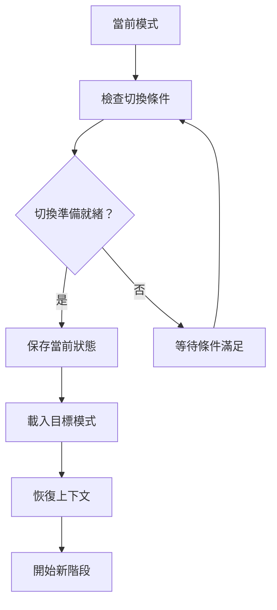
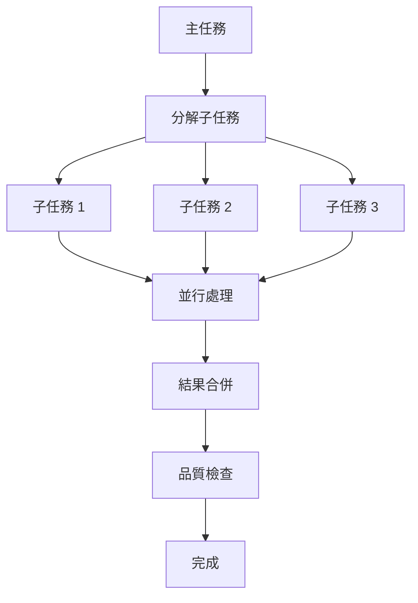
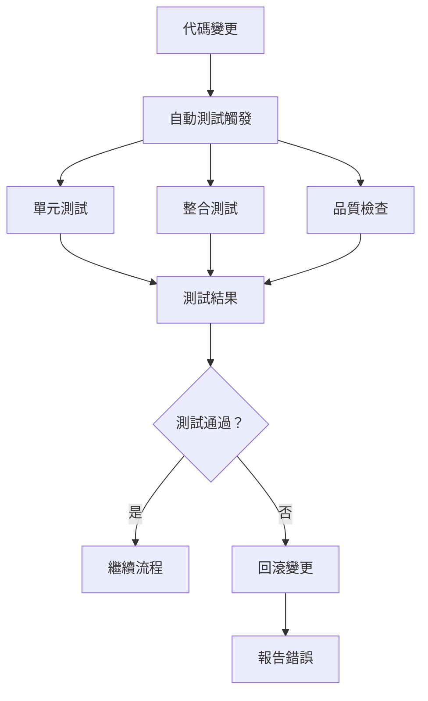
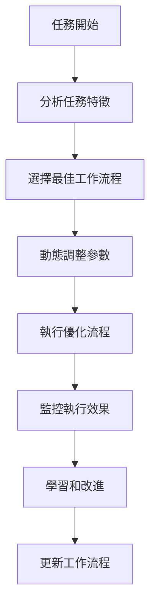

# Memory Bank System - 工作流程優化實施計劃

## 當前工作流程分析

您的 Memory Bank System 已經實現了完整的 6 階段工作流程：
1. **VAN** (🔍) - 初始化
2. **PLAN** (📋) - 任務規劃
3. **CREATIVE** (🎨) - 設計決策
4. **IMPLEMENT** (⚒️) - 代碼實施
5. **REFLECT** (🔍) - 審查反思
6. **ARCHIVE** (📁) - 歸檔文件

## 優化目標

### 1. 提升效率
- 減少模式切換時間
- 優化 token 使用
- 加速決策過程

### 2. 增強協作
- 支援並行處理
- 實現實時同步
- 改善團隊協作

### 3. 提高品質
- 加強品質控制
- 實現自動化測試
- 優化錯誤處理

## 具體優化方案

### 階段 1：基礎優化（第 1-2 週）

#### 1.1 模式切換優化


**實施步驟**：
1. 實現模式切換前的狀態檢查
2. 添加上下文快照功能
3. 建立模式切換日誌

#### 1.2 Token 使用優化
- 實現智能上下文壓縮
- 添加重複內容檢測
- 建立 token 使用監控

#### 1.3 決策過程加速
- 預載入常用決策模板
- 實現決策歷史快取
- 添加快速決策模式

### 階段 2：並行處理能力（第 3-4 週）

#### 2.1 並行模式支援


**實施步驟**：
1. 設計並行任務分解算法
2. 實現任務分配機制
3. 建立結果合併策略

#### 2.2 實時同步機制
- 實現模式間實時通信
- 建立狀態同步協議
- 添加衝突解決機制

### 階段 3：品質控制增強（第 5-6 週）

#### 3.1 自動化測試整合


**實施步驟**：
1. 整合現有測試框架
2. 實現自動化測試觸發
3. 建立測試結果分析

#### 3.2 錯誤處理優化
- 實現智能錯誤檢測
- 添加自動修復建議
- 建立錯誤追蹤系統

### 階段 4：高級功能（第 7-8 週）

#### 4.1 智能工作流程調整


**實施步驟**：
1. 建立任務特徵分析系統
2. 實現工作流程選擇算法
3. 添加動態參數調整

#### 4.2 團隊協作功能
- 實現多用戶支援
- 建立權限管理系統
- 添加協作工具整合

## 技術實現細節

### 1. 模式切換優化實現

```python
class ModeSwitcher:
    def __init__(self):
        self.current_mode = None
        self.context_snapshot = None
        
    def switch_mode(self, target_mode, context):
        # 保存當前狀態
        self.save_context_snapshot()
        
        # 檢查切換條件
        if not self.check_switch_conditions(target_mode):
            return False
            
        # 載入目標模式
        self.load_mode(target_mode)
        
        # 恢復上下文
        self.restore_context(context)
        
        return True
```

### 2. 並行處理實現

```python
import asyncio
from concurrent.futures import ThreadPoolExecutor

class ParallelProcessor:
    def __init__(self, max_workers=4):
        self.executor = ThreadPoolExecutor(max_workers=max_workers)
        
    async def process_parallel(self, tasks):
        # 創建並行任務
        futures = []
        for task in tasks:
            future = self.executor.submit(self.process_task, task)
            futures.append(future)
            
        # 等待所有任務完成
        results = await asyncio.gather(*futures)
        return results
```

### 3. 品質控制實現

```python
class QualityController:
    def __init__(self):
        self.test_suite = TestSuite()
        self.quality_metrics = QualityMetrics()
        
    def validate_changes(self, changes):
        # 運行測試
        test_results = self.test_suite.run_tests(changes)
        
        # 檢查品質指標
        quality_score = self.quality_metrics.calculate(changes)
        
        # 決定是否通過
        return test_results.passed and quality_score > 0.8
```

## 監控和指標

### 1. 性能指標
- **模式切換時間**：目標 < 2 秒
- **Token 使用效率**：目標減少 30%
- **決策時間**：目標減少 50%

### 2. 品質指標
- **測試通過率**：目標 > 95%
- **錯誤率**：目標 < 5%
- **用戶滿意度**：目標 > 4.5/5

### 3. 協作指標
- **並行處理效率**：目標提升 40%
- **同步延遲**：目標 < 1 秒
- **衝突解決時間**：目標 < 30 秒

## 風險評估和緩解

### 1. 技術風險
- **複雜度增加**：通過模組化設計緩解
- **性能影響**：通過優化算法緩解
- **相容性問題**：通過版本控制緩解

### 2. 實施風險
- **時間延遲**：通過分階段實施緩解
- **資源不足**：通過優先級排序緩解
- **用戶接受度**：通過漸進式推出緩解

## 成功標準

### 短期目標（1-2 個月）
- 完成基礎優化
- 實現並行處理
- 提升 20% 效率

### 中期目標（3-6 個月）
- 完成品質控制增強
- 實現高級功能
- 提升 40% 效率

### 長期目標（6-12 個月）
- 建立完整的智能工作流程
- 實現團隊協作功能
- 成為業界領先的 AI 輔助開發系統